# 말뚝기초의 적정 지지력 확보 방안말뚝기초 재하시험 결과활용사례를 중심으로  

# 1서론  

교량의기초는 상부구조물의 하중을 지반에 전달하는 하부구조로서 외부하중에 대해말뚝기초주변의지반 및지층과 상호작용으로 거동한다따라서 말뚝기초의 상부하중에 대한 안정성을 확보하기위해서는허용범위이상침하가발생하지않도록설계및시공되어야한다  

주제일엔지니어링종합건축사사무소 부사장  

말뚝기초 설계시에는지반조사를 통해지층특성을 정확히파악한후지지층의 적정여부를 검토하고시험말뚝에 대해재하시험을 실시하여 측정된 지지력을 설계에 반영하여야 한다대한토목학회2008 또한말뚝기초에 대한 설계및시공 시시험말뚝에 대한 재하시험을 실시할 경우 말뚝기초의안정성확보뿐만아니라공사비를 절감하여 경제적인효과를 얻을수있다정성기등1998본 사례에서는 단층파쇄대지층에서시험시공 말뚝을설치하고 재하시험을통한 선단지지력및하중전이시험 결과를 이용하여 산정한 심도별주면마찰력값으로 말뚝제원을조정시공한결과말뚝기초의안정성과경제성을확보할수있었다우재경 2013  

# 2 말뚝기초 설치  

# 21지반현황  

본사례구간 한강의 단층대인<그림1>의위치에 건설되는 교량말뚝기초를 설계하기 위해지반시추조사및 탄성파탐사를 하여교량설치구간전체의지층별 분포특성을 파악하였다  

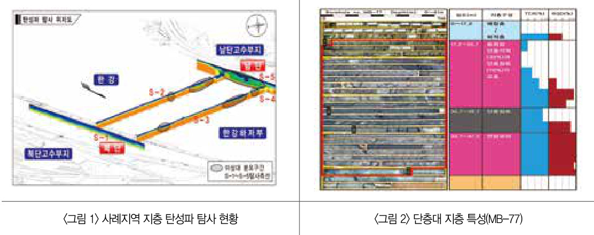  

지반조사및분석결과본지역지반은<그림2>에나타낸바와같이 $12\!\sim\!14\!\mathsf{m}$ 두께의퇴적층이최상부에분포하고있다그아래는 단층대로서 상부층은두께가 195m로 단층각력 $30\%$ 와 단층 점토 $70\%7$ 혼입된 지층이며 하부연속한단층대는 두께3m로단층점토 성분 $70\%\mathbb{Q}\}$ 단층각력성분 $30\%$ 정도가혼재하여 분포되어있으며그하부는파쇄상태의 연암층이 연속해분포되어있다<표1>은시추공에대한하부단층대의시추공전단시험결과로서단층의공학적특성인점착력이 $0.50{\sim}4.07\textsf{t o n}/\mathfrak{m}^{2}0\vert$ 고내부마찰각은 $0.60{\sim}32.17^{\circ}$ 인비교적취약한지층으로나타났다  

<표1>시추공전단시험 결과  

  

# 22시험시공말뚝 설치  

말뚝기초의극한지지력을확인하기 위해서는 설계시에현장의시험시공말뚝에 대해재하시험을시행하여 적용토록하였으나대부분이시공단계에서시행하고있다본사례에서도 시공단계에서지지력을확인하도록되어있어<그림3>의단층대지층에2개의현장타설시험말뚝에재하시험을시행하였다  

시험말뚝은직경이12m 길이는각각53m와 48m인2개의말뚝TP-1 TP-3을 설치하였다 말뚝기초의변위량측정을위해<그림4>와같이철근망에 철근변형률계및콘크리트응력계를 부착하여 현장타설말뚝기초를시공하였다  

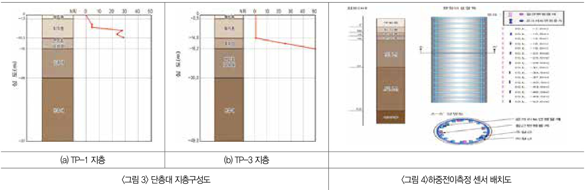  

# 3 말뚝재하시험 개요  

# 31 정재하시험 결과 허용지지력 분석  

재하시험은 ASTM D1143-811994규정에따라하중재하단계별로 시험최대하중까지재하하여극한지지력을 측정하고이를분석하여지지력을 산정하였다  

재하시험 결과는하중침하시간곡선을이용하여 해석하였으며 허용지지력은 시험말뚝에 대한시험최대하중에서극한하중에대응하는극한전침하량인 254mm를기준으로하고 극한잔류침하량 127mm인때의하중을 극한하중으로 하여 최대시험하중에대해안전율20을적용하여산정하였다  

말뚝기초에적용할 설계허용지지력과극한지지력을확인하기위해하중재하단계별 설계하중 설계하중의2배및 최대시험하중을재하하여 <표 2>의결과를얻었다  

<표2> 재하하중에 따른 말뚝머리 변위량측정결과  

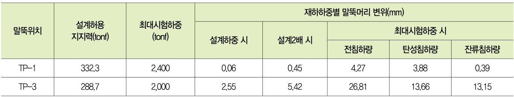  

<그림 $5\div$ 재하시험결과를하중-침하량관계 곡선으로나타낸것으로두개의말뚝재하시험결과1은전침하량이427mm로시험최대하중까지탄성거동을하며탄성침하량388mm를뻔잔류침하량은039 mm로극한하중에도달할수없었다따라서더은잔류침하량규정치인 $12.7\mathsf{m m}^{\mathsf{O}}\$ 때의시험최대하중2400on을항복하중으로하여안전율20을적용하면말뚝의허용지지력은1200on이다TP3은전침하량이2681 $\mathsf{m m}$ |고잔류침하량은 1315mm로써이에해당하는하중은1909on에서탄성거동을나타내므로안전율20을 적용하면허용지지력은954ton이다  

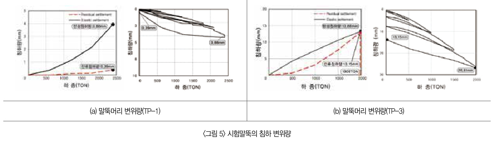  

# 32 하중전이 시험  

말뚝기초와주면흙사이에발생하는마찰력은응력변위-시간의특성말뚝흙시스템 내모든 요소의파괴 특성그리고말뚝 의설치방법 등 다양한요인에 의해 영향을 받으며 지층별 마찰응력은 아래식1과같이산정될수있다Vesic1977  

$$
\mathsf{f s i}=\varDelta\,\mathsf{Q s i}\;/\;\pi\,\mathsf{\Omega}\cdot\mathsf{D}\cdot\varDelta\,\mathsf{L i}
$$  

시험시공말뚝에T1은시험최대하중2400on T3은시험최대하중2000on까지재하단계별하중전이시험을하여각심도별로설치한변형률계에측정된 데이터로심도별평균주면마찰력산정결과를아래<그림6및<그림 7에도시하였다  

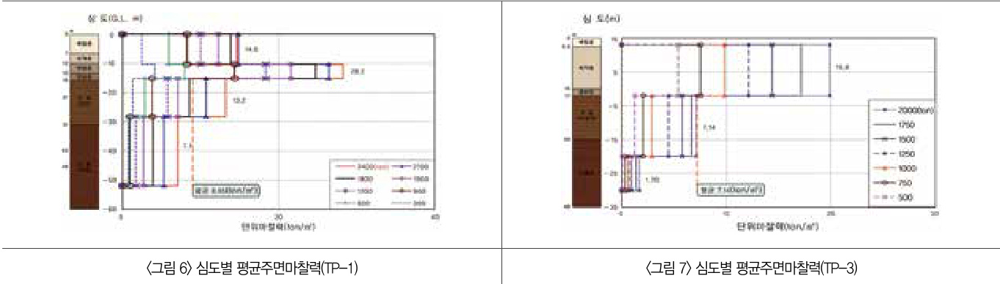  

하중전이시험 시단층 점토층까지전달된하중은 설계시말뚝 허용지지력 3323 ton의안전율3배에 해당하는 극한지지력 996tonf 이상이 발휘된 것으로 평가되었다 따라서 <표3> 및 <표 4>에서와 같이시험구간1의 퇴적층 평균주면마찰력은 262$\tan\uparrow/\mathsf{m}^{2}0$ 고 단층점토의평균주면마찰력은714\~865 tonf/m?으로산정되었다  

<표3> 재하시험 측정결과P1  
<표4>재하시험 측정결괘TP-3  

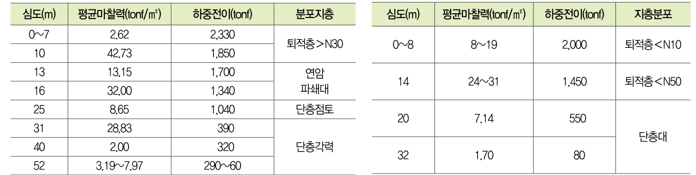  

# 33 하중전이시험 결과적용 주면마찰력  

시험구간인 단층대에서2개의시험말뚝에대해 측정한평균 단위주면마찰력과문헌에 나타난 타지역단층대지층에 대해측정한주면마찰력값은아래 $\langle\Xi\,5\rangle\Omega\vert$ 같다  

<표5> 유사지층 단위주면마찰력 남항대교 정창규 등2004   

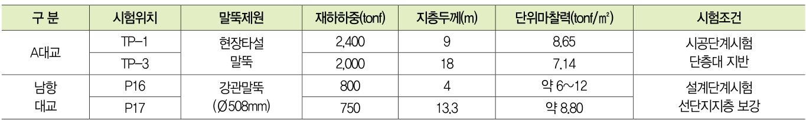  

단층점토의 주면마찰력은 설계시437tonf/m?로 적용하였으나재하시험결과지층별평균주면마찰력은 <표6>과 같이714tonf/ m?과865tonf/ m?로써 실제로 측정 결과값과는 많은차이가있어이를분석하여 적정한지지력값을 반영하여야필요가있다  

<표6> 설계시와재하시험결과 평균주면마찰력  

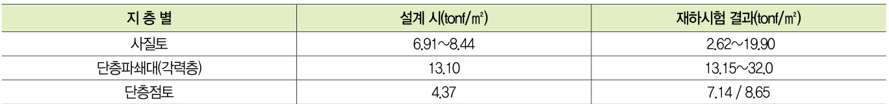  

# 4 재하시험 결과 적용지지력  

# 41 원 설계와재하시험 결과지지력분석  

본사례구간은 단층대지층에 현장타설말뚝기초가설치되나설계시시험말뚝에 대한재하시험을 수행하지 않고지반조사결과 지층특성에따른지지력을반영하여AASHTO1986 일본도로교시방서일본도로협회 2002및Hunt의문헌식에의해말뚝지지 력을산정하여설계하였다  

이를본공사시기초근접지점에시험시공말뚝을설치해하중전이 시험을 병행한재하시험결과를문헌식에 반영하여지지력을재산정한 결과Hunt식값이 가장보수적으로 나타났다 이를 재하시험 결과지지력과비교하여 적정성을 검토한후 말뚝제원을조정하여시공하고본말뚝에대해서도 검증재하시험을 실시하여안전성을 확인하고 그 결과를<표7>에나타내었다  

<표7> 당초설계와 재하시험결과지지력비교  

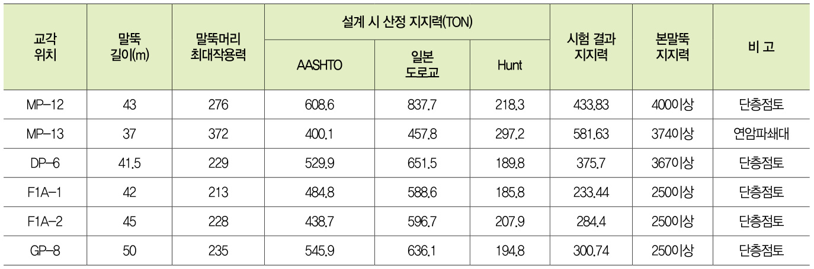  

# 42 대표교각MP-12지지력 적용사례  

<그림8>은 대표적인 교각M12에대해설계시말뚝기초지지력과재하시험결과를반영한지지력을 당초설계와비교하였다재하시험결과사질토층의주면 단위마찰력은 $2.62\mathrm{ton}/\mathrm{m}^{2}$ 단층대 주면단위마찰력은865ton/m로 산정된 값을반영하여말뚝제원을조정한 결과<표8>에서와같이 당초설계시적용한말뚝 1본길이 $54m>1$ 43m로조정되어MP12교각1개소에서말뚝길이를총231m감소시킬수있었다  

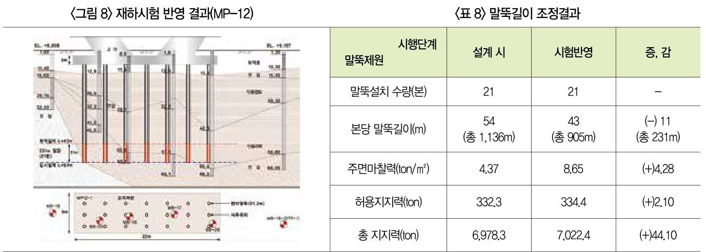  

# 43재하시험 결과말뚝기초의 안정성 및 경제성  

본 사례구간인 단층대지층에 시험말뚝을 설치하고 재하시험을 수행하여실측된 선단지지력 및심도별 주면단위마찰력 적용의적정성에대해토질분야기술자와 현장의공사관계자들이재하시험 결과및지반여건 등을 고려한적정값으로 말뚝제원을검토하여말뚝기초를시공한후재하시험을실시하여지지력을확인하였다  

이처럼재하시험을시행함으로써사전에지층별지지력및침하량을 정확하게파악할수있어서<그림 $\circledcirc$ 나타낸것과같이지지력이충분한기초는 말뚝길이를줄였고지지력이부족한곳은말뚝길이를 연장하여구조물의안정성을확보하였다 그 결과<그림10>에서와같이총29개의교각에서총681m의말뚝길이를줄일수있었다  

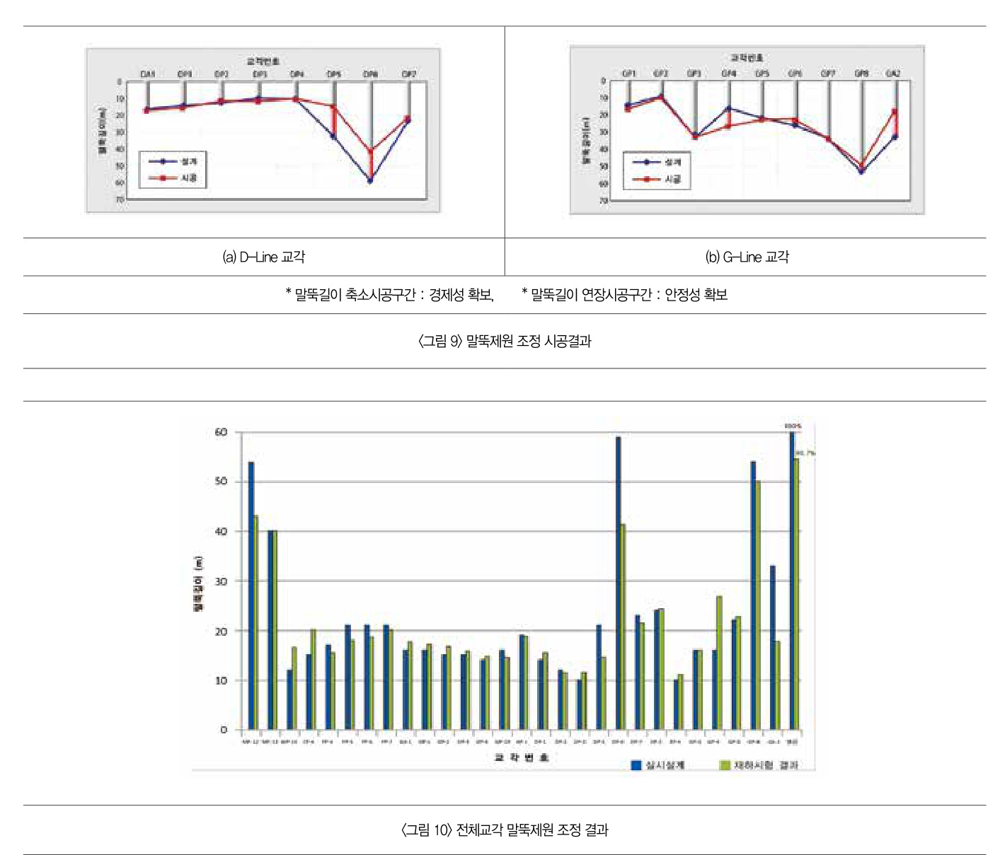  

# 5 결언  

한강의단층파쇄대가발달한지층에교량의말뚝기초시공을위해대구경현장타설시험시공말뚝을 설치하고 정재하시험을 실시하여극한지지력확인하였다또한하중전이시험을 병행하여말뚝의지층별 주면마찰력을 측정하고 설계시적용한문헌식값과재하시험 결과를기존의유사한단층대의주면마찰력을 참고하여 검토한적정값으로 말뚝제원을 변경하여 시공한결과말뚝기초의안정성과경제성을기할수있었다  

따라서 일정규모이상의공사시말뚝기초의설계시나시공초기에는시험시공말뚝을 설치하고 압축재하시험을 실시하여지형 특성에 맞는 축방향극한압축지지력으로 설계하고 시공후에는 재하시험 결과를반영하여 말뚝제원을 조정하여시공함이타당 하다카셈  

\*외부 필진의글은 본지 편집방향과 방향과다를 수도 있습니다  