# 연약지반개량기술 과제에 관한PM 개발  

2001. 10.  

한국건설기술연구원  

수 행 기 관 : 한국건설기술연구원, 한국발명진흥회  
연구책임자 정하익  
참여연구원 선임연구원 이용수  
참여연구원 연구원 유준  
참여연구원 연구원 조진우  
참여연구원 연구원 권용완  
참여연구원 연구원 오인규  
참여연구원 연구원 진현식  
참여연구원 연구원 김우성  

# 제1 장 Patent Map 의 구성 및 개요  

# 제1 절 기술의 개요  

# 1.1-1 특허분석의 필요성  

도로, 철도, 교량, 하천제방, 공항, 지하구조물, 발전소, 스타디움, 오피스빌딩 등 대부분의 다양한구조물은 지상 또는 지하에 건설된다. 이와 같은 구조물의 기능에 따라 설계목적이 달라지고완공 후 구조물의 기능이 만족하도록 계획, 설계, 시공되어야 하며 또한, 소요 기간동안 그기능을 계속 유지할 필요가 있다.  

구조물을 지탱하는 지반이 수십미터까지 변형되더라도 구조물의 기능에 영향을 미치지 않는경우가 있는가 하면 구조물 내부에 설치되는 기계장비가 수 μm 의 변형조차 허용하지 않는경우도 있다. 이처럼 구조물이 소정의 기능을 발휘하기 위해 구조물마다 지반에 대한 각각 서로다른 설계 및 시공 요구사항이 있고, 통상 이러한 요구사항은 안정과 관련된 안전율과 구조물과지반의 접점인 기초의 단기ㆍ장기적 허용 변위량과 부등침하의 허용치라는 형태로 나타난다.중요 구조물은 지반과 구조물의 정적ㆍ동적 상호작용을 바탕으로 특별 시방서에 부여되는 경우도있다.  

연약지반 개량기술은 설계에서 요구하는 구조물의 기능이 안전하면서 경제적으로 건설하기 위해실시하는 것이다. 연약지반 개량기술은 지반 조성과 구조물 건설 전에 실시하는 경우가 많지만재해 후 복구와 이미 존재하는 구조물의 기능 유지와 향상, 장기간을 거친 역사적 구조물의 보전등을 위해 실시하는 경우도 적지 않다.  

연약지반 개량기술은 개량 기술의 특성이 있듯이 여러 가지 관점 즉, 적용토질에 따라 개량기술선정에 영향을 미친다. 연약지반 개량의 필요성과 목적이 명확해졌다 하더라도 연약지반 대책에따라  문제화 될  수 있다. 또한, 시공 능력(가능한 심도, 시공규모), 현장의 - 시공한계,재료ㆍ기계ㆍ동력ㆍ필요한 인력, 시공의 확실성, 시공상 문제점이 발생했을 때의설계변경(시공계획의 변경)시 난이도 등도 문제가 된다.  

이와 같이 연약지반 개량기술은 연약한 지반상에 구조물을 설치할 때는 필수적으로 적용되어야하는 것이며 구조물의 안정성을 확보하는 측면에서 이의 기술적 역할은 매우 중요하다. 따라서연약지반 개량기술의 기술적 노하우의 보유여부에 따라 예산절감, 공기단축, 인력절감 등에차이를 가지게 된다. 이와 같은 기술적 노하우는 특허와 같은 유형 및 무형의 기술력 보유에따라 결정된다. 따라서 특허를 통한 기술력의 향상이 매우 중요하며 PM 사업을 통한 특허의보급확대 및 기술이전은 국내 건설산업의 기술적 측면에서 큰 역할을 하게 된다.  

그러나 우리 나라의 경우 건설분야에서의 Patent Map 작성현황은 2000 년도에 수행하였던 장스팬기술이 처음이며 국내의 GNP 에서 차지하는 건설분야의 역할이 매우 큰 것으로 판단할 때Patent Map 작성이 매우 미흡한 실정이다.  

PM 사업은 21 세기 지식기반사회의 고부가가치 창출의 원천인 국ㆍ내외 특허기술정보의작성ㆍ정리를 통해 대형, 중소 및 벤처 건설업체의 대외경쟁력을 제고함은 물론 기업의지적재산권 보유확대 도모 및 창출역량을 제고하게 된다. 따라서 산업발전적 측면에서 PatentMap 작성은 매우 중요한 의미를 가지게 되며 건설산업 및 관련분야의 발전에 큰 역할을 할것으로 기대된다.  

따라서 본 연구에서는 연약지반 개량기술에 관한 자료들을 체계적이고 종합적으로 정리하는동시에 일반국민은 물론 건설분야의 전문가에 있어서도 접근하기 어려웠던 연약지반 개량기술과관련된 특허자료들을 분석, 소개하고자 하였다.  

# 1.1-2 특허분석의 목적  

본 과제에서는 건설기술 중에서 연약지반 개량기술의 기술수준을 정확히 파악하여 전략적으로개발해야 할 기술을 적기에 발굴해 산업계로 보급, 확산시키기 위해, 우리 나라 연약지반개량기술의 기술발전을 위한 방향과 좌표를 설정하고 이를 종합적, 체계적으로 분석하였다.  

연약지반 개량기술의 특허분석에서 우선 정량적인 분석방법을 통하여 가장 기술력이 앞서 있는기업, 우리 나라 기술수준과의 비교ㆍ분석, 세부기술에 대한 요소기술 및 관심기술의 출원국가,출원인 동향을 파악하여 해당 기술분야의 기술발전동향 및 세부기술의 핵심세력을 파악하고자하였다.  

그리고 정성분석을 통해서는 각 세부기술의 권리내용, 권리를 확보한 기업, 핵심기술의 흐름,향후의 기술전망 등을 분석하였다. 특히 양적인 기술발전보다 질적인 기술발전의 전제하에핵심기술, 향후 발전 가능성이 있는 기술을 찾아내고, 핵심기술에 대한 기술적 흐름을 전망하였다.  

전체적으로 본 특허분석을 통해서 다음의 사실을 분석하고자 하였다.  

기술개발 트렌드 파악연도별 출원동향상위 출원인  

각 기술별로 가장 활발하게 출원하고 있는 국가각 기술별 세부기술의 개발동향국가별 기술개발 트렌드 파악국가별 연도별 출원의 분포국가별 상위 출원인각 국가에 대한 출원국별 분포국가별 기술별 세부기술의 개발동향  

# 제2 절 연약지반 개량기술 개요  

# 1.2-1 연약지반의 정의  

일반적으로 연악지반이라 함은 충적평야, 소택지, 산간의 곡부 등에 퇴적한 충적층의 연약한자연지반 혹은 매립, 성토 등의 연약한 인공지반이다. 이들 지반은 지질적인 연대에서 보면 아주최근에 형성된 것이며, 따라서 지질적 변동이나 상재하중, 지진 등에 의한 물리적 작용 혹은토립자간의 화학적 작용을 거의 받은 이력이 없는 부드러운 점토, 실트, 유기질토 혹은 느슨한사질토 등의 지층으로 되어 있다.  

그러나 이와 같은 연약토로 구성된 지반이라 하더라도 이 지반 위에 건설되는 구조물이나 그규모에 따라서는 연약지반이라고 취급하지 않는 경우가 있다. 예를 들면 지반 위에 성토할 경우,성토의 높이가 낮고 지반의 강도에 비하여 재하중이 작을 때에는 지반이 다소 연약하더라도과대한 침하나 변형은 발생하지 않는다. 그러나 성토높이가 어느 정도 커지고 재하중이압밀항복응력을 넘으면 지반의 압밀량이 급격하게 증가하여 장기에 걸친 침하가 발생한다.더욱이 성토높이가 현저하게 높아져 하중이 증가하여 지반의 전단강도를 넘으면 지반이 견고한것이라도 지반에 파괴가 생긴다.  

이와 같이 연약지반은 고유의 지반을 가르키는 것이 아니고, 그 판단은 그 지반에 구조물 등을건설할 때에 생기는 문제의 크기, 지반과 구조물의 상대적인 관계에 의해서 정의되고 있다.따라서 연약지반은 구조물을 건설하는 데에 있어서 무엇인가의 개량공법 혹은 대책공법을 실시할필요가 있는 지반이라고 정의되며, [표 1.2-1-1]은 각종 구조물의 종류마다 연약지반의 판정기준의지표를 나타낸 것이다.  

[표 1.2-1-1] 개략적인 연약지반의 판정기준  

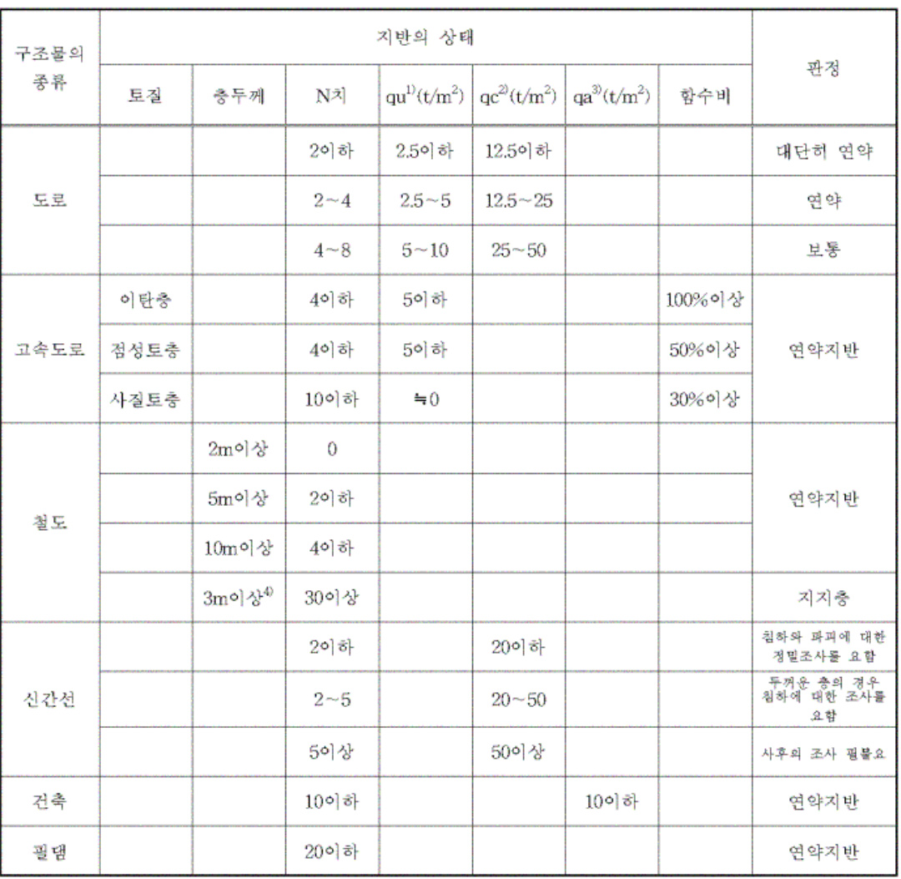  
일축압축장도콘지지력장기허움지내력4} 충밑에 연약지반이 없는정우  

# 1.2-2 연약지반의 문제점  

연약지반에 있어서 토질공학적인 문제점에는 다음과 같은 것이 있다.  

안정문제 : 사면이나 성토의 안정, 기초의 지지력, 옹벽의 토압, 말뚝의 횡저항 등 흙의 강도가약하기 때문에 발생하는 여러 가지 문제점  

침하문제 압밀침하, 말뚝의 부마찰력 등 흙의 압축성이 크기 때문에 생기 는 문제점액상화문제 지진시의 액상화, 철도나 도로의 분니(噴泥) 등 동적인 문제점투수성문제 퀵샌드(Quick sand) 현상이나 파이핑(Piping) 현상 등 투수성에 대한 문제점  

가. 안정문제  

연약지반에서 가장 문제가 되는 것은 흙의 강도가 약하기 때문에 발생하는 안정문제이다.일반적으로 설계에는 안전율(Fs)을 1.2 ∼1.3 으로 적용하는 경우가 많다. 안전율이 그 이하가되면 활동파괴를 일으키지 않더라도 파괴에 가까운 변형, 즉 측방유동과 즉시침하 등 전단에의한 변형이 크게 되어 구조물의 기능이 손상될 수 있다. 원형활동에 의한 파괴 예는 과거일일이 열거할 수 없을 정도로 많고 현재에도 조사, 설계 및 시공의 부주의로 자주 일어나고있다.  

성토와 반대로 지반을 굴착하는 경우와 절토사면에서도 활동에 대한 안정이 문제가 되며 성토와같이 원형활동에서 안전율이 검토된다. 또한 기초의 지지력도 안정문제의 일부이다. 일정한지반에 일정한 하중이 주어진 경우에는 조건이 비교적 단순하기 때문에 원형활동과 같이시행착오를 거듭할 필요가 없고 이론적으로 활동면이 정해져 있기 때문에 안전율 또는상재하중의 크기가 정해져 있다. 또한 옹벽과 저판벽에 주는 토압도 안정문제의 일부분이다.  

# 나. 침하문제  

연약지반에서 안정문제 다음으로 중요한 문제점은 압밀침하이다. 충적점토의 함수비는 $100\%$전후이며, 이는 흙의 실질부분과 거의 같은 질량의 수분이 흙 속에 함유하고 있는 것을 의미한다.여기에 상재하중이 주어지면 수분이 서서히 배수되어 체적이 감소하기 때문에 침하가 발생된다.점토층 지반은 투수계수가 매우 작기 때문에 배수하는데 오랜 시간이 걸린다. 따라서 침하에수십년 이상이 걸리는 경우도 있다.  

또한 압밀침하는 상재하중뿐만 아니라 지하수위에 의해서도 일어난다. 이 경우에는 침하의범위가 크기 때문에 지반침하라 부르며 피해의 정도와 범위도 심각하다. 한편 압밀침하는 장소에따라 균등하지 않는 부등침하를 일으키는 경우가 많으며 구조물에서의 피해는 균등침하보다부등침하가 더 심각하기 때문에 주의를 요한다. 또한 침하에는 압밀침하 뿐만 아니라 지반의전단변형에 의한 침하도 발생한다. 말뚝이나 케이슨이 지지층에 타입되어 있고 상부의연약점토층이 압밀침하를 일으키면 말뚝주변의 점토가 말뚝의 아래로 - 끌어당기는부마찰력(Negative Friction)이 작용한다. 부마찰력은 말뚝이 받는 상재하중보다 때로는 클 수도있으며 이로 인해 말뚝이 절단되거나 휨으로써 상부구조물이 파괴되는 원인이 된다.  

# 다. 액상화문제  

느슨한 사질토지반은 본래 조직구조가 불안정하고 전단이나 충격을 받으면 체적이 감소되고안정된 구조로 되려고 하는 성질을 갖는다. 이때 사질토가 포화함으로서 과잉간극수압이상승하여 토피압과 같아지는 경우에는 입자간 응력은 결국 유효응력이 0 이 되어 전체적으로액체상태가 된다.  

이와 같이 액상화가 일어나면 매설관과 같은 가벼운 구조물은 떠오르게 되며 모래 이수(泥水)의비중보다 무거운 구조물은 차츰 침하되어 간다. 액상화가 발생하여 간극수압이 상승하면유효응력이 감소하고 사질토의 강도도 작아져서 안정문제가 일어난다. 모래지반의 경우도 불포화상태에서는 간극수압이 작기 때문에 액상화가 일어나지 않지만 체적의 감소로 인한 침하가일어나게 된다. 파괴된 사질토지반의 경우에도 압력이 상승하면 간극수가 유출되어 압밀이 끝난상태에서는 원지반보다 침하된다.  

액상화는 침하문제를 포함하고 있으며 액상화와 유사한 현상으로 도로나 철도의분니현상(噴泥現象)이 있다. 이 경우에도 차량의 동적하중에 의해서 간극수압이 상승함으로원리적인 면에서는 유사하다. 분니(噴泥)후에는 주변지반이 침하되어 포장이나 레일에 피해를 줄우려가 있다.  

# 라. 투수성문제  

느슨한 사질토지반의 문제점은 액상화 뿐만 아니라 댐 하류부와 같이 침투수압이 큰 장소에서는양수압에 의한 퀵샌드 현상으로 인한 보일링 또는 파이핑 현상이 발생하여 댐 등의 파괴로이어진다. 퀵샌드 현상의 원리는 액상화에 있어서 과잉간극수압이 침투수압으로 바뀌면서발생하며 원리와 현상은 액상화와 유사하다.  

마. 연약지반을 대상으로 한 공사에서 발생하는 문제연약지반상에서 건설공사를 하면 여러가지 장애가 발생한다. 연약지반상에서의 건설공사에는도로나 제방, 댐, 건축, 터널 등의 각종의 공사가 있지만 이들의 공사는 [그림 1.2-2-1]과 같이성토나 구조물의 건축과 같이 지반에 하중을 재하하는 공사와 개착이나 터널굴착삭 등 하중을제거하는 공사로 대별된다.  

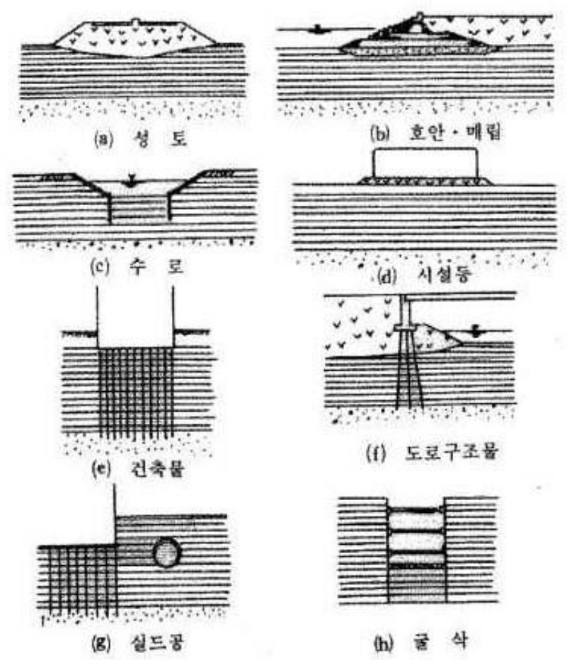  
[그림 1.2-2-1] 연약지반상에서의 공사  

[표 1.2-2-1]는 연약지반상에서 하중을 재하했을 때와 제거했을 때에 생기는 안정과 침하의중요한 문제점을 정리한 것이다.  

[표 1.2-2-1] 연약지반상에서의 재하시와 제거시의 주요한 문제점연약지반에서는 위에서 분류한 문제 이외에도 시공 중 혹은 시공 후에 다음과 같은 문제가발생하는 수가 있다.  

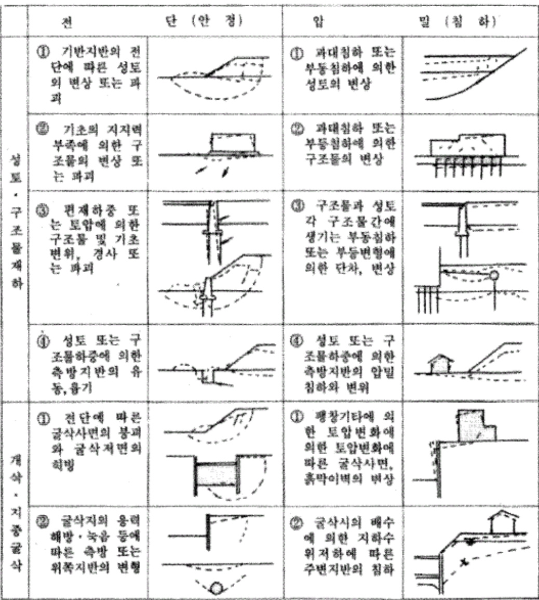  

구조물 및 기초에 가해지는 부마찰력에 의한 구조물의 변위 및 침하침식, 세굴, 침투수압의 증가 등에 따른 사면의 변위와 파괴퀵샌드, 파이핑 등에 의한 사면 및 구조물의 변형과 파괴광역지반침하의 영항에 의한 구조물의 변위 및 파괴교통하중, 진동하중에 의한 지반의 변위와 주변구조물의 진동피해나 손상지하수위의 저하, 수량, 수질의 변화에 의한 주변환경에의 영향주행성의 부족에 의한 시공기계의 주행불량이나 기계의 전도지진에 따른 지반 전단강도의 저하에 의한 구조물이나 지반의 파괴  

# 1.2-3 연약지반대책의 기본  

연약지반에서 공사를 실시하면 1.2-2 절에서 기술한 바와 같은 여러 가지 문제가 발생한다. 이와같은 문제를 해결하기 위한 방책이 연약지반대책이다. 이 연약지반대책의 가장 간단한 방법은구조물의 건설위치를 변경하여 연약지반을 피하는 것이다. 그러나 현실적 방법으로서 이것을피하는 것은 어렵기 때문에 지반조건이나 건설하는 구조물의 조건을 개선해서 적절한 대책 즉,연약지반대책공을 실시할 필요가 생긴다.  

그러나 연약지반 공사에서 발생하는 문제는 구조물의 규모나 형상, 지반조건에따라 다르고이것을 완전히 해결하는 데는 보통 고액의 비용과 장기에 걸친 시간을 두고 대책을 강구할필요가 있다. 이 때문에 구체적 대책을 강구할 경우에는 연약지반 공사에서의 문제점의 발생량을어느 정도까지 적게 하면 시공상 및 구조물의 사용상 허용되느냐를 검토하고 그 범위내에서문제점이 해결되도록 대책을 실시한다. 이 문제점의 허용범위, 허용량은 구조물의 사용목적이나중요성, 공사기간, 환경조건, 공사의 예산 등의 공사의 조건과 지반의 조건에 의해서 달라진다. 이때문에 공기ㆍ공비, 시공중ㆍ시공후의 조건 등 주어진 조건 중에서 그 범위를 검토하고, 대책공을선정하여 실시하게 된다.  

구체적인 대책공의 선정이나 연약지반의 공사계획은 주어진 조건, 즉 지반의 조건(지형의 지질,지반의 구성, 지하수 상태나 흙의 물리화학적인 성상 등)이나 구축하는 구조물의 조건(형식이나규모, 중요성이나 목적 등), 설계조건(안전율이나 침하에 대한 허용량 등)의 정확하고 상세한 파악,대책공의 필요성이나 대책을 실시할 때의 목적, 예상되는 효과, 경제성, 실시상의 과제 등의 정리,목적에 적합한 경제적인 대책공법의 선정과 같은 내용을 검토한다. 이 때 검토는 개략설계,예비설계, 상세설계의 순으로 순차조사ㆍ해석ㆍ설계의 정밀도 및 정밀도를 높이면서 검토에누설이 없도록 해야 하며 또 최적인 대책공을 선정할 수 있도록 종합적으로 실시할 필요가 있다.연약지반이 시공이나 시공 후에 문제가 되는 것은 지반이 건설하는 구조물 등에 의한 하중에비해 전단강도가 작고, 보통의 지반에 비하여 하중에 대한 체적압축량이 크며, 지반진동에 의해서간극수압의 상승이 현저하고 그 때문에 지반의 내력이 현저하게 저하하는데 있다. 따라서연약지반의 대책에는 이들의 발생을 억제하는 것을 목적으로 크게 다음의 3 가지로 분류될 수있다.  

# 전단특성의 개선  

지반의 전단파괴나 측방유동 등의 전단변형은 흙의 전단강도와 전단하중의 관계에 의존하고 있다.따라서 이들의 파괴나 변형은 흙의 전단강도를 증가하던가, 작용하는 하중자체의 경감 혹은하중의 균등화에 대한 전단하중의 저감에 의해서 방지된다.  

압축특성의 개선  

연약지반대책 과제의 하나에 압축침하의 방지가 있다. 이것은 흙자체의 체적변화인 압밀변형과앞서 기술한 형상의 변화인 전단변형에 의해서 생긴다. 이 압밀변형에 의한 침하는 지반에작용하는 하중을 경감하던가, 압밀의 촉진을 꾀하여 지반의 압축량을 경감함으로써 시공시나시공 후의 침하량을 감소할 수 있다. 개착공사의 히빙이나 보링, 침하 등은 지반중의 지하수의이동에 의해서 생기고 있다. 따라서 이들은 지반의 불투수화나 수압이 경감에 의해서 방지된다.  

동적특성의 개선  

지진시의 액상화나 교통진동의 방지를 꾀하기 위해서는 지반의 밀도나 전단강도의 증가에 의해서내진성의 향상을 꾀할 필요가 있다.  

이상과 같은 연약지반대책공법에 대해서 지반개량공법은 구조물의 건설에 있어서 시공과정 혹은완성 후에 있어서 발생하는 유해한 물리적ㆍ화학적으로 지반의 거동을 사전에 제거 혹은경감시키기 위한 공법이다. 이러한 공법들의 상세사항은 뒤에서 언급하고 있지만 탈수에 의한밀도증가에 의한 방법(드레인공법, 지하수저하공법, 진공압밀), 다짐에 의한 밀도의증가방법(콤팩션공법, 동압밀공법 등), 화학적인 고결에 의한 방법(혼합처리공법, 주입공법,고압분사공법 등)으로 대별되고, 다른 연약지반 대책공법과의 조합에 의해서 보다 효과가두드러지는 수도 많다.  

# 1.2-4 연약지반대책의 역사  

지반의 상태가 좋지 못한 경우에 지반을 개량하는 것은 인류의 역사에 기록이 남아 있지 않을정도로 아주 오래 전 시대부터 이루어져 왔다. 예를 들어 늪지대에서는 길이가 긴 봉을 여러 개세워 그 위에 집을 지었는데, 이와 같은 지혜는 현재까지도 통용되는 뛰어난 대처법이다. 또한연약한 지반 위에 도로를 만들 때 활석을 깔고 석탄 등으로 굳히는 기술은 기원전 3000 년이나되는 신석기 시대에 이미 사용되었다고 한다.  

로마 시대에 접어들어 이와 같은 도로 건설기술은 대단히 진보되었다. "모든 길은 로마로통한다"라고 일컬어지는 무수히 많은 도로 중에서도 가장 유명한 것은 로마시 교외의"아피아"가도 이다. 이 도로의 구조는 5 층 구조로 된 노상, 노반의 축조방법은 현재의 포장과비교하여도 전혀 뒤지지 않을 정도로 튼튼한 구조를 이루고 있다. 넓은 영토를 지배하기 위하여이와 같은 도로가 로마 부근뿐만 아니라 현재의 영국, 스페인, 이집트 등에까지 건설되어 그 총연장은 85,000km 나 되었다고 한다. 당시의 도로포장은 지반이 나쁜 곳에서는 1m 이상 되는곳까지 굴착하여 석탄 등으로 혼합하여 다져서 건설하였다고 한다. 영국에서는 지금도 옛날도로를 확장하고자 할 때에 가끔씩 오래 전 시대의 지반개량 흔적을 발견한다고 한다.  

돌이나 흙 속에 섞어서 결합성을 향상시키기 위한 재료에는 여러 가지가 이용되어져 왔다. 아주오래 전 유럽에서는 점토와 석고를 섞어 만든 재료를 자갈이나 쇄석 사이에 채워서 굳힌 것이주체였다. 그 후 석탄이 많이 사용되어져왔으며, 또한 현재 포졸란이라고 일컬어지는 것과 성질이동일한 화산재가 발견되기도 하였다. 이 화산재와 석탄을 적당한 비율로 혼합하여 물로 반죽하면아주 단단하게 굳어진다는 사실을 알게 되어 - 급속하게 이용하게 되었다. 한편,메소포타미아에서는 기원전 3,500 년 정도부터 역청재가 벽돌의 결합재로서 도로 등에사용되어졌다고 하며, 이것이 고대 인도 등에 전하여져 벽돌포장의 결합재로서 사용되어져 왔다.로마 시대의 토목기술 중에서 후세에 막대한 영향을 미친 가장 우수한 기술 중의 하나는항만축조 기술이다. 그들은 지중해에서 주로 해운에 의존하여 그 영향력을 키워 나갔는데, 그러기위해 건설한 많은 항구의 석조구조물은 건조된 상태에서 시공되었음이 판명되어 있다. 즉, 그당시부터 바다 속에서 가설구조물을 설치하여 완전히 차수시킨 다음 내부의 물을 양수하는기술을 가지고 있었던 것이다. 프랑스의 남부 등에 남아있는 오래된 교량의 교각도 동일한방법으로 축조된 것이 있는데, 그것들은 시대적으로는 훨씬 뒤인 르네상스 이후의 것이다.  

중국도 오래된 문화를 자랑하는 나라이며 만리장성을 시작으로 하여 위대한 토목사업을 많이수행하였다. 내륙의 운송수단으로 장대한 인공수로를 축조하였다고 하는데, 그 사실은 그다지알려지지 않았다. 그러나 그것은 유럽에서 축조한 것보다 훨씬 역사가 깊으며, 그것을 건설하기위하여 사용된 흙의 개량기술-석회를 이용하여 돌과 돌을 결합시킨 기술, 제방의 다짐기술 등-은대단히 앞서 있었던 것 같다.  

그 후 중세에 접어들면서 유럽에서는 많은 성과 사원이 건설되어졌다. 그러나 그 이전 시대와는달리 평지나 해안의 도시 중심부에 만들어지는 것이 일반적이었다. 이 때문에 홍적층의 연약지반위에 대단히 무거운 석조 구조물이 건설되어지게 되었다. 이들 구조물의 기초에는 그 당시학자들의 많은 재치가 담겨져 있으나 침하되거나 경사져 있는 것이 많다. 그 대표적인 예가이름도 유명한 "피사의 사탑"이다.  

일반적으로 석조 구조물은 중량이 크고, 높은 탑의 경우는 단위면적당의 하중으로 생각하면현대의 고층구조물에 필적할 수 있을 정도이다. 어찌되었던 연약지반 위에 그러한 구조물을 세울수 있었다는 것은 대단한 기술임에는 틀림없다. 그러나 지지력이 서로 다른 지역에 걸쳐서축조하려고 하였기 때문에 서서히 경사지게 되었던 것이다. 또한 이 탑을 건설하기 위해 몇 대에걸친 왕이 200 년이라는 세월을 소비하였다. 그리고 이 탑이 건설되던 중에 기울어진다는 사실을알고 공사를 일단 중지하였으며, 다시 공사를 재개하였을 때는 경사진 탑 위에 연직되게다음층을 올리는 작업을 몇 번이나 반복하였기 때문에 이 사탑은 직선적으로 경사져 있는 것이아니라 부드럽게 휘어진 모양으로 경사져 있는 것이다. 이 탑 각 층의 건설연대와 탑의 휨이나경사를 측정하여 이 탑의 양측이 어떠한 시간적 경과를 거쳐서 침하하였는 가에 대한 계산이수행되어져 있다. 근대 토질역학의 시조인 Terzaghi 가 그의 압밀이론을 이용하여 이 탑의침하경과를 계산하여 위의 추정치와 거의 일치함을 보인 것은 유명한 이야기이며, 이것을 계기로그의 압밀이론이 일약 세계적으로 인정받게 되었던 것이다.  

피사의 사탑은 다행인지 불행인지 경사졌기 때문에 200 년이라는 많은 시간에 걸쳐 건설되어졌으나, 만약 경사지지 않은 채 계속적으로 건설되어졌다면 아마 도중에서 붕괴되고 말았을것이다. 그것은 연약지반의 지지력이 그와 같은 과대한 하중을 견딜 수 없기 때문이다. 그러나탑의 이상침하가 거의 정지할 때까지 기다린 후, 다음 층을 올리는 작업을 반복하였기 때문에 그사이의 지반 압밀로 인하여 다음 하중에 견딜 수 있는 지지력의 증가를 초래할 수 있었던 것이다.즉, 현재 완속시공이라고 하는 지반개량공법이 이미 사용되어졌던 것이다.  

# 가. 기계적인 안정처리  

연약지반을 개량하는 방법으로는 몇 가지 방법을 생각할 수 있는데, 그 중에서도 첫 번째로거론되는 것은 기계적인 안정처리공법이라고 불리어지는 것이다. 이것은 주로 사질토에 적용되는것이다. 앞장에서 기술한 바와 같이 모래가 불안정한 상태에 놓여 있으면 지진시에 유동화되기쉬운데, 이는 두 가지 요인에 의한 것으로 생각되어진다. 하나는 입도배합이 나쁜 경우이다.이것은 쉽게 말하면 균등한 입경의 입자만으로 구성된 모래는 느슨한 상태에서 대단히 큰간극률을 가지게 되는데, 만약 그 간극 사이에 작은 입경의 흙을 채우게 되면 훨씬 밀도가높아져서 잘 다져진 흙이 되는 것이다. 즉 흙 중에 포함된 입자의 입경이 큰 것에서부터 작은것까지 넓은 범위로 분포되어 있다면 그 흙은 재료로서 좋은 입도배합을 이루고 있으며 안정한지반이 될 수 있는 것이다.  

또 하나는 동일한 모래라도 다짐의 정도에 따라 지진시의 안정성이 전혀 달라진다는 것이다.한계간극비는 흙이 잘 다져져 있는가를 나타내는 기준이 되는 값인데, 이 상태보다도 잘 다져져있는 모래는 지진시라도 유동화되기 어렵다고 한다.  

이러한 두 가지 요인에 관한 지반개량은 어느 정도 기계적으로 처리할 수 있는 성질의 것이다.구체적으로 전자에 대해서는 입도가 다른 흙을 잘 섞어서 처리하는 방법을 취하고 후자의경우에는 진동이나 충격을 가하여 다지는 방법을 취하면 된다. 이와 같은 개량법은 대단히역사가 깊고, 고대의 도로 축조 등에 이용되었다.  

오래 전부터 이용되어 온 다짐방법은 이외에도 여러 가지가 있다. 느슨한 지반위를 소나 양 등의가축을 걷게 하여 지반을 다지면 표면에서 약간 깊은 부분까지 다져진다는 경험으로부터 다짐용롤러를 만들어 오래 전부터 제방이나 도로의 다짐에 사용했었다.  

지금까지 언급한 고대시대의 다짐방법으로 다질 수 있는 심도는 지표면에서 수십 cm 에 불과하다.그러나 자연지반 중에는 수 십 m 까지 느슨한 사질토가 퇴적되어 있는 장소도 많다. 이와 같은장소에서 그대로 건물 등을 세우면 지진시에 큰 피해를 입게 된다.  

느슨한 모래지반을 깊은 곳까지 다지는 방법으로서 최초에 제안되어진 것은 다짐말뚝이라는공법이다. 이것은 콘크리트 등으로 만든 단면적이 큰 말뚝을 적당한 간격으로 타설하는 방법이며,유럽에서는 19 세기 말경부터 실용화되었다. 이와 같이 하면 말뚝 자체의 지지력도 기대할 수있으며 주위 지반이 진동과 압입력에 의해 잘 다져져 안정한 지반이 되는 것이다.  

그러나 이와 같이 하면 말뚝을 타설해서 지반 중에 묻어 버리므로 비경제적이며,다짐방법으로서도 효율적이지 못하므로 현재에는 이를 대신하는 방법이 고안되어져 이용되고있다. 그 중에 하나가 바이브로플로테이션 공법이다. 이것은 1930 년대에 서독에서 개발되어져 그후 미국에서 많이 사용된 공법이다. 바이브로플로트라고 불리어지는 말뚝상의 진동물체를지반중에 관입시켜 지반의 깊은 곳까지 다지기 위한 공법이다. 바이브로플로트라고 하는 것은직경 50cm, 길이 10m 전후의 중공말뚝상의 강관 내부에 편심 회전하중이 연직축에 설치된것이다.  

이 말뚝의 선단에 설치된 노즐로부터 고압의 물을 분사시키면서 지중에 관입시키고, 소정의심도에 도달하면 편심하중으로 진동시켜 주위 지반에 압력을 가하여 공동을 넓힌다. 이렇게 하여만들어진 공동 내부에 모래나 자갈 등을 투입하여 다시 진동으로 다지는 공법이다.  

이것과 동일한 목적의 개량공법으로서 많이 사용되어지는 공법이 또 하나 있다. 그것은샌드콤팩션파일이라는 공법으로, 1950 년 중반에 일본에서 개발되어진 공법이다. 이것은 모래기둥을 지반중에 타설하여 그것을 잘 다짐으로 인하여 지반의 지지력을 향상시키는 공법이다.이것도 말뚝상의 강관을 이용하지만 바이브로플로트의 경우와 다른 점은 선단이 개방된 파이프를사용한다는 것이다. 이 강관 내부에 모래를 넣고 진동말뚝항타기를 이용하여 지반의 어느심도까지 타설한다. 그 다음 강관을 조금 인발하여 모래를 추가한 후 다시 진동을 가하면서 밀어넣는 것이다. 이렇게 하여 밀어 넣은 모래 기둥을 옆으로 팽창시키면서 다지는 것이다. 이 작업을지표면까지 반복하면 처음에 지중에 관입시킨 강관보다도 직경이 크고 잘 다져진 모래 기둥이형성되게 된다. 이와 같은 모래말뚝을 일정한 간격으로 지반 내에 설치하면 느슨한 지반전체가잘 다져지고 지지력이 높은 안정한 지반이 되는 것이다.  

이 공법은 나중에 모래지반 뿐만이 아니라 점토지반에도 적용할 수 있게 되었다. 이 경우는연약한 점토지반 중에 다져진 모래 기둥을 만들어서 응력집중으로 인하여 하중의 대부분을 모래기둥으로 지지하여 상대적으로 점토지반의 지지력을 증가시키고자 한 것이다. 즉 철근콘크리트와같은 복합재료처럼 복합지반을 조성시키는 방법으로 앞에서 언급한 지반의 다짐방법과는 다소다르다.  

또 다른 지반의 다짐 방법으로 지반에 진동을 가하는 방법이 있다. 지반에 대단히 큰폭충격에너지를 가하여 지중의 깊은 곳까지 다지려고 하는 공법이 프랑스에서 개발되어 현재넓게 이용되고 있다.  

1970 년대 중반, 수 십톤이나 되는 철 덩어리를 30m 높이에서 자유낙하시켜 지반을 다지는동압밀공법이 고안되어 처음으로 시공되었다. 실제로 시공해본 결과 지표면의 충격에 의한에너지는 연직으로 방향성을 가지고 전달되어 느슨한 모래지반의 경우 지중의 상당히 깊은곳까지 다져진다는 것이 판명되었다. 그러나 이 공법은 시공시 발생되는 소음이나 진동으로인하여 현재에는 그 적용이 한정되어 있는 실정이다. 하지만 시공이 간단하고 효과가 확실한공법이므로 앞으로도 발전이 기대되는 공법이라 할 수 있다. 또한 이 공법은 현재와 같은 기술혁신의 시대에서도 순간적인 아이디어에 의해 신공법개발의 여지가 남아있음을 보여준다는의미에서 좋은 예로 생각되어 진다.  

기계적인 다짐공법 중의 특수한 예로서 보오링공 내부에 다이너마이트와 같은 폭발물을 매설하여여러 지점에서 동시에 폭발시켜 그 진동과 느슨한 모래지반의 액상화현상을 이용하여 넓은지역을 한번에 다지는 공법도 있다. 이 공법은 소련 등에서 성공한 시공 예가 보고되어 있다. 그외에 고전압의 전류에 의한 방전현상을 충격에너지로서 다지는 공법도 개발되어 있다.  

# 나. 치환에 의한 지반개량  

표면에 초연약점토가 퇴적되어 있는 해저지반위에 직접기초를 시공하면 과다한 침하가발생된다던가 경사져버리는 등의 문제가 당연히 발생될 것이다. 이와 같은 경우에 표면의 연약한부분을 제거하고 양질의 흙으로 다시 채우게 되면 기초를 지지할 수가 있게 된다. 이와 같은치환공법은 아주 옛날부터 극히 일반적인 대책공법으로 사용되어져 왔다.  

지표면의 연약한 흙을 제거하여도 그 하부에 깊은 연약층이 있는 경우에는 구조물의 침하나변형을 피할 수는 없다. 따라서 이 공법을 채용할 경우에는 어디까지 굴착하여 치환할 것인지하는 문제가 항상 대두된다. 그 결정의 주요 포인트는 주로 굴착경비와 시공 후 구조물의유지ㆍ관리의 관점이라는 복합적인 요소이다.  

해안 매립지의 제방조성 공사의 경우에는 시공기계가 상당히 진보되어 $20\!\sim\!30\mathsf{m}$ 의 깊은지층까지 연약점토를 준설하고 그 후 모래를 투입하는 소위 완전한 치환이 경제적으로도가능해져 있다. 그러나 한편 최근 환경오염에 관한 엄격한 요구로 인하여 굴착토를 처리할장소가 없어 문제가 되는 경우도 발생하고 있다.  

특수한 치환공법으로서 압출치환, 폭파치환과 같은 공법이 채용되는 경우도 있다. 연약지반 위에과대한 성토를 아주 빠른 속도로 시공하면 지반에 활동파괴가 발생된다는 것은 앞에서언급하였다. 이와 같은 파괴가 발생한 후 이를 조사해보면 성토에 사용한 양질의 토사가점토지반 내부의 깊은 곳까지 몰입해 있음을 알 수 있다.  

파괴된 성토 제방 위에 다시 흙을 쌓으면 또 다시 활동파괴가 발생되며 서서히 성토하부의연약토는 성토 제부 밖으로 밀려나와 상당히 깊은 부분까지 양질토로 치환되어지게 된다. 이와같이 인위적으로 활동파괴를 발생시켜 치환하는 공법이 압출치환공법이다. 예전에는 공사중에발생된 활동파괴로 인하여 자연스럽게 이루어진 경우가 많았는데 현재에는 처음부터 계획적으로시공되는 예가 상당히 많아졌다.  

강제적으로 치환하는 공법의 하나로서 폭파공법이라는 것이 있다. 연약지반 위에 어느 정도성토가 진행된 단계에서 지반을 보오링하여 여러 곳에 폭약을 매설한다. 이것을 동시에폭발시키면 점토가 한 순간 유동상태가 되어 성토된 양질의 흙이 점토를 양측으로 밀어내면서침하하게 된다. 이것은 소련에서 1960 년대에 개발되었으며 시베리아의 이탄지대에서 성공을거두었다고 보고되어 있다.  

최근에는 치환에 따른 굴착토의 처리, 해중굴착에서의 수질오염 문제, 치환된 느슨한 모래층의지진시에 대한 액상화 위험성 등의 이유로 치환공법을 채용하기가 어려운 경우가 증가되고 있다.이와 같은 경우에 대구경의 샌드콤팩션 파일을 근접 시공하는 방법이 1970 년대부터사용되어지고 있다. 이 방법에 의하면 수질오염도 치환모래의 액상화도 거의 발생하지 않으므로대단히 유리하며 합리적인 치환공법으로 인정받고 있다.  

# 다. 압밀배수에 의한 지반개량  

수분이 많은 연약한 점토라도 압축하거나 건조시켜 함수량을 감소시키면 단단해져서 강도가증대되며 지반으로서의 지지력도 증가하게 된다. 점토지반에 하중이 가해지면 내부의 물이방출되어 느린 속도로 침하하는 현상은 Terzaghi 에 의하여 "압밀"이라고 칭하여졌다. 이 압밀에의하여 함수량이 감소된 점토는 원래 상태보다 강도가 증가한다. 따라서 대단히 연약한 점토라도파괴가 발생되지 않을 정도의 작은 성토하중을 가하여 작업을 반복하여 수행하면 상당히 큰하중의 성토나 구조물을 건설할 수 있게 된다. 이것이 압밀배수에 의한 지반개량공법이다.  

성토의 경우에는 직접 연약지반에 재하하여도 그다지 문제가 되지 않으나, 불균일한 지반에있어서 건물과 같은 강체의 구조물을 자체 중량을 이용하여 압밀을 발생시키면서 건설할경우에는 균등한 침하가 발생되지 않기 때문에 구조물에 변형이 발생되는 문제가 있다. 이러한문제가 발생되지 않게 하기 위해서는 우선 사전에 성토하중을 가하여 압밀시키고, 압밀 종료단계에서 성토를 제거한 후 구조물을 건설하는 방법을 취하면 된다. 점토는 탄성적인 성질이거의 없으며 하중 제거로 인한 팽창은 거의 발생하지 않는다.  

연약한 점토층이 두꺼울 때 압밀을 촉진할 목적으로 1962 년에 샌드드레인 공법이 미국의 D.E.Moran 에 의해 발명되었다. Terzaghi 의 압밀이론에 의하면, 점토의 압밀에 소요되는 시간은 층두께의 제곱에 비례한다. 만약 상하의 모래층 사이에 20m 의 점토층이 있어서 그 점토층 내부에연직방향으로 배수를 위한 모래 기둥을 2m 간격으로 한 면에 설치했다고 하면, 배수의 관점에서보면 총 두께가 1/10 이 되었고 압밀시간은 1/100 이 되는 것이다.  

Terzaghi 의 이론이 발표된 것이 1925 년인데, 그 다음 해에 벌써 이 공법이 특허되었으므로놀랄만큼 빠른 발안이었다고 할 수 있다. 그런데 그 당시에 압밀촉진을 의식하지는 않았으나지지력 증가를 위한 샌드파일 공법은 이미 존재했었다. Moran 의 특허는 점토 내부의 모래기둥에대한 올바른 역할을 재인식시켰다고 할 수 있을 것이다. 이 공법은 실제로는 별로 적용되지않았는데, 1934 년 캘리포니아주의 도로 기사인 O. J. Porter 에 의해서 처음 실제 시공이이루어졌다. 그는 샌프란시스코-오클랜드 간을 연결하는 교량의 접근 도로 성토공사에서샌드드레인 공법을 시험시공하였다. 두께 약 20m 의 연약지반에 직경 70cm, 길이 13m 의 공을3m 간격으로 2 열, 즉 84 공을 보오링하여 그 안에 깨끗한 모래를 채워서 샌드드레인을조성하였다. 길이 140m 정도인 시험구간의 성토는 다른 부분에 비하여 10 배이상이나 빨리침하되어 샌드드레인의 효과가 대단히 현저하였다고 한다. 그 결과는 1936 년 하바드에서 개최된제 1 회 국제 토질기초공학회의에서 보고되어, 일약 이 공법이 세계적인 주목을 받게 되었던것이다. 이 공법의 보급은 그 이후에도 대단히 느렸으나 선단 개구형의 맨드렐을 진동말뚝항타기로서 항타하는 기술이 확립된 이후부터 급속히 보급되어 연약지반이라고 하면샌드드레인공법이라고 말할 정도가 된 것이다.  

일본에 이 공법이 도입된 것은 1951 년경이었다. 이 공법은 초기에는 "동일하게 지하수면 하부에있는 모래기둥을 통하여 어떻게 점토 내부의 물이 흐르는 것인가"라는 질문이 있었다. 이것은점토에 재하가 가해짐으로 인하여 점토중에는 정수압을 초과하는 과잉간극수압이 발생한다고하는 Terzaghi 의 압밀이론을 이해하지 못하면 알 수 없는 것이다.  

또 하나의 잘못된 개념은 당시 이 공법이 샌드파일이라고 불리어졌다는 것인데, 점토중에 말뚝을타설하였으므로 타설 직후에 전하중을 가하여도 상관없다고 많은 기술자들이 생각하였던 것이다.이것은 어디까지나 배수로이지 말뚝이 아니다. 즉, 샌드파일이 아니라 샌드드레인이라고 할 수있다.  

동일한 원리로 모래대신에 종이를 사용한다는 아이디어에 의한 공법이 1930 년대의 종반에스웨덴에서 개발되었다. 왕립토질연구소 소장인 W. Kjellman 이라고 하는 사람이 폭 100mm, 두께3mm 단면의 두꺼운 종이를 점토지반중에 연직으로 설치하는 기계를 개발하였다. 이 두꺼운종이를 철제의 맨드렐에 끼워서 지반을 마치 재봉틀 바늘로 꿰메듯이 지중에 삽입시킨다. 그다음 선단에서 종이를 고정시키고 있는 장치를 지중에서 풀어 종이를 지중에 남긴 채 맨드렐을인발하면 종이에 의한 기둥이 점토중에 연직으로 만들어지는 것이다. 이와 같은 작업을 약 1m간격으로 계속적으로 수행하면 점토지반에는 한 면에 일정 간격으로 종이 기둥이 타설되는것이다. 종이는 모래에 비하여 투수성은 다소 떨어지나 그래도 점토의 압밀을 촉진하는배수로로서의 역할은 충분히 수행하게 된다.  

이 공법은 1940 년대에 Kjellman 에 의해서 길이 5m 의 타설기가 시작되어 시험성토공사에사용하였다. 그러나 Kjellman 과 국가 사이에 특허권을 둘러싼 문제가 발생되어, 그 이후로는거의 사용되지 않았다. 그러나 1963 년 이 공법이 일본에 도입된 이후, 일본에서는 심도20m 까지 시공가능한 기계가 개발되어 매립지 지반개량에 대규모로 사용되어졌다.  

현재에는 페이퍼의 재료가 개선되어 Kjellman 이 고안한 종이가 아닌 다공질 플라스틱 또는플라스틱섬유의 부직포를 겹쳐서 띠상으로 된 것을 사용하고 있다. 현재 이를PBD(Plastic(Prefabricated) Board Drain)공법이라고 부른다.  

연직배수공법에 있어서 압밀촉진을 위한 하중은 매립토사의 자중에 의한 것이 일반적인데, 보다합리적인 공법으로서 진공배수공법이 이용되는 경우도 있다. 우선 연약지반 위에 샌드매트를깔고 그 위에서 연직드레인을 타설한다. 그 다음 샌드매트 위를 불투수성 막으로 완전히 덮는다.경우에 따라서는 막 하부에 다수의 구멍이 뚫려있는 파이프를 종횡으로 설치하여 쉽게 배기가되도록 한다. 모래중의 공기를 대용량의 진공펌프롤 이용하여 배제하면 불투수성 막 하부에 있는모래층은 진공에 가까운 상태가 된다. 그러면 샌드매트에는 불투수성 막의 위로부터 약 10t/m2 의대기압이 가해지게 되므로 수 m 의 성토에 상당하는 하중이 가해진 것과 동일한 효과가 생기는것이다. 이 공법은 진공압밀공법 또는 대기압공법이라고 불리어지는데, 일반적인 성토와는 달리주변 지반에 활동파괴를 발생시킬 위험성이 없는 합리적인 방법이라고 할 수 있다. 이 공법은1940 년대에 스웨덴에서 처음으로 시공되었다고 한다.  

이 외에도 성토하중 대신에 전기에너지를 이용하는 방법이 있다. 점토 중에 2 개의 전극을설치하여 직류전류를 흐르게 하면 양극에서 음극으로 전류가 흐르게 된다. 그와 함께 흙 속에있는 간극수가 양극에서 음극으로 이동하는 것이다. 이 현상은 전기침투라고 하는데, 이 경우에음극으로 모이는 간극수를 퍼 올려 배수시키면 하중을 가한 것과 동일한 압밀효과가 생기는것이다. 이 경우도 진공배수와 동일하게 주변 지반에 활동파괴를 발생시키지 않는 이점이 있다.이 원리는 1808 년에 Ruess 라고 하는 러시아 사람에 의해 발견되었는데, 실제 공사에 이용된것은 1939 년 서독의 Salzgitter 부근의 철도 부설을 위한 절취공사에서였다고 한다.  

지하수면 이하에 있는 흙은 부력을 받고 있기 때문에 그만큼 중량이 가벼운 상태에 있다. 따라서만약 지하수위가 낮아지면 부력만큼 중량이 증가하게 된다. 즉 지하수를 펌프로 배수하여 10m정도 지하수위가 낮아지면 지표면에 10t/m2 의 성토하중을 가한 것과 동일해진다. 이것도 성토를대신하는 하중으로서 자주 이용되는 방법이다. 이 공법에서 중요한 점은 효율적으로 배수시키는방법이다. 보통의 지반에서는 심정호를 대상 지반 주변에 상당히 넓은 간격으로 배치하여 펌프로동시에 배수시키면 서서히 지하수위가 낮아진다. 건설공사에 있어서 심정호를 이용하여지하수위를 낮추게 한 것은 1838 년에 런던의 철도공사에서가 처음이었다.  

투수계수가 다소 낮은 흙의 경우는 우물간의 수위저하의 영향이 서로 미치지 못하여 우물 주위의국부적인 범위에서만 수위저하가 발생된다. 이와 같은 경우에는 직경이 작은 우물을 $1\sim\!2\mathsf{m}$간격으로 굴착하여 지상의 개구부를 파이프로 연결하여 그것을 대용량의 진공펌프로 배수시키는공법을 사용한다. 이것은 웰포인트공법이라고 하는데, 웰포인트라고 하는 것은 선단에 필터가설치된 직경이 작은 우물을 말한다. 이 공법은 전세기말에 독일에서 개발되었으며, 1896 년베를린의 지하철 공사에 사용된 것이 최초이다.  

라. 화학적 고결에 의한 지반개량  

지반상태가 좋지 못하여 공사에 지장을 초래하는 경우, 흙에 화학약제를 섞어서 지반을 개량하는방법은 오랜 전부터 이용되어져 왔다. 그러나 이미 만들어진 구조물의 기초에 어떠한 조치를취해야 할 경우에는 그리 간단한 일이 아니다. 예를 들어 수문이나 제방이 이미 완성되어 사용중에 누수가 발생하였다고 하여 그것을 다시 파헤쳐 약제를 섞어 지반을 개량할 수는 없는것이다.  

18 세기말경, 프랑스의 Dippe 라고 하는 마을에 갑문이 만들어졌다. 이 갑문은 나무로 만든 3 개의큰 케이슨을 나열한 것으로 그 단면적은 820m2 이나 되었다. 그 당시의 유명한 토목기술자  

Cessart 의 지도하에 1779 년 공사가 종료되었다. 그는 하상에 말뚝을 타설하려고 하였는데, 2m하부에 자갈층이 있어서 말뚝을 타설하지 못하고 직접기초를 설치하기로 하였다, 그 대신에케이슨 상하류 측을 깊게 굴착하여 점토나 콘크리트를 채워서 지수하기로 하였다. 이 갑문은완성 후 8 년간 무사히 사용할 수 있었는데, 상ㆍ하류간의 수위차가 커서 서서히 침투수에 의한침식이 증가되어 세기말에는 케이슨이 기울어져 갑문을 작동시킬 수 가 없었다.  

19 세기에 들어 Charless Berigny 라고 하는 젊은 기술자가 이 지역의 책임자가 되었다. 그는 이갑문을 재작동시키기로 결심하고 여러 가지 방법을 시도하였다. 그 결과 최종적으로는 현재그라우팅공법 또는 약액주입공법이라고 하는 화학고결법을 성공시키게 되었다. 그는충격펌프라고 하는 도구를 고안하였다. 그것은 내경 8cm 인 나무통에 가죽패킹을 설치하고피스톤을 넣는 것이다. 그 안에 점토나 포졸란 시멘트의 슬러리를 채워서 햄머로 피스톤에타격을 가하여 내부 슬러리에 압력을 가하는 일종의 압송펌프였다. 그는 갑문 기초에 우물정자와 같은 모양의 배치로 다수의 공을 보오링하여, 그 공 내부에 슬러리 상태의 점토를 펌프로압입하여 인접한 공으로부터 점토가 스며 나올때까지 계속하였다. 이와 같은 작업을 반복하여갑문 하부에 있는 사력층의 간극을 완전히 메우는데 성공하였던 것이다. 기초 위에 기울어져있던 케이슨을 복구하고 지수를 실시한 결과, 기초 하부에서 발생되었던 누수가 완전히 없어졌고갑문은 원래의 기능을 회복할 수가 있었다. 이 성공사례를 전해들은 ㅉ의 갑문관리자들에게부탁을 받고 그는 프랑스 각지의 갑문 보수에 손을 대기 시작하였고 일약 유명해졌다. 그러나 그후 약 30 년간 이 기술에 대한 상세 내용을 전혀 공개하지 않아서 다른 기술자들은 아무도 이기술을 사용하지 못했다고 한다.  

이 공법에서 주입하는 약제로는 초기 단계에서는 점토의 슬러리를 사용하였으나 그 후 포졸란모르타르, 석회, 시멘트 모르타르 등으로 발전되어 현재에는 화학적인 고결재가 주체를 이루고있다. 시멘트 모르타르와 같은 현탁액으로는 아무리 주입압을 올려도 어느 정도 이하의 작은간극에는 스며들지 못한다. 그러나 화학약제의 용액은 물이 침투하는 곳에는 어디라도 스며들 수있으므로 그 적용범위가 넓다. 또한 혼합재와 섞어서 사용함으로 인하여 고결시간을 조절할 수도 있고 고결후의 강도를 조절할 수 있다는 이점이 있기 때문에 각종 주입제가 개발되어사용되어지게 되었다. 특히 알카리계의 주입제가 개발되어 그 시공성이나 결과가 뛰어나 급속히보급되었다. 하지만 1974 년에 주입에 따른 지하수오염이 사회문제가 되어 그 해 7 월 이후부터는긴급한 경우를 제외하고는 사용이 금지되었다. 현재에는 물유리계 약제가 중심이 되어 있다.이것은 염화칼슘이나 유산염 등의 용액과 섞어서 주입하면 규산겔이 생성되어 고결되는 것이다.그라우팅공법은 연약지반의 고결이나 지수를 목적으로 할 경우에는 대단히 편리하고 유효한공법인데, 근본적으로는 사실상 큰 결점이 있다. 즉, 지반이 균질하지 않기 때문에 주입한 약제가균일하게 침투할 것이라는 보장이 없다는 문제점이 있다. 예를 들면 댐 기초지반의 누수를저지하기 - 위해서는  순차적으로 일정간격을  유지한 보오링공 내에 약제를  주입하는커튼그라우팅을 실시하는데, 압력을 올려도 거의 주입되지 않는 곳이 있는 반면, 아무리주입하여도 끝이 없는 곳도 있다는 것이다. 어떠한 상태로 약제가 침투되어 고결되었는 지는지표에서는 알 수 없으므로 시공이 목적한 대로 완료되었는가는 현장기술자의 경험적인 판단에의존할 수 밖에 없다.  

이와 같은 시공상의 불확실성을 피하기 위하여 제한되어진 범위에 약제를 주입하는 여러 가지공법이 연구되었다. 예를 들면 CCP 공법이라고 불리어지는 것은 투수성이 높은 지반을 대상으로하여도 그라우팅공법보다 확실한 지수벽을 만들 수가 있다. 특히 연약한 점토지반에 약제나시멘트 등을 균일하게 혼합하여 지반을 강화시키는 전혀 새로운 원리에 근거한 공법이 일본에서개발되었다. 1970 년 중반 일본 운수성 항만기술연구소에서는 해저의 연약한 점토지반을화학적으로 고결시키는 새로운 공법을 개발하였다. 이것은 회전 연직축 선단에 교반 날개를설치하여, 배 위에서 해저지반을 교반시키면서 소정의 심도까지 내린 후 선단 부근의구멍으로부터 시멘트 밀크를 연속적으로 주입하여 교반시키면서 서서히 인발하는 것이다. 교반날개는 직경이 약 1m 정도인데, 이와 같이 하면 점토지반 중에 시멘트를 균일하게 혼합한 직경1m 의 기둥을 만들 수가 있게 된다. 이것을 조금씩 겹쳐서 계속적으로 시공하면 연속벽을 만들수가 있으며 또한 블록 상태로 굳게 할 수도 있다.  

이 공법은 심층혼합처리공법이라고 하며, 해저의 연약한 점토지반의 개량공법으로서 폭 넓게사용되고 있다. 이 공법을 이용함으로 인하여 매립이나 간척시에 외주 호안제방의 기초지반을강화시킨 후 안전하고 급속하게 제방을 축조할 수가 있게 되었다. 혼합하는 약제에 있어서도시멘트나 석회 등을 분말로 혼합하여 사용하는 공법도 이용되어지고 있다. 또한 석고 등의 각종재료를 혼합하여 이용하는 연구도 진행되고 있다. 그리고 시멘트의 고결 시간을 지연시키기 위한약제도 개발되어져 있다. 시멘트가 고결되기 전에 확실하게 오버랩 되도록 시공할 수 있는시간적인 여유를 가질 수 있다는 것은 시공상 대단히 중요한 점이다. 유럽에서도 거의 비슷한시기에 이와 동일한 원리에 근거한 석회혼합공법이 고안되어 효과를 올렸다는 것이 스웨덴의Broms 에 의해 발표되었다.  

심층혼합처리공법과 비슷하지만 혼합의 원리가 전혀 다른 공법이 일본 기술자들에 의하여개발되었다. 이것은 고압분사공법이라는 것인데, 심층혼합의 교반날개 대신에 연직 회전축에고압의 젯트 노즐을 설치한 기계를 이용한다. 회전축 방향과 직각방향으로 설치된 노즐로부터고압에 의해 수평방향으로 약액 등을 분사하여 축을 회전시키면서 상하로 움직이면 축에서일정거리 반경 이내에 있는 원추부분이 완전히 교반되어 약액이나 시멘트밀크와 강제 혼합되는것이다.  

이와 같은 방법이 개발되어짐으로 인하여 연약지반의 지하철이나 건물 지하실공사의 진행이근본적으로 변하고 있다.  

종래의 개착(open cut)공법의 경우에는 주위 지반에 시트파일을 타설한 후 굴착과 함께 버팀대를설치하면서 진행되는 공사의 진행방법을 취하였었다. 그 다음 사용되어진 공법은 지반에횡방향으로 긴 단면을 가진 공을 특수 굴착기로 굴착하여 그 내부에 콘크리트를 채워서고결시키는 공법인 지중연속벽 공법이었다. 그러나 이 공법에서는 일시적이지만 어떠한 지지도받지 못하는 수 십 m 에 달하는 벽이 형성되어지므로 콘크리트를 채우는 사이에 지반이느슨해진다던가 무너지는 경우도 많았다. 그러나 심층혼합에 의하면 지반이 느슨해지는 일은없고 연속하게 고결된 벽을 지중에 만들 수가 있기 때문에 그와 같은 문제는 발생하지 않는다.또한 진동이나 소음 등도 그다지 심각하지 않기 때문에 시가지에서의 공사에도 적합하다는이점이 있어서 폭 넓게 사용되어지고 있다.  

압밀배수에 의한 지반개량에서 언급한 바와 같이 점토에 전극을 설치하여 직류전류를 흐르게하면 간극수가 양극에서 음극으로 흐르는 전기침투현상이 일어난다. 이 때 양극에 Al, Mg, Zn등의 금속을 이용하면 이들 금속은 전기분해되어서 금속이온이 되어 음극으로 이동한다. 이알루미늄이온 등은 수산화 알루미늄 등을 거쳐 결정성 알루미나로 변하고 점토의 간극을 채워고결되게 된다. 이와 같은 원리를 이용하여 점토지반을 고결시키는 방법을 전기화학적 고결법또는 전기화학적 안정처리라고 부르고 있으며 실제 적용 예도 상당히 많은 연약지반 개량공법의일종이다.  

# 마. 열처리에 의한 지반개량  

1941 년 브라질의 상파울로시 중심가에 있는 26 층의 빌딩이 완성을 눈앞에 두고 기울지기시작한 사실을 알게 되었다. 수개월 후에 부등침하량은 15cm 를 넘었다. 건물은 한 변이 28m 인거의 정방형이며 높이가 약 100m 정도였기 때문에 부등침하 15cm 라면 건물 상부에서의이동량은 상당히 크므로 일반인이 보아도 건물이 기울어져 있음을 쉽게 알 수 있을 정도였다.건물 기초는 표층의 느슨한 모래층 중에 길이 약 8m 의 현장타설 콘크리트말뚝으로 시공되어있었다. 그런데 -10m∼-16m 사이에 층 두께가 다른 연약 점토층이 있었기 때문에 그압밀침하량의 차이에 의해 경사가 발생된 것이었다. 이 건물의 붕괴를 막기 위해서는 언더피닝,즉, 기초를 다시 시공하여 그 위에 건물을 새롭게 지지하는 공사가 필요하였다. 하지만 약 10m깊이의 표층부 모래는 느슨할 뿐만 아니라 함수비도 높았기 때문에 조금만 굴착하여도무너져버려 새로운 기초를 시공하는 것이 그리 간단하지 않다는 것을 알았다. 새로운 말뚝을밀어 넣는 공법이나 그라우팅 등을 시도해보았으나 성공하지 못했다. 그래서 마지막으로 제안된것이 지반을 동결시키는 아이디어였다. 당시 세계대전 중이었는데 브라질 국내에서 이용할 수있는 냉동기를 수 백대나 모아서 기초지반을 완전히 동결시키는데 성공하였던 것이다. 우선 건물주위에 -16m 까지 구멍을 뚫어 직경 10cm 의 파이프를 삽입하였다. 이 파이프 속에 직경 5cm 의파이프를 넣어서 그 내부에 -20℃의 암모니아 가스를 회류시켰다. 그 작업을 한참동안 계속하면파이프를 중심으로 직경 약 80cm 의 동결된 기둥이 형성됨을 알았다. 기초지반 전면에 적당한간격으로 냉동 유니트를 삽입하여 계속적으로 동결시킨 결과 약 200 일 후에 완전히 침하가정지되었음이 확인되었다. 이 동결된 지반 중에 -16m 의 사력층까지 직경 수 m 가 되는 입갱을연직으로 굴착하고, 콘크리트를 타설하여 새로운 pier 를 만들어 건물을 지지하는데 성공하였다.건물의 경사는 잭으로 올려서 수정하였는데, 이 작업 중 많은 시민들이 인접한 고층 빌딩과비교하면서 서서히 연직으로 건물이 일어섬을 보고 즐거워하여 마치 축제를 연상할 수 있을정도였다고 한다. 토질역학의 아버지라 불리우는 Terzaghi 도 이 공사현장을 방문하여열대지방에서 동결공법이 성공하였다는 사실에 대하여 깊은 감명을 받았다고 한다. 이동결공법은 지하수면 이하에 있는 연약지반을 굴착할 때에 쉴드터널의 압기공법과 병행하여일반적으로 사용되어지고 있다. 그러나 하저하부를 관통할 경우 등은 이러한 공법만으로는안전하다고 할 수 없으므로 터널 굴착 선단에서 수평으로 동결관을 삽입하여 굴착할 부분을 미리동결시켜 굴착하는 공법을 일반적으로 취하고 있다.  

점토질 흙에 물을 가하면 연약해지는데, 동일 점토를 일단 구워서 굳게 하면 벽돌과 같이 되므로물로 인한 영향을 받지 않게 된다. 비가 올 때 붕괴되기 쉬운 점토질 흙 사면을 소결시켜 흙의성질을 바꾸어 강우시에도 안정한 사면으로 만드는 공법이 있는데 이를 소결공법이라 한다. 원리그 자체는 오래 전부터 알려져 있는 것이나 실제로 사용된 것은 1950 년경에 소련에서처음이었다고 한다. 활동파괴되는 사면에 2 공의 근접한 보오링공을 파서 그 선단을 특수한기구를 사용하여 연결시킨다. 이와 같이 해서 만들어진 터널에 압축공기를 불어놓고 버너로기름이나 가스를 장시간 태움으로 인하여 그 공 주위를 서서히 소결시켜 산사태를 막았다고보고되어 있다. 그리고 루마니아에서도 대규모로 이용되어져 성공하였다고 보고되어 있다.소결공법의 이용 가부는 대량을 사용되는 연료의 가격과 운반 문제로 결정된다. 소련 등의예에서는 부근의 지하에 무진장으로 매장되어 있던 천연가스를 사용하였으므로 경제적으로도유리한 공법이 되었다고 한다.  

# 바. 보강에 의한 지반개량  

잘 알고 있는 바와 같이 인장에는 약하지만 압축에는 강한 콘크리트 안에 인장에 강한 철이라고하는 다른 성질의 물질을 넣어서 굳게 한 것이 철근콘크리트 구조이다. 이와 같이 하면자연상태에서는 녹슬기 쉬운 철도 콘크리트에 덮여져 있으므로 녹슬지도 않아 서로의 이점을살린 강한 구조체가 되는 것이다. 흙 속에 성질이 다른 물체를 삽입하여 지반을 보강하려고 하는생각은 아주 오래 전부터 있었다. 늪지대, 길이가 긴 봉을 여러 개 세워 그 위에 집을 짓는다는것은 압축성이 큰 연약지반을 봉상의 구조체로서 보강하여 침하되지 않도록 하는 일종의보강공법이라 할 수도 있다.  

흙이 가지고 있는 성질 중에서 다른 재료와 비교하여 단점이라고 할 수 있는 것은 압축성이크다는 것 이외에 인장저항이 거의 없다는 것과 물에 대하여 안정성이 약하다는 점일 것이다. 이중 인장저항을 보강하기 위해서 흙 속에 토목섬유소재, 플라스틱 또는 스틸재료를 매설하는공법이 고안되었다. 최근에 유행하는 공법으로 지오텍스타일(Geotextile)이나 보강토공법이 그예이다.  

이와 같은 연구는 1940 년대 종반에 플라스틱이 각 분야에 보급되기 시작한 시기부터 서서히증가하였다. 그 때부터 성토의 사면 등을 격자형 플라스틱망으로 덮어 풀이 자랄 때까지 침식을방지시키는 공법이 많이 사용되어졌다.  

연약지반 위에 제방이나 방파제를 축조할 때에 대나무나 나뭇가지 등을 넓게 연결하여 그것을지면이나 해저에 가라앉힌 후 그 위에 사석을 쌓는 공법이 오래전부터 경험적으로 사용되어져왔다. 이와 같은 방법을 취하면 사석 각각이 점토 내부에 묻혀버리는 것을 방지할 수 있으며,하중을 분산시킬 수 있는 효과가 있다고 생각되었다. 그러나 이 구조물에 작용하는 응력이나변형을 측정한 경우가 없었으므로 더 이상의 진전된 논의는 없었다.  

근래에는 이와 같은 재료의 입수가 어려워져 석유화학제품을 사용하게 되었다. 그 때문에 이러한종류의 구조물이 가지고 있는 기능에 대하여 재검토하게 되었다. 예를 들면 초연약지반 위에매립을 실시하기 전에 로프로 보강되어진 매트를 깔고 그 위에 성토를 가능한 한 균일하게 쌓아올리면 매트도 파괴되지 않고 지반도 파괴되지 않는 상태에서 매립할 수 있는 것이다.역학적으로는 이 매트 등의 인장저항을 이용하여 매립토가 국소적으로 연약점토 내부로 묻히는현상을 저지하고 있는 것이며 최근 이론적으로도 많은 해명이 이루어져 공법으로서 확립되었다.  

샌드콤팩션 파일 공법도 점토지반에 적용하면 그 압축성 차이에 의해 하중이 모래 기둥에집중적으로 가해지기 때문에 지반의 지지력이 개선되는 것이라고 앞에서 언급하였다. 이것도일종의 보강공법이며 압밀침하량이 많은 점토를 압축성이 작은 모래기둥으로 보강하였다고생각할 수 있는 것이다.  

# 1.2-5 연약지반 개량기술의 종류와 특징  

본 절에서는 연약지반 개량공법의 개량원리의 분류의 순서에 따라서 비교적 현재 사용사례가많은 대표적인 지반개량공법의 종류와 각각의 특징에 대해서 기술하였다.  

가. 치환공법  

치환공법은 연약토를 제거하고 양질토로 바꿔놓는 공법이며, 비교적 단시간에 확실한 효과가얻어지고, 지표 가까이에 연약층이 존재할 경우에 적합하기 때문에 가장 옛부터 사용되고 있는공법의 하나이다.  

치환범위에 의해 전층치환과 부분치환으로, 치환수단에 의해 굴착치환, 강제치환으로 나눌 수있다.  

굴착치환공법  

굴착치환공법은 가장 일반적이고 주류의 치환공법이며, 치환대상범위의 연약토를 굴착제거한 뒤,양질토로 되메우는 것이다.  

육상공사에 서는 건설기계에 따른 작업을 위한 지지력확보, 굴착한 연약토의 반출, 양질토의반입로 확보 등을 위하여 치환을 완료한 부분을 발판으로 해서 순차시공하는 방법이 취해지고있다.  

해상공사의 굴착치환공법은 상굴치환공법 또는 준설치환공법이라고 부르고, 해저연약토의굴착삭준설선에 의해 실시하고 양질토의 메우기는 토운선으로 실시한다. 해상공사에서는육상공사와 달라서 시공기계의 발판의 문제가 없기 때문에 시공기계의 대형화가 가능하며,단기간에 대량의 치환을 실시할 수가 있다.  

굴착치환에 계열하는 공법은 제거토의 사장, 치환토사의 대량입수, 치환토사의 다짐 등의 처리가필요하게 되므로 비교적 얕은 연약층에 사용되는 수가 많다. 더욱이 해상공사에 있어서 이공법을 채용하는 경우는 특히 수질오탁에 대한 배려가 필요하다.  

강제치환공법  

강제치환공법의 대표 예로서는 샌드콤팩션파일공법에 의해 대경의 다지기모래말뚝을 촘촘히타설하고 강제배토적으로 다진 사질지반을 조성하는 공법을 들 수 있다. 깊은 지반의 처리에적용되며, 해상공사에 사용되고 있다. 치환토사의 대량입수의 문제는 다른 치환공법과 같지만,타설에 따른 측방지반의 변형 융기가 멀리까지 미치는 수가 있으므로 채택에 있어서는 그영향이나 대책에 대해서 충분히 검토 할 필요가 있다.  

# 나. 압밀배수공법  

탈수를 주로 하는 공법은 재하중에 의한 압밀공법, 화학적 탈수공법, 강제배수에 의한탈수공법으로 대별된다. 재하중에 의한 압밀과 강제배수에 의한 탈수는 단독사용보다도 병용쪽이소요효과를 얻기 쉽다.  각기의 대표적인 공법으로서는 재하중에 의한 압밀공법에서는프리로딩공법, 연직배수공법, 진공압밀공법이, 화학적 탈수공법에서는 생석회파일공법이, 배수에의한 탈수공법에서는 심정호공법, 웰포인트공법을 들 수 있다.  

# 프리로딩공법  

프리로딩공법은 선행하중에 의한 압밀을 이용한 공법이며, 일본에서는 1920 년대부터 실시되고있다. 단독으로 사용할 경우는 압밀기간단축의 처리가 없으므로 압밀에 장기간을 요한다.개량대상지반에 샌드심 등의 배수층이 존재하여 어느 정도의 지지력이 어느 지반에는 단독으로사용되지만, 연약층이 두껍지 않은 경우에는 버티칼드레인과 병용되는 수가 많다. 더욱이선행압밀하중의 크기나 재하범위는 설계하중에 대해서 가능한 한 큰 것이 바람직하지만 지반의미끄러짐파괴나 주변에의 영향 등에 대해서는 충분히 검토하여 두지 않으면 안 된다.  

# 연직배수공법  

연직배수공법은 대표적인 지반개량공법으로서 육상공사ㆍ해상공사와 함께 사용되고 있다.일본에는 1950 년대에 미국에서 샌드드레인공법이, 1960 년대에 스웨덴에서 페이퍼드레인공법이각기 도입되었다. 연직배수공법이란 지반속에 배수로를 조성 설치하는 공법으로 단독사용에서유효한 것은 구조물이 재하중으로서 이용되는 경우이며 일반적으로는 프리로딩공법과 병용되는경우가 많다.  

연직배수공법은 드레인재에 의한 분류와 드레인의 설치방법에 의한 분류가 있다. 드레인재로서는모래가 사용되어 왔지만, 드레인의 연속성이나 지반의 변형에의 추종성 등을 개선하기 위하여모래를 포대에 넣은 팩드레인이나 페이퍼 드레인으로 이행하고 있다. 더욱이 페이퍼드레인에대해서도 페이퍼드레인의 절곡, 타설시나 지반의 변형에 따른 절단, 부식이나 막힘에 의한투수성의 저하 등을 개선하기 위하여 플라스틱보드드레인의 사용이 증가하는 경향에 있다.  

드레인의 설치방법은 드레인재에 모래를 사용할 경우에는 진동, 오거, 워터제트에 의해 모래의공급관을 지반에 관입해서 모래기둥을 조성한다.  

샌드드레인과 페이퍼 및 플라스틱드레인의 기본적 차이는 드레인 지름의 차이이다. 샌드드레인의지름은 25∼80cm 정도, 팩드레인은 12cm 의 표준이다. 페이퍼 및 플라스틱드레인은 두께가수mm 정도이고 폭은 10cm 이며 환산드레인 지름으로서는 5cm 가 사용되고 있다.  

압밀이론에서 보면 소구경드레인이라도 간격을 촘촘이 설치할 수 있는 보드계드레인 쪽이점성층의 압밀을 촉진하는 데는 효과적이다. 소구경인 것은 기능적이고 공비가 염가이며점토층의 교란은 적다. 다만 드레인 면적이 작은 것은 지극히 연약한 경우나 장척의 경우의배수능력이 문제가 된다. 또 지반조건(중간의 견고한 층 등)에 시공성이 영향되기 쉽다.  

# 진공압밀공법  

진공압밀공법은 스웨덴에서 고안되고 일본에는 1970 년대에 도입되어 대기압(재하)공법이라고도불리고 있다. 이 공법은 지표면을 기밀성의 시트로 피복하여 진공펌프로 막대의 공기나 물을흡인해서 감압ㆍ배수하여, 기밀성의 시트의 내외의 압력차를 지반의 압밀하중으로서 이용하는공법이다. 실용적으로 사용할 수가 있는 하중은 5∼6tf/m2 정도이며, 높이 3∼4m 정도의성토하중에 해당된다. 프리로딩공법과 같은 목표를 가진 공법이지만 전응력의 증가가 없어지반파괴의 염려가 없으므로 초연약지반에 적합하다. 또 진공압밀공법에서는 압밀하중으로 하고있다. 또 진공압밀공법에서는 압밀하중으로서 성토를 사용할 경우에 비하여 재하ㆍ철거가 대단히용이하게 되는 특징이 있다.  

# 생석회파일공법  

생석회파일공법은 1960 년대에 일본에서 개발된 공법이며, 점성토 지반 속에 생석회를말뚝상으로 타설하고 지반 속의 간극수를 생석회가 흡수함과 함께 수화반응에 따른 팽창압을압밀하중으로서 이용하는 것이다. 연직배수공법에 있어서 필요한 압밀재하를 요구하지 않는특징이 있지만, 토질과 심도에 대한 팽창압의 관계 및 그에 따른 개량효과가 반드시 해명되어있다고는 하기 어려운 것 같아서 해저나 대수협재층에서는 적용이 제약된다. 지반 속의생석회말뚝의 경화에 의한 복합지반으로서의 효과도 있다고 하고 있다.  

# 심정호공법  

심정호공법은 대형의 배수정을 소수 설치해서 지하수위를 저하시키는 공법이며, 일본에서는1940 년대에 도입되었다. 배수정의 지름은 $0.3\!\sim\!1.0\mathrm{m}$ 정도이며, 깊이는 30m 정도까지의 사례가많다. 투수계수가 큰 사질지반에 적용한다.  

주변의 광역에 걸친 지하수위저하에 의해 지반침하나 우물이 마르는 등을 일으키는 수가있으므로 적용에 있어서는 충분한 사전조사가 필요하다.  

# 웰포인트공법  

웰포인트공법은 굴착공사에 있어서의 배수공법으로서 발전한 것으로 일본에는 1950 년대에도입되었다. 이 공법은 간이한 지름 $50\mathsf{m m}$ 정도의 소형의 배수정을 다수 설치해서 지하수위를저하시키는 공법이다. 진공펌프로 흡인하므로 적용되는 깊이는 실용적으로 6m 정도이다.적용되는 지반의 투수성의 범위는 널리 실트질사에서 사력층까지(투수계수 10-1∼10-4cm/s정도까지)적용가능 하지만, 투수계수가 $10{-}2{\sim}5{\times}10{-}3\mathrm{cm/s}$ 정도의 범위가 가장 적당하다.  

# 다. 다짐공법  

다짐을 주로 하는 공법은 다짐에 사용되는 동적하중의 종류로 진동다짐공법, 진동물다짐공법,충격다짐공법으로 대별되며, 샌드콤팩션파일공법, 로드콤팩션공법, 바이브로프로테이션공법,동압밀공법이 대표적인 공법이다.  

# 샌드콤팩션파일공법  

샌드콤팩션파일공법은 1950 년대에 일본에서 개발되어 드레인공법과 비견할 정도로 이용되고있다. 이 공법은 지반 내에 강관을 관입시켜서 관내에 모래 등을 투입하고 진동 또는 충적에의해 다진 모래말뚝을 지반 속에 조성하는 것이다.  

샌드콤팩션파일공법은 사질계 지반과 점성계 지반의 양쪽에 적용되는 특징이 있다. 사질계지반에서는 진동에 의한 다짐효과를, 점성토지반에서는 말뚝으로서의 작용과 드레인기능을 합쳐가진 공법이다.  

# 로드콤팩션공법  

로드콤팩션공법은 일본에서는 1970 년대에 도입되었다. 이 공법은 수직으로 진동하는 봉상물을지반 속에 관입타설하고 보급재를 공저에 공급하면서 인발, 다짐(관입)을 반복해서 다지는공법이다. 보급재의 공급로드 주변의 공벽을 붕괴시키고 그 붕괴토사를 이용하던가, 모래, 쇄석등을 로드측면에 따라서 공급한다. 로드로서는 강관 외에 H 형강, 가지상의 줄기를 가진 것 등이있다.  

# 바이브로플로테이션공법  

바이브로플로테이션공법은 1950 년대에 미국에서 도입되어 샌드드레인공법과 비견되는 일본최초의 또 본격적인 지반개량공법의 하나이다. 이 공법은 물분사노즐을 가진 진동체를 지반에관입시키고 지반을 다지는 것이다. 개량깊이는 8m 정도까지이다.  

이 공법은 다짐 진동에너지를 사용하고 있으므로, 주변환경에의 진동의 영향을 배려할 필요가있다.  

# 동압밀공법  

동압밀공법은 1970 년대 프랑스에서 일본에 도입된 공법으로 수∼수십 t 의 중추를 크레인에 의해$10\!\sim\!30\mathsf{m}$ 정도의 높이에서 낙하시켜 충격하중에 의해 지반을 다지는 것이다.  

중추의 중량, 낙하높이에 의해 다짐에너지를 조정하므로써 각 종의 지반에 적용되는 특징이 있다.다만 시공 시에는 큰 진동을 수반하므로 주변에 미치는 진동의 영향에 대해서는 검토하여 두지않으면 안 된다.  

# 라. 고결공법  

고결공법은 경화재를 연약토와 혼합교반하는 공법과 흙의 간극을 경화성 물질로 고결시키는공법으로 대별된다. 전자의 공법에서는 심층혼합처리공법이, 후자의 공법에서는 약액주입공법이나동결공법이 대표적인 공법이다.  

# 심층혼합처리공법  

심층혼합처리공법은 원지반의 연약토 속에 석회나 시멘트 등의 지반개량재를 공급하여강제적으로 혼합교반하여 지반개량을 하는 공법으로 주로 깊은 연약지반층을 시공대상으로 하고있다. 조기(3∼4 주일간)에 큰 강도(일축압축강도로 수∼수 십 kgf/cm2)가 얻어지는 특징이 있다.  

많은 공법이 개발되어 있지만 지반개량의 첨가방식에 의해 분체방식과 슬러리방식으로, 또원지반의 연약토와 지반개량재와의 교반방식에 의해 기계교반방식과 고압분사교반방식으로분류된다.  

심층혼합처리공법은 운수성항만기술연구소에서 1974 년에 최초로 실용화가 된 생석회를 사용한DLM 공법이 선봉이며, 그 후 시멘트 슬러리나 시멘트밀크를 사용하는 공법이 이어서개발ㆍ실용화되었다. 1980 년에는 건설성종합기술개발 프로젝트 "신지반개량기술의 개발"의일환으로서 연구개발된 분체분사교반공법(DJM 공법)이 실용화 되었다. 이것들은 모두 교반날개로기계적으로 교반하는 기계교반방식의 공법이다.  

기계교반방식의 심층혼합처리공법은 항만 등에서의 중량구조물의 기초지반의 개량에서는개량주체의 일부를 일체화하는 지반개량에 이용되고 있지만 설계에 있어서도 개량지반은 일종의  

지중구조물로서 취급하고 있다.  

한편, 고압분사교반방식의 공법은 약액주입공법에서 분리발전되어 온 것으로 고압유체의 분사에의해서 원지반의 연약토를 절삭함과 함께 지반개량재를 토출하여 분류에 의해 교반하는 것이다.공법에 따라서는 지반과의 개량재의 혼합을 기대하지 않고 단순히 연약토와 경화재를 치환하는것을 주안으로 한 것이다.  

일반의 심층혼합처리공법에 의한 개량주체의 지름은 $0.6\!\sim\!2.0\mathrm{m}$ 정도이지만 근년고압분사교반방식의 공법으로 지름 5m 이상에 미치는 것도 개발되고 있다.  

일반적으로 고압분사교반방식의 공법은 기계교반방식의 공법에 비하여 고가이지만 작은삭공지름에서 큰 개량지름이 얻어지는 것이나 강널말뚝이나 콘크리트구조물에 밀착시켜서시공되는 등의 특징을 살려서 지반 속에 장애물이 있을 경우의 지반개량이나 지수, 국소적인개량에 이용되고 있다.  

# 약액주입공법  

약액주입공법은 흙 속의 간극에 경화제를 가압주입하는 것이며, 일본에는 1950 년대에도입되었다. 현장에서는 지수를 주목적으로 하고 보조적 혹은 안정적인 사용례가 많다.약액주입공법의 분류에는 약액의 성질에 의한 분류(경화제의 종류, 주제의 종류, 고결물의 pH,겔타입), 주입방식(주입제혼합방법, 주입관형태)에 의한 분류 등이 있다.  

약액주입공법은 소형경량인 기계로 깊은 지반까지 개량되고, 또 개량효과의 발현이 대단히 빠른특징이 있다. 비교적 투수성이 높은 지반의 지수에 이용되고 있다. 다만 이 공법의 적용에있어서는 지하수오염에 대해서 충분한 사전조사와 시공중의 감시가 필요하다. 1974 년에약액주입공법에 의한 지하수오염에 따른 건강피해사고가 발생하여 약액주입공법에 의한 사고의재발방지를 위하여 건설성에서"약액주입공법에 의한 건설공사의 시공에 관한 잠정지침"이 건설성각 기관을 비롯하여 관계제기관에 통지되었다. 동지침에서는 특히 사용되는 약액을 "물유리계의약액으로 극물 또는 불소화물을 포함하지 않는 것에 한하는 것으로 한다"라고 되어 있다. 현재는이 틀 속에서 약액주입공법이 시공되고 있다.  

# 동결공법  

동결공법은 일본에서는 1960 년대부터 주로 도시토목에 있어서 채용되고 있다. 이 공법은 흙의간극수를 동결시키는 것이며, 염화칼슘용액 등의 부동액을 순환사용하는 브라인방식과 액체질소등의 기화열로 지반을 냉각하는 저온액화가스방식의 2 가지로 나뉘어진다. 동결기간이 짧아동결토량이 작은 소규모공사에서는 저온액화가스방식이, 대규모공사에서는 브라인방식의적합하다.  

동결공법의 특징으로서는 얻어진 동토의 강도가 대단히 큰 것이나, 완전히 지수성이 기대되는 것,지반개량 후에 지하수 오염 등의 염려가 전혀 없는 것 등을 들 수 있다. 고가인 공법이지만 다른공법에 없는 특징을 살려서 공사중의 일시적인 지수벽, 내력벽으로서의 적용 예가 많다. 동토의강도는 온도가 낮을수록 커지는데, 예를 들면 -10℃의 동토의 일축압축강도는 30∼120kgf/cm2정도이다. 더욱이 지하수류가 빠른(2 m/day 정도)경우에는 동결이 불충분해지는 수가 있다. 또동결팽창에 의한 지반융기나 해동에 의한 침하가 있기 때문에 적용에 있어서는 충분한 검토가필요하다.  

# 1.2-6 공법의 선정  

연약지반 위에 구조물을 건설하기 위해서는 우선 대상이 될 지반의 지층상태와 각 층의 역학적성질을 올바르게 조사하여 연약지반대책을 하지 않을 경우의 여러 가지 기초공법의 비교를포함하여 설계 검토를 한 후에 시공도중의 안전성, 공기의 적절성, 완성 후 구조물의 안정성,장래의 침하 및 액상화 등 구조물 기능을 저해시킬 우려가 있을 경우에는 연약지반대책을계획한다.  

그리고 대책의 목적, 대상토의 성질, 공기, 주변에의 영향 등을 고려하는 공법을 선정하고 소기의목적을 달성할 수 있는지 비교 검토한 후 최종적으로 경제성의 관점에서 최적공법을 선정한다.  

연약지반대책으로서 지반개량공법을 적용하는 경우에는 [표 1.2-6-1]에 나타낸 것과 같이 많은조건을 종합적으로 감안할 필요가 있다.  

연약지반대책공법의 선정은 극히 고도의 판단과 경험을 요구하는 작업이기 때문에 말이나글로서는 전부 표현할 수가 없다. 따라서 본절에서도 이 방법을 명확하게 제시할 수 없지만선정에 관한 일반적인 예비지식과 공통사항을 본 편에서 설명하였다.  

[표 1.2-6-1] 공법선정에 따른 유의사항  

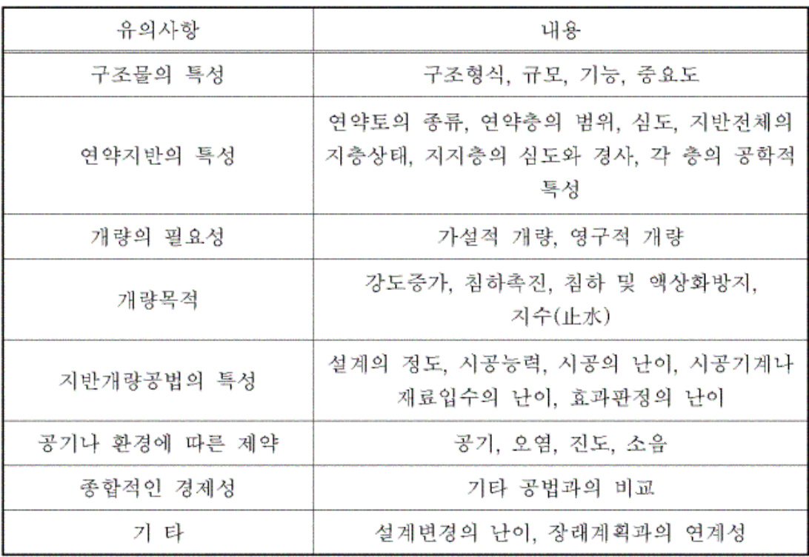  

구조물의 특성  

파괴해도 지장 없는 구조물은 존재하지 않는다. 그러나 부분적인 파괴가 인명, 경제, 환경 등에곧바로 큰 영향을 주는 구조물과 그렇지 않은 구조물이 있다, 한편 파괴 때까지도 침하나전단변형에 저항할 수 있는 구조물과 변형이 구조물의 안정성 또는 기능에 심각한 악영향을미치는 경우도 있다. 예를 들면 매립지 호안은 다소 변형이 되어도 기능을 상실하지 않지만 같은매립지라도 굴착을 위한 크레인 기초 등은 변형에 민감하다. 이와 같은 구조물의 특성은연약지반대책의 정도나 규모를 결정할 때 중요한 고려사항이 된다.  

# [표 1.2-6-2] 구조물별, 지반조건별 개량공법의 적용성  

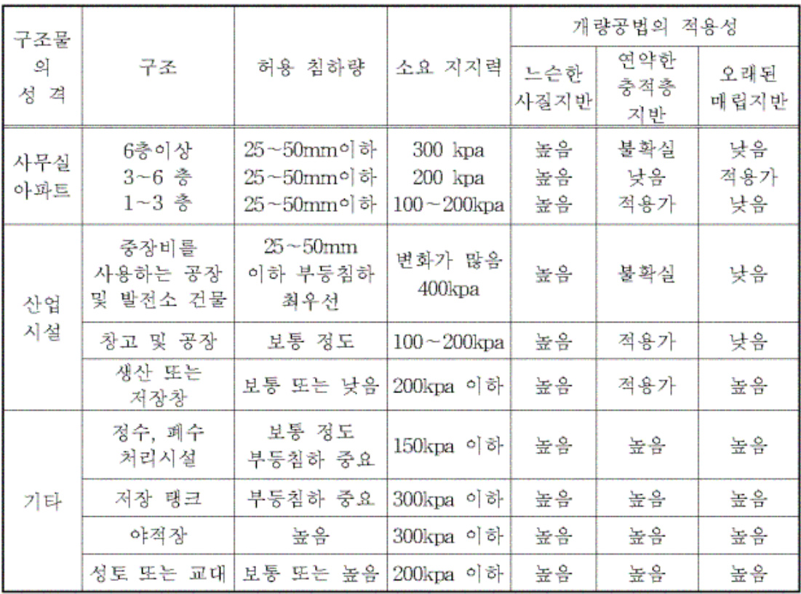  
연약지반의 특성  

연약지반의 특성은 먼저, 구조물 조건과의 조합으로 대책공법 실시의 필요성 유무를 판단하기위해서는 원지반 조건에서의 설계검토를 할 필요가 있다. 대책이 필요하다고 판단될 경우에는대책공법의 선정이 필요하고 각각의 대책공법은 입각하는 원리에 따라서 대상 토질에 한정되는경우가 많다. 예를 들면 압밀공법은 사질토지반에 대해서는 무력하다. 다짐공법은 포화점성토에적용하여도 지반의 강도저하를 막을 수 없고 사질토의 경우에도 세립분의 함유량에 따라 기대할수 있는 효과가 현저히 변화한다.  

혼합처리의 경우에는 흙의 유기물 함유량과 지하수의 pH 가 개량효과에 크게 영향을 미치는경우가 많다. 또한 지층조건도 공법의 선정에 무시할 수 없는 요인이다. 예를 들면 압밀계수가다른 복수의 연약점토층이 존재하는 경우에는 이 지층 특성에 따라 압밀속도가 크게 변화하며투수층을 끼고 있는 경우에는 특히 현저한 차이가 있다.  

# 대책의 필요성  

대책의 - 필요성과 아래에 기술한 대책의 목적은 밀접한 관련이 있고원지반조건(미개량지반조건)에 대한 설계검토에 따라서 명확하게 알 수 있다. 시공과정에서가설적인 안정, 지수 혹은 배수 등의 대책이 필요하지만 구조물의 완성 후 장기적인 기능확보를위한 대책으로 선정된 공법은 다르다.  

대책의 목적  

설계검토결과 원지반에 대해서 무엇이 문제가 되고 대책의 목적과 대책의 정도 등을 명확히 할필요가 있다. 예를 들면 침하가 문제로 되어도 허용잔류침하의 크기에 따라 프리로드의 크기와재하기간은 달라지고 극단적인 경우에는 지반개량의 한계를 넘는 기초구조물에 대처할 필요도있다.  

연약지반 개량공법의 특성  

공법의 특성은 아래에 나타낸 바와 같이 다양한 관점에서 공법의 선정에 영향을 미친다. 설계의정도, 설계에 드는 비용(요구되는 사전조사의 정도와 밀도, 해석방법), 시공능력(가능한 심도,시공규모에 대한 득실), 현장의 시공한계, 재료, 기계, 동력, 필요한 인적자원의 작업수행능력,시공의 확실성(시공실적 축적의 차), 시공상의 문제점이 발생하였을 때 설계변경(시공계획의변경)의 난이도 등이 문제가 된다.  

[표 1.2-6-3] 연약지반 개량공법의 효과 및 적용성  

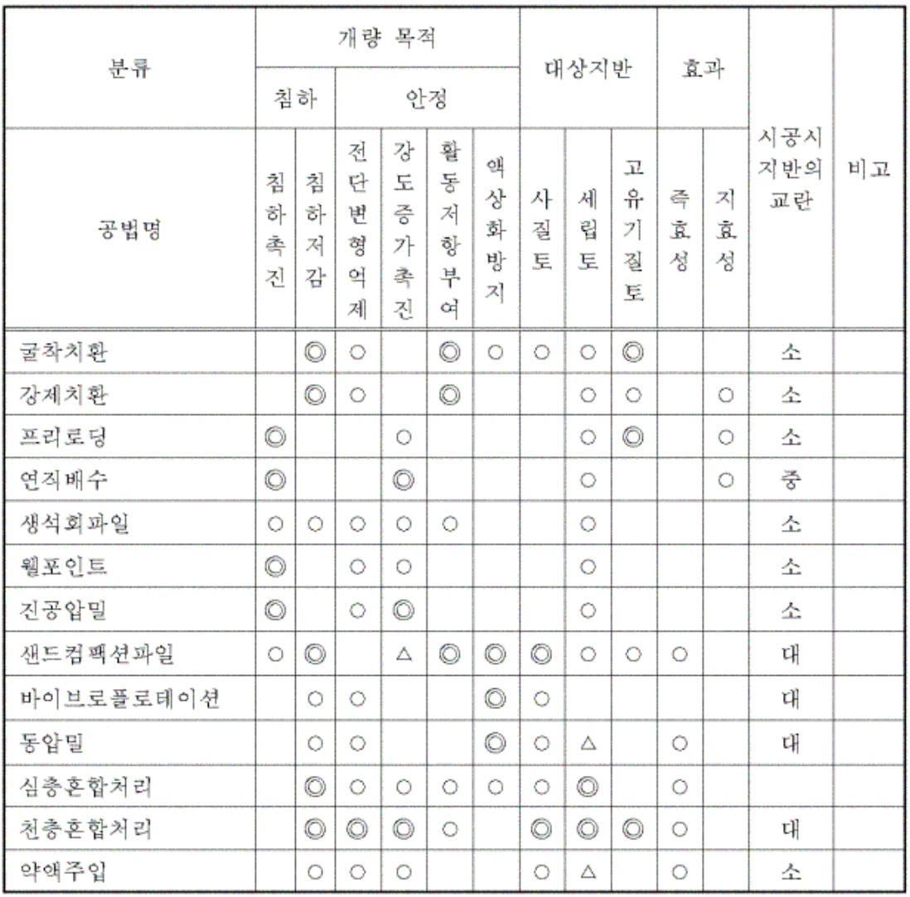  
공기나 환경면의 제약  

공기는 공법의 선정폭을 좌우하는 요인이 된다. 개량공사비가 적게 들고 기대하는 효과를 얻을수 있기 때문에 장기간을 요하는 조건에서 층두께가 큰 점토층에서 프리로딩공법을 적용하는것이 바람직하다. 공기의 - 제약이 엄격한 경우에는 연직배수보다는 치환율이 높은샌드컴팩션파일공법이나 수 주내 효과를 얻을 수 있는 심층혼합처리공법으로 선정하는 것도가능하다.  

최근의 건설공사에서는 환경에 대한 배려가 큰 요인이 된다. 따라서 인접하는 기존의 구조물에대해 악영향을 주지 않도록 하는 배려가 필요하다. 원지반을 강제적으로 배제하는 다짐공법과생석회 말뚝공법에서는 타설방향에 따라 기존구조물에 변형을 가져올 수도 있다. 압밀에 의한공법에는 잔류침하에 유의하여야 한다. 각종의 약액이 개발되고 있는 시기에 약액이 지하수를오염시켜 사회적으로 물의를 일으키며 이에 대한 잠정지침이 제안된 것은 근래의 일이다. 특수한공법을 적용하는 경우에는 토목기술자 각자의 능력을 검토할 필요가 있다. 과도한 소음과 진동도무시할 수 없는 요인이 된다. 조건에 따라서 주변에 영향을 경감시킬 수 있는 대책을 실시하고이에 따른 공법의 선정을 신중히 검토하지 않으면 안된다.  

[그림 1.2-6-1]은 공법선정의 흐름도이다.  

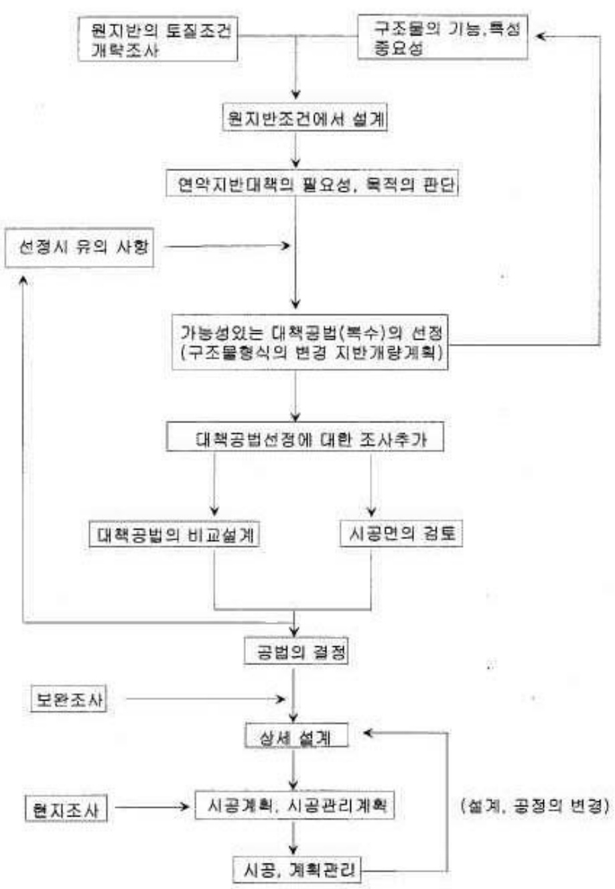  
[그림 1.2-6-1] 공법의 선정, 설계, 시공의 흐름도  
[표 1.2-7-1] 연약지반 개량공법 분류  

# 1.2-7 연약지반개량공법 각론  

지금까지 언급한 연약지반 개량공법들을 분류해 보면 [표 1.2-7-1]과 같다.  

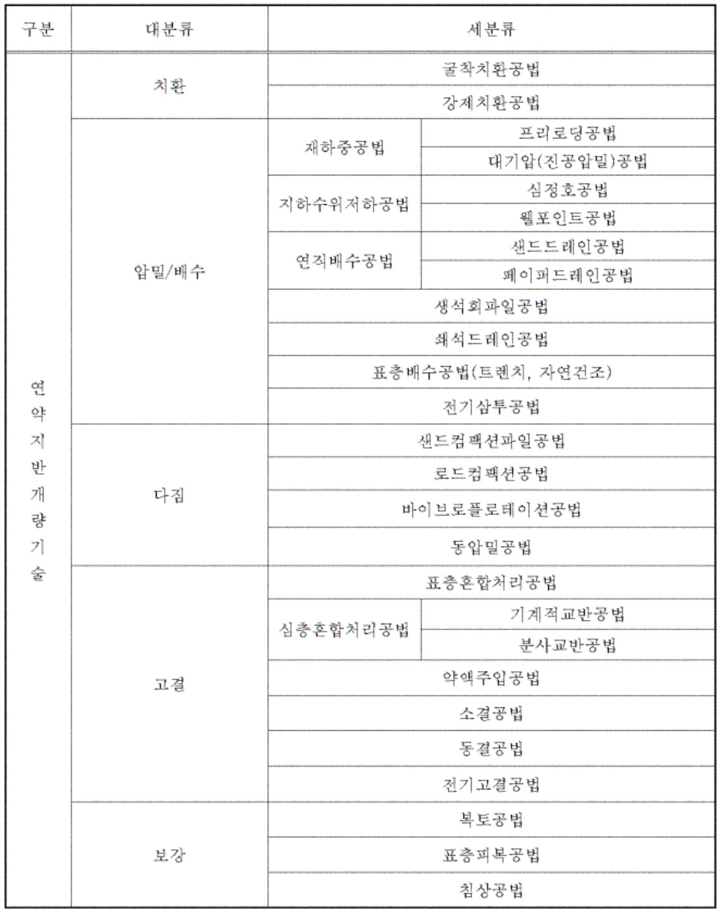  

가. 치환공법  

연약지반 상에서의 구조물 건설이 요구될 때, 구조물의 안정 혹은 침하를 검토하는데서 문제가되는 연약층을 제거하고 양질토(수침에 의해서도 지지력이 잘 저하되지 않는 모래 등의조립토)와 바꿔 넣는 공법을 치환공법이라고 한다. 치환공법은 개량원리가 지극히 명확하기때문에 프리로드공법과 함께 오래 전부터 이용되고 있으며, 일반적인 지반개량공법으로서 비교적중요한 구조물에 대해서 널리 실시되고 있다.  

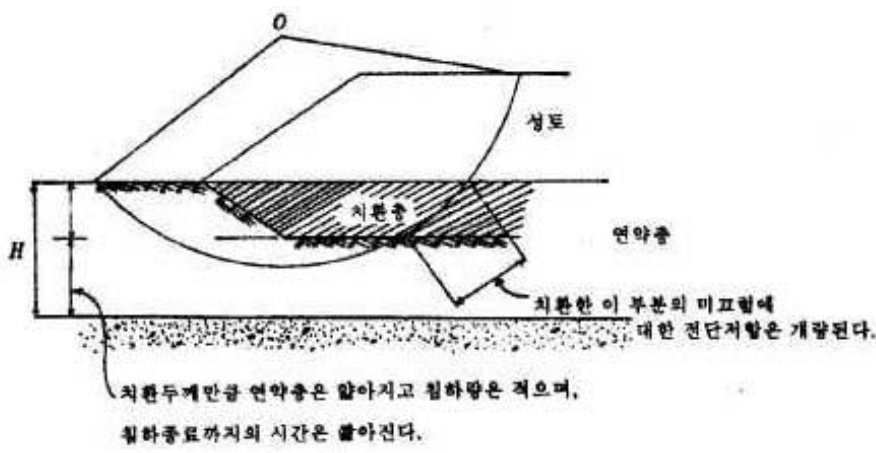  

[그림 1.2-7-1] 치환공법의 효과치환공법은 시공방법에 의해서 다음과 같이 나누어 진다.  

굴착치환(바닥굴착치환)  

강제치환  

성토자중강제치환폭파치환  

# (1) 굴착치환공법  

연약토를 지반개량을 필요로 하지 않는 깊이까지 굴착해서 양질토사로 메우는 공법이다.연약층의 두께가 3m 정도 이하로 얇은 경우에는 전층치환을 채용한 경우라도 개량에 요하는기간은 비교적 짧아도 되므로 확실한 효과를 확보할 수 있다.  

굴착작업을 실시할 때, 시공기계가 연약지반 위를 반복해서 주행하는 것은 일반적으로 곤란하다.따라서 보통은 굴착토에 양질토를 투입해서 완성시킨 치환지반 위에 시공기계가 올라가서치환지반면의 연약토를 굴착하면서 성토를 추진하는 방법이 취해진다. 굴착에는 작업기반에서낮은 부분의 굴착에 적합한 드래그라인, 크렘셀, 백호우 등의 기계가 사용된다. 기계의 적용성에대해서는 연약층이 두꺼워서 굴착비탈면의 안정이 나쁜 지반에서는 드래그라인 혹은 크램셀을사용하고, 연약층이 얇고 용수도 적은 경우에는 제1 층의 치환성토두께를 작게함으로써 백호우에의한 굴착이 가능하다. 최근은 유압기술의 대폭적인 진보에 의해 백호우를 사용하는 예가 많다.[그림 1.2-7-2]에 굴착치환공법의 시공례를 표시했다.  

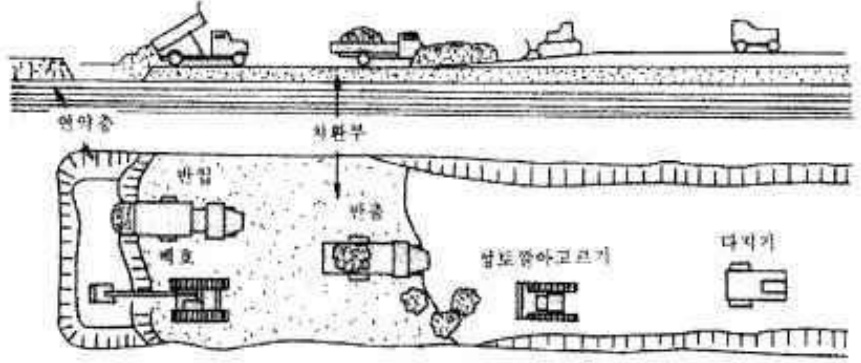  

# [그림 1.2-7-2] 굴착치환공법  

# (2) 강제치환공법  

본 공법은 연약토를 굴착하는 일없이 제거 혹은 배제해서 양질토와 바꿔넣기를 한다. 시공방법에의해서 성토자중 강제치환, 폭파치환, 다짐모래말뚝에 의한 치환이 있다.  

성토자중강제치환  

연약지반의 지지력을 상회하는 하중에 해당되는 양질토를 연약층 위에 깔아서 성토를 연약층속에 함몰시키는 것으로 연약토를 강제적으로 배제하는 방법이다. 함몰을 충분히 일으키게해서단면을 균질하게 하기 위하여 성토 중앙부에서 깔기를 하고 순차, 성토의 측방에 연약토를배제하도록 시공한다. 함몰을 촉진하기 위하여 성토깔기를 계획 이상으로 높게해서 서차지를가하던가, 워터제트를 지반속에 불어넣어서 측방유동을 촉진하던가 성토측방의 지반을 굴착하는것도 실시된다.  

이상과 같이 강제치환의 시공은 지극히 단순하지만, 깔린 양질토는 측방유동적 파괴뿐만이아니고 원형미끄럼파괴에 의해서도 함몰이 생겨서 일반적으로 불규칙한 단면형상을 나타낸다. 또성토의 진행방향에서는 압출된 연약토의 부풀어 오름이 점차로 커져서 균일한 함몰이 곤란하게되는 수도 많다.  

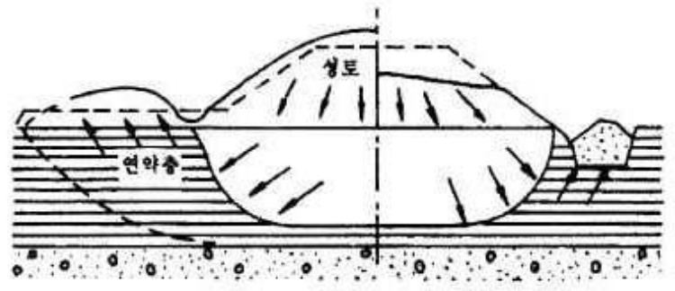  
[그림 1.2-7-3] 강제치환공법(성토자중)  

# 폭파치환  

연약층의 제거 혹은 성토직후의 연약층의 배제와 자중에 의한 치환을 폭파에너지의 이용에의해서 실시하는 방법이다. 이 방법은 주변에의 영향이 현저하기 때문에 일본과 같은토지이용상황하에서는 채용되는 경우는 거의 없다고 해도 된다. 시공실적으로서 발표된 것은1965 년 대의 국철 丸森線에서 니탄층을 치환한 시공예 및 국도 4 호선 仙台바이타스공사에서니탄층을 치환하기 위하여 실시된 현장실험이 있다. 폭파치환 공법의 시공실적은 유럽에 많다.  

폭파방법에는 다음과 같은 방법들이 있다.$\textcircled{1}$ Trench Shooting 법  

$\circled{2}$ Relief Shooting 법 $\textcircled{3}$ Toe Shooting 법 $\circled{4}$ Under Fill Blasting 법 다짐모래말뚝에 의한 치환  

충격하중 혹은 진동하중에 의해서 연약지반속에 직경이 큰 다져진 모래말뚝(샌드콤팩션파일)을일정한 간격으로 형성하는 공법이다. 다짐 모래말뚝과 연약토에 의해서 복합지반이 형성되어,지지력증가, 미끄럼파괴방지, 침하저감 등의 효과가 얻어진다.  

치환공법은 연약지반을 양질토로 치환하는 것이므로 시공적으로는 확실하지만 중요한 것은 심도,폭, 단면형상, 재료, 경제성 등이 합리적이고 치환 후의 토성이 소요효과를 만족시켜야 한다. 또한공사기간은 단축할 수 있으나 양질의 토사확보 및 사토처리가 곤란한 경우에는 공사비가 많이소요되며, 주의 환경조건의 제약으로 채용이 어려운 경우도 있다.  

# 나. 압밀/배수공법  

# (1) 재하(Preoloading) 공법  

연약지반의 공학적 성질을 개량하기 위한 한 가지 방법으로서 연약지반 표면에 등분포 하중을가하여 목적된 구조물의 설치 전에 필요한 만큼의 압축이 발생하도록 유도하는 공법을재하(Preloading) 공법이라 한다.  

재하공법의 원리는 다음과 같다. 지반에 처음부터 설계하중(Pd)만을 재하하였을 때, 1 차 압밀침하량과 시간의 관계를 나타내면 [그림 1.2-7-4]에 점선으로 표시한 곡선과 같이 되며, 이그림에서 Sd 는 최종 1 차 압밀침하량을 의미한다. 동일지반의 설계하중보다 Ps 만큼 큰 하중을재하한다면 1 차 압밀침하량과 시간의 관계는 그림의 실선과 같이 되며 침하량의 크기가설계하중에서 최종 1 차 침하량 Sd 와 같아지는 시간 tc 가 경과하면 초과하중을 제거하여도 더이상은 1 차 압밀 침하가 일어나지 않을 것으로 기대된다.  

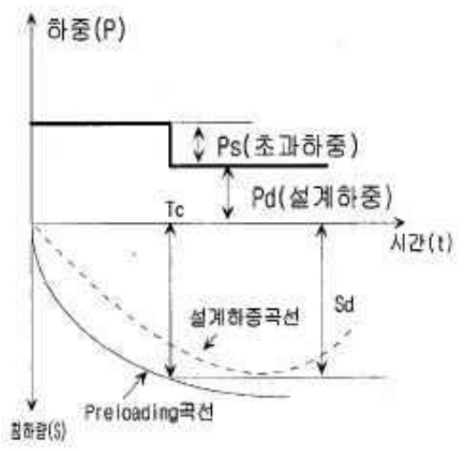  
[그림 1.2-7-4] 재하중에 의한 1 차 압축침하  

진공압밀공법은 대기압공법이라고도 부르며, 대기압을 지반에 재하하는 압밀하중으로서 이용하고연약지반을 압밀하는 공법이다. 보통 지반의 압밀촉진을 꾀해서 버티칼드레인공법과 병용되는수가 많다. 이 공법은 페이퍼드레인공법의 발명자인 Kjellman 등에 의해서 개발된 공법으로페이퍼드레인공법과 동시에 일본에 도입되어 시공되게 된 공법이다.  

펌프선에서 준설한 해저점토에서 매립된 초연약한 지반을 페이퍼드레인과 병용해서 표층 10m정도를 개량하던가, 해저에서 대기압과 수심분의 수압과를 재하중으로 해서 해저지반을 개량하는등, 약간의 깔모래정도에서는 중장비의 작업이 어려운 연약지반에 이용되는 일이 많다.  

진공압밀공법은 [그림 1.2-7-5]와 같이 표면배수층의 샌드매트를 깔아서 버티칼드레인을 타설하는곳까지는 앞서의 샌드드레인공법이나 페이퍼드레인공법과 같아서 재하중으로서 성토를 사용하지않고 지반내 압력과 대기압과의 차분을 하중으로서 이용하는 것이 다르다. 그렇기 때문에 성토를재하하는 대신 버티칼드레인을 타설한 뒤, 깔모래층 내에 집기ㆍ집수용의 파이프를 매설해서깔모래의 표면을 기밀시트로 덮고 시트단부를 지반개량구역의 주위에 매설하여 깔모래 내를기밀상태로 해서 집기ㆍ집수파이프를 진공펌프로 연결한다. 더욱이 침하량, 배수량부압 등을측정하기 위한 각종 계기를 매설한 뒤, 진공펌프를 운전해서 깔모래 내의 기압을 저하시킨다.  

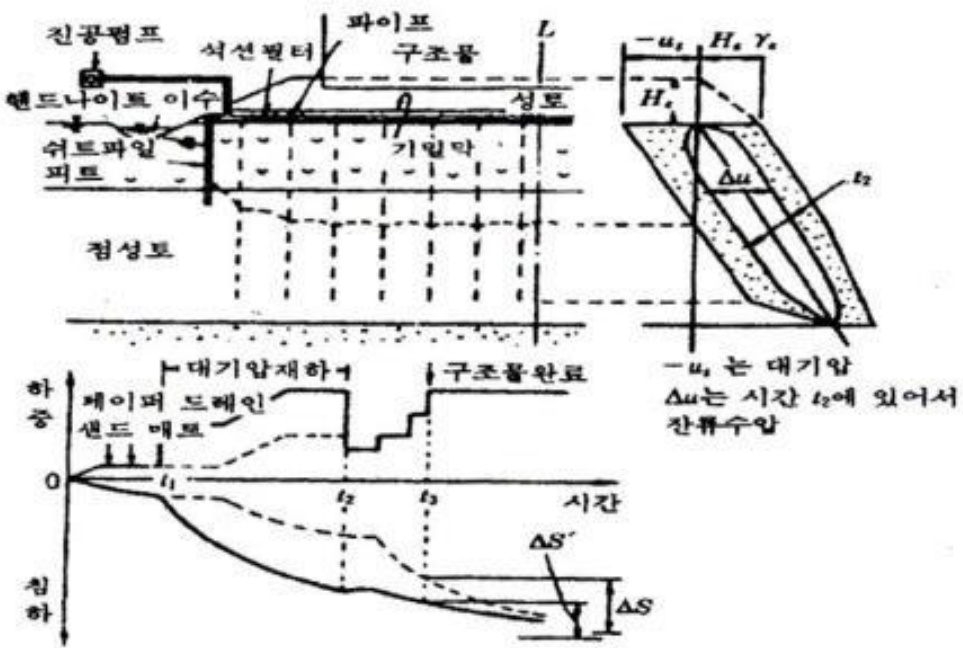  
[그림 1.2-7-5] 진공압밀공법(대기압 재하공법)  

진공펌프를 이용하여 공기를 배제하면 막의 내외에 기압차 ?Us 가 생기므로 그양만큼 하중이되어서 지반에 재하된다. 이 공범에서 동방응력의 증가에 따라 암밑이 진행되므로 지하수위저하공법과 같이 전단응력의 증가가 없기 때문에 지반에 활동 파괴가 일어나지 않는 장점이 있다.진공펌프를 사용하지 않는 대기압 ?Us 는 일반적으로 5∼6t/m2 이므로 가급적 높은 대기압을확보하기 위한 기밀막의 설치와 유지에 유의할 뿐 아니라 대수층을 통해서 주변에서 대량의지하수가 유입 할 때에는 기대한 부압이 얻어질 수 없으므로 사전에 충분한 토질조사를 하여연직배수로나 누수벽의 필요성 등을 검토해야 한다. 대기압 재하(지하수위의 저하)는 이상과 같이압밀을 촉진시켜 선재하(또는 여성)의 효과를 지반에 줄 뿐 아니라 성토자체의 안정에도 좋은효과가 있다.  

진공압밀공법은 앞서 기술한 바와 같이 압밀하중에 대기압을 이용하는 것에 최대의 특징이있지만, 그 밖에 다음과 같은 특징이 있으므로, 이 공법을 채용할 경우는 시공하는 지반의 토질,시공조건을 토대로 성토재하의 경우와의 득실을 충분히 고려해서 결정해야 할 것이다.  

하중의 크기는 실용적으로는 $5\!\sim\!10\!!/\!\mathfrak{m}2\!\mathrm{~0|~}$ 며, 성토높이로서 $3\!\sim\!4\mathsf{m}\ 0\!1|$ 해당된 다.  

대기압 이상의 압밀하중이 필요한 경우에는 성토와의 병용이 가능하다.  

지표면이 대단히 연약해도 $5\!\sim\!7\mathrm{t}/\mathrm{m}2$ 를 단번에 작용시키는 것이 가능하고 또 지반파괴의 염려가없다.  

사면부분에의 재하도 수평지반과 같은 방법으로 실시할 수가 있다.  

간단한 설비로 비교적 큰 압밀하중이 얻어지므로 좁은 장소에도 적용이 된 다.  

압밀기간중은 주야로 펌프를 가동시키므로 야간의 유지관리, 소음대책이 필요하다. 진공펌프의운전용 전력이 용이하게 얻어지는 것이 필요하며 소비전력을 생각하면 압밀기간이 너무 긴 것은적당하지 못하다. 또 1 회의 재하면적은 5,000∼7,000m2 정도가 적당하며 이 이상 큰 면적을  

개량할 경우는 구분시공을 하면 된다.  

집수파이프를 깔모래 내에 적절히 배치하고 압밀에 의해서 나온 물을 신속 히 배수하여 항상깔모래의 배수성을 유지하여둘 필요가 있다.  

심부의 중간사층 이하의 깊이에서는 개량효과는 기대할 수 없다.  

재하재료에 의한 재하공법의 분류는 [표 1.2-7-2]와 같다.  

[표 1.2-7-2] 재료에 의한 재하공법의 분류  

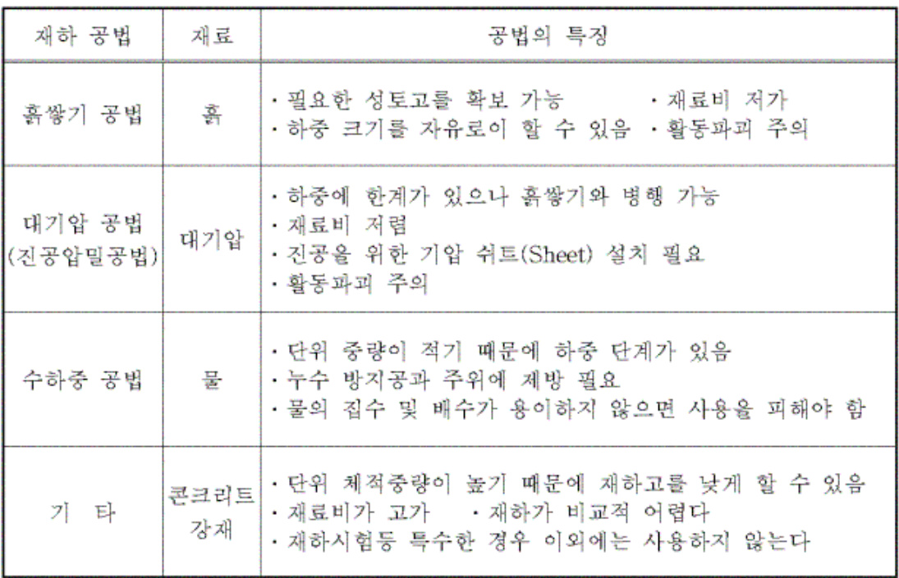  

# (2) 지하수위저하공법  

지하수위 이하에 구조물을 만들 경우, 지하수면 이하를 굴착할 필요가 있지만 유해한 용수에대하여 무엇인가의 대책이 필요하게 된다. 이 대책공법으로서 지수공법과 지하수위저하공법이있는데 지하수위저하공법은 지하수를 양수함으로써 지하수위의 저하를 꾀하여 공사의 안전과경제성을 확보하는 것이다. 지하수위저하공법은 복잡한 지하수위의 수리학적 특성과 지반의성질에 의하여 좌우되므로 적용할 경우는 지반의 성질을 충분히 파악한 뒤 결정할 필요가 있다.지하수의 저하를 어떠한 방법으로 하느냐는 대상지반의 수리학적 특성, 수위저하의 목적과 그정도, 공사내용, 공사장소 및 공기에 따라 달라지지만, 흙의 입경가적곡선(흙의 투수계수)과공법의 적용범위를 나타낸 [그림 1.2-7-6]에 의하여 판정할 수 있다. 또한 저하시키는 수단으로는[그림 1.2-7-7]과 같은 것이 있지만, 넓은 범위의 지하수를 저하시킬 경우에는 일반적으로웰포인트공법이나 심정호공법이 사용되고 있다.  

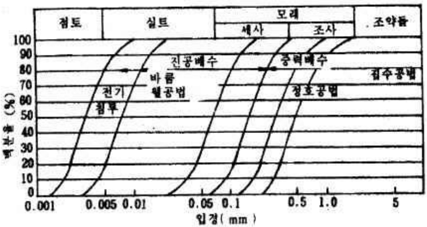  
[그림 1.2-7-6] 입경에 의한 공법의 적용성  

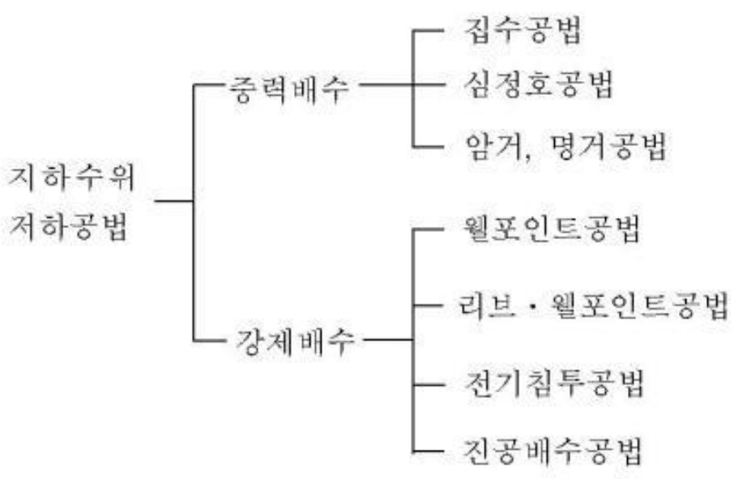  
[그림 1.2-7-7] 지하수위 저하공법  

[그림 1.2-7-8]과 같은 구조를 가진 지름 $5\!\sim\!8\mathsf{c m}$ , 길이 1m 정도의 흡수기구를 웰포인트라고부르고, 이것을 라이저파이프라고 부르는 지름 3∼4cm, 길이 $5\!\sim\!7\mathsf{m}$ 의 강관에 부착하여 지반속에 박고 여기에 진공을 작용시켜서 지하수를 흡인하여 지하수의 저하를 꾀하는 공법이다.  

이 웰포인트가 공사에 대대적으로 사용된 것은 미국의 인디아나주에서의 하수공사로 이때웰포인트는 외측에 물제트를 첨부해서 타설하고 펌프는 프랜저펌프가 사용되었다. 이로 인하여웰포인트의 효과가 실증되어 일본에서도 관심을 갖게되어 1954 년겅부터 일본에서도 널리사용되게 되었다. 현재에는 웰포인트도 자분식이 되고 또 와권펌프, 진공펌프와 병용함으로써강력한 흡인력이 얻어져서, 지하수위가 높은 장소에서의 굴착공사에서는 매우 중요한 공법으로되어있다.  

웰포인트는 지름 5∼8cm, 길이 1m 정도의 작은 스크린이 붙은 파이프로 놋쇠 혹은 스테인레스스틸로 만들어 졌다. 지하수위의 저하를 요하는 영역의 주변에 웰포인트를 라이저파이프의선단에 부착하고 선단에서 사수하면서 1∼4m 간격으로 타설한다. 다음에 라이저 파이프를부착하고 헤더파이프를 진공펌프에 잇는다. 이와 같이 웰포인트 공법은 웰포인트, 라이저파이프,스윙조인트, 헤더파이프, 진공펌프, 배수관으로 구성되며, 이것들은 [그림 1.2-8-8]과 같이배치된다. 즉, 웰포인트에서 흡인된 물은 라이저파이프를 통하여 헤더파이프에 모여지고, 펌프로외부의 배수관에 방출된다.  

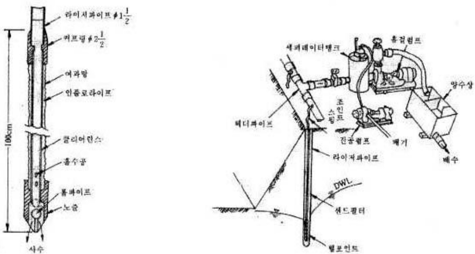  
[그림 1.2-7-8] 웰포인트 및 시스템  

(3) 연직배수공법  

연약지반상에 축조물을 재하한 경우에는 재하압력을 받아 연약층의 압밀이 진행되어 강도가증가한다. 그러나 압밀에 필요한 시간은 연약층의 배수거리의 제곱에 비례하기 때문에 연약층의두께가 크면 압밀에 장기간이 소요된다. 압밀시간을 단축시키기 위해서는 배수거리를 짧게하는것이 가장 효과적이므로 [그림 1.2-7-9]에 제시한 바와 - 같이 연약층에 연직방향으로 많은배수기둥을 통해서 배수하여 압밀을 촉진시키는 공법이 연직배수공법이다. 따라서 연약지반층이투수계수가 낮은 점토층으로 구성되어 있으면 매우 효과적인 공법이다. 연직배수공법은연직기둥에 사용하는 재료에 따라 샌드드레인과 카드보드 또는 플라스틱을 사용한 페이퍼드레인그리고 팩드레인으로 나눌 수있다. 페이퍼 드래인은 샌드드레인에 비해 시공능률이 크므로공기를 단축할 수 있고, 재질이 일정하고 공급이 안정되어 있어 경제적이라 할 수 있으며프리패브 드레인 또는 심지드레인(Wick Drain) 등 다양하다.  

연직배수의 시공범위는 대상으로 하는 축조물의 안전성 보다는 소요 강도증가의 범위에서결정되며, 연직배수의 시공심도는 침하속도와 강도증가 속도 및 축조물의 시공 후에잔류침하량의 허용한도에서 요구되는 범위까지로 한다. 연직배수의 효과는 재하압력에 따라발휘되는 것으로 재하범위 외에 샌드파일이나 카드보드를 사용하더라도 그다지 의미가 없다. 또부분재하를 받는 기초지반에서는 재하면의 단부 부근의 연약층은 큰 전단응력을 받게 되므로재하와 동시에 현저한 형상변형을 일으켜 효과적인 압밀을 연직배수에서 기대할 수 없는 경우가많다. 샌드파일의 깊이는 일반적으로 20m 정도가 한도여서 그 이상이 되면 시공이 곤란해지고또 공비도 급격히 증가한다.  

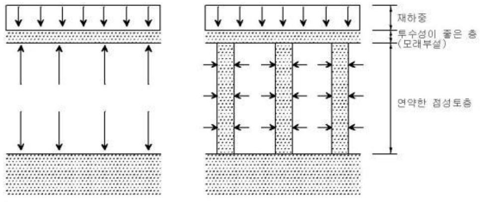  
Ca 처리하지 않은경우  
6 샌드드레인을 타설한경우  

# 샌드드레인공법  

이 공법은 미국에서 개발되어 1936 년 포터에 의해 'Soil Mechanics'에 발표된 이래 세계에 널리보급되었으며 수많은 지반개량공법이 화려하게 경합된 현재에도 의연하게 뿌리깊이 사용되고있으며 가장 널리 쓰이는 공법의 하나로 일본에서는 1952 년 무렵 도입되고 신간선이나고속도로의 기초지반의 개량, 각종 조성지, 매립지반의 개량 등 광범한 시공 실적을 가졌다.  

이 공법은 연약지반에 모래말뚝(샌드파일)을 조성하여 지반의 간극수를 지표에 신속히배출하는데 따라 압밀을 촉진시키고 지반의 강도와 변형특성을 개선하는 것이다. 샌드파일이외로 봉지채움 샌드파일(봉지채움 샌드드레인공법, 상품명을 팩드레인공법이라 한다)이나각종의 인공 드레인재를 사용하는 방법을 총칭하여 버티컬 드레인공법이라 부른다.  

[표 1.2-7-3] 드레인공법의 종류  

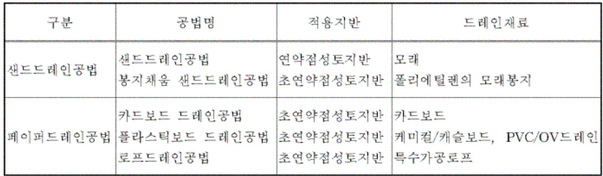  

물로 포화된 점토를 압축하면 간극수가 생겨서 그 배수량에 알맞는 만큼 흙의 체적이 감소된다.이것에 따라 강도가 증가된다. 즉 압축응력을 가하면 흙중에 과잉간극수압이 발생되고 그 동수구배에 따라 간극수의 외향의 흐름이 생긴다. 물이 배출되는데에 따라 간극수압이 줄며 또 흙의체적이 감소된다. 이것을 압밀 현상이라 한다.  

연약지반에 성토 등이 재하되어 압축응력이 가해질 때 압밀층인 연약지반층이 두껍고 또 그중간에 배수층이 없는 경우는 배수 거리가 길어져서 압밀이 완료될 때까지 수 십년이 걸리는수도 있다. 점성토의 압밀에 요하는 시간은 배수거리의 2 승에 비례하므로 압밀시간을 단축하는데에는 배수거리를 짧게 하는 것이 효과적이다. 이 때문에 지반 속에 적당한 간격으로버티컬드레인을 형성하며 이것이 배수로가 되어 최대배수거리가 자연지반과 비교가 안 될 정도로작아지며 배수시간이 극히 단축되게 된다.  

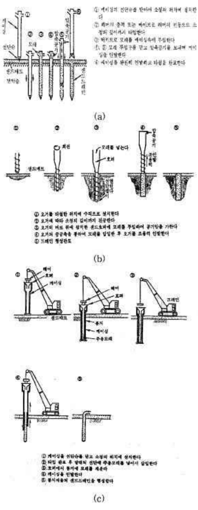  

# 타입식 6오거4 9봉지체움시  

# [그림 1.2-7-10] 샌드드레인의 시공순서  

(a)타입식 (b)오거식 (c)봉지채움식 페이퍼드레인공법이 공법은 샌드드레인 공법에 대한 모래말뚝 대신 각종의 인공배수재를 써서 흙중에 버티컬드레인을 형성하는 것이며 개량원리는 샌드드레인 공법과 동일하다. 인공드레인재의 선구적역할을 다하는 페이퍼드레인 공법은 샌드드레인공법과 - 거의 동시기에 스웨덴의왕립지질연구소(SGI)에 있어서 개발되었다. 초기의 버티컬 드레인재는 통수구멍(도랑)을 가진두꺼운 종이를 소재로 하였으며 카드보드 드레인이라 부른다. 이것은 모래보다 투수성이 나쁘고습윤시의 강도도 작고 부식되는 결점이 있기 때문에 이것들의 결점을 개량하도록 각종의드레인재가 연구되어 제품화되었다.  

주요한 드레인재의 종류는 [표 1.2-7-4]에 표시한 바와 같다.  

[표 1.2-7-4] 드레인재의 종류  

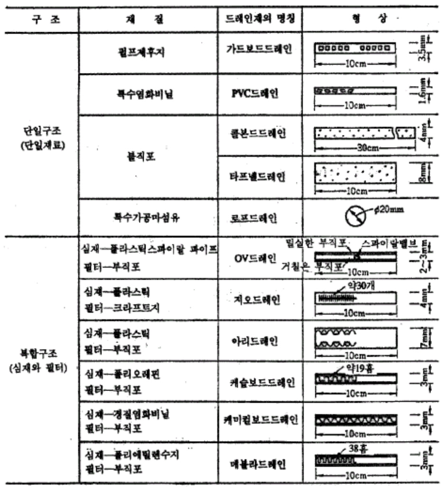  

이 공법의 개량원리는 샌드드레인 공법의 것과 완전히 동일하며 드레인재로서 쳔연의 모래 대신인공재료를 쓰는 경우가 서로 다른 점이다. 설계에 쓰이는 페이퍼 드레인의 환산원은샌드드레인에 비하여 일반적으로는 작고 각종 드레인재에 따라 환산 원주의 직경의 값에 다소의차이는 있으나 일반적으로는 5cm 를 표준 환산 원경으로 한다.  

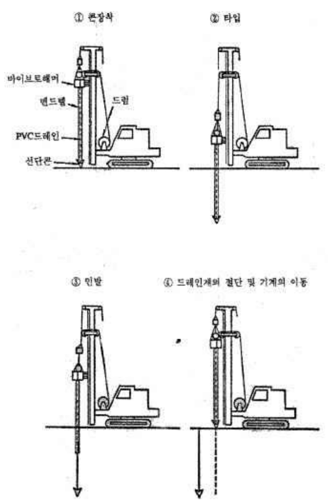  

[그림 1.2-7-11] 페이퍼 드레인공법의 시공순서(PVC 드레인)[표 1.2-7-5] 연직배수공법 비교표  

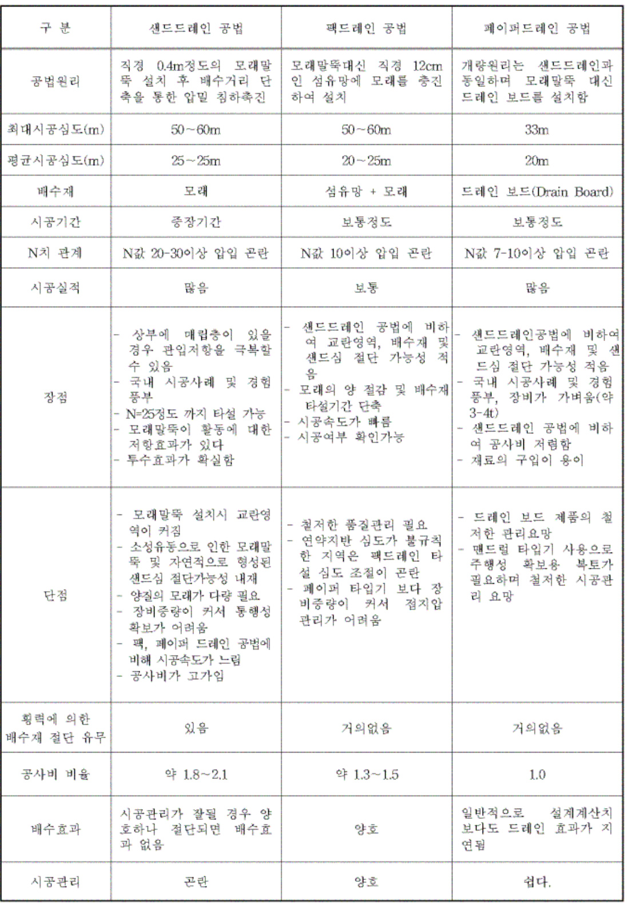  

(4) 생석회말뚝공법  

생석회말뚝공법은 강력한 탈수ㆍ팽창력을 가진 생석회를 연약지반속에 말뚝상으로 타설하므로써토중수를 급속히 탈수함과 동시에 말뚝자신의 체적이 2 배로 팽창하여 지반을 강제압밀하는 것을특징으로 하고 있다.  

이 탈수ㆍ팽창작용에 의해 말뚝간의 연약지반은 재하성토 없이 압밀강화된다. 또 생석회 자신도잠재적으로 수경성을 가지고 있으므로 압밀강화된 중간지반과의 복합지반을 형성한다.  

생석회말뚝공법은 전술한 바와 같이 생석회를 지반 속에 말뚝상으로 타설하고 생석회의 소화,흡수에 의한 탈수효과, 말뚝의 팽창에 의한 압밀효과 및 말뚝의 말뚝효과에 의한 강도증가,침하저감 등의 지반개량을 꾀하는 공법이며 다음과 같은 효과를 나타낸다.  

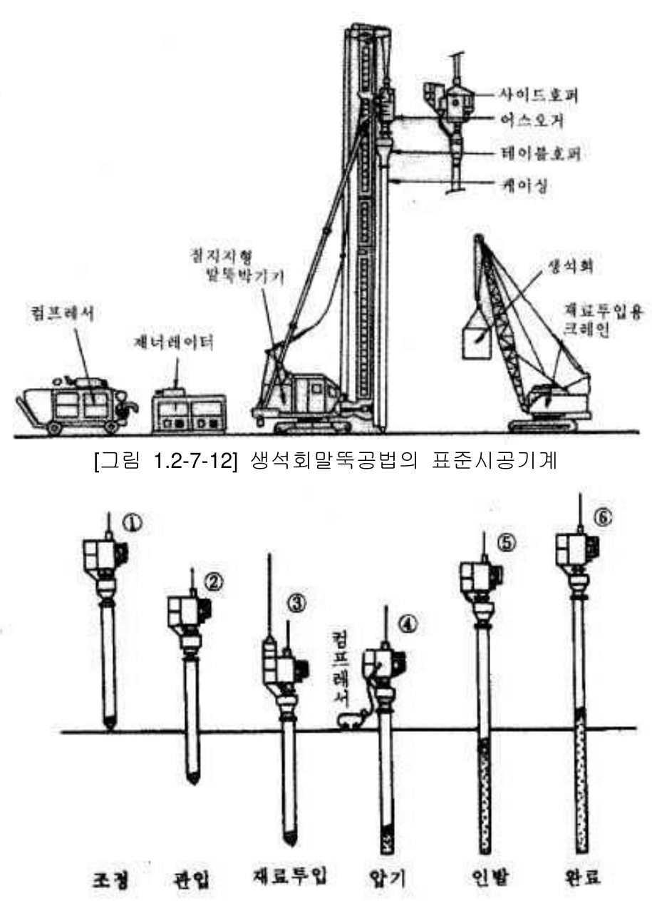  
[그림 1.2-7-13] 생석회말뚝공법의 시공순서  

(5) 쇄석드레인 공법  

쇄석드레인공법은 날카로운 봉으로 쇄석을 다져서 조밀한 드레인 기둥을 형성시키는 동시에주변지반을 N 치 10 정도의 고밀도로 다질 수 있는 저진동, 저소음의 배수공법으로서 최근개발되고 있다. 본 공법은 완만한 모래지반속에 쇄석기둥을 조성하여 수평방향의 배수거리를짧게하여 지반의 배수성 향상을 도모하고 지진 시에 대한 과잉간극수압을 조기에 소산시키는데따라 액상화의 방지를 도모하는 공법으로 다음과 같은 특징을 가진다.  

전동모터에 의해 케이싱을 회전시키며 지반에 관입하기 때문에 진동ㆍ소음 이 적다.  

원지반을 측면으로 밀어 펼치지 않기 때문에 주변지반에의 영향이 적다.  

시가지에서의 시공, 기설구조물에 근접하여 시공이 된다.  

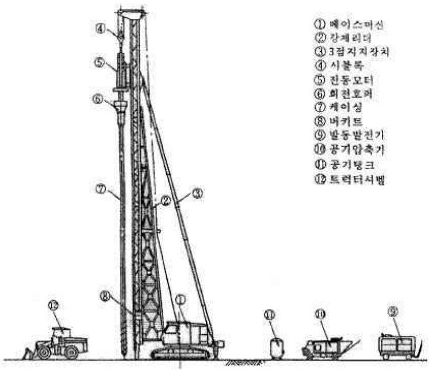  
[그림 1.2-7-14] 쇄석드레인공법 시공장비의 개요  

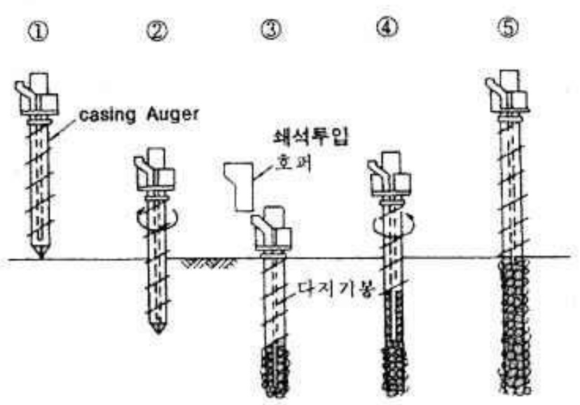  
[그림 1.2-7-15] 쇄석드레인공법 시공순서  

(6) 표층배수공법  

표층배수공법은 공사기간 중에 실시하는 배수공법과 공사 완성후에 실시하는 배수공법으로 나눌수 있다. 또 배수대상에 따라 우수배수, 노면배수, 법면배수 등으로 나뉘어진다. 여기서는공사기간중 지반개량을 목적으로 하는 연약지반 표층부의 트렌치(Trench) 배수ㆍ건조공법에대하여 설명한다.  

[그림 1.2-7-16]에 표층배수공법의 시공 개략도를 나타내었다. 연약지반 표층부에서의 배수공은매립 직후 사람이 다닐 수 없는 고함수비 점토지반 등에서 우선 첫째로 행하는 지표면부의 배수및 안정화를 위한 배수공이다. 배수방법은 택지주변으로부터 트렌치를 순차적으로 설치하여표면수의 배수와 중력배수에 의하여 흙 속의 물을 배출하고 자연건조 등에 의해 표층부의토질개량을 도모하여 시공기계의 트래피커빌리티를 확보한다. 성토를 시공할 때는 굴착한트렌치를 시공중의 양호한 사질토 등으로 되메움한다.  

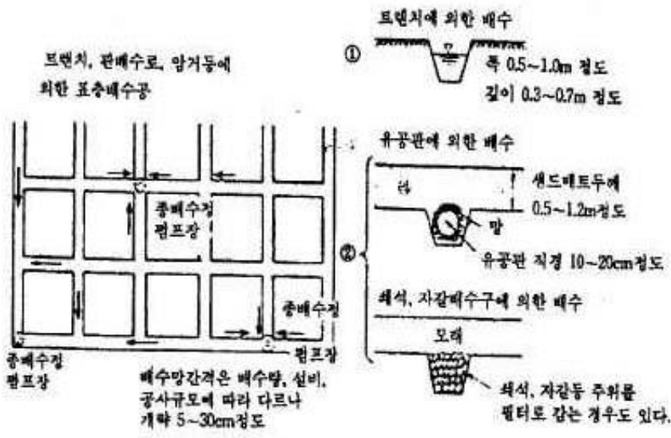  
[그림 1.2-7-16] 표층배수공법  

# (7) 전기삼투 공법  

전기삼투현상을 그 원리로 하는 공법이다. 이 현상은 러시아의 Reuss( 1809)에 의하여 처음으로발견되었다. 그 후 전기삼투 매카니즘은 Wiedemann(1852)과 Quincke(1861)에 의해 규명되었다.그 이후 계속해서 Helmholtz(1879), L.Casagrande(1951), Mitchell(1967), Banerjee(1980) 등의 여러학자에 의해 발전되어왔다. 이 공법은 연약지반을 빠른 시간내에 압밀시켜 소정의 강도를 얻도록하는데 그 목적이 있고, 수 십년간 일본을 비롯한 세계 각지의 실트에서 점토질 실트, 예민한점토에 이르기까지 절취사면과 굴착, 연약지반의 안정, 배수를 위한 기술로서 많이 적용되어 왔다.  

전기침투 현상이란 토중에 매립된 전극을 직류전원에 접속하면 흙 속의 간극수는 양극에서음극을 향하여 흐르는 것을 말한다. 전기 침투에 의해 흙 속의 간극수는 탈수되어 흙의 강도가상승된다. 이 이론을 응용하여 철도선로나 도로의 노상보강 또는 사면안정 등에 활용하였다.전기침투에 의해 연약한 점성토 등이 고결되는 것을 전기화학적 고결이라 한다.  

즉, 음극으로 Well Point 의 집수관을 양극에 소모가 적은 자성산화 철봉 등을 이용, 이들을 지반내에 박아 넣어 양극간에 직류전류를 흐르게 하고 양극간의 흙의 탈수를 꾀한다. 이 공법은하중을 필요로 하지 않는 탈수공법으로 매우 연약한 지반의 개량에 적당하다. 또 전압을 높이면투수계수가 작은 점토층의 압밀도 조기에 끝낼 수가 있지만 이 경우에는 매우 다량의 전력소비를동반한다.  

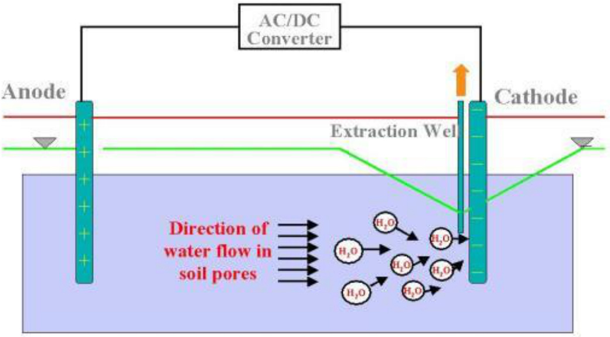  
[그림 1.2-7-17] 전기삼투공법의 원리  

다. 다짐공법  

# (1) 샌드콤팩션 파일공법  

샌드콤팩션파일공법은 모래 또는 점토로 된 연약지반에 모래(또는 유사재료)를 압밀하여 대경의다져진 모래말뚝을 조성하는 지반개량공법이다. 샌드콤팩션파일공법은 단일의 시공기계로사질지반에도 점성토지반에도 적용된다. 시공은 바이브로해머로 케이싱타이프를 지중에 관입하여이것을 통하여 모래를 공급하는 일을 한다. 모래지반개량의 목적은 지지력 증가, 압축침하의 저감,액상화방지, 수평저항의 증가 등을 목적으로 하여 실시되고 있다. 한편 점토지반의 개량의 목적은지반의 지지력증가, 압밀시간단축과 압밀침하량의 저감을 목적으로 한다.  

지반개량공법의 원리에는 치환, 압밀배수, 다지기, 고결, 보강 등이 있는데 샌드콤팩션파일공법은다짐과 보강 및 압밀배수를 기본원리로 하고 있다. 본 공법은 복수의 원리를 합쳐가짐으로사질지반, 점토지반, 유기질지반, 암쇄지반, 화산회퇴적지반 등 거의 모든 지반에 적용된다.  

매립지 등의 비교적 느슨한 사질지반, 암쇄지반에 대해서는 사질재료의 진동압밀에 의한원지반의 다짐(밀도증가)에 의해서 지지력 증가, 압축침하의 저감, 액상화방지, 수평저항의 증가등이 기대된다.  

한편 점성토, 유기질토지반의 지반개량에 있어서는 단기적으로 주변점토보다 큰 전단강도를 가진다짐모래말뚝을 촘촘히 조성해서 모래말뚝과 점토로 된 복합지반을 형성하므로써 지반의지지력을 더하고 장기적으로는 모래말뚝의 드레인효과와 모래말뚝에의 응력집중에 의해압밀시간을 단축함과 함께 압밀침하량을 저감한다.  

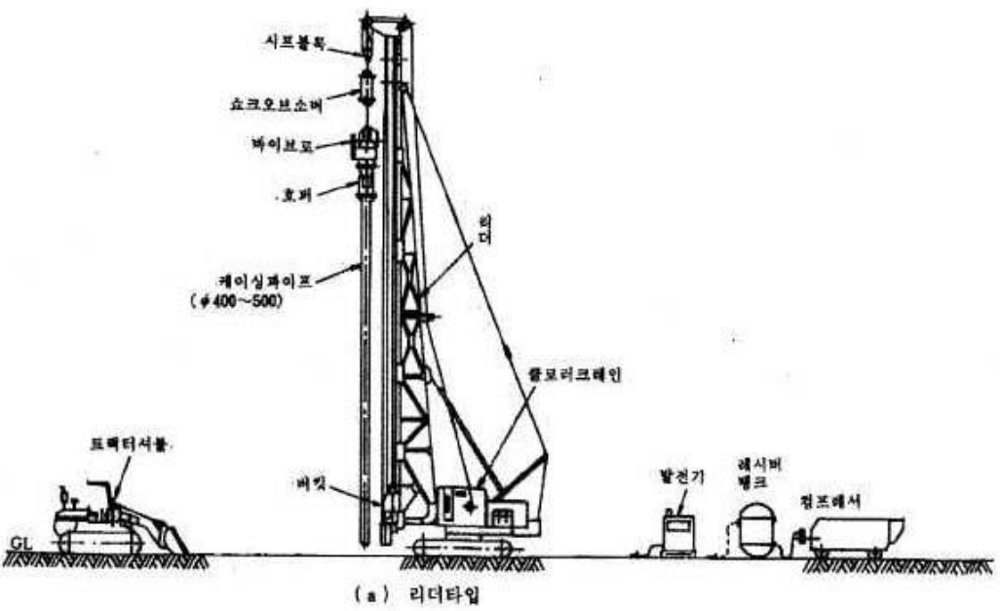  
[그림 1.2-7-18] 샌드컴팩션파일공법의 시공장비 모식도  

(2) 로드콤팩션공법  

느슨한 모래지반의 다짐진동이 유효하다는 것은 잘 알려져 있으며, 각종 공법이 실시되고 있다.종래부터 실시되고 있는 진동다짐 공법으로서는 선단에 바이브로 플로트라고 하는 진동기를가지고 있고 이 진동으로 다짐을 하는 바이브로프로텐션공법 혹은 선단에 프레스패널이라고부르는 다짐기구를 가진 다이렉트파워콤팩션공법 등이 있지만, 근년 손쉬운 진동다지기공법으로서 로드콤팩션방식의 다짐공법이 사용되고 있다.  

본 공법의 시공원리는 샌드콤팩션파일공법이 케이싱파이프 내에서 보급재를 압입하므로써다지는데 대하여 지반속에 봉상 혹은 말뚝상의 진동제를 타설, 지표에서 모래ㆍ자갈ㆍ쇄석 등을보급하면서 진동에 의해 다지는 것이며, 지반 속에 전달되는 진동과 유효상재하중의 상호작용에의해 주변지반이 주로 수직방향으로 다져진다고 고려되는 것이다.  

본 공법은 기계적 조작과 구조를 가급적 단순하게 해서 다짐효과를 기대하는 것으로서 지반에수직직동만을 가하는 공법으로서, 강관의 로드를 사용하는 것과 H 형강의 로드를 사용하는 것이있다. 또 로드상단의 기진기에 의한 수직진동과 함께 로드선단에 부착된 소형의 바이브로플로트에 의한 수평진동을 가하는 공법 및 로드선단에 대용량 바이브레이터를 부착시켜서수평진동만을 지반에 가하는 공법도 있다.  

본 공법의 사용목적은 모래지반을 균일하게 다지고, 지진시의 액상화방지 외에 지지력증가,침하저감 등의 효과를 기대하는 것이며, 각종 구조물(건축, 탱크, 야드 등)의 기초지반이나 안벽및 호안구조물의 배면에 대표되는 매립지반의 다지기 등에 사용되고 있다.  

적용할 때의 유의점으로서 본 공법은 로드를 지반 속에 진동압입하는 공법이기 때문에 시공시의진동ㆍ소음 및 지반의 측방변위에 대해서 유의함과 함께 필요가 있으면, 시공 전에 대책을검토하여 두는 것이 중요하다. 주의할 점은 지반 속의 세립분의 함유량이 많아지면 그에 따라서다짐효과가 감소하며, 일반적으로 실트질 이하의 세립분의 함유량이 $15\!\sim\!20\%$ 정도까지의개량효과가 현저하다.  

진동에 의한 모래의 다짐은 포화ㆍ불포화상태를 불문하고 유효하다는 점에서 지하수에 대해서는특히 고려할 필요가 없다.  

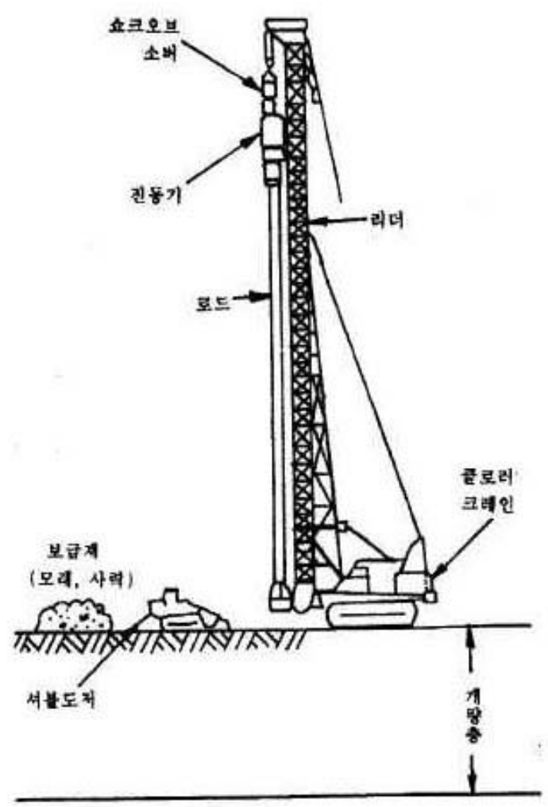  
[그림 1.2-7-19] 로드컴팩션공법의 시공장비 모식도  

(3) 바이브로플로테이션 공법  

느슨한 사질토지반은 지표면에서 진동이나 충격하중을 가하여 다지는 것이 다짐효과가 크다.바이브로플로테인션 공법은 사질지반에 대한 물다짐, 진동다짐의 효과를 지중에서 이용한방법이다. 연약한 사질지반에 수직으로 매어단 바이브로플로트라고 불리우는 몽둥이 모양의진동체를 그 선단에 장치된 노즐에서 물을 분사시키면서 동시에 플로트를 진동시켜서 자중에의하여 조용히 지중으로 관입한다. 소정의 깊이에 도달하면 주로 옆뿜기 제트에 의하여, 플로트주변의 지반을 포화시켜 진동을 가한다. 그러면 주변의 유동화한 모래는 점차로 다져지기시작하여 하부의 흙이 다져짐에 따라 플로트 주변 상방의 모래는 차례로 하방으로 떨어져서주위의 구멍이 생기게 되는데, 이 구멍에 모래, 자갈 등의 적당한 보급재를 연속적으로 투입하여다지게 된다.  

이 공법은 지하수위의 고저에 영향을 받지 않고 시공할 수 있고 일반적으로 짧은 공기로 지반을균일하게 다져 지내력을 증가시켜 모래지반의 액상화를 방지한다. 그러나 시공이 가능한 지반의N 값은 20 정도까지이고 개량깊이는 모두 8m 정도로 제한된다.  

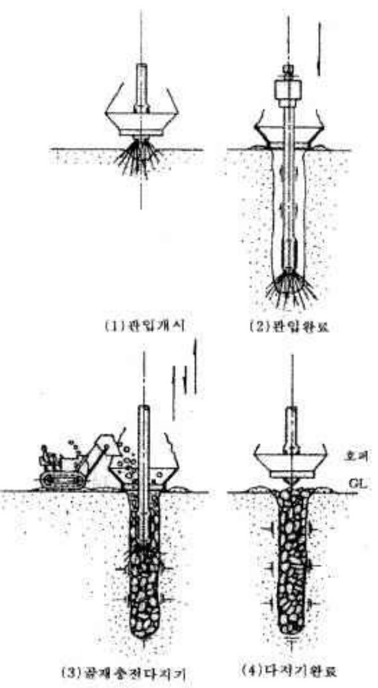  
[그림 1.2-7-20] 바이브로플로테이션 시공 모식도  

(4) 동압밀공법  

동압밀공법은 중추(해머)를 크레인 또는 특별한 장치를 이용하여, 고소에서 반복 낙하시키고 그때에 지표면에 주어지는 충격력과 발생하는 지반진동에 의해서 지반을 압축ㆍ강화하는지반개량공법이다.  

이 공법은 1960 년대 후반에 프랑스의 매나르사에서 고안되었다. 당초에는 헤비텀핑(HeavyTamping)이라고 불렀고 전후의 건설폐재(콘크리트, 벽돌)나 모래, 역질지반 등의 조립토지반을대상으로 시공되었다. 그후 시공방법의 발달에 의해서 사립토지반에 대해서도 적응성이 있다는것을 - 알고 동압밀공법(Dynamic Consolidation)이라고 부르게 되었다. 일본에서는중추낙하다지기공법이라고도 부르고 있다.  

시공은 중량 $12\!\sim\!30\mathrm{tf}$ , 저면적 $3\!\sim\!4\mathsf{m}2$ 의 강제 또는 강 $^+$ 콘크리트제의 중추를 보통 100∼200ton달기 클로러크레인을 사용해서 $10\!\sim\!30\mathsf{m}$ 의 높이에서 낙하시켜 $10\!\sim\!15\mathfrak{m}$ 정도의 개량심도를 얻는것이 일반적이다. 크레인에 전용의 어태치먼트를 부착시키므로써 현재는 60tf 의 중추도시험적으로 달아올릴 수 있게 되었다.  

점성토(특히 포화토)의 개량에 대해서는 충격에 의한 압축과 함께 과잉간극수압이 발생하여함수비저하에 수반하여 강도증가가 나타난다. 공법의 용도는 탱크기초, 건물기초, 택지조성, 도로,철도의 기초지반 및 성토, 공항활주로 등의 다짐에 따른 밀도증가, 지지력증가와 균일화,잔류침하의 저감, 지진시의 액상화 방지 외, 침하의 촉진, 암괴간의 공극부의 처리, 강제치환 등에이용되고 있다. 최근에는 폐기물처리장의 연명화로서 폐기물의 감용화에도 이용되어 가고 있다.  

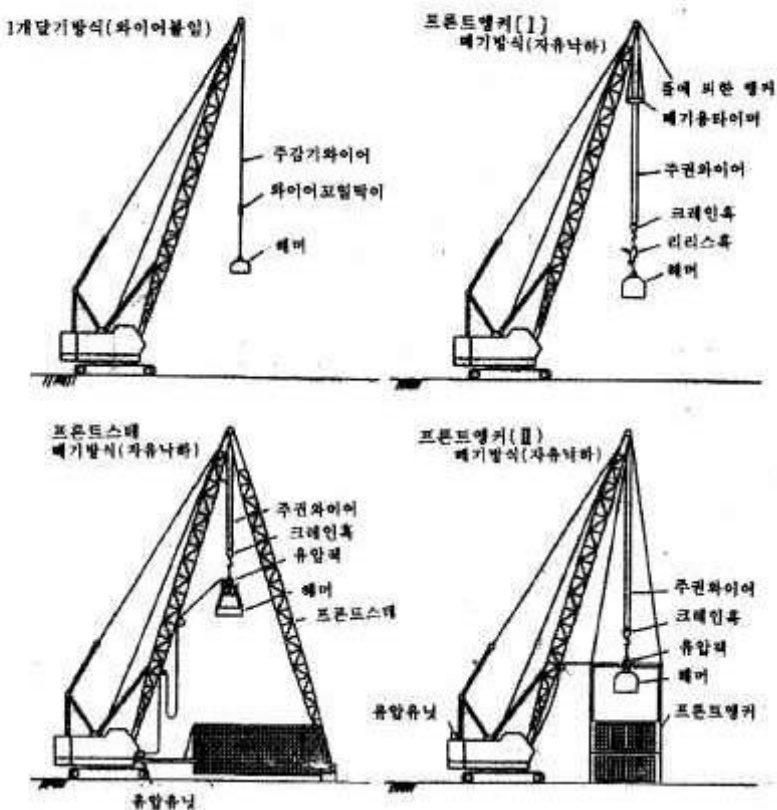  
[그림 1.2-7-21] 표준적인 동압밀 시공도  

# 라. 고결공법  

# (1) 표층혼합처리  

연약지반의 표층에 석회계, 시멘트계, 석고계 등의 첨가제를 혼합하여 안정처리하고 중장비의트래피커빌리티 확보, 저성토 기초, 도로노상부의 개량 등을 하는 것이다. 첨가제와 혼합법의결정에 대해서는 흙의 물리ㆍ화학특성, 다짐특성, 강도특성 등 및 시공성, 재료의 공급, 환경,시공시기 등에 대해서 충분히 검토해야 한다. 일반적으로 모래의 함유량이 많을수록 첨가제의효과가 유효하지만 유기물이 많이 함유된 흙은 효과를 기대할 수 없는 경우가 많다. 가장 적절한첨가제의 종류와 첨가량에 대해서는 사전에 시험배합을 하여 결정한다. 주로 시멘트 등의고화재를 슬러지 상태로 펌프로 압송하여 연약지반에 첨가 및 혼합하는 것이므로 혼합후에도다짐 등을 지나치게 하지 않는다.  

연약지반상에서 대형기계를 사용하여 첨가제를 혼합하는 것은 일반적으로 곤란하므로 안정처리의가능 두께도 $0.5\!\sim\!1\,\mathrm{m}$ 정도로 제한된다. 첨가제에 의한 안정처리는 가급적 심층까지 균일하게혼합하여 동일한 단위중량으로 개량하는 것이 중요하다.  

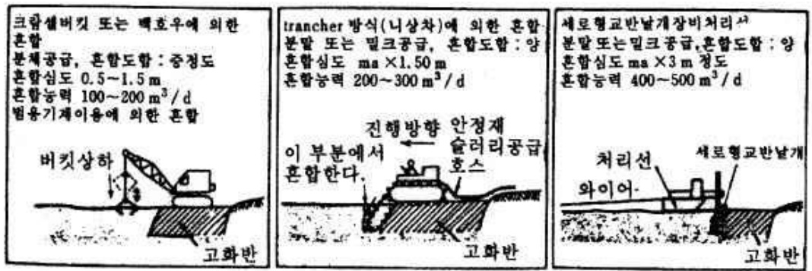  
[그림 1.2-7-22] 표층 혼합처리 공법  

# (2) 심층혼합처리공법  

심층혼합처리공법은 석회, 시멘트계를 주로한 괴상, 분말상 또는 현탁액상의 화학적 안정재를원위치 지반에 첨가하여 원위치에서 혼합하여 연약점성토 지반을 주상, 괴상 또는 전면적으로개량하려고 하는 것이다.  

석회나 시멘트를 흙과 혼합하면 여러 화학적 작용으로 흙이 강화된다. 이들은 생석회의 소화에의한 흡수, 팽창작용, 소석회나 시멘트의 함수비 저하작용, 칼슘의 염기치환작용 등으로서 포졸란반응에 의한 효과가 크다.  

심층혼합처리공법의 특징을 요약하면 다음과 같다.  

일반적으로 개량효과는 물리적 개량효과에 비해서 훨씬 크며 조기에 큰 개량 강도를 얻을 수있으나 연약토의 종류에 의한 개량정도의 차이도 대 단히 크다고 하는 단점을 가지고 있다.  

침하량, 측방이동량 등의 저감효과가 크며 인접구조물에 대한 지장이 적으 며 저진동 저소음으로시공이 가능하다.  

본 공법의 개량효과는 교반혼합의 정도에 좌우되며, 안정재와 연약토와를 어떻게 균일하게혼합하느냐가 시공상의 포인트가 된다.  

본 공법은 원지반의 흙 그 자체를 이용하므로 치환공법과 같은 잔토처분 의 문제가 없고 또시공기계의 성질에서 진동이나 소음과 같은 건설공해 가 생기지 않는다. 그러나 안정재를부주의하게 취급하면 인체에 위험을 미치거나 혹은 주변의 pH 를 높여서 문제가 되는 수가 있다.심층혼합처리공법은 1976 년경부터 일본 운수성 항만기술연구소에 의해서 개발연구가추진되었으며, 1970 년대 중반에는 생석회 및 소석회, 시멘트 슬러리 등의 안정재를 이용하여DLM(deep mixing method) 공법, 슬러리계 기계교반혼합처리공법 CDM(cement deep mixing)등의명칭으로 실용화되었다. 또한 DLM 공법과 동시에 스웨덴에서는 Lime Column 공법이개발되었으며 이 공법은 생석회 분말을 고압공기로 압송하여 지중에 공급하고 교반혼합하는것으로서 현재도 일부 이용되고 있다. 이러한 심층혼합처리공법은 안정재의 차이, 안정재의공급방법의 차이, 또는 혼합방법의 차이에 의해서 매우 많은 종류가 있으며 편의상 기계적혼합처리방식으로 통합할 수 있다. 한편 기계적 혼합처리방식과 달리 약액주입공법을 발전시킨분사혼합처리방식은 고압의 시멘트 슬러리를 분사하면서 분사공을 회전하여 제트에 의한 흙과안정재와의 혼합을 기대하는 공법이다.  

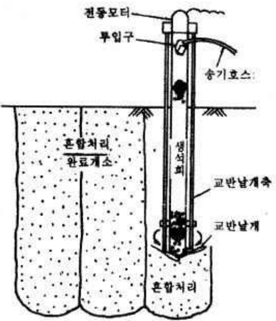  
[그림 1.2-7-23] 심층혼합처리공법 DLM 의 모식도[표 1.2-7-6] 심층 혼합처리공법의 분류  

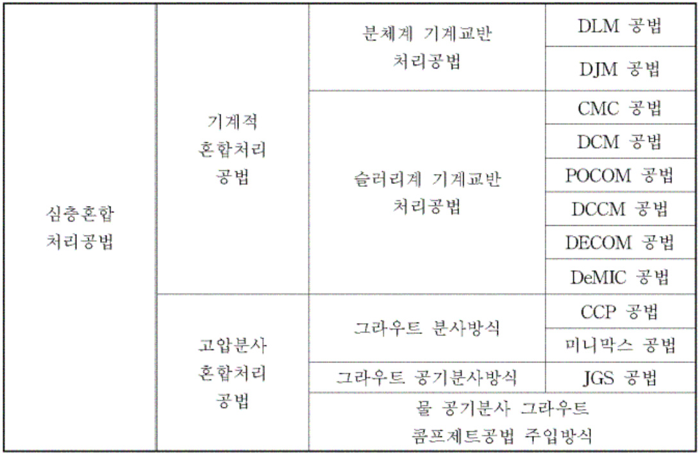  

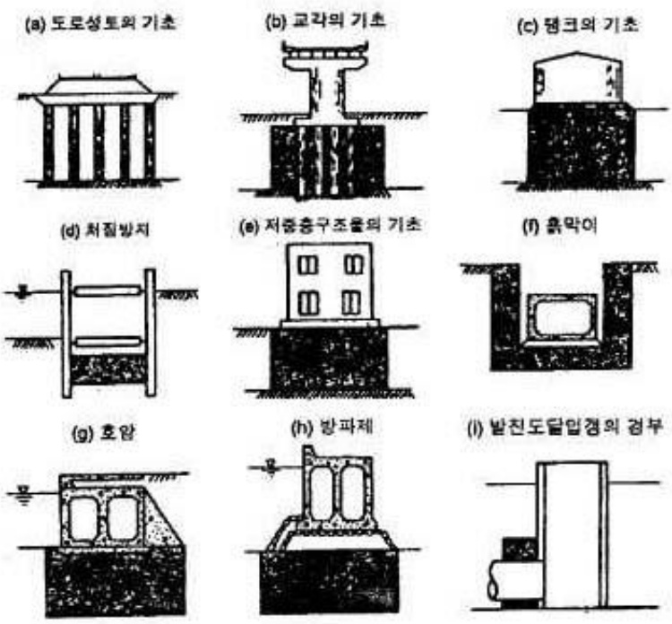  
[그림 1.2-7-24] 심층혼합처리 공법의 적용 예  

(가) 기계식 혼합처리 공법  

기계식 혼합처리공법에서는 괴상, 분말상, 또는 현탁액상의 안정재가 사용된다. 안정재의공급방법은 괴상의 생석회를 이용할 경우에는 스크류 피터가, 분말상의 소석회와 시멘트를이용할 경우와 분말상의 소석회와 시멘트를 이용할 경우에는 압축공기에 의한 공기압송이,그리고 현탁액상의 시멘트 밀크와 모르터를 이용할 경우에는 저압의 펌프압송이 일반적이다.어떠한 경우에도 심층에 이르기까지 안정재를 공급하는 것과 함께 복수의 프로펠러로 원위치의흙을 기계적으로 교반해서 1 사이클의 처리로 지중에 안정처리토의 본체를 형성한다. 지중에연속한 안정처리토의 벽과 블록을 형성하는 경우에는 이 기둥체를 오버랩시켜서 형성하는 것이일반적이다. 기계적 혼합처리 방식의 경우에는 주로 개량대상은 연약한 점성토 지반으로안정재의 양은 안정재와 대상토의 건조중량비에서 $10\!\sim\!20\%$ 정도, 체적 혼합비에서 $30\%$ 정도이하일 경우가 일반적이고, 지반과 혼합처리하여 안정처리토 기둥을 형성한다.  

기계식 혼합처리공법은 주입되는 안정재의 형상에 따라 슬러리계 기계교반 혼합처리공법과분체계 기계교반 혼합처리공법으로 분류된다.  

슬러리계 기계교반 혼합처리공법(CDM 공법)은 DLM 공법의 기술을 기본으로 안정재로서 시멘트슬러리(또는 시멘트 모르터)를 사용하며 1975 년에 실용화된 기술이다. 시멘트 등의 안정재 및혼합재를 각기 계량하여, 믹서로 균등하게 교반혼합해서 슬러리 상으로 하고 이 슬러리를에지테이터에 멈추고, 이어서 압송펌프로 처리기의 선단까지 압송하고 연약토와 교반날개로균일하게 혼합함으로써 소요강도의 개량토를 조성하는 공법으로 다음과 같은 특징을 가진다.  

소요강도는 개량대상지반에 적절한 시멘트 혼합비를 정함으로서 손쉽게 얻을 수 있으며소요강도를 얻기 위하여 첨가제를 사용하여 공기를 충분 히 앞당길 수 있다.  

현장의 연약지반의 고결화는 염수에 의한 오염이나 2 차 오염을 예방한다. 뿐만 아니라 저진동,저소음 공법으로 주변 구조물에 영향을 크게 미치 지 않는다.  

슬러리 투입에 대한 중앙집중 제어 시스템은 개량심도를 향상시키고 회 전속도를 조절한다.  

일반적인 공법에 비하여 막대한 양의 모래와 자갈 없이 연약지반을 개량 하기 때문에 자원을효율적으로 이용할 수 있다.  

고화재를 슬러리화 하기 때문에 저함수비의 토질이라도 물, 시멘트비를 조정함으로서 시공이가능하고 또 시공기계가 다축이기 때문에 교반효율 이 좋아 개량할 수 있다.  

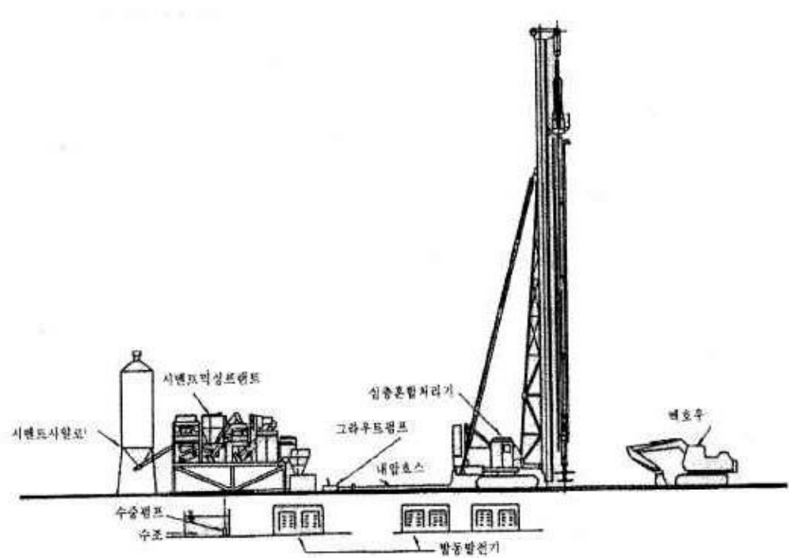  
[그림 1.2-7-25] 심층혼합처리공법 CDM 의 모식도  

분체계의 기계교반혼합처리공법 중 널리 보급되고 있는 것은 DJM 공법이다. DJM 공법은 일본건설성 - 종합기술개발프로젝트의 "신지반개량기술의 개발"의 하나로서 건설성토목연구소(시공연구실)와 일본 건설기계화협회(건설기계화연구소)가 - 중심이 되어서1977 년도부터 79 년도에 걸쳐서 개발된 기술을 기초로하여 실용화된 기술이다. DJM 공법은연약지반 속에 분립체의 개량재를 공급하여 강제적으로 원위치토와 교반혼합되므로써 흙과개량재를 화학적으로 반응시켜서 토질성상을 개량하여 지반의 강도를 높이는 공법으로 다음과같은 특징을 가진다.  

DJM 공법에서는 토질의 성상과 개량목적에 따라 개량재의 종류와 혼합 비를 자유롭게 선정할 수있으며 최대직경이 5mm 정도 이하인 건조상 태의 분립체라면 어떠한 재료도 사용가능하다.  

개량재가 분립체이므로 고함수비의 지반 속에 여분의 수분을 가하는 일 없이 개량재를 혼입하는것만으로도 지반 속의 함수비를 상대적으로 저 하시킬 수 있다.  

개량재가 교반날개 궤적 전면에 균등산포되므로 교반효율이 좋아 적은 교반횟수로 충분한혼합경화가 얻어지고 개량강도의 산포도 적어 경제적 인 설계시공이 된다.  

시공에 있어서 전연 물을 사용하지 않기 때문에 시공공장의 조건에 좌우 되지 않고 진흙배수의처리도 불필요하며, 시공현장을 깨끗이 유지할 수 있다.  

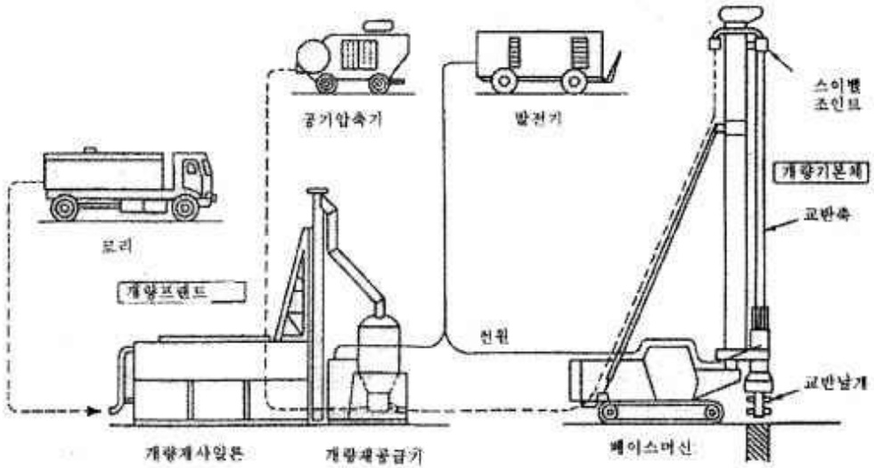  
[그림 1.2-7-26] 심층혼합처리공법 DJM 의 모식도  

(나) 분사식혼합처리방식  

본 방식은 일반적으로 현탁액상의 안정재를 주로 사용하며, 보통 200kg/cm2 전후의 고압에서펌프압송된다. 약액 주입공법을 배경으로 발전해 온 공법이기 때문에 안정재의 종류는 시멘트그라우트, 시멘트에 물유리계 주입재를 가한 것이 주이지만 많은 종류의 주입재 사용이 시도되고있다. 혼합방식도 많지만 기본적으로는 고압의 분사에너지로 특수노즐에서 안정재를 분사하고주변지반을 굴착교란해서 안정재와 원위치 흙의 혼합을 기대하는 것이다. 지수를 목적으로노즐에 방향성을 갖추어 벽상의 안정처리토를 형성하는 것도 가능하고, 고압의 안정재 분사에압축공기를 병용해서 대구경의 개량을 목적으로 하는 방법도 있다. 분사혼합처리방식의심층혼합처리공법의 개량대상은 사질토 또는 점성토이다.  

자갈층을 대상으로 하는 경우에는 침투주입한다. 기계적 혼합처리방식에 비해서 안정재의사용량이 많고, 시공조건에 의해 형성된 안정처리토의 체적이 $40\%01$ 상, 극단적인 경우에는$100\%$ 를 넘는 안정재의 토출이 생긴다. 즉 안정재의 유실에 의한 손실과 부분적으로는 혼합처리보다 치환에 가깝게 되는 경우를 생각할 수 있다. 또한 안정처리토 기둥체의 단면을 보면중심부는 안정재가 주이고 그 주변에 혼합처리토가 존재하고, 흙의 종류에 따라 더욱 그 외주에토립자의 압축된 부분과 안정재가 침투하여 고화된 부분이 확인된 것도 있어 안정처리토의평가에는 주의할 필요가 있다. 다량의 안정재를 압입하기 때문에 지반의 융기와 폐니수의 처리에대해서도 유의해야 한다. 그러나 기계적 혼합처리방식에 비해서 설비가 소형이고, 종횡경사와시공이 가능한 것은 큰 장점이다.  

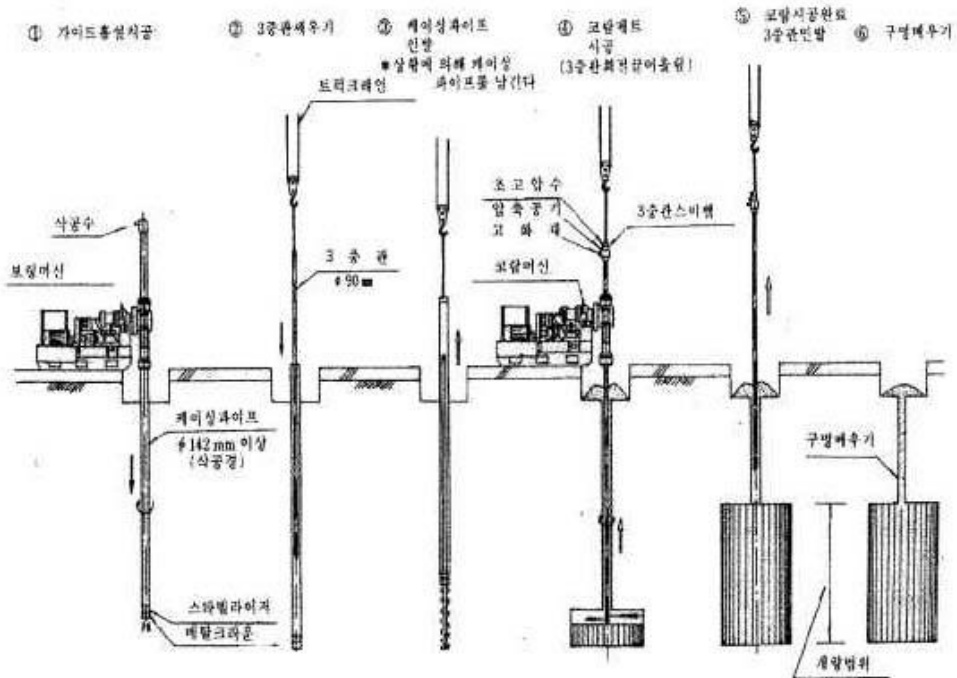  
[그림 1.2-7-27] 분사식 심층혼합처리공법의 모식도(코람제트그라우트공법)(3) 약액주입공법  

주입공법은 주사바늘을 사용하여 체내에 주사하는 것처럼 비교적 가는 관(주입관이라고 한다)을사용하여 여러 가지의 주입재(그라우트라고 한다)를 지반 속에 압력을 걸어서 넣는 것이다.그리고 지반 속의 간극, 공동, 균열 등을 메워서 그 지수성이나 강도증가를 꾀하는지반개량공법의 하나이다.  

연약지반대책으로서의 주입공법의 대상지반은 도시토목에서의 충적층이나 산악터널에서의화산분출물이나 대수성의 강풍화암층에 대표되는 미고결성지반이다. 그 주입목적이나 지반조건,주입효과에 대한 요구도에 따라서는 할열주입을 주체로 한 비교적 약한 층을 개량하는 것만으로충분한 경우도 있지만, 그 굴삭시의 사고의 대부분은 부분적으로는 충분히 고결되어 있지만,고결의 불연속부분에서 용수가 발생하여 토사의 유실, 그리고 전체적 붕괴에 이르는 수가 많다.따라서 미고결성 지반에의 주입은 고결체끼리의 연속성을 어떻게 높이느냐가 중요하며,설계ㆍ시공면에서의 유의사항이 된다.  

주입공법은 간편신속, 또 그 설비도 콤팩트하기 때문에 다른 공법에서는 흉내낼 수 없는 유리한면을 많이 가지고 있다. 그러므로 도시 토목초, 산악공사에서의 굴착시의 가설로서 예부터 널리사용되고 있으며, 수많은 실적도 남기고 있다.  

주입공법의 종류 및 용도는 매우 다양하다. 그러므로 주입재의 지반 속에 들어가기 혹은 넣기에따라서 분류하면 [그림 1.2-8-28]와 같이 된다.  

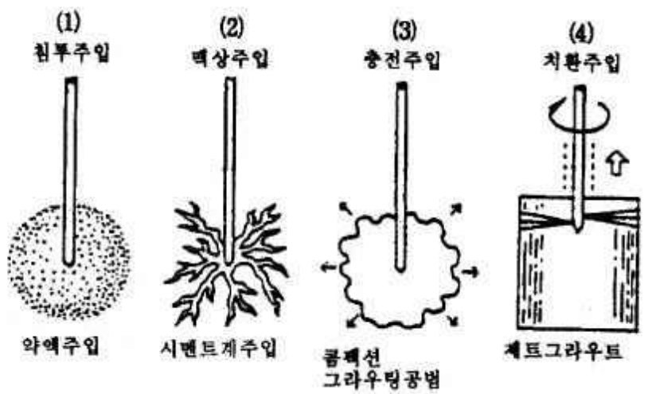  
[그림 1.2-7-28] 주입원리와 주입형태  

(1) 의 침투주입은 약액주입공법의 주류를 이루는 것으로 주입재가 토립자의 골격을 산란시키는일없이 토립자간극에 침투하여 주입한 주입재는 소정의 시간(겔타임이라고 한다)에 고결하여지반을 다진다. 이것은 약액주입 이상으로 하는 주입형태이며, 사질지반 등의 투수성의 지반을대상으로 하고 있다. 이 침투주입에 의한 지반개량의 기구는 약액이 토립자간에 차지하고 있는물이나 공기를 약액으로 밀어내서 치환하는 것이다. 이것은 기계적으로 흙과 고화재를혼합교반하던가, 중기를 사용하여 흙을 다지는 다른 지반개량과 개량기구가 크게 달라서,원래지반이 가지고 있는 토립자 간의 맞물림을 그대로 이용하는 특징을 가지고 있다.  

(2)의 맥상주입은 이미 지반내에 존재하는 균열 혹은 크랙이나 새로운 주입압 등에 의해 지반을할열한 극간에 주입재가 침입해서 맥을 형성하여 고결하는 것이다. 암반주입에서는 이미존재하고 있는 크랙에 주입재를 충전해서 수밀성을 높이는데 사용되고 있지만, 일반의연약지반에서는 과잉한 주입압이나 주입속도 등에 의해서 지반에 생긴 터짐매에 주입재를 밀어넣음으로서, 개량하는 것을 말하고 있다. 암반공학의 분야에서는 이전부터 원유의 채취나지역발전 등을 실시할 경우에는 지반의 수압파쇄를 목적으로 한 할열주입이 실시되고 있지만,지반주입에서는 연약점토지반을 대상으로 해서 시멘트계의 주입재가 이용되어 건물의 침하억제등을 목적으로서 이용되고 있다.  

(3)의 충전주입은 주입재를 지반속에 충만시키는 주입이다. 이 때 지반내에 충전하는 부분이 미리공동으로 존재하고 있을 경우에는 문자대로 공동충전이며 지반침하 등에 의해 생긴 건물과지반과의 극간에 그라우트를 채울 경우의 충전주입이 된다. 한편 강제압입형이라고도 불러야할충전주입방법이 근년 콤팩션그라우팅공법이라는 이름으로 도입되고 있다. 이 방법은 지반 속에공동을 강제적으로 발생시키고 그 부분을 주입재로 채우는 주입이다. 할열이 생기지 않게 공동을만드는 데는 극히 비유동성의 주입재를 비교적 높은 압력으로 지반에 주입하므로서 달성된다.이렇게 하므로서 주입재가 지반내에서 미주하는 일없이 거의 계획대로의 장소에 괴상의 고결체를만들 수가 있다. 주입재로서는 슬럼프 0∼3cm 정도의 시멘트계 소일모르터이고, 그 배합은시멘트, 흙, 역분, 물로 구성되어 있다. 이와 같이 주입재가 유동하기 어렵기 때문에 그 고결체는괴상 내지는 주상으로 경화되어서 지반전체가 융기하고 있는 것이 된다. 이 성질을 적극적으로이용해서 기설의 지하구조물이나 건조물의 부등침하의 수정에 이용하고 있다. 또 구조물의언더피닝도 가능하다.  

(4)의 치환주입은 주입범위의 흙을 고압분사 등에 의해서 배출시키고, 그 배토된 부분에 주입재를충만시키는 방법이다.  

현재 사용되고 있는 주입방식은 주로 $\textcircled{1}$ 단관로드주입, $\textcircled{2}2$ 중관단상주입, $\textcircled{3}$ 2 중관복상주입,$\textcircled{4}2$ 중관더블파커주입의 4 종류가 있다. 이들은 기본적인 사고법에 차이는 없지만, 장치나주입재의 조합 증의 점에서 조금씩 특징을 달리하고 있다.  

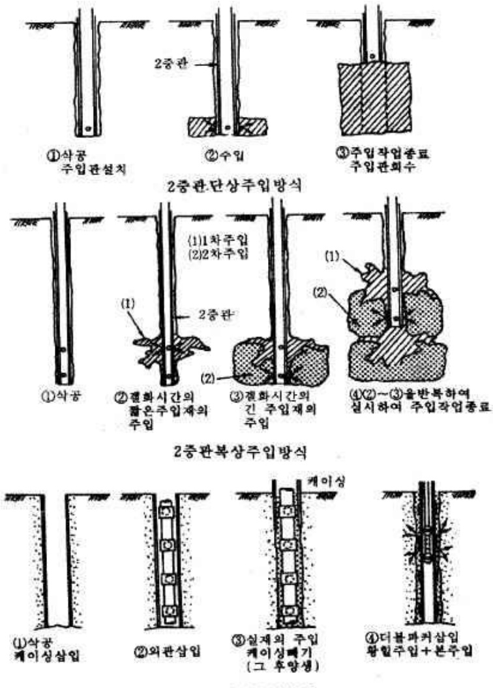  
2중관더불파커주입방식  

[그림 1.2-7-29] 각 주입방식의 기구모식도  

현재 국내 건설현장에서 쓰여지고 있는 주입공법으로서는 물유리계 약액(LW, SGR),우레탄 등이단독 또는 병행되어 쓰이고 있다. 그러나 선진국에서는 이보다 훨씬 개선, 발전된 공법들이 여러가지 이용되고 있으며 난공사구간에는 주입공법과 병행하여 인공동결공법이 쓰여지고 있는실정이다. 기울어진 건물의 원상복구를 위한 몰탈 또는 콘크리트를 주재료로 한 주입공법이 있다.비유동성 재료를 다수의 주입구로 주입시키는 소위 캠팩션그라우팅공법이 바로 그것인데미국에서 실용화되고 일본에서도 부등침하한 건물의 원상복구 실적만도 10 여건에 이른다.국내에서도 최근 포항지방 초연약지반상의 기울어져 철거단계에 있는 5 층 아파트 건물을원상복구하여 사용한 시공사례가  있다.  제한된 공간 복잡한 지하매설물등 여러 가지악조건하에서 성공리에 지하 굴착공사를 수행하기 위해서는 여러 가지 지반주입공법 중에서공사규모나 중대성, 공사비용, 공사기간, 토질조건, 현장시공여건 등을 감안하여 적합한 공법을채택하고 채택된 공법의 정확한 적용방법을 알아야 한다.  

약약주입이란 지반내에 주입관을 삽입,이것을 통하여 화학약액을 지중에 압송, 충전시켜 일정한시간을 지중에 압송, 충전시켜 일정한 시간을 경과시키면 지반이 고결되는 것으로서, 지반의불투수화(차수, 지수)또는 지반강도증대를 그 목적으로 한다. 현행 일반화된 약액으로는 물유리약액이 대부분으로서 차수 목적의 경우는 물유리만, 지반강도증대 목적의 경우는 시멘트를병행하여 사용된다. 한편 댐 그라우팅, 터널이입 그라우팅 등에 적용 되어온 시멘트 그라우팅이란시멘트 현탁액을 펌프로 압송하여 지반내에 고결시키는 것을 말하며, 이때 시멘트와 물은수화반응을 일으켜 sol 로부터 gel 로 되는데 이때 원하는 시간은 온도에 따라 다르나 대략 몇시간의 단위이며, 연속적으로 압송할 경우는 주입가능한 공극이 막히지만 않는다면 시멘트그라우트의 세트되는 장소도 무한히 멀어지게 한다. 이와같이 주입공법은 직접적인 차수공 또는지반개량공으로서, 비교적 간편하게 소규모로도 실시할 수 있고 소음, 진동, 교통난 등의 공해가적으며, 더욱 공기가 짧고 타공법으로는 달성 불가피한 것도 시공할 수 있는 특징을 갖고 있다.본 공법은 흙막이공의 바닥의 히빙방지, 도심지 근접시공에 있어서는 지반굴착시 인접건물의언더피닝, 토류벽의 토압감소, 그리고 마찰말뚝, 선단지지말뚝, 피어기초의 지지력 보강과댐기초의 지수, 쉴드터널 굴진, 대단위 지하철 건설공사에서는 터널 굴진시 지반붕락 방지 등에있어서 광범위하게 적용되고 있으며, 지반진동을 경감하기 위한 대책으로서도 쓰이고 있어최근에는 점차 본격적, 항구적 지반개량공법으로 되어가고 있다.  

(3) 소결공법  

소결공법이란 점토질 연약지반속에 보링구멍을 천공하고, 그 속을 가열하여 주위의 흙을소결하는데 따라 흙의 강도증가, 압축성의 감소 등 흙의 공학적 성질의 개량을 도모하는 것이다.이 공법은 점토를 달구면 벽돌이 된다는 원리로 옛부터 알려진 것이나, 그 소결과정에서의 흙의물리적, 화학적 변화 및 흙의 역학적 변화는 복잡하다. 이와 같이 본 공법의 원리는 옛부터알려져 있지만, 실제로 지반개량공법으로서 개발된 것은 극히 최근의 일이다. 이 공법의 개발은우선 I.M. Litvinov(1963)을 중심으로 하는 소련의 기술자들에 의해 개발되었으며, 소련에서 현재본 공법은 그 효과와 경제성에서 다른 공법에 비교될 만 한 것으로 알려졌다. 특히, 일본에서는일본의 국유철도에서 실용화가 진행되었으며, 실시 예는 많지 않지만 연약지반 개량에 유효한공법으로 발전이 기대되는 공법이다.  

소결공법에 의한 연약지반의 개량은 지반의 수직, 수평, 경사 등 상황에 따라 효과적으로굴착하여 보링구멍을 형성한 후, 가열은 연료를 보링구멍내에서 연소시켜 직접가열하는 방법과구멍밖에서 가열된 고온의 공기를 구멍내에 압입하여 지반을 가열하는 방법이 있다.  

소결공법의 특징은 처리 후 흙의 강도증가 및 압축성의 감소가 다른 연약지반개량공법에비교하여 큰 반면, 그 만큼의 에너지가 필요하여 경제적인 단점이 있다. 또 본 공법이 해외에서성공을 거둔 예는 주로 불포화토의 경우이고, 지하수위가 높고, 대단히 연약한 경우의 지반개량에대해서는 여러 가지 문제점이 남아 있다.  

소결공법이 효과적으로 적용되는 예로서 다음과 같은 경우가 있다.  

노상, 노반의 강화절취사면의 안정지반활동의 방지  

건물, 장비, 굴뚝기초 등의 지지력의 증가, 침하방지부등침하를 받는 구조물의 회복  

언더피닝 (4) 동결공법  

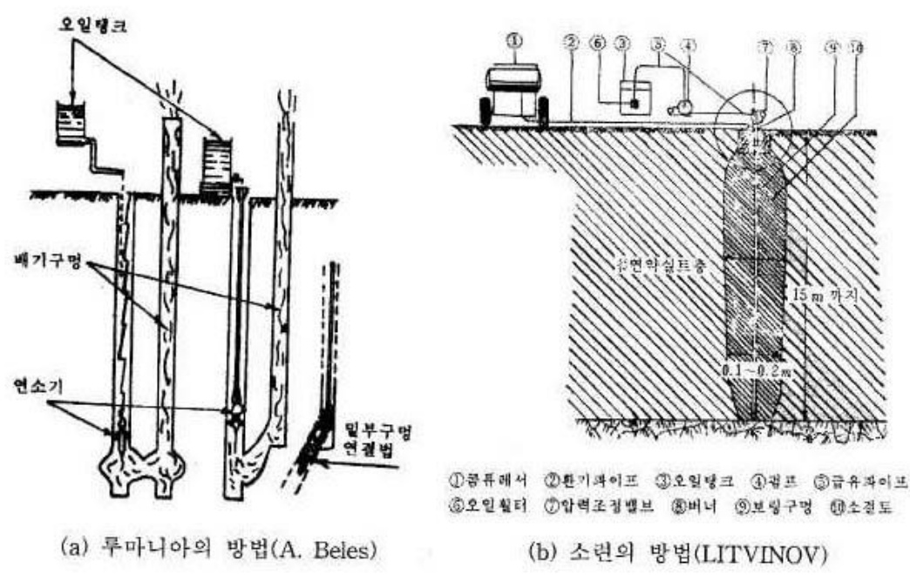  
[그림 1.2-7-30] 연약지반의 가열처리공법  

지반속의 간극수를 인공적으로 얼음으로 바꾸어서 지반을 고화시켜 이 동결지반을 공사중의일시적인 차수벽, 내력벽으로서 이용하는 것이 동결공법이다. 적용이 가능한 지반은 사력층,연약토층, 피압수층 등을 포함하여 모든 토층이다.  

1862 년에 영국의 광산용 수직갱 건설에서 대수층의 붕괴방지에 세계에서 처음으로 동결공법이이용되었다. 도시토목공사에 쓰였던 보기로는 1886 년 스웨덴에서 연장 24km 의 지하도건설이세계에서 처음일 것이라고 생각된다. 지금도 독일, 미국, 캐나다, 중국 등에서 수직갱 건설공사나도시토목에 이용되고 있다.  

일본에서 처음으로 동결공법이 채용되었던 것은 1962 년 오사카에서의 하저횡단수도관부설공사이다. 외국에 비하여 지중온도가 높고, 지반조건도 좋지 않다고 하는 불리한 조건아래에서 일본 독자적인 발전을 해왔다. 개발 당초에는 터널의 하저횡단공사에 쓰이는 일이많았으나 1970 년대경부터는 실드공사의 증가에 따라서 실드의 발진부, 도달부, 급곡선부, 지중접합접속부의 방호를 위한 동결공법의 적용이 늘어나서 오늘날에는 시공실적의 대부분을차지하고 있다. 도시터널의 건설공사가 대구경화, 대도심화되는 가운데 특히 사력지반속에서의높은 수압에 대하여 완전한 차수벽을 목적으로 해서 적용되는 일이 눈에 띄게 되었다.  

동결 대상지반속에 매설한 동결관이라고 부르는 직경 10cm 전후의 강관 속에 빙점 이하의저온액을 계속 공급하면 관의 표면에서부터 주변의 지반이 냉각되어 동심원형으로 동토가성장한다. [그림 1.2-7-31]에서 보는 바와 같이 적당한 간격으로 동결관을 매설해 놓으면 각자의관을 중심으로 한 나이테 모양으로 동토의 기둥이 성장하여 드디어는 이웃하는 동토의 기둥이서로 합체되어 일련의 동토벽으로 된다.  

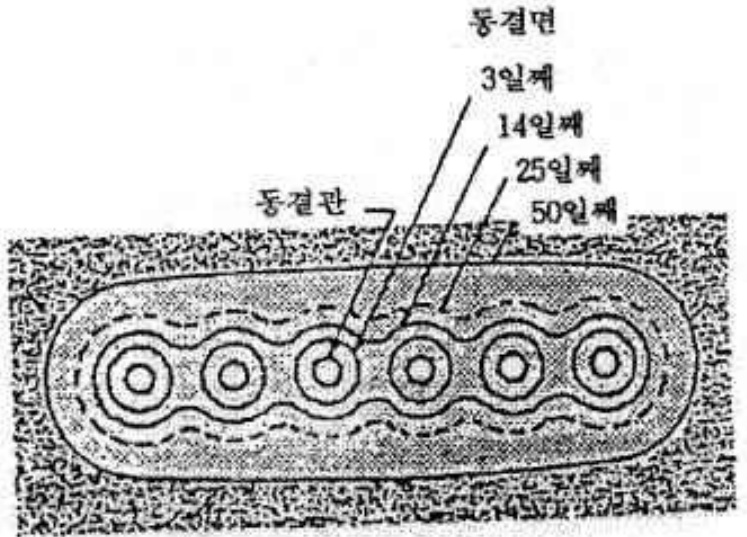  
[그림 1.2-7-31] 동토기둥의 성장에 따른 동토벽 형성  

굴착의 형상에 따라서 동결관을 지상 또는 수직갱 등으로 매설함으로서 [그림 1.2-7-32]에예시하는 바와 같은 동토벽을 완성시킨다. 동토의 형상은 동결관만 매설할 수 있으면 원추형,주판형, 말발굽형이나 그들의 복합형 등 공사내용에 따라서 자유롭게 형성시킬 수 있다.  

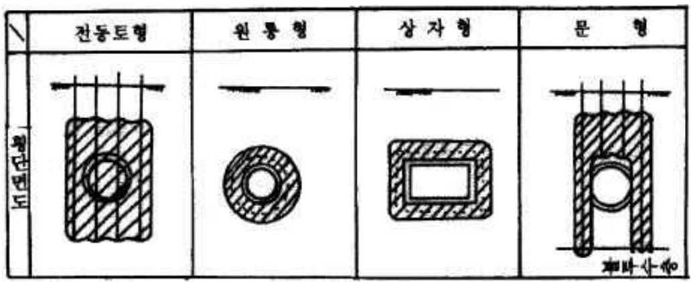  
[그림 1.2-7-32] 동토벽의 대표적 형상  

동결방식은 동결관에 공급하는 저온액의 차이에 따라서 [그림 1.2-7-33]에서 보는 2 가지 방식으로나누어진다. 브라인방식은 브라인(염화칼슘용액:비중 1.286 에서 빙점 $-55\,\mathrm{^c}$ )을 압축기, 응축기,냉각기 등으로 되어 있는 냉동사이클에 의해서 - $-25^{\circ}\!C\sim-35^{\circ}\!C$ 로 냉각하여 이것을 순환펌프로동결관 속으로 순환시킴으로서 지반을 냉각시킨다. 액체질소방식은 액체질소(비등점 - $\cdot196\,^{\circ}\!C\,]$ )를직접 동결관으로 흘려넣어 주로 그 기화열로 지반을 냉각시킨다. 일본에서는 대부분의 시공이브라인방식이며 냉각기 100 마력당의 대상동결토량은 $400\!\sim\!700\!\;\mathrm{~m}3$ 정도이다. 냉각탑 이외의기기는 유니트화되어 현장에서는 방음벽을 설치한 기계실에 수용된다. 그 크기는 100 마력유니트로서 $2\mathsf{m}\!\times\!4\mathsf{m}\!\times\!2\mathsf{m}\mathsf{H}$ 정도이다. 대상동결토량이 200m3 이하로서 단기간의 소규모공사에서만액체질소방식이 사용된다는 것이다.  

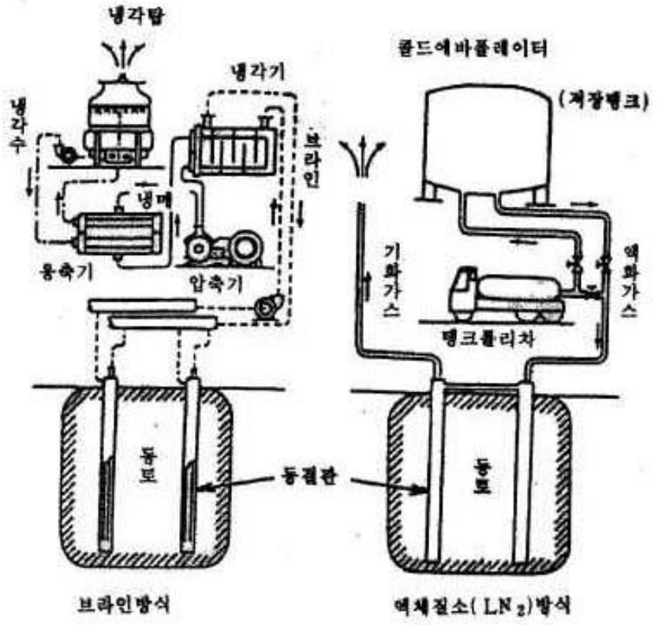  
[그림 1.2-7-33] 동결방식의 예  

열에 의한 지반개량인 동결공법에는 다음과 같은 특징이 있다. 가장 큰 이점은 동토의 역학적강도가 커서 흙의 강도는 동결에 따라서 100 배 가까이나 증가되므로 토수압에 대항하는내력벽으로서 이용할 수 있다는 것이다. 또 강재나 콘크리트 등의 동착력(접합력)도 크므로 다른부재와 연속된 차수벽ㆍ내력벽으로서 이용할 수 있다. 그 밖의 이점으로서는 열이 높은 곳에서낮은 곳으로 흐르고자 하는 성질을 이용하기 위하여 균질하지 못한 지반에서도 균일 두께의동토벽이 생긴다. 또 지반을 굳히는 데에 열 이외에 약제 등을 쓰지 않으므로 공사중에는 물론공사의 완료 후에도 지반의 오염이 없다는 것 등을 들 수 있다.  

한편 단점으로서는 흙에 따라서는 동결될 때에 체적이 팽창하고 해동될 때에는 반대로 수축하여근처의 기설구조물에 영향을 미치는 경우가 있다는 것이나 어떤 특정의 유속 이상의 지하수류가존재하는 경우에는 동토벽을 완성하기 위하여 유속의 완화대책이 필요하게 되는 것 등을 들 수있다. 지반의 열전도를 이용하기 위하여 필요한 동토벽을 조성하는 데에는 어느 기간이 필요하게되는 것도 다른 공법과 비교할 때에는 결점으로 꼽을 수도 있다.  

# (6) 전기고결공법  

통전에 의하여 상기의 전기침투현상이 일어남과 동시에 간극수중에 원래 존재하던가 인위적으로투입한 전해질 이온 또는 콜로이드 물질 등은 전하의 부호에 응하여, 각각의 극으로 전기영동을시작한다. 이것들은 애당초 인위적으로 투입한 타물질 또는 자연적으로 토중에 존재하는 물질과반응하여 침전 고결현상을 일으킨다. 전기 고결공법은 모두 이 기구를 응용한 것으로서 대표적인것으로는 알루미늄 전극법과 전기주입법의 두 가지가 있다.  

알루미늄 전극법  

지중에 삽입하는 전극재료로서 알루미늄을 사용하는 경우, 탈수작용에 더하여 극재료에서 전해된알루미늄을 토립자 간극에 침전 고화시키는 전해고결작용이 일어난다. 그 고결원리는 명확하지는않지만 우선 예상되는 것으로는 $\textcircled{1}$ 전기침투탈수에 의거한 전체적인 강도증가와 더불어 부분적탈수속도의 차이에 의해 생기는 국부적인 고결층의 형성, 그리고 $\circled{2}$ 전극 알루미늄의 용해에 의한수산화 알루미늄의 석출과 아울러, $\circled{3}$ 알루미늄이온과 점토 입자 표면과 사이의 이온 교환에 의한토질변화 등을 들 수 있다. 다음은 상기 $\circled{2}$ 의 기구에 대하여 약술한다.  

토양콜로이드는 음양의 이온 및 물을 흡착하고 있으며, 토중 통전에 의하여 흡착하고 있는 $\textsf{N a+}$ .K+, ${\tt C a}2+$ , $\mathsf{A l3+}$ 등의 양이온은 음극을 향하여 이동하고, 거기에서 금속을 석출하여 H2 가스를방출하며, NaOH, KOH 등을 발생시킨다. 따라서 음극 부근은 알카리성 지대로 된다. 한편 토중의SO42-, Cl-, CO32- 등의 음이온은 양극을 향하여 이동하고, O2, Cl2 가스를 방출하며, H2SO4,H2CO3 등이 생겨서 부근은 산성지대로 된다. 산성지대인 양극측의 극재료로서 알루미늄을사용하면, 알루미늄은 이온화하여 용출하고, 존재하는 SO42- 등과의 반응에 의하여, $\mathsf{A l3+}$ , $\mathsf{H}+$ ,SO42-, Al2(SO4)3 가 공존한 상태로 된다. 또 알카리성 지대인 음극측에서는 $\mathsf{A l3+}$ 는 Al(OH)3 의모양으로 존재하며, NaOH 와 반응하여 $\textsf{N a+}$ , $\mathsf{A l3+}$ , OH-, AlO2-의 공존 상태에서 용해하고 있다.  

이들 양지대의 중간부에서는, 그 산성측의 $\mathsf{A l3+}$ 는 OH-와 반응하여 Al(OH)3 을 석출하고,알칼리성측의 AlO2-는 H+ 및 H2O 와 반응하여 역시 Al(OH)3 을 석출한다. 이것들은 가열이나탈수 등의 물리학적 원인에 의하여 결정성 Al(OH)3 으로 되고, 다시 결정성인 보기사이트,알미나로 변화해 간다.  

이들 물질은 물에 용해되지 않고, 또 화학적으로 안정하다. 또 상기한 것으로서 그 생성위치는간극수의 pH 에 지배되어 변한다는 것을 알 수 있다. 전기침투탈수뿐인 경우는 증가한 흙의강도는 재차 물을 먹었으면 연화되지만, 상기한 공법의 경우에는 처리토가 극히 불투수화되어있고, 물에 담가도 장기간에 걸쳐 고결상태를 보유하여, 스레이킹을 일으키는 일이 없다. 다라서본 공법은 기초지반이나 말뚝지지력 개선 등에 이용되는 수가 많다.  

# 전기주입법  

전극 자체의 용출은 아니고, 각종의 경화성 액체를 인위적으로 전극부근에 보급하여, 이것을전기침투적으로 또는 전기영동적으로 토중에 주입하여 지반의 고결화를 도모하는 방법이 전기적주입고결법이다. 그 특징은 보통의 기계적 주입으로는 실시불가능한 세립지반에도 적용되는 점과주입재를 임의의 방향으로 유도할 수 있는 점이다.  

이 경우 재료의 토중 이동기구는 다음의 둘로 대별된다.  

전기침투에 의한 간극수의 탈수이동을 다라 액체인 채로 유도된다.  

비전해질재료 자체의 극성, 전해질전난 이온의 극성에 응해서, 대응전극의 방 향으로전기영동적 이동을 한다.  

사용재료의 성질에 따라서, 그 어느 한쪽이거나 또는 쌍방이 동시에 야기된다.  

이 공법의 가장 대표적인 예로서, 물글라스 전기주입법이 있다. 음극으로 보급한 물이 물글라스(NaHSO3)을 액체인 채로 또는 SiO32-의 형으로 양극의 방향에 유도하고, 이것이 토중의 ${\tt C a}2+$Mg2+와 반응하며, 규산 겔을 생성하고 침전고화되는 것이다.  

또한 적극적인 고결법으로서, 물글라스와 염화칼슘을 사용하여, 그 전해 중합을 도모하는 방식도있다. 양극에 CaCl2 를 삽입하면 ${\tt C a}2+$ . Cl 로 해리하여 Ca2+는 음극으로 영동하고, 한편 음극에삽입한 NaHSO3 은 $\mathtt{N a+}$ , SO32-로 해리하여, SO32-는 양극으로 이동하는 것에서, 상방의 이온이양극간의 토중에서 회합하여 CaSiO3 가 생겨 침전경화가 일어나는 것이다.  

# 마. 보강공법  

(1) 시트(sheet)공법  

사람이나 기계도 진입되지 않는 초연약지반에서는 무엇인가의 도움을 받지 않으면 샌드매트 등의성토가 안된다. 시트공법은 연약한 표층에 보강재를 설치하여중장비의 트래피커빌리티 확보,저성토 기초, 도로노상부의 개량 등을 하는 것이다. 옛날에는 나뭇가지 등을 깔아서 이 목적을달성하였다.(영어로 그 나뭇가지를 가는 것을 파고토라고 불렀기 때문에 이 목적에 사용되는시트공법을 파고토공법이라고도 부른다).  

또한 죽졸(대나무를 영어로 뱀브라 부르기 때문에 뱀브공법이라고도 부른다)을 쓰거나나뭇가지를 쓰는 경우도 있다(부졸공법).  

최근에는 합성수지의 발달에서 수지망을 쓰는 경우도 많으며 부망공법이라던가 네트공법이라고부르고 있다.  

특수한 것으로서는 로프에 따라 큰 그물을 만드는 공법(로프네트공법이라 부른다)도 있다.부졸공법이나 로프네트 등의 망눈이 커서 모래가 간단하게 통과되는 공법에서는 이것을 막기위해 시트공법이 병용되고 있으나 일반적인 방법이다.  

이들 표층 처리공법을 정리하면 [표 1.2-7-7]과 같다.  

[표 1.2-7-7] 표층보강공법  

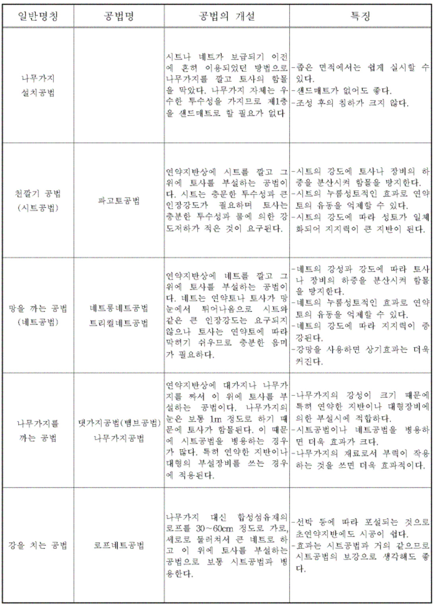  
시트의 포설방법은 지반의 조건이나 주변의 모든 조건을 고려하여 다음과 같이 한다.  

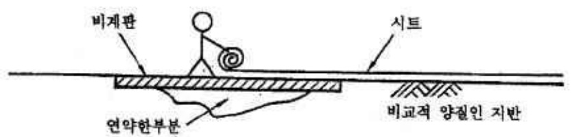  
비교적 양질인 지반  

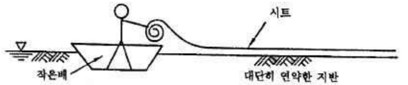  
6 양기술의 지반과 포실하는 지반이 매우 연야한 지반  

  
3 양기슭의 지반은 양호하며 포설하는 지반이 매우 현야한 지반  

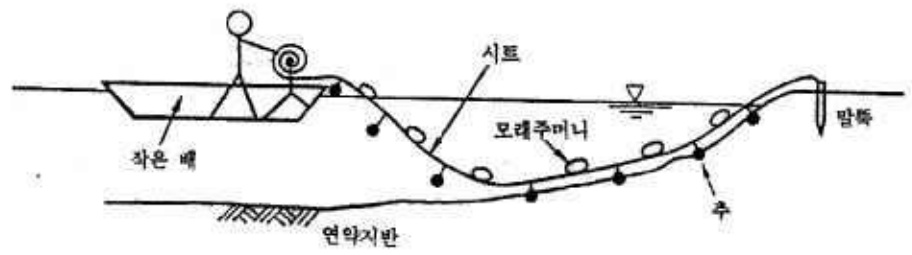  
수면보다 상담히 갚은 연약지반[그림 1.2-7-34] 시트포설방법  

# 1.2-8 국내 연약지반 개량 사례  

최근에 국토의 효율적이고 균형적인 발전을 위하여 내륙뿐만 아니라 해안지역까지 새로운공간개발이 진행되고 있다. 특히, 이와 관련하여 해안지역에서는 인천신공항, 부산신항만,서해안고속도로, 율촌공단, 아산만공업단지, 군장산업단지 등과 같은 크고 작은 국책 및 민간건설사업이 진행되고 있다. 향후에는 해상신도시, 해상공원, 인공섬 등과 같은 사업이 더욱활성화 될 것이다.  

가. 서해안지역  

서해안의 경우는 인천 남동공단 및 영종도 신공항을 제외하고 목포 이북지역으로는수직배수공법은 사용치 않았으며, 대부분 성토에 의한 자연압밀을 적용하는 형태를 취하였다.서해안 공사지역의 토층상태를 살펴보면 연약층의 심도가 낮기 때문에 압성토에 의한 압밀이가능하였으리라 판단된다. 인천지역의 토질특성은 ML 성분이 강하게 나타났으며, 점토 함유율이매우 낮아 압축성이 작을 것으로 판단되며, 아산 및 금강지구도 타 지역에 비해 압축성이 작아무처리와 성토에 의한 자연압밀을 시켜 안정을 도모한 경우가 많았다.  

모래 성분에 퇴적되어 있는 지역은 조류의 양상에 따라 불규칙한 분포를 보이고 있으나대체적으로 서해안 측에서 많이 발달되어 있으며, 특히 아산지역 및 금강하구 지역에서는  

대규모의 사질토층이 나타나기도 한다.  

# 나. 남해안지역  

남해안의 경우 대단위 매립현장이 조성되는 지역은 광양만지역 및 부산지역이며, 국부적으로해남, 고흥, 마산지역에서는 매립공사를 시행하였거나 할 예정이다. 연약지반 처리공법의 형태를살펴보면 팩드레인공법과 페이퍼드레인공법, 샌드드레인공법이 성토와 병행하여 복합적으로사용되었으며, 특별히 지역적 특성도 보이지는 않는 상황이다.  

특히, 신호공단, 명지주거단지, 김해지역에서 샌드드레인공법, 팩드레인공법 등의 공법이 사용되는이유는 상부층에 모래층이 분포하는 이유로 판단되며, 여수지역의 경우 또한 광양제철측에모래층이 분포하고 있으므로 페이퍼드레인공법과 타 공법을 병행되어 사용되는 것으로 판단된다.또한, 남해안의 경우 광양만지역은 준설매립이 대부분을 차지하여 이러한 이유는 매립재의부족한 실정과 항로 준설의 복합적인 조건을 만족하기 위한 선택이었다고 판단된다.  

샌드드레인공법은 남동부지역(경남, 부산)에 밀집되어 있는 양상을 보이고 있으며, 이러한샌드드레인공법 사용은 지역적, 시간적 영향을 복합적으로 받은 것으로 판단된다. 진공압밀공법의  경우, 1995 년 광양 컨테이너 부두에서 시험 시공된 후, 1996 년에 김해하수종말처리장에서 지반개량공법으로 시공되어 심도가 깊은 점성토 지반에 본격적으로 시공되고있는 추세이다.  

연도별 연약지반 개량공법의 대표적인 시공사례는 [표 1.2-8-1]과 같다. 연도별로 그 사례를살펴보면 연직배수 처리없이 성토에 의한 자연 압밀은 꾸준히 사용되고 있으며, 앞서 고찰한바와 같이 지역적인 특색이 더 강하게 나타나고 있는 실정이다. 페이퍼드레인공법은 무처리사용실태와 마찬가지로 꾸준히 사용되고 있으며 현재까지도 각광을 받고 있는 실정이다.  

[표 1.2-8-1] 연도별 연약지반 개량공법 시공사례  

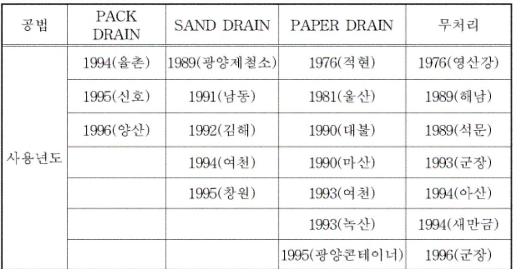  

현재, 국내에서 매립공사가 시행되는 지역의 대다수가 수심 25m 이내의 연약지반 층두께가$10\!\sim\!30\mathsf{m}$ 이내의 지역에 집중되어 있으며, 사질토층 이상의 조립토층이 점토층과 교호되지 않는지역이 대부분이기 때문에 페이퍼공법이 많이 사용되고 있다. 또한, 연약층 상부의 표준관입시험치가 0 에 가까워 주행성이 매우 나쁘므로 타설장비의 경량화 문제가 대두되었기 때문이다.  

샌드드레인공법과 팩드레인공법은 약간 시대적인 경향을 띄고 있는 실정이다. 1980 년대 말1990 년 초에는 샌드드레인공법이 많이 사용하였으나 1994 년 이후에는 거의 팩드레인공법을사용하는 실정이다. 팩드레인공법이 도입된 초기에는 사용실적의 부족과 신뢰도 측면에서 매우부정적이었으나 현재는 많은 현장에서 사용중에 있으며 사용효과 또한 입증된 상태이다. 그이유는 팩드레인공법과 샌드드레인공법이 유사한 점이 많으면서도 샌드드레인공법에 비해스미어존(Smear Zone), 배수재의 절단 가능성이 적다는 장점을 갖고 있으며 모래 양의 절감 및시공성이 좋기 때문이다.  

  
[그림 1.2-8-1] 국내 대표적 연약지반 개량공법 시공사례  
[표 1.2-9-1] 연약지반 대책공법별 특징 및 공사비  

# 1.2-9 연약지반개량공법별 특징 및 경제성 분석  

연약지반개량의 목적은 지반의 강도를 증가시켜, 지반상에 만들어진 구조물의 파괴 및미끄러짐을 방지하려는 것이다. 연약지반개량은 각 지반의 특성, 시공장비 등 기타 현장 여건들에의해 적합한 공법이 사용되어야 하나, 각 공법별 시공실적이 많지 않은 실정이며, 실질적으로대상공사에 대한 최적의 효과를 기대할 수 있는 공법의 선정이나 지반조건에 대한 면밀한 검토가이루어지고 있지 못하다. 현재 국내에서 실시한 공법을 실적위주로 선별하여 아래와 같이개략적인 공법의 특징과 공사단가를 비교하면 [표 1.2-9-1]과 같다.  

  

# 제3 절 기술분류 및 분석범위  

# 1.3-1 기술의 분류체계  

연약지반 개량기술은 크게 치환공법, 압밀ㆍ배수공법, 다짐공법, 고결공법, 보강공법 등으로 분류할 수 있다. 이러한 공법내에는 수십개의 단위공법으로 세분류를 할 수가 있어 전체적으로는수십개 및 수백개의 공법으로 구성이 된다. 본 과제에서는 연약지반 개량기술을 국제기준에 따라대분류 5 개, 소분류 16 개 공법으로 분류하여 분석하였다.  

  

# 1.3-2 분석기술의 내용  

가. 정보자료의 원문수집 및 선별  

특허청에 의해 사업총괄관리기관에서 작성하여 특허청의 승인을 받아 제공하는 연약지반개량기술관련 기술체계 및 선행기술 조사리스트에 의해 기술원문을 수집하여 분석하였다.  

[표 1.3-2-1] 분석데이터 산출근거   

  

본 연구에서 분석에 사용한 데이터들의 선정기준은 다음의 [표 1.3-2-2]와 같다.  

  

선별된 데이터의 기준 : 본 연구에서는 [표 1.3-2-2]의 검색식으로 수집한 특허 중에서 [표 1.3-2-3]과 같은 기준으로 데이터를 선별하여 분석하였다.  

  

나. 정량분석  

선행기술 기본조사 자료를 통하여 다각적인 방면에서 기술동향 분석  

불특정 다수기업 및 다수인을 위하여 기술적인 설명을 이해하기 쉽게 해석하여 Patent Map 의기술동향 분석  

미래기술개발 방향설정, 경영자 및 기술자의 경영기술정보적 판단자료로 활용되고 실무적인응용자료가 될 수 있도록 작성  

국내 현장여건을 고려하여 기술체계상 향후 개발 시 발전이 예측되는 기술분석 등을 실시  

다. 정성분석  

기능별 세부기술 분석, 정리, 종합(초록)  

기술과 기술의 상관관계 확인(공법 및 재료의 변천과정 등)  

특허권리범위 및 분석대상 세부기술의 체계화(기술체계 및 발전 분석)  

기본특허에서 현재까지의 기술전개(기본특허 및 특허망 확인 등)  

구체적인 개발과제의 체계화, 장래예측(과제체계분석, 과제추이분석) 등  

기타 PM 작성상 필요한 사항 분석  

  
[그림 1.3-2-1] 본 연구의 내용 및 범위  

# 제4 절 분석내용별 활용방법  

본 연구에서는 연약지반 개량기술을 크게 치환, 압밀/배수, 다짐, 고결, 보강의 5 가지로대분류하였으며, 세부기술로 16 가지의 기술을 선정하여 분석하였다. 특히 특허분석을 전문가가아니라도 쉽게 파악할 수 있도록 연도별, 출원인별, 국가별로 구분하여 분석하였다.  

본 연구의 분석내용별 활용방법은 다음과 같다.  

  

  

  

  

  

  

  

  

# 제2 장 특허정보분석 및 기술개발동향  

# 제1 절 전체동향 및 개요  

본 장에서는 연약지반 개량기술의 특허출원 동향을 출원연도, 출원인, 출원국가, 출원공법으로구분하여 전체적인 흐름을 살펴보았다. 즉, 연약지반 개량 기술의 변화를 두드러진 출원국가,중점적인 출원연도, 상위 출원인 등으로 살펴봄으로써, 출원건수 기준으로 연약지반 개량기술이전체적으로 시간, 지역, 회사에 대하여 어떻게 발전하고 있는지를 분석하고자 하였다.  

# 2.1-1 연약지반 개량기술 전체동향  

가. 출원연도별 출원동향  

연도별 출원동향을 살펴보면, 1970 년대 후반부터 특허출원이 시작하여 1980 년부터 출원건수가증가하다가 1983 년을 기점으로 특허출원이 감소하는 경향을 나타내고 있다. 또한, 1990 년대부터급속히 특허 출원이 증가하여 1994 년도에 가장 많은 특허 출원이 발생하였고 그 이후 점차감소하는 경향을 나타내고 있다.  

1980 년대 중반까지 특허출원의 증대는 대규모 산업단지 조성 등으로 인한 인근 해안개발의필요성으로 인한 연약지반 개발의 필요성이 증대되어 점차 증가율이 높아진 것으로 사료된다.반면, 1994 년대부터 특허출원이 급속하게 증가하는 추세를 보이고 있는데, 이는 과거 개발된기술의 개량 또는 개선, 특수한 연약지층의 개량, 새로운 장비의 개발 적용 등 연약지반 개량기술 및 관련분야의 기술 개발에 기인한 것으로 사료된다. 더욱이 1990 년대 이후부터지적재산권에 대하여 일반에 대한 관심과 환경보전 등 사회적 인식이 높아진 것도 이러한 상승의원인으로 작용하였다고 볼 수 있다.  

  
[그림 2.1-1-1] 출원연도별 출원동향(연약지반 개량기술/전체)  

나. 출원인별 출원동향  

연약지반 개량기술에 대한 출원인별 특허출원 동향을 살펴보면, 대부분 일본의 기업에서특허출원 건수가 많은 부분을 차지하고 있는 것으로 나타났으며, 상위 5 개 사의 출원건수는 각각124～187 건을 차지하고 있다. 이중 Fudo Construction Co Ltd 가 215 건으로 가장 많은 특허출원을 하였으며, 그 다음으로 Kyokado Engineering Co Ltd, Shimizi Corporation, OhbayashiCorporation, Kajima Corporation, 등으로 나타났다.  

상기 출원인의 연도별 특허출원을 살펴보면, 1980 년대 초반에는 Kyokado Engineering Co Ltd 와Fudo Construction Co Ltd 의 두 회사의 특허 출원이 많은 것으로 나타났으며, 1990 대 이후부터Ohbayashi Corporation, Shimizu Corporation 의 특허출원 건수가 많은 것으로 나타났다.  

특히, Fudo Construction Co Ltd 와 Kyokado Engineering Co Ltd 와 Fudo Construction Co Ltd 는1980 년대부터 1990 년대 후반까지 지속적으로 특허출원을 한 것으로 분석되었다.  

[그림 2.1-1-3]은 연약지반 개량기술 특허출원에서 출원인별 상위 5 개사의 출원건수를 나타낸것이다.  

  
[그림 2.1-1-2] 출원인별 출원동향(연약지반 개량기술/전체)  

  
[그림 2.1-1-3] 출원인별 출원건수(연약지반 개량기술/전체)  
다. 국가별 출원동향  

국가별 특허출원을 살펴보면, 총 5,993 건 중 일본이 출원한 특허건수는 5,356 건으로 전체의 약$90\%01$ 상을 차지하고 있으며, 그 다음으로 한국이 $4\%$ , 미국과 유럽이 각각 $3\%$ 정도 분포하고있다.  

이러한 경향은 일본의 지형과 지리적 특성에 기인하고 대규모 간척사업 등으로 각종 기간시설물의 축조 등으로 연약지반의 개량 등이 필요하였기 때문이다. 또한, 전세계 건설시장의$25\%$ 를 차지하는 건설시장의 규모가 주원인이라 판단된다.  

한편, 한국은 일본 다음으로 특허출원이 약 200 건으로 이는 국내 대규모 산업단지 및택지개발을 위한 간척사업을 실시한 영향이 있는 것으로 판단된다.  

  
[그림 2.1-1-4] 출원국가별 출원동향(연약지반 개량기술/전체)  

라. 공법별 출원동향  

공법별 출원동향을 살펴보면, 전체 5,993 건 중 고결에 관련된 특허출원이 $67\%$ , 압밀에 관련된특허출원이 $24.5\%$ 로서 전체의 약 $91\%01$ 상을 차지하고 있다. 보강 및 다짐에 관련된 특허출원은각각 약 $4\%$ 로 나타났다.  

연약지반은 고함수비 및 저강도 등으로 일반지반과는 다른 특성을 지니고 있기 때문에 적정강도를 갖추기 위해서는 시멘트, 약액, 고화제 등으로 연약한 점토를 고결시켜야 한다. 그러므로,연약지반 개량 특허출원건수도 대부분 고결에 대한 특허출원이 많은 것으로 판단되고,1980 년대에는 시멘트, 약액 등을 이용한 연약지반 개량기술이며, 1990 년대부터는 연약지반의강도증진을 위하여 새로운 재료 및 장비 개발로 1994 년도에는 특허출원 건수가 큰 폭으로증가되었다. 특히, 1990 년대 중반은 환경에 대한 관심으로 고결재료에 대한 다양한 재료개발과장비개발이 주를 이루고 있다.  

연약지반개량기술 중 압밀공법은 1980 년대부터 최근까지 꾸준한 특허출원이 이루어지고 있다.  
압밀공법의 특허출원은 주로 장비에 관한 특허출원이 많다.  

특히, 최근에 연약지반 보강공법의 특허출원이 조금씩 증가하고 있는데 이는 연약지반 상에구조물 건설이 증가하고 있음을 나타내며 이러한 경향은 앞으로도 지속될 것으로 판단된다.  

  
[그림 2.1-1-5] 공법별 출원동향(연약지반 개량기술/전체)  

  
[그림 2.1-1-6] 공법별 출원비율(연약지반 개량기술/전체)  

# 제2 절 기술분야별 동향  

# 2.2-1 치환공법  

가. 출원연도별 출원동향  

치환공법에 대한 연도별 출원동향을 살펴보면 [그림 2.2-1-1]과 같다. 전체출원건수 18 건 중일본의 출원건수가 13 건으로 전체의 $70\%$ 이상을 차지하고 있는 것으로 분석되었으며 한국이3 건, 미국과 유럽이 각각 건을 출원한 것으로 나타났다.  

일본의 경우 1970 년대 후반부터 특허가 출원되어 80 년대 중반과 90 년대 중반에 걸쳐 1 건 내지2 건씩 출원되다가 1996 년 이후에는 특허가 출원되지 않고 있다. 미국의 경우는 1984 년에1 건이 출원되었으며, 유럽의 경우는 1982 년에 1 건 출원되었다. 한국의 경우는 1997 년에 2 건,  

2000 년에 1 건이 출원되었음을 알 수 있다.  

전체적으로 치환공법에 관련한 특허출원건수가 상당히 낮음을 알 수 있었는데 치환공법은연약지반을 양질토로 치환하는 것이므로 시공적으로는 확실한 지반개량이 가능하나, 치환심도, 폭,단면형상, 치환재료, 치환방식, 경제성 등 공법의 적용에 있어 많은 인자를 고려하여야 하며, 특히양질의 토사확보 및 사토처리가 곤란한 경우에는 공사비가 많이 소요되며 주위 환경조건의제약으로 공법의 적용이 어려워 아직까지 많은 기술적 개발이 이루어지고 있지 못한 것으로판단된다.  

  
[그림 2.2-1-1] 출원연도별 출원동향(치환공법)  

# 나. 출원인별 출원동향  

치환공법에 대한 출원인별 출원동향을 살펴보면 일본의 Kajima Corp 과 Fudo Constr Co Ltd 가2 건을 출원하여 가장 많은 특허를 출원한 것으로 나타났으며 Shimizu Corp 등 14 개 기업 및개인이 각각 1 건씩 출원한 것으로 나타났다. 한국의 경우에는 기업보다는 개인중심으로 특허가출원된 것으로 나타났다.  

# 다. 국가별 출원동향  

치환공법에 대한 국가별 출원동향을 보면, 총 18 건 중 일본이 출원한 특허건수는 13 건으로전체의 $71\%$ 를 차지하고 있으며 한국이 3 건으로 $17\%$ , 미국과 유럽이 각각 1 건으로 6%를차지하고 있다. 그러나 이러한 수치는 치환공법의 전체 출원건수가 너무 작기 때문에 일본이가장 많은 특허출원을 했다는 것 이외에 다른 분석은 큰 의미가 없다.  

  

# [그림 2.2-1-2] 출원국가별 출원동향(치환공법)  

# 라. 공법별 출원동향  

치환공법은 굴착치환과 강제치환으로 구분되는데 굴착치환의 경우에는 이론적으로 치환두께,치환위치 등이 설계되고, 그에 따라서 균일하게 시공할 수 있으므로 부등침하의 우려가 적고,가장 확실한 방법이라 할 수 있으나 시공 심도에 한계가 있어 너무 깊으면 경제적으로 문제가된다.  한편 미끄럼 치환이나 폭파치환 등의 강제치환공법은 시공은 간단하나 균일하게치환시키는데 있어 기술적 어려움이 있으며 부등침하 등의 문제점이 발생하기도 한다. 또한폭파에 의한 토사의 비산, 밀어내기에 의한 물매끝의 팽창 등의 문제점이 발생할 수 있어시공현장에서의 특별한 주의가 요구된다.  

치환공법의 공법별 출원동향을 보면, 총 18 건 중 강제치환이 10 건으로 $58\%$ , 굴착치환이8 건으로 $44\%$ 를 출원하고 있는 것으로 나타났다.  

굴착치환의 경우 주로 1970 년대 말부터 특허가 출원되기 시작하였는데 무거운 추를낙하시킴으로써 치환부위를 제거시킨 후 양질의 토사나 보강재를 충진시키는 공법을 시작으로이후 시멘트 등의 고화제 혼합토를 연약한 점토를 굴착한 후 혼합?다짐하는 방법으로 발전되었다.이후 시멘트 이외의 철산화물, 소석회 등의 물질을 사용하기 시작하였으며 최근에 들어서는 자갈,레미콘과 같은 물질을 사용하고 있는 것으로 나타났다. 앞에서도 언급한 바와 같이 굴착치환의경우에는 장비에 관한 특허보다는 치환재료나 보강재, 고화제 등의 재료에 관한 특허출원이 많이된 것으로 나타났다.  

강제치환의 경우 1980 년 초?중반부터 특허가 출원되기 시작하였는데 초기에는 고압수를분사하는 강제 펌프를 이용하여 치환하고자 하는 연약토를 제거한 후 양질토로 치환하는방식에서 출발하여 이후 고화제를 분사함으로써 치환부위를 형성하는 방법 등을 사용하고 있는것으로 나타났다. 최근에는 사석의 자중을 이용한 치환방법과 사석의 물량과 안정성을 파악하기위한 사석거동을 알아볼 수 있는 침하계가 개발되었다. 강제치환의 경우에는 재료에 관한특허보다 장비 및 시공기술에 관련한 특허가 많이 출원되었음을 알 수 있다.  

  
[그림 2.2-1-3] 공법별 출원동향(치환공법)  

  
[그림 2.2-1-4] 공법별 출원비율(치환공법)  

# 2.2-2 압밀/배수공법  

가. 압밀/배수공법 전체동향  

# (1) 출원연도별 출원동향  

압밀/배수공법의 연도별 출원건수를 살펴보면 다음과 같다. 압밀/배수공법의 경우 전체 출원건수1,470 건 중 일본의 출원건수가 1,366 건으로 전체의 $90\%$ 이상을 차지하고 있는 것으로분석되었다. 일본의 연도별 출원건수는 1978 년부터 1984 년까지 약 50 건에서 150 건까지 꾸준히증가하다가 이후에는 2000 년까지 한해에 약 100 개 이상의 출원을 하고 있다. 90 년대 초 약간감소하는 경향을 보이나 이후 꾸준한 출원건수를 나타내고 있다.  

일본의 꾸준한 특허출원건수는 연약지반 개량기술 중 원리 및 적용이 간단하며, 가장 근본이되는 기술이기 때문에 압밀기술 및 배수재료 등의 개선에 관한 기술 특허를 꾸준히 출원하였기때문으로 생각된다. 한국, 유럽, 미국의 출원건수는 각각 61, 26, 17 건으로 세 나라의 특허건수가전체의 $10\%$ 미만인 것으로 분석되었다.  

  
[그림 2.2-2-1] 출원연도별 출원동향(압밀/배수공법/전체)  

(2) 출원인별 출원동향  

압밀/배수공법의 출원인별 출원동향을 보면, 모두 일본의 기업들의 출원횟수가 많은 부분을차지하고 있는 것으로 나타났으며, 상위 5 개 사의 출원건수는 각각 52～129 건을 차지하고있으며 모두 일본기업이 점하고 있다. 이중 Fudo Constr Co Ltd 가 129 건을 출원하여압밀/배수공법에 관한 특허를 가장 많이 출원한 것으로 나타났다. Fudo Constr Co Ltd 는 1987 년까지 활발하게 특허출원을 하다. 이후 매년 5 건 이하로 출원하였으며 1987 년 이후로 OhbayashiCorp, Shimizu Corp, Taisei Corp 등이 Fudo Constr Co Ltd 와 비슷한 수준까지 특허를 출원하였다.  

  
[그림 2.2-2-2] 출원인별 특허동향(압밀/배수공법/전체)  

  
[그림 2.2-2-3] 출원인별 출원건수(압밀/배수공법/전체)  

# (3) 국가별 출원동향  

압밀/배수공법에 대하여 국가별 특허출원을 보면, 총 1,470 건중 일본이 출원한 특허건수는1,366 건으로 전체의 $93\%$ 로써 거의 대부분을 차지하고 있는 것으로 나타났고 한국이 $4\%$ , 유럽이$2\%$ , 미국이 $1\%$ 의 특허를 출원하였다. 압밀/배수공법이 가장 기본적인 연약지반개선 방안이므로일본은 사면이 바다로 둘러싸인 섬이기 때문에 연약지반에 대한 처리를 국가적인 차원에서 많은연구를 한 결과로 생각된다. 압밀/배수공법에 대해서는 일본을 제외하고는 한국이 비교적 많은특허를 출원한 것으로 나타났다.  

  
[그림 2.2-2-4] 출원국가별 출원동향(압밀/배수공법/전체)  

한국에 대한 국가별 출원분포를 보면, 자국인 한국의 출원이 50 건이고 일본 9 건, 기타2 건으로서 한국인의 출원이 $81\%$ 이상을 차지하고 있는 것으로 나타났고, 일본이 $15\%$ , 싱가폴이$2\%$ , 네덜란드가 $2\%$ 의 특허를 출원하였다.  

  
[그림 2.2-2-5] 국별 출원동향(압밀/배수공법/한국)  

(4) 공법별 출원동향  

압밀/배수공법에 대한 공법분류는 연직배수, 수위저하, 프리로딩, 생석회파일, 전기삼투,진공배수로 하였고, 출원동향을 보면, 전체 1,468 건 중 연직 배수에 관련된 공법이 $61\%$ ,수위저하에 관련된 공법이 $34\%$ 로서 전체의 $94\%01$ 상을 차지하고 있으며, 프리로딩, 생석회파일,전기삼투, 진공압밀공법 등은 $6\%$ 미만으로서 극히 미미한 것으로 나타났다. 연직배수공법에는샌드드레인, 제트식드레인, 페이퍼드레인, 팩드레인, 케미컬드레인, GO 드레인, 터프넬드레인,CS 드레인, NCB 드레인 등으로 다양한 방법과 재료가 있다. 드레인공법의 원리는 최대배수거리를짧게하여 압밀을 촉진시키는 방법으로 압밀이 소요되는  시간이 최대배수거리의 제곱에비례한다는 이론에 착안한 공법으로 점성토지반의 강도를 증가시켜서 기초지반의 전단파괴를방지하는 공법이다. 1940 년대 후반부터 다양한 드레인 공법이 사용되게 되었다. 연직배수공법의특허출원이 많은 이유는 드레인 공법이 재하중공법과 병행할 수 있고 시공기간이 상당히 짧기때문에 경제적이고, 지반개량공법으로서 역사는 짧지만 시공실적도 점점 증가하여 80 년대부터크게 사용되고 있기 때문인 것으로 분석된다.  

수위저하공법은 웰포인트, 딮웰 공법 등이 있으며 지하수위를 저하시켜 수압을 경감하고간극수에 의한 여러 가지 문제에 대처하거나 유효응력을 증대시켜 압밀을 촉진시키는연약지반처리공법에 많이 사용되고 있다. 수위저하에 대한 특허들은 대부분 워터제트, 헤더파이프,휴걸펌프, 바큠펌프 등의 개선에 관한 것이 주종을 이루고 있다.  

프리로딩공법은 시공이 간단하나 압밀의 종료를 기다려야하기 때문에 공기가 길어지고재하중자체의 안정이 문제가 되어 재하를 여러 단계로 나누어 재하하게 되므로 공기가 더욱장기화되어 드레인공법으로 많이 대체되고 있다.  

생석회파일공법은 강력한 탈수, 팽창력을 가진 생석회를 연약지반에 말뚝모양으로 타설하는방법으로 흙속의 물을 급속하게 탈수함과 동시에 말뚝자신의 체적이 2 배로 팽창하여 지반을강제압밀시키는 것이 특징으로 표층개량목적으로는 사용이되고 있으나 압밀목적으로는 크게사용되지 않아 특허건수가 적은 것으로 분석되었다.  

전기삼투현상은 1809 년 러시아의 Reuss 에 의해 전기삼투현상은 처음 발견되어 1939 년Casagrande 가 지반내의 배수를 통하여 지반의 강도를 증가시키기위한 공학적 목적으로 처음사용하게 되었다. 이 공법의 원리는 포화된 점성토 속에 한 쌍의 전극을 삽입하여 전류를 보내흙속의 간극수를 음극으로 이동시켜 압밀/배수를 촉진하는 공법이다. 연약지반개량과오염물질제거 등의 목적에 사용되고 있으나 아직까지 많은 연구가 진행되지는 않아 특허건수가적은 것으로 분석되었다.  

진공압밀공법은 간극수압을 저하시키는 방법으로 진공압을 이용하는 방법이다. 1950 년대초스웨덴의 W. Kjellamn 에 의해 처음으로 발표된 이후 20 년동안 부분적으로나마 진공압밀과관련된 연구가 진행되어 왔으나 아주 특별한 경우들을 제외하고는 멤브레인 기술의 부족,진공상태의 유지어려움 등과 비용면에서 기존의 공법보다 불리함으로 인하여 크게 연구되지는못하여 특허출원이 적은 것으로 분석되었으나 꾸준히 몇 건씩은 출원되고 있다.  

  
[그림 2.2-2-6] 공법별 출원동향(압밀/배수공법/전체)  

  

[그림 2.2-2-7] 공법별 출원비율(압밀/배수공법/전체)나. 한국의 압밀/배수공법 특허동향  

# (1) 출원연도별 출원동향  

한국의 압밀/배수공법에 대한 연도별 출원건수는 다음 그림과 같다. 한국의 압밀/배수공법에 대한특허출원건수는 총 61 건으로 1998 년에 6 건으로 가장 많이 출원된 것으로 나타났다. 한국도세계 특허출원 현황과 같은 경향으로 연직배수, 수위저하공법이 압밀/배수에 많이 사용되어특허가 많이 출원되고 있으며, 진공, 전기삼투, 프리로딩 등의 특허도 출원되고 있다. 진공공법은임철웅이 진공압밀 하중을 이용한 준설토 연약 지반의 조기 개량 시공법에 관한 특허를출원하였고, 전기삼투공법은 1996 년, 1997 년도에 SK 건설에서 연약지반의 압밀개량에 관한특허를 출원하였고, 프리로딩공법은 1996 년에 금호엔지니어링에서 출원하였고, 2000 년 오세란은제강슬래그를 이용한 프리로딩공법에 관한 특허를 출원하였다. 최근에 한국에서도 지적재산권에관한 인식이 증가하면서 기존에 많이 사용되던 압밀/배수공법 외에 새로운 기술을 사용한 특허가출원되기 시작하고 있다.  

  
[그림 2.2-2-8] 출원연도별 출원동향(압밀/배수공법/한국)(2) 출원인별 출원동향  

한국의 압밀/배수공법에 대한 특허출원인별 동향을 보면 개인의 출원이 압도적으로 많은 것으로나타났다.  

  
[그림 2.2-2-9] 출원인별 출원동향(압밀/배수공법/한국)  

# (3) 공법별 출원동향  

한국의 압밀/배수공법에 대한 공법별 출원동향을 보면, 전체 61 건중 연직배수 및 수위저하공법이$90\%01$ 상을 차지하고 있으며, 프리로딩, 전기삼투, 진공압밀공법 등은 $10\%$ 미만을 차지하고 있는것으로 나타났다.  

연직배수공법은 창원에 중화학공업공단 건설의 일환으로 70 년대 중반에 페이퍼드레인이 이용된이래 꾸준한 이용되고 있으며, 수위저하공법은 53 년 처음으로 이용되어 높은 지하수를 상당한깊이까지 저하시키는 경우, 예를 들면 지하철의 입체 교차부라던가, 깊은 건축기초 등에는 거의이용되고 있어 이 공법의 개선에 관한 특허출원이 많이 되고 있으며, 전기삼투, 진공공법은 아직연구가 되고 있는 상태라 이에 대한 출원이 아직은 많지 않은 것으로 분석됐다.  

  

[그림 2.2-2-10] 공법별 출원동향(압밀/배수공법/한국)다. 미국의 압밀/배수공법 특허동향  

# (1) 출원연도별 출원동향  

미국의 압밀/배수공법에 대한 연도별 출원건수는 다음 그림과 같다. 미국의 압밀/배수공법에 대한특허출원건수는 총 17 건으로 1984 년에 3 건으로 가장 많이 출원되었으며 그 이후로는감소하다가 96 년 이후로는 특허출원이 되지 않은 것으로 나타났다. 진공, 전기삼투공법은한국보다 조금 빠른 시기에 특허가 출원되었으나 압밀/배수 적용에 몇 가지 문제점 등이 있어이후로는 더 이상의 특허출원이 되지 않고 있다.  

  
[그림 2.2-2-11] 출원연도별 출원동향(압밀/배수공법/미국)(2) 출원인별 출원동향  

미국의 압밀/배수공법에 대한 출원인별 출원동향을 살펴보면 Geotechnics America Inc 가 3 건으로가장 많은 특허를 출원하고 있으며 그 밖의 기업들이 각각 1 건씩 출원하고 있는 것으로나타났다.  

# (3) 공법별 출원동향  

미국의 압밀/배수공법에 대한 공법별 출원동향을 보면, 연직배수공법이 전체 $76\%$ 로 가장 많으며,수위저하공법은 $12\%$ 로서 이들 2 가지 공법에 관한 특허가 전체의 $88\%$ 를 차지하고 있는 것으로나타났다.  

  

[그림 2.2-2-12] 공법별 출원동향(압밀/배수공법/미국)  

라. 일본의 압밀/배수공법 특허동향  

# (1) 출원연도별 출원동향  

일본의 압밀/배수공법에 대한 연도별 출원건수는 다음 그림과 같다. 일본의 압밀/배수공법에 대한연도별 특허출원건수는 80 년대 중반에 증가하여 90 년대 초 감소하는 경향을 보이나 이후꾸준한 특허가 출원되고 있다.  

연직배수공법은 80 년대부터 꾸준히 출원되고 있고, 수위저하공법도 80 년대부터 꾸준히출원되면서 조금씩 증가하는 경향을 나타내고 있다. 진공압밀, 전기삼투, 생석회파일은 매년특허출원은 되고있지는 않지만 몇 년에 번씩은 꾸준히 출원되고 있다.  

  
[그림 2.2-2-13] 출원연도별 출원동향(압밀/배수공법/일본)  

(2) 출원인별 출원동향  

일본의 압밀/배수공법에 대한 특허출원인별 동향을 보면 Fudo Constr Co Ltd 가 143 건으로 가장많이 출원한 것으로 나타났으며 한국과는 달리 주로 대형건설회사에 의해 출원되는 것으로나타났다.  

  
[그림 2.2-2-14] 출원인별 출원동향(압밀/배수공법/일본)  

# (3) 공법별 출원동향  

일본의 압밀/배수공법에 대한 공법별 출원동향을 보면 연직배수에 관련된 공법의 특허출원이$61\%$ , 수위저하에 관련된 특허출원이 $34\%$ 로서 이들 2 가지 공법이 전체의 $95\%$ 를 차지하고있으며, 프리로딩, 생석회파일, 전기삼투, 진공 공법에 관련된 특허출원은 극히 미진한 것으로나타났다.  

드레인공법이 1952 년경에 일본에 도입된 이래로 꾸준한 발전을 거듭하며 많은 특허가출원되었고, 수위저하공법도 꾸준히 출원되고 있다. 진공, 전기삼투공법은 새로이 발전하는기술이라 특허출원건수는 아직 미진한 상태로 분석되었다.  

  
[그림 2.2-2-15] 공법별 출원동향(압밀/배수공법/일본)  

마. 유럽의 압밀/배수공법 특허동향  

# (1) 출원연도별 출원동향  

유럽의 압밀/배수공법에 대한 연도별 출원건수는 다음 그림과 같다. 유럽의 압밀/배수공법에 대한특허출원건수는 총 28 건으로 1998 년에 4 건으로 가장 많이 출원되었다.  

연직배수와 수위저하공법은 2, 3 년을 주기로 볼 때 꾸준히 출원되고 있고, 진공공법에 대한  

특허는 한국보다 몇 년 앞서 출원되었으며, 전기삼투공법에 대한 특허는 한국과 비슷한 시기에특허가 출원되었다.  

  
[그림 2.2-2-16] 출원연도별 출원동향(압밀/배수공법/유럽)  

(2) 출원인별 출원동향  

유럽의 압밀/배수공법에 대한 출원인별 출원동향은 Geotechnics Holland B. V 외 27 개사가 1 건씩출원한 것으로 나타났다.  

# (3) 공법별 출원동향  

유럽의 압밀/배수공법에 대한 공법별 출원동향을 보면 연직배수에 관련된 공법의 특허출원이$46\%$ , 수위저하에 관련된 특허출원이 $43\%$ 로서 이들 2 가지 공법이 전체의 $89\%$ 를 차지하고있으며, 그밖에 전기삼투공법이 $4\%$ , 진공공법이 $7\%$ 를 차지하고 있는 것으로 나타났다.유럽에서는 타 지역과 달리 연직배수와 수위저하 관련 특허가 비슷한 건수로 출원되었다.  

  
[그림 2.2-2-17] 공법별 출원동향(압밀/배수공법/유럽)  

# 2.2-3 다짐공법  

# 가. 다짐공법 전체동향  

# (1) 출원연도별 출원동향  

다짐공법의 연도별 출원동향을 살펴보면, 1978 년도 일본에서 특허를 처음 출원하였으며, 전체출원건수 253 건 중 일본의 출원건수가 158 건으로 전체의 $60\%$ 이상을 차지하고 있는 것으로분석되었으며, 유럽은 약 72 건으로 약 $28\%$ 로 일본과 유럽의 특허출원 전체 약 $88\%01$ 상을차지하고 있다.  

1979 년부터 1980 년도에 출원건수가 6～7 건으로 증가하다가 1983 년도에는 특허출원이감소하였으며, 그 이후 1985 년부터 매년 10 여건 이상 출원한 것으로 나타났다. 이는 다짐공법은연약지반의 개량기술 중 그 원리 및 적용이 간단하며, 적용 연약지반에 따라 다짐공법의 장비개선 등에 관한 기술 특허를 출원하는 것으로 생각된다.  

1980 년대 초반의 다짐공법의 특허출원은 대부분 일본과 유럽에서 출원되었으며, 미국은1982 년도부터 다짐공법에 대한 특허출원을 하였다. 한편, 유럽은 1980 년대 다짐공법 특허출원을 하였다가 1992 년도부터 특허출원이 급속히 증가하였다. 이는 다짐공법에 대한 새로운장비개발과 기존의 장비개선 등에 따른 기술적 특허 출원이 증가한 것으로 판단된다. 1990 년대이후 일본, 유럽, 미국, 한국 등에서 다짐공법 특허가 꾸준히 증가한 것으로 나타났다.  

# (2) 출원인별 출원동향  

다짐공법의 출원인별 출원동향을 살펴보면, 대부분 일본 기업들의 특허 출원이 대부분을차지하고 있으며, 출원인은 Fudo Construction Co Ltd, Wacker-Werke, Hitachi Construction, Jukogyo,Maeda Corperation 등으로 모두 1978 년 이후 현재까지 약 8 개의 특허출원을 하였다.1980 년대는 Hitachi Construction 과 Fudo Construction 의 두 회사가 특허출원의 주를 이루었으나1990 년대 이후 Maeda Corperation, Wacker-Werke 의 특허출원이 증가하였다.  

  
[그림 2.2-3-1] 출원연도별 출원동향(다짐공법/전체)  

  
[그림 2.2-3-2] 출원인별 특허동향(다짐공법/전체)  

# (3) 국가별 출원동향  

다짐공법에 대한 국가별 특허출원을 살펴보면, 총 253 건중 일본이 출원한 특허건수는 158 건으로전체의 $63\%$ 를 차지하고 있으며, 유럽이 $28\%$ , 미국과 한국이 각각 7%와 $2\%$ 를 차지하고 있다.일본의 출원비율이 다른 공법에 비하여 비교적 적은 특허출원은 유럽의 출원비율이 $28\%$ 로비교적 다짐공법 기술에 기술력을 보유한 것을 알 수 있다.  

한국은 전체 특허출원의 $2\%$ 로 이는 다짐공법에 대한 기술적 특허가 매우 미약함을 알 수 있으며주로 일본 및 미국, 유럽의 기술 의존도가 높다는 것을 알 수 있다.  

  
[그림 2.2-3-3] 출원국가별 출원동향(다짐공법/전체)  

(4) 공법별 출원동향  

다짐공법은 진동 또는 충격에 의한 다짐으로 강도 증가를 도모하는 것으로 진동공법, 가압공법,동압밀공법으로 구분하였다.  

공법별 출원동향을 살펴보면, 전체 253 건 중 진동에 관련된 공법이 $71\%$ , 동압밀에 관련된공법이 $15\%$ , 가압에 관련된 공법이 $14\%$ 로 나타났다.  

진동압밀공법은 진동체를 관입시키면서 간극에 사질재료를 투입, 횡방향 진동에 의해 지반을다짐을 하는 공법으로 1980 년대부터 현재까지 폭넓게 사용하고 있으며 기술 특허도 연차적으로많은 특허를 출원되었음을 알 수 있다. 이는 1980 년대 진동다짐공법에 사용한 장비 즉 진동햄머, 또는 탬퍼 등이 1990 년대 기계기술의 발전에 따라 소형화 또는 대형화하거나 시대의흐름에 맞도록 디젤햄머, 유압햄머 등 주변 장비의 개발에 따라 특허의 기술이 발전한 것으로사료된다.  

동압밀공법은 무거운 추를 낙하시켜 지반을 다짐을 하는 공법으로 이는 연약지반 개량에 있어서그 적용성의 한계로 1990 년대 이전에는 기술 특허가 많이 출원되지 않았다. 그러나 장비의현대화와 대규모 연약지반 개량공사에서 공기의 단축 등으로 동압밀공법에 대한 적용사례가많아짐에 따라 이에 따른 기술 특허가 증가한 것으로 생각된다.  

가압다짐공법은 1993 년도 이후 기술특허 출원이 증가하였으며 이는 대규모 토목공사에서 장비의대형화로 인한 기술적 발전에 의한 것으로 생각된다.  

  
[그림 2.2-3-4] 공법별 출원동향(다짐공법/전체)  

  
[그림 2.2-3-5] 공법별 출원비율(다짐공법/전체)  

나. 한국의 다짐공법 특허동향  

# (1) 출원연도별 출원동향  

한국의 다짐공법에 대한 연도별 출원건수는 총 5 건으로 1993 년에 2 건으로 동압밀공법에 대한것이고, 1997 년부터 1999 년까지 진동다짐공법으로 매년 1 건씩 출원된 것으로 나타났다.1997 년부터 1999 년까지 진동다짐공법에 대한 기술 특허를 출원한 것은 최근에 연약지반 상에도로 등의 구조물 건설이 증가한 것과 연안개발 이 증가한 원인도 있다.  

  
[그림 2.2-3-6] 출원연도별 출원동향(다짐공법/한국)  

# (2) 출원인별 출원동향  

한국의 다짐공법에 대한 출원인별 출원동향을 보면 개인의 출원비율이 높아 미국 또는 유럽,일본에 비하여 회사보다는 개인에 의한 특허 출원비율이 높은 것을 알 수 있다.  

# (3) 공법별 출원동향  

한국의 다짐공법에 대한 공법별 출원동향을 보면, 전체 5 건 중 동압밀공법이 2 건으로 $40\%$ ,진동공법이 3건으로 $60\%$ 를 차지하고 있는 것으로 나타났다. 이중 진동공법은 다짐재료의개폐장치에 대한 기술 특허가 주를 이루고 있으며, 동압밀공법은 다짐추에 대한 개선과 소음 및진동을 최소화하는 방법에 대한 특허 출원이 이루어졌다.  

  
[그림 2.2-3-7] 공법별 출원동향(다짐공법/한국)  

다. 미국의 다짐공법 특허동향  

# (1) 출원연도별 출원동향  

미국의 다짐공법에 대한 연도별 출원건수를 살펴보면, 미국의 다짐공법에 대한 특허출원건수는총 18 건으로 1982 년도 2 건을 출원한 이후로 1986 년에 3 건, 1995 년, 1996 년도에 각각 2 건씩출원하였다.  

(2) 출원인별 출원동향  

미국의 다짐공법에 대한 출원인별 출원동향은 Compaction Technology Ltd.가 2 건을 출원하여가장 많은 특허를 출원한 것으로 나타났고, Phoenix Engineering Ltd 등 16 명의 개인 및 기업이1 건씩 출원한 것으로 나타났다.  

  
[그림 2.2-3-8] 출원연도별 출원동향(다짐공법/미국)  

# (3) 공법별 출원동향  

미국의 다짐공법에 대한 공법별 출원동향을 살펴보면, 진동공법이 $72\%$ , 가압공법은 $28\%$ 로나타났다. 미국의 진동공법은 주로 적용 지반에 따른 진동방법을 다르게 하여 적정다짐을 하도록하는 장비의 개발과 측정장비의 개발이 주를 이루고 있다. 가압다짐은 과거 소규모의 다짐장비에대형 로울러 및 램머 등 가압방법 방법을 보다 합리적으로 개선한 공법들을 출원하였다.  

  
[그림 2.2-3-9] 공법별 출원동향(다짐공법/미국)라. 일본의 다짐공법 특허동향  

# (1) 출원연도별 출원동향  

일본의 다짐공법에 대한 연도별 출원건수를 살펴보면, 1978 년도 진동공법에 의한 특허 출원이후1980 년도에 7 건, 1981 년도에 6 건, 1984 년 11 건으로 증가하였다. 그 이후 다소 특허 출원이감소하다가 1987 년도에 급속히 증가하여 매년 10 여건이상씩 특허를 출원하였다. 특히1987 년도에는 총 12 건으로 특허출원이 이루어졌으며, 1996 년도에도 12 건의 특허 출원을 하여기술적 순환이 약 10 년 정도로 나타났다. 이는 일반적으로 건설경기에 따른 상황으로 1980 년대중반에 건설경기가 호황을 누리다 다소 건설경기의 진정 후 다시 1990 년대 중반에 대규모사회간접시설 투자 등 건설경기 호조로 관련 기술의 특허 출원이 증가한 것으로 생각된다.  

한편, 동압밀공법은 1980 년대 진동공법과 더불어 특허 출원이 많았으나 1990 년대에는 특허출원이 급속히 감소하였다. 그러나 가압다짐공법이 1990 년대 이후 꾸준히 증가세를 이루고 있는것을 알 수 있다. 이는 건설장비의 현대화와 과거 공법의 한계, 적용지반의 다양성 등으로 보다효율적이고 경제적인 공법의 기술 개발에 따른 것으로 판단된다.  

  
[그림 2.2-3-10] 출원연도별 출원동향(다짐공법/일본)  

# (2) 출원인별 출원동향  

일본의 다짐공법에 대한 특허출원인별 동향을 보면 Hitachi Construction, Kaiyo Kogyo, FudoConstruction Co Ltd, Jukogyo, Maeda Corperation 사가 각각 8 건으로 가장 많은 다짐공법 특허를출원한 것으로 나타났다.  

Kaiyo Kogyo 는 1980 년대 중반에 많은 특허를 출원하였으며, Fudo Construction 사는 1980 년대말, 그리고 Maeda Corperation 은 1990 년 초반, Jukoyo 사는 1990 년 중반에 많은 특허를출원하였다.  

  
[그림 2.2-3-11] 출원인별 출원동향(다짐공법/일본)  

# (3) 공법별 출원동향  

일본의 다짐공법에 대한 공법별 출원동향을 보면 진동에 관련된 공법의 특허출원이 $73\%$ ,동압밀에 관련된 특허출원이 $17\%$ , 가압에 관련된 특허출원이 $10\%$ 로 나타났다.  

일본의 다짐공법은 대부분 진동공법으로 다른 국가와 마찬가지로 진동공법에 대한 특허출원이많은 것을 알 수 있다. 이는 앞서 기술한 것처럼 진동 방법에 따른 다양한 특허가 출원될 수있으며 특히 소음 및 진동의 저감에 따른 기술 특허가 주를 이루고 있다. 반면, 가압다짐공법 및동압밀공법은 진동다짐공법에 비하여 상대적으로 적은 특허 출원이 이루어졌다.  

  
[그림 2.2-3-12] 공법별 출원동향(다짐공법/일본)  

마. 유럽의 다짐공법 특허동향  

# (1) 출원연도별 출원동향  

유럽의 다짐공법에 대한 연도별 출원건수는 총 65 건으로 1979 년 특허 출원이후 1980 년에 6 건1981 년에 5 건을 출원하였으나 1982 년부터 특허출원건수가 1～2 건으로 급속히 감소하는 경향을나타내었다. 그러나 1992 년부터 특허출원이 점점 증가하다가 1998 년도에 약 10 건으로 특허출원건수가 최대임을 알 수 있다.  

유럽은 1980 년대는 진동다짐공법에 대한 출원이 많았고 1990 년대 후반부터 진동다짐공법에대한 특허가 급속히 증가하는 것으로 나타났다.  

동압밀공법은 1990 년대부터 기술특허가 출원되었으며, 가압다짐공법은 1980 년대부터 꾸준히특허출원이 되었음을 알 수 있다.  

이러한 경향은 다짐공법에 대하여 장비의 개발 및 장치의 개선에 의한 것으로 판단되며, 특히,가압다짐공법에 대한 것은 일본 및 미국에 비하여 특허출원이 많은 것으로 이는 유럽은가압다짐방법에 대한 기술적 우위를 차지하는 것으로 생각된다.  

  
[그림 2.2-3-13] 출원연도별 출원동향(다짐공법/유럽)  

# (2) 출원인별 출원동향  

유럽의 다짐공법에 대한 특허출원인별 동향을 보면 Wacker-Werke 가 8 건, CompactionTechnology 사가 5 건, Bomag GmbH 사와 Geodynamic H Thurner 사가 각각 4 건으로 나타나 기업중심으로 다짐공법 기술이 발전되고 있음을 알 수 있다.  

  
[그림 2.2-3-14] 출원인별 출원동향(다짐공법/유럽)  

# (3) 공법별 출원경향  

유럽의 다짐공법에 대한 공법별 출원동향을 살펴보면, 진동다짐공법의 특허출원이 $64\%$ ,가압다짐공법이 $22\%$ , 동압밀에 관련된 공법의 특허출원이 $14\%$ 로 나타났다. 유럽 역시진동다짐공법이 압도적으로 많은 특허를 출원하였으며 특히, 가압다짐공법에 대한 특허 출원이다른 일본, 미국, 한국에 비하여 많은 특허 출원을 가지고 있음을 알 수 있다. 가압다짐공법에대한 기술 특허는 장비의 개선, 지반종류에 대한 가압다짐장비의 개발 및 시공방법 등으로기술적 우위를 차지하고 있음을 알 수 있다.  

  
[그림 2.2-3-15] 공법별 출원동향(다짐공법/유럽)  

# 2.2-4 고결공법  

가. 고결공법 전체동향  

# (1) 출원연도별 출원동향  

고결공법의 연도별 출원건수는 다음과 같다. 고결공법은 연약지반개량에 있어서 가장 많이사용되는 공법으로서 전세계적으로는 상대적으로 연약지반이 많은 일본에서 특허출원이 많이이루어졌다. 한국의 경우 산업발달의 가속화로 인해 가용국토의 확장을 위하여 새로운 대규모단지조성, 인공섬 개발에 의한 신도시 건설, 인천국제공항, 서해안 간척사업 등 사회간접자본시설확충에 따라 1980 년대 이후부터 고결공법과 관련하여 많은 특허출원이 이루어졌다. 일본의 경우간사히공항 건설 및 대규모 산업단지 개발로 인하여 1980 년대 중반 이후부터 연약지반개량에관련된 특허가 증가 출원되고 있다. 상대적으로 지반여건이 좋은 미국과 유럽에서는 이와 관련된특허출원은 극히 미미한 것으로 나타났다.  

고결공법의 경우 전체 출원건수 4,013 건중 일본의 출원건수가 3,624 건으로 전체의 $90\%$ 이상을차지하고 있는 것으로 분석되었다. 연도별 경향을 보면 ‘94 ’96 년에 가장 많이 출원된 것으로나타났다.  

  
[그림 2.2-4-1] 출원연도별 출원동향(고결공법/전체)  

# (2) 출원인별 출원동향  

고결공법의 출원인별 출원동향을 보면, 모두 일본의 기업들의 출원횟수가 많은 부분을 차지하고있는 것으로 나타났으며, 상위 5 개사의 출원건수는 각각 72～185 건을 차지하고 있다. 이중Kyokado Eng Co Ltd 가 185 건을 출원하여 고결공법에 관한 특허를 가장 많이 출원한 것으로나타났다.  

80 년대 중반까지 Kyokado Eng Co Ltd 사와 Fudo Constr Co. Ltd 사의 특허출원이 주를 이루었으며,90 년대 들어서는 Kajima Corp 사와 Shimizu Corp, Ohbayashi Corp 사의 특허출원이 많이이루어졌다.  

  
[그림 2.2-4-2] 출원인별 특허동향(고결공법/전체)  

(3) 국가별 출원동향  

고결공법에 대하여 국가별 특허출원을 보면, 총 4,013 건중 일본이 출원한 특허건수는3,624 건으로 전체의 $90\%$ 로서 고결공법에 대한 특허출원 대부분을 차지하고 있는 것으로나타났다. 일본의 경우, 섬나라라는 지형적 상황의 영향으로 한국, 미국, 유럽지역에 비하여상대적으로 연약지반의 범위가 넓다. 따라서, 이러한 연약지반의 개량 필요성에 따라 특허출원이많이 이루어진 것으로 분석된다.  

한국의 경우, 고결공법에 관련된 특허출원은 165 건으로 일본 다음으로 많은 특허출원 건수를보이고 있으며, 미국과 유럽은 각각 146 건, 78 건의 특허출원이 된 것으로 나타났다.  

  
[그림 2.2-4-3] 출원국가별 출원동향(고결공법/전체)  

한국에 대한 국가별 출원분포를 보면, 자국인 한국의 출원이 130 건으로서 전체 특허 출원의 약$80\%$ 를 차지하고 있으며, 일본 31 건, 기타 4 건인 것으로 나타났다.  

  
[그림 2.2-4-4] 국별 출원동향(고결공법/한국)  

(4) 공법별 출원동향  

고결공법에 대한 공법별 출원동향을 보면, 전체 4,013 건중 혼합처리에 관련된 공법이 $58\%$ ,약액주입에 관련된 공법이 $40\%$ 로서 전체의 $98\%01$ 상을 차지하고 있으며, 동결공법, 전기를이용한 공법, 열처리에 관련된 공법은 $2\%$ 미만으로서 특허출원이 극히 미미한 것으로 나타났다.  

고결공법은 초기에는 석회, 시멘트계를 안정제를 사용하는 혼합처리공법으로서 도로의노반재료개량 등의 용도로 사용되다가 연약지반개량용으로 적용된 1970 년대 후반이후부터 많이사용되었다. 이에 따라 혼합처리공법의 경우 1970 년대 후반을 기점으로 특허출원이 많이이루어졌으며, 90 년대부터는 표층 및 심층혼합처리공법의 발달과 함께 이에 따른 특허가 많이나오게 되었다.  

연약지반 개량공법중 혼합처리공법과 더불어 특허출원이 많이 이루어진 약액주입공법의 경우,초기에는 쉴드공법의 보조적 공법으로 적용이 되었으며, 1960 년대 후반부터 물유리계의약액개발과 함께 현탁액형 물유리계, 용액형 물유리계 등의 개발로 많은 특허출원이 이루어지고있으며, 이러한 현상은 90 년대 후반까지 이루어졌다.  

동결공법 및 전기적 공법, 열처리공법 등은 혼합처리공법과 약액주입공법에 비하여연약지반개량공법으로서 적용성이 떨어지므로 이와 관련된 특허출원은 많이 이루어지지 않았다.  

  
[그림 2.2-4-5] 공법별 출원동향(고결공법/전체)  

  
[그림 2.2-4-6] 공법별 출원비율(고결공법/전체)  
나. 한국의 고결공법 특허동향  

# (1) 출원연도별 출원동향  

한국의 고결공법에 대한 연도별 출원건수는 다음 그림과 같다. 한국의 고결공법에 대한특허출원은 그간의 국토개발이 주로 지반상태가 비교적 양호한 지역을 대상으로 이루어졌으나,경제규모의 확산과 산업의 다변화에 따라 연약지반에 대한 개발이 본격적으로 이루어진1980 년대부터 특허출원이 많이 되었으며, 인천국제공항의 건설, 서해안 간척사업, 새만금강개발사업 등 대규모 토목공사가 많이 이루어진 1990 년대 중반에 가장 많은 특허출원이 되었다.  

한국의 고결공법에 대한 특허출원은 총 165 건으로 1997 년에 16 건으로 가장 많이 출원된것으로 나타났다.  

한국의 고결공법에 대한 특허출원인별 동향을 보면 (주)표준개발이 9 건으로 가장 많으며,(주)동아지질이 5 건을 출원한 것으로 나타났다.  

  
[그림 2.2-4-7] 출원연도별 출원동향(고결공법/한국)  

  
[그림 2.2-4-8] 출원인별 출원동향(고결공법/한국)  

(3) 공법별 출원동향  

한국의 고결공법에 대한 공법별 출원동향을 보면, 전체 165 건중 혼합공법(표층 및심층혼합처리)이 $73\%$ , 약액주입과 관련된 공법이 $27\%$ 를 차지하고 있는 것으로 나타났다.  

1980 년대 초반에는 일본에서 발달된 약액주입공법의 영향으로 이에 대한 특허출원이 주를이루었으며, 1990 년대부터는 해안매립지역이 늘어남에 따라 대규모 매립공사시 사용되는혼합처리공법에 대한 특허출원이 많이 이루어졌다.  

동결공법, 열처리공법, 전기적공법의 경우 국내에서는 아직 이에 대한 학문적 연구가 많이이루어지지 않고 있으며, 이에 따라 실제 시공사례도 거의 없는 실정이다. 따라서, 이러한공법들에 대한 한국에서의 특허출원이 아직 이루어지지 않고 있는 것으로 나타났다.  

  
[그림 2.2-4-9] 공법별 출원동향(고결공법/한국)  

다. 미국의 고결공법 특허동향  

# (1) 출원연도별 출원동향  

미국의 고결공법에 대한 연도별 출원건수는 다음 그림과 같다. 미국의 고결공법에 대한특허출원건수는 총  146 건으로 1988 년에 13 건으로 가장 많이 출원되었으다. 연도별특허출원경향을 살펴보면, 1980 년대 후반까지는 약액주입에 관련된 특허출원이 많이이루어졌으며, 1990 년대 중후반에는 혼합처리공법에 대한 특허출원이 많이 이루어졌다.  

열처리공법은 1980 년대 중반부터 1990 년대 초반까지 1 건에서 2 건씩 특허출원이 되었으며,동결공법에 대한 특허출원은 1980 년대 중반에 1 건이 특허출원되었다.  

  
[그림 2.2-4-10] 출원연도별 출원동향(고결공법/미국)  

(2) 출원인별 특허동향  

미국의 고결공법에 대한 특허출원인별 동향을 보면 N.I.T Co Ltd.가 5 건으로 가장 많이 출원한것으로 나타났으며, Halibyrton Company 사가 4 건, 그밖에 Chemical Lime Company, Kabushiki등이 3 건을 출원하였다.  

  
[그림 2.2-4-11] 출원인별 출원동향(고결공법/미국)  

# (3) 공법별 출원동향  

미국의 고결공법에 대한 공법별 출원동향을 보면, 총 특허출원건수 146 건중 혼합처리에 관련된공법이 81 건으로 전체 $55\%$ 로 가장 많으며, 약액주입공법은 60 건으로 $41\%$ 로서 이들 2 가지공법에 관한 특허가 전체의 $96\%$ 를 차지하고 있는 것으로 나타났다.  

혼합처리공법에 대한 특허는 주로 혼합처리장비에 관련된 특허가 많이 출원되었으며, 특히심층혼합처리에 사용되는 교반장치에 대한 특허출원이 많이 이루어졌다.  

약액주입공법에 관련된 특허는 물유리계 약액 및 화학적 안정제 등을 이용한 연약지반개량공법에대한 특허출원이 되었다.  

열처리공법에 관련된 특허는 4 건, 동결공법에 관련된 특허는 1 건이 출원되어 혼합처리공법 및약액주입공법과 관련하여 상대적으로 적게 특허출원이 되었다.  

  
[그림 2.2-4-12] 공법별 출원동향(고결공법/미국)  

라. 일본의 고결공법 특허동향  

# (1) 출원연도별 출원동향  

일본의 고결공법에 대한 연도별 출원건수는 다음 그림과 같다. 일본의 고결공법에 대한특허출원건수는 총 3,624 건으로 1970 년대 후반에서 1980 년대 초반까지는 주입공법과 관련된  

특허출원이 많이 이루어졌으며, 1990 년대 초반부터는 혼합처리에 관련된 특허가 많이 출원되었다.  

특히, 1980 년대 중반부터 1990 년대 중반까지는 바다 한가운데 인공섬에 건설되는 간사이공항의공사로 인하여 혼합처리공법과 약액주입공법에 대한 많은 연구와 다양한 시공사례 등 기술적진보가 이루어져서 이에 따른 특허출원도 많이 이루어졌다.  

1990 년대 중반에는 혼합처리공법, 약액주입공법, 동결공법, 전기적공법에 관련된 특허가 많이출원된 것으로 분석되었으며, 1990 년대 후반부터는 이와 관련된 특허출원이 줄어드는 경향을나타내고 있다.  

  
[그림 2.2-4-13] 출원연도별 출원동향(고결공법/일본)  

# (2) 출원인별 출원동향  

일본의 고결공법에 대한 특허출원인별 동향을 보면 Kyokado eng Co Ltd 가 185 건으로 가장 많이출원하였으며 일본 대기업 중심으로 특허가 출원되는 것으로 나타났다. Kyokado eng Co Ltd 사는1980 년대 중반까지 많은 특허를 출원하였으며, Kajima corp, Fudo constr co.Ltd, Shimizu corp,Ohbayashi corp 등은 1990 년 초반이후부터 특허를 많이 출원한 것으로 나타났다.  

  
[그림 2.2-4-14] 출원인별 출원동향(고결공법/일본)  

# (3) 공법별 출원동향  

일본의 고결공법에 대한 공법별 출원동향을 보면 혼합처리에 관련된 공법의 특허출원이 $58\%$ ,약액주입에 관련된 특허출원이 $40\%$ 로서 이들 2 가지 공법이 전체의 $98\%$ 를 차지하고 있으며,동결공법, 전기를 이용한 고결공법, 열처리공법에 관련된 특허출원은 극히 미미한 것으로나타났다.  

혼합처리공법의 경우, 화학적 안정재인 석회, 시멘트계 등의 혼합재를 이용한 원지반의 연약토와강제적으로 혼합 교반하여 고화처리하는 공법으로서 이와 관련된 장비에 대한 특허출원이 많이이루어졌다. 초기에는 단순히 시멘트를 이용한 강제교반에 대한 특허출원이 주를 이루었으나,최근 들어 항만구조물의 대형화, 개량심도의 증대, 환경보존차원에서의 배출토 처분에 대한 규제등 산업의 발달에 따라 다양한 분야에의 특허출원이 이루어지고 있다.  

약액주입공법의 경우 초기에는 규산소다 또는 물유리계 등에 의한 지반개량공법으로서의 사용이많았으며, 점차 건설공사 증가의 영향으로 실용화되기 시작되어 1970 년대 말부터 1980 년대중반까지는 아크릴 아미드계, 요소계, 우레탄계 등 각종의 약액이 개발됨에 따라 이에 대한특허가 많이 증가되었다.  

동결공법의 경우 터널공사시 보조공법으로 일부 사용되면서 터널과 관련된 특허가 일부출원되었으며, 열처리공법, 전기적공법은 실제 토목현장에서의 적용성의 문제에 따라 특허출원은소수만 되어 있는 것으로 나타났다.  

  
[그림 2.2-4-15] 공법별 출원동향(고결공법/일본)  
마. 유럽의 고결공법 특허동향  

# (1) 출원연도별 출원동향  

유럽의 고결공법에 대한 연도별 출원건수는 다음 그림과 같다. 유럽의 고결공법에 대한특허출원건수는 총 78 건으로 1979 년 주입공법과 관련된 특허가 출원된 이후 매년 5 건 이하로출원되다가 1990 년대 초반부터 활발한 특허가 이루어졌으며, 1998 년에 11 건으로 가장 많이출원되었다.  

1990 년대 초반에는 혼합처리에 관련된 특허가 많이 출원되었으며, 1990 년대 중반에는약액주입관련 공법, 1990 년대 후반에는 다시 혼합처리공법과 관련된 특허가 많이 출원되었다.  

열처리공법 관련 특허는 1980 년대 초반과 1990 년대 후반에 각각 건씩 출원되었으며, 동결공법관련 특허는 1980 년중반에 2 건, 1990 년대 중반에 1 건이 출원되었다.  

  
[그림 2.2-4-16] 출원연도별 출원동향(고결공법/유럽)  

# (2) 출원인별 출원동향  

유럽의 고결공법에 대한 특허출원인별 동향을 보면 Keller Grundbau 사가 4 건으로 가장 많이출원한 것으로 나타났으며, Compagnie du sol, Trevi. S.p.A, Takao enterprise, Sondages Injections사가 각각 3 건을 출원하였다.  

  
[그림 2.2-4-17] 출원인별 출원동향(고결공법/유럽)  

(3) 공법별 출원경향  

유럽의 고결공법에 대한 공법별 출원동향을 보면 전체 특허출원건수가 78 건으로 일본, 미국,한국에 비하여 상대적으로 특허출원이 적게 되었으며, 이러한 이유는 주로 연약지반에 적용되는고결공법의 특성상 상대적으로 지반환경이 좋은 유럽지역에서는 이에 대한 적용성이 타국가에비해 적기 때문인 것으로 분석된다.  

고결공법에 대한 특허출원중, 혼합처리에 관련된 공법의 특허출원은 38 건으로 전체의 $48\%$ ,약액주입에 관련된 특허출원은 34 건으로 전체의 $44\%$ 로서 이들 2 가지 공법이 전체의 $92\%$ 를차지하고 있으며, 그밖에 동결공법이 3 건, 열처리공법이 2 건, 전기를 이용한 고결공법이 1 건의특허출원이 된 것으로 나타났다.  

  
[그림 2.2-4-18] 공법별 출원동향(고결공법/유럽)  

# 2.2-5 보강공법  

가. 보강공법 전체동향  

# (1) 출원연도별 출원동향  

보강공법의 연도별 출원건수를 살펴보면 1970 년대 말부터 일본을 중심을 출원되었으며, 전체출원건수 239 건 중 일본이 195 건으로 $82\%$ , 한국이 24 건으로 $10\%$ 를 차지하여 두 나라가보강공법 관련 특허의 $90\%01$ 상을 출원하고 있는 것으로 나타났다. 그 다음으로 유럽이12 건으로 $5\%$ , 미국이 8 건으로 $3\%$ 를 출원하고 있다. 미국과 유럽의 경우에는 그 출원건수가적어 출원연도에 따른 일정한 경향을 파악하기 어려우나 한국의 경우에는 1980 년대 초부터특허가 출원되기 시작하여 이후 1990 년 중반이후 출원건수가 증가하고 있다. 이러한 증가는국내 대규모 산업단지 및 택지개발을 위한 간척사업의 영향으로 판단되며 따라서 보강기술에관련된 특허출원 건수는 계속적으로 증가하리라 예상된다. 일본의 경우는 1970 년대 말부터출원되기 시작하여 1980 년대 중반 이후 증가하는 경향을 나타내며 이후 1990 년대 중반 이후다시 증가하는 경향을 나타내고 있다. 1980 중반부터 보강기술에 관련된 특허출원건수가증가하기 시작하였는데 이는 일본의 지리적 특성에 기인한 해안개발의 필요성이 대두되기시작하여 해안 연약지반 개량공사가 많이 시행된 것이 그 이유라 판단된다.  

  
[그림 2.2-5-1] 출원연도별 출원동향(보강공법/전체)  

# (2) 출원인별 출원동향  

보강공법의 출원인별 출원동향을 보면, 일본의 기업들이 대부분의 특허를 출원하고 있는 것으로나타났다. 보강공법 관련 상위 5 개사의 연도별 출원건수는 [그림 2.2-5-2]와 같다. 상위 5 개사는모두 일본기업으로 일본은 기업이 주도로 연약지반 개량기술이 발전하고 있는 것으로 나타났다.가장 많이 특허를 출원한 기업은 Ohbayashi Corp 으로 24 건을 출원하였으며, 그 다음으로Shimizu Corp 이 22 건, Taisei Corp 이 19 건, Kajima Corp 이 12 건, Fujita Corp 이 10 건 출원한것으로 나타났다. 5 개 기업 모두 1970 년대 후반 또는 1980 년대 초부터 특허를 출원하기시작하여 이후 꾸준한 출원건수를 나타내며 특히 가장 많은 특허를 출원한 Ohbayashi Corp 의경우에 1990 년 이후 출원건수가 증가함을 알 수 있다.  

  
[그림 2.2-5-2] 출원인별 특허동향(보강공법/전체)  

(3) 국가별 출원동향  

보강공법에 대하여 국가별 특허출원을 보면, 총 239 건중 일본이 출원한 특허건수는 195 건을출원하여 $82\%$ , 한국이 24 건으로 $10\%$ 를 차지하여 두 나라가 보강공법 관련 특허의 $90\%01$ 상을출원하고 있는 것으로 나타났다. 연약지반의 보강기술이라 함은 연약지반에 구조물을 건설하는데있어서 경구조물의 지지력을 확보하거나 시공시의 작업기기의 트래피커빌리티를 확보하는목적으로 사용되고 있다. 따라서 일본과 한국 등 연약지반을 가지고 있는 국가에서는 구조물의건설초기 보강공법의 적용은 필수적이며 이러한 경향은 앞으로도 계속 유지될 것으로 예상되며,상대적으로 미국과 유럽의 경우에는 출원비율이 낮아 연약지반 개량기술 중 보강공법은 일본과한국을 중심으로 발전하고 있음을 알 수 있다.  

  
[그림 2.2-5-3] 출원국가별 출원동향(보강공법/전체)  

나. 한국의 보강공법 특허동향  

# (1) 출원연도별 출원동향  

한국의 보강공법에 대한 연도별 출원건수는 총 24 건으로 1982 년부터 출원되기 시작하여 꾸준한출원건수를 나타내고 있다. 특히 1990 년대 중반이후 출원건수가 증가하기 시작하는데 이는최근에 연약지반 상에 산업단지 및 주택단지 등의 구조물 건설이 증가한 것과 연안개발이증가하는 것과 관련이 있다.  

# (2) 출원인별 출원동향  

한국의 보강공법에 대한 출원인별 출원동향을 보면 한국물산(주)가 3 건으로 가장 많은 특허를출원하였으며, 그 외 17 명의 개인 및 기업이 각각 1 건씩 출원하였다. 일본과 비교하여 보면일본의 경우 주로 건설회사에 의해 특허가 출원되는 반면에 한국의 경우에는 개인중심으로특허가 출원되어 한국의 경우 개인 중심의 연구가 활발한 것으로 나타났다.  

  
[그림 2.2-5-4] 출원연도별 출원동향(보강공법/한국)  

# 다. 미국의 보강공법 특허동향  

# (1) 출원연도별 출원동향  

미국의 보강공법에 대한 연도별 출원건수는 다음 [그림 2.2-5-5]와 같다. 미국의 보강공법에 대한특허출원건수는 총 8 건으로 1984 년에 처음 출원되기 시작하여 1985 년과 1992 년에 2 건으로가장 많이 출원되었으며 그 이후로는 감소하다가 96 년 이후로는 특허출원이 되지 않은 것으로나타났다. 미국의 경우 보강공법 관련 특허출원 건수가 상당히 낮음을 알 수 있는데, 이는 미국의지리적 특성상 연약지반 개량에 관한 필요성이 한국 및 일본과 비교하여 낮기 때문으로 판단된다.  

# (2) 출원인별 출원동향  

미국의 보강공법에 대한 출원인별 출원동향은 Stabilizer Inc 등 8 명의 개인 및 기업이 각각1 건씩 출원한 것으로 나타나 보강공법에 관한 축적된 기술을 보유하지 않은 것으로 판단된다.  

  
[그림 2.2-5-5] 출원연도별 출원동향(보강공법/미국)라. 일본의 보강공법 특허동향  

# (1) 출원연도별 출원동향  

일본의 보강공법에 대한 연도별 출원건수를 살펴보면 1970 년대 후반부터 특허가 출원되기시작하여 1980 년대 중반이후 증가하다가 1990 년 이후 다시 증가하는 것을 알 수 있다. 이는1980 년대 이후 일본을 중심으로 연약지반 상의 구조물 건설이 증가되었기 때문이며, 또한일본의 건설경기에 따른 현상으로 1980 년대 중반 이후 건설경기가 호황을 누리다가 다시1990 년 중반 이후 대규모 사회간접자본 시설의 투자에 의하여 연약지반개량 사업이 증가하였기때문으로 판단된다.  

보강공법에 관련된 특허출원 초기인 1980 년대에는 주로 천연재료를 이용한 포대형식의보강공법이 출원되었는데 이때에는 모래 등의 천연물질을 포대에 넣어 연약지반 상에거치함으로써 시공장비의 트레피커빌리티를 확보하고자 하였다. 이 후 1980 년대 말과 1990 년에들어서는 섬유화학기술의 발달로 인하여 합성섬유류의 제품이 개발되어 널리 사용되었으며 이후고강도의 섬유를 원지반토와 혼합하여 연약지반 표층을 개량하는 기술 등 새로운 기술들이개발되고 있다.  

  
[그림 2.2-5-6] 출원연도별 출원동향(보강공법/일본)  

# (2) 출원인별 출원동향  

보강공법의 출원인별 출원동향을 보면, [그림 2.2-5-2]에 제시한 전체 출원인 동향과 같은 동향을나타낸다. 이는 일본이 보강공법 관련 특허들의 대부분을 출원하고 있음을 보여주며, 따라서일본을 중심으로 보강기술이 발전되고 있음을 알 수 있다. 특허출원 상위 5 개사는 모두일본기업으로 가장 많이 특허를 출원한 기업은 Ohbayashi Corp 으로 24 건을 출원하였으며, 그다음으로 Shimizu Corp 이 22 건, Taisei Corp 이 19 건, Kajima Corp 이 12 건, Fujita Corp 이 10 건출원한 것으로 나타났다. 5 개 기업 모두 1970 년대 후반 또는 1980 년대 초부터 특허를 출원하기시작하여 이후 꾸준한 출원건수를 나타내며 특히 가장 많은 특허를 출원한 Ohbayashi Corp 의경우에 1990 년 이후 출원건수가 증가함을 알 수 있다.  

  
[그림 2.2-5-7] 출원인별 출원동향(보강공법/일본)  

마. 유럽의 보강공법 특허동향  

# (1) 출원연도별 출원동향  

유럽의 보강공법에 대한 연도별 출원건수는 총 12 건으로 1980 년부터 출원되기 시작하여 이후일정한 경향을 나타내지 않고 꾸준히 출원되고 있다. 1980 년과 1995 년에 2 건으로 가장 많이  

# 출원되었다.  

유럽의 경우에는 보강공법 관련 특허출원건수가 상당히 낮았는데 이 역시 미국과 마찬가지로유럽의 지리적 특성상 연약지반 개량에 관한 필요성이 한국 및 일본과 비교하여 낮은 것과 관련있는 것으로 판단된다.  

# (2) 출원인별 출원동향  

유럽의 보강공법에 대한 특허출원인별 동향을 보면 Oragel 이 3 건으로 가장 많은 특허를출원하였으며 Yehuda Welded Mesh Ltd 등 9 명의 개인 및 기업이 각각 1 건씩 출원한 것으로나타났다.  

  
[그림 2.2-5-8] 출원연도별 출원동향(보강공법/유럽)  

# 제3 장 세부기술별 특허동향  

# 제1 절 치환공법  

치환공법은 연약토를 제거하고 양질토로 바꿔놓는 공법으로, 비교적 단시간에 확실한 효과가얻어지고, 지표가까이에 연약층이 존재할 경우에 적합하기 때문에 가장 옛부터 사용되고 있는공법의 하나이다. 또한 치환공법은 개량원리가 지극히 명확하기 때문에 프리로드공법과 함께오래 전부터 이용되고 있으며, 일반적인 지반개량공법으로서 비교적 중요한 구조물에 대해서널리 실시되고 있다.  

그러나, 치환공법은 시공적으로는 확실한 지반개량이 가능하나 경제성 등 공법의 적용에 있어많은 인자를 고려하여야 하며, 특히 주위 환경조건의 제약으로 공법의 적용이 어려워 아직까지많은 기술적 개발이 이루어지고 있지 않다.  

# 3.1-1 출원연도별 출원동향  

치환공법에 대한 연도별 출원동향을 살펴보면 전체출원건수 18 건 중 일본의 출원건수가13 건으로 전체의 $70\%$ 이상을 차지하고 있는 것으로 분석되었으며 한국이 3 건, 미국과 유럽이각각 1 건을 출원한 것으로 나타났다.  

일본의 경우 1970 년대 후반부터 특허가 출원되어 80 년대 중반과 90 년대 중반에 걸쳐 1 건 내지2 건씩 출원되다가 1996 년 이후에는 특허가 출원되지 않고 있다. 미국의 경우는 1984 년에1 건이 출원되었으며, 유럽의 경우는 1982 년에 1 건 출원되었다. 한국의 경우는 1997 년에 2 건,2000 년에 1 건이 출원되었음을 알 수 있다.  

전체적으로 치환공법에 관련한 특허출원건수가 상당히 낮음을 알 수 있었는데 치환공법은연약지반을 양질토로 치환하는 것이므로 시공적으로는 확실한 지반개량이 가능하나, 치환심도, 폭,단면형상, 치환재료, 치환방식, 경제성 등 공법의 적용에 있어 많은 인자를 고려하여야 하며, 특히양질의 토사확보 및 사토처리가 곤란한 경우에는 공사비가 많이 소요되며 주위 환경조건의제약으로 공법의 적용이 어려워 아직까지 많은 기술적 개발이 이루어지고 있지 못한 것으로판단된다.  

  
[그림 3.1-1-1] 출원연도별 출원동향(치환)  

# 3.1-2 출원인별 출원동향  

치환공법에 대한 출원별별 출원동향을 살펴보면 일본의 Kajima Corp 과 Fudo Constr Co Ltd 가각각 2 건을 출원하여 가장 많은 특허를 출원한 것으로 나타났으며 Shimizu Corp 등 14 개 기업및 개인이 각각 건씩 출원한 것으로 나타났다.  

# 3.1-3 국가별 출원동향  

치환공법에 대한 국가별 출원동향을 보면, 총 18 건 중 일본이 출원한 특허건수는 13 건으로전체의 $71\%$ 를 차지하고 있으며 한국이 3 건으로 $17\%$ , 미국과 유럽이 각각 1 건으로 $6\%$ 를  

차지하고 있다. 그러나 이러한 수치는 치환공법의 전체 출원건수가 너무 작기 때문에 일본이가장 많은 특허출원을 했다는 것 이외에 다른 분석은 큰 의미가 없다.  

  
[그림 3.1-3-1] 국가별 출원동향(치환)  

# 3.1-4 주요기술의 출원동향  

치환공법의 주요기술은 치환재료, 치환방식, 장비 및 시공방법 등이지만 좀 더 세부적인 기술은제 4 장에서 다루기로 하고 본 장에서는 강제치환에 대한 특허동향을 분석해 보기로 한다.  

[그림 3.1-4-1]에 제시한 바와 같이 총 10 건의 출원건수 중 일본이 5 건으로 가장 많은 특허를출원하고 있음을 알 수 있으며 한국이 3 건, 미국과 유럽이 각각 1 건씩을 출원하고 있다.  

치환공법은 굴착치환과 강제치환으로 구분되는데 굴착치환의 경우에는 이론적으로 치환두께,치환위치 등이 설계되고, 그에 따라서 균일하게 시공할 수 있으므로 부등침하의 우려가 적고,가장 확실한 방법이라 할 수 있으나 시공 심도에 한계가 있어 너무 깊으면 경제적으로 문제가된다. 한편 미끄럼 치환이나 폭파치환 등의 강제치환공법은 시공은 간단하나 균일하게치환시키는데 있어 기술적 어려움이 있으며 부등침하 등의 문제점이 발생하기도 한다. 또한폭파에 의한 토사의 비산, 밀어내기에 의한 물매끝의 팽창 등의 문제점이 발생할 수 있어시공현장에서의 특별한 주의가 요구된다.  

강제치환의 경우 1980 년 초?중반부터 특허가 출원되기 시작하였는데 초기에는 고압수를분사하는 강제 펌프를 이용하여 치환하고자 하는 연약토를 제거한 후 양질토로 치환하는방식에서 출발하여 이후 고화제를 분사함으로써 치환부위를 형성하는 방법 등을 사용하고 있는것으로 나타났다. 최근에는 사석의 자중을 이용한 치환방법과 사석의 물량과 안정성을 파악하기위한 사석거동을 알아볼 수 있는 침하계가 개발되었다. 강제치환의 경우에는 재료에 관한특허보다 장비 및 시공기술에 관련한 특허가 많이 출원되었음을 알 수 있다.  

강제치환 공법에 관련된 특허의 주요출원인을 살펴보면 일본의 Kajima Corp 이 2 건으로 가장많은 특허를 출원하고 있으며 Fudo Constr Co Ltd 등 8 명의 개인 및 기업이 각각 1 건씩 출원한것으로 나타났다. 한국의 강제치환공법 관련 특허 출원자로는 박영숙, 송병무, 윤길림이 특허를출원하였다.  

  
[그림 3.1-4-1] 강제치환의 국가별 출원동향(치환)  

# 제2 절 연직배수공법  

연직배수공법은 대표적인 연약지반개량공법으로서 육상공사?해상공사에 사용되고 있다.연직배수공법에 관련된 특허를 가장 많이 출원하고 있는 일본의 경우 1950 년대에 미국에서샌드드레인공법을, 1960 년대에 스웨덴에서 페이퍼드레인공법을 각각 도입하여 발전시켰다.연직배수공법은 지반속에 배수로를 조성하는 공법으로 단독사용에서 유효한 것은 구조물이재하중으로서 이용되는 경우이며 일반적으로는 프리로딩공법과 병용되는 경우가 많다.  

# 3.2-1 출원연도별 출원동향  

압밀/배수 공법 중 연직배수 공법에 대한 특허 출원연도별 출원건수를 보면 다음 [그림 3.2-1-1]과같다. 그림에 제시한 바와 같이 80 년대 중반 이후 연약지반 개발의 필요성 대두로 인하여 높은출원 건수를 나타내다가 이후 잠시 감소하는 경향을 보이나 다시 증가하여 꾸준하게 특허가출원되고 있다.  

연직배수공법의 형태로 가장 최초로 등장하게된 것은 샌드드레인으로서 미국의 기술자인 DanielE. Moran 에 의해 개발되어 1934 년 California San Francisco 에서 20in 직경의 모래말뚝을 타설한사례라고 할 수 있다. 이렇게 개발된 샌드드레인은 현재까지도 적용목적이나 지반에 따라 장비를개조하거나 개선되었을 뿐이지 그 원리나 기본적인 적용방법에는 변화가 없이 사용되고 있는획기적인 연약지반개량공법의 하나로 받아들여지고 있다. 이후 현재의 PDB 효시라고 할 수 있는페이퍼드레인이 개발된 것은 1937 년으로 스웨덴의 Kallstensius 와 Kjellman 에 의해 종이섬유를사용한 밴드형태의 배수재(폭 100mm, 두께 3mm)가 발명되어 유럽지역을 중심으로 샌드드레인대용으로 사용되기 시작하였다. 이후 1962 년 일본에 페이퍼드레인이 도입되어 동종의종이섬유를 사용하여 배수재를 제작하여 적용하기 시작하였으나, 이때 사용된 종이섬유는재료적인 특성에 의하여 물속에서의 강도저하가 현저하고, 지반내에서의 물리?화학적 변화에따른 투수성저하 등의 문제점이 제기되면서 종이섬유의 화학적 안정성을 확보하는 동시에투수성의 개선을 목적으로 많은 연구가 진행되었다. 1970 년대에 들어와 고분자 재료에 대한연구개발에 의해 안정성과 내압강도가 크게 개선된 재료를 사용한 배수재가 개발되기 시작하였다.  

이때의 배수재를 플라스틱드레인이라 하여 소위 현재 사용되고 있는 PDB 라고 할 수 있다. 이들PDB 는 열융착 방법과 부직포 수축의 기술개발로 변형에 의한 배수능력 저하를 방지하고 압밀적용성을 크게 개선하였을 뿐만 아니라 가격 또한 저렴하여 70 년대 이후로 그 적용범위가 크게확대되어 왔다. 더구나 그 재료의 종류나 형상을 꾸준히 개량하고 발전시키면서 현재에는전세계적으로 약 50 여종 이상의 PDB 가 사용되고 있는 실정이다. 특히 기존의 샌드드레인은대형의 중장비가 필요하고 배수재료인 양질의 모래가 부족해지고, 이에 따른 비용의 상승에 의해이들 PDB 는 샌드드레인을 대체하는 수준에 이르게 되었다.  

국내에 PDB 가 도입된 것은 1975 년 한국수자원공사에서 창원 종합기계공업단지 조성을 위하여적현단지 연약지반 개량공사에 도입하여 사용한 것이 최초이다.  

최근에는 이러한 PDB 이외에도 원형의 필터재내에 모래를 채워넣어 한번에 4 개의 배수재를타설할 수 있는 팩드레인이나, 원통형의 메나드드레인, 연직배수재를 이용한 수평배수재 등이개발되어 사용되고 있으며, 폐콘크리트 및 제강슬래그 등의 폐기물의 사용도 보고되고 있다. 또한드레인 타설장비 및 꼬임방지 기술등의 시공에 관한 특허도 계속 출원되고 있어 연직배수에 관한특허출원은 앞으로도 계속 유지될 것으로 예상된다.  

  
[그림 3.2-1-1] 출원연도별 출원비율(연직배수)  

# 3.2-2 출원인별 출원동향  

연직배수공법의 출원인별 출원동향을 보면, 모두 일본의 기업들의 출원건수가 압도적으로 많은부분을 차지하고 있는 것으로 나타났으며, 상위 5 개사의 출원건수는 각각 22～83 건을 차지하고있다. 이중 Fudo Const Co Ltd 가 83 건을 출원하여 연직배수공법에 관한 특허를 가장 많이출원한 것으로 나타났다. 연직배수공법의 발전기인 1980 년대에는 주로 Fudo Const Co Ltd 와Kurimoto Nakatodp 의하여 특허들이 출원되었으며 1990 년대에 들어서는 Sumito Metal, ShimizuCorp, Taisei Corp 등의 기업들도 많은 특허를 출원하고 있다. 상위 5 개의 출원인 분포에서 알 수있듯이 일본의 경우 지리적 특성상 연약지반개량의 필요성이 매우 중요하게 대두되고 있어기업을 중심으로 연직배수공법에 관한 연구가 진행되고 있는 것으로 판단되며, 일본이연직배수공법에 관련된 기술을 선도하고 있음을 알 수 있다.  

  
[그림 3.2-2-1] 출원인별 특허동향(연직배수)  

# 3.2-3 국가별 출원동향  

연직배수공법에 대한 국가별 특허출원을 보면, 총 888 건중 일본이 827 건을 출원하여 전체의$94\%$ 를 차지하여 압도적으로 많은 특허를 출원하고 있는 것으로 나타났다. 다음으로 한국이35 건으로 $4\%$ 를 출원하여, 일본과 한국이 전체 연직배수관련 특허의 $98\%$ 를 차지하고 있는것으로 나타났다. 미국과 유럽이 각각 13 건으로 1%를 출원한 것으로 나타났다. 이렇듯 일본과한국의 출원비율이 높은 이유는 두 나라의 지리적 특성상 연약지반 개량공법이 발달하였으며,특히 가장 대표적인 연약지반 개량공법들 중 하나인 연직배수 기술에 관한 연구가 많이이루어지고 있음을 알 수 있다.  

  
[그림 3.2-3-1] 출원국가별 출원동향(연직배수)  

# 3.2-4 주요기술의 출원동향  

연직배수공법의 주요기술은 배수재료, 지중타입장비, 배수재 보강기술 등이지만 좀 더 세부적인기술은 제 4 장에서 다루기로 하고 본 장에서는 연직배수의 효시이며 가장 많은 특허출원건수를나타내는 샌드드레인에 대하여 특허동향을 분석해 보기로 한다.  

연직배수공법의 형태로 가장 최초로 등장한 샌드드레인은 미국의 기술자인 Daniel E. Moran 에의해 개발되어 1934 년 California San Francisco 에서 20in 직경의 모래말뚝이 타설된 바 있다.이렇게 개발된 샌드드레인은 현재까지도 적용목적이나 지반에 따라 장비를 개조하거나개선되었을 뿐이지 그 원리나 기본적인 적용방법에는 변화가 없이 사용되고 있는 획기적인연약지반개량공법의 하나로 받아들여지고 있다.  

샌드드레인의 출원연도별 출원동향은 [그림 3.2-4-1]에 제시한 바와 같이 일본이 거의 대부분을출원하고 있음을 알 수 있으며 90 년대 이후 증가하는 경향을 나타낸다. 1930 년대 개발된샌드드레인은 1990 년대에도 많은 출원건수를 나타내며 오히려 출원건수가 증가하고 있는데,이는 연약지반 개발의 필요성과 더불어 새로운 시공장비 등의 샌드드레인 관련 세부기술이 계속발전되고 있음을 보여준다.  

  
[그림 3.2-4-1] 샌드드레인의 국가별 출원동향(연직배수)  

샌드드레인의 주요출원인 동향은 [그림 3.2-4-2]에 제시한 바와 같다. 상위 출원인으로는 일본의Fudo Constr Co Ltd, Krimoto, Kokudo Sogo Kensetsu KK 등의 일본 출원인에 집중되어 일본을중심으로 샌드드레인 기술이 발전되고 있음을 보여준다.  

  
[그림 3.2-4-2] 샌드드레인의 출원인별 출원동향(연직배수)  

# 제3 절 수위저하공법  

대표적인 지하수위저하공법으로는 심정호공법과 웰포인트공법이 있다. 심정호공법은 대형의배수정을 소수 설치해서 지하수위를 저하시키는 공법이며, 일본에서는 1940 년대에 도입되었다.주변의 광역에 걸친 지하수위저하에 의해 지반침하나 우물이 마르는 등을 일으키는 수가있으므로 적용에 있어서는 충분한 사전조사가 필요하다. 웰포인트공법은 굴착공사에 있어서의배수공법으로서 발전한 것으로 일본에는 1950 년대에 도입되었다. 이 공법은 간이한 지름 50mm정도의 소형의 배수정을 다수 설치해서 지하수위를 저하시키는 공법으로 진공펌프로 흡인하므로적용되는 깊이는 실용적으로 6m 정도이다.  

# 3.3-1 출원연도별 출원동향  

수위저하공법은 1870 년경부터 유럽에서 연구되었고 우리나라에서는 53 년 처음으로 이용되었다.목적은 지하수위를 저하함으로서 유효응력을 증가시켜 점토층의 강도를 증가시키는 것이고,방법은 웰포인트에 필터가 달린 흡수기를 지반속에 설치하고 파이프를 연결하여 펌프로 배수한다.수위저하에 대한 특허출원 내용은 상당히 광범위하여 시공방법을 개선한 특허, 수위저하장비의개선한 특허, 공벽유지를 위한 기법을 개선한 특허, 배수장치의 개선을 한 특허 등 다양하게특허출원이 되고 있다.  

압밀/배수공법중 수위저하에 대한 특허 출원연도별 출원건수를 보면 다음 그림과 같다.수위저하에 대한 특허는 일본이 전체의 $93.2\%$ 로서 가장 많이 출원하였으며 80 년대초 이후증가하다가 90 년대 이후 더욱 증가하는 경향을 나타낸다. 특허출원건수가 일본보다는 많이적으나 한국도 꾸준하게 특허를 출원한 것으로 나타났다.  

  
[그림 3.3-1-1] 출원연도별 출원동향(수위저하)  

# 3.3-2 출원인별 출원동향  

수위저하공법의 출원인별 출원동향을 보면, 모두 일본의 기업들의 출원횟수가 많은 부분을차지하고 있는 것으로 나타났으며, 상위 5 개사의 출원건수는 각각 15～21 건을 차지하고 있다.  

상위 5 개 출원인은 Kajima Corp, Fudo Constr Co Ltd, Taisei Corp, Kurimoto Nakato, Shimizu Corp이며 Fudo Constr Co Ltd 가 21 건으로 수위저하공법에 관한 특허를 가장 많은 특허를 출원하였다.  

  
[그림 3.3-2-1] 출원인별 특허동향(수위저하)  

# 3.3-3 국가별 출원동향  

수위저하공법에 대하여 국가별 특허출원을 보면, 총 503 건중 일본이 출원한 특허건수는469 건으로 전체의 $93.2\%$ 로서 거의 대부분을 차지하고 있는 것으로 나타났다. 이어 한국이 $4\%$ ,유럽이 $2\%$ , 미국이 $0.5\%$ 의 특허를 보유하고 있는 것으로 분석되었다.  

  
[그림 3.3-3-1] 출원국가별 출원동향(수위저하)  

# 3.3-4 주요기술의 출원동향  

수위저하공법의 세부기술은 재료, 시공, 배수, 지반보강에 따른 공법 등으로 분류할 수 있다. 본절에서는 이 중 재료에 대하여 특허동향을 분석한다. 재료분야는 케이싱재료, 펌프, 필터재의개선 등이 출원되고 있다. 케이싱은 선단이 닫혀있는 것과 열려있는 것 등이 있고, 펌프는공기분리조, 진공펌프, 휴걸펌프를 합하여 일반적으로 펌프라 하고, 필터재료는 배수펌프의필터와 공벽유지를 위한 샌드 등의 필터가 있다. 출원동향을 보면 일본은 꾸준히 특허가출원되고 있으며, 한국, 미국, 유럽은 간헐적으로 특허가 출원되고 있다.  

  

[그림 3.3-4-1] 재료분야의 출원국가별 출원동향(수위저하)재료분야의 주요 출원인 동향은 다음 [그림 3.3-4-2]와 같다. 상위 출원인 5 개는 모두 일본의기업에 집중되어 있다. 가장 많은 특허를 출원한 출원인은 Fudo Constr Corp 이고 다음으로Taisei Corp, Toa Harbor Works Corp, Kurimoto, Ohbayashi Corp 순으로 분석되었다.  

  
[그림 3.3-4-2] 재료분야의 출원인별 출원동향(수위저하)  

# 제4 절 진공압밀공법  

진공압밀공법은 스웨덴에서 고안되고 일본에는 1970 년대에 도입되어 대기압(재하)공법이라고도불리고 있다. 이 공법은 지표면을 기밀성의 시트로 피복하여 진공펌프로 막대의 공기나 물을흡인해서 감압?배수하여, 기밀성의 시트의 내외의 압력차를 지반의 압밀하중으로서 이용하는공법이다. 실용적으로 사용할 수가 있는 하중은 5～6tf/m2 정도이며, 높이 3～4m 정도의성토하중에 해당된다. 프리로딩공법과 같은 목표를 가진 공법이지만 전응력의 증가가 없어지반파괴의 염려가 없으므로 초연약지반에 적합하다.  

# 3.4-1 출원연도별 출원동향  

압밀/배수공법중 진공압밀공법에 대한 특허 출원연도별 출원건수를 보면 다음 [그림 3.4-1-1]과같다. 진공압밀공법의 경우 1970 년대 후반부터 일본을 중심으로 특허가 출원되기 시작하였다.이후 1980 년대 후반 잠시 특허가 출원되지 않았으나, 이후 1990 년대 들어서면서 다시출원건수가 증가하고 있다. 출원 초기에는 진공압밀공법에 사용되는 Membrane 기술의 부족,진공상태 유지의 어려움 등과 아직 비용면에서 여성토공법 등 기존의 공법보다 불합리함으로인하여 크게 연구되지는 못하여 출원건수가 증가하지 못하였다. 그러나 1990 년대에 들어서면서장비의 발달과 기타 제반기술의 발전으로 상당히 경쟁력 있는 연약지반 처리공법으로 대두되기시작하였으며 이후 출원건수가 계속 증가하고 있는 추세이다.  

진공압밀공법은 중립응력저하공법의 한 방법으로 1950 년도 초 Vertical Wick Drain 을 처음개발한 스웨덴의 W. Kjellman 에 의해 처음으로 개발된 지하수위의 변동없이 지반내의 간극수압을저하시켜 압밀을 촉진시키는 공법이다.  

1950 년대 초 Kjellman 에 의해 제안된 후 20 년 동안 부분적으로나마 진공압밀과 관련된 연구가Halton 등에 의해 진행되어 왔으나 Membrane 기술의 부족, 진공상태 유지의 어려움 등과 아직비용면에서 여성토공법 등 기존의 공법보다 불합리함으로 인하여 크게 연구되지는 못했다.그러나 장비의 발달과 제반기술의 발전으로 진공압밀이 상당히 경제적이며 여성토공법의대체공법으로 가능하게 되었다. 최근 중국의 Choa(1989)와 일본의 Shinsha(1991), 프랑스의Cognon(1991) 등에 의해 현장에 적당한 드레인을 이용한 진공압밀공법이 실제로 시공되었는데여성토공법 등의 기존 공법보다 시간적 단축이 우선 앞서고 진공효율 $75\%$ 의 진공압밀로일반성토고 $4.5\mathsf{m}$ 의 효과를 나타내었다. 국내에서도 광양 등지에서 연약지반 처리공법으로적용된 바 있다.  

  
[그림 3.4-1-1] 출원연도별 출원동향(진공압밀)  

# 3.4-2 출원인별 출원동향  

진공압밀공법의 출원인별 출원동향을 보면, 역시 일본의 기업들의 출원비율이 높음을 알 수 있다.상위 출원 4 개의 출원건수를 살펴보면 일본의 Maruyama Kogyo KK 가 6 건을 출원하여진공압밀공법에 관한 특허를 가장 많이 출원한 것으로 나타났다. 그 다음으로 Ohbayashi Corp 와Penta Ocean Construction 이 각각 4 건씩을 출원하였으며 Shimizu Corp 가 3 건을 출원한 것으로나타났다. 상위 출원인 분포에서 알 수 있듯이 일본의 경우 지리적 특성상 연약지반개량의필요성이 매우 중요하게 대두되고 있어 기업을 중심으로 진공압밀공법에 관한 연구가 진행되고있는 것으로 판단되며, 일본이 진공압밀공법에 관련된 기술을 선도하고 있음을 알 수 있다.  

  
[그림 3.4-2-1] 출원인별 출원비율(진공압밀)  

# 3.4-3 국가별 출원동향  

진공압밀공법에 대한 국가별 특허출원동향을 보면, 전체 45 건 중 일본이 출원한 특허건수는41 건으로 전체의 $92\%$ 로서 압도적으로 많은 특허를 출원하고 있는 것으로 나타났다. 다음으로유럽이 2 건으로 $4\%$ , 한국과 미국이 각각 1 건으로 $2\%$ 를 출원하고 있다. 거의 대부분을 차지하고있는 것으로 나타났다. 이는 일본의 지리적 특성상 연약지반 개량공법이 발달하였으며, 특히 최근들어 진공압밀공법에 관한 연구가 일본을 중심으로 많이 이루어지고 있음을 알 수 있다.  

  
[그림 3.4-3-1] 출원국가별 출원동향(진공압밀)  

# 3.4-4 주요기술의 출원동향  

진공압밀공법의 주요기술은 Membrane 등을 사용한 진공상태 유지기술, 드레인 재료에 대한 기술,진공펌프에 관한 기술 등으로 나눌 수 있으며 이러한 자세한 사항은 4 장에서 다루기로 하고 본장에서는 진공압밀공법의 진공상태 유지기술에 대하여 특허동향을 분석해 보기로 한다.  

진공압밀공법의 적용시 진공상태를 유지하기 위하여 연악지반 상부를 Membrane 으로sealing 하게 되는데, 이러한 진공상태 유지기술은 진공펌프의 효율성과 더불어 공법의경제성면에서 매우 중요한 부분을 차지한다. 기존 연구에 따르면 진공효율 $75\%$ 의 진공압밀로일반성토고 4.5m 의 효과를 나타낸다고 보고된 바 있다.  

[그림 3.4-4-1]에 제시한 바와 같이 일본이 거의 대부분의 특허를 출원하고 있는 것으로나타났으며 특히 1990 년대 이후 출원건수가 증가하고 있음을 알 수 있다. 이는 진공압밀공법의적용성이 1990 년대 들어 기타 여성토 공법의 타 공법과 비교하여 우수한 것으로 밝혀져 많은연구와 현장시공이 이루어진 것에 기인하며 앞으로도 많은 특허가 출원되리라 예상된다.  

  

[그림 3.4-4-1] 진공유지 기술의 국가별 출원동향(진공압밀)  

진공유지 기술에 관한 주요출원인 전체 동향과 마찬가지로 일본의 기업들에 의해 주로 특허가출원되고 있음을 알 수 있다.  

Maruyama Kogyo KK 가 4 건을 출원하여 진공유지 기술에 관한 특허를 가장 많이 출원한 것으로나타났다. 그 다음으로 Ohbayashi Corp 와 Penta Ocean Construction 이 각각 3 건씩을출원하였으며 Shimizu Corp 가 2 건을 출원한 것으로 나타났다.  

  
[그림 3.4-4-2] 시공분야의 출원인별 출원동향(진공압밀)  

# 제5 절 전기삼투공법  

전기삼투현상은 러시아의 Reuss(1809)에 의하여 처음으로 발견되었다. 그 후 전기삼투매카니즘은 Wiedemann(1852)과 Quincke(1861)에 의해 규명되었다. 그 이후 계속해서Helmholtz(1879), L.Casagrande(1951), Mitchell( 1967), Banerjee  

(1980) 등의 여러 학자에 의해 발전되어왔다. 이 공법은 연약지반을 빠른 시간내에 압밀시켜소정의 강도를 얻도록 하는데 그 목적이 있고, 수 십년간 일본을 비롯한 세계 각지의 실트에서점토질 실트, 예민한 점토에 이르기까지 절취사면과 굴착, 연약지반의 안정, 배수를 위한기술로서 많이 적용되어 왔다.  

# 3.5-1 출원연도별 출원동향  

전기삼투는 토목분야에 적용되기 이전인 1809 년 러시아의 Reuss 에 의해 처음 발견되었다.토목분야에는 1939 년 Casagrande 가 지반내의 배수를 통하여 지반의 강도를 증가시키기 위한공학적 목적을 위해 처음으로 포화된 점토질 실트 지반의 불안정한 굴착문제에 성공적으로적용되었다. 이후, 여러 연구가 진행되어 지반강도 증진을 목적으로 하는 지반공학분야와오염물질을 제거하기 위한 목적으로 지반환경분야로 많은 연구가 진행되고 있다. 특허는전극봉의 재료를 변화시키는 방법, 전류를 변화시키는 방법 등으로 출원되고 있다. 전극봉은 철,탄소전극, 알루미늄 전극 등을 사용할 수 있고, 전류변화는 직류, 교류, 간헐적인 전류 공급등으로 전기삼투공법을 시행할 수 있다.  

압밀/배수공법중 전기삼투공법에 대한 특허 출원연도별 출원건수를 보면 다음 그림과 같다.전기삼투공법에 대한 특허는 일본이 전체 15 건중 10 건을 출원하였다. 한국도 1996 년과 1997 년SK건설에서 전기삼투를 이용하여 압밀을 촉진시키는 특허를 출원한 바 있다. 각 국에서전기삼투에 대한 연구가 활발하게 진행되고 있어 토목분야에도 지반개량과 오염물질제거에효과가 좋은 기법이 개발될 것으로 생각되고 이에 따라 특허출원도 가속화 될 것으로 전망된다.  

  
[그림 3.5-1-1] 출원연도별 출원동향(전기삼투)  

# 3.5-2 출원인별 출원동향  

전기삼투를 이용하기 위해서는 지반속의 이온물질을 이동시키기 위해 전류가 필요하게 된다.일반적으로 직류전류를 이용하나 교류전류를 이용한 전기삼투공법도 보고가 되고 있다. 본절에서는 일반적으로 사용되는 직류전류를 이용한 전기삼투공법을 분석하여 보겠다. 특허는전극봉의 재료를 변화시키는 방법, 전류를 변화시키는 방법 등으로 출원되고 있다. 전극봉은 철,탄소전극, 알루미늄 전극 등을 사용하여 전기삼투공법을 수행하는 분야로 다양한 특허가 출원된것으로 분석되었다.  

직류전류를 이용한 전기삼투분야의 주요 출원인 동향은 다음 [그림 3.5-2-1]과 같다. SK 건설과Yamazaki 가 3 건으로 가장 많은 출원건수를 나타낸다.  

  
[그림 3.5-2-1] 출원인별 출원동향(전기삼투)  

# 3.5-3 국가별 출원동향  

전기삼투공법에 대하여 국가별 특허출원을 보면, 총 15 건 중 일본이 출원한 특허건수는 10 건,한국이 출원한 특허건수는 3 건, 미국 및 유럽은 각각 1 건을 출원한 것으로 나타났다.전기삼투공법은 유럽에서 먼저 시작하였으나 특허는 일본에서 많이 출원되었다. 한국도지적재산권과 신기술개발에 대한 인식으로 전기삼투공법분야에 특허출원을 시작하고 있다.  

  
[그림 3.5-3-1] 출원국가별 출원동향(전기삼투)  

# 3.5-4 주요기술의 출원동향  

전기장을 포화된 흙에 적용하면, 양이온은 음극으로 이끌리게 되고, 음이온은 양극으로 끌려오게되는데 음으로 대전된 점토입자와 평형을 맞추기 위하여 계에는 많은 수의 과잉 양이온이존재하게 되고, 이러한 양이온이 음극으로 이동함에 따라 양이온은 주위의 물을 끌어서 함께이동하게 되어, 결국에는 물이 음극으로 움직이게 된다. 이런 현상과 관련된 지반에서의 흐름을흐름포텐셜, 전기영동, 침전포텐셜, 이온이동 등으로 나눌 수 있고 일반적으로 흐름포텐셜을전기삼투라 한다. 전기삼투공법은 여러 가지로 분류할 수 있으나 공법에 따라 전기침투공법,침투압공법, 전기고결공법 등이 있고 전류사용에 따라 직류, 교류, 주기적 전류를 사용한 공법이있다. 전기침투공법은 하나의 전극을 설치한 후 직류를 흐르게 하여 전기침투에 의해 간극수를음극에 모아 탈수시키는 공법으로 전기침투는 흙의 투수성과는 무관하므로 점토와 같은 투수성이낮은 흙에 적용하여 탈수효과를 기대한다. 침투압공법은 수분이 많은 연약점토층에 반투막을포함한 중공원관을 삽입하고 그 속에 고농도 용액을 넣어 반투막에 의한 침투압에 의하여 흙속의 수분을 흡수시켜 관을 통하여 탈수하는 공법으로 원리상으로는 적용이 충분히 가능하나적용 예는 적다. 전기고결공법은 전기침투를 할 때 지중에 삽입하는 전극재료로서 알미늄을사용하면 탈수작용과 더불어 극재료에서 전선용출한 알미늄이 토립자 간극에 침전고착하여 흙을고결시키는 방법과 전극자체의 용출이 아니고 흙을 고결시키는 각종의 액체를 인위적으로 전극부근에 보급하고 이것을 전기침투로서 흙속으로 유도하여 지반을 고결시키는 방법이 사용재료의대표적인 것은 물유리가 있고 또 물유리와 염화칼슘을 중합시키는 방법도 있다.  

전기삼투공법의 세부기술은 특허출원건수가 모두 15 건 밖에 되지 않아 세부적으로 분류하기가어려우며 적용되는 전류에 따라 직류, 교류전류로 주로 직류를 사용한 공법이 출원되었다.세부기술들을 열거하여 보면 전극봉 주위에 배수층을 형성하기 위하여 모래주머니를 이용한샌드드레인의 설치, 연약지반에 전류장을 만들어 팽창과 열효과를 발생시켜 압밀을 촉진하는방법, 수화된 다공질 칼슘실리타 재료의 사용 등이 특허 출원되었다.  

# 제6 절 생석회파일공법  

생석회파일공법은 1960 년대에 일본에서 개발된 공법이며, 점성토 지반 속에 생석회를말뚝상으로 타설하고 지반 속의 간극수를 생석회가 흡수함과 함께 수화반응에 따른 팽창압을압밀하중으로서 이용하는 것이다. 연직배수공법에 있어서 필요한 압밀재하를 필요치 않는 장점이있지만, 토질과 심도에 대한 팽창압의 관계 및 그에 따른 개량효과가 아직 완전히 해명되지 않아해저나 대수협재층에서는 적용이 제약된다. 지반 속 생석회말뚝의 경화에 의한 복합지반으로서의효과도 있다고 보고되고 있다.  

# 3.6-1 출원연도별 출원동향  

석회공법은 1945 년 미국에서 생석회 및 소석회를 점토층의 노반을 안정시키는 공법으로도로건설이나 비행장 건설에 적용한 것이 시초가 되었다. 이 후 일본에서 생석회파일을 이용한연약지반 개량공법이 개발되어 사용되고 있다. 생석회는 석회와 산화철미분말을 주성분으로하는데 흙에 따라 어떤 첨가물을 소량 혼입하는 데에 따라 토질안정제, 토질개량제 등으로 나눌수 있다. 따라서 특허 경향도 어떤 혼합물을 넣어 생석회를 개선시키는 방향의 특허가 출원되고있다.  

  
[그림 3.6-1-1] 출원연도별 출원동향(생석회파일)  

# 3.6-2 출원인별 출원동향  

압밀/배수공법중 생석회파일공법에 대한 출원인별 출원건수를 보면 Kumagai Gumi Co Ltd 가 3 건,Pub Works Res Inst 가 2 건을 출원하였다. 그외 5 개회사에서 각각 1 건씩 출원한 것으로나타났다.  

# 3.6-3 국가별 출원동향  

생석회파일공법에 대하여 국가별 특허출원을 보면, 총 10 건중 일본이 출원한 특허건수가10 건으로 일본이 출원한 건수가 전부를 차지하고 있는 것으로 나타났다.  

# 3.6-4 주요기술의 출원동향  

생석회 파일공법의 세부기술은 특허출원건수가 모두 10 건 밖에 되지 않아 세부적으로분류하는데 어려움이 있다. 특허출원동향을 열거하여 보면 다음과 같다. 생석회파일을 관입하고다질 때 소음과 진동을 줄이기 위해 수압관입장치을 이용, 소석회에 borazon 을 첨가하고 유약을바른 후 태운 재료, $1200^{\sim}\,1500^{\circ}\mathrm{C}\,0\mathrm{Il}$ 서 태워서 얻어진 생석회로 점성토와 모래질의 모든 지반을개량할 수 있는 재료의 이용 등이 특허로 출원되었다.  

생석회파일공법은 지반을 구성하는 토립자를 접착 일체화시켜 지반을 개량하고자 하는고결공법의 하나이다. 고결공법은 화학적, 열적처리로 분류될 수 있으며 이 중 화학적 처리에생석회파일공법이 해당된다. 화학적 방법에 기초를 둔 기술이어서 재료를 변화시킨 특허출원이주종을 이루고 있는 것으로 분석되었다.  

# 제7 절 프리로딩공법  

프리로딩공법은 선행하중에 의한 압밀을 이용한 공법이며, 일본에서는 1920 년대부터 실시되고있다. 단독으로 사용할 경우는 압밀기간단축의 처리가 없으므로 압밀에 장기간을 요한다. 따라서일반적으로 연직배수공법과 병용되는 경우가 많다. 선행압밀하중의 크기나 재하범위는설계하중에 대해서 가능한 한 큰 것이 바람직하지만 지반의 미끄러짐파괴나 주변에의 영향 등에대해서는 충분히 검토하여야 한다.  

# 3.7-1 출원연도별 출원동향  

프리로딩에 대한 특허 출원연도별 출원건수를 보면 다음 그림과 같다. 총 7 건이 출원된프리로딩에 대한 특허는 ‘99 년에 2 개로 가장 많이 출원된 것으로 나타났다.  

프리로딩 공법 특허는 1983 년 일본 Takenaka Komuten Co Ltd 에서 특허를 출원하였으며,1985 년도에 1 건, 1990 년도, 1992 년도, 그리고 1999 년도에 각각 1 건씩 특허를 출원하였고,한국은 1999 년도, 2000 년도에 각각 건씩 특허를 출원하였다.  

  
[그림 3.7-1-1] 출원연도별 출원동향(프리로딩)  

# 3.7-2 출원인별 출원동향  

프리로딩 공법에 대한 출원인별 출원동향을 살펴보면, 일본은 총 5 건중 Fudo Construction Co.Ltd.가 2 건을 출원하였으며, Mitsui Constr Co Ltd, Nippon Kokan KK, Takenaka Komuten Co Ltd 가1 건씩 출원하여 일본의 출원인은 주로 건설회사에서 특허를 출원함을 알 수 있다.  

# 3.7-3 국가별 출원동향  

프리로딩 공법에 대하여 국가별 특허출원을 보면, 총 7 건중 일본이 출원한 특허건수는 5 건으로전체의 $71\%$ 를 차지하고 있으며, 한국은 2 건으로 약 $29\%$ 를 차지하고 있는 것으로 나타났다.  

  
[그림 3.7-3-1] 출원국가별 출원동향(프리로딩)  

# 3.7-4 주요기술의 출원동향  

프리로딩 공법의 세부기술은 특허출원 건수가 모두 7 건으로 대부분 시공방법에 대한 특허출원이다.  

프리로딩 공법은 축조하기 전에 미리 선행하중을 주어 압밀 침하시켜 장래의 침하방지 억제하는공법으로 1983 년 일본 Takenaka Komuten Co. Ltd 는 흙지지대를 이용한 프리로딩 공법에 대한특허를 출원하였고, 1985 년 Nippon Kokan KK 은 합성수지를 이용하여 지반 내 물을 흡수시키는프리로딩 공법을 출원하였다. 그 이후 상재하중을 감소시킴으로 과거 동등한 상재하중 효과를가지는 공법에 특허가 출원되었다.  

특히, 2000 년 한국의 오세란은 제강슬래그를 프리로딩재로 활용하는 공법으로 이는 제강슬래그의비중이 크기 때문에 이를 활용한 특허를 출원한 것이다.  

# 제8 절 진동다짐공법  

진동다짐공법은 지반에 물다짐, 진동다짐, 폭파다짐 등의 효과를 지중에 이용한 공법이다. 본공법은 건물, 탱크, 각종 성토, 항만시설, 처리장시설 등의 공사에 있어서 광범위하게 적용되고있어 특허출원동향을 보면 매년 꾸준하게 특허가 출원되고 있다.  

# 3.8-1 출원연도별 출원동향  

진동다짐에 대한 특허 출원연도별 출원건수를 보면 다음 그림과 같다. 총 173 건이 출원된진동다짐에 대한 특허는 일본을 중심으로 출원되고 있으며 다른 공법과 비교하여 유럽의출원건수가 상대적으로 많음을 알 수 있다.  

진동다짐의 경우 1980 년대 초반부터 일본과 유럽을 중심으로 특허가 출원되기 시작하였다.일본의 경우 1980 년대 중반, 유럽의 경우 1980 년대 중반과 1990 년대 초반 잠시 특허가출원되지 않았으나, 이후 꾸준한 특허가 출원되고 있다.  

미국과 한국의 출원비율은 높지 않다. 미국의 경우 매년 1～3 건의 특허를 출원하고 있으며,한국의 경우에는 1990 년대 후반에 들어서야 특허가 출원되고 있는 실정이다.  

  
[그림 3.8-1-1] 출원연도별 출원동향(진동다짐)  

# 3.8-2 출원인별 출원동향  

진동다짐공법의 출원인별 출원동향을 보면, 모두 일본의 기업들의 출원횟수가 많은 부분을차지하고 있는 것으로 나타났으며, 상위 5 개사의 출원건수는 각각 5～8 건을 차지하고 있다.이중 Sakai Jukoryo KK 가 8 건을 출원하여 진동다짐공법에 관한 특허를 가장 많이 출원한 것으로나타났다. 다음으로 Wacker werke, Maeda Corp, Fudo Corp, Kaiyo Kogyo KK 순으로 분석되었다.  

  
[그림 3.8-2-1] 출원인별 특허동향(진동다짐)  

# 3.8-3 국가별 출원동향  

진동다짐공법에 대하여 국가별 특허출원을 보면, 총 173 건중 일본이 출원한 특허건수는  

115 건으로 전체의 $66.5\%$ 로서 거의 대부분을 차지하고 있는 것으로 나타났다. 유럽이 $24\%$ ,미국이 $8\%$ , 한국이 $2\%$ 의 특허출원동향을 나타내었다.  

  
[그림 3.8-3-1] 출원국가별 출원동향(진동다짐)  

# 3.8-4 주요기술의 출원동향  

본 공법은 1937 년 경부터 독일에서 소규모로 사용되기 시작하였으며 이후 건물, 탱크, 각종 성토,항만시설, 처리장시설 등의 공사에 있어서 광범위하게 적용되고 있고, 바이브로플로트 외에도전기충격, 폭파 등의 방법으로 지반에 진동을 가하는 방법도 사용되고 있다. 진동다짐공법을진동을 발생시키는 장치에 따라 분류하여 진동식과 기타로 나누어 분석하였다.  

진동다짐공법의 세부기술은 진동식장비, 기타장비분야로 분류할 수 있다. 본 절에서는 이 중진동식 장비에 대하여 특허동향을 분석하였다. 일본이 가장 많은 특허를 출원하였고 매년 꾸준한특허출원동향을 보이고 있다. 유럽은 89 년까지 꾸준히 특허가 출원되다 89 년～91 년도에줄어들었다가 다시 91 년 이후부터 최근까지 꾸준하게 특허가 출원되고 있다. 미국은 매년 한 두건씩의 특허출원이 되고 있고 한국은 최근에 와서야 특허가 출원되기 시작하고 있다.  

  
[그림 3.8-4-1] 진동식장비분야의 출원국가별 출원동향(진동다짐)  

진동식장비분야의 주요 출원인 동향은 다음 [그림 3.8-4-2]와 같다. Maeda Corp 가 8 건으로 가장많은 특허출원건수를 기록하였고, 다음으로 Fudo Corp, Sakai Jukogyo KK, Hazama Ltd, Hitachi CoLtd 등이 출원하여 모두 일본의 대기업이 상위 5 개의 특허출원건수를 보유하는 것으로분석되었다.  

  
[그림 3.8-4-2] 진동식 장비분야의 출원인별 출원동향(진동다짐)  

# 제9 절 가압다짐공법  

진동다짐공법은 지반을 다짐기계로 직접 전압하여 다지는 공법으로 주로 시공의 마지막 단계에서시공품질의 엄격한 관리를 위하여 적용되고 있다.  

# 3.9-1 출원연도별 출원동향  

다짐공법중 가압다짐공법에 대한 특허 출원연도별 출원건수를 살펴보면, 가압다짐공법에 대한특허는 1980 년 유럽에서 충격 컴팩터에 대한 특허를 출원하였고, 1983 년 미국에서 다짐공법의부속장치에 대한 특허를 출원하였다. 일본은 1988 년 모래와 흙에 대한 다짐장치에 대한 특허를출원하였다.  

가압다짐공법에 대하여 1980 년 1 건, 1982 년부터 1985 년까지 매년 증가하다가 1989 년 3 건으로특허 출원을 하였다. 또한 1993 년 특허출원 3 건, 1994 년과 1995 년에 각각 4 건이 출원되었으며1996 년에 5 건으로 최대 특허출원이 이루어졌고 1997 년부터 3 건으로 감소하는 경향이 나타났다.  

이러한 경향은 1980 년대는 다짐장비에 대한 개발이 주로 이루어졌으며, 1980 년대 후반부터는기계의 발달과 토목기술의 품질 정량화 등에 의한 것으로 1980 년대 개발된 다짐장비의 개선을들 수 있다. 그 후 1990 년대에는 대규모 건설사업과 건설 품질의 엄격한 관리 등의 영향으로특허출원이 증가한 것으로 생각된다.  

가압다짐공법의 특허출원은 주로 유럽과 일본이 주를 이루고 있음을 알 수 있다. 특히 유럽은  

1980 년대부터 꾸준한 특허 출원이 있었으며 1990 년대부터는 일본의 특허출원이 많은 것을 알수 있다.  

  
[그림 3.9-1-1] 출원연도별 출원동향(가압다짐)  

# 3.9-2 출원인별 출원동향  

가압다짐공법의 출원인별 출원동향을 살펴보면, Compaction Technology 가 3 건, Caron CompactorCompany 와 Bomag GmbH 가 각각 2 건씩 출원한 것으로 나타나 가압다짐에 관련된 기술은유럽기업을 중심으로 발전되고 있는 것으로 나타났다. 이밖에 일본의 Fudo Constr Co Ltd 등의기업이 1 건씩 출원한 것으로 나타났다.  

  
[그림 3.9-2-1] 출원인별 출원동향(가압다짐)  

# 3.9-3 국가별 출원동향  

가압다짐공법에 대하여 국가별 특허출원을 보면, 총 35 건중 일본이 출원한 특허건수는 16 건으로  

전체의 $45.7\%$ 를 차지하고 있는 것으로 나타났으며, 미국이 $14\%$ , 유럽이 $40\%$ 를 나타내고 있다.유럽의 특허 출원은 콤팩션 장비에 관련된 출원이 많으며, 일본은 로울러 및 탬퍼에 관한특허출원이 많다.  

  
[그림 3.9-3-1] 출원국가별 출원동향(가압다짐)  

# 3.9-4 주요기술의 출원동향  

가압다짐공법에서 장비에 관한 요소기술을 살펴보면, 장비특허는 로울러, 탬퍼, 진동로울러,콤팩터 등으로 더 세부적인 요소기술은 제 4 장의 정성분석에서 처리하고 본 장에서는 로울러에대해서만 특허동향을 분석해 본다.  

로울러에 특허출원 상황을 살펴보면, 1982 년 Losenhausen Maschinenbau AG 가 로울러를자동차에 연결하여 다짐의 효과를 증진시킨 특허를 출원하였으며, 그후 1985 년도 CaronCompact Company 에서 고리형 쐐기를 다짐로울러에 이용 다짐장비를 개선하는 특허를출원하였다. 1988 년 일본 Niizumagumi 가 탬핑 로울러를 이용한 다짐 효과를 증진시키는 특허를출원하였고 1988 년 유럽 Gustafson, Adolf Gunnar 가 진동모터를 이용한 로울러 장비에 대한특허를 출원하였다.  

1994 년부터 1997 까지 일본에서 타이어를 이용한 로울러 특허출원과 다짐로울러 장치 등에 대한특허를 출원하였다. 또한 미국은 충격로울러의 장비 개선등을 통한 다짐의 효율성에 대한 특허를출원하였다.  

  
[그림 3.9-4-1] 로울러 기술의 국가별 출원동향(가압다짐)  

# 제10 절 동압밀공법  

동압밀공법은 1970 년대 프랑스에서 일본에 도입된 공법으로 수～수십 톤의 중추를 크레인에의해 10～30m 정도의 높이에서 낙하시켜 충격하중에 의해 지반을 다지는 것이다.  

중추의 중량, 낙하높이에 의해 다짐에너지를 조정함으로써 각 종의 지반에 적용되는 특징이 있다.  
다만 시공 시에는 큰 진동을 수반하므로 주변에 미치는 진동의 영향을 고려하여야 한다.  

# 3.10-1 출원연도별 출원동향  

다짐공법중 동압밀공법에 대한 특허 출원연도별 출원동향을 살펴보면, 1979 년부터 1988 년까지주로 일본에서 특허출원이 이루어졌으며, 1990 년대부터는 유럽에서 특허출원이 많은 것으로나타났다. 특히 일본 1979 년부터 매년 특허출원이 증가하다가 1987 년에 총 8 건의 특허를출원하였고 그 이후 점점 감소하는 경향을 나타내고 있다. 그러나 1990 년대부터는 유럽의특허출원이 증가하여 1995 년도 총 3 건으로 1990 년대 최다 특허를 출원한 것으로 나타났다.한국은 1993 년도 2 건의 특허출원이후 거의 출원을 하지 않은 것으로 나타났다. 이는1980 년대는 일본의 기술이 압도적으로 우위를 가지고 있으며 1990 년대부터는 유럽의 기술이우위를 가지고 있음을 알 수 있다.  

  
[그림 3.10-1-1] 출원연도별 출원동향(동압밀)  

# 3.10-2 출원인별 출원동향  

동압밀공법의 출원인별 출원동향을 보면, 일본의 Hitachi Construction, JDC corperation 이 각 각4 건의 특허 출원을 하였으며, Daisue Kemsetsu 사가 3 건, Compaction Technology 가 2 건의특허를 출원한 것으로 나타났다. Compaction Technology 사는 유럽의 회사이고 그 외는 일본기업체의 특허 출원이 많은 것으로 나타났다.  

  
[그림 3.10-2-1] 출원인별 출원동향(동압밀)  

# 3.10-3 국가별 출원동향  

동압밀공법에 대하여 국가별 특허출원을 보면, 총 38 건 중 일본이 출원한 특허건수는 27 건으로전체 약 $71\%$ 를 차지하고 있으며, 유럽은 9 건으로 $24\%$ , 한국은 2 건으로 $5\%$ 를 출원한 것으로나타났다.  

동압밀공법에 대한 일본의 특허가 많은 것은 대규모 연약지반의 개량공사가 많은 것으로 이는일본의 경제성장에 따라 해안 개발이 많았기 때문인 것으로 생각된다.  

  
[그림 3.10-3-1] 출원국가별 출원동향(동압밀)  

# 3.10-4 주요기술의 출원동향  

동압밀공법에서 장비에 관한 요소기술을 살펴보면, 장비특허기술은 햄머, 진동햄머, 수압햄머등으로 더 세부적인 요소기술은 제4 장의 정성분석에서 처리하고 본 장에서는 대해서만 시공기술특허동향을 분석하였다.  

1978 년 일본 Nippon Kokudo Kaihatsu KK 가 불량토사를 동압밀공법을 이용하여 지반의 강도를증진시켰으며, 1982 년 Toyo Kensetsu KK, Kensetsu Kikai Chiyousa KK 에 의해 고속충격햄머를이용하여 지반의강도를 증진방법에 대한 특허를 출원하였다.  

1984 년 Kaiyo Kogyo KK 는 해저밑의 연약지반을 개량하는 동압밀시공방법에 대하여 출원하였고1987 년 유럽 Ballast-Nedam Groep N.V.는 지표면 지반의 강도증진을 위한 드롭(drop)형다짐방법에 대한 특허를 출원하였고, 1988 년 일본 Daisue Kensetsu KK 는 탬퍼방법을 이용한시공기술에 대한 특허를 출원하였다.  

1995 년 유럽 Svedala Dynapac Ltd 는 폭파공법을 이용한 시공방법에 대하여 특허를 출원하였다.  
최근에는 고에너지를 이용한 동압밀공법에 대한 특허가 출원되고 있다.  

  
[그림 3.10-4-1] 시공기술분야의 국가별 출원동향(동압밀)  

# 제11 절 혼합공법  

심층혼합처리공법은 원지반의 연약토 속에 석회나 시멘트 등의 지반개량재를 공급하여강제적으로 혼합교반하여 지반개량을 하는 공법으로 주로 깊은 연약지반층을 시공대상으로 하고있다. 조기(3 4 주일간)에 큰 강도가 얻어지는 특징이 있다.  

많은 공법이 개발되어 있지만 지반개량의 첨가방식에 의해 분체방식과 슬러리방식, 또 원지반의연약토와 지반개량재와의 교반방식에 의해 기계교반방식과 고압분사교반방식으로 분류된다.  

# 3.11-1 출원연도별 출원동향  

고결공법중 혼합처리에 대한 특허 출원연도별 출원건수를 보면 다음 그림과 같다. 혼합처리에대한 특허는 일본의 특허출원이 가장 많이 이루어졌으며, 1986 년 이후로 점차 증가하는 추세이며,1992 ～1995 년에 가장 많이 출원된 것으로 나타났다. 1980 년대 중반부터 일본을 비롯한, 한국,유럽, 미국에서의 특허출원이 증가하였는데, 이것은 각국 내에서의 대규모 산업단지 조성 등으로인하여 연약지반 개량공법의 필요성에 의한 것으로 판단된다.  

1990 년대 부터는 지적재산권에 따른 특허출원의 증대와 과거 개발된 기술의 개량 또는 개선,새로운 장비의 개발 등에 따라 특허출원이 증대된 것으로 판단된다.  

일본의 경우, 바다 한가운데 인공섬에 건설되는 간사이공항의 공사와 해안지역의 매립을 통한산업단지 조성 등으로 인하여 혼합처리공법에 대한 많은 연구와 다양한 시공사례 등 기술적진보가 1980 년대 중반부터 1990 년대 중반에 걸체 이루어져서 이에 따른 특허출원도 많은것으로 분석된다.  

  
[그림 3.11-1-1] 출원연도별 출원동향(혼합처리)  

# 3.11-2 출원인별 출원동향  

혼합처리공법의 출원인별 출원동향을 보면, 모두 일본의 기업들의 출원횟수가 많은 부분을차지하고 있는 것으로 나타났으며, 상위 5 개사의 출원건수는 각각 $43\sim66$ 건을 차지하고 있다.이중 Kobe Steel 사가 66 건을 출원하여 혼합처리공법에 관한 특허를 가장 많이 출원한 것으로나타났다.  

Kobe Steel 사의 경우, 혼합처리공법에 사용되는 장비에 대한 개발 등에 관련된 특허가 많이출원되었으며, 1980 년대 후반에 가장 많은 특허를 출원하였다.  

Fudo constr co.Ltd 사의 특허출원 경우 1980 년대 초반에 특허를 많이 출원하였으며, 1980 년대중반부터 1990 년대 중반까지는 감소하였으며, 1990 년대 후반부터 다시 증가하는 추세로나타났다.  

전체적으로 1980 년대 초반 및 중반까지는 Kobe Steel 사와 Fudo constr co.Ltd 의 특허출원이많았으며, 1990 년 이후에는 Shimizu corporation 사와 Kajima corporation, Kyokado eng.co.Ltd 사의특허출원이 많이 이루어진 것으로 나타났다.  

  
[그림 3.11-2-1] 출원인별 출원동향(혼합처리)  

혼합처리공법에 있어서 상위 5 개의 출원인분포를 보면 다음과 같다. Kobe steel 사가 66 건으로가장 많은 특허출원을 하였으며, 그 다음으로 Fudo constr co.Ltd 사는 62 건, Shimizucorporation 사 50 건, Kajima corporation 44 건, Kyokado eng.co.Ltd 43 건의 특허를 출원한 것으로조사되었다.  

  
[그림 3.11-2-2] 출원인별 출원건수(혼합처리)  

# 3.11-3 국가별 출원동향  

혼합처리공법에 대하여 국가별 특허출원을 보면, 총 2,316 건중 일본이 출원한 특허건수는2,077 건으로 전체의 $89.7\%$ 로서 거의 대부분을 차지하고 있는 것으로 나타났다. 혼합처리공법에관한 특허가 일본에 집중되어 있는 이유는 일본내의 연약지반이 상대적으로 넓게 분포되어있으며, 간사이공항, 해안 매립 등 대규모 토목공사가 1970 년대부터 계속 이루어짐에 따라토목기술의 발달과 함께 특허출원도 많이 된 것으로 판단된다.  

한국의 경우 총 120 건이 출원되어 일본 다음으로 많은 특허출원을 하였으며, 미국은 81 건,유럽은 38 건이 출원되었다.  

  
[그림 3.11-3-1] 출원국가별 출원동향(혼합처리)  

# 3.11-4 주요기술의 출원동향  

혼합처리공법의 세부기술은 장비, 재료(시멘트, 생석회 등), 개량심도에 따른 공법 등으로 분류할수 있다. 본 절에서는 이중 가장 특허 출원이 많이 된 장비에 대하여 특허동향을 분석한다. [그림3.11-4-1]은 장비분야의 출원국가별 출원동향을 나타낸 것이다.  

장비분야의 경우 시공장비에 대한 특허와 분사장비에 대한 특허가 출원되었으며, 그중분사장비에 대한 특허는 1980 년대 초반에는 2pack type 의 분사장치를 이용한 혼합처리공법에관한 특허가 출원되었으며, 이 기술은 1980 년대 중반에 들어서서 고압가스를 노즐을 통하여연속적으로 분사하는 방식과 공기와 물을 이용한 비회전식 제트분사방식의 기술로 발전되었다.그 후 1990 년대 들어서는 노즐의 정확한 분사속도를 확인하는 장비에 대한 특허가 출원되었으며,1990 년대 중반에는 지하수위 저하기술에 관련된 고압분사장치가 개발되었다.  

시공장비에 대한 특허출원은 1980 년대 초반에는 시공효율성 증대를 위한 장비가 개발되었으며,1990 년대 초반에 들어서는 작업중단없이 연속적으로 굴착작업을 할 수 있는 이중관 보링장비에대한 개발, 컬럼형의 연속벽을 구축하여 연약지반을 개량할 수 있는 장비의 개발 등이출원되었으며, 1990 년대 후반에는 굴착장비의 교반기 날개의 각도를 조절하여 교반할 수 있는장비 등에 관한 특허가 출원되었다.  

  
[그림 3.11-4-1] 장비분야의 출원국가별 출원동향(혼합처리)  

장비분야의 주요 출원인 동향은 다음 [그림 3.11-4-2]와 같다. 상위 출원인 5 개는 모두 일본의기업에 집중되어 있다. Kobe steel 사는 총 47 건의 특허를 출원하여 장비분야에 관한 특허를 가장많이 출원하였으며, Fudo constr.co.Ltd 사가 44 건을 출원하였다.  

Kobe steel 사의 경우 강재제품 및 장비를 전문으로 만드는 회사의 특성상 혼합처리공법중장비분야에 대한 특허를 많이 출원할 수 있었던 것으로 분석된다.  

  
[그림 3.11-4-2] 장비분야의 출원인별 출원동향(혼합처리)  

# 제 12 절 약액주입공법  

약액주입공법은 흙 속의 간극에 경화제를 가압주입하는 것이며, 일본에는 1950 년대에도입되었다. 현상에서는 지수를 주목적으로 하고 보조적 혹은 안정적인 사용례가 많다.약액주입공법의 분류에는 약액의 성질에 의한 분류(경화제의 종류, 주제의 종류, 고결물의 pH,겔타입),  주입방식(주입제혼합방법, 주입관형태)에 의한 분류 등이 있다. 약액주입공법은소형경량인 기계로 깊은 지반까지 개량되고, 또 개량효과의 발현이 대단히 빠른 특징이 있다.비교적 투수성이 높은 지반의 지수에 이용되고 있다.  

# 3.12-1 출원연도별 출원동향  

고결공법중 약액주입에 대한 특허 출원연도별 출원동향을 살펴보면, 출원건수를 보면 다음그림과 같다. 약액주입에 대한 특허는 일본이 전체의 $91.2\%$ 로서 가장 많이 출원하였다.  

1978 년 Kajima Corperation, Chemical Kurauto KK 에서 특허출원 이후 1978 년 32 건, 1979 년87 건 등으로 매년 증가하다가 1982 년 114 건으로 최대 특허출원이 이루어졌다. 그 이후특허출원이 감소추세에 있다가 1989 년 75 건, 1990 년 84 건 1991 년 93 건으로 다시 증가하여1993 년도에 129 건으로 최대 특허출원이 이루어졌고 다시 감소경향이 나타났다.  

이러한 경향은 초기에는 장비의 개발, 주입재의 개발 등으로 1980 년대 초까지 증가하다가주입재에 대한 독성 그리고 적용지반에 대한 한계 등으로 특허 출원이 감소한 것으로 생각된다.  

그러나 1990 년대 부터는 새로운 주입재료의 개발 및 대규모 해안연안의 개발, 장비의 개선등으로 급속히 증가하다가 1990 년대 중반부터는 대체공법의 개발, 새로운 환경보호 등에 따른특허출원이 감소한 것으로 생각된다.  

  
[그림 3.12-1-1] 출원연도별 출원동향(약액주입)  

# 3.12-2 출원인별 출원동향  

약액주입공법의 출원인별 출원동향을 보면, 모두 일본의 기업들의 출원횟수가 많은 부분을차지하고 있는 것으로 나타났으며, 상위 5 개사의 출원건수는 각각 30～143 건을 차지하고 있다.이중 Kyokado Engineering Co Ltd 사가 143 건을 출원하여 약액주입공법에 관한 특허를 가장많이 출원한 것으로 나타났다.  

1980 년대 및 1990 년대에 Kyokado Engineering Co Ltd 가 약액주입공법의 대부분 특허를출원하였으며, 그 다음으로는 NIT Co 가 1980 년도와 1989 년에서 1992 대까지 특허를 출원하였다.그 외에 Shimizu 사가 1990 년도에 많은 특허를 출원한 것으로 나타났다.  

  
[그림 3.12-2-1] 출원인별 출원동향(약액주입)  

약액주입공법에 있어서 상위 5 개의 출원인분포를 보면 다음과 같다. Kyokado Engineering Co.Ltd.사가 143 건으로 $45\%$ , NIT Co 가 67 건으로 $21\%$ , Kajima Corporation 이 37 건으로 $12\%$ ,NITTO Chemical 이 36 건으로 $12\%$ , Shimizu 사가 30 건으로 $10\%$ 를 차지하고 있다.  

  
[그림 3.12-2-2] 출원인별 출원건수(약액주입)  

# 3.12-3 국가별 출원동향  

약액주입공법에 대하여 국가별 특허출원을 보면, 총 1,595 건중 일본이 출원한 특허건수는1,456 건으로 전체의 $91\%$ 로서 거의 대부분을 차지하고 있는 것으로 나타났으며, 미국이 $4\%$ ,한국 $3\%$ , 유럽 $2\%$ 로 나타났다. 특히, 미국, 유럽, 한국의 특허 출원은 대부분 일본에서 개발된것으로 약액주입공법은 일본의 기술적 위치가 세계적임을 알 수 있다.  

  
[그림 3.12-3-1] 출원국가별 출원동향(약액주입)  

# 3.12-4 주요기술의 출원동향  

주입공법에서 주입방법에 관한 요소기술을 살펴보면, 주입장치는 롯드, 노즐, 압력장치 등 지반의보강 및 강화 등으로 더 세부적인 요소기술은 제 4 장의 정성분석에서 처리하고 본 장에서는주입장치에 대해서만 특허동향을 분석해 본다.  

주입공법은 대부분 일본기술로 특히 주입장치에 대한 특허 출원이 대부분이다. 이는 지반의종류에 따른 주입장치 개발이 필요하고 주입재의 혼합방법에 따른 주입장치의 변경이 대다수이다.  

1978 년 일본의 Kajima Corporation 에서 주입장치 및 주입공법에 대한 특허를 출원이후 1982 년한국의 주식회사 지원상사에서 복이중관식 약액주입공법에 대하여 특허를 출원하였다. 1985 년일본의 Shibuya seisakusho 가 드릴롯드 장치에 대하여, 1985 년 유럽의 GTE Gesellschaft 사가주입튜브를 이용한 특허를 출원하였다. 1990 년 한국의 양형철은 약액주상주입공법 및 장치에대하여, 1990 년 일본의 Shimizu 에서 응결제의 혼합과 주입을 위한 장치를, 1991 년 한국의표준개발에서 약액 주입관리방법 및 장치를 특허 출원하였다. 1999 년 일본 NIT Co. Ltd.에서 흙보강을 위한 방법과 롯드장치에 대하여 특허를 출원하였다.  

주입재료 중 현탁액은 1986 년 일본 Sanko Koroido Kagaku 가 시멘트 현탁액을 주입하는 방법에대하여 특허출원을 하였으며, 그 이후 1990 년 일본의 Unyusho Kowan 은 시멘트 함량 측정방법을, 1996 년 일본 Kyokado Engineering Co. Ltd.에서 시멘트-물유리계 혼합재료의 주입방법에대하여 출원하였다. 주입재료에 대한 특허는 일반적으로 사용하는 시멘트계가 처음 주입재료로사용된 이후 1980 년말에는 주로 물유리계 1990 년대에는 물유리계와 현탁액의 복합재료에 대한특허가 출원하였다. 이는 지반의 보강 및 주입재료의 주입효과 등을 고려한 것으로 판단된다.  

주입방법에 대해서는 1985 년 일본 Taisei Corporation 에서 주입튜브에 대하여 특허를 출원한이후 1990 년 Maeda Corporation 에서 이중관식 주입방법을, 1999 년 Japan Fudo Engineering 에서다중관식 주입방법에 대한 특허를 출원하였다. 이러한 주입방법은 초기에는 단관 또는 단순한주입을 목적으로 특허가 출원되었으나 적용지반의 다양성과 심층지반까지의 처리 능력,주입재료의 따른 겔타임 변화 등으로 주입방법이 다양하게 특허가 출원되었다.  

시공방법은 지반의 조건 및 적용구조물 또는 적용범위에 따라 다양하게 시공방법에 대한 특허가출원되었다. 1980 년 Toshima Kensetu 는 지반보강을 위한 시공방법에 대한 특허를 출원하였으며,1985 년 Shimada Gijutsu 는 화학용액을 이용한 그라우팅 시공방법에 대하여 특허를 출원하였고,1990 년 Konoike Construction Ltd 는 흙-시멘트 컬럼 자동시공조절방법에 대하여 특허를출원하였다. 이러한 시공방법은 초기에는 단순한 원리에 의한 시공방법에 대한 특허를출원하였으나 1990 년도에서는 각종 계측장비의 발달과 사공장비의 정밀화 등으로 고품질시공방법에 대한 특허가 출원되었다.  

  
[그림 3.12-4-1] 주입장치의 국가별 출원동향(약액주입)  

주입공법에서 주입장치의 주요 출원인의 동향은 다음과 같다. 대부분 일본의 건설업체로Kyokado Engineering 이 42 건, NIT Co Ltd 25 건, NIT KK 21 건, Kajima Corporation 15 건 등으로나타났다. 대부분 특허출원인들은 주입공법 및 주입장치 등을 복합적으로 개발하여 특허를출원하는 것으로 나타났다.  

  
[그림 3.12-4-2] 주입장치의 출원인별 특허동향(약액주입)  

# 제13 절 동결공법  

동결공법은 일본에서는 1960 년대부터 주로 도시토목에 있어서 채용되고 있다. 이 공법은 흙의간극수를 동결시키는 것이며, 염화칼슘용액 등의 부동액을 순환사용하는 브라인방식과 액체질소등의 기화열로 지반을 냉각하는 저온액화가스방식의 2 가지로 나뉘어진다. 동결기간이 짧아동결토량이 작은 소규모공사에서는 저온액화가스방식이, 대규모공사에서는 브라인방식의적합하다.  

# 3.13-1 출원연도별 출원동향  

고결공법중 동결공법에 대한 특허 출원연도별 출원건수를 보면 다음 그림과 같다. 동결공법에대한 특허는 1970 년대말 일본에서 처음 특허출원이 되었으며, 1990 년대부터 특허출원건수가늘어나 1995 년 전후로 가장 많은 특허가 출원된 것으로 분석되었다.  

유럽에서는 1980 년대 후반에 2 건이 출원되었으며, 1997 년에 1 건이 출원되었으며, 미국은1987 년에 단 1 건이 출원된 것으로 나타났다.  

  
[그림 3.13-1-1] 출원연도별 출원동향(동결)  

# 3.13-2 출원인별 출원동향  

동결공법의 출원인별 출원동향을 보면 Seineken 이 8 건을 출원하여 동결공법에 관한 특허를가장 많이 출원한 것으로 나타났다.  

그 밖에 Chem Grouting, Tekken Co., Maeda Co 사가 2 건씩 특허를 출원한 것으로 조사되었다.  

  
[그림 3.13-2-1] 출원인별 출원동향(동결)  

# 3.13-3 국가별 출원동향  

동결공법에 대하여 국가별 특허출원을 보면, 총 53 건중 일본이 출원한 특허건수는 49 건으로전체의 $93\%$ 로서 동결공법에 대한 특허 대부분을 차지하고 있는 것으로 나타났다. 일본이특허출원이 많은 것은 일본내 동경지하철공사와 관로 포설공사 등에 동결공법이 적용됨에 따른것으로 분석된다.  

유럽의 경우 총 3 건이 출원되었으며, 미국은 1 건, 한국의 경우 단 한건도 출원이 되지 않은것으로 조사되었다.  

  
[그림 3.13-3-1] 출원국가별 출원동향(동결)  

# 3.13-4 주요기술의 출원동향  

동결공법의 세부기술은 시공장비, 시공방법, 재료에 따른 공법 등으로 분류할 수 있다.시공장비의 경우 1980 년대초에는 흙과 시멘트를 혼합한 후 지반을 동결시켜 침하를 방지하는장비개발이 특허출원이 되었으며, 1990 년대에는 지반동결용 파이프에 대한 특허출원이 많이 나온것으로 조사되었다.  

시공방법에 대한 특허출원은 1980 년대초에는 지반동결용 파이프의 제거기술에 대한 특허가출원되었으며, 1980 년대 중반에는 고압주입방식에 의한 연약지반 동결기술에 대한 특허가출원되었으며, 그 후 1990 년대 초에는 동결공법을 이용한 지반의 히빙방지와 침하발생 억제,휨모멘트를 증대시키는 공법, 동결공법을 이용한 언더피닝에 관한 특허가 출원되었다. 이러한특허들은 모두 동결공법에 대한 기술력이 풍부한 일본에서만 특허출원되었다.  

다음 그림 [그림 3.13-4-1]은 이중 가장 특허 출원이 많이 된 시공장비에 대하여 특허동향을분석하였다.  

  

[그림 3.13-4-1] 시공장비분야의 출원국가별 출원동향(동결)시공장비분야의 주요 출원인 동향은 다음 [그림 3.11-4-2]와 같다. 상위 출원인 5 개는 모두일본의 기업에 집중되어 있다. 동결공법의 출원인별 출원동향을 보면 Seineken 이 8 건을출원하여 동결공법에 관한 특허를 가장 많이 출원한 것으로 나타났으며, Chem Grouting, TekkenCo., Maeda Co 사가 2 건씩 특허를 출원한 것으로 조사되었다.  

  
[그림 3.13-4-2] 시공장비분야의 출원인별 출원동향(동결)  

# 제14 절 소결공법  

소결공법이란 점토질 연약지반속에 보링구멍을 천공하고, 그 속을 가열하여 주위의 흙을소결하는데 따라 흙의 강도증가, 압축성의 감소 등 흙의 공학적 성질의 개량을 도모하는 것이다.소결공법은 우선 I.M. Litvinov(1963)을 중심으로 하는 소련의 기술자들에 의해 개발되었으며,소련에서 현재 본 공법은 그 효과와 경제성에서 다른 공법에 비교될 만 한 것으로 알려졌다.특히, 일본에서는 일본의 국유철도에서 실용화가 진행되었으며, 실시 예는 많지 않지만 연약지반개량에 유효한 공법으로 발전이 기대되는 공법이다.  

# 3.14-1 출원연도별 출원동향  

고결공법중 열처리를 이용한 공법에 대한 특허 출원연도별 출원건수를 보면 다음 그림과 같다.열처리를 이용한 공법에 대한 특허는 1980 년대초에 일본에서 처음 특허출원이 되었으며,1980 년대 중반에는 미국에서의 특허출원이 주를 이루었으며, 1980 년대 후반부터 1990 년대후반까지는 일본에서의 특허출원이 많이 이루어졌다. 열처리를 이용한 공법에 대한 특허는고결공법중 타공법에 비하여 특허출원이 극히 미약한 분야이며, 전체 15 건중 9 건을 일본에서출원하였다.  

  
[그림 3.14-1-1] 출원연도별 출원동향(소결)  

# 3.14-2 출원인별 출원동향  

고결공법중 열처리공법에 관련된 특허는 미국의 Elliot 를 비롯한 15 명이 1 건씩 출원한 것으로나타났다.  

# 3.14-3 국가별 출원동향  

열처리공법에 대한 국가별 특허출원을 보면, 총 15 건이 특허출원되었으며, 일본이 9건을특허출원하여 전체의 $60\%$ 를 출원하였으며, 미국이 출원한 특허건수는 4 건, 유럽은 2 건을출원한 것으로 나타났다. 열처리공법에 대한 특허는 타공법에 비하여 상대적으로 적은 수가출원되었다.  

  
[그림 3.14-3-1] 출원국가별 출원동향(소결)  

# 3.14-4 주요기술의 출원동향  

열처리공법은 1980 년대 초반에는 리바운딩 억제를 위해 케이싱 주위에 열처리를 하는 기술로특허출원되었으며, 그후 열처리를 하는 시공방식에 대한 특허가 많이 출원되었다. 열처리를 하는방법에 있어서 연약지반 하부에 파이프를 설치하여 열처리를 하는 기술과 보링공으로 고온가스를주입하는 방식, 이러한 기술에 의하여 공기단축과 공사비절감 등에 관한 특허가 출원되었다.  

1990 년대에는 열처리공법을 이용하여 댐, 둑 등의 구조물에 열처리공법을 적용하는 특허와,전단강도 증대에 의한 지진시 액상화 방지기술, 지반의 액상화 방지 등 주로 연약지반의지반보강 분야에 대한 특허가 많이 출원되었다.  

# 제15 절 전기고결공법  

통전에 의하여 상기의 전기침투현상이 일어남과 동시에 간극수중에 원래 존재하던가 인위적으로투입한 전해질 이온 또는 콜로이드 물질 등은 전하의 부호에 응하여, 각각의 극으로 전기영동을시작한다. 이것들은 인위적으로 투입한 타물질 또는 자연적으로 토중에 존재하는 물질과반응하여 침전 고결현상을 일으킨다. 전기 고결공법은 모두 이 기구를 응용한 것으로서 대표적인것으로는 알루미늄 전극법과 전기주입법의 두 가지가 있다.  

# 3.15-1 출원연도별 출원동향  

고결공법중 전기를 이용한 공법에 대한 특허 출원연도별 출원건수를 보면 다음 그림과 같다.전기공법에 대한 특허는 고결공법중 다른 세부기술에 비하여 특허출원이 가장 늦게 이루어졌다.1985 년에 일본에서 처음 특허출원 되었으며, 그후 1990 년대 초반부터 특허출원이 증가하는추세에 있다. 전기공법에 대한 특허는 일본을 제외하고는 유럽에서 1990 년대 후반에 출원이되었다.  

전기공법에 대한 특허는 일본이 전체 특허출원건수 34 건중 33 건을 차지하여 이 분야에서의$91.2\%$ 로서 가장 많이 출원하였다.  

  
[그림 3.15-1-1] 출원연도별 출원동향(전기고결)  

# 3.15-2 출원인별 출원동향  

전기를 이용한 공법의 출원인별 출원동향을 보면, Maeda Co.Ltd 가 6 건을 출원하여 특허를 가장많이 출원한 것으로 나타났다.  

Yamaziaki 가 3 건, Mitsui 와 Ohbayashi 가 각각 2 건씩을 출원하였다.  

  
[그림 3.15-2-1] 출원인별 출원동향(전기고결)  

# 3.15-3 국가별 출원동향  

전기를 이용한 공법에 대하여 국가별 특허출원을 보면, 총 30 건중 일본이 출원한 특허건수는29 건으로 거의 대부분을 출원한 것으로 나타났다. 그밖에 유럽에서 1 건이 출원되었다.  

  
[그림 3.15-3-1] 출원국가별 출원동향(전기고결)  

# 3.15-4 주요기술의 출원동향  

전기고결공법의 시공방식에 관한 특허는 1980 년대 초반에는 약액주입된 그라우트를 전압을이용하여 지반강도를 증대화하는 기술에 관한 특허가 출원되었으며, 1990 년대 초반에는 시공 중발생하는 소음방지 등에 관한 특허가 많이 출원되었다.  

[그림 3.15-4-1]은 전기고결공법에 대한 시공분야의 출원연도별 출원동향을 나타낸 것이다. 이분야는 일본에서만 특허출원이 되었다.  

  

[그림 3.15-4-1] 시공분야의 출원연도별 출원동향(전기고결)시공분야의 주요 출원인 동향은 다음 [그림 3.15-4-2]와 같다. 상위 출원인 4 개중 기업이 3 개를차지하고 있다. Maeda Co. Ltd 사가 7 건으로 가장 많이 특허출원을 하였으며, Yamazaki 가6 건으로 그 다음을 차지하고 있으며, 그밖에 Ohbayashi 가 3 건, Mitsui 가 2 건을 출원하였다.  

  
[그림 3.15-4-2] 시공분야의 출원인별 출원동향(전기고결)  

# 제 16 절 보강공법  

보강공법이란 사람이나 기계도 진입되지 않는 초연약지반의 연약한 표층에 보강재를 설치하여중장비의 트래피커빌리티 확보, 저성토 기초, 도로노상부의 개량 하는 공법으로 옛부터 나뭇가지등을 깔아서 이 목적을 달성하여 왔다.  

# 3.16-1 출원연도별 출원동향  

보강공법의 특허 출원연도별 출원건수는 다음과 같다. 1970 년대 말부터 일본을 중심을출원되었으며, 전체 출원건수 239 건 중 일본이 195 건으로 $82\%$ , 한국이 24 건으로 $10\%$ 를차지하여 두 나라가 보강공법 관련 특허의 $90\%01$ 상을 출원하고 있는 것으로 나타났다. 그다음으로 유럽이 12 건으로 $5\%$ , 미국이 8 건으로 $3\%$ 를 출원하고 있다. 미국과 유럽의 경우에는그 출원건수가 적어 출원연도에 따른 일정한 경향을 파악하기 어려우나 한국의 경우에는1980 년대 초부터 특허가 출원되기 시작하여 이후 1990 년 중반이후 출원건수가 증가하고 있다.이러한 증가는 국내 대규모 산업단지 및 택지개발을 위한 간척사업의 영향으로 판단되며 따라서보강기술에 관련된 특허출원 건수는 계속적으로 증가하리라 예상된다. 일본의 경우는 1970 년대말부터 출원되기 시작하여 1980 년대 중반 이후 증가하는 경향을 나타내며 이후 1990 년대 중반이후 다시 증가하는 경향을 나타내고 있다. 특히, 1980 년대 중?후반부터 보강기술에 관련된특허출원건수가 증가하기 시작하였는데 이는 일본의 지리적 특성에 기인한 해안개발의 필요성이대두되기 시작하여 해안 연약지반 개량공사가 많이 시행된 것이 그 이유라 판단된다.  

  
[그림 3.16-1-1] 출원연도별 출원동향(보강)  

# 3.16-2 출원인별 출원동향  

보강공법의 출원인별 출원동향을 보면, 일본의 기업들이 대부분의 특허를 출원하고 있는 것으로나타났다. 보강공법 관련 상위 5 개사의 연도별 출원건수를 살펴보면, 상위 5 개사는 모두일본기업으로 일본은 기업이 주도로 연약지반 개량기술이 발전하고 있는 것으로 나타났다. 가장많이 특허를 출원한 기업은 Ohbayashi Corp 으로 24 건을 출원하였으며, 그 다음으로 ShimizuCorp 이 22 건, Taisei Corp 이 19 건, Kajima Corp 이 12 건, Fujita Corp 이 10 건 출원한 것으로나타났다. 5 개 기업 모두 1970 년대 후반 또는 1980 년대 초부터 특허를 출원하기 시작하여 이후꾸준한 출원건수를 나타내며 특히 가장 많은 특허를 출원한 Ohbayashi Corp 의 경우에 1990 년이후 출원건수가 증가함을 알 수 있다.  

  
[그림 3.16-2-1] 출원인별 특허동향(보강)  

# 3.16-3 국가별 출원동향  

보강공법에 대하여 국가별 특허출원을 보면, 총 239 건중 일본이 출원한 특허건수는 195 건을출원하여 $82\%$ , 한국이 24 건으로 $10\%$ 를 차지하여 두 나라가 보강공법 관련 특허의 $90\%01$ 상을출원하고 있는 것으로 나타났다. 연약지반의 보강기술이라 함은 연약지반에 구조물을 건설하는데있어서 경구조물의 지지력을 확보하거나 시공시의 작업기기의 트래피커빌리티를 확보하는목적으로 사용되고 있다. 따라서 일본과 한국 등 연약지반을 가지고 있는 국가에서는 구조물의건설초기 보강공법의 적용은 필수적이며 이러한 경향은 앞으로도 계속 유지될 것으로 예상되며,상대적으로 미국과 유럽의 경우에는 출원비율이 낮아 연약지반 개량기술 중 보강공법은 일본과한국을 중심으로 발전하고 있음을 알 수 있다.  

  
[그림 3.16-3-1] 출원국가별 출원동향(보강)  

# 3.16-4 주요기술의 출원동향  

보강공법공법의 주요기술은 토목섬유 등의 보강재료 기술, 포설 및 다짐 장비 등의 시공장비,시공방법 등이지만 좀 더 세부적인 기술은 제 4 장에서 다루기로 하고 본 장에서는 보강공법 중토목섬유를 이용한 연약지반 보강공법에 대하여 특허동향을 분석해 보기로 한다.  

연약지반 개량기술 중 보강기술은 연약지반에 구조물을 건설하는데 있어서 경구조물의 지지력을확보하거나 시공시 작업기기의 트래피커빌리티를 확보하는 공법으로 연약지반 표면에합성수지제의 망을 포설하거나, 인장강도가 크고 투수성을 가진 화학섬유로된 시트를 포설하거나,보조망을 포설하고 그 위에 10cm 정도의 모래층을 포설한 후 다시 사력층을 살포하여 전압하는식으로 연약지반의 표층을 개량하게된다. 이중 화학 합성수지재료인 토목섬유를 이용한 연약지반보강공법은 국내외적으로 우수한 시공성과 경제성을 발판으로 기존 천연재료의 보호 및 대체재료로서 광범위하게 사용되고 있는 실정이다.  

연약지반 보강기술은 [그림 3.16-4-1]에 제시한 바와 같이 일본을 중심으로 1970 년대 말과1980 년대 초반부터 특허가 출원되기 시작하여, 1990 년대 출원건수가 급격히 증가함을 알 수있다. 이는 1990 년 이후 대단위 항만, 간척사업과 임해 공업단지 조성공사가 활발히 진행되면서연약한 지반조건의 개선 및 공사비 절감 등을 위하여 토목섬유를 이용한 연약지반 보강공법이많이 적용되었기 때문으로 판단된다. 또한 최근에는 각종 구조물의 다양화 및 대형화됨에 따라각 구조물별로 안전하고 경제적인 토목섬유를 이용한 연약지반의 보강기술관련 특허가계속적으로 증가하리라 예상된다.  

  

[그림 3.16-4-1] 토목섬유를 이용한 보강기술의 국가별 출원동향(보강)토목섬유를 이용한 연약지반 보강기술의 주요출원인 동향은 [그림 3.15-4-2]에 제시한 바와 같다.상위 출원인으로는 일본의 Ohbayashi Corp, Asahi Chem Ind Co Ltd, Kajima Corp, Penta OceznConstr Co Ltd 등의 일본기업에 집중되어 있다. Ohbayashi Corp 이 8 건으로 가장 많은 특허를출원한 것으로 나타났으며, Asahi Chem Co Ltd, Kajima Corp, Penta Ocean Constr Co Ltd 등이6 건을 출원하였다.  

  
[그림 3.16-4-2] 토목섬유를 이용한 보강기술의 출원인별 출원동향(보강)  

# 제4 장 특허권리의 분석 및 전망  

본 장에서는 3 장에서 분석한 세부기술에 대한 출원특허 중에서 중요도가 높거나 기술의 흐름에큰 변화가 있는 기술들을 추출하여 기술의 흐름 및 개발과제를 살펴보았다.  

# 제1 절 핵심기술의 현황분석  

# 4.1-1 치환공법  

가. 기술현황분석  

한국, 미국, 일본, 유럽에 출원된 치환공법 관련 주요 세부기술분야를 재료와 시공의 2 분야로분류하여 [그림 4.1-1-1]에 제시하였다. 본 장에서는 세부기술 분야별 전체적인 동향을 살펴보고세부기술의 내용은 다음절인 기술발전도 상에서 언급하였다.  

치환공법은 전체출원건수 18 건 중 일본의 출원건수가 13 건으로 전체의 $70\%$ 이상을 차지하고있는 것으로 분석되었으며 한국이 3 건, 미국과 유럽이 각각 1 건을 출원한 것으로 나타나치환공법에 관련한 특허출원건수가 상당히 낮음을 알  수 있었다. 치환공법은 연약지반을양질토로 치환하는 것이므로 시공적으로는 확실한 지반개량이 가능하나, 치환심도, 폭, 단면형상,치환재료, 치환방식, 경제성 등 공법의 적용에 있어 많은 인자를 고려하여야 하며, 특히 양질의토사확보 및 사토처리가 곤란한 경우에는 공사비가 많이 소요되며 주위 환경조건의 제약으로공법의 적용이 어려워 아직까지 많은 기술적 개발이 이루어지고 있지 못한 것으로 판단된다.  

치환공법 관련 특허의 세부기술분야별 출원동향을 살펴보면 시공에 관련된 특허가 $67\%$ , 재료에관련된 특허가 $33\%$ 로 시공에 관련된 기술이 많이 출원되고 있음을 알 수 있다.  

  
[그림 4.1-1-1] 치환공법의 기술분야별 특허출원동향  

[그림 4.1-1-2]에 치환공법의 기술분야별 특허출원동향을 출원연도별로 도식화하였다. 시공에관련된 기술은 1970 년대 말부터 꾸준하게 출원되고 있으며, 재료에 관한 기술은 1980 년대 말과1990 년대 초 출원되지 않았으나 1990 년대 중반부터 다시 출원되고 있음을 알 수 있다.  

  

[그림 4.1-1-2] 치환공법의 기술분야별 연도별 출원동향시공에 관련된 특허들을 살펴보면 흡인장치를 사용하여 연약토를 제거한 후 지반을 개량하는특허가 출원되었으며(1984, 일본). 이후 사석의 자중을 이용한 치환방법과 고압수와 압축공기를이용한 치환방법(1997, 한국) 등이 출원되었다.  

  
[그림 4.1-1-3] 흡인장치를 이용한 연약지반 개량공법(출 S59-140698, 일본)  

  

[그림 4.1-1-4] 가압노즐과 주입로드장치를 이용한 연약지반 치환공법(등 10-022163, 한국)  

재료와 관련된 특허들을 살펴보면 1981 년 일본의 Takahashi Yuichiro 에 의해 석탄회를 시멘트,벤토나이트 등의 안정제와 혼합시켜 연약토와 치환하는 특허를 출원하였으며 이 후 사석에 의한치환, 철산화물 및 소석회를 이용한 치환방법, 모래, 자갈, 레미콘 등을 이용한 치환 방법 등 여러특허들이 출원되었다.  

  

[그림 4.1-1-5] 연약지반 치환용 혼합물 및 지반강화공법(출 S56-040154, 일본)[그림 4.1-1-6]에 치환공법의 기술분야별 특허출원건수를 도식화하였다. 시공방법에 관한 특허가12 건, 재료에 관한 특허가 6 건으로 시공관련 특허 출원건수가 많음을 알 수 있다.  

  
[그림 4.1-1-6] 치환공법의 기술분야별 출원건수  

나. 기술과제  

치환공법의 주요관심기술과 개발과제를 정리하면 다음과 같다.  

  

# 4.1-2 연직배수공법  

가. 기술현황분석  

한국, 미국, 일본, 유럽에 출원된 연직배수공법 관련 특허의 세부기술분야별 출원동향을 재료,시공, 세부기술 등의 3 가지로 분류하여 [그림 4.1-2-1]에 제시하였다.  

배수재료에 관련 특허는 모래, 자갈, 페이퍼드레인, 플라스틱드레인, 팩드레인 등의연직배수공법의 적용상에 있어서 연약지반으로 타입되는 재료에 관한 특허이다. 시공에 관한특허는 이러한 연직배수 재료들을 지중으로 타입하는데 있어서의 타입장비 및 기술, 배수재 제조장비 및 기술, 및 기타 공법에 필요한 장비 및 기술들에 관한 특허이다. 마지막으로 세부기술에관한  특허는 연직배수재의 타입을 공정을 제외한 것으로서 보강 및 막힘방지 등의연직배수공법의 안정성, 효율 및 경제성을 높이기 위한 세부기술이다.  

본 장에서는 3 가지의 세부기술별 전체적인 동향을 살펴보고 세부기술의 내용은 다음절인기술발전도 상에서 언급하였다.  

연직배수공법 관련 특허의 세부기술분야별 출원동향을 살펴보면 시공 $50\%$ , 세부기술, $40\%$ , 재료$10\%$ 로 시공관련기술이 많이 출원되고 있음을 알 수 있다.  

  
[그림 4.1-2-1] 연직배수공법의 기술분야별 특허출원동향  

[그림 4.1-2-2]에 연직배수공법의 기술분야별 특허출원동향을 출원연도별로 도식화하였다.1980 년대 중반부터 출원건수가 증가하기 시작하여 이후 꾸준한 출원건수를 유지하고 있음을 알수 있다.  

  
[그림 4.1-2-2] 연직배수공법의 기술분야별 연도별 출원동향  

연직배수공법의 재료에 관련된 특허를 살펴보면 1970 년대말 특허가 출원되기 시작한 후초기에는 주로 연직배수공법의 시초라 할 수 있는 샌드드레인에 관한 특허를 주를 이루고 있음을알 수 있다. 이러한 샌드드레인에 관한 특허는 1990 년대 이후에 들어서도 계속적인 특허가출원되고 있어 획기적인 연약지반개량공법의 하나로 받아들여지고 있다. 1980 년대를 거치면서현재의 PDB 효시라고 할 수 있는 페이퍼드레인의 특허가 출원되기 시작하였는데 종이섬유를사용한 밴드형태의 배수재가 발명되어 샌드드레인 대용으로 사용되기 시작하였다(1984, 일본).  

이후 고분자 재료에 대한 연구개발에 의해 안정성과 내압강도가 크게 개선된 재료를 사용한배수재가 개발되기 시작하였다. 이때의 배수재를 플라스틱 드레인이라 하여 소위 현재 사용되고있는 PDB 라고 할 수 있다. 이들 PDB 는 열융착 방법과 부직포 수축의 기술개발로 변형에 의한배수능력 저하를 방지하고 압밀 적용성을 크게 개선하였을 뿐만 아니라 가격 또한 저렴하여 그적용범위가 크게 확대되어 왔다(1984, 한국). 더구나 그 재료의 종류나 형상을 꾸준히 개량하고발전시키면서 현재에는 전세계적으로 약 50 여종 이상의 PDB 가 사용되고 있는 실정이다.  

  
[그림 4.1-2-3] 다수의 흡수면을 가지는 페이퍼 드레인(등 1607225, 일본)  

  

[그림 4.1-2-4] 열가소성 부직포를 이용한 플라스틱 드레인 보오드(출 10-1984-0004574, 한국)최근에는 이러한 PDB 이외에도 원형의 필터재내에 모래를 채워넣어 한번에 4 개의 배수재를타설할 수 있는 팩드레인이나, 원통형의 메나드드레인, 연직배수재를 이용한 수평배수재 등이개발되어 사용되고 있으며, 폐콘크리트, 제강슬래그, 폐타이어(2000, 한국) 등의 폐기물 및천연재료인 마(1998, 한국)의 사용도 보고되고 있다.  

  
[그림 4.1-2-5] 폐타이어 조각을 이용한 팩드레인(출 10-2000-0027189, 한국)  

  

[그림 4.1-2-6] 천연마섬유 배수재(출 10-1998-0007085, 한국)연직배수공법의 시공방법에 관한 특허동향을 살펴보면 1970 년대 후반과 1980 년대에는 주로샌드드레인의 현장시공방법, 앵커를 이용한 드레인 타설방법, 다축드레인 타설방법 등의 모래나쇄석 등의 천연재료의 타입방법에 관한 특허가 주를 이루고 있으며 이후 1990 년대에 들어서면서PDB 꼬임을 방지하기 위한 안내 케이싱 기술(1996, 한국), PDB 의 지중삽입을 위한 맨드렐 등에관한 특허가 많이 출원되었다.  

  

[그림 4.1-2-7] 팩의 꼬임방지를 위한 지중안내 케이싱(등 10-0245047, 한국)이밖에 세부기술로는 연직배수재의 통수능 유지를 위한 막힘방지 기술이나(1988, 일본), 드레인의보강방법 등에 관한 특허가 출원되고 있다.  

  

[그림 4.1-2-8] 투수성 시트포대를 이용한 드레인 막힘방지(출S63-052219, 일본)[그림 4.1-2-9]에 연직배수공법의 기술분야별 특허출원건수를 도식화하였다. 시공방법에 관한출원건수가 가장 많음을 알 수 있으며 다음으로 세부기술, 재료 순으로 많은 출원건수를나타낸다.  

  
[그림 4.1-2-9] 연직배수공법의 기술분야별 출원건수  

나. 기술과제  

연직배수공법의 주요관심기술과 개발과제를 정리하면 다음과 같다.  

  

# 4.1-3 수위저하공법  

# 가. 기술현황분석  

한국, 미국, 일본 및 유럽에 출원된 수위저하공법 관련 특허의 세부기술별 출원동향을 재료,시공방법, 배수재보호방법, 배수방법으로 분류하여 [그림 4.1-3-1]에 제시하였다. 시공방법에관련된 특허가 $40\%$ 로 가장 많고, 재료분야, 지반보강, 배수분야가 각각 30, 17, $13\%$ 를 차지하고있다. 전체적으로 수위저하공법에 관한 특허는 크게 시공방법과 재료에 관련된 특허가 많음을 알수 있다. 그러나, 배수재보호, 배수방법 등에 대한 특허출원도 상당부분 출원되고 있다.수위저하공법 관련 특허의 출원동향은 한 가지 방식으로만 기술을 개선하는 방향이 아닌 다양한방법으로 수위저하기술을 개발하는 방향으로 특허출원이 진행되고 있다.  

  
[그림 4.1-3-1] 수위저하공법의 기술분야별 특허출원동향  

수위저하공법은 1870 년경부터 유럽에서 연구되었고 우리나라에서는 1953 년 처음으로이용되었다. 목적은 지하수위를 저하함으로서 유효응력을 증가시켜 점토층의 강도를 증가시키는것이고, 방법은 웰포인트에 필터가 달린 흡수기를 지반속에 설치하고 파이프를 연결하여 펌프로배수한다.  

세부기술분야로 분류하면 시공분야, 재료분야, 지반보강분야, 배수분야로 나누어 볼 수 있다.  

시공분야는 우물을 굴착하는방법, 파이프를 삽입하는 방법 등을 개선하는 특허가 출원되고있는데 대략 다음과 같은 것이 있다. 드레인 파이프가 오거에 고정되어있지 않아 연속적으로파이프를 삽입할 수 있는 방법(1989, 일본), 체인커터가 흙을 흐트러뜨려 드레인 파이프가소음없이 자중에 의해 관입되는 장치(1992, 일본) 등이 특허로 출원되고 있다.  

  
[그림 4.1-3-2] 드레인 파이프 삽입장치(등 2740843, 일본)  

  

[그림 4.1-3-3] 저소음 드레인 파이프 관입방법(등 2985914, 일본)재료분야는 케이싱재료, 펌프, 필터재의 개선 등이 출원되고 있다. 지반보강분야는 웰포인트굴착시 공벽붕괴 방지를 위해 배토한 만큼 샌트필터를 채워 방지하는 방법 등이 있다.배수분야의 특허를 분석하기 전에 수위저하공법의 배수장치를 먼저 살펴보면 다음과 같다.지하수에는 소량의 공기가 있고, 파이프 이음매에도 소량의 공기가 누설하므로 탱크에는 물과함께 약간의 공기도 들어온다. 그래서, 보통 진공펌프와 휴걸펌프를 동시에 운전한다. 이런구조와 관련하여 배수량이 적을 때 진공펌프만 운전하는 방법, 공기와 물을 분리하기 위해설치된 세퍼레이트 탱크의 개선 등이 있다.  

[그림 4.1-3-4]는 수위저하공법의 기술분야별 연도별로 특허출원동향을 나타낸 것이다. 시공방법에관한 특허건수가 가장 많으며 세부기술별로 1992 년 이후로 특허출원이 많아진 것을 알 수 있다.수위저하공법에 관한 특허는 실제 수위저하공법을 적용함에 있어 사용되는 재료 및 시공방법등에 관한 특허가 많은 부분을 차지하고 있는 것으로 분석된다. 이 외에 배수방법을 개선시키는방법과 굴착시 공벽을 유지시킬수 있는 배수재 보호방법에 관련된 특허도 꾸준히 출원되고 있다.  

  
[그림 4.1-3-4] 수위저하공법의 기술분야별 연도별 특허출원동향[그림 4.1-3-5]에 수위저하공법의 기술분야별 특허출원건수를 도식화하였다. 시공방법에 관한출원건수가 가장 많음을 알 수 있으며 다음으로 재료, 배수재보호방법, 배수방법 순으로 많은출원건수를 나타낸다.  

  
[그림 4.1-3-5] 수위저하공법의 기술분야별 출원건수  

# 나. 기술과제  

수위저하공법의 출원된 특허에 대한 분석과 최근의 연구동향을 통하여 다음의 과제들에 대한특허출원이 증가하는 것을 알 수 있다. 수위저하공법의 주요 관심기술과 해결과제 및 개발과제를정리하면 다음과 같다.  

  

# 4.1-4 진공압밀공법  

한국, 미국, 일본, 유럽에 출원된 진공압밀공법 관련 특허의 세부기술분야별 출원동향을 시공,장비의 2 가지로 분류하여 [그림 4.1-4-1]에 제시하였다. 본 장에서는 2 가지의 세부기술별전체적인 동향을 살펴보고 세부기술의 내용은 다음절인 기술발전도 상에서 언급하였다.  

진공압밀공법은 1950 년대 초 Kiellman 에 의해 제안된 후 20 년 동안 부분적으로나마 진공압밀과관련된 연구가 Halton 등에 의해 진행도;어 왔으나 맴브레인 기술의 부족, 진공상태 유지의어려움 등과 아직 비용면에서 여성토공법 등 기존의 공법보다 불합리함으로 인하여 크게연구되지는 못했다. 그러나 장비의 발달과 제반기술의 발전으로 진공압밀이 상당히 경제적이며여성토공법의 대체공법으로 가능하게 되었다. 세부기술분야별 출원동향을 살펴보면 시공 $79\%$ ,장비 $21\%$ 로 시공관련기술이 많이 출원되고 있음을 알 수 있다.  

  

[그림 4.1-4-1] 진공압밀공법의 기술분야별 특허출원동향[그림 4.1-4-2]는 진공압밀공법의 기술분야별 연도별 특허출원동향을 나타낸 것이다. 시공기술에관련된 특허의 출원동향을 보면 1970 년대 후반부터 일본을 중심으로 특허가 출원되기시작하였다. 이후 1980 년대 후반 잠시 특허가 출원되지 않았으나, 이후 1990 년대 들어서면서다시 출원건수가 증가하고 있다.  

  

[그림 4.1-4-2] 진공압밀공법의 기술분야별 연도별 출원동향주요내용으로는 진공상태의 유지기술 및 배수재와 펌프의 연결기술, 수평배수재를 이용한진공압밀기술(1983, 일본) 등의 특허가 출원되었다.  

장비분야의 특허출원동향을 살펴보면 펌핑의 효율성을 높이기 위한 펌프시스템(1996, 일본), 지중간극수 제거 시스템, 진공압밀공법 시공을 위한 부상매트 슬래브장비(1999, 한국) 등의 특허가출원되었다.  

  

[그림 4.1-4-3] 수평배수재를 이용한 진공압밀공법(등 1528601, 일본)  

  

[그림 4.1-4-4] 연약지반의 간극수 및 공기제거를 위한 펌프시스템(등 3058108, 일본)[그림 4.1-4-5] 진공압밀공법 적용을 위한 부상매트 슬라브(출 10-1999-0020802, 한국)  

  

[그림 4.1-4-6]에 진공압밀공법의 기술분야별 특허출원건수를 도식화하였다. 시공에 관련된특허출원건수가 재료에 관련된 특허보다 압도적으로 많음을 알 수 있다.  

  
[그림 4.1-4-6] 진공압밀공법의 기술분야별 출원건수  
나. 기술과제  

진공압밀공법의 주요관심기술과 개발과제를 정리하면 다음과 같다.  

  

# 4.1-5 전기삼투공법  

가. 기술현황분석  

한국, 미국, 일본, 유럽에 출원된 전기삼투공법 관련 특허의 세부기술분야별 출원동향을 [그림4.1-5-1]에 제시하였다. 본 장에서는 세부기술별 전체적인 동향을 살펴보고 세부기술의 내용은다음절인 기술발전도 상에서 언급하였다.  

전기삼투공법의 특허를 직류, 교류로 분류하여 분석하여 보았다. 한국, 미국, 일본 및 유럽에출원된 전기삼투공법 관련 특허의 출원동향을 보면, 직류전류에 의한 전기삼투방법에 관련된특허가 $93\%$ 로 거의 대부분을 차지하고, 교류전류에 의한 전기삼투방법 $7\%$ 를 차지하고 있다.전체적으로 전기삼투공법에 관한 특허는 직류전류에 의한 전기삼투방법에 관련된 특허가 거의대부분을 차지하고 있음을 알 수 있다.  

  

[그림 4.1-5-1] 전기삼투공법의 기술분야별 특허출원동향전기장을 포화된 흙에 적용하면, 양이온은 음극으로 이끌리게 되고, 음이온은 양극으로 끌려오게되는데 음으로 대전된 점토입자와 평형을 맞추기 위하여 계에는 많은 수의 과잉 양이온이존재하게 되고, 이러한 양이온이 음극으로 이동함에 따라 양이온은 주위의 물을 끌어서 함께이동하게 되어, 결국에는 물이 음극으로 움직이게 된다. 이런 현상과 관련된 지반에서의 흐름을흐름포텐셜, 전기영동, 침전포텐셜, 이온이동 등으로 나눌 수 있고 일반적으로 흐름포텐셜을전기삼투라 한다. 전기삼투는 1809 년 러시아의 Reuss 에 의해 처음발견되었고 1939 년Casagrande 는 토목분야에서 지반내의 배수를 통하여 지반의 강도를 증가시키기 위한 공학적목적을 위해 처음으로 포화된 점토질 실트 지반의 불안정한 굴착문제에 성공적으로 적용되었다.이후,  여러 연구가 진행되어 지반강도 증진을 목적으로 많은 연구가 진행되고 있다.전기삼투공법의 원리를 고찰하면 직류전류를 이용하여야 일정한 방향으로의 흐름이 발생하여압밀,  배수 등의 효과를 낼  수  있으나 양극에서 과도한 전기분해부식과 가스발생으로전기삼투효율을 떨어뜨리는 현상이 발생할 수 도 있다. 이에 교류 전류를 적용하여 전기분해에의한 부식과 가스발생을 억제하여 전기삼투효율을 증대시킬 수 있으나 원리적으로 간극수의흐름이 어느 방향으로 발생될 것인가에 대해서는 아직 정립된 이론이 없어 실제적으로직류전류를 이용한 전기삼투공법이 많이 사용되고 있고, 특허 출원동향도 거의 직류전류에 의한전기삼투공법에 관한 특허가 출원되고 있는 것으로 분석되었다.  

[그림 4.1-5-2]는 전기삼투공법의 기술분야별 연도별로 특허출원동향을 나타낸 것이다. 직류전류를 이용한 전기삼투방법에 관한 특허건수가 대부분을 차지하고 있으며 세부기술별로1979 년에 교류 전류를 이용한 전기삼투방법이 특허화 된 이후 출원되지 않고 있다. 직류전류를이용한 전기삼투공법은 1996 년, 1997 년도에 한국에서도 SK 건설에 의해 특허가 출원된 바 있다.특허가 매년 꾸준하게 출원되지 않는 이유는 전기삼투공법이 아직 연구되는 단계에 있어서 이를연구하는 그룹에 의해 연구진척상황에 따라 특허가 간헐적으로 출원되고 있기 때문인 것으로분석된다.  

  

[그림 4.1-5-2] 전기삼투공법의 기술분야별 연도별 특허출원동향출원된 주요특허들을 살펴보면 전극봉의 재료를 변화시키는 방법, 전류를 변화시키는 방법등으로 출원되고 있다. 전극봉은 철, 탄소전극, 알루미늄 전극 등을 사용할 수 있고, 전류변화는직류, 교류, 간헐적인 전류 공급 등으로 전기삼투공법을 시행할 수 있다. 전기삼투와 전기영동을동시에 적용하여 연약지반을 고형화하는 방법(1980, 일본)과 연약지반에 전해질을 주입하여전기삼투효율을 높이는 방법(1990, 일본) 등이 출원되었다.  

  

[그림 4.1-5-3] 전기삼투와 전기영동을 이용한 연약지반 고형화 방법(출 S55-016650, 일본)  

  

[그림 4.1-5-4] 전해질 주입에 의한 전기삼투 효율증강 방법(등1991974, 일본)[그림 4.1-4-5]에 전기삼투공법의 기술분야별 특허출원건수를 도식화하였다. 직류에 관련된특허출원건수가 교류에 관련된 특허보다 압도적으로 많음을 알 수 있다.  

  
[그림 4.1-5-5] 전기삼투공법의 기술분야별 출원건수  

나. 기술과제  

전기삼투공법의 출원된 특허에 대한 분석과 최근의 연구동향을 통하여 다음의 과제들에 대한특허출원이 증가하는 것을 알 수 있다. 전기삼투공법의 주요 관심기술과 해결과제 및 개발과제를정리하면 다음과 같다.  

  

# 4.1-6 생석회파일공법  

가. 기술현황분석  

생석회파일공법은 강력한 탈수, 팽창력을 가진 생석회를 연약지반중에 말뚝모양으로 타설하는방법으로 흙속의 물을 급속하게 탈수함과 동시에 말뚝자신의 체적이 2 배로 팽창하여 지반을강제압밀시키는 것을 특징으로 하고 있다. 이의 탈수, 팽창작용에 의해 말뚝사이의 연약지반은재하성토 없이 압밀강화된다. 또 생석회자신도 잠재적으로 수경성을 지니고 압밀강화된중간지반과 복합지반을 형성하게 되어 지반을 강화시키게 된다. 석회공법은 1945 년 미국에서생석회 및 소석회를 점토층의 노반을 안정시키는 공법으로 도로건설이나 비행장 건설에 적용한것이 시초가 되었다. 생석회파일공법을 재료분야와 시공분야로 나누어보면 [그림 4.1-6-1]과 같다.일본 및 유럽에 출원된 생석회파일공법 관련 특허의 출원동향을 보면, 재료에 관련된 특허가$60\%$ 였고, 시공관련 특허가 $40\%$ 를 차지하고 있다. 전체적으로 생석회파일공법에 관한 특허는혼합물을 바꿔 특허를 출원을 하여 재료에 관련된 특허가 많음을 알 수 있다.  

  
[그림 4.1-6-1] 생석회파일공법의 기술분야별 특허출원동향  

[그림 4.1-6-2]는 생석회파일공법의 기술분야별 연도별로 특허출원동향을 나타낸 것이다. 재료에관한 특허건수가 97 년에 가장 많이 출원되어 최근에 관심이 높아지고 있음을 알 수 있다.시공에 관한 특허는 1990 년 이후로는 출원되지 않고 있으며, 다짐 분야에 적용된 특허가 많은것으로 분석되었다.  

  

[그림 4.1-6-2] 생석회파일공법의 기술분야별 연도별 특허출원동향재료분야를 살펴보기전에 생석회의 발생원리를 살펴보면 다음과 같다. 생석회는 석회와산화철미분말을 주성분으로 하는데 흙에 따라 어떤 첨가물을 소량혼입하는데에 따라 토질안정제,토질개량제 등으로 나눌 수 있다. 따라서 특허 경향도 어떤 혼합물을 넣어 생석회를 개선시키는방향의 특허가 출원되고 있다. 시공분야는 기계적혼합처리공법, 고압제트분사혼합처리공법 등이있어 이의 시공방법에 대한 특허가 출원되고 있다(1979, 일본).  

  
[그림 4.1-6-3] 생석회파일공법을 이용한 연약지반 개량공법(등 1426221, 일본)[그림 4.1-6-4]는 생석회파일공법의 기술분야별 출원건수를 나타낸 것이다. 재료에 관한특허건수가 시공에 관한 특허건수보다 많음을 알 수 있다.  

  
[그림 4.1-6-4] 생석회파일공법의 기술분야별 출원건수  

나. 기술과제  

생석회 파일공법의 출원된 특허에 대한 분석과 최근의 연구동향을 통하여 다음의 과제들에 대한특허출원이 증가하는 것을 알 수 있다. 생석회 파일공법의 주요 관심기술과 해결과제 및개발과제를 정리하면 다음과 같다.  

  

# 4.1-7 프리로딩공법  

가. 기술현황분석  

한국, 미국, 일본, 유럽에 출원된 프리로딩공법 관련 특허의 세부기술분야별 출원동향을 [그림4.1-7-1]에 제시하였다. 시공 $57\%$ , 재료 $14\%$ , 구조 $29\%$ 로 나타나 시공에 관련된 특허가 많이출원되고 있음을 알 수 있다.  

프리로딩 공법은 연약지반 표면에 등분포 하중을 가하여 목적된 구조물의 설치 전에 미리선행하중을 주어 압밀 침하시켜 장래의 침하방지 억제하는 공법이다.  

  
[그림 4.1-7-1] 프리로딩공법의 기술분야별 특허출원 동향  

시공관련 특허 출원은 지압판과 와이어를 이용한 프리로딩 공법(1990, 일본), 합성수지를이용하여 지반 내 물을 흡수시키는 프리로딩 공법, 지반에 구멍을 뚫는 프리로딩 시공방법에대한 특허가 출원되었다. 재료관련 특허는 제강슬래그를 프리로딩재로 활용하는 공법이출원되었으며(2000, 한국), 본 특허는 제강슬래그의 비중이 크기 때문에 이를 활용한 것이다.동토지역에서 눈과 얼음을 이용한 프리로딩공법이 출원되었다(1992, 일본). 구조관련 특허는 흙보강 복합방법에 의한 프리로딩공법 특허가 출원되었다.  

출원동향 분포는 기술적 사항을 고려하며 한가지 이외에도 복합기술로 분류하는 과정에서중복으로 분석된 것도 있다.  

  
[그림 4.1-7-2] 지압판과 와이어를 이용한 프리로딩 공법(출 H02-152641, 일본)  

  
[그림 4.1-7-3] 제강슬래그를 이용한 프리로딩 공법(출 10-2000-0000320, 한국)  

  

[그림 4.1-7-4] 얼음과 눈을 이용한 프리로딩 공법(출 H04-255301, 일본)[그림 4.1.7-5]는 프리로딩공법의 기술분야별 연도별 특허출원동향을 살펴본 것이다. 프리로딩공법은 연약지반 개량시 다른 공법과 복합적으로 사용하고 공법의 특성이 매우 단순하다.1980 년대 초반은 시공방법에 대한 특허 출원이 주를 이루고, 1990 년대부터는 시공, 구조, 재료에대하여 유사하게 출원되었으며, 특히, 2000 년 프리로딩 재료로 일반 토사대신 제강 슬래그를활용한 특허가 출원된 점이 특이하다.  

  

[그림 4.1-7-5] 프리로딩공법의 기술분야별 연도별 특허출원동향[그림 4.1-7-6]는 프리로딩의 기술분야별 출원건수를 나타낸 것이다. 시공에 관한 특허건수가 가장많으며, 다음으로 구조, 재료에 관한 특허가 많이 출원되었다.  

  
[그림 4.1-7-6] 프리로딩공법의 기술분야별 출원건수]  

나. 기술과제  

프리로딩 공법의 특허출원에 대한 분석과 연구동향을 살펴보면 다음의 과제들에 대한 관심이있음을 알 수 있다. 프리로딩 공법의 주요관련 기술을 정리하면 다음과 같다.  

  

# 4.1-8 진동다짐공법  

# 가. 기술현황분석  

한국, 미국, 일본, 유럽에 출원된 진동다짐공법 관련 특허의 세부기술분야별 출원동향을 [그림4.1-8-1]에 제시하였다. 진동식 $86\%$ , 기타 $14\%$ 로 나타나 전체적으로 진동다짐공법에 관한 특허는진동식 장비에 관련된 특허가 거의 대부분을 차지함을 알 수 있다. 진동식 장비의 특허출원동향은 진동장치의 개선(1980, 일본), 분사제트의 개선, 선단제트공 등의 개선방향으로 출원이진행되고 있다.  

  

[그림 4.1-8-1] 진동다짐공법의 기술분야별 특허출원동향진동다짐공법은 지반에 물다짐, 진동다짐, 폭파다짐 등의 효과를 지중에 이용한 공법이다.일반적인 시공방법은 수직으로 매달은 바이브로플로트라고 불리워지는 진동체를 그 끝에 설치한노즐로부터 물을 분사시키면서 동시에 플로트를 진동시켜 자동으로 흙속에 관입하고, 소정의깊이에 도달하면 주로 횡분제트에 의해 플로트주변의 지반을 포화시켜 진동을 가하고, 모래, 자갈등의 적당한 복합재를 연속적으로 투입하여 진동이 주위의 지반을 충분히 다질 수 있도록 한다.본 공법은 1937 년경부터 독일에서 소규모로 사용되기 시작하였으며 이후 건물, 탱크, 각종 성토,항만시설, 처리장시설 등의 공사에 있어서 광범위하게 적용되고 있고, 바이브로플로트 외에도전기충격, 폭파 등의 방법으로 지반에 진동을 가하는 방법도 사용되고 있다.  

  
[그림 4.1-8-2] 동시에 수직, 수평 다짐을 할 수 있는 진동장비(등 1272051, 일본)  

  

[그림 4.1-8-3] 초음파 진동을 이용한 연약지반 다짐장비(출H10-148779, 일본)[그림 4.1-8-4]는 진동다짐공법의 기술분야별 연도별로 특허출원동향을 나타낸 것이다.진동식장비에 관한 특허건수가 80 년부터 꾸준히 증가되었다. 기타 장비에 관한 특허내용은발파에 의한 다짐, 전기충격에 의한 다짐방법 등이 있다. 기술발전이 가속화됨에 따라 진동장비의개선도 가속화되어 90 년대 이후부터 진동식 장비의 특허출원이 점점 증가하는 경향을나타내었다. 진동식 외에 발파, 전기충격, 초음파에 의한 다짐방법도 매년 한 두 건씩은 출원이되고 있다.  

  

[그림 4.1-8-4] 진동다짐공법의 기술분야별 연도별 특허출원동향[그림 4.1-8-5]는 진동다짐공법의 기술분야별 출원건수를 나타낸 것이다. 진동식 장비에 관한특허가 압도적으로 많이 출원되었음을 알 수 있다.  

  
[그림 4.1-8-5] 진동다짐공법의 기술분야별 출원건수  

나. 기술과제  

진동다짐공법의 출원된 특허에 대한 분석과 최근의 연구동향을 통하여 다음의 과제들에 대한특허출원이 증가하는 것을 알 수 있다. 진동다짐공법의 주요 관심기술과 해결과제 및 개발과제를정리하면 다음과 같다.  

  

# 4.1-9 가압다짐공법  

# 가. 기술현황분석  

일본, 미국, 유럽에서 출원된 가압다짐공법과 관련된 특허 출원동향을 분석하면, 시공 $35\%$ , 장비$65\%$ 로 나타났다. 본 공법은 주로 장비 및 시공에 관련된 기술로 [그림 4.1-9-1]에서도 나타났듯이장비의 개발이 주를 이루고 있다. 또한 장비의 개발과 이로 인한 시공기술의 출원이 동시에이루어진 것으로 나타났다.  

장비관련 특허를 살펴보면, 흙과 모래 등을 효율적으로 고르기 할 수 있는 장비에 대한 특허가출원되었으며(1988, 일본), 충격 컴팩터를 이용한 특허가 출원되었다(1999, 일본; 1994, 유럽).다짐장비에 대한 개발은 기계의 발달과 토목기술의 품질 정량화 등에 의한 것으로 생각된다.  

  
[그림 4.1-9-1] 가압다짐공법의 기술분야별 특허출원 동향  

  
[그림 4.1-9-2] 토사 고르기장비(출 S63-228003, 일본)  

  
[그림 4.1-9-3] 충격 로울러 다짐장비(출 H11-066644, 일본)  

  

[그림 4.1-9-4] 충격형 로울러가 설치된 구동형 다짐장비(등 9426985, 유럽)[그림 4.1.9-5]는 가압다짐공법의 기술분야별 연도별 특허출원동향을 살펴본 것이다. 1982 년로울러를 자동차에 연결하여 다짐의 효과를 증진시킨 특허가 출원되었으며, 1988 년 탬핑로울러를 이용한 다짐 효과를 증진시키는 특허가 출원되었고 1988 년 진동모터를 이용한 로울러장비에 대한 특허가 출원되었다. 또한 일본에서는 타이어를 이용한 로울러와 다짐 로울러 장치등에 대한 특허를 출원하였다.  

1990 년대부터는 장비의 개발이 집중적으로 출원한 것으로 나타났다. 특히, 최근에는 첨단기술을이용한 장비의 개발과 개발된 장비의 정밀도를 높이는데 집중적인 기술 특허를 나타내고 있다.  

  
[그림 4.1-9-5] 가압다짐공법의 기술분야별 연도별 특허출원동향  

[그림 4.1-9-6]은 가압다짐공법의 기술분야별 출원건수를 나타낸 것이다. 장비에 관한 특허가 많이출원되었음을 알 수 있다.  

  
[그림 4.1-9-6] 가압다짐공법의 기술분야별 출원건수  

나. 기술과제  

가압다짐공법의 특허출원에 대한 분석과 최근 연구동향을 살펴보면 다음의 과제들에 대한 관심이있음을 알 수 있다. 가압다짐공법의 주요관련 기술을 정리하면 다음과 같다.  

  

# 4.1-10 동압밀공법  

가. 기술현황분석  

한국, 일본, 유럽에서 출원된 동압밀공법과 관련된 특허 출원동향은 [그림 4.1-10-1]과 같다. 시공$47\%$ , 장비 $47\%$ , 재료 $4\%$ , 구조 $2\%$ 로 나타나 동압밀공법에 관한 특허는 주로 장비 및 시공에관련된 기술이 대부분이다. 또한 장비 또는 장치이 동시에 이루어진 것으로 나타났다.  

  
[그림 4.1-10-1] 동압밀 공법의 기술분야별 특허출원 동향  

시공관련 특허로는 불량토사를 동압밀공법을 이용하여 지반의 강도를 증진시킨 시공방법,해저밑의 연약지반을 개량하는 동압밀 시공방법, 지표면 지반의 강도증진을 위한 중추낙하형다짐방법(1987, 유럽)에 대한 특허가 출원되었다. 이후 탬퍼 방법을 이용한 시공기술, 폭파공법을이용한 시공방법에 대한 특허가 출원되었다. 과거 다짐시공기술이 표층에 대한 연약지층개량이었으나 최근에는 깊은 연약지층 그리고 폭파공법 등과 같은 새로운 기술의 시도가진행되고 있다.  

장비관련 특허로는 고속충격햄머를 이용하여 지반의 강도를 증진방법, 다짐에너지를 여다짐효과를 증진시킨 장비개발에 대한 특허, 연약지반 동다짐 말뚝시공장치(1993, 한국) 등의특허가 출원되었다.  

  
[그림 4.1-10-2] 연약지반 강도증진을 위한 중추낙하형형 다짐장치(등 0299118, 유럽)  

  

[그림 4.1-10-3] 연약지반 동다짐 말뚝시공장치(등 10-0003748, 한국)[그림 4.1.10-4]는 동압밀 공법의 기술분야별 연도별 특허출원동향을 살펴본 것이다. 1985 년이후부터는 장비개발에 따른 시공법개선에 관련된 기술 특허가 많은 것으로 나타났다. 이는장비의 현대화에 따른 것으로 1990 년대부터는 장비와 시공방법에 관련한 특허가 지속적으로출원되었다.  

  

[그림 4.1-10-4] 동압밀 공법의 기술분야별 연도별 특허출원동향[그림 4.1-10-5]는 동압밀공법의 기술분야별 출원건수를 나타낸 것이다. 장비 및 시공에 관한특허가 압도적으로 많이 출원되었음을 알 수 있다.  

  
[그림 4.1-10-5] 동압밀 공법의 기술분야별 출원건수  

나. 기술과제  

동압밀 공법의 특허출원에 대한 분석과 최근 연구동향을 살펴보면 다음의 과제들에 대한 관심이있음을 알 수 있다. 동압밀 다짐공법의 주요관련 기술을 정리하면 다음과 같다.  

  

# 4.1-11 혼합처리공법  

가. 기술현황분석  

한국, 미국, 일본 및 유럽에 출원된 혼합처리공법 관련 특허의 출원동향을 살펴보면 [그림 4.1-11-1]과 같다. 혼합처리공법에 대하여 특허출원된 세부기술은 장비, 재료(시멘트, 생석회 등),개량심도에 따른 공법 등으로 분류할 수 있다. 시공장비에 관련된 특허가 $54\%$ 로 가장 많고,재료분야로 시멘트와 생석회에 관한 특허가 각각 $20\%$ , $8\%$ 를 차지하고 있다. 전체적으로혼합처리공법에 관한 특허는 크게 장비와 재료에 관련된 특허가 많음을 알 수 있다.  

  
[그림 4.1-11-1] 혼합처리공법의 기술분야별 특허출원동향  

혼합처리공법이 토목공사에 적용된 초기에는 단순히 원지반에 석회나 시멘트계 등의 혼합재를교반시켜 고화처리할 수 있는 장비가 사용되었으나, 토목공사에서 - 지반개량의 범위가대규모화되고, 수중공사에 있어서는 대형처리선의 사용이 가능해짐에 따라, 고효율의 표층 및심층 혼합처리장비가 발전하게 되었다. 또한, 육상공사에 있어서도 장비의 경량화와 효과적인지반개량을 할 수 있는 많은 연약지반처리공법이 개발되었다.  

최근 들어서는 항만구조물의 대형화, 개량심도의 증대, 환경보존차원에서의 배출토 처분에 대한규제 등 산업의 발달에 따른 다양한 문제가 발생함에 따라 고수심, 고심도의 지반개량의 개발이요구되어 혼합처리장비도 이에 대한 각 부분별개량에 따른 특허출원이 이루어지고 있다.  

[그림 4.1-11-2]는 혼합처리공법의 기술분야별 연도별로 특허출원동향을 나타낸 것이다. 보면시공장비에 관한 특허건수가 가장 많으며 세부기술별로 1992 년 이후로 특허출원이 많아진 것을알 수 있다.  

  
[그림 4.1-11-2] 혼합처리공법의 기술분야별 연도별 특허출원동향  

혼합처리공법에 관한 특허는 실제 혼합처리공법을 적용함에 있어 사용되는 재료(시멘트, 생석회)및 장비(분사장치, 혼합처리 시공장비)등에 관한 특허가 거의 대부분을 차지하고 있는 것으로분석된다. 그 중 시공장비와 재료에 관한 출원된 특허를 분석하면 다음과 같다.  

시공장비에 관한 특허출원은 1980 년대 초반에는 장비의 시공효율성에 대한 특허가출원되었으며(1980, 일본), 1990 년대에는 이중관 보링장비개발(1990, 일본)과 연약지반개량에있어서의 시공장비의 개선, 교반기의 날개를 조절할 수 있는 장치 등에 관한 특허가출원되었다(1991, 한국).  

재료에 관한 특허는 1980 년대 초반에는 석고와 화학약품을 이용한 혼합처리기술과 생석회-석고를 이용한 기술 등에 관한 특허가 출원되었으며, 1990 년대 들어서는 조기강도발현과장기적인 강도유지를 할 수 있는 지반안정제 등에 관한 특허가 출원되었다.  

  
[그림 4.1-11-3] 2 개의 주입부로 구성되는 분사장치(출 S55-107153, 일본)  

  

[그림 4.1-11-4] 연속굴착이 가능한 이중관 보링장비(출 H02-005479, 일본)  

  

[그림 4.1-11-5] 제어밸브를 설치한 분사노즐 장치(출 10-1991-0005237, 한국)[그림 4.1-11-6]은 혼합처리공법의 세부기술분야별 출원동향을 나타낸 것이다. 혼합처리공법에관련된 특허는 특허종류가 너무 다양하고 분류가 쉽지 않기 때문에 크게 재료 및 장비 등특징적인 분야로 한정하여 조사하였다. 혼합처리공법에 관련된 세부기술분야는 시공장비에관련된 특허가 전체의 $50\%$ 이상으로 차지하고 있는 것으로 나타났다.  

시공장비에 관한 특허출원건수가 많은 것은 오랜 기간 혼합처리공법이 토목공사에 적용되면서,대형화된 토목공사와 대규모 항만구조물의 건설, 개량심도의 증대, 환경보존차원에서의 배출토처분에 대한 규제 등 산업의 발달에 따른 다양한 문제가 발생함에 따라 고수심, 고심도의지반개량의 개발이 요구되어 혼합처리장비도 많은 발전을 이루게 되어 그에 따른 특허출원도많은 것으로 판단된다.  

  
[그림 4.1-11-6] 혼합처리공법의 기술분야별 출원건수  
나. 기술과제  

혼합처리공법의 출원된 특허에 대한 분석과 최근의 연구동향을 통하여 다음의 과제들에 대한특허출원이 증가하는 것을 알 수 있다. 혼합처리공법의 주요 관심기술과 해결과제 및 개발과제를정리하면 다음과 같다.  

  

# 4.1-12 주입공법  

가. 기술현황분석  

한국, 일본, 미국, 유럽에서 출원된 주입공법과 관련된 특허 출원동향을 분석하면 [그림 4.1-12-1]과 같다. 시공 $36\%$ , 주입장치 $29\%$ , 주입방법 $27\%$ , 재료중 물유리계 $4\%$ , 현탄액재료 $4\%$ 로나타나주로 주입장치, 주입방법, 시공방법에 관련된 출원이 대부분임을 알 수 있다. 이는주입장치 및 주입방법에 따른 다양한 기술의 개발이 이루어진 것으로 나타났다.  

  
[그림 4.1-12-1] 주입공법의 기술분야별 특허출원 동향  

[그림 4.1-12-2]는 주입공법의 기술분야별 연도별 특허출원동향을 살펴본 것이다. 1980 대부터주입장치 및 주입방법 그리고 시공방법에 대한 특허출원이 지속적으로 이루어지고 있음을 알 수있다.  

주입공법의 초기는 장비의 개발, 주입재의 개발 등을 중심으로 출원하다가 주입재에 대한 독성그리고 적용지반에 대한 한계 등으로 특허 출원이 감소한 것으로 생각된다. 그러나  

1990 년대부터는 새로운 주입재료의 개발 및 대규모 해안연안의 개발, 장비의 개선 등으로급속히 증가하다가 1990 년대 중반부터는 대체공법의 개발, 새로운 환경보호 등에 따른특허출원이 감소한 것으로 생각된다.  

  
1978 년 주입장치 및 주입공법에 대한 특허가 출원된 이후 1982 년 복이중관식 약액주입공법에대한 특허가 출원되었다. 1983 년 주입튜브를 이용한 특허(1983, 일본), 1985 년 드릴롯드 장치가출원되었다. 1990 년 약액주상주입공법 및 장치, 1990 년 응결제의 혼합과 주입을 위한 장치,1991 년 약액 주입관리방법 및 장치에 관한 특허가 출원되었다. 1999 년에는 흙 보강을 위한방법과 롯드장치에 대한 특허가 출원되었다.  
[그림 4.1-12-2] 주입공법의 기술분야별 연도별 특허출원동향  

  

[그림 4.1-12-3] 지반보강을 위한 주입튜브 장치(출S60-026550, 일본)주입방법에 대해서는 1983 년 주입튜브에 대한 특허가 출원된 이후 1994 년 이중관식주입방법(1994, 일본), 1999 년 다중관식 주입방법에 대한 특허가 출원되었다. 이러한 주입방법은초기에는 단관 또는 단순한 주입을 목적으로 특허가 출원되었으나 적용지반의 다양성과심층지반까지의 처리 능력, 주입재료의 따른 겔타임 변화 등으로 주입방법이 다양하게 특허가출원되었다.  

  

[그림 4.1-12-4] 이중관을 이용한 주입방법(출H06-179263, 일본)시공방법은 지반의 조건 및 적용구조물 또는 적용범위에 따라 다양하게 시공방법에 대한 특허가출원되었다. 1980 년 지반보강을 위한 시공방법에 대한 특허가 출원되었으며, 1985 년 화학용액을이용한 그라우팅 시공방법, 1995 년 흙-시멘트 컬럼 자동시공조절방법(1995, 일본)에 대한 특허가출원되었다. 이러한 시공방법은 초기에는 단순한 원리에 의한 시공방법에 대한 특허를출원하였으나 1990 년도에서는 각종 계측장비의 발달과 사공장비의 정밀화 등으로 고품질시공방법에 대한 특허가 출원되었다.  

  

[그림 4.1-12-5] 흙-시멘트 컬럼 자동시공조절방법(출 H07-321011, 일본)주입재료에 대한 특허는 일반적으로 사용하는 시멘트계가 처음 주입재료로 사용된 이후1980 년말에는 주로 물유리계 1990 년대에는 물유리계와 현탄액의 복합재료에 대한 특허가출원하였다. 이는 지반의 보강 및 주입재료의 주입효과 등을 고려한 것으로 판단된다. 현탁액은1986 년 시멘트 현탁액을 주입하는 방법에 대한 특허가 출원되었으며, 1996 년 시멘트-물유리계혼합재료의 주입방법에 대한 특허가 출원되었다.  

화학계열의 주입재료는 1995 년 지반내 주입재료의 확산을 증진시키기 위해 전기를 이용한특허가 출원되었다. 이는 화학입자의 전기적 이동을 이용한 것으로 지반의 약한 부위로화학약품이 침투하여 폭 넓게 퍼져 지반의 강도가 증진시키는 것이다. 주입재료는 1980 년대초기에 주로 개발되었으며 이를 바탕으로 적용지반에 따른 주입장치 및 시공방법이 출원되었다.  

[그림 4.1-12-6]는 주입공법의 기술분야별 출원건수를 나타낸 것이다. 주입 장치 및 장비에 관한특허가 압도적으로 많이 출원되었음을 알 수 있다.  

  
[그림 4.1-12-6] 주입공법의 기술분야별 출원건수  

나. 기술과제  

주입공법의 특허출원에 대한 분석과 최근 연구동향을 살펴보면 다음의 과제들에 대한 관심이있음을 알 수 있다. 주입공법의 주요관련 기술을 정리하면 다음과 같다.  

  

# 4.1-13 동결공법  

# 가. 기술현황분석  

한국, 미국, 일본 및 유럽에 출원된 동결공법 관련 특허의 출원동향을 [그림 4.1-13-1]에제시하였다. 시공방법에 관련된 특허가 $54\%$ 로 가장 많고, 시공장비분야 $39\%$ , 재료관련 특허가7%를 차지하고 있다. 동결공법에 관한 출원된 특허의 동향을 보면, 크게 시공방법 및 시공장비에관한 특허출원이 집중되어 있는 것을 알 수 있다.  

  
[그림 4.1-13-1] 동결공법의 기술분야별 특허출원동향  

재료에 대하여 출원된 특허를 분석하면 극저온의 액체를 이용한 동결방법, 약액을 이용한동결방법 등이 출원되었다.  

시공방법 및 시공장비에 대한 출원된 특허를 분석하면 다음과 같다. 시공장비에 대한 출원된특허는 초기에는 흙과 시멘트를 혼합한 후 지반을 동결시켜 침하를 방지하는 장비에 대한 특허가출원되었으며, 그 후 동결용 파이프의 개발, 방사형의 3 중 동결관 장비 개발 등에 대한 특허가출원되었다.  

시공방법에 대한 특허는 지반동결용 파이프의 제거기술에 관한 특허와 동결파이프 매설에 의한지반동결공법(1986, 일본), 고압주입방식에 의한 연약지반 동결기술의 개발(1993, 일본) 등에 대한특허가 출원되었으며, 앵커를 이용한 동결앵커공법(1993, 일본) 및 동결공법의 효율성 증대 등에관한 특허가 출원되고 있다.  

  
[그림 4.1-13-2] 동결파이프에 의한 지반동결공법(출 S61-022845, 일본)  

  
[그림 4.1-13-3] 고압주입방식에 의한 연약지반 동결공법(출 505-126969, 일본)  

  

[그림 4.1-13-4] 앵커를 이용한 동결앵커공법(출 H05-230807, 일본)[그림 4.1-13-5]는 동결공법의 기술분야별 연도별로 특허출원동향을 나타낸 것이다. 시공방법에관한 특허건수가 가장 많으며 세부기술별로 1992 년 이후로 특허출원이 많아진 것을 알 수 있다.  

동결공법에 관한 특허는 1996 년 이후로는 출원되지 않고 있으며, 이러한 이유는 타공법에 비해적용성이 어렵고 공사비가 비싸서 실제 사용성이 떨어지므로 특허출원이 안되는 것으로 분석된다.  

  
[그림 4.1-13-5] 동결공법의 기술분야별 연도별 특허출원동향  

[그림 4.1-13-6]은 동결공법의 세부기술분야별 출원동향을 나타낸 것이다. 동결공법에 관련된특허는 53 건밖에 출원되지 않아 다른 분야에 비해서 상대적으로 출원이 적게된 공법이다.동결공법에 관련된 세부기술분야는 시공에 관련된 특허가 전체의 $93\%$ 이상으로 차지하고 있는것으로 나타났다.  

  
[그림 4.1-13-6] 동결공법의 기술분야별 출원건수  

나. 기술과제  

동결공법의 출원된 특허에 대한 분석과 최근의 연구동향을 통하여 다음의 과제들에 대한특허출원이 증가하는 것을 알 수 있다. 동결공법의 주요 관심기술과 해결과제 및 개발과제를정리하면 다음과 같다.  

  

# 4.1-14 소결공법  

가. 기술현황분석  

소결공법은 열처리에 의해 지반안정을 도모하는 방법으로 수직 또는 수평공을 뚫어 그 안에액체나 기체연료를 넣어 장시간 연소가열하여 지반강화를 도모하는 공법이다.  

[그림 4.1-14-1]는 소결공법의 기술분야별 연도별로 특허출원동향을 나타낸 것이다. 시공방식에관련된 특허가 출원되었으며, 1995 년 이후로는 특허출원이 이루어지지 않고 있음을 알 수 있다.  

  
[그림 4.1-14-1]미국, 일본 및 유럽에 출원된 소결공법 관련 특허의 출원동향을 보면, 1978 년 이후로 총 15 건만출원되어 타 세부기술분야에 비하여 특허출원건수가 극히 적은 분야이다. 출원된 특허는 모두시공방식에 관련된 특허가 출원되었다.  
소결공법의 기술분야별 연도별 특허출원동향  

소결셜공법에 관한 특허는 초기에는 연약지반 개량공사시 사용되는 장비 등에 대한 특허출원과점토질 토사의 슬라이딩 방지기술(1985, 미국) 및 지반의 액상화 방지 등에 관한 특허가출원되었으며, 그 후 전단강도 증대에 의한 지진시 액상화 방지 등에 관한 특허가 출원되었다.  

  

[그림 4.1-14-2] 소결공법에 의한 점토 슬라이딩 방지공법(등 4671701, 미국)나. 기술과제  

소결공법의 출원된 특허에 대한 분석과 최근의 연구동향을 통하여 다음의 과제들에 대한특허출원이 증가하는 것을 알 수 있다. 소결공법의 주요 관심기술과 해결과제 및 개발과제를정리하면 다음과 같다.  

  

# 4.1-15 전기고결공법  

가. 기술현황분석  

전기고결공법에 관한 특허는 시공방법에 관련된 특허가 $77\%$ , 장비에 간련된 특허가 $23\%$ 로나타나 전체적으로 전기고결공법에 관한 특허는 시공에 관련된 특허가 많음을 알 수 있다.  

  
[그림 4.1-15-1] 전기고결공법의 기술분야별 특허출원동향  

전기고결공법은 점성토에 전극을 삽입하여 직류를 흐르게 하면 전기침투현상이 일어남과 동시에간극수중에 원래 존재하던가 인위적으로 투입한 전해질 이온 또는 콜로이드 물질 등은 전하의부호에 응하여, 각각의 극으로 전기영동을 시작한다. 이것들은 애당초 인위적으로 투입한 타물질또는 자연적으로 토중에 존재하는 물질과 반응하여 침전 고결현상을 일으킨다. 전기 고결공법은모두 이 기구를 응용한 것으로서 대표적인 것으로는 알루미늄 전극법과 전기주입법의 두 가지가있다.  

전기고결공법 중 시공에 관련된 특허는 전기공법을 이용한 지반강도 증대에 관한 기술(1984,일본) 및 동결된 지반을 효과적으로 보강하기 위한 기술, 말뚝항타시 소음억제를 위한 기술 및사질토 지반에서의 보일링 억제를 위한 무소음, 무진동 공법 등에 관한 특허가 출원되었으며,전기침투현상을 이용한 지반 고결화 공법(1987, 일본)에 관한 특허가 출원된 것으로 조사되었다.  

  

[그림 4.1-15-2] 전기고결공법을 이용한 지반강도 증대방법(출 S59-164899, 일본)  

  

[그림 4.1-15-3] 전기침투현상을 이용한 지반 고결화 방법(출 S62-209498, 일본)[그림 4.1-15-4]는 전기고결공법의 기술분야별 연도별로 특허출원동향을 나타낸 것이다.시공방법에 관한 특허건수가 가장 많으며 세부기술별로 1995 년에 가장 많이 특허출원이 많아진것을 알 수 있다.  

  

[그림 4.1-15-4] 전기고결공법의 기술분야별 연도별 특허출원동향[그림 4.1-15-5]는 전기고결공법의 세부기술분야별 출원동향을 나타낸 것이다. 전기공법에 관련된특허는 30 건밖에 출원되지 않아 다른 분야에 비해서 상대적으로 출원이 적게된 공법이다.  

전기고결공법에 관련된 세부기술분야는 시공에 관련된 특허가 23 건, 장비분야 특허가 7 건을차지하고 있는 것으로 나타났다.  

  
[그림 4.1-15-5] 전기고결공법의 기술분야별 출원건수  

나. 기술과제  

전기공법의 출원된 특허에 대한 분석과 최근의 연구동향을 통하여 다음의 과제들에 대한특허출원이 증가하는 것을 알 수 있다. 전기공법의 주요 관심기술과 해결과제 및 개발과제를정리하면 다음과 같다.  

  

# 4.1-16 보강공법  

가. 기술현황분석  

한국, 미국, 일본, 유럽에 출원된 보강공법 관련 특허의 세부기술분야별 출원동향을 재료, 시공,구조형식 등의 3 가지로 분류하여 [그림 4.1-16-1]에 제시하였다. 시공 $50\%$ , 구조형식, $29\%$ , 재료21%로 시공관련기술이 많이 출원되고 있음을 알 수 있다.  

  
[그림 4.1-16-1] 보강공법의 기술분야별 특허출원동향  

연약지반의 보강기술이라 함은 연약지반에 구조물을 건설하는데 있어서 경구조물의 지지력을확보하거나 시공시의 작업기기의 트래피커빌리티를 확보하는 목적으로 사용되고 있다. 따라서연약지반 상에 구조물을 설치하고자 할  때 보강공법의 적용은 필수적이다. 시공분야의특허출원동향을 살펴보면 보강매트의 접합 및 거취기술, 섬유혼합장비, 장비진입용 매트 슬라브등 보강매체의 현장시공에 관한 특허들이 출원되고 있다. 재료분야의 특허동향을 보면,합성수지제 매트의 포설(1983, 한국), 인장강도가 크고 투수성을 가진 화학섬유로된 시트의포설(1985, 일본; 1991, 일본), 보조망을 포설하고 그 위에 10cm 정도의 모래층을 포설하는기술들이 출원되었으며 폐타이어(2000, 한국) 등의 폐기물을 재활용한 기술도 보고되고 있다.구조형식에 관한 특허동향을 살펴보면 주로 매트의 연결방식이나 보강재 포설 후의 성토 등에관한 특허들이 출원된 것으로 나타났다.  

  
[그림 4.1-16-2] 연약지반 보강용 합성수지제 매트(출20-1983-0000308, 한국)  

  
[그림 4.1-16-3] 강성매트와 연성시트를 이용한 연악지반 보강방법(출 S60-216210, 일본)  

  

[그림 4.1-16-4] 연약지반 보강용 다공형 필름매트(출 H03-353321, 일본)  

  

[그림 4.1-16-5] 연약지반 보강용 폐타이어 매트(출10-2000-0014593, 한국)[그림 4.1-16-6]에 보강공법의 기술분야별 특허출원동향을 출원연도별로 도식화하였다. 1980 년대초부터 출원건수가 증가하기 시작하여 이후 꾸준한 출원건수를 유지하고 있음을 알 수 있다.  

  
포귄던도  

[그림 4.1-16-6] 보강공법의 기술분야별 연도별 출원동향[그림 4.1-16-7]에 보강공법의 기술분야별 특허출원건수를 도식화하였다. 시공방법에 관한출원건수가 가장 많음을 알 수 있으며 다음으로 구조형식, 재료 순으로 많은 출원건수를나타낸다.  

  
[그림 4.1-16-7] 보강공법의 기술분야별 출원건수  

보강공법의 주요관심기술과 개발과제를 정리하면 다음과 같다.  

  
나. 기술과제  

# 제2 절 기술의 전개 및 발전  

# 4.2-1 특허기술발전도  

기술반전도의 각 기술별 기술과제는 제 3 장에서 도출된 기술과제 중 최근 이슈가 되는 기술과제,한국의 출원이 증가하고 있는 분야를 중심으로 선정하였다.  

  

  

  

  
각 특허기술발전도는 아래와 같은 항목으로 구성되어있다.  

  

가. 치환공법(1)  

  

가. 치환공법(2)  

  

나. 연직배수공법(1)  

  

  

  
다. 수위저하공법 (2)  

  
라. 진공압밀공법  

  

마. 전기삼투공법 (1)  

  

  

바. 생석회파일공법 (1)  

  

바. 생석회파일공법 (2)  

  
사. 프리로딩공법  

  

아. 진동다짐공법 (1)  

  

  

  

  
차. 동압밀공법(2)  

  
카. 혼합처리공법 (1)  

  

  

  
타. 약액주입공법 (1)  

  

  

  
파. 동결공법(1)  

  

  
하. 소결공법  

  

  

  

  
너. 보강공법(2)  

  

# 4.2-2 특허권리별요지리스트  

앞의 기술발전도에서 언급한 특허에 대해서 요지리스트를 작성하였다. 요지리스트에는특허등록번호와 발명의 명칭 등을 비롯하여 서지사항정보, 목적 및 효과, 종래기술의 문제점,청구범위에 대한 분석을 정리하였다. 또 각각의 특허에 대하여 대표도면을 첨부하였다.  

  

# [57] 목적 및 효과  

유기질 연약지반을 대상으로 한 지반개량기술의 어려움을 해결함과 동시에산업폐기물 또는 농업폐기물의 재생재활용을 할 수 있다 또한 시공중진동에 따른 지반 교란이나 약체화진통시의 유동화현상을 방지할 수있다  

# [57] 종래기술의 문제  

종래 실시되어온 지반개량 원리는 탈수 압밀 고결 치환으로 그 원리가각각 분리된 형태로 시곰이 이루어져일정한 연약지반 범위만을 개량하는것은 약액주입방식 이외의 시멘트계주입재료에서는 상당히 곤란하였다  

# [57] 청구범위  

시멘트 벤토나이트:물: A유기질지반 조건에 따라 결정되며 화산재산업폐기물의 소각재 폐기플라스틱의분체 석탄회 및 농업폐기물 분체 또는 소각재와 그 밖의 이들과 유사한비중의 폐기재료로 이루어진다]을 1002:\~20 10\~35 05\~20의 비율로 배합하여 얻는 것을특징으로 하는유기질 연약지반의 강화름 조성물특허범위 제 1항에 기재된 조성물을이용하여 지반 일부를 치환고결시킴으로써 비치환부의 유기질토도 동시에압밀강화되는 유기질 연약지반의 치환강화공법이다  

  
대표도 설명 :지반개량원리의 모식도  

  

# [57] 목적 및 효과  

연약지반을 사석으로 치환하여 안정된지반을 형성함으로써 치환작업 중에기존 구조물의 안정화를 이룰 수 있으며소음진동이 상당히 적다 또한약액을전혀 사용하지 않아 환경적으로무해하다  

# [57] 종래기술의 문제  

호안이나 구조기체는 정상 시에는 안거-lo1 - ㄴ = -1--lhl 7171  

# [57] 종래기술의 문제  

호안이나 구조기체는 정상 시에는 안정되어 그 기능을 다하지만 지진 시에는 진돔으로 인해 연약토를 변형 또는액상화시켜 파괴되거나 호안이나 기초공사의 기능을 잃는 경우도 있다  

# [57] 청구범위  

불안정한 연약토 표면에 사석자갈 또는 쇄석]을 성토하고 수류를 이용하여연약토와 사석을 치환하여 안정된 지반을 형성하는 연약지반 사석치환공법이다  

  
대표도면  
대표도설명:시곰 종단면도  

  

# [57] 목적 및 효과  

화학작용을 이용하여 지반표층을 준탄성체 구조로 함으로써 압밀침하를 방지할 수 있으며적은 두께로 필요강도를 얻을 수 있어 경제적이다  

# [57] 종래기술의 문제점  

대량으로 발생하는 굴착토를 버릴 곰간이나 치환에 필요한 대량의 양질토사의 문송에 문제점이 있다 또한 연약지반에서의 다짐은 지하수가 높아시공이 곤란하며 치환층이 2m이상이되면 불균듬성으로 인한 변위가 발생한다  

# 대표도면 도면없음  

# [57] 청구범위  

연약지반 표층을 자연토의 1/1000M이입경의 산화철 미분말과 소석회를첨가한 처리토층으로 치환하고 그 처리토층이 구축물의 하줌에 대해 한계뒤틀림량 이하가 되는 탄성계수를 확보할수 있는 처리토층의 두께가 되도록하는 것을 특징으로 하는 자연토를물리화학적으로 안정처리한후 연약지반과 치환하는 압밀침하 방지법이다  

  

# [57] 목적 및 효과  

가설도로나 장비의 주행이 필요없어시공이 쉽고 능률적이며 도로바닥재매설물 기초재를 반입할필요가 없다또한 중간 양질층의 토사와 치환하기때문에 표층복토 양질토사의 반입이거의 필요하지 않다  

# [57] 종래기술의 문제점  

종래의 기술들은 대규모 굴착공사의실시와 건설기계의 출입 시곱재료의반입 등을 확보하기 위한 가설도로를필요로 하여 공기가 연장되며 공비가비싸진다  

# [57] 청구범위  

연약 표토층을 관통하여 동층 하부의중간 개량층에 홉인장치를 매설하고이 홉인장치를 이용하여 중간 개량층의 토사를 지표부로 끌어올려 연약한표층에 복토하는 것을 특징으로 하는지반개량공법이다  

  

대표도 설명 지반개량방법의 실시예  

  

# [57] 목적 및 효과  

고압수 및 압축공기를 분사시켜 지반토를 절삭한 후 주입로드의 큰 공간부를 통해 모래나 자갈 또는 레미콘과같은 지반경화제를 투입하여 연약지반을치환함으로써 확실한 시공품질을얻을수 있으며 또한 공기를 단축할수 있다  

# [57] 종래기술의 문제점  

지중에서 지반토를 절삭하고 경화제를혼합하는 과정에서 경화제가 모두 쓰여지지 못하고 일부가 지반토와 혼합된 이른바 슬라임 형태로 배출되게 되며 경우에 따라서는 주입되는 경화제의 약 80%가 배출되기도 한다  

# [57] 청구범위  

지반경화제를 주입하는 주입로드로 대 구경 주입로드 본체의 내부 공간한쪽 편에 고정배치되는 고압수 주입관과 압축곰기 주입관 이외의 주입로드본체 내부공간이 모두 지반개량재큼 유로를 이루도록된 것을 사용하여 상기 고압 수 주입관과 압축공기 주입관을 통해 주입되는 고압수와 압축공기를 분사노 즐을 통해 분사하여 지반토를절삭 교 반해서 지상으로 배출함과 동시에 장 삭 교반된 지반토 부분의 하부로는 기 지반개량재큼 유로를 통해 레미콘 과 같이 골재가 혼합된 지반경화를 투 입하도록 된 것을 특징으로 한다  

  
대표도 설명 지반개량공법의 실시예를 도시한 개략도  

  

# [57] 목적 및 효과  

해양오염을 방지하면서 간단한 방법으로 연약층에 확실하고 안전한 기초를구축한 후에 케이슨이나 사석제를 설치하여 짧은 공기 내에 연약층의 지내력을 보강하는 경제적인 시공이 가능하게 된다  

# [57] 종래기술의 문제점  

종래의 공법들은 공사비가 고가이며소요의 지내력 확보 문제가 공학적으로 불확실하다  

# [57] 청구범위  

케이슨의 하단에 설치된 분사공을 통해 고압수나 압축곰기를 분사시키면서상부에서 하부에서 침하시켜 모래자갈층에 설치하고 고압수나 압축공기를분사시키는 분사공을 구비한 유공관배열체를 케이슨의 내부에서 연약층속으로 침하시켜 연약층을 유동화시키면서 사석을 채워 연약층을 사석채움으로 치환하여 해양구조물의 기초를구축하는 것을 특징으로 한다  

  
대표도면  
대표도 설명 실시 예에 따른 해양구조물의 시공순서도  

  

# [57] 목적 및 효과  

연약지반 개량시 고함수비 지반의 배수촉진을 위한 드레인보드에 관한 것으로 연약지반 개량을 위한 지반의 함수비 저하에 효과가 클 것으로 판단된다  

# [57] 종래기술의 문제점  

종래의 샌드드레인을 이용한 배수공법천연모래의 부족으로 경제성이 떨어지며 배수시간도 많이 걸리는 단점이 있다  

# [57] 청구범위  

2매의 열가소성수지의 부직포를 접착 하여 그 2매의 부직포 경계면 부분을 따라 부직포를 가열성형 시켜서 만들 어진 통수로가 부직포 길이 방향으로 연속하여 설치 된 것을 특징으로 하는 드레인보드이다  

  
대표도 설명 드레인보드 사시도  

  

# [57] 목적 및 효과  

# [57] 청구범위  

연약지반의 함수비 저하를 위하여 사 요흄부가 형성된 합성수지보드에 있어용되고 있는 연직배수공법에 관한것 서 다이아몬드형의 합성수지를 부직포으로 부직포를 가열성형시켜 요흉부를 원단 또는 직조원단 일축면에 코팅해설치한 드레인보드에 관한 것이며 지 여상기 합성수지보드의 돌출면에 열반 간극수 제거에 효과가 클 것으로 압착시킨 드레인보드이다판단된다  

# [57] 종래기술의 문제점  

가장 널리 이용되고 있는 샌드드레인공법은 모래의 부족 효율 및 적용성에있어 많은 문제가 제기되고 있는 실정이다  

  
대표도 설명 :드레인보드의 분해 사시도  

  

# [57] 목적 및 효과  

단위면적당 드레인재의 관입수가 적어지반개량 비용이 현저하게 낮아지고일자형 페이퍼 드레인재를 다면구조로하여 드레인재의 흡수량을 증대하고자 하는데 있다  

# [57] 종래기술의 문제점  

연약지반 드레인곰법에서 이용하는 페이퍼 드레인재는 한 장의 평판모양이다 그러나 이러한 드레인재로는 한면에서 밖에 흡수면을 기대할 수 없기때문에 흡수량은 당연히 한정된다  

# [57] 청구범위  

케이싱에 페이퍼 드레인재을 삽입하는가이드구멍을 설치한 타격기로 연약지반 속으로 페이퍼 드레인재를 타설하는 연약지반 드레인곰법이며 가이드구멍의 하단에 도달하면 중심축선을중심으로 십자형태로 구성되어 페이퍼드레인재는 십자형 단면의 흡수면을갖게 하는 것을 특징으로 하는 연약지반 드레인곰법이다  

  

대표도 설명 드레인재의 작용 설명도  

  

# [57] 목적 및 효과  

모래를 멀리서 문송하는 일없이 샌드드레인큼 모래기둠 및샌드메트를형성할수 있는 샌드드레인공법을 제공한다  

# [57] 종래기술의 문제점  

연약지반 속에 중공관을 삽입하여 구멍을 형성하고 그 구멍 속에 모래를충전하는 방법으로 이 모래기둥 시공시 모래를 필요로 하는데 근래 모래입수의 어려움으로 타지역으로부터 문반해야 하기 때문에 공사비됨이 많이 드는 어려움이 있다  

# [57] 청구범위  

하부에 사질지반을 갖는 연약지반의개량을 위해 수면 위에서 에어리프트중곰관과 모래기둥 형성용 중공관을서로 평행 배치하여 사질지반까지타입하고 그 에어리프트콤 중공관의하단에서 제트수를 분출시켜 모래를물과 함께 중공관 내로 상승시킨다그 상습시킨 물과 모래에서 모래를 분리시켜 모래기둥 형성용 줌곰관 내로강하시키고그 모래기둠 형성용 중곰관 내의 모래를 연약지반 속에 남기고관을 인발함으로써 모래기둥을 형성하는것을 특징으로 하는 샌드드레인곰법이다  

  
대표도 설명 단면 설명도  

  

# [57] 목적 및 효과  

작업을 중단하는 일없이 2개의 쇄석말뚝을 연속적으로 실시할 수 있어 시간단축에 있어 효과적이다 또한 쇄석누출을 감지할 수 있으며 배출된 쇄석에진통을 주어 충분히 다질 수 있으므로강고한 쇄석말뚝을 형성할 수 있다  

# [57] 종래기술의 문제점  

종래의 기술은 1개의 쇄석말뚝을 조성하는데 있어서 충전 중에는 다른 작업이 중단되게 된다 이로 인해 쇄석말뚝 조성 시 상당히 시간이 소요되어시공능률이 떨어지고 있다  

# [57] 청구범위  

쇄석공급욤 호퍼 하부에 수직으로치한 케이싱을 지반 속에 삽입하고케이싱 내에 모래 자갈 틈의 쇄석을충전한다 충전된 쇄석을 압축곰기로전압하면서 케이싱을 인발함으로써 지반속으로 쇄석말뚝을 조성하는 쇄석말뚝조성장치에서 호퍼와 케이싱 사이에 케이싱 1개분의 용량을 갖는 쇄석을 수용할수 있는 중계탱크를 설치한다 위의 케이싱 내에 지지판을 삽입하고그 하단부에 진돔장치를 설치함과동시에 이 지지판에는 진통장치를해상 고정케이싱의 하단부 내에서 유지시키는 쇄석말뚝 시공장치이다  

  
대표도 설명 쇄석말뚝조성장치의 종단면도  

  

# [57] 목적 및 효과  

연약지반 개량을 위한 드레인보드를타입하는 장비 및 방법에 관한 것으로타입시 주변지반의 교란을 최소화하고연속적으로 타입 할 수 있어 공기단축에 효과적이다  

# [57] 종래기술의 문제점  

드레인보드를 타입하는데 있어 주변지반의 교란으로 지반의 수평 투수계수가 감소하여 작업의 효율성이 떨어지는 문제점이 있다  

# [57] 청구범위  

드레인보드를 수직으로 설치한 후올리고 내리는 장비가 장착된 구동 기계장치 지반을 관입하는 장치와 드레인보드를 연속적으로 공급하는 장치가부착된 연직배수재 관입장치이다  

  

  

# [57] 목적 및 효과  

지진시 액상화 방지됨으로 모래지반속에 설치된 쇄석드레인에 지하수 및우수의 유입으로 모래가 침투하여 쇄석드레인의 투수성이 저하하는 것을방지할수 있다  

# [57] 종래기술의 문제점  

쇄석드레인의 투수성이 저하된 경우배수효과가 저하되어 지진시 모래지반의 액상화에 대한 저항이 감소된다  

# [57] 청구범위  

모래지반 속에 쇄석드레인을 형성할때 막힘방지재로 드레인을 피복하는것을 특징으로 하는 쇄석드레인 막힘방지공법이다  

  

대표도 설명 시공방법을 설명하는 모래지반의 단면도  

  
[54]  

# [57] 목적 및 효과  

쇄석드레인의 막힘을 방지하고 흡수기능을 충분히 발휘하여 배수를 효과적으로 하게한다 또한 쇄석드레인이매설되는 연약지반 상부로의 배수작큼을 유효하게 한다  

# [57] 종래기술의 문제점  

종래의 기술은 자갈이나 쇄석 등의 입도분포를 고려하지 않고 쇄석드레인을형성하여 투수성의 문제를 나타내며또한 쇄석드레인의 막힘을 유발하게된다  

# [57] 청구범위  

자갈 등의 쇄석을 투수성 시트로 형성된 포대에 충전하여 채문 쇄석드레인을 연약지반 속에 매설하고 연약지반표층에 투수성 시트로 이루어진 평면모양의 필터재를 부설한다 이 필터재위에 상기 쇄석드레인과 같은 쇄석으로 이루어진 쇄석매트를 형성하는 것을 특징으로 하는 연약지반 개량공법이다  

  

대표도설명:실시 예의 단면설명도  

  

# [57] 목적 및 효과  

연약지반 개량시 준설토 등의 고함수비 성토재의 배수촉진 효과를 높이기위한 원형 플라스틱 드레인에 관한것이며 연약지반 개량을 위한 배수효과가클 것으로 판단된다  

# [57] 종래기술의 문제점  

종래의 드레인재보다 공기단축 예산절감및 시공의 확실성에서 기여도가 클것으로 사료된다  

# [57] 청구범위  

원형의 폴리프로필렌 부직포 속에 원형및 나선형의 폴리에칠렌 코아재를분리형으로 만들어 횡방향으로 유입된간극수를 종방향으로 배출시켜 연약지반의 압밀촉진 효과 및 준설토 틈의고함수비 성토재의 배수를 촉진시킴을목적으로 하는 원형 플라스틱 드레인이다  

  
대표도 설명 원형프리스틱 드레인재의 전체도  

  

# [57] 목적 및 효과  

연약지반의 강도증진을 위하여 사름되고 있는 연직배수공법에 관한 것으로천연재료를 사름하여 배수재의 기능을다한 뒤에 일정 기간이 지나면 미생물에 의해 분해되어 최종에는 흙과 돔화되어 환경친화적인 배수공법이다  

# [57] 종래기술의 문제점  

연직배수공법의 일종인 샌드드레인공법은 모래를 투수성재료로 이용하나근래에 들어서 사용되는 모래가 부족하며 또한 플라스틱 드레인 공법에서도 일정기간 후 지반 내에 드레인이남아있어 처리문제가 유발되고 있다  

# [57] 청구범위  

천연 야자섬유 여러 가닥을 원형으로끈 원형 코어와 원형코어를 감싸고 한쪽을 봉합한 2겹의 황마재료 필터재로서 구성된 것을 특징으로 하는 원형단면의 천연마섬유 배수재로서 직경이2\~4mm 정도인 단일의 천연 야자섬유로 적어도 3개를 배치한 원형 코어 및원형코어들 위를 판상으로 감싸고 뭔형코어 사이에서 봉합한 2겹의 황마재료 필터재로 구성된 것을 특징으로 하는 판상의 천연마섬유 배수재이다 지중의 간극수가 천연마섬유 배수재를통하여 지표층으로 빠져 나오게 하여배수하는 단계를 포함하는 것을 특징으로 한다  

  
대표도 설명 원형단면을 가진 천연마섬유 연직배수재 단면도  

  

# [57] 목적 및 효과  

건축콤재료로 사용되고 있는 경량기포콘크리트의 제조과정에서 발생한 부산물이나 경량기포콘크리트를 자원화 하여 배수성능이 뛰어난 토목콤 배수재로 사용할수 있다  

# [57] 종래기술의 문제점  

종래의 대표적인 배수재로는 천연의모래나 자갈을 사용한 샌드드레인 모래를 부직포에 넣어 만든 팩드레인플라스틱의 양면에 부직포를 중첩한플라스틱 드레인보드 등이 사름되어오고 있다  

# [57] 청구범위  

경량기포콘크리트 제품 또는 그 제조과정에서 발생한 콘크리트를 파쇄하여샌드드레인 또는 팩드레인 재료로 이용하는 것을 특징으로 하는 토목용 배수방법이다 경량기포콘크리트를 파쇄하여 입도가 1Omm 이하에서 75um이하의 입도률을 $5\%$ 이하 균듬계수가 3이상으로 조성하는 토목용 배수재료에관한 것이다  

대표도면  

  
대표도 설명 본 발명의 실시 예로 사용한 투수계수 측정장치의 개략 그림  

  

# [57] 목적 및 효과  

폐타이어 조각을 이용한 점성토 연약지반의 조기개량 시공법 및 심지드레인에 관한 것으로 시곱시 문송 및취급이 봄이하며 경제 적이며 환경공해를 예방할 수 있다  

# [57] 종래기술의 문제점  

심지드레인을 형성시키기 위해 부직포 드레인에 충진 시키는 인공자갈골재나 자연 자갈 등은 가격이 비싸며 구하기 가어려워 작업에 지장을 초래하고 있  

# [57] 청구범위  

배수가 원활한 부직포를 중첩시켜 길이방향으로 형성시킨 부직포 드레인내부에 폐타이어 조각을 충진시켜 부직포 심지드레인을 구성한 것을특징으로 하는 폐타이어 조각을 이용한 점성토 연약지반의 조기 개량법이다  

대표도면  

  
대표도 설명 시공상태를 보인 사시도  

  

# [57] 목적 및 효과  

팩의 꼬임발생이 없이 팩을 지줌에 매 설할 수 있는 다각형상의 안내케이싱 을 제공하며 고심도의 지반에 안내케 이싱의 변형 없이 드레인을 설치할 수 있다  

# [57] 종래기술의 문제점  

연약지반 심층에 드레인 시공시 안내케이싱의 변형으로 균등한 유효배수반경을 얻을 수 없는 경우가 있다  

# [57] 청구범위  

연약지반강화 팩에 있어서 망상부및 전기삼투 고압작용에 따른 전극 연결콩 도전판이 내장되고 망상부를 보강하기 위한 보강부를 포함하는 연약지반강화 드레인에 있어서 지하를향하여 소정상태로 매설되는 모래 및상기 모래속에 매설되는 적어도 하나이상의 배수촉진큼 보강재를 포함하는드레인곰법이다  

  
대표도 설명 본 공법을 설명하기 위한 가요성 및 안내 케이싱의 사시도  

  

# [57] 목적 및 효과  

지반내에 연직배수재를 삽입하여 설치하는 장치로서 지반내에 배수재를 목적심도까지 연직방향으로 효과적으로설치하는 효과를 가진다  

# [57] 종래기술의 문제점  

종래의 기술은 연직배수재를 지반내에연직방향으로 설치하는데 있어서 정확성과 시공품질에 대한 확실성이 떨어지는 문제가 있다  

연직배수재를 지반내에 설치하는 기계장치 연직배수재를 올리고 내리는 장비가 장착된 구동기계장치 지반을 관입하는 장치와 연직배수재를 연속적으로 공급하는 장치가 부착된 연직배수재 성치 장치이다  

  
대표도면  

# [57] 청구범위  

  

# [57] 목적 및 효과  

페이퍼드레인 압입작업에 있어서 압 입장치 자중을 이용하여 인발에 유효 하게 이용할 수 있으며 동시에 페이 퍼드레인 압입장치를 소형 경량화할 수 있는 페이퍼드레인 압입장치를 제 공하는데 있다  

# [57] 종래기술의 문제점  

페이퍼드레인 압입장치의 자줌이 유효하게 작용될 수 없어 안정상 문제점이 발생하또한 문전실과 압입장치사이에 작업공간을 갖기 힘들어 보수점검이 곤란한 문제점이 있다  

# [57] 청구범위  

주행장비 위에 회전장치를 설치하고 이위에 문전실을 설치함과 동시에 전방으로돌출된 프레임을 설치한다 이 프레임 위에 압입장치를 가이드할 타워를 탑재한페이퍼드레인 압입장치에서 회전장치의중심을 앞의 주행장비 전후방향의 중심보다 후방에 위치시키는 것을 특징으로 하는 페이퍼드레인 압입장치이다  

  
대표도면  

  

# [57] 목적 및 효과  

연약지반을 강화하고자 그 지반내에모래기둠을 형성하는데 사큼하는 것으로 보강부를 구비한 지반강화 드레인의 보호체를 제공하는데 있다 관상의 보호체 양측에 전 부위가 밀착되는보강시접부와 그 보강시접부 사이에설치된 적어도 2개이상의 보강 이음부를 구비한 것에 의해서 모래기둠의 뒤틀림 등의 변형이 없게 한 것이다  

# [57] 종래기술의 문제점  

기존 보호체는 양측에 길이방향을 따라설치된 보강시접부가 그 일부만이접합된 구조를 이루고 있다  

# [57] 청구범위  

모래기둠을 형성하기 위해 소정의 길이와 형상을 갖는 망상의 관체 양단에설치되며 길이 방향을 따라 틈새가 없이 밀착되게 설치된 보강 시접부와 보강 시접부 사이에 설치된 적어도 2개이상의 보강이음부를 포함하는 것을특징으로 한다 상기 이음부들을 서로마주보게 설치됨을 특징으로 하며상기 이음부들을 보호체의 직경 크기에따라서 변형 설치한다 상기 보호체는지반내부로의 진입을 용이하게 하기위한 중량부를 더 구비함을 특징으로한다  

  

대표도 설명 :보호체의 일예를 일부 생략하고 도시한 사시도  

  

# [57] 목적 및 효과  

# [57] 청구범위  

연약지반에 함유되어 있는 수분을 탈 여과름 수직 주름관의 하단 내부에 부수하기 위하여 여과름 수직드레인의 직포판을 끼워 물림시킨 것을 특징은선단부에 결합시켜 사용되는 점성토 로한점성토 유입방지를 위한여과를유입방지를 위한 수직 드레인 단부의 수직드레인 하단부의 부직포판 착지구부직포판 착지구조에 관한 것으로사 조이다  
및취급이 간편하며 안전하게 사용  
할수있다  

# [57] 종래기술의 문제점  

종래의 착지구조는 착지상태는 양호하지만 여과용 수직드레인을 걸어 묶는수작업이 번거로우며 또한 여과름 수집등렘인을로연커트렐이트엘일치서된 솔이의 손실도 무시할 수 없는 결점이있다  

  
대표도설명:시곰과정 상태의 단면도  

  

# [57] 목적 및 효과  

도수기본체 외주에 망상으로 편직된피복층을 여려겹으로 복수층을 형성하여서 도수기본체의 보호와 필터층의기능을 이룩함을 특징으로 한 도수로우프를 제공함에 있다  

# [57] 종래기술의 문제점  

종래의 도수로우프는 로우프의 절단이나 막힘현상이 발생하여 통수능력이감소되는 결점이 있다  

# [57] 청구범위  

천연 또는 합성 유기질이나 무기질의섬유재료로 친수성 및 흡수성이 우수하고 실용에 적절한 강도의 세선 다수를결속하여 끈의 심재로하고 이를 여러개 결합하여 도수 기본체를 이루는구조이다  

  
대표도면  

대표도 설명 :1 최소 구성단위인 세선과 세선 결속체의 예시도2 1의 세선 결속체를 망상으로 편직 피복한 예시도3 2의 피복된 결속체를 결합하여 망상으로 피복한 예시도  

  

# [57] 목적 및 효과  

중곰관내 상부를 압기하지 않아 시공시간을 절약할 수 있고 대용량의 에너지 설비도 필요하지 않다 또한 스크류필터 회전으로 모래배출 및 다짐부재의 상태를 알 수 있다  

# [57] 종래기술의 문제점  

중곰관을 이콤하여 관내 상부를 압기하는 일 없이 스크류필터로 확경 다짐모래말뚝을 조성함에 있어 중공관 내벽과 모래의 마찰로 인하여 특별한장치를 이용하지 않는 한 시공이 불가능하다  

대표도면  

# [57] 청구범위  

상부에 모래공급용 호퍼를 설치하고중곰관 하부에 구동장치를 이욤하여습강작용하는 모래배출 및 다짐기를설치한시곰장치를 이욤한 모래말뚝조성곰법에서중곰관 하부 내에 스크류필터를 설치하고 모래배출 및 다짐기가 하강하여 관내에 공간을 만드는조건에서 스크류필터를 회전시켜 관내모래를 유하시키는 것을 특징으로 하는 연약지반 개량공법이다  

  

대표도 설명 이 곰법을 실시한 일례를 나타낸 일부종단 정면도  

  

# [57] 목적 및 효과  

종래 샌드드레인공법에 비해 재하압력을 주기 위한 성토재 반입이나 반출이전혀필요 없어 작업이 간편하고 굴착할구멍의 숫자도 적어 상당히 경제적이다  

# [57] 종래기술의 문제점  

지내력 및 침하면에서 건설할 구조물을 직접 지지할 수 없는 경우도 많아높은 하줌에도 견딜 수 있는 지반으로개량할 필요가 있다  

# [57] 청구범위  

연약지반에 복수 구멍을 일정한 간격을 두고 굴착한 후 이 구멍 속에 흡수 팽창성 고분자 재료를 충전하여 흡수팽창성 고분자 재료가 지하수를 흡수하여 팽창하는 압력에 의해 공벽방향으로 지반을 압밀하여 지반강도를높이는 것을 특징으로 하는 연약지반압밀개량곰법이다  

  

대표도 설명 시공직후의 실례를 나타낸 설명도  

  

# [57] 목적 및 효과  

맨드렐 타입초기 좌굴을 효과적으로방지하고 복수 맨드렐의 간격을정확하게 유지한 상태에서 타입 할수있는 맨드렐 타입장치에서의 가이드부재를 제공하는데 있다  

# [57] 종래기술의 문제점  

맨드렐은 타입저항을 적게하여 지반을 교란시키지 않기 위해 가능한 한 가늘 게 만들어져 간단히 좌굴해 버릴 우려 가 있다 특히 해저 연약지반 속에서 는 U에 의한 파손의 위험성이 크다  

# [57] 청구범위  

1} 맨드렐에 압입력을 가하여 지반 속에서 동시에 타입하는 맨드렐 타입장치에서 상기 복수 맨드렐을 소정의 간격을 갖는 상태에서 자유롭게 관입시키고 소정의 위치에서 보존되도록구성하는 것을 특징으로 하는 가이드부재이다  

2 관입핀을 하방으로 설치하는 것을특징으로 하는 청구범위 제 1항에 기재한 가이드부재이다  

  

대표도 설명 본 공법의 상세도  

  

# [57] 목적 및 효과  

지진 시 사질지반의 액상화로 발생하는 지반의 인장파괴를 효과적으로방지하고 지진 후 잔류침하를 방지할수 있을 뿐만 아니라 탱크 하천제방성토 매설물 반지하 구조물 등의 기존 구조물에도 효과적으로 대처할수있는 배수보강말뚝에 의한 지반개량공법을 제공하는데 있다  

# [57] 종래기술의 문제점  

샌드컴팩션공법은 사질지반을 단순히다짐하는 효과밖에 없으며 또 연직방향 타설 밖에 할 수 없다  

# [57] 청구범위  

넓은 범위의 사질지반에 적용가능하고 배수기능을 갖는 쇄석'콘크리트틈으로 이루어진 지반의 압축력에 저항하는 말뚝모양의 구조와 이 말뚝모양의 구조 속에 배치되는 철근 등의지반 인장력에 저항하는 인장재로 구성된 보강말뚝을 지상 구조물 주위 지반棟속에 시공하는 것을 특징으로 하는배수보강말뚝에 의한 지반보강공법이다 지반 속에 경사지게 시공하는 것을 특징으로 하는 특허청구 범위제1항에 기재된 배수보강말뚝에 의한지반보강공법이다  

  

대표도 설명 배수보강말뚝의 시공예의 표식도  

  

  

# [57] 목적 및 효과  

앞으로 발생량이 대폭적으로 증가힐것으로 예상되는 석탄회의 유효이콤특히 배수재로서 사용가능한 지반 가량재 및 그 제조방법을 제공하는 것을목적으로 한다  

# [57] 종래기술의 문제점  

연약지반을 필요한 강도를 보유한 지반으로 개량하기 위한 여러 가지의 지반개량공법 줌 배수재로는 모래나 자갈이 사용되어 왔으나 이의 공급이 부족한 실정이다  

# 대표도면 도면없음  

# [57] 청구범위  

석탄회에 물을 가하고 혼합한 구형의경화체로서 줌량비로 석탄회 100 에물$15\sim$ 25 가하고 상온 양생하여 구형의경화체를 제조한다 제조 직후의 건조밀도가 16glcc 이상인 배수재로의 제조방법에 대한 것이다  

  

# [57] 목적 및 효과  

드레인 파이프에서 케이싱 오거 회전에 따른 회전을 일으키지 않아 드레인파이프의 케이싱 오거내로의 연속장전이 가능하여 매설작업이 능률적이다파이프를 압입한 다음 파이프를 매설하기 때문에 지반으로의 정착을 보다확실히 할 수 있다  

# [57] 종래기술의 문제점  

드레인 파이프를 미리 소정의 길이로가공하는 데는 수고가 들고 그 길이가 1On임을 고려하면 케이싱 오거 내로 장착하는 것도 쉽지 않아 1개마다장전작업을 해야하는 번거로움이 있다  

# [57] 청구범위  

하단에 개구부를 갖는 케이싱 오거와케이싱 오거에 대해 축둘레를 회전하거나 스스로의 축회전이 불가능한 것으로 구성된 내부 파이프 및 내부 파이프를 케이싱 오거 개구부로부터 돌출시키기 위한 압인기구를 갖는 것을특징으로 하는 드레인 파이프 매설장치이다  

  

대표도 설명 :드레인 파이프 매설장치의 전체도  

  

# [57] 목적 및 효과  

# [57] 청구범위  

시공시에 소음진동의 발생이 없는지반개량공법과 그 장치를 제공한다  

# [57] 종래기술의 문제점  

바이브로햄머공법은 소음이나 진동이발생하기 때문에 기존의 민가나 구조물의 근접지에 있어서 현재상태로서는공해문제를 제기하기 때문에 그 시공이 불가능한 상황이 되어 있다파이프의 하단을 땅속에 넣고 외면에회전 구동력을 가하여 그 절삭부재로파이프 외면과 그 주위의 땅을 밀착하여 파이프에 인장력을 가하고 파이프안에 위에서 모래나 자갈을 투입한 후회전축을 인발시키는 것을 특징으로하는 지반개량곰법이다  

  
대표도 설명 지반개량공법의 시공상태를 단계적으로 도시한 설명도  

  

# [57] 목적 및효과  

드레인의 타설간격이나 압밀침하량을바꾸지 않고 압밀시간을 단축하는 입밀촉진공법을 제공하는 것을 목적으로한다  

# [57] 종래기술의 문제점  

연약지반 개량곰법으로서 연직배수곰법은 배수재를 다수 배치함에 따라 그효율성이 떨어지는 경우가 있다  

# [57] 청구범위  

수분을 대량으로 함유하는 연약지반춤에 배수재를 연직으로 타설함과 동시에 연약지반 위에 물이 스며드는 층을부설하여 상재하줌을 재하하는 압밀촉진공법에 있어 침투압을 발생시키는침투압 발생재를 이욤하는 것을특징으로 하는 연약지반의 압밀촉진공법이다  

  
대표도 설명 연약지반 압밀촉진공법의 원리도  

  

# [57] 목적 및 효과  

광역 지반의 지하수위나 기존의 구축물의 밑의 지하수위를 가능한 한 소수의 우물에서 효율적으로 저하시키는지하수위 저하공법을 제공함에 있다  

# [57] 종래기술의 문제점  

종래는 우물의 하부에 설치된 양수 펌프에 의해 우물의 하부에서 지하수를양수하고 있기 때문에 광역 지반의 지하수위를 효율적으로 저하시키지 못하였으며 다수의 우물을 굴착한 경우에는막대한 공사비가 필요하다  

# [57] 청구범위  

우물의 하부에 설치한 양수펌프로 지하수를 양수하도록 하는 지하수위 저하방법에 있어 우물을 방사상으로 배치 함을 특징으로 하는 지하수위 저하공법이다  

  
대표도면  

  

# [57] 목적 및 효과  

이 방법을 이용하면 펌프를 이용하여매립된 연약지반을 복토할 때 그표층부를 봄이하게 또 효율적으로 진공압밀하여 강화할 수 있고 그 후의 성토등 복토가 상당히 쉬워진다 또 성토틈에 압밀압을 가하지 않기 때문에 지반파괴나 호안 등의 구조물 손상이 전혀 없다  

# [57] 종래기술의 문제점  

연약한 표층부근의 지지력이 실제 제로0에 가까워 성토에 상당한 어려움이 따른다 또 크러스트Icrust]가 형성되어 있는 경우는 이 형성에 상당한시간을 요하기 때문에 급한 공사에는알맞지 않다  

# [57] 청구범위  

을 연약지반 표층 아래에 수평드레인포설하면서 이 수평드레인의 한쪽에 진곰을 가하여그 표층부분을 진공압밀탈수하는 것을 특징으로 하는 수평드레인에 의한 압밀탈수공법이다2 수평드레인이 포설 가능한 수평드레인 타설장치 이 드레인의 한단부에 접촉가능하고 또 진공을 가할수있는 관리장치를 두는 것을 특징으로하는 수평드레인에 의한 압밀탈수장치이다  

  

대표도 설명 수평드레인타설장치의 전체측면도  

  

# [57] 목적 및 효과  

2Om를 넘는 심부에서도 확실히 압밀하고 강도증가를 촉진하기 위해 경질지반으로 효율성 있게 개량할 수 있는연약지반의 개량공법을 제곰함에 있다  

# [57] 종래기술의 문제점  

종래의 개량곰법들는 연약지반 심층부를 개량하는데 있어 공비 공기 등에서문제점을 나타낸다  

# [57] 청구범위  

연약지반 심층부위에 드레인을 타설한후 기밀시킨 후 진공압을 가하여 지반의 간극수를 제거하는 진공압밀공법이다  

  
대표도 설명 연약지반 개량공법의 실시 예에 따른 도면  

  

# [57] 목적 및 효과  

진공압밀장치를 이용하여 연약점토내의 물을 배수하여 압밀시키는 것으로연약지반을 강제적으로 압밀침하시켜개량하는 효과를 제공하는데 있다  

# [57] 종래기술의 문제점  

종래의 기술에는 연약지반상에 큰 상재하줌을 가하여 압밀시킴으로 큰상재하줌을 가하기 위한 토사 등이 대량으로 필요한 문제점을 가진다  

# [57] 청구범위  

진공압밀기법을 이용하여 연약지반을개량하기 위한 방법 및 장치 지표면에차수막을 포설하고 지중에 배수관을설치한 시스템 배수관은 유공관으로구성되고 이는 지상의 배출구에 연결된 장치 배수관은 홉입펌프에 연결되어 흡임펌프의 진공압에 의하여 지반내의 물이 배수되는 장치에 관한 것이다  

  
대표도 설명 연약지반 진공압밀공법 실시 예의 모식도  

  

# [57] 목적 및 효과  

# [57] 청구범위  

토양의 성질을 변화시키지 않고 또 연약지반의 함수량을 저하하기 위한  
낮고 단시간에 함수량을 충분히 저하 방법 및 장치이다  
시킬 수 있다  

# [57] 종래기술의 문제점  

종래의 함수량 저하방법들은 연약지반의 함수량을 저하시키는데 있어서 그확실성이 문제시 되었으며 또한 지반의 성질을 변하시키는 문제점을 나타낸다  

  
대표도설명:함수량저하장치의 단면도  

  

# [57] 목적 및 효과  

간석지 및 준설토 투기장을 형성하고있는 준설토 연약지반을 조기에 개량하기 위하여 제안된 진곰압밀하줌을이용한 준설토연약지반의 조기개량시공법 및그 부상 매트 슬라브에 관한방법을 제공하는데 있다  

# [57] 종래기술의 문제점  

시공설치 작업의 복잡성 및 작업기간이 많이 소요되어 설치비용이 많이 들며 준설토의 염분으로 시멘트의 양생에 문제가 있다  

# [57] 청구범위  

준설토 연약지반 내부와 지표면에 여과큼 내부 주름 배수관을 지표면의 외부로 인출 되도록 설치하여 진공펌프와 연결시킨 유입관에 관통되도록결속하며지표면에는 PE 매트지와 내공을 형성시킨 부상매트 슬라브 상면에는 PE매트지 및 PVC 진공 포장막을순차적으로 깔아 설치하는 것을 특징으로 하는 연약지반 개량곰법이다  

  
대표도면  
대표도 설명:시곰상태의 단면도  

  
[54] 발명의 명칭 연약지반의 개량법  

# [57] 목적 및 효과  

지반 속에 다수의 유공관을 상대적으로 설치하고 또 이 유공관에 직류전압을 가하여 상반되는 극성을 대전시키거나 도는 각각의 유곰관에서 서로회합하면 탈수 또는 고결반음을 통하여 연약지반이 개량되게 된다  

# [57] 종래기술의 문제점  

유공관을 적어도 2개 이상을 동시에이용한 것으로 지반개량을 필요로 하는 연약지반 속에 적당한 유공관을 상대적으로 또는 방사성으로 소정의 깊이까지 지반 속에 설치하여 접속단자가 지상에 설치된다  

# [57] 청구범위  

측면에 다수의 주입 구멍를 둔 복수의유공관을 소정의 간극마다 지반 속에설치한다 이 유공관과 직류전원을 코드선으로 각각 접속시킴과 동시에해질콤액을 주입하는 주입펌프와유곰관을 호스로 각각 연결하고 각유공관에 직류전압을 가하여 각각 상반하는 극성을 대전시키도록 한다 이유공관 주입구멍에 각각 한쪽 자극에대전시키고 전해질 용액을 지반 속에침투시켜 지반 속에서 간국수의 탈수및 고결반음을 통한 연약지반 개량법에 관한 것이다  

  

대표도 설명 생략된 유곰관의 정면도  

  

# [57] 목적 및 효과  

튜브 내외면에 전기를 가하여 물을 기체화되어 외부로 배출하고 매설튜 브의 깊이까지의 물은 전압에 의한 속도로 지줌 수분을 끌어올리게 된 다  

# [57] 종래기술의 문제점  

연직배수 등의 종래의 개량공법들은투수계수가 매우 낮는 점토질 지반에서는 그 적용성의 문제가 제시되었다  

# [57] 청구범위  

토양속에 포함된 물을 전기분해하여 물의 일부를 기체화하고 기체의 부력 및모세관현상을 병콤하여 지중수분을끌어올림으로써 지반을 개량하는 방법에관한 것이다  

  

대표도 설명 전극의 배치도  

  

# [57] 목적 및 효과  

프리로딩공법을 겸욤하지 않고 높은과잉간극수압을 발생시키고 또 본도충격을 가함으로써 급속압밀할 수 있고 연직배수공법과 겸욤함으로써 상당히 단기간에지반을 개량할 수도 있다 공기가 단축되어 개량비를 절약할수 있다  

# [57] 청구범위  

연약지반에 전류를 가하여 간극수를급속으로 배제시키는 전기압밀 촉진공법에 관한 것이다  

# [57] 종래기술의 문제점  

입밀에 의한 강도 증가량이 작고 드레인에 의한 압밀시간이 단축되고는있지만 아직 장시간을 요한다  

  
대표도 설명본 발명 장치 전체의 개략 평면도  

  

# [57] 목적 및 효과  

연약지반 속 물의 탈수주기를 단축하고또 대량 탈수및 지반 수축을'촉진하는 전기침투탈수공법을 제공하는데 있다  

# [57] 종래기술의 문제점  

연약한 점토층을 주체로 구성되는 경우가 많아 구조물의 기초지반으로 이용하는데는 반드시 지반개량이 필요하고이 공법 가문데 압밀공법은 압밀효과를 얻어 구조물기초로 충분한 내력을 얻는데 오랜 기간을 필요로 하는결점이 있다  

# [57] 청구범위  

1} 연약지반 속에 부식전극을 매설하여 직류전류를 흘리면 연약지반 속물이 음극방향을 향해 이동하는 현상을이용하여 탈수하는 전기탈수침투공법에서 연약지반 속에 활성제를 포함한용액을 주입하여 연약지반 속의_물을탈수하는 것을 특징으로 하는 전기침투탈수곰법에 관한 것이다  

2 1}의 공법에서 연약지반 속에 전해질을 포함한 콤액을 주입하여 연약지반속물을 탈수하는 것을 특징으로하는 전기침투탈수공법이다  

대표도면  

  

대표도 설명 전기침투탈수곰법의 실시 예의 단면도  

  

# [57] 목적 및 효과  

지반내 간국수를 제거하는 전기삼투하줌드레인 압밀장치로 압밀침하기간를 단축하고 토목섬유로 인하여 점토입자의 달라붙음을 방지하여 배수능을향상시키는데 있다  

# [57] 종래기술의 문제점  

종래의 샌드드레인곰법은 압밀침하에오랜시간이 걸리며 공비 공기에 문제점을 나타내고 있다 특히 모래기둥사이에 점토가 달라붙어 배수능이 떨어지는 현상과 모래기둥의 전단강도에대한 문제점이 제시되고 있다  

# [57] 청구범위  

연약점토지반의 강도증진을 위해 자유수와 흡착수를 포함하는 간극수를상으로 배출하기 위한 전기삼투 하줌드레인 압밀장치에 있어서 상기 연약점토지반으로부터 집수되는 간극수를모세관현상을 이용하여 그 상층부로배출하기 위한 모래기툼 모래기둥 중앙부에 삽입장착되며 외부로부터 전원를 인가받아 전하를 발생하는 전극봉모래기둠의 곰극이 막히는 것을 방지하기 위하여 상기모래기둥의 외주면을감싸도록 구성된 토목섬유를 특징으로하는 토목섬유를 이용한 전기삼투 하줌드레인 장치에 관한 것이다  

  
대표도면  
대표도 설명 전기삼투 하줌드레인 압밀장치의 구성  

  

# [57] 목적 및 효과  

초연약지반 속에서 개량범위 심도에따라 임의간격 깊이로 파일형태로 타설하여 생석회파일 타설 전에 양호한지반을 얻을 수 있다  

# [57] 종래기술의 문제점  

대부분이 압밀촉진공법과 압밀에 의한침하방지공법으로 분류되는데 그 일례로서 파일공법에 의한 경우 파일을지반 속에 조성하지 않으면 지반개량효과를 얻을 수 없어 초연약지반에서는 효과적이지 못하다  

# [57] 청구범위  

흙모래 이와 유사한 재료를 파일형태로 지반 속에 타설한 다음 생석회파일을 타설하는 복합파일공법을 특징으로 하는 초연약지반의 개량공법에관한 것으로 지반토와 혼합한 후생석회 파일을 타설하는 청구범위 1에 기재한 초연약지반의 개량공법이다 재료로는 점성토 사질토 건조토 석회류또는 무기질 산업폐기물 가문데 하나또는 이들 가문데 둘 이상의 혼합물로 한다  

  

대표도 설명 평면도 그림의I-I 단면도  

  

# [57] 목적 및 효과  

지반성상과 함께 각 파일이 그 주위에서 중심 측을 지나 확실한 흡수에의한 발열과 소화반음을 촉진하여 본래의 지반안정화 작용을 기대할수있는 생석회에 의한 지반안정화 처리공법을 제곰하고자 한다  

# [57] 종래기술의 문제점  

일반적으로 광범위한 영역을 대상으로  
하기 때문에 안정화처리를 촉진해야하대구경의 생석회파일을 지반 속에형성할때 소석회가 잔존하여 충분굳지 않은 상태인 지역이 남게 되  
거나 대구경인 경우 주위와 그중심  
에서의 경화반음의 불균형을 해결하기  
어렵다  

# [57] 청구범위  

연약지반 속에 케이싱파이프를 설치하여 생석회를 파일모양으로 매설한 다음'이 케이싱파이프를 올리고이 생석회의 소석회반음을 통해 지반을 안정화하는 처리곰법에서 소경 케이싱파이프 내에 수름성 주머니를 두어 수납한 생석회 소경파일을 서로 밀하게 지반 속에 매설하는 것을 특징으로 하는생석회에 의한 지반안정화 처리공법에관한 것으로 수용성 주머리가 수용성비닐제라는 것을 특징으로 하는 상기특허청구 범위3제 1항에 기재한 생석회에 의한 지반안정화 처리공법이다  

대표도면  

  

대표도 설명 지반안정화 처리공법의 케이싱파이프 지반타설설명 단면도  

  

# [57] 목적 및 효과  

# [57] 청구범위  

곰벽의 각 레벨에서 앞의 곰벽을 거의같은 힘으로 넓힐 수 있고 또공벽의강도를 더욱 높일 수 있는 지반개량방법을 제공하는데 있다  

# [57] 종래기술의 문제점  

폭약의 폭발력은 구멍깊이 위치에 따라 달라지고그 결과 곰벽이 일정한힘으로 넓어지지 않게 되어 지반강도를그 깊이방향으로 균일하게 증대시킬 수 없다  

도폭선과 생석회를 파괴가능한 삽입물질로하고 이 삽입물질을 도폭선이연직방향으로 눌리도록 지중에 설치한다음'도폭선을 폭발시키는 지반개량방법에 관한 것으로 도폭선과 생석회및 포졸란 혼합물을 이콤하여 폭발시키는 지반개량방법이다  

  
대표도 설명 본 방법을 순서에 따라 나타낸 지반의 개략적 단면도  

  

# [57] 목적 및효과  

경소 생석회를 주재료로 한 파일을 연약 점성토에 형성하여 점성토의 압밀를 촉진하며 파일사이의 연약토를 개량하여 지반전체로는 견고한 파일과압밀된 점성토로 구성되는 복합 지반개량공법을 제공함에 있다  

# [57] 종래기술의 문제점  

물리적 지반개량공법은 지표면에 높은성토가 필요하 반면 생석회 파일공법과 같은 화학적 지반 개량공법은 성토가 필요하지 않다  

# [57] 청구범위  

석회석을 소성하여 얻을 수 있는 경소생석회와 석고를 혼합한 파일재료를연약지반에 삽입한 케이싱에 투입하여파일을 형성한후 해당 케이싱을 제거하여 파일을 형성한후 주위 점성토와의 반음에 의하여 탈수 및 지반을경화하는 것을 특징으로 하는 연약점성토 개량공법에 관한 것이다  

대표도면  

  
대표도 설명 연약지반개량공법의 시공순서를 도시한 측면도  

  

# [57] 목적 및 효과  

성토로 지반을 침하시키는 경우와 같이 토사반입 문반 성토공사 철거 틈을 위한 비용이 거의 없고 침하'중에지반변화가 발생해도 즉시 장력을 해소할 수 있어 안전하다  

# [57] 종래기술의 문제점  

토사의 하줌으로 지반침하가 진행되기때문에 토사 재하/제하작업이 대규모인 토공사가 된다  

# [57] 청구범위  

지반에서 연약지반을 통해 그 하방 지지지반과 이어지는 보오링 구멍을 형성한다 이 보링구멍의 선단부에 확대구멍을 만들고 그곳에 지상 지압판을끼워 와이어를 도입함으로써 이 와이어 선단부를 이 확대구멍 속에서 콘크리트로 고정한다 그리고 이 지압판을눌러 와이어에 장력을 주는 상태로 와이어와 지압판을 고정함으로써 이5장력으로 연약지반을 침하시키는 것을특징으로 하는 지반 프리로딩곰법에관한 것이다  

  

|대표도 설명 본 방법 실시 예의 단면도  

  

# [54] 발명의 명칭 : 프리로덩공법  

# [57] 목적 및 효과  

지반을 압밀시키는데 최적인 하중을쉽게 선정할 수 있고 공법전체적으로시공관리가 쉬우면서 시행속도 또한빠르고 강우를 이콤하여 흡수시킬 경우 강수상태에 관계없이 필요한 하줌을줄수도 있다  

# [57] 종래기술의 문제점  

토사의 채토 문반 성토 철거 시볼도우저 덤프트럭 등 대형중기의 사용과 토사의 강우 시의 성토붐과 맑은날은 건조 및 강품 시의비산 틈에 대한방호공사 기초지반에서는 과하줌편하충을 피하기 위해 시공관리가 복잡해져 결국 시공속도가 늦어지고장시간을 요하고 압밀완료 후 토사처분이 쉽지 않은 등의 여러 문제가 있다  

# [57] 청구범위  

프리로딩하는 장소에 흡수성 수지를재하하고 물을 공급하여 이 흡수성수지에 대량의 물을 흡수시키고 이흡수된 물의 하줌으로 지반을 압밀침하시키는 것을 특징으로 하는 프리로덩공법에 관한 것으로 상기 흡수성 수지가 물을 통과하는 재질의 몸기에 충전되어 프리로딩하는 장소에 재하되는것을 특징으로 하는 특허청구 범위 제1항에 기재한 프리로딩공법이다  

  
대표도 설명 시공순서 설명도  

  

# [57] 목적 및 효과  

연약지반의 표면에 계획구조물의 하줌보다 크거나 동듬한 하줌을 미리 재하하여 구조물을 설치하기 전에 필요한만큼의 침하가 발생하도록 하는 것으로서 프리로딩 재료로 제강슬래그를이용하는 것이다  

# [57] 종래기술의 문제점  

프리로딩재료로 토사를 활욤하기 때문에 토취장 및 토사와 성상이 비슷하고시공성경제성 및 환경성 등에서 우수한 재료가 필요하다  

# [57] 청구범위  

프리로딩 공법이 적용될 연약지반의상부에 일정 두께의 샌드매트층을 형성하는 절차 샌드매트층의 상부에 일정두께의 제강 슬래그층을 형성 샌드매트층과 제강 슬래그층 사이에 스케일 차단층을 형성하는 절차 스케일 차단층은 일정두께의 토사층 스케일단층은 맴브레인이 내부에 설치된소화 두께의 토사층으로 이루어지는것을 특징으로 한다  

  
대표도 설명 일반토사를 이용한 프리도딩 공법이 적콤된 공사구간 단면도  

  

# [57] 목적 및 효과  

한랭지에 있어 처분이 곤란한 빙설을활욤하여 프리로딩곰법에 적봄'물을이용한 경우와 같이 탱크 등의 설비가필요치 않다 또 하중체의 철거수고가적다  

# [57] 종래기술의 문제점  

프리로딩공법의 재하재료로 흙 대신에물을 이용한 것은 종래에 들어서이다물을 이콤하기 위해서는 그것을 저장할 대규모 시설이 필요하다  

# [57] 청구범위  

지반상에 부설한 샌트매트의 위에 시트를 포설하고 그 위에 다수의 빙설의블록을 결합한 상태에서 구축하여 그줌량으로 지반을 압밀하는 것을 특징으로 하는 한랭지에서 빙설을 이용한프리로딩 공법에 관한것이다  

  

대표도 설명 본 발명의 측단면도  

  

# [54] 발명의 명칭 복합진돔발진기  

# [57] 목적 및 효과  

초기 위상차를 적절히 변화시킴으로써기진력爲川를 변화시킬 수 있도록하고 이것으로 시공목적 대상지반에가장 적합한 진동을 발생시킬 수있는복합발진기를 제공하는 것을 목적으로한다  

# [57] 종래기술의 문제점  

편심추를 갖는 1개의 진동축을 1단으로 구성하기 때문에 편심추의 회전에따라 발생하는 상하및 비틀림 방향으로의 기진력이 약하고 이것을 변화시키기 곤란하기 때문에 말뚝타입 인발의 경우 주변지반으로의 에너지손실이일어나고 작업성도 나빠진다 또 지반개량 등의 경우 가해지는 에너지에 비해 개량효과는 그다지 확실치 않다  

# [57] 청구범위  

수직 구동축에 대해 직교하도록 방사형으로 배치되고 또 축의 한쪽으로심추를 갖는다 회전자체에 복수의진축을 상하 2단으로 구성하고 각단의발진축은 구돔축에 의해 맞물리게 하여각각 구동축에서 볼 때 동일한 방향으로 동일 회전수로 회전하게 된다'또상단과 하단 발진축에서는 회전방향이반대방향이 되도록 톱니바퀴를 맞물리면서 상하단 발진축 사이의 초기위상차를 변화시킬 수 있도록 한복합진동발진기에 관한 것이다  

  
대표도 설명 본 방법의 실시예를 나타낸 단면정면도  

  

# [57] 목적 및 효과  

연약지반의 심층부에서 지표에 이르기까지의 균질또는 연속적 다짐조작을효율적 경제적으로 시공할 수 있다  

# [57] 종래기술의 문제점  

심층다짐공법은 천층부에서 구속압이작아 충분한 다짐이 곤란하다 또 이방법에서는 시공시간이 길어짐과 동시에 사름돔력을 많이 필요로 해 효율경제적이지 않다  

# [57] 청구범위  

지반 개량영역에서의 지반 토양에 대해 바이브로로드공법 샌드컨팩션파일공법 등의 심층다짐 곰법과 템퍼에 의한 충격력을 이욤한 천층다짐공법을조합하여 시공하는 것을 특징으로 하는 연약지반의 복합적 개량곰법에 관한 것이다  

  
대표도 설명 :a 장치의 정면도 be 심층로드의 인발과 관입 조작영역의 일례  

  

# [57] 목적 및 효과  

자주식으로 다짐시곰하면서 이동이가능하기 때문에 능률적이고 진동롤러에 비해 지진력과 자줌이 크기 때문에 심층까지 다짐할 수 있다  

# [57] 종래기술의 문제점  

두꺼운 다짐지반을 조성하는데 수십 m의 두께로 토사를 반출하여 표면 를 전압하는 공정을 반복하는 기법 큰 시공의 효과적 반출에 문제가 있 고 또 접지면적이 선형인데 기체줌 량이 크기 때문에 지진력을 일으키 진동기를 탑재할 수 없어 다짐시 효율을 올리기 어렵다  

# [57] 청구범위  

쿨러식 자주차량 프레임 위에 기진기를직접 탑재하는 것을 특징으로 하는 진돔쿨러식 다짐장치에 관한 것으로 자주몸 원동기 및 기진기에 대해 뭔격파워유닛으로부터 가소성 파이프를 끼워구동에너지지를 공급하고자 하는 진동쿨러식 다짐장치이다  

  
대표도 설명 실시 예의 전체구성과 쿨러에 의한 수저水李지반의 다짐 시공상황  

  

# [57] 목적 및 효과  

단기간에 연약점성지반의 탈수가 가늘하여 조기에 소정지반강도를 얻을수 있다 또 사전하줌을 폐지할수있다 게다가 지반심부에서는 정적하중으로는 음력전파가 감쇄되는데 비해 직접 동적하줌을 주기 때문에 효과적으로 개량할 수 있다  

[57] 청구범위 : 연약점성지반 표면에모래 배수층을 설치하는 곰정 연직방향으로 배치되어 있는 케이싱에 진동을주면서 지반을 타격함으로써 케이싱 외주지반을 적어도 케이싱 외경d의 두께에이르는 범위를 물과 흙입자를 유리시키고 유리한 물을 케이싱 외주에서 모아분리하는 공법에 관한 것이다  

# [57] 종래기술의 문제점  

연약한 지반에서 성토하여 도로 등을 만들면 일반적으로 이콤되는 토사줌량이 12\~18t/m정도로 무겁기때문에 지반이 침하하는 문제가 있다  

  

대표도 설명 돔적하줌에 의한 연약점성지반 처리공법 설명도  

  

# [57] 목적 및 효과  

물을 사용하지 않기 때문에 이수처리가 필요없고 물공급설비를 필요치 않는 진동다짐공법 및 진동다짐장치를제공하는데 있고 또 쇄석이나 자갈과비교해서 값이 싼 모래틈의 막음재를이용할 수 있는 진동다짐공법 및 진동다짐 장치를 제공하는데 있다  

# [57] 종래기술의 문제점  

시공 시 대량의 이수가 발생하고 그처리에 상당한 비용이 들고 또 물공급용 설비를 필요로 한다 막음재로서쇄석이나 자갈들의 입경이 큰 재료밖에 사용할 수 없다  

# [57] 청구범위  

로드부와 진동부를 주구성부로 하는진동다짐장치를 이용한 바이브로플로테이션공법에서의 진동부 진동과 진동부 선단에서의 첫 번째 압축공기 분사로 앞의 진동다짐장치를 지중에 관입하여 천공을 형성함과 동시에 진동다짐장치 외주로부터의 두 번째 압축공기분사와 앞의 로드부 축방향에 설치한평판의 작용으로 전기 주위공국을확장유지하는 공정과 이 천공을 형성한후 진동다짐장치를 인발하면서 곰극에 채움재를 투입하는 곰정으로 이루어지는 진동에 의한 다짐공법에 관한 것이다  

  

대표도 설명 진동다짐장치를 나타내는 측면도  

  

# [57] 목적 및 효과  

마문트프레임Cmount frame]에 배토부재를 설치하였기 때문에 그 설치부에설치한 배토부재로 굴삭한 흙의 되묻기나 되묻은 흙의 표면을 고를수있고 되묻기한 흙의 전압작업을 능률적으로 실시할 수도 있다  

# [57] 종래기술의 문제점  

흙을 다지는 기능밖에 없기 때문에 굴착한 흙의 되묻기 및 되묻기한 흙의표면에 요철이 있을 경우표면고르기작업은 다른 기계를 이용하든지 사람이 직접해야 하는 불편이 있다  

# [57] 청구범위  

유압셔볼 등의 이동식 트럭의 선단에설치한 마문트프레임과 그 마문트프레임에 설치된 측판에 탄성지지 되는진동틀과 그 진동틀의 하단에 연속되는전압판으로서 상기 전압판에 진동을부여하는 진돔발생장치로 구성된전압기에서 앞의 마문트프레임 전후부에적어도 한쪽 방향으로 배토부재를 두는것을 특징으로 하는 전압기에 관한것이다  

  

대표도 설명 전압기의 정면도  

  

# [57] 목적 및 효과  

# [57] 청구범위  

연약지반에 지표면으로부터 초음파진동을 전함으로써 작업 상의 부담이 적연약지반 다짐방법 및 연약지반 다짐장치를 제공하는데 있다  

# [57] 종래기술의 문제점  

연약한 지반에서 다짐작업시 이용되는다짐장비의 중량이 무겁기 때문에 지반이 침하하는 문제가 있다  

1} 진동자로 발생시킨 초음파진동을연약지반에 지표면에서 수분을 통해전달함으로써 연약지반을 다지는 것을특징으로 하는 연약지반의 다짐방법에관한것이다  
2 청구항 1에 기재한 연약지반의 다짐방법에서 진동자의 발진면이 연약지반의 수위면 및 지표면과 일치하는 것을 특징으로 하는 연약지반 다짐방법에 관한 것이다  
3 연약지반 다짐장치에서 진돔자의발진면이 진동자가 설치된 용기저면과접하는 것을 특징으로 하는 연약지반의 다짐장치에 관한 것이다  

  
대표도 설명 본 발명의 다짐장치의 단면도  

  
[54] 발명의 명칭 성토 안정처리장치  

# [57] 목적 및 효과  

주행차체를 각 성토층마다 동일층위를 주행시키며 간단하고 짧은 시공시간으로 성토안정처리를 할수 있고다짐 전압기와 합체하면 전압작업과동시에 성토안정처리를 시공할수있어 재료손실을 줄일 수 있다  

# [57] 종래기술의 문제점  

분말의 시멘트계 개량재는 교반시 먼지로 인해 노동환경을 악화시키거나건축중기에서는 균일하게 교반할 수없어 개량재를 충분히 혼합하기 어려워 시공성도 나쁘다 따라서 강도도부분적으로 편차가 크다  

# [57] 청구범위  

성토안정처리콤 첨가제 압송장치를갖춘 주행차체 동차체에 장치된 주행롤러동롤러 본체내 주변부를 따라 설치되고 또 개폐판이 장착된 파이프를사이에 두어 앞의 압송장치와 결합시키는 요부{늬語]에 각각 설치한 돌기로 이루어진다 동돌기는 기단부가 요부늬語에서 개구되고 선단이 돌기외주면에서 개구되는 첨가제 주입로를갖는다 또돌기를 항상 요부니語 퇴입시 개폐판이 개방되도록구성되는것을 특징으로 하는 성토안정처리장치에 관한 것이다  

  
대표도 설명 성토안정처리장치의 실시 예를 나타낸 측면도  

  

# [57] 목적 및 효과  

템퍼를 샤랑으로 끌어 전진시킬 때 템퍼 후방에서 추수물체를 접속시켜 템퍼의 횡진동을 억제하기 때문에 템퍼전진성을 확보할 수 있어 작업성이 좋다  

# [57] 청구범위  

템퍼를 차량으로 끌어 전진시킬 때템퍼 후방에서 추수道靴물체를 접속하여 템퍼의 횡진동을 제어하는 것을특징으로 하는 템퍼의 이동방법에 관한것이다  

# [57] 좀래기술의 문제점  

템퍼로 지반을 다질 경우 템퍼를 차량으로 끌어 전지시키는 것이 일반적이지만 이 때 지면의 불규칙함 등이 뭔인이 되어 템퍼가 횡진동하여 템퍼를전진시키기 어렵다  

  
대표도 설명 실시상태를 설명하기 위한 측면도  

  

# [57] 목적 및 효과  

종래공법에 결점을 해소할 수 있는물밑 지반의 개량공법의 충분한 고정 지지력을보유한 견고한 물밑 개량 지반을얻는것 오탁수를 발생시킴 없이대형기계 설비를필요로 한 것 없이연약지반을 개량하여 각종의 수중구조물에 대하여 충분한 지지력을 보유한 견고한 물밑 개량 지반을 얻는다  

# [57] 종래기술의 문제점  

물밑지반에대하여 직접축조 사석기초로 간접축조했는데도 충분한 지지력을유지하지 않는 경우에는 사항을 타설한다  

# [57] 청구범위  

연약불량 이름 물밑 지반상에 사석층를 형성하여 그 사석층을 템핑햄머로다짐하여 위 물밑 지반에 압입한 것을특징으로 하는 물밑 지반 개량 공법에관한 것이다  

  
대표도 설명 물밑 연약지반상에 사석층을 형성한 상태의 설명도  

  

# [57] 목적 및 효과  

토사 고르기 부재를 건설기계콤 중기에 설치하여 이동시키면서 토사 토출부로부터 토사를 토출성형시키기 때문에 토출된 토사는 소정의 형상으로연속적을 성형된다 인력에 의한 작업이 필요 없어 안전성을 확보할 수있고 작업능률 또한 비약적으로 향상시킬 수 있다  

# [57] 종래기술의 문제점  

인력에 의한 성형은 많은 작업자를 필 요로 하고 게다가 작업능률 또한'나 쁘다 또 작업현장에서는 많은 작업용 중기가 교차하기 때문에 작업자들은 위험한 작업환경에 노출 된다  

# [57] 청구범위  

상방향에서 공급되는 토사를 받아들이 는 호퍼부와 그 호퍼부 아래방향에 형 성되어 토사를 토출 성형시키는 토사 토출부를 갖는 토사 고르기 부재를 지 지기구를 끼워 건설기계용 중기에 설 치하고 이 토사 고르기 부재를'이'건 설기계욤 줌기와 함께 지면 위를이동 가늘하도록 구성하는 것을 특징으로 하는 토사 성형 고르기 장치에 관한 것이다  

  
대표도 설명 실시 예의 돔작상태  

  

# [57] 목적 및 효과  

힘모멘트와 비틀림을 전달할 수 있는2 개의 축으로 구성되어 있어 제방으모서리 부분을 다짐하는데 큰 효과있을 것으로 판단된다  

# [57] 종래기술의 문제점  

종래의 다짐장비로는 제방의 모서리같은 좁은 지역에서의 다짐이 사실상불가능하였다  

# [57] 청구범위  

다짐장비 측면에 2개의 롤러가 부착되어 있는 다짐장비에 관한 것으로 롤러에 휩 모멘트와 비틀림을 전달할 수있는2 개의 축으로 구성되어 있는연약지반 제방 다짐장비에 관한 것이다대표도 설명 본 장비의 단면도  

  

  

# [57] 목적 및 효과  

인력시공을 기계화 한 것에 따라 안전성시공성을 향상하여 성토공사에 있어서 에어템퍼를 이용한 전압장치를제공한 것을 목적으로 하고 있다  

# [57] 종래기술의 문제점  

성토공사에 있어서 전압을 인력에 따라서 하고있다 인력 전압작업은 에어압을 구동원과 에어템퍼를 이용하고성토재를 타격하여 전압을 행하고 있다 그러므로 안전성 및 시공성에 지장을 초래하고 있다  

# [57] 청구범위  

백호우의 붐 첨단에 결합시켜 복수의통모양 홀더를 고설하여 이들 통모양 홀더에 탄성 수지재를 개하여 에어템퍼를 설치하고 그러한 에아템퍼에전기 백호우의 카문터부에 탑재한 에어콤퓨레샤의 고압 호스를 접속하고있는것을 특징으로 하는 한 성토공사에 있어서 에어템퍼를 이용한 전압장치에 관한 것이다  

  

대표도 설명 본 발명의 한 실시예를 나타낸 사시도  

  

# [57] 목적 및 효과  

주기적으로 충격을 줄 수 있는 다짐장비를 이용하여 지반을 다지는 것으로기존의 장비에 비하여 지반을 조밀하게 다질 수 있는 효과가 있다  

# [57] 종래기술의 문제점  

종래의 기술은 다짐장비에 충격을 줄수 있는 기능을 가지지 않는다  

# [57] 청구범위  

이동형 구동기에 충격봄 롤러를 설치한 장치 주기적으로 다짐표면에 충격늘_가할 수 있는 충격롤러가 설치된다짐시스템 롤러에 스크레이퍼가 설치된 시스템에 관한 것이다  

  

  

#  

#  

  

  

대표도 설명 본 발명의 전압장치의 단면도  

  

  
대표도면  
대표도 설명 본 장비의 개략도  

  

# [57] 목적 및 효과  

중추의 낙하를 양줌 중심선에서 떨어지지 않도록 하고 중추 자돔 착탈을쉽게 하여 연약지반의 동압밀 작업능률을 향상시킨다  

# [57] 종래기술의 문제점  

줌추낙하 시의 충격으로 와이어로프에손상을 줄 위험성이 있어 완충제를 이용하더라도 충격으로부터 와이어로프를 완전히 보호할 수는 없다 따라서낙하한 춤추와 고정기구와의 연결이어려운 결점이 있다  

# [57] 청구범위  

와이어로프에 현수記喆장치를 연결하고 이 현수장치를 유압잭으로 구통시키는 돔추脫理 확장기구를 갖추고있다 이 현수장치로 테이퍼[Taper모양의 연결 내벽을 갖는 돔추를 양중하여 일정높이까지 상습했을 때 유압잭의 조작으로 확장기구를 움직여 현수장치에서 동추를 석방 자줌으로 낙하시켜 다지는 지반 동압밀공법에 관한것이다  

  
대표도면  
대표도 설명 현수장치에 의해 춤추를 낙하높이위치까지 양중한 상태를 나타내는 전체 정면도  

  

# [57] 목적 및 효과  

무거운 추를 지상의 높은 곳에서 낙하시켜 지반을 다지는 것으로 느슨한 지반을 조밀하게 하는 효과가 있다  

# [57] 종래기술의 문제점  

종래의 기술은 지표에서 롤러 등을 이용하여 지반을 다짐함으로 다짐효과가높지 않다  

# [57] 청구범위  

무거문 추를 지상에서 자유 낙하하여지반을 다지는 방법 및 장치 자유낙하 에너지를 지반에 전달하는 방법가이드장치를 통하여 추를 낙하하는방법에 관한 것이다  

  

  

# [57] 목적 및 효과  

상당히 무거문 춤추를 사욤할 수있고 동압밀 공법의 시공장치를 제공한다  

# [57] 종래기술의 문제점  

종래의 장치들은 크레인붐craneboom과 스테이붐Istay boom]에 줌추등의 하줌을 똑같이 분배 지지시키기곤란하다 따라서 하중이 양붐의 한쪽으로 편중될 경우 붐이 훨 우려가 있다  

대표도면  

# [57] 청구범위  

이동식 크레인과 이 크레인으로 양줌되어 자줌으로 지변에 낙하는 돔추와크레인으로 양중 가능한 대룸와 이대에 설치한 돔활차脫賢學 장치를갖추고 크레인 돔추양중콤 와이어로프가전기 동활차장치를 끼워 돔추를양중하는 것을특징으로 하는 동압밀공법의 시공장치에 관한 것이다  

  

대표도 설명 동압밀공법 시공장치  

  

# [57] 목적 및 효과  

복수대의 동압밀 장치의 시공상황을실시간으로 또한 동시 집줌시곰관리가 가능하고 넓은 면적에 걸친 지반개량상태를 항상 파악할 수 있다  

# [57] 종래기술의 문제점  

복수대의 동압밀 장치를 실시간 동시관리할 수없고 시공관리에 상당한시간을 요한다  

# [57] 청구범위  

동압밀장치에서 햄머의 가속도 관입량 낙하높이 등의 지반개량 시공관리데이터를 무선으로 관리센터로 항상솜신하고 관리센터에서는 복수대의동압밀장치로부터 데이터를 수신하여처리하도록 하는 것을 특징으로 하는동압밀공법의 시공관리방법에 관한 것이다  

  
대표도면  
대표도 설명 :시곰관리시스템을 나타내는 전체 설명도  

  

# [57] 목적 및 효과  

건축 및 토목곰사 연약지반의 강도를높이기 위하여제안된 방진홀에 의한현약지반의 동압밀 다짐공법 및그장치를 제공하는데 있다  

# [57] 종래기술의 문제점  

종래의 동압밀공법은 진동 및 소음이커 시공관리에 상당한 어려움이 따른다  

# [57] 청구범위  

뭔지표의 다짐지반에 지반을 다짐하기위한 방진다짐홀을 굴착하며 방진다짐홀로부터 일반적으로 시설물이 설치된 방향으로 방진호를 설치하여 상부양측으로 고리를 설 한 중량체를 크레인타워에 의하여 낙 하시키면서 진동과 소음이 없는 방진 다짐홀에 의한연약지반의 동압밀다짐 공법 및그장치에 관한 것이다  

  

대표도 설명 본 발명의 측단면도  

  

# [57] 목적 및 효과  

연약지반에 도로나 단지 및 제방 등의구조물을 설치하기 위하여 연약지반을보다 간단한 시공법에 의하여 증강할수 있게 함을 목적으로 제안된 점성토연약지반의 동다짐 콘크리트 및 모래말뚝의 시공법에 관한 것이다  

# [57] 종래기술의 문제점  

연약지반의 수직깊이로 홀을 형성한다음 홀 내부에 강관이나 원뿔형말뚝또는 우물통 등을 넣어 박아 모래나자갈을 충진하는 공법이 제안되었다그러나 이러한 공법은 작업공정의 복잡성 등으로 공사비가 많아지는 결점이 있다  

# [57] 청구범위  

크레인에 원통형추를 걸어 연약지반의표면부를 다짐시키는 공법에 있어서아랫방향을 뭔추형상으로 형성한 팽이형추를통상의 동압 크레인에 메어달아 연약지반의 표면부에 1차 동다짐으로 팽이형홀을 형성하여 통상의 모래와 자갈 및시멘트를 충진시켜 크레인에 메어달은 팽이형추를 원통형추로교체하여 1차동다짐하여 첨단부를 형성하는 평이형콘크리트 성형탑을 형성한 다음상부에 모래와 자갈 및시멘트를 충진시켜 연차적으로 동다짐시켜주는 것을 특징으로한 점성토 연약지반의 시공법에 관한 것이다  

  
대표도면  
대표도 설명 시공상태의 사시도  

  

# [57] 목적 및 효과  

한쪽은 선단에서 다른 한쪽은 주변벽에서 주입하도록 되어있기 때문에 순결성脫語王 및 지경성華葉生 약액을 병됨하는 공법에 적합하다  

# [57] 종래기술의 문제점  

상당한 곰법 및 장치는 극히 유효하지만 공법적으로는 토출구로부터의 주입과 분출로부터의 토출을동시에 실시할수없다거나또 장치적으로는 스풀spool판을 이름하기 때문에 주입관구조가 복잡해질 뿐만 아니라 주입액의 종류에 따라서는 작돔불량이 발생할수있다  

# [57] 청구범위  

주입관 선단부 주변 벽에 첫 번째 주입부를 형성하고 그 첫 번째 주입부에서 선단측으로 두 번째 주입부를 형성한다 앞의 첫 번째 주입부에 이르기까지 두개의 유로를 독립적으로 유도하도록 구성한다 이 두개 유로와독립된 다른 유로를 두 번째 주입부로유도하여 구성하고 첫 번째 주입부에서앞의 두 개의 유로를 통해 공급된2액을 합류 혼합시키도록 하는것을특징으로 하는 지반 안정화 처리장치에 관한 것이다  

대표도  

  
대표도설명 실시예를 표시한 단면도  

  

# [57] 목적 및 효과  

분체를 호퍼로부터 고압가스 액속으로 일정량씩 배출할 수 잇는 분체배출장치를 제공하는데 있다  

# [57] 종래기술의 문제점  

장시간에 걸친 계속적인 압축음력으로분체의 체적이 감소하는 소위 분체압밀정도 분체를 수납하는 호퍼로의 고압가스 역류 틈으로 고압가스로 분체를 연속해서 일정량씩 공급하는 것이나 특히 단위시간당의 공급량을 일정하게 유지할 수 없다  

# [57] 청구범위  

분체 투입구 및 배출구를 갖는 분체수납봄 호퍼와 이 호퍼에 설치된 고압가스를 공급하는 노들과 이 호퍼 내분체를 각반하는 각반기와 앞의 배출구에 배치된 분체를 호퍼에서 연속적으로 배출하는 배출기와 이 배출기 분체출구에 배치된 배출기에서 분체 바출량을 조절하는 벨브기구를 포함한분체 배출장치로 앞의 각반기는 호퍼를 거의 수직방향으로 늘리는 회전축과이 회전축을 그 축선 둘레로 회전시키는 회전판과 앞의 회전축에 설치된 날개를 갖는다  

  
대표도설명:실시예의 평면도  

  

# [57] 목적 및 효과  

대경大쪼으로 균질한 기둥형 고결제를축조할 수 있는 합성분류에 의한지반개량공법 및 그 방법을 실시할장치를 제공하는데 있다  

# [57] 종래기술의 문제점  

고속 기수筆下분류로 축조된 기둥모양의 고결체의 직경은 개량할 토질에따라 달라지지만 토질이 점성토인경우 토괴를 포함한 불균질한 고결체를만들게 된다 또 가이드 홀의 직경이대경화되어 천공에 필요한 비용 또한상승하고 있다  

# [57] 청구범위  

이미 지반 속에 천공한 가이드홀에 회전 수력모니터와 회전 수력모니터 상부에 설치한 비회전 수력모니터를삽입하고 회전모니터에 설치한 복수개의 노들에서 축을 포함한평면 내에서교차하는 기수喆川의 합성분류와 그합성분류 상방 및 하방으로 수직 개량재 분류를 분사함과 동시에 비회전 수력 모니터에 설치한 복수개의 노즐로부터 축의 기수분류를 분사하면서양모니터를 동시에 지중에서 끌어 올린다 기수분류와 합성분류로 파쇄 교반한 지반을 더욱 개량재 분류로 교반하면서 기둠모양의 고결체를 축조하는것을 특징으로 하는 합성분류에 의한지반 개량공법에 관한 것이다  

  

대표도 설명 지반개량 장치 측면도  

  

# [57] 목적 및 효과  

주입시 겔타입의 조정과 함께 탄성도를 높여 주입조각 내지는 주입효과를한층 개선한 것이다  

# [57] 종래기술의 문제점  

눈금 폭 01m이하인 암석이나 구멍지 름이 05m이하인 사질지반 및 실트점 토지반으로 시멘트주입은 상당히 힘들 다 이 경우 분쇄기나 분말기를 병큼 해도 미세화에 장시간을 요하기 때문 에 비경제적이다  

# [57] 청구범위  

입경 301이하인 포틀랜드계 시멘트분말에 입경 301이상인 석고분말을분할줌량SO환산으로 45\~30%혼합하는것으로 특징으로 하는주입재알콜이나 에탄올의 존재하에 입경 30이하로 분쇄한 포틀랜드계 시멘트의분말에 알콜 및 에탄올의 존재 하에입경 301이하로 분쇄한 석고분말을분할충량SO환산으로 45\~30%혼합하는 것을 특징으로 하는 주입재주입재와 물유리계를 동시에 주입하는것을 특징으로 하는 주입공법에 관한것이다  

  

대표도 설명 종래 초미립자 시멘트와 겔타입을 나타내는 그래프  

  

# [57] 목적 및 효과  

그라우트 경화시간의 연장으로 침투주입공법에 적용할 수 있게 되었을 뿐만아니라 그라우트에 의한지반안정화로처리지반을 한층 고강도화 할수있게되었다  

# [57] 종래기술의 문제점  

시멘트 생석회 등의 고화재에 의한심층 혼합처리공법의 경우 반드시 소정의 강도를 발휘하지는 못한다  

# [57] 청구범위  

규산소다수 콤액에 석회와 이수석고반수석고 B반수석고 및 포형무수석고로 이루어진 군에서 선택한 적어도 1종인 석고ai61:3\~31중량비]비율인 혼합물 및 인산1나트룹 인산2나트룸 인산3나트룹및 인산으로 이루어진 군에서 선택한 적어도 1종을첨가하여 구성한 그라우트를 지반에주입하고 지반 속에 서 경화시키는것을 특징으로 하는 안정화법석회가 소석회 또는 생석회인 특허청구범위제 1항에 기재한 안정화법에관한 것이다  

# 대표도면 도면 없음  

  

# [57] 목적 및 효과  

연약점성토와 균질 혼합하기 쉽고지반개량의 신뢰성시공능률의 향상을꾀할수 있는 지반개량재를 제안하는데 있다  

# [57] 종래기술의 문제점  

대상 심도에 따라 천층 혼합처리공법및 심층 혼합처리공법으로 분류되지만어쨌든기계적 혼합 각반을 원칙으로하기 때문에 반드시 소정의 혼합성을발휘하지는 못한다  

# [57] 청구범위  

고화재에 감수제가 첨가되는 것을 특징으로 하는 지반개량재에 관한 것이다  

  
대표도 설명 손섞기 횟수와 안정처리토 혼합효과와의 관계를 나타내는그래프  

  

# [57] 목적 및 효과  

스크류 필터의 회전불량이나 토출구에서의 점성토 물의 침입에 의한 폐색이나 내부안정제와의 반음에 있어서의트러블도 없어 항상 건전한 지반개량내부가 가능하다  

# [57] 종래기술의 문제점  

종래 심층혼합처리장치에서는 실욤화가 곤란한 여러 문제점이 있다  

# [57] 청구범위  

하단에 고체안정제의 방출구를 갖고또 방출구를 향해 이 안정제를 급송信門하는 안정제 수용용기와 이방출구 아랫방향에 배설된 교반 날개를갖는 심층 혼합처리장치를 이용하여안정제를 연약점성토 지반 속에토출할때용기 외주에 공기압누설방지콤shade를 설치한다 용기 내로 공기압를 공급하여 방출구 주위토 속에 소정의 보이드를 형성시킨다 그 상태를유지시키면서 안정제를 토출하도록 하는것을 특징으로 하는 심층 혼합처리장치에서의 토출방법에 관한 것이다대표도 설명 타격관의 측단면도  

  

  

# [57] 목적 및 효과  

심층연약지반 개량처리기의 방향제어를 외부에서 상당히 쉽게 또 임의로실시할 수 있고 심층 혼합처리곰법의시공정도의 향상 또그 방향제어장치의구조가 상당히 간단하여 시공비콤절감과 함께 공기도 단축도 꾀할수있다  

# [57] 종래기술의 문제점  

처리기가 지반 속으로 깊이 관입된 상태에서는 연약토의 구속력이 강해져처리기의 방향제어가 곤란하다  

# [57] 청구범위  

심층 연약지반 개량처리기의 관입시처리기 본체 굴착관입에 따른 굴착구멍으로부터 오버흘로어 하는 굴착교란된 흙의 흐름을 제어함으로써 굴착구멍 내의 처리기 본체에 가해지는토압의 균형을 깨트려 그 압력차로 처리기 본체가 받는 힘을 이욤하여 처리기 본체를 소정방향으로 관입시키는것을특징으로 하는 심층 연약지반 개량처리기의 방향제어방법 굴착구멍의주위의 베이스에 그 굴삭구멍의 출입제어판을 설치함과 동시에 이 제어판을 작돔시키는 책을 설치하는 것을특징으로 하는 심층 연약지반 개량처리기의 방향제어장치에 관한 것이다  

  

대표도 설명 :구성요령도  

  

# [57] 목적 및 효과  

주입욤액을 적게 할 수 있기 때문에수고의 경감효과가 크며 공기삽입이없어 충전률이 향상된다  

# [57] 종래기술의 문제점  

일반적으로 자동압 또는 펌프로 주입하는 곰법이지만 간극이 큰 경우 그라우트가 흘러 불균일해지고 이 때문에잔류공기가 발생하여 충전율이 떨어지게 된다  

# [57] 청구범위  

베이스플레이트 base plate]와 기초콘크리트와의 간극에 그라우트를 주입할때 베이스플레이트와 그라우트 사이가2\~5om가 되도록 우선 저부 그라우트를 주입하고 이 그라우트가 충분히경화하기 전에 상방 그라우트를 주입한다 이렇게 간극을 충전하는 것을특징으로 하는 그라우트곰법에 관한것이다  

  

대표도 설명 그라우트 상면 간극이 $2\{-5\mathtt{c m}>\}$ 될 때의 상태도[54] 발명의 명칭 지반개량봄 혼합장치  

  

# [57] 목적 및 효과  

굴삭로드에 설치한 분쇄프레임과 그중간에 설치한 각반날개로 굴삭토의절삭 분쇄를 실시하고 특히 굴삭로드에 대해 상하로 움직이고 속도 차를일으켜 회전하는 분쇄프레임과 각반날개 사이의 거리가 적어지기 때문에 토사를잘게 분쇄할 수 있고 이것으로고화재와의 혼합을 균질하게 실시할수 있다  

# [57] 종래기술의 문제점  

로드에 각반날개를 설치한 형태의 궂착로드에 의한 방법에서는 굴착 종료후의 교반 날개에 의한 고화재와의 혼합시 굴삭토가 로드축 방향에 있는 길이만큼 덩어리져 굴착 날개 주변에 부착되고 이와 함께 회전함으로써 비교적 큰 토괴를 만들 가능성이 높다  

# [57] 청구범위  

굴착로드에 의한 지반굴삭 후 굴착토와 고화재를 각반 혼합하는 장치이다굴착로드 주위에 설치되는 각반날개와이 각반날개 상하에 높이방향으로거리를 두고 굴착로드에 설치되는 굴착토를 분쇄하는 분쇄프레임으로 구성된다 분쇄프레임은 각반날개의 상하에서병렬하는 분쇄날개와 이 상하 분쇄날개를 서로 접속하는 연결재로 이루어진다 굴착로드에 대해 회전하고 또축방향으로 왕복하면서 접속하는 것을특징으로 하는 지반개량봄 각반장치에관한 것이다  

  

대표도 설명 굴착로드 상승시의 입단면 평면도  

  

# [57] 목적 및 효과  

시멘트계 고화액과 절삭토사를 혼합하여 원주상에 고결시키는 고압분사 교반공법에 대하여 종래 시공할수 있지 않았던 개착부의 굴착면 또는 구조물직 아래의 협소한 시공장소 등시공면이 지하수위 면보다 하부에 어떤 조건에 있어 시멘트계 고결항의조성을 행하는 것을 목적으로 한다  

# [57] 좀래기술의 문제점  

종래의 교반방법은 시공상에 있어 곰간의 영향을 많아 받았다  

# [57] 청구범위  

미에관을 주입관으로하고 전기주입관의 첨단에 분사주입장치를 설치하고주입 관정부 내관에 시멘트계 고화액을 중관에는 압축곰기를 분사 주입장치에 어떤 분사 노즐로부터 동시에 분산한 것에 따라 소정 개량범위의 지반의 토사를 절삭하여 주입관을 소정의 회전수로 회전시키고 절삭한 토사와 주입된 시멘트계 고화액으로 혼합하여 원주상에 고결시키는 고압분사교반공법이다  

  

대표도 설명 시곱면으로부터 연직방향에 시공한 정면도  

  

# [57] 목적 및 효과  

환경오염을 일으킬 우려가 있는 시멘 트 함유 토사의 배출없이 시멘트밀크 등의 주입재의 주입량을 정확히 관리 할수 있고 안정된 물성을 갖는 소일 시멘트 경화체를 형성할수 있는소일 시멘트계 공법의 시공방법을 제안하는 데 있다  

# [57] 종래기술의 문제점  

지반을 골재로 한 소일시멘트 경화체를형성할 경우 주입하는 시멘트밀크량에 상당하는 양이 시멘트를 함유한토사가 지반 속에서 배출 주변으로유출되어 환경오염을 일으키기 때문에산업폐기물로 처리하는데 비용이 들어결국 전체적 비용을 높이게 된다  

# [57] 청구범위  

현지반을 골재로하여 시멘트밀크를 주입하여 섞고 지중地中에 소일시멘트경화체를 형성하는 소일시멘트계 공법의 시곰방법에서 시멘트밀크 주입에앞서 대상지반을 무수無水 삭공하고삭공내 지표층의 토사를 시멘트밀크주입량에 맞춰 배출 제거하는 것을특징으로 하는 소일 시멘트계 공법의 시공방법에 관한 것이다  

  
|대표도 설명 굴삭내 지표층의 토사 배출상태  

  

# [57] 목적 및 효과  

측면형 분사노즐과 직하형 분사노즐과제어 뻘브를 가지는 연약지반 개량공법을 제공하는데 있다  

# [57] 종래기술의 문제점  

종래의 공법은 고화재의 주입 및혼합에 있어서 확실성이 떨어지는 문제점이 있다  

# [57] 청구범위  

보링 로드의 하부측벽과 선단부에 경화제 분사구로서 측면형 분사노즐과직하형 분사노들을 가지며 그의 양노들에 각각 제어 벌브를 설치하는 돔시에 1줌 관입 주입관이 경화제 분사구인 양노즐에 연통되어 있는 것을 특징으로 하는 지반 개량체 조성장치 볼링로드의 선단부 또는 내부에 로드 회전 토오크 센서와 비트 추진력 센서를설치하고 센서에서 감지한 로드 회전로드 회전 토오크와 비트 추진력을 탐지하기 위해 전기적 또는 자기적으로접속된 지상부의 해석장치를 갖는다대표도 설명 실시 예에 대한 사욤상태의 개략단면도  

  

  

# [57] 목적 및 효과  

지반 개량에 좋은 석탄회와 시멘트 또는 소석회를 토양에 포설하여 지반 개량을 하는 건식 석탄회 매립 치환공법이다  

# [57] 종래기술의 문제점  

연약점성토 지반의 개량에 있어서 기존의 공법은 플렌트에 있어서 사전에치환재에다 석탄회 등으로 한 지반개량재이다 시멘트 소석회듬을 믹서로물에 서로혼합하고 슬러리장에 치환하거나 지반개량토로서 사용하고 있다  

# [57] 청구범위  

석탄회와 시멘트 또는 소석회를 슬러리로 있던 상태에서 층을 가지고 같이교대로 살포하여 교대의 층이 일정한두께를 형성한 시점에서 물을 살수이것을 교반하여 소정의 반환이 종료후다량의 물을 투입한 것을특징으로하는 건식개량 석탄회 치환공법이다  

  
대표도 설명 G2] 본 발명의 순서를 나타내는 반복단면도 [6] 완성단면도  

  

# [57] 목적 및 효과  

연약지반과 경질지반을 일체로하여 개량하는데 있어 각 지반 혼합이 충분하고'또 굴착공 능력이 저하되지 않고지반개량할 수 있어 단면 미끄러짐을방지할 수 있는 2중관 굴착곰 장비와2중관 굴착공 혼합기를 이용한 지반개량방법을 제안하는데 있다  

# [57] 종래기술의 문제점  

종래 2줌관 굴착곰 혼합기는 굴착 토사와 고결용액과의 각 교반혼합시 외관축에 설치한 각반혼합수단에 의한각지반 혼합만으로 지반 혼합하기 때문에 지반 혼합이 불충분하다  

대표도면  

# [57] 청구범위  

서로 따로 회전하는 2줌관 축에서 외'관' 축은 고속회전을 하고 또 외면에지반 혼합수단을 설치한다 내축은 고토크torque회전을 하거나 선단에서굴착큼 비트를 갖는다 또 각지반 혼합 수단을 갖거나 액체를 토출하는 구멍을갖는 것을 특징으로 하는 2줌관굴착공혼합기에 관한것으로 청구항1에서 기재한 2줌관 축을 복수개 배치하여 구성하는 것을 특징으로 하는 2중관 굴착공 혼합기이다  

  

대표도 설명 일부 절삭 정면도  

  

# [57] 목적 및 효과  

시공심도가 큰 경우에도 장기간 지수성이 뛰어났던 연속벽을 형성으로 입는 주열식 지하연속벽 공법을 제공한다  

# [57] 종래기술의 문제점  

주열식 지하 연속벽곰법은 교반기 오거를 설치한 회전축을 회전시키는 것에 따라 원위치 지반과 경화재를 혼합하여 파일을 작성한 방법으로 있고예를 들면 전기토양파일의 중속에 H강 보강재를 삽입하여 주열장의 토사붐괴 방지 벽을 증축한 한다  

대표도면  

# [57] 청구범위  

연속한 고화하고 있지 않는 지반 파일속에 삽입된 보강재가 단면 원형모양의 강철관재와 단면 H자 모양형재의연결판부에 서로 배항 돌출하다한수신자를 유하여 견디고 특수 형재와의2종류로부터 성취특수 형재의 수신자와 강관재가 설치한 상태로 이들형재를 교대로 배열하여 연속벽을 형성한주열식 지하 연속벽 공법이다 하나의소일파일을 사이에 두고 형성 된 좌우의 소일파일속에 각자 위치한그것의속에 각 수신자를 전기 강철관재와 대향시키는 것을 특징으로 한다  

  
대표도 설명 주열식지하 연속벽 공법에 사용한 굴삭기의 측면도  

  

  

# [57] 목적 및 효과  

연약지반 토사를관입하고 고화제를 분사하여 토사와 기계적인 교반을 하는교반기와 슬러리의 유출을 막기 위한가압판으로 이루어진 교반기에 관한것이다  

# [57] 종래기술의 문제점  

공기지연과 시공비의 상승을 일으키게되었으며 특히 교반 날개의 각도가 지반의 특성즉 지반의 강도에 맞지 않아작업속도가 저하되는 문제점이 있었다  

# [57] 청구범위  

재질이 탄소강인 교반기축과 선단 굴 착부와 교반날개로 구성되어 있고 이 교반기축에는 굴착기의 롯드에 결합할 수있는 롯드 체결암나사와 고화제를 전달하는 고화제유입구멍이 형성되어 있으며 선단굴착부는 3개의 굴착판으 로 구성 굴착판에는 계단식 홈형성 홈의 측면과 3개의 굴착판의 끝이 만 나는 부분에 다이아몬드나 내마모성 특수합금이 부착된다  

  
대표도 설명 개발장비의 개략도  

  

# [57] 목적 및 효과  

약액을 이용하여 지반개량을 할 때고능률로 교반 혼합할 수 있고 또 강도가강한 지반을 얻을 수 있는 지반개량공법을 제공하며 이 공법을 실시하기 위한 장치를 제공하는데 있다  

# [57] 종래기술의 문제점  

종래의 약액주입 공법에 주입효률에있어서 많은 문제점을 가지고 있다  

# [57] 청구범위  

교반기 및 노들을 갖는 비트bit]를 준비하고 비트를 파이프에 설치한다 비트를 회전시키면서 노즐에서 물을 분사시키고 지반 속에 삽입한다 소정의위치에 달했을 때 노증에서 약액을 분사 비트를 회전하면서 끌어올리는 동안 노즐로부터 분사와 교반 날개로 혼합하는 것을 특징으로 하는 지반개량공법상하 및 회전 가능하게 지지된파이프의 선단에 비트를 설치하고 비트는 액로受圖를 갖는 주체부와 그주체부와 반대방향으로 유도하는 적어도 1대의 날개와 액로를 연결하여 액체를 분사하는 복수의 노들을 갖는다  

대표도면  

  

대표도 설명 측면도 혼합실 이외에서 2액 혼합되어 경화되 는 일이 없고 접속구를 끼워 합류관 을 장착하면 지하수에 의한 배압 또는 고장에 따른 편액반솜시 약액이 역류되어 관 내부로 경화되는 일을 막 를 수 있다 또한 천공과 약액주입을 단시간에 실시할 수 있어 공사비의 저 감 및 고품질한 시공이 가능하다  

[54] 발명의 명칭 복합관과 드릴로드  

  

# [57] 종래기술의 문제점  

기구에 의한 천공은 속도가 늦고또자갈층에서의 천공엔 상당한 어려움이따라 약액주입공법에서는 시공시간가문데 천곰에 필요한 시간이 너무 많은부분을 차지하여 공사진행에 지장을준다  

# [57] 청구범위  

단부에 접속용 단자부를 설치한 외관과'이 외관 내에 삽입한 복수의 완충액겸콩 세퍼레이터와 이 세퍼레이터내에서 유지되는 위의 외관과의 사이에 외부 액로를 형성하거나 또는 이자체를 내부 액로로 하는 내관으로 구성되는 것을 특징으로 한다  
복합관과 내부 액로를 연결하는 연통내부 액로 및 위의 외부 액로와 연결하는 연통 외부 액로를 갖고 또 단부에 위의 내관에 액봉재我室川를 합친 감합橄습구멍 및 위의 접속봄 단자부에 대음하는 단주부를 설치한 접속기구로 구성되는 것을 특징으로 하는 삭공 약액주입용 드릴로드에 관한것이다  

  
대표도 설명 삭공과 약액주입상태를 나타내는 설명도  

  

# [57] 목적 및 효과  

물유리계에 대해 혼합해야 할 탄산가스를 절대량으로 항상 일정한 비율로주입하여 균일한 고결체를 형성하는데있다  

# [57] 종래기술의 문제점  

종래 공법은 약액의 일정한 혼합비율 을 유지하는데 문제점을 가지고 있다  

# [57] 청구범위  

연약 또는 누수지반에 물유리계 수용액과 가압 탄산가스를 함께 주입할 때지반압의 변동에 관계없이 물유리계수용액과 탄산가스의 절대유량을 일정비율로 섞어 주입하는 것을 특징으로하는 약액주입공법  

지반 속에 매설된 다줌관과 이 다중관안과 연결된 물유리계 저장과 이 다줌관 안과 연결된 탄산가스저장을 갖춘약액 주입장치에서 탄산가스저장과 다중관 사이에 압력변동감지장치를설치하는 것을 특징으로 하는 약액주입장치에 관한 것이다  

  
대표도면  
대표도 설명 본 장비의 개략도  

  

# [57] 목적 및 효과  

연약지반에 약액을 주입하는데 있어서일정한 주입량을 유지하므로 작업의효과가 증대하리라 판단되며 따라서공비가 감소되리라 사료된다  

# [57] 종래기술의 문제점  

종래의 주입장치들은 작업중 일정한주입량을 유지하기가 어려워 시공품질에 대한 문제가 제기되었다  

# [57] 청구범위  

연약지반상에 물유리계의 약액을 주입 하는 장비에 관한 것으로 일정한 주입 량을 유지하기 위하여 지반 속에 매설 된 다줌관과 저장탱크 사이에 자동조 절장치를 설치하는 것을 특징으로 하 는 약액주입장치에 관한 것이다  

  
대표도 설명 개발장비의 개략도  

  

# [57] 목적 및 효과  

규산알카리 수욤성 알데히드화합물 황 산염 인산을 혼합하여 깊이에 따라 다 양한 성질의 지반을 안정화 할수있 다  

# [57] 종래기술의 문제점  

종래의 공법들은 지반의 성질에 관계없이 일정한 약액을 주입하여 그 효과가 떨어지는 경우가 많다  

# [57] 청구범위  

규산알카리 30 내지 50부중량부 이하같음 경화제로서 수용성 알데히드화합물 3 내지 16부 경화촉진제로서 황산염 2 내지 7부 황화촉진조제로서인산을 앞의 경화제로서의 수용성알데히드화합물의 1/9 이하 첨가시킨 지반개량제를 깊이에 따라 지반강도에 변화가 있는 각각의 지층에 대해 그 배합비율을 바꿔가면서 소정의 지층상황에 맞춰 조정하면서 주입하는 것을특징으로 하는 지반개량공법에 관한 것이다  

  
대표도 설명 :실시 예에 대한 시곰 상황도  

  

# [57] 목적 및 효과  

물유리계에 특정 겔화제 및 특정 완충 제 조성물을 첨가하여 산성영역에서 결합시키게 된다 사질토 등의 비교적 투수성이 높은 지반강화나 지수를목 적으로 하는 비알카리성 주입약액을 제곰하는데 있다  

# [57] 종래기술의 문제점  

종래의 약액들은 대부분 강알카리 성질을 가지고 있어 주위환경에 영향을미치는 문제점을 가지고 있다  

# [57] 청구범위  

물유리계를 주재료로 하고 황산중황산소다 및 이들 혼합물에서 선택한겔화제를 첨가하여 산성영역에서 겔화시킨 지반주입 약액으로 완충작용을 하는것을 특징으로 하는 비알카리계 주입약액으로 물유리계 약액을 A액으로하고 B액으로 황산 줌황산소다 및이들 혼합물에서 선택한 겔화제의 수용액에 완충작몸을 하거나 완충제 조성물을 첨가한 혼합물을 이용하여 AB 양액의 혼합물을 지반에 주입하는것을 특징으로 하는 비알카리계 약액주입공법  

# 대표도면 도면없음  

  

# [57] 목적 및 효과  

물유리계량에 대해 혼합해야할 탄산가스를 절대량으로 항상 일정한 비율로주입하여 균일한 고결체를 형성하는데있다  

[57] 종래기술의 문제점주입공법은 약액주입시 주입비율을정하기가 어려운 문제점이 있다  

# [57] 청구범위  

연약 또는 누수지반에 물유리계 수용액과가압 탄산가스를 함께 주입할 때지반압의 변동에 관계없이 물유리계수용액과 탄산가스의 절대유량을 일정비율로 섞어 주입하는 것을 특징으로하는 약액주입공법으로 지반 속에 마설된 다줌관과 이 다줌관 안과 연결된물유리계 저장과 이 다줌관 안과연결된 탄산가스저장을 갖춘 약액주입장치에서 탄산가스저장과 다줌관 사이에압력변동감지장치를 설치하는 것을 특징으로 하는 약액주입장치에 관한 것이다  

대표도면  

  

대표도 설명 공정도  

  
[54] 발명의 명칭 지반개량봄 주입관  

# [57] 목적 및 효과  

구조가 간단하여 작업성이 뛰어나고또지중 임의의 위치에서 약액 등을주입할 수 있는 지반개량콤 주입관을제공한다  

# [57] 종래기술의 문제점  

연약지반인 경우 각 공법의 단일 채용만으로는 개량효과가 불충분하기 때문에 실제 복수공법을 병욤하고 있다있때각 공법마다 작업을 독립적으로실시하기 때문에 효율이 낮고 비용이높아진다 단일곰법만을 채욤할 경우산사태 붐괴의 위험성이 있어 과잉설계가 되기 쉽다  

# [57] 청구범위  

중곰관 주변에 역류방지기능을 갖게하여 방출구멍을 개설하고 이렇게 형성된 봉지관本地經 내에 삽입관 및그라우트관으로 이루어진 2줌관을 삽입하고 2중관 위에 두 개의링 모양의 탄성재를 장치한다 탄성재로 둘려진 2줌관 위를 연통하는 구멍을 개설하고2축관 내측과 외측을 통과하는약액이 그 구멍부근에서 혼합되도록구성한다 2중관과 봉지관 사이에 형성되는 공간을 임의의 위치에서 차단할수있도록구성되어 있는 지반개량몸 주입관에 관한 것이다  

  
대표도면  
대표도 설명 실시 예의 설명도  

  

# [57] 목적 및 효과  

넓은 배면의 배출경로를 확보하여 순조로문 진흙의 배출을 가늘하게 한다  

# [57] 종래기술의 문제점  

종래의 장치는 배면의 배출 경로의 횡단면적이비교적 좁고 그 때문에 배면의 배출에 문제가 생기는 경우가 있다  

# [57] 청구범위  

경화제의 주입로드의 첨단에 굴착비트로 지반을 굴착하여 삭공후 경화제를고압으로 분사하면서 주입로드를 인상한 것에 따라 지반개량체를 대상 지반에 조성한 지반개량체 전기주입로드의 첨단에 굴착욤 비트가 설치된 한편 전기 주입로드는 주입로드가 회전하면 전기굴착 비트가 다각형의 횡단면을 보유한 것을 특징으로 하는 다각형 횡단면의 주입로드를 보유한 지반개량체 조성장치에 관한 것이다  

대표도면  

  

대표도 설명 실시예에 따른 주입로드부분의 사시도  

  

# [57] 목적 및 효과  

시멘트를 함유한 물현탁액과 알루민산알카리금속염을 함유한 수용액 또는물현탁액을 개별적으로 조제하여 지반이나 거푸집 틈에 주입할 때 양자를혼합함으로써 조성물 조제 중이나지반도는 거푸집에 주입하는 도중에는경화되지 않고 주입 후는 신속히 경화된다  

# [57] 좀래기술의 문제점  

주입공정시 경화시간이 길어져 전체공기가 늘어나는 문제점이 있다  

# [57] 청구범위  

시멘트와 알카리류 금속수산화물과 인 산염 및 유기칼본산염를 물에 현탁 시킨 A액과 알루민산 알카리금속염 및 탄산 알카리 금속염을 물에 욤해 또는 현탁시킨 B액을 혼합 주입하여 만드는 것을 특징으로 하는 시멘트현 탁액 조성물이 알카리류 금속수산화물 이 수산화 칼슘 및 수산화 마그네슘인 시멘트 현탁액 조성물에 관한 것이다  

# 대표도면 도면없음  

  

# [57]목적 및효과  

대상토에 포함된 시멘트나 석회 등의시멘트같은 솜류의 함유율을 측정하는시멘트 함유율 측정 장치를 제공하는데에 있다  

# [57] 종래기술의 문제점  

시멘트를 혼합하여 땅의 공학적 성질을 개선한 공법으로 시멘트안정처리콤법이 알려지고 그 용도가 점점 확대하고 있다시멘트 혼합 후 처리토의시료를 채취하여 시멘트가 소정량이면서 균일하게 혼합되어 있는지 판정하는 것이 중요하다 바로 이러한 처리토의 시멘트 함유률이 측정된다  

[57] 청구범위 : 대상토에 포함된 시멘트같은 종류의 함유율을 측정한시멘트유 함유율 측정장치 당해 대상토를 소정량 수용 한 수욤 수단과 이수용 수단내에 염산을 소정량분 주를달았던 분주수단과 전기수용 수단내의 대상토 및 염산을 혼합 한혼합수단혼합에 밤 대상토의 상승온도를검출한검출 수단과 이를 보유한것을특징으로 한 시멘트 함유율 측정장치에 관한 것이다  

  

대표도 설명 실시형태의 정면도  

  

# [57] 목적 및 효과  

물유리계 원액탱크에 부설된 액압계레벨계 및 유량계 검출값을 기초로 입출상태 및 물유리계 밀도를 연산검출함으로써 훤액 단계에서 적절한 재료관리를 가능토록 한다  

# [57] 종래기술의 문제점  

종래의 그라우팅 작업시 그라우팅 재료의 투입량을 적절히 조절하기가 어려우며 일정한 주입량을 유지하는 데에도 문제점을 가지고 있다  

# [57] 청구범위  

물유리계의 수용 몸기와 그 물유리계내에 연결하는 액압계 물유리계 액체레벨을 준비하고 또 액압계로부터 액압신호 레벨계로부터의 레벨신호 및송급유속 또는유량계로부터의 솜급유속또는 유량신호를기초로 앞의수용몸기에서의 입출상태 및 물유리계의밀도를 검지하는 재료 관리기록기를갖는것을 특징으로 하는 물유리계그라우트재료 관리장치로서 상기의 장치와수용콤기로부터 솜급된 물유리액에대해 물을 첨가하여 희석하는 희석수단과 희석된 물유리액의 주입관으로의공급로 도중에 배설된 밀도계를 갖는것을특징으로 하는 물유리액계 그라우트재료관리장치에 관한것이다  

대표도면  

  

대표도 설명 본 발명의 실시 예에 따른 단계설명도  

  

# [57] 목적 및 효과  

약액주입곰법에 이욤한 완결성의 물유리 현탁형 침투성 약액에 있어 요구되고 길은 겔 타입과 큰 호모겔 강도의양쪽을 동시에 만족한 침투성에 뛰어났던 물유리 계현탁형 침투성 약액을제공하는 것에 있다  

# [57] 종래기술의 문제점  

사질토 틈의 물의 침투성이 좋은 지반에는 토립자의 틈에 약액을 침투시키는 침투성 약액으로서 무기질계 또는유기계의 콤액형 약액이 사름되어 내려오고 이 경우는 지반을 고강도로 개량한적은 없다  

# [57] 청구범위  

사질토듬의 물이 스며드는 지반을 대상이라고 한 약액주입공법에 이용한물유리계 현탁형 침투성 약액에 있어경화제 수용액중의 미립자 수산화칼슘농도 $3.5{\sim}5.5\%$ 로 또한 미립자 몸광로슬래그 분말농도 $12\cdots$ 36%인 것을 특징으로 한 현탁형 완결성 경화제 수용액에 관한 것이다  

# 대표도면  

  
대표도 설명 경화제 수콤액줌의 경화제농도를 $25\%$ 로하고 경화제 수름액중의 미립자 수산화칼슘놈도를 바꾼 경우의 겔 강도의 측정결과를 도시한 그래프  

  

# [57] 목적 및 효과  

주입로드를 지반에 삽입하고 분사노즐로부터 지반 경화재를 분사한다 분사로 배출하는 슬러리를 로드의 홉인  

# [57] 종래기술의 문제점  

종래의 주입작업시 분출되는 슬라임에의해 작업성이 떨어지는 문제점을 가지고 있다  

# [57] 청구범위  

선단부 측벽에 분사노즐을 설치하고분사노즐에서 소정의 간격을 둔 부위에 흡인슬릿을 개구시킨 주입로드를이 분사로 배출되는 이수 슬러리를 위의 홉인슬럿으로 홉인하면서 주입로드를 회선시켜 이동함으로써 지반경화재를 압력 주입하는 것을 특징으로 하는슬라임 흡입주입공법에 관한 것이다  

  
대표도면  
대표도 설명:시곰상황을 표시한 전체설명도  

  

# [57] 목적 및 효과  

굴착기로서 지반줌에 굴착한 공내에시멘트 밀크 등의 고결재를 공급하여그대로 굴착기의 첨단의 교반에 의해현위치의 토사와 혼합 교반하여 지반중에 소일시멘트 중심을 조성 한 방법크의 공급량의 제어를 할수 있는 자동제어 방법을 제공함에 있다  

# [57] 종래기술의 문제점  

현장시공을주체로 한 종래의 소일시멘트 중심의 조성에 있어서 시멘트 밀크의 자동제어로는 반드시 적합된 것으로 되어 있지 않는다  

# [57] 청구범위  

당해굴착기의 첨단부의 심도 및 시멘트 밀크주입양 시공 데이터를 검출'장치에 의하여 검출하여 전기검출 데이터에 기초를 두고 실측 시멘트 밀크주입양과 설정 밀크 주입양을 비교하빌크 곰급상지의 수입양을 제어함과동시에 심도를 소 거리 단위의 심도구간에 단락 당해 단위 심도이군 사이에 있어서는 단위 시간당 심도로서 일정한 량의 시멘트 밀크의 공급이 이루어지도록 하는것을 특징으로 하는 자돔 조성 제어방법에 관한 것이다  

  
대표도 설명:본 발명의 기초지반에 있어서 토양시멘트 중심의 자돔조성제어방법의 일실시의 형태를 도시한 시공관리 시스템 개념 구성도  

  

# [57] 목적 및 효과  

취급이 봄이하고 또한 더블패커의 작동을 신속하게 행하고 값이 싸게 드는이중관 주입공법을 제공함에 있다  

# [57] 종래기술의 문제점  

종래의 더블패커로는 기체이외의 것예를 들면 액체를 가압 매체로서 사용하면 그 자체의 비중에 의하여 더블패커가 변형되며 가압매체는 기체가 사용되어 지고 있다  

# [57] 청구범위  

첨단에 더블패커와 전기더불패커 사이 에 토사배출을 마련한 주입내관을 전 기 주입외관안의 소정심도까지 삽입하 여 더불패커에 압력을 가하고 전기더 블패커를 팽창시키고 더블패커 사이를 실한후전기주입 내관의 토사배출로 부터 주입외관의 고무를 확대하여 전 기주입외관의 그라우트 주입혈로부터 전기 3중관 그라우트를 통하여 전기 더블패커에 겼던 지반에 그라우트조를 형성하여 전기 지반을 강화한 이중관 주입공법 전기더블패커는 경질고무재 로하는 것을 특징으로 하는 가압공법 에 관한 것이다  

  
대표도면  
대표도 설명 본 발명의 실시예에 사용된 시스템의 모식도  

  

# [57] 목적 및효과  

단순한 구성의 로드를 이용하여 심풀한 순서로 적절한 지반개량체를조성 가능한 지반개량곰법을 제공하는데 있다  

# [57] 종래기술의 문제점  

주입관 및 주입관 길이방향을 따라상대이동 가능한 선단장치라고 하는복잡한 구조를 갖는 로드를 이용할필요가 있다거나 또는 주입관만을보오링 장비로 끌어올리는 틈 순서가 복잡해지는 문제가 있다  

# [57] 청구범위  

지반을 굴착한 선단부와 이에 연결되거나또는 내부에 1이상의 유로 및 복수의유출구를 갖는 로드중앙부이다 이 지름선단보다도 작은 로드줌앙부와 연결되고 내부에선 앞의 로드줌앙부 유로와연결된 1이상의 유로를갖는 로드상부를갖는 로드부재를 회전시켜 지중으로 삽입시킨다 선단부에 의해 지반을 절삭하고소정의 심도까지 로드부재를 삽입한후어떤 유로를 사이에 두고 로드중앙부에 형성된 유출구로부터 경화제를토출하고 로드부재를 연차적으로 복귀시킴으로써 앞의 선단부와 로드중앙부의지름 차로 형성된 주위곰간및그주위지반에 경화제를 포함한 지반개량체를조성하는 것을 특징으로 하는 지반개량곰법에 관한것이다  

  
대표도 설명 지반개량공법에 이용하는 로드부재의 부분도  

  

# [57] 목적 및 효과  

# [57] 청구범위  

현탁형의 물유리 시멘트계 지반주입콤약액체이다 광범위하게 내장된 겔화시간 특별히 비교적 장시간의 겔화시간의 조정이 콩이하다 게다가 고강도의고결체를 얻을 수 있고 특별히 사질토틈의 물이 스며드는 지반에의 주입에적합한 약액을 얻는다  

물유리와 시멘트를 함유한 현탁형 지반주입약액에 있어 알칼리제와 알칼리금속의 탄산수 소명을 함유하게 하고겔화 시간을 지연시켰던 것을 특징으로 한 물유리시멘트계 지반주입콤 약액 슬래그를 함유하게하고 겔화시간을지연 전기시멘트가 보통 포틀란트시멘이상의 미립자 모양이다  

# [57] 종래기술의 문제점  

종래의 물유리와 보통시멘트를 함유한것은 겔타임이 짧고 특별히 미세한 입자로 구성된 지반 침투가 곤란하다  

# 대표도면 도면없음  

  

# [57] 목적 및 효과  

돔상을 억제할 수 있음과 동시에 해동해도 침하현상을 발생시키지 않는 동결공법을 제공하고 돔결해야할 지반에 미리 적정량의 포틀랜드 시멘트를혼합 교반한 다음 지반에 돔결관을 매설하고 냉매를 공급함으로써 지반동결를 막는 공법이다  

# [57] 종래기술의 문제점  

동결하면 지반이 팽창하는 소위 동상 현상이 발생하거나 또는 해동되면 지 반이 침하하여 바람직하지 사태를 초 래할 우려가 있다  

# [57] 청구범위  

돔결해야 될 지반에 미리 적정량의 포틀랜드 시멘트를 혼합 교반한 다음이 지반에 돔결관을 매설하여 돔결관에 냉매를 곰급함으로써 지반을 통결시키는 것을 특징으로 하는 돔결공법동결해야 될 지반에 혼합 교반하는 포틀랜드 시멘트의 양은 이 지반토의 건조중량에 적어도 $10\%$ 이상인 특허청구범위 제 1항에 기재한 통결공에 관한 것이다  

  

대표도 설명 돔결팽창률  

  

# [57] 목적 및 효과  

한정동결공법에 실드의 굴진 비트 교환 틈에 있어서 필요범위의 지반을 동결 시킨후 실드장비의 굴진에 지장이없다 높이까지 돔결관을 인상하고 재돔결시키는 때 한정관도 상승하기 때문에 동결시키고 싶지않은 범위도 돔결하는 문제가 생긴다  

# [57] 종래기술의 문제점  

경제적 물리적 등의 여러 가지 사정에의해 필요부분만을 국소적으로 돔결하는 이른바 한정돔결곰법의 사름이 없었다  

# [57] 청구범위  

지반에 타설한 외관의 기단에 외주에단열재를 장착한 한정관을 삽입함과동시에 해당 한정관에 내관을 삽입해여 내관 옆에서 관을 통하여 외관안에냉매를 공급하여 내관과 한정관의 사이의 공간을 통하여 냉매을 배출하여한정관의 첨단부와 외관의 첨단부의사이에 있어서 밖 관외주부의 지반의돔결시키고 단열재 장착부에 대응한관외 지반은 돔결시키지 않는 한정동결공법에 관한 것이다  

  

대표도 설명 돔결관의 사름상태의 설명도  

  

# [57] 목적 및 효과  

돔결재를 주입하여 소정범위의 지반을개량하기 위한 신규동결공법과 그동결공법에 매우 적합하게 사용된 돔결관에 관계했다  

# [57] 종래기술의 문제점  

지수나 지반의 강화를 위해 행해지는공법이다 가설구조물로서 사용한 경우가 많다  

# [57] 청구범위  

동결해야할 지반에 보링구멍을 굴착한천공공정과 보렁구멍에 미리 관의입공정과 관의 반경 방향안쪽의 구획를정하여 돔결재를 주입한 주입공정을함축 반경방향 바깥쪽의 구획의 돔결범위와 비 돔결범위와의 경계부분는액이 조밀하게 되고그 반경방향 바깥쪽의 구획의 비돔결범위에 상당히 한부분에는 단열재로서 작욤한 기체를존재 한 것을 특징으로 한돔결공법에관한 것이다  

  

대표도 설명 본 발명의 실시 예를 도시한 단면 정면도  

  

# [54] 발명의 명칭 동결관 제거방법  

# [57] 목적 및 효과  

주로 동결공사 완료 후 한정동결관을쉽게 또는 안전하게 제거할 수 있는방법을 제공하는데 있다  
동결관 제거시에 이 관에 인장음력을가하지 않아 약영향을 주지 않기 때문에 제거된 동결과을 다시 사용할 수도있다  

# [57] 종래기술의 문제점  

자연해동에 의해 돔토가 녹은 후 제거하든지 돔결관의 외측에 지름이 큰케이싱을 피복한 보오링으로 제거하는방법이 있는데 전자는 시기에 따라서는 해돔까지 장시간이 필요하다거나후자는 상당한 비용이 드는 결점이 있다  

# [57] 청구범위  

돔결공사 완료 후 제거해야 할동결관 외부의 돔결되어 있지 않은 지반을적정 수단으로 돔결하여 이 돔결관과돔토를 동착시킨 다음 동결관에 몬수를 순화시켜 관 외부의 동토를 강제해동한다 돔결관과 돔토와의 동착을끊은 다음 바이브로햄머 틈으로 이결관을 제거하는 것을 특징으로 하는동결관 제거방법에 관한 것이다  

  
대표도 설명 한정동결공사를 실시한 상태의 종단 정면도  

  

# [57] 목적 및 효과  

종래 지반개량에 비해 돔결기간을 크게 단출할 수 있어 고압제트분사 혼합처리곰법의 강화곰법으로서 상당히 뛰어나다  

# [57] 좀래기술의 문제점  

완전한 지수효과를 얻을 수 없고 또 지수할 수 있는지 없는지를 확인할수 없기 때문에 지반굴착시 굴착작업을 실시할 때 누출사고가 일어나면 약액 주입을 실시하여 지수하는 반복작업으 로 작업능률이 상당히 낮다  

# [57] 청구범위  

고압제트분사 혼합처리곰법으로 형성된 컬럼의 연결부 또는 컬럼벽과기존구조물과의 사이 등의 혼합처리가 불량인 지반에서 돔결관을 설치하여 이지반을 동결하는 것을 특징으로 하는고압제트분사 혼합처리곰법에서의 강화공법으로 고압제트분사 혼합처리공법으로 형성된 컬럼제를 관통하는드구동 또는 세그멘트 터널과 앞의컬럼제와의 크라이언트부를 동결하는것을특징으로 하는 고압제트분사 혼합처리곰법에서의 강화공법이다  

  

대표도 설명 본 발명의 정면도  

  

  

# [57] 목적 및 효과  

약액주입용의 관의 이음 작업에 필요로 한코스트 및 노력을 절약할 수 있는 동결공법 및 장치를 제공하는데다  

# [57] 종래기술의 문제점  

돔결공법은 지반의 강화 지수 틈을목적으로서 시공되고 가설구조물에 관하여 사용된 경우가 많다  

# [57] 청구범위  

동결해야 할 지반에 보링 구멍을 굴착하여 보링 구멍에 튜브를 삽입하여 해당 튜브에 동결재를 주입 한 동결공법에 있어 전기 튜브는 비돔결 범위만든이중관에 내려오고 한편 이음이 있고세경의 금속제 튜브로 구성되어 있고보링공내에 전기 금속제튜브를 삽입한때에 바깥쪽의 해 금속 튜브에 단열재를 피복한 곰정과 보링곰내로부터 전기금속제 튜브를 연결하고 금속제튜브에 피복된 단열재를 박아논 곰정을 특징으로 하는 동결공법에 관한 것이다대표도 설명 본 발명의 실시예의 단면 정면도  

  

  

# [57] 목적 및 효과  

돔결공법에 있어 동결 및 해동때 돔상침하 틈의 음력을 흡수하여 지반의 변위를 방지하는 방법을 제공한 것을 목적으로 하고 있다  

# [57] 종래기술의 문제점  

동결시 동상현상 해동시 흡해침하 현상이 생기고 개량에 2차 재해가 발생한다 또 돔결 대상토 이외의 지반에서동결관 주위의 지반에서도 돔결상태의문제가 생긴다  

# [57] 청구범위  

케이싱파이프를 삽입한 곰정과 해당케이싱 파이프의 소정심도까지 제트 그라우트용 삼줌관을 삽입 안정액의 초고압제트를 분출함과 동시에 안정액을주입하여 해당 미에관을 인상하고 지반을 굴삭하여 팽창압 흡수콤 공동을조성한 팽창압 공동 조성공정과 그라우트콤 삼중관을 지상에 회수함과시에 후토 액관을 전기 공동의 저부까지 삽입한 곰정돔결곰의 완료후경화재를 주입 고결시키는 공법에 관한것이다  

# 대표도면  

  

대표도 설명 돔결개량체에 대한 품선장체의 배치 일례를 도시한 수직단면도  

  

# [57] 목적 및 효과  

얼어붙은 지반의 지내력을 증가시키고동결두께를 감소시키는 것이 가능하고돔결팽창압을 경감할 수 있는 지반결공법을 제공하는 것을 목적으로 한다  

# [57] 종래기술의 문제점  

종래의 동결공법으로는 동결관을 지반안에 삽입하여 그지반을 동결시키고얼어붙은 땅의 강도만으로 토압및수압에 대항 하고 있다  

# [57] 청구범위  

지반에 형성된 홈내에 동결관 및 그리드장의 보강부재를 삽입하여 설치이후전기 동결관 및 보강부재의 주위의홈내에 비동상성 재료를 충전하여 전기 돔결관에 의하여 적어도 전기 비동상성 재료를 동결시키는 것을 특징으로 하는 지반동결 공법에 관한 것이다대표도 설명 본 발명의 한 실시예의 지반 동결 공법을 나타낸 단면도  

  

  

# [54] 발명의 명칭 돔결앵커곰법  

# [57] 목적 및 효과  

연약한 지반 또는 수분을 다량함유한지반틈에 동결을 시켜 앵커를 정착시키기 위한 동결공법을 제공함에 있다  

# [57] 종래기술의 문제점  

지하수위가 높은지반에 앵커를 시공한경우는 앵커굴차곰 중의 구멍에서 다량의 공수가 유출되기 때문에 삭공후그라우팅을 주입 가압하여 수두높이부분의 압력하에서 그라우트를 주입가압해야 한다  

# [57] 청구범위  

냉각액을 내부의 주위를 냉각하여 형결한 동결관에 PC강재를 배설하여커로 하고 산유벽에 앵커구멍을 굴착하여 드릴파이프를 앵커구멍에 삽입함과 함께 물 또는 한재를 주입하여 드릴파이프를 앵커체의 돔결관에 냉각액을 흘림과 주위의 지반을 돔결하여 지반의돔결 후앵커간체의 PC강재를 긴장하여 정착함과 함께 동결관에 냉각액을 계속 흘리고 동결 상태를 유지한동결앵커공법에 관한 것이다  

  
대표도 설명 돔결앵커곰법의 시공예를 도시한 개략도  

  

# [57] 목적 및 효과  

점토내에 전기적인 열을 가하여 토양 내의 수분을 증발시켜 수분을 감소시 킴으로 지반을 단단하게 하여 점토의 슬라이덩을 방지하는 효과를 가진다  

# [57] 종래기술의 문제점  

종래의 기술은 세립질의 점토내에 주재하는 수분을 효과적으로 제거할있는 방법이 없었다  

# [57] 청구범위  

전기히팅기법을 이용한 열처리기법 지반내에 전기기법을 이콤하여 수분을제거하는 기법 지반내의 수분을 제거하여 지반의 강도를 증진시키는 것지반내의 수분을 제거하여 슬라이딩을방지하는 기법 지반내에 층상으로 정기히팅장치를 설치하는 것 지반을성벽체로 형성하는 것에 관한 것이다  

  

# 대표도 설명  

지상의 전원공급장치 및 조절장치를 통하여 지중에 설치된 전극봄에 전기를가함으로 열을 발생시켜 토양내의 수분을 제거하여 토양을 단단하게 함  

  

# [57] 목적 및 효과  

플라스틱 등의 산업폐기물이 매설되어있는 연약지반이라도 높은 개량효과를얻을 수 있는 연약지반의 개량공법을제공하는데 있다  

# [57] 종래기술의 문제점  

약액을 주입할 때 약액은 큰 덩어리형태의 플라스틱 간극 사이에 대량으로침투함에 따라 약액주입량이 대량으로들어가 비경제적일뿐만 아니라 충분한개량효과도 얻을 수 없다  

# [57] 청구범위  

플라스틱 틈의 폐기물이 매설되어 이루어진 지반 선단부에 연소수단을 갖춘 삭공기로 플라스틱 등의 폐기물을용해하면서 굴착장비를 관입시킨다굴착한 구멍 내에 말뚝모양의 물체를형성하면서 실시하는 지반개량공법에관한 것이다  

  
대표도 설명 실시예의 설명도  

  

# [57] 목적 및 효과  

지반을 강화하여 액상화강도를 향상하기위한 가몬식 지반개량공법을 제공하는데 목적이 있다  

# [57] 종래기술의 문제점  

종래 액상화대책을 목적이라고 한 지반개량공법으로서는 쇄석다짐은 지진시의 과잉간극수압을 소산시키는 것과모래 다짐 틈의 지반을 개량한다  

# [57] 청구범위  

지반을 개량해야 할 영역의 지중에 열공급체를 매설하는 공정과 열공급체를발열시켜 앞의 영역을 가열하고 개량해야 할 지반의 흙을 고본양생하는 곰정을갖추는것을특징으로 하는 가온식 지반개량곰법으로 열공급체는 지중에 수직으로매설되는 기둠모양의 방열체我如禮와 이 방열체의 길이방향을지나그 중앙부에 설치되는 발열체를갖추고 방열체는 중앙부에서 방사형으로 바깥쪽으로 넓어지는 다수의 핀fin을 갖는 것을 특징으로 하는 지반개량공법에 관한 것이다  

  

대표도 설명 실시예를 나타낸 전체 단면도  

  

# [57] 목적 및 효과  

지반을 환경 상의 문제를 일으키지 않고효율 좋게 단기간에 개량할 수 있는 방법 및 장치를 제공하는데 있다  

# [57] 종래기술의 문제점  

1} 다짐파일에서는 생석회 흡수능력에한계가 있어 탈수속도가 시간이 지남에 따라 늦어져 압밀이 종료 시까지약 1개월정도 필요하다  
2 샌드파일곰법에서는 탈수속도가 늦고 탈수효율이 나빠 압밀에 3\~36일의기간을 필요로 한다  

# [57] 청구범위  

1} 지반에 소정의 깊이에 요부니海를형성하고" 이요부에 전력으로 발열하는 발열체를 갖는 장척의 가열수단과모래를 모래가 가열수단 주위를 두르도록 넣고 앞의 발열체에 전력을 곰급하여 발열체를 발열시키는 것을 포함하는 지반개량방법  
2 축부 주위에 나선형으로 늘어나는flight부 축부 및 flight부 가문데 적어도 한쪽에 배치되고 전력에 의해 발열하는 발열체를갖는 스크류와 이 스크류 선단부에 배치된 굴삭봄 헤드부를갖는 가열수단을 포함한 지반개량장치에 관한 것이다  

대표도면  

  

대표도 설명 개량방법을 설명하기 위한 단면도  

  

# [57] 목적 및 효과  

1} 흙입자의 유효지름에 따라 규산나 트룹콩액콩액의 놈도 염화칼슘콩액의 농도를정하기 때문에 흙의 입경에 따 른 제약은 없다  

2 흙의 일축압축강도의 증대가 크다3 사질토에서의 점착력 증가가 현저하다4] 투수계수의 저화가 현전한다  

# [57] 종래기술의 문제점  

규산나트룹콩액과 염화칼슘콩액을 접촉하면 순간적으로 연결되는 무기반음물질이고 또 그 지중에 주입하는 방법도 주입호퍼 또는 공기압 등을 병용하기 때문에 그 주입방향으로 방향성이없어 예상치 못한 방향으로 단독으로유실되어 공해의 원인이 되었다  

# [57] 청구범위  

연약지반의 개량고결을 목적으로 할 경우그 지점의 토질투수계수를 기준 :로한 설치간격에 대해 지중에 관입 설치되는 유공주입관 한쪽을 양극 $(+)$ 으로 하고 이 반대 쪽 유공주입관을 음극-으로 한다 동일 전원으로 직류 전압을 부하하고 이 양극 유공주입관 과 음극이 작콤하는 유공주입관 사이 의 지반에서 전기침투현상을 일으키도 록 하여 양극 유곰주입관에 $20^{\circ}{\sim}3$ 5범위의 규산나트룸 콤액을 넣고 그 종료 시에동일 관내를 세정한 다 음 6\~15범위의 - 염화칼슘콩액을 다시 동일 유곰주입관에 주입하여 전 기침투형상을 이용한다 이렇게 방향 성을 갖고 균일하게 흙 속에 침투시키 는 지반고결곰법에 관한 것이다  

  

대표도 설명 실시 예의 단면 정면도  

  

# [57] 목적 및 효과  

건축물을 건설할 때 그 대지가 연약지반인 경우 흙을 교체하지 않고 흙을경질지반으로 개량하는 연약지반의 개량방법이다  

# [57] 좀래기술의 문제점  

토지가 연약지반인 경우 종래는 흙을갈아 교체하여 건물에 충분히 견딜수있도록 하였다  

# [57] 청구범위  

내부에 다수의 구멍을 낸 대구경 외관을 피개량지반에 타입하고 이 외관이중심부에 역시 다수의 구멍를 낸 내관을 타입한다 계속해서 이들 외관과내관 사이에 직류전압을 가하여 발생하는 전기침투현상가문데 이 현상부분에 약액을 주입하고 그 반음으로피개량지반을 고화하는 것을 특징으로하는 지반개량방법에 관한 것이다  

  
대표도 설명 연약지반의 개량방법을 도시한 단면도  

  

  

# [57] 목적 및 효과  

1} 현장말뚝을 계획할 경우 설비가 소 규모로 소음도 거의 없다 2 주입펌프 등을 이용하지 않기 때문 에 작업상의 소음은 거의 없다 3 본 방법으로 만들어진 현장말뚝은 횡하줌에 대해 강한 저항력을 갖는다  

# [57] 종래기술의 문제점  

기존철근콘크리트말뚝 또는 현장말뚝에서 볼수 있는 중기의 사름 이에따른 소음 높이제약 배토처리 또는다른 약액주입공법으로 읍기 등이 일어나는 경우도 있다  

# [57] 청구범위  

지중에 양극 $\left(+\right)$ 전극으로 작용시키는다공주입관을 중심으로 관입설치하고그 동심원 상에 복수의 음극-으로작용시킬 철봄을 지중에 관입설치한다동일 전원으로부터 전압을 가하여전위차로 전기침투현상을 지주에 일으키고 중심의 양극겸봄 다공주입관에 규산나트룹욤액과 염화칼슘콤액을각각 순차적으로 주입한다 음극봄 철봄에 둘러싸인 범위 내의 흙에 전기침투현상을 이용하여 위의 용액을침투시켜 흙과 함께 고결시키는 현장말뚝의 제조곰법에 관한 것이다  

  
대표도 설명 실시예의 일부 단면정면도  

  

# [57] 목적 및 효과  

연약한 모래지반의 액상화 방지공법에대해 소음 및 진동을 발생시키지 않고연약한 모래지반을 균일 또는 경제적으로 개량할 수 있다 기존 구조물의기초에도 적용가능하다  

# [57] 종래기술의 문제점  

기존 공법은 장시간을 요하고 또경제적으로도 고가이다 또 다짐공법은소음 진동의 영향이 커 기존구조물의기초에는 이용할 수 없고 쇄석드레인공법은 액상화발생 후 말뚝주변 지반이 침하하는 문제가 있다  

# [57] 청구범위  

연약 모래지반 속에 투수 가능한 양국및 음극의 몸기를 적정간격을 두고 매설한다 양극됨기에 양성을 띠는 점착성 전해물질 또는 양성을 띠는 고결성전해물질 가문데 하나를 넣고 이들양극 사이에 직류전류를 흘려보냄으로써 앞의 양성을 띠는전해물질을음극의 몸기쪽으로 이동시켜 흙입자에 부착시키는 것을 특징으로 하는 연약한모래지반의 액상화 방지공법에 관한것이다  

  
대표도 설명 양극용기에 양성을 띠는 전해물질을 넣은 단면도  

  

# [57] 목적 및 효과  

간편한 조작으로 알칼리공해를 생기는일이 없게 지속적인 지반고결효과를기대하는 주입공법을 목적으로 하고있다  

# [57] 종래기술의 문제점  

약한 모래가 많은 지반이나 약한 점성토지반에서 액상화현상의 방지대책이나 건축공사시의 지반개량의 수단으로서는 약액주입곰법 및 전기 고결법이지반고결 효과에 미흡하다  

# [57] 청구범위  

Si0의 함유량이 줌량 $20\%01$ 상 알칼리금속 화합물의 함유량이 중량 1%이하의 콜로이드용액상조성물을 지반에주입한 후당해 지반에 적어도 2개의전극을개하여 직류전류를 통하는것을 특징으로 하는 주입곰법에 관한 것이다  

  
대표도 설명 주입로드를 전극에 한 경우의 주입공법의 설명도  

  

# [57] 목적 및 효과  

기상조건에 관계없이 단시간에 전체적으로 균일하면서 확실하게 함수비를조정 가능하게 하는 것을 목적으로 하는 축제재료의 함수비 조정방법을 제공함에 있다  

# [57] 종래기술의 문제점  

성토곰에 이용한 땅의 제방재료는 수분이 너무 많아도 또 너무 적어도 안되므로 그 함수비를 최적인 값에 조정한다음 사용할 필요가 있다  

# [57] 청구범위  

제방재료를 쌓아올렸던 스톡파일안에복수조의 정무의 전극을 각자 소정간격으로 설치하여 양 전극간에 전압을가한 것에 따라 제방 재료내에 전기침투작용에 방수입자의 흐름이 생기게하고 부의 전극측에 동그라미 물을 적의 탈수하여 제방재료의 함수비를계측 장치로 감시하면서 적정치에 저하시키는 것을 특징으로 한 축제 재료의함수비 조정 방법에 관한 것이다  

  
대표도면  

  

# [57] 목적 및 효과  

투수성과 인장강도를 가지는 합성섬유매트로서 연약지반 개량공사 초기 작업기기의 주행성을 확보할 수 있다  

# [57] 종래기술의 문제점  

연약지반 표층에 매트 포설후 과춤한하중에 의하여 매트에 손상되기도 한  

# [57] 청구범위  

일정한 인장강도를 가지게 직조된 망포를 겹쳐놓은 2층의 사이에 부직포를개재하여 그 섬유가 상기 각 망포층을연결하게 니들펀칭하여 되는 것을특징으로 하는 월터 매트에 관한 것이다  

대표도면  

  

  

# [57] 목적 및 효과  

경량재료를 이용하여 상당히 콤이해진시공성을 발휘하며 또 견고하고 지반침하등을 일으키지 않는 지반개량 및보강을 실현할 수 있다  

# [57] 종래기술의 문제점  

돔벽구축시 돌쌓기 작업 등의 대부분을 인력에 의존하는 경우가 많고좁장소 또는 급사면에서의 토석문반쌓기작업에 상당한 노력을 요해 작업능률이 떨어진다거나 노상토客家主의 줌량으로 오랜 기간 큰 압밀침하를일으키기도 한다  

# [57] 청구범위  

개량 또는 보강해야할 지반의 일부를복합재료를 이용하여 구축한 구조체로구성된 지반의 개량보강곰법에서 발포플라스틱으로 이루어진 복수의 블록을 순차적으로 쌓아 고정하는 공정과이 블록을 쌓는 공정 도중에 앞의 브럭 위에 지오텍스타일을 부설고정하는고정을 갖는것을 특징으로 하는복합재료를 이용한 지반개량보강곰법에관한 것이다  

  
대표도 설명 로상 정면단면을 포함한 경사도  

  

  

  

# [57] 목적 및 효과  

모래 등의 물질을 충진한 포대매트를이콤하여 연약지반 표층의 지지력을향상시키는데 있다  

# [57] 종래기술의 문제점  

합성섬유 매트로 작업하는데 있어서 공비의 문제가 있으며 매트 두께의 문 제로 인하여 지지력이 부족한 경우가 종종 발생한다  

# [57] 청구범위  

두 개의 직포를 부분적으로 2축적으로하여 포대부 및 투수부를 형성하고 주입구 및측면 연부들에 위치한 연결공들이 마련된 포대매트를 마련하는 단계 연결공을 통해 인접 포대들을 평면으로 상호 연결하여 소정 크기의 포대매트를 마련하는 단계 상기 주입구를통하여 펌프카듬의 압송장치로 모래듬을주입하는 단계 상기 주입구를 폐쇄하는 단계모래들이 충전된 포대매트상에 암석등을 직하시켜 성토작업을수행하게 되는 포대 매트를 사용한연약지반 보강곰법에 관한 것이다  

대표도면  

  

대표도 설명 본 발명의 공법을 수행하는 상태를 나타내는 도면  

  

# [57] 목적 및 효과  

연결작업의 능률를 향상시킴과 동시에네트연결부로의 음력집중을 가급적 제거할 수 있는 네트의 연결방법을 제공하는데 있다  

# [57] 종래기술의 문제점  

부망곰법의 네트연결방법에서는 여러형태가 있지만 기구를 이용하여 연결작업을 할 경우 비계가불량한 연약지반 위에서 실시하기 때문에 그 작업성이 현저하게 낮다  

# [57] 청구범위  

네트의 연결부를 따라 보강테이프를이용하고 이 보강테이프와 망눈을동시에 연결로프의 한단으로 결속함과동시에 연결로프의 다른 단을 소망길이만큼 늘린다 인접하는 네트를 앞의연결로프의 다른 단을 서로 결속함으로써연결하는 것을 특징으로 하는부망數門곰법에서의 네트 연결방법에관한 것이다  

  

대표도 설명 [자 금속기구를 이용한 방법  

  

# [54] 발명의 명칭 :토목콤 네트  

# [57] 목적 및 효과  

고강력 저신장성을 있게하여 남은물을 배출하는 기능을 겸하고 갖춤과함께 연약지반 개량이나 성토보강용 직물으로서 필요한 장기간의 내구성 땅과의 인터로킹 효과를 갖게하고 작업성이 양호한 네트를 제공하는 것에 목적이 있다  

# [57] 종래기술의 문제점  

부직포나 수지피복네트가 다수 이용되고 있다 또 전기시트의 기포측만 수지 피복한 수지 피복듬이 알려지고있다  

# [57] 청구범위  

각자서로 간이격을 두고 2축 방향에사조가 배치된 편직물에 부직포를적충하여 쇄사에 의하여 날실씨실부직포를접합한 시트에 늙음손사조로서 합성섬유사조를 해 합성섬유사조보다도 육점이 낮은 슬릿장필름으로피복한 실을 날실씨실에 이용하고전기사의 슬립장 필름부분만 흡해한일로 날실 씨실 부직포를 더욱 견고하게 접합 한것을특징으로 한 토목네트에 관한 것이다  

  

대표도 설명 네트 교점 접착력측 사다카타법을 도시한 설명도  

  

# [57] 목적 및 효과  

섬유의 탄성력을 이용하여 지반의 지지력을 증가시킬 수 있어 연약지반 표층개량에 효과적일 것으로 판단된다  

# [57] 종래기술의 문제점  

종래의 섬유혼합토 제조 방법에서 섬유와 연약지반 사이의 결합력이 떨어져 요구하는 효과를 나타내지 못한 경우가 많다  

# [57] 청구범위  

연약지반 표층보강을 위한 섬유혼합토에 관한 것으로 뭔토와 섬유의 결합을위하여 물과 반음시 팽창하는 개량제를 이용한 혼합토를 연약지반 표층에포설하여 지반의 탄성력을 증가시키는방법에 관한 것이다  

  
대표도면  

  

  

# [57] 목적 및 효과  

토사에 섬유성분이 균일하게 분산 혼합된 섬유 보강토를 몸이하게 제조할수있는 섬유 보강토의 제조 방법을제공한다  

# [57] 좀래기술의 문제점  

지오텍스타일 폴리머그리드의 악성 좀기 이름섬유 보강재를 부설하여 성토 지반을 보강한 공법으로 바꾸고토사에 보강큼 섬유재료를 혼합하여토질을 개량하여 이 섬유 보강토를 이용하고 보강효과가 높은 지반을 조성한 방법이 제안되고 있다  

# [57] 청구범위  

토사에 폴리 아크릴산 수욤액을 분산혼합한후 염화칼슘 또는 수산화칼슘수용액을 첨가한 것에 따라 수용액줌칼슘이온을 전기 폴리 아크릴산과반음시키고 전기 토사내부에 실보무라지장의 섬유 성분을 생성시키는 것를 특징으로하는 섬유 보강토의 제조방법에 관한 것이다  

  

대표도 설명 섬유보강전의 토사에 대한 실내 베인시험의 특성그림  

  

부상매트슬라브의 사시도  

  

# 4.3-1 치환공법  

가. 기술전망  

치환공법은 전체출원건수가 18 건으로 다른 공법과 비교하여 매우 적은 수의 특허가 출원되고있다. 이는 공법의 성격상 치환심도, 폭, 단면형상, 치환재료, 치환방식, 경제성 등 공법의 적용에있어 많은 인자를 고려하여야 하며, 특히 양질의 토사확보 및 사토처리가 곤란한 경우에는공사비가 많이 소요되며 주위 환경조건의 제약으로 공법의 적용이 어려워 아직까지 많은 기술적개발이 이루어지고 있지 못한 것으로 판단된다. 그러나 비교적 단시간에 확실한 효과를 얻을 수있는 연약지반 지반개량공법으로 앞으로 계속 연구가 진행될 것으로 판단되며, 치환 매카니즘,치환율 산정장치, 계측관리 기술 등에 대한 기술개발이 진행될 것으로 예상된다.  

나. 최근의 중요한 기술개발과제  

치환공법에 있어서 향후 연구가 진행되어야 할 과제를 정리하면 다음과 같다.$\curvearrowright$ 폐기물을 재활용한 치환재료의 개발  
ㅇ 인공치환재료의 개발  
ㅇ 치환재료용 보강제의 개발  
ㅇ 치환깊이 및 치환율 산정장치  
ㅇ 치환 후 보강공법  
$\curvearrowright$ 치환 후 현장 계측관리 방법  
다. 국내기술 개발전략  

치환공법에 대해서는 세계적으로 중요 기술력을 보유한 기업 및 국가가 없는 것으로 분석된다.국내의 경우 몇몇 개인이 특허를 출원하였으나 축적된 기술력을 보유하고 있지 않은 것으로판단되며 개인보다는 대형 건설회사의 적극적인 노력이 필요하다고 판단된다.  

치환공법기술은 석탄회 등의 각종 폐기물을 이용한 치환공법기술의 개발이 필요하다. 이때반드시 고려할 사항은 주변 환경 영향을 고려하여야 한다. 또한, 폐기물을 이용한 인공치환기술은연약지반 처리에 따른 공학적 특성과 경제성 등을 고려하여, 치환 방법에 따른 연약지반치환영역 판정, 치환된 연약지반의 개량 정도를 파악하는데 기술 개발을 하여야 할 것이다.  

# 4.3-2 압밀/배수공법  

가. 기술전망  

압밀/배수공법은 전체출원건수가 1,470 건으로 고결공법 다음으로 많은 특허가 출원되고 있다.이는 압밀/배수공법이 연약지반 개량기술 중 원리 및 적용이 간단하며, 가장 근본이 되는기술이기 때문으로 판단된다.  

매년 꾸준한 특허가 출원되고 있으며, 일본이 전체 출원특허의 $93\%$ 를 차지하고 있다. 특히, Fudo,Shimizu, Ohbayashi 등의 일본 대형 건설회사들이 이 분야의 기술흐름을 주도하고 있다.  

압밀/배수공법의 주요기술과제별 기술의 흐름을 분석하면 다음과 같다.  

$\curvearrowright$ 압밀/배수공법 관련 특허의 $61\%$ 를 차지하고 있는 연직배수기술의 형태로 가장 최초로 등장한샌드드레인은 1930 년대 개발된 이래로 현재까지도 그 원리나 기본적인 적용방법에는 변화가없이 사용되어오고 있는 획기적인 연약지반 개량공법으로 앞으로도 계속적인 적용이 예상된다.  

ㅇ 샌드드레인의 대체기술로 페이퍼드레인과 플라스틱드레인이 개발되어 70 년대 이후로 그적용범위가 크게 확대되고 있다. 이들 재료는 변형에 의한 배수능력 저하를 방지하고 압밀적용성을 크게 개선하였을 뿐만 아니라 가격 또한 저렴하며 현재에는 전세계적으로 약 50 여종이상의 PDB 가 사용되고 있는 실정이다. 특히 기존의 샌드드레인은 대형의 중장비가 필요하고배수재료인 양질의 모래가 부족해짐에 따라 샌드드레인을 대체하는 수준에 이르게 되어 앞으로도지속적인 연구개발이 진행될 것으로 예상된다.  

ㅇ 1990 년대 이후 드레인 타설장비 및 꼬임방지 기술 등의 시공 및 장비에 관한 특허 출원이증가되고 있으며 이러한 경향은 계속 유지될 것으로 예상된다.  

나. 최근의 중요한 기술개발과제  
압밀/배수공법에 있어서 향후 연구가 진행되어야 할 과제를 정리하면 다음과 같다.ㅇ 샌드드레인 대체재료의 개발  
$\curvearrowright$ PDB 의 인장강도 증가  
$\curvearrowright$ 폐기물 재활용 배수재  
ㅇ 굴곡방지 타입방법  
ㅇ 지중압입 케이싱 장치  
$\curvearrowright$ 배수재 타입 맨드렐  
$\curvearrowright$ 배수재 고정기술  
ㅇ 배수재 막힘방지기술  
$\curvearrowright$ 배수재 보강기술  

# 다. 국내기술 개발전략  

압밀/배수에 대해서는 일본이 세계적으로 중요 기술력을 보유하고 있으며 주로 대형건설회사에의해 연구가 진행되고 있는 것으로 나타났다. 한국의 경우에는 대기업보다는 개인 및 중소기업중심으로 연구가 진행되는 것으로 나타나, 공법 적용 후 시간경과에 따라 시공한 구조물의거동을 예측할 수 있는 소프트웨어의 개발 등 단위기술 개발에 노력해야 할 것으로 생각된다.  

압밀/배수 공법의 향후 기술 전략은 연약지반의 압밀 촉진을 위해 배수능력의 증대 뿐만 아니라배수재료가 지반의 강화에 역학적으로 기능을 발휘하도록 하는 공법기술에 역점을 두어야 할것이다. 더욱이 배수재료로 천연마 등의 자연재료를 사용하거나 모래 등의 고갈로 인한 대체인공배수재 개발에 노력하여야 한다.  

# 4.3-3 다짐공법  

가. 기술전망  

다짐공법은 전체출원건수가 253 건으로 출원건수가 많지는 않으나 매년 꾸준한 특허출원건수를나타내고 있다. 일본이 전체 출원특허의 $63\%$ 를 차지하고 있으며 유럽이 $28\%$ 를 차지하여 일본과유럽이 이 분야의 기술흐름을 주도하고 있다.  

다짐공법의 주요기술과제별 기술의 흐름을 분석하면 다음과 같다.  

ㅇ 1990 년 이후 새로운 장비개발과 기존 장비의 개선 등에 따른 기술적 노하우의 축적으로특허출원이 급속하게 증가하고 있으며 또한 대규모 건설사업과 건설품질의 엄격한 관리 등으로이러한 증가경향은 계속 유지될 것으로 예상된다.  

ㅇ 전체 다짐공법 특허의 71%를 차지하고 있는 진동다짐의 경우 다짐효율 및 저소음 등의장점으로 앞으로도 주된 다짐공법으로 그 기술적 개발이 증가하리라 판단된다.  

ㅇ 장비의 현대화와 대규모 연약지반 공사에서의 공기단축으로 적용사례가 많아지고 있는동압밀기술에 관한 기술적 특허가 증가될 것으로 예상된다.  

나. 최근의 중요한 기술개발과제  

다짐공법에 있어서 향후 연구가 진행되어야 할 과제를 정리하면 다음과 같다.ㅇ 수직, 수평 바이브레이터를 동시 작동시킬 수 있는 장비  
ㅇ 바이브레이션 전면부에서 압축공기를 분사해 관입의 효율을 높이는 장비$\curvearrowright$ 초음파를 이용한 다짐장비  
ㅇ 다짐에 따른 구조물의 변형 저감 시공법  
ㅇ 소형 고기능 햄머장비  
$\curvearrowright$ 압밀 추의 형상  
$\curvearrowright$ 다짐상태 측정  
$\curvearrowright$ 폭파시공  

다. 국내기술 개발전략  

다짐공법에 대해서는 일본과 유럽이 세계적으로 중요 기술력을 보유하고 있으며 한국의 특허출원비율은 $2\%$ 로 주로 일본과 유럽의 기술에 의존하고 있는 것으로 나타났다. 다짐공법에 의한지반개량은 가장 전통적인 지반개량공법으로 앞으로 꾸준한 관심과 노력이 요구된다고 하겠다.  

다짐공법 기술 개발 추진 전략은 다양한 지반 즉 인공매립지반의 다짐효율 등을 극대화 할수있는 장비의 개발과 다짐상태를 정확히 판단할 수 있는 평가 및 측정기술에 역점을 두어야 할것이다. 이는 구조물 축조 후 지반 침하 등으로 구조물의 손상이 발생하게 되므로 이에 대한기술 개발이 추진되어야 할 것이다.  

# 4.3-4 고결공법  

가. 기술전망  

고결공법은 전체출원건수가 4,013 건으로 연약지반개량관련 특허의 $67\%$ 를 차지하여 가장 많은특허가 출원된 공법이다. 고결공법 역시 일본이 전체 특허의 $90\%$ 를 출원하여 이 분야의기술흐름을 주도하고 있다.  

고결공법의 주요기술과제별 기술의 흐름을 분석하면 다음과 같다.  

ㅇ 1980 년 이후 대단위 단지조성, 인공섬의 개발로 인한 적용사례의 증가로 출원건수가증가되고 있으며 조기강도발현 등의 장점을 고려한다면 앞으로 대표적인 연약지반 개량기술로서계속적인 기술발전이 이루어 질 것으로 판단된다.  

ㅇ 심층혼합처리의 경우 비교적 최근에 도입되었음에도 불구하고 그 적용사례 급속히 증가하고있어 앞으로 심층혼합처리에 관한 특허출원이 증가되리라 예상된다.  

나. 최근의 중요한 기술개발과제  

고결공법에 있어서 향후 연구가 진행되어야 할 과제를 정리하면 다음과 같다.  

ㅇ 첨가제의 개발  

ㅇ 화학약품을 이용한 지반개량기술 ㅇ 효율적인 분사장치의 개발 ㅇ 롯드(rod) 또는 노즐 장치의 개선 주입장치 $\curvearrowright$ 침투성을 개선한 물유리계 재료 ㅇ 약액 혼합방법에 따른 효율 증대 기술 다. 국내기술 개발전략  

고결공법 역시 일본이 세계적으로 중요 기술력을 보유하고 있으며 한국의 특허 출원비율은 $4\%\,01\vert$ 불과하다. 그러나 고결공법은 아직 발전단계에 있는 공법으로 그 발전가능성이 무한한 공법이다.특히, 국내 풍부한 시멘트 및 석회 매장량을 고려할 때 우리 나라에 경쟁력 있는 공법이라판단되며 염수에 의한 안정재의 효능저하 등의 재료관련 분야에 집중할 필요성이 있다고판단된다.  

고결공법은 최근 각종 새로운 재료 개발로 인하여 급속히 확대되는 기술로 과거 극복하기 어려운지반에 대한 고결공법기술을 필요하다. 더욱이 연약심도가 깊은 지반을 적절하게 고결시키는기술, 또는 지반을 용융시키는 고결공법 기술 등 최첨단 기술을 이용한 고결공법이 필요하다.  

또한, 환경을 고려한 고결공법 기술이 필요하고 협소한 장소에서도 효율적으로 고결시키는기술이 필요하다.  

# 4.3-5 보강공법  

가. 기술전망  

보강공법은 전체출원건수가 239 건으로 다짐공법과 비슷한 수의 특허가 출원되었다. 역시 일본이전체 특허의 $82\%$ 를 출원하여 이 분야의 기술흐름을 주도하고 있다.  

보강공법의 주요기술과제별 기술의 흐름을 분석하면 다음과 같다.  

ㅇ 1990 년 이후 대단위 단지조성을 위한 매립으로 인한 초연약지반의 증가로 인한 적용사례의증가로 출원건수가 증가되고 있으며 앞으로도 계속적인 특허출원이 이루어 질 것으로 판단된다.  

나. 최근의 중요한 기술개발과제  

보강공법에 있어서 향후 연구가 진행되어야 할 과제를 정리하면 다음과 같다.  

ㅇ 초고강도의 보강재료 개발  

$\curvearrowright$ 폐기물 재활용 보강재료 개발  

ㅇ 보강재의 분리방지 기술  

보강부위의 이음  

$\curvearrowright$ 섬유혼합기술  

보강공법 역시 일본이 세계적으로 중요 기술력을 보유하고 있다. 그러나 고도의 섬유제조기술을보유한 우리 나라의 기술력을 감안한다면 기술발전 가능성이 매우 높은 공법으로 신재료개발분야에 집중할 필요성이 있다고 판단된다.  

보강공법의 향후 기술개발 전략은 신재료를 활용한 보강공법, 새로운 장비를 이용한 초연약지반표층 보강공법 등에 역점을 두어야 할 것이다.  

신재료에 의한 지반보강은 지반의 종류에 따라 그 적용한계가 있으므로 이를 극복할 수 있는고강도 고분자 합성재료 등과 같은 신재료 개발이 필요하다. 또한 대나무, 갈대 등의 천연재료를이용한 경제적인 보강재료의 개발이 필요하다.  

# 부 록  

# 부록 그림데이타  

  

  

[그러21-이출원인변호원견위연약지반계랑기술/전체] 다국가별출원동한휴원민 건수 [그렇21-1-4찰원국기범 즐원동합연약지반개광기술/전체  
Ohbayushi corp 124 국가 건수  
Shimizu corp 153 Us 190  
Fudo consir coAtd 215 189  
Kajime cop 127 KA 258  
Kyokndo eng coLid 187 5356BOR 게 5993  

  

[그램21리미공법법합린비물인약지반개람기/전체] 구분 건수 치친 18 압 1470 보강 239 다점 253 고경 4013 5993  

  

다국가별출원동항  
그램221-2]출원국가빌 출원돔법치환공법국가 건수KFUS타FJF  

[그림221-세공범념출원비율치핀공법구분 거김제치한 10굴착치함나  
22-2압입/태수공범  

  

[구립22-2-리1출원의범부히동한압입/네수공법/전체]  

  

그럼22-2-비공4떡출취동방함밀네수공법/전체]  

  

[그린22-2-2]출원인변특허동합압일/네수공법전제]   

  

  

그림22-2-비공대평출권동방암일녀수공법/전체]  

  

[구린22-2-21출위의범[비동학압일/비수공비진체]  

  

그림22 2-비공업터유원동방암일너수공법/전체  

  

  

  

[그림22-2-비금법떡출워동발망밀/네수곱법/전체]  

  

[그림22 21끼공법념축원돔합[압밀/비수공법/유라}공번 검수프리로딩 |생석회과민 [전기삼무진금수워져하 12연직배수 1층든  

22-3다짐공법 가 다짐공법전체동함   

  

  

그립22-3-31층원국가 출인동합다침공법/전체]국가 건수KA15 18EP 72158253  

[급립22-94공법법출원동항대집공법/전체]   

  

[근립22-9-5]공빌출현비음다짐공립/진제] 공법 가암 3 3 진통 17% 겨 246  

나한국의다집공법 목허몸방[그림22-3-미출원면도평출원독합다짐공협/한국]  

  

  

# [그림22-39공법범철인돔허다짐공법/미국]공법 건수가동입밀집통  

# 라엄본의다짐공범특허동향  

  

# [그림22-3-기]공법별출원동합다짐공법/한국]공법 건수가압진동경  

# 다미국의다짐공법복허통향  

  

# [그림22-3-9공법 출원돔한다짐공법/미국공법 건리가동입민집동 11[  

라밀본의다짐공법특허통함[그림22-3-1이호원민도텔출원돔행다짐공법/인는  

  

  

  

  

라일본되고결공범 특허돔힘  
[그122-4-19]출원연도면출원동하고결공법/입본   

  

  

# 그립224니미공법빌출원동합고공법/밀은 공법 건수 혼할 2077 약맥주입 1456 동결 49 엽처리 | 전기 32 3624  

# 마 휴럽의고결공법특혀폼빙  

  

그린22-4-1비공법별출원들회고립공법/유럽]  
공법 건수혼합 38  
막핵주의 34  
돔결  
엄치리 2전기78  

22-5보감공법   

  

  

[그림22-5-3]출집국가범 출원틈미보감공법/전체국가 건수KA 2UsEP 12JP 195239  

#  

  

  

라입본의보강공법 특허동함  

  

  

# 제3장 세부기술빌 특허등향  

# 재1죄 치환공법  

311촬원면도변 출원동향  

  

315국가별출원동향  
[그림31-3-1]국가별 출원동징치환구분 건수U5JP 13게 18  

31-4주요기술의출원동항[그림3-4대1강제치만의국가범출원동향치미]  

  

# 재2절연지배수공법  

# 321출원면도비출원돔방  

[그리32-1-]홀원면도변출휘비국면직버수  

  

[크림32-2-11불원인번특허동하연지비의]   

  

32-3국가별출원동합연티배수]  
[그림32-3-1] 출원국가법 출원동핵연직태수]구는 건수K[F 35U든 :13227  
32-국가벨출원동함  
[그럼33-3-11삼원국가불 활원동빙수위져하}구분 건수KA 20U5바 469503  

32-4주요기술의출원동항[그림32-4-1]선드드레인의국기빌출원동합[연지매수]  

  

[그림32-리-리샌드드레인의술원인별주원돔하인직비수]  

  

제3질 수워지하공법  
  

  

33-2출원인별습원돔힘   

  

# 33-4주요기술의출원동밥  

  

[그림33-4-2]재로분야의출된인빌출원동합수위지하]구분 건수  
FLDO CONSTA CO 10  
KURIMOTO  
OHBAYASH!  
TAISE COAP  
TOA HARBOR COR33  

# 지4절진공입밀공법  

  

34-2합원인번춘원동합   
[그러34-21]살원입법출원비물진공합밀 구분 건수   
Mauryama kopyo KK   
Obayasti corp   
Porla CCRAN CONS   
Shini2y core  

34리주요기술의출원동항   

  

재5전진기심무공법  
301산인연도범출원동향  

  

# 제6질생석회파밀공법  

# 361출원연도빌 출원동향  

[그럽3001-네출원연도별출원동향생석회파일]  

  

# 패7진프리로딩공법  

3701총원면도범  

  

373국가빔 출원돔힘  
[그림37-3-11술원국가낼 순림동프리로딩공법구분 KR U5 EF JP건수  

# 제8절집돔다짐공법  

# 381출원현도념 출원듬힘  

  

38-3 출원국가별 훌원동향[그터38-3-1]출원국가변출원동행진동다겐]구부 KR Us Ep J거스 115| 173  

30리주요기울의출원동함[그림30-4-1진동식장비문야의출인국기발출원동합전들다짐]  

  

[그린3터-4-리]진돔식장비분야의출원인법집원동행진동다짐] 구분 건수   
I Maeda corp 승   
Fudo const co   
Sakal Jukogyo KK   
Hazama gum!   
Hitachi cons! Lle  

#  

  

  

#  

  

310-2출원먼빌출원동한 [근립310-211출원인법출원돔하돔압밀 구분 건수   
DC corp   
Doigue Kornbotou   
Compeclion lech   
Htachi const 1 [그러311-2-2축원민된 출원견수혼합치리} 구분 건수   
Kyokado ung coL Id 43   
Kajima corp 44   
Shinizu 50   
[Fudo corelr co lid 62   
IKobe sleel 56 265  

310-3국가별출원동합그림310-31출원국가별출원돔함돔압밀구분 KF Us FP건수  
[그림1104-2] 동마밀시곱기줄의 설면인별 특허돔합  

  

  

제11진혼합공법  
311니출원면도텔출원동   

  

311-2출원인법출원동힘   

  

# 311국가별출원동향  

# [그러 311-3-1] 출원국가면 출원증방혼합처리구분 US 타 KF건수 120 20?7 2316  

311려주요기술회출원동향  

  

[그림311--2]장비분야의 촬원인법 출원동맥혼합처리} 구분 건수   
Kajma Corp 24   
Kyokado eng co Lld 2   
Shimizu 3'   
Fudo 44   
Kobe slee! 47 172   
[근립312-2-2들원인빌출원건쉬익벽주입 구분 권수   
Kajima Cop 37   
IShimIzu 32   
NIT Co 87   
nirro chem 36   
[Kyokudo wp co Lid 143   
거 313  

제12전약역주입공법  
312-1 촘일연도출원동항  

  

312-2출원인면출원동한  

  

# 312-3국가 출원동향[그룹312-3-11살원국가범 소민동립약역주엽구분 Us Ep KR JP 겨건수 F 45 1456 1595  

  

[그림312-4-2주입장치의출원인별 특허돔회약역주입 구분 건수   
Kyokado eng co Lid 42   
INIT CO LTD 25   
N I T:KK 21   
Kajima IC이p   
Talsel corp 116 [그린013-4-21시공집비문이의준원민별출원동히동결 구분 건수   
Kaima Cop   
Kyokado eng co Lid   
Ohbayashi   
Maeda corp   
Seken KK 거  

제13절 동결공법  

  

312-4주요기울의술원돔   

  

  

재15질전기고립공법3151출민연도빌존현동한  

  

315-4주요기술의출원동함[그림3151대]시공분야의출원면도변출연동합진기고켓  

  

[그림315-4-21시공분이의 출면인빈 출판동방전기고경구분 건수MisL FUdoOhbayagh!YamazakMooda corp  

# 재16정보강공법  

  

316-2출원인별출원동향  

  

316-3국가별찰원동업 [그램316-3-1]호원국가빌출인동회보캅] 구분 KR U5 Ep J 24 195 23:   

  

[그럴316-4-21토목서뮤를 이용한보김기술의출원인법출원동협보감 구분 건수   
Bridoostono Corp   
Asahl Chem Ind Co I [   
Penta Ocaan Cons!f :   
Kajima Corp   
Olbayashi Corp 30  

# 제4장버권리의 분석민전망  

# 제1절 회심기술의현함분식411치침공범가기원현힘분석[그립415-1]치한공법의기술분야법특혀출원돔힐  

  

  

# 41-3수뭐저하공법가기술헌황는식[그림41-S수위지하공범의기습분야변박허불워도한구분 재료 시공방법 배수방법  

# 41-4진공맙밀공범  

  

  

  

  

# 417프리로링경법가기술헌황는석[그립41-7-]프리로딩공법믹기살분마별특허출원동함구분 시공 지료 구조건수  

  

  

# 41-8진동다집공법  

  

  

  

  

  

  

# 부록 용어해설 $\curvearrowright$ 간극수압[p7]  

토괴를 토립자로 구성되는 골격과 그 간극을 채운 물 또는 공기로 나누어 생각할 때 이 물 또는공기에 작용하는 압력을 간극수압이라 한다.  

# $\curvearrowright$ 강제치환공법[p30, 44]  

치환성토의 자중, 성토자중, 사수 또는 폭파 및 모래기둥의 압입 등에 의해서 연약토를강제적으로 압출시켜 양질토로 치환시키는 공법이다.  

# $\curvearrowright$ 고결공법[p23, 68]  

고결물을 흙의 간극내에 주입시켜 토중에서 혼합시킨다든가 또는 흙을 냉각 또는 가열시키므로써  

고결시켜 흙의 전단특성, 압축성 및 투수성을 개선하는 공법이다.  

# $\curvearrowright$ 과잉간극수압[p7]  

지반의 압밀이 종료한 때 즉, 정상상태의 간극수압을 기준으로 하여 그것을 넘는 간극수압을말한다.  

# $\curvearrowright$ 그라우팅공법[p24, 26]  

지반과 구조물의 간극, 균열, 공동의 강도증가와 지수(止水)를 목적으로 하여 주입재료를주입하는 것을 말한다.  

# 다짐공법[p33, 38]  

사질토층에 진동 및 충격등의 동적힘을 가하여 모래층을 보다 조밀한 상태로 다져지게 하므로써압축성을 증가시키므로써 지반토의 역학적 성질을 개량시키는 공법이다.  

# $\curvearrowright$ 다짐말뚝공법[p17]  

지반을 다져서 말뚝과 지반이 일체가 되어 지지하는 경우의 말뚝공법을 말한다.  

# $\curvearrowright$ 동결공법[p27, 36, 81]  

동결관이라 불리우는 강관에 저온액(브라인 또는 액화저온가스)을 공급 순환 시키므로써 관의주변 지반을 냉각하여 간극수를 동결시켜서 지반의 강도를 증가시키고 차수시키는 공법으로써공사중 일시적인 가설적 공법이다.  

# $\curvearrowright$ 동압밀공법[p12, 34, 66, 93]  

중량의 해머를 높은 곳에서 자유 낙하시켜서 얻은 큰 충격력에 의하여 지반을 개량하는 공법이다.  

$\curvearrowright$ 바이브로플로테이션공법[p17, 34, 65]  

바이브로플로트라 불리는 봉상진동체를 그 진동과 물제트의 분사에 의해 땅속으로 관입시키면서,주위에 생긴 빈틈에 입상재를 투입하여 횡방향으로 진동 전달시키며 점차 다져 가는 공법을말한다.  

$\curvearrowright$ 보강공법[p28, 29, 86]  

직포(sheet), 망(net) 및 매트리스등을 이용하여 지반을 구속한다든가 또는 인장강도가 큰보강재를 토중에 넣어서 지반토를 보강하여 흙의 전단특성을 개량하는 공법이다.  

# 보강토공법[p28]  

입상토에 보강재를 채워서 흙과 보강재로 된 접합체를 조성하는 공법을 말한다.  

# $\curvearrowright$ 보일링(Boiling)[p8]  

퀵샌드 현상에 따라 지반이 지지력을 상실하게 되면 모래는 지표면 위로 치솟고 지반이 파괴되는현상을 말한다.  

# ㅇ 부마찰력[p7]  

말뚝 주위의 지반이 침하함에 따라 말뚝주위에 아래쪽으로 작용하는 마찰력을 말한다.  

# $\curvearrowright$ 분니현상(噴泥現象)[p7]  

동결한 지반이 해빙기 때 녹으면 함수비가 증가하면서 강도는 약해진다. 이러한 때에 중차량등이 도로를 통행할 때 노면이 파괴되는 현상을 말한다.  

$\curvearrowright$ 샌드드레인공법[p20,53]  

연약지반속에 타설한 모래기둥을 배수로로 하여 압밀을 촉진시키는 공법이다.  

# 샌드콤팩션파일공법[p29, 33, 45, 62]  

진동 혹은 충격하중을 이용하여 지반속에 모래말뚝을 타설함으로써 잘 다져진 모래말뚝무리를조성하고, 또한 모래말뚝주변의 지반을 개량하여 연약지반을 강화시키는 공법을 말한다.  

# ㅇ 생석회파일공법[p32, 40, 58]  

연약지반 속에 덩어리 모양의 생석회 혹은 생석회계 재료를 말뚝모양으로 타설하여 생석회가가진 소화흡수작용과 계속해서 생기는 모세관흡수작용에 의한 탈수효과 및 그 탈수량과 거의같은 양의 압밀효과에 의해 재하성토 없이 단기간에 지반을 개량하는 공법을 말한다.  

# ㅇ 수위저하공법[p12, 49]  

지반내의 지하수위를 저하시키므로써 간극수압을 감소시키고 따라서 유효응력을 증가시켜서연약점성토를 압밀 침하시키고 동시에 강도를 증진시킨다. 이공법은 침하를 사전에 종료시키는것이 주목적이며 동시에 유선을 하향시켜 침투압력과 측압을 감소시켜주는 효과도 얻을 수 있는공법이다.  

# $\curvearrowright$ 심층혼합처리공법[p12, 25, 40, 68]  

원위치에서 지반내의 심부까지 석회, 시멘트 등의 화학적 안정재를 첨가하여 개량대상토와강제적으로 교반혼합하는 것으로서, 다짐을 동반하지 않는 지반개량공법을 총칭해서 말한다.  

# ㅇ 안전율[p6]  

설계에 있어서 여러 가지 역학적 고찰을 통해 허용하고 있는 응력의 최대치를 허용응력이라 하며,강도와 허용응력과의 비를 안전율이라고 한다.  

# 압밀계수[p39]  

압밀속도를 지배하는 토질정수를 말한다.  

# ㅇ 압밀/배수공법[p20, 26, 31, 46]  

점토층에 하중을 가함으로써 발생한 과잉간극수압을 소산시켜 압밀시키고 흙의 간극비를감소시켜서 흙의 전단강도를 증가시키는 공법으로써 배수거리를 짧게 하여 압밀을 촉진시키는  

공법과 함께 이용된다.  

# ㅇ 압밀침하[p6, 7]  

자연지반 또는 성토지반에 상재하중이 가해질 때 그 상재하중으로 인하여 지반속에 물이빠져나가면서 지반이 주저앉는 현상을 말한다.  

# ㅇ 압밀항복응력[p4]  

점토가 탄성적인 압밀거동을 보이는 과압밀지역에서, 소성적인 압밀거동을 보이는정규압밀지역으로 이행하는 경계응력을 말한다.  

# 압출치환공법[p18]  

연약지반위에 직접 양질토를 깔고 그 자중에 의해 연약층을 측방으로 밀어내고 양질토로치환하는 공법이다.  

# 액상화[p6, 7, 37]  

간극수압이 상승하여 유효응력이 감소한 결과 포화사질토가 전단강도를 잃는 것을 액상화라 한다.  

$\curvearrowright$ 약액주입공법[p23, 35, 75]  

지반이나 암반의 강도를 증대시키거나 투수성을 감소시키기 위하여 주입재를 지반의 간극이나암반의 크랙등에 주입하는 공법을 말하며 물유리용액 등 약액을 이용하는 경우를약액주입공법이라 한다.  

# $\curvearrowright$ 오픈컷공법[p25]  

지반을 지표면부터 파내려가고 굴착면이 노출한 상태에서 행하는 굴착공법의 총칭을 말한다.  

# $\curvearrowright$ 웰포인트공법[p33]  

지하수위의 저하를 목적으로 웰포인트라 불리는 집수관을 지하수면하에 박고 여기에 진공상태를조성하여 지하수를 흡인하는 배수공법의 일종이다.  

# $\curvearrowright$ 유효응력[p7]  

흙은 토립자, 물, 공기의 3 상 구조로 되어 있으며, 여기서 흙에 작용하는 전응력과 간극수압의차를 말한다.  

# ㅇ 연약지반[p4, 6, 11, 38]  

건조물의 기초지반으로서 충분한 지내력을 갖지 않은 지반으로서, 일반적으로 연약한 점토, 실트,유기질토, 혹은 느슨한 사질토 등의 토층으로 구성된다.  

# ㅇ 연직배수공법[p22, 31, 51]  

연약지반속에 투수성이 좋은 인공의 연직배수재를 다수 설치하여 수평방향의 배수거리를단축하고 상재하중등에 의해 발생하는 지반의 압밀을 촉진시키는 공법을 말한다. 압밀소요시간은  

배수거리의 제곱에 비례하므로 배수거리를 단축함에 따라 압밀소요시간을 현저히 단축할 수 있다.  

# ㅇ 이수(泥水)[p7]  

액체 중에 가는 고체입자가 안정한 상태로 농후하게 현탁한 것을 가리키며 슬라임 이라고도 한다.  

# 전기고결공법[p84]  

전기침투에 의하여 토중수를 탈수함과 동시에 양극으로 알루미늄과 같이 전해하기 쉬운 금속을사용하면 알루미늄이온을 포함한 물은 음극으로 향하여 이동하게 되는데 이때 알루미늄이온은토중에서 금속염으로 되어 흙을 고결시키게 된다.  

# 전기침투공법[p93]  

전기침투에 의하여 지반내의 수분을 탈수시키는 공법으로써 지반내에 직류전극을 설치하면토중수는 일반적으로 양극으로부터 음극으로 이동하게 된다. 전기침투는 흙의 투수성 및토입자의 크기와는 무관하므로 점토와 같이 투수계수가 작은 경우 압밀보다도 전기침투에 의한탈수효과가 더 커서 전기침투공법이 효과적이다.  

# $\curvearrowright$ 전단강도[p10]  

흙에 외력(전단력)이 작용할 때 힘에 저항하는 정도를 나타내는 정수이다.  

# $\curvearrowright$ 진공압밀공법[p12,47]  

대기압을 상재하중으로 이용하여 연약지반을 압밀하는 공법을 말한다. 연약지반의 표면을비닐시트나 고무포로 덮어 공기의 누설을 막고 그 하부의 공기를 진공펌프로 배출함으로써지반내의 압력과 대기압과의 차이분을 상재하중으로 하여 가하는 공법이다.  

# $\curvearrowright$ 진동다짐공법[p65]  

사질토지반 중에 수평방향으로 진동하는 진동체를 이용하여 사수와 진동을 동시에 일으키게 하여사질토지반을 다지고 이로 인해서 생긴 진동체 부근의 빈틈없는 모래나 자갈로써 채워넣으므로써 지반의 밀도를 증가시키는 공법이다.  

# $\curvearrowright$ 잔류침하[p41]  

성토와 구조물의 하중에 의해 생기는 지반의 침하 중 공사완료 후에 남아있는 부분이며 이것이크면 건설된 구조물의 기능을 손상시킨다.  

# $\curvearrowright$ 치환공법[p18, 30]  

연약층의 일부 또는 전부를 양질재료로 치환하여 구조물의 양호한 지지지반을 얻는 공법을말한다.  

# $\curvearrowright$ 퀵샌드(Quick sand)[p6, 8, 10]  

점착력이 없는 모래에서 누르는 하중이 없는 경우에 모래입자는 물속에서 부유하고 모래는액상화 한다. 이 모래의 상태를 말한다.  

ㅇ 투수계수[p7, 23]  

물을 통과시키는 흙의 성질을 계수로서 나타내는 것을 말한다.  

ㅇ 파이핑(Piping)[p6, 8, 10]  

침투수에 의해 토립자가 유실하여, 지반내에 파이프모양의 구멍과 물길이 생기는 현상을 말한다.  

ㅇ pH[p39]  

용액중 수소이온 농도의 역수의 대수를 말하며 용액 1ℓ중의 수소이온의 몰수로 나타낸다.  

팩드레인공법[p91]  

페이퍼드레인공법과 같은 것으로 배수재로 모래를 자루에 담아서 쓰는 공법을 말한다.  

$\curvearrowright$ 페이퍼드레인공법[p47, 53, 55]  

점토층 중에 투수층에 연결된 연직한 배수로를 형성하여 압밀을 촉진하는공법으로서 종이를배수재로 쓰는 것을 말한다.  

$\curvearrowright$ 프리로딩공법[p31, 40, 46]  

구조물을 건설하기 이전에 구조물 중량보다 크든가 또는 이와 같은 하중을 성토 등의 방법으로써재하하여 기초지반의 압밀침하를 촉진시키고 지반의 강도를 증가시켜서 기대하는 정도의 강도에도달한 것을 확인한 후 하중을 제거하고 구조물을 건설하는 공법이다.  

$\curvearrowright$ 한계간극비[p16]  

흙이 전단되면서 체적이 변하는 계수가 0 인 경우의 간극비를 말한다.  

$\curvearrowright$ 함수비[p6]  

흙이 함유하고 있는 물의 비율을 말하며, 물무게를 건조시료무게로 나눈값을 백분율로 나타낸다.  

활동파괴[p6, 22]  

전단저항과 전단응력의 비, 즉 안전율이 최소치로 되는 위치에서 파괴가 일어나는 것을활동파괴라 한다.  

ㅇ 히빙(Heaving)[p12]  

연약한 점성토지반을 굴착한 경우에 굴착한 곳의 외측 흙의 중량에 의해 굴착저면의 흙이 모두전단파괴를 일으키고 굴착한 곳 내측의 흙이 돌아 들어와서 위로 부푸는 현상을 말한다.  