# 11장토압  

\~흙막이 구조물에 작용하는 하중을 계산하기 위한 수평방향의 하중이다.  

ex) 옹벽, (가설)흙막이벽, 지중지하벽  

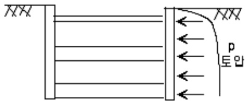  

11.2 토압의 종류 $\textcircled{1}$ 정지 토압 $\mathrm{\Gamma=Ko}$ $\textcircled{2}$ 주동 토압 $\mathrm{\mathrm{=Ka}}$ $\textcircled{3}$ 수동 토압 $\mathrm{\Gamma=Kp}$  

˙토압계수  

  

$$
K\!=\!\frac{\sigma_{h}}{\sigma_{v}}
$$  

11.3 정지 토압계수  

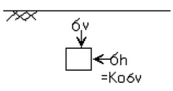  

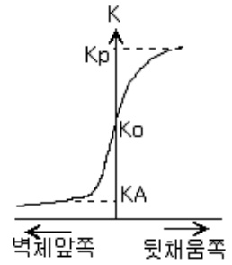  

-지반을 탄성체로 가정 $\longrightarrow$ Hook's law를 따른다.  

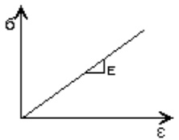  

-중첩의 원리 적용가능  

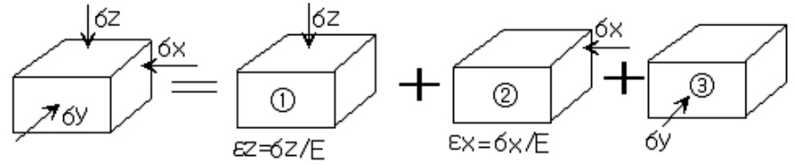  

※포이송비  

$H o o k^{\prime}s\ l a w:\ \sigma=E\epsilon_{a}\operatorname{ol}\gamma|\operatorname{\mathcal{A}}|,\epsilon_{a}=\frac{d l}{l}$ $\mathfrak{u}^{=-}\,\frac{\epsilon_{l}\left(\frac{\bar{\mathfrak{s}}}{\circ}\sqcup\frac{\bar{\mathfrak{s}}\sqcup}{\circ}\frac{\mathfrak{s}}{\square}\right)}{\epsilon_{a}\left(\frac{\bar{\mathfrak{s}}}{\circ}\sqcup\frac{\bar{\mathfrak{s}}\sqcup}{\circ}\frac{\mathfrak{s}}{\sharp}\right)}\left(\mathfrak{X}\^{\sharp}\right)\!\!\to\!\!\epsilon_{l}=\!\!-\,\mu\epsilon_{a}=\!-\,\mu\frac{\sigma}{E}$  

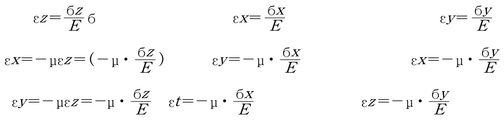  

$$
\begin{array}{l}{\displaystyle{\to\varepsilon x\!=\!\frac1E[\6x\!-\!\mathfrak{g}(6y\!+\!\mathfrak{g}z)]}}\\ {\displaystyle{\to\varepsilon y\!=\!\frac1E[\6y\!-\!\mathfrak{g}(6x\!+\!\mathfrak{g}z)]}}\\ {\displaystyle{\to\varepsilon z\!=\!\frac1E[\6z\!-\!\mathfrak{g}(6x\!+\!\mathfrak{g}y)]}}\end{array}
$$  

정지토압조건  

$\scriptstyle\to\varepsilon\mathbf{x}=\varepsilon\mathbf{y}=0\,{\overset{\circ}{\mathbf{\Omega}}}$ 조건에 해당  

윗식에 대입  

$$
\mathtt{6x=\upmu(6y+6z)}
$$  

$$
\therefore6\mathrm{x}=\frac{11}{1-\mathrm{\Delta_{|}}}\,\mathrm{~\cdot~}6z\qquad\qquad\therefore\;K o\,{=}\,\frac{1}{1-\mathrm{\Delta_{|}}}
$$  

-Jacky 공식 (경험공식)  

for 사질토 $\rightarrow\ K_{0}{=}1{-}\sin\Phi^{\prime}$  

for 점성토 $\rightarrow\mathrm{Ko}^{=}(1-\mathrm{sin}\Phi^{\prime})\,\sqrt{\,{\cal O}.{\cal C}.{\cal R}\,}\quad(\mathrm{O}.{\mathrm{C}.\mathrm{R}}=\frac{{\sigma_{c}}^{\prime}}{{\sigma_{v0}}^{\prime}})$  

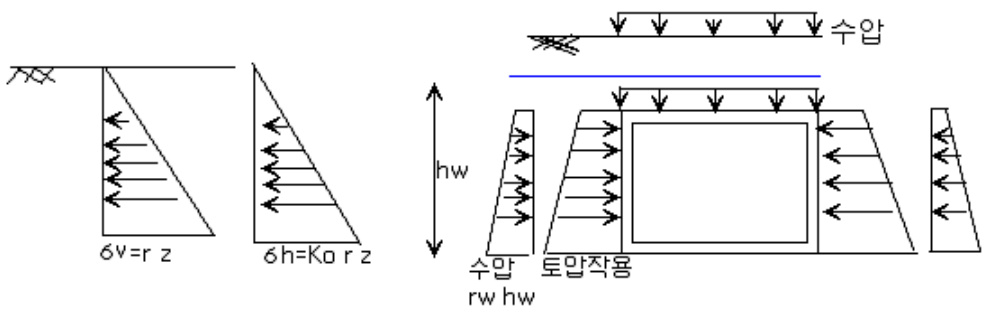  

11.4 Ran kine의 토압이론 $\longrightarrow$ 벽면 마찰각을 무시한 토압이론  

사질토 ${\bf\nabla}({\bf c}{=}0)$ ) 인 경우ⅰ)주동토압  

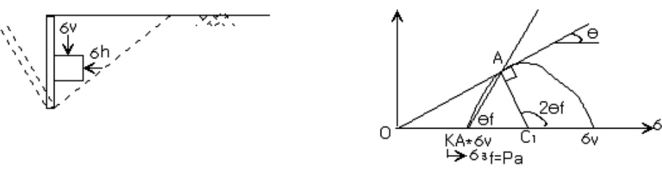  

$$
\mathrm{sin}\Phi={\frac{C A}{O C}}={\frac{{\cfrac{(\sigma_{v}-\sigma_{h a})}{2}}}{{\cfrac{(\sigma_{v}+\sigma_{h a})}{2}}}}\quad\rightarrow\,\,{\frac{\sigma_{h a}}{\sigma_{v}}}={\frac{1-\mathrm{sin}\phi}{1+\mathrm{sin}\phi}}=\tan^{2}(45^{\circ}-{\frac{\phi}{2}})=K_{a}
$$  

 sin Ka= sin  

$$
2\Theta_{\mathrm{f}}\mathrm{=}90^{\circ}\mathrm{+}\Phi~~\rightarrow~~\theta_{f}=45+{\frac{\phi}{2}}
$$  

ⅱ)수동 토압  

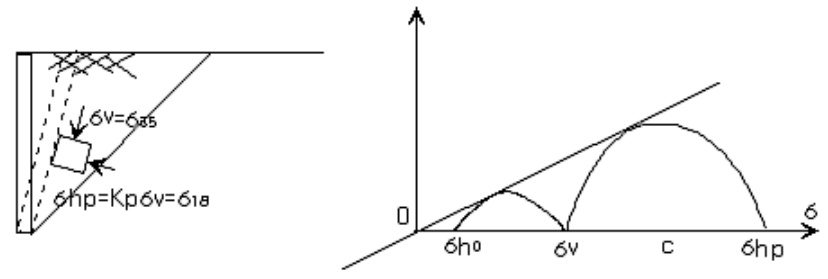  

$$
K p={\frac{\sigma_{h p}}{\sigma_{v}}}\mathrm{=}\,{\frac{1+\sin\phi}{1-\sin\phi}}\mathrm{=}\tan^{2}\!\left(45^{\circ}+{\frac{\phi}{2}}\right)\mathrm{=}\,{\frac{1}{K_{a}}}
$$  

주동 토압의 분포와 합력의 위치  

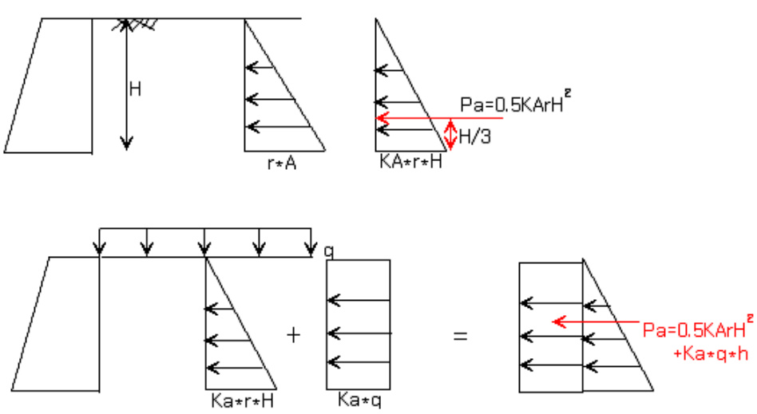  

2 점성토의 주동 및 수동토압 $\langle\boldsymbol{\mathrm{c}}\,\neq\boldsymbol{0}\,{\overset{\mathrm{\scriptsize~\circ}}{\boldsymbol{\mathrm{2}}}}|$ 경우)  

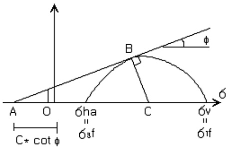  

$$
\begin{array}{l}{{\sin\Phi=\frac{C B}{\displaystyle A O+O C}}}\\ {{\phantom{\cos\Phi=\sin\Phi=\sin\Phi=\sin\Phi}=\frac{(\sigma_{v}-\sigma_{h a})/2}{c\cdot\cot\!\phi+(\sigma_{v}+\sigma_{h a})/2}}}\end{array}
$$  

$$
\sigma_{h a}=(\frac{1-\mathrm{sin}\phi}{1+\mathrm{sin}\phi})\sigma_{v}-2\,\bullet\,\,c\frac{\mathrm{cos}\phi}{1+\mathrm{sin}\phi}
$$  

$$
\mathrm{\boldmath~\bar{~}{\mathrm{Ka}}\bullet\mathrm{y}\bullet\mathrm{z}\ -\ 2\mathrm{c}\,\sqrt{K_{a}}}
$$  

-토압분포  

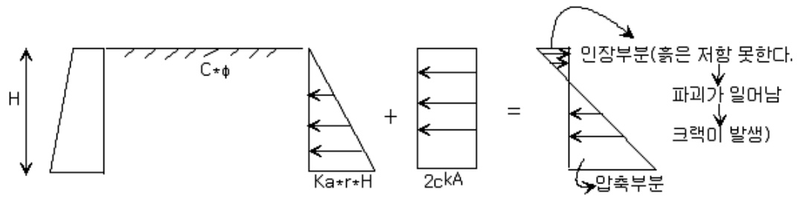  

-인장깊이 선정  

$$
\mathrm{\6ha^{-}K a\bullet y\bullet Z_{0}-\,\,2C\,\sqrt{K_{a}}=0}
$$  

$$
\therefore{\cal Z}\mathrm{c}=\frac{\,2{\cal C}}{\texttt{V}}\,\cdot\,\frac{1}{\sqrt{K p}}=\frac{\,2{\cal C}\,}{\texttt{V}}\,\cdot\,\sqrt{K p}
$$  

-수동토압계수  

$$
\mathrm{Ghp=Kp}\bullet\mathtt{y}\bullet Z\ +\ 2C\,\sqrt{K_{p}}\qquad\qquad\ \ (K p\mathrm{=}\frac{1\,\mathrm{+}\,\sin\Phi}{1\,\mathrm{-}\,\sin\Phi})
$$  

-지표면이 경사진 경우에 대한 토압  

бv=W/b $=$ Z\*b \*cosi\*γ/b' =γZ\*cosi  

$$
K a=\frac{6h a}{6v}
$$  

$O A^{2}{=}6\mathrm{v^{2}\bullet}\cos^{2}\!\mathrm{i}{+}6\mathrm{v^{2}\bullet}\sin^{2}\!\mathrm{i}{=}6\mathrm{v^{2}(\cos^{2}\!\mathrm{i}{+}\sin^{2}\!\mathrm{i})}$  

$$
K a={\frac{O B}{O A}}={\frac{O B-A D}{O D+A D}}
$$  

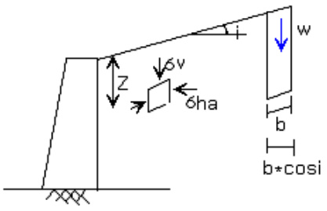  

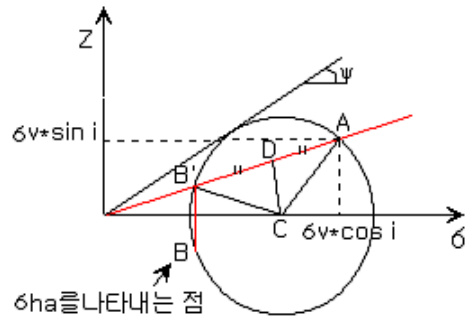  

OD $=$ OC cos I  

AD $:=\sqrt{\ A C^{2}-C D^{2}}$ (AC=OC $\bullet$ sinψ, CD=OC sin I)  

${\begin{array}{r l}&{\therefore K a={\cfrac{O C\cdot\cos i-{\sqrt{O C^{2}\cdot\sin^{2}\phi+O C^{2}\cdot\sin^{2}\dot{i}}}}{O C\cdot\cos i+{\sqrt{O C^{2}\cdot\sin^{2}\phi-O C^{2}\cdot\sin^{2}\dot{i}}}}}={\cfrac{\cos i-{\sqrt{\sin^{2}\!\phi-\sin^{2}\!\phi}}}{\cos i+{\sqrt{\sin^{2}\!\phi-\sin^{2}\!\phi}}}}}\\ &{={\cfrac{\cos j-{\sqrt{\cos^{2}\!j-\cos^{2}\!\phi}}}{\cos i+{\sqrt{\cos^{2}\!j-\cos^{2}\!\phi}}}}={\cfrac{1}{K p}}}\end{array}}$ $\mathrm{6ha{=}K A\bullet6v{=}K A\bullet v\bullet z\bullet\cos\ i}$   
$\therefore\mathrm{Pa}=\frac{1}{2}\,\mathrm{KA}\bullet\mathrm{v}\bullet H^{2}\bullet\cos\,\mathrm{~I~}$  

11.4 뒤채움이 이층이거나 지하수위가 있는 경우  

-주동토압  

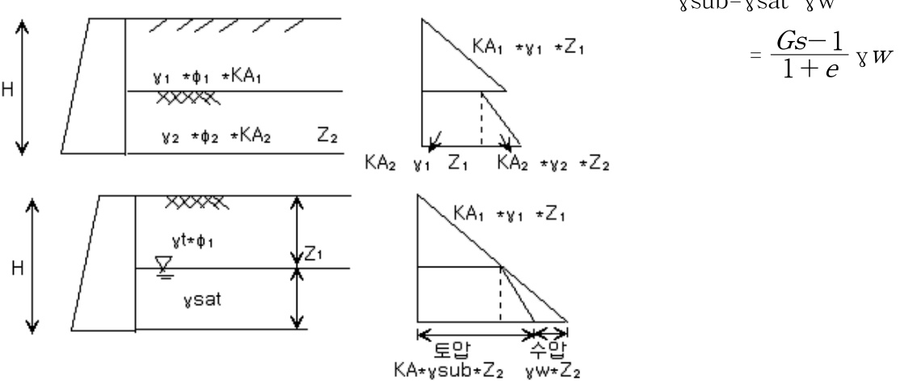  

11.5 Coulomb의 토압이론 :\~벽면에 마찰각을 고려한 토압이론  

$\mathrm{\textregistered{c=}}0\mathrm{\textperthousand}$ 경우  

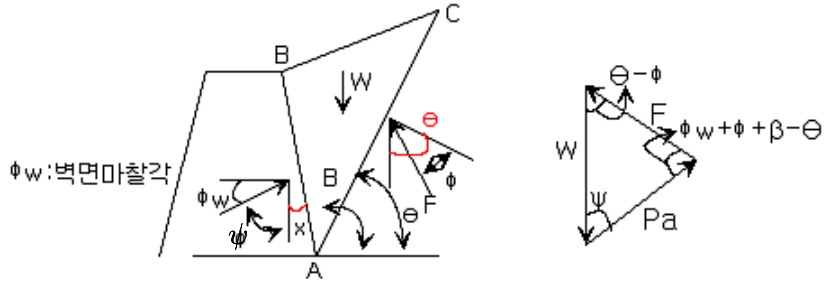  

$$
\scriptstyle\mathrm{x}=90-(180-\beta)=\beta-90^{\circ}
$$  

$\begin{array}{c}{{\displaystyle\frac{P a}{\sin{(\Theta-\Phi)}}=\frac{W}{\sin{(\Phi+\Phi w^{+}\,\upbeta-\Theta)}}}}\\ {{\therefore~~P A=W\!\cdot\frac{\sin{(\Theta-\Phi)}}{\sin{(\Phi+\Phi w^{+}\,\upbeta-\Theta)}}}}\end{array}$$\frac{d P A}{d\theta}=0$ 일때의 $\Theta$ 값 추정$P A\mathrm{=}\frac{\mathrm{y}H^{\mathrm{2}}}{2}\lbrack\frac{\sin{(\mathrm{\upbeta}-\mathrm{\upphi})}\csc{\beta}}{\sqrt{\sin(\mathrm{\upbeta}+\mathrm{\upphi}\,w)}\mathrm{+}\sqrt{\frac{\sin{(\mathrm{\upphi}+\mathrm{\upphi}\,w)}\cdot\sin{(\mathrm{\upphi}-i)}}{\sin{(\mathrm{\upbeta}-i)}}}}\rbrack^{\mathrm{2}}$  

$\mathcal{D}\mathrm{C}\!\neq\!0\frac{\partial}{\mathrm{`}}$ 경우  

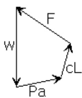  

-벽면 마찰각 $(\mathrm{\Phi}\oplus\mathrm{w})$  

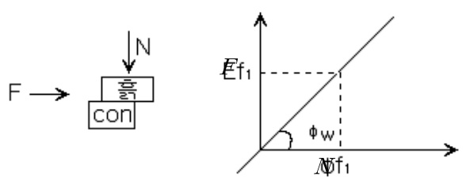  

∴일반적으로는 $\mathrm{\Phi{\Phi}\!\!\stackrel{}{=}\!\!\!=}\,\frac{2}{3}\,\Phi$ 로 가정  

11.6실제 활동면의 현상  

-수동토압의 경우 $\phi_{\mathrm{W}}{>}\,\frac{\Phi}{3}\,\circ\vert$ 면  

실제 수동토압과 현저한 차이발생 $\longrightarrow$ 직선파괴가정 $=$ 수동토압의 크기를실제 보다 크게평가  

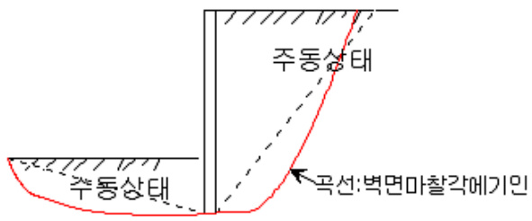  

11.7 옹벽의 안정  

1.안정조건  

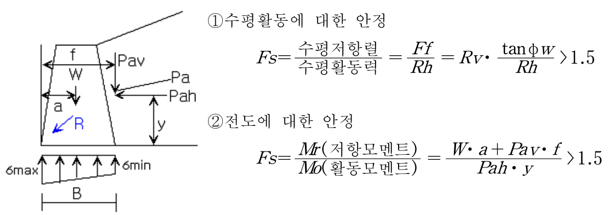  

$\textcircled{3}$ 허용지지력 검토  

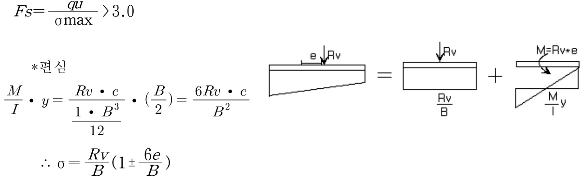  

-옹벽의 종류  

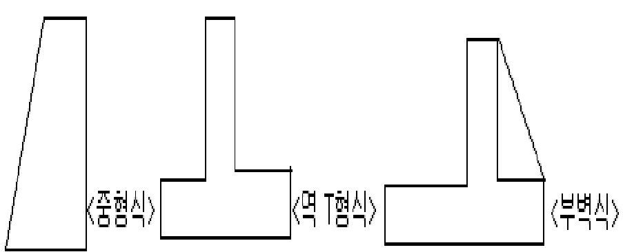  

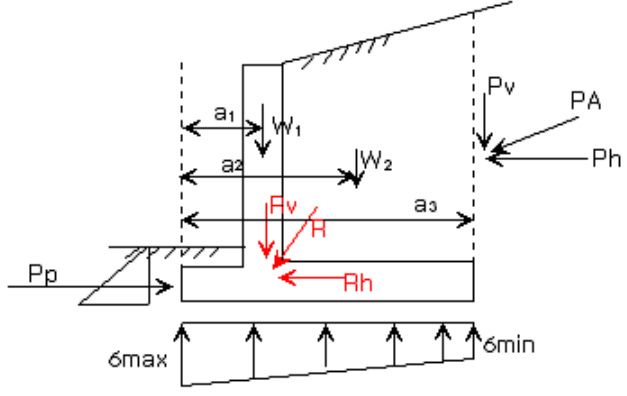  

$\textcircled{2}$ 전도활동에 대한 안정  

(가상벽면에 토압작용)  

-Rankine 토압이론을 적용  

$$
F s{=}\frac{R{\nu}{\bullet\,\tan}{\phi}\,W}{R h(\,{=}\,P h)}\,{>}\,1.5
$$  

$$
F s=\frac{\overrightarrow{s}\vert\overrightarrow{s}\vert\overrightarrow{L}\vert\overrightarrow{u}\vert\Xi}{\frac{\overrightarrow{s}\vert\overrightarrow{L}}{\Xi}\frac{\vert\overrightarrow{u}\vert\vert\Xi}{\Xi}}=\frac{W_{1}\,a_{1}+W_{2}\,a_{2}}{P_{h}\,y-P_{v}\,a_{3}}>1.5
$$  

$\textcircled{3}$ 허용지지력에 대한 안정  

$$
F s{=}\frac{q u}{\operatorname{\sigma}\!\operatorname*{max}}\,{>}\,3
$$  

$$
\left(q a(\breve{\mathfrak{s}}|\frac{\mathfrak{s}}{\circ}\varkappa|\varkappa|\breve{\Xi}|\right)=\frac{q u}{3}(\daleth\bar{\mathfrak{s}}|\varkappa|\varkappa|\breve{\mathfrak{s}}|\,)\right)
$$  

$$
\therefore\ \mathrm{o}=\frac{R\nu}{B}(1\pm\frac{6e}{B})
$$  

$-6\mathrm{min}{=}0\textcircled{>}$ 조건에서  

$$
\rightarrow1-\frac{6\cdot e}{B}=0\,\%\,\,\,\,\,\,\,\rightarrow\,\,\,\,\,e\!=\!\frac{B}{6}
$$  

2.지하수위가 옹벽의 안정에 끼치는 영향-활동에 대한 안전율  

$$
F s=\frac{(R v-V_{2})\mathrm{tan}\phi w}{R h+V_{1}}{>1.5}
$$  

3.옹벽에 작용하는 간이 토압분포  

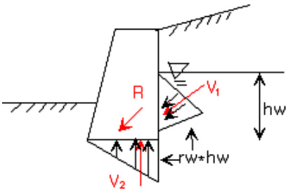  

-by Terzoghi Peck (단, 옹벽높이가 $6\mathrm{m}^{\circ}]$ 내일 때)  

$$
\begin{array}{l}{{\displaystyle P\!h\!=\!\frac{1}{\,2\,}\,K n\cdot H^{2}}}\\ {~~}\\ {{\displaystyle P_{V}\!=\!\frac{1}{\,2\,}\,K_{V}\!\cdot H^{2}\ (\mathrm{i}\!=\!0\,\circ\!\ ]\,\underline{{{\ast}}}}\ \rightarrow\mathrm{Pv}\!=\!0)\,\rightarrow\!\mathrm{Kv}\!=\!0}\end{array}
$$  

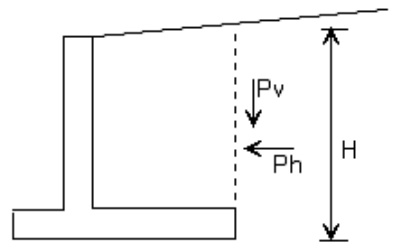  