# 제 2 장 흙의 기본적 특성  

# 2.1 흙입자  

(1) 흙입자의 크기에 따른 구분  

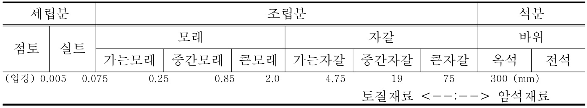  

가. 조립토  

자갈(gravel) 모래(sand) 나. 세립토 실트(silt) 점토(clay)  

# (2) 흙입자 분류 예  

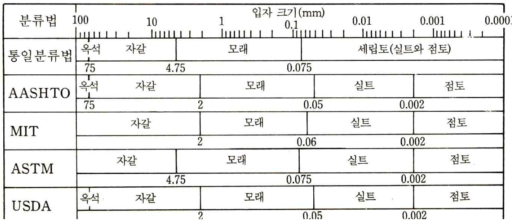  

그림 2-1 크기에 따른 흙입자의 분류  

※ 통일분류법(USCS): Unified Soil Classification System AASHTO: American Association of State Highway and Transportation Officials MIT: Massachusetts Institute of Technology ASTM: American Society for Testing and Materials 미국농무성(USDA): US Department of Agriculture  

# 2.2 흙입자의 비중  

흙입자의 비중 (specific gravity): Gs  

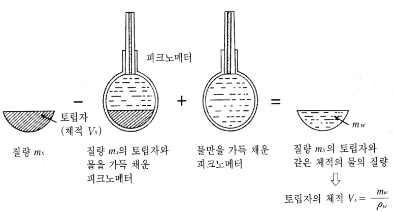  
그림 2-2 흙입자의 비중 측정  

(1) 흙입자의 중량과 같은 부피의 $15\,^{\circ}\!C$ 증류수의 중량과의 비(2) 흙입자의 단위중량 (γs) 와 $15\,^{\circ}\!C$ 증류수의 단위중량 (γw) 과의 비  

(3) t℃에서 흙입자의 비중 : Gt  

$$
G_{t}=\frac{\gamma_{s}}{\gamma_{w}}{=\frac{W_{s}}{W_{w}}{=\frac{W_{s}}{W_{s}+W_{a}-W_{b}}}}
$$  

Wa: 부피 $50{\mathrm{cm}}3\ \circ]$ 상의 비중병 (pycnometer) 에 t℃ 의 증류수를 가득 채웠을 때의중량  

Ws: 노건조한 흙시료의 중량  

Wb: 비중병에 건조한 흙시료를 넣고 증류수로 채웠을 때의 중량  

Ww: 흙시료와 같은 부피의 물의 무게 $G_{s}=K\!\times\!G_{t}$ (K: 온도에 따른 비중 수정계수)  

# 2.3 입도분석  

# 2.3.1 개요  

(1) 흙속에 있는 입자들의 크기 정도 결정  

(2) 종류: 한국산업규격 KS F 2302  

체분석(sieve analysis): 흙입자 직경 0.075 이상인 경우 비중계분석(hydrometer analysis): 흙입자 직경 0.075 이하인 경우  

# 2.3.2 체분석(sieve analysis)  

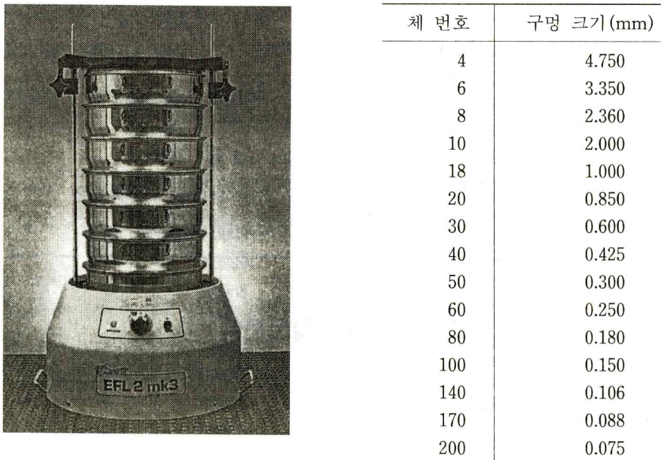  

그림 2-3. 체진동기 및 표준체의 번호와 눈금의 크기  

# 2.3.3 비중계분석 (hydrometer analysis)  

(1) 방법: 물속으로 가라앉는 흙입자의 침강원리(2) 대상 흙입자의 크기: $0.0005\mathrm{mm}$ $<$ 비중계분석 $<~0.2\mathrm{mm}$(3) 각 흙입자 비중의 다양성, 침강중 흙입자간의 간섭 등으로 신뢰성이 낮음(4) Stokes 법칙: 흙입자를 구라고 가정한 흙입자의 침강속도  

$v=\frac{\gamma_{s}-\gamma_{w}}{18\eta}D^{2}$$\gamma_{s}$ : 흙입자의 단위중량$\gamma_{w}$ : 물의 단위중량$\boldsymbol{\mathsf{\Pi}}^{\mathsf{\Pi}}\boldsymbol{\mathsf{\Pi}}^{\mathsf{\Pi}}$ : 물의 점성계수D: 흙입자의 직경  

# 2.3.4 입도분포곡선 (particle size distribution curve)  

(1) 체분석과 비중계분석 결과를 반대수용지(semi-log paper)에 표시한 것 (2) 흙입자의 직경 (mm) vs 흙입자의 통과중량 백분율 (%)  

(3) 예: 흙 A의 통일분류법에 의한 분류가. 자갈 $\left(4.75\mathrm{mm}\ \circ\right)$ 상): $0\%$나. 모래 $(4.75~\sim~0.075\mathrm{mm})\colon~38\%$다. 실트와 점토 $\cdot0.075\mathrm{mm}\;\;\circ|\cdot$ 하): $62\%$(4) 여러 입자크기의 분포형태  

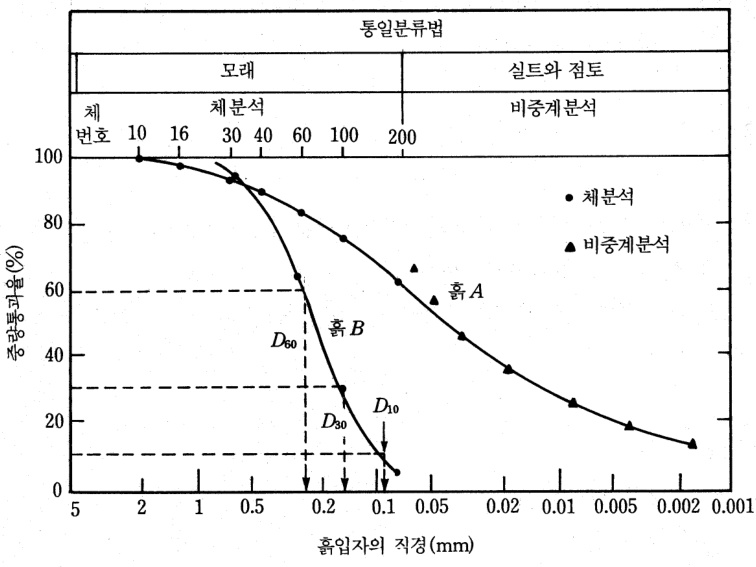  
그림 2-4 입도분포곡선  

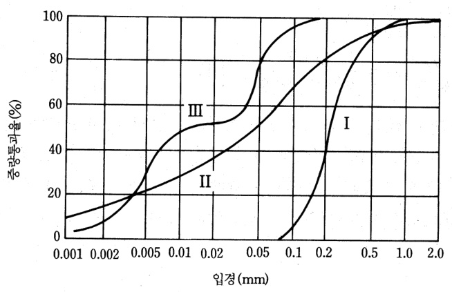  
그림 2-5 여러 가지 형태의 입도분포곡선  

가. 곡선 I: 입도분포 불량한 흙 (poorly graded soil) 나. 곡선 II: 입도분포 양호한 흙 (well graded soil) 다. 곡선 III: 2개 이상 균등분포된 흙 (계단식 입도, gap graded)  

# 2.3.5 유효입경, 균등계수 및 곡률계수  

(1) 입도분포곡선 형상을 특징짓는 요소: 유효입경, 균등계수, 곡률계수  

(2) 유효입경(effective size), $\mathrm{D}_{10}$ : 중량통과 백분율 $10\%$ 에 해당하는 입자의 직경  

(3) 균등계수(uniformity coefficient): 입도분포 특성을 나타내는 값인 곡선의 경사  

$C_{u}=\frac{D_{60}}{D_{10}}$$\mathrm{D}_{60}$ 중량통과 백분율 $60\%$ 에 해당하는 입경  

(4) 곡률계수 (coefficient of gradation) 곡선의 단계적인 상태  

$C_{c}=\frac{D_{30}^{2}}{D_{60}\times D_{10}}$$\mathrm{D}_{30}$ 중량통과 백분율 $30\%$ 에 해당하는 입경  

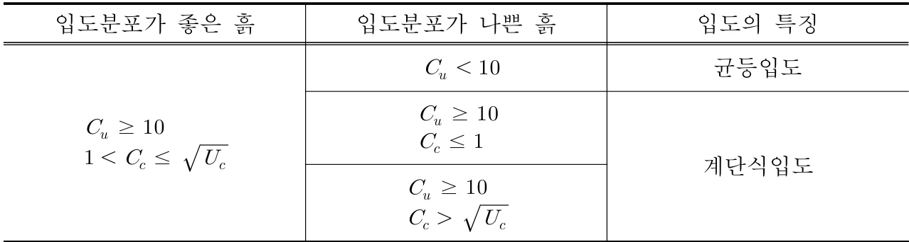  
(5) 흙시료의 입도분포 판정 (일본 토질공학회)  

예제) 그림 2-4 에서 흙 B에 대하여 $\mathrm{{D}_{10}=\ 0.096m m}$ , $\mathrm{D}_{30}{=}~\mathrm{0.16mm}$ , $\mathrm{{D_{60}}=\Omega.24m m\overset{\circ}{\rightleftharpoons}}$때, 균등계수와 곡률계수를 구하시오.  

$$
\begin{array}{l}{{C_{u}=\cfrac{{D_{60}}}{{D_{10}}}=\cfrac{{0.24}}{{0.096}}=2.5}}\\ {{C_{c}=\cfrac{{D_{30}^{2}}}{{D_{60}\times{D_{10}}}}=\cfrac{{0.16^{2}}}{{0.24}\times0.096}=1.11}}\end{array}
$$  

# 2.4 흙의 구성  

체적 질량 $m$ 중량WV:흙전체의체적 $m$ W:흙전체의 질량중량  

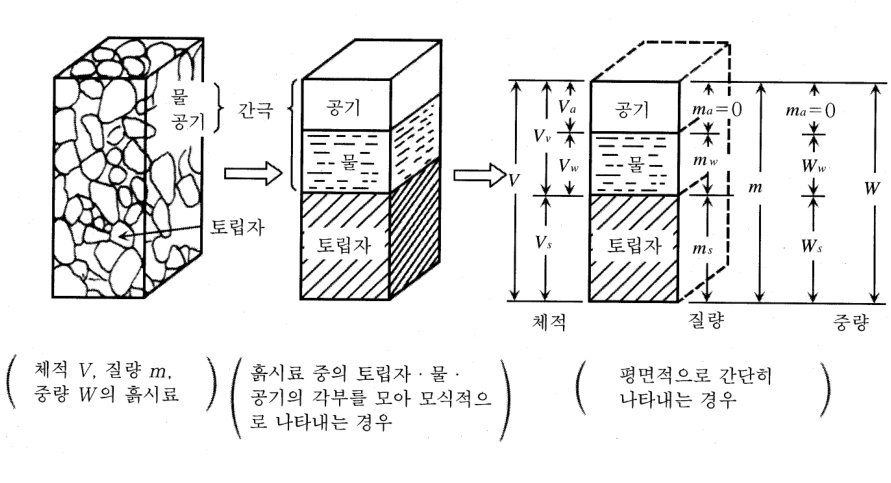  
그림 2-6 흙의 구성도  

# 2.4.1 구성요소의 부피  

(1) 흙의 전체부피  

$V{=}\ V_{s}+V_{v}=V_{s}+V_{w}+V_{a}\ \,,\ m=m_{a}+m_{w}+m_{s}=m_{w}+m_{s}$  
$V_{v}={V_{a}}+{V_{w}}={V}-{V_{s}}\;\;,\;\;\;\;\;\;\;\;\;\;\;\;\;W={W_{a}}+{W_{w}}+{W_{s}}={W_{w}}+{W_{s}}$  
Vs : 흙입자의 부피  
Vv : 간극의 부피  
Vw : 간극속의 물의 부피  
Va 간극속의 공기의 부피  
ma, Wa : 간극 중 공기의 질량, 중량 $\left(\,=\,\,0\,\right)$ )  
mw, Ww : 간극 중 물의 질량, 중량  
ms, Ws : 토립자 부분의 질량, 중량  

(2) 흙의 상태에 대한 기본적인 생각 (3) 간극비(void ratio, e): 흙의 압축성 판단  

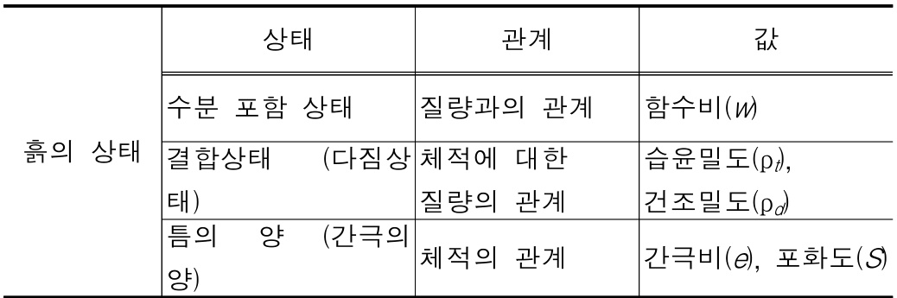  

$$
e={\frac{{\frac{5}{87}}{\frac{5}{91}}\geq\mid\,\exists\leq\,\leq\,\leq\,\mid\,\exists\leq\,\mid\,\exists\leq\,\mid\,\,\exists\leq\,\,=\,{\frac{V_{v}}{V_{s}}}}{{\frac{5}{87}}\,\leq\,\mid\,\sum\,\mid\,\exists\leq\,\,\leq\,\,\mid\,\,\exists\leq\,\,\,\exists\leq\,\,\,\exists\leq\,\,\,\,\,\exists\leq\,\,\,\,\,V_{s}}}={\frac{V_{v}}{V_{s}}}
$$  

(4) 간극률(porosity, n):  

$$
n=\frac{\frac{5}{\overrightarrow{v}}\,\zeta!\,\overrightarrow{\daleth}\,\frac{9}{7}\,\frac{5}{7}|\overrightarrow{\daleth}|}{\frac{5}{\overrightarrow{v}7}\,\mathcal{Q}\,\vert\,\overrightarrow{\natural}\vert\,\overrightarrow{\daleth}\vert}\times100=\frac{V_{v}}{V}{\times100\,(\%)}
$$  

(5) 간극비와 간극률 사이의 관계  

$$
e={\frac{V_{v}}{V_{s}}}\!={\frac{V_{v}}{\displaystyle V\!-V_{v}}}\!={\frac{\displaystyle{\frac{V_{v}}{V}}}{\displaystyle1\!-{\frac{V_{v}}{V}}}}\!={\frac{n}{\displaystyle1-n}}
$$  

$$
n={\cfrac{V_{v}}{V}}\!={\cfrac{V_{v}}{V_{s}+V_{v}}}\!={\cfrac{\cfrac{V_{v}}{V_{s}}}{{\cfrac{V_{s}}{V_{s}}}\!+\!{\cfrac{V_{v}}{V_{s}}}}}\!={\cfrac{e}{1+e}}
$$  

(6) 포화도(degree of saturation, S)  

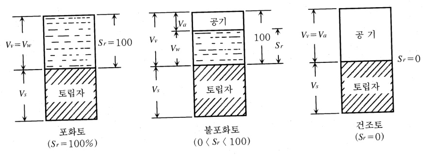  
그림 2-7 포화상태 따른 흙의 분류  

$$
S\!=\frac{\!\!\!\frac{7!}{1}\!\div\!\!\Phi\!\!\!\parallel\bar{x}\!\!\!\parallel\!\!\!\frac{\!\!\!-\!\!\!\!\!\perp}{\!\!\!\!\!-\!\!\!\!\!\frac{\!\!\!\!\Phi\!\!\!\!\!}{\!\!\!\!-\!\!\!\!\!\!1}}\!\!\!\!\!\frac{\!\!\!\!-\!\!\!\!\!\!\frac{\!\!\!\!\!\Omega}{\!\!\!\!\!-\!\!\!\!\!\!\frac{\!\!\!\!\Omega}{\!\!\!\!-\!\!\!\!\!\!\frac{\!\!\!\!\Omega}{\!\!\!\!-\!\!\!\!\!\!1}}}}{\!\!\!\!\frac{\!\!\!\overline{{\!{\!{\!\!\!\!\!-\!\!\!\!\!\!\Omega}}}}}{\!\!\!\!-\!\!\!\!\!\frac{\!\!\!\!\Phi\!\!\!\!\!}{\!\!\!\!-\!\!\!\!\!\!1}}\!\!\!\!\!\frac{\!\!\!\!-\!\!\!\!\!\frac{\!\!\!\!\Omega}{\!\!\!\!-\!\!\!\!\!\frac{\!\!\!\!\!\Omega}{\!\!\!\!-\!\!\!\!\!\frac{\!\!\!\!\!\Omega}{\!\!\!-\!\!\!\!\!\!1}}}}{\!\!\!\!-\!\!\!\!\frac{\!\!\!\bar{\!{\!\!\!\!\Omega}}}{\!\!\!\!-\!\!\!\!\!\frac{\!\!\!\!\Omega}{\!\!\!-\!\!\!\!\!\frac{\!\!\!\!\Omega}{\!\!\!-\!\!\!\!\!\frac{\!\!\!\!\Omega}{\!\!\!-\!\!\!\!\!1}}}\!\!\!\!\!\times\!\!\!100\!\!\!\!\!\!\!\!(\mathcal{V}_{0})}\!\!\!\!\!.
$$  

# 2.4.2 구성요소의 무게  

(1) 함수비 (moisture content, w): 훍의 간극에 함유된 물의 양의 비  

$$
w=\frac{\zeta!\stackrel{\triangledown}{\rightleftharpoons}\circ\|\mathrm{~\frac{3\overline{{c}}~}{\pi}\stackrel{\triangledown}{\rightleftharpoons}\frac{\triangledown}{\bigtriangledown}\stackrel{\triangledown}{\rightleftharpoons}\mathcal{Q}|\mathrm{~\underset{\bigtriangledown}{\rightleftharpoons}\frac{\triangledown}{\bigcirc}(\stackrel{\triangledown}{\bigotimes}\stackrel{\triangledown}{\bigotimes})}}{\mathbb{E}\stackrel{\triangledown}{\rightleftharpoons}\left\lceil\mathrm{~\frac{3\overline{{d}}~}{\pi}\stackrel{\triangledown}{\rightleftharpoons}}\mathcal{Q}\right\rceil\stackrel{\triangledown}{\rightleftharpoons}\frac{\triangledown}{\bigcirc}(\stackrel{\triangledown}{\bigotimes}\stackrel{\triangledown}{\bigotimes})}\times100=\frac{m_{w}}{m_{s}}(\mathbb{\Sigma}\stackrel{\triangledown}{\rightleftharpoons}\frac{W_{w}}{W_{s}})\times
$$  

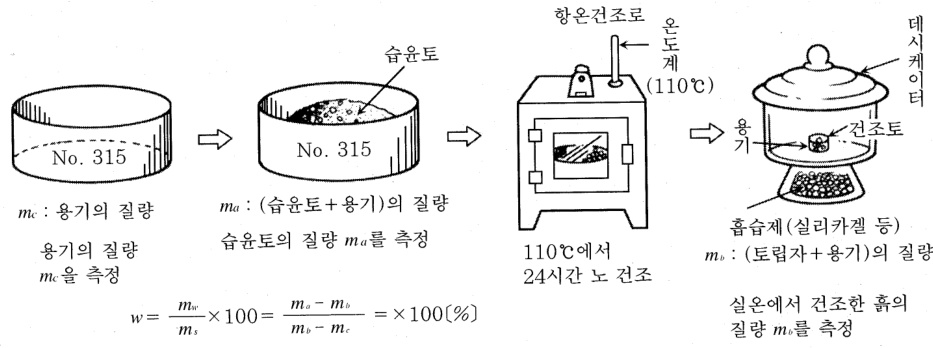  
그림 2-8 함수비의 측정과 계산  

(2) 습윤밀도와 건조밀도: 흙의 결합과 다짐 등의 상태, 단위체적당 질량  

가. 습윤밀도(moist density, ρt): 습윤상태에서 흙의 단위체적당 질량  

$$
\rho_{t}=\frac{\frac{5}{\overrightarrow{s}\uparrow}\frac{\circ}{\bigr\Vert}\overrightarrow{z}\downarrow\overrightarrow{s}\frac{\circ}{\circ}}{\frac{\overrightarrow{s}}{\overrightarrow{s}\uparrow}\frac{\circ}{\bigr\Vert}\overrightarrow{z}\Vert\overrightarrow{z}\Vert}=\frac{m}{V}\left(g/c m^{3}\right)
$$  

나. 건조밀도(dry density, ρd): 토립자만의 질량  

$$
\rho_{d}=\frac{\frac{\overrightarrow{\circ}}{\overrightarrow{\circ}}\mathcal{Q}\bigm\rvert\ \sum\overrightarrow{\bigcirc}\bigm\rvert\ x\bigm\rvert\ \frac{\varkappa}{\downdown}\frac{\partial}{\downdown}\bigm\rvert\ \sum\overrightarrow{\circ}\frac{\downdown}{\downdown}\bigm\rvert}{\frac{\overrightarrow{\circ}}{\overrightarrow{\circ}}\mathcal{Q}\bigm\rvert\ \frac{\varkappa}{\downdownarrows}\bigm\rvert\ x\bigm\rvert}=\frac{m_{s}}{V}\left(g/c m^{3}\right)
$$  

$$
\begin{array}{l}{\displaystyle{\rho_{t}=\frac{m}{V}{=\frac{m_{s}+m_{w}}{V}{=\frac{m_{s}\left(1+m_{w}/m_{s}\right)}{V}}}=\rho_{d}(1+w)}}\\ {\displaystyle{\rho_{d}=\frac{\rho_{t}}{\left(1+w\right)}\left(g/c m^{3}\right)}}\end{array}
$$  

(3) 전체단위중량( $=$ 습윤단위중량)과 건조단위중량: 중량으로 생각하는 경우의 밀도 가. 전체단위중량(total unit weight, γ) 또는 습윤단위중량 (moist unit weight, γt):  

$$
\gamma=\gamma_{t}=\frac{W}{V}{=\frac{m g}{V}{=\rho_{t}g\left(N/m^{3},k N/m^{3}\right)}}
$$  

나. 건조단위중량(dry unit weight, γd):  

$\gamma_{d}=\cfrac{W_{s}}{V}\,{=}\,\cfrac{m_{s}g}{V}{=}\,\rho_{d}g\,(N/m^{3},k N/m^{3})$g: 중력가속도 $(=~9.81\mathrm{{m/sec2}})$  

다. 전체단위중량, 건조단위중량, 함수비와의 관계  

$$
\begin{array}{l}{\displaystyle\gamma=\frac{W}{V}{=\frac{W_{s}+W_{w}}{V}}{=\frac{W_{s}\left(1+\frac{W_{w}}{W_{s}}\right)}{V}}{=\frac{W_{s}\left(1+w\right)}{V}}{=\frac{W_{s}\left(1+w\right)}{V}}}\\ {\displaystyle\gamma_{d}=\frac{\gamma}{\left(1+w\right)}}\end{array}
$$  

# 2.4.3 포화도, 간극비, 함수비, 비중 사이의 관계  

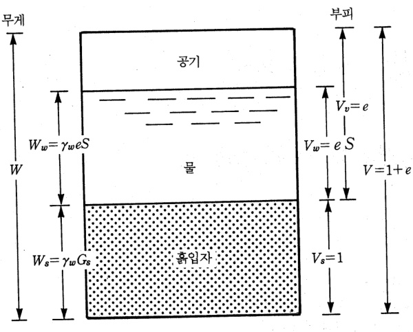  
그림 2-9 흙입자의 부피가 1일 때 흙요소의 3가지 성분  

(1) $\mathrm{Vs}\!=\,1$ 일 때 흙입자와 물의 무게  

가. 흙입자의 무게  

$$
\begin{array}{r l}&{W_{s}=\gamma_{s}\,V_{s}=\gamma_{w}\,G_{s}\,V_{s}\,(=1)=\gamma_{w}\,G_{s}}\\ &{G_{s}=\gamma_{s}/\gamma_{w},\,\gamma_{s}=G_{s}\gamma_{w}}\end{array}
$$  

나. 물의 무게  

$W_{w}=\gamma_{w}\,V_{w}=\gamma_{w}\,V_{v}S\,{=}\,\gamma_{w}\,V_{s}\,(=1)e\,S{=}\,\gamma_{w}e\,S$   
$S\,{=}\,\,V_{w}/\,V_{v},\,V_{w}=S\,V_{v}$   
Gs : 흙입자의 비중   
γw : 물의 단위중량  

다. 전체단위중량 및 건조단위중량과의 관계  

$$
\gamma=\cfrac{W}{V}=\cfrac{W_{s}+W_{w}}{V_{s}+V_{v}}=\cfrac{(\gamma_{w}G_{s})+(\gamma_{w}e S)}{1+e}=\cfrac{G_{s}+(e S)}{1+e}\gamma_{w}
$$  

$$
\gamma_{d}=\cfrac{W_{s}}{V}\cfrac{G_{s}\gamma_{w}}{V_{s}+V_{v}}=\cfrac{G_{s}}{1+e}\gamma_{w}
$$  

라. 포화단위중량(saturated unit weight, γsat, ${\mathrm{S}}\!=\!100\%$ ): 간극이 완전히 물로 채워져있는 경우  

$$
\gamma_{s a t}=\frac{W}{V}{=\frac{W_{s}+W_{w}}{V_{s}+V_{v}}}{=\frac{(\gamma_{w}G_{s})+(\gamma_{w}e S(=1))}{1+e}}{=\frac{G_{s}+e}{1+e}}\gamma_{w}
$$  

마. 수중단위중량(submerged unit weight, γsub): 흙이 지하수위 아래에 있을 경우 부  

력에 의한 영향  

$$
\begin{array}{r l}{\lefteqn{\gamma^{'}\gamma^{'}\gamma_{w}}}\\ &{=\frac{W}{V}-\gamma_{w}=\frac{W_{s}+W_{w}}{V_{s}+V_{v}}-\gamma_{w}}\\ &{=\frac{(\gamma_{w}G_{s})+(\gamma_{w}e S(=1))}{1+e}-\gamma_{w}}\\ &{=\frac{G_{s}+e}{1+e}\gamma_{w}-\gamma_{w}}\\ &{=\frac{G_{s}-1}{1+e}\gamma_{w}}\end{array}
$$  

바. 포화도, 간극비, 함수비, 비중 사이의 관계  

$$
\begin{array}{l}{{{\displaystyle w=\frac{W_{w}}{W_{s}}{=\frac{\gamma_{w}e S}{\gamma_{w}G_{s}}{=\frac{e S}{G_{s}}}\mathrm{{=}}\,\frac{e S}{G_{s}}}}}\\ {{{\it S e}=G_{s}\times w}}\end{array}
$$  

# 2.4.4 상대밀도  

(1)상대밀도(relative density, Dr): 사질토의 조밀하거나 느슨한 정도  

$D_{r}=\frac{e_{\operatorname*{max}}-e}{e_{\operatorname*{max}}-e_{\operatorname*{min}}}$  
e: 자연상태에서 흙의 간극비  
emax: 가장 느슨한 상태에서 흙의 간극비emin: 가장 조밀한 상태에서 흙의 간극비  

(2) 건조단위중량을 이용한 상대밀도 계산  

$D_{r}=\frac{\gamma_{d}-\gamma_{d m i n}}{\gamma_{d m a x}-\gamma_{d m i n}}\frac{\gamma_{d m a x}}{\gamma_{d}}$  
γd: 자연상태에서 흙의 건조단위중량  
γdmin: 가장 느슨한 상태에서의 흙의 최소건조단위중량 (ASTM D-2049)γdmax: 가장 조밀한 상태에서의 흙의 최대건조단위중량 (ASTM D-2049)  