# 토질및기초공학  

Chapter 3. 흙의 분류와 다짐  

박성직  

# 1. 흙의 분류  

흙의 분류법(soil classification system)  

다양한 종류의 흙을 비슷한 성질을 갖는 여러 군으로 분류공학적으로 많이 사용하고 있는흙의 분류법은 흙입자크기와 아터버그한계를 함께 고려하는 통일분류법(united soil classificationsystem)과 AASHTO분류법. 지반공학 기술자는 통일분류법을 많이사용하며, 도로 기술자는 AASHTO분류법을 많이사용  

# 1. 흙의 분류  

# 입도조성분류법(삼각좌표분류법)  

미국 농무부(US department ofagriculture,USDA)가 만든 입도조성에 의한 분류법. 삼각좌표분류법  

$\textcircled{1}$ 모래 크기 직경  
2.0\~0.05mm  
$\textcircled{2}$ 실트 크기: 직경  
0.05\~0.002mm  
$\textcircled{3}$ 점토 크기: 직경 0.002mm보  
다 작은 것  

입도조성에 의한 분류법은 소성을고려하지 않으므로 중요한 흙의 여러성질을 나타낼 수없기 때문에 대부분의 공학적 목적에는 부적당  

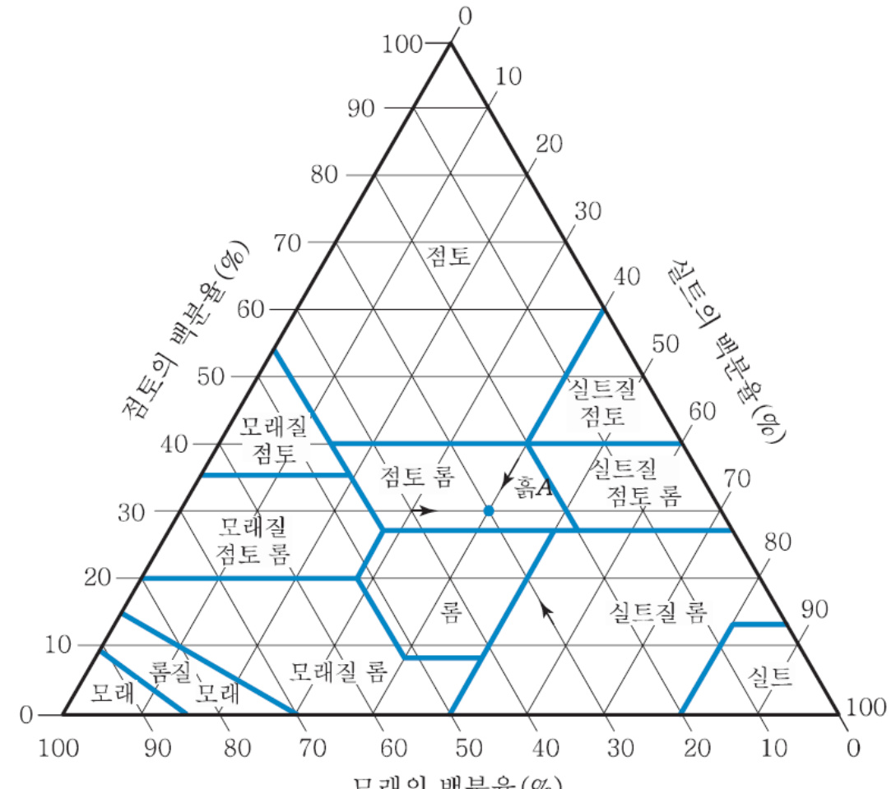  
입도조성분류법(삼각좌표분류법)  

# 2. 통일분류법  

통일분류법(unified soil classification system)  

미국의 Casagrande가 미국 공병단의 비행장 공사를 위하여 1942년에 개발하고 그 후 여러차례 개정되어 현재 지반공학 기술자들이가장 많이 사용  

1. 자갈의 백분율 직경 75 mm\~4.75 mm(4번체)  
2. 모래의 백분율 직경4.75 mm(4번체)\~0.075 mm(200번체)  
3. 세립토(실트와 점토)의 백분율 F: 직경0.075 mm(200번체) 이하  
4. 균등계수와 곡률계수  
5. 40번체(직경 0.425 mm)를 통과하는 흙의 액성한계와 소성지수  

# 2. 통일분류법  

# 통일분류법의 기호  

영문자 두 개의 기호로 표시하여 조립토 18가지, 세립토 7가지 및피트(peat)로 분류  
앞의 기호는 흙입자의 주된 크기를 나타내고, 뒤의 문자는 입도분포나소성  

# 예시  

1. 200번체통과율이 50%보다 작으면 자갈이나모래의 조립토(coarse-grained soil)이다. 여기에 속하는흙의 기호는G나S로 시작된다. G는자갈또는자갈질 흙을 나타내고, S는모래또는모래질흙을나타낸다.2. 200번체통과율이50% 이상이면세립토(fine-grained soil)이다. 여기에속하는흙의 기호는 M, C, O로 시작된다. 무기질실트에 대해서는M, 무기질점토에대해서는C, 그리고 유기질 실트와 유기질점토에대해서는O로나타낸다.3. 유 기질이매우많은흙은Pt(peat, 피트)로표시하고 더이상세분류하지않는다. 이들에대해서는검은 색이나썩은 냄새 등 육안 및후각으로판정한다  

# 2. 통일분류법  

조립토에서 뒤의 기호에 사용하는 문자  

1. W 입도분포가 양호한 흙   
2. P : 입도분포가 불량한 흙   
3. M : 실트가 섞인 흙   
4. C : 점토가 섞인 흙   
세립토에서 뒤의 문자에 사용하는 문자   
1. L : 액성한계가 50% 미만인 압축성 또는 소성이 작은 흙   
2. H : 액성한계가 50% 이상인 압축성 또는소성이 큰흙  

# 2. 통일분류법  

# 소성도  

세립토를 여러 가지로 세분하는 데는 액성한계LL 과 소성지수 PI 의관계 및 범위가사용  

A선  

무기질 실트(inorganic silt)와 무기질 점토(점in토or는gaAn선ic 위cla쪽y에)를위구치분하하며,는 무선기인질데,실 무트기는질A선 아래쪽에 위치  

PI- 073LL-- 20  

액성한계와 소성지수의 관계의 상한선으로서 U 선보다 위쪽에 있는흙은 없음  

$$
P I\!\!=\!0.9(L L\!-\!8)
$$  

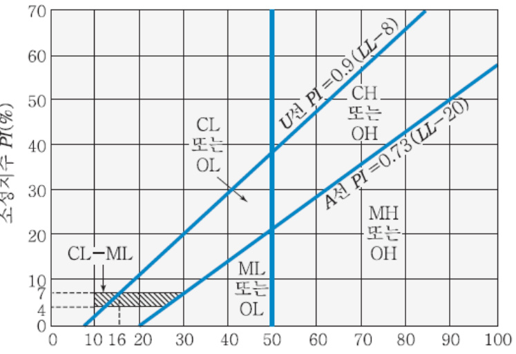  
액성한계 $L L(\%)$  
소성도  

# 2. 통일분류법  

# 통일분류법의 순서  

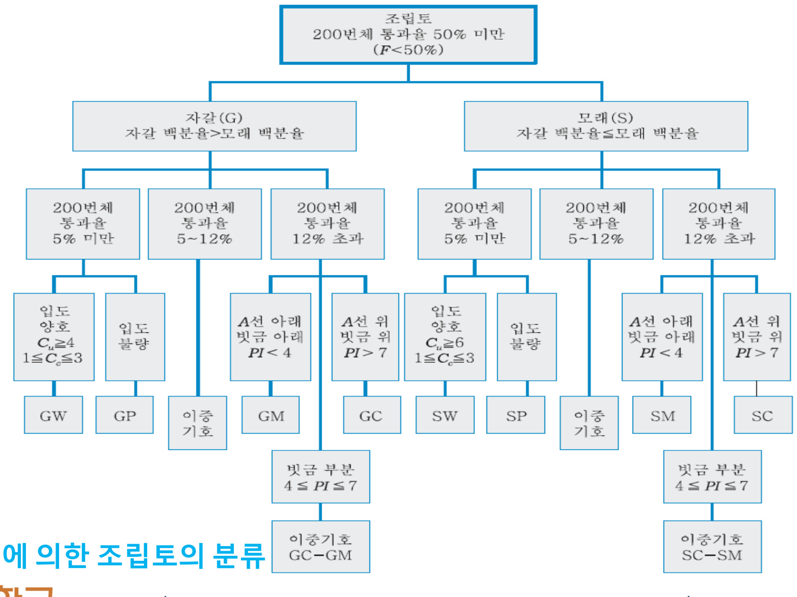  

# 2. 통일분류법  

# 통일분류법의 순서  

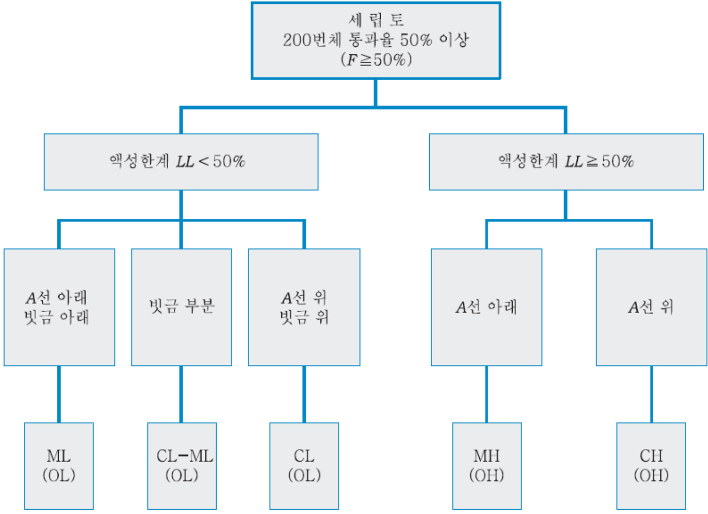  

# 2. 통일분류법  

# 조립토의 명칭  

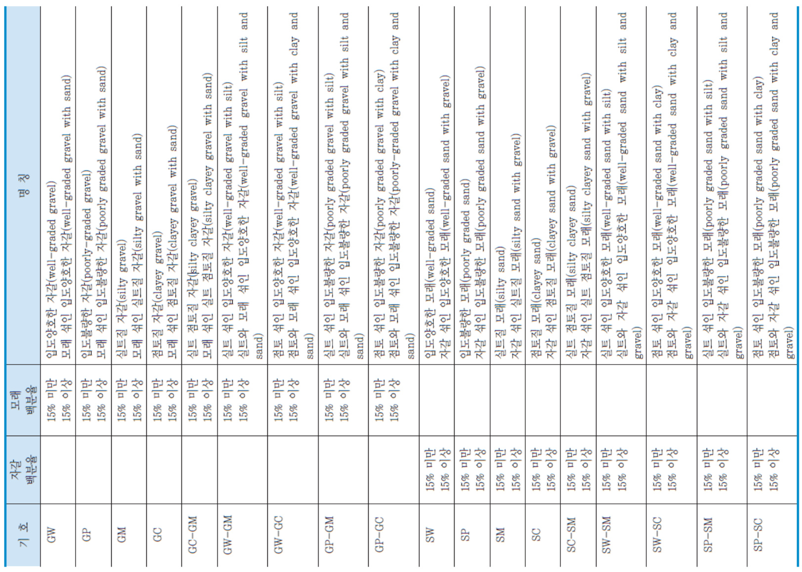  

# 2. 통일분류법  

세립토의 명칭  

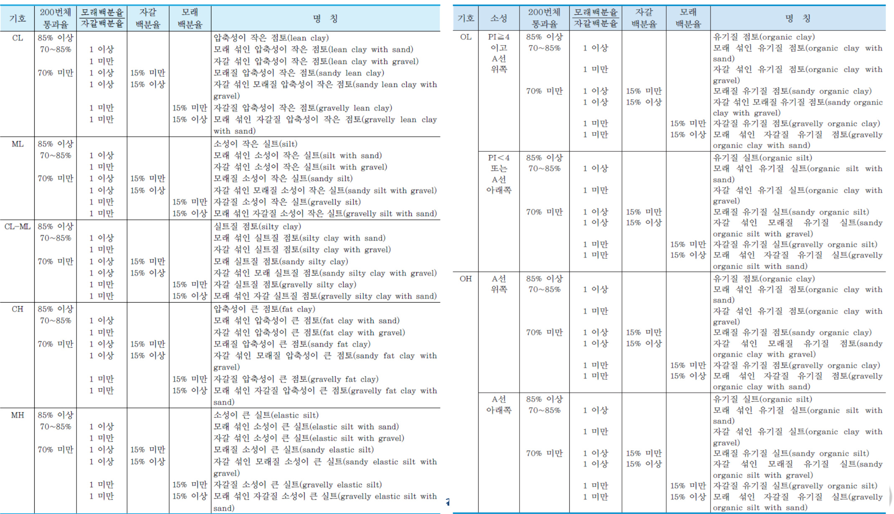  

# 2. 통일분류법  

# 예제 3.2  

다음과 같은 특성을 갖는 흙을 봉일분류법으로 분류하라  

75mm체 통과율 $=$ 100%  

4번체 통과율 $=-10\%$ 10번체 통과율 $=705$ 40번체 통과율 $=$ 65% 200번체 통과율 $=45\div5$ 의성한계 $=$ 90% 소성지수 $=$ 104  

# 2. 통일분류법  

# 예제 3.3  

2가지 흙에 대한 입도분포곡선이 그림 3-5에 나타나 있다 이 흙을 통일분류법으로 분류하여기호와 명칭을 구하라 40번체를 통과한 흙의 액성한계와 소성한계는 다음과 같다  

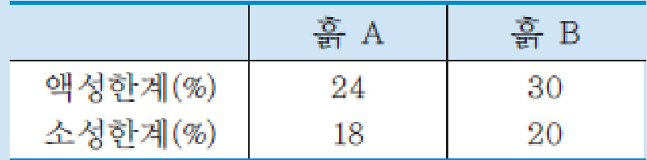  

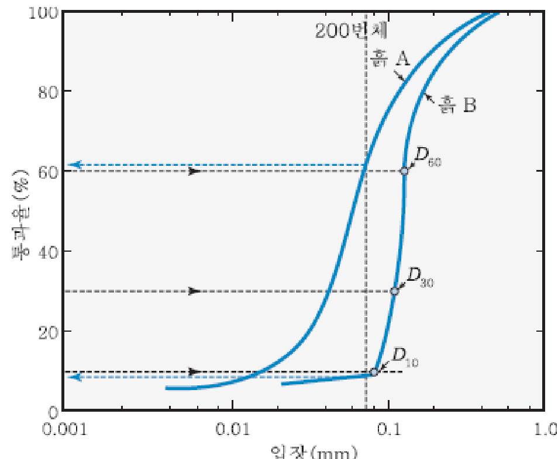  

그림 3-5 2가지 흙의 입도분포곡선  

# 3. AASHTO분류법  

# AASHTO분류법  

미국의 도로 및 교통협회(American Association of StateHighway and Transportation Officials, AASHTO)에서 발표한 분류법으로서, 여러 차례 개정되어 도로설계용으로 많이사용AASHTO분류법은 흙의 입도, 액성한계, 소성지수 등에 따라흙을12가지 기호로 분류  

# 분류 기준  

1. 자갈 직경 75mm\~2mm(10번체)  
2. 모래 직경 2mm(10번체)\~0.075mm(200번체)  
3. 실트와 점토 직경0.075mm(200번체) 이하  
소성지수 $\mathsf{P}|\leq10$ 실트질 흙  
소성지수 $\mathsf{P}|\geq11$ : 점토질 흙  
4. 75mm보다큰 율석(cobble)이나 옥석(boulder)은 시료에서 제외시키지  
만, 그비율은 기록  

# 3. AASHTO분류법  

# AASHTO분류법  

흙의 입도, 액성한계, 소성지수 등에 따라 12가지 기호로 분류  

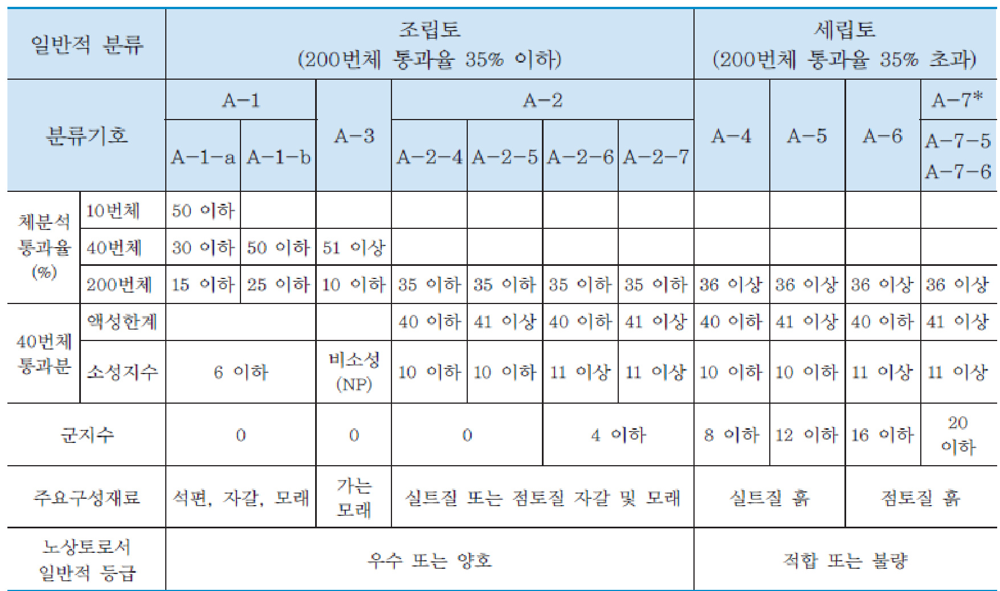  

# 3. AASHTO분류법  

# 군지수(group index, GI)  

도로의 노상토 재료로 사용되는흙의 품질을평가하기위하여사용일반적으로 군지수가클수록흙의 품질은나쁨  

G[-= F- 35 $)[0.2+0.005\left(L L-40\right)]+0.01\left(F{-}\,15\right)\!\left(P I{-}\,10\right)$  

여기서 $F{=}~200$ 번체 통과율$L L=$ 액성한계$P I{=}$ 소성지수  

# 군지수 결정 규칙  

1. 식(3.1)로 구한 군지수는 반올림하여 정수로 나타낸다.  

2. 만약 식 (3.1)로구한 군지수가 음수이면 $\sf G l{=}0\cdot^{\circ}$ 로 한다.  
3. 군지수의 상한선은 없다.  
4. A-1-a, A-1-b, A-2-4, A-2-5, A-3에 속하는 흙의군지수는 항상0이다. 3-6 AASHTO 소성도  
5. A-2-6, A-2-7에속하는흙의 군지수를 계산할때는첫번째 $\mathtt{\hat{S}}^{\mathtt{F}}\mathtt{\tilde{a}}$ 무시하고다음 식으로 계산한다.  

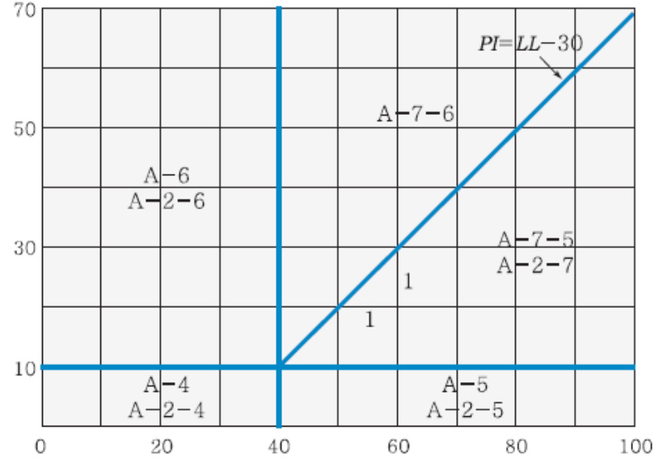  

# 3. AASHTO분류법  

# 예제 3.4  

어느흙에 대한 입도분석의 결과가 다음과 같고 40번체를 통과한 흙의 액성한계와 소성지수는각각 30%와 $10^{\circ}\!\!\cdot\!\!0^{\circ}]$ 다 이 흙을 AASHTO분류법에 의하여 분류하라  

10번체 통과율 $=100\pi$   
40번체 통과 $\frac{\Delta}{\Delta}=80\pi$   
200번체 통과율 $\bar{\mathbf{\rho}}=5\bar{\mathbf{\theta}}\bar{\mathbf{\rho}}\bar{\mathbf{\rho}}$  

# 4. 흙의 다짐 원리  

# 흙의 다짐(compaction)  

타격, 압력, 진동, 반죽등의방법으로흙에에너지를 가하여 흙입자 사이의간격을 조밀하게하여흙의물리적, 역학적 특성을 개선하는 것  
느슨한흙에다짐을하면흙속의공기가배출되어 간극이 감소하여흙의투수성과압축성이감소  
흙의단위중량이 증가하여흙의전단강도가증가하며, 기초지반의 지지력은증가하고 침하량은 감소  
흙을다질 때물을 가해주면 그물이 마치윤활유처럼 흙입자들 사이에작용하게되어 흙입자들은서로 미끄러져서조밀  
함수비를점차로 가시키면서동일한 다짐에너지를 가하면단위부피당흙입자의무게가점차로 증가하여흙의건조단위중량이증가. 그러나함수비가계속 증가하여 어느값을 초과하면 함수비가 증가함에 따라서 건조단위중량이  

오히려 감소수흙비의를최대최건적조함단수위비(중op량tiγmd, umamx 이mo얻is어tu질re때 co즉n,t e흙n이t, 가OM장C잘) 다져질 때의 함  

# 5. 실내다짐시험  

# 실내다짐시험  

일정한 부피의 몰드(mold)에 흙을3층이나 5층으로 나누어 깔고각 층마다 래머(rammer, 철추)를 낙하시켜서 다짐에너지를 가하여 흙 을 다지는 것  

다짐에너지(compaction energy, Ec)  

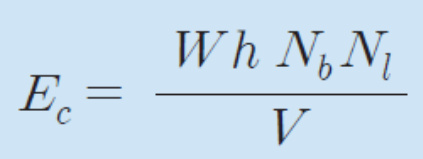  

여기서 $W{=}$ 래머의 무게 $h=$ 래머의 낙하높이 $N_{b}=$ 각층당 다짐횟수 $N_{l}=$ 다짐 층수 $V=$ 몰드의 부피  

# 5. 실내다짐시험  

# 실내다짐시험  

# 표준다짐시험방법  

내경 100mm, 높이 127.3mm(부피 1,000cm3)의몰드에 흙을3층으로 나누어 넣고 각 층마다2.5kg의래머를 30cm의 높이에서 25회씩 낙하시켜서 다짐을하는 방법  

# 수정다짐시험방법  

내경 150mm, 높이 125mm(부피 2,209cm3)의 몰드에 흙을5층으로 나누어 넣고 각 층마다 4.5kg의 래머를 45cm의 높이에서 55회씩 낙하시켜서 다짐을 하는 방법  

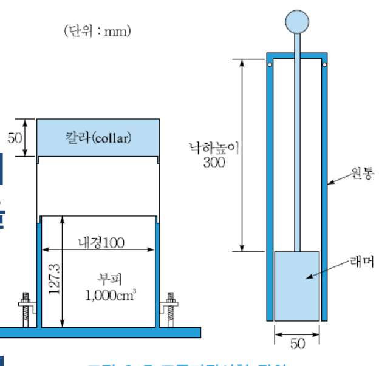  
그림 3-7 표준다짐시험 장치  

한국산업규격에 의한 실내다짐시험  

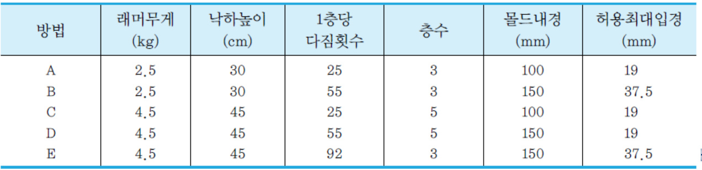  

# 5. 실내다짐시험  

# 예제 3.5  

표준다짐시험방법과 수정다짐시험방법의 다짐에너지를 각각 계산하라  

# 5. 실내다짐시험  

# 실내다짐시험의 방법과 순서  

1. 몰드에 흙을 3층이나 5층으로 나누어 깔고 각층마다 래머를 낙하시켜서 흙을 다진다.  
2. 다져진 흙의 무게와부피를 측정하고, 흙의 전체(습윤)단위중량γ를 다음 식으로 구한다.  
3. 다져진 흙의 함수비 w를 측정하고, 흙의 건조단위중량γd를 다음 식으로 구한다.  
4. 흙의 함수비를 4\~5차례 바꾸어가면서 동일한방법으로시험을 반복 실시한다.  
5. 각시험에서 구한 함수비 w와 건조단위중량 γd의 관계를 그림 3-8과 같이 표시한다. 각 점들을부드럽게 연결한 곡선을 다짐곡선이라고 한다.6. 다짐곡선의 꼭지점에서 최대건조단위중량과 최적함수비 OMC(optimum moisture content)를 구한다  

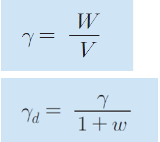  

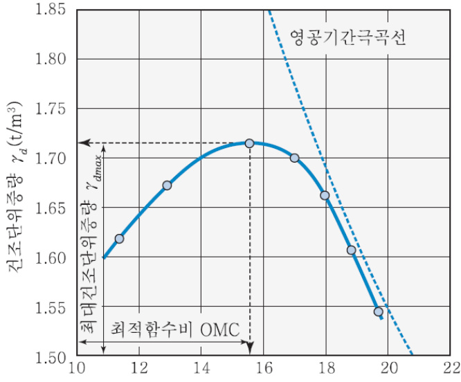  
함수비 $w(\%)$  

# 5. 실내다짐시험  

# 예제 3.6  

표준다짐시험결과가 다음과 같을 때 최대건조단위중량과 최적함수비를구하라  

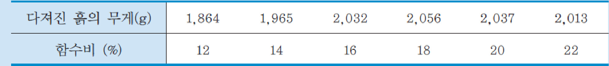  

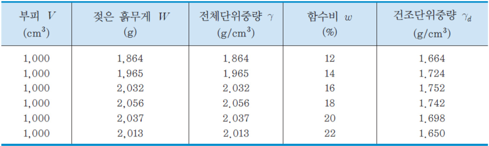  

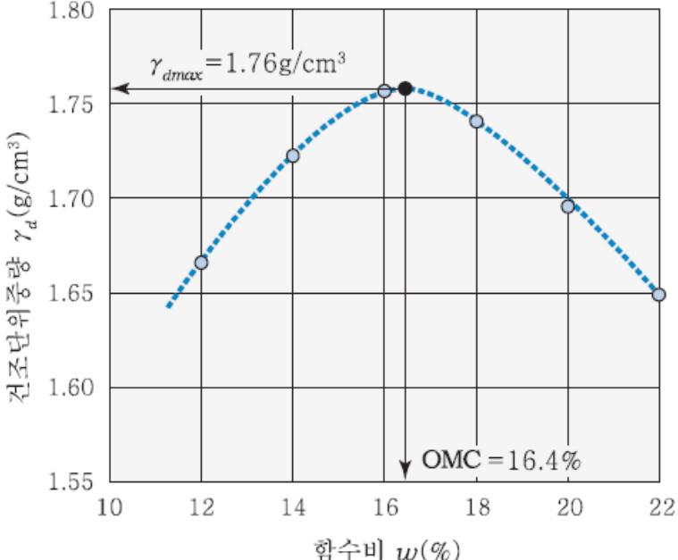  

# 5. 실내다짐시험  

# 영공기간극곡선  

다짐에의하여 간극속의 공기가완전히 배출되어공기의부피가0이  
되고 간극이 물로 100% 포화될 때, w와γd 의 관계 곡선  
포화도 S에따라 달라지는w와 $\gamma_{\mathrm{d}}\,^{\underline{{\mathbf{o}}}}|$ 관계곡선을 포화도곡선  
(saturation curve)  
흙의 건조단위중량  

  

여기서 $\gamma_{d}~=$ 흙의 건조단위중량$\gamma_{w}~=$ 물의 단위중량$_{e}=$ 간극비$G_{s}\ =$ 흙입자의 비중$\textit{S}=$ 포화도  

# 5. 실내다짐시험  

# 영공기간극곡선  

포화도 S가 일정할 때, 함수비 w의 변화에 따른 건조단위중량 의 변화를 구하는 방법  

1. 흙입자의 비중 $\mathsf{G}_{\mathrm{s}}$ 를 구한다.  
2. 물의 단위중량 γw를 구한다.  
3. 포화도 S가80%일 때, 함수비 w를 $5\%$ , 10%,15% 등으로 바꾸어 가면서 건조단위중량γd를식(3.6)으로 구하고, w와γd 의관계를 표시하면 그림 3-10의 점선과 같이 된다.  
4. 포화도 S가 100%일 때, 식 (3.6)은 다음 식과같이된다. 함수비 w를 5%, 10%, 15% 등으로바꾸어 가면서 건조단위중량 $\upgamma_{\mathrm{d}}$ 를식 (3.7)로 구하고, w와γd 의 관계를 표시하면 그림 3-10의 점선과 같이 된다.  

$$
\gamma_{d}=\,\frac{G_{s}}{1+\,G_{s}\;w}\;\gamma_{w}
$$  

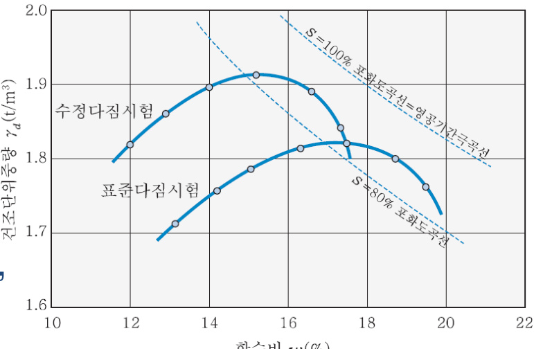  
그림 3-10 영공기간극곡선  
함수비  

# 5. 실내다짐시험  

# 예제 3.7  

흙입자의 비중 $G_{s}=2.68\%$ 흙의 영공기간극곡선을 그려라  

$\begin{array}{l}{{w\ =\ 5\varphi:\ \gamma_{d}=\frac{G_{6}}{1+G_{6}\,w}\,\gamma_{w}=\frac{2.68}{1+2.68\times0.05}\times11/\mathrm{{m}}^{3}}}\\ {{\ }}\\ {{w\ =\ 10\%:\ \gamma_{d}=\frac{2.68}{1+2.68\times0.10}\times11/{\mathrm{m}}^{3}=2.11\mathrm{t}/\mathrm{{m}}^{3}}}\\ {{\ }}\\ {{w\ =\ 15\%:\ \gamma_{d}=\frac{2.68}{1+2.68\times0.15}\times11/\mathrm{{m}}^{3}=1.91/\mathrm{{m}}^{3}}}\\ {{\ }}\\ {{w\ =\ 20\%:\ \gamma_{d}=\frac{2.68}{1+2.68\times0.20}\times11/\mathrm{{m}}^{3}=1.74/\mathrm{{m}}^{3}}}\\ {{\ }}\\ {{w\ =\ 25\%:\ \gamma_{d}=\frac{2.68}{1+2.68\times0.25}\times11/\mathrm{{m}}^{3}=1.60/\mathrm{{m}}^{3}}}\end{array}$ m\* --236t/m3  

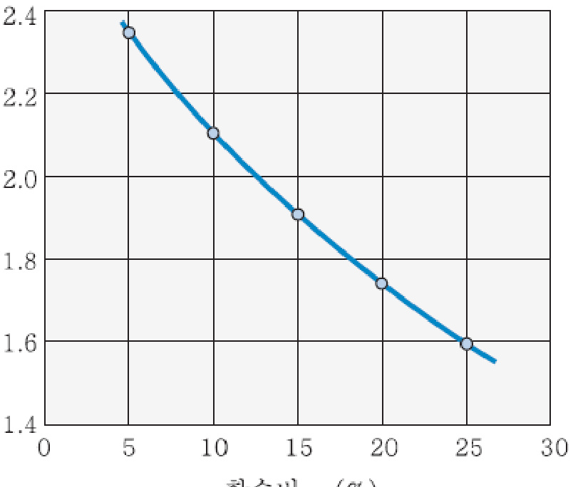  
함수비 $w(\%)$  

# 6. 흙의 다짐에 영향을 미치는 요인  

함수비 이외에 다짐에너지의 크기, 흙의 종류 등다짐에너지에 의한 영향  

1. 다짐에너지가 커지면 최대건조단위중량이 증가한다.  
2. 다짐에너지가 커지면 최적함수비 OMC는 감소한다.다짐에너지가 클수록 최적함수비가 감소한다는 것에서 현장에서 흙을 다질 때 대형 다짐장비를 사용하면 물을 덜뿌려주면서 다져도 된다최적곡선: 여러 다짐곡선의 꼭지점을 연결한 선. 일종의 포화도곡선다짐에너지에 따른 위의 특성은 모든 종류의 흙에 적용된다. 그러나 다짐의 정도는 다짐에너지에 직접 비례하지 않음  

  

다짐에너지가 다짐에 미치는 영향  

# 6. 흙의 다짐에 영향을 미치는 요인  

# 흙의 종류에 의한 영향  

1. 다짐에너지가 같을 경우 조립토(자갈, 모래)가세립토(실트, 점토)보다 다짐이 잘 되고, 다짐곡선은왼쪽위로 이동한다. 즉, 최대건조단위중량이증가하고 최적함수비 OMC는 감소한다.  

2. 조립토에서는 입도분포가 양호할수록 다짐이 자잘 된다. 즉, 최대건조단위중량이 증가하고 최적함수비 OMC는 감소한다.  

3. 세립토에서는 소성이 작을수록 다짐이 잘 된다.즉, 최대건조단위중량이 증가하고 최적함수비OMC는 감소한다.  

4. 조립토의 다짐곡선은 세립토의 다짐곡선에 비해서 경사가 급한 경향이 있다.  

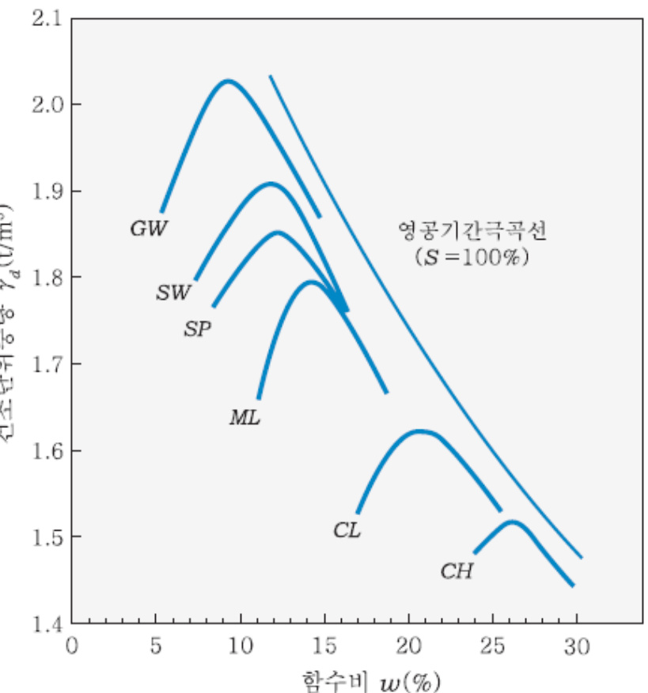  
여러 종류의 흙에 대한 다짐곡선  

# 7. 흙의 다짐 특성  

# 사질토의 다짐 특성  

입도불량한 모래의 다짐곡선은 1개의 꼭지점을 갖는 다짐곡선과는 달리 처음에는 함수비가증가 함에 따라 건조단위중량이 감소하다가 함수비가 더욱증가하면 건조단위중량이 증가하여 최대값 에도달  

처음에 함수비가 증가하여도 건조단위중량이 감 소하는 것은 간극수에 의한 모관장력(capillary tension)이 흙입자의 미끄러짐 및 다짐을 방해하 여 오히려 흙의 부피가 늘어나기 때문이며,. 이러 한 부피팽창을 벌킹(bulking)  

물을 더욱 증가시키면 표면장력이 사라져서 흙의부피가 작아져서 건조단위중량이 다시 증가  

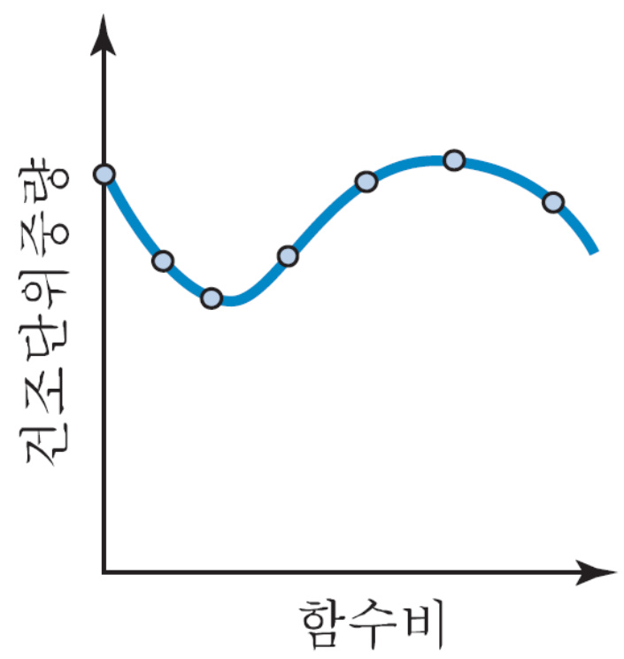  

그림 3-14 입도불량한모래의 다짐곡선  

# 7. 흙의 다짐 특성  

# 점토의 다짐 특성  

# 다짐과 점토의 구조  

점토를 최적함수비보다 작은 건조측의 함수비로 다지면 점토는 면모구조 (점A)  

함수비가 증가하면 입자 주위의 확산이중층이 팽 창하고 점토입자간의 반발력이 증가하여 면모화 되는 정도가 감소하고 건조단위중량이 증가(점 B)  

함수비가 증가하면 이중층이 더 팽창하게 되고 그 결과 입자간의 반발력이 계속 증가하여 이산 구조. 그러나 늘어난 물이 흙입자가 집중되는 것 을 방해하기 때문에 건조단위중량은 감소 (점C)  

함수비가 일정한 경우에는 다짐에너지가 클수록점토입자의 배열이 더욱 평행한 형태가 되어이산구조가더 뚜렷(점 D, 점E). 입자간의 거리가가깝게되어 흙은 더 큰 단위중량을 갖게됨  

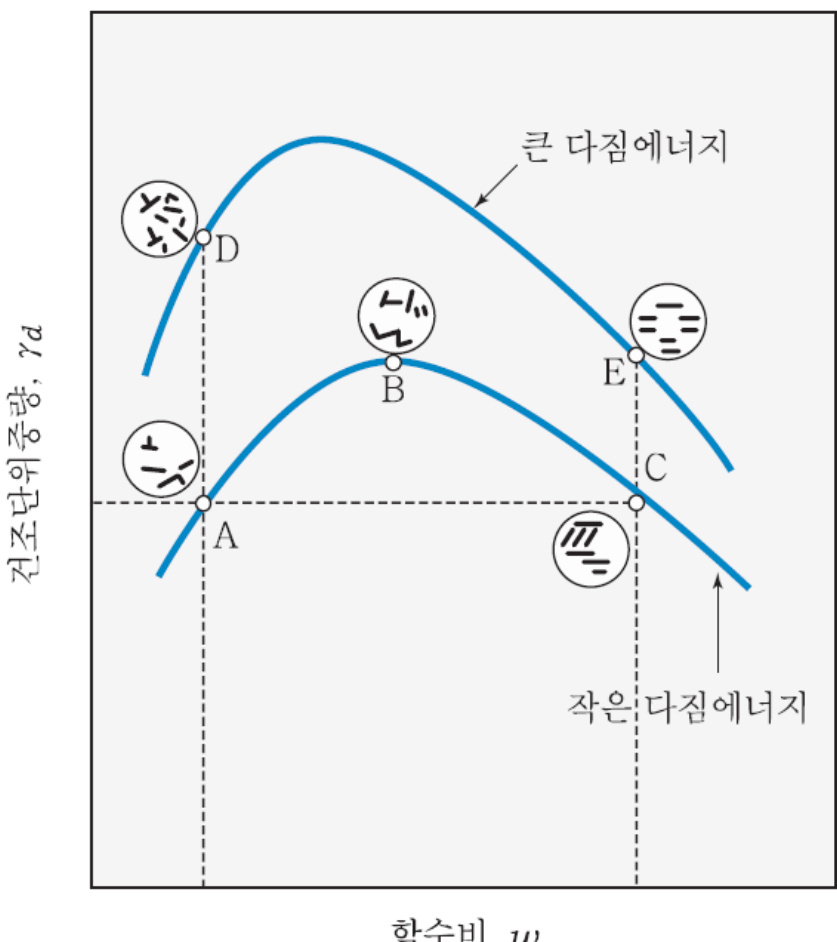  
다짐이 점토의 구조에 미치는 영향  

# 7. 흙의 다짐 특성  

# 점토의 다짐 특성  

# 다짐과 투수계수  

흙속에서 물이 얼마나 빨리 흐르는가를나타내는 투수계수는 함수비가 증가함에 따라서 감소  
투수계수는 거의 최적함수비에서 최소값최적함수비보다 큰 함수비에서는 투수계수가약간 증가  
최적함수비의 건조측에서 투수계수가큰이유는 점토입자의 배열이 불규칙한 면모구조이어서 간극이 크기 때문  
최적함수비의 습윤측에서 다질 때 투수계수가 작아지므로, 흙댐의 다짐처럼 차수가목적인 경우에는 최적함수비보다 약간더많은 함수비 즉 습윤측에서 다짐을 하는 것이 효과적  

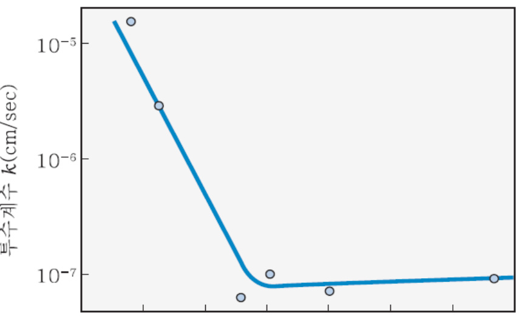  

  
함수비 $w(\%)$  

# 7. 흙의 다짐 특성  

# 점토의 다짐 특성  

# 다짐과 압축성  

최적함수비의 건조측과 습윤측 상태에서 다져진 점토의 일차원 압밀특성 면모구조를 파괴시키지 못할정도의작은 압력으로 점토시료를 압밀할 경우에는 건조측 다짐을 한 시료가습윤측 다짐을 한 시료보다 압축성이작게됨 면모구조를파괴시킬 정도의큰압력으로 점토시료를 압밀할 경우에는 건조측다 짐을 한 시료가습윤측다짐을한시료보다 압축성이크게됨  

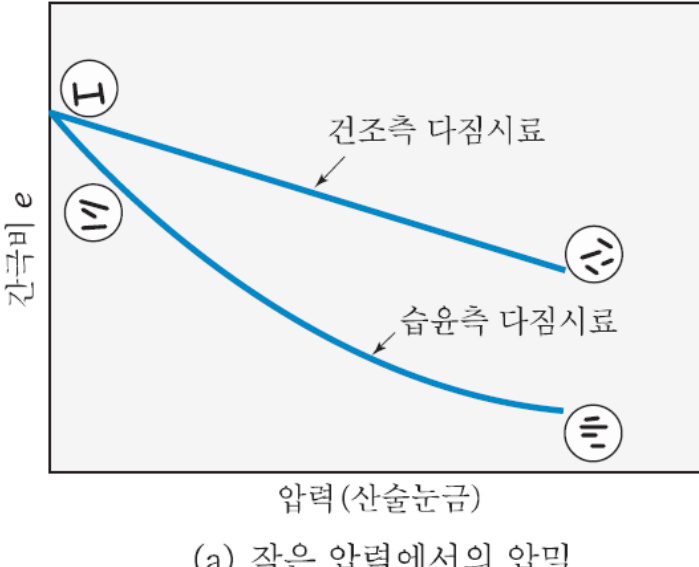  

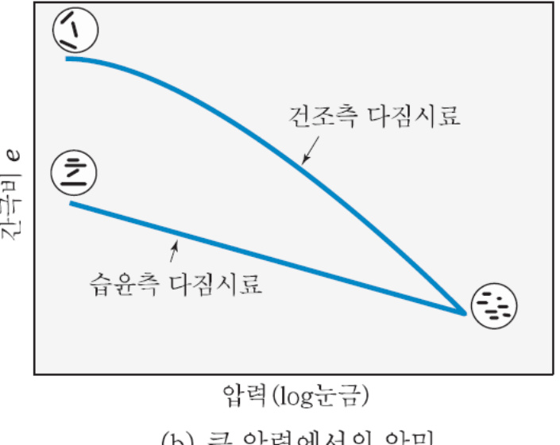  

# 7. 흙의 다짐 특성  

# 점토의 다짐 특성  

# 다짐과 강도  

다짐을 받은 점토의 일축압축강도는 다짐함수비가 클수록 감소하며, 최적함수비 부근에서 강도가크게 감소  

건조측과 습윤측에서 다짐을 하여 같은 건조단위중량을 나타내었다 할지라도, 건조측다짐을 받은 시료의 면모구조가 습윤측다짐을 받은 시료의 이산구조보다더큰강도를 나타냄을 의미다짐의 목적이 강도증가인 경우에는 최적함수비보다 약간 작은 함수비 즉 건조측에서다짐을 하는 것이 효과적  

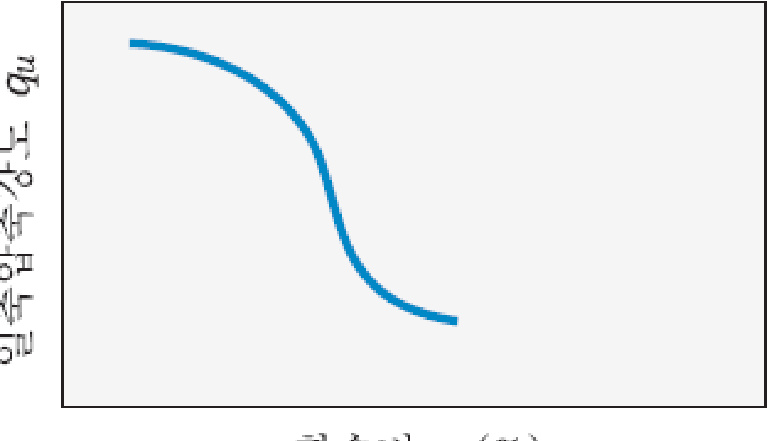  
함수비 $w(\tilde{\varphi}_{0}^{\prime})$  

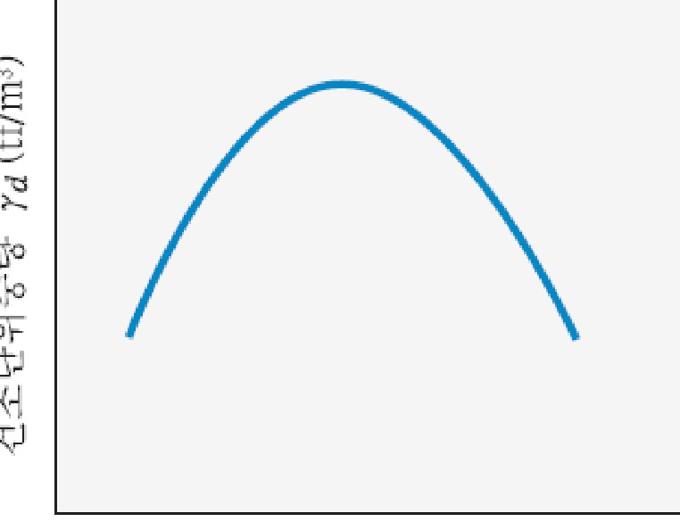  
함수비 $w(\tilde{\varphi}_{\bar{U}})$  

# 8. 현장다짐  

# 현장다짐 장비  

현장에서흙을 다질 때흙을적절한두께로 느슨하게깐 다음 다짐장비를이용대부분의 현장다짐에는 롤러(roller)를이용  

강륜롤러(smooth- wheel roller) 강재(steel)로 된 원통모양의 롤러로서, 도로 노상을다지거나 사질토나점성토로된 성토의마무 리작업에적합  

2. 고무타이어롤러(pneumatic rubber-tired roller)  

여러줄의 고무타이어가 부착된중량이 큰 차량. 사질토와점성토의 다짐에사용  

3. 양족롤러(sheep’s foot roller)  

강제원통 표면에많은돌기가부착된 롤러. 돌기의작용은흙을 혼합시키고 단단한흙덩어리를 부수는역할. 점토층을다질 때아주 효과적  

4. 진동롤러(vibratory roller)강륜롤러, 고무타이어 롤러에진동기(vibrator)를 부착시킨것. 사질토를 다질 때특히효과적  

# 8. 현장다짐  

# 강륜롤러  

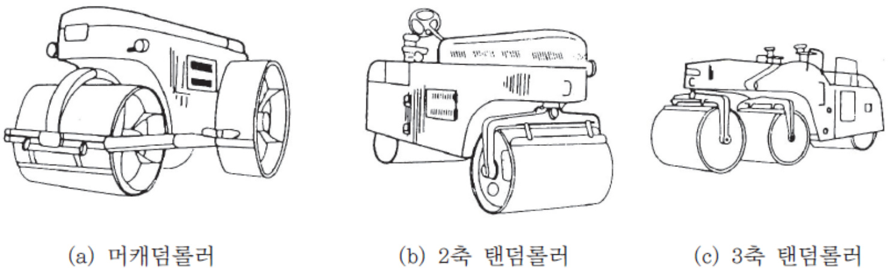  

고무타이어롤러  

양족롤러  

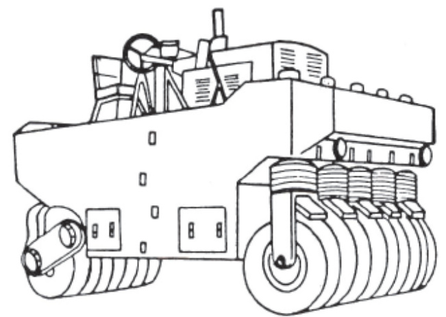  

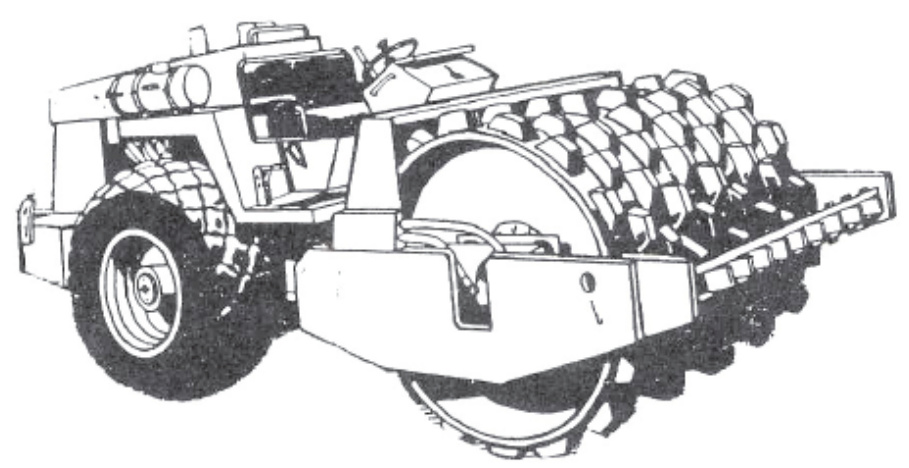  

# 8. 현장다짐  

# 현장다짐 특성  

# 롤러의 통과횟수  

흙의건조단위중량은 어느정도까지는롤러의 통과횟수에 따라 증가하지만, 점차일정. 경제적으로최대건조단위중량을 얻을 수 있는 롤러의 통과횟수는 10\~15회정도  

# 깊이에 따른 다짐효과  

다짐효과(건조단위중량)는 지표면보다 약간아래에서 가장크게나타난 다음 깊이가커질수록 감소.  
지표면에 가해진 압력이깊이에따라서 감소하며, 결국 깊은곳에서는흙이덜 다져지기때문  

# 다짐층 두께  

다짐장비와통과횟수가정해지면 다짐층의두께를결정. 실제로현장에서는 대부분의 토공사의 경우 한층의 다짐두께로30cm를많이적용  

# 과다짐  

너무 큰 다짐에너지로흙을 다지면흙구조가파괴되는 등흙속에결함이생겨서흙의건조 단위중량이나 강도가감소  