# 흙의 다짐  

동적 또는 정적 하중을 가하여 흙의 밀도를 높인다  

흙의 강도증가 및 침하량 감소  

고속도로, 흙댐, 제방, 철도, 택지조성 등…성토사면 안정성 증대  

강륜(smooth-wheel), 양족(sheepsfoot )로울러  

공기고무타이어 로울러, 진동 로울러  

바이브로플로테이션(vibroflotation)  

# 1. General Principles of Compaction  

다짐의 원리  

흙 속의 간극(공기) 제거에 의한 체적압축  

중량은 불변  

흙의 다짐 정도는 건조단위중량으로 평가  

다짐 시 물을 흙에 첨가 $\longrightarrow$ 물은 윤활유 역할 $\longrightarrow$ 흙입자들은 서로 미끄러져서 조밀해짐  
함수비가 증가함에 따라 다져진 흙의 건조단위중량증가  

# 1 General Principles of Compaction  

$$
\omega{=}0~\mathrm{;}~\gamma{=}\gamma_{\mathrm{d}}{=}\gamma_{\mathrm{l}}
$$  

함수비가 증가되는 상태에서 동일한 다짐에너지 $\rightarrow$ 단위 부피당 흙무게증가  

$$
\begin{array}{r l}{\omega{=}\omega_{1}\ ;\gamma{=}\gamma_{_2}\;\;}&{{}\;\gamma_{_\mathrm{d(\omega=\omega_{1})}}{=}\gamma_{_\mathrm{d(\omega=0)}}{+}\Delta\gamma_{_\mathrm{d}}}\end{array}
$$  

임의 함수비 초과하면 함수비가 증가함에 따라 건조단위중량 감소  

고체입자들로 채워져있던 공간 $\rightarrow$ 물이 차지최대건조단위중량 $\upgamma_{\mathrm{d(max)}}$(Maximum dry unit weight)최적함수비 (OMC Optimummoisture content)  

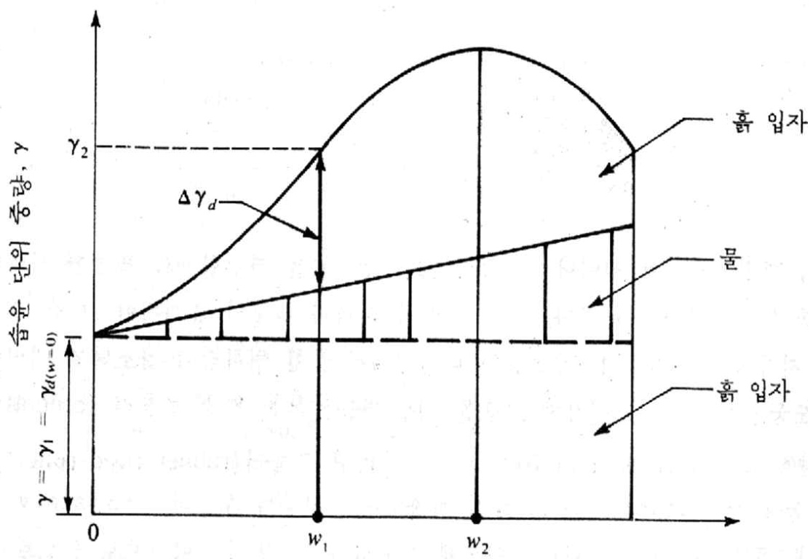  
함수비w  

# 2. Standard Proctor Test  

표준다짐시험 (ASTM D-698; A방법)  

몰드부피(V) 943. 3cm3, 몰드직경(D) 101. 6mm  

다짐 층수(L) 3층, 각 층당 다짐횟수(#) 25회  

햄머무게(W): 5.5 lb (2.5kg)  

햄머의 낙하높이(H): 12″(304.8mm)  

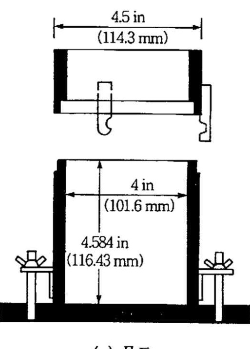  
몰드  

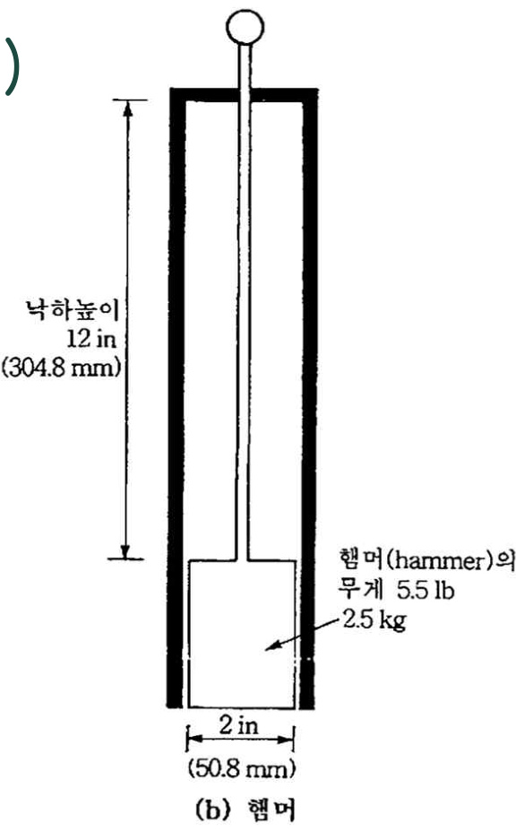  

Geotechnical Engineering  

# 2. 표준다짐시험  

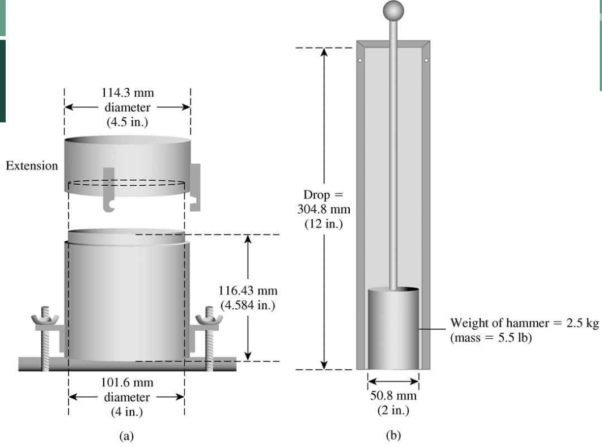  

ASTM (D-698)  
1999년  
습윤단위중량$\gamma=\frac{\mathsf{W}}{\mathsf{V}_{(\mathrm{m})}}$  

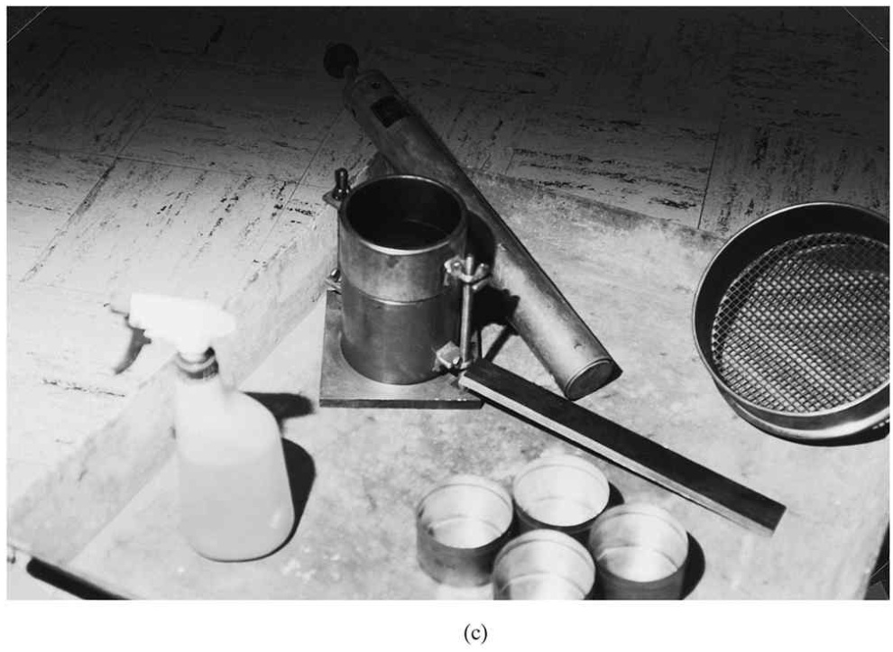  
Figure 52 Standard Proctor test equipment: Ca mold; 6 hammer; 9 photograph of laboratory equipment used for test  

# 2. Standard Proctor test  

# 이론적 최대건조단위중량  

간극사이에 공기가 존재하지않을 경우 $\longrightarrow$ 포화도 $100\%$영공기 간극(zero air void)  

$$
\gamma_{\mathrm{d}}\!=\!\frac{\gamma}{1\!+\!\frac{\wp(\%)}{100}}
$$  

Maximum Dry Unit Weight γ d(max)  

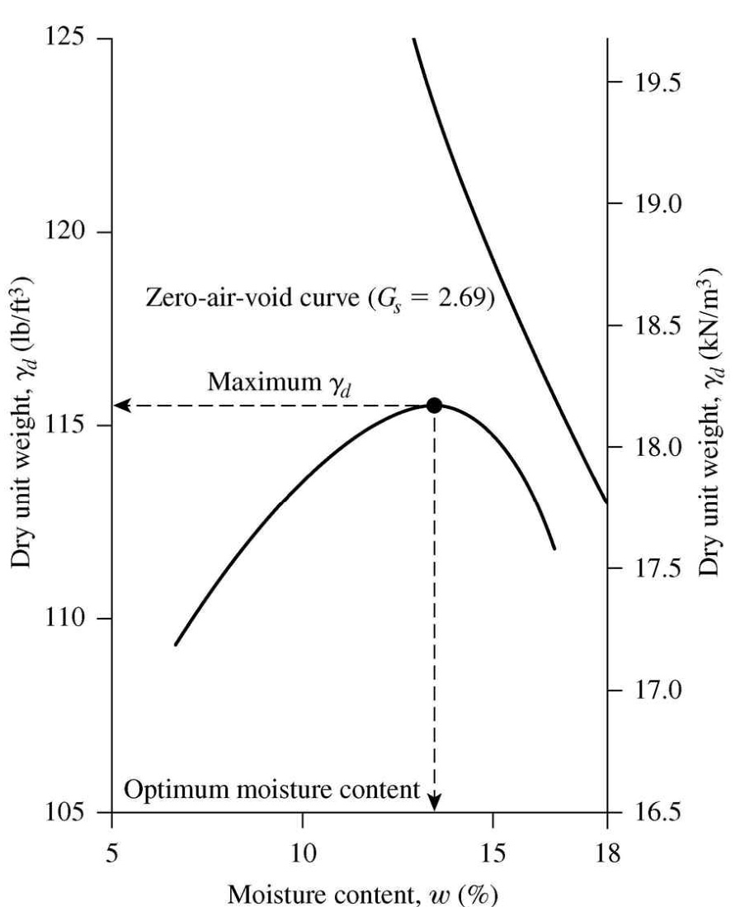  
Figure 53 Standard Proctor compaction test results for a silty clay  

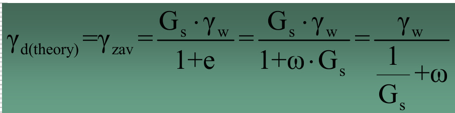  

# Chapter  

# 3. Factors affecting Compaction  

다짐에 영향을 주는 요소들  

함수비흙의 종류다짐에너지기타..흙의 종류에 따른 영향입도분포  

입도눈포   
입자모양   
흙고체의 비중   
흙입자의 형태   
점토성분의 종류및양  

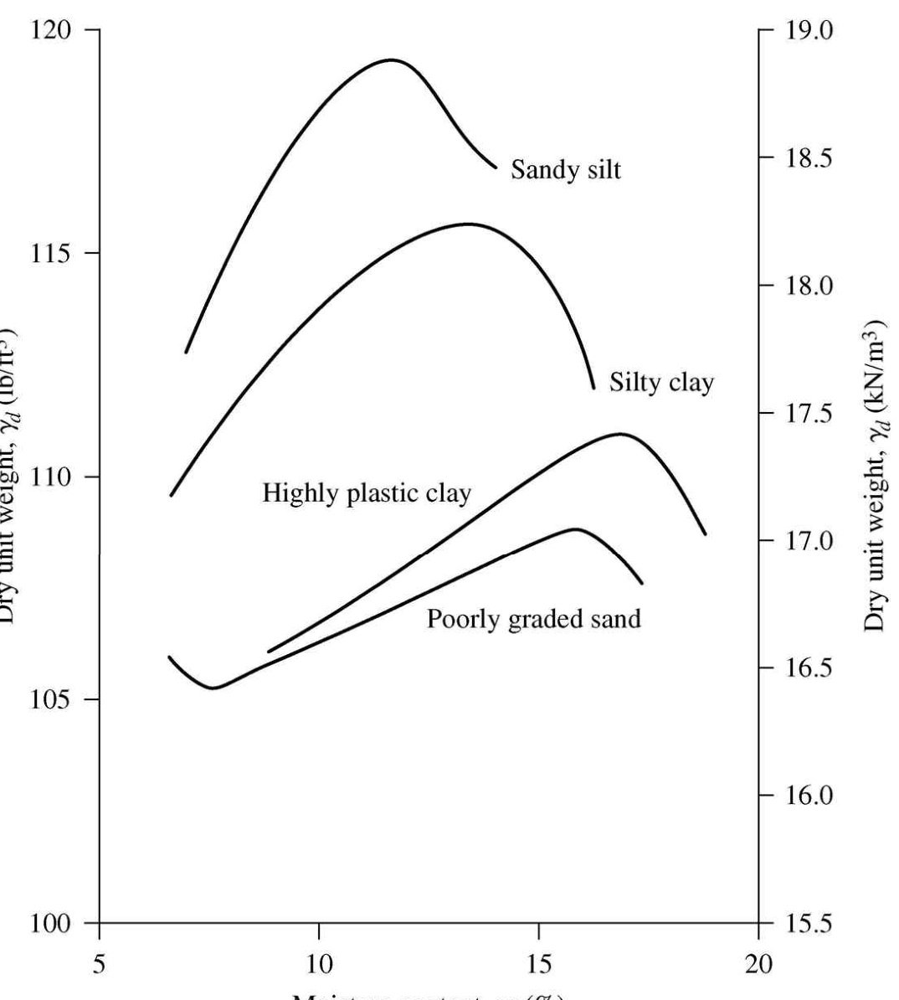  
Moisture content $w\,(\%)$  

# Chapter  

# 3. Factors affecting Compaction  

흙의 종류에 따른 영향   
ASTM(D-698)   
Lee & Suedkamp(1972)   
35개 흙시료  

일반적인 경우– (a) 액성한계 $30\%\ 01$ 하– (b), (c) 액성한계 $70\%\ 01$ 상– (c), (d)  

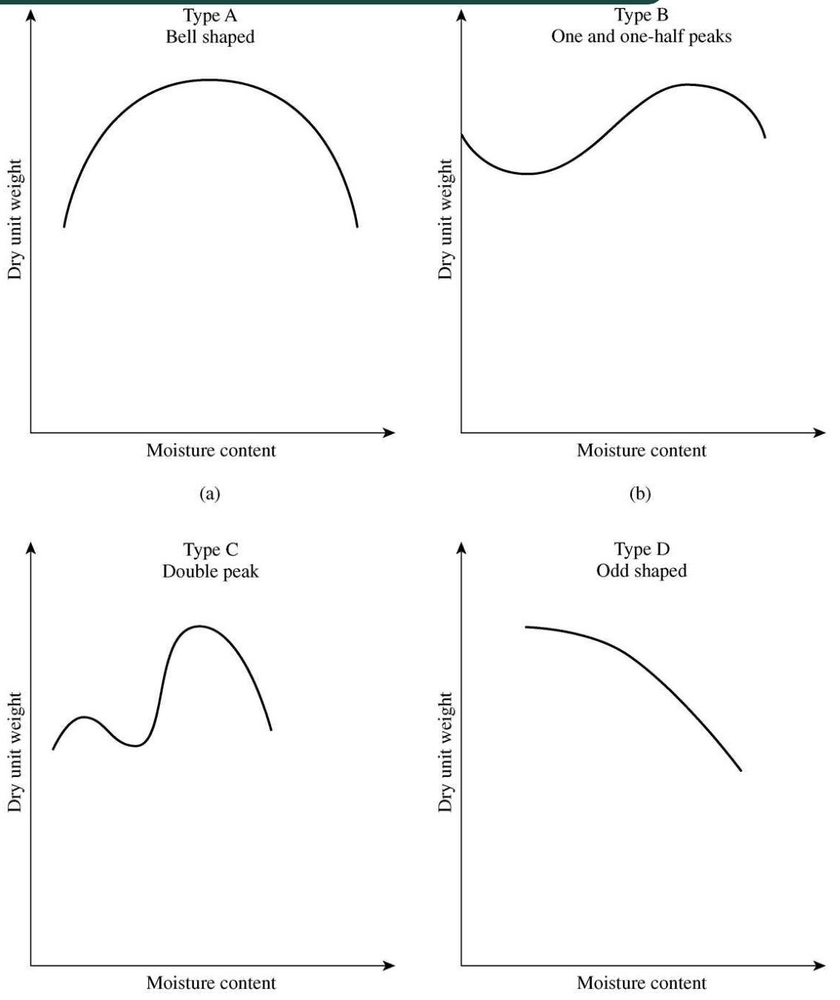  

# 3. Factors affecting Compaction  

다짐 에너지에 의한 영향  

$$
\mathrm{{E}=\frac{W_{h}\cdot H_{h}\cdot N_{l}\cdot N_{c}}{V_{m}}=594{\sim}600\,\mathrm{kN\cdotm/m}}
$$  

Weight of hammer( $[\mathbf{W_{h}})$ Height of drop of hammer(Hh) Number of layer $\mathbf{\Omega}^{\left(\mathbf{N}_{\mathbf{l}}\right)}$ Number of blows per layer(Nc)  

Volume of mold $\left(\mathbf{V}_{\mathrm{m}}\right)$  

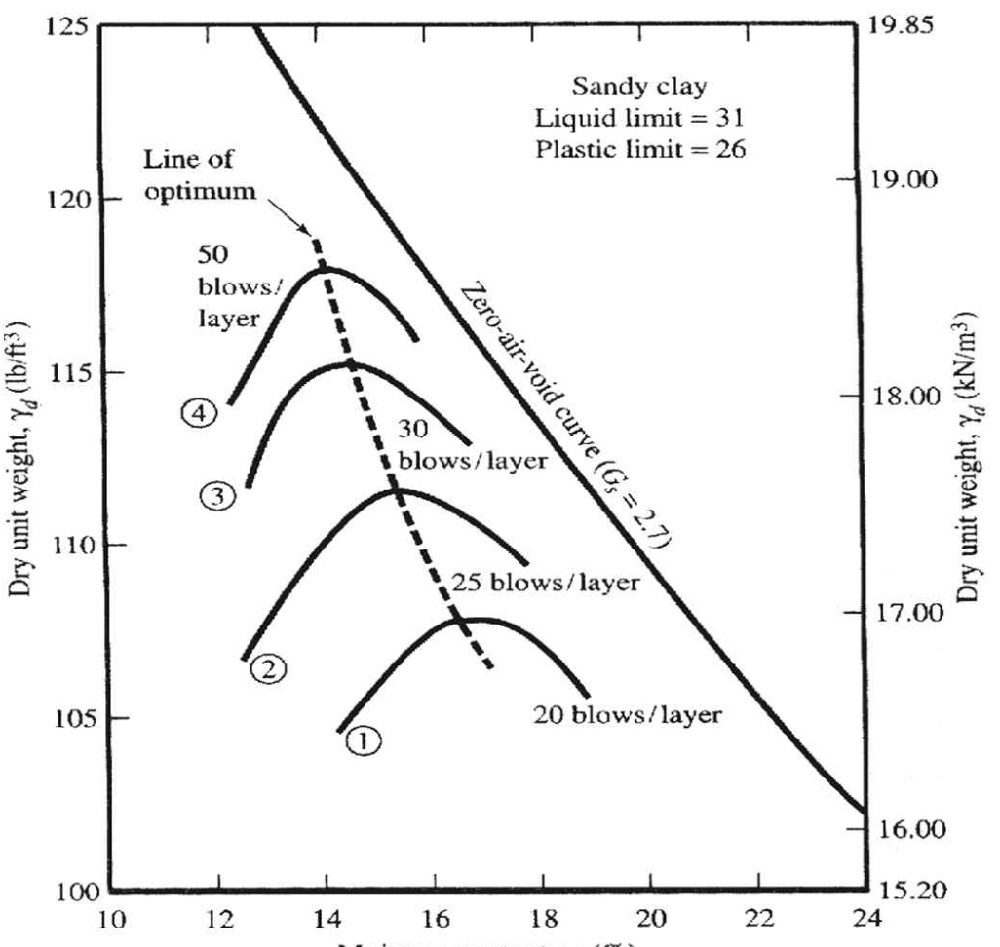  
Moisture Content w[%  

# 4. Modified Proctor Test  

# 수정 다짐시험(Modified Proctor Test)  

다짐기계의 대형화 및 다짐상태의 개선 $\longrightarrow$ 현장조건에 근접한실내 다짐시험 모색  

ASTM 시험(D-1557): 4.54kg hammer, 5 layer, 25 blows  

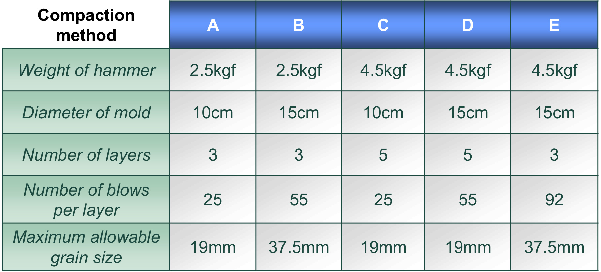  

# Omar et al.(2003)-311개  

자갈 45개사질토 264개점토 2개ASTM 1557 C방법rd(max)w(opt)  

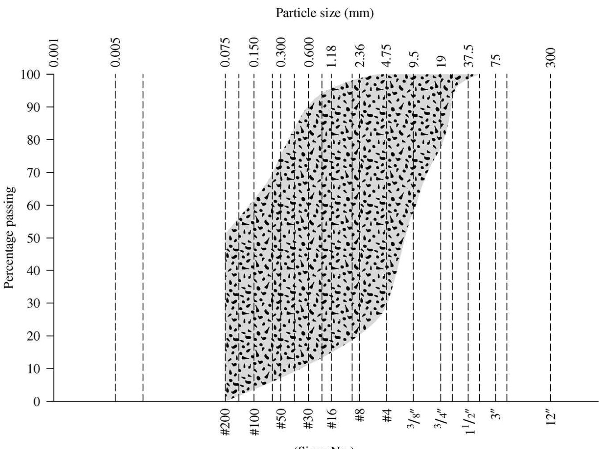  
Sieve No   
Figure 57 Range of grain-size distribution of all Soils tested by Omar 'et al 2003  

# 4. Modified Proctor Test  

Pamax = [4804574G -- 195551L? | 156971R#4405 - 9527830]05  

# Omar et al.(2003)-311개  

자갈 45개  
사질토 264개  
점토 2개  
ASTM 1557 C방법  

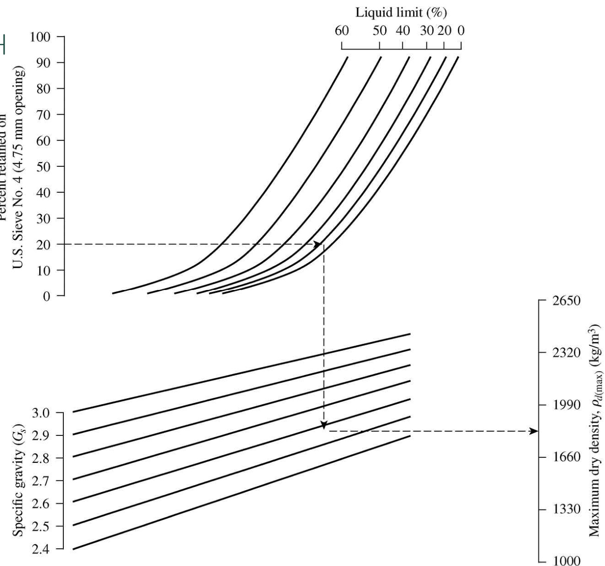  

# 4. Modified Proctor Test  

In wop $\mathrm{\Lambda_{\mathrm{t}})=1.195\times10^{-4}L L^{2}-1.964G_{s}-6.617\times10^{5}(R\#4)+7.6}$ 51  

Omar et al.(2003)  

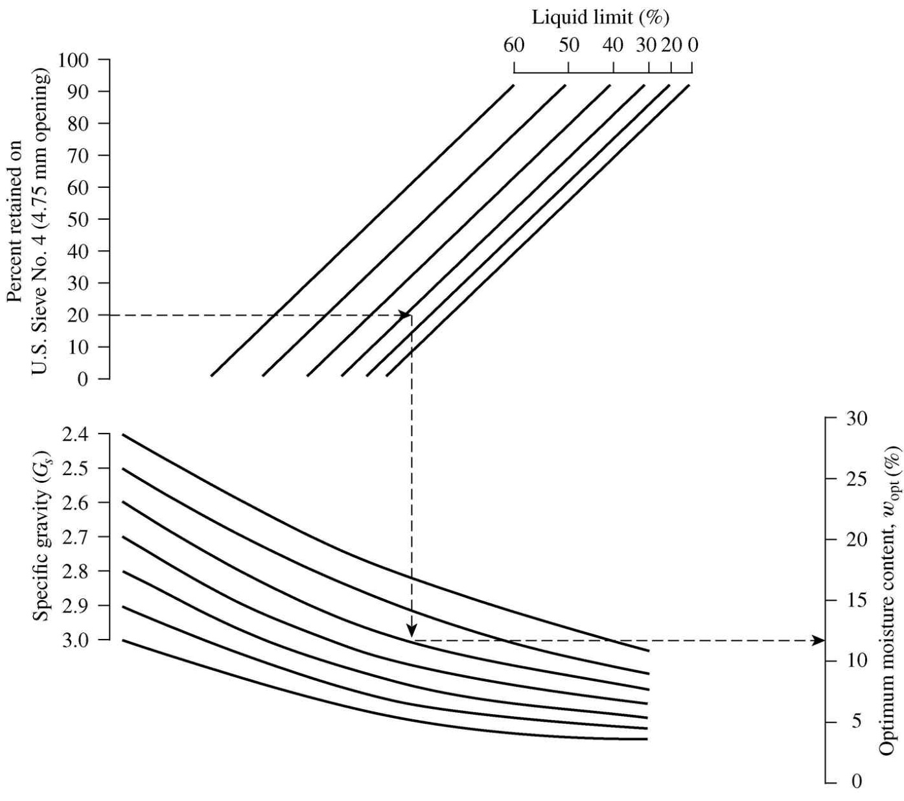  

# Chapter  

# 5. Structure of Compacted Cohesive Soil  

# 다짐을 받은 점성토의 구조  

A, E : 낮은 함수비상태  
점토입자를 둘러싸고 있는  
확산이중층 발달 부진 $\rightarrow\,\Xi$ 자간  
인력부진  
B : 함수비 증가: 입자 주위에  
확산이중층 발달 $\rightarrow\,\Xi$ 자간 인력  
증가 $\longrightarrow$ 면모화 발달 $\longrightarrow$ 높은  
건조단위중량  
C : 높은 함수비로 부피 팽창 $\longrightarrow$  
배열성 크게함 $\longrightarrow$ 분산구조화 $\longrightarrow$  
단위중량 감소  
D : 일정 함수비 상태에서 높은  
다짐에너지 $\longrightarrow$ 점토입자 배열이  
평행한 상태로되려는 경향 $\longrightarrow$  
구조교란 $\longrightarrow$ 분산구조  

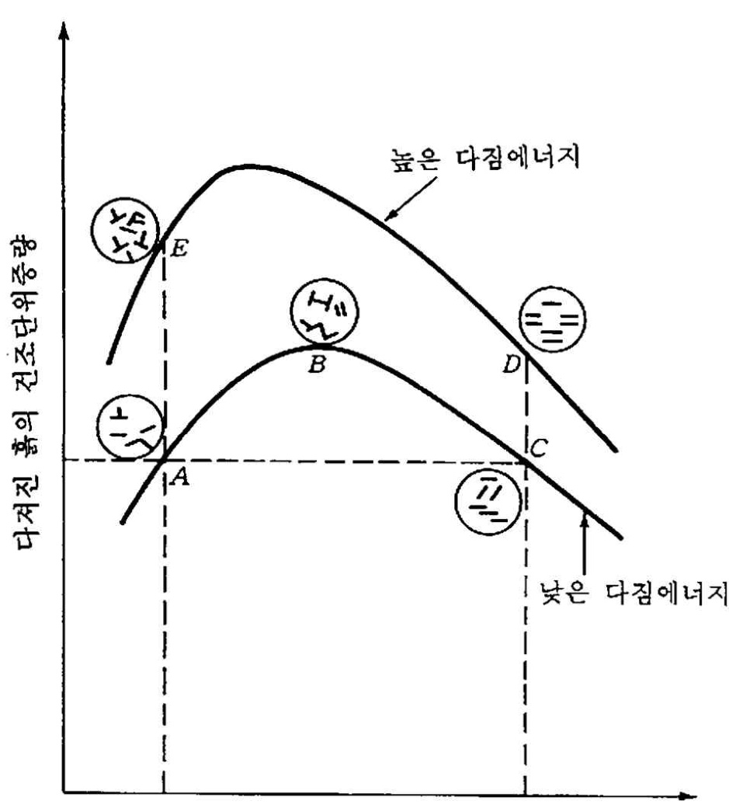  

# 5. Structure of Compacted Cohesive Soil  

# Chapter  

# Lambe(1958)  

Boston blue clay 함수비에 따른 입자배열  

Seed & Chan(1959)  

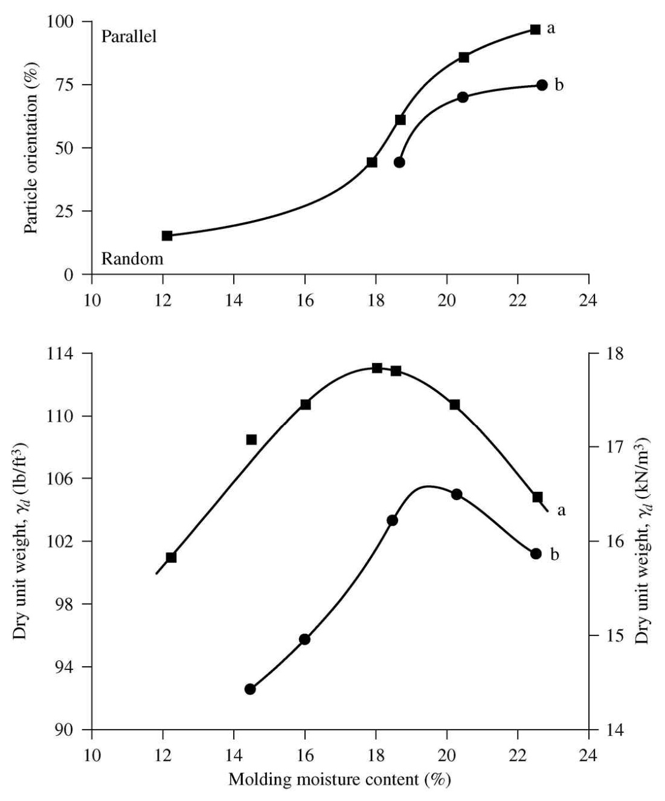  
Higher Compaction energy $\bullet$ Lower compaction energy  

# Chapter  

# 6. Effect of Compaction on Cohesive Soil Properties  

투수계수에 미치는 영향-점토 & 압축강도에 미치는 영향-점토  

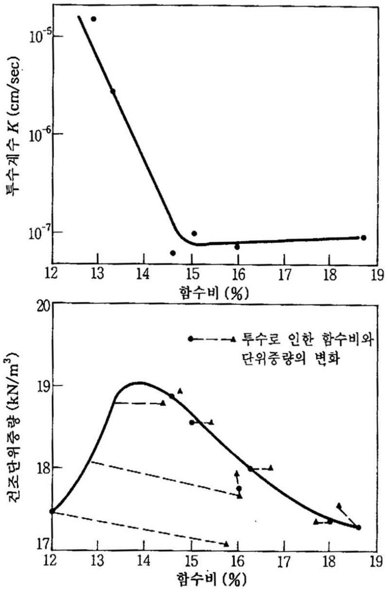  

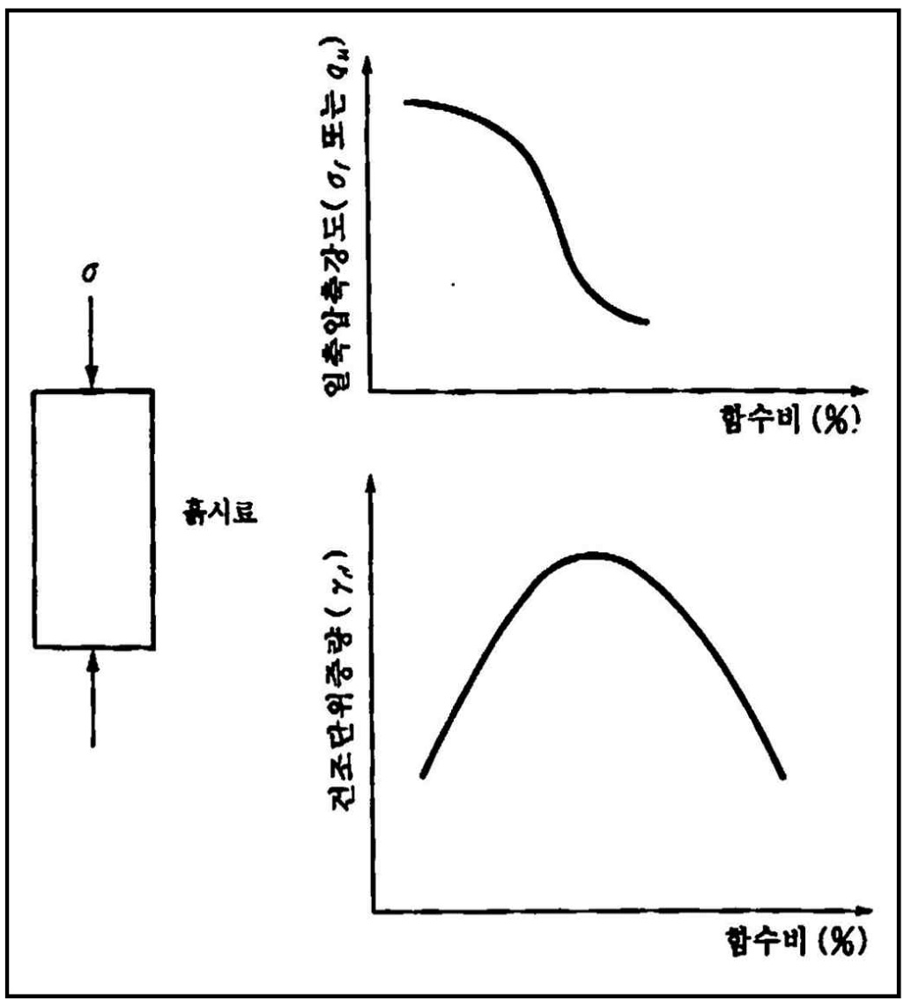  

# 7. Characteristics of Compaction Curves  

# 다짐곡선의 성질  

γd(max) 가 클수록 ωopt은 작음  

사질토는 $\upgamma_{\mathrm{d(max)}}$ 가 크고, 다짐곡선의 기울기가 급함  

점성토는 $\ Y_{\mathrm{d(max)}}\supsetneq$ 작고, 다짐곡선의 기울기가 완만  

다짐에너지가 클수록 γd(max) 가 크고 $\omega_{\mathrm{opt}}\Lt=$ 작아짐  

자갈 및 모래 함유량이 많을수록 γd(max)가 크고 ωopt 는 작아짐  

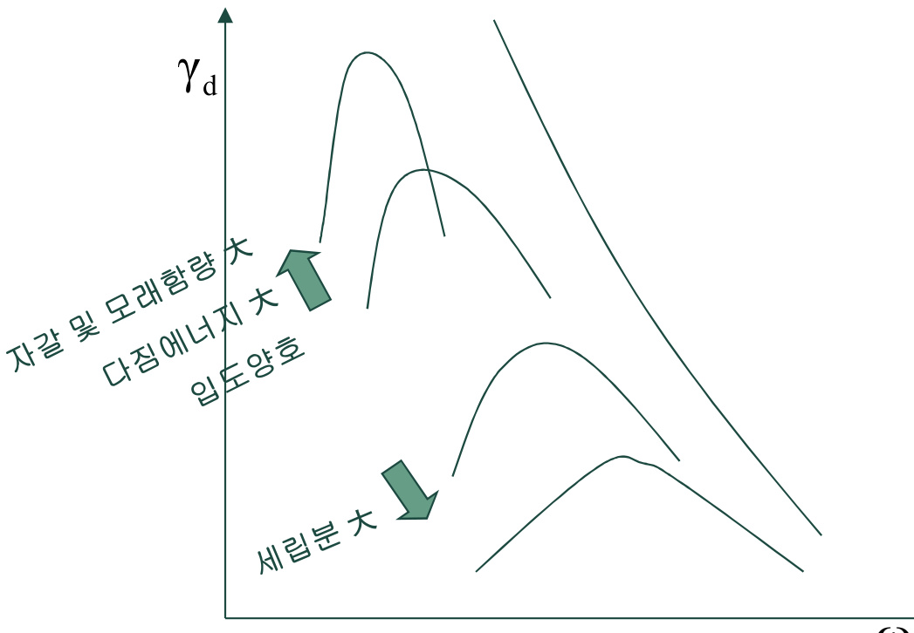  

# 8. Field Compaction  

# 현장다짐  

실험실 $\longrightarrow$ 표준다짐, 수정다짐시험, Hammer에 의한 다짐현장 $\longrightarrow$ 실내 다짐시험에 근거 $\longrightarrow$ 건설기계, Roller에 의한 다짐토질종류, 상태에 따라 다짐기계 선택  

강륜롤러(Smooth wheel roller, Drum roller)  

사질토, 점성토로 구성된 성토의 마무리 작업, 두꺼운 성토에 부적합  

# 공기 타이어 롤러(Pneumatic rubber tired roller)  

사질토, 점성토 지반 다지기, 압축작용과 반죽작용  

양족롤러(Sheepsfoot roller)  

드럼 표면에 돌기를 부착, 점성토 다짐에 효과  

# 진동롤러(Vibration roller)  

드럼에 진동기 부착, 사질토 다짐에 효과  

# 강륜롤러(Smooth wheel roller, Drum roller)  

사질토/점성토 성토의 마무리 작업, 두꺼운 성토에 부적합(31\~38Mg/m2)  

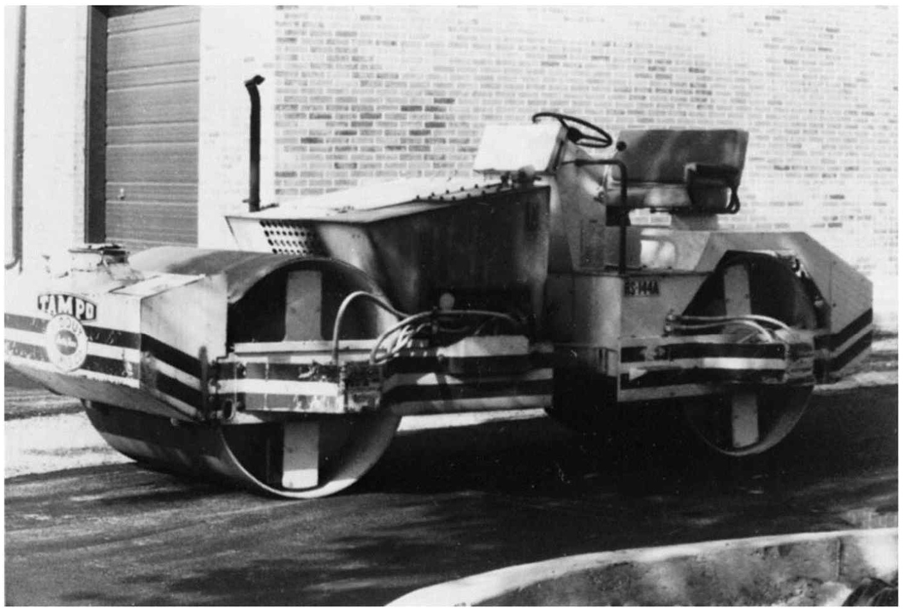  
Figure 519 Smooth-wheel roller Courtesy of David A Carroll Austin Texas  

# 공기 타이어 롤러(Pneumatic rubber tired roller)  

사질토, 점성토 지반 다지기, 압축작용과 반죽작용 (58.5\~69Mg/m2)  

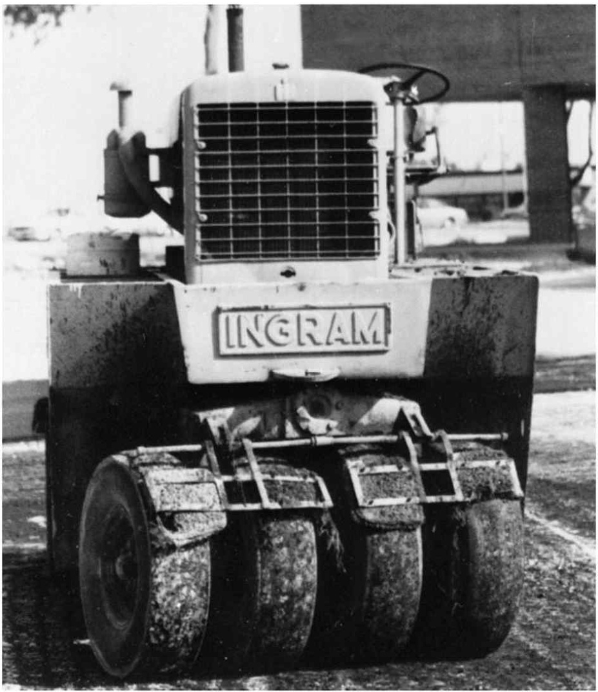  
Figure 520 Pneumatic rubber-tired roller Courtesy of David A Carroll Austin Texas  

# 8. Compaction Equipment  

# 양족롤러(Sheepsfoot roller)  

드럼 표면에 돌기를 부착, 점성토 다짐에 효과 (138\~690Mg/m2)  

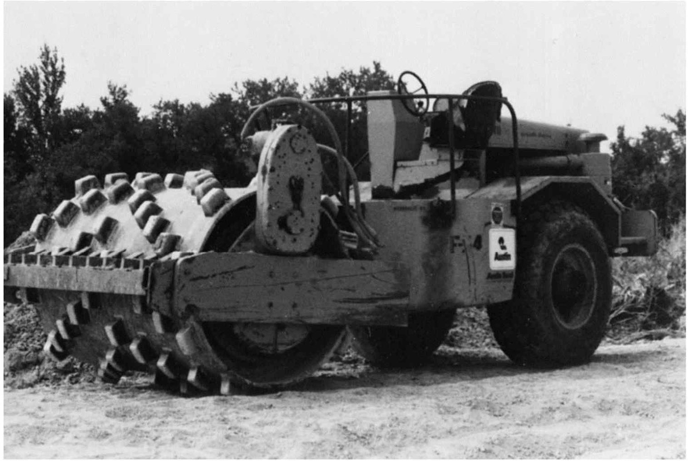  
Figure 521 Sheepsfoot roller Courtesy of David A Carroll Austin Texas  

# 진동롤러(Vibration roller)  

드럼에 진동기 부착, 사질토에 가장 다짐에 효과가 크다  

Vibrator Off-center rotating weight  

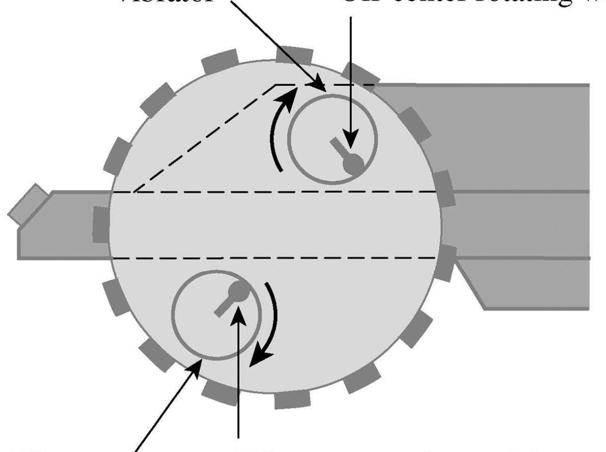  

Vibrator Off-center rotating weight  

Figure 522 Principles of Vibratory rollers  

# 8. Field Compaction  

롤러 통과 횟수에 의한 다짐의 영향 (10\~15회)  

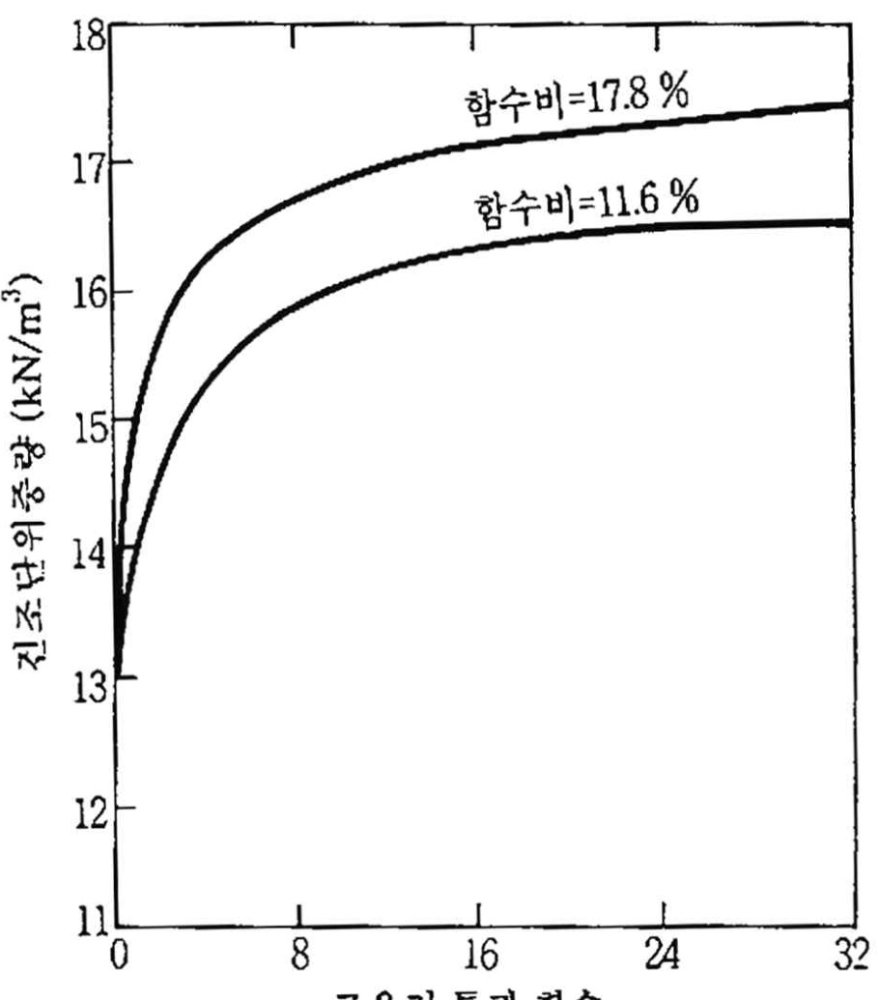  
로울러 통과횟수  

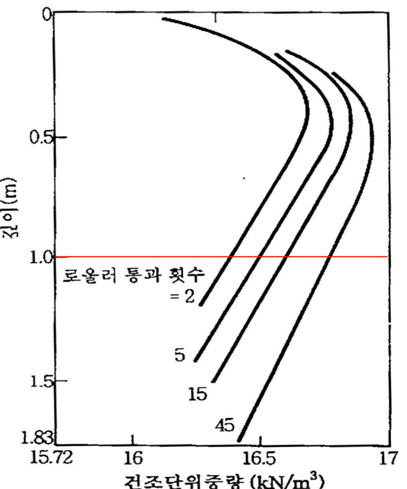  

# 9. Specification for Field Compaction  

# 현장 다짐에 관한 규정  

현장에서의 다짐도 $\longrightarrow$ 실내 다짐시험시 최대 건조단위중량의 90\~95%  

상대다짐도(RC Relative Compaction) $\mathrm{R}(^{0}/\mathrm{{o}){=}\frac{\gamma_{\mathrm{d(field)}}}{\gamma_{\mathrm{d(lab)}}}{\times}100}$  

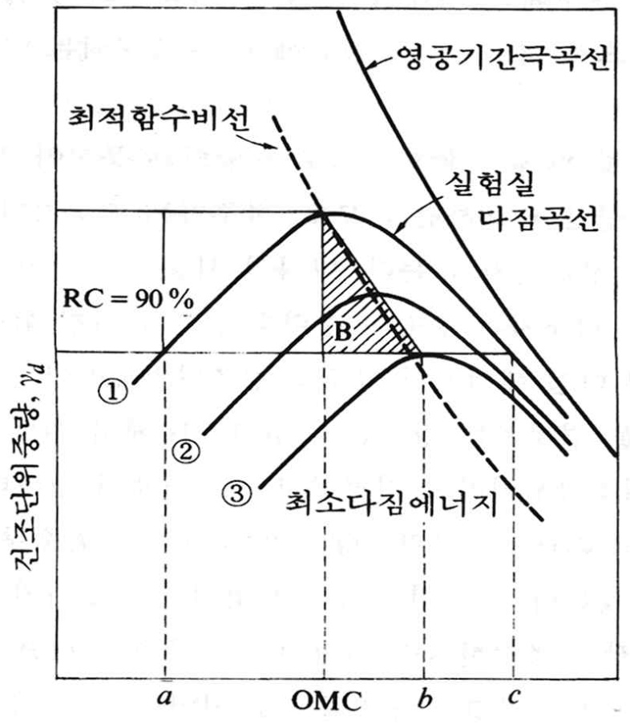  
함수비 $\%$  

현장에서 단위중량 결정  

현장에서 다짐작업시 규정된 단위중량에 도달했는지 확인 필요모래 치환법(Sand cone method), 고무 풍선법(Rubber balloonmethod), 핵 밀도기 사용법(Use of a nuclear density meter)  

# 모래 치환법  

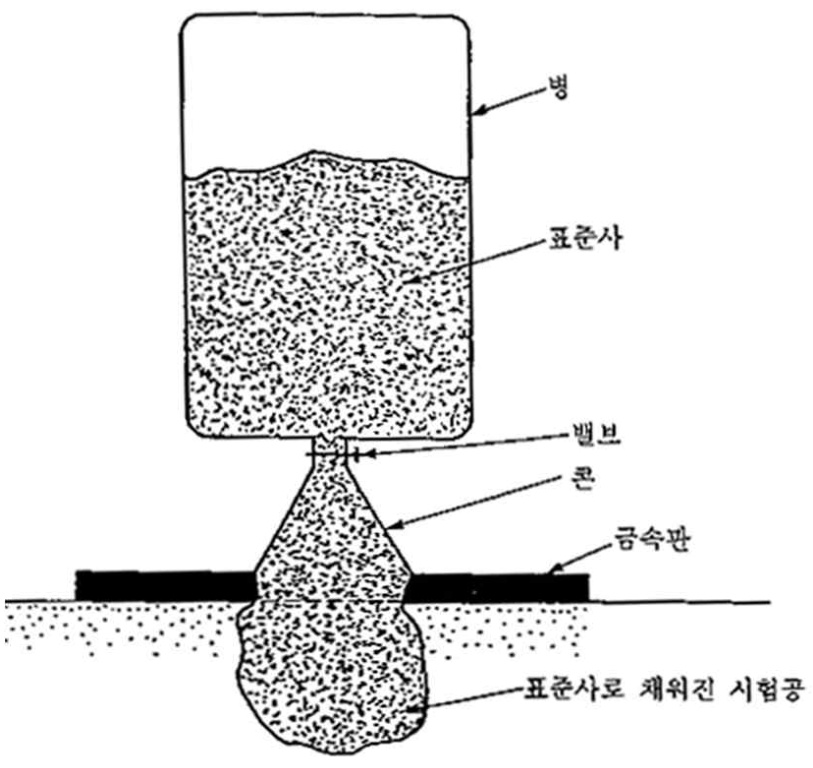  

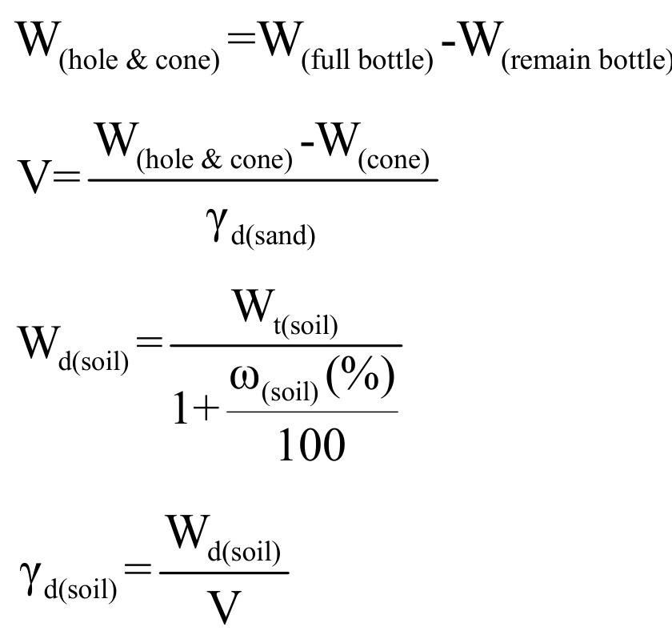  

# 11. Special Compaction Techniques  

# 특수한 다짐 기술  

바이브로 플로테이션(Vibroflotation)  

지반 심층부 다짐 (현장에서 널리 사용되는 기술)  

느슨하고 두꺼운 조립토층의 다짐, 바이브로 플로트를 분사현상(quickcondition)을 이용 지반에 관입하여 사질토를 주입하고 진동시키면서상승  

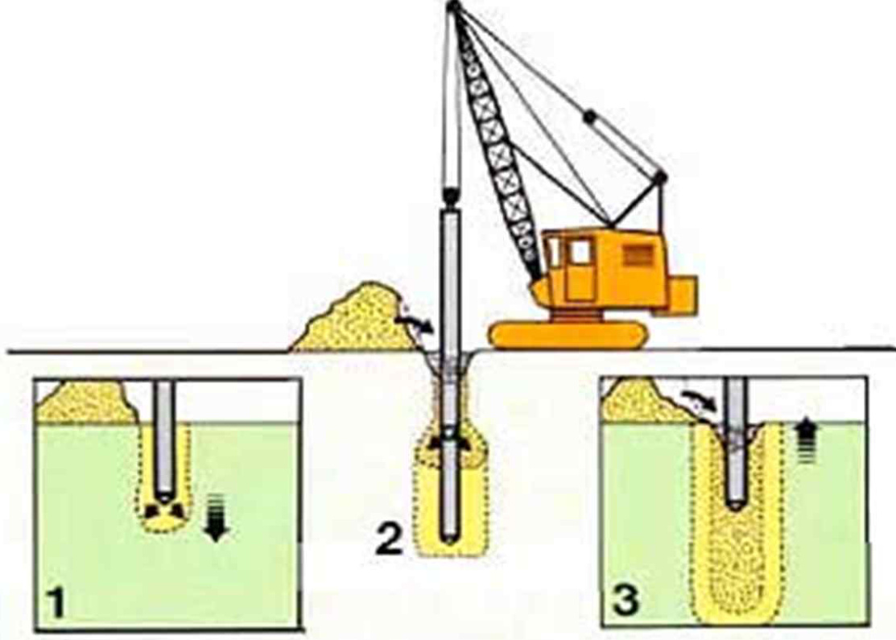  

# 11. Special Compaction Techniques  

# 특수한 다짐 기술  

동적 다짐(Dynamic Compaction)  

느슨한 사질 지반의 다짐, 무거운 추를 반복적으로 지반에 낙하 →사질토 채움발파공법 $\longrightarrow$ 조립토의 밀도증대, 토층두께의 2/3 지점에 폭약 설치  

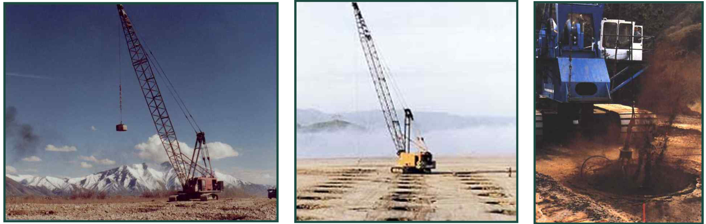  