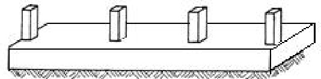
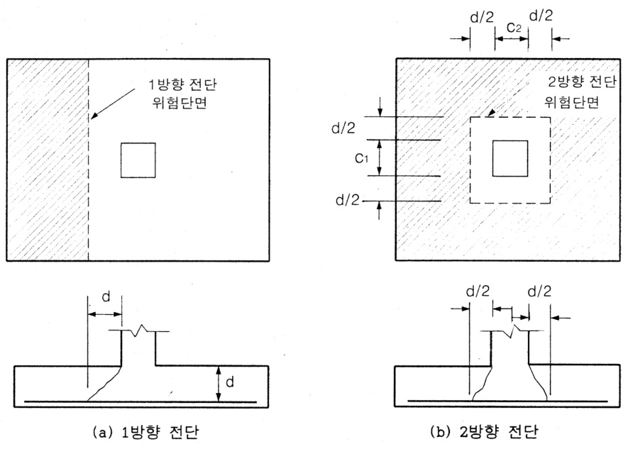

# 10 장기초 설계  

10.1 개요  

1) 기초의 개념 기둥이나 벽체를 통하여 전달된 건물의 하중을 지반에 전달하는 구조물  

2) 기초의 기능 건물에서 전달되는 단위 면적당의 하중을 지반이 지지할수있는힘의크기로 하중을 분산시키는 기능  

3) 기초의설계: 상부 건물의 하중을 지지하고(지내력이 부담), 지반으로 부터 작용하는토압에 견딜수 있도록 설계.침하량을 최소화: 충분한지내력을가진 지반층에 기초를 설치.부동침하방지: 구조체에 2차응력 발생 및 균열 발생을 억제.  

\* 지내력: 흙의 특성에 따라 지반이 받을 수 있는 저항력\*\* 토압: 상부구조물의 하중에 따라 지반으로 부터 기초에 작용하는 외력.  

5) 기초의 종류  

$\textcircled{1}$ 독립 기초: 독립기초판 위에 단일 기둥이 놓임 [ 그림 1(a) ]$\longrightarrow$ 기둥사이 거리가 멀고, 지내력이 비교적 양호한 경우에 적용.  

$\longrightarrow$ 정방향 또는 장방형  

  

$\circledcirc$ 연속기초: 기둥사이 거리가 가까운 여러 개의 기둥을 하나의 줄기초 위에놓음[ 그림 1(c) ]  

  

$\textcircled{3}$ 줄기초: 내력벽 또는 조적벽을 지지하는 기초 [ 그림 1(b) ]$\longrightarrow$ 벽체 외주면을 기준으로 단변방향의 단위폭 1m 의 캔탈레버보로 설계$\circledast$ 복합기초 하나의 기초판 위에 두 개 이상의 기둥을지지. [그림 1(d) ]$\longrightarrow$ 두 기둥사이 거리가 가깝거나 지내력이 작아서 독립기초로 하기 어려운경우$\longrightarrow$ 기초의 저면에 등분포토압을 일으키도록 두 기둥의 합력과 기초저면의도심을 일치시킴.  

  
Strip or Wall footing  

  

$\textcircled{5}$ 온통기초 (매트기초) 하나의 기초판 위에 구조물 전체의 기둥이나 벽체를  

지지하는 기초.  

사용조건  

a. 지반의지내력이작아서 독립기초로할경우 기초저면적이 커져서 전체바닥 면적의1/2 이상일경우.b. 토질조건상말뚝기초가 적합하지 않은경우$\longrightarrow$ 지반의 침하량은 다소 커지나 기초판 전체의 강성이 커져 부동침하를 작게할수있다  

  
9 Mat or Taft footing  

$\textcircled{6}$ 말뚝기초: 지반 지내력이 부족하여 독립기초가 어려울 경우 말뚝으로 지지하는기초  

종류: 마찰말뚝, 지지말뚝  

  
e Pile cap  

10.2 기초해석의 기본사항  

10.2.1 기초에 작용하는 토압  

1) 토압: 기초상부 하중이 수직으로 기초에 전달될 때, 기초를 떠받치는 지반의 압력  

2) 토압의 분포: 지반의 종류와 기초의 지반에 대한 상대강성에 영향을 받는다.그러나, 설계상 토압은 균등하게 분포하는 것으로 가정한다.  

사질토 기초주위의 흙이 바깥쪽으로 이동하기 때문에 기초중심에서 증가하고, 주변에서는 감소 그림 3(a) ]  

점토: 강한점착력 때문에 이동이 일어나지 않고, 기초 주변에 평균토압과 전단저항력이형성되어 기초중심에서 감소하고, 주변에서는 증가[ 그림 3(b) ]  

  
[지반에 따른 토압 분포]  

10.2.2. 허용지내력과 기초의 크기  

1) 지내력에 영향요인 기초의 형태와 깊이, 상부하중의 크기, 지하수의 위치,토질의 종류  

2) 기초의 지압파괴 기초 하부의 지반이 이동하는 현상.  

3) 허용지내력  

평판재하시험, 표준관입시험 등에 의해 결정. 지질조사보고서에 명시극한지내력 $q_{\mathit{u l t}}$ : 기초의 지압파괴시의 토압.  

허용지내력 $q_{a}={\frac{q_{u l t}}{\underbrace{\circ\!\!\!{\Vert}\cdot\!\!\!{\frac{\partial}{\mathbf{U}}}}}}$ (10.1)  

안전율(F.S: Factor of safety) 침하를 허용한계 이내로 유지하기 위한계수$F S\!\approx2.5\sim3.0$  

  
[기초하부 지반의 지내력과 침하]  

지반조사 및 하중시험에 의하여 정하는 경우 이외의 허용지내력  

표1 허용지내력  

  

2) 기초의 크기 결정  

$\textcircled{1}$ 원칙 단위면적 당 하중 $<$ 허용지내력 $q_{\ a}$단, 하중: 하중계수를 적용하지 않은 실제 하중.↳허용응력도 설계법의 원리가 적용된다고 볼수 있다.  

$\textcircled{2}$ 기초가 지지하는 하중  

고정하중 D, 적재하중L, 풍하중 W(또는 지진하중E)기초의 자중 $\boldsymbol{D}_{\boldsymbol{b}}$ , 기초위에 채워지는 흙및흙위의 상재하중 $D_{s}$$\textcircled{3}$ 기초의 크기 식 10.2a와 식 10.2b 중큰값  

$$
\begin{array}{l}{A\;\cong\;\frac{(D+\ D_{\mathit{b}}+\ D_{\mathit{s}})+L}{q_{\mathit{a}}}}\\ {A\;\cong\;\frac{0.75\{(D+\ D_{\mathit{b}}+\ D_{\mathit{s}})+L+W\mathrm{{or}}\:E)\}}{q_{\mathit{a}}}}\end{array}
$$  

$\circledast$ 유효허용지내력 $q_{\mathrm{~e~}}:\;D_{b}$ 와 $D_{s}$ 의 영향을 분리함.  

기초의 자중 D b , 기초위에 채워지는 흙및 흙위의 상재하중 $D_{s}$  

  

  
[기초에 작용하는 하중 및 압력]  

※ 기초설계용 토압 $\textit{q}_{u}$ 기초판 계산용 외력  

$$
q_{u}=\frac{1.2D\!+\!1.6L}{A}
$$  

(cf) $\boldsymbol{D}_{\boldsymbol{b}}$ , $D_{\;s}{\circ}1\!\!\!{\big/}$ 의한 토압은 서로 평형을 이루어 상쇄되며, 기초의 모멘트나 전단에 영 향을 미치지 않기 때문에 고려되지 않음  

# 11.3 독립기초의 설계  

(1) 기초형식 선정 및 지내력 산정  

독립기초의 최소 두께는 하단 철근으로부터 150mm, 말뚝기초의 경우 300mm이상으로하고, 피복두께는 $80\mathrm{mm}\hat{\mathbf{o}}]$ 상으로 한다.  

(2) 기초판 형태 및 크기 산정 축력 N과 휨모멘트 M이 작용하는 경우$\mathrm{\DeltaN_{\mathrm{~=~}N_{D}~+~N_{L}}}$ , $\begin{array}{r l}{\mathrm{~M~}=}&{{}\mathrm{~M~}_{\mathrm{D}}\;+\;\mathrm{~M~}_{\mathrm{L}}\;\;\circ|\frac{}{\cdot\!\!\!\mathrm{~1~}},}\end{array}$$q_{e}\ =\ q_{a}\ -\ \ \ \frac{\mathrm{D_{b}+D_{s}}}{\mathrm{A}}\ \stackrel{\_}{\leftarrow}\ \stackrel{\_}{\partial}\ \stackrel{\_}{\uparrow}\ ,\ \$$\sigma_{1,2}\,=\,\frac{\mathrm{N}}{\mathrm{A_{f}}}\,\pm\,\frac{\mathrm{M}}{Z_{\mathrm{f}}}\;=\;\leq\;\,q_{e}$ 가되도록기초판 저면적 $(\mathit{\Pi}_{X},\mathit{\Pi}_{I_{y}}\;)$ )산정하거나,또는 기초저면적 $(\,\,l_{x}\,,\,\,l_{y}){\frac{\diamond}{\Xi}}$ 먼저 가정후이 만족되는가를 검토  

  

(3) 설계용 기초판 응력 $\boldsymbol{q}_{u}$ 산정 $\longrightarrow$ 기초판의 전단력, 휨모멘트 산정을 위한 $q_{u}$  

$\textcircled{1}$ 수직압만 고려시 ; 등분포 가정  

$$
q_{u}\ =\ \frac{N_{u}}{A}\ =\ \frac{N_{u}}{I_{x}^{\mathrm{~\times~}}I_{y}}
$$  

$\circledcirc$ 휨모멘트 고려시 사다리꼴 응력분포  

$\sigma_{1,2}\ =\ \ \frac{N_{u}}{A_{f}}\Lt\frac{M_{u}}{Z_{f}}$  

\* 기초판 설계시 과도한 휨모멘트가 적용되면 효과적인 설계가 어려우므로 가능하면 휨모멘트는 지중보(기초보)에 부담시키고 기초에는 순 주직압만 걸리는 것으로 설계하는것이 보통임.  

(4) 기초판의 휨모멘트 산정 및 소요 휨철근량 계산  

$\textcircled{1}$ 위험 단면 (휨모멘트 산정을 위한)  

a. RC기둥, 받침대 또는 내력벽을 지지하는 기초 경우 $\Rightarrow$ 기둥및벽체의 외주면  

b. 조적조 벽체를 지지하는 기초 경우$\Rightarrow$ 벽체중심과 벽체면과의 중간  

c. 기둥밑판(base plate)을 갖는 기둥을 지지하는 기초 경우$\Rightarrow$ 기둥면과 기둥밑판 단부와의 중앙  

$\circledcirc$ 계수 모멘트 $\mathrm{M_{u}}$ 및 철근량 $\mathrm{A_{s}}$ , 철근 간격 s 산정  

a. A-A 면에 대한 검토 장변 방향 배근  

$$
\begin{array}{r l l}{{\bf M}_{\mathrm{u}}}&{=}&{q_{u}\mathrm{~\boldmath~x~}I_{2}\;\times\;\left(\frac{I_{1}-\mathrm{~}c_{1}}{2}\right)^{2}\times\frac{1}{2}\mathrm{~\boldmath~\Omega~}}\\ {{\bf R}_{\mathrm{u}}}&{=}&{\frac{\bf M_{\mathrm{u}}}{\Phi\mathrm{Bd}^{2}}\mathrm{~\boldmath~\Omega~}(\mathrm{b}\mathrm{-}I_{2})}\\ {{\bf p}}&{=}&{\frac{0.85\,\mathrm{f}_{\mathrm{ck}}}{\Phi}\bigg[1-\sqrt{\mathrm{~\boldmath~1~}\!-\!\frac{2\overline{{{\bf R}_{\mathrm{n}}}}}{0.8\cdot\mathrm{~\boldmath~\Omega~}}}\times}\\ {{\bf A}_{\mathrm{s}}}&{=}&{\mathrm{~\boldmath~\Omega~}(\mathrm{b}\mathrm{-}I_{2})}\\ {{\bf s}}&{=}&{\frac{{\bf b}\cdot{\bf a}_{1}}{{\bf A}_{\mathrm{s}}}\qquad\qquad\qquad\quad(\mathrm{b}\mathrm{-}I_{2})}\end{array}
$$  

장변방향 철근배근은 전 기초폭에 균등배근 함.  

  

[독립확대기초 휨모멘트 위험단면]  

b. $\mathrm{B^{-}B}$ 면에 대한 검토 단변방향 배근  

$$
\begin{array}{r l}{{\bf M}_{\mathrm{u}}\;=\;\;q_{u}{\bf x}\;{\cal I}_{1}\;\times\;\left(\frac{{\cal I}_{2}-\,c_{2}}{2}\right)^{2}\times\frac{1}{2}\mathrm{~}}\\ {{\bf R}_{\mathrm{n}}\;=\;\;\frac{{\bf M}_{\mathrm{u}}}{\Phi\mathrm{Bd}^{2}}\mathrm{~\boldmath~\rho~}(\mathrm{~\bf~b}\!=\!{\cal I}_{1})}\\ {{\bf\rho}\;=\;}&{\frac{0.85\;{\bf f}_{\mathrm{ck}}}{{\bf f}_{\mathrm{y}}}\left[1-\sqrt{\mathrm{~\boldmath~\frac{\bf~2R_{n}}{\Phi\!\!\!\!/-\!\!\!\delta_{0}.85\;{\bf f}_{\mathrm{ck}}}~}}\right]}\\ {{\bf A}_{\mathrm{s}}\;=\;\mathrm{pbd}\;\;\;\mathrm{~\boldmath~\rho~}(\mathrm{~\bf~b}\!=\!{\cal I}_{1})}\end{array}
$$  

  

그림 8 독립확대기초 휨모멘트위험단면  

※ 단변방향 경우 철근 배근 방법∙폭B에 배근되는 철근량 $\left({\frac{2}{\,\beta+1\,}}\right)\ \times$ 단변방향 전체철근량 $\mathrm{A_{s}}$잔여 철근량; 폭B 외측의 양부분에 $\frac{1}{2}$ 씩균등 배근.∙β ; 기초판의 단변에 대한 장변의비=   

  

[장방형기초의 단변방향에서의 집중된 철근위치]$\textcircled{3}$ 토압에 의한 응력분포가 사다리꼴 응력일 경우(5) 기초판의 전단 검토 및 춤 $(\frac{2}{32}\circ))\alpha$ 산정독립기초에 토압에 의하여 생기는 전단은 1방향 전단과 2방향 전단의 두 가지가 있다.  

  

  

  

  

[기초판의 전단에 대한 분담면적과 위험단면]$\textcircled{1}$ 1방향 전단검토: 일반 보의 전단검토와 동일\* 위험단면; 기둥외주면에서 기초판의 유효춤d 만큼 떨어진 위치\* 콘크리트의 전단강도 $V_{c}\,{=}\,\frac{1}{6}\,\sqrt{f_{c k}}\,b_{w}d$$^{*}$ 전단 검토식 및춤 산정 $\mathrm{\DeltaVu_{\Sigma}\leq\Delta\Phi V_{c}}$  

$V_{u}=\ q_{u}\left[\left(\frac{l_{1}-c_{1}}{2}\right)\!-\!d\right]\!\times l_{2}\,\equiv\,\phi\frac{1}{6}\;\sqrt{f_{c k}}\;l_{2}\,d$$\rightarrow\,\frac{\gamma]}{\mathfrak{D}}\,\mathfrak{o}\big|\,\mathrm{d}$ 산정식 유도 (d에 대한 1차식)  

  
1방향전단  

$\circledcirc$ 2방향 전단 검토 (펀칭 전단 검토) $\mathrm{\DeltaVu_{\Sigma}\leq\Delta\Phi V_{c}}$위험 단면 기둥 외주면에서 $\frac{\mathrm{~d~}}{\mathrm{~2~}}$ 만큼 떨어진 위치  

콘크리트 전단강도 $\!\dot{\phi}\!=\!0.75)$  
$\begin{array}{r l}&{V_{c}=\frac{1}{6}\Bigg(1+\frac{2}{\beta_{c}}\Bigg)\lambda\sqrt{f_{c k}}\,b_{o}d,}\\ &{V_{c}=\frac{1}{6}\Bigg(\frac{\alpha_{s}d}{2b_{o}}+1\Bigg)\lambda\sqrt{f_{c k}}\,b_{o}d,}\\ &{V_{c}=\frac{1}{3}\lambda\sqrt{f_{c k}}\,b_{o}d}\\ &{\quad\mathrm{~b_0~};\;=2(c_{1}+d)+2(c_{2}+d)}\end{array}$ 중작은값$\upbeta_{\mathrm{c}}$ ; 기둥단면의 단변에 대한 장변비 : $\frac{}{}=\ \frac{c_{2}}{c_{1}}$$\mathtt{a}_{\mathrm{s}}$ : 내부 기둥 40, 단부 기둥 30, 모서리기둥20  

  
6 2방향전단  

$V_{u}=\ q_{u}\left[l_{1}l_{2}-(c_{1}+d)(c_{2}+d)\right]$ (6) 기둥 밑면에서의 힘의 전달(지압 검토)  

# $\textcircled{1}$ 기본개념  

기둥 하단부에서 부재력은 $\textcircled{1}$ 콘크리트의 지압, $\circledcirc$ 기둥과 기초를 관통하는 장부철근(dowel), $\textcircled{3}$ 기둥철근 등에 의해 기초로 전달된다.  

기둥과 기초의 연결부에서 힘의 전달이 고려되어야 하는 이유  

$\circledmathrm{a}$ 기둥 콘크리트(고강도 콘크리트 사용)와 기초 콘크리트의 강도가 다를 수 있다.$\textcircled{\textcircled{\scriptsize b}}$ 기둥 철근의 전량이 기초콘크리트로 연장되지 않고 일부가 기둥 밑면에서 절단될 수있다.  

$\copyright$ 시공과정 상 기초와 기둥의 콘크리트가 일체로 타설되지 않는 경우가 대부분이다.  

따라서, 기초 위의 기둥으로부터 전달되는 하중은 기둥과 기초의 접촉면에서 지압으로지지되어야 한다. 이 때의 지압력은 콘크리트의 지압강도를 초과하지 않아야 함.  

$$
\mathrm{P_{u}}\leq\,\Phi\mathrm{P_{nb}}
$$  

$\circledcirc$ 설계 지압강도  

※ 지지부재(기초판) 콘크리트의 지압강도  

$$
\phi P_{n b}\;=\;0.85\phi f_{c k}A_{1}\,\sqrt{\frac{A_{2}}{A_{1}}}\,,\;(\stackrel{\leftrightarrow}{\leftarrow}\!\!\!\!\!\!\underbrace{|\Psi_{,}}\,\sqrt{\frac{A_{2}}{A_{1}}}\,\leq\,2)
$$  

$$
\phi\!=\!0.65
$$  

  

※ 지압강도가 부족할 경우 장부철근을 배치하여 연결부에서힘의 전달이 원활하도록 한다.  

  

※ 장부철근 최소량  

현장타설 기둥 경우 $A_{s\mathrm{\(min)}}\,=\,0.005\:A_{g}$ $\langle\boldsymbol{A}_{g}$ 기둥단면적  

[기초의 지압면적]  

※ 기초에 묻히는 장부철근 정착길이  

$\Rightarrow$ 압축철근 정착길이 규준 적용  

# (8) 철근의 정착  

기둥면은 최대모멘트가 발생하는 위험단면이므로, 기둥면에서 기초판 단부로 뻗어있는 철근길이는 인장철근의 정착길이 $I_{d}$ 이상이 되어야 한다. 그렇지 않은 경우 단부 철근을 표준갈고리로 하여 정착의 적합성을 검토하여야 한다.  

# 10.4 연속기초의 설계  

연속기초는 내력벽이나 조적벽 밑면에 설치되어 벽체로부터 전달되는 축하중이나 모멘트를벽체 양쪽으로 연정된 판의 캔틸레버 작용으로 지반에 전달하는 역할을 한다. 연속기초에서는2방향 전단검토를 할 필요가 없으며, 기초의 두께는 1방향 전단에 의하여 결정된다.  

$\longrightarrow$ 벽면을 기준으로 켄틸레버 슬래브로 설계 ( 단변방향만 설계)  

(1) 기초판 저면적 $(\mathrm{~\rA_{req}~}$ 산정 및 설계용토압 $(\mathrm{\Delta\q_{u}}$ ) 산정  

＊ 저면적 단위길이 $1\mathrm{m}~\circ]$ 므로 기초폭 b가 구해짐.  
a. $A_{r e q}\!=\!1\!\times\!b\;\geq\;{\frac{(D\!+\!L\!+\!D_{S}\!+\!D_{b})}{q_{a}}}$  
b. $q_{u}\,=\,\frac{1.2D\!+\!1.6L}{1\!\times\!b}$  

(2) 전단검토(위험단면 벽면에서 d 위치)  

$\rightarrow\,1$ 방향 전단검토만 필요로 함( 단변 방향에 대한 )  

(3) 휨철근량  

위험단면 RC내력벽은 벽체면, 조적벽은 벽체중심과 벽체면과의 중앙   
$\rightarrow\mathrm{~\cal~M_{u}~}$ ; 단위길이 ㏐에대해산정 $\mathrm{R}_{\mathrm{n}}\rightarrow\mathrm{~p~}\rightarrow\mathrm{~A}_{\mathrm{s}}\rightarrow$ 철근간격 s  

(4) ρ min $\mathrm{\Deltap_{\min}\,=\,\frac{14}{f_{y}}}$ (보의 최소철근비 고려) 단변방향 철근.  

cf) $\mathrm{\Deltap_{\min}}\,=\,0.002$ 장변길이 방향 철근.(온도변화 및 건조수축에 대한 철근비 제한)  

10.5 복합기초의 설계  

정의: 2개 이상의 기둥이나 벽체를 하나의 기초판으로 지지하는 구조  

복합기초로 설계하는 조건  

두 기둥이 가까이 있어 독립기초로 하기 어려울때 외부기둥이 대지 경계선에 가까이 있어 독립기초로 균형유지가 불가능할때  

  
(a)두 기둥이 가까운 경우  

  
(b)외부 기둥이 대지 경계선에면한 경우  

(1) 직사각형 기초  

두기둥에 작용하는 하중 합력의 작용점이 도심이 되도록 기초길이를 결정한다$\longrightarrow$ 지반 토압이 기초에 균등하게 작용한다  

․기초판해석: 기초판을 거꾸로 하면 두 기둥으로 지지되는 단순보로 가정된다  

철근보강: 휨모멘트에 의해 산정된 보강근을 길이방향으로 배근횡방향보강근 범위: 횡방향 기둥치수 $^+$ 유효춤d/2\* 휨보강최소 철근량 또는 온도 및 건조수축 철근량을 사용  

․전단검토: 1방향전단-기둥면에서 d만큼 떨어진 위험단면의 전단력으로 검토2방향전단-기둥면에서 d/2만큼 떨어진 위험 단면에 대하여 검토1방향전단으로 기초 두께가 결정되는 경우가 많다  

(2) 캔틸레버 기초  

인접내부 기둥이 상당히 떨어져 있을 때 직사각형으로 하면 과다한 모멘트가발생하여 비경제적  

$\longrightarrow$ 내부기둥과 외부기둥을 보(지중보)로 연결  

  

외부기둥 설계용 토압  

내부기둥에서 모멘트의 평형조건  

$$
\Sigma M_{2}{=}0\;:\;P_{1}\cdot l-R_{1}(l-e){=}\,0
$$  

$$
R_{1}l=P_{1}l+R_{1}e
$$  

$$
\because R_{1}=P_{1}+\triangle R
$$  

$$
R_{1}=\frac{P_{1}l}{l-e}\!=\!P_{1}\!+\!\frac{P_{1}e}{l-e}\!=\!P_{1}\!+\!\triangle R
$$  

$$
\triangle R\!=\!\frac{P_{1}e}{l-e}
$$  

내부기둥: 실제 내부기둥의 반력 $R\,_{2}\!=\,P_{2}\!-\!\triangle R\,\circ\!|$ 지만 안전측을 고려하여 $P_{2}$ 를사용하여 설계용 토압을 산정  

전단력 $\frac{d M_{\mathrm{{x}}}}{d_{\mathrm{{x}}}}=V\!\!=\!\triangle R\!\!\circ\!\!\parallel$ 대하여 안전하도록 설계(보설계 방법)  

10.6 말뚝기초의 설계  

지반 상부층의 지내력은 약하지만 좀더 깊은 층에 단단한 층이 있을 경우 또는 말뚝의마찰력에 의해 보다 큰 지내력을 확보하고자 하는 경우에 말뚝을 사용함으로써 기둥의 하중을지반으로 안전하게 전달시킬 수 있다.  

말뚝의 최소 중심 간격  

$\textcircled{1}$ 기성콘크리트 말뚝: 말뚝머리 지름의 2.5배 이상 또는 750mm 이상$\circledcirc$ 제자리콘크리트 말뚝 말뚝머리 지름의 2.5배 이상 또는 $900\mathrm{mm}\ \circ]$ 상$\textcircled{3}$ 강재콘크리트 말뚝 : 말뚝머리 지름 및 폭의 2.5배 이상 또는 900mm 이상  

＊기초판 단부에서 주변말뚝 중심까지 거리 최소 중심 간격의 ${\frac{1}{2}}\circ]$ 상  

$\longrightarrow$ 보통 450mm 이상.  

말뚝의 허용지지력은 재하시험이나 지지력 산정식에서 얻은 극한 지지력을 안전율 3으로나눈 값으로한다.  

(1) 말뚝개수 $\boldsymbol{\mathrm n}$ 산정(다음 두식 중큰개수)  

a. $n\,=\,{\frac{(D\!+\!L\!+\!D_{\!b}\!+\!D_{\!S})}{R_{a}}}\ \approx{\frac{1.1(D\!+\!L)}{R_{a}}}$b. $n\,=\,{\frac{0.75(D\!+\!L\!+\!D_{b}\!+\!D_{S}\!+\!W\mathrm{or}\,\,\,E)}{R_{a}}}$$R_{a}$ 말뚝의 허용지지력  

(2) 설계용 말뚝의 반력 (다음 두식중큰값)  

$$
\begin{array}{l}{{R_{u}\,=\,\frac{1.2D+1.6L}{n}}}\\ {{\,}}\\ {{R_{u}\,=\,\frac{1.2D+1.0L+\,\left(1.3\,W\mathrm{{or}\,1.0}E\right)}{n}}}\end{array}
$$  