# 깊은 기초 관련 공법집  

1994. 10.  

한국건설기술연구원  

주관수 행 기 관 : 한국건설기술연구원  

# 깊은 기초 관련기술의 현황과 전망(이원제(파일테크 과장))  

# 1. 서언  

Lambe & Whitman 은 기초를 "구조물을 안전하고 경제적으로 지지하기 위하여 토목기술자가 그거동을 해석하는 물질"로 정의하였다. 이 정의에 따르면 기초는 구조물의 하중을 지반에전달하는 부재(기초구조물)와 지반을 함께 지칭하는 것이다. 그러나 일반적으로 기초의 종류와기능을 말할 때에 기초는 기초구조물을 뜻한다. 구조물 하중이 구조물 바닥 근처의 지지층에지지되는 기초를 얕은 기초라 한다. 얕은깊이에 지지층이 될 만한 지층이 없을 때에는 그 지반을다지거나 강화 처리하여 지지층으로 바꾼 후에 얕은 기초로 지지하거나, 깊은 기초를 이용하여지지층이 있는 깊은 지반까지 구조물의 하중을 전달하여야 한다. 깊은 기초에 이용되는 대표적인기초형태로는 말뚝과 피어 그리고 케이슨이 있다. 이들의 공통점은 단면 치수에 비하여길이(깊이)가 크다는 것이다(기초 바닥깊이/기초 최소폭 $=$ D/B> 1 또는 $4{\sim}5$ ). 구조물 기초로서 깊은기초를 채택했다는 것은 여러 가지 요인에 의하여 얕은 기초가 부적당하다는 평가를 받은 후일것이다. 깊은 기초는 얕은 기초의 대안으로서 사용되는 기초이기 때문이다. 깊은 기초의 타당성검토에는 얕은 기초보다 검토해야 할 요인이 많다. 깊은 기초는 그 구성 재료와 시공법에 따라서매우 다양한 종류가 있을뿐만 아니라 같은 크기와 재료라 하더라도 시공법에 따라 그 거동이다르고 얕은 기초보다 훨씬 복잡하여 기초의 지지력을 결정하고 시공법을 선정하기가 쉽지 않기때문이다. 그런데, 많은 기술자들이 너무나 쉽게 깊은 기초를 선택하는 경우가 많은데 지반개량이나 보상 기초와 같은 안전하고 경제적인 공법으로 해결할 수 있는 문제까지도 깊은 기초로해결하기를 좋아하는 경향이 있다. 그것은 깊은 기초로 확실한 지지층에 기초 하중을 전달할 수있다는 막연한 신뢰에 기인하는데 이때에 깊은 기초는 얕은 기초보다 훨씬 고차수의 부정정거동을 하기 때문에 불확실한 요인도 그 만큼 많다는 사실이 간과돼서는 안될 것이다.  

깊은 기초의 대표적인 것은 전술한 바와 같이 말뚝과 피어 그리고 케이슨이다. 그런데 말뚝과피어, 그리고 피어와 케이슨이 명백히 구별되지 않고 나라와 사람에 따라 그 구별하는 기준이다른 실정이다. 말뚝은 상대적으로 피어 보다 직경이 작고 주로 관입 시공하는 것을 지칭하며피어와 케이슨은 대구경이고 굴착에 의하여 설치되는 것으로 정의된다. Bowles 는 직경이 760㎜이상인 것을 피어라 했다. Teng 은 깊은 기초를 말뚝과 착공 케이슨(drilled caisson) 그리고케이슨으로 분류하고 피어란 말을 사용하지 않았다. 또 Tomlinson 과 Prakash and Sharma 그리고캐나다 지반공학회의 기초공학편람과 일본 토질공학회에서 펴낸 말뚝기초 설계법해설에서도피어를 별도로 구별하지 않고 굴착-현장타설(bored-and-cast-in-situ)말뚝에 포함시켰다. 이렇게 볼때, "bored pile, pier, drilled pier, drilled caisson, foundation pier, sub-pier"들은 모두 "지반에 구멍을파고 현장에서 콘크리트를 부어 넣어 지중에서 양생 제작하는 단면에 비하여 길이가 긴 기초구조물"을 뜻하는 말임을 알 수 있다. 그리고 케이슨은 현장에서 제작 침하시키거나 미리육상에서 제작하여 제위치에 이동하여 설치하는 속이 빈 단면으로 제작되고 설치후에 속채움을하는 기초형태를 일컫는 것이다.  

깊은 기초에서 말뚝과 피어 그리고 케이슨 외에 카퍼댐이나 버팀 굴착후에 시공하는 확대기초,지하 연속벽 기초, 그리고 각종의 심층 혼합 공법이나 바이브로플로트나 자갈기둥, 흙-시멘트기둥과 같은 지반개량공법도 넓은 의미의 깊은 기초라 할 수 있다.  

이상에서 볼 때 종래까지 말뚝의 최대 직경은 80 ㎝ 정도였으나 오늘에 와서는 현장타설 말뚝의직경이 3 m 에 이르고 심도는 $60\;\mathsf{m}\;0|$ 상이나 되는 장대말뚝(長尺抗, Long friction pile)이 시공되는등으로 해서 깊은 기초를 대표하는 것은 거의 말뚝기초라고 볼수 있겠다.  

본 고에서는 깊은 기초중 중심이 되는 말뚝기초에 대하여 그 설계 및 시공기술 등에 관한 현재의기술현황을 살펴보고 또한 주요공법에 대한 특징, 장 · 단점 등을 언급한 후 현재 적용중이거나향후 적용하여야 할 공법기술 또는 연구분야 등을 살펴보고자 한다.  

# 2. 말뚝기초관련 기술현황  

말뚝기초는 직접기초와 함께 국내에서 가장 많이 사용되는 기초형식이다. 국내의 말뚝 기초사용물량을 말뚝의 재질과 연관시켜 살펴보면 기성 콘크리트 말뚝의 경우 약 300 만톤/年 정도가되며, 강관말뚝의 경우에는 강관 총생산량의 $10\%$ 정도인 30 만톤/年으로서 여기에 현장타설콘크리트말뚝 사용물량을 감안하면 이태리, 프랑스 등 선진국의 말뚝시공량을 초과하는 규모에이르고 있다.  

특히, 현재 건설중인 경부고속철도, 서해대교 등의 대형 토목구조물 건설현장이나 근간 시공이착수될 영종도 국제공항 건설공사 또한 꾸준히 지속되고 있는 주택건설공사 등의 활발한건설공사 실정에 비추어 볼 때 말뚝기초의 시공물량은 점차 증가될 전망이다.  

말뚝기초의 시공방법에 있어서는 최근 말뚝항타로 인한 지반진동, 소음 등 건설공해로 인하여직접항타공법이 감소하고 선굴착공법, 속폐기공법 등 저공해 말뚝공법 채택이 급격히 증가하고있다. 그러나 말뚝의 지지력 및 공사비 측면에서는 직접항타공법이 가장 유리한 것으로 알려져있으며, 따라서 고속도로, 고속철도, 항만시설 등 주요구조물 기초 건설에서는 직항타공법이주류를 이루고 있다. 또한 건설공해 민원이 제기되지 않는 신도시 건설이나, 공장건설 및지방에서의 건축공사에서는 직항타 공법이 채택되고 있으며 따라서 직항타공법은 국내의 경우아직도 가장 많이 채택되는 말뚝시공법으로 판단된다.  

이와 같은 중요성을 갖는 직항타공법에 의한 말뚝기초의 설계 및 시공에 있어서는 말뚝의항타시공성(driveability)이 필수적으로 고려되어야 하지만 현재는 그 적용이 시작단계에 있는실정이다.  

직항타 시공된 말뚝의 허용지지력은 말뚝의 선단부가 관입되는 지지층의 지반조건에 크게좌우된다. 특히 우리 나라와 같은 비교적 얕은 깊이에서 표토, 퇴적토, 풍화잔류토, 풍화암의층상을 갖는 지반조건에서는 말뚝지지력의 대부분이 선단지지력에 의존하게 되며, 따라서말뚝선단부를 지지력이 큰 지지층까지 관입시키는 가능성이 말뚝의 허용지지력 결정에 큰 영향을미치게 된다.  

그러나 국내에서 이루어지는 대부분의 설계와 이 설계를 바탕으로 하여 실시되는 시공과정에서는말뚝의 항타시공성 문제가 고려되지 않고 있다.  

이로 인하여 국내의 말뚝설계와 외국의 말뚝설계는 상당한 격차가 나타나게 되며(표 1) 건설시장개방시 경쟁력 저하는 물론이고, 건설재료의 낭비와 국가예산의 손실 또한 심각할 것으로예상된다.  

# 2.1 설계현황  

말뚝의 설계허용지지력은 $\textcircled{1}$ 말뚝재료의 허용하중, $\circled{2}$ 지반의 허용지지력중 낮은 값에 의해결정된다. 그러나 표 1 에서도 나타나고 있듯이 국내에서 실시되는 말뚝설계는 이론적인말뚝재료의 허용하중 또는 지반의 허용지지력의 $50\!\sim\!60\%$ 정도에 불과한 실정이다.  

이처럼 국내의 설계수준의 낙후된 주요원인은 말뚝지지력에 대한 국내의 연구실적이 극히 부진한실정과 시공과정의 문제점들로 부터 기인하는 것으로 판단된다.  

표 1. 국내외의 항타말뚝 설계비교  

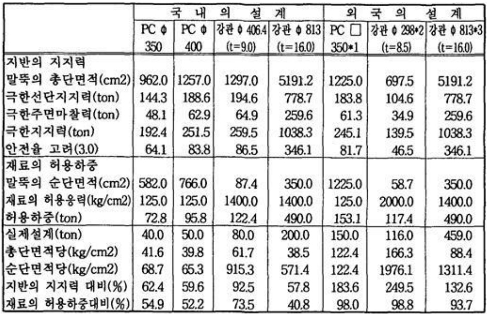  
주조강관만뜩의 경우에는 부식 2nl 고려국내1: 영국의 설계사례부2: 미국의 설계사례3: 핀란드의 설계사례  

국내의 말뚝기초 설계는 주로 표준관입시험 결과를 이용하는 방법이 채택되고 있다.  

표준관입시험 결과로부터 말뚝의 지지력을 결정하는 데는 두가지 방법이 있다. 첫째 N 값으로부터 지반의 토질상수를 도출한 후, 정역학격 공식에 의하여 말뚝지지력을 계산하는 방법과, 둘째N 값으로 부터 직접 말뚝지지력을 계산하는 방법이 있다.  

N 값으로 부터 말뚝지지력 산정에 필요한 토질상수인 흙의 내부마찰각(Φ)을 도출하는 과정에서는상대밀도와 내부마찰각의 관계에 의존하고 있다. 이 과정에서 제기되는 문제점으로는 측정된N 값의 신뢰도 문제와 N 값과 $\Phi$ 관계식의 신뢰도가 문제시 된다.  

표준관입시험 결과는 시추공의 크기, 지하수위, 사용장비 등 다양한 요인들에 영향을 받는 것으로알려져 있다. 이들 요인들의 복합적인 결과는 타격에너지 효율로 표시되는데, 국내 토질기초공학회(ISSMFE)에서도 기술위원회(Technical Committee)의 심의를 거친 후 현재는 에너지 효율이이론 값의 $60\%$ 수준인 N_{60}을 기준값으로 사용하도록 권장하고 있다.  

즉 지역별로 큰 차이를 보이는 N 값 측정과정을 에너지 효율로 평가하여 적절한 보정이 필요함을인정하고 있다. 우리 나라의 각종 설계기준 설정에 결정적인 영향을 미치고 있는 일본에서의에너지 효율은 $78\%$ 정도가 되는 점은 우리 나라에서 시행되는 표준관입시험 결과 해석시 간과할수 없는 부분이 될 것이다.  

국제 토질기초 공학회에서도 이 부분의 중요성을 강조하기 위하여 표준시험과정(IRTP,International Reference Testing Procedure)상에 각 지역별 표준에너지 수준측정의 필요성을강조하고 있으나 우리 나라에서는 이 부분에 대한 연구실적이 극히 저조한 실정이다. 실측에의한 Hammer 의 낙하속도 분석으로부터 계산한 우리 나라의 타격에너지 수준은 약 $53\%$ 정도인것으로 나타나고 있어 이 결과를 적용할 경우 N 값은 일본에서 적용되는 N 값에 비해 약$30\%01$ 상 과대 평가하고 있는 셈이다. 따라서 국내에서 측정되는 N 값은 보다 많은 실측을 통해보정되어야 할 것이며, 그때까지는 적절한 보정을 감안하던가 아니면 안전율을 높여줄 수 밖에  

없을 것이다.  

결론적으로 표준관입시험 결과로 부터 토질상수를 도출하고 그로부터 정역학적 공식을 적용하는데에는 오차요인이 내재하고 있으며 그 신뢰도는 문제가 있다.  

이상의 문제점 때문에 국내의 경우 이 방법은 극히 제한적인 적용외에는 거의 사용되지 않고있으며 표준관입시험 결과로부터 말뚝의 지지력을 직접 계산하는 아래와 같은 Meyerhof 의공식이 대부분 적용되고 있다.  

Meyerhof 공식은 아래와 같는 식(1)로 표시되며, 국내에서의 검증결과에 의하여 식(2) 및 식(3)이실무 설계에서 채택되고 있다.  

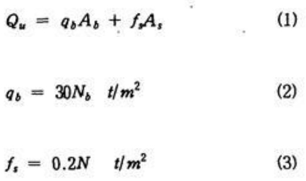  

여기서 $Q_{u}$ : 말뚝의 극한지지력$\sin$ 말뚝의 단위면적당 선단지지려$f_{s}$ : 말뚝의 단위면적당 주면마찰력$N_{b}$ : 말뚝의 선단부 부근의 값$^N$ : 말뚝관입깊이의 평균 값$\scriptstyle A_{b}$ : 말뚝의 선단부 면적$\boldsymbol{A}_{s}$ : 말뚝주면면적  

식(2) 또는 식(3)의 신뢰도는 말뚝의 설계허용지지력 산정에 가장 중요한 요소임에 분명하다.그러나 이보다 중요한 문제는 특정규격의 말뚝을 적절한 항타장비를 사용했을때 N 값이어느정도인 지반까지 관입시킬 수 있는가 하는 말뚝의 항타시공 관입성이 함께 고려되어야한다는 것이다.  

그러나 국내의 경우, 이 부분에 관해서는 연구실적이 극히 부진한 상태이며 과거의 경험에의존하고 있는 실정이다.  

표 2 에는 국내의 일반적인 설계조건을 식(2) 및 식(3)으로 역해석한 결과를 표시하였다. 여기서주면마찰력은 전체지지력의 $30\%$ 정도인 것으로 가정하였다.  

표 2. 일반적 설계시 말뚝관입능력  

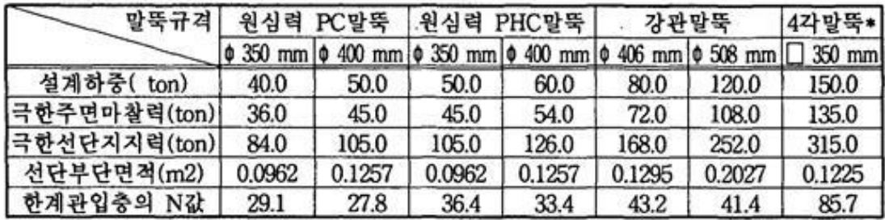  
주 4각만뚝은 영국의 설계사례임  

표 2 에 나타나고 있는 것처럼 국내에서 일반적으로 시행되고 있는 말뚝항타는 PC 말뚝의 경우N 값이 30 미만인 지층까지, PHC 말뚝은 이보다 약간 높은 35 정도까지 항타되며, 강관말뚝의경우에도 N 값이 42 정도인 지지층까지만 시공이 되는 것으로 볼 수 있다.  

이는 외국의 경우 N 값이 50 이상인 곳까지 항타하여 말뚝재료의 허용하중을 거의 $100\%$ 까지활용하고 있는 것에 비하면 비능률적인 시공이 이루어지고 있다고 볼 수 있다.  

# 2.2 시공현황  

말뚝기초는 시공방법에 따라 항타시공, 매입시공, 현장타설시공 등으로 대별할 수 있다. 앞서설계현황에서도 살펴본 바와 같이 현재로서는 가장 많이 시공되고 있는 방법이 항타시공법이라고볼 수 있으므로 이를 중심으로 그 현황을 살펴보면 아래와 같다.  

말뚝설계가 완료되면 지반조사 결과로부터 말뚝길이를 결정하고 항타장비를 선정하게 된다.항타장비의 선정에는 말뚝직경 및 길이가 고려되지만 그림 1 과 같이 장비선정의 흐름도를제대로 지켜 시공에 반영하는 경우는 매우 드문 실정이다.  

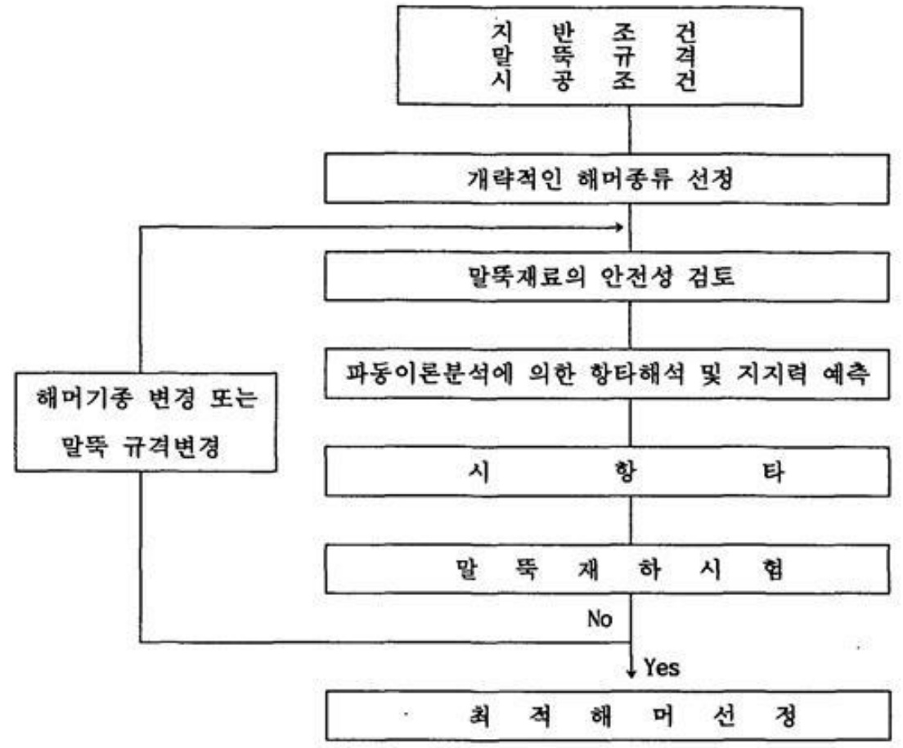  
그림 1 항타장비 선정흐름도  

항타장비는 디젤해머, 유압해머 등으로 대별할 수 있으며 장비선정시에는 말뚝재질에 따른 선정즉 콘크리트말뚝 또는 강관말뚝 등에 따라 장비의 규모가 결정되어야 한다. 또한  

시공조건(환경조건)에 따라서는 진동, 소음, 유연 등의 건설공해를 감안 고려하여 유압형해머를선정하여야 할 경우도 있게 된다.  

현재 국내에서 선정/사용되고 있는 항타장비 조합을 살펴보면 공해발생에 따른 민원 등을 의식한장비선정은 비교적 제대로 지켜지고 있다고 볼 수 있으나 지반조건, 말뚝형식, 타격응력 등을고려하여 안전하고 효율적인 항타시공을 위한 고려과정은 아직도 미흡한 실정이라고 판단된다.즉 항타관입성(drivability)을 고려하기 위한 해석과정이 거의 대부분 생략되고 있어 설계자체의  

타당성을 충족시키지 못하는 예가 많다.  

따라서 실제 시공시의 정밀성도 중요하지만 후술할 항타측정/해석과정을 보다 충실하게수행하여야 설계의 경제성 뿐만 아니라 시공의 효율성을 동시에 제고시킴으로써 말뚝기초의합리적 설계/시공이 이루어질 수 있을 것으로 사료된다.  

한편, 최근에는 강화된 환경기준과 높아진 국민들의 환경권 요구문제가 두드러지게 나타나면서항타방법에 의한 말뚝기초 시공은 선굴착공법, 속폐기공법 등 저진동, 저소음형공법으로 전환시공되는 추세에 있다.  

이 분야에 대한 연구노력은 극히 미진한 상태이나 몇몇 연구자들에 의해 현장 시공기술 및해석기술에 대한 연구가 진행중인 것으로 알려지고 있다.  

# 3. 주요공법의 특징  

본 항목에서는 깊은기초로 분류되는 기초형식중 말뚝기초, 피어 및 케이슨 공법에 대하여 공법의특징 및 장/단점 등을 개관하고자 한다.  

보다 상세한 사항이나 넓은 의미에서의 깊은기초에 포함되는 각종 공법(지반개량 공법에적용되는 말뚝형식 등)들에 대해서는 여타 참고문헌을 참조하기 바란다.  

# 3.1 말뚝기초  

말뚝기초에 포함되는 기초형식은 그 종류가 다양하지만, 말뚝재료에 따라 PC 말뚝, PHC 말뚝,강관말뚝 등을 주요 말뚝형식으로 볼때 다음과 같은 특징 및 장 · 단점을 기술할 수 있겠다.  

PC 및 PHC 말뚝은 콘크리트제 말뚝으로서 가격이 저렴하며 시공성이 우수하여 특별한제한사항이 없는 한 적용가능한 가장 많이 시공되는 말뚝기초라 할 수 있다.  

콘크리트제 말뚝은,  

$\textcircled{1}$ 허용응력이 비교적 크며, 내부식성이 좋다.  

$\circled{2}$ 압축강도가 커서 비교적 굳은 지층의 관입이 가능하다.  
$\textcircled{3}$ 다양한 단면과 길이로 제작 및 시공이 가능하다.  
$\circled{4}$ 인장응력이 작아서 말뚝운반과 취급에 주의가 필요하다.  
$\circled{5}$ 절단과 이음시공시에는 주의가 필요하다.  

등의 특징을 갖고 있다.  

현재 RC 말뚝은 거의 사용되게 않고 있으며 기성 콘크리트 말뚝 사용량의 거의 전부가프리스트레스트 콘크리트말뚝인 실정이다. 그 이유는 RC 말뚝이 콘크리트의 작은 인장강도때문에 운반, 취급 및 시공중에 발생하는 휨 모멘트를 견디지 못하고 균열이 발생하거나파손되는 단점을 가지고 있는데, PC 말뚝은 제작과정에서 프리스트레스를 도입하여 이러한단점을 어느 정도 보완할 수 있고 압축강도가 커서 하중지지력과 지반관입력이 큰 장점을 가지고있기 때문이다. 구조물의 규모와 하중이 커지고 부지의 지반조건이 열악해 지면서 과거 보다 더깊고 단단한 지층에 말뚝을 관입할 필요성이 커지면서 말뚝재료의 고강도화가 요구되고 이에따라 개발 제작된 것이 PHC 말뚝이다. 일본에서는 PHC 말뚝이 기성 콘크리트 말뚝 사용량의  

$90\%01$ 상을 차지하고 있다고 하는데 이는 PC 말뚝보다 훨씬 큰 압축강도를 가지고 있어서 굳은지층의 관입 능력이 증가되었고 말뚝 선단에 강판이 부착되어 있어서 콘크리트 말뚝의 치명적인약점인 이음 시공이 가능해졌기 때문일 것이다. 우리나라에서는 1988 년에 KSF-4306 으로PHC 말뚝에 관한 규정이 제정된 후에, 1992 년에 PHC 말뚝이 제작 시판되기 시작했으며PHC 말뚝 관련 학술발표회가 열린적도 있다. 현재 국내의 PHC 말뚝의 사용은 증가추세에 있다.  

강재말뚝은  

$\textcircled{1}$ 허용응력이 크고 인장과 휨에 대한 저항력이 크다.  
$\circled{2}$ 큰 타격응력을 견디므로 굳은 지층에 관입시킬 수 있다.  
$\textcircled{3}$ 취급과 운반, 절단과 이음이 쉽다.  
$\circled{4}$ 매우 긴 말뚝 시공이 가능하다.  
$\circled{5}$ 배토량이 작게 시공할 수 있다.  

$\circled{6}$ 값이 비싸다.  

$\textcircled{7}$ 지상이나 교란된 지반중에서는 부식이 잘 된다.  
$\circled{8}$ 해상구조물에 시공될 경우에는 방식처리를 해야 한다.  

등의 특징을 갖고 있다.  

강재말뚝은 큰 재료의 강도를 이용하여 굳은 지층에 관입이 가능하므로 마찰말뚝보다는선단지지말뚝으로 사용하는 것이 유리하다. 또한 인장강도가 그 어느 재료보다도 크므로 큰인장하중과 수평력을 받는 구조물의 기초로 적당하고 잘못 시공된 말뚝을 인발할 수도 있다.또한 절단과 이음이 비교적 쉽기 때문에 지지층의 깊이가 불규칙하거나 경사가 큰지반에적용성이 크다. 배토량이 작게 시공할 수 있을 뿐만 아니라 관입 장애물을 만나거나 소음과진동을 줄여서 시공할 필요가 있을 때에는 속폐기공법으로 원하는 지지층에까지 확실히 관입시킬수 있다. 강재말뚝의 최대 약점은 값이 비싸다는 것과 부식을 잘 받는다는 것인데부식대책으로서 칠, 전기방식처리, 또는 부식방지 피복을 입하는 방법을 쓰든가 연간 0.02㎜정도의 부식속도를 감안하여 말뚝의 두께를 결정하고 있다.  

한편, 말뚝종류를 기성말뚝과 현장타설말뚝으로 분류할 경우의 특징을 살펴보면 다음과 같다.가. 기성말뚝  

기성말뚝은 타입, 압입, 진동관입 등 강제관입공법과, 속폐기나 선굴착공법 등과 같은보조관입공법으로 나누어 생각할 수 있다. 현재는 타입 시공법이 압도적으로 많이 이용되고있으나, 더욱 깊은 지지층에 말뚝을 관입할 필요성이 급격히 증가하고 있는 추세에 있다.현장타설말뚝에 비하여 기성말뚝공법의 일반적인 특징은 다음과 같다.  

$\textcircled{1}$ 단면크기와 품질이 보증된다.  

$\circled{2}$ 길이가 한정되어 있어서 이음이 필요한 경우가 발생한다.  

$\textcircled{3}$ 일단 손상을 받으면 보수가 않되므로 운반, 취급, 시공시 주의해야 한다.  

$\circled{4}$ 지층 종류에 따른 영향은 적지만 지지층 경사나 요철이 심할 때 불리하다.  

$\circled{5}$ 공기가 짧고 시공관리가 쉽다.  

$\circled{6}$ 장비의 키가 커서 허용공간이 낮은 곳에서는 시공이 어렵다.  

기성말뚝 중에 가장 많이 시공되고 있는 항타말뚝의 장단점들은 다음과 같다.장점  

$\textcircled{1}$ 말뚝재료의 품질을 항타전에 조사할 수 있다.  

$\circled{2}$ 말뚝단면과 재질이 확실하다.  

$\textcircled{3}$ 지하수위에 제약받지 않고 시공할 수 있다.  

$\circled{4}$ 깊은 지지층까지 말뚝관입이 가능하다.  

$\circled{5}$ 인장과 휨응력에 대한 저항이 크다.  

단점  

$\textcircled{1}$ 지지층 깊이가 불규칙한 지반에서 말뚝길이 결정이 어렵다.  
$\circled{2}$ 항타중에 말뚝이 파손될 수 있으며, 이러한 경우에는 말뚝을 교체해야 한다.  
$\textcircled{3}$ 결함있는 말뚝을 시공했을 때 지지력이 감소한다.  
$\circled{4}$ 말뚝단면이 구조물 하중이 아니라 항타응력이나 취급시 응력에 따라 결정될 경우에는비경제적이다.  
$\circled{5}$ 항타진동과 소음이 허용치 이상이 될 때 시공이 불가능할 수 있다.  
$\circled{6}$ 말뚝관입에 의한 배토량이 커서 인접한 말뚝에 변위를 일으키거나 인접 구조물에 피해를 줄수 있다.  

$\textcircled{7}$ 항타장비의 키가 커서 장애물이 있는 좁은 곳에서는 시공을 할 수 없다.  

나. 현장타설말뚝  

기성말뚝으로서 시공하기 어렵거나 하중규모가 커서 대구경 말뚝이 필요할 때에 현장타설말뚝이채택된다. 현장타설말뚝의 일반적인 특징으로서는 다음과 같은 것들이 있다.  

$\textcircled{1}$ 말뚝의 단면, 길이, 품질 등이 현장 작업중에 변경될 수 있다.  
$\circled{2}$ 설계는 시공조건과 지반조건에 큰 영향을 받는다.  
$\textcircled{3}$ 시공후의 품질검사가 어렵기 때문에 시공관리를 철저히 해야한다.  
$\circled{4}$ 여러 가지 다른 종류의 작업이 함께 이루어 지므로 시공관리가 복잡하고 공기가 길어 진다.  
$\circled{5}$ 좁은 공간에서 시공이 가능하며, 소음과 진동을 적게 할 수 있다.  
$\circled{6}$ 큰 직경의 말뚝을 시공할 수 있으며 선단확대시공을 할 수 있다.  

현장타설말뚝 공법은 다시 지반에 말뚝이 타설될 구멍을 만드는 방법에 따라 배토형공법과무배토형 공법으로 구분할 수 있다. 배토형은 끝이 막힌 강관 케이싱을 강제 관입하여 말뚝구멍을 만드는 방법(driven and cast-in-situ displacement piles)이고 무배토형은 오거나 버켓, 또는드릴 비트로 구멍을 뚫는 방법(bored and cast-in-situ non-displacement piles)이다. 배토형현장타설말뚝은 구미 각국에서 널리 사용되는 공법으로서 케이싱 사용여부와 유각 무각 말뚝,그리고 콘크리트의 보강 여부, 콘크리트의 다짐방법 등에 따라 수많은 공법이 개발되어 있으나이 공법은 기성말뚝의 문제점을 해결하는데 큰 기여를 하거나 유리한 점이 많지 않은 이유로우리 나라에서는 시공 실적이 거의 없는 것으로 알고 있다.  

# 3.2 피어와 케이슨 기초  

케이슨 기초(Caisson foundation)와 피어기초(Pier foundation), 그리고 천공피어(drilled pier)는기초공학에서 가끔 같은 뜻으로 사용된다. 과거에는 피어의 최대 직경을 80 ㎝이상이라고하였는데 근래 와서는 타입말뚝에도 직경이 120 ㎝도 있고 또 200 ㎝-300 ㎝의 대구경 현장타설말뚝이 도입되어 그 한계도 모호하게 되었다.  

가. 피어기초  

천공피어기초는 구조물의 기초 저면바닥까지 지반에 구멍을 뚫거나 굴착하여 그 속에 콘크리트를채운 것으로 보통 피어 또는 천공피어라고 말한다. 지반의 상태에 따라 축조기간동안굴착공주위의 흙이 함몰되는 것을 방지하기 위해 케이슨 또는 외벽(판 또는 널말뚝)을 사용한다.피어샤프트(pier shaft)의 직경은 일반적으로 사람이 내부를 조사하기 위해 들어갈 수 있는 충분한크기이다.  

천공피어 기초를 사용하면 다음과 같은 이점이 있다.  

$\textcircled{1}$ 한개의 천공피어 기초로 무리말뚝과 말뚝캪(Pile cap)을 대치할 수 있다.  

$\circled{2}$ 단단한 사력층에서는 말뚝을 받는 것보다 천공피어의 시공이 더 용이하다.$\textcircled{3}$ 천공피어의 시공은 시공현장의 정지작업 완료 이전에 완성할 수 있다.  

$\circled{4}$ 말뚝을 해머로 박을 때 지반의 진동이 인접구조물에 피해를 줄 수도 있다. 그러나 천공피어는이러한 재해가 없다.  

$\circled{5}$ 말뚝을 점토층에 박을 때 히빙(heaving)현상이 일어날 수 있으며 먼저 박은 말뚝이횡방향으로 이동될 수도 있다. 그러나 천공피어의 사용시는 이러한 상황이 나타나지 않는다.  

$\circled{6}$ 천공피어의 시공기간중 말뚝을 박을 때와 같은 해머의 소음이 없다.  

$\textcircled{7}$ 천공피어의 저면을 확대할 수 있기 때문에 인발력에 대한 큰 저항도 얻을 수 있다.  

$\circled{8}$ 천공피어의 기초가 시공된 표면을 시각적으로 검사할 수 있다.  

$\circledcirc$ 천공피어의 시공은 일반적으로 가볍고 이동성이 좋은 장비가 필요하다. 적절한 지반조건에서말뚝기초보다 경제적이라는 것이 입증되었다.  

$\textcircled{10}$ 천공피어는 횡하중에 대해 큰 저항을 가진다.  

그러나 천공피어 시공에도 몇가지 결점이 있다. 콘크리트 작업시에는 항상 엄중한 품질관리가필요하다. 기상조건이 나쁜 경우는 시공이 지연될 수도 있다. 천공피어 시공은 타형태의기초시공보다 더 상세한 지반조사가 필요하다. 또한, 버팀굴착(braced cuts)의 경우와 같이천공피어를 위한 깊은굴착은 버팀굴착 인접구조물에 피해를 줄 수도 있다.  

나. 케이슨기초  

케이슨(Caisson)기초는 잠함(潛函)기초라고도 한다. 케이슨은 프랑스어로 상자를 의미하는데, 문자그대로 함(函)형의 구체를 단단한 지지층까지 내려서 작용하중을 지반에 전하는 기초형식이다.  

케이슨 기초는 여러 종류의 구조물 기초에 이용되는 것으로 그 주된 것은 도로교, 철도교,건축구조물, 항만구조물 등이다.  

따라서 케이슨 기초의 정의는 각각의 설계 기준에 다소의 표현의 차이가 있다. 도로교시방서하부구조편에서는 "저부를 개방한 콘크리트의 통모양의 구조물을 지상에 구착하고 그 통내부의토사를 배출해 가면서 땅속에 침하시켜 소정의 지지층에 도착시키는 기초를 말한다."라고 하고있다.  

일본 국철(國鐵)의 건조물 설계표준에서는 "지상에서 제작한 비교적 대구경으로 긴 중공(中空)의기초 구체를 굴착해 가면서 침하시켜 설치하는 기초로 또한, 수평하중에 대해서 깊은강체기초(剛體基礎)로서 취급되는 기초를 말한다."라고 하고 있다.  

건축기초 구조 설계기준에는 "어디까지나 지상 또는 지중에 구축한 철근 콘크리트를 주체로 하는중공대형(中空大型)의 통(筒)이나 지하실의 일부로 되는 구축물을 그 저부(底部)의 흙을 파내어자중 또는 하중을 이용하여 소정의 지층까지 침하시켜 저부에 콘크리트를 타설하여 설치하는것을 말한다."라고 하고 있다.  

케이슨 기초에는 시공방법에 의하여 오픈케이슨(우물통기초, 정통)과 뉴매틱 케이슨 또는공기케이슨으로 크게 나눌 수 있다. 그외에 특수한 케이슨으로 볼 수 있는 강관널말뚝 기초나연속지중벽 공법을 이용한 케이슨 등도 있다.  

오픈케이슨(Open caisson)은 우물통(井筒) 또는 웰(Well)이라고 불리는 중공구체의 저면에 있는흙을 크람쉘(Cramshell)등의 굴착기계로 굴착해 내려가면서 소정의 깊이까지 침하시키는공법이다.  

뉴매틱 케이슨(Pneumatic)은 중공구체의 저부에 기밀성(機密性)의 작업공간(작업실 또는 WorkingChamber 라고 함)을 설치하고 이 속에 압축공기를 보내어 지하의 수압과 균형되게 하고 그속에서 인력 또는 특수기계를 이용하여 저면의 토사를 파올리면서 구체를 내리는 공법이다.  

케이슨은 도크, 호수, 강과 같은 수중에 놓이는 하부구조기초로 사용된다. 케이슨 시공에는 속이빈 샤프트나 박스를 땅속의 견고한 지반에 위치하도록 침설시킨다. 박스나 샤프트의 아래부분은지하수면 아래의 연약지반을 통과하여 하중지지층에 도달하도록 커팅에지(cutting edge)가부착되어 있다. 샤프트나 박스의 내부는 꼭대기가 열려있어 그 속을 통하여 준설하고 콘크리트를쏟아 넣는다. 교대, 안벽, 호안구조물은 흔히 케이슨 기초상에 시공되나 요즈음 건물기초에는별로 쓰이지 않는다.  

# 4. 향후 기술발전의 전망  

최근 활성화되고 있는 대형 토목 구조물 건설과 관련하여 그 구조물의 기초형식으로 채택되고있는 말뚝기초는 구조물의 안전과 설계 · 시공의 합리성에도 큰 역할을 담당하게 될 것이다.따라서 구조물 자체의 성패를 가름하게 되는 기초구조물에 대한 합리적인 설계 및 시공의 여부는최근 일고 있는 부실공사추방차원에서도 지대한 역할을 담당함을 시시하고 있다.  

앞에서 살펴본 바와 같이 현재의 말뚝기초관련 설계 · 시공기술은 선진외국의 경우와 비교할 때여전히 뒤져 있는 실정이다.  

따라서 실무 기술자들은 무단한 연구 노력을 경주하여만 최적의 설계와 시공기술을 습득하고충분한 경쟁력을 확보할 수 있게 될 것이다.  

지금까지 살펴본 바와 같이 말뚝기초의 설계관련 개선사항으로서는 우선 말뚝자체의 허용강도를충분히 반영하여 설계하중을 결정하는데 있다고 하겠다. 표 1 에서 살펴 보았듯이 그 실태는선진외국의 경우보다 훨씬 뒤져있는 상태이므로 말뚝형식에 따른 재료의 이용한도를 적극 상향사용할 수 있는 연구가 시급함을 시사하고 있다. 이 같은 설계의 합리성을 뒷받침하기 위해서는수준 높은 시공기술과 아울러 설계의 타당성을 확인할 수 있는 기술의 필요성을 요구하고 있다.  

즉, 시공중이나 시공후에 말뚝기초의 설계사항을 확인 또는 설계에의 반영을f 위해서는말뚝재하시험의 수행이 필수적임을 의미한다. 종래에는 시공된 말뚝의 지지력을 확인하기 위한방법으로서 정적재하시험이 주종을 이루어 왔으나 최근 도입 적용중에 있는 말뚝의동재하시험(Dynamic Load Test)은 그 적용의 간편성, 결과의 신뢰성, 시험비용 및 시간의 유리함등으로 인하여 각종 말뚝기초 현장에서 적용의 필요성이 증대될 것으로 전망된다.  

말뚝항타분석기(Pile Driving Analyzer)를 이용하는 본 시험방법은 현장에서 시험하고자 하는말뚝에 타격에너지에 의해 말뚝으로 전달되는 힘과 속도측정을 위한 게이지를 간편하게 부착하고이를 시험기기에 연결하여 응력파의 파동이론에 근거한 항타해석을 수행함으로써 말뚝의지지력뿐 아니라 항타응력, 말뚝의 건전도 등을 측정/분석할 수 있는 재하시험 방법이다.시험결과를 분석함으로써 말뚝기초 설계 시공의 품질을 확인할 수 있게 된다.  

말뚝의 동재하시험방법은 말뚝지지력 거동의 가장 중요요소인 시간경과에 따른 지지력변화양상을해석하여 실무에 적용할 수 있다는 점에서 그 사용가치가 큰 것으로 알려지고 있다.  

따라서, 이 같은 시험기술 등을 폭넓게 적용하고 또한 적용/해석기술을 꾸준히 연구함으로써기초의 안전성 확보와 설계/시공의 경제성을 도모하는 것이 필요한 시점에 있다고 생각된다.  

한편, 최근의 말뚝기초시공과 관련하여 도심재개발지역 등 종래의 항타방법으로서는 시공키어려운 현장조건에 적용할 수 있는 소위 저공해 기초공법으로 알려져 있는 매입공법(선굴착공법,SIP 시공법 등등)의 적용의 필요성이 날로 증대되고 있다. 이같은 기초공법은 주로 이웃 일본에서분별없이 도입 · 시공되는 경우가 현재까지 이어져 왔으나 최근에는 이분야에 대해서도 보다효율적인 공법으로 정작 시키고자 하는 연구들이 진행되고 있어 매우 바람직한 상황이라 아니할수 없다.  

본 고에서는 깊은기초중 말뚝기초부분에 치중하여 몇가지 분야를 살펴보았으나 넓은 의미에서의깊은기초에 포함되는 각종 건설공법들은 현재 꾸준한 연구/개발이 진행되고 있는 상태이고 본건설공법관련 자료와 같이 체계적인 자료축적이 이루어지고 있어 향후의 건설기술은 더욱 발전적용될 수 있을 것으로 기대한다.  

# 공법 DB 보유정보  

# 공법명 PHC 말뚝 공법 (PRETNSIONED SPUN HIGH STRENGTH CONCRETEPILES)  

공종분류명 말뚝, 케이슨기초  

용도 : 말뚝, 기초  

개요:  

1) 정식 명칭은 프리텐션방식 원심력 고강도 프리스트레스 철근 콘크리트로서 간단히 고강도말뚝 이라고도 한다. 기존 PC 말뚝의 콘크리트 압축강도가 500 ㎏/㎠ 이상임에 비하여PHC 말뚝은 800 ㎏/㎠ 이상으로서 같은 규격에서는 내력이 $60\%$ 정도 크다.  

2) 고온고압양생이나 혼합체의 사용을 통하여 강도를 증대시킨 것으로서 장점으로는 강도가 커서허용지지력을 크게할 수 있고 강도가 커서 타격에 강하며 휨내력이 크고 양생기간이 짧아서단시간에 제조가능하며 재령 1 일에도 사용가능하다. CREEP 및 SHRINKAGE 가 극히 적고  

일반적으로 특수선단부를 채용하고 있다.  

3) 단점은 재료특성상 깨지거나 균열발생이 쉬우므로 운반 및 보관에 주의.  

정보원 : ( KlCT B029082, F 8-28  

# 공법명 FLOATING DOCK 를 이용한 CAISSON 제작 공법  

공종분류명 말뚝, 케이슨기초용도 : 케이슨, 기초공사  

개요:  

1) 평편하고 넓은 작업간판(길이 38M, 폭 24M)과 양쪽에 설치된 측벽(폭 3M, 높이 8.8M)으로써구성되며 철판으로 되어있고 작업갑판 아래에는 12 개의 빈 TANK(부력실)로 구성되어 있고양쪽측벽 상부에는 크레인, 윈치등의 작업용장비가 설치되어 있고 그 아래 안전갑판 위에는조작실, 주거실 등으로 사용되며 그 아래에 다시 2 개의 부력실이 있다.  

2) 케이슨제작이 끝나면 DOCK 저면에 설치되어 있는 VALVE 를 열어서 물이 탱크내로유입함으로써 침하하게 된다. 케이슨이 부력에 의하여 자력으로 뜰수 있는 깊이까지 FLOATINGDOCK 가 침하하면 케이슨을 인출한 다음 탱크내의 물을 배수시켜서 부력을 증가시켜FLOATING DOCK 가 떠오르게 한다.  

정보원 : ( KICT B012662 24 권 4 호 P-10 )  

# 공법명 프리드릴(PREDRILL)에 의한 말뚝기초 공법  

공종분류명 말뚝, 케이슨기초  

용도 말뚝, 기초공사, 오거, AUGER, SOIL CEMENT, 벤토나이트  

개요:  

1) 오거장비로 소요말뚝구경보다 직경이 10 ㎝정도 크게 천공하며 굴진시 오거빗트를 통해시멘트풀과 벤토나이트를 혼합한 용액을 주입하여 공벽을 보호하면서 설계심도까지 굴진한다.지지층 부근에서는 부배합의 시멘트풀을 주입하여 원지반토와 충분히 교반함으로써 확장된선단지지층으로 사용 할 수 있다.  

2) 교반작업이 완료되면 기성말뚝을 자중에 의해 공의 내부에 삽입한 후 선단부 1-1.5M 을해머에 의해 타입시킴으로써 말뚝선단부가 이완되지 않고 오히려 더욱 조밀해지도록 하는 효과를얻는다.  

3) 오거의 회전은 역회전이 가능하여 굴진과 교반작업의 구분시공이 용이하다. 항타장비는디젤하머나 드롭해머중에서 말뚝하중에 적절한 것 사용.  

정보원 : ( KICT B018503 6 권 3 호 P-147 )  

# 공법명 : 콘크리트말뚝의 비틀림관입 공법  

공종분류명 말뚝, 케이슨기초  

용도 콘크리트 말뚝, 기초공사  

개요:  

1) 관입모멘트와 관입소요시간은 흙의 전단저항을 나타내는 N 치 및 말뚝관입깊이에 따라증가하며 N 치 20-30 의 범위내에서 직경 300 ㎜의 말뚝을 13M 관입시키는데 4-5TF.M 의 최대비틀림모멘트와 20-30 분의 관입시간이 소요된다.  

2) 시공시 소음, 진동에 관해서는 항타점에서부터 10M 거리에서의 소음에 관해서는 70 혼,진동에 관해서는 60DB 이하로 디젤함마값은 물론 소음 및 진동의 규제치를 큰폭으로 밑돈다.  

3) 비틀림관입말뚝은 나선상의 후렌지에 지반반력이 작용하므로 지지력 뿐만아니라 인발력효과에공헌하고 있다.  

정보원 ( KICT B018529 19 호 P-77 )  

# 공법명 : 흙 시멘트 합성 강관말뚝 공법  

공종분류명 말뚝, 케이슨기초용도 - 말뚝, 기초공사, 사력층, 사질토, 점토  

개요:  

1) 지중에 조성한 흙시멘트기둥에 리브부강관을 설치하여 흙시멘트와 강관이 일체화 된합성말뚝을 시공하는 공법으로 적용토질은 점성토, 사질토, 사력토 및 10CM 이하의호박돌층에서 시공 할 수 있으며, 특히 연약지반에서 시공할 경우 그 성능이 우수하며 피압수가지표면보다 높거나 복류수가 있을 경우에는 본 공법의 적용성을 검토해야 한다.  

2) 시공가능심도는 교반공의 직경이 0.6-1.2M 일 경우 44M, 1.5M 인 경우는 40M 이며 시공속도는점토, 실트에서.3-5 분/M, 세사, 중사에서는 4-7 분/M 3CM 이하의 사력은 5-10 분/M, 3CM 이상사력은 8-15 분/M 이다.  

정보원 : ( KICT B027802 8 권 3 호 P-89  

# 공법명 : 파일 네트 공법 (PILE NET METHOD)  

공종분류명 말뚝, 케이슨기초  

용도 파일네트, 연약지반처리, 말뚝, 성토  

개요:  

1) 연약지반에 기성말뚝이나 현장치기말뚝을 소정깊이까지 박은뒤 말뚝머리를 철근으로 연결하여그 위에 토목용 쉬트를 깔고 성토를 하는 연약지반처리 공법이다.  

2) 이 공법에서 중요한 기능은 상부재하하중을 쉬트와 철근을 통하여 말뚝에 전달하며 다시말뚝은 이 하중울 지지지반에 전달함으로서 이탄토층에는 힘이 전해지지 않는 것이다.  

3) 시공관리가 쉽고 시공시기의 제약을 받지 않고 급속시공을 할 수 있고 인접지반에 영향을미치지 않기 때문에 지반의 융기나 국부적인 침하등이 없기 때문에 성토의 품질관리를 충분히 할수 있다.  

정보원 : ( KICT B0l1552 P-44 )  

# 공법명 : VIBRO-COMPOZER 공법  

공종분류명 말뚝, 케이슨기초  

용도 말뚝, 다짐말뚝, 케이싱, 연약지반처리, COMPACTION PILE  

개요:  

1) 케이싱상단에 진동해머를 부착하여 소요심도까지 진동관입한 후 모래를 관내에 공급하고 케이싱을 인발하면서 압축공기로 모래를 관저에 타설하여 케이싱으로 진동다짐하면 모래다짐말뚝이 형성되면서 그 단면이 확대된다.  

2) 이러한 과정을 여러차례 반복하여 케이싱 바닥이 지표상에 도달 될 때까지 작업을 계속한다.  

3) 이 결과로 조성된 모래다짐말뚝의 직경은 600-800MM 정도가 되며 현장에서 모래의공급량으로부터 말뚝의 직경을 추정할 수 있는데 일반적으로 다짐말뚝의 체적은 느슨한 사력의0.7-0.8 에 해당된다.  

정보원 : ( KICT B011552 P-29  

# 공법명 엄지말뚝 공법  

공종분류명 말뚝, 케이슨기초용도 흙막이, 말뚝  

개요:  

1) 일명 H PILE 과 토류판을 함께하는 공법으로 지중에 엄지말뚝을 타입하거나 미리 천공하여강재를 삽입한후 굴착을 진행하면서 목재토류판을 설치하여 흙막이 벽을 형성하는 공법이다.  

2) 강널말뚝공법에 비하여 경제적이며 비교적 시공이 용이하고 경질지반에서는 보링기계로처공함에 따라 소음, 진동을 저감시키는 장점이 있으나 지하수위가 높고 투수성이 큰 지반에서는차수공법을 병행하여야 하며 지층이 연약하거나 토류판 설치시 여굴이 따른 토류판 뒷채움부실로 지반변위가 발생하기 쉽고 HEAVING 현상, 또는 BOILING 현상이 생길 우려가 있다.  

정보원 신기술발표집(KICT B031660)  

[ 시공사례 : 1 ]  

공사명 : 행정-천안간 도로확장공사시설분류명 토지보존시설발주처 : 대전국토관리청시공자 : 상지텍솔(주)공사기간 1993/09/ -1993/11/  

# 공법명 중공블럭 (CELLULAR BLOCK) 매설기초 공법  

공종분류명 말뚝, 케이슨기초용도 : 해안공사, 치환공법, 연약지반처리, 기초공사  

개요:  

1) 이 공법은 우물통 기초공법과 치환공법을 혼합한 방식이라고 볼 수 있고 기초개량폭과개량심도에 적합하도록 1 단의 높이가 2CM 정도인 중공블럭을 송크기로 제작하여 현장에 거치침하후 내부토사를 굴착하고 소정의 심도까지 중공블럭이 거치된 후 내부를 양질의 재료로치환하는 공법임.  

2) 시공시 유의사항으로는 블럭거치전 지반조사를 철저히 하여 기초로 사용 가능한 경지반의종횡구조를 확인하고 1 개구간을 시행해보면 퇴적이나 매립층의 구성에 따라 장애물이 존재할우려가 있는곳에는 퇴적층까지만 세밀한 보링이 필요하고 블럭거치시 수평이 유지되도록재하용블럭으로 관할하면서 상부중공블럭을 거치한다. 중공블럭의 내부준설은 블럭1 개의 높이(2-3M)만큼 준설하고 1 단블럭거치 및 재하용블럭을 거치하되 기중기  

정보원 건설부 (정부인정 신기술)  

[ 시공사례 : 1 ]  
공사명 : 목포내항 서산동 물양장 개축(7 차) 공사  
시설분류명 : 기타공익 , 토목시설부분  
발주처 : 목포지방해운항만청  
시공자 : 가산토건(주)  
공사기간 : 1993/02/21-1993/12/24  
[ 시공사례 : 2 ]  
공사명 : 목포내항 동명동 물양장 축조(5 차) 공사  
시설분류명 : 기타공익, 토목시설부분  
발주처 : 목포지방해운항만청  
시공자 : 가산토건(주)  
공사기간 : 1993/06/12-1993/12/31  

# 공법명 JGP 공법  

공종분류명 말뚝, 케이슨기초  

용도 그라우트, 기초공사, 고압분사, 에어젯트, AIR JET  

개요:  

1) 그라우트재의 배합, 반죽프랜트와 고압분사를 위한 초고압펌프, 여기에 에어젯트 공급의에어콤푸렛샤가 있고 어느것이나 호스로 JGP 조성 전용머신에 붙은 선단부에 노즐을 장치하는이중관롯드 상당부에 배관, 접속되어 이 조합으로 시스템이 성립하고 있다.  

정보원 최신지반개량공법 (KICT B002857)  

# 공법명 코담젯트 PILE 공법  

공종분류명 : 말뚝, 케이슨기초  

용도 지반처리, 부식토, 점토지반, 말뚝  

개요:  

1) 지반중에서 고속수 분류를 공기분류와 동시에 분사하면서 수력모터를 회전, 인양함으로서공극을 만든다. 그와 동시에 주입재를 송입해서 직경 2 - 3.5M 정도의 주상고결체를 축조하는것이다.  

2) 시공대상지반은 사질토는 물론 종래의 지반개량공법에서 비교적 어렵다고 했든 함수비가 높은부식토, 점토지반에 적용되는 등의 특색이 있다.  

정보원 최신지반개량공법 (KICT B002857)  

# 공법명 SD 공법 기존지하층을 이용한 인공지반상에서의 구축공법  

공종분류명 말뚝, 케이슨기초용도 : 건축물, 오피스빌딩, 사무실, 기초  

개요:  

1) SD 공법은 기존건물의 지하부는 남겨놓은 채로 새롭게 거대한 4 개의 기둥과 그것에 지지된인공지반인 건물의 저층부구조체를 구축하여 그 위에 오피스빌딩을 건설하는 것이다. 지하부의해체공사를 하지 않기 때문에 큰폭의 공기단축이 이루어지고, 조기 빌딩오픈과 임대사업개시등발주자측의 원활한 사업활동 추진을 가능하게 하는 동시에 해체공사에 수반되어 발생하는산업폐기물의 감소와 소음, 진동의 억제등 환경의 영향도 배려한 시공이 가능하다. 공비는 구조물저층부건설에 드는 비용등의 증가분이 지하부의 해체공사를 행치 않는 것과 상쇄되어 동등한건설비가 소요된다.  

정보원 시공 1992.12 KICT B0028003  

시공사례 : 1 ]공사명 겸송빌딩 신축공사시설분류명 : 설계사무소, 사무소발주처 : 겸송주식회사시공자:공사기간 : 1991/09/ -1993/02/  

# 공법명 : KNAP 공법  

공종분류명 : 말뚝, 케이슨기초  

용도 리버스, REVERSE, 내진효과, 현장타설말뚝, 말뚝 개요:  

(1) 최근 구조물의 대형화에 따라 내진적으로도 유리한 대구경 현장타설 말뚝을 경제적으로축조하는 요구가 요망되어 지고 있는데 KNAP 공법은 이 요망에 부응하기 위해 개발한 대구경확저 현장타설 말뚝공법으로 지지력이 큰 말뚝을 경제적으로 축조한다.  

(2) KNAP 공법은 전용굴착기를 이용하는데 리버스 ( REVERSE 식으로 축부굴착시에는 삼축BIT 를 동일 위치에 고정한 상태에서 확저부의 굴착시에는 BIT 축을 외측에서 압출하여 같은방향으로 자전, 공전하여 굴착한다.  

정보원 대한건설협회 국제부 ( T-274 ) (F 6-9)  

# 공법명 : PBS 공법  

공종분류명 말뚝, 케이슨기초  

용도 : 말뚝기초, 기초, PRECASTBLOCK, 라멘, 프리캐스트 콘크리트, 잔교, 호안, 방파제,해양구조물  

개요:  

1) PBS 공법이란 말뚝과 PRECASTBLOCK 부재를 조합하여 라멘구조체로 하는 말뚝기초구조물의축조법이다.  

2) 이 공법의 착안점은 기초는 말뚝기초로서 구조물본체는 라멘구조체이고 말뚝의 임의점에BLOCK 받침을 설치할 수 있고 프리캐스트블럭 부재를 쌓아 올려 말뚝기초 라벤구조물을 만드는공법이다.  

3) 본공법은 군항과 PRECASTBLOCK 의 형상을 조합하는 방법에 의해서 연약지반에서의방파구조물과 수심이 깊은 곳에서의 잔교등 넓은 범위의 해양구조물에 적용가능한 공법이다.  

정보원 대한건설협회 국제부 ( T-328 (F 7-12)  

# 공법명 OJP 공법 OHBAYASHI JUMBO PILE METHOD  

공종분류명 말뚝, 케이슨기초  

용도 현장타설콘크리트말뚝, 말뚝, PILE, JUMBO PILE  

개요:  

1) OJP(OHBAYASHI PILE)공법은 특수한 확저기를 사용하여 베노토 말뚝의 저면적을 확대하여초대형 현장타설콘크리트말뚝을 시공하는 공법이다.  

2) 말뚝 단면적의 4 배까지 확대할 수 있으므로 지지층의 토질에 대해서 1000TON 2000TON 의허용지지력을 얻을 수 있고, 1COLUMN:1PIER 의 합리적, 경제적인 동시에 신뢰성이 높은기초구조가 가능하게 됩니다.  

정보원 대한건설협회 국제부 ( T-2-12 ) (F 2-29)  

# 공법명 현장타설 콘크리트말뚝 공법  

공종분류명 말뚝, 케이슨기초  

용도 건물기초, 교량기초, 옹벽기초, 기초, GRAWLER CRANE, HAMMER GRAB, 말뚝  

개요:  

1) 먼저 굴착기로 굴착하여 BORED HOLE 를 만든 다음 HOLE 내에 미리 제작조립한 철근케이지를 설치, 현장에서 직접 콘크리트를 타설함으로서 직경 3.5M 까지의 대구경 철근 콘크리트파일을 시공하는 공법이다.  

2) 파일 길이를 지중토질이 변화에 따라 쉽게 증감시킬수 있고, 굴착하면서 SOIL 을 직접 채취할수 있으므로 지반의 조사 및 지지층을 확인할 수 있다.  

3) STIFF CLAY 층으로 인하여 항타 파일공법이 어려운 지반에 적용할수 있다.  

4) 투입장비로는 GRAWLER CRANE, HAMMER GRAB 등이 있다.  

정보원 해외건설공사 신공법사례집 (1)  

[ 시공사례 : 1 ]  

공사명 시낙 교량 및 진입로 공사시설분류명 교량시공자 대림산업 (주)  

공사기간 1982/05/01-1983/02/28  

[ 시공사례 : 2 ]  

공사명 하이파 재개발 2 단계 공사  
시설분류명 기타개발계획지역  
발주처 : 바그다드 시청  
시공자 현대건설(주)  
공사기간 : / / - / /  

# 공법명 SEC 공법 ( SPECIAL EARTH CONCRETING METHOD  

공종분류명 말뚝, 케이슨기초용도 : 기초, 자립식 연속벽, 토류 연속벽, 사면안정, 지반개량  

개요:  

1) 연약한 지반(사질토, 점성토 등) 중에 CEMENT 계 안정처리재를 원위치에서 저압으로 혼합교반하고 필요한 강도의 PILE 을 조성하여 토류와 기초로 활용하는 확실하고 경제적인지반개량공법이다.  

2) SEC 공법의 특징으로는 무진동, 무소음등의 무공해로 인접구조물에 피해를 주지 않는다.3) 토류벽으로 시공시 SEC 개량주 자체가 토류의역할을 함으로 별도의 토류판이 필요없다.정보원 : 한국 S.E.C (1-10,1-14) (F 7-19)  
[ 시공사례 : 1 ]  
공사명 : 부산수영 하수처리장  
시설분류명 하수처리시설  
시공자 : (주)대우  
공사기간 : / / - / /  
[ 시공사례 : 2 ]  
공사명 : 부산수영 하수처리장관로  
시설분류명 : 하수처리시설  
시공자 : (주)대우  
공사기간 : / / - / /  
[ 시공사례 : 3 ]  
공사명 : 부산장림 하수처리장  
시설분류명 : 하수처리시설  
시공자 : 현대건설(주)  

공사기간 : / / - / /  

# 공법명 JSP 공법  

공종분류명 말뚝, 케이슨기초  

용도 : 기초, 건축물기초, 교각기초, 지하철공사, 옹벽기초, 사면안정, 지하 DAM 초고압 분사개요:  
1) 종래의 공법에서 해결키 어려운 단점을 보완하여 초고압 ( ${\sf P}{=}200$ ㎏/㎠)의 JET 을 이용하여좀더 확실하게 연약지반 처리문제를 해결하는 초고압분사 공법으로서 어떠한 지반에도 가능하게시공할 수 있다.  
2) JSP 공법은 목적에 따라 원주상의 고결체를 조성하는 회전분사식과 판상형의 2 방향고정분사식이 있다.  
3) JSP 공법의 관련장비로는 JETTING MACHINE, 고압펌프, COMPRESSOR 등이 있다.정보원 : (주) 반석건설 (F 1-10,11-3,11-9,11-12,12-2,12-11,12-13)  
시공사례 : 1 ]  
공사명 : 광양만 해수취수 가물막이 공사  
시설분류명 : 토지보존시설  
발주처 : 포항제철  
시공자 : (주)반석건설  
공사기간 : / / - / /  
[ 시공사례 : 2 ]  
공사명 : 만덕 사면안정 공사  
시설분류명 토지보존시설  
발주처 : 토지개발공사  
시공자 : (주)반석건설  
공사기간 : / / - / /  
[ 시공사례 : 3 ]  
공사명 : 부산 수영강 하수처리장 연약지반 처리 공사  
시설분류명 토지보존시설  
발주처 : 부산직할시  
시공자 : (주)반석건설  

공사기간 : / / - / /  

# 공법명 공기케이슨 공법( PNEUMATIC CAISSON METHOD  

공종분류명 말뚝, 케이슨기초  

용도 : 저수조 탱크, 상하수도, 지하철, 교각 기초공, 침하굴반, 상자형굴반공법, 케이슨병,뉴메틱케이슨  

개요:  

1) 압축공기를 이용한 상자형 굴반공법  

주변지반의 지하수압에 상당하는 압축공기를 송기함으로서 지하수가 주기초선단에 설치한작업실내로 침입하는 것을 막고, 드라이워크로 굴반할 수 있으면서 강성이 큰 콘크리트에 상자형혹은 통형 구조물을 순차적으로 구축하게 해서 소정의 심도까지 침하시키는 공법  

2) 시공이 되는 심도는 압축공기내에서 작업원이 견딜수 있는 압력에 의해서 결정되고 그 한계는  
3.5 기압으로 되어 있고 수심으로 환산하면 35M 가 되는 것이나 지하수위저하공법을 병용해서  
50M 까지도 시공한 예가 있다.  

정보원 해외건설 1988 년 5 월호  

# 공법명 BENOTO 공법 ( ALL CASING METHOD  

공종분류명 말뚝, 케이슨기초  

용도 현장타설 말뚝, CSCILLATOR, HAMMER GRAB, EARTH DRILL, TREMIE PIPE, 트레미  

개요:  

1) 본공법은 프랑스의 BENOTO 사가 제일 먼저 개발하여 사용하였기 때문에 일명BENOTO 공법이라 부른다.  

2) 굴착시 공벽붕괴를 방지하기 위하여 CASING TUBE 를 좌우로 회전시키는요동압입장치(OSCILLATOR)로 흙속에 삽입함과 동시에 굴차기(HAMMER GRAB, CHISELOREARTH DRILL 병용)로 그 내부를 굴착배토하여 소정의 깊이까지 굴착완료하고 HOLE 내의SLIME 제거와 응력계(STEEL CAGE, 강관, H- BEAM 등)의 삽입과 TRMIE PIPE 에 의한콘크리트를 타설하고 OSCILLATOR 로 CASING 을 인발하여 현장타설 말뚝을 조성하는 공법이다.  

3) 굴착전 깊이에 대해 CASING 을 사용하므로 공벽붕괴 위험이 없고 주변지반에 주는 영향이적어 기존구조물의 근접시공이 가능하다.  

정보원 전문건설공사 신공법 발표소개 ( KlCT B028166 )  

# 공법명 RCD 공법 (REVERSE CIRCULATION DRILL METHOD)  

공종분류명 말뚝, 케이슨기초  

용도 현장타설 말뚝, 역순환 굴착, CIRCULATION, 세사층 굴착용이, PUMPSUCTION AIRSIFT, JET SUCTION  

개요:  

1) 역순환 굴착공법(REVERSE CIRCULATION DRILL 공법 이하 RCD 공법)은 1954 년 독일의SALZ GITTER 사에서 개발한 공법으로 현장타설 말뚝공법중 가장 대구경이며 깊은 심도까지시공할 수 있다.  

2) 굴착은 특수한 빗트를 회전시켜 지반을 굴착하고 일반적인 ROTARY BORING 방법에서 물의흐름과 반대로 DRILL ROD PIPE 로 순환수와 함께 굴착토를 흡상하여 지상으로 배출하여 배출된순환수는 침전지에서 토사를 침전 시킨 후 다시 굴착공으로 CIRCULATION 시킨다.  

3) 굴착토의 배출양식은 PUMPSUCTION, AIRLIFT, JET SUCTION 및 SUCTION 과 AIRLIFT 의혼합식 등이 있다.  

4) BENOTO 공법은 세사층에 불리하지만 본 공법은 세사층 굴착이 용이하다.  

정보원 전문건설공사 신공법 발표소개 ( KICT B028166 (F 2-17)  

# 공법명 : 전 선회식 ALL CASING 돗바늘공법  

공종분류명 말뚝, 케이슨기초  

용도 : 기초, 말뚝, 공벽붕괴방지, TREMIE PIPE, HAMMER GRAB, 트레미파이프,현장타설콘크리트말뚝  

개요:  

1) 종래의 대구경 현장타설 말뚝공법인 ALL CASING 공법 시공기계의 단점을 보완하여, 특수CUTTING BIT 를 부착한 CASING TUBE 를 360 도 회전시켜서, 전 선회식 유압압입장치로지반속에 압입굴착하고, 굴착시 공벽붕괴를 CASING TUBE 로 말뚝저부까지 방지하면서HAMMER GRAB 로 CASING 내부를 굴착배토하여 소정의 깊이 까지 굴착완료하고 CALING 내의SLIME 제거와 응력재(철근망, 강관, H-BEAM 등)의 삽입후에 TREMIE PIPE 에 의한 콘크리트를타설하고 전 선회식 유압선회장치로 CASING 을 인발하여 현장타설 말뚝을 조성하는 공법이다.  

2) 굴삭대상지반은 연질지반에서 경질지반까지 굴삭하며, 별도의 부대장비의 교환없이 일련의연속굴착작업이 가능하다.  

정보원 전문건설공사 신공법 발표소개( KICT B028166  

[ 시공사례 : 1 ]  

공사명 : 서울도시고속도로(북부간선도로) 교량기초공사  

시설분류명 : 교량발주처 : 서울특별시시공자 : 삼성종합건설(주)  

공사기간 : 1991/05/ -1992/02/  
[ 시공사례 : 2 ]  
공사명 진주-서진주간 고속도로중 진주대교 기초공사  
시설분류명 : 교량  
발주처 : 한국도로공사  
시공자 : 삼성중공업(주)  
공사기간 : 1992/11/ - / /  

# 공법명 SIP 기초 공법( SOIL CEMENT INJECTED PRECAST PILE METHOD  

공종분류명 말뚝, 케이슨기초  

용도 : 지지력증대, 저소음, 저진동, CEMENT PASTE, 말뚝강성증대, SOIL CEMENT, PRECAST  
PILE  
개요:  

1) 오거로 천공할 때 원지반에 CEMENT PASTE 를 주입하여 각반하므로서 양생후에는주면지층의 강도가 증대되어 말뚝주면의 마찰력을 크게증대시키고 아울러 선단부에서도 각반된SOIL CEMENT 가 완전히 충진되어 말뚝의 침하량을 최소화 시키는 공법이다.  

2) 오거장비로 소요말뚝 구경보다 직경이 10CM 정도 크게 하여 천공하며 굴진시 오거비트를통해 CEMENT PASTE 와 BENTONITE 를 혼합한 용액을 주입하여 공벽을 보호하면서설계심도까지 굴진한다. 지지층 부근에서 부배합의 CEMENT PASTE 를 주입하여 원지반토와충분히 각반하므로서 확장된 선단지지층으로 사용 할 수 있게한다.  

정보원 건설공사신공법해설집 ( 대한건설협회  

# 공법명 BARRETE 공법(바레트공법)  

공종분류명 말뚝, 케이슨기초  

용도 기초, PIER, BENTONITE, 덕소트로피, THIXOTROPIC, 응력재분배  

개요:  

1) BARRETE 는 기본적으로 직사각형 형태로서 지층에 시공되는 콘크리트 PIER 의 일종으로DIAPHGRAM WALL 의 1 개 UNIT 로 PlER 기초로 응용한것으로 그 단면적은 횡하중과수직하중에 저항하기위하여 7 제곱미터이상까지 확대될 수 있으며 지질조건에 따라 80M 이상의깊이까지 시공될 수 있다. 1 개의 BARRETE 는 수개의 타설말뚝과 타입말뚝을 대체할 수있으므로 공사비와 공사기간에 대해 유리하고 보다 신뢰할 수 있는 기초형태가 된다.  

2) BARRETE 는 BENTONITE 이수 속에서 굴착시공되므로 CASING 이 필요없게 되고 휨에대하여 강축과 약축을 가지므로 휨하중에 대해 적절한 방향을 취함으로서 원형기초보다효율적이다.정보원 : 건설공사신공법해설집 ( 대한건설협회 )  

# 공법명 확저 기초말뚝 공법( OMR 공법 OKUMURA MARUGO REAMING )  

공종분류명 말뚝, 케이슨기초용도 : 건축기초, 토목구조물기초, 말뚝기초  

개요:  

1) 현장타설 확저 말뚝공법은 리버스기, 어스드릴기, 혹은 베노토기로 굴착한 구멍의 저부를전용의 OMR 확저기로 원추모양으로 확대하여 축부단면적에 대한 저부 유효단면적의 비를 최대3.2 로 한 것이다.  

2) OMR 확저기는 12 도 각도로 고정된 4 개의 확폭 가이드에 따라 확폭가이드가 활강하는구조로 되어 있으며, 확폭비트의 형상에 따라 확폭굴착완료와 동시에 300MM 의 입상부가 자동형성된다.  

3) 굴착토의 흡입구는 중앙과 외주부를 왕복운동하며 슬라임 제거가 용이하다.  

4) OMR-A 공법과 OMR-B 공법이 있다.  

정보원 대한건설협회 국제부 [T-1-8 (1, 2, 3)] (F 2-15)  

[ 시공사례 : 1 ]  

공사명 일본 일면 실업(주) 지대 상호 빌딩시설분류명 설계사무소, 사무소  

발주처:  

시공자:  

공사기간 : / / - / /[ 시공사례 : 2 ]  

공사명 일본 침옥천시 역전 재개발 사업 1, 2 호동 공사  

시설분류명 기타산업시설  

발주처:  

시공자:  

공사기간 : / / - / /공법명 BENOKU 공법  

공종분류명 : 말뚝, 케이슨기초  
용도 : WALL CASING 대구경 말뚝, 기초말뚝, 기초, 말뚝  
개요:  
1) 본 공법은 직경 1.0 - 3.OM, 길이 30 - 40M 의 기초 말뚝을 N 값 50 이상의 지지지반에확실하게 시공할 수 있다.  
2) 부동장비를 지중에 간단히 설치 할 수 있으므로 굴삭기의 조작이 가능한 곳이면 어느곳이든시공 가능하다.  
3) 부동장비와 굴삭장치를 분리 할 수 있으므로 운반이 용이하다.  
4) 케이싱을 사용할 수 있으므로 소정의 말뚝을 정확히 시공할 수 있다.  
5) 시공할 때 지지지반이 느슨해지지 않는다.  
6) 시공능력이 우수하므로 공기단축 및 경제적임.  
7) 공법개발자 : 일본 오촌조  
정보원 대한건설협회 국제부 ( T-1-3 )  
[ 시공사례 : 1 ]  
공사명 일본 수도고속 1 호선 162 공구 고가교 하부 신설공사  
시설분류명 : 교량  
발주처 : 일본 수도고속도로공단  
시공자:  
공사기간 : / / - / /  
[ 시공사례 : 2 ]  
공사명 : 일본 고속 3 호선 제351 공구 고가교 하부구조 공사  
시설분류명 : 교량  
발주처 : 일본수도 고속도로공단  
시공자:  
공사기간 : / / - / /  
[ 시공사례 : 3 ]  
공사명 : 일본 46 동시 3 호선 건설공사  
시설분류명 아파트  
발주처 : 일본 주택공단  
공사기간 : 1972/03/ -1973/05/  

# 공법원문정리  

# I. 대구경 현장타설 말뚝공법  

각주 001) 대한건설협회, "건설공사신공법해설집", pp.253-258, 1992  

# 1. 개요  

기계굴착에 의한 대구경 현장타설 말뚝(일명 PIER 기초)은 깊은 기초의 일종으로 상부 구조물의하중을 지지층에 전달시키기 위해 기계에 의한 굴착과 공벽보호를 한 후 그 HOLE 속에응력재(H-PILE, 강관, 철근망)의 삽입과 트레미관에 의한 콘크리트를 타설하여 현장타설 말뚝을조성하는 것으로 대부분 PILE 선단 지지력을 목적으로 한다. 따라서 현장타설 말뚝의 채택여부에적합한 공법선정에서는 다음과 같은 조사항목을 충분히 검토할 필요가 있다.  

(1) 토질조건  

ㅇ 지지층까지의 토질의 연경, 붕괴성 및 투수성 등   
$\curvearrowright$ 자갈층 혹은 호박돌층의 유무 및 입경과 장애물의 존재여부   
ㅇ 지하수위 및 그 변동(계절적 변동이나 간만의 차에 따른 시간적 변동)   
ㅇ 복류수 혹은 피압지하수의 유무와 그 정도   
ㅇ 유해한 GAS 의 발생유무   
ㅇ산결 토층의 유무  

$\curvearrowright$ 암층 시공여부(풍화암, 연암, 경암층의 심도)  

(2) 시공조건  

$\curvearrowright$ 현장여건 및 굴착기계의 반입, 설치에 관계되는 사항$\curvearrowright$ 작업공간 및 인접 구조물이나 지하매설물과의 관계$\curvearrowright$ 배출토(이토나 폐액)의 처리에 관한 사항$\curvearrowright$ 급 · 배수 등의 시설에 관한 사항  

또한 현장타설 말뚝에서는 대부분이 수중시공으로 시공중 다음과 같은 문제점에 유의하여야 하고그 대책에 대한 충분한 대비를 필요로 한다.  

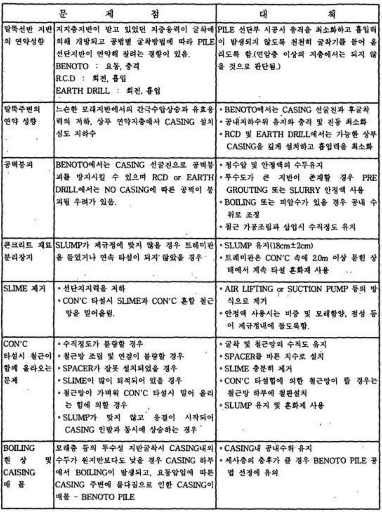  

# 2. 공법 분류  

대구경 현장타설 말뚝공법을 아래의 기계굴착방법과 공벽유지방법 등에 따라 여러가지 공법으로개발되고 있다.  

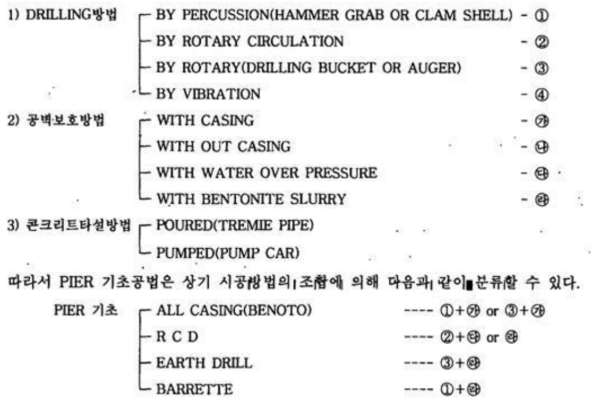  

그러나 상기각 공법은 굴착공법과 공벽유지 방법이 서로 상이하므로 지층조건과 시공심도에 따른적합한 시공방법을 위해서는 각 공법의 장점을 살려 2 가지 공법을 조합하여 적용하는 것이 시공효율을 극대화할 수 있다.  

즉, EARTH DRILL 병용 ALL CASING METHOD ALL CASING $^+$ RCD METHOD etc  

BARRETTE 공법은 지하연속벽 장비 및 시공방법을 이용하여 단면형상이 원형이 아닌 벽식으로공사목적에 따라 다양한 형상으로 시공가능한 특징이 있다.  

# II. EARTH-DRILL 공법  

각주 002) 대한건설협회, "건설공사신공법해설집", pp.258-294, 1992  

# 1. 개요  

본 공법은 BENOTO 공법, RCD 공법과 더불어 대표적인 현장타설 말뚝공법의 하나로 미국의CALWELD 사가 개발한 대구경 어스드릴기가 시초로 일명 칼웰드공법이라고도 하며 기종에따라서는 BENOTO 굴착기와 병용형도 있다. 본 공법은 일반적으로 CASING 이나 안정액에 의한공벽유지를 필요로 하지 않고 BUCKET 또는 AUGER TYPE 의 EARTH-DRILL 굴착기로 굴착하고SLIME 제거와 응력재 삽입후 트레미관에 의한 콘크리트타설로 현장타설말뚝을 조성하는공법이며 지층조건에 따라서는 SLURRY 안정액의 사용과 표층부에만 짧은 CASING 을 사용한다.특히 최근에는 본 장비의 개발로 B 18 HS 같은 경우에는 매우 깊은 심도(60m)까지 굴착이가능하고 전유압식의 요동압입장치를 부착하여 All Casing 공법으로도 널리 사용되고 있다.  

# 2. 공법의 특징  

(1) 장점  

$\textcircled{1}$ 기계의 설치가 간편하고 이동이 용이함.  
$\circled{2}$ 타공법에 비해 시공속도가 빠르고 경제성 측면에서 유리$\textcircled{3}$ 굴착중 충격 및 진동이 없음.  
$\circled{4}$ 점성토 및 LOAM 질 지반에서는 안정액이 필요없어 굴착효율이 가장 높다.  
$\circled{5}$ 말뚝 선단지반에서는 BELL-TYPE BIT 를 사용하여 선단지지력을 크게 할 수 있다.  

(2) 단점  

$\textcircled{1}$ 지하수위 이하의 시층을 굴착할 경우 공벽붕괴방지를 위해 안정액을 사용하여야 하고 그관리에 유의하여야 한다.  
$\circled{2}$ 안정액을 사용함에 따른 배출토사의 처리가 곤란  
$\textcircled{3}$ 호박, 전석층이나 암층에서는 시공 곤란  
$\circled{4}$ 복류수나 피압지하수가 있으면 시공 곤란  
$\circled{5}$ 기중에 따라서는 심도에 한계가 있음.  
$\circled{6}$ 타공법에 비해 지지력이 다소 떨어짐.  
$\textcircled{7}$ PILE 선단지반이 BUCKET 의 회전 흡인현상에 의해 연약해질 우려가 있음.  

(3) 굴착에 따른 시공관리  

EARTH DRILL 공법에서 가장 큰 문제점은 공벽이 붕괴되지 않도록 처리하는 것이며 안정액을사용하여도 붕괴를 방지할 수 없는 지반, 복류수 및 피압수가 있는 지반에서는 현실적으로시공이 불가능하다. 따라서 최근에는 ALL CASING 공법외 요동압입장치를 부착하여 CASING 을사용하고 있는 실정이다.  

$\textcircled{1}$ 장비의 설치상태는 시공정도에 큰 영향을 미치므로 설치지반을 평탄하게 하고 지반이 연약할경우 복공판 등으로 보강을 필요로 한다. 이때 KELLY BAR 의 연직도를 확인하고 BUCKET 의중심과 말뚝의 중심이 일치되도록 한다.  

$\circled{2}$ 국내 지반조건에서는 극히 일부를 제외하고는 안정액을 사용하여야 하며 안정액의 배합 및사용기준은 지하연속벽의 안정액을 기준하여 사용할 수 있다.  

$\textcircled{3}$ 굴착토가 담긴 BUCKET 를 급속히 인양하면 선단지반이 연약하게 되고 공내의 안정액이심하게 교반되어 붕괴의 원인이 되므로 유의하여야 하며 일반적으로 인양속도는 굴착직경이클수록 느리게 하고 사질토 굴착시는 점성토 굴착시보다 느리게 한다.  

$\circled{4}$ 굴착중 KELLY BAR 의 연직도를 수시로 CHECK 하고 안정액 관리에 유의하여야 한다.  

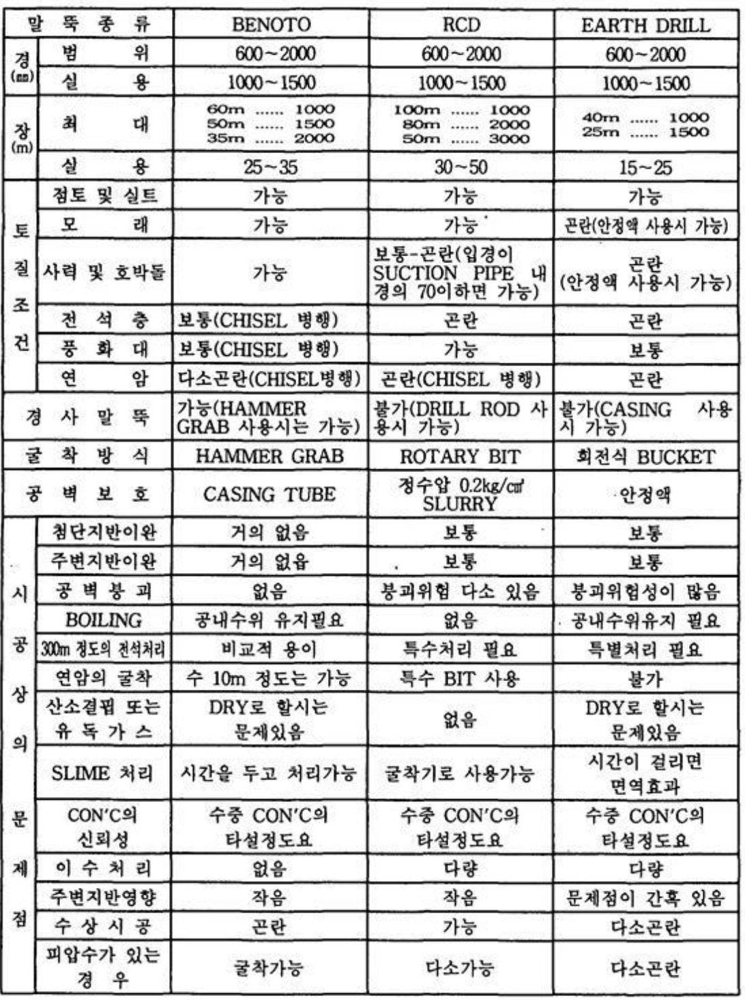  
주 PILE 직경 및 심도는 지층조건과 장비사양에 따라 큰 차이를 나타낼 수 있음  

# III. BARRETTE 공법  

각주 003) 대한건설협회, "건설공사신공법해설집", pp.345-353,1992  

# 1. 공법개요  

BARRETTE 는 기본적으로 직사각형 형태로 지중에 시공되는 콘크리트 PIER 의 일종으로DIAPHRAGM WALL 의 1 개 UNIT 로 PIER 기초로 응용한 것으로 그 단면적은 횡하중과수직하중에 저항하기 위하여 7 ㎡이상까지 확대될 수 있으며 지질조건에 따라 80m 이상의깊이까지 시공될 수 있다. 1 개의 BARRETTE 는 수개의 타설말뚝(BORED PILE)와타입말뚝(DRIVEN PILE)을 대체할 수 있으므로 공사비와 공사기간에 대해 유리하고 보다 신뢰할수 있는 기초형태가 된다.  

(1) 공법소개  

전통적인 PILE 기초는 고층빌딩의 경우 기둥에 작용하는 하중이 대단히 크고 또한 지내력층이깊을 경우 비경제적이며 현실성이 없어진다. 지하수위가 높고 지층의 변화가 심할 경우 심각한문제가 되는데 몇 천톤을 초과할 수 있는 그러한 큰 하중을 연약하고 곤란한 지층을 통과하여지내력에 전달하기 위해서는 엄격한 품질관리와 CASING 등이 필요하게 되는데 어떤 경우에설계자는 수직하중 뿐만 아니라 횡하중과 휨하중(BENDING)에 저항할 수 있도록 기초를 선택할필요가 있다. BARRETTE 는 BENTONITE 이수 속에서 굴착 시공되므로 CASING 이 필요없게되고 휨에 대하여 강축과 약축을 가지므로 휨하중에 대해 적절한 방향을 취함으로서원형기초보다 효율적이다. 즉, 설계자는 단면적을 증가시키지 않고 BARRETTE 의 방향을조성함으로서 관성 모우먼트와 저항 모우먼트를 증대시킬 수 있다. BARRETTE 는 큰 하중을지내력층에 전달시킬 수 있으므로 1 개의 BARRETTE 는 수개의 전통적인 PILE 을 대체할 수있으므로 공사기간과 경제성에 있어서 양호하다.  

# 2. BARRETTE 의 이론 및 설계  

(1) TRENCH 의 안정  

BARRETTE 의 시공을 위한 굴착되는 구덩이(TRENCH)는 굴착 이수(BENTONITE SLURRY)에의해 안정을 유지하게 되는데 그 이론적인 배경은 다음과 같다.  

1) BENTONITE 의 성질 $\curvearrowright$ THIXOTROPIC(搖變性)성향  

BARRETTE 굴착에 사용되는 BENTONITE 는 팽창성이 강하고 비교란시에 굳어 GEL 상태가되며 액체의 성질을 가지는 SOL 상태가 되는 THIXOTROPY 성질이 강한 것으로 특징지어진다.THIXOTROPY 는 일정한 조직과 체적을 가지고 등온하에서 시간에 따라 원래의 상태로회복하려고 하는데 일반적인 점토에서 교란후 THIXOTROPIC HARDENNING 은 수시간, 수일간에걸쳐 일어나는데 BENTONITE 는 몇분 후에 강도 회복이 되는 THIXOTROPIC 성향이 강한점토이다.  

$\curvearrowright$ RHEOLOGIC 성향  

BENTONITE 의 GEL 상의 파괴는 시간, 전단 속도에 관련되는 RHEOLOGIC 성질을 가지고 있다.  

2) TRENCH 주위의 SOIL ARCHING  

지반조건이 좋지 않거나 인접하여 구조물이 있으면 TRENCH 에 작용하는 토압이 크게 되어TRENCH 내 BENTONITE SLURRY 의 압력보다 크게 될 수 있는데 이럴 경우 TRENCH 주위지반의 SOIL ARCHING 에 의해 토압은 현저하게 감소되는데 BARRETTE 의 경우 TRENCH 의길이가 짧으므로(대략 2.4-2.7m)지반 ARCHING 효과가 크게 되어 토압은 현저하게 감소되어결국 TRENCH 의 안정을 유지하게 된다.  

ㅇ 수직 ARCH  

수직응력을 감소시켜 토압을 감소시킨다.  

$\curvearrowright$ 수평 ARCH  

주동파괴 WEDGE(쐐기 이론에 의함)의 크기를 감소시켜 토압을 감소시킨다.  

# ㅇ 응력 재분배  

기존구조물로 인한 상재하중은 TRENCH 주위의 지반에 재분배 되는데 이는 TRENCH 의굴착으로 인하여 구조물측의 지반강성이 약화됨으로서 상재 하중으로 인한 토압이 TRENCH주위의 지반에 전달되는 현상이다.  

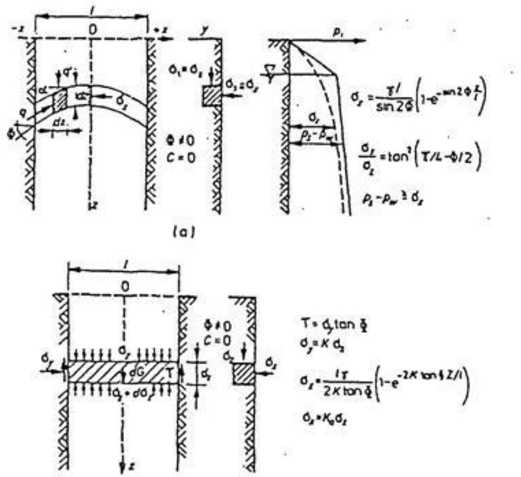  
Stability analysis Finite trenches based on silo theories Schneebeli C1964>: Huder <1972  

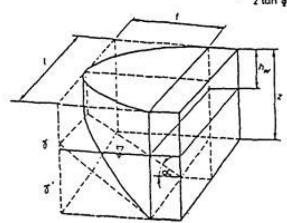  
Shape the Sliding earth body in the Case trench with finite Tength CKowalewski 1965  

# (2) 지내력  

BARRETTE 기초가 BENTONITE SLURRY 액 내에서 시공됨에도 불구하고 통상의 PIER 기초와같은 선단지지력(END BEARING)과 주변마찰력(SHAFT FRICTION)을 기대 할 수 있는데 이는다음과 같은 현상에 의해 설명될 수 있다.  

1) 선단지지력 (END BEARING)  

CHADEISSON(1961)에 의해 SLURRY 액을 사용할 경우와 사용하지 않은 경우에 대해 LOADTEST 가 실시되었는데 초기 침하를 제외하고는 유사하게 거동함이 확인되었는데 이러한초기침하는 바닥면의 SLIME 과 굴착시 바닥면의 이완 등에 기인하므로 바닥면의 철저한CLEANING 이 필요하며 철저한 품질관리를 행하였을 경우 이러한 현상은 무시할만하다. 또한BARRETTE 바닥면 SLIME 의 압밀 및 제거와 바닥면 하부의 지반을 보강하기 위하여 TOE-GROUTING 을 실시하여 보완할 수 있다.  

2) 주변마찰력 (SHAFT FRTCTION)  

TRENCH 벽면에 잔존하는 BENTONITE 가 지반과 BARRETTE 콘크리트 사이의 마찰력을감소시키는 윤활작용이 발생할 수 있으나 TREMIE PIPE 를 통하여 TRENCH 바닥면에서부터상승되는 깨끗한 콘크리트 유동체가 대부분의 BENTONITE 을 밀어올리게 되며 벽면과콘크리트면 사이에 SWEEPING ACTION 을 발휘하게 되며 잔존하는 BENTONITE 는 시멘트에의한 CALCIUM 반응에 의해 흡수됨으로써 잔류된 BENTONITE 는 더이상 윤활작용제로서 남지않는다. 즉, 통상의 PIER 기초의 SHAPT FRICTION 과 동일한 거동을 하게 된다.  

# 3. 선정 입지 조건  

(1) 지반조건  

이론적으론 토질조건, 지하수,·깊이 등에 제한을 받지 않으나 장비의 한계성으로 인해 많은 양의경암반 굴착은 경제성이 없다.  

(2) 환경조건  

$\curvearrowright$ 지반굴착 형식이므로 소음 진동 등이 적어 환경적인 요소에 민감하지 않다.$\curvearrowright$ 제한된 공간에서 인접건물에 접하여 시공할 수 있으며 BARRETTE 의 평면현상을 다양하게구사할 수 있다.$\curvearrowright$ SLURRY TRENCH 는 일반공법에 비해 단순하고 정돈된 작업환경을 제공한다.$\curvearrowright$ CRANE 작업을 위하여 협소한 면적에서는 곤란하며 지반의 상부는 CRANE BOOM 을 세울 수있는 공간이 필요하다.  

# 4. 시공 예  

바렛트기초 일명 STRIP PILE 기초는 사용목적에 따라 평면현상을 비교적 자유롭게 구성할 수있으므로 아래와 같이 여러가지 목적으로 사용될 수 있다.  

$\curvearrowright$ 일반적인 PIER FOUNDATION  
$\curvearrowright$ TOP/DOWN 공법 적용을 위한 PRE-FOUNDED COLUMN  
$\curvearrowright$ QUAY WALL 의 횡저항 PIER  

$\curvearrowright$ 고층건물의 기초  

$\curvearrowright$ 교량기초  

$\curvearrowright$ 인발저항 기초  

# 5. 투입장비  

BARRETT 작업용 장비는 지하연속벽의 장비를 사용한다. 다만, PANEL 연결용장비(STOP-END-TUBE 일명 INTER LOCKING PIPE 등)만 필요가 없다.  

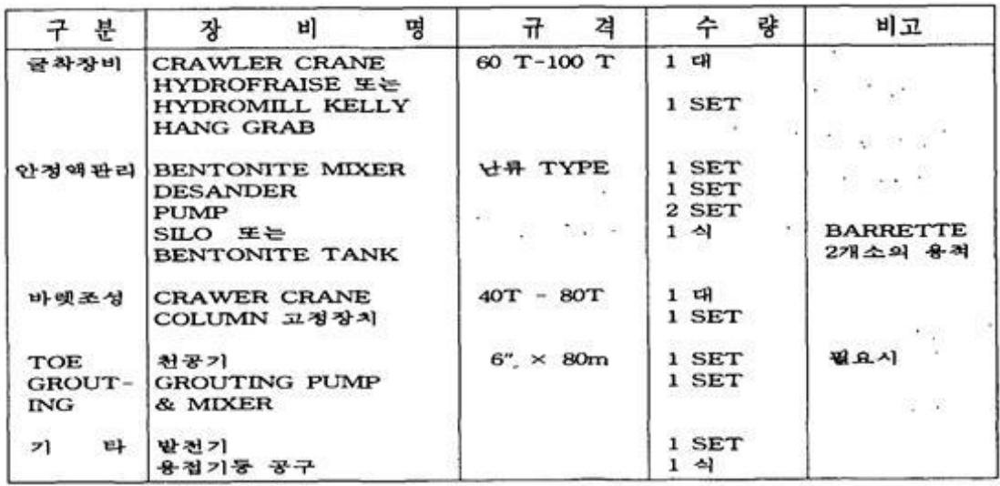  

# IV. R.C.D Pile 공법  

각주 004) 대한건설협회, "건설공사신공법해설집", pp.315-325, 1992  

# 1. 공법개요  

역순환 굴착공법(REVERSE CIRCULATION DRILL 공법, 이하 R.C.D 공법)은 1954 년 독일의SALE GITTER 사이에서 개발한 공법으로 현장타설 말뚝공법중 가장 대구경이며, 깊은 심도까지시공할 수 있다. 본 공법은 상부 8-10m 정도의 STAND PIPE(CASING)를 설치하고 그 이하는 2m이상의 정수압과 굴착중에 발생되는 자연이수에 의해 공백을 유지하면서 굴착한다. 굴착은특수한 빗트를 회전시켜 지반을 굴착하고 일반적인 ROTARY BORING 방법에서 물의 흐름과반대로 DRILLROD PIPE 로 순환수와 함께 굴착토를 흡상하여 지상으로 배출하며 배출된순환수는 함께 굴착토를 흡상하여 지상으로 배출하며 배출된 순환수는 침전지에서 토사를침전시킨 후 다시 굴착공으로 CIRCULATION 시킨다.. 굴착토의 배출방식은 PUMPSUCTION,AIRLIFT, JET SUCTION 및 SUCTION 과 AIRLIFT 의 혼합식 등이 있다.  

최근에는 복잡한 지층조건과 투수성 지반조건에서는 지하연속벽공법에 사용하는 SLURRY안정액을 사용하여 공벽을 유지하고 있다.  

# 2. 입지조건  

$\textcircled{1}$ 심도가 깊은 곳  

$\circled{2}$ 지하수 이동이 있는 곳  

$\textcircled{3}$ 소음 및 진동이 허용되지 않는 곳$\circled{4}$ 기종에 따라 경사시공도 가능(경사시공을 요하는 곳)$\circled{5}$ 굴착토사 처리를 위한 공간 확보가 용이한 곳  

# 3. 굴착  

(1) 굴착시 주의사항  

$\textcircled{1}$ RCD 공법에서 공벽의 붕괴방지는 대부분 굴착에 의한 자연이수 또는 인공적인 BENTONITESLURRY 안정액이 공벽에 FILTER CARE 를 형성함과 동시에 지하수위보다 2.0m 이상 높은공내수위의 정수압에 의해 이루어지므로 공내수위 유지와 안정액 관리에 유의해야 한다.  

$\circled{2}$ 이수의 비중은 공벽유지 측면에서는 높은 것이 좋지만 굴착 효율이나 콘크리트 타설시 유동성측면에서는 비중이 낮은 것이 좋다는 양면성을 갖고 있으므로 굴착중과 콘크리트 타설시를고려하여 안정액의 비중을 일정한 범위내에 들도록 하여야 한다.  

$\textcircled{3}$ 국내 지반에서는 굴착중에 자연이수가 형성되지 않는 사질지반이 주로 분포하고 있어공벽유지의 안정성 측면에서는 BENTONITE 안정액을 사용하는 것이 적합하다.  

$\circled{4}$ STAND PIPE 의 하부가 모래층과 같이 투수계수가 큰 지층에 위치한 경우 공내수위를 높이면PIPING 현상이 발생되고 진동이나 충격을 가하면 공내수위가 저하되어 붕괴의 원인이 된다.  

$\circled{5}$ 공내수두압을 필요이상 크게 하면 공내수가 굴착공 외측으로 BOILING UP 하여 파괴되는 수가있으며 파압수가 작용할 경우에는 파압수의 압력을 미리 측정하여 공내수로 방지 가능하면공내수위를 올려 시공하고 필요할 경우에는 약액주입으로 지반을 안정시킬 필요가 있다.  

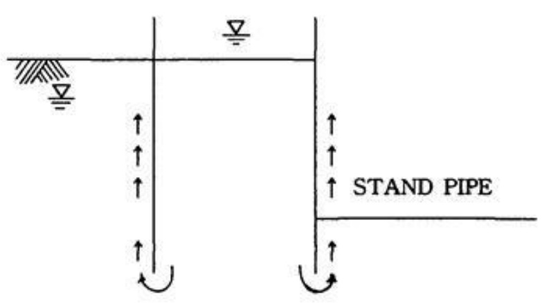  
PIPING 현상  

$\circled{6}$ 지표면에서 10m 정도 깊이에 느슨한 실트질 모래 또는 사질토가 있는 경우에는 시공중진동이나 시공장비의 이동에 의한 과도한 상재하중을 가하지 않도록 하고 굴착속도를 최소한늦게 하여 공벽 붕괴가 일어나지 않도록 주의하여야 한다.  

# 4. 시공  

(1) 시공순서 및 확인사항  

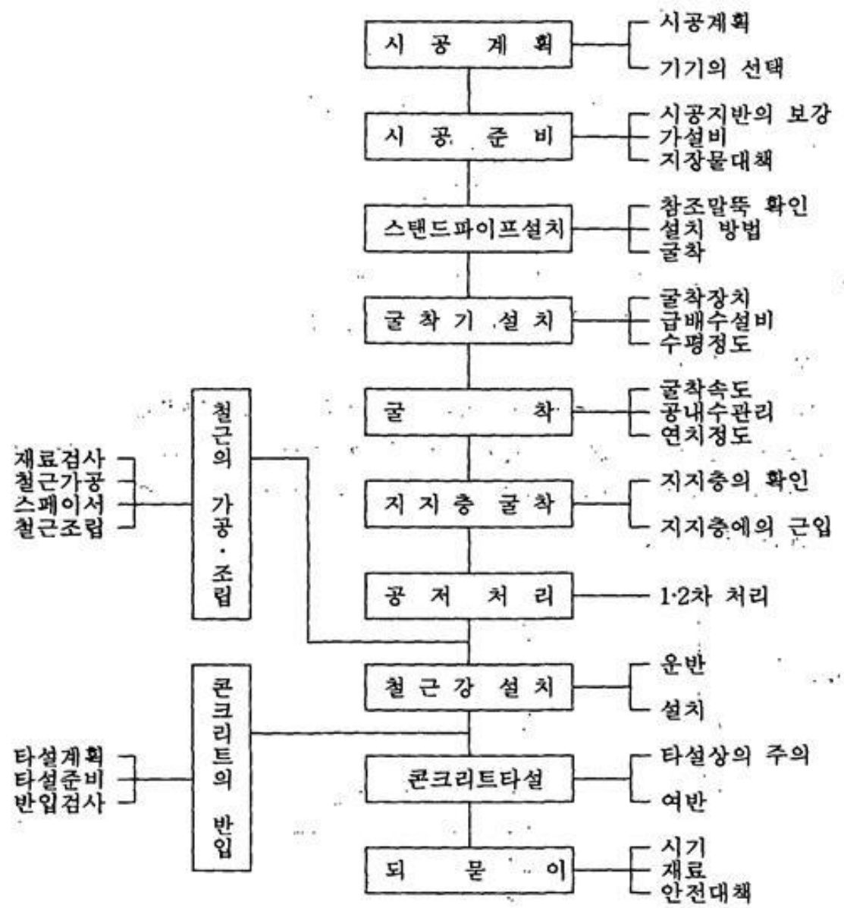  

(2) 시공관리  

1) 기계의 설치  

$\textcircled{1}$ RCD 공법에서는 지반속에 장애물이 있으면 시공이 곤란하므로 부지정지작업과 병행하여장애물을 제거한다.  

$\circled{2}$ 안정액을 사용할 경우 저장용기는 말뚝 1 개소당의 굴착토량의 $_{2\sim3}$ 배 정도로 하여 충분히설치하도록 하며 다량의 물을 사용하므로 물의 공급원과 침전조에서의 굴착토사 처리를 위한공간이 확보되어야 한다.  

$\textcircled{3}$ STAND PIPE 의 설치  

STAND PIPE 설치심도  

통상 $8\sim10\mathsf{m}\ \ 0|$ 내로 하되 가능한 STAND PIPE 하부는 점성토 또는 실트층 등 투수성이 적은지반에까지 근입시키고 상부는 지하수위를 고려하여(지하수위와의 거리 2.0m 이상) 설치한다.  

# STAND PIPE 직경  

굴착직경보다 $10\!\sim\!20$ ㎝ 정도 크게함. 설치 및 인발 장비  

통상 VIBRO HAMMER 에 의해 설치 및 인발을 하나 기존 구조물에 인접하며 시공할 경우나상부지층 조건상 VIBRO 로 시공이 불가능할 경우 및 가능한 깊게 CASING 설치를 필요로 할경우에는 BENOTO 공법의 장비로 설치 인발함.(이 경우에는 BENOTO $^+$ RCD 공법이 되며최근에는 각 공법의 장점을 고려하여 많이 시공되고 있는 실정임.)  

2) 수평정도와 연직정도  

RCD 공법에서는 STAND PIPE 이하는 이수에 의한 공벽을 유지시키며 굴착하므로 특히 연직정도유지에 주의할 필요가 있다. 본 공법에서도 BENOTO 공법에서와 마찬가지로 STAND PIPE설치시 참조말뚝을 설치토록 한다.  

일반적으로 굴착공이 경사가 지는 원인은 굴착지반의 성질(중간층 또는 지지층이 경사진 경우)굴착속도의 부적당, 장비선택상의 문제, 부주의한 시공 등의 원인으로 분류되며 여직도는 다음과같은 방법으로 확인할 수 있다.  

$\textcircled{1}$ 초음파 측정기에 의한 방법(BORE HOLE MONITERING)  

본 방법은 굴착공 상부 CENTER 위치에서 HOLE 내부로 초음파를 발산하고 공벽에 부딪혀돌아오는 반사파를 받아 시간차에 의해 거리를 계산하며 수직정도 및 공벽 여굴상태를 그래프로그려져 나오게 되어있다. 그러나 본 방법은 이수의 농도가 클 경우에는 MONITERING 이불가능하므로 굴착중에는 실제 사용할 수 없는 실정이며 굴착완료 후에는 이미 수직정도를 바로잡기가 곤란하므로 확인을 하는 정도외에는 활용가치가 없는 편이다.  

$\circled{2}$ 추에 의한 간이측정방법  

본 방법은 굴착중 또는 굴착완료시에도 간편하게 수직도를 확인할 수 있고 시간과 경비를 절감할수 있다. 측정은 굴착기의 높이 만큼 굴착이 이루어진 상태에서부터 측정 가능함.  

# V. S.I.P. 기초(Soil-Cement Injected Precast Pile)공법  

각주 005) 대한건설협회, "건설공사신공법해설집", pp.191-200, 1992  

# 1. 개요  

기초지반의 지지력은 지반의 강도와 기초의 크기를 기초의 근입 등에 의해 결정되는데 지반의강도가 부족한 경우 근입을 늘이는 것이 가장 확실한 공법이라 하겠다. 그러나 기초에 전달되는하중이 대단히 큰 경우는 기초의 근입이 상당히 늘어나야 하므로 그에 따라 기초전체를 깊게근입하는데는 상당한 공사비가 소요되기 때문에 말뚝공법의 도입이 필연적이 된다. 이 공법을토질 및 기초공학에서는 깊은 기초(DEEP FOUNDATION)공법으로 분류하며 기초공법중 가장안정된 공법으로 평가하고 있다. 말뚝공법은 강성이 큰 STEEL 이나, 콘크리트, 목재들을 지층깊숙이 관입하여 매우 단단한 심층에서 기초가 지지하도록 하는 것으로 지층의 토립자 구성이매우 중요한 고려사항이다. 즉, 중간 토층에서의 말뚝의 관입이 용이하여야 하고 말뚝 선단부의지지력이 확실하여야 한다. 그러나 하천 인접유역에서는 자갈, 호박돌층이 두껍게 퇴적되어 있는경우가 많아 타격에 의한 말뚝관입이 불가능하며 모래, 자갈층은 세굴작용이 일어나므로선단지지층으로 사용하기도 곤란하다. 따라서 이러한 지층에서는 대구경의 우물통 기초를 하거나오거장비 등에 의해 미리 천공(PREDRILL)하여 현장에서 콘크리트를 치는 현장말뚝(BOREDPILE)공법 등이 사용되어 왔다.  

그러나 이러한 공법들은 말뚝의 크기(단면적)에 비해 비교적 침하량이 크게 나타나고 기초지반이이완되며 말뚝주면의 마찰이 크게 감소되어 지반의 지지력이 부족한 탓으로 말뚝 본체의 강도를충분하게 사용하지 못함으로써 비경제적이 되기가 쉽다. 본 SIP 공법은 이러한 단점을 보완한것으로 지층을 오거로 천공할때 원지반에 CEMENT PASTE 를 주입하여 각반하므로서 양생후에는주면지층의 강도가 증대되어 말뚝주면의 마찰력(SKIN FRICTION)을 크게 증대시키고 아울러선단부에서도 각반된 SOIL-CEMENT 가 완전히 충진되어 말뚝의 침하량을 최소화시키는 공법이다.  

# (1) SIP 기초공법의 배경  

SIP 기초공법은 공법분류상 대변위말뚝(LARGE DISPLACEMENT PILE)공법인 PRE-DRILL 공법과무변위말뚝(NONE DISPLACEMENT PILE)공법인 시멘트몰탈 주입공법(CEMENT MORTARINJECTED INTO DRILLED HOLE)을 합한 것으로 1968 년 일본의 기초기술연구소 貝戶俊一에의해 원래는 저소음, 저진동공법으로 고안된 공법이다. 이 공법은 그해 시험시공된 이래 처음 몇년간은 사용이 부진했으나 이후 해마다 사용이 급격히 증가되어 불과 5 년 후인 1973 년에는일본 전역의 말뚝공사중 $33.7\%$ 로 사용될 정도로 크게 인정받았다. 국내에서는 1980 년대 들어산발적으로 사용한 실적이 있으며 대단위로는 1987 년대 한강변에 신축중인 초고층아파트의기초공법으로 Φ600 ㎜ PC 콘크리트 말뚝 $(\equiv01\!=\!20\mathsf{m}\!\sim\!26\mathsf{m})$ 을 사용하여 전체 약 5,000 본의말뚝이 두성건설주식회사에 의해 시공중에 있으며, 공사감리는 (주)동일기술공사 기술진이 맡아기술자문에 답하고 있다. 이 공법의 주요사항은 크게 지층의 구성, 장비의 능력, SOIL-CEMENT 의 강도, 기성말뚝의 선정, 시공관리 등을 열거할 수 있는데 실제로 말뚝공사는 이론과시공이 잘 맞아야 하는 공사로 특별한 시공관리가 요망된다.  

# (2) 시공방법 및 효과  

본 공법은 오거장비로 소요말뚝 구경보다 직경이 10 ㎝ 정도 크게 하여 천공하며 굴진시오거빗트를 통해 CEMENT PASTE 와 BENTONITE 를 혼합한 용액을 주입하여 공벽을 보호하면서설계심도까지 굴진한다. 지지층 부근에서는 부배합의 CEMENT PASTE 를 주입하여 원지반토와충분히 각반하므로서 확장된 선단지지층으로 사용할 수 있게 한다. 각반 작업이 완료되면기성말뚝을 자중에 의해 공의 내부에 삽입한 선단부 $1.0\!\sim\!1.5\mathfrak{m}$ 를 햄머에 의해 타입시키므로말뚝선단부가 이완되지 않고 오히려 더욱 조밀해지도록 하는 효과를 얻는다. 이렇게 하므로서말뚝선단부의 지지력이 증대될 뿐만 아니라 말뚝 주면의 마찰력이 타입말뚝(DRIVEN PILE)보다오히려 크게 나타나 말뚝 본체의 지지력을 $100\%$ 발휘할 수 있게 된다. 또한 말뚝의 선단이개구식(OPEN SHOE)인 경우 말뚝 내부에도 SOIL-CEMENT 가 충진되어 말뚝의 유효 단면적이확대되므로 말뚝 자체의 강성에도 더욱 양호한 효과를 주며 말뚝에 가해지는 충격 응력이 작아품질관리 면에서도 우수하다. 뿐만아니라 소음 및 진동이 작아 도심지에서의 작업도 가능하며지지층까지의 관입이 확실하여 하자(瑕疵) 발생의 요인이 거의 없다.  

# (3) 사용장비  

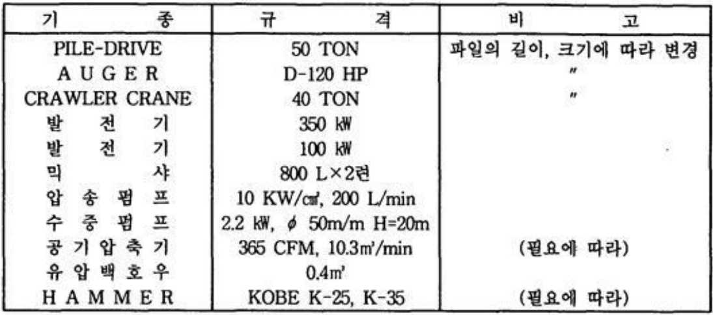  
본 오거장비의 특징은 다음과 같다.  

$\textcircled{1}$ 본 공법에 사용되는 오거장비는 다축오거기로서 일반적으로 삼축까지 사용이 가능하나선단지층이 매우 단단한 말뚝공사의 경우에는 단축으로 시공하므로서 풍화대층(잔적토 및풍화암)까지 천공이 가능하다.  

$\circled{2}$ 오거의 회전은 역회전이 가능하며 굴진과 각반작업의 구분 시공이 용이하다.  

$\textcircled{3}$ 날개(SCREW)는 토사와 CEMENT PASTE 를 각반시키는 봉형으로 된 각반날개와 혼합토사를상하로 이동시키는 나선형으로 된 각반 날개로 구분되어 있고 토층에 따라 일반용, 호박돌층용,점성토층용 등 다양하여 지층에 따라서 선택사용이 가능하다.  

$\circled{4}$ 항타장비는 일반적으로 많이 사용되는 KOBE K-25 나 DROP HAMMER 중에서 말뚝중량에 따라적절한 것을 선택하여 사용하고 있다.  

(4) 시공순서  

$\textcircled{1}$ 사용기계 및 기구의 점검을 실시한다. 특히 오거의 치수, 길이를 정확히 측정하고 설계심도부근에는 50 ㎝ 마다 MARK 를 한다. 또 혼합기 및 계량기에 대해서도 배합비, 사용방법 등을확실하게 파악한다.  

$\circled{2}$ 말뚝의 시공지점에 설치한 표식과 오거의 중심을 정확히 일치시킨후 오거가 수직인가를 확인한다음에 굴진을 시작한다.  

$\textcircled{3}$ 굴진용 용액(일반적으로 SOIL-CEMENT ㎥당 시멘트 120 ㎏, BENTONITE 25 ㎏, 물 450ℓ로배합)을 오거선단에서 주입하면서 중간지층을 굴진한다.  

$\circled{4}$ 지지층을 확인하면 다시 설계심도까지 굴진한다. 이때 설계심도는 적어도 지지층 안에말뚝직경의 3 배 이상 관입되어야 한다.  

$\circled{5}$ 설계심도까지 도달하면 굴진용 용액을 근고용 용액(선단부 지층에 따라 다소 차이는 있으나시멘트: $\Xi\!=\!1\!:\!1.2\!\sim\!1.4\!)$ 로 하며 시멘트는 $400\!\sim\!800\;\mathrm{kg}$ 정도로 사용한다.)으로 바꾸어서 수회 수m 를 오거로 상하 왕복하면서 각반하여 CEMENT PASTE 와 지반이 충분히 각반되도록 한다.  

$\circled{6}$ 오거로 충진액(굴전용 용액과 동일)을 주입하면서 인발한다.  

$\textcircled{7}$ 굴진이 완료되면 공내에 고차측정기를 삽입하여 굴진심도를 측정한다. 이때 공의 하부에자갈이나 흙덩이가 너무 쌓여 굴진 심도가 미달되면 오거로 재굴진하여야 한다.  

$\circled{8}$ 말뚝은 공의 중심과 수직이 되도록 세운뒤 말뚝 자중에 의해 삽입한다. 이때 삽입길이가 말뚝선단부에서 허용고차 $\stackrel{\circ\models}{\longrightarrow}~2.0{\sim}2.5\mathsf{m})$ 보다 미달되면 말뚝을 인발하여 재삽입하든지 말뚝을낙차로 $(0.2^{\sim}0.5\mathsf{m})$ 로 타격하여 허용고차 범위에 Seating 되도록 한다.  

$\circledcirc$ 항타장비에 의해 말뚝을 경타하여 허용최종고차(약 0.5∼1.0m)이내까지 타입시킨다.  

(5) 허용지지력  

SIP 의 경우 지층에 따라 다소 차이는 있으나 말뚝 주위의 SOIL-CEMENT 가 상당히강하여(일축압축강도가 점성토의 경우 7∼20 ㎏/㎠, 사질토인 경우 20∼30 ㎏/㎠, 사력토인 경우$60\!\sim\!120\mathrm{~kg}/\mathsf{c m}^{2}$ 정도) 대부분 말뚝 본체의 허용지지력 만큼의 지반지지력을 기대할 수 있다.  

참고로 국내에서 생산되는 PC 콘크리트 말뚝의 제원을 살펴보면 다음과 같다.  

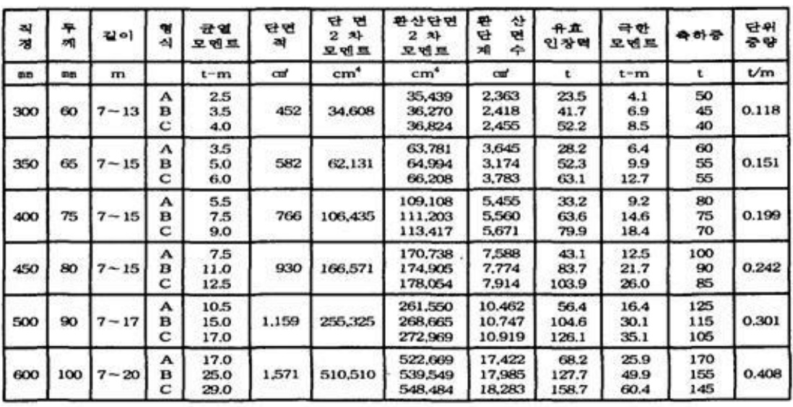  

# VI. BENOTO PILE 공법  

각주 006) 대한건설협회, "건설공사신공법해설집", pp.327-344, 1992  

# 1. 공법개요  

본 공법은 프랑스의 BENOTO 사가 제일먼저 개발하여 사용하였기 때문에 일명 BENOTO공법이라 부르는 것으로 굴착시 공벽 붕괴를 방지하기 위해 CASING TUBE 를 좌우로 회전시키는요동 압입장치(OSCILLATOR)로 흙속에 삽입함과 동시에 굴착기(HAMMER GRAB, CHISEL orEARTH DRILL 병용)로 그 내부를 굴착 배토하여 소정의 깊이까지 굴착완료하고 HOLE 의SLIME 제거와 응력재(STEEL CAGE, 강관 H-BEAM 등)의 삽입과 TREMIE PIPE 에 의한콘크리트를 타설하고 OSCILLATOR 로 CASING 을 인발하여 현장타설 말뚝을 조성하는 공법이다.  

# 2. 입지조건  

$\textcircled{1}$ 기존 구조물에 근접시공을 필요로 하는 곳$\circled{2}$ 지질조사 및 지층 확인을 필요로 할때$\textcircled{3}$ 소음 및 진동이 허용되지 않는 곳$\circled{4}$ 구멍(HOLE)의 붕괴가 많은 지반$\circled{5}$ 경사시공을 요하는 곳(기종에 따라 가능)  

# 3. 투입장비  

(1) 굴착기 및 OSCILLATOR  

일반적으로 ALL CASING 공법이 시공되고 있는 장비는 장비 회사별로 여러가지의 종류가 있으나현재 국내에서 사용되고 있는 장비를 소개하면 다음과 같다.  

$\textcircled{1}$ HAMMER GRAB 에 의한 방법  

굴착중 충격 및 진동을 수반하나 자갈, 호박돌층 굴착이 비교적 용이하며 공내수위 유사시에는굴착속도가 현저히 저하된다.  

OSCILLATOR 는 대부분 좌우회전 방식을 사용하고 있으나 최근에는 360˚ 회전장비가 도입되어사용되고 있으며 특수한 지층조건에 한해서 종래의 좌우회전 방식보다는 성능이 다소 우수하다.  

$\circled{2}$ EARTH DRILL 병용에 의한 방법  

본 굴착기는 종래의 EARTH DRILL 굴착기를 개량하여 ALL CASING 작업과 EARTH DRILL작업을 동시에 할 수 있으며 특히 TELESCOPIC KELLY BAR 에 의한 ROD 연결 및 해체가필요없어 굴착속도가 HAMMER GRAB 장비에 비해서 양호하나 호박돌 층에서는 시공이 곤란하다.아울러 굴착방식이 회전 BUCKET or AUGER 로 충격 및 진동이 없어 도심지 및 기존구조물에근접하여 시공 가능하며 지층조건 및 구경에 따라 차이는 있으나 B18HS 장비일 경우 현재60m 까지 시공 가능하다. 또한 특수한 굴착기를 부착하여 BELL TYPE 의 현장타설 말뚝으로의시공과 경사말뚝 시공도 가능하다.  

# 4. 시공  

(1) 시공순서 및 확인사항.  

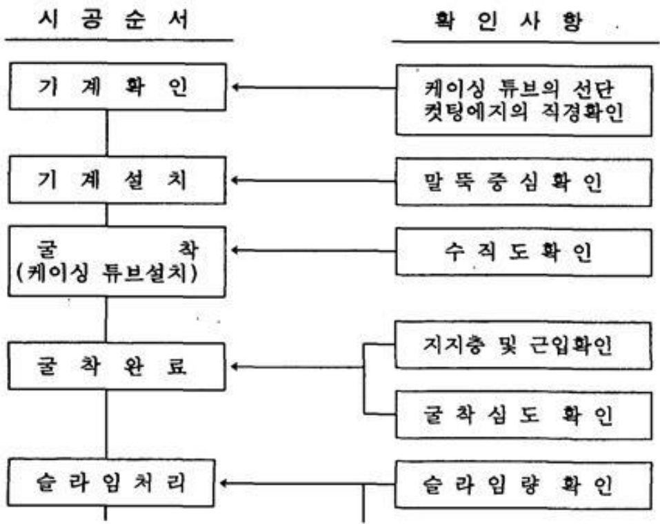  

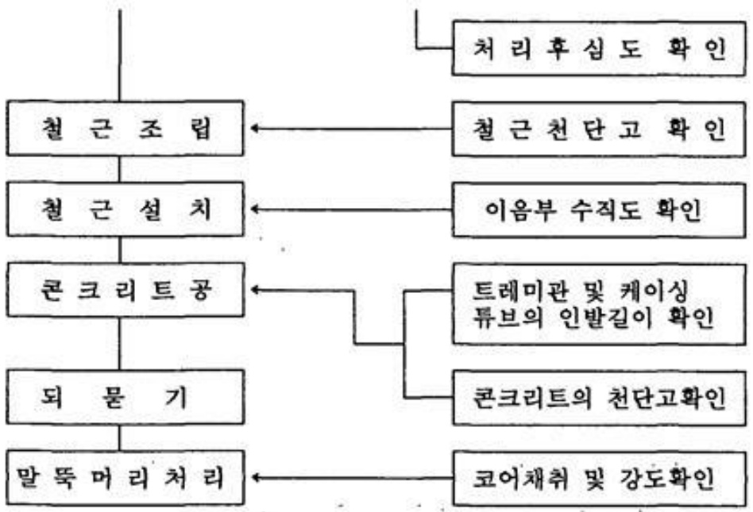  

(2) 시공관리  

1) 장비이동 및 설치  

현장 환경에 따라 작업조건이 변하지만 일반적으로 다음사항에 주의한다.  
$\textcircled{1}$ 작업장은 균일하게 정지해 놓는다.  
$\circled{2}$ 지중 매설물에 대해서는 이설 또는 방호검토한다.  
$\textcircled{3}$ 기계를 수평으로 하여 말뚝중심에 설치한다.구조물이 이 전디어 있는 경우 국착토의 Hh e방향을 고려하여 기계를 설치한다  

$\circled{5}$ 지반이 불안정하여 작업중 기계가 기울어져 말뚝이 경사지거나 편심을 받을 우려가 있으며특히 CASING TUBE 인발시 인발반력에 따른 설치지반의 지내력이 부족할 경우에는 복공판등으로 보강을 필요로 한다.  

$\circled{6}$ 수평 정도와 연직 정도를 위해서는 초기에 기계를 바르게 설치하는 일과 정확한 말뚝중심과굴착 중심을 일치시키는 일이다. 특히, 본 공법에서도 CASING TUBE 등에 의해 중심점을 볼수없게 되므로 미리 지상에 중심점을 기준으로 CASING 튜브와 외주를 그려놓고 그림과 같이참조말뚝을 설치하여 굴착 작업시 편심의 유무를 확인한다. 연직정도를 $\smash{\stackrel{\textstyle2}{\equiv}}\,0\,|\,0\|$ 대한 편심의비율로서 통상 tan θ 표시하여 CASING TUBE 의 연직성은 초기 굴착 $5\!\sim\!6\;\mathrm{m}$ 압입시 결정되므로유의하여야 한다.  

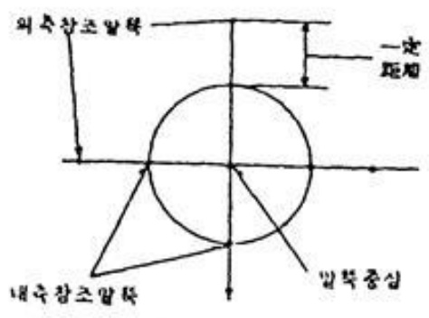  
참조말뚝의 배치  

# (3) 굴착  

# 1) 굴착시 주의할 사항  

$\textcircled{1}\mathsf{N}$ 치가 $0\!\sim\!4$ 정도의 연약한 사질토 및 실트질 사질토에서는 CASING TUBE 주변의 흙이연약화되어 설계단면보다 크게 굴착되는 경우가 있으며 특히 PEAT 층 등 극단적으로 연약한지반을 굴착할 때는 CASHG TUBE 가 지중에 의해 침하할 수 있으며 콘크리트 타설후CASING 을 인발하면 타설량이 설계량의 $1.5{\sim}2$ 배 정도로 단면이 확대되는 수가 있다.  

$\circled{2}$ 지하수위 이하의 사층 또는 자갈층을 굴착할 경우에는 공내수위를 유지하여 BOILING 현상과CASING TUBE 주위의 흙을 교란시키는 것을 방지하고 특히 상층의 두께가 5 m 이상일 경우에는요동압입시 CASING TUBE 주변이 물다짐되어 CASING 인발이 곤란하게 되는 수가 많다.  

$\textcircled{3}$ 구조물에 근접해서 시공할 경우에는 PILE 주변지반이 연약해지는 것을 방지하기 위해굴착기가 CASING TUBE 선단보다 앞서는 것을 가능한 피해야 한다.  

$\circled{4}$ 굴착중 지중으로부터 천연가스 분출에 충분히 주의해야 한다.  

$\circled{5}$ CASING TUBE 의 연결상태를 점검하여 요동압입 및 인발시 연결부가 분리되지 않도록 한다.  

$\circled{6}$ 말뚝 선단지반의 연약화 : 주원인으로는 굴착에 의한 지반응력의 해방과 굴착기의 충격,BOILING 현상 등이며 대책으로는 굴착중 공내수위 유지와 단단한 지층을 굴착할 경우HAMMER-GRAB 및 CHISEL 의 낙하고를 줄여 시공하고 필요시에는 BASE GROUTING 을실시하여 말뚝선단 지반을 보강할 수 있다.  

$\textcircled{7}$ 말뚝 주변지반의 연약화 : 주원인으로는 CASING SHOE 의 외경과 CASING TUBE 외경과의차이에 의한 공극과 CASING 압입보다는 굴착이 선행하여 공벽붕괴에 따른 공극, 굴착기의 충격및 진동, 느슨한 모래 지반에서 굴착시 간극수압의 상승에 의한 유효응력감소 등이며 대책으로는CASING 이 굴착보다는 가능한 앞서 나가게 하고 굴착중 충격 및 진동을 최소화하는 방법 외는없다.  

$\circled{8}$ 지지층의 확인 및 근입 : 굴착기로부터 배출되는 토사를 확인할 수 있기 때문에 지지층의확인은 굴착깊이 및 굴착속도를 참고하여 굴착토사와 지반조사자료률 비교하여 확인하기용이하며 관입깊이는 설계치와 지지층의 상황에 따라 변동될 수도 있지만 선단지지 말뚝에서는가능한 1.0m 이상 견고한 지반속에 관입시켜야 한다.  

(4) SLIME 제거  

현장타설 말뚝 시공에서는 말뚝저부와 지지층 사이에 침전물(SLIME)이 있으며 상부구조물의침하가 발생하는 등의 치명적인 결과를 초래하므로 어떤 방법으로든지 SLIME 은 제거되어야하며, SLIME 이 있는 상태에서의 콘크리트를 타설하게 되면, 말뚝의 지지력이 떨어지고 콘크리트속에 SLIME 이 혼합되기도 하며, 때로는 철근망을 밀어 올리는 등의 폐해가 발생된다. SLIME처리방법은 굴착완료 후 철망을 삽입하기 전에 처리하는 1 차처리와 콘크리트 타설직전에 하는2 차처리로 구분된다.  

일반적으로 SLIME 처리방법은 다음과 같은 방식으로 한다.  

$\curvearrowright$ SUCTION PUMP 방식 심도가 비교적 얕은 경우$\curvearrowright$ AIR LIFT 방식 심도가 깊고 처리량이 많은 경우$\curvearrowright$ SAND PUMP 방식 심도가 얕은 경우(15 m 이내)  

(5) 철근망 가공조립 및 설치철근망 작업시의 주의사항은 다음과 같다.  

$\textcircled{1}$ 철근망 가공은 설계도면 및 시방에 준해서 가공조립하고 심도가 깊을 경우의 가공조립은 운반및 건입심도를 고려하여 정하며, 연결은 충분한 이음길이를 가지고 수직성을 유지한 후 반생결속및 용접을 시행한다.  

$\circled{2}$ 철근망은 전체형상이 곧게 조립되어야 하므로 별도의 조립용 제작대를 만들어 조립한다.$\textcircled{3}$ 철근망 운반 및 건입을 위해서는 그림과 같이 비틀림이나 중앙부가 조여들지 않도록 한다.$\circled{4}$ 중심에 바르게 유지시키기 SPACER 가 필요하며  

철근피복유지 및 철근망을 굴착공 위해다음과 같이 철근 또는 철판을 사용하여 철근망에 부착한다.  

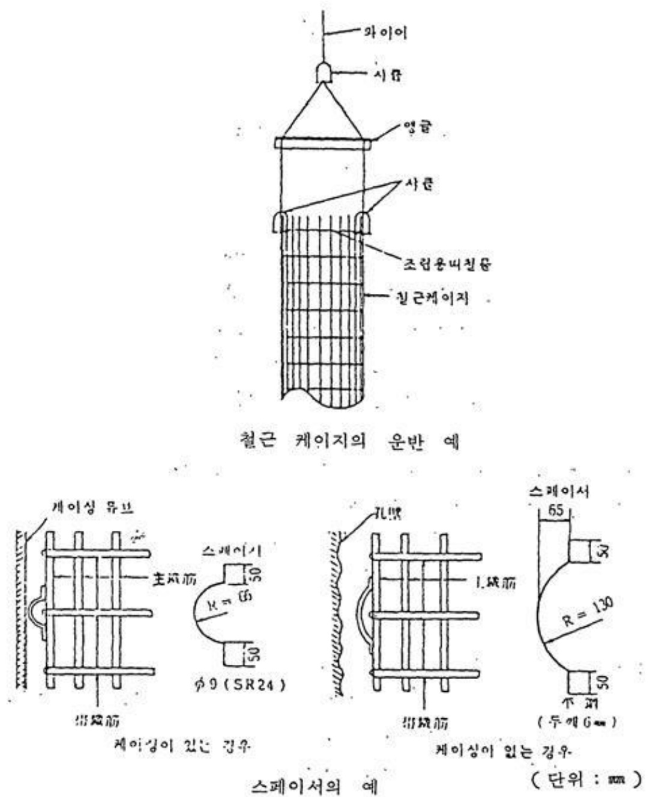  

$\circled{5}$ 철근망이 가벼워 콘크리트 타설시 밀어 올리는 힘에 의해 철근망이 뜰 우려가 예상되면 다음과같이 철근망 하부에 철판을 부착하여 시공하면 철근망이 뜨는 것을 방지할 수 있다.  

(6) 콘크리트 타설  

현장타설 말뚝의 콘크리트 타설방법은 트레미관에 의한 수중 콘크리트 타설에 의하며 주의점은다음과 같다.  

$\textcircled{1}$ 지시된 배합설계에 따라 배합하여 품질을 확보하며 특히 콘크리트는 재료분리 방지와 유동성을고려하여 Slump 18\~20 ㎝, 조골재의 최대입경은 25 ㎝로 하며 필요시 혼합재를 첨가하도록 한다.  

$\circled{2}$ 트레미관에 의한 콘크리트 타설에는 밑열림식과 PLUNGER 식이였으나 현재 대부분의현장타설에서는 트레미관만으로 초기 콘크리트 타설은 최대한 빠른 속도로 하며 하부의 일부Slime 을 띄우면서 계속 타설이 되도록 하고 있다. 콘크리트 타설은 완료시까지 계속 타설되어야하고 트레미관이 콘크리트 속에 2.0m 이상 묻혀 있도록 해야 한다.  

$\textcircled{3}$ 트레미관은 일반적으로 내경이 25 ㎝ 길이는 1∼5m 의 것을 사용하는데 연결부위에 물이 새는일이 없도록 해야 한다.  

$\circled{4}$ 콘크리트 타설시에는 타설량과 계산상의 타설깊이 및 실제 타설깊이를 계속적으로 체크하여문제점에 대처토록 하며 특히 Casing Tube 체적만큼 콘크리트면이 내려가므로 주의를 요한다.$\circled{5}$ 본 공법에서는 콘크리트 타설시에 Casing Tube 의 인발이 곤란 또는 불가능하여 시공에막대한 지장을 미치는 경우가 있다. 일반적인 원인으로는 주변마찰력이 기계의 요동 인발력보다크게 된 경우와 기계 자체의 Capacity 가 부족할 경우에 한한다.  

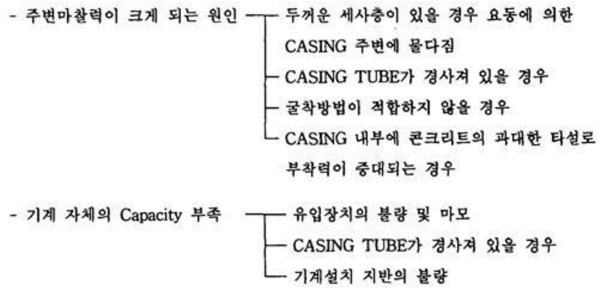  

(7) 말뚝두부 정리 및 되메우기  

현장타설 말뚝에서 트레미관에 의한 CON'C 를 타설하고 일부 SLIME 과 레이탄스가 말뚝두부에형성된다. 따라서 콘크리트 타설에서는 설계높이보다 50 ㎝정도 높게 타설하고 후에 Bracker등으로 두부정리를 하게 되므로 콘크리트 타설시 말뚝두부의 높이를 정확히 하는 일은  

후속작업의 시공 능률 측면에서 볼 때 중요하다. 아울러 말뚝두부는 Footing 높이 및 토피에 따라지표면보다 낮으므로 이 부분을 방치해 놓으면 추락사고나 주변지반을 이완시키므로 콘크리트타설 후 양생이 어느 정도 진행되고 난 후 Hole 내에 되메우기를 해야 한다.  

# VII. 프리드릴(PREDRILL)에 의한 말뚝 기초공법  

각주 007) 김호일, "농공기술", 6 권 3 호, pp.147-159, 1989  

# 1. 개요  

(1) 공법의 배경  

기초지반의 지지력은 상부구조물 특성, 지반의 강도와 기초의 크기 및 기초의 근입 등에 의해결정되는데 기초에 전달되는 하중이 대단히 큰 경우 이를 지지하기 위해서는 기초가 깊게근입되어야 한다. 그러나 기초전체를 깊게 하는데는 많은 공사비가 필요하기 때문에 말뚝공법의도입이 필연적이댜. 말뚝공법은 강성이 큰 강재나 콘크리트, 목재 등을 매우 단단한 층에관입시켜 기초가 지지되도록 하는 것으로 지층의 토입자 구성이 매우 중요한 검토사항이다. 즉중간토층에서 말뚝의 관입이 용이하여야 하고 말뚝 선단부의 지지력이 확실하여야 한다. 그러나하천 인접유역에서는 자갈, 호박돌 층이 두껍게 퇴적되어 있는 경우가 많아 타격에 의한 말뚝의관입이 불가능하며 또 모래, 자갈층은 세굴작용이 일어나므로 선단지지층으로 하기가 위험하다.따라서 이러한 지층에서는 대구경의 우물통 기초를 하거나 오거장비 등에 의해 미리천공(Predrill)하여 현장에서 콘크리트를 치는 현장말뚝(Board Pile)공법 등이 사용되어 왔다.그러나 이러한 공법들은 말뚝의 크기에 비해 비교적 침하량이 크게 나타나고 기초지반이이완되며 말뚝 주면마찰이 크게 감소되어 지반의 지지력이 부족하여 말뚝본체의 강도를 충분하게사용하지 못함으로써 비경제적이 되기 쉽다.  

본 공법은 이러한 단점을 보완한 것으로 지층을 오거로 천공할때 원지반에 시멘트 풀(CEMENTPASTE)을 주입하여 교반함으로써 양생후에는 주면지층의 강도가 증대되어 말뚝주면의 마찰력을크게 증가시키고 아울러 선단부에서도 교반된 소일 시멘트(SOIL CEMENT)가 완전히 충진되어말뚝의 침하량을 최소화시키는 공법이다.  

본 공법은 1968 년 일본의 기초기술연구소에서 저소음, 저진동공법으로 고안되어 시험시공된 5 년후에는 말뚝공사에 상당한 비중을 차지하게 되었다. 우리나라에서는 1980 년 초에 실적이 있으나부진하였으며 1987 년 한강변에 신축한 초고층(지상 21 충) 아파트에 대량으로 사용되었다. 그이후는 하천변의 말뚝타입에 어려움이 있는 토질조건에서 구조물의 기초공법으로 채택되기도하고 교량의 기초에도 많이 사용되고 있다.  

(2) 시공공법 및 효과  

오거장비로 소요말뚝구경보다 직경이 10 ㎝정도 크게 천공하며 굴진시 오거빗트를 통해시멘트풀과 벤토나이트를 혼합한 용액을 주입하여 공벽을 보호하면서 설계심도까지 굴진한다.지지층 부근에서는 부배합의 시멘트 풀을 주입하여 원지반토와 충분히 교반함으로써 확장된선단지지층으로 사용할 수 있다. 교반작업이 완료되면 기성말뚝을 자중에 의해 공의 내부에삽입시킴으로써 말뚝 선단부 1.0-1.5m 을 해머에 의해 타입시킴으로써 말뚝 선단부가 이완되지않고 오히려 더욱 조밀해지도록 하는 효과를 얻는다. 또한 말뚝의 선단이 개구식(OPEN SHOE)인경우 말뚝내부에도 소일 시멘트가 충진되어 말뚝의 유효단면적이 확대됨으로 말뚝자체의강성에도 더욱 양호한 효과를 주며 말뚝에 가해지는 충격응력이 작아 품질관리면에서도 우수하다.뿐만 아니라 소음 및 진동이 작아 도심지에서의 작업도 가능하며 지지층까지의 관입이 확실하여하자발생의 요인이 거의 없다.  

(3) 시공장비의 조합  

본 공법에 사용되는 오거장비의 특징은 다음과 같다.$\textcircled{1}$ 다축오거기로서 일반적으로 삼축까지 사용이 가능하나 선단지층이 매우 단단한 말뚝공사의경우에는 단축으로 시공함으로써 풍화대층(잔적토 및 풍화암)까지 천공이 가능하다.  

$\circled{2}$ 오거의 회전은 역회전이 가능하여 굴진과 교반작업의 구분시공이 용이하다.  

$\textcircled{3}$ 스크류(SCREW)는 토사와 시멘트 풀을 교반시키는 봉형으로된 교반날개와 혼합토사를 상하로이동시키는 나선형으로된 교반날개로 구분되어 있고 토층에 따라 일반용, 호박돌층용, 점성토층용등 다양하여 토층에 따라 선택사용이 가능하다.  

$\circled{4}$ 항타장비는 일반적으로 많이 사용되는 디젤해머(KOBEK-25)나 드롭해머 중에서 말뚝 중량에따라 적절한 것을 선택하여 사용하고 있다.  

(4) 소일시멘트의 강도  
시멘트 풀 주입에 의해 만들어지는 소일시멘트의 일축압축강도는 토질특성에 따라 개략 다음과같다.  
$\textcircled{1}$ 점성토 : 7 :7\~ 20 ㎏f/㎠  
$\circled{2}$ 사질토 : 20 ∼ 30 ㎏f/㎠  
$\textcircled{3}$ 사력토 : $60~\sim~120~\mathsf{k g}~\mathsf{f}/\mathsf{c m}^{2}$  

# 2. 설계  

(1) 설계조건   
1) 말뚝( $\Phi$ 600 ㎜, B 형)   
$\textcircled{1}$ 직경 600 ㎜   
$\circled{2}$ 두께 : 130 ㎜   
$\textcircled{3}$ 콘크리트 강도   
압축강도 : $0\_\{\sf c k\}=500\ k g\ {\sf f/c m^{2}}\ (28\equiv)$   
인장강도 : σ _{t} = 500 ㎏f/㎠  

# 허용압축강도 0 6 -04 -200 Agf/ car  

$\circled{4}$ 축방향하중   
극한하중 : P_{ult} $=734.3\dag\mathrm{f}$   
허용하중 : P_{a} $=217.7$ tf   
$\circled{5}$ 휨모멘트   
극한모멘트 : M_{ult} $=49.56$ 9tf-m   
허용모멘트 : $\mathsf{M\_}\mathsf{a}\mathsf{j}=24.696\mathsf{t}\mathsf{f}\mathsf{-m}$   
2) 말뚝길이   
$\ell=20\!\sim\!26\mathfrak{m}$ , 평균길이 : 22m   
3) 설계하중   
연직하중 : 150tf/본   
수평하중 : 10tf/본   
(2) 지지력계산   
1) 지반조건  

지층구성은 두꺼운 풍화대층을 모래, 자갈로 형성된 층적토가 피복하고 있으며 그 상부는도시쓰레기가 두껍게 덮혀 있는 지층으로 주상과 토질상수는 그림-1 과 같다.  

2) 지지력 계산 가) 주면마찰력  

$Q_{s}\!=\!\frac{1}{2}\,{\cal K}_{s}\cdot\,P_{d}\cdot\,\tan\,\delta\,\,\,\cdot\,\,{\cal A},$ 여기서 Ks 토압계수Pd 유효토피하중tf/m동마찰저항각As 말뚝주면적m  

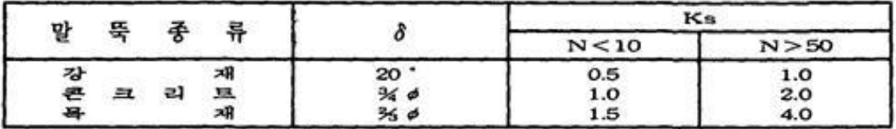  

주 여기서 는 주변흙의 전단저항각  

$\textcircled{1}$ 매립층  

$\Phi=\!25^{\circ}$ , $\mathsf{N}$ 치 $=10/30\ 01$ 므로$\delta=\,3/4(25)\div18^{\circ},\,\mathsf{K s}{=}1.0$층중심에서의 $\mathsf{P d}=1.8(5.5)=9.9\mathsf{t f}/\mathsf{m}^{2}$  

한편 말뚝주면적은 소일시멘트로 인해 확장되지만 설계에서는 이를 무시하는 것이 안전상바람직하다.  

$A\&=11.0\cdot\pi\cdot0.6{=}20.73$  

Qsl=1/2 ×1×9.9×tan18˚×20.73=33.3tf  

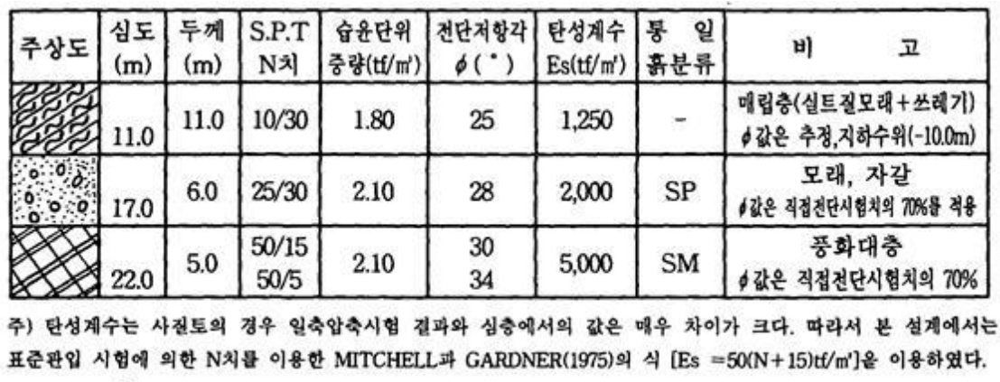  
그림-1 토질주상도와 토질상수  

$\circled{2}$ 모래 자갈층(6m)  

# $\Phi=28^{\circ}$ $N{=}25/30\ 01$ 므로  

# $\delta=\!3/4\!\times\!28\!=\!21\!^{\circ}$ ˚ $k s{=}1.35$  

층중심에서의 유효토피압(Pd)은 McCARTHY 에 의하면 느슨한 모래에서는 말뚝직경의 10 배,조밀한 모래는 말뚝직경의 20 배 이상의 길이에서는 더 이상 증가되지 않는 것으로 본다. 따라서본층에서는 중간정도의 상태로 보고 15D 심도까지만 고려한다.  

그러므로 $\mathtt{P d=15}\!\times\!0.6\!\times\!1.8\!=\!16.2\mathtt{t f}/\mathtt{m}^{\ast}$ $\partial\cdot{\bf\partial}_{\bf A}s{=}6^{\circ}\cdot\pi\cdot0.6{=}11.31m^{*}$ Qs2-I \*135X 162X tan21 \*113] $=$ 475t  

$\textcircled{3}$ 풍화대층  

$\bar{\mathfrak{6}}=22.5^{\circ}$ , $K s{=}2.0$유효토피압(Pd)은 조밀한 토층이므로 20D 의 심도까지 고려하면 $20\mathsf{D}{=}12\mathsf{m}$ 지하수위 이하)  

$$
\mathsf{P d}{=}10.0{\times}1.8+1.0{\times}(1.8-1.0)+1.0{\times}(2.1-1.0)=19.9\mathsf{f f}/\Pi^{\prime}
$$  

$A s{=}5\cdot\pi\cdot0.6{=}9.42$ ㎡  

Q_{S3}=1/2×2.0×19.9×tan 22.5˚×9.42=77.7tf  

$\circled{4}$ 총주면마찰력  

$$
\mathsf{O}\_{\{\mathsf{S}\}}=\mathsf{O}\_{\left\{\mathsf{S}\right\}}\+\mathsf{O}\_{\left\{\mathsf{S}\right\}}\+\mathsf{O}\_{-}\{\mathsf{S}\mathsf{2}\}+\mathsf{O}\_{-}\{\mathsf{S}\mathsf{3}\}=33.3+47.51+77.7=158.5\mathsf{t h}\
$$  

나) 선단지지력(BASE RESISTANCE)  

Ob-NaPd Ab 여기서 No 지지력계수 Pd: 선단에서의 유효토피하중tf/m Ab 를 말뚝선단부의 단면적m  

파일 선단부의 지지력계수는 TERZAGHI 와 PECK, MEYERHOF, BEREZANTSEV 등이제안하였으나 일반적으로 TERZAGHI 와 PECK 치는 작고 MEYERHOF 치는 과다하여BEREZANTSEV 치가 타당한 것으로 판단된다. (VESIC, 1967)  

$\Phi=34^{\circ}\mathrm{D}\_\{\mathrm{Z}\}/\mathrm{B}=22/0.6\div3701$ 므로  

$N_{9}\!\div\!40$  

# (그림-2 참고)  

유효토피압(Pd)은 조밀한 토층이므로 $_{20\times}$ (말뚝직경)의 심도까지 고려하면(20D＝ 12m, 지하수위하)$9{\mathsf{d}}{=}10.0{\mathsf{\Omega}}{\times}1.8+1.0{\mathsf{\Omega}}{\times}\ (1.8-1.0)+1.0{\mathsf{\Omega}}{\times}(2.1-1.0)=19.9\mathsf{\Omega}{\Omega}{\times}{\mathsf{I}}{\cdot}\mathsf{I}{\cdot}\mathsf{I}$  

$\mathsf{A}\mathsf{b}=\mathsf{\Pi}/4\!\times\!0.6^{2}\!=\!0.283$ ㎡  

그러므로 26 $=$ NqPd Ab$\,\,=\!40\!\times\!19.9\!\times\!0.283\!=\!225.3\mathrm{tf}(796\mathrm{tf}/\mathrm{m}^{\circ}\!<\!1,000\mathrm{t}/\mathrm{m}^{\circ}\mathrm{~O.K})$  

상기 식에서 말뚝의 선단부 단면적은 기성 말뚝이 개구식(Open shoe)이라도 선단부 소일시멘트덩어리가 원지반에 비해 강도가 크므로 원지반의 침하에 비해 소일시멘트의 변형은 미소하다.그러므로 말뚝 중간부에서의 국부전단은 고려하지 않아도 된다. 또 선단부 지층의 지지력은아무리 조밀한 토질이라도 1,000tf/㎡이상은 사용하지 못하도록 Tomlinson(1977)이 제안하고 있다.  

다) 극한지지력  
$\mathsf{O\_{\{p\}}}=\mathsf{O\_{\{S\}}}+\mathsf{O\_{\_{b\}}}=158.5+225.3=383.8\mathsf{t f}/\mathsf{^\star}$ 본  
라) 말뚝의 허용지지력  

$0\_\{a1\}=1/2.5\cdot383.8=153.5\dag$  

# $\mathsf{O\_\{a2\}}=\mathsf{O s\_1/3O b}=158.5+1/3\times225.3=233.6\mathrm{tf}>\mathsf{O\_}\{a1\}$  

그러므로 허용지지력 $\mathsf{Q}\_\{\mathsf{a}\}$ 는 153.5tf 으로 한다.  

$$
\therefore0\vert a\vert\}=153.5\mathrm{tf}>150\mathrm{tf}(\mathrm{OK})
$$  

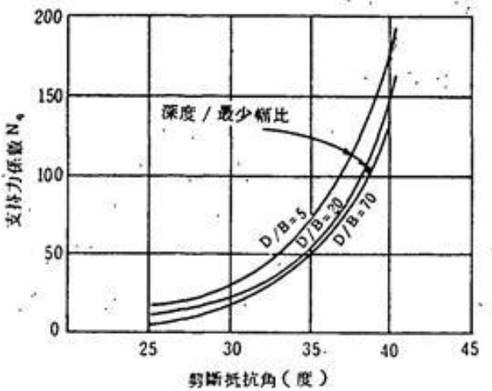  

그림-2 지지력계수(Berezantsev's Value)  

(3) 수평하중 작용시 말뚝단면검토  

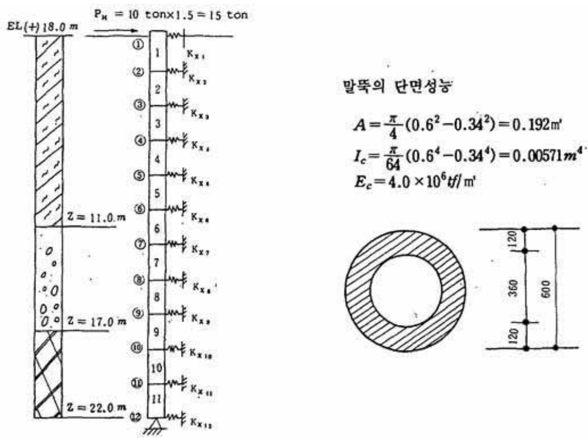  
그림-3 말뚝해석 단면도  

1) 지반의 반력계수(Soil spring constant)계산  

$$
K~^{'}~,~~=~{\frac{1.3}{R}}~\cdot~^{12}\sqrt{{\frac{E_{s}D^{4}}{E_{c}I_{c}}}}~\cdot~{\frac{E_{s}}{1-\mu^{2}}}~~~(\mathrm{Vesic^{\prime}s}~\cdot\pm\pm\mathbb{1})~~~~^{2}\ .
$$  

가) 매립층  

$$
E_{c}I_{c}=4.0\times10^{6}\times0.00571\,{=}22,840\,{t}f/\mathrm{m^{\prime}}
$$  

$$
K^{\prime}=\frac{1.3}{0.6}\,\cdot\,^{12}\sqrt{\frac{1.250(0.6)^{4}}{22.840}}\,\cdot\,\frac{1.250}{1-(0.3)^{2}}=1.970t/m^{3}
$$  

나) 모래자갈층  

$$
\begin{array}{c}{{E_{s}=2,000t/\mathrm{\Omega}\mathrm{m}^{\circ},\mu=0.3}}\\ {{K^{\mathrm{~\cdot~}}=\frac{1.3}{0.6}\,\cdot\,\mathrm{\Omega}^{\mathrm{1}}\sqrt{\frac{2.000(0.6)^{4}}{22.840}}\,\cdot\,\frac{2.000}{1-(0.3)^{2}}=3.279t/m^{\circ}}}\end{array}
$$  

다) 풍화대층  

$$
E_{s}=5.000t f/\pi^{\prime},\mu=0.3
$$  

$$
K^{\prime}=\frac{1.3}{0.6}\cdot\sqrt[12]{\frac{5.000(0.6)^{4}}{22.840}}\cdot\frac{5.000}{1-(0.3)^{2}}=8.847\cdot\!t\!f/\mathrm{~m}^{*}
$$  

이 반력계수는 각 토층의 대표치로 실제로는 심도의 증가에 따라 커지는 포물선을 그리게 된다.  

2) 응력해석  

말뚝의 응력은 기초와 말뚝 두부의 연결이 강결(Fix)인 경우와 힌지로 하는 경우에 대해 각각다르며 강결로 접합하는 것이 두부의 구속모멘트와 전단력이 작게 나타나 말뚝 단면에 유리하며응력해석은 Stiffness matrix 해석에 의해 전산처리한 결과 그림-5 과 같이 수평하중에 의해 말뚝에발생하는 최대 휨모멘트 $\mathsf{M\_{\{0\}}=13.65t/m\;\;O|\;}\mathsf{Z}|$ .  

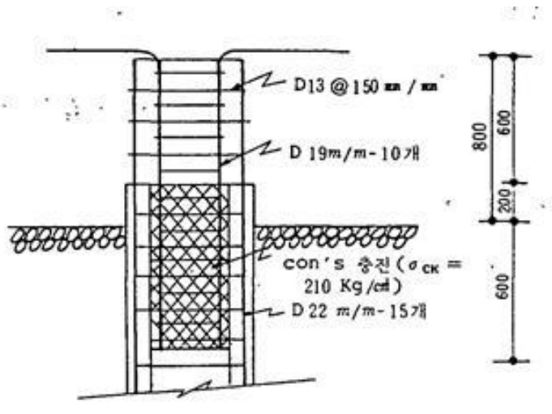  
그림-4 말뚝두부의 접합(강결방법)  

또한 말뚝 운반시 작용하는 최대 휨모멘트는들어올럴때 $:(22\mathrm{m})^{M_{\mathrm{max}}}\begin{array}{l}{{=0.043~\mathrm{\it~\omega}\cal L^{2}}}\\ {{=0.043\times0.\ 45\times22^{2}\mathrm{=9.4~\mathrm{~\it~t~}\cdot\mathrm{\it~m}}}}\end{array}$따라서 최대 모면트 $=13.65\dot{t}\cdot m{<}24.696\ t\cdot m{\ }O.K$  

(4) 말뚝의 침하량 검토  

말뚝의 침하는 말뚝축하중(Shaft load)에 의한 침하, 말뚝자체의 탄성변위 및 장기간에 걸친압밀침하로 구분된다.  

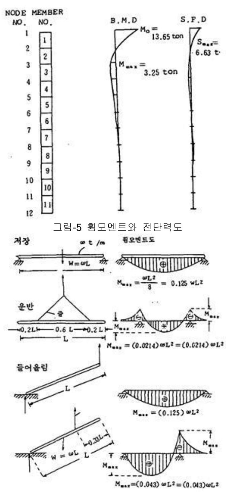  
그림-6 말뚝을 들어올릴 때 발생하는 휨 모멘트  

1) 축하중에 의한 침하전체하중에서 축이 받는 하중은  

$$
P_{s}\!=\!P(1-\beta)
$$  

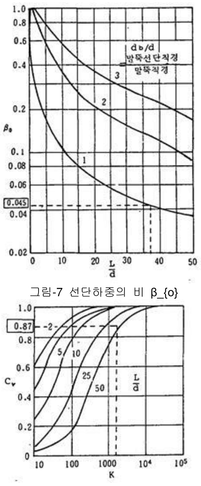  
그림-8 선단하중의 압축보정계수 C_{k}  

# $P\!=\!225\#$ 판하중 $=1.5\times$ 설계하중  

$\scriptstyle{L/\partial=22/0.6=37^{\circ}}$ |므로 그럼7에서$\therefore B_{0}=0.045$$K{=\ E_{\rho}/E_{s}\cdot R_{A}:}$ 말뚝강성계수$\begin{array}{r l}&{E_{\rho}\gets4.0\times10^{6}t/m^{\prime}}\\ &{E_{s}\gets1/22(1,250\times11+2,000\times6+5,000\times5)\gets2,300t/m^{\prime}}\\ &{R_{A}\gets1(=A_{\rho}/\pi\,d^{2}/4=1)}\\ &{\colon K\=\frac{4\times10^{6}}{2,300}\times1\neq1,750}\end{array}$그림-8에서 $C_{k}\!=\!0.87$  

$\cup\{\mathbf{s}\}\!\equiv\!0.3$ 이면 그림-9 에서 $C\_\{\cup\}{=}0.79$ 일때  

$$
\upbeta=0.08{\times}0.87{\times}0.79=0.03
$$  

따라서, 본 말뚝의 경우는 축하중이 지배적이다.  

# ${\sf P_{\_}}\{{\sf s}\}=225(1\!-\!0.03)=218\cdot$ tf  

축하중과 침하관계를 선형이라고 가정하면 침하량은 다음과 같다.  

$$
\rho_{\varepsilon}=\frac{I}{E_{s}\,d}\,\cdot\,\frac{P_{s}}{(1-\beta)}
$$  

I : 말뚝의 변위영향인자로써$1=1\textunderscore\{0\}\mathsf{P\textunderscore\{k\}\mathsf{\textmd{R}\textunderscore\{h\}\mathsf{\textmd{R}\textunderscore\{v\}}}}$$1\_\{0\}$ : 침하영향계수  

# (그림-10)  

$\mathsf{L}/\mathsf{d}=22/0.6=37\ 0|$ 므로  

$1\_\{0\}=0.052$  

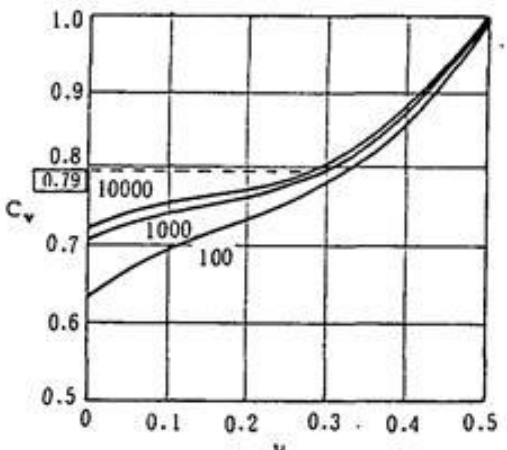  
그림-9 선단하중의 포아손비보정계수 ${\sf C}\_\{\sf v\}$  

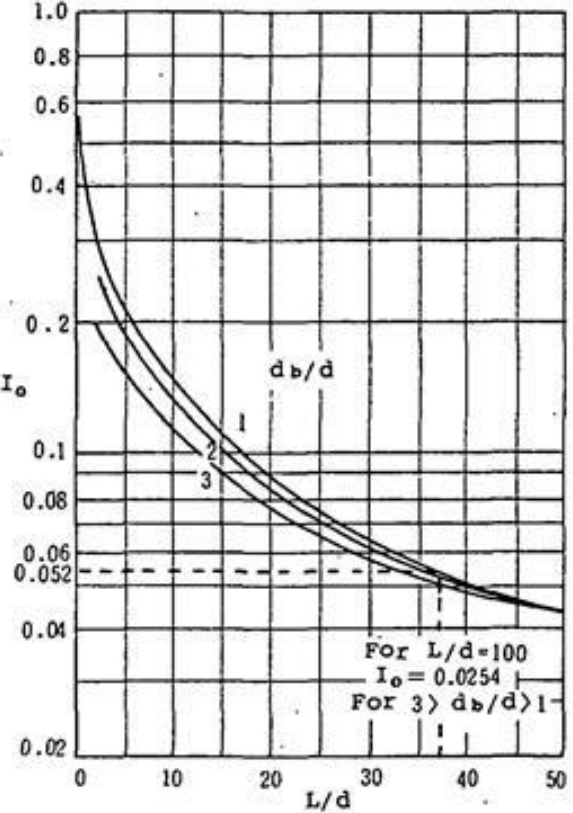  
그림-10 침하영향계수 I_{o}  

나) R_{k} 침하의 압축보정계수  

$\kappa\,\div1\,,750,\,\lfloor/{\mathsf{d}}{=}37\ 0\rceil$ 므로 $\mathsf{R\_\{k\}}=1\,.20$  

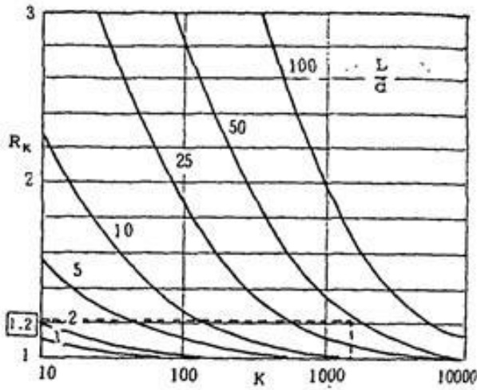  
그림-11 침하의 압축보정계수 R_{k}  

다) R_{k} 침하의 심도보정계수  

h : 암반층까지의 심도( $30\mathsf{m}$ 일때)$L/{\mathsf{d}}\!\equiv\!37$ , $h/1=30/22\div1.401$ 므로 $\mathsf{R_{-}}\{\mathsf{k}\}\!\!\equiv\!0.76$  

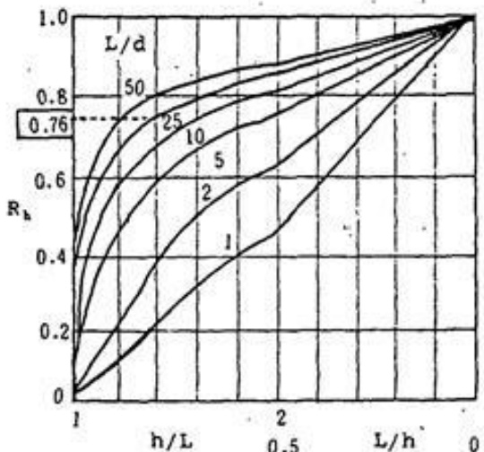  
그림-12 침하의 심도보정계수 R_{k}  

라) R_{v} 침하의 포아손비 보정계수  

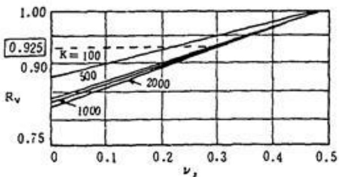  
그림-13 침하의 포아손비 보정계수 $\mathsf{R\_}\{\mathsf{v}\}$  

$\vee\_{\{3\}}\!\doteq\!0.3,\k\!=\!1,\!750\ 0|$ 므로 $\mathsf{R\_\{v\}}\mathrm{=}0.925$  

$\therefore1-1-\{0\}\mathsf{R}-\{\mathsf{k}\}\mathsf{R}-\{\mathsf{h}\}\mathsf{R}-\{\mathsf{v}\}=0.052\mathsf{x}1.20\times0.76\times0.925=0.044$따라서 침하중에 의한 침하량  

$$
\begin{array}{r l}&{\rho_{\varepsilon}=\frac{I}{E_{\varepsilon}\cdot d}\,\cdot\,\frac{P_{\varepsilon}}{\left(1-\beta\right)}}\\ &{\qquad=\frac{0.044}{2.300\times0.6}\times\frac{218}{\left(1-0.03\right)}}\\ &{\qquad=0.0072m=0.72\mathrm{cm}}\end{array}
$$  

2) 선단하중에 의한 침하  
선단하중 : $P\_{\{\mathsf{b}\}}=\beta\,\mathsf{P}=0.03\times225\div7.0$ tf  
$\rho\_\{b\}=|/\mathsf{E\_\{s\}d\cdot P\_\{b\}}/\textrm{\r{\r}}|\r\r\beta$  
여기서 $1=1\textunderscore\{0\}\textcircled{1}\textcircled{\times}\{\mathsf{k}\}\mathsf{R}\textunderscore\{0\}\mathsf{R}\textunderscore\{\mathsf{v}\}$  
R_{b}는 그림-14 에서 구한다.  
$E_{\_}\{b\}/E_{\_}\{s\}=5,000/2,300\div2.2,\,\mathsf{K}=1,750$  
$L/{\mathsf{d}}=25(\exists\,{\Xi}{\cdots}\,14({\mathsf{C}}))\;{\mathsf{R}}_{\_}{\{\mathsf{b}}\}=0.95$  
$L/{\mathsf{d}}=50(\square\Xi\!\!\!\cdot\!\!14(\mathsf{b}))\;\mathsf{R}\_{\mathsf{b}\}=0.99$  
이므로 $L/{\mathsf{d}}\!\equiv\!37\ {\mathsf{Q}}|$ 본말뚝의 경우 $\mathsf{R\_\{b\}}=0.97$  

따라서 $\vert=0.052\times1.20\times0.97\times0.925=0.056$선단하중에 의한 침하량은  

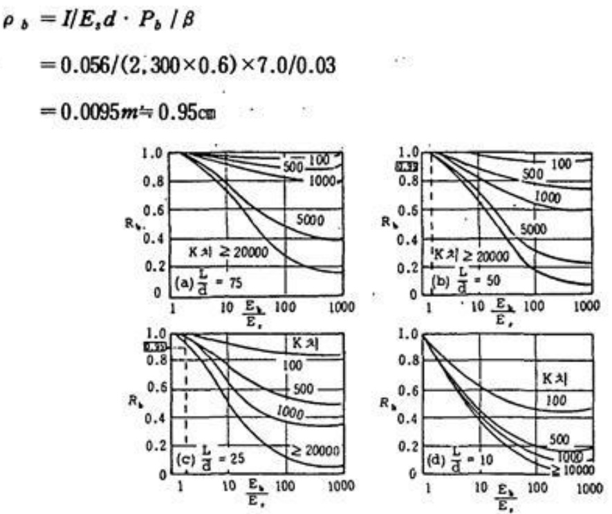  
그림-14 침하의 변형보정계수 R_{b}  

3) 말뚝자체의 탄성변위  

$$
{\begin{array}{r l}{\triangle\rho}&{\rho=[\;\;P_{b}-{\frac{P_{s}\;\,\beta}{(1-\beta)}}\;\;]\,\mathrm{~\boldmath~\cdot~}{\frac{L}{A_{s}\;\,E_{c}}}}\\ &{=[\;\;7-{\frac{218\times0.03}{(1-0.03)}}\;\;]\,\mathrm{~\boldmath~\times~}{\frac{22.0}{0.192\times4.0\times10^{6}}}=0.00007\;m=0.0007\infty}\end{array}}
$$  

4) 압밀침하  

표준관입저항 N 치 $>50~0\,|$ 므로 무시한다.  

5) 전체 침하량  

$$
\rho~=~\rho_{-}\{\bf s\}~+~\rho_{-}\{\bf b\}~+~\triangle\rho~=~0.72+0.95+0.0007=1.67~\triangleup\eta
$$  

이므로 말뚝주변에 소일시멘트를 충분히 확산시켜야 한다.  

# 3. 시공  

(1) 시멘트풀의 배합 및 사용량  

배합 및 사용량은 시멘트풀의 주입목적에 따라 다르며 굴진대상 토층의 토질특성에 따라 다소차이가 있으므로 실제 시험시공을 통하여 결정하는 것이 합리적이다. 다음은 시험 시공으로산출된 배합 및 사용량이다.  

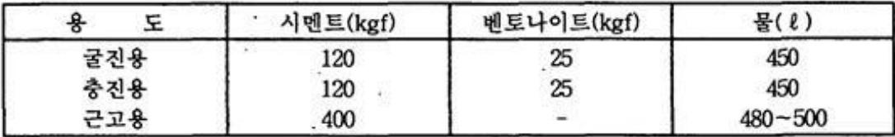  
(2) 작업순서 및 소요시간  

실험시공에서 나타난 작업순서별 소요시간은 다음 표-2 와 같다.  

(3) 말뚝재하시험  

말뚝의 지지력을 검증하기 위해 시공된 말뚝중 임의로 선정하여 시공후 30 일 만에 KSF2245,ASTM 1143-81 규정에 의하여 재하시험을 실시하였다.  

표-2 각 작업에 따른 소요시간  

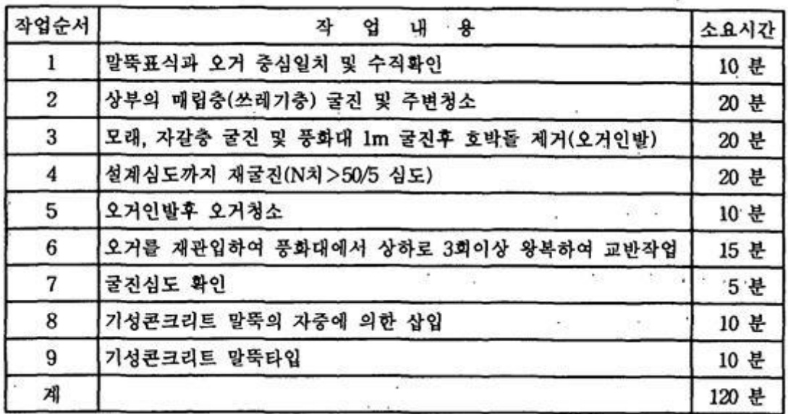  

1) 재하방법  

하중은 콘크리트 블록을 제작하여 실재하방법을 채택하였으며 2 사이클 방식으로 재하하였다.  

가) 제1 사이클(설계하중 150tf)  

0, 28.125, 56.375, 112.5, 140.625, 150, 112.50, 56.25, 0tf  

나) 제2 사이클(시험재하 225tf)  

0, 28.125, 56.25, 84.375, 112.5, 140.625, 150, 168.75, 196.875, 225, 150, 112.5, 56.25, 0tf  

재하 지속시간은 1 시간사이로 하며 시험말뚝의 변위가 1 시간에 0.25 ㎜이상 발생하지 않는경우에는 다음 단계의 하중을 재하하였다. 또 최대하중에서는 48 시간을 지속하되 12 시간 동안의변위가 시잔당 0.25 ㎜이하이면 제하하였다.  

2) 재하시험성과분석  

측정된 말뚝의 침하량은 설계하중의 1.5 배인 225tf 재하시 최대 4.51 ㎜로 나타났으며잔류침하량은 0.95 ㎜로 나타났다.  

또한 P-S, log P-log S, S-log 그래프에서 지반이나 말뚝의 항복점은 나타나지 않아 지지력은충분한 것으로 판단되었다. 또 하중-침하량 관계 그래프를 검토해 보면 침하량 3.25 ㎜, 하중  

180tf 까지는 선형상태를 유지하므로 본 말뚝의 주면에서 발생되는 마찰지지력은 180tf 으로추정되며 설계시 추정한 158.5tf 과 거의 일치되고 있다.  

180tf 이상의 하중에서 발생되는 선단부 침하량은 4.51-3.25/225-180=0.028 ㎜/tf 비율로일어나므로 책대침하량이 15 ㎜ 되려면  

$$
P=225+{\frac{15-4.51}{0.028}}=600~\#
$$  

의 하중이 작용되 $\uptheta\uptheta\upmu$ 한다. 따라서 안전율 3 을 고려하면  

$P\_\{a\}=600\div3=20001$ /본 $>$ 150tf/본 이므로 안전하다.  

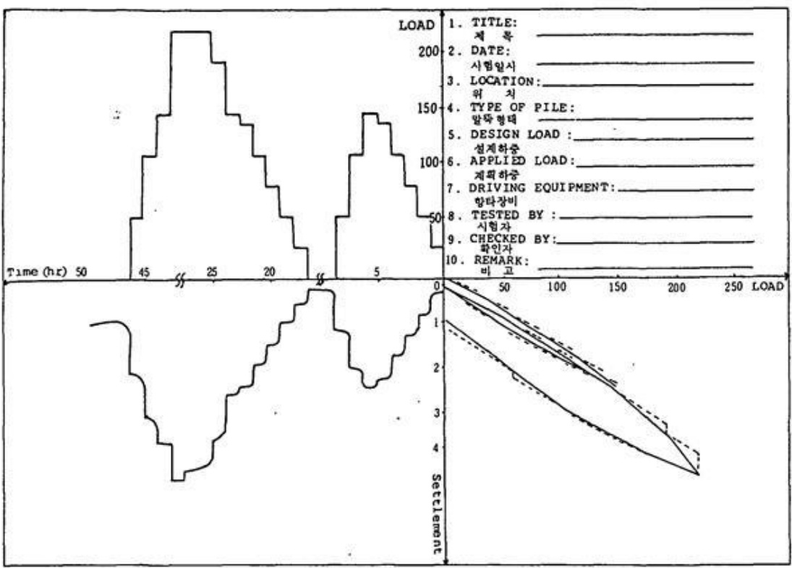  
하중시간-침하관계도  

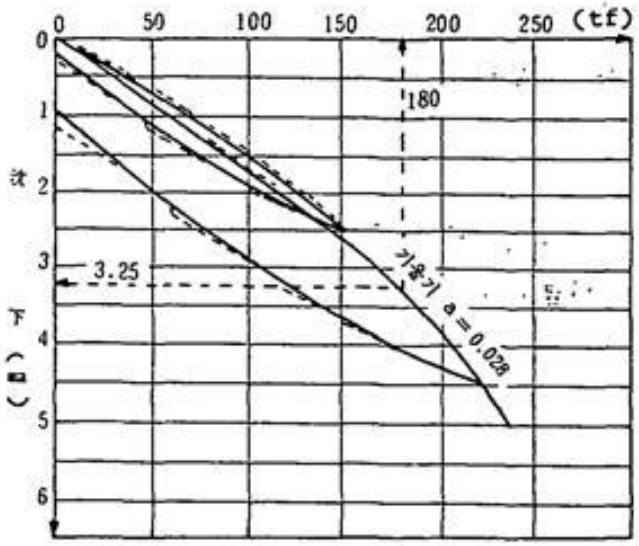  
6 말뚝재하시험 성과도  

그림-15 말뚝재하시험에 의한 주면마찰력의 추정  

(4) 시공시 주의사항  

1) 천공  

$\textcircled{1}$ 천공오거는 설계심도 부근 ±5m 에 50 ㎝마다 표시를 하여야 하며 능력은 120HP 이상이어야한다.  

$\circled{2}$ 말뚝의 시공기점에 설치된 표지와 오거의 중심을 정확히 일치시킨후 오거가 수직인지를확인하여야 한다.  

$\textcircled{3}$ 천공은 PC 말뚝직경보다 100 ㎜ 이상 큰 직경으로 하며 시공후 중심말뚝과 설계지점과의오차가 100 ㎜이내야 한다.  

2) PC 콘크리트말뚝  

$\textcircled{1}$ PC 말뚝에 사용된 콘크리트는 재령 28 일 압축강도가 500 ㎏/㎠ 이상 되어야 한다.  

$\circled{2}$ 말뚝의 이음은 전둘레에 4 군데 이상 용접해야 하며 이음강도는 설계강도 이상이고 본체전강도의 $75\%$ 이상 되어야 한다.  

3) 소일시멘트  

$\textcircled{1}$ 시멘트풀은 굴진용, 충진용, 근고용으로 구분하여 배합하여야 한다.  

$\circled{2}$ 근고용 시멘트풀은 천공하부 2m 구간에 한하여 사용되며 소일시멘트1 ㎡ 당 시멘트는 약$400~\mathrm{kg}$ , 물은 $480\!\sim\!520\ell$ 정도로 배합한다.  

4) 말뚝삽입  

$\textcircled{1}$ 1 차로 말뚝자중에 의해 삽입되도록 하고 이때 허용오차는 2.5m 이내로 한다.  

$\circled{2}$ 허용에 의한 삽입이 완료되면 항타장비에 의해 말뚝을 허용최종오차(1.0m) 이내까지 타입한다.  

# 4. 결론  

본공법은 대형오거장비의 개발에 따라 시공성이 양호하며 타입말뚝의 장점과 확실한 지지층까지말뚝을 근입할 수 있는 현장말뚝의 장점을 가지고 있으며 또한 경제성으로 볼때 말뚝자체의강도이상의 충분한 지지력 확보가 가능한 공법이므로 앞으로 계속 확대 보급될것으로 예상된다.그리고 본공법은 적합한 지층은 확실한 지지층이 되는 풍화대 또는 기반암을 조밀한 사력층이두껍게 피복하고 있어 타입말뚝으로는 사력층의 통과관입이 불가능한 지층이며 투입말뚝으로도말뚝자체의 강도에 해당되는 지지력이 확보될 경우는 본공법이 비경제적이다.  

# VIII. 다짐모래말뚝공법  

각주 008) 이장오, "토지개발기술" 4 권 2 호, pp.17-22, 1991  

# 1. 머리말  

연약지반의 계량공법은 개량의 목적과 대상지반 등에 따라 원리가 다른 여러가지 공법이 있다.  

다짐모래말뚝(Sand Compaction Pile)공법은 연약지반의 전단강도를 증가시키고 압밀을 촉진시키며지반의 액상화를 방지하기 위하여 널리 사용되고 있는 공법이다. 우리나라에서는 1984 년광양제철소 연약지반개량공사에서 처음으로 적용된 공법이며, Sand Drain 공법에서 모래말뚝(SandPile)을 조성할 때 사용하는 시공기계와 동일한 기계로서 연약지반속에 다짐모래말뚝(SandCompaction Pile)을 조성하게 된다. 연약지반을 대상으로 하는 공사에 있어서는 일반적인지반에서보다 더 상세한 설계와 철저한 시공관리를 실시한다. 그러나 설계시 예측한 지반의거동과 성상의 변화는 실제와 상당한 차이가 있다. 이것은 지반이 아주 복잡하게 구성되어 있고더욱 복잡한 특성을 가지고 있으며 조사 및 설계과정에서 여러가지의 단순화나 이상화해야 하는등의 불확실성 요소를 많이 내포하고 있기 때문이다. 여기서는 다짐모래말뚝 공법의 개황을알아보고 광양제철소 연약지반개량 공사중 이공법으로 지반개량을 실시한 지역에 대하여개량후의 토성변화 및 이론과 실제의 침하량등에 대하여 기술하고자 한다.  

# 2. 공법의 원리  

다짐모래공법은 연약지반중에 진동 또는 충격하중으로 모래를 압입하여 직경이 큰 다져진모래말뚝을 조성하는 것을 기본으로 하고 압밀을 촉진시키기 위하여 일반적으로 재하성토(Pre-Loading)를 병행하며 단일의 시공기계 및 System 으로서 사질토 및 점성토 지반에 적용할 수있도록 개량개발된 공법이다. 느슨한 사질토 지반에 대해서는 진동 또는 충격하중으로 모래를압입하여 공극을 다져 상대밀도의 증가를 꾀하며 그 효과는 다음과 같다.  

$\textcircled{1}$ 진동 또는 충격에 의하여 모래를 지중에 압입시킴에 따라 사질토 지반을 한계공극비 이하로다져 지진시 및 진동시의 유동화를 방지한다.  

$\circled{2}$ 잘 다저진 모래말뚝의 조성으로 지반의 전단강도나 수평저항을 증대시킨다.  

$\textcircled{3}$ 암축침하를 현저하게 저감시킨다.  

$\circled{4}$ 다짐에 의한 지반의 균일화를 기대할 수 있다.  

한편, 점성토 지반에 대해서는 일정한 간격으로 조성된 다져진 모래말뚝과 점성토가 일체로 된복합지반(Clay-Sand Column System)으로 되어 기초지반 전체의 안정성 개선을 목적으로 하고, 그효과는 다음과 같다.  

$\textcircled{1}$ 비교적 잘 다져진 직경이 큰 모래말뚝이 일정한 간격으로 점성토중에 조성됨에 따라복합지반이 형성되어 지반전체로서의 전단저항이 증대하고 지지력증가와 활동파괴의 방지에기여한다.  

$\circled{2}$ 상재하중이 모래말뚝 측으로 집중되는 응력집중 효과에 의하여 압밀침하를 저감시킨다.  

$\textcircled{3}$ 밀실한 Drain 효과에 의하여 잔류침하를 조기에 종료시킨다.  

$\circled{4}$ 복합지반의 기능으로 부등침하들 저감시킨다.  

# 3. 시공방법 및 순서  

다짐모래말뚝의 타설기계는 일반적인 Crawler Crane 에 강제 Leader 를 부착시키고, Leader 에Sand Hopper 와 Casing 이 연결된 Vibro Hammer 를 장치시킨 것이다. 부대장비로서는 발전기,공기압축기 등이 있으며 시공방법 및 순서는 다음의 기본동작에 따른다.  

$\textcircled{1}$ Casing 을 타설위치에 세운다.  

$\circled{2}$ 진동기를 작동하여 Casing 을 지중에 관입시킨다. 이때 진동기만으로 관입이 불가능할경우에는 선단의 사수 Nozzle 을 이용하여 Water Jet 를 병용시킨다.  

$\textcircled{3}$ 소정의 깊이까지 도달하면 상부 Hopper 로 Casing 내에 일정량의 모래를 투입하고, Casing 을규정 높이까지 인발(지표면부터 4m 미만 1.5m, 4m 이상 3m)하면서 Casing 내의 모래를압축공기로 천공부에 압출시킨다.  

$\circled{4}$ Casing 을 다시 규정 높이까지 재관입(지표면부터 4m 미만 1.0m, 4m 이상 2m)시켜 투입된모래를 진동에 의하여 다지고 다시 Casing 을 규정의 높이까지 인발하여 모래를 투입한다.  

이상의 조작을 되풀이하면서 Casing 을 지상까지 인발하여 모래말뚝을 완성시킨다. (그림1. 참조)  

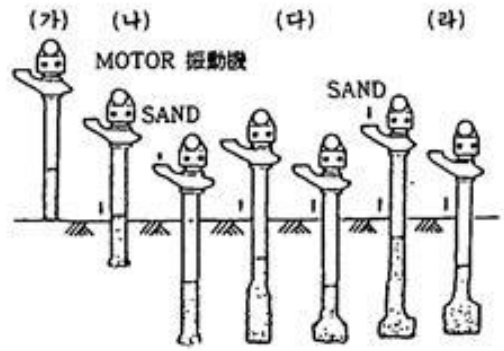  
그림1. 다짐모래말뚝공법의 시공순서  

# 4. 지반개량후의 토성변화  

# (1) 개요  

Vertical Drain 공법이나 다짐모래말뚝공법 등은 연약지반의 압밀을 촉진시켜 압축성을 개선하고밀도를 증가시킴에 따라 현저하게 토성이 변화된다. 특히, 다짐모래말뚝공법에서는 진동에 의하여다짐모래말뚝을 조성할 때에 주변지반이 교란되고 지반강도가 저하되게 된다. 개량후의토성변화는 지반개량 효과를 판정하는 중요한 요소이며, 토성의 변화에 따라서 설계의 수정과압밀도의 파악 및 잔류침하량을 추정하게 되고 향후의 지반개량공사에서 중요한 지표가 된다.여기서 지반개량후의 토성변화에 대하여 기술되는 내용은 광양제철소 용지의 연약지반개량지역중에서 제1 기 설비의 원료 Yard 지역을 대상으로 하며, 이지역의 지반개량공법은다짐모래말뚝공법과 Sand Drain 공법 및 재하성토공법을 병용하였다. 하부점성토층은다짐모래말뚝(Sand Compaction Pile)을 상부사질토층(層厚 약 15m)은 모래말뚝(Sand Pile)을 2.5m간격으로 타설한 후에 재하성토 $(5\!\sim\!15\;\mathrm{m})$ 를 실시하였다. 원료 Yard 는 석탄, 철광석 및 석회석등제철소에 필요한 원료를 적치해 두는 곳으로서 최대 40t/㎡의 철광석 하중이 작용되므로지반개량공사시 및 조업시의 안정이 가장 염려된 지역이다. 이하 자연함수비, 단위체적중량,공극비, 일축압축강도, N 치 등의 토성변화에 대하여 기술한다.  

(2) 물리적성질의 변화  

흙의 물리적 성질중에서 점성토의 자연함수비(Wn), 단위체적중량(γ_{t})및 공극비(e)의 변화에대하여 개량전후를 비교하면 표1. 및 그림2.∼그림 4.와 같다. 표시된 개량후의 값은재하성토(Pre-Loading)의 철거시기를 판단하기 위하여 이론침하량의 압밀도 $90\%$ 에 도달했을때에 조사된 결과치이다. 진동하중으로 다짐모래말뚝을 연약지반 속에 조성하므로 다짐모래말뚝타설직후의 토성변화는 음이 교란됨에 의한 것으로서 그 변화된 값은 그리 크지 않고 비슷함을알 수 있다. 개량후의 값은 함수비와 공극비가 감소하고 단위체적중량의 증가가 뚜렷하다.  

(3) 역학적 성질의 변화  

흙의 역학적 성질의 변화를 파악하여 지반개량의 효과를 판정할 때에는 일반적으로 사질토의밀도와 점성토의 일축압축강도를 대상으로 하게 된다.  

표1. 점성토의 토성변화  

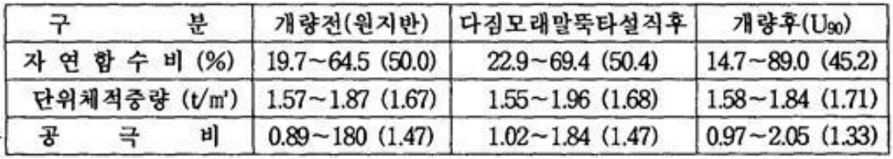  

# 주 { 내는 평균가중치를 표시함  

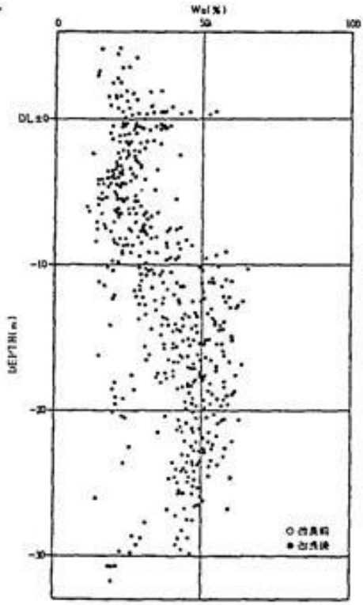  
그림2. 자연함수비 변화도  

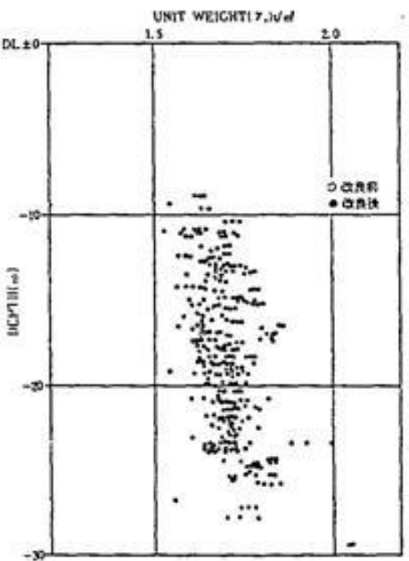  
그림3. 단위체적중량 변화도  

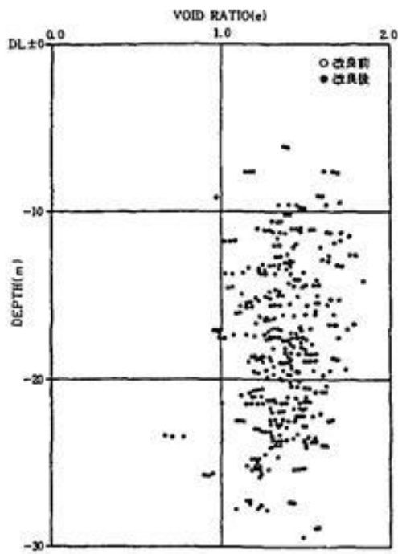  
그림4. 공극비 변화도  

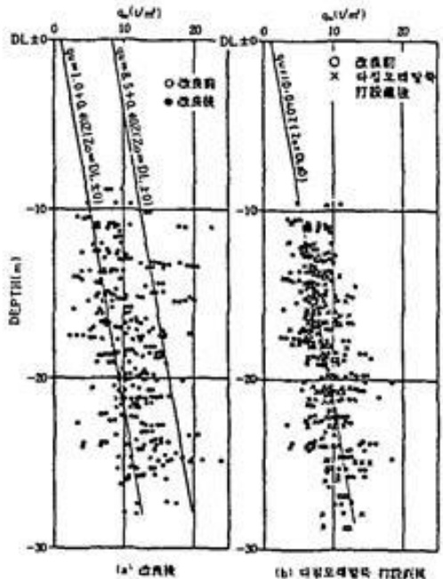  
그림5. 일축압축강도의 변화도  

진동하중에 의한 다짐모래말뚝 조성으로 느슨한 사질토 지반은 밀도가 증가되고, 점성토지반에서는 지반이 교란됨에 따라 모래말뚝 타설직후에는 강도가 저하되며 저하된 강도는 시간이경과됨에 따라서 회복된다. 그 강도회복의 기구에 대해서는 아직 확실한 해석방법이 확립되어있지 않지만 구조조직의 재결합에 의한 Thixotropy 현상과 과잉공극수압의 소산에 다른유효응력의 증가등으로 인하여 한번 저하된 강도가 시간이 경과함에 따라 원지반상태 또는 그이상의 값으로 회복한다. 그림5.는 점성토에 대한 일축압축강도의 변화를 도시한 것으로그림5.(a)에서 알 수 있는 바와 같이 점성토의 일축압축강도는 개량후 $(190\%$ )에 7.3 t/㎡ 정도증가하였으며 설계시에 예상한 강도증가율 $(\triangle\mathsf{c}/\triangle\mathsf{p}{=}0.25)$ 보다 다소 작은 값을 나타냈다.그림5.(b)는 다짐모래말뚝 타설직후에 대한 일축압축강도의 변화를 나타낸 것으로서 지반의교란에 의한 강도저하를 예상하였으나 그림 5.(b)에서. 알 수 있는 바와 같이 개량전의원지반강도와 유사한 값을 나타냈다. 이는 다짐모래말뚝 타설전 약 10 개월 동안에 걸친준설매립 하중에 의한 압밀이 진행됨에 따라서 강도가 증가된 영향 때문이다. 그림6.은지반개량후의 사질토층의 밀도변화를 $\fallingdotseq{1}$ 보기 위하여 N 치 변화를 도시한 것이다. 개량전의사질토층은 평균 N 치가 7 로서 느슨한 상태였으나 개량후(재하성토 철거전, $0\_{\left\{90\%\right\}}$ )의  

평균N 치는 24 정도로서 평균 3.4 배가 증가하여 Medium Dense-Dense 한 상태로 변화되었다.  

# 5. 이론침하량과 실측침하량의 비교  

(1) 개요  

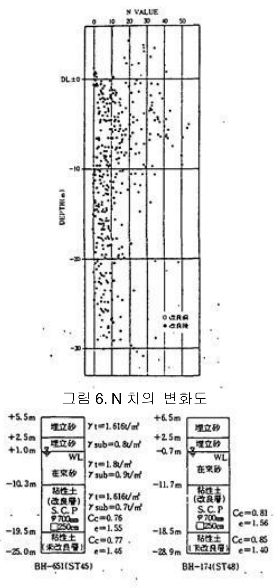  
그림7. 대표적 토질조건  

연약지반에서 발생되는 여러가지의 문제들 중에서 지반침하는 지반의 전단파괴와 더불어 흔히야기되는 문제로서 그 예측이나 판단의 정도가 공사전체에 크게 영향을 미치게 되므로 매우중요하다. 따라서 여러가지의 토질조사 자료를 토대로 보다 정확한 침하량을 예측하기 위해노력하고 있으나 전술한 바와 같이 흙은 균질하지 않고 복잡한 구조와 특성을 가지고 있으며현장에서 일어나는 여러가지의 거동을 정확하게 측정하기에는 많은 어려움을 안고 있다. 특히침하는 지반의 배수조건과 구성물질 등에 따라서 그 양과 시간에 따른 침하율이 다양하게일어나고 있다. 여기서 이론침하량과 실측침하량에 대하여 기술하는 내용은 광양제철소 용지의연약지반개량 지역중 제기설비의 원료 Yard 지역내에서 그림7.과같은 대표적인 토질조건을 갖고있는 위치를 대상으로 한다.  

# (2) 이론침하량  

Terzaghi 의 1 차원 압밀이론을 근거로 유도된 이론식중 압축지수(C_{c})를 이용하여 산정한  

점성토층의 압밀침하량은 표2.와 같다. 여기서 매립하중에 의한 침하량은 지반개량천까지의매립사에 의한 침하량이며 재하사 철거전까지의 총침하량은 매립사에 의한 압밀침하량과재하성토에 의한 압밀침하량을 합한 것이다.  

표2. 점성토의 압밀침하량  

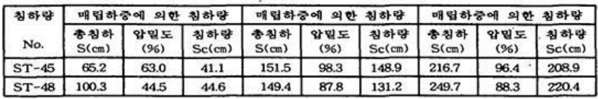  

표3.은 사질토층의 즉시침하량을 B.K HOUGH 의 제안방법에 따라 N 치에 대응하는 공극비(e)를구하여 산정한 값이다.  

표3. 사질토층의 즉시침하량  

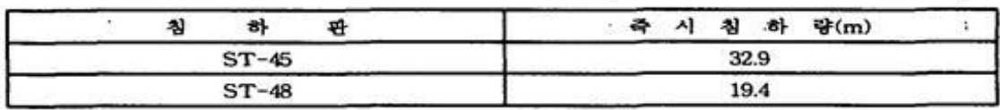  

(3) 이론침하량과 실측침하량 비교  

지표면 침하판으로 측정한 실측침하량과 이론침하량을 비교하면 그림8. 및 그림9.와 같다.  

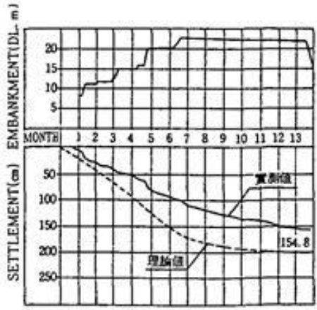  
그림8. 침하량 비교도(ST-45)  

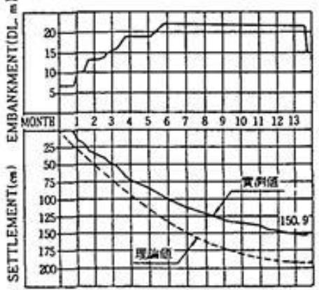  
그림9. 침하량 비교도(ST-48)  

여기서 알 수 있는 것은 실측침하량이 이론치보다 작은 값을 나타내고 있으며 점성토층의 압밀침하곡선이 사질토층의 즉시침하가 포함된 지표면 침하와 유사한 양상을 나타내고 있다는 것이다.  

# IX. JET GROUTING 공법(지반보강 및 차수)  

각주 009) 성하지질, "JSP 및 JET GROUTING 공법 (지반보강 및 차수)"  

# 1. JET GROUTNG 공법의 개요  

JET GROUT 공법은 초고압 PUMP 로 300 ㎏/㎠-400 ㎏/㎠의 압력으로 지반경화제인 CEMENTMILK 를 단관 또는 이중관 롯드를 통하여 NOZZLE 로 분사되어 지반을 교란, 절삭시키므로CEMENT 가 원지반과 혼합되어 강력한 원주형의 개량체가 형성되는 공법이다.  

JET GROUT 방법에는 I) COMPRESSOR 를 사용하지 않고 CEMENT MILK 만을 주입하는 경우와,II) COMPRESSOR 를 사용하여 AIR 와 CEMENT MILK 를 병행하여 주입하는 두 가지 방법이있다.  

# 2. 설계  

(1) 설계기준치  

여기에 보이는 모든 수치는 각종 실험 및 시공결과에서 구한 것이다.  

1) COLUMN 형성직경과 시공형상  

COLUMN 형성직경은 지반의 토질에 따라 다르지만 다음과 같이 된다.  

$\textcircled{1}$ 사질토와 점성토에서는 사질토 지반이 용이하게 굴착할 수 있으므로, N 치로 보아 점성토지반에서는 사질토의 1/10 의 값으로 COLUMN 형성직경이 결정된다.  

$\textcircled{2}\mathsf{N}$ 치가 큰 지반 쪽이 형성하기가 힘들고, COLUMN 형성직경은 작아지지만, N 치 $=\mathtt{50}$ 정도의사질지반 까지라면 COLUMN 형성직경은 변하지 않는다.  

$\textcircled{3}$ 이 표에 나타나지 않은 토질에서의 COLUMN 형성직경에 대해서는 그 토질에 따른 실험이필요하다.  

$\circled{4}$ 여기에 포함되지 않는 지반은 다음과 같다.  

$\curvearrowright$ 자갈분 $70\%01$ 상의 자갈층  

$\curvearrowright$ 붕괴한 지반  

이러한 것은 그때 그때 검토가 필요하다.  

<표-1> 설계에 사용하는 표준수치(COLUMN JET)  

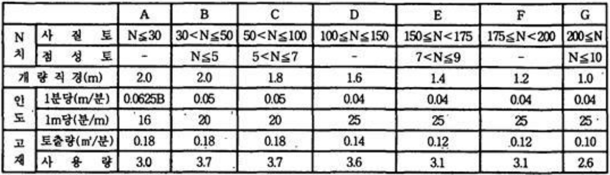  

<표-2> 설계에 사용하는 표준수치(PANEL 및 WING JET)  

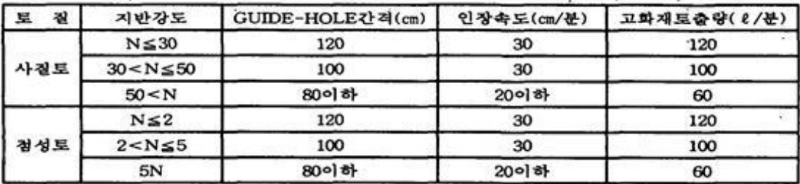  
VGUIDE HOLE의 간격온 PANEL GROUT의 경우에 적용함IWING JET의 GUIDE HOLEC 원칙으로대상문에서 50고이내로 섬치한다  

2) 강도에 대하여  

강도는 대상이 되는 지반이 사질토인가 점성토인가를 분류하지만, 기본적으로는 치환공법이기때문에 굴착 흙의 대부분은 지표로 배출되고, 소량은 고화재에 혼입된다.  

따라서, 사질토 지반에선 MORTAR 상이 되고, 점성토 지반에서는, SOIL CEMENT 와 같이 되어일축 압축강도가 달라 사질토지반과 점성토지반에서 강도차가 있다. 또, 저강도형이라는 것은기계식 SHIELD 의 굴착성을 고려하여, 강도를 조정한 것으로, 발진도달, 방호 등에 사용된다.  

<표 $-3>$ 고결체 설계기준강도  

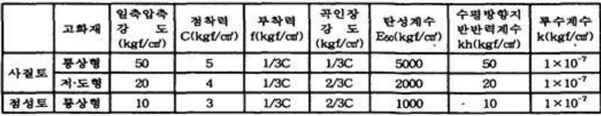  
보모두 품점보증 값임2개량후 흙의 단위재적층량 및내부 마찰력은 뭔지반과 같다  

(2) 배치에 대하여  

COLUMN JET 의 :시공배치에 대해서는, 지수성도 요구되는 사질토와 강도만 요구되는 점성토로나누어져 설정한다.  

1) 사질토의 경우  

$\curvearrowright$ 원칙으로는 그림-1 에 보이는 것처럼 3 본의 COLUMN JET 가 중앙에서 접하는 배치로 한다.  
$\curvearrowright$ 단 시공 심도가 20m 를 넘는 경우는 BORING 정도 1/250 을 고려하여 결정한다.  

# (a'=a-h ×1/250)  

$\curvearrowright$ b 의 최소값은 2γ -0.5m 로 한다.  

ㅇ a≤ γ  

$\curvearrowright$ 발진, 도달 방호 등의 벽면에서의 거리 $S{=}a/2$$\curvearrowright$ Boring 정도의 계산기준  

$\curvearrowright$ SHIELD 발진, 도달, 급속선 등 SHIELD CENTER  

$\curvearrowright$ 저반개량 개량상단  

$\curvearrowright$ 토류부실부분 굴착 하단이 외의 것은 상황에 따라 구해지는 수치로 한다.  

2) 점성토의 경우  

$\curvearrowright$ 원칙으로 그림-2 처럼 인접하는 2 본의 COLUMN 이 접하는 배치로 한다. 단. 사질토의 경우와같은 모양으로 BORING 정도를 고려하여 배치한다. $(\mathsf{H}{<}20\mathsf{m})$  

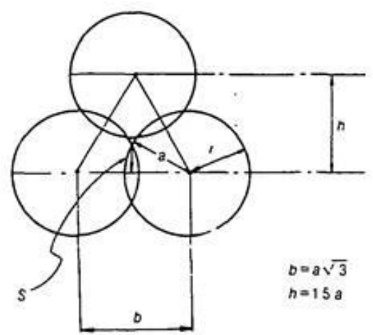  
그림-1 사질토에서의 기본배치  

? $:$ 3본 COLUMN 교점까지의 거리   
Y: COLUMN 개량경반경 종방향의 간격   
6: 횡방향의 간격  

ㅇ b 의 최소값은 2 γ $-0.5\mathsf{m}$ 한다.  

$\curvearrowright$ 단면내에 사질토(지수를 고려할 필요성의 유무)가 있는 경우는 a≤ γ 로 한다.  

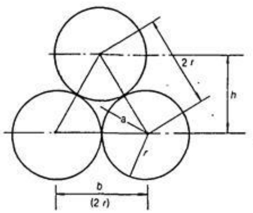  
그림-2 점성토에서의 기본배치  

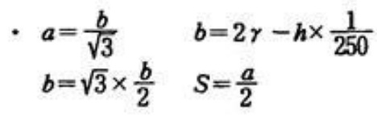  

(3) 최소 시공두께(깊이)에 대하여  

COLUMN JET 의 설계에 있어서는 아래의 최소 확보값을 설정하고 있다. 이것은 COLUMNJET 고결체의 개량강도가 다른 지반 개량공법과 비교하여 상당히 크기 때문에 계산에 의한개량값이 매우 작아지는 경우가 많으므로, 지반 개량으로서의 특성을 고려하여, 시공실적에서생각되는 값으로 결정한 것이다.  

1) SHIELD 굴진 방호공의 경우했굴착 직경이 매우 작은 경우는 별도로 고려한다  

<표- $-4>$ 최소확보치  

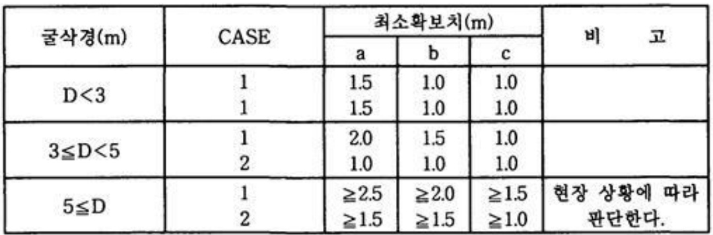  
CASE 1 SHIELD 발진방호 급곡선 방호 지중 접합공 그냥파기부 등2 SHIELD 도달방호  

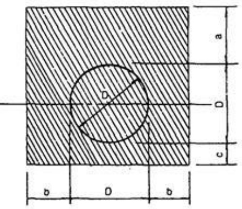  
그림-3 SHIELD 방호개량범위  

2) 개삭부 저반 개량공(선행지중보도 포함)  

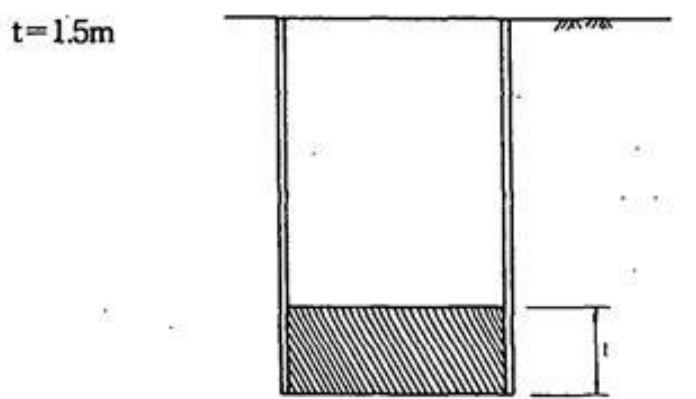  

(4) 안전율에 대하여  

JET GROUT 공법의 경우, 시공성을 고려하여 안전율은 다음과 같이 설정하고 있다.  

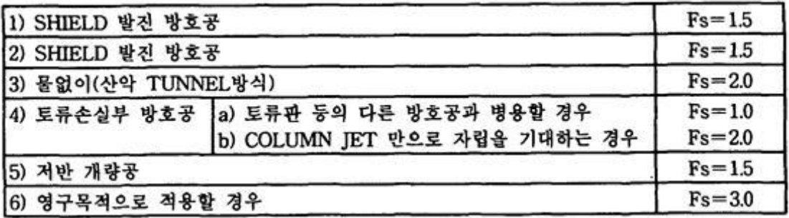  

# X. 고압분사주입공법(JSP 공법)  

각주 010) (주)표준개발 심재구, "고압분사주입공법(JSP 공법) 관련논문집"  

# 1. 서론  

일반적으로 이용되고 있는 약액주입공법은 대상지반의 토층 구성 및 토질에 따라 그 효과가좌우되고 있다. 특히 복잡하게 퇴적된 다층지반이나 얇은층이 많이 개재되어 있는 지반에서는 층경계에 연하여 약액이 빠져나가는 경향이 있어서 목적하는 지반의 토립자의 간극에 침투가대단히 어렵고 또 기대하는 효과를 얻기 위한 필요 주입량을 미리 산정하기가 곤란하다. 더우기소기의 주입효과가 발휘되어 있는지를 확인하기가 어렵기 때문에 자칫하면 전혀 그 효과가나타나지 않는 경우가 발생한다.  

이와같은 종래의 주입공법이 갖는 결점을 제거하고 확실한 효과를 기대하기 위한 여러가지의유도주입공법이 연구되고 있으나 현재까지는 실제로 시공에 적합한 공법이 없었다. 그러나여기에 기술하는 고압분사 주입공법은 초고압의 JET 를 이용해서 지반을 절삭 붕괴시킴과 동시에간극에 Grout 재를 충진하는 일종의 유도주입공법이다. 이 공법은 최근에 개발된 공법으로서금후의 발전이 기대되고 있으며 그의 시공방법을 간단히 설면하면 Double Rod 선단에 JettingNozzle 을 장착하여 경화재를 분사하면서 회전하게 하며 Nozzle 이 한바퀴 또는 한바퀴 반을회전하면 자동적으로 2.5 ㎝ 상승하면서 전과 같은 동작을 반복하게 된다. 이와 같은 과정을연속적으로 시행함으로서 지반중에 원주상의 고결체를 조성하는 공법이다.  

이 공법이 보통의 주입공법과 현저히 다른 특징은 다음과 같다.  

$\textcircled{1}$ 토층 구성이나 토질에 의한 영향을 받지 않으며 필요개소에 필요량의 경화재를 계획적으로주입할 수 있다.  

$\circled{2}$ 보통의 주입공법으로는 주입이 곤란한 세립토 지반에도 적용이 가능하나 암반에서는부적합하다.  

$\textcircled{3}$ 토중에 인공적으로 만든 간극에 경화재를 충진하는 것이기 때문에 보통의 약액 주입 공법처럼인근의 건물이나 지하 매설물에 영향을 미치는 일이 거의 없다.  

고압분사 주입공법의 기술적 기반으로서 고압하에서 분류유체의 거동이나 특성 또는 지반의파쇄기구 등을 들 수 있다. 유체의 충격 Energy 에 의하여 고체의 변형을 주는 것은 잘 알려진사실이다. 이것이 공학적으로 이용되어 소련에서는 채탄기술에 이용되고 있으며 금속 또는Plastic 등의 절단, 그리고 최근에는 선박의 녹이나 패각류를 벗겨내는 기술에 응용되고 있다.이와같은 기술에 사용되는 고압(또는 고속)분류수(주로 물)의 토출압력은 대단히 다양하지만토사를 절삭하는 것은 200-600 ㎏f/㎠ 암반절삭에는 2,000∼6,000 ㎏f/㎠, 호박돌을 절삭하는대는20,000 ㎏f/㎠ 이상의 압력이 필요하다고 한다.  

이 공법의 한 특징은 Energy 변환효율의 크기를 들 수 있겠다. 고압분류 유체의 밀도가 크고, 또유량, Nozzle 의 직경, 압력의 크기, Nozzle 의 이동속도 등을 변화시킴으로서 용이하게 흙의파쇄조건을 변화시킬 수가 있다.  

# 2. 공법의 원리  

고속분류 유체를 사용하여 지반을 굴삭하는 Mechanism 에 대해서는 그 현상이 대단히 복잡하기때문에 이론적인 해명이 아직 완전하게 구명되어 있지는 않지만 아래에 기술하는 각 현상의조합이라는 것을 알 수 있다.  

(1) 고속분류 유체의 충격력  

Water Hammer 작용에 의하여 발생하는 최대응력과 Water JET 분류가 지반내에서 수적군이 되어지반에 충돌할 때의 최대압력은 그 발생기구를 동일하다고 하면 그 Energy 는 다음과 같다.  

$$
\mathsf{E}=\mathsf{v}\cdot\mathsf{c}\cdot\mathsf{u}
$$  

여기서  

γ : 유체의 밀도c : 수중의 음속υ : 유속  

위의 식에서 알수 있는바와 같이 분류의 속도가 커지면(고압분사를 할때)지반에 작용하는 동압도커져서 지반의 파괴강도에 도달할 때 토립자는 서로 떨어진다.  

(2) Cavitation  

유체를 서서히 감압시키면 층류가 가속되어진 경우와 같이 난류를 일으켜서 유체중에 공기의공동이 생기게 된다. 이 현상을 Cavitation 이라고 한다.  

분류 유체가 지반과 충돌할 때 토립자는 표면을 따라서 흐름이 생기는데 입경의 차에 의하여압력차가 생겨서 저압부에 Cavitation 에 의한 공동이 발생한다. 이것이 다시 압력이 높은 곳에이르게 되면 주위의 유체는 공동을 파괴하려고 대단히 빠른 속도로 돌진하게 되는데 이 관성력에의하여 지반이 파쇄된다.  

# (3) Water Wedge  

고속분류와 접촉하는 지반면은 응력을 일으키고 그 응력은 수압의 증가에 의하여 증대하며지반의 파괴강도까지 높이면 지반은 파괴된다. 또 지반중의 간극이 물로 충진되고 그가운데에서는 수분류의 반력작용으로 유체역할적인 압력 "Water Wedge" 가 발생한다. 이Wedge 는 간극성상에 따라서 일정한 압력을 가진 것이 형성된다. 이 경우 Nozzle 에서지반까지의 거리가 작을수록 Wedge 가 되는 조건은 양호하게 된다. 이러한 관점에서 볼 때간극비가 큰 지반, 균열이 있는 지반 등은 수력파쇄에 적합하다고 하겠다.  

(4) 피로파괴  

물질의 표면이 분류유체를 연속접사할 경우 그 재질에 따라 다르기는 하지만 재질의인장강도보다 훨씬 낮은 압력으로도 파괴가 시작된다. (예를 들면 금속판에서는 $10\%$ 정도)이러한사실로 미루어 보아 분류유체와 피파괴물질의 사이에는 어떤 특별한. 역학적인 관계가 있는 것을알 수 있다. 더우기 분류유체에 의한 부하를 받은 물체의 잔류변형에 피로가 축적되어 파쇄가발생하게 된다는 것을 이해할 수 있다.  

# 3. 공법의 특색  

고압분사 주입공법의 원기상의 특색에 대하여 좀 더 구체적으로 논하기로 한다. 이미 고속분류에의한 파쇄기구의 개요에 대해서는 기술했으나 이것을 공법으로서 구체화 시키려면은 여러가지의수법이 필요하다.  

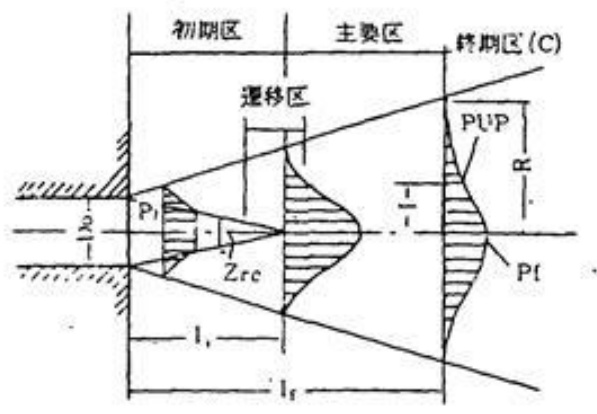  
그림 1 JET 의 기초구조  

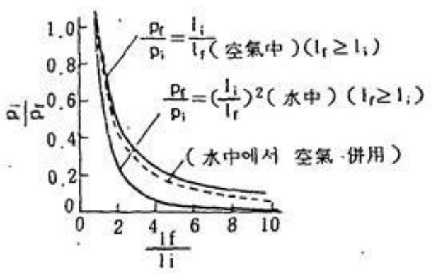  
그림 2 WATER JET 증심축상의 압력분포  

그림 1 에서와 같이 공기중에 분사한 JET 분류는 Nozzle 출력 Pi 를 일정하게 하는 초기구(A),발달하는 주요구(B), 그리고 분류유체가 불연속으로 되어 Cavitation 이 발생하는 종 기구로 나눌수 있다. 이들의 관계를 나타내는 실험식은 다음과 같다.  

공기분사의 경우  

$$
{\frac{P_{f}}{P_{i}}}={\frac{l_{i}}{l_{f}}}
$$  

수중분사의 경우  

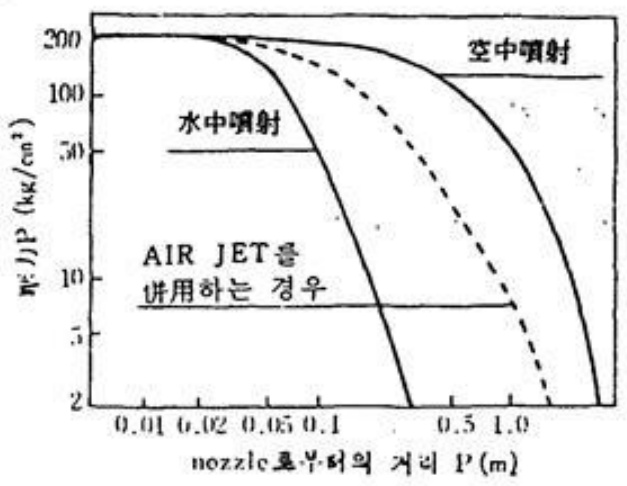  
그림 3 각위치에서의 JET 의 압력  

P_{f}/P _{i} $:=$ (l_{i}/l_{f})²(그림 2 의 실선부분 참조)  

이론적으로 얻어진 JET 분류는 그 자체로는 바로 실용할 수 없다.  

실제로 지반을 절삭하는 대부분의 경우는 지하수면 이하를 대상으로 하고 있으므로 수중분사의경우 밖에 적용되지 않는다. 그러나 그림 3 에서 나타난 바와 같이 수중분사에서는 200 ㎏f/㎠ 의압력으로 분사하는 경우 Nozzle 로부터 30cm 거리에서 그 효과는 완전히 소멸된다. 이것 때문에Nozzle 의 주위에 공기를 동시에 방사시킴으로서 유효사정을 연장시키는 방법을 개발해 냈다.이것은 분류유체가 공기를 빨아 들여서 지반중에 공기공간을 구성하게 하여서 거의 공기분사와같은 조건을 만들어 주게 된다.  

# (그림 2 의 점선부분 참조)  

# (그림 3 의 점선부분 참조)  

그러나 이 공기를 실용하는 데에는 적정한 분사속도가 필요하게 되며 그 속도는 음속의 1/2이상이 되어야 한다. 절삭범위를 확대하기 위하여 사용한 공기는 절삭토를 지표면에 배출시키는데에도 이용할 수 있는 장점이 있으며 또 이 공법에 의하여 조성된 고결체끼리의 밀착성은대단히 양호하다. 일반적으로 직경 $5\!\sim\!10$ ㎝ 정도의 Boring 을 하는 것만으로도 유효경 $0.8\!\sim\!1.2$ m 정도의 고결체를 얻을 수 있는 점은 이 공법을 광범위하게 응용할 수 있는 특징이라고 할 수있겠다.  

# 4. 시공순서  

$\textcircled{1}$ Plant 의 설치  

$\circled{2}$ 지반개량이 필요한 위치에 JSP Jetting Machine 의 설치  

$\textcircled{3}$ NJV, Double Rod, Double Swivel 등을 조립하여 물과 Air 를 사용하여 저압으로 소요의 심도까지굴진한 후  

$\circled{4}$ Cement Milk(1:1)와 Air 를 사용하여 고압으로 분사하면서 적정한 시간동안 회전  

$\circled{5}$ 회전이 끝나면서 2. 5 ㎝ 자동상승  

$\circled{6}$ 상기와 같은 공정으로 소요의 심도까지 분사 시공 완료  

# 5. 본 공법의 적용벙위  

본 공법은 말뚝과 자주 비교되고 있는데 이것은 경우에 따라 말뚝 역할을 하는 일이 많고 또 그형성과정에서 그렇게 보이기 때문이다. 그러나 본 공법을 개발한 당사자는 말뚝으로 개발한 것이아니라 모든 시설공사에서 기초 및 가설물이 설치되는 지반의 안정을 추구하기 위하여광범위하게 다뤄진 것이다.  

이러한 관점에서 아래에 몇가지 적용방법에 대하여 간단하게 소개코져 한다.  

(1) 지수  

지수를 목적으로 하는 제반공사에 적용된다. 이 경우는 지반상태의 여하를 막론하고 전부가능하다. 토류의 지수, 매설관하의 지수, 방조제, 저수지, 방수지 등의 누수방지, 지하 Dam 의건설, 특히 기존 Dam 등의 누수방지 및 보강 등에 적합하다.  

(2) 지반강화  

이 경우는 우리의 특별한 관심사가 되는 사항이다. 시설물이 대형화하고 가용지면이 점차부족하게 됨에따라 매립지 또는 간석지 등 연약지반도 이용하지 않으면 안되게 되었다. 따라서이러한 연약지반의 지지력 보강 Heaving 의 방지, 사면붕괴의 방지 및 사후 대책, 개설 구조물의보호 및 Under Pinning 등 어떠한 경우에도 적용 가능하다.  

(3) 현장 조성항, 토류항  

현장에서 말뚝을 지중에 조성해야 하는 경우와 토류등의 목적으로 사용할 수 있다. 특히, 토류의경우에는 지수효과를 얻을 수 있기 때문에 Open Cut 의 좌우 벽면의 안전처리에 적합하다.  

(4) 선행지중보  

연장이 긴 구조물을 시공할 때 지반이 연약하거나 지하 매설물로 인한 장애가 있을 경우선행하면서 기설물을 보호하고 지반을 개량하며 진행한다.  

# 부 록  

# 관련도서  

1/115 -- 동화번호 S000503 자료행대 언어험해고폐이지:0006 분류번호 저자기호 T783n 권호 서 명 Desig! Of plle foundat Ions 저자념 Veslc A 습관년도 77 습판사께 릅판지 $:$ Jashington D C 총서명 NCHRP Synthesis:42 KEY ERD $:$ Pl1e foundaticns-design BrIdge engineer 2/ 115 --- 등북번호 $:$ S000199 자료형태 언어형태 $:$ 미패이지 0005 분류번호 저자기호1783n 권호: 서 명 Laboratory Gva!uat fon Of piles Inste! Ied ith vibratory dri vers 거자명 1 TB 저자명2 O'nei11 M 저자명 3 Upu!arwndan 효판년도 $:$ 89 출판사:RR 순판지 Jashington 총서명 NHrP Feport:316 KEY 0R $:$ Pl1e Instal latIon Vibratory GrIvEr 3/ 115 동목번호 S000200 자료형대 언어형태 터네이지:005 분류번호 저자기호: T783n 권호: 서 멍 Laboratory eval uat Ion! Of plles Insta! led ith Vibratory drI vers 거자면 1 TRB 저자명 2 O'ne!!l M 물 저자럼 3 $:$ Vi pul arwrdan C 출판년도 89 출판사TRR 출판지 $:$ JashI nigton 중서명 TEPDFt:316  

EY HORD $:$ Pie Instal lation Vibratory drIvor  

4/115   
동목번호 B018592 자료형태 언어행태 모페 이지: 0010   
분류번호 624154 저자기호: Ablls 귄호   
서 명 Select lon dosI gn And Instal lat!on Or Plles   
저자명1 ASCE   
출판년도 버 출판사는는 ASCE   
출만지: York   
KEY FORD $:$ Plle Plle doslg Pile Instal lation 5/115 _   
동북번호 ED10098 자료형태 대 언어형태미페이지: 0032   
분류번호 52413 저자기호 $:$ A811a 권호   
서 명 Analysis Ind design In geotechnfcal Anginoer ing V!   
저자명1: ASCE   
효판년도 $:$ 74 출판사 ASCE   
흉답지 New York   
KEY! TOAD $:$ Reservoir [11Ing Clay Highray Cnbankrent Pile stabi! I ty Geotechnicai EngI ner ing 6 115   
동묵번호 $:$ N001825 자료형태 |- 언어형태 미폐이지 002   
분류번호 $:$ 8940 저자기호 $:$ 사962r 권호:   
서게 명 Interface tests to InvestI gate pile Pile skin riction In sards   
저작명 Tabucanon JI   
저자2 $:$ Alry D   
습관년도 92출판사 $:$ NTIS PR:93170397   
습관지 Springflold   
해서명R:662   
KEY FLRD $:$ Sand Shoar test BearIng capacI ty P11e Str-ucturs Skin fFiction Stress nalysis So!1 Property Sol l Pressure ___ 115   
동묵번호 022983 자료행태 언어태 $:$ 테페이지: 0015   
분류번호 62415 저자기호 $:$ S611s 권호   
서 명 A Short COUT5e In-foundat I on Engineer ing   
저자명 ! SI monts 서 E   
저자명 2 $:$ ManzIes B K   
준판년도 77 급관사 $\because$ But ter Hor th   
춘판지 $:$ London   
KEY FORD $:$ Sattlenent Analysis- foundatlon Bearing Capacity Foundation-pile PI led Toundat lon Shear Strength   
동특변호 8022988 자료형태 언어형태보머페이지1001   
분류번호 624154 저자기호 $:$ 1659p 권호:   
서 명 Plie 25Ign! Construct icn Pr'actice   
저자명1 Ton! inson M   
판년도 77 습판사: A vlerpoint   
춥판지 London   
'KEY HORD $:$ P!! Ing Equlpuent P!Ie group Pil1 ing nar ine SLruicturb PHIcd! Toundat I on   
둥류번호 N0D02393 자료형태 HF 언어형태 $:$ 매페이지:0018   
분류번호 $:$ 50440 저자기호 $:$ K89s 권호:   
서1명 Selsuic Fesponse- foundat i ons In Soft So! Is   
저자명1 Kraner SL   
출관년도 93 급판사 $:$ NTIS PB:94102506   
출판지 SprIngfleld   
KEY DRD Piles Seisaic Yesponses Peat Dyarlic 1oad testing Bender elezents  

동류번호 $:$ 1000072 자료형태 :MF 언어형태 $:$ E페이지: 0010분류번호 $:$ 50D0! 저자기호 $:$ 081d 권호  

저10명 $:$ Darage potentia! froe pile dr!VIng  
저자명1 : Osar-Duodt A  
효판년도 : 출판사  
준판지 : : Arn Arbor  
KEY FORD $:$ Pile drI ving Have equatIon DrIving So!l CopactIonCompaction-p!le PI les Ana!ys!511/ 115 ---  
동묵변호 B001832 자료형태 언어행태 $:$ J적이지H 0026  
분류번호 624/528 저자기호 녹25동 권호V76  
서10명 프리페브조립식]강말뚝 선공법  
저자명1: 녹도출판의  
준판년도82 출관사계녹도  
출관지동경  
총서명 현대건설신무대계:76  
KEY FORD 그 강관만뜩세공법  
_ 12/ 115--  
동묵번호 $:$ 8002918 자료행태: 언어청태 $:$ O페이지:0028  
분류번호 6258 저자기호농56는 권호:  
서명농지개람사업표준설계해설:용벽 널말푹편  
저자명1농수산부  
출관년도: 숲편사구농수산부  
춤판지:!  
KEY HORD 웅벽말뚝  
-- 13/ 115  
동류번호 E009830 자료형태 언어험태 $:$ KO데이지:0015  
분류번호 624154 저자기호 : 건4고 권호:/48  
서1명: 만뚝기초의 설계1  
저자명1: 건설부  
출판년도1175 출관사건설부  
춤관지1서울  
총서명 기술지도서:48  
KEY HRD : 만뚝기초재하시협기제소구경말뚝말뚝현장타설말뚝  
둥화변호 $:$ B010327 자료형태성대 언어형태:K에이지 $:$ 0045  
분류번호: 6272 저자기호:대92그 권호:  
서1명[광양공업단지조성에 관한토목공화심포지움  
저자명비대한토목학회  
저자명2:포함종합제천  
춘판년도 $:$ 88 순반사비대한토목하피  
춘판지서운  
KEY ORD: 함만공화광양만광양제철소연용력권산화콘크리트구조문강재구조물선계회전기계폐수처리대기오염말뜩연약지반건설관리호안공사배수조석  

조즈래동특변호 B025975 자료형태 언어형태대페이지 $:$ 0014분류번호: 624154 저자기호: 일45 권호:서3명말뚝의 침부성및 파동이론의 말뚝에의 응용에 판한 심포지움반표논문집저자빔1 일본토진공학회춘관년도담9순반사일본토질공학회출관지동경KEY5 말특침투성말뚝파동이론합타  

등특변호 B025976 자료험태 언어형태 $:$ J재때이지: 0012  
분류번호 624151 저자기호: 일45 권호  
서100명 말뚝의 관입성 타격성에 관한 심포지움밭표는문집  
저자명: 일본토질공화회  
출판년도184 출관사인본토질공화회  
출판지비동경  

KEY FDRD : 말뚝말독판입성말뜩타격성합타  

17/ 115  
등화빈호 $:$ 5028427 자료험태: 언어행태구세제이지 $:$ 035  
분류번호 624154 저자기호부좌7트즈킨호:  
서명이 지진과 장소타설함의 설계드지질과 현장타선말뚝의 설계  
저자명1: 과죽차남  
저자명2/북중장박  
출관년도190 준판사  
층관지:동징  
KEY R $:$ 지질현장타성말만뚝187 115 --  
동국번호 $:$ 012558 자료형태: 언어형태HJA폐이지0027  
분류번호: 62413:627 저자기호1사42시 권호:  
서명1사방 산사태설계실예사방 사방념 유로공 산사태: 만공 집수정안카공  
저자멍1사방 산사태대책공사설계실예편집위원회  
출판년도187 순관사산해당  
춘판지하로동경  
KEY 10R사방산사태유로공말공사방템집수정안카공19/ 115  
등타번호: 012559 자료험태: 언어행태려패미지0051  
분류번호: 62413 저자기호+토35느 린호  
서명노면및사면재해복구공법  
져자념1토목시설방재공법연구회  
출관년도185 순판사산해담  
출판지에동경  
KEy dRd: 사면재혜복구공법봉과말뚝공심초공웅력공산사태전토성토지표수배제공지하수배제공20/ 115  

동특번호 B021813 자료형태이: 언어형태HA데이지:0021  

분류번호 624154 저자기호 삼460 권호  
서10명1매g말뚝공법  
저자명1: 양뢰구지  
저자명2: 방하효성  
출관년도6에 -출만사삼복  
출판지:동경  
총서명토목특수공법시리즈:8  
KEY HORD: 말뚝공법매럽발공법기초공사-말뚝21/115  
동독번호 $:$ B000338 자료형태 언어험태 $:$ KO폐이지 $:$ 0003  
분류번호 624/628 저자기호정66그 권호:V6  
서명만뚝기초공법  
저자명11건설부  
'판년도:80 준판사정우사  
출만지서울  
총서명:기술지도서:6  
KEYR0RD기초공법말뚝기초22/115 --  
둥퓨번호 EDD312? 자료험템 언어형태:0과이지10021  
분류번호 : 52415 저자기호:농터그 권호  
서명구조문기초션계184  
거자념1농업진흥공사  
출판년도84 친관사비농업진흥공사  
춘판지서운  
KEY RD지반만뜩기초사면안정옹벽건문기초트조 23/115  
둥목번호 $:$ 6005785 자료형택: 언어행태 $:$ KO예이지 0060  
분류번호 62415 저자기호: 대92그 권호:  
서명구조물기초설계기준해설건설부제정  
거자빔 대한토결공하피  

준판년도885 출관사대한토질공학회출관지黃서운KEY DRD: 지반말뚝기초사면안경용벽건물기초  

등특번호 $:$ B009507 자료행태: 언어명태 $:$ 미페이지 $:$ 0012  
분류번호: 624/628:06055 저자기호: 삼54시 권호:  
서'삼성종합건설기술보 재1호  
저자명1삼성종합건설기술연구소  
출판년도887 출관사삼성종합건설기술연구소  
융판지서운  
KEY HORD $:$ 준역타공법헤사보강토공법용벽설계시공고강도본크리트소음방지공동주택말뚝기초전산프로그램연약지반동압밀공법콘크리트폰화케25/ 115  
돔[번호: B010785 자료협태 언어침데:K0페이지10056  
분류번호: 624 154:624 13 저자기호농터트 권호:  
서명토진및기초처리에  
저자명1농업진흥공사  
출관년도83 출판사농업진흥공사  
출판지경기  
KEY TDED : 말뜩기초토질역화횡템사면안정어스랩  
-늘--- 로 25/ 115  
동묵번호 $:$ E013581 자료형태교 언어범태 $:$ KO백이지027  
분류번호 624136:62415 저자기호부농터 긴호  
서 연약지반상 구조물기초의 설계및 시공사례집  
지자명1농업진풍공사  
출판년도188 급판사농엄진흥공사  
출판지:경기  
KEY TORD 연약지반 말뜩기초 연약지반처리공법매설관거  
동특번호 8017645 자료형태 물F 언어형태KO에이지0027  
분류번호 624154 저자기호 한16 권호  
서명제말뚝기호의 설계및 시공관리개선방안  
저자명1: 한국건설기술연구원  
출관년도1명9준관사한국건설기승연구원  
출만지유서움  
KEY FORD $:$ 말뚝기초설계시공관리함타동역화적공식항타용력지지려군말뚝부마찬려모형토조  
동타변호 $:$ E017646 자료형태 $:$ RLF 언어형태 $:$ K0네이지 $:$ 0027  
분류번호 624154 저자기호 한16 권호:  
서11명' 말뚝기초의 설계및 시공관리계선방안  
저자명1: 한국건설기숨연구원  
출판년도89 춤판사: 한국건설기승연구원  
출판지서운  
KEY tOR 말뚝기초설계시공탄리 함타동역화적공식항타움려지지력군만뚝부마착모험토조  
동목번호 01764? 자료형태 : 언어형태 $:$ KO 폐이지H002  
분류번호 524154 저자기호 한16 권호:  
서면 말뚝기초의 설계및 지공관리계선방안  
저자명1: 한국건설기술연구원  
층판년도용9초관사한국건설기술연구원  
출판지서운  
KEY $:$ 말뚝기초설계시공관리항타동역화적공식함타용력지지려군만뚝부마환력모형토조  

동북번호 $:$ B018195 자료형태 8 언어형태 $:$ K도이지 0042분류번호 624154 저자기호 한16 권호:서명: 말뚝기초의 실계 및 시공:기술자료  

저자명1 한국건설기술연구원  
효관년도 |: 89 출판사: 한국건설기술연구원  
춥관지서울  
KEY FORD: 만뚝기초설계시공  
동묵번호 5018197 자료협태금 언어현태 K에이지: 0010  
분류번호 624:154 저자기호 한16 권호  
서명 말뚝기초의 섬계 및 시공관리:문서  
저자명1 한국건설기술연구원  
촬판년도 출관사한국건선기술연구원  
층판지:서운  
KEY HOR 맏뜩기초선계시공  
동북번호 E018246 자료협대금 언어형태:KO페이지:005  
분류번호 624154 저자기호 한16- 권호:  
서명 만뜩기초의 설계및 시공관리:기술자료  
저자명1: 한국건설기술연구원  
습판년도:89 습판사한국건설기술연구원  
주판지동서운  
KEY ORD 만뜩기초설계시공  
등닥번호 $:$ 019452 자료형태 $:$ E5 언어험태 $:$ O에이지 $:$ 000  
분류번호 : 6241 저자기호K4S 권호  
서명 마산서항지구매럽지내아파트기초설계컴토에 관한 연구  
저자명 1 $:$ KICT  
효판년도:90 효판사비동산토건  
효판지서울  
KEY TORD 마산서함기초설계침하만뚝기초Rock Anchor지반조사  

동화번호 $:$ B019453 자료형태 $:$ E5 언어험태 $:$ O폐이지 $:$ 0008  

분류번호 624 1 저자기호 $:$ K46 권호  
서1명 마산서함지구매럽지내아파트기초선계검토에 관한 연구  
저자명1 $:$ KIC!  
순단년도 90 춘판사에동산토건  
순관지: 서울  
KEYOR : 마산서함기초설계침하말뚝기초Rock anchor지반조사_- 35/115  
동목번호 $:$ B019454 자료행태 :K5 언어험태 $:$ KD 이지: 0008  
분류번호 6241 저자기호 $:$ K48 권호  
서1명 마산서함지구매럽지내아파트기초설계검토에 관한연구  
저자 KIC!  
출관년도 90 순판사동산토건  
출관지: 서운  
KEY HDrD 마산서함기초설계침하말뜩기초Rock Enchor 지반조사36/ 115  
동특번호 $:$ B020227 자료형태 언어형태 $:$ KO 페이치:0015  
분류번호 62415 저자기호 건터 귄호가  
서1명: 만뚝기초의 설계  
저자명1: 건설도서  
순관년도190 준판사건설도서  
출판지서울  
KEY FOHD 후팅말뜩기초강관말뚝비말v타설말뚝번장타션말뚝  
동목번호 $:$ B020422 자료험태 언어협태K폐이지:0000  
분류번호 624016 거자기호러82] 권호  
서0명 건문구조의 일관선계시스캡계4면]기초설계  
저자망1 회창근  
저자망 2 권한수  
출관년도 90 춤판사: 한국과학기술원 보목공학과  
효판지님서운  
KEY TORD: 말뚝기초전면기초벼체직접기초독럽화대기초미니6일관시스템지내력기초설계38/ 115  
등특변호: B020292 자료형태 언어혐태KO페이지:0032  
분류빈호 6524 저자기호: 건터E 권호:  
서0명: 말뚝및케이슨기초의 설계계산에  
저자명1: 건설도서  
준판년도 90 출판사건설도서  
출관지서울  
총서명토목구조물설계계산예시리즈4  
KEY HORD : 말뚝기초케이슨기초기초공사후팅기초설계P만뚝기초39/115  
동목빈호 022404 자료험태 언어형태 $:$ KO 에이지 0050  
분류번호 62415 저자기호 : M587- 권호  
서00빔 구조물기초션계기준  
저자명분  
출판년도:86 출판사woc  
순판지복서울  
KEY HORD 토목구조물설계기초공사토진조사지반말뜩기초101 115  
동묵번호 $:$ E022H52 자료험태: 언어행태래매이지 $:$ 0059  
분류번호 6241 저자기호: 인45층 린호V!  
서0멍 함기초의 조사 설계에서 시공까지말뚝기초의 조사 섬계에서 시공까지  
저자명1 일본로질공화회  
효판년도 83 급'관사: 일본토전공화회  
출관지동경  
좀서명 현장기습자는 위한 토와 기초시리즈:1  
KEY fORD 기초합기초말특기초지반조사  

41/115등특번호 B022872 자료험태 언어형태 $:$ 래택이지1 0037분류번호 6241 저자기호 인45공권호Vll서2명 함기초의 저소음 저진동시공법의 지지력=말뚝기초의 저소음 저진동시공법과지지켜저자텀의인본토질공학회출판년도186 출판사일본토진공학회출판지동경총서명헌장기술자를 위한 토와 기초시리즈:11KEY TORD : 항기초관팍기초저소음시공범저진동시공법  

동묵빈호 B026448 자료험태 언어형태 $:$ J에이지:0034  
분류번호 624 저자기호산93트 권호  
서명항케이슨및강관시판기초의 설계계산예-말뚝 케이슨 및 강관시판기초의 설계계산대  
저작명시강원미지부  
저자명2고목장차  
저자명31/전전양도  
출관년도:92 출판사중산해당  
출관지중동경  
총서명토목구조문설계계산에시리즈래  
KEY HORD 기초설계케이슨기초말뜩기초  
둥묵번호 $:$ 027135 자료형태 언어형태 KO패이지0042  
분류번호 $:$ 62415 저자기호: 한16조 귄호:  
서22명: 깊은기초  
저자명I! 한국지반공화회  
출판년도:93 나금'관사복한국지반공학회  
출판지구서울  
총서명지반공학시리즈:4  

KEY FORD : 기초말뚝기초케이슨기초피어기초대SE 말뜩재하시험  

44/ 115동목번호 $:$ E027!37 자료형태 언어형대 $\because$ KO매이지0042분류번호: 624 15 저자기호 : 한163 린호:서0면: 깊은기초저자명1: 한국지반공학회출판년도193 습판사:한국지반공학회출판지서울총서명:지반공학시리즈:4KEYR : 기초말뚝기초케이슨기초피어기초대도말뚝재하시험45/ 115동목번호 024256 자료험태 $:$ 언어형태 $:$ KO페이지: 0013분류번호 624 15 저자기호 한167 권호서명깊은기초의 연구와 실무-Research And practIce 0r deop Toundat ions저자명1: 한국지반공학회춘관년도:92 출판사품 한국지반공화회출판지서운KEY HTORD 기초말뜩기초지지려Fc말뚝Detp Foundat I on Foundat ion45/ 115동목번호 E02425? 자료형태 언어U태 KO명이지 0013분류번호 62415 저자기호마 한167 권호서명 깊은기초의 연구와 실무-Research Pract ice Or deap Foundat fons저자명1: 한국지반공학회출판년도192_인한판사: 한국지반공학회출관지서울KEY 0D 기초만뚝기초지지려Pc말뚝Deep Toundat I on Foundat Ion  

동화번호 027422 자료형태 : DR 언어행태 $:$ KO 페이지:0011분류번호 : 624154 저자기호 한16 권호서107명: 만기초한국지반공화회말v기초위원회: 대한건축화회기초분과위원의  

화순반표집 제1집저자명한국지반공학회저자명2대한건축학회준판년도393 급판사: 한국지반공학의출판지서울KEY doR 말뚝기초  

동묵번로 $:$ B027573 자료형태 언어형태 $:$ KOE이지:0010  
분류번호 $:$ 624154 저자기호 $:$ K46 권호  
서11명 동결토의 폭성과 동토지역에서의 만뜩기초연구  
저자명 KICI  
순관년도 92 최관사드KIcI  
출판지서울  
KEY GORD $:$ 기초동토지역동토만뚝기초  
등특번호 $:$ 5027574 자료형태 연어형태 0평이지 $:$ 0010  
분류번호 624154 저자기호 K46- 권호  
서명 동견토의 목성과 동토지역에서의 말뚝기초인구  
저자명1: KICT  
준판년도192 준판사K다  
춘판지서울  
KEi HORD $:$ 기초동토지역동견토만뚝기초  
동록번호 $:$ 8027575 자료형태 X 언어형태 $:$ 페이지 $:$ 0010  
푼류번호 624154 저자기호 $:$ K46- 권호  
서1명 동견토와 특성과 동토지역에서의 말뚝기초연구  
저작1 KICT  
출판년도 92 출판사KIcT  
출판지서울  
KEY EDRD 기초동토지역동견토탄뚝기초  
등북번호 $:$ 010138 자료험태: 언어험태 $:$ JA페이지:0002  
분류번호 524154 저자기호: 첨35 권호  
서명로 맘뚝기초의 계획과 선정  
저자명1청목중남  
출단년도? 순관사을 전국건션연수겐터  
순판지동경  
KEY HORD 기초공사만뜩기초기제함공법장소타설함공법  

52/115 동류번효 $:$ 02847! 자료형태 $:$ 매 언어행태 $:$ $:$ 0011 분류번호:624154 저자기호한16 린호: 서명말뚝기초_한국지반공화희 말뚝기초연구회 대한건축학회기초분과위원회 학술반표집제1집 저자명1{한국지반공학회 저자명2대한건축화회 준판년도193 준판사세한국지반공학의 출관지서운 KEY FORD : 말뚝기초  

등특번호 8029082 자료형태로 언어형태 $:$ K메이지 0000  
분류번호 $:$ 624154 저자기호 대92교 권호  
서명 매말뚝의 설계 지공지침에 관한 연구  
저자명1대한주택공사  
출판년도93출판사대한주덕공사  
출판지서운  
KEY TORD 매닫뚝말독기초마말특기초선계탄뚝재하시험  

동목번호 $:$ B030514 자료험태 $:$ 없F 언어행태 $:$ KON이지: 0018분류번호 624154 저자기호 건18도 린호  

서10명돔견토의 특성과 동토지역에서의 만기초연구  
저자명1!건기연  
춤판년도 $:$ 93 - 춤판사질건기연  
출판지서움  
KEY0D동긴토영구동토동길심도만뚝기초들기관뜩엄전달해석  
_ 551 115  
등목변호 $:$ B030515 자료형태1값언어형태1K0페이지10018  
분류번호 624154 저자기호건18대 권호:  
서명: 돔견토의 폭성과 동토지역에서의 만묵기초연구  
저자명I: 건기연  
출관년도 93 습판사:건기연  
습관지:서울  
KEY HORD 동견토염구동토동견심도단뚝기초들기만뚝염전단해서58/ 115 --  
동북번호 $:$ 030S16자료형태:RF 언어혐태K0페이지10018  
분류번호: 624154 저자기호건18도 권호:  
서명동견토의 특성과 동토지역에서의 말뚝기초연구  
저자멍11: 건기연  
순관년도193 출관사주건기연  
율판지서운  
KEY FOHD ! 동건토영구동토동긴심도만뚝기초들기만뚝연전단래석57/ 115  
동목번호 $:$ B005725 자료형태: 언어형태 $:$ KO 페이지:0060  
분류번호: 624:15 저자기호 대927 권호  
서명구조물기초설계기준해설건섬부지점  
저자명11대한토전공하회  
출판닌도:86습판사  
순관지서운  
KEY EORD 구조물기초설계안은기초케이슨피어기초말뜩기초사면안점면약지반음비기계기초역상화  
둥특번호 B002953 자료형태로 언어평태 + ko 테이지:0004  
분류번호 624155 저자기호백57표 권호:  
서10명51파동방경식에 의한 항타용력의 영향분석  
저자명백승천  
급관년도186 급판사흉익대화교  
출판지:서울  
KEY HORD 파동방경식함타웅력팔뚝박기  
동특번호 B020231 자료형태 언어형태 :KO페이지:022  
분류번호 624 거자기흐: 건斜트 권호:  
서2명: 지하가선구조문의 선계계산에  
저자멍1: 건설도서  
출판년도:90 출관사건설도서  
습판지:서울  
총서명비토목구조물설계계산예시리즈:7  
KEy fORD 강넌말식단일문막이토압이중물막이노면복공직하가설구조물철계계산엄지만뚝방식  
동묵번호 E007741 자료형태R 언어형태 $:$ K0등이지1073  
분류번호 62415 저자기호: 대655 권호:  
서0명 대구경현장타셜망특공법의 연구  
저자명1:대우건설기술연구소  
효판년도:87 층판사: 대우권설기술인구소  
출관지서운  
KEY HORD 현장타선말뚝공법기초곱사  

동부번호 $:$ 0!5826 자료형태에로 언어U태정병예이지10017분류번호 624154 거자기호 대92: 권호:서0명: 현장타설말뚝의 신용성검토  

저자면1: 대한주력공사  
출판년도189 - 순관사대한주택공사  
춘반지:서운  
KEY DOED: 현장타설말뚝공법타입말뚝공법시공설계베노토공법D공법어스드럴공법심초공법치환공법_- 621115 --  
둥특번호 $:$ B031107 자료행대: 언어형태 $:$ KO백이지0007  
분류번호 624154 저차기호:동62ㅂ 권호  
서0명 BEIDTO ALL CASING공법  
저자명: 동아지질  
준만년도! 춘판사동아지진  
출반지서울  
KEY trd! 현장타설말뜩공법모돈[0공법ALl CASIG공법63/ 115  
동특번호 $:$ 0D1204 자료형태 언어형태 $:$ KO평이지:0015  
분류번호 624/628 거자기호: : 첨667 귄호V48  
서명 말뚝기초의 설계1  
저자명1: 건설부  
한판년도180 습판사정우사  
한판지비서울  
총시명기술지도서:48  
KEY0R 기초공사말뚝기초- 64/ 115 __-  
동묵번호 BD01205 자료형태 언어형태1K0페이지0031  
분류번호 624/628 거자기호정86그 린호:V49  
서1명: 말짝기초의 설계2  
저자명1 건선부  
춤판년도18 습판사정우사  
판지서울  
행서면기술지도서49  

E! TFD : 기초공사말득기초  

65/ 115  
통묵번호 $:$ E002413 자료형태 언어형태 $:$ 머폐이지 0022  
본류번호 62415 :6813 저자기호 $:$ 1156 - 권호  
서10명: Behavl or Of plles proceedlngs ol thie Con ferervce Or ga드l zed by the I5titution O CIvL1 Englnogrs London  
처자명1C ICE  
춘관년도 출판사ICE  
순판지: London  
E! HORD : Plle66/ 115  
둥류번호 $:$ EO04903 자료형태 D 언어형태 미페이지: 000  
분류번호 62413 저자기호 : 이러4스 권호  
서면 사질토에 있어서의 plle bearing capacity: 요약서  
저자명1 이명한  
출판년도B 출관사sn  
춤판지니5!  
KE! RORD 사질토 Plle Pearing Capacity67/ 115  
동목번호 $:$ EOOG!0? 자료형태: 언어대터네이지0016  
분류번호 624 154/ 155 저자기호 :J399 긴호:  
서면 Stee! Pipe plle  
저자명1 JASPP  
출판년도 82 출판사: JASPP  
출판지 $:$ Kyoto  
KEY Pile68/ 115  

등류번호 B00B42? 자료형태 : 대 언어형태 $:$ 이지: 0055분류번호 62413 저자기호 S67le 권호 !서 명 Expans!ve S011s V I  proceedi ngs 4th Intot Conforen  

저자명 1 $:$ Snethen Dona!d R   
순관년도 80 '판사RASCE   
출판지: Her York   
KEY ORD $:$ Expanslve so!I So!! Ste! I Ing so!I Test Clay Foundat fon P! Ie 697 115   
동목번호 $:$ B00B430 자료형태 $:$ R 언어범태 $:$ 미페이지: 00   
분류번호 62415 저자기호 $:$ 115 권호:   
서 1명! Recent developuents In the design and Construct Ion Of pllesi procee dings of the conferenc? held at the Inst I tut Ion Electrlcal Eng! HeSTs 21-22 Mar 79   
저자명1 ICE   
출판년도 : 출관사ICE   
춤관지 Lonxdon   
KEY FDAD $:$ Plle Construct lon Design Deep foundat!on Nol so VIbrat Ion So!I P!Iing 70/ 115   
동특번호 B010022 자료형택 언어험태 미페이지 0058   
분류번호 624/628:6218 :55 저자기호 $\div$ P514c 권호:   
서0멍 $:$ Construction planning Cquipugnt Be thods   
지자명 1 Peur i foy R L   
저자명 2 -- Ledbetter I b   
출판년도 85 출판사: GraD-H! !1   
출판지 $:$ York   
KEY TORD $:$ Bui I ding Constructlon Equl peent Manageeent Tractor Scr aper Truck Lagon Conveyor Coupressed Alr Pl 1e Concrete  

동타번호 $:$ 5010586 자료형태 : D 언어형태 모매 이지: 0025분류변호 62413 저자기호 | 9998 권호 :서 명 $:$ Enid bear I ng Capacity of a pile n CokvesIonless 5o11s  

거자명 1 Myung Than Le은   
준판년도 87 춘판사로 Univ 6   
출판지s!   
KEY TORD $:$ Cohes IonIess Soil Bearing capaclty Plle 12/ 115   
동묵번호 B014332 자료형태 : 매 언어명태 터예이지: 0050   
분류번호 627 저자기호 $:$ 권호   
서 100명 $:$ Mode! Iing so! I-fater-structure Interactions SOTAS88   
저자 1: Kol kman P A   
저자명 2 $:$ Lindanberg J   
저자명 3 $:$ Pillarczyk K H   
출판년도 숲관사AA Ra! keaA   
출관지 $:$ Rot terdan   
KEY HORD So! Tater Structure P! Ie Plat fore Pler Gravi ty Structure Breakrater Fil ter Layer 73/ 115 -   
동특번호 $:$ B014181 자료형태 언어횡태 E매이지: 0003   
분류번호 624 15 저자기호 $:$ R19AF 권호 :   
서0멍 REAT2:Icad transfer Aralysis of axlally Ioaded Plles   
저자명 1 RandoIph 4E   
효판년도 85 습판사 Univ Or Carbridge   
출판지 $:$ CarbrI dge   
KEY : AxiB11y I oaded p!lePlIo 74/ 115   
동북번호 $:$ B014182 자료형태 언어형태 $:$ 퍼폐이지: 0003   
분류번호 62415 저자기호 $:$ R194p 권호   
서명: PIGLET:A CCauputer for the A요lys15 design 이 pile grou P5   
저자명1 포국 M F   
출판년도 86 효판사 Unlv CanbrI dge   
출판지 $:$ Canbridge   
KEY HORD $:$ Axlally L caded plle Loaded pl lo PIle Couputer 15/ 115 -   
둥륙번호 $:$ B01470? 자료형태 언어횡태부미페 이지: D032   
분류번호 62415 저자기호 Y71p 긴호   
서 평 PlIes 하d Tcuindat Ions   
저자명 Young FE   
준관년도 81 출판사: Thomas Tel ford   
출판지 London   
KEY FORD $:$ Pl Ie Foundat Ion Load bearing plling 76/ 115   
동독번호 $:$ 01532 자료형태 언어형태 머폐이지10012   
분류빈호 $:$ 62415 저자기호 BBs8p 권호라   
서 명 $:$ Precast Plling practice   
저자명 1: Brons Bengt b   
한판년도 $:$ 81 습 관사 : Thomas Tel ford   
초관지: London   
KEY $:$ Precast PiIins Pile PI1Ing   
- 77/ 115   
동묵번호 $:$ 801631? 자료형태 언어형태 $:$ 퍼페이지:03   
분류번호 624154 저자기호 F598p 권호:   
서" 명 $:$ Piling eng!neering   
지자명1: Fleirg IG K   
출관년도 $:$ 85 출판Af: John Hiley and Sons   
한판 지 $:$ Nel York   
EY FDRD $:$ PIi! ing Pile Retaining 1! 78/115   
통록번호 8016639 자료형태 D 언어형태 터폐이지:007금   
분류번호 624131 저자기호 P62En 권호   
서 명 NunerIca! Dode!5 In GeopechanIcs   
저자명I: Pletruszczak S   
저자명 2 Pande GN   
출판년도 $:$ 89 출판사 $:$ Elsevler   
출판지 $:$ York   
EY HORD $\vdots$ MRCrca enginoer Ing Rock So! 1 MochanIcs Mathomat I cal Gode!! So11 dynaoicsExcavat Ion PI Ie Erhankbent 79/ 115 그를   
동목빈호 $:$ 501785! 자료형태 : 언어험태 태매이지 $:$ 0038   
분류번호 62415 저자기호 $:$ A8118 권호:   
서명: Predicted Observod xal bohavlor Of plles: results 이f다 pl1rp Fedict Ion 5yspos   
저자명+ Finno R J   
저자명 2: ASCE   
준판년도 : 89 효판사EASCE   
한판지:Nes York   
총서명: Geotechnica! SP:23   
E HORD $:$ Pi1e BO/ 115   
등국번호 8019107 자료행태 : 매 언어험태 E페이지는 0050   
분류번호 624/628 저자기호 A855a 권호:   
서1명 Behavlor 0 Geep Tourdat Ions   
저자명1: 5께   
출판년도 - 79 출판사: A517   
출판지: Ph! ladelphla   
충서명: ASTM SIP:670   
KEY HORD Load Lost Deep Touundat Ion PI le Concrete pileStee! pile 81/ 115 주-  

동목번호 H01230 자료형태 : F 언어험태 타페이지 $:$ 0017 분류번호 50A40 저자기호 : N952T 권호 서 명 Static test Irg O[ doop foundat Ions  

저자명 1: Kyfor 2 G:   
저자명2:FHEA   
저자명3 $:$ NTIS-1   
효관년도 92 출관사 NTIS PB:92175817   
출'관지' Springfleld   
총서만: FHRA SA:91042   
KEY 0A $:$ Plle DRr!Ied Shaft Load test Tensle Deep Foundat I on Br I dge 82/ 115 -   
동목번호 028709 자료형태: 언어형태 N 매이지0092   
분류번호 $:$ 624131 저자기호 $:$ F3188 귄호:   
서 명라 App! Icat Ion O Stress-Have theory to piles:third InternatIona! Con fefence   
저자명1 $:$ Fellenius Eengt H   
춘판년도 출판사: CEs   
출판지 $:$ Otta물요   
KEY FORD $:$ Stress Vavo Lave Stress P! To 83/ 115 --   
동타번호 $:$ B029528 자료형태를 언어형태 $:$ 터페이지:000   
분류번호 저자기호 Us44 캔호: Us-0065   
서 - 명 Design Of pile Youndat I ons Sett I ezant nalysis   
거자명l! USACE   
출판년도 $:$ 91 한관사: USACE   
출판지 $:$ Jash i ngton   
총서명적 LISACE EM:1110-2-2906   
KEY HOAD $:$ Pi Ie Fourdot Ion PI 10 Foundat I on E4!/ 115   
동묵번호 $:$ A000326 자료형태} 언어험태 버페이지:0000   
분류번호 저자기호 $:$ 1854t 린호   
서10명 The effect Surcharge Loadi ng Edjacent 10 piles  

저자명 1: Spr I ngnan s:  

지자명 2: Bol ton M D   
출판년도 90 출판사FRR   
춘판지 Cronthorne   
총서명 TRL CR:195   
KEY FORD Load-pile Plle bendI ng Bcctont Surcharge Tcad Pile T'esponse-sur charge   
동화변호 2024276 자료형태내 언어형태 $:$ 터페이지:0036   
분류번호 6913 저자기호 $:$ A181p 권호   
서200명: DSIg handbook In RECOrdance th the strength desIgn Ethod 이거 Ci 318-89 VI:beats CNn8-Hay 5!abs breckets oot Ings d plle CUp5   
저자명1: ACI   
출판년도 - 91 춤판사:AG!   
춤판지: Datro!t   
총서명 PublIcation SP:17[91]   
KEY HORD $:$ Bean Design PIle Cap Strength Jes I gn One Slab Bracket Foot Ing   
등화번호 $:$ E0000D3 자료형태 언어험태 머피이지: 0023   
분류번호 저자기호 E53e 권호   
서11명 Construxt ion InspoctIon 입Ide V3   
저자명1   
출판년도 76 효판사부EPA   
준판지 Yesh!rgton   
총서명 EPA:430/9-76-005   
KEY T0RD $:$ Heat ing Vent! lating RefrIgerat Ion Air Cond! tion I ng Plle construction  

둥묵변호 $:$ B00822! 자료형태 R 언어행태 $:$ 머계이지:000  

분류번호 $:$ 626/528 저자기호 $:$ 8794r 권호   
서 명 Pile supported StructurEs In 10k8 Jepos I ts   
저자명1들 매   
습판년도 68 출판사르매   
출판지 Denver   
총서명 Research Feport:11   
KEY HORD $:$ Pile Fourdatlon Sett lement PI le test Vane shear test Friction pile Sol1 Cou presslon Lest Sodlment 88/ 115 -   
등특번호 B010099 자료형태 - 연어험태 머폐이지 $:$ 0018   
분류번호 62413 거자기호 $:$ A811a 권호   
서 명 Analysis nd esgn in geotechnical Engtneer Ing 12   
저자명 1 ASCE   
출판년도 74 출판사 ASCE   
출판지 $:$ New York   
KEY FORD - Eubank rent Foundat Ion Soft So!1 Seepage Stabl! Ity Devater Ing So!l PIle Foundat I on Geotechnlcal Erngineering 89/ 115 -   
동루번호 BD1028! 자료형태 언어형태 머페이지 0033   
분류번호 62413 저자기호 0524 권호:   
서명 Judguent In Geotechnica! engineer ing: the professlona! 1ega다y 이 Ra Iph B Peck   
저자명 1 $:$ Durnic! Iff John   
저자명2 Deere Don u   
준관년도 출판사 John Hlley and Sons   
출판지 $:$ New York   
KEY HDRD $:$ Engineering geology Sol EochanI cs Ear th dan Soi! ConditIon Tunne! Pile Foundat I on Foundat I on Exploration 90/ 115  

둥독번호 $:$ B010674 자료형태 DD 언어험태 머페이지 0013  

분류번호 62413 저자기호 19996 권호:   
서 명 BearIng capacIty Tactor No of a pile foundat lon COgpreSsIb!! Ity of soils   
저자명 $:$ Myung Than Lee   
춤관년도 $:$ 85 - 출관사는 Univ Of Birringha  
출관지는 Bir-inghan   
KEY HORD $:$ Bearing Capaclty P110 Toundat Ion So! ! 91/ 115   
동북변호 $:$ 014179 자료험래 언어형태 중세 이지000   
분류번호 62415 져자기호 오러 긴호:   
서 명 FEAFSB   
저차 오명면   
출판년도 85 준판사Is   
출판지 51   
KEY 뛰ORD $:$ Pile Foundat Torn Cohes I ve S0!1 Cohesionle S5 5oi1 Statie Anal ysis Dyranic 합r년lysis 92/ 115 --   
동묵번호 $:$ B014694 자료형태 언어형태 머페이지: 0029   
분류번호 62415 저자기호 $:$ 115p 권호   
서 멍 $:$ PiIing and ground Lreat ment   
저자명1: ICE   
춤판년도 54 출관사 : Thons Tel ford   
주판지: London   
KEYHORD PilingPlle foundatIon   
- 93/ 115   
동목번호 $:$ 8014864 자료형태 | 연어형태 머페이지:006   
분류번호 624139 거자기호 : 7958+ 권호:   
서10명 FoundatIons In per mafrost 학nd SeasoNa! rost   
저자명: Huori Albert   
저자명 2: Sayles Francis H  

# 효관년도 85 준판사ASCE  

출판지 $:$ Nen York   
KEY Pernafrost Scasona! frost Creep PIle Foundat icn 94/ 115 -   
둥묵번호 $:$ E0I4855 자료형태 언어험태 페 이지: 02006   
분류번호 624139 저자기호 9561 권호:   
서 명 Foundat Ions In per mafrost And seasona! Frost   
저자명 1: Fuori Albert   
저자명 2 Sayles Francis H   
출판년도 85 순관사: ASCE   
출관지 Now York   
KEY FORD Per mafrost Seasona] Frost Creep PIle Toundat ion 95/ 115   
동특변호 B016299 자료형태 R 언어행태 $:$ 이지: 0015   
분류번호 624 1313 저자기호 A8115 권호   
서 명 Soii properties eval uatlon froa centri fugal dals And fleld perlo [LANce   
저자명1: ASCE   
저자명 2 $:$ Tounsend Frank C   
저자명 3 : Norris G M   
준판년도 82 출판사 ASCE   
출관지 York   
KEY OAD So! T Testing Slurrled soll Centrl fugal Doxdel PI11e foundat Ion 96/ 115   
동목번호 3015782 자료형태 $:$ DR 언어형태 이 지 0076   
분뮤번호 55034 저자기호 J22p 권호   
서 명 $:$ ProctedInEs 9th _orld conference On earthquake Enginear Ing V3-EA Fthquake Gngincer!ng 13   
저자명: JAE   
준판년도 89 순판사 JAEDP   
출판지 $:$ Tokyo   
KEY TORD $:$ Earthquake engineer Ing So! 1 Dynur Ic property Llquefactlon Stabll Ity Slope So! I Structur? Interaction PIlo FoundatIon Vibrat !on 97/ 115   
동목변호 $:$ 017854 자료형태 : 매 언어형태 미페이지: 0040   
분류번호 62413 저자기호 M6128 권호   
서 빔 : Analysis design of plle foundat ions   
지자명 18 Hayer JR   
저자명 2 ASCE   
출판년도 5 준판사ASCE   
출관지 $:$ N에 York   
KEY FORD $:$ Pi1e foundat lon 98/115   
동목번호 $:$ B017852 자료형태 매 언어형태 대계이지0011   
분류번호 $:$ 624131 저자기호 $:$ 011d 권호   
서 명 DyrRIc Fesponse Of plle Fourdations: Analytica! Aspects   
저자명 1 O'Ne!!! M   
저자명 2: Dobry Rlcardo   
저자명3: ASCE   
출판년도 8 습판사다 ASCE   
숲 된지 York   
KEY FORD $:$ PlIe Touindat Ion DYTEL!C FGSpONS0 99/ 115   
동부변호 B017855 자료형태 언어형태 이지0060   
분류번호 62415 저자기호 V2178 린호   
서 명 $:$ Deep Foundat ions Cn Bored ud Buger plles   
저자멍1 Van I따pe F:   
출판년도 $:$ 88 흡판사:AA Bal kerd   
출판지 $:$ Rotterda  

KEY HORD $:$ Deep Foundation Bore PI le Tourdat I on  

115 동묵번호 $:$ B020044 자료형태 : DR 언어형태 $:$ 머매이지: 0045 분류번호 $:$ 624131 저자기호 J83p 권호: 서 멍 PredlctIon Per Fo! Tence In geotechnica! Engi neer Irg 저자명1 Josh! Ransh C 지자명2 Griffiths Fr& 출판년도 $:$ 87 주관사A4 Balkeag 출판지 $:$ Rotterdan KEY FOR $:$ CentFI fuge test Axia! Icad P1le foundat Ion So!I Classlflcat Ion Vertica! drainge Sel saic Fespons9 Ana l ysis Dra I nge 1014 115 동번호 $:$ B01785! 자료행태 언어형태 $:$ 이지 0018 분류번호 $\div$ 62415 저자기호 시774년 권호 : 서15명 $:$ DynaEic Fespcntse Of pile Toundat lons: exper I ment Enalysis ard Cbse Fation 저자명I: Nogari Toyoak I 저자명2 $:$ ASCE 춘판년도 $:$ 87 춘판사 A5E 준판지 $:$ New York KEY FORD $:$ PII Ing Test ing PIle oundat Ion --- 102/ 115 모니 동북번호 $:$ 1000015 자료험태 : HE 언어험태 $:$ 매계이지: 002! 분류번호 $:$ 89010 저자기호 $:$ E42a 권호: 서0명 Analysis of the berthing 때act force Bistribution On plle Support E per StFIctufes 저자명나고 Elloghby HH 순관년도 85 준판사E 출판지 $:$ Arn Arbor KEY ORD $:$ Pler Structure Bean Elustic foundat lon-bear PlTe Fourdation  

Foundatfon-p! Ie Foundat Lon-beas Foundat lon-dock  

[LS! 110 동부번호 $\div$ MD00076 자료험터 : 언어형태 $\div$ 대페이지:00l! 분류번호 50L01 저자기호 : 16788 권호 서0명: Datersinatlon O[ the Capab!11ty Of침 side bearing Glock TCundat Ion FIxed 5uppDr! Fes!st GverturhIn8 지자명 1: Toreh Richard 출판년도 : 85 순판사: 때! 순판지 $:$ Arbor KE! HORD So!l Tesist So!! pressure Block Icundit lon-sids beuring Rankine's theory Side bear ing block Fourdatlon Plle foundat Ion 104/ 115 -- 동특번호 $:$ B024305 자료형태 언어형태 $:$ 이 지: 0053 분류번호 62411 저자기호 B17Ig 권호 서 Geotechni ca! Aspects Of 지함55 tera! transportation 저자명 1: BaI astbrananf am A: s 저자멍 21 Chandra 5: 저자명 3: Bargado D T 출판년도 87 출관사+AA Balketa 출관지 Rot ter dan  

KEY FDRD $:$ Geotechnology So! ! Exploration Shal 1o Toundation Hass ttanspor Lat ion J ands!Ide PI le fourdat I on Slope Stabllity: Tune! IHing  

둥화번호 $:$ N001824 자료형태 : HF 언어형태 매이지: 0002   
분류번호 8950 저자기호 서962r 권호   
서0평 Interact Ion bet fecn Jacked piIes In Cal careous Sed! Dents   
저자명[ $:$ Al-Dourl R H   
저자닝 2: Poulos H G   
준판년도 92 출판사 $:$ NTIS PB:93180719   
순관지 SprIngfleld   
총서면 R:665   
KEY HORD $:$ Plle [oundatlon Sand Load Force So! I -structure Inter actIon Jacked pIle Jacking 1본   
동묵변호 $:$ 001830 자료형태F 언어형태머터이지00어   
분류번호 89D30 거자기호 : N952F 긴호   
서명 $:$ Aralytica BeoDechanic5 Foundat I on Crignoot ! ng:a Studty 이 1ater Ioaded piles   
저자명 1: Poulos H G   
저자명2: Hull I S   
출판년도: 92순관사 $:$ NTIS PB:93180727   
한판지Springfleld   
총서명R:667   
KEY FORD $:$ Pi1e Tourdat Ion Sol I Bechant cs Load Sol I -structure Intoract lon Force  

10 11건등타번호 $:$ H0D1873 자료형태 F 언어형태 $:$ 퍼페이지: 0003분류변로 $:$ 8990 거자기호 | 서52r 권호서 - 명 Pi1e Toundat I on Settledent pr 드ctI을 고 CoepUtGr He t hods저자령 Poulos H G출관년도 92 출판사 NTIS PR:93170389출만지 Spi골old충서명 R:651  

KEY HORD $:$ PL1G Toundat lon Sett lepent-structure Sol I Dochanics Stress Anol ysIs Load So! I pr operty Structura! Analysis Structura! Jesign  

1내드 1동록변호 $:$ C001626 자료형태 :} 언어형태 테폐이지00!분류번호 저자기호 $:$ 부5111 권호:  

서 염 He t hodo I ogy design ConstretIon 이 led Shafts n Coh0s Ive S0L15   
저자명 : Johnson Lavrence D   
출판년도 효판사 TE5   
출판지를 Vicksburg   
총서 명 Technica! Fepor t:GL-84-5   
KEY TORD $:$ Foundat Ions Design Construct Ion Cal ssons Engi neer I ng Jes I gn Methodol ogy SolI Dechanics Stra ins Stresses Shear Stringth 이 911s   
동투번호 B022865 자료형태 언어형태 $:$ 느페이지 $:$ 004!   
분류번호 6241 저자기호일45음 권호V5   
서명크 케이슨공법의 조사 설계에서 시공까지   
저자명1: 일본토질공학회   
효판년도 78 춘판사: 일본토진공학회   
습판지:'동경   
총서명: 현장기술자를 위한토와 기초시리즈:5   
KEY TORD 케이슨공법연수지중벼   
동묵번호 B02656? 자료형태 언어태 $:$ 14네이지 $:$ 6031   
분류번로 624 거자기호 영357 권호:   
서명 교량하부궁사포국   
저자명니 영목준남   
저자명 2: 청목중움   
저자면3: 소천진오   
출판년도88 춘판사산래당   
출판지:동경   
KEY 보DRD 교량하부공사 리집기초케이슨기초교람기초  

동목번호 B0DB42T 자료형태 매 언어형태 퍼페이지는 0015  

동묵번호 $:$ EOI5OS! 자료행태 언어행태 Ko에이지10019   
분류번호 624:2 48 저자기호 동려스 권호   
서명:삼펭교가설공사구조계산서   
저자멍1: 동명기술단   
출판년도187 출관사부산지방국토관리청   
출판지부산   
KEY 상명교가션공사구조계산서상부구조 하부구조 Stee! box Pler Cal sson   
등목번호 5019091 자료행태 HDR 언어형대 $:$ 머매이지 $:$ 0019   
분류번호 624/628 저자기호:A855a 권호:   
서0명 Per for-ance n! toring for Geotechnica! ConstructIon   
저자명 1 AS   
출관년도 75 순판사 AS   
출판지 Ph! I adel phi a   
총서명 AS STP:584   
분류번호 $:$ 624157 저자기호 $:$ D111d 권호:   
서명 ri!d plers and Calssons   
저자명 1 D'Nal11 Hichae!   
출판년도 81 순관사: ASCE   
출판지 $:$ New York   
KEY $:$ Dr!lled Shaft Shaft Pler Caisson foundation Dr!!led pler 1124 115   
동북번호 $:$ B008428 자료형태 해 언어형태 $:$ 미페이지 이지0015   
분류번호 624157 저자기호 $:$ 8167d 권호   
서0빔 $:$ Dr!Iled piers Caissons 2:Construction under Surry/nondastruc tive Integrity evaluation load test ing/geotechnical behavlor Undgr Lod   
저자명 $:$ Baker Clyde N Ur   
출판년도 : 85 출판사: ASCE   
출판지 $:$ N주 York   
KEY HORD $:$ Dri!11요 pler Pler Calsson Foundation Clay Lond Lest Shaft Dr!1ed Shaft   
----- 113/ 115   
동묵번호 $:$ B010255 자료행대 $:$ 언어험태 $:$ 미폐이지:0019   
분류번호 624/628 저자기호 $:$ 1855원 권호   
서 명 $:$ Per fornance Gonl toring for gootechnico! Construct Ion   
저자명1: 5께   
저자명 2을 Stern 1:   
저자명3 DirniclIff CU   
순관년도 75 습관사:A5IM   
출판지 $:$ PhI I adel phI a   
총서명 ASTM STP:564   
KEY FDRD $:$ Excavat lon IncI Incaeter Heasurenent BracIng Moni tor So11 Caisson Straln Extensoreter Clay Later prossuro Calibrating Load Ce!l Plezodeter  

기사변호: 880802027 분류번호: 624 153/155 목번호: B006224 초탁: 0제목: 발뚝지지력산정을 위한 동역하적 공식의 정화도분석 및 수정FEVALUATI에 AADLSTHEN! 5 DYNAHIC PILE-DRIVING FORMULAS  

# 적자: 검충기/김명모  

KEYTDRDS: 만기초/선행회귀곡선/말계하시협 비점성토지반/지지려 초목:  

비침성토 지반에서 말뚝 기초의 지지력음 산정하는 방법으로동역학적 공식이 있다 이 공식은 사용이 간편한 반면에 공식에사용되는 경험적인 계수값들의 타담성과 함타기록의 정화성등이문제가 된다본논문에서는 현재년리 사용되는 6종류의 공식윤선정하여 각공식이 산춘한계산 허용지지력을 말 계하시험으로부터 구한 신축 허용 지지력과 비교 분석하고 말뚝재하시협 결과와동일한 허용 지지려운 산출한 수 있도록 선행회귀곡선을 이용하여과공식올수정하였다 수정된공식중에서GATES의 공식이 가장 신뢰도가 높은 것으로 나타났으며 기존의LS에 수정공식과 비교한 견파본 논문 제안 공식이 10이상보수적인 긴과를 산춘하였다  

원전: 대한토목화회논문집 I'5 no I-4 85369 12연도: 1985 권호:574 페이지: 23 /30 언어: 점기사변호: B8031904? 분류번호: 524 153/155 목특번호: E010327 초박: 0제목: 선단지지만뚝의 연리지지력에 관한 연구대A STUDY 에 VEATICAL BEARINGCAPACITY FER HD-FEARING PILES  

저자: 흉원표KEYTORIS: 말뚝기초/지지려/광양제철소/말뚝재하시협/만뚝 함복하중초목:  

THE COYVEITICNAL HETHOLS HEED HI대H TECHNIOLES 10 DECIDE YIELD LOAD CT OF THE PILE LO4 TEST FESLLTS SMETIES TE YIELD LOAD 15 HARDLY DECILED BY L5도 OF TE CONVENTIONAL HETHODS  

THEREFAE A KE METhDD EAS PRESEYTED 10 DECIDE EASILY THE YIELD LAD BASED INVESTIGATICVS OF 27 TEST RESLLTS 우F PILE LOAD TESTS PERFOMED INTE AREA OF KIANGYANG STEEL TD5 Tis METHOD MAY SAVE ML대 CSTS AD TIES 10 CarrY OUT PILE LOAD TESTS IN FIELD ALd AlSo Is METHOD ILL PRESENT SAFE FORKING CIRCLLSTANCES THE PILE LOAD TEST RESULTS TERE ALS COPARED Ith THE STATIC PILE CAPACITLES PILE CAPACITIES PREDICTED BY DYNAMIC MEAUS BASED CN THE PILE DRIVING RECDRIS As THE RESULTS OF THIs stiDy THE YIELD L0AD COULD BE DECIDED BY THE INFLECT ICN POINT ON SEMILOGAR! THMIC COORDINATES 11 IC LOAD AS GIVEN In NOEMAl SCALE D SETILEHEIT A5 GIVE I LOGAR!THMIC SCALE THFLECT!ON! FOIHT GIVES HEANIHG HI대 THE Load-SETTLeMeNT BEfAVIOR REACHES THE ELASTIC LIM!T HE LLTIHATE LOAD JAS I5 TIMES OF TE YIELD LOAD ALLOTABLE SHORTTERH A'D LONG- TERM LOAD CAPACITIES TERE RESPECTIVELY 67% AMD SOV OF THE YEL LOAd Finally THE SAFETY FECIRS TO GET ALLOTABLE PILE CAPACITY KERE I'vestIgated By cuPAariNG He yel LOAd 국LO CAPACITIES FrEDICtED BY THE STATIC AD DYNAMIC HEALS  

원전: 광양공업단지조성에 관한 토목공학심포지움연도: 1988 권호: 페이지: 159 /179 언어:  

기사번호: 880900037 분류번호: 62404 목특번호: B0DE052 초다:로  
제목: 시공법별 말뚝의 허용지지력산정  
거자: 조삼덕  
KEYTDORIS: 말뜩기초/말뚝 허용지지역/말뚝지지력/선단저함/타입만뚝/테션말뚝/현장타설콘크리트만뚝/만뚝재하시협/현장말뚝  
원건: 일본파견건설기술연수보고서54  
연도 1985 권호 페이지: 97 120 언어: K  

기사변호: 881101040 분류번호: 624 1537 155 목특번호: B011575 초목0지목: 항타옹력추경=PREDICTI0 DRIVING STRESSES In PILES저자: 진방익/황정규  

KEYTORIS: 팥뚝기초/말뚝박기/항타공식/항타용력P니트 DRIVING 초류:  

함타용력의 추정은 말뚝박기 해머의 선정 기성말뚝의 설계 만박기 가능성의 판단및 말뚝박기 지방서의 과정에 필요 불가결하다 그러나 현재 사용되고 있는 MET어의 충격이론에 의한 밤타공식들은 토진이나 헤머와 용람에 따라 나름데로견함을 갖고 있으며 파동방정식에 의하여 해석된 수치래식법은 대행컴퓨터를 사용하여야 하고 및가지의 토질정수 가정에 의하여 입려하는 것과 말뚝을 타격한때마다 누적되는 잔유용력을 고려하지 않는 동의 이유로 즉시추경에는 제약이 따르고 오차가 누적되는 결과윤 초례한수 있으며 또 한편 계기에 의하여 함타용력을 실축하는 것은많은 비용과 시간이 소요된다 그러므로 본연구에서는 항타웅력을 파동이론 및 말뚝의 잔유웅력에 의하여 함타웅력에 가장 크게 영향을 미치는 변수들을 해석하였다  

원전: 대한토진공학회지 V 3 N0 1-4:87 3 6 9 12  
연도: 1987 권호: 003/001 페이지: 0025/0038 언어: Ko51394  
기사변호: 881101041 분류번호: 624 153/ 155 목목번호: B011575 초목:0  
제목: 부주변마찬력과 그 감소방법의 평가=ESTIMATION A RENUCTION OF DOTHDRAGFORCE  
저자: 임종석/김망모/정인준  
KEYTORLS: 부주변마환력/만뚝기초/지반침하/역청재/연약자반/점성토지반/강관말뚝/DOTNDRLAG FORCE  

초특:  

말뜩에 작용하는 부주변마찰력의 양상과 감소방법을 일련의모형실험을통하여 평가하였다 감소방법으로는 역청계와화대선단부를 사용하였다 신험은 점성토로 이루어진 모형지반에서지름이 32대 인 모험강관만뚝을 사용하여 수명하였으며부주변마찰력으로 인한 하향력을 압려게로 축정하였다 특히여러가지 경우에 대한 화대선단부의 감소효과는 인반실험을 통하여알아보았다  

원전: 대한토진공학회지 V 3 N0 1-4:87 3 6 9 12  

연도: 1987 권호: 003/001 페이지: 0039/0052 언어: KO6/ 394 트_  
기사번호: 881122089 분류번호 624 153/155 목류변호 B011543 초륙:  
제목: 지하연속벽공법  
저자: 진범의  

KEYHDRLS: 지하연속비공법/철근콘크리트구조문/말뚝기초/현장타설만뚝공법/지반굴차/지하구조문  

# 초목:  

말뚝에 작용하는 부주변마팔력의 양상과 감소방법을 일련의모형실험을 응하여 평가하였다 감소방법으로는 역청재와확대선단부분 사용하였다 실험은 점성토로 이루어진 모험지반에서지름이 32머 인 모행강관말뚝은 사용하여 수램하였으며부주변마찰력으로 인한 하향력을 압려계로 축정하였다 특히여러가지 경우에 대한 확대선단부의 감소효과는 인발실험은 통하여안아보았다  

원전: 건축 131 N0 1-6 87 135 79 11  

연도! 1987 권호:3176 페이지: 10 716 언어: ko___ 7/394 __  
기사번효: 881122090 분류빈호 624 1537 155 목화변호: B011543 초륙병  
제목: 기초구조의 내진성향상  
저자: 김규석  
KEYHORIS: 만뚝기초 내진선계/내진구조/직접기초  

말뚝에 작용하는 부주변마찬력의 양상과 감소방법을 일면의 모형실험을 통하여 평가하였다 감소방법으로는 역청재와 확대선단부를 사용하였다 신험은 점성토로 이루어진 모행지반에서 지름이 320 인 모행강관말뜩을 사용하여 수령하였으며 부주변마활려으로 인한 하함력운 압력계로 측정하였다 특히 여러가지 경우에 대한 확대선단부의 감소효과는 인발실협을 풍하여 알아보았다  

원전: 건축 V31 ND I-6 87 1 3 579 11연도: 1987 권호31/6 페이지: 17 /19 언어: \*o기사번호: 88112209! 분류번호: 624 153/155 목북변호: B011513 초탁:0제목: 기초의 내진구조시스템  

KETORIS: 직접기초 내진설계/말푹기초 내진구조/지반침하/액상화현상/화대기초 초무:  

말뚝에 작용하는 부주변마찰려의 양상과 감소방법을 일련의 모험실험을 통하여 평가하였다 감소방법으로는 역청제와 화대선단부를 사용하였다 실험은 점성토로 이루어진 모형지반예서 지름이32어 인 모형강관말뚝을 사용하여 수행하였으며 부주변마찰려으로 인한 하향력을 아력계로 축정하였다 폭히 여러가지 경우에 대한 화대선단부의 감소효과는 인반실험을 통하여 암아보았다  

원전: 건축: 131 Ho I-6 87 1:3 579 1!  

연도: 1987 권호:3176 페이지: 20 /23 언어: ko---- 9/394  
기사번호: 890309042 분유번호: 624153/ 155 목북번호: 5012657 초무:X  
제목: 인천선거동부두부벽식안벽말기초의 해석AALYSIS OF PILE FOLNDATION 0FColnterFOR! SE태A HALL AT Im어에 EAST Doox  
저자: 변보입/이개북  
KETTORIS: 말뚝기초/인천선거동부루 부벽식 안력/망선계/인천동부두  
원전: 대한토목학회지 18-19 ND 1-4 706 912 7136 9 12  
연도: 1970 권호18/2 페이지:51/55 언어: ko  

10 조년설기사번호: 890403063 분류번호: 62402/:03 목특번호 B012564 초륙X지목: 세계제1의 태전석유퓨랫포음HL'S TALLES! OFFSHDIFE PLATFOM거자: 조효남KEYTUDRIS: 해저석유품랫포음/해저만뚝기초/파일기초공사원전대한토목학회지 V 27 ND 1-6 79 2 4 6 8 10 12연도: 1979 긴호274패이지:5/53 언어: Ko11/394 ---_E기사번호: 890923003 분류번호: 624 153/ 155 목북번호: B016882 초묵:로제목: 매럽토층의 수 말뚝기초시공예저자: 신기닥/김주범KEYTORIS: 만뜩기초/대럽토층/시5공법원전: 대한토결공화회지 VI NO 1-2 V2 N01-3:856 12 85 69 12연도: 1986 권호:27 때이지&195 언어: ko12/394기사변호: 890923004 분류번호: 624 1537 155 목류번호: 2016082 초묵:제목: 말뚝박기에 대한 소고 1-PILE DRIVAB!LITY저자: 조서인/박병찬KEYTOHIS: 말뜩박기/만기초/AE EDLATION/PILE DRI VABILIt!원전: 대한토진공화회지 V1 nO 1-2 V 2 N01-3:85 6 12 86 6 9 12연도: 1986 권호:23 메이지:83788 언어: ko----- 13/394 --르_--기사번호: B9092300? 분류번효: 624 153/ 155 목목번호: B016182 초목: 0제묵: 파돔방정식및 잔류옹력에 의한 항타지지력 추정=PREDICTIN OF PILE-DRIVING RESISTAICE BY THE BY tHE HAVE EOLATION AD RES!LUAL STRE저자: 광정규KEYTDRIS: 항타지지력/잔유용력/파돔방정직/란뚝기초초략:  

A GREAT NLMBE OF DIFFEREIT PILE-DRIVING FORHULAS ARE IDELY L5 10 DETERUINE 꺼E LOAD-CARRYI!G CAPACITY DURING DRIVING  

HOHEVER ECINEEES HAVE BE래 UABLE 10 ACrEE oh ahY PAHTICHLAR PILE-DR!VING FOhHLLl BECALSE 꺼E YECHANISAS OF PILE DR[VING ACTION HI어 IATTOLVES MAY CUMPLICAT IOS SUH 45 HAdIER-PILE-SO!L INTERACT [ON COULD NOT BE SOLVED CMPLETelY AMY PRACTICAL HaHER 께S PAFER 15 PRESENTE FOR THE PLAFOSE OF GIVIHG FIELD EIGIHEERS | FELIAELE ANALYTICAL PPRocETLRES FOR THE PREDICTIOH CF PILE-DR! VING RESISTANCE FITHOUT RESOET 10 ELECTRONIC COMPUTERS RASE IHE THEORY OF LONG! TUDINAL TAVE TR'SHISSI에 In cnllnct i0N HIth THE HAVE EOUATION AND DN E OTIS! DERAT ICY OF TE EFFECT OF FEST OUAL STRESSES IHLLCED REVEASED Friction in pILE  

원전: 대한토질공화회지 VAI ad I-2 V2 ND1-3: 85 6 12 86 69 12기사번호: 900319001 분류번호 624153/ 155 목화번호: BD11556 초특0계목: 수평 하중을 받는 무리말뚝의 거동에 대한 고람=BEAVIOR OF GROLP PILE IDLATERAL 'LOAIS  

# 저자: 안중선/전덕찬  

KEYFORIS: 말기초/수평하중/무러말뜩/군항/수평 지반반력/5M1미시협수평변위/ 임계만뚝/만간격야FOT10N  

# 초북:  

말뚝 기초는 일반적으로 무리빨뚝으로 이무어져 있으며 설계시대부분의 경우는 현지지지력꾼만 아니라 수평력에 대한 지지려을고려하고 있다 말뚝의 수명지치려을 정확히 평가하기 위해서는말뚝의 수평지동에 대한 충분한 이해가 편요하다 무리말뚝의수평거동에 대한 연구는 말의 간섭에 의해 발뚝과지반 간외상호작용이 복잡하게 되고 이에 관련된 요소가 많으므로 이론혜석에어려움이 있으며 실물시험도 하중의 규모상 현실적으로 많은 제약을받기 때문에외말뚝의 경우에 비락 뒤면어져 있어 아직 명화하지않은점이 많다 본고에서는 무리말뚝에 이미 연구된 성과를 토대로수평거동의 인반적양상에 대해 서숨하였으며 기초적인 선계자료를제공하는 의미로 무리효과와 분담하주의 명가방법을 소개하고고찰하였다  

원전: 대우건설기술보 V S NO I-2V 4 NO 1-2: 88 4 10 87410  

현도:1985 권호3 12패이지:5 718 언어: K-- 15/394  
기사번호: 900510022 분류번호: 624157 목목변호: E012570 초탁: 0  
제목: 수중항타기술의 개반  
저자: 심재범  
KEYFURIS: 수중함타기요/함타기/말뚝함타/말v기초/항타말뚝/수중합타기  

초무:  

읽근 독일연방 기술연구부에서 개반한 새로운 수중함타기를소개한다원전: 건선기술연구속보 VI no 1 V 2 ND 1-12:83 11 84 12 3 4 5678현도: 1984 권호2 19 페이지:16/21 언어: Ko16/ 394기사번호: 900511022 분류번효: 624 153/155 목류번호: B015989 초목X제목: 지지말뚝에 의존하지 않는 기초공법저자: 대한주며공사KEYTORIS: 지지말뚝/말뚝기초/기초공법/지반침하위정: 주맥기술정보 22-25 무9125  

연도: 1988 권호: /25 페이지: 122 7122 언어: Ko17/ 394  
기사변호: 90051 500! 본류번호: 6241313 목특번호: B015990 초폭한  
제목: 지형지진을 고려한 기초설계상의 유의점  
전자: 대한주덕공사  

KEYEDRIS: 지형지진/기초설계/지지층/지지말뚝/마칼말뚝/말뚝기초/지반지지력게수/ 지질조사/지반조사/케이슨기초/사면상기초/경사지 직접기초/연약지반/ 압민침하/경사말뚝  

18/ 394  
기사번호: 900712022 분류번호: 624153/155 목탁번호: E018503 초묵:}  
제목: 프리드런 [PREDriLl]에 의한 만뚝기초곱법의 선계 및시공  
저작: 김호인  
KETTOAIS: 프리드런/PRERILL/말뚝기초/PILE시공/소일시멘트/토집 주상도/지지려/암밀침하/말뚝재하시협  
원전: 농공기술 V6 ND I-4 8936912  
현도: 1989 귄호:673 페이지: 147/159 언어: Ko-- 19/394 ----  
기사번호: 900B06009 분류번호: 624153/ 155 목류변호: BO1856 초무:0  
계목: ON THE CRITICAL RELATIVE DISPLACEIENT BETTEA! PILE SHAFT Surrdlnd!nG SOIL=말뜩주변 마찰력과 한계상대면위  
저자: 김명모/신은/고혼임  
KEYTORIS: 말뚝 주변마찬/한계삼대변위/발뜩인발시협말뚝기초/냐E FOUHDATIOH!CRITICAL REILATIVE DISPLACEMETICRD  

# 초록:  

MODEL PILE PULI-CUT TESTS HAVE BEEH EXECUIED 10 INVEST IGATE H도 CHARACTERIST ICS OF TE CRITICAL RELATIVE DISPLACEHENT AT 때IH THE GRITICAL PILE SXIN RESISTAAKLCE IS HOBIL1ZED TEST RESULT SHOIS TAT THE CRITICAL RELATIVE DISPLACEMELT IS NEITHER COISTANT NOR PILE SIZE DEpehDEt LTLT IS THE WIST CLOSELY REATE 께 THE LAGNITLDE OF THE CR!TICAL 없서 RESISTANCE THE EPIRICAL RELATICESH!P BETLEEN OLAYTITIES HAS ESTAELISHED BEHAVIOR OF CENTRIFLGE PHYSICAI MODELS OF SXIN-RESISTANCE-RELATED PEOBLEES HA5 BEEN IHVESTIGATD 머자 OUAHTITATIVE BA51S BY A COMPUTAT!OHUAL METhOD A PILE DOENDRAG PFDHLE HAS LOYE A5M EXAMPLE OF 꺼E SKIN- RESISTANCE-RELATED PRDELES A SIMPLE RAS FER FUNCTICH TTPE METHOD HAS HE거 LEVELOPE FOH THE ANALYSIS OF THE DoTnDRAg  

IT IS COICLLDED FRCM THE ANALYSIS THAT CELTRIFLUGE FHYSICAL WODELING FF SKIN-RESISTAMCE-RELATED PROBLEMS MaY LEAD 10 AM ERROHEDLS RESULT 매 A! UNCUISERVATI VE SIDE AS MaY HAVE E려 EXFECTED DE 10 THE VIOLATION DF THE SIMILARITY RLLE BY 꺼E QUANTITY OF THE CRITICAL RELATIVE DISPLACEMENT  

원전: 대한토목학회논문집 Y9 no I-4 8936912연도: 1989 권호:912 페이지: 107 7114 언어:  

207394 __-기사번호 900924012 분류번호 624 151 목화번호 016955제목: 토목시공2:기초공저자: 광경규KEYFORIS: 토목시공/기초공사/말뚝기초/관주기초공/우물중기초/정둥기초/니ER PINNIAG공IPILETPEDESTAL 말뚝/BEUTE공법ICALTELDE EARIHDRILL공법/REVERSE CIRCULATI에NE법/케이슨원전: 토목건공과목:기사반연도: 1986 권호: 때이지1 /41 언어: ko___ ------- 21/394 -_-기사번호 90111G006 꼬류번호: 624 153/155 목북번호: B013555 초탁:X재목: HF부마관려 감소방안 고찰저자: 최문수KEYHDRDS: 부마찰력/연약지반처리공법/말뚝기초가는저감대적원전: 선진화를 위한 기술연구반표:제5회사내기술연구한표문집연도: 1988 권호 페이지: 177 188 언어: Ko___ 22/ 394 -기사번호: 901205017 분류번호: 624 1537155 목북번호: B019950 초목:X제목: 말뚝기초의 내진해석에 대한연구저자: 이인모/오진기/이관효KEYTORIS: 말뚝기초/내진해석/지진/유사정격해석/동적해서원전: 개요집학술반표회90  

연도: 1990 권호: 페이지: 377 3反 언어:  

23/ 394  

기사번호: 901205019 분류번호: 624 1537 155 목특번호 B019950 초목보  
계목: 강관말뚝에 작용하는 부마찮려 축정실험  
저자: 이장오/박헌영/김원상  
KEYTORIS: 강관말뜩/만특기초/말뚝 부마찰력/침하/주면마찰옹력도  
원전개요집화술발표회90  
면도: 1990 권호: 페이지: 385 /318 언어: Ko24/ 394  
기사번호: 90122020 분류번호: 624:151 목독변호: B007398 초륙X  
제목: 건축 기초구조설계규준  
저자: 건설기술연구회  
KEYTOFDS: 건축기초/기초구조설계규준/기초지반 지지력/침하/집지와/말뚝기초/허용지지려  
원전: 건설기술 V13 nD 5-8: 85 5 57 8  
연도: 1986 권호13/7 - 페이지: 109 7116 언어: Ko25/394  
기사번호: 910208027 분퓨번호: 624153 목특변호 B016041 초탁X  
제목: 눈으로 보는 시공 점검요목:기초공사편2  
거자: 한국건설기술연구원  
KEYTOHIS: 말뚝기초/기초공사/시공점검P니E FCUNDAT! CN  
왼전: 건설기술 V 15 N0 9-12: &8 9 10 11 12  
연도: 1988 권호15/10 페이지: 78 언어: Ko26/394  
기사번호: 910422021] 분류변호 624153/155 목목번호: B021532 초목:  

재목: 말뚝기초의 설계 및 시공판리 개선방안저자: 이명환/이장덕  

KEYTORDS: 말뚝기초/거진동/저소음/정적지지력해석/항타옹력/지반용려조건/항타분 석장치/P매/PILE DRIVIHG AEALY5ER/파동이론분석/함다허용용력  

원전: 건설기술정보 NO 74-85 90 1234 56 7:8910 11H12연도: 1990 권호: 175 페이지:43144 연어: Ko기사번호: 910422009 분류번호! 624 1537 155 목목번호: B021532 초목:}제목: 첨구 동토지반에서의 말뚝기초 시공의 목성  

# 저자: RASTEGAEY 1 K  

KEYHORIS: 명구토지반/말뚝기초/동건지반/함타공업/말뚝침설공법/0민러이터 SIK! NG E꺼미동견지반특성/굴차속도/굴삭기형태/굴착이수특성/그라우팅재 료/동모지반  

원전: 건설기술정보 NO 74-85 90 1:23 4 567:89 10 11 12연도: 1990 권호: 776 페이지:계729 언어:k  

28/ 394  

기사번호: 91025021 분류번호: 624 15! 목목번호: B02!532 초목:제목 말뚝기초 건설합리화를 위한 정책방향  

# 저자: 이명한  

KEY ROHIS: 만뚝기초/지반진돔소음/합리적설게방향/말뚝지지력해석]하중시험지반조건/현장타섬만뚝하중/침하량/하중침하량/선단지지려/만뚝재질보호잠치/현장품질관리방안/션햄군작공법/속파기공법/현장타션근크리트말뚝공  

원전: 건설기술정보 N074-85 90123455789101112  
연도! 1990 권호: /15 페이지:18/22 언어: KO  
__ _- 29/ 394 ---  
기사변호: 910717027 분류변호 624 1537155 목족번호: B021705 초목:0  
제목: 신뢰성이론에 의한 말뚝기초의 안정해석=REIABILITY BASED STABIL!TY AnalySiS FOR PILE FOLN DATION  

KEYNORTS: 신뢰성이론/말독기초PILE FOUH며TI미/지지려AF케신뢰성/기초구조몬 초북:  

CLRREN! STEI PILE FCLEDHT IO! DESIG! 15 BARED A ad LT HE REL!ABILITY BASED DESIGN METHOD 15 HORE RATICHUAL Than the isd FOR TIS REASON 꺼IS STLDY PROFLSES A RELIABILITY INDE! OF THE PILE FOUFDATION! BY LFD 메I어 IS MRST O아시 TIPE OF PILE FOLNDATICN ALS PROPOSES THE THEDRETICAL BASES F NOMINAl  

SAFETY FACTORS STABILIT! AEALYSIS BY INT RODLICING THE REL IABILITY THEORY TE HEASLRED BELRIHG CAPACITY DATA ARE ANALYZE 10 THE DESCRI PTIVE STATISTICS AD CLASS!EIED 1r0 THE FOUR MDDELS I'currelated-Ndrmal[Lad] Uncdrrelated-ndmdrmal Uen CORAELATED- NOEILL[COH0]8 CORRELATED Novdrmal I curen TIS STLDY PRESENTS TE COPARISOS OF RELI ABILITY 국xA HEx FOINTS LSING HE AFS머 I꺼 RESPECT 10 THE FOLR HOLELS 15 TELL A5 BASIC PRDGRAM  

원전: 한국전산구조공학회화술반표논문집 V2-3 N0 1-2 89-90 410  
연도: 1990 권호:3/2 페이지: 85 190 언어: ko30/394 --  
기사번호: 910005008 분류번호: 6240 목북번호: B021530 초탁:  
제목: 만뜩기초의 내진설계  
저자: 이인모/오진기  
KEYTORIS: 말칵기초/내진설계/S도1SIC DES!GH/지진하중/SLBGRADE REACTION THEORY!ELASTIC ANALYSIS/BROS THEORY/SEISMIC LOAL5  
원전: 전산구조공학 V3 no I-4 90 3 69 12  
연도: 1990 권호:33 괘이지: 18 752 언어: KO31/394 __르로  
기사번호: 92061100 분류번호 624 1537 155 목북번호: 2024672 초탁:X  
제목: 말둑선단부의 그라우팀  
저자: 이원제  
KEYTORIS: 말뚝기초/만뜩선단 그라우팅/말뚝 지지력  
원전: 건설기술정보 NO 85-91 9101 2 34 5 6  
연도: 1991 권호: 786 데이지: 27 /28 언어: Ko32/394  
기사번호: 920714006 분류번호: 624 153/155 목육번호: B024743 초탁:  
계목: 연약지반속 말짝기초의 안점에 관한 문제점  
저자: 흉원표  
KEYHORIS: 연약지반처리/말뚝기초/기초해석  

원전: 토지개반기술 V4 No 1-4 9136912연도: 1991 권호: 4 /2 페이지: 34 142 언어: KD기사번호: 921027005 분류번호: 624 153/155 목북번호: B02A255 초탁: 0제목: 말뚝의 설계하중 긴정방법에 대한 비교FCMPARISDN HE HE THOLS USED I5DETerMININg THE PILE DESIG! LOAD  

저자: 이명판/윤성진KEYTORIS: 말륙셜계하중/만뚝지지려/말묵재하시협/말뚝기초초탁:  

TE ESTIMATION OF PILE BEARING CAPACITY 15 IHPORT ANT SINCE THE DESIGH! DETAILS ARE DETEEMINED FRH THE RESLLT THERE ARE NLMEROUS AYS OF DETERMINING THE PIL DESIGH! LOAD LT CHLY FEE OF 꺼러 ARE CHIOSE! IN TE ACTULL DESIG! ACCORDING 10 꺼E PECENT IHESTIGATION! 14 KODEA 꺼E FORHLLAE PAFOSE BY MEYERHOF BASED 어 THE STN VALUES ARE MDOST FREDETLY CHOSE! IN THE DESIGY STAGE DLRING COISTHUCT ION PILE RIVIHG FORLLAE ARE LSED SOMET IHES H PILE LOADING TESTS ARE PERFORI 꺼IS PAPER 꺼E THREE HETHOLS AEE STUDIED CCHPARED 1IT 1S COHCLULED TAT EXCEPT 꺼E ESTIHATIGN HADE BY PILE LOADING TEST THE RELIABILIT! OF ESTIHATIO! 15 FERY FODR THE ANALYSIS OF PILE LOADIHG TEST 니L INVOLVE SERIOUS ERRDRS LL55S HE E BEARING CAPACITY IS MEASURED SEPARATLY FRM THE 없I서 FRICTION CAPACITY IT IS T께5 SUIGLES!ED That HE SEPARATE HEASUREMEHT 유F BEARING CAPACITY And SxIN FrICTIC! CAPACITTY IS THE MOST RELIABLE AY야F DETeRMIHIHG THE PILE DESIG! LOad  

원전: 깊은기초의 연구와 실무=RESEARH PRACTICE OF DEEP FOLNDHTIO연도: 1992 권호: 데이지: 69/ 102 언어: Ko가사번호: 921119003 분류번호: 624 153/ 155 목록번호: B026288 초락:제목: 패단말 과의 비교를 통한 개단강관만의 지지력 분석  

저자: 이승래/벽규호/이종섭  

KEYHORIS: 폐단말뚝/계단강관말뚝 지지력분석/강관말/말v지지력/말뜩기초 원전: 개요집 92=학승반표피개요집 192  

연도: 1992 권호: 페이지: 659/ 662 언어: K기사번호: 930719016 분류번호: 624151 목목번호: 027812 초락: 0계목: 고대구조물의 기초공법에 판한 연구대사 STUDY FONDATICN HETHDLS F 사디DT STRLCTLRES  

# 저자: 정형식/손영식  

KEYTORIS: 판축기초/기초/장대석기초/적심기초/보토다집/목조화대기초/모래다짐기 초/만뚝기초/공법  

본 연구는 삼국시대로부터가중 구조들은 숙조할 맥 구조문의 안정을기하기 위하여 구조물별로 어떠한 기초공법을 사용하였는지 유적을통하여 검토하였다 조사건과 기원전후에 이미각종 구조품의 형태와지반조건을 감안하여 다양한 기초공법이 적용되어 왔음을암수있다 이들 고대 기초공법을형식변로 분류하여보면 하중이큰구조물에는 판축기초성곽롱하중이 넓게 분포된구조물에는보토다침 기초일반건축물에는려심기초 궁권들특수구조물에는장대석기초 교량등 습재에는 말뚝기초등이 사용되었다 그리고이러한 기포공법들이 오늘날의 관점에서 어머한 의미품 갖는지에대하여 검토하였다  

원전: 한국지반공화회지 V8 NO I-4 9236912연도: 1992 컨호: 8 3 예이지: 75/85 언어: KO35/ 394 --  

기사번호: 930720035 분류번호: 624153/ 155 목륙번호: 2027812 초탁도계목: 말뜩 기초 2  

# 저자: 박용원  

KEYEORIS: 말/만v기초모만뚝/기성콘크리트말뚝사FC말뜩/강관곤크리트말뚝/5말뚝/지지력/현장배토 말뚝/베노토말뚝/오거드런말뚝/리버스 서콜레이션말원전: 한국지반공화회지 18No I-4 9236912연도: 1992 권호: 8/ 페이지: 136/148 언어: KO기사번호: 930728028 분류번호: 624 1537 155 목화번호: B027767 초목제목: 대구경 현장타설 말뚝공법  

저자: 대안건산법의  
KEYTORIS: 만뚝기초/콘크리트 말뚝/BORE PILES/DRILLI 방법/공벽보호방법/AL[ CASING법JEEDTO 법/EART DRILL SLIE 제거/SAND PLu방 식/5XTION PLMP방식/AIR LIFT방식/공법  

원전: 건설 17 N0 7-12 92 789 10 11 12연도: 1992 권호: 17/11 페이지: 36/ 43 언어: Ko  

38/ 394  

기사번호: 930916008 분류번호: 624135 목목번호: 2027736 초목:}  
계목: 연약지반에 대한 주택의 기초와지반개량  
저자: 전존창인/근산오/평출무/추방면청일  

KEYTORDS: 연약치반/지반개량/주택기초/표층개량부동침하/침하/매토기초/말뚝기초 원전: 추력기술정보 HD 50-52 9279 11  

연도: 1992 권호: /5! 폐이지: 173/183 언어 Ko39/ 394  
기사번호: 880715034 분류번호: 62415 목륙번호: B00?74! 초목:0  
제목: 대구경현타션말뜩공법의 연구  
저자: 대우건설기술연구소  

KEYTORDS: 베노로공법/역순반굴차공법/어스드런공법/굴화잠비/말뚝공법/콘크리트 반뚝공법/안경액/말뚝재하시협/현장타선말뜩  

대구경 현장타선말뚝 공법에 관한 국내와 기술자료와 지공경협을수집분석하여 이품 체계화하고 설계시공방법을 전립하였다일반적으로 현장타설말뚝 공법은 굴착방법과 공벽유지 방법에 따라여러가지로 분류되고 있으나 기계굴착에 의한 대표적인 대구경  

현장타설만뚝 공법으로는 베노토공법 역순한 굴착공법어스드린공법을들수있다 따라서본 연구는 현장타션말뚝의일반력인 신계공법과 상기 세가지 공법의 시공및시공관리공법에중점을 두었다  

원전: 대구경현장타션말뜩공법의 연구  
연도: 1987 권호: 매이지로1 17733 언어: ko__ 40/394  
기사변호: 880323007 분류번호: 624 135 목독번호: B003393 초목:X  
계목: 연약지반대책공법에 관한고괄  
저자: 신남호  
KEYYORDS: SOUDG/표준관입시협/동적원추판입/지하공법/VERTICL DAIN공법다침모래 말뚝공법  
원전: 교관연구론문집  
연도: 1984 권호: 페이지:53 774 언어: KO41/394  
기사번호: 900618039 분류번호: 624138 목퓨번호: B0!5990 초목:  
제목: 백지공급 화대 위한 현약지반 개량공법 실용화방만 2:건축물 기초구조선계기법을중심으로  
저자: 대한주덕공사  
KEYTORIS: 연약지반 개량궁법/택지공급/기초구조설계/건석지반/말뚝공법/동압밀공  

뭔전: 주택기술정보 NO 25-28 8879 11  
연도: 1988 관호: - /27 패이지: 45749 언어: KO42/394  
기사번호: 921027005 분류번호: 62424 목목번호: B024256 초목:0  
제목: FE말뚝 이음시공용강관이음부의적정규격 견정에 관한 연구  
저자: 임종석/박찬국/한완균/운태점/정상화  
KEYFCRLS: FC만 이음부규격/말w기초공/강관이음부  

초록: THE JO!NTING HSTHOD OF PC PILE IstaLlatioN 메I! UTILIZES  

STEEL SLEEVE IS HIST POPULAR FOR THE DEEP REARING STRATL[DEEPER 재T 154 THE IRREGRLAR BEARIAG STEATL! DEPTHSHOFEVER T[S METHOD HS SRF DIFFICULTIES 1 SAFETY BECALISETHERE 15N CPTIHLM STANDAAIS OF STEEI SLEEYE 꺼IS RESEARCHATTEIPTS 10 DETEFHINE HE OPTIMLN ST표R FF STEEL SLEEVE FORPHR 350N! PC PILE 때I대 IS MST IDELY USED THROLGH BERDHOHENT TEST DESIGNATED BY K'S AND MMERICAL ANALYSIS LSING FINITEELEHELT METHDD ACDDRDIN: 10 THE RESULTS TE OFTIH LEIGTH OFSTEEL SLEEVE 15 THREE TI년5S LOGE 꺼A서 DIAMETER OF PILE ATE THICRNESS STEI SLEEVE 15 HORE T꺼A서! 2544  

원전: 깊은기초의 연구와 실무-RESEARC PAACTICE DEEP FOLNDATIONS연도: 1992 권호: 페이지: 103/ 113 언어: K  

43/ 394  

기사번호: 921119002 분류번호: 624 153/ 155 목화번호: B026286 초목:로  
제목: 말뜩기초 설계시 안전을 적용에 관한 연구SAFETY FACTOR EVALLAT!ON FLR P!E FtuhdATI oN DESIG!  
저자: 이인모/이점하/김대염/윤성진/이명환만기초성계/말뚝전시터S만나  

KEYTDRIS: PILE LEADDING TEST/직지려산정/BAYES!A ESTIHATION METHOD  

원전: 개요집 92=학술반표회개요진192  
현도: 1992 권호: 페이지: 655/ 658 언어:44/ 394  

기사번호: 921027007 분류번호: 624 1537 155 목특번호: B024255 초특: 0제목: 많뚝기초 시공현함 조사와 항타진동 측정-SR타! OF PILE FOLNDAT I0N USTRUCT I에N PRACTICE IN KOREA GRL V1BRATIoN INDICED BY PILE DRIVIHG지차: 흥성환/이원제  

KEYTORIS: 만뚝기초시공/기초시공/함타진동숙정  

T꺼E CURRENT DESIGN A CSTRLCT I0N PRACTICE PREVAILING I KOREA HAS BEEH INVESTIGATED FEH TE SLRVEY THE VARIORS PROBLELS AT  

HAVE BEEN LIS!ED [무 AD EVALUHTED TH도 OBJECT!VES 05 꺼IS RESEAR대 15 10 PRUFOSE TE HEA5 10 SOLVE THE CURRENT PROBLES FH TE RESULT OF 꺼E INVESTIGATICN AT THE SA내E TIME THE PROPHGATIOH! CHaRACTERICT ICS F V!BRATI0N! AD NOISE DLE 10 CONSTHUCTION ESFECIALLY P!LE DR! VING HAVE BE고! STLDIED Ad THE CLRRENT REGLLATION TAT RESTRICT THESE CONSthExT ! 0N NU!SAICE HAS 러 INVESTIGATED BY FIELD KEASUHEMEAT  

원전: 깊은기초의 연구와 실부-RESEARH PRACTICE OF DEEF FCLNDAT I ONS  
현도: 1992 권호: 페이지: 115/ 135 언어: KO45/ 394 보--  
기사번호: 901116025 분류번호: 694 목북변호: B013842 초목  
제목: 근접시공  
저자: 신도승  

KEYHORLS: 근접시공/도심공사/시가지 권설공사/지하수/시공환징/지하연속터/토류 말타션/타입만공사/군삭  

원전: 건실기술연수단기술인수보고서:198년도일본파견  
연도: 1989 권호 페이지: 443 /423 언어: KO구N 46/394 --  
기사번호: 901220019 분류번호: 624153 목북번호: B016014 초목  
체목: 100급 장회사항 자동축량시스팀  
저자: 대한건설진흥회  
KEYKORLS: 자동축량장치/경사말뚝/말뚝타설/사함  
원전: 국토와 건설 V5 ND 1-4 88 12 3 4  
연도: 1988 민호513- 매이지: 120 /121 언어: Ko47/ 394 _-  
기사변호: 901220020 분류번호: 624 135 목륙번호: EO16014 초목X  
제목: 대립지동 연약지반:지지함 없는 새공법  
저자: 대한건선진품회  
KEYTORIS: 매립지/연약지반/인공섬/기초말뚝/말뚝타설부동침하  
원전: 국토와 건설V5 Mo I-4 88 1 23 4  

연도: 1988 권호5 페이지: 121 1121 언어: KO  

기사번호: 910321036 분류번호: 624:153 목북번호: B016016  
제목: 할지지 지반판빌 진동과의 변화로  
저자: 대한건설진흡회  

KEYFORIS: 기초말뜩타선/만뜩타설/말독지지/항지지지반/지반판변/지지치반판리시 보  

원전: 국토와 건설 V'5 no 9-12 889 10 1112  

연도: 1988 권호:5 712 페이지: 122 /122 언어:49/ 394  
기사번호 901210010 분류빈호: 624137 목류번호: E019950 초묵  
계목: 기능과토류력의제굴착시계측관리적용에 관한 연구  
저자: 전범식/남순성/이원권/종치름/지성  

KEYFORLS: 기붕과 토류벽 재굴착/굴토공사/토류벽피/보강공사/엄지말뚝/버틴보/ 굴차  

원전: 개요집학습반표의 90  
현도: 1990 권호: 페이지: 456 7466 언어:  
___를 50/394  
기사번호: 930720034 분류번호: 624137 목북번호: B027812 초탁X  
계목: 막이 구조물 5  
저자: 최정법  

KEYHORDS: 엄지말북/퓨막이년/말뚝/STRUT공법/태RT어 AL머OR공범L케이슨곱법/마타G UT공법/토압/극한지지력/히방/안정수P1PIG/파이폼/H태V1G/연약지반/ 점성토  

원전: 한국지반공학피지 Y:8 NOI-4 92 36912  
연도: 1992 권호: 8/ 페이지: 118/ 135 언어:51/ 394 -  
기사번호: 900827023 분류번호: 624151 목목번호: 8018495 초탁}  
제목: 건숙공사의 합리적인 흙막이시스템  
저자: 박칠럼  

KEYLORIS: 흙막이공사/강널말뚝/엽지말뚝공법/연속력공법/버팀대공법1ER0공법/ IS공법/지하층공사/지하매설몰/협장타셜곤크리트공법  

원전: 건축 V33 N0 1-6 89 1 3 5 7 9 11  
연도: 1989 권호333 턱이지:4675! 언어: KD521394 __  
기사번호: 930720032 분류번호: 6241315 목흑번호: B027812 초북:0  
제목: 앵카지지 굴착흙박이벽에 작용하는 측방토압ATERAL PFESSLRE AVH문ECAVATI! RETENTION HALLS  
저자: 흥원표/이기준  
KEYIDRIS: 굴착퓨막이력/토압/커/사대R/지하굴착/엄지말뚝공법/앵카  

초목:  

고층건물이나 지하철등의 건설시 지하굴학을 깊게 실시하므로서지하공간의 활용도문 중대시킬 수 있다 이경우 지하를 연직으로굴착하기 위하여는 휴막이벽과 지지구조를 안전하게 설계 시공하여야한다 최근에는 지하굴착시지하 작업공간학보동의 이점 때문에흙막이벽지지 구조로 많이사용하는 경향이있다'본논문에서는 사질토지반의치하굴화움신시한8개 굴착현장에서굴착을 위한 막이벽을지지하기 위하여사용된 염카에 하중계플부차하여 앵카의 측력을동축정하였다 수정된앵카축력으로부터확산된축방토압은 흙막아녀체의 강성에 관계없이 지표면으로부터굴착깊이의 300에 래당되는 깊이까지는 선형려으로 증가하다가 그깊이 아래부터는 일정분포문 보이는 사다리몰모양의 분포든보였다이 일정토암 분포부분의 토압은 펭균적으로 러종굴화 깊이에서의RAKINE 주동도압의 63학에 해담하거나 연직상재압의 17%에해당하였다 이 연구결과 사질토지반의 앤카지지 흙막이벽의범카축터설계에 격용하기 위한추방토압으로는 TERZAGHI-PEX이나TSHEHOTARIOFFI 경험러분포문 다소 수정하며 적용합수 있음을알았다  

원전: 한국지반공화회지 V8 no 1-4 923:6912연도! 1992 권호: BJ 페이지: 81/ 95 언어: ko기사번호: 900711012 분류번호: 624 153/155 목탁번호: B018503 초륙못제목: 현장타설 콘크리트말뚝 설계에  

# 저자: 유기송  

KEYHORDS: 현장타설 본크리트맑뚝/OOLRETE P[LE/베노트공법/말뚝지지력/RET공 범EARTH DRILL공법/REVERSE CIRCLLATION! DFILL  

원전: 농공기술 V6 no I-4 89 369 12언도: 1989 권호:61 페이지: 40 751 언어:Ko  

기사번호: 900425022 분류번호: 624131 목목번호: B018005 초목  
제목: 현장타셜 파일의 시공과 웅벽의 안점  
저자: 해외건섬협회  

KEYFDRIS: 현장타섬 과일/PLE/파일시공/용타안정/풍법/지중 연속벽공법D공법/벤토나이트/化발공법/공법  

원전: 해외건설 V1! NO 1-6 88 1 23456연도: 1988 권호에1174 떡이지: 57 /88 언어: ko  

55/ 394 기사번호: 881109058 분퓨변호: 624153/ 155 목류번호: 2001122 초탁:0 제목: THE FOK DF PILE FOudat I d\$ 품 THE SURROUNDING SOIL 거자: FEDOROVSXY V G Ibartulohey A A IdalmatoV B I ISdrdchan E A Idorostk EVITTH  

KEYTDRIS: PILE FOLNDATLONYPILE FOLNDATIG SETTLEMENTYPILE DRIVING  

# 초목:  

THE STRESSEd-AND-DeFOfHEd STATE 메ICH I5A ESTAELISIE 0께 THEORETICALLY AD에 H BASIS OF FIELD EPERIHEYTS F THE SOIE HEAR PILES AD PILE FOLNDT IONS 15 CO아ISIDERED THE STUL! HA5 SHON TAT BUTH THE PILE ETRAl SURFACE GRLLLAGE BASE SOIL PRESSURE IS LAFGELY DISPESE! IN THE SOLID HE SOIL EKEHTS PRACTICALLY HD EFFECT 어 HE STRAINE STATE F 꺼E SO!L BELD THE PILE FOIAT ALSD TE PILE FolMDaT I CN SETTLEET  

ThIS Makes IT POSSI ELE TO REFINE THE CALCULATION SHEAE 내I대 Is USED IN FORECASTING THE PILE FOLHDATION SETTLEMENT FORELAEF FOR CALCLATION F FLOATIHL ALD Eid-BEARING PILES SELt 꺼 DE REGARD 10 THEIR INTERACT I0N 11 THE PILE GRCKUP ARE ALS GI!E THE FOFMULAE ARE OETAINED BY PRDCESSING THE RESLLTS 05 PILE GOEK MATHEMATICAL HDLELLING LSING TE ELASTICITY THEORY TECHNIQUE THE FOAK F FILLING PILES EXPLLSIVE SOIl haS hany SALIET FEATURES EXPERIMEYTS HITH LARGE MODELS HAVE REVEALED TIHE-DEPENDENT REGULARITIES IN THE ExPULSIVE FORCES CHANGE PATTERA 꺼E ANALYSIS HaBLEd is to FoEK OUT TECHENIOLE FOR CAL CLATION OF OYLIHDRICAL D PEDESTAL PILES LIFTING  

원전: PROCE EDINCS OF THE NIHT INTERNATIONAL CONFERENCE 어 SOIL MECHANIC  
현도: 1977 권호: 페이지: 387 /390 언어: 태56!/ 394  
기사번호: 881121024 분류번호: 624 153/ 155 목타번호: B007952 초목:0  
져목: NEGATI VE SIN FRICTICN SETTLEHENTS PILED FOLADAT IO'S  
저자: AUNEZ E IVARDE 0  
KEYTORDS: XIN FRICTION/PILE FOUNLAT I CN SETTLEENT IPILE FOLRELAT ION/PILE SETLLEENTFFCLNDATION SETTLEMENTISIHGLE PILE  

THE STRESSED-AND-DEFOHMED STATE 메I려 15A ESTABLISHED BOTH THEORETICALLY Ad o TH BASIS OF FIELD ExpERIMENTS OF THE SOIL NEAR PILES AHD PILE FOUNDTIOYS 15 COSIDERED HE STUDY HAS THAT ETH THE PILE LTERal SLRFACE AD GRILLAGE BASE SOIL PRESSURE 15 LARGELY DISPERSE IN THE SOLID O THE SOIL EERTS PRACTICALLY EFFECT HHE STRAIHED STATE OF THE SDIL BELOE THE PILE POINT 꿈고S국 PILE FdlndAtION SETILEEnT THIS MAKES IT POSSI BLE TO REFINE THE CALCLATIO! SCHEEHE 메IH Is LSED IN FORECASTING THE PILE FOLTATICN SETTLEMEHT FURMILAE FUR CALOLATION OF FLOATIHT AHD Hd-BEARING PILES SETTLEMEHT 꺼  

DUE REGARD 10 THEIR IHTERACTION IN TE PILE GBOLP ARE AL5 GIVEN TE FDRMLLAE ARE OBTAIHED BY PFDCESSING HE RESULTS OF PILE TORK MthEMATICAL MODELLING LSIHG THE ELASTICITY TEORY TECNIQUE THE FOEK 야F FILLING PILES EFLLSIVE SOIL HAS MHY SALIENT FEATURES ExPERIMENTS 께 LARGE MDDE1S HAVE REVEALED TIHE-DEPEDENT REGULARITIES IN THE ExpLL SIYE FORCES CHaI PATTERN THE ANALYSIS EUABLED 1510 FOXK CT TECHIOLE FOr cal CLATIO OF OYLINDRICAL PELESTAL PILES LIFTING  

흰전: PROCEEDI NUS OF THE SEVLNTH INTERLATICHAL CFErEYCE 매 SOIL MECHAN  
연도: 1959 린호: 3 } 패이지: 473 /478 언어: 터!57/ 394 그-  
기사번호: 881130032 분류번호: 624 131 목[번호: BD00449 초특:  
제목: PILE FOLDAT ION SETTLEENTS  
저자: EArtOloey A A IyshkoV B S IDORSHKEVITCH N M /LEShIN G h YkhanInR E IKOLESNIK G S MlYKOV EI  
KEYHORIS: PILE FRHTI0 SETTLEMENTIPORE PREXSLUFE/EFFECTIVE PRESSLREYHATER-SATURATED CLAY SOILYREINEOACING PILE FOlNDAT ICAN/BUI LDING CUISTRLCT10N  

께IS PAPER PRESENTS 꺼E RESULTS OF INVESTIGATIONS 머 FORE AD EFFECTIVE PRESSLRES INCREASE OF BEARIHLG CAPACITY OF PIL5S Ad PILE FOLTDLTIOS THE COURSE 주 TIEE DURING THEIR PERFOFLANCE IN THE FATER-SATURATD CLAYEY SOILS AID ON THE PerforhaNCE OF GRCUFS OF PILES LDER VERTICAL CEYTRAL AN OFF-CENTRAL LOAIS THE RESLLTS OF HE OLSERVATIDHIS SETTLEHLENITS OF THE BUILDINCS ODISTRLCIE 매 PILE FOlHDAT I0! ARE GIVEH ACTUAl CALCULATED VALLES OTAINED BYA HIMBER OF METHOLS ARE ComparEd PRACTICAL ExAUPLES ARE DESSR[BED CONCERNI NG THOSE BUILDINGS 때I대 HAVE INAHISS! BLE WALLES OF SETTLEMLENT IAINATION RECOHE-DATIOLS ARE GIVEA FOR  

AEINFORCINHG PILE Folhat I d 원전: SOIL HECHANICS AHD FOHDT I C! EYG!NEERING TEITH INTERNATIONAL COHF 연도: 1981 린호: 2 떼이지: 611 /614 언어: 태  

52/394   
기사번호: 881129073 분류번호: 624131 목특변호: E000449 초와:0   
제목: NEGATIVE SI서 FRICTION! PILES HEXIC0 CITY EY   
저자: ALVINET G THATELL JJ   
KEYTHOHLS: MEX ICD GITY CLAYIPILE 없I서 FRICTION/DEEP FOLA DAT IOHYSETTLEMETTIPILE FOLRDATI 0N! D5SIGH/ FORE PRESSURETFRICTIO! PILEIFOIHT-BEARING PILE  

NEGATIVE I FRICTI에 IS AN 1MORTAHT FACTOR TO0 TAKE INT0 A cMaNt [4 THE DESIGN! OF DEEP FCLNDAT IOUIS 1 MEX ICD CITY CLAY ExperiHental 여TA RELATED T0 께S PHENDMEHH OBTAIH LURING LOHG TERL TESIS ISTRLE!ED PILES 1 HE TEXCODD LAKE ARE PRESHTED IN 께IS REPORT IMFORTAYT DOTNDRAG LOADS VARYING ACCORDI NG 10 THE SEASONS FLLCTUATIOHS OF TE FATER TABLE TERE MEASLRED SEME GENERAL COHCLUSIO 메어 AY BE HELPFLL FOR PILE FOU DATIOS DESIGERS HAYE E께 ESTABLISHED  

원전: SOIL HECHANICS ALD FOLHDT1ON EIGINEERING TEHT [NteRNaTIONal COHF  
현도: 1981 권호: 2 페이지: 599 /50 언어:597 394 --  
기사번호: 881201040 분류번호: 624131 목류번호: B000449 초묵:  
제목: UNDERP I NNING F A PILE FOUNLATICN CH SOFT CLAY  
저자: HUDER JyBUchR F:  
KEYTDRIS: SOFT CLAY/PILE FOLNDAT IO! LDERPLNIHG/BUILDING FOLHDATI0N  

초특:  

AT HE OF OOSTRLCTIOH OF A PILED BUILDING EICESSIVE SETTLEHENTS FERE ORSERYED AS SDHE CRAGS LERE ALAEADY FOFMED FUrthER DALAGE HAD T0 EE EXPECTED REMED!AL HEASURES IHESTIGATIOHS FERE LDERTAKEn E LATTER SHOTED TAT 10  

CRITICAL SITUATIOH RESPECT 10 HE CHST-IN-PLACE COHCRETE PILES EXISTED NAUELY DRIHEG TE COSTRUCTION OF THE PILES CURIHt THE BACXFILLING Arolhd THE BUILDINGS An unterpIhnINg 께 ADDITICNAL 14 PILES AS DESIGHEI CDnstrLcted THE HETHOD 0F LDERP IHING Is DESCRI BED 때 DETAIL 14 MNECTION 1께 TE IhderpIhhing 꺼E BACKFILL RAS N PART PERUANEATLY REMDvED In PART REPLACED BY A LIgHT-HEICHT MATERIAL THE PERFORHAICE OF THE BUILDING AFTER TE HDERPIANING HAS BE! ONITORED AY SETTLEMENT HEISLHEMEHTS HE RESULTS ARE SATISFACTURY ALTHOLC! THEe GRDLYD SurRoUD!!G THE BUILDIHG 15 STILL SELLLING ATA RATE OF 10 MMYYEAR BringiHG THE TOTAL SEITLEMENT MEASURED 17 11 YEAES 1031 어11 어 SINCE COMPLET I CN OF Herp!InG  

원전: SOIL MECHANICS AND FOU IDATICh! EgINEERING TEYTh Internat IONal COAF   
연도: 1981 권호2 페이지: 741 1745 언어: 터 60/ 394   
기사번호 881123067 분류번호 624 1313 목화번호 2010235 초특: 0   
쳐목: CUHE PEHETRATIOH 사 LABORATORY TESTIHG [N HARIAE CALCARECLS SEDILEHTS   
저자: EERIHCEY FL IKOLK H J hINDE D   
KEYFORIS: CALCAPEOLS SOI LS/OINE PEHETRAT!ON TESTS/ CRLSHABILITY/CMPRESSICN TE  

STSICEELTED SOILS/IN ST TEST/OFFSHIDRE STRLCTURES'PILE FLLNDAT! OS/LIHESTOHE/BEARI+T CapACITY/MARINE SEDIHENT  

THE PAPER DISCLSSES S[T CUE PENETRATION LAbORATORY TESTIHG OF CALCAREDLS SOIL5 AT SEVERAL OFFSHOAE LOCATIONS THESE TESITS INDICATE A LARGE RANGE 14 DEGREE OF CEMENTATIOH THE LAEdRatOry PROCRAH INLLUDES SPECIAL ST A DEFORLATION TESTS 10 FURTHER CLARIFY INTERPRET HE RESULTS OF UE PENETRATION TESTS 1 ALDDITION THESE TESiS ARE DESICNED TO PROVIDE A BETTER LdeRstAHDING OF 1E EEHAVIOR OF PILE  

FCLNDTIONS BASE OTE PRECEDING RESLLTS A CIASS!FICATION SYSTE 15 PRCFLSE! FOR THESE TPES OF SDIL ITH EPHASIS I SIT MEASUREMETS FURIHERHURE ERGINEERING DESIG PARAMETERS ARE DISO5SE VALLES SUGLESTED FOT SKIN FrICTION BEARING FOR PILE FOLNDATIO5  

원전: GEUTEUHICAL PROPERT IES BELAYIOR PerfdrmanE OF CALCAREOUS 5연도: 1982 권호: 페이지: 179 /209 언어:  

기사변호: 881123077 분류빈호: 524 1537155 목독변호 B010235 초독:0제목: DRIVEN PILING I1 CALCAREOLS SOILS  

KEYFORLS! STEEL PILES/PILE DRI VIIG/LILESTOHEYCALCAREOUS SOIL/BEARING CAPACITY TPILE FCLINDTIOUS/CAISSOS  

# 초목:  

STEEL H-P!LES ARE A READILY AVA!LAELE HEALS OF PROVIDIHG STRUCTLRE SUPPORT OVER DEFP CALCAREOUS FORLATIONS KNDELEDGEABLE DESIGN CAST STEEL TIP PROTECTION AD CCMPETENT FIELD DIRECT10N: H-PILES CAN BE DRIYEN! THRDUG HIXED FCEMATIOS 10 DEPEDABLE BEARING PIFE THIN-SHELL TIHEER R PRECAST ARE LE5S CERTAIN 10 REAG BEARIHG GODD CDnD!tIoN CAISSDS CAN BE USE L ARE SLBJECT 10 OVERRS DELAYS 15 SUE FOEATIO'S [주년 MANY AREAS PLLLE And LOAD-TESTED PILES HAVE PRDVED THE VALUE DF THE TIPPRDTECTED H FOR DIFFICULT DRivInG  

환전: GEOTECNICAL PROPERTIES BEHAVIOR A FERF DRMAHCE OF CALCAREOLS 5  
연도! 1982 권호: 페이지: 382 /494 언어: E  
___ _-- 62/394  
기사번호: 69031405? 분류번호: 624 153/ 155 목파번효: B012559 초목:0  
제목: 모험PLE에 관한 연구=LAEORATORY INVEST IGATION OF MDDEL PILES  
저자: 정인준/박용원  
KEYTORIS: PILE 기초PIL티/주변마찰려/마갈저함/만뚝  

# 초륙:  

꺼Is PAPER LHDErtAKEs THROUGH ExPERIHEYtaL STUDYO! PILE BEARINIG CAPACITY 10 INVEST IGATE THE CEFFICIENT K In PILE FOUNDATIOUS LABORATORY PLLLING TESTS Dn thd SMALL SCALE HODEL PILES ELEEDDED HAY-RIVER SAND HERE CARRIED GUT T0 STUDY HE INFLUEICE F PILE SURFACE TExTLRE Ad THE RELATIVE DEISITY SAED 10국 SIN FRICTIO! CDEFFICIENT TAN DELTA AAD THE EARTH FRESSURE COEFFICIENT K IN THE TESTS DESCAIBED HERE HE SXIN FRICTION DEELOPED ON PILE SURFACE HEASURE And FrG! THE R5SILTS HE LATERAL AERH PRESSLRE ODEFFICIENT JAS CALCULATED BY TRIAXIAL COPTESS! CN TEST 꺼E INTERILAL FRICTION ANCLE PHI RAS RELATED 10 THE RELATIVE DENSITY AD THE RELATIOA'S OF THE RELATIVE DES!TY AMD THE INTERNAL FRICTIO! ANGLE 10 THE LATERAL EARTH PAESSLFE COEFFICIENT FERE FORLLATED  

원전: 대한토목화회지 V21 ND 1-4: 73369 12연도: 1973 권호:2112 패이지: 123/130 언어: ko  

53/ 394 -기사번호: 881111037 분류번호: 624135 목특번호: ED11552 초륙계목: 연약지반6연약지반처리공법:[다]다짐만뚝OMCT1에PIL티공법저자: 광정규  

KEYTORIS: 연약지반/지반안정치리/다집말뜩공법/사진토지반/C미A[1에 PILE공법/ 컴권토지반/압민  

원전: 대한토목화회지 135 10 1-6 87 2 4 6 8 10 12연도: 1987 권호:3575 먹이지:28 /34 언어: o  

64/394  

기사번호: 88072001? 분류번호: 624 153/155 목북번호: B008204 초록  
제목: 일본의 함기초설계  
저자: 유한구  
KEYTORIS! PIE기초/함두반력냐E설계/항 기초설계  
원전: 건설기술연수단기습연수보고서:87년도 인본파견  

연도: 1988 권호: 페이지: 19 /47 언어: Ko  

65/394 _  
기사번호: 890425056 분류번호 6274 목목번호: BD13502 초목보  
제목: 낙동강하구연의 기초처리공법  
저자: 김계호  
KEYHORIS: 낙동강 하구언/하구지역 기초지반PILE기초  
원전: 한국수문학회지 4:813 : 8312  
연도: 1913 권호:1672 페이지:85191 언어: Ko___ 65/ 394 ____  
기사번호: 900315007 분류번호: 624151 목화번호: B011556 초북:0  
제목: HUTTO! 기초의 설계 및시공DESIGHD INSTALLATIN! OF THE HUTTH TENSID! LEG PLATFOFM! FOLRDHT!N!  
저자: 신종호  
KEYTORIS: T/해양구조물P도기초/하중킨단곡선/나구조몰T나P기초T P구조물  

# 초뚝:  

최근 들어 기술 및도동 집약적 형태의 구조물로서 텔양구조물제작에 관한 관심이 고조되어가고 있는 가운데 이러한 관심의일환으로 TESION LEG PLaTFUHH 1미의 기초설계예 판한 기본개념및설치과점에 대하여 연구가 계속되고있다 파는 심력에 위치하는유전의개밭은 위하여 새로운 개념에 의해 설계된 헤양구조물로서1984년 7원: 북해의 HLTTOA 지역에 최초로 선치되었다 냐는 비교격유연한 구조인 TESIOH LEG의 인장력에 의하여 DEK 및 HLi로이루어지는 상부구조와 기초구조물이 연견 지지되는 특징을 가지며특히 기초구조물은 PILE과 TEMPLATE로 구성되어 TELSION LEG로 부터전달되는 인반하중에거항하도목계회되었다 본고에서는 비교적새로운 시도로 평가되고 있는 이러한 구조의 인장PILE 기초에대한 기본적인 접근방법: 설계및 설치에 대하여 HITIO!구조분음 겸험사례로 고참하였다  

원전: 대우건설기술보 V3 no I-2 VA ND 1-2: 86 4 10 87410  

연도: 1985 권호:31 페이지:37746 언어: Ko  
---- He---- 57/:394  
기사번호: 910122005 분류번호: 62421 목류변호: B007399  
제목: 고가 교량공법 [하부기초공/교가공/상부공/-TIPE 및음벽공사/방음벼공사/시험  
저자: 지하천공사  
KEYTORIS: 하부기초공/고가 교량공법/교각공/상부공/용벽공사/방음벽공사/우문기초공법EARTHALHOR/PILE기초  
원전: 건설기술 V 157 ND 9-12: 86 9 10 11 12  
연도: 1986 권호:13/11 - 페이지:11 /16 언어:68/394  
기사번호 830728013 분류번호: 6241315 목독번호: B004030 초륙못  
제목: 화대선단부에 의한'부주변마활력의 감소효과  
저자: 정인준/김명모/임종석  
KEYNORIS: 마환리/말뚝/화대션단부 부마찰력  
원전비개요집:학술반표회5  
연도: 1985 권호: 페이지: 5457549 언어: K  
_ 69/394  
기사번호: 880816043 분류번호 624153/155 목북번호: 5003139 초탁:}  
제목: 말뚝관입시유반되는 관입용력에 판한 연구  
거자홍원균/위성동  
KEYTDRIS: 말뚝/관입용력/파동방정식  
원전:개요집화술반표회에4  
현도: 1984 권호: 패이지:5 712 언어: Ko_ 70/394  
기사번호: 8B0316044 분류번호: 624 153/155 목목번호: B003139 초탁  
제목: 만지지력산경을 위한 동역학적 공식의 신퇴성  
저자:정충기/김명모/정인준  
KEYEDRIS! 말뚝지지러/동역화적공식  
원전: 개요집:화술반표회&4  
연도: 1964 권호: 패이지: 13 713 언어: o71/394 --  
기사번호: 880816045 분류번호: 624 153/ 155 목화번호: B003139 초타X  
제목: 모래지반속에 선치된 단인말뚝의 극한수평져항려  
저자: 흉원균/박래운  
KEYYORIS: 마찰각/발뚝/극한지반반려  
원전: 개요집화솥반표회무4  
연도: 1984 권호 페이지: 14 122 언어: KO72/394  
기사번호: 820819033 분류변호: 624 1315 목록변호: B002872 초목:  
제목: 단일만뚝의 수평극한지반반력  
저자홈원표/박래움  
KEYTORLS: 말뚝/수동토압/주동토압/지반반력/점토지반/모래지반  
원전:개요집화술반표회 83  
현도: 1983 권호 페이지: 언어: KO73/394  
기사번호: &00819046 분류번호: 624 153/ 155 목류번호: B01032? 초륙:0  
제목: 말뚝의 부마할려ENEGATIVE SKIN FRICTION OY PILES  

# 저자: 김명보/이장오  

KEYTORIS: 마찰력/부마찰력산정법부마찰력감소/탕양계친소  

# 초록:  

TE AX!Al LOAD OF An EiD-BEARiNG PILE IS INCREASE THEN THE SURROAD!HG SOIL SETTLES ULER THE KEICHT OF A FILL OR LUE TO A LOERING OF THE GROL EATER TABLE THE LOAD INCREASE CA니 EE 5 LAAGE THAT THE PILE FAILS UNDERCDES EXCESSIVE SETTLEMeT FIELD HEASUREENTS OF THE NEGATIVE SIn FRICTIOH ARE REYIETED A5 HELL A5 METHOLS THAT HAVE BEE PEDPOSED 10 CALCLLATE THE HEGAT!VE SI FRICTICN THE KEGATIVE XIN FRICTION C써 EEST E REDLICED BY BITLME! MOATING OH PILE SUFFACE THE AESILTS OF FIELD HEASUREENTS 05 THE KEGATIVE S1서 FRICTION AT THE SITE CF  

KYAIGYANG STEEL FOEKS AFE PRESEHITED I THE ED  

원전: 광양공업단지조성에 판한 토목공학심포지움  
연도: 1988 권호: 페이지: 147 7/158 언어: ko74/394  
기사번호: 880823028 분류번호 524 153/155 목북번호: B007821! 초륙로  
제목: 컴토지반속휴막이만뜩의 근입장산정법  
지자: 흡원표/고정상  
KEYTORIS: 점토 지반/휴막이 만뚝 근입장  
원전: 개요집 1:학습반표회 87  
연도: 1987 권호 페이지: 431 7435 언어: koT5/394  
기사번호: 880823029 분류번호: 624 1537 155 목류번호: B00782! 초록  
계목: 점토지반속말뚝의 마찰저항산정법  
저자: 흉원표/성안재  
KEYTDAIS: 점토 지반/만뚝 마찬저함/정규압면점토/과압민컴토/상제하중  
원전: 개요집 1:화술반표회87  
연도 1987 권호: 매이지: 437 7443 언어: Ko76/394 __  
기사번호: 881101046 분류번호 6241531 155 목독번호: 011575 초목}  
저목: 말뜩박기에 대한 소고 2-PILE DRIVABILITY  
저자: 조서일/박병찬  
KEYTORDS: 말뚝박기PI냐 DRIVABIL1TY/말뚝 지지러/제하시협  
원전: 대한토질공화회지 V3 N0 1-4:87 3 69 12  
연도: 1987 권호: 003/00! 페이지: 0106/0111 언어: Ko77/394 드_  
기사번호 &81102036 분뮤번호: 624 1537155 목목번호 80!1575 초국0  
제목: 단일주동말뚝의 국한수핑저랑력ULTIATE LATERAL RESISTANCE 05 SIUGLE ACTIVE PILES  

저자: 흥원표/박래용 KEYFOHRIS: 극한수평저함력/주동말/말뚝 주변지반/수평하중/소성지반/말뜩파피/  

지반파괴/측방토압  

말뚝머리에 수평력을 받는 단일주동말뜩의 극한수평저항려음 산정할수 있는 몇몇 방법이 수명지반반력 만뜩긴이 및 발뚝두부구속조건음고려하여 화럽제안된다 말의 이동에 의하여 주동만뚝이 거반으로부터 받게 되는 극한수평지반반려온 말독주변지반의 소성상태 및말뚝형상을 고려하는 것에 중점을두어 유도한 산경이론식음이용하여 산정된수 있다 말뚝은 짧은말뚝 긴말뚝 등으로 구분되며이는 말에 반성하는 취대핍모멘트와 함복모멘트의 비교에 의하여구뿐된다 빨뚝머리의 구속조건으로는 두부자유 및 두부회전구속의두가지 경우가 취급된다 실축치와의 비교에 의하면 본이본에 의한극한수평저항력은 BrDS 이론에 의한 이른치 보다 더잘 실축치에접근하고 있음을 보여 준다  

원전: 대한토진공학회지 V3 ND 1-4:B7 3 69 12  
현도: 1987 권호: 003/003 페이지: 0021/10030 언어: Ko____- 78/394 --- _  
기사번호 890311015 분류번호: 624 153/155 목록번호: B012658 초목:X  
계목: 말뜩에 미치는 파려의 산정-CuHPUTATION OF AVE FORCES GL PILES  
저자: 최형식  
KEYHORDS! 말뚝 파려PILE FORCE/부두 구조물/항만구조문  
원전: 대한토목화회지 120 No I-4 T2369 12  

연도: 1972 권호: 2013 페이지: 59 771 언어: Ko  

79/ 394 --  

기사번호: 890315010 분류번호: 624 153/ 155 목목번호: B012660 초묵:  
계목: FC말뚝의 재하시협보고:인친대한사일로터 REFOHT LOADIHG TEST OF PRESTRESSED COLRETE PILE IN INCHDN: DAE A서 SIL0  
저자: 변보엽  
KEYEORIS! FC 만/만뜩 재하시협드말뚝 거하시협/사일로/L0DING TESTS!L  
원전: 대한토목화회지 122 O 1-4 74369 12  

연도: 1975 권화 2213 페이지: 17 /22 언어: ko기사변호: 890316011 분류변호: 62404 목류번호: B012524 초묵:못계목: PRETES!ON방식 FE 말의 휩내력에 판한연구S1미F5 에 FLExLRAL RES!STAA!또 F PRESTRESSED CONCRETE PILE BY PRETES!에 SY STE  

# 저자: 정인영  

EYHORIS! PRETESION/PC/반뚝/R내력/콘크리트/CHCRETE 원전: 건축 V 16 no 44-49 72 2 46 8 10 12  

연도: 1972 킨호16/45 때이지: 34 /40 언어: ko  

기사번호: 89031G025 분류번효: 62404 목복번호: 8012624 초묵:X  
제목: 축방향하중과 수평력을 받은 P드말뚝의 건단력에 관한 연구-INVESTIGATION 매SHEAR S표고포 OF PRESTRESSED COUCRETE PIPE LHDER AXIAL HORI ZCNTAL FORCE  

# 저자: 정일영  

KEYHORIS! PE 만뚝/콘크리트/친근콘크리트/파피하중/전단더/축하중 원전: 건축 1 16 H0 44-49 72 2 488 10 12  

연도: 1972 권호: 16/47 쾌이지: 27 /36 언어: Ko&2/ 394 -  

기사번호: 890318003 분류번호: 62404 목목번호: B012525 초목:}  
제목: 측방향력과 U모렌트재하하에 있어서의 웅력거동에 판한 연구-STUD!ESE BEHAY!OR OF STR55S FF PRESTHESSE! CUNCRETE PILE UDER AxIAl F0RLEA BENDING  
저자: 정일영  
KEYTORIS: 침모멘트/축방향력/용력해석/구조해석/콘크리트 말뚝/PPESTRESSE COHCRETEIFC  

원전: 건축 V17 No 50-55 73 2 468 10 12연도: 1973 권호:17150 페이지: 49 757 언어: Ko  

83/ 394 기사번호: 890327048 분류번호: 624151 목북번호: B012653 초묵보 제목: 넌판벽의 설계 2  

# 저자: 황덕연  

KEYHORIS: 널말뚝/압축콘크리트말뚝/만뚝 벽/인장콘크리트말뚝/말션게/PE설계원전: 대한토목화회지: 125 NO 1-4 773 6 912  

연도: 1977 권호:25/2 페이지: 24 /31 언어: 중84/ 394 그  

제목: 핍하중하에서의 E만뚝의 접합부의 옹력분포에 관한 연구=INVESTIGATION! 04꺼E STRESS DISTR1BLTIOV OF COHHECT ICH! OF PRESTRESSETD COUCRETE PILE LNDER TE BELDIHL MHMENT  

저자: 정일영 KEYTORLS: PCY말뚝/PRESTRESSED COUCRETE/PILE/컵합용력/핍하줌 원전: 건축 V17 중8-55 732468 10 12  

연도: 1973 귄호17/52 매이지: 67 /73 언어:85/ 394  
기사번호: 890331006 분류번호: 624151 목북변호: B012625 초목한  
제목: LNDER PINNING에 관한 연구대사 STUDY 에! LrderpI eing HETHOD  
저자: 신현식  
KEYTORIS: LADER PIFNING/목조기둥/기초/OVRETE/말뚝/PILE보강  
원전: 건축 117 D 50-55 73 246 8 10 12  
연도: 1973 권호:17754 패이지: 27 /0 언어: KO86 384 ---  

기사번호: B90403007 분류번호: 624 153/155 목화번호: B012626 초특X제목: 콘크리트말뚝의 철근 비견경에 관한 연구-sTD에 DECIDE UFDN STEE RAT[0 OF CONCRETE PILE  

저자: 정일염KEYTDRLLS: 콘크리트말뚝/란특/천근비/균현/핍파피내벽/마E[E PILE왼전: 건축 118 ND 55-61 742 468 1012연도: 1974 권호:18/58 페이지: 21 128 언어: ko기사번호: 690405028 분류변호: 624 153/155 목북번호 012668 초목  

# 계목: 수평려온 받는 말뜩PILES SJBLECTE 10 LATERAL LOALS저자: 흥원표  

KEYTORDS: 수평려/말뚝/주동란뚝/수동알뚝P냐F원전: 대한토목학회지 V 31 ND I-6 83 2 46 8 1012패이지:32135현도: 1983 린호3175 언어: Ko&B/ 394 _기사번호: 890411032 분퓨번호: 6241315 목목변호: B005233 초륙:0제목: 측방변위지반속의 졸말뜩에 작용하는 토압EAHT거 PRESSURES ACT!HG NA Ru?OF PILES LE 10 LATERAL SOIL HOUEHEHTS  

저자: 홍원표 KEYTORIS: 만뚝/말푹/토압/EAR PRESSUREZPILE  

초목:  

THEORETICAL EQUATIOS ARE DERIVED TO EST IMATE THE LARTERAL EART PFESSLRES ACTING 매 PILES gIth VARIOLS SHAPE OF PILE SECTION! LE 10 LATERAL SOIL WOYEMENHTS Examlhat I0n CHARACTERISTICS 5 께E ELUATICIS AD COMPARISON 꺼 OITHER EOUATIOHS ARE CARAIED CLT E EDUATTOS CA시 E DERIVED EY CALLAT ING THE DIFFEREICE BETHEEN! EARTH PRESSLRES ACTING 표FROHT BAX SIDES 야F PILE'S RDN LLER PLASTIC STATE SATISFYING Hohr-Coulohb'S YIELD CRITERION 메대 IS DEVELOPED THE SOIL BETTEE! T0 PILES ALHDNG THE PILES IHA 꺼E THEDRETICAL EPUATIOHIS REASUNAELY COAUSIDER THE PILE SECTICNT-SHAPE THE PILE INTERVAL AHD THE PLASTIC COHDITION 14 TE SOIL5 J5! AROLHD PILES ADD!TIOEALLY TE FACTORS AbOUt S0IL5 ALD PILEs IFLUECING ON thE LATeRAl EARTH PFESSURES ARE CLARIFIED AnD THE HIGH RELIABILITY OF 꺼E EQLATIOAS IS PROVED  

원귄: 대한토목화회논문집 Y 4 o 1-41 843:69 12  
연도: 1984 권호:41 매이지:59 768 언어: Ko89/394  
기사번호: 890411047 분류번호: 624 153/155 목특번호: B006223 초폭이  

제목: 수동말뚝에 작용하는 측방토압너TERAL EARTH PRESSURES ACTING 에 PASSIVEPILES  

저자: 홍원표 KEYTORS: 수동말뚝/축방토압/P5SIVE PILE/말뚝 토압/수동준말뚝 초묵:  

BY INVESTIGATING HE CHARACTERISTICS OF VARIOLS FACTDFS AROUTSOIL AND PILE CtAINI국G IN THE THEORETICLL EOLATIOS OF LATERALEALTH PRESSITES ACTING A OF PASSI VE PILES HIH HAVE BEE!AlREADY PRESENIED IN THE PREVIOES PAPEAS 꺼E EOLATI0S AREARLAHGEd A5A SIHPLE fORl tICH IS CONVELENT T0 USE TESIUPLIFIED EQUAT [ON! 1S ExAHINED 90 A5 10 BE ALS UTILIZED 10SINCLE PASSIVE PILE: A : DISCLSSION 15 CARRIE T 매 THE또THDD H 10 APPLY THE EOLATIO5 1 FIELD AS THE RESLLT OFTIS STUDY 꺼 EDLATIDS CAY BE ARRALED AS A SIHLE LINEAREQLATION 꺼 TE COEFFICLENTS OF LATELAL FOICE KP! AD P2 M써THE S!MPLE LINEAR EOUATION! 15 FSE OF COESION C AND EArthPRESSLHES SIGMA H ACTIMG 어 BAOSI DE 0 PILE'S AGAINST T토DIECTION OF SOIL DEFOMATIcN CRDEA 10 APpLY 꺼IS ELLATICN10 FIELD THE ACTIVE EART PRESSIRE CAN BE S! DtE 15 HEEALTH PRESSURE SIGA H WALIDIT? F 께Is OSI DERATI0N 15JLSTIFIE BY CMPARING THE THEORETICAL VALUES OF LATERAL EARTHPRESSURES ACT ING PILES T또 VALUES ORSERYED In FIELD  

원전: 대한토목화힉논문집 VA nO I-4 843 69 12연도: 1964 관호:4/2 패이지7 /88 언어: ko  

40 90A기사번호: 90411053 분류번호 624 153/ 155 목목번호: B005231 초목:0제목: 컴토지반속의 말뚝에 작용하는 수방토압니TERAL EARTH PRESSURES ACTINGPILES IN COHESI VE SOIL  

저자: 홈원표 KEYTORIS: 점토지반 만/방토압/말[/토압  

# 초무:  

THEORETICAL EQLUATI ON Is PRESENTED 10 ESTIMATE LATERAL EART PR5SSLRIES ACT IHG O PILES A RDf CUHESIVE SOIL THeN A SER!ES OF MDDEL TESTS ARE CARRIED OUT FOR VARICLS CONDLTLOHS OF THE PILES 사리 H SO!L 10 CEK THE VALIDITY THE THEORETICAL EQUATION 15 A RESLT OF 꺼E HODE TESis THE VALIDITY OF A써 ASSMFT I oN HTE PLASTIC STATE F SOIL MADE IN THE THEOHETICAL DERIVATIC! 사 께 SIGNIFICANLE OF THE THEDRETICAL VALLES ARE CLARLFIED TE EPERHELTAL THEORETICAL VALLES GIVE VERY GOOD AGREELENTS FOR VARILS KINS DF SOIL STREH PILE DIAMETERS INTERVALS BETHEEN! PilEs COSEQUEYTLY 꺼E THEDRETICAL EQLATION CAN BE LISED TO ESTIMATE THE LATERAL EARTH PRESSLRES ACTING CN PILES H THE SOIL J ARCLND PILES BEOHE A PLASTIC STAIE  

원전: 대한토목화회논문집 VI no I V2 No I-4 8112 623 6912  
연도: 1982 권호: 2 /1 페이지: 45 /52 언어: Ko91/394 --  
기사변호: 890413063 분류번호: 6241315 목북번호: BO5232 초목:0  
제목: 모래지반속의 만뚝에 작용하는 주방토압LATERAL EARIH PRESSLRES ACTINGPILES 14 CDHESICMLESS SOIL  
저자: 흄원표  
KEYTORIS: 모래지반 만뚝/만뚝 추방토압/토암  

A THEORETICAIL EQUAT IOH 1S PRESEHTED 10 ESTIMATE THE LATERAL EARIH PRESSLRES ACTING ON PILES NAR I ODHESIONLESS SOIL Then A SERIES OF HODEL TESTS ARE CARRIED OUT FIR VAR!OLS KINLS OF PILE DIAMETERS And pILe IhTERVALS FOLLOHE BY VERY GOOD AGREEMENTS BETHEEA THE ExPERIHETal A THEORETICAL VALLES OF HE LATERAL EARITH PRESSURES 애 PILES THE ExperiMEHTal RESLLTS PRGVE THE VALIDITY F Aw ASstPtIoN 에 HE PLASTIC COHDI TICN OF  

SOIL Ardnd PILES SET P 14 HE THLEORETICAL DERIVATICNI THE SIGNIFICANCE OF THE THEORETICAL VALUES BY THE PRESENTED THEORETICAL ENATION Is CLARIF!ED  

원전: 대한토목학회논문집 V3 NO 1-4 8338912연도: 1983 권호:3/3 매이지: 63 /69 언어: ko  

92/ 394 기사번호: 890415027 분류번호: 624 153/155 목북번호 B005232 초북0 재목: 말뚝의 동적지지력공식의 통계적 해석새로운 공식의 평가를 위하여터 STAT!  

STICAL AAALYSIS DYNAHIC PILE-DRIVING FORHLLAS :FOR EVALUATIO OF T HE HE! FOFHLLA  

저자: 왕정규 KEYTORIS: 말뚝 지지력공시/항타 재하시협PILE  

초목:  

4 서E DYNAMIC PILE-CRIVING FORILLA DERIVED BY TE TRI[TER베I대 THE HECHANICS OF STHE5S HAVES THE EFFECT OF RES! DUALSTRESSES TERE COS! LERED FOR HDRE ACCLHATE PAEDICT [C! OF THELOAD CARRYING CAPACITY OF PLLES 5 PARE ITH OTHERREPRESENTATIVE FCRMLLAS THROLTC STHTISTICAL ALALYSIS USIHG THELOAD TEST RESLLTS AS HE RESLLT THE NE! FOrMLA BAS ESTIMATEDA5 HIGHLY ALOURATE RELIABLE [TS SAFETY FACTOR LE5SThAN 3  

원전: 대한토목화회논문집 Vs no I-4 83 369 12  
연도: 1983 권호:34 페이지: 133/142 언어: ko93/394 --  
기사번호: 890425033 분류번호: 624 1315 목특번호: B011575 초목0  
제목: 부주변마찬력과 그 감소방법의 평가=EST1MAT ION A RELUCT IOH! DF DOthDRaGFOFCE  

지자: 임종석/김명모/정인준KEYTORIS: 말뚝/부주변마발려/D0NRAG FORCE/주변마찬력  

MODEL PILE TESTS Are PEafOfd FIRST 10 EST!LATE Do표도G EERTE ON PILE SLRFACES DE 10 TE SETTLEHENT OF SRBOUD!NG SOILs SEODND 10 EVALUATE THE EFFICIECY OF TE DOT HDRAG REDLICT!ON METHODS S머 AS THE BitLHEn CDATING EH AAd THE METHOD OF ATTACHMENT OF AN ELARGE BASE TEST RESULTS TAT 꺼E DOthDRAG FORCES 뼈Y E EXPFESSE AS 025SIGA SIGMA: EFFECTIKE OVErRurden BLTL COATING RELUCES HE DDTDR도G BY MORE THA4 5 PERCEIT THE ENLARGED EASE ATTAHET METHDD Is ALS EFFECTIVE THOSE EFFECTI VENESS INCREASES 15 THE SIZE OF THE BASE INCREASES A5 EPECTED THE BLTTLME! COAT!NT AD ELARGEd BASE ARE OTH APPLIED TE DOINDRAG FORCE 1s RELUCE is MU대 15 90 PERCENT FINALLY IT IS FOLND THAT THE QUANT IT! THE RELATIVE DISPLACEMENT BETTEA! THE PILLE StoLNDING SO!L MOBIL1ZING FLLL DOT DRAG 15 ETREREY SALL  

원전: 대한토질공화미지 13 ND 1-4:87 3 69 12현도: 1987 권호:34 페이지: 39 152 언어: D  

기사번호: 890425038 분류번호: 624 153/155 목북번호: B011575 초목:X  
계목: 맏뚝박기에 대한 소고-PILE ORI VABILITY  
저자: 조서일/박병찬  
KEYTORIS: PILE 대RIVABI1L1T/말뚝박기/말뚝  
원전: 대한토전공화회지 13 서D 1-4:87 369 12  
연도: 1987 권호3 1 페이지: 105 [111 언어: Ko  
기사번호 8906428028 분류변호! 624 153/155 목특번호 B011575 초특: 0  
제목: 단인주동말뚝의 극한수핑지함력드니LIMATE LTeRAl RESISTANICE CF SINGLE HGTIVE PILES  
저자: 흉원표/박래용  
KEYEORIS: 단인주동말뚝/극한수핍저함력/주동팔뚝/TITE LATERAL RESISTAHCE/SIAGLE ACTIVE PILE/말뚝  

STHE HETHODS ARE PRESENTED 10 ESTIATE THE LLTIMATE ATERALRESISTAYCE OF SINGLE ACTIVE PILES SLBJECIED 10 LATERAL LOALSAEDVE THE CROLND SURFACE COASTDERING THE LATERAL SOIL REACTIONTHE PILE LENGTH A The fixity COLD1TION! OF A PILE HEAD TELATERAL SOIL REACTICH ACTIMG ON SINIGLE ACTI VE PILE EMBEDLEDSDIL DE TO PILE MDVEHET CAN BE ESTIMTE B USE ATHEORETICAL EOUATION 메I대 IS DERIVED BY cOSiDERING ESPECIALLYTHE FLASTIC STATE OF GROLND SIRROURDING THE PILE THEPILESECTION SHAPE E PILES ARE NAMED SHOERT OR LOYG DEPENDINGUfon tTHE RELATIYE HAGNITUDE OF HE IHDKCE BEidi wrnt 10 TEYIELDING Hmet AS FOR THE FIXITY COD1TICN OF A PILE HEAD HEFREE HEAD AND THE Lrdtate HEAD ARE CLSIDERED COMPARISOH 1께OTHER ExPERIHENTAl RESLLTS GIVES That THE CALCULATED LLTIMATELATERAL RESISTAICE CBTAINI BY THE ALTHOR'S THEORY IS CLOSER 10EPERIHENTAL RESULTS Than thE ONE OETAINE BY BROU'S THEORY  

원천: 대한토권공화회지 V3 N0 1-4:87 3 69 12연도: 1987 권호:3/3 페이지:21 130 언어: KO  

96/ 394 --  

기사번효: 890927019 분류번호: 6240 목륙번호: 2016882 초특:0  
계목: 탄소성 지반중의 횡벽음 받는 말뚝의 유한요소법에 의한 3차원 해석에 관한연구-THREE-DIMENSIONAL ANALYSIS THE LATERALLY LOADED PILE IN: ELSTO-PLASTIC SOIL BY FINITE ELEME!T ETHDD  

KEYTORIS: 탄소성지반/행력/유한요소법/말뚝/3차원해석/경계요소/탄소성구성방식 초다:  

FEASDNAELE SOLUTIOTS ARE NEELED H THE ATERAL LOAD ACTING 머 THE EAD OF : PILE CAA NDT EE IGDRED THERE ARE MANY DIFFICULTIES In ANALYZING THE DISPLACEMENT DF A LATERALLY LOADED PILE BECALSE OF THE CMPLex INTERACTION BETHEEN THE PILE AD THE  

SuRROLNDING SOIL In thIs PAPER ASSLMING THAT A PILE AND SURROLNDING SOIL ARE ELASTO-PLASTIC MASS DISCONT INUTATY BETHEENA THE T 15 CUYECTE 꺼 INTERFACE ELEEHTS: RITERS HVE TRIED TD SOLVE TE PRCBLEH BY USING THREE-DIMESIONAL FIHITE ELEHET METHOD FUrTHeEHDRE TE RESULTS OF NLMERICAL ALALYSIS OFTAINED BY THE DEVELOPE PHOGRAH! IN ThIs STUDY EAVE BEEA CPARED IT MEASIRED FIELD VALLES THE COHCLUSIOUS OF TIS STLDY ARE AS FOLLOIS: 1 ASSMIHG TAT THE SOIL BEHAVES A5 Al ELASTO-PLASTIC 비AS5 THEAE HAS BEN A GooD AGREEMENT 께 HASLRE FIELD DISPLACEHEHTS 2 IT HAS BEEN OONF IEMED TAT INTERFACE ELEMENIS OVERCDHE DISCONT INUITY BETTEEN! A PILE SLRROLNDING SOIL 3 HE THICHNESS INTERFACE ELEMENTS INCREASES THE STHESS ADD HE DISPLACEEENT DECREASE ALTHDUH THE DIFFERENCE IS NOT SIGHIFICANT GOOD RESLLTS CAN BE ERPECTED THEN IT I5A5 THIN AS POSSIBLE  

원전: 대한토공착회지 VI no 1-2 V2 N01-3:856 12 85 69 12  
연도: 1985 권호:272 매이지:5 15 언어: KO- 97/394 _____트  
기사번호: 890929043 분류번호: 624 153/ 155 목국변호: B016557 초목:못  
제목: 말뚝에 작용하는 측방압의 산점  
저자흥원표  
KEYT0RS말뚝/주방압/지반/탄성변형지반  
원전: 개요집:학술반표회 81  
연도: 1981 권호: 페이지: 13 /17 언어: Ko  
_ 98/394  
기사번호: 890929058 분류번효: 624 153/ 155 목독번호: RO16553 초특:못  
제목: 말뚝에 작용하는 추방트압의 연구  
저자:흥원표  
KEYTORIS: 말/축방토압  
원전: 개요집:학밥표회82  

연도: 1982 권호: 몇이지:1 13 언어: ko  

기사번호: 891005075 분류번호: 624131 5 목특번호: BD16553 초목:}  
제목: 사질토에서 인반려을 받는 말뚝의 지지려  
저자: 김수일/민덕기  
KEYTORIS: 사진토/인반력/말뚝져작/지지력/말텨  
원전: 개요집:학순반표회 80  

연도: 1980 권호: 폐이지: 44 44 언어: ko  

100/ 394  

기사번호: 891114008 분류변호: 624 1537 155 목퓨번호: B016939 초륙  
제목: 모험말뚝 실험의 섬계와 실험결과분석  
저자: 사상호/백세환/이장덕/이명환  
KEYSORIS: 모침말뚝실험/말/CL1BRATI0 CHAMBER  
원전개요집89:학술반표회  

현도: 1989 권호: 페이지: 491 7494 언어: KO  

기사번호: 891114009 분류번호: 624 153/ 155 목류번호 B016939 초목:X  
제목: 편계하중을받는 연약지반속의 핑잔교기초말뚝의 안정해서  
저자:흥원표/남정만/한중근  
KEYTDRIS: 잔교/잔교기초말특/사면안정/편재하중/말뚝/평잔교기초말뚝  
원전개요집89:학습반표회그 oF 09  
기사번호: 900425033 분류번호: 624 153 155 목록번호: B015987 초목  
제목 팽창말뚝구조물의 보강을 위한새로운 개념  
저자: 대만주택공사  
KEYYORIS: 팽창말/달/구조물 보강/말뚝지지력/사집토지지력/점성토지지력/시멘트 그라우트/지반지지려/기초지반  
원전: 주력기술정보 NO 17-19 87135  

현도: 1987 권호: /18 페이지: 160 164 언어: KO기사번호: 90052300! 분류번호: 624131 목독변호: 0126T2 초특:X거목: 레양구조품의 토질및 기초공학적고찰 2FGEUTECHHICAL ASPECITS OFFSHOREEHCINEERING  

KEYSDRDS: 태양구조문/깊온기초설계/축하중파인/유효용력법/말뚝 극한지치려/수평 하중파인/말뜩/해양구조물 기초PILE  

왼전: 건설기술면구속보 V 3 N0 1-6:a5 12 3 45 6연도: 1985 귄호:312 페이지:4 /13 언어: O  

104 394기사번호: 90062800? 분류번호: 6249 목국번호 8012579 초륙한제목: G TER의 기초설계 1-F0NDATI0N DESIGY OF GUYED TOTER저자: 배규진  

KEYHORIS: GUYED TOHER 기초설계/해양원유개반/유전개반/대륙붕개판/말뚝/말뚝마활러/주기하중  

원전: 건설기술연구속보 V 4 N0 7-12:85 7 8 9 10 11 12  
연도: 1986 컨호1419 예이지:25 /31 언어: ko1051 394 _  
기사번호: 900723033 분류번호! 624 1315 목확번호 B018778 초확보  
제목: 파동이론에 의한 항타태석에 있어 입력변수의 영향분석  
저자: 벽숭천  

KEYTORDS: 파돔이본/함타해석/동격지지력/발푹원전: 건설기술정보 N0 50-61:88123456 78910 11 12현도: 1988 권호1753_페이지:9711 연어: 중o  

기사번호: 900907014 분규번호 5935 목특번호: B016954 초루한  
제목: 콘크리트넌맙뚝타설  
전자: 김광수  

KEYHORIS: 콘크리트널말뚝타설/널말뚝타션/만/포함 여객부두/부두공사/접안시설 원전: 건설공사시공사례집 1-2:기사반  

현도: 1900 환호: 페이지: 11 /15 언어:  

107 3원기사번호: 9009180/5 분류번호: 624 1531155 목화번호: B016962 초목제복: P1E지지력산고관저자: 회한중  

기사변호: 901118047 분류번호: 624159 목목번호: B017755 초륙넛  
제목: 터파가 및 막이공법의 선정  
저자: 임동법  

KEYRORIS: 터파기/흙막이공법/지반굴작/타막이벽/발뚝/년말뚝벽/니 FEEHT 주면 흙막이벽  

원견: 건실기술인수보고서:첨9년도 일본파견  
연도: 1990 권호: 때이지: 15 언어: K101 394 --  

기사번호: 901218012 분류번호: 624159 목목번호: 00739?제목: 기초터파기 등에 의한 주변지반 또는 구조품의 침하 도과의 사례연구저자: 건설기준면구회  

KEYTDRIS: 중직지반/지반 부둥침하/침하/기초말뚝결손/만뚝/트레미관/R레E판/도과/기초터파기/터다기  

원건: 건설기술 Y 13 N0 1-4:85 1 2 3 4  
현도: 1986 권호:1372 - 페이지:417/48 언어: O110/394 ---  
기사번호: 91025009 분류번호: 624 153/ 155 목특번호: BD21532 초목:}  
제목: 만뚝 지지력:데측과 신재  
저자: 이망환  
KEYTORIS: 말뜩/자지려에/만뚝거동/말자지려/항타말뜩/현장타션말뚝/지반조사/  

암밀시협/삼축압축시협/삼축인장시협/AE시협/다PT/ST/메T/FT/P1E20  

# C마E TE5T/발제하시협개- PILELSLURRY PIER/마찰과  

원전: 건설기술점보 ND 74-85 90 1 2 3 4 5 6 78 9 10 11 12현도: 1990 권호: /80 페이지:31132 언어: O  

-- 111/ 394 프르  
기사법호: 330716027 분류번호: 624151 목화번호: B027812 초무:못  
제목: BALYGKE 2 기초공사현장과 ASDKE-DIN DAEIG 고가도로  
저자: 손준익  
KEYTORES: 기초궁사/고가도로/지하건션/지반굴착/말뚝/흙막이/그라우팀/G{0니T1}디/교량/박스거더/E GIRDERYSEG LEHTAL BDK GIRDERYSEG  
원전: 한국지반공학회지 18 N0 1-4 92 36912  
연도: 1992 권호: Br1 페이지: 144/147 언어: ko112/ 394  
기사번호: 930716029 분류한호: 624135 목화번호: 8027812 초륙못  
제목: THohurI-pak tho 고속도로 화장공사  
거자: 흥성완  
KEYFORIS: 고속도로/토목섬유/대트/지오센메트/GEUIEXT!LE/GEOCELL MTTRESS/기성콘크리트 말뚝/말뚝  
원견: 만국지반공학피지 Vo No I-4 92 38 9 12  
연도: 1992 귄호: 8/ ] 페이지: 150! 152 언어: KO113/ 394  

기사변호 93071503: 분류변호: 6241537 155 목특번호: B027812 초북:재복: 풍화잔류토 지반에 타설된 맏뚝의 주면마a 폭성 연구해 SIDY TEXIHFRICT1ON F PILES RIV려 INTD RES!LUAL SOIL5  

저자: 이명관/박용원/이인모/김대영/윤성진/이상헌KEYTORDS: 말/주면마환력/주변마찰력/풍화잔류토/값/만뚝재하시컴/부마찬려/5P  

T/만재하시험도 PILE LOADIHG TEST  

초탁:  

말의 주면마참력온 전재 지지력중 상담한 하중을 지지할 수 있으나 실계 섬계시에는 무시되는 경우가 많이 있다 주면마활력을 설계에 반영할 경우에도 계산견과의 신뢰도는 매우 낮은 것이 현실이다  

국내의 사정은 섬계 자료로 환용할수 있는 것은 표준관입시협견파뿐인 경우가 대부분으로 빈끈하며 폭히 국내에 많은 화강암:편마암의 풍화잔뮤토에 관해서는 설계자료가 극히희박해 외국에비해 열악하다 최근에 국내에서 개발된 간편한 발뜩재하시협[SIMLEPILE LOADING TEST:SFLT]의 사용은 선단지지러와 주면마찰력와 변도측정이가능하도목 하였다 본연구에서는 풍화잔뮤토 지반에서의SFLT 견과품 분석하여 서값에 의한 새로운 설계관계식을 제안하였다원전: 한국지반공학회지 Y8 No I-4 9236912연도: 1992 권호: 8/ 2 페이지: 214 29 언어:  

1146 44  

기사번호: 930719010 분류번호: 624 153/ 155 목목번호: B027812 초 0  
제목: 모래지반에서 말뚝의 모양과 설치방법이 모형만뚝의 극한상양지지력에 미치는 영향태 STUDY INFLUENCES OF SHAPE ISTALLI0N METHOD 에꺼E LLTIMATE LPLIFT CAPACITY DF HODEL PILES In SAD  

# 전자: 송영우  

KEYTOHIS: 상양력/만뜩/사전토/극한지직력/화대말뚝/선단화대말뜩/다층확대만뚝/진동관입말뚝  

# 초륙:  

본 논문은 모래지반에 박힌 기하학적 폭성과 섭치방법이 서료 다른모형말뚝의 극한상앙지지려에 대한 연구이다 기하학적 특성의측면으로는 규일직경말뚝 선단확대말뚝 다승마대만뚝과엉커폰레이트가 시험되고 균일리경만뚝에 대한 만뚝설치방법이극한지지력에 미치는 영향을 조사하기 위해매설 다입진동관입방법이 연구되었다 실험견과에 의하면 기초가 상양력과압축력을 받는경우에는 선단화대 말뚝이 오직 상양력에 대해서는엉커푼레이드가 가장 호파적이며 또한 말뚝설치방법 및 타입말뚝의전단 모양은 상양지지력에 끈영향은 준다는 것이 빠려졌다고  

원전: 만국지반공학피지 9255912  
연도: 1992 권호: 813페이지: 5/12 언어: Ko115! 394  

기사번호: 930719011 분류번호: 624 153/155 목타번호: B027812 초북: 0제목: 하중 방향압축'인방과 만뚝 직경이 말뚝의 지지력에 미치는 영향에 관한연구:실내모형시험TEFFELT OF LOAD DI RECTIGN! Ad PILE SIZE ON THE PIE BEARING CAPAC!TY: HODEL PILE TESTS  

KEYFDRIS: 말둑/지지력/말뚝재하시협/51/SLPLE PILE LOADING 5T/주면마관려/ 주변마활려/선단지지력/한계관입깊이/마관력  

본 연구에서는 기존의 말둑재하시협과 새로 개반된 SPLT!SIHFLE PILELOADING 1557]간의 차이점이 말뚝지지먹에 미치는 영향을 명화허밝히기 위하여 모형토조CALIBRATI0 CAMBER를 사용한 실내 모형만뚝시험이 계획되었다 투시험법 사이의 근본적인 차이점은다음과 같다 그 첫져는 주면마빨러 산정시 하중의방향이 다르다는점이고 둘께는 선단 지지력의 산정시 축소된 선단부를 사용한다는점이다 이 논문에서는 모형토조를 이용한 모험시험을 신시하여위와같은 두가지의 근본적인 차이점의 영향을 규명하고자 하였다 본신협 연구 견과를 요약하여 보면 다음과 같다 1 주면 마찰력은인반하중시가 압축하중시보다 작은 현상음 보였으며 그비의 평균은073: 변동계수는018이었다 [2 말뚝지경의 크기가 선단 지지력에미치는 명향은은 지경에 대한 작은 지경의 비가 평균090번동계수 028로서 넓은 분포품 보였다 이 견과에 의하면관입깊이비가 1보다는한큰직경의 탈뚝 지지려이 작은 직경에비하여 작지 않았으며 HAMBER의 경계효과 고려한다면 큰 직경의만뚝 지지력이 오히려 더른 수도 있음을 보여주었다  

원전: 한국지반공학회지 V8 NO I-4 923 69 12  
연도: 1992 권호: 8/ 3 페이지: 13/ 21 언어: ko116/ 394  
기사번호 930720017 본류번호 624 153/155 목록번호: E027812 초탁X  
쳐목: 흙 시멘트 합성 강관말뚝공법 소개  
저자: 유기송  

KEYHORDS: 시멘트/[레레T/말뜩/강관말뚝/점성토/사질토/호박들/연약지반/지지력/ 인반저함터/루면마찬려/주변마킬려/공법  

원전: 한국지반공화회지V8D1-49236912  
연도: 1992 권호813페이지: 89/94 언어:ko___- 117/394  
기사번호: 930720019 분류번호 624 153/ 155 목록변호: B027812 초목  
계목: 말뚝기초1  
저자: 박용원  
KEYHORDS: 말뚝/널말뚝/선단지지더/주면마빨려/주변마찰력/곤크리트말뚝/강말뚝/나무말뚝  
원전: 한국지반공학회지V음H1-4 923 6 9 12  
연도: 1992 권호83- 폐이지: 117/4124 언어:k병118/394  
기사번호: 930230012 분류번호: 624 132 목독번호: ED29802 초륙:X  
계목: 낮은공간에서의 말뚝박기를 가능하게한 저공혜행 자동말뚝박기장치외개반  
저자: 건축기술정보  
KEYIORIS: 말/만뚝박기자동잠치/크러인  
원전:도심동행료부파방안에 관한연구  
현도: 1992 권호147 페이지: 119/ 119 언어:ko-_ 119/394  
기사번호: 930913013 분류번호 624154 목특번호 R027735  
제목: 현장타설말뚝 센탄파일개발  
저자: 주미기술경보  
KEYTORIS: 현장타설만뚝/말뚝/케이심/즈라임/센탄파인  
원전: 주력기술정보10 47-499213 5  
현도: 1992 권호147 페이지: 162/ 163 언어: Ko-- 1201394 __-  
기사번호: 930914008 분류번호: 624151 목목번호 B027735 초탁왕  
제목: 대입말의 현상과 문제점:특히 지지력에 관하여  
저자: 강원미지부  

Y림RRS: 매입말뜩/지지려/프리보링공법PRERING공법/현장타설말뚝공법/유케이 싱공법/리버스공법/말/공법  

원전: 주력기술정보 NO 47-49 92 135  
연도: 1992 권호: /48 페이지: 151 7159 언어: Ko121/ 394  
기사번호: 901204017 분류번호: 694 목화번호: B019950 초탁시  
계목: 지하굴착공사 흙탁이공법 전정에 관한 연구-teMfOrary RETAINING EALLS FOPBRACED ECAVATICN! HDFK  
저자: 이배호/김주편  
KEYTORIS: 지하굴착공사/흙막이공법/말뜩 휴막이 년공법/주연식 연속벽공법/지하연속비공법/전문가시스밥/EXPERT Si5T레/지보공/지하공사  
원전: 개요집:학습반표회90  
연도: 1990 권호 데이지:2276/279 언어: ko122/ 394  
기사번호: 921027004 분류번호: 6241315 목복번호 B024255 초목:0  
계목: 현장타설 말뚝의 지지력 산정 방법  

저자: 김명모KEYTOAIS: 현장타설말뚝 지지려산정/말뚝지지력/대구경 현장타선말뚝초묵:  

토목 구조물회 대형화와 합께토묵 구조문 건설 위치의 선택에있어서 지반 조건 외적인 요소들이 차지하는 비중이 중대됨에 따라근래에는 비용의 고하는 막큰하고 깊은 기초의 이용이 늘어나는추세에 있으며 굴착잠비 등의 첨단화로 인하여 대구경 현장타설 만뚝의 이용이 세계적으로 급중하고 있다 대구경 현장 타설말뚝은 대체로 말뚝 하나가 감당한수 있는 하줌이 매우 크면서도케이슨 기초에 비해서 시공성이 뛰어나고 기성 콘크리트 말뚝보다는현장대체 능려이 앞서는 등 많은 잠점음갖고 있는 반면에 개개의말뜩이 차지하는 역학적 비중이큰 만큼 만뚝 하나 하나 마다섬계에서 시공에 이르기까지 세심한 주의를 필요로 한다 현재 외국문헌운고참해 보면 최근까지도 대구경 현장타설 말뚝의 지지력산정에 있어서 일반화된 방법이 마련되어 있지 않으며 특히암반에서의 지지력 산정은 방법에 따라 큰 편차를 가지고 있다 이에본 논문에서는 지금까지 계안된 지지력 산정 방법음 검토하여 차후로국내에서 사용된 수 있는 안운 2-3 가지로 압축시켜 보고자 한다원전: 깊은기초의 연구와 실무-RESEAAH PRACTICE OF EEP FOLRDATICAS연도: 1992 권호: 페이지: 65/ 68 언어: Ko  

123/ 394 _기사번호: 910430015 분류번호: 624151 목목번호: E0221516계목: 도심지 신축핀딩기초 및 근접시공에 관한 최근동향1저자: 야지로 데루오/허진  

KEYTORIS: 기초공사/현장타설말뚝ALL CASIMG공법/EARTH DRILL공법TREVERSE CIROLAT1애공법기제말뚝공법강관말뚝꺼말뚝/야터! CIS10공 법PNELaTIC대IS110공법가E/유한요소법/지하연속벼기초/강관요판기초/개착공사/0  
원전: 건설 V 15 NO 1-67 90 12 3 4 5 6  
연도: 1990 권호:1575 페이지 42 /43 언어: Ko___- 124/ 394  
기사번호: 930716028 분류번호: 624151 목류번호: 2027812 초륙한  
계목: FILSDR 호텔 신축공사  
저자: 김학문  

KEYHORIS: 현장타설파일/記 PILE/지하연속터/D1RHRA! FALLTOP 0N HETHODYTOP 0기공법  

원진: 만국지반공하회지: V8 NO I-4: 92 3 6 9 12연도: 1992 권호8!I 매이지: 147/150 언어: ko  

- 125/ 394 --기사번호: 890927026 분류번호: 624 1537 155 목독번호 B016E82 초목한제목: 깊은 해안 매럽지H KO디에 시공중인 대행 현장타설 콘크리트말푹저자: 김학문KEYHORIS: 해안매럽지/곤크리트말뚝/대형말뚝/기계굴착개야다 KOHG원전: 대한토결공학회지 VI NO 1-2 V2 N01 -3:85 612 86 6 9 12연도: 1985 권호2 /2 페이지: 59 /78 언어: K  

126/ 394기사번호: 900404011 분류번호: 624 153/ 155 목북번호: B016028 초목:보지목: 부마살력저감말뚝의 선계시공저자: 유기송KEYTORDS: 부마찰력저감말/말뚝션계/S말뚝/콘크리트발뚝/S파운드/C어RETEPILE원전: 농공기술 Y 5 No 1-4 88 36 912연도: 1983 권호54 페이지: 112 /4115 언어: ko127/ 394 ---기사번호: 900619007 분류번호: 6913 목북번호: 5018529 초륙X계목: 콘크리트 말뜩의 비콜림 관입 공법에 관한 소고저자: 이습한KEYTORIS: 콘크리트말뚝/C아REIE PILE/말뚝지지력/비푼럼 관입공법/균인 비분럼모멘트/균연강도[PRECAST COIMCRETE원전: 자료현도: 1989 린호: /19 페이지:77/82 언어: Ko  

기사번호: 900731008 분류번호: 624 153/155 목특번호: 018516 초부:0  
제목: 디질해머에 의한 콘크리트말뚝 함타시 발생되는 지반진도의 축정 및 영향딩가-HEASUREMET AD CONTROL OF GROUND V!BRATIONS E TO PRECAST CONCRETE PILE-DRIVIL DIESEL HALER  

KEYHORIS: 터겐려미/콘크리트말뚝/지반진동축정/만뜩항타/함타진동/진동엉향/미E[ L HALAMER  

# 초묵:  

THIS PAPER MEASRES AND ANALY2ES GROLND VIBRATICNS INDLICED DRING PRECAST OOHILRETE PILE-DRIVING LSING D!ESIL HAMER AT RADII VARYING FR머 9410 32! 10 EVALUATE EFFELTS OF SLH VIBRATIOS ASSOC!ATED 부 FOLMDATI ON PILING OPERATIOS HEAR THE RESIDENTIAL OR COHEFCI AL AREAS FR TIS STuDY  

CHARACTERISTI FOR ATTEHLATIOH FREOLECY OF E VIARATI0SCALSED BY P[LE-DRIVING ARE ESTABLISHED AD TEE EMPIRICALEOLATIO! FOR PREDICTING PEAK VELOCITY AND ACELERATION LEVELSARE CBTAIHED THIS EOUATION CL! 5E 10 PREDICT 꺼E PEAKVIBRATIOH! LEES SELECT E APPROPRLATE HALLEHS FOR FUTLREPEDJELTS THERE SIHILAR SOIL COUDIT1O:[5 10 께S TEST SITE AREECOLNTERED  

원전: 대한토목학회논문집 V9 ND 1-4 89 369 12연도: 1989 권호:91 패이지:71178 언어: Ko  

기사번호: 910207037 분류번호: 624153 목목번호: B0160-40 초륙:  
제목: 콘크리드 말뚝 타설중에 균열 한생대책  
저자: 시공분과연구회  

KEYEORIS: 콘크리트말묵다설/콘크리트 균연방지/타설시공관리/말뚝세로군협 원전: 건선기술 Y 15 N0 5-8:8856 78  

연도: 1988 권호:15/6 페이지:38/42 언어: ko  

기사번호: 900507015 분류번호: 624 153/ 155 목무번호 E015029 초목  
지목: 콘크리트 말뚝의 결함발샘사려  
거자: 최재진  

#  

KETTORLS! 콘크리트 말PLE결합/말v결합가0P OLT현상RIHG 균연/말파손/말규연/한연파과/말뚝타리  

원전: 레미콘: ND 15-18 88 3 6912  
연도: 1988 권호: 16 페이지: 22/28 언어:-- 131/ 394 --  
기사번호: 890314057 분류번호: 624 153/155 목특번호 B012659 초타:  
제목: 포함중합제철공장계1차설비항타공사드P니다다 I FIRST STAGE CUHSTRLCTI0N OFPD HAHG 에 STEEL MILL  

저자: 이인회 KEYI: 포함종합제철공장/기초만뚝/콘크리트 발뚝박기공사/강관말뚝항타공사/  

원전: 대한보목학회지 121 N0 1-4 73369 12  
연도: 1973 권호: 2112 페이지: 10 /20 언어: KO-__- 132/ 394 그  
기사번호: 930902019 분류번호: 524135 목타번호: B027802 초목:  
지목: 문공법  
저자: 건축기습정보  
KEYTORIS: S공업/50!L HIXING HA[니기초말특/5G/지중연속벽/액상화/지반개량공법/공법  
원전: 건축기술정보 ND 47-50 929 10 11 12  
연도: 1992 권호: /49 페이지: 7878 언어: O  
_ --e- 133/394 ---  
기사번호: 881129054 분류번효 624 1537155 목구번호: B006101 초+: 0  
계목: HORI zONt AL LOADING TESTS 에 ACTUAL CLOSEI BALL FONHTIOHLS  
저자: KaIn TAKAYA  
KEYTORIS: LOADIG TEST/CHISSDH FoldAt IChyfalL FOlNDAT I OnyhuRI zONT al LOADINGTESTISTADARD PENETRATION TESTYEARTH PRESSLRE  

TE JAPAESE NATICNAL RAILLAYS NGINEERS LEVELOPED AcTUAlly CONSTRUCTED THE RIGID FOLNDATION HIH DIAPHRAGH ALL ARE PLACED 10 FOH A Ex-SHAPEd IHCLOSLRE AS An alterNatIVE 1 THE CAISSON FOLHLMTICN HORI 2CNTAL LOADIHG TEsTS CHE ACTUAL FOLNDAT1OS TERE CARRIED GUT PLLLING ITH PRE-STHESSING STRANIS BETTEEN APAELMATIC GAISSON 4 NET-TYPE FOLNET I0N OF APPROxIMAtElY 꺼E SAE SIE THE DISPLACEENT F품 FORMER 2AS FOLR TIMES TET OF HE LATTER [T LAS COHFIECE THAT HE DISPLACDMENT OF NET-TYPE FOLZATION CLLD E PRESLHED Approx Ihately ILSING 4 CALCULATING MDDEL 1 거I대 꺼E RES!STANCE OF SI FRICTIO! AROLH THE FOLNDATION SIDE TALLS RAS ACCDUYTED FOR IN ADD!T1ON TD THE NDRLAL REACTICH OF THE SOIL  

원전: PROCEEDINIGS OF THE ELEVETH I NTErNATIONAL COHFERENKCE Oh SDIL MECHA   
연도: 1985 권호 3 페이지: 1541/1544 언어: 134/ 394   
기사번호: 881129055 분류변호: 624157 목족번호: B00610] 초부:0   
제목: LARGE SCALLE I5TRLMETE HELl FOUMATIDN STUDIES CUHESI VE SOIL MEDIA   
저자: KATTI DR IkATT! RK YBANSDD PS NARESH DN   
KEYTORIS: WALL FOLNDATICNYOLHESL VE SO!L/CAISSDN! FOLNDHTIONYSDIL STRLCTLRE   
초륙:  

A LARGE NLMBER O5 CAISSDN FOLRTDAT LONS GETERALLY KDON! A5 rELL FOLNDTIONS IN 10DIA ARE SE FOR SPFO자TI HEAVY AXLAl LOALS HURT OYTAL TEUST 4 HDMEATS FOR EELIDGES CTHER HEAVY STHLCTURES TE PRDBLE 1s STATICALLY INDETEFHINATE 14 MATURE [께 RESPECT 10 +DMEYTS TAKEN BY HE BASE AD SIOES EIc LARGE SCALE HDDEL STUDIES [ISTRLMENTE SELL OF DIHESIOS 120 DIAHETER 525 CHEIGHT FOR DIFFEREN! EEEIHENT RATIOS IT CUHESIVE SOIL AROLD BASE SIDES TERE CO DLLLTED IN A LARGE SCALE HLTI PLRFOSE SD!L TESTINT BED HAVING FACILITIES 10 APPLY 1000 VERTICAL HOR I ONTAL LOALS ThIS PAPER DESCRTEES THE RESLLTS OBTAINED aAnd THE VARIOLS INTEGRATION PRDOCEDUTES ADOFTE 10 SOLVE THE FROBLEM GUIDELITES FOR SELECTION OF PARAMETEFS FER DESIGN 에F ELL FOLNIETIOS BASED ON NOY-DIMEISIOHAL ParaMEtrIC CDSIDERATIO S ARE AlS InNDIChted  

원전: PRDCEEDINGS OF TE ELEVETH INTERNATIONAL COFEREYCE H SOIL MECHA  
현도: 1985 권호:3 | 페이지: 1545/1548 언어: E입--- 1357 394 __  
기사변호: 890317052 분류법호: 624:159 목목번호: B012652 초묵  
제목: FLOATING D0X든 이용한 케이슨대1SS대제작공법  
저자: 유호문  
KETORIS: 케이슨제작공법/케이슨/511P FAY방식/대RY Doo방식MD DOOK방식FLOAT[DOOK방식/CAISSON  

원전: 대한토목화피지 124 N0 1-4 76 3 6 9 12연도: 1976 권호:2474 페이지: 10 15 언어: Ko  

__ 135/ 394 --  
기사번호: 90005032 분류번호:7252 목무변호: E016954 초목:}  
제목: 한국종합무역센터 사무동신축궁사시공  
거자: 선성구  
KEYTORIS: 한국콩합무역센터/사무소건축/천근공사PI태궁사시공/신축공사/설비공사/CISSO/HD공법/초고층건축  
원전: 기술사반과목  
현도: 1985 권호: 데이지:1 /46 언어:137/ 394  
기사번호: 900924005 분류번호: 624 1315 목복번호: EDD5R3? 초묵:}  
제목: EARIH AMHD표 해설서  
저작: 부전호조/THT KOLSLHFF  
KEYTORDS: 경사지토류공사/군삭공사/대[SS/수중 ANHDRY가압주임/ANCHDRYEARTH A사o표공법  

원전: 건설기술세미나: 한일건설협력협의회  

연도: 1987 권호: 페이지: 89 470 언어 ko138/ 394  
기사번호: 901510 분류번호: 624191 21B 목특번호 B016965 초묵  
제목: 터널공사  

저자: 구갑병 KEYTORIS: 터닌공사/내터/갱도굴진공법/개착공법/심드공법/현드공법/S터D공법/ 케이슨공법/대!5S공법침매공법려흙막이공법/클화PIPE RDFING  

원전: 토목전공과목:기사반  
면도: 1986 권호: 페이지:1 167 언어: Ko139/394  
기사번호: 910208033 분류번호 690012 목류번호: B018041 초루:  
제목: 토목현잠시공  
저자: 시공분과위원회  
KEYSDRIS: 토목시공/신축이음/폰도궤도/배수프장/굴차/휴막이벽/콘크리트내부배선관부석/배선관부식방지/부식방지/교량가설 기초공/0PE-CAISSMN공법/GAISS매공법/토공기계  
원전: 건선기술 V 15 N0 3-12:88 9 10 11 12  
연도: 1988 권호:157/10 페이지: 54/50 언어: Ko140/ 394  
기사번호: 910314032 분류번호: 693/694 목륙번호: B015015 초락:}  
계목: 건설업의 하이테크전략  
저자대한건설진흥회  
KEYTORIS: 잠함공법/려ISS매공범기수가압실드공법/노상표층제공법  
원전: 국토와건설 V5 ND 5-888 5678  
연도: 198원 권호5781페이지284 언어: ko141/394  
기사번호: 901008002 분류번호: 624157 목묵번호: B019458 초목}  
지목: CISS머기초 고르기:수중 GRADER에 의한  
저자: 건설기술교육원  
KEYTORDS: 대IS니기초/방과제공사/수중 GRADER  
원전: 건선공사시공사례집89:건설기술자보수교수과정  
연도: 1989 권호- 페이지: 13 /18 연어: 층  
- 142/ 394  
기사번호: 90042502? 분류번호: 624:21 목목번호: B016005 초륙:  
제목: 교량기초공의 가선구조문과 가설비계획  
저자: 해외건선협회기초궁/뉴메턱케이슨/FAELMATIC CISS10N/가선건물설비/가설도로/  

KEYTORIS: 교량 송기설비/케이슨침하/5대IER CARRIERY'MATERI AL SHEAFT  

원전: 태외건설: 111 NO 1-5 88 12 3 456  
현도: 1988 린호:1115 패이지:41/56 연어: K  
__ 143/ 394  
기사번호: 900905029 분류번호: 6243/? 목독번호: 3016964 초부로  
제목: 물산대교가설공사  
저자: 김천중  
KEYTRIS: 돌산대교 가설공사/교량공사/사장교/공기케이슨/시공/F_TIC CASSI0N공법/ICABAE STAYED RI로/압층가설법/비계가설법/장출식가설법/케이슨병/감압빙  
원전: 기습사반파목  
연도: 1985 권호: 페이지1 [31 언어: 중o--- 144/394 __  
기사번호: 880723025 분류번호: 627235 목특번호: B007413 초목:X  
재목: 지립소파케이슨방파제에 대하여  
저자: 김용군  
KEYTDRIS: 케이슨/방파제/소파식구조팔/직럽소과식구조폰  
원전: 대한토목학회지 131 10 1-686 246 810 12  
연도: 1985 권호313메이지:65171 언어: Ko--에 145/394 ----  
기사변호: 90121 3008 분류번호694 목독번호: B007397 초목+  
제목: 원자력발전소의 태상 취수탑공사 사례연구  
저자: 건설기술연구회  
KEYEDRIS! 원자력발전소 냉각수/래상작입/취수탐공사/케이슨  
원전: 건설기술 V13 ND 1-4:85 1 2 3 4  
연도: 1985 권호:1341 폐이지:59 171 언어: Ko-- 146/394  
기사변호 910507005 분류번호: 694 목번로: BD21685 초묵:!  
제목: 수갱횡을 실드기 한대로단면적적고 고속시공 가능한 호큰공법  
거자: 대성건설/석천도파마중공업  
KEYEORIS: 수갱/핑/지하연속벽/호론공법/케이슨/신드기/터넌굴착기  
원전: 국토와건선 V7ND 5-8905678  
연도: 1990 권호7315페이지:95195 - 언어:k147/394  
기사번호: 900403025 분류번호: 62752 목타번호: 5016028 초목:}  
제목: 케이슨에 의한 방조제의 급속제전  

# 저자: 김훈  

KEYTORIS: 케이슨설계/방조제 급속제절/동전기제절구간점비/토대/케이슨 설치과정/ 수리시설물/케이슨위치선정/회종물념이/제전구간정비  

원전: 농공기술 V5 ND I-4 88 36 9 12  
연도: 1988 권호5/3 페이지: 107 711 언어: KO148/ 494  
기사번호: 900905012 분류번호: 624 151 목북변호 B012521 초목1  
계목: 건축기술지도서:건축의 기초공사  

# 저자: 국립건설연구소  

KEYTORIS: 흙파기공사/인려과기/기계파기/0터 O[공법/아이랜드공법/캔티레버공법/트렌치거트공법/케이슨공법/기초공사/나ER PINING/배수공법/언더피님  
원전: 건설연구소자료 $309=$ 건축기술지도서:건축의 기초공사  
연도: 1976 권호309/ 페이지:1" /81 언어: KO149/ 394  
기사번호: 930901012 분류변호: 656 01 목목빈호 B027802 초복못  
제목: 대규모 지하주차시스템 져안  
지자: 건충기술정보  

KEYTORIS: 지하주차시스뎀/마/션드파크방식/지하연속벽공법/파이프투프/프콘트잭킴공법/케이슨공법  

원전: 건축기술정보 ND47-50 92 9 10 11 12  
연도: 1992 권호: 148 페이지: 120/ 121 언어: KO_ 150/ 394 트_  
기사번호: 930907007 분류번호: 624 1576 목묵번호: B027801 초국  
계목: 협애지에 있어서의 지하구축뉴매직케이슨에 의한도시형 기초공법  
저자: 건축기술정보  

KEYHORIS: 뉴매지케이슨/오픈케이슨/케이슨공법/지중연속벽/러컵기초/함기초공법/ 공법  

원전: 건축기술정보 ND 43-45 92 5 678  
연도: 1992 권호: /43 페이지: 85/}87 언어: KO151/ 394  

기사변호 910122001 분류번호: 624 151 목화변호: 2007399 초목X제목: 건축 기초구조설계규준  

KEYTORIS: 건축기초/기초구조설계규준/케이슨기초/용벽/지하/트압/흙파기/휴막이  
원전: 건설기술 V 13 0 9-12:86 9 10 1112  
연도: 1985 긴호13/10페이지:80185 언어:ko152/394 -  
기사번호: 910402016 분류번호: 624151 목북번호 B011559 초목X  
제목: 바레트 기초공법:건물의 대험화 추세로 보편화 편전망  
저자: 황삼모  

KEYHDRDS: 바레트기초/피어기초/궤이슨기초/DEEF GISSY FOlNDATTON/StLLRRY WALL 공법/SLURRY ELELHENT 기초시스템ELLY 근렴셀/BARRETTE FOUDATION 원전: 국토와 건설 VA no I-4 871234  

연도: 1987 귄호43 페이치: 50 /51 언어: Ko4-- 153/ 394 -  
기사번호: 910508011 분류번호: 624 132 목목번호: B021685 초륙  
제목: 대M공법을 실용과:무인화케송 굴삭토량을 3배로  
저자: 대풍건설  

KEYTORRS: 뉴매력케송/터공법/모H0 REMDTE EXCAVATOR ETH0D/군삭기 원전: 국토와 건설 V7 NO 5-8 90 5 678  

연도: 1990 권호7/6 페이지: 100 /101 언어:--- 154/ 394  
기사번호: BB0716013 분류번호: 624/628 목국변호: EODO6140 초특}  
제목: 가설구조문과 가설비계획  
저자: 해외건설협회  

KEYHURIS: 무려 CUT/포장 가설구조물/터널 가설구조문/굴차/거푸집/교량 가설구조문/사면안전공법/연약지반/뉴매떡케이슨공법 파일기초/강 교가설원전: 가설구조문과가설비계획  

연도: 1985 권호: 페이지1 1357 언어:o-- 155/ 394기사번호: 900425016 분류번호: 524151 목북번호 ED16005제목: 뉴매터 케이슨의 침하굴착  

KEYTOHIS: 뉴메터 케이슨/5HIELD공범/기초공사/압기케이슨/침하굴착밤법/구치콘크리트/가선구조물  

원전: 해외건설 111 NO 1-5 88 1 2 3 4 56  
연도: 1988 권호1113 페이지: 41 /52 연어:-- 156/ 394  
기사번호: 901225005 분류번호: 624151 목목변호: 8017329  
케목:토짐 목성에 따른 깊은 기초구조와 비교  
저자: 경철호  
KEYEOATS: 토결기조/기초구조/깊은기초구조/보정기초/TI시대니ING구근말뚝[PIER!  

피어기초  

원진: 주택: 제50호  
연도: 1989 권호: 750 뿐이지: 163 1/4170 언어: Ko157 394  

제목: 기존구조물기초의 보수 및 보강공범에 관한 연구태 STLDY 어 LErpInnInG ME THOLS OF FOLHDHTI0N FOR EXIST ING STRUCTLRE MAINTENAICE  

저자: 한국건설기습연구원KETTORIS: 다이아프럽원/평참말/타입말뚝/근말뚝/ 피어말뚝/적만뚝  

# 초탁:  

기론 기초의 보수 및 보강공법중에서 기초에 평행하게 선치하여측밤향 변위품 막는 다이아프럼 원 공법과 기초 하부에 새로운기초를 설치하여 지지력윤 중대시키는 갱피어공법 적만뚝타입팔뚝 근말뚝 가지주공과 평창만뚝 등을 체계화하여 시공방범장단점동을 비교분석합으로써 실제 설계시공에 이용할 수 있도목하였다  

원전: 기존구조물기초의 보수 및 보강공법에 판한연구연도: 1985 권호: 데이지:] /195 언어: Ko기사번호: 881128050 분류번호: 624 1531 155 목륙번호: EOOS!0! 초류: 0제목: ADNLINEAR ANALLYSIS OF PIL5S RX  

# 저자: AHIR JM  

KEYHDRDS: PILE ANALYSIS!SHEAR PILE BEHAVIOUR/SHEAR PILE/PILE SET TLEHENT 초묵:  

THE BEHAVIOR SHEAR PILES 서 RDOK 1S AMALYZED BY THE SPRING MODEL HEThD ASSLH!NG AN EXPDNENTIAL RELATIONSHIP BETHEE! SIDEFALL SHEAR DISPLACEMENT HE AESULTING MONL[IMEAR DIFFERENTI AL EOUATION 17 TERS OF DIMESIOHLESS FORCE EY E SOLVED BY ITERATIVE FINITE DIFFERENCES TE LOAD-SETTLEMET CURVES 두 AXIal FURCE DISTRIBUTION OFTAIHED FR어 꺼Is SOLUTION SHOE GOOD AGRESHENT 꺼 FIELD HEASURE ENTS  

원전: PROCEEDINGS DF 꺼E ELeYENIh INTERNATLOHAL COHFEREYCE ! SOIL HECHA연도: 1985 권호: 3 페이지: 1329/1332 언어:  

기사번호: 88112805] 분류변호: 624 153/155 목목번호: EOD510! 초목: 0제목: SAFT A매ESI에 머 BRE And cast-In-SIT! PILES  

KEYTDRIS: PILE CONSTRLCTIOHVEFFECT! VE STRESS[PILE ANALYSIS/PORE PRESSURE 초뚝:  

LArdratOry SCALE TESTS AT REALISTIC STRESS LEVELS HAVE SIHLETEVARIOLS HETHDLS OF CO ISTRLCT ION OF CAST-IN-SITU PILESNdfHallY OVEROKSOLI DA TED CLAYS AFTER ORST RLCT I OH PILEELEHENTS HAUE BEE! LOAD TESTED STRE5S HAHGES HAE BE려HONITORED AT ALL STAGE RESULTS I DICATE Tat THE SHAFT A마ES!에AY BE PREDICTE LSING 새 EFFECTI VE STRESS HETHOD BY ASSLMIFG KCHDITIOS JSt AM THAT ALHESIM Is COVERHED HE REAIRESI DUAL ANGLE DF SHEARING RESISTAHCE OF THE CLAY A5 HEASUREDIn a RING SHEAR TEST  

원전: PROCEEDINTES OF E ELEvENTh INTEFNATIONAL CUHFEREHE 에 SOIL HEthA  
연도: 1985 권호 3 페이지: 1333/1336 언어:160/ 394  
기사번호: BB!128052 분류빈호: 624 153/ 155 목록번호: B005101 초국: 0  
제목: ExPERIHENTAL STLDY OF BEARING CAPACIT! 아 CAST-IN-SITU HOLLO PILES  
저자: BERMAN Y I ybakholdin BV  
KEYHORIS: PILE BEARING CAPAC!TYYBEARING CAPACITYIPILE SETTLEMEYT/PILE ALLYs!S  

# 초목:  

THE PAPER GIVES THE RESULTS ANALYSIS OF FIELD TEST STLDIES  

OF BEARING CAPACITY OF BORE HOLLO? CIST-In-SIT! PILESIDERREAHEd SIDOTH SLBJECTE 10 CHPRESSI CN OR PLLL-OUTLOAIS CmparI stn IS MADE FIT SIMILAR DTA FOR SDLID PILES원전: PROCEEDINGS OF TE ELEVENTH IntErhat IohAl COHFEREHCE 에 SO1L CHA연도: 1985 권호3 / 패이지: 1337/1340 언어:--- 161/ 394기사번호 881128054 분류번호 624 153/ 155 목목번호: BD051O! 초목:0제목: EAX AALYs!S OF TEST PILES DRIVE! I10 ESTUARIHE SAHLS저자: Barrett AhJ Ytreich B P ILEGCE JDKEYTORIS! CONCRETE PILEIPILE DRIVINGIPILE BEHAVIOLR/PILE AALYSIS  

# 초특:  

PRECAST COUNCRETE PILES TERE DRIVEN AT RICHARLS BAy 10 SLFFORT A LARGE BRIDGE E PILES EERE DRIVE THROLGH SURFACE CLAYS 10 FOLHD INA MedILN DESE DEISE ESTLARINE SAUD BAOK ANALYSIS OF PRELIMINARY PILE TESTS SIOFED TAT B0TH STATIC DYNAHIC CUHPUTER HODELS GAVE G00D INDICATIOS OF PRODUCTION PILE BehavIOlr THE AVallabIlitY OF 꺼IS I N OEATIO! DERINIG COLSTHUCT ION PROVED INYALUABLE FOR CONTROLLING ISTALLATIOH OF PEOLCT IOh PIlEs  

원전: PROCEEDINIRS OF THE ELEVENTH INTERNATIGLA! CONFEREICE 에 SOIL HECHA  

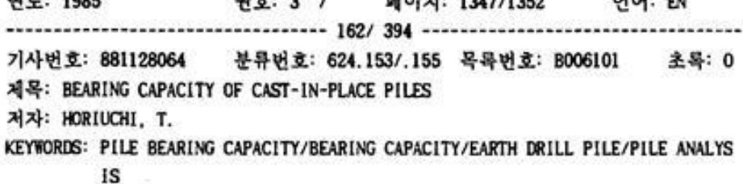  

HHE BASIS OF ONE ELEE IN-SIT LOAD TESTS OF CAST-IN-PLACE PILES FACTORS ITF LUEICIHG EEARING CAPACITY TERE STATISTICALLY AnAlYzEd AMDNG AWY FACTDHS PILE DIAMETER A PILE LENGITH TERE IDENTIFIE 10 8ETE HDST PreioM!NaNT E COHPAR ISON RAS LADE BETHE러 HEASURED LD CALCLATED BEARIFHG CAPACITY OVER FIDE RANGE OF THESE TAO FACTORS THE APPLICABILITY BEARING CAPACITT FOFMULA OF CAST-IN-FLACE PILES HAS CLARIFIED TEN THEY TERE LSED ENGINEERING PRACTICE  

원전: PRDCEEDINCS 05 THE ELEVENTH INTER AT IONAL COUFEREICE SOIT HECHA현도: 1985 권호: 3 페이지: 13931396 언어:163/ 394 _-  

기사번호: 881128059 분류번호: 624 1531 155 목록번호 BO061O! 초목: 0제목: EEHAVIOUR OF BORED ALIGER PILES 1 NORIALLY COUSOLIDRTED SilS저자: KRUIzInGA J INELISSEN H A m  

KEYYORIS: PILE BEHAVIOURYPILE SETTLEENTIPILE AMALYSIS/P!LE EEARING CAPACITY/ BEARING CAFCACIT!  

# 초목:  

BASED ON! HE RESLULIS OF PILE T515 Ad cCiI's DESIGH! FCRMLLAS FOR THE LOAD SETTLEHENT CIRVES OF RE PILES COULD BE ESTABL!SHED TESE FORLLS SEEJ 1 E AlS VALID FR 꺼E DESIGN OF 꺼E LOAD SETTLEMENT CRVES OF ALGER PILEs E RESLLT F PILE-LOAD TE5TS 어 BOPEd 사업 ALGER PILES ARE Shurn! I THIS PAPER FLHIHER IVESTIGATION 꺼E INFLLEICE OE SEVERAL PARAHETELS And TE VAL1DITY OF T1S DESIGN HETHOD F매 DIHER PILE TFE Is STILL GOIAT Hh  

원전: PROCEEDIEGS OFTHE ELEVEYT! [NTeRatIURAl CUFERENUE 며 SOIL MELHA  
연도: 1985 권호3 페이지: 1417/1420 언어:  
__ 14/ 394  
기사번호: 281129047 분류번호! 6241537155 목목번호! DD5101 초주:0  
제목: FIELD EYALUATIC! OF DIESEL HA나E래R PErFUhMLNCE  
저자: M J IgurfohskI I'm I Yalane G  
KEYLOROS: PILE DRI VING/CUNSTRICTICN DESIGN/P!LE AALYS!S  

초목:  

SIX SINGLE-ACTING 우H-EHD DIESEL HAHERs FERE ISED TO CRIVE 61-0 OLTAGONAL PRESTRXSEL CNERETE PILES TO ALLUVIAL HEPLX[TS CRIHG THE DESIG! AD COSTHLCTION OF THE 5T SEATTLE FREEHAY BrIDGE THESE: Six huers A ALHST ILENTICAl CHARACTERISTICS SPECIFLED By the hanlfacturers DNAMIC TEST RESULTS REVEALED ThaAT TE EFFICIELY OF THESE HALERS FRD5T0 45 LOS AS 17 PERCENT 꺼또 LARGE VARIATIGS I THE EER EFFICLECY LHPACTE THE PILE DRIVING RESISTANCES FOR PILES DIYE터! INT0 SIMILAR SDILS 꺼E DIFFEAEHCES RIYIHG RESISTALICES TERE AS M어 15 300 10 500 PERCENT DYNAMIC TESTING SHDALD BE PERFDFHED 10 EVALLATE HAMER EFFICLElT ESPECI ALL! LRSUAL CAGES ARE DESEHVE DRIVIHG RESISTACES ALD/OR HAuER PErfufuale DIESEL HAHHER PerFOr!AHCE CANDT BE EVALUATED BY DBSERVATIONS 어hY:  

원전: PRDCESDINLS THE ELEVENTH IN!ERLATICNAl COAFEREYCE SOIL MECHA연도: 1985 권호품3 ? 페이지: [507/1510 연어: 태165/ 34 -로기사번호: 881201049 분류번호: 624 153/155 목목번호: BOD61O! 초목: G  

계목: REHARIS 매 ISTRLME!ED DRIVING FOR OFFSHDRE PLATFORM PILES   
저자: ALBELT LF ThDdthi G F TVARISCD D IVEROHELL!   
KEYTORUS: PILE DR! VINGPILE RESISTANCEYP!LE BEARLAG CAPACITY/BEARING CAPACITY TPILE AHALYSIS  

TE FRITERS HAYE EEN IN CHARGE 또F 꺼E DESIGN A ASSISTANCE WRIAG IASTALLATION F THREE LARGE OFF-SHURE PLATFOERS AT CAHPLS BASIH BRAZIL THE CTER HAS REDLESIE HE EECUTICY 15 INSTRLMENTED DRIVING AOSSIELE EFFECTS OF STATIC FEIDT RESIDUAL STRESSES ARE DISCLSSED Interphetat Igh OF EXPERI METAL RESLLTS IS CENTINLED TEES OF AVERAGE GRAD!ENT SOIL ALHES!O! ith depth  

원전: PROCEEDIHLS OE 께E ELEVENTH INTEEHATIOHAL CONTERSHCE D SOIL MECHA  
연도 1985 권호31 데이지: 1581/1585 언여:165/ 394 _--  
기사변호: 881201052 분류번호: 624 153/ 155 목북번호: B0D5101 초:0  
제목: LLT IMATE AXIAl BEARING CAPACITY PILES DRIYE! 1NT0 CORAL Roox And CarBONATE SILS  

# 거자 HAGELAAR J /VAN SETERS A:  

KEYHORLS: PIE BEARIHG CAPAC!TYIPILE ORIYIHGrBEAR!NG CAPAC!TTZULTLMATE BEARIN6 CAPACITY/PILE ANALYSIS/STANLRD PEETRATION TEST  

RECURDEd LOAD TESIS HAVE ThAT THE ULTIMATE FEARING CAPACITY OF PILES DRIVE! 1NT0 CDEAL FORMLATIO!S CARBONATE DEFOSITS IS LE5S 꺼나 LD HAVE EXPECIE FH에 151T STAHDARD PEETRATION T5T 5PT] DTA 꺼Is PAPER PRESEYTS TE RESLLTS CF 25 AXIAL LOAD TESTS 매 STEEl PIPE PRESIRESSED COUCLETE PILES INTO SUH FORHATIOS FOH OFFSHORE PEOJECTS ALCG THE SEA CDUAST F SALDL Arabia A COPARISDN! IS ADE EETIEEN THE SOIL RES!STACES PREDICTED BY DYNAHIC AHALYSS ALD  

TE ACTUAL MEASLRED CAPACITIES Fr TH LOAD TESTS원전: PROCEEDINLS 05 THE ELEVEITH INTERNAT!ONAL CIAFERENCE SDIL MECHA연도: 1985 린호3 페이지: 1599/1602 언어: 더___ 167/ 394 ------기사변호 881201055 분류변호: 624 153/ 155 목록변호: B005101 초류: 0제목: DYNAMIC ALD STATIC TESTS 에 LARGE DIAYETER PILES In har CALCAREOLS 때Ys저자: ParK TED K IMICHAEL Hollotay D IChOT Eay y Ydarragh ROBEHT DKEYHORIS: STIFF CLAYIPILE DRIVING/PILE ANALYS!S/P!LE DESIGNIP!LE BEHAVIOUR초목:  

ThIS PAPER PRERENTS CASE HISTORIES OF 18 AND 1 0 HETER DIAMETER PIPE PILES DRIVEN I VERY STIFF TO HARD CALCAREOUS CLAYS AT THE NEARSHORE OF TE PORT OF PLERIO BOlIVAR COLOMBLA 거 FIELD TEST PROGRAH YAS PERAFOFHEL 10 RESDLVE UNCEHTAINT !ES 1서 ESTIMATING SOIL SET-UP LLTIMATE STATIC CAPACITY ANd PILE DRIVEABILITY [ CALCAREOUS CLAYS PILE DRIVING BEHAVLOR DURING INITITAl AD RESTRIKE DR[VING HAS MOHI TORED Hith A pILE DRIVING ANALYZER FOR FOUR IH METER DIAUETER PILES DRIVE! BY A hydRdBLC 1500 And T0 10 METER DLAHETER PILES DRIVEH! BYA DELHAG D8D-12 A STATIC LOAD TEST Als AS PERFORIED 매 ONE I 8 HETER DIAHETLR PILE ORDER 10 VERIFY PILE PENEthATION CRITERIA AND T0 CALIBRATE THE DYNAMIC TEST AESULTS BASED ON THE RESULTS OF THE TEST PROGRAH THE IRSTALLAT ION CRITERIA In TERHS BLOBCAUNT And hinIhem PILE PENETRATION HERE REFINED D EASE SIGNIFICANTLY OHCE THE LARGE RAPID SDIL SET-LP COHTR I BUT IOHS 10 LOIG-TEEM PILE CAPACITY FERE DEmOStrATEd  

왼전: PROCEEDINIGS OF E ELEvENth INTERHATIONAL COFERENCE 머 SOIL MECHA연도: 1985 권호:3 :] 페이지: 1615/1618 언어:드- 168/ 394 ----  

기사번호: 88120105? 분류번호: 624 153/155 목록번호 BOD6101 초류: 0  

제목: ANALYSIS OF BATTER PILES저자: TYAGI G R S IPRAKASH SHASHER  

KEYTORLS: BATTER PILE ALALYSIS/BETTER PILEIPILE AYALYSIS/PILE BEHAVIOUR 초륙:  

A METHDD F ANALYSIS OF BATTER PILES IN SANDS BASED UFO!REALISTIC HON-LIMEAR P-Y AELATIOSHIP HAs BE려 DEVELOPED 115APPLICATIOH HAS 8E DEIUSTAATED FOR SMALL SCALE PILEFuLL SCALE FIELD PILE TESTS  
원전: PROOFEDINLS OF HE ELEVEYTH ITERHAT IONAL COHFEREHCE 어 SOIL HEHA  
연도: 1985 권호: 3 } 페이지: 1623/1626 언어:169/ 394 --  
기사번호: 830713053 분류번호: 0505 목륙번호 BD02930 초륙못  
제목: 지하가UDErGrolNd STRLCTURE건설공법  
저자: 김갑배  
KEYGORIS: 지하가건설공법/지중연속벽재공법/5너터[ P1LE/건설공법  
원전: 인본파견한국건선시찰단귀국보고  
연도: 1983 권호: 쾌이지: 23 749 언어: ko170/ 394  
기사번호: 88072601! 분류번호:55146 목목번호: B007413 초탁:X  
제목: 해양건설:해양구조물기초 4-FOUATIOS 0F 꺼E OFFSHDRE STRLCTURES  
저자: 이인모/김준석  
KEYTORIS: 토질탐사/중력식 채취기/해양구조문/PL도  
원전: 대한토목학회지 V 3A NO I-5 85 2 46 8 10 12  
연도: 1985 권호:3476 페이지:16 122 언어ko[71/ 394  
기사번호: 880726015 분류번호: 55146 목족변호: B007413 초목못  
제목: 해양건설:해외의 해양건설동향과 우리의 방향 8  
저자: 이강연/권용태  
KEYTORIS: 해저석유개발/해양설치작업PILE 방타/LALN어 BARGE  
원전: 대한토목화회지 NO 1-6 85 2468 10 12172/394  
기사번호: 880805026 분류변호: 6243/7 목북번호: 5D08244 초륙한  
제목: 말레이지아페남고건설공사  
저자: 임형벽  
KEYTORIS: 말레이지아 페남교/P는 PILE CAPIPC BEAHYP!ER DECK SLAB COICRETE  
원전: 대한토목화회지 133 NO I-6 852 1 6 8 10 12  
연도: 1985 권호33/4 페이지:34 /46 언어: KO173/394  
기사변호: B90522063 분류번호: 624 131 5 목독번호: B00782!  
계목: 접합요소문 이용한경계면레서  
저자: 박병기/이문수/차복남/이진수  
KEYIOFLS:북합지반/SHEET PILE지반 침하/지반변위/유한요소법  
원전개요집1학습반표피7  
연도: 1987 권호: 페이지: 344 7355 인어: ko잡 174/394 그--  
기사번호 800822035 분류번호 624153/155 목목변호: B007821  
계목: 지진하중을 받는 지반-과인시스템의 거동해석  
저자: 이현중/이인모  
KEYFORIS: 지진/파인LE지반파일 SYSITE  
원전: 개요집1:학습발표회87  
연도: 1987 권호 페이자: 4737477 언어: K  
--- ------ 175/394 ----와 ___-  
기사변호: B20922020 분류번호 6241 목특번호: B00355! 초특0  
제목: SEPARATICN! FINCT I CN BEARING CAPACITY 05 MON-HOVEN FAERICS IN SPECIAL GEOTECHENICAL PRACTICE  
저자: BRANDl H  

KEYEORIS: PILE FOLNDAT IONYVERT I CAL DRAIS[SETER PIPEIMETAL CLVERT/RAILLAY 0 NST RLCT IONYNON! E! FABRICYBEARING CAPACLTYIGEOTEXTILE  

THE REFORT GIUES FOUR ExAHFLES 에TE APPLICATION OF NON TOHEN! FAERICS In CIVIL ENGINEERING PRACTICE! PREDOHINANTLY THE SUESOIL 15 CULS!STING F EATER SATLRATED Ad vERY COIPRESS!BLE FIMES PILE FOLTATICS: IN PEATS SOIL5 OFA SOFT PLASTIC TO LIQUID ODNSI ST ENCY CONSTRICTION OR ICDNTROLLED FLO T0 THE SIDES OF THE FRESH CONCRETE INTO THE SO!L CAH! EE AIDIDED BY TRAPPING A STRETCHAELE NON ROVE! FABRIC AROLND THE HEINFORCEMENT CAGE OF THE EDRED PILE THIS METHD HI5 ALS PRDVED SLCCESSFUL SUESD!LS I께 CAY!TIES And FOr RELUCING NEGATIVE SIN FRICTION VERT ICAL DRAIS FOR THE ACCELERATIOH OF COUSOLIDUT ION! SETTLEHENTS CDSISTING OFHON R0U려! TUEES FILLED 꺼 SAND FOURDHT IC O5 METAL CULVERTS 에 SOFT GROLIS: CAREFULLY COHPACTE ENCASEMENT CAY EE GI공E BY L5IAG GEOTEXTILES RAILRAY CONSTRLCTIOH: BY H도AL5 OF 태모EA FAERICS TE PLPIHG LP OF FINE PARTICLES Frh the SUESO!L INTO THE STOHY BALLAST CALSE DYNAHIC LOAS IS PREVETED  

원전: SEOOND INTERNAT IONAL CUNFEREYCE GEDTEXTILES연도: 1982 권호24 페이지: 441 1446 언어: 태_ 176/ 394  

기사번호: 800922022 분류변호: 6241 목특변호: B003651 초묵: 0  
제목: SYNTHETIC FABRICS A5A COHCRETE FORHING DEVICE  
저자: TELS J P IDMI ISXE D  
KEYTORLS: Od SthuCT! ON HATERI AL/CUNCRETE PLACEMENT/MATTRESSES/P!LE JAOXKETING!FOEM!NG Systehlnterfater CUNLRETE PLACEMEYTILIMESSTONE CAVITIES  

SINCE TE ADVEIT 0F CDNCRETE A5 4 COISTRLCT ION MATERIAL EGINDAS CUNTRACTOFES HAVE RESTRICTED 11 1TS U5년 BY HE RIGID FORS OF STEEL T00D REQUIRED 10 CONTAIN THE OUCHETE LTIL I15 INITIAL SET In the EarlY 1900's ANOTHER MAN-MADE MATERLAL STNTHETIC FABRIC AS PIONEEREL! 45A FLEX!BLE FORHING  

SYST려 FOR CONCRETE PLACEMENT 꺼5 GREATLY EYPAIDING 꺼E FUTENT IAL I5E5 OF CONCRETE FURTHERMDRE THE RELATIVELY LOT COST OF THE SYNTHEFIC FABRICS HAS RESULTED IN MORE ECONOMICAL ONCRETE PLACEMENT COSTs HIS PAPER HILL TRACE THE NEARLY20 YEARS OF SYNTHETIC EAARICS AS A FORHING SY5I래 COVER ING IT5 HISTo0Y FARRIC DEVELOAMENT DESIGI IN5TALLAT!ON CRITERIA AM SIGNIFICALT CASE HISTORIES 1 TE FOLLORING AREAS MATTRESSES FOR SLOPE PRDTECTECT ION PILE JACKETING TUEES EAS FOR ULERHATER COICRETE PLACEET COLLIS THEDUGH MINES A LIMESTDNE CAVITIES MISLEIAHEOLS U5ES  

원전: SECDND INTERNATIOHAL COHFERENCE 어 GEOIEXTILES면도: 1982 권호: 2 매이지: 457/451 언어:  

기사번호: 880928052 분류번호: 624:9 목특번호: B007957 초륙: 0제목: THE IMRGVEHENT FA TALK FOLDATION BY THE 국구 1TS CN TEST LOAD저자: PElAN A D M /EatsdN G H  

KEYTDRIS: TAVt STABLL!TYTHYDRAULIC F[LLFRC PILE/ROK PIER/PORE PRESSLRE/SETTL  

THIS PAPER DESCRIBES TE DESIG! A TEsTING OFA TAAR? FOLUUDT I0N 에 SOEFT HYtrallIC FiLl thich AS INIT!ALLY 100 FEAK TD SUPPORT THE FULL TaK LSE HAS MADE OF THE INCREASE 1국 S품국 OF FILL CALSED BY THE FEIGHT OF THE TAK ITSELF AND CALCILATIDNS WERE MADE OF THE Max IsM PERMISSIBLE PORE PRESSURES 내I대 CLLD BE ALLORED COSISTEHT FI꺼 STABILITTY CF HE Tak FORE-PRESSURE A세D SETILEET OESERVATIOS TERE HADE 10 CONTROL THE TEST LOADING ANd THE TAK AS SLIMESSFLLLY Filled RITHOUT ALY DAMAGING DIFFERENTIAL SETTLEENTS 1N A MItH SHORTER TIHE ThaN H BEN PREDICTED  

원전: PROCEEDINES OF THE SIXT INTERNATIONAL COAFERENCE H SOIL MECHAHIC기사번호: 880929026 분류번호: 62413 목목번호: B00045! 초륙: 0제목: PILE FOLNTETI0N PROLLEYS 1 THIITE CALK  

KEYTORDS: HITE CHALKPILE FOLNDATION  

# 초복:  

TE IHISHED WOTOREAY FRP4 무GEHT GEFULANY Is CROSSING APPROX 5 TIDE SITRETH 마F HATER CAILED STORSTR PHIMME SEPARATING THE ISLANIS OF EALAT Ald falSter GEOTECNICAL INVESTIGATIOS FOR THE FDxDHTIO! OF ThiS LiK VA! H ISLET OF FAR PHI-TE FAR PHI-ERIDGES FOR TE DANISH R표 DIRECTORATE FLAVE SH0A DIFFEHENT PALDBLEMS CONCERNIITG HE 75 MILLICN YARS OLD THITE CALK CDSISTIL OE HICROSOOPIC CRYSTALS 1께 EEDDED SLIRFAGE ThROUG! A념 ETEISIVE OF LAbdrAtOry IN SIT TESTS A 10RT고국 MATERIAL FOR THE GEUTEONICAL DESIGA! HAS 드러 ESTABLISHED FUR 꺼1S RATHER SPECIAL SOIL  

원전: SOIL MECHANICS A FOLNDATIO ENGINEERING TENTH INTERNATIONAL COF  
현도: 1981 권호:1 페이지: 31 /34 언어: 태서1797 394 --  
기사번호: 820929054 분류번호: 624 153/ 155 목목번호: 207957 초목:0  
계목: THE Max IhM PLLLING FORCE ON A SINCLE TELSION PILE CALCULATE OH THE EASIS OF RESLTS OF T또 AHES!ON JACKET CNE  
저자: EEGELANN: HK S:  
KEYTOHIS: ALHESI0! JACXET CONE/TESION PILEvPLLLING FORCE  

초목:  

FIH TH ADTESIO! JAOET CONE BOTH TE C아E RESISTANYCE THE LOCAL FRICTION OF THE VARIOUS LAYEES CA BE Heasured 'BY MEANS OF 꺼E RATIO BETTEEN THESE Tio THE TYFE OF SOIL CA서 EE IDETIFIED CHTE BASIS 0F RESULTS OF VARIOUS PULLING TESTS A  

CALCULAT ION! HETHOD HAS BEE DEVELDPED MIKIHG PLSSIBLE 어 THE STREGTH OF TE C때E RESISTANVCE LOCAL FRICTIOH! MEASLREMENTS T0 COMPLUTE THE MAxIHM PULLING FORCE BUTH FOR OUNT I MLDLS L0 FOR FLLCTLATIHG LOANS FurthERMDRE THE SELAPE F THE PILE POIN! HE PILE SYSTEA PRDE T0 HAV도 A치 INFLLELE HIH CAN LIKETISE 표E ALLOe FLR I4 꺼IS EThDD  

원전: PROCEEDIHGS 0F THE SIXTH INTERAATIONAL CONEEREICE ON SD!L MECHAVIC  
연도: 1955 권호21 페이지: 229 [232 언어:1801394 ----  
기사번호: 800929055 분류번호 624 153/ 155 목목번호: EDD295? 초목:0  
제목: BLCKLING F PafTIallY EEELDED PILES  
거자: DAVISSON T TROBIISON KE  
KEYTORIS: HENDIHG/BUCL ING LOADYEMEEIDED PILE  

초특:  

APPROK !MATE PROCETURE 15 DEVELDPED FUR TREATIEG HE PRDHLE 마F BEHDIHG BLOXING DF PAKTIALLY ELEDDE! PILES 꺼E PRDCEILRE 물AS DEVELOPE I국 THE USEOF TEOTETICALLY COERELT SOLUTIOS APPLICABLE 10 A PARTIALLY EMBETUED PILE SEECTED 10 HOMENT SHEAR Ax IAl LOAS H! ACTIHLG SEPARATELY 1T 15 SD게 That a fahtially EEETRED PILE MaY BE REPRESENTE AS A FREE-STAHDING PILE 께 A FIXED BASE AT A EFTH EELO? THE CROLND SLRFACE EOLAL 1T014R CR1:8T THERE $.R\,=\,\mathsf{E I-K}(11)4$ SuERAC MODULLS CUNSTAYT [께 E AND T $\circleddash$ EI1!}5 I SExRADE MODULILS I NCRELSING LINEARL! DEFTH:  

원전: PROCEED!HGS OF THE 5IXT LNTERVATIONAL COFERENLE HN SOIL HECHANIC  
연도: 1965 권호2 1 페이지: 243 /245 언어:181/ 394  
가사번호: 830229057 분류번호: B24 153/ 155 목류번호: BD0795? 초묵: 0  
계목: COASTRICTI0H LOAD EFFECIS SETILEHENT OF A SFT 때Y FOLNDATICN  
저자: G1EES H J Imerriman J  

KEYTCRIS: PILE FOLREDAT IONYSOFT CLAY/SETLLEHENT/LOAD TEST YBAORFILLIHG 초목:  

A plhpihg plant LOCATE In ah AREA OF LEEP SOFT LIKE SEDIVENTS 꺼E BLHEAL Of RECLAMATiOH'S gILlARd CanAL KELT OGDEN UTah REOUIRED A FRICTIO! PILE Foutht Idh THE SPECIFLED BOTIG ELEVATLON OF THE pLaNT AS 35 FEET BELOT THE SURFACE IN SLFT SEDIMENTS F PFODR STABILITY FESLLTING EXTESIVE EXCAVATION AREA HIH 1A5 ATER BACXFILLED DESERVAT ION FOLNDATICN SETTLELEET A5 STARTED IMEDI ATELY AFLER PILE5 WERE PLACED SEITLEELT HICH OOCLRRED DURING CUISTRUCT ION ZA5 OF MUH CUHCERH APPRECIABLE LOAD CHAHGES CALSED BYF BAOXFILLIAT THE EERTELSLVE EXCAVATION 45 CDLSTHUCT I CH PHOGRESSED HRE DIST INCTLY RELATE 10 TIS SETLEHEHT TEIR EFFECIS FERE APPARETLY 50 ETEIS!VE THAT THY ECDfASSE 꺼ㄸ THOLE PILE FanDAt!Oh AFTEA BACAF ILLING THE PLAATT APPEARS TO EE SATISFACTORILY SLPPOATED BY HE FRICTIGN PILES AS ERPECTED HOTEVER THESE SET TLEHEHT RECDRLS LEdStRATe THE IMFORTANCE OUstDeRIng ECAVATIdY BACKFILLING LOA HAGES  

원전: PRCCEEDFHCS THE SIXTH INTERAATICNAL OUNFEREAICE SOIL MECHANIC  
연도: 1965 권호: 2 페이지: 247 125! 언어:182/ 394  
기샤번호 BB0929058 분류번호: 624 152/155 목목번호: 007957 초락: 0  
저목: HEASIREHENT TE INFLUEYCE DF LATERAL Eakh PRESSLRE OY PILE FOLNDAT!05  
저자: Heymah 너  

KEYFURIS: PILE FolhilAt IOhEaRth PRESSUREISAND DRAIN?FE DING MIMENT/EC PILE 초와:  

A HOAD EbaKHEt F I kA CIUSIST ING 4 1-M-HIG SAID FILL 토 10 BE OusThUCIED ALOG EISTING BuILDins FOunDE 매 PRECAST REINFORCE COAUCRETE PIL5s TE OEHLDAD 때께E SATURATED  

PEAT AAT CLAY LAYERS REACHIHT T0 12 M DEPTH CAUSED LATERAL DEFOEMLATIOS OF HE SUESOLL RESLLT IHG [서 CUYS!DERABLE LATERAL EARIH PRESSURE C P!LES VERTICAI S DRAINS RELIEYIHG PLATFORS TERE LSED 10 PREYEHT CVERLOADIIG OF THE FOLNDHTIO! PILES THILE TORK FAS IN PROGRESS 꺼E EFFECTIVE BEDINHG HCMEYTS HEHE HEASURED HI꺼 STEEL TEST PILES EQUIPPED ELELTHICAL SRAIN GALGES THE SUESDIL DISPLCEMEITS 또 HORI2CHTAL REACTICH! AT TFE TOP OF THE TEST PILES LEAE RECORDED AdAY OF RCLXCHLY ESTIHETIHT THE BEIDING MOMENTS OCCURRING HE PIIESBY MEASLRIG! THe HOrI ZONtal REACTICN FLHCES IS SUCGESTED TE DESERVATIOS ON THE TEST PILES FILL 표E CONT INUED  

원전: FROCEEDTNCS F HE SIX INTeRHATIONal CDAFERENCE SDI1 YELHAHIC  
연도: 1955 관호 2 페이지: 257 7280 언어: 버183/ 394 조----  
기사번호: BBD29059 분류번호: 624153/155 목록번호: B00795? 초록0  
제목: HEASLREMET OF 꺼E COMPRESSION OF A STEEL PILE 10 DX LHE 10 SETLEME!I OF E SURROLNDI NIG CLAY  
저자: JOHA+TESSEN 1: J /JERreM L  

KEYHDAIS: CLAY SETTLEMETTISTEET PILE  

초륙!  

THE PAPER ESCRIEES THE HEASLRE ENTS HE OOFFESSION OEA STEEL PILE RIVEN 10 Roox THE DU!PRESSION 15 CALSED BY 께E AEGAT[VE SIN FRICTION FRS HE SurROU dInG Clay OLLY THE CLAY IS A SOFT T0 MED!LM SOFT MARINE CLAY UNDE THE FEIGHT OF10 FILL IT HAS SE ABOUT 12 M FRM THE SHORTENING OF THE PILE IT CANBE ONCLLDED THAT THE STRESSES 19 THE STEEL LE T0 꺼E NEGATIVE 없I서 FRICTION ARE H대 AD EXCEE TE ALLOEABLE GISIG LOA 서도R THE FOIN OF THE PIL A! INTERPRETATION OF THE OIESEAVED COMPHESSION OF THE PIL도 INDICATES THAT HE DEYELOPED AHESIO BEtHEen pILE and day iS apPPOx IMatELY DISTRIBLTED 45 꺼E EFFECTIVE VERT!CAL STRESSES  

원전: PFDCEER!HTS OF THE SIXTH IN!EREAT [ONAL COHFERENICE 마 SOIL HECHANIC  
연도: 1955 긴호: 2 페이지: 261 724 언어:  
_ 154/ 394 드--- 드_  
기사번호 BB09290G0 분류번호: 624 153/ 155 목특번호: 8007957 초목: 0  
제목: BEAAING CAPACITY O5 PILE GHOUFS UHDER ECENTRIC LOAIS In SAD  
저자: KISHI며 H MEYERHOF G G  
KEYHORLS: BEARING CAPACITYYPELE FOLNDAT IONYECLENIRIC LOADYLDUSE SAAD/DEISE SD  

# 초목:  

HDDEL JESS FFEE-STANDIG PILE GRDUFS AD PILE FOLRDAT I CS I께 VARYIAG ML-BERS SPACINGS OF PILE5 LRUDER CELTRAL ECCELTTRIC LOAIS 1N LOISE LESE SAIIS ARE ANALYSED 마 AA ETEILED THEDHY 5 BEARING CAPACITY OF FOLNDATIOS  

원전: PRDCE2DINGS OF THE SIXTH THTERATIODAL CORF EREICE DI SOIT HECHANIC  
현도: 1965 권호: 2 | 페이지: 270[274 언어: 태185/394 -4르결:  
기사번호: 80092905! 분류변호: 624 1537 155 목록변호: B00795? 초특0  
제목: ExpeRIMEITal STLDY 꺼E BEfAV[OE F ATERALLY LOADED PILES  
저자: KLED K  

KEYHORIS: LOA TEST/PILE FONDAT LCN/SATUY SDIL/STEE PILE  

# 초목:  

LATERAL LOAD TESTS HERE CARRLED OUT O! DDEL STEEL PILES EMBEDDED In SARDY! SOIL AH AET EXPRESS!CN $P=K$ KYexp 05 FOR TE RELATIO SHIP BETHEEN SOIL REACTION P: AD PILE DEFLECTION 1주 I5 PROPOSED CDTLLS!OH FACTORS DERIVED FROH THE PROPOSE EPRESS!O! FP YA보도 UTIL1Z 10 PREDICT THE BEHAVIOLR OF A PRGTOTYPE PILE ON THE BSIS THE HODEl TE5T RESULTS SO!I REACTICN COEFFICIEYT K DECREASES ITH THE IACREASE PILE HIIH BLT IT BECDES ALDST COISTANT THE PILE  

HIJDTH IS GREATER 꺼A20 어 EFFECTIYE LE OF LATERALLY LOADED PILE 15 NT HDRE Than 15 IMi THERE LMI Is 꺼E DEFT THE FIRST FOIHT CFF TE MMet CURVE UAHY FIELD TEST 매TA ARE CULLECIED ExaMIHe 10 SHO TAT A LN!OUE RELATIC SHIP EXISTS BETTEA! THE SDIL REACTION COEFFICLENT K THE STAD로 PELETRATIH! VALLE N DOTH I SANDY LAYEY SOIS  

원전: PROCEEDINCS OF THE SIRTH [IATERAATIONAL CONFERENCE G SOIL HECHANIC  
연도: 1965 권호:2/ 페이지: 275 /279 언어:  
--_ 185/ 394 ___-  
기사번호: 880929052 분류번호: 624159 목부번호: B007957 초+:0  
제목: TE IRFLUENE ADUACENT BUI1LDIMG PILE DRIVING FOR FOR THE M IT ATERIALS CENTER  

저자: LAMBE I 1 가HOAN HKEYTORIS: MIT/BUILDING SETTLEVENTTPILE DRIVINGTPORE PRESSURE초륙:  

THIS PAFER PAESEYTS THE RESULTS OF FIELD HEASZFEMEYTS OF 꺼EHAVE SETTLEMEHT OF BUILDINg 10 AHD THE PCHE ATR PRESSIRESDEVELOPED LR BU!LDI 10 AS THE RESLLT OF PILE DRIVING AT AAARACEHT SITE VaxImh heaYES BETHEEN O O2 AHD O OS FT HEREMEASURED LRING PILE Driving And haximl NET SETTLEHEHTS BETE러0 22 AD O OS FT TERE RECORDE AFTEA COHIPLETIOH! OF PILE DRIVINGVALLES CF ExCE5S PORE PRESSLFE HEAD I ECESS OF 4FTF TEFERE HEASLRED A THETIRETICAL ANALYSIS BASED ON THE STRESS PAHHETHDD DRRECILY PREDICIS SALL KET SETILET BLTCOUS!DERABLY! OVERESTIHATES 꺼또 ACTLAL VALLE  

원전: PRDCEEDINGS OF THE SIXT INTErATIOHAL COIFERENLE O SoIL HEChAHIC연도: 1955 권호: 2 페이지: 280 /254 언어:187/ 394 --  

기사번호: 830929053 분류번호: 624 153/ 155 목목번호 B00795? 초묵:0계목: [NELCED FDRE PRESSURES CLRING PfLf-DRI yInt OPERATIOS  

저자: \* 'Y ISTERMAC A G KEYRORLS: PILE IR!VINGYPORE PRESSLREIPILE FOLDATION  

THeORY FOR E5T1로T1N The haxImy FORE PRESSLRES INDUCED 바 PILE DRIVING I5 PRESENTED THeOrEtICal RESULTS ARE COHPARED HEASUREFENTS CARRIED OUT AT THLEE SITES AHD SHE PLBLISHED DATA THE MXIHM FORE PRESSLRES HaY BE ESTIHATED FITH REASDLAELE ACCURACY THE HETHOD PRDPLSED 15 MAGNI TULE DEPEHIS THE STRE55 HISTORY PORE-PRESSURE CHARACTERISTIC OF THE CLAY BLUT 15 IHDEPEHDEHT F PILE DIMESICLS 무ITHIH A RADIAL FAILLRE Z0E THE SDIL SURHDLHDIN THE PILE THE PORE PRESSLHES R도 CD5TANT: OUTSIDE TIS ZOHE THEY DECREASE RAPIDLY D1STAICE FR THE PILE 꺼E FORE PRESSURE CELERALL! INCREASES 꺼 DEPTH RESULTING FHM INCREASE IH EFFECTIVE DVERBLRDEH STRESS THERE IS N0 DIAECT SUMATIOH OF FORE PRESSLRES FITHIN THE FAILURE 2OE OF A PILE OHING TO THE DRIVING DF ADJACET PILES  

원전: PTOCEEDINLS OF 꺼E SIXT INTERATIOHAL CONEEREHCE SOIL MEHANIC   
연도: 1955 권호: 2 폐이지: 285 /289 언어: 186/ 394 -   
기사변호: 82100400! 분류번호: 52413 목부번호 B00-45! 초목: 0   
제목: OSTRUCT IDN! FA A PILE BALL HDOXFILI   
저작: BREDEBERG H IADDING A ISICKVIST K   
KEYTORIS: PILE EaLLyRDUXFILL Damy anchdrage/dr Illed-In pIlE FALLAESILE FORCE TIEBAC? AKHR SY5TE  

1 CDnjUNCtION 께 EFAYS!ON OF HE HARSPRAHGETS FOTER STATICN In nORTHERn SHTEDEN A LARGE PART F420N HIG Aodx-FiLl Dh Had TO BE ECAVATE REHDNE HILE AT THE SAME TIE E LEVEL OF EATER UFSTREA! 5 TE Dl COULD NOT  

LONERED AFTER A ALHBER OF ALTERHATIVE PLAAS HAd BEEN COUNSIDERED IT AS DECIDED 꺼T 꺼 EXCAVATIOH GOFK TOLLD CARRIED OUT FITHIN PILE FALLS CISISTIHG OF DR!Lled-In RE!NFDRCED TUBLLAR STEEI PILES THE GAPS BETHEA! THE PILES LEAE SEALED H께 SHOLCRETE ADTH도 BALLS ERE ACHORED THE RODX BY PRESTRESSED TLEBAGKS 4 CLHPREHESIVE CONTRDL PROGRALME AS PRESLRIBED OHLY VERY SLALL HDHEHEYTS IN THE CLL BE PERMITTED THE fORK 월A5 COCAM!SSIOI 매 THE 5SDIS STATE FHR ROARD The maI! ONTRACTDR HAS STABILATOR AB THE CONSTRICT I oN FoRk HAS CARRTED OUT BY GEOBERAKNINGAR  

원전: SOIL HECHANICS FONDATION ENGINEERING TELTH IHTeRAT IOHAL LE  
연도: 1981 긴호: 011000 매이지: 005710054 언어:189/ 394  
기사번호: 881004002 분류번호: 62413 목목번호: B00045! 초폭: 0  
계목: PARTIAL SAFETY EACTOES IT PILE BEARIG CAPACITY  
저자: DE BEER E ILOSBERG E /DE JOHICHE A /EALLAYS H ICARPETIER R  
KEYHOFIS: PILE BEARING CAPACITY/BEARING CAPACITY/DEISE SAA다 LAYERYRUPELIAL-BO에 CLAY  

FRCMI ETESIVE STUDY F LOADIG TESTS OH PILES 꺼 DIFFERENT BASE DIAMETER 44 STIFF FISSLRED CLAY 부IT A SHALLOF EpTH 1 A DESE S IT 15 DEORCED TAT TE ALLODABLE BEARiNG CAPACITY CAN B도 COTAINED FR4 THE LLTIMATE BEARING CAPACITY FORECAST FEL HE RESLLTS OF CPT TESTS BY APPLYING PARTIAL SAFETY FACTORS 아E F1 OVERING E PROBLEM OF LAFGE DEFORHATIOS AD THE OTHERS NI AD N2 COVERING 꺼E DISPERSION RESP FOR BASE Ad LATERAL BEARIHT CAPACITIES  

원전: SOIL MECHANICS FOLNDATION EIGINEERING TETH IHERHAt ICHAL ODHF연도: 1981 권호: C011000 매이지: 010510110 언어: 머190/ 394  

기사번호: 88100401! 분류번호 624 13 목특번호: BDO04S! 초륙0  
제목: PREDICT[ON OFA DRIVA! PILE SEITLEMENT  
저자: FEDA J  
KEYTORIS: DRIVEH PILE SETTLEMENT YCIAYSTONES[SILTSTONESTUNOONE IHED OLMPRESSI 이TESTISKIH! FRIC[[O!  

T꺼E PPEDICTION OF THE LOAD-SET TLEHENT DIAGRAH OF A dRIVEN PILE 10 35 X 035M L-8M! 15 DESCRI BED 매I대 TAS LATER CORFROHTET 께 THE RESULTS OFHE FIELD LOADING TESTS TAKIHG 1NT0 ALOOLLT RATHER DIFFICLLT SUESO!L CUDITI0S ALTERNATING HARD LATERS OF CEENTED CLays CLAYSTOEES SILTSTO5S! THE SCANTY 머TA F THE LE'CONF INED COIFPESSION TESTS OF FOLHDAT I! SOIL 꺼E PREDICTION EAS B태A QU!TE RELIABLE IFOR THE OPERATIONAL LOD TE SETILELENT PAEDICIED 10 HEASLRED 4 My TE ANALISIS OE THE LOADING TEST RESLLTS SHOHED ThaT THE ACTUAL VALUE F 꺼E SkIN FRICTICN EAS LOTER A HAT OF THE FOINT FFESSLEE HIGHER THAN PREDICTED TE REASOAS FOR SIH DEVLATIOHS ARE IADICATED  

원전: SDIL HECHAHICS FCLNDAT IOH EHGINEERING TE InterAtICHal CNF연도: 1981 권호: 0011000 페이지: 0119/0122 언어: 터기사번호: 881004030 분류번호 624 1537 155 목륙변호: B00795? 초목: 0제목: COMBIHE CAST-IN-PLACE PAECAST PILES FR THE REDUCT!ON DF NEGATIVEFRICTION! CALSED 8Y EMBAMEH! FILL  

저자: LOCHER HG   
KEYTORIS: EhrauxENt FILLICAST-IN-PLACE PILETPRECAST PILELPILE FOLMDAT IONYINEG ATIVE SKIA! FRIGTION!  

초묵: FOR A ROAD RAILEAY BRIOGE AT HOOSMATTE IN SHITZERLAND A PILE FOLHLATICN LSING COMBIHED CAST-IH-PLACE PRECAS! PILES  

RAS ALDPTED IN ORDER 10 REDLLE HEGATIVE 없IN FRICTION! OH PILES 꺼E PAPER GIVES A DESCRIPT ION F THE SOIL COND!TIC'S TE ALDPTED SOLUTI0N FOR THE PILE FcndTIoN IT ATTE1S 10 CALCULATE AEGATIVE FRICTICN FORCES GIVES RESLLTS OEF LOADING TEST DE PILE  

원전: PROCEEDINTS OF THE SIXT INTERETATICNAl CONFERENCE ON SDIL HECHANIC  
현도: 1955 권호: 002/000 페이지: 0290/0294 언어:192/ 394  
기사변호: 881004031 분류번호: 625153/ 155 목북번호: B007957 초/: 0  
제목: CUYTERING EXCESSI VE SETTLEHENT OF고 NAREHOLSE FOLEDED On PILES  
저자: WOHAN D /AAIN G STRSTIDAR A G  
KEYHOFIS: PILE FCLNDAT IONISETTLE-ENT OF HAREHOLISE  

# 초묵:  

SETTLEET BEAVIOUR OF A LAFGE SIx-STUREY STRLCTLURE FOLH 머PILES HVING FLAT 5LA COSTRLCTION FOR 터대 FLODR RASSTUDIED HE COUSOLIDATI ON E SILTY 때Y STRATLM UNTERHEAThTE PILE TIPS ITH 아Y THE GEad Load OF THE STRUCTURE [HARlY50 PER E OF THE TOTAL ESICH LOAD GAVE RISE 10 EXCESSI VESETTLEVEYTS LRAOS CEVELOPE [ TE LOTER FLODRS IN ORDER1 PARTIALLY FELIEVE T또 ETE STRESSES PRElOAdI At ThEPeriphlry EAS PERFORMED LNIFOR! SETTLEMET LLDER THE Extra LIVEL0AD AS ALS 5퓨니 BY EXCAVATING A STEPPE RsEMet IECENTRE THE PAPER DEALS 1께 TE AULLYSIS OF 꺼E AROVE PRDHLEMDETAILS CFUTATICA'S MALE TO DETERUINE THE EFFECT OF THEFILL AT THE Perifhery A국 SIE DEPT F THE BASEMEHTRetLiHEd  

원전: PROCEFNINGS OF THE SIX INTErNATIOHL COUFERENCE 에 SOIL HECHANIC연도: 1965 권호: 002/000 제이지: 0304/0308 언어:- 193/ 394  

기사변효: 881004032 분류번호: 624 153/ 155 목목번호: B007957 초복: 0계목: IHTTESTIGATION 0F PILE RESISTAAHLE BY DBINE SLFDI고G저자: Shasxdw s  

KEYTORLS: 0IM SDNDINGTPILE RESISTAICEIRC PILEYBEARING CAPACIT!초락:  

THIS REPOFT CONTAINS A DESCRIPTICN 05 ExPERIMETAL HOFK CARRIED BY THE SCIENTIFIC RESEARH ISTITUTE OF FOLNJDATLOS AM IndeRcholnd STCTRES AT SEVELAL SITES INVOLVING THE INVESTIGATIOH OF E RESISTAHLE 05 RELAFORCED COACRETE PILES BY MEANS OF THE C-BInE SOLNDIHG METHOD THE PRINCIPAL ASSLMPTIOS LSE AS THE BASIS OF TIS MEthOD aRE ExPLIne BRIEFLY DESCRIEED HE RESLLTS 꺼E ETERHINATICN 05 THE RSIS고F OF REINFORCED CNLRETE PILES BY TE METHOD OF CDMBIHED SUND!NG A CParIso OF THESE RESLLTS I께 THOSE CBTAINED BY TESTING THE SAL도 PILES 리꺼 STATIC LOAIS 15 PRESENTED FORMULAE FOR CHLCULATING THE RESISTAICE OF PILES BY THE METHOD OF CB!NE SOUNDING ARE GIVEN FIELD AD LAEdrATORY TESTS HAVE COHFI RJED THE INATIAL ASSLMPTICNS TAT THE SPECIFIC RESISTANCES OF THE LOTER ED AD THE SILE SIRFACE OF PILES THAT ARE SLEJECT 10 VERTICAL LOAIS MAIY Ifoy tThe PRDFERTIES OF THE SOIL SLRRDUDIHG THE IND!V!DUAL PILE AND NOT CN THE DIME SICUS OF 1TS CROSS-SECTION THE RESULTS OF THESE INVESTIGATICS PEMIT THE L5E OF CDMBINED SONDING FOR DETEMINING E RESISTAUCE OF PILES INSTEAD OF Ladur-CNslMINg And EPENSIYE PILE LOAD TESTS  

원전: PRCCEEDINICS TE SIX꺼 INTERLATIONAL COUFEREICE 매 SOIL MECLANIC연도: 1955 권호: 002/000 페이지: 0314/0318 언어:_ 194/ 394  

기사번호 931004023 분류번호: 624 153/155 목목번호: 500795? 초탁: 0제목: LETErHINATION F EddIIHIC DRIVING DEPTH ALD OF DRIVING STRESSES IN REINFORCED CONCRETE PILES  

저자: SZECHY C KEYTOHLS: RE PILE/DRIVING CEPIHCRLVIHG STRESS/PILE FOLHLMTION  

DYNAMIC BEARING FOHCE INCREASES 꺼 THE DECREASE OF PENETRATIOH! SETS DEFORLIAT!OS IIS MAX IMIM VALLE FILL ATTAINID HEN THE RES!DUAL PART SR APPROACHES ELASTIC DEFOEHATICS SE HOTEVER ICREASE 께 HE DYNAMIC BEARING FORCE THEREFTRE FLL INCAEASE 꺼 PENETRATION HESISTAHCE TD TOIAHIS A FAIRLY CDUSTANT HAXIMH VALUE Ths BEYOND THE LIHIT THERE RESI DUAL PEETRATICN DISAPPEARS SLCCESSI VE CRIVING ILL NOT PRDDUCE FLRTHER INCREASE 0도 BEARING CAPACITY THE TOTAL DRIVIHG H대Y WILL BE CDSLMED Bi ELASTIC DEFORHAT IOH LEADING 10년 GRADLAL DESTRUCTION OF HE PILE TIS REASONABLE PENETRATION DEFTH MAY BE OETAINE EITHER BY THE MxImA VALLE OF THE SPECIFIC INCREASE EEARING CAPACITY A5 RELATE T0 THE LTILI2ED DRIFINIG NERGY OR BY THE 0 VALLE THE RATIO SR/SE PLOTTE AGAINST PENETRATIN LEFTh THE ALERAGE DYNHAMIC COMPRESS!ON STRESS THE PILE may BE OBTAIH BY HOOKE'S LAT F먼째 꺼E ELASTIC DEFORUAT ION! OF THE PILE 께THIS METHOD E DEfOrMAtIoN may BE MEASUTE OLY TOGETHER 국 HaT F E SDIL HOTEVER TE ALTHOR DESCRIEES A METHOD BY THIC THE ELASTIC DEFDEELATION OF 꺼E PILE MIGHT BE Straried frcm that 에 THE SOIL THEN SIMULTANEOLS MEASLREMELTS ARE EFFECTE AT TR0 LEVELS  

원전: PROCEEDINTS OF THE SIXTH INTERNATTONAL COAFELEHCE 어 SOIL MECHANIC  
연도: 1965 권호: 002/000 폐이지: 0319/0322 언어:195/ 394  
기사번호: 88100403A 분류변호: 6241531155 목목번호 B00795? 초탁: 0  
제목: CWFLTED MOYEVENT FRICTIO! A Et-BEARING PILES EMBELDED IN LNIFOR!STRATIFIED SO!LS  

KEYHORDS: PILE FOUNDATI ONYCOMPUTA IONAL METHDDSTRATIFIE SO!L/LOAD TEST/ELAST IC-PLASTIC TIPEAD-BEARING PILE  

4 COHPUTATIONAL METHOD SUITABLE 10 ELECTRUNIC COHPUTERS ASUSED 10 PREDICT PILE MOVEMEHT LNTER AlY LOAD FRICTIONEHD-BEARING ELLSTIC PILES EEEDDE I LNIFOR! OR STREATIFIEDELASTIC SOIL5 FERE COHSTDERED FHICTION FORCES FERE ASSLMED 10EE REPLACE 미YA SERIES OF POINT FORCES PILE IHCREHENTS SLIPFITHOAUT CHALIGE IN FRICTION! FDRCE HAS ASSLHED BEYHED IICREMEHTFaiLLRe DEFINED CALOME FAILLRE CRITERICN ELASTIC-PLASTICTIP HOVEENTS TERE BASED UFOMN PUBLISHED TESTS A cOPATI BLEFORCE-DEFORLLATIOH! RELAT IO SHIP YAS haiNTaihd AESTHFEE! KDH-FAILEDIHCREHEHTS THE SURHDLHDING SOIL AT ALl TIMES LLTIMATE LOADRAS DEFIED BY SLIP AT ALL IACREENTS A PLASTIG PUHING ATTHE TIP ExALPLES FF COMIFLTED FESULTS ARE PRESEHTED FOR TIPWeENt BUTT MOVEMENT L TRAASFER FRM THE PILE T0 THESOIL IT RAS COUCLLDED HAT THE COHPLTATIONAL HETHDD CiN BEAPPLIED SUCCESSFULLY T0A TIDE RAALGE OF P!LE-SOIL PEOBLEMS  

원전: PROCEEDINGES OF TE SIXT INTERNAT IONAL CDUFEREMCE 에 SD!L HECHAN!C연도: 1965 권호: 002/000 페이지: 0323/0327 언어:  

기사번호: 881004035 분류번호: 624159 목국번호: B007957 초목: 0  
제목: SCRET PILES L5E FOR AST TOTER FOLNDATION'S  
저자: TROFIMEKOH J G IMARIUFOLSXII L G  
KEYLORIS! SCRER PILE/TOTER FOLDATIONY BEARIAG CAPACITYIMAST FoUTAT I 0h  

1 THIS REFORT 꺼E RESULTS OF SCAET PILE TE5T5 ARE DESCRIBED THE HETHOD OF DETERHINING THEIR BEARING CAPACITY I5 GIYEN AROUT T0 HLUOFED PILES ERE TESTED THE PILE PLATE DIAMETER EEING 025 T 10M LOALS 커IC FERE ONT INLOLSLY INCREASING  

PLlShTING ALTERTHTE IYCREASIHIG BY STEPS TEEE AFPLIE THESE PILES PRESSING PLLLING COT TESTS FERE OOHTLCTED BOTH SINGLE PILES GROUFS OF PILES TERE TESied THE BAS[S 또 T또 TESIS THE HETHOD DETERLMIHING THE ALLOLABLE LOAD OF THE SCRET PILES HAS DEYELOPED BASED 꺼E BEARING CAPACITY 아F THE SOIL ONTHE ALLDEABLE DEFORVATION OF 4 PILE  

원전: PROCEERDINGS O5 TE S[XTH LNTEFLLATIONAL COFEREYLE 에 SOIL MECLAHIC  
언도: 1955 권호: 002/000 페이지: 0328/0332 언어:  
- 197/ 394 --  
기사번호: B81004037 분류번호: 624 153/ 155 목복번호: B00795? 초특:0  
제목: HETHOD OF DETERHINIAIG LATERAL BEARING CAPAGITY OF SINGLE PILES BASED운 ES LOADINC  

저자: TEGRZYN KEYTORIS: LOADING TESTTBEARING CAPACITYIPILE FOLNTDAT ICH 꺼s PAPER DEALS 꺼 꺼E ME THIDD OF DETERM1NING TE LTERAL BEARIHG CAPACITY OF SINLLE PILES THE HETHDD 15 ESE TEST LOADINGS LRIMG HIH EASUREENTS ARE HADE OF THE HOR1ZDNTAL Load p TE PILE DISPLACEMENT YPAT THE LEVE TE APPLIE LOAD 부 THE TALIGE!T THE ALIGLLE ROTATION TAM PH P OF THE UPPER PAFT OF THE PILE  

원전: FROCEED! NGS FT THE SIXTH INTERNATIONAL CRUFERENE 머 SOIL HECHANIC  
면도: 1965 권호: 002/000 페이지: 0338/0341 언어:__- 1984 394  
기사번호: 2B1004038 분류번호: 624 153/155 목특번호 B00795? 초북0  
제목: EDRED PLLES ENLAAGED BA5Es In lohdon CLAY  
저자: THITANER T ICDOKE  
KEYFOHIS: LOTDCN LAY/BORED PILE/LOADINT TEST/TEST PILE  

LOHD에 CLAY AS MADE IN WHIC LOAD CELLS TERE [SE T0 HEASLRE TE LOADS CARRIED THE PILE BASES SHE OF I대 TERE ENLARLED B0TH INCREVENTAL LOADI COSTAYT RATE OF PENETRATION TESTS FERE MADE THE MAX1-M RESISTANCE LE 10 SHAFT FRICTION AS REACHE ATA SETTLEMENT LE5S ThAN IFE CET TE SHEFT DIAMETER And thE max Iml BASE RES! STANCE TA SETTLEMEYT 1N THE CUER F 10PER OF TE BASE DIAMETER AT SMALl SETTLE LENTS TE GREATER PRDPOTTIH OF TE LOAD HAS CaERIE B SHAFT F표Ic호고 DESIGN METHOD INTBOACING SEPARATE LOA FALIURS FOR THE SHAFT THE BASE 15  

원전: PRDCEEDINGS F HE SIRT INTERNAT IONAL CONEERENCE 매 SOIL MECHANIC연도: 1965 권호: 002/000 책이지: 0342/03416 언어:  

기사번호 881004039 분류번호: 624 1537 155 목목번호: 007957 초탁: 0제목: TE DESIGN 아 PILES And CtlInDER FOLDAT IONS STIFF FISSLRED CLAY저자: FILLiAS G J ICDLMan R B  

KEYEDRIS! CLINDER? FDLNDAT IONYPILE FULNDAT I DH LD IDUN? CLay/LOAD-SETTLEEN! 초목:  

TIS PAPER DESCRI BES TESTS CALRIED OUT IN THE CITY OF LOZDN T DETERMINE MEAYS OF EStTIMATING THE SAFE TOFKING LOAS C PILES FOUN DATION CYLIATERS INA STIFF FISSLreD Clay THE TERSTS D5ISTED 우F LOADING A45-FT-DIA도 BEARINID PLATE 6-FT-LONG SECTION CF 60-FT EXTERNAL DIAJETER GHOUT LINING TO FALLURE AT FOLR LEVES 때서 THE LOUDDN CLAY FR THE AESLLTS DESIGN CRITERLA FOR PILES ARE ESTABLISHEI 년 TE면5 OF TH LOAD-SETTLEME!T CHARACTERIST ICS 45 WELL AS tHE ULTIHATE LOAD CAPACITY THE LOAD-SEFTLEMENT RELATIOYSHIFS 5 THE 국 BASE ARE SHOEN TO BE MafOKEllLY DiffEReNT: EDPIRICAL FORMULA도 ARE ESTAELISHED TD EXPRESS TESE FELATIOSHIFS 차 HE BEHAVIOUR OF THE PILE AS a THOLE 1 TERS 꺼E ELASTIC PHOPEKTIES OF 꺼또  

CLAY THE PILE DIMES!OIS TE LLTIMATE LOAD IS SOH! T0 BEAFLNCT!ON OF HE LOTER LIMIT 05 HE UNDRAINED SHEAR STREIGTH  
원전: PROCEEDINES OFTE SIXT꺼 InteRNAtIONAL COHEERENLE SOIL MECHANIC  
연도: 1965 권호: 002/000 페이지: 0347/0351 언어:200/ 394  
기사번호: 881004040 분류번호: 624 153/155 목화번호: B00795? 초국: 0  
제목: HE RESISTANCE SOILS 14 VI EILD-SINKING OF FHECAS! REINFORCED COLRETEPIPE PILES OF LALGE DIAMETER  
저자: 및P K  
KEYYOHS: VIBED-SINE INTTPIPE PILETPILE WALL/SDIL RESISTAICE  
초묵:  

A HATHEHATICAL MODEL OF RESTISTANCE OF SOILS DURING 꺼E VIeRD-SINKING OF LarCE-DIAETER PIPE PILES BASED 어 DTA FRC에M HEASLRED CIRVES 아 ACCELERATION AD SIRESS 17 PILE ALLS 1s PROPDSE BY THE AU!HDR APPRORX IMATE SOLUTIOS FOR STEADY-STATE HOT I ON AND STRESS ARE DERIVED IT 15 EQUAT1ONS OF STEADY MUTION AHD STRESS IN PILE WALLS CAN BE LSED 10 CALCULATE TE SDIL CDSTLTS CharacterizInt TE RESISTANCE OF SOIL5 V!ERD-SINKInG  

원전: PROCEEDINGS OF THE SIXT INTERNAT!CNAL CNFEREYCE CN SO!L MECHANIC  
현도: 1955 권호: 002r000 페이지: 0352/0355 언어:---- 201/ 394  
기사번호: 881004041 분류번호: 624 153/155 목북번호: 500795? 초탁: 0  
제목: SETTLEMENT ANALYSIS OF PILE FOLNDHTIOVS 14 SHANGHA!  
지자: WI M ISHU YIOG Y X  
KEYHDHIS: PILE FOLNDTICNY BUILDIAG SETTLEMENTYSHANCHAT SOIL  

초묵:  

SETTLEENT REOORLS ARE REFOR FOR14 BU!LDINGS A STRLLTUREs 어 PILE FOUN DAT IOS IN SHAAGHAT 꺼 CFPUTED SETTLEMEITS FIThIN A ACOURACY OF 30 10 50 PER CELT: TETATIVE SLFGESTIOS  

ARE GIVEH FUR LIHITING VALLES OF SETTLEMEHT D DIFFERENT!ALSETTLEMENT OF REIFOHCE CIASCRETE FRALES 매 PILE FOuHTI0STHICh ARE SOHETHAT HIGHER THAV THOSE FOR SHALLOT FOuDATIONS원전: Froceedthes OF THE SIXT께 INTeRNATICNAL OONFERENCE SOIL MECHANIC연도: 1955 권호: 0027000 페이지: 0356/0362 언어:-- 202/ 394기사번호: 881013035 분류번호: 6241314 목목번호: B010705 초목한제목: LARGE-SCALE LAEORATOAY HDDEL RETAINING FALL APPARATUS저자: ROTE P :KEYTORIS: RETAINIHTG HALL/STRESS PATHYSHEET PILE hALL원전: STRESS-STRAIN BEHAVIOUR SDILS: PROXCEEDINRS DF TE AOSCOE MEMDRIA연도: 1971 권호: 0001000 페이지: 044110449 언어:__ 203/ 394 ---기사번호: 881014028 분류번호: 62412 목목번호: 2010705 초륙: X제목: L55 F Penetrd Eter SONDINCS: In THE ESTIMATION 유F PILE BEARING 대PACITY AnD SETTLEMENT FOR DRIVEN PILES HIGHLY TEATHERED Chalk in POTSOUTH AREAS A5 ALTERLATIVE T0 SITE INESTIGATIOS BY BOAEHOLE 5Ampling and Laboratury TESTING저자: HODGES G H IpInk 5KEYHORIS: PENETROHETER SOUMDIAGYP!LE BEARING CAPACITYISETTLEMENT/S!TE INVEST!GATIONYPILE TEST원전: STTESS-STRAIN BEHAVICUR F SO!LS: PROCEEDINXS 꺼E RLOSCOE HEMOR!A현도: 1971 권호: 페이지: 0707/0723 언어:----에부 204/ 394기사번호: 881020022 분류번호: 624 131 목륙번호: B00B425 초륙:X제목: GEOLOLY OF THE HAlal!aN ISLANLS저자: BIGELOI GORIONKEYTORIS: HaealIAh ISlAndyHaTALI/TepHRA PILE원전: EGINEERIHG AD COSTRUCT I ON IN TROPICAL RESIDUAL SoIls연도: 1982 권호: 000/000 떼이지: 0027/0029 언어:  

그 205/ 394 그  
기사번호: 881020039 분퓨번호 6241313 목북번호: B008425 초목X  
제목: DESIGN OF DRILLED SHAFTS 1 SOUH FLORIDA LIHESTOH  
저자: LOGAA THOHAS J 10'BR!E: JOHN F IGUPTON CHARLES P  
KEYTORLS: LIMESTONE I SOUTH FLORIDAIPILE LOAD LEST/LOAD TEST/SHAFT CDUST RLUCT ION  
원전: EG!HEERING CNSTRLCTI0N 15 TRDPICAL RESIDUAL SOILS  
연도: 1982 권호: 00/000 데이지: 0403/0422 언어:205/ 394 -  
기사번호: 881024052 분류번호: 624 1537 155 목목번호 B007958 초박: X  
제목: 부P FOLNDAT1ON  
지자: KEZD! A  
KEYTDRS: DEEP FOLNDHTIONYP!LE FOINDHTIONYBEAR ING CAPAC!T!  
원전: PRDCEID!NGS OF E SIXTH INTERNATIONAL COAFERELE SDIL MEHANIC  
연도: 1965 권호: 003/000 페이지: 0256/0264 언어:207/ 394 --  
기사변호: 881026035 분류번호: 624 153/ 155 목화변호: B007958 초륙로  
제목: DEEP FOLINMDATION  
지자: RUTLEDGE P C ICARRIERE J P YKEZD!: A THEYERHOF G G IPAREz LyWADER VE러: C IZEEVAERT L  
KEYTORIS: DEP FOL DATION/PILE FONDHTIONYBEAR ING CAPACITY  
원전: PROCEEDINLS OF THE SIX INTEANATIONAL CONFEREYLE 머 SDIL HECHAHIC  
연도: 1965 권호: 003/000 폐이지: M73/0512 언어: 머208/ 394 -- _  
기사번호: 881029005 분류번호: 62413 목목번호: E00045! 초묵:0  
제목: CICLIC LATERAL LOAD 어 HDLEL PILe In a CETRIFUGE  
거자! HOADLEY PJ /BArTDN YO IPARRY RHG  
KEYTOHIS: CICLIC ATERAL LOADYCENTRIFUGE PILE MODEL/LOADINMG EOUIFMENT/PILE-SOSISTEVCENTR!FUGAL AMCELERATIO!  

BEE SUBJECTED 10 CICLIC LATERAL LOADS HILST UNDERCOING CETRIFUGAL ACCELERATIOS THE LOADIMG EQU!PMENT ISTRLHENTATI0N [5 DESCRI BED LD THE ACCURACY OF HEASUREENTS AT THE MODEL SCALE 15 ESTABLISHED CHANGES BEHAVIOUR OF THE MDDEL PILE 께 FIMCREASIAG CEDTRIFUGAL ACCELERATIOH IS DISCI5SED ANd SOHE TREIS THE BEHAVTOUR OF 꺼E PILE-SOIL SYSTA! UEER CICLIC LOADING ARE INDICATED CCIOHLY SE METHOLS OF PREDICTING HE LOAD-DISPLACEMENT RESPOISE OF A PILE ARE OPAREd 꺼 OESERYED BEHAVIOLR AT 0H HODEL SCALE AND AT PROTOTYPE SCALE NOHL INEAR LOAD-DISPLACEMEYTS HERE ERIDET ASIL STIFFHESS IN THE CEHTRIFLIGE APPEARED 10 SCALE Ih ThE SOUARE-ROOT OF CENTRIFUGAL ACCELErATiOH n  

왼전: SOIL MECHANICS FOLNDAT I에 EGINEERING TET INTERNATICNAL COUIF  
현도! 1981 련호: 00100 페이지: 0621/0625 연이: 태- 209/ 394 --  
기사변호: 881101028 분류번호: 624 1314 목목번호: B001122 초륙  
져목: EFFECT 0F MaNDREI -DrI Ven SAND LRAINS STREGTH  
저자: AKAG! I  
KEYTORLS: SOFT CLay/utraihed SEAR STRENGTHISHEAR STREGHUSAND DRA!NSATLRATED CLAY/PILE DRIVING  

THIS PAPER DEALS HITH THE UndraIMed SHEAR STRENGTH 0F SOFT GLAYS STABILI2ED DISPLACEENT-TYPE SAID DLAIIS ANd SIMARI2ES SEME OF THE RESULTS OF THE ANALYSES ODTLICT리 머 꺼E TELL-DOCIMENTED SA DRAIN ISTALLATIOS IT IS SHOTN! TAT A UNIQUE RELATION ERISTS BET7고 HANGES 1N EATER CDN!ETS INREASE STREGTHS OF THE SATLURATE SOFT CLAYS HI대 HAVE OUCE ExPexIEice SIREIGITH LOSSES DURLNG DRIVING F The manirel 께Is RELATION ALSD DEFINES QUANTITATIVELY THE AVERAGE DEGREE 0F DISTLRBAHCE IN THE FOLNDATI에 SO1L CALSE 비 1NSTALLATI0N SAND DRains 1T15  

COUCLLDED TAT TE DISTURBALICE GEERAL REDULES THE STREhth 10 0 10 B0t OF 115 INITIAl VALLE 머 THE AVERAGE ANd THE CIMPRESS! BILITY 15 NOT SIGNIFICANTLY AFFECIED BASED OmIs STL미Y A PraCTICAL DESIG HETHOD Is PRDPLSED 10 ESTIMATE HE INCREASED STREGTH OF THE SUESO!LS STABILIZE B OOSED-END Mndel-Driven! SAND DaIs  

원전: PROCEDINGS OF THE NINTH INTeRNATIOHAl COHFEREHCE CY SOIL HECHA!IC  
연도: 1977 권호: 000/000 페이지: 0003/0005 언어:210/ 394 --4  
기사번호: 831102012 분뮤번호: 624 13 목록변호: B00M5! 초탁:0  
제목: TRLE TRIAKIAL TE5IS E5TON BLLE LAY  
저자: 00D D 4  

KEYTORIS: TRJAXJAL TEST/ESTDN BLLE CLAYIPLANE STRAIN SHEAR/STRAIN PATHSTRES 5 PATHYPILE LOADINGYEARTH'S SLEFACEIPILE I NSTALLATION!  

TRLE TRIAXIAL TESTS ON BSTO! BLUE CLAY FERE PERFUEMED AS PART OF AN IWEST!GATIO! AxIAl CAPAC!TY OF OFFSHDRE PILEs PRDLFESS AS BEEN MALDE In MODELLING THE ISTALLATION 0F A PILE AS TE LhdEaINe ExPANS[ON OF A CILINDRICAL CAVITY HE STRAIN PAT께! ASSOCIATED 께 TIS CAA EE FOLLOVED CUHPLETeLY CCL ISTANT VOLLE FLAE STRAIN SHEARING I THEE TRLE TRIAXIAL APPARATLS SIMPLE SOIL MODELS ARE NOUT PARTIGLARLY SUCESSFLL AT PREDICT ING TE RESPOYSE OF THE SDIL T0 THIS APPLIE STRAIH PATh STRESS STRAIN PATHS RELEVANT T0 TE ULTIMATE AXIAL PILE LOAOINIG CALADT BE FOLLCRED [4 THE TRLE TR!AXIAL AFPARATLS BECALSE ROUTAT ICN PRINCIPAL AXES IS PREVETED FLRTHER STAGES OF CIDSTANT VOLLHE SHEARIG YERE APPLIED FOULOHIHG FOLLOHING RECONSOLI DAT ION OF THE SAUPLES RAYS HI어 HE OESERVE RESPOSE M!GHT BE MDDELLED ARE ODNSI DERED 국 CUPLex ltY OF ANY MOLEL MIST BE MATCHED TO THE HECESSTTIES DF TE PREDICTIONS TT  

IT 15 REOLIRED 10 MAKE원전: SD!L HECHANICS And fOLNDATI0N NGINEERING TET I tehatIONal CUIF연도: 1981 권호: 011000 페이지: 0825/0830 언어: 터기사번호: 881107050 분류번호 624 15! 목특번호: 001122 초루: 0제목: FRACTURING OF SOIL CALSED BYr PILE DRIHING I MAY  

KEYTORIS: PILE DRI VIMGY CUHESI VE SOILICLAY/PORE EATER PRESSLRE 초다:  

THE EEFECT 5 PILE DRIYING OHI THE STRESS DISTRI BUT ION 15 COHESI VE SOIL HAS BEEN ANAlYzE A COMPARED T FIELD ORSERVATIOLS THE ANALYS!S INDICATES THAT THE INCREASE OF PORE PRESSLRE CRING DRLVING CAN CAUSE ERACTURES OR CAACS IN THE PLASTIC ZUNE AOLD The fILE THE CRAGKS INCREASE THE RATE OF FOFE FRESSIRE DISSIPATION 사 REODNSOLI DATI ON OF THEE CLAY AFTER TE DRIVING  

원전: PRDCFEDI NCS OF THE NINTH INTERNUAT IONAL CUNFEREICE N SOIL MECHANIC  
연도: 1977 권호: 페이지: 197 1200 언어:212/ 394  
기사번호: 881109055 분류번호: 624 153/ 155 목묵번호: BDO!122 초특: 0  
계목: AHALYSIS OF DTA FR대 ISTRLMENTED DR1VE터 PILES  
저자: APpedI M  

KEYHORIS: PILE DRIVIGG/SDIL BEARIING CAPACITY/BEARING CAPAC! TYAFOLHDAT IOH! 초목:  

DRIVING FORCES AT DIFFERET MAUDPEL ALD PIPE SECTI0S FERE TK THILE 505 DIALETER PIPES - MaHE 대HIE! PEETRATED DIFFERELT SOIL LAYEPS LDTIL REACHIAG TE BEARIAG AYER SEI AT 38-8 세 DPIh OMPARISON OF EASLFED DTA 무꺼 ANALOGIC HLAERICAL SOLLT!OS SIOIS TEAT SOIL RESILLEILE AND DAMPIHG MaY PLAY A세 IMPDRTAYT ROLE DRIVING EFFiCIECY DEFINITIOS TAKEA!  

FHL SOIL DYNLHICS RNARLED 10 CORREATE SO1L PARAMETERS 께ST고H표 SOIL PROPERT!ES PREDICTICN F STATIC SOILD TIP EEARINGCAPACITY DEFORMABIL!TY A BEEN OETAINED FR DRIVIHGMEESUEEMNT  

원전: PROCEED!NOS OF THE NINTH INTERNATICNAL CDNFEREYLE SOIL MECHANIC연도: 1977 권호: 페이지: 359 370 언어:  

기사번호: 881109057 분류번호: 524 153/155 목목번호: B001122 초타: 0계목: ANALYSIS OF PILE GROLPS EMEEDDE 14 GIESDN SOIL  

# 저차: BANTERJEE PK YDAVIES IC  

KEYTORIS: G1ESDN SUILVEOLNDARY EL5HE!T METHODYPILE DR!VIMGFFEN  

초육:  

LDAD DISPLACEENT LOAD DISTR!EUT!O! BEHAVIOUR F AK!ALLY LEDED SYMMETRICAL PILE GFOUFS EMBEIDED In G!RSDN! SOIL 15 STUDIE 바Y UTILISIAG HE CNCEPT OF 꺼또 INTERACTION! FACTURS THESE FACTORS EAVE DERIVED BY ISINg THE Mundary ELEMET HEHD 어 ISOLATED SINGLE PILES A PILE GROLFS EHBEDDED HOUHHOGENEDUS THREE-DIMESIONAL SDLID HOSE HODLIS OF ELASTICITY [NLREASES LINEARL! 께 DEPTH RESLLTS FOR SETTLEHENT A LOAD DISTR!BUTIN CHARACTERISTICS HAVE BE레 PRESEYTED I MON-DIME S!ONAL FURH TH도 5E SD 재T +OH-HOHOGENE I TY DDES REIICE 꺼E INTERACTIOH BETH 꺼E PILES VERY OONSI DERAALY THEOLETICAL RESLLTS AGHIE TELL THE RFFORTE ExpeRIMEtal ORSERVATIOS  

인전: PROCEEDIHGS OF THE HINTH Int ernatiOnal COHFERELE SOIL MELHANIC  
연도: 197? 권호: 패이지: 381 /386 언어:214/ 394  
기사변호: 881109050 분류번호: 624 1314 목목변호: D1122 초탁: 0  
지목: SETTLEHET OF STRUCILRES 5J UcuPACTE RUBBISH  
저자: TIN SE  

KE금RIS: FDLNDHT I0N! DESIGHYPILE FOLHLAT IONYFOUNDATHON! SETTLEMEHT 초목:  

꺼IS PAPER [ESCRIEES THE FOhdt Io DESIGH! FDR REDLCING DIFFERENTIAL SETTLEHENI BLUT ALLOFIHG SETTLEHEHT OF THAEE STRUCTURES FOLNDED 머 LNCOEFACTEd RUBBISH THE OBSERYE PREDICTED SETTLEMENTS USING TAN'S 1971 MethOD ARE DISCLSSED [T15 FOLND TAT 1} LSE OF A REFT A REFT C TIHEER PILE FOLNLTI0N 에서 RLEBISH DL 15 EFFECTIVE MINIMISING DIFFERETIAL SETTLEMENT 2 TAA'S 1971] H PREDICTS FAIRLY Axdurately the RATE AMD TOTAL SETTLEMEHT OF THE STRULTLRES FTLNDED RLEBISH FILLE  

원전: PRDCEEDIHcS 0두 THE NINTH [NTEELATIONAL OONFEREILE H SDIL MECHANIC   
연도: 1977 권호: 패이지: 395 /397 언어: 215/ 394   
기사번호: 88110906! 분류번호: 624 153/155 목북번호: EDO1122 호0   
계목: PILE BEHAVIOLE AT TORREARENILLAS DX CHUELVA SPAIN   
저자: ROANA H YBERNAl A   
KEYHORIS: BEhAVIOURyRDCK FILl EMBALKMEYT/LOAD TEST/BEDIHT HHET  

PILE 초복:  

PAPER DESCR[EES THE TEST CARRIED OUT ITH VERTICAL LARGE HDLLOT PFESTRESSED-PILES [DIAMETER 1 37 M  IN THE TUAREARENILLAS DX THLELVA SPAIN A hoX FILL WAS IE A HE PIL5S [ TFLGK5 MAIHTAINIHG A RECEDING SLDPE TE EFFECT DF 꺼E SLOFE EAS SPECIF!CALLY COYTRDLLED A MXI서 BEDINTG MDHRNT Ad Ax!al FORCE TO 15 MM 1 AS ORSERYED AFTER THE ROCXFILLINL IT EAS CALRIED OUT A HORI2DNT AL L TE5T 메I대 SHRDOFED THE DIFFERENLE BETHEE! THE HOVEMENT AGAINST THE SLOPE TOHAALS HE LteR AnD THE DIFFERENCE BETHE러! FIRST LOADING Ad rElOAdIhG  

원전: PRDCEEDINIGS OF IntErNAtIOHal COUTFERELE 아 SOIL MECHANIC  

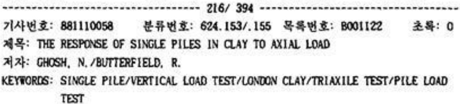  

# 초국:  

THE LESULTS OF 23 AXIAL VERTICAL LOAD TE5T5 ON 12 M DIAMETER MDEL PILES OF DIFFERET ITSTALLE A LAFGE HOMDGENEOUS REMOULDFE L마NTDN CLAY RED ARE PRESETED DGTD MEASLTRED DLRING ISTALLATIO! BY JAOXING ATA COSTANT RATE PROVIDED 매 TOTAL LOALS PILE BASE LOALDS A RADLAL SRESSES AT THE T0E THE MAIN ONTR! EUTIO S OF THE PAPER ARE PRECISE VERTICAL DISPACEMEHT MEASLRE LENTS 매 T꺼E PILES AT HORKI LOA SD CDHPLETELY LINEAR BEHAV1OUT 10 APPROK I MAtelY HEALF ULT IHATE LOAd ELASTIC ASLYSES EAVE 5ED T0 INTERPRET TE VERTICAL STIFFNESSES ALL OF 메어 FERE CUUS!STENT 볼께 A SINGLE VALUE OF THE SOIL SHEAR MDDULLS Gi EPIRICAL RELATIOSHIPS BETHEEN THE G VALUE THE UDRAINED DHESIC서 OF THE LONDON LAY ARE DISCLSSED IN SDF DETALL  

원전: PEOCEED!AES OF TEE NINTH INTEFLUAT[OLAL CONF ERENCE " SDIL YECLNIC현도: 197? 권호: 떼이지: 451 /457 언어:  

가사번호 881110059 분류번호 624 153/155 목목빈호: B00!122 초목: 0  
계목: ExPERIHENTAL STDY ECEHTRIC LOADING ON SINGLE PILES  
저자: CHA4 SF IGIN FK  
KEYEDHIS: SIHIGLF PILEFBEARIHG CAPACITYIPILE BEHAVIOURISTAHDHRD PeNetrAtIoh TESTILOAD TEST  

ThIS PAPER PRESETS 꺼E AESULTS DF AA ExPERIMENTAl SiudY ON THE EFFECT EMENTRIC LOADIHG HSLNGLE P[LES PArTICLlarly in RELATLON 10 SOIL RESFUHSE BEARIHG CAPACITY AMD T0 THE STRLCTURAL BEHAVI OF THE PILE THE SiLDY AS MALE End-BEARING FRICT1ON! PILES IN THE F[ELD A5 HELL AS ON HODEL P!L5S IN THE LAEORATORY IN ORDER TO MUNITOR PILE BEHAVIOUR UDER EMENTRIC LOALS F무 10 LLt[MATE FAILURE ECCENTRICITIES OF FHH ZE iD PILE DIAMTERS A MODE PILE AS INSTRLMEHTED SICH THAT TE DISTR! BUTI0N ALODG THE SHET OF AXIAL LOAD BEDING HMET HDRI2ONTAL SHEAR FORCE L LATERAL CULD PE HEASURED TE RESLLTS SHDDE THAT EXENTRIC LOADING HAD LHTTLE EFFEC! 에HE LOAD-SETILEMENT BEHAVIOUR AT TEE PILE HEAD THAT FIT RESTRAINT OF THE PILE T0P THE EMBEDD!NG SOIL PRDDCED A SWLL INCREASE N BEARING CAPACITY HOFEVER H꺼A 'BLHIED PILE" THOE EFFECT AS T0 DECREASE SLIGHILY E ULTIMATE LOAD THE SLESTANTIAL IHFLLEICE 때I대 ECCELRIC LOAD HAS ON THE DISTRIEUTION OF BEdiNt 5T HORI ZONTAL SEAR ALOL THE LELGTH OF THE PILE SHAFT EAS CORFIHED 10 HE UPPER HALF OF HE PILE  

원전: PROCEEDINGS OF HE HINTH I HTERHATIOHAL COHT EREICE 매 SOIL HECHANIC연도: 1977 권호: 페이지: 459 /452 언어: 래  

기사번호: 581110062 꼬류번호: 624 153/155 목독번호: B0D1 122 초륙: 0  
계목: SALL DIAMETER PILES 1 KALSTIC ROcX  
저자: GOLDBEAGER M YDAVID D: SRLEA E  
KEYITRIS: SPREAD FOOT ING/DEEP FODRLLATIC! EYCAVATICNYDEEP FUOLNEDATICN/PILE LDDING TEST  

SP관EAD FOOT INYS MANLALLY ECAHATED I THE KAESTIC LIMESTOE OF KAMIEL FERE ALEAYS TIME 마SLMIHG DUE 10 HE ROOX HARDNESS  

LARCE CLAY POLKETS [! T또 CAVERIDLS R RESLL TE IN DEEP FGGLETIO! EXCAVATIGN 10 REAG A NOY-STELLING Cedlt IoN T꺼E DIFFEHENTIAL BEHAVIOUF 아 CLAy AAD LIMESIUNE FLETHE CopL IcaTE THE PROBLE A NETLY DEVELOPE DRILLING HACHINE INTRODCED ALTERNATIVE FOLHDBT IO! METHODD SALL DIAMETER PILES HIGH SKIN FRICTIR VALUES LOADING TE5TS ALLOVE A! EDDNHICAL SOLUTION 꺼E FAST HILLING AT5 SA4 A Clst deraALE AMDL!t GF TIME  

원전: PAOCEEDLNLS 아 THE MIHIH INTeRHATICUAt COHFEHENLE 매 SOIL HECHANIC  
연도: 1977 권호: 페이지: 471 7473 언어:  
__ 219/394  
기사번호: E51110066 분류번호: 624 153/ 155 목륙번호: BOD1122 초라: 0  
제목: SOIL DEFORLAT IC S LHLER CIrCLLAR FOOT IG  

거자: SALNIKOV L F IkItaykiha OV YEGUROV K E IkdhoVAldV P H Z2INDVYEV  

KEYTORLS: STRE5S STeAIH/RIN-SHAPED FOUT ING/P!LE  

초특:  

RE PAPER FHESEHTS TE RESLLTS OF THECRETICAL ExPErIMEHtal STLDIE5 STRESSES AND STRAINS LUHDER CirClar ud RInG-ShfEd FOOT INGS HE PAPEA OOSISTS OF TTo PAHTS THE FIRST PART GIVES THE FORULLAE FOR DEF INIHG THE SETLLELEHTS Balkin OF RIHG-SHAPED FOOTICS AH ALSO COPARES THE CALCULATED VALUES [께 THOSE HE ASUHED IN FIELD DEFORHAT IOLS F THE RIG-SuAPE FODT IHG OF TOHER-TYPE STRECTLRES 1 20-5xah high TE SECAND PART 아F THE PAPER DEALS 께 THE EXPERI!ENTAL STLDIES OF STHESSES STRAIHS OF NOh-LNIFORH PEAT RASES IDER CIROULAR RIGID PLATES 마 TE AREA OF I ODO-I OOOOSI CM THE STLDIES FERE CARRIE OUT EUTH IN FIELD AD LABdRATury  

원전: PRDEIDINS DF THE MIHTH I NTeRNAt [OLAL CDAFERENCE 에 SOII HECHANIC인도: 1977 권호: 페이지: 489 7492 언어:  

2207 값94 -  
기사변호: 88111006? 분류번호: 624 153/ 155 목화변호 B001122 초탁  
제목: VARIABILITY ALVDUG PILES THE SAME FOLDAT! ON  
저자: EVANTEL[STA A IVIGG!AHI C Ipelletrind A  
KEYHORLS! PILE FOUNDAT1ONYLOAD TEST/FGLDATION STRLCTUREIFOUEATICH! DESIGN/P!LE BEAVLOUR  

# 초목:  

E LOD-SEttHt RELATICSHIPS OF SLPPOSEXY IDENT ICAL PILEs BELOIG!NG 10 TH SAME FOENDHTIO SHiT ACITUALLY 사 APPRECIAELE VARIABILIT! DUE T0 SWALL LLAVO! DABLE COISTRLCT IONAL DIFFFREICES 10 T건: VARIRBILIT! 꺼E SLESD!L FrD FOINt 10 FEDIHT ExPERIMETAI EVIDEYCE SuCH A yarIAbILitY COMIUG FR PRDOF LOADINIG TE5TS 18 LARCE PILED FOLNDAT105 5 DIFFEFKL SITES 1S PRESENIED AD DISCSSEII TE IAFLLENCE 0F 꺼또 VAR!ABILITY OF PILES BEHAYIDT OTHE DESIG! OF FLHEATJ0H STRLCTLRES 15 ANALYZED REFERRING 1 110 S[FELE SHEIES: A COLLMN SLPPORTED BY GROLP 무F3 PILES A'ld a bEAM SuFPURTED BY A EOT OF 25 PILES I E CASES CSIDERED THE INFLUENCE HAS BEEN FOLHD TO BE RATHER SIGHIFICHT  

원전: FROCHEDINS OF 꺼E NIYTH INTeRNAt FOHAl ONEERENCE C SOIL HECHANIC현도: 1977 권호: 페이지: 493 1500 언어:  

기사번호: E8!110070 분류번호: 624 153/155 목특번호: 8001122 초탁  
계목: SIDE FRECTION F PILES IN CAY  
저자: SELNES P TELAATE K  
KEYIDHLS: SOFT MARINE CLAY/BEASING CAPACITY/SOIL STREHPILE RIVING  

EYTESIVE DEFOS! TS DF SOFT KARIHE CLAYS Im NOREay AS LE 0 EIDESPPEAD L5E FRICTION PILES: THESE ARE NDELLLY SLELDEA PLLES T!MEER Ad 10 4 LESSER EIENT PRECAST COUCRETE THE  

TIP AREA Is SMALL CLPARED 10 또 PILE SLRFACE 사 TIS MEAASTAT SILE FRICT!에! DETErLHsS TE MAGN! TLDE F TE BEARINGCAPACITY 꺼E B4S!S FOR HE INVESTIGATION! ISA LARGE AMDLAT FFDATA FR I대 ONE HAVE SELECTED PILES 고께 TE NECESSARY DTAAEOT LOAD TESTS ROUT INE SOIL INVESTIGATIOS THE STEDYCON CLUDES TAT HE BEST ESTIMATE OF SIDE FRICTION IS DETALNED BYEFFECTIVE STHESS AMALYsis A FOHMULA FOR SIEE FRIGTIO!ALSO TAKES THE OVEROUHSDLIOATION RTI0 INTO ACCOLNT SEEES 10GIVE TE 8EST FIT 10 THE DTA  

원전: PRCCEEDIMCS THE MIHTH IHTERLATIOHAL CONFEREICE SOIL ECHANIC 면도: 1977 권호: 페이지: 517 /522 언어: E  

기사번호: 881110072 분류번호: 624 153/155 목독번호 B001122 초탁: 0  
제목: TEST -LOADING 어 - LAAGE BORED PILES 1 SA  
저자: FRALKE E IGARBREGHT  

KEYTDAES: LOAD TEST/SXIN FRICT I CNYBORINGISOLN DING AHHDH PILE 초목:  

THIS PAPER THE RESLLTS FF8 AXIAI TEST-LOADINCS HLARGE BORED PILES SAYD ARE PRESENTED THE XIN FRICTION 2A5 ELihINtEd Fre the pILE hEAIS DOTNTARIS 10 22 AEOVE THE PILE BASES BEEATH TIS LEVEL HAD L로 STEENGIH T CUE FEETRATI0 RESISTANE Ardut 15 MNySd M ELIMINATI0H 우F IN FRICTION TAS ORE BY FILLING UP DEYTOH!TE SUSPESION A사 AA21AR SPACE ROLND THE PILE SHAFTS HE RESULTS OF HE JEASUREHEHTS THAT THE LOAD-SETTLEMENT BEHAY! CLR Is SOEThAT DETERIORATE B CTTING ELARGED BASES FOR PILES IH111 10 154 IN DIAETER THOSE ELARTED BASES I5 1 10 2 IM GHAMETER-MD RELAEKAELE DIFFELELES FERE ORSERVED ITE LOAD-SETTLEMENT Behaviour RESP DEPELEICE OF DIAMETER COPARI SDN BETTEEN PILES OF 6 H LEGTH AND PILES  

05 [5 'h length SHOFE AL4DSt NO DIFFERELE In LOAD-SETTLEHENT BEHAVIOUR 원전: PROCEEDINCS OF THE NINTH [NERNATIONAL OHFERENCE O SOIL KECHANIC 연도: 1977 권호: 패이지: 529 7532 언어: E 223/ 394 또- 기사변호 881110075 분류번호: 624 153/155 목록번호: B001122 초목:0 저목: CPARATI!E BEHAVICUR OF RAFT PILED FCLHDAT IO!S 저자: HOUPER JA Yro0D L A KEYHDRLS! PILE Folh dat I On/fdlneat I o ! Behav I oury folndat I oh ANALYS!SISETTLEEET 초류:  

CUSIDERATI0! IS GIVEH 10 HE FOLNDAT ION BEHAVIOUR 110 22-STOAEY BUILDINS OF IDENTICAL CHSS-WALL CSTRLCTION LOCATED AT THE SAHE SITE 1 SOUTH LCNDON CE SFFDFTED 게 운FT A세 THE OITHER ON A PILED FoladAt IoN THE도 RELEUALT STRUCILRAL DETAILS SDIL DTA AD SEFTLEMEYT READINCS ARE ShA!ARISED 사 HE PROUELURES ADOPTE! IN THE ELASTIC AALYSES F HE RAFT PILED FOLADATIOS ARE DESCRI HED INHE FOFHER A prelimInary AXISYHETRIC ASLYSIS I5 CARRIED UT T ESTABLIS 꺼E LIKELY VARIATION O도 SOIL STIFFNESS 꺼 DEPTH ASSHIHT THE SDIL TO E A-TRAASYERSELY ISUTRDPIC MATERIAL THE RAFT FOU DATION OF ASYYRETRIG PLAN-SHAPE IS the! ANAlYSED TAKING ALCOLNT OF THE STIFFHESS OF TE SuPestRictURE A SATISFACTORY AGREEMEIT 15 OFTAINE 8ETH부 HEA5RE A다 CRAPLTED VALLES TOTAL AND DIFFEREHF!AL SEITLEEdT Finally APPrx I Mate AnalYSES OF THE P[LE FOlADHT ION ARE ChRRIEd OUt BASET THE SOIL STIFFESS PROFILE DELLCED FROM THE PRECEDIHG RAFT AALYSIS  

원전: PROCEEDI HGS THE HINH I TERHEAT IOHAL OOHFERENCE SOIL HECHANIC면도: 1977 권호: 페이지: 545 1550 언어:224/ 394  

기사번호: 881110075 분류번호: 624 1537 155 목특번호 EDD1122 초락: D  

계목: NEGATIVE SKIN FRICTI에 A SAFETY AALYS!S OF PILES  
저자: HORVAT E IVAN DER C  
KEYTORDS: SIN FRICTION/PILE SAFETYISAFETY ANALYSIS'COANCRETE PILEIFOL DAT I ONDESIGN/BEARING CAPACITY  

또 HAGN! TUDE OF NEGATIVE SXIN FRICT!ON IS LARGER TO MLH LARGER THAN EAS GENERALLY ASSLHED 없LT SPITE OF 꺼IS UNDEREST I LATICN ITS IHFLLENCE A5 ALLOHABLE FOR TE CUESTRLCTLOUS: THE SETTLEIEITS ALD DIFFERECES 아F SETTLEENTS HERE TOLERABLE I THIS PAPER A SAFETY ANALYSIS ALD CALCULATION HETHOD 1s DISOLSSED AS IT 15 APPLIED IN RO!TERDA NOTADYS THEREBY TAKING IT0 ACDOLNT THE hax VALUE 아F TE HEGATIVE 없IN FRICTION 꺼E REodHENDEd SAFETY COEFFICREIT IS 1I ON THE MAx VALUE OF HE LOAD CAISED BY NEGATIYE SXIN FRICTION ANd 17 10 2 ON thE FORKING LOAD STRESSES IN THE PILE MATERILAL UP TO 1OO KGF/S CH FOR FODDEN! PILES A120 KGF/SO C FOR COHICRETE PILES CAN HE AMCEPTED  

원전: FROCEEDINAS F THE NINTH INTEFHAT IONAL CONFERENLE C SOIL MECHANIC연도: 1977 민호: 페이지: 55! /554 언어: 터기사번호: BA1111027 분류번호: 624 135 목목변호: B011552 초목:계목: 일본대판관서공함의 연약지반처리공법 TR CMSTRUCT ION JAHUARY 1987에서거자: 김규린  

KEYTDHDS: 일본/SA세 대RAI서 공법/SAHD CDPACTICN PILE 공법/심층혼한처리공법/대 P HIXIHG/연약지반처리공법/대판관서 공항  

원전: 대한도목학회지 135 NO 1-6 87 2 46 8 10 12연도: 1987 권호35/5 패이지: 99 100 언어: Ko그-- 228/ 394 --기사변호: 881111040 분류번호: 624 135 목무번호 B011552 초륙:계목: 연약지반 6연약지반처리공법바]P터T층 PILE NE공법  

저자: 김주범 KEYTHORIS: 연약지반/지반안점처리/지반침하PLE NET공법PET층 위전: 대하트온마미지 RS건 1F 8224781구12  

현도: 1987 린호13576 페이지: 44 745 언어: Ko227/ 394 ---eeee _--__-  
기사변호: 88!1!1043 분류변호: 624136 목독번호 B011552 초와:}  
제목: 연약지반 7연약지반의 공사예:더]제천소지반개량공사  
저자: 이장오  
KEYLORIS: 연약지반/제철소 지반개량/5A시D ChPactIC! PILESAHD DRAIN  
원전: 대한토목학회지 135 ND 1-6: 872468 10 12  
연도: 1987 권호:3576 데이지: 57 /61 언어: ko228/ 394  
기사번호: 881111047 분류번호: 624 153/ 155 목록번호: E001122 초각 D  
계목: SETILEENT OF BUILDING LE 10 PILE DOINDRAG  
저자: IADLE Y TAMAOKI K /OGAI I:  

KEYYORIS! BUILDING SETTLEMETIPILE FONDATICNYBU!LDIHG FOLDAT I ON/ BEARING CAPACITY  

TIs PAPER PRESENTS A GEERAL DESCRIPTICN OF HE GROLE OHD!TIoN REIHFOFCED COSCRETE BU!LDING SUPPRUTE PILE FolndAt ION HIH DE TO VERY LARGE DIFFERENTIAL SEITleMet HAd T0 BE DEHOLISHED ONLY 4 YEARS AFTER COPLEtIoN CIRCLUSTANCES 야F DIFFERENTIAL SETTLEMHENT AD ELTENT OF DAMAGES 10 THE BUILDING THE PAPER CLARIFIES THE CALSE OF DIFFERENTIAL SETTLEHENT 10 EE HEGATIVE FRICTI에N TOFRKIAIG C PILES RESLLTING From tHE GhOLd SuESIDENLE [TYPICAL OF Tkyd EDEAVDRS T STuY RELATION BETHEA! DIFFERENTIAL SETLEHENT AND NEGAT!VE FRICT!OH LOALS  

원전: PRDCEEDINRS 아F THE NINTH INTEE ATIONAL COYFERENCE SOIL YECHAHIC연도: 1977 권호: 펴이지: 561 /554 언어: 대  

229 394  
기사번호: 831111050 분류번호: 624151 목목번호: 001122 초탁:0  
제목: LOAD TE5T5 5 LARGE-DIAMETER BORE PLLES CLAY  
저자: JELINEx R IKORECK H A ISTOOER  
KETTORLS: L TEST/YERTICAL LOAD TEST/EORED PILE/SKIN FRICTI0N!교  

TIS PAPER PRESENTS THE RESULTS 아F VERTICAL LOAD TESTS 먼5 LARGE BORED PILES In LACSTRINE LAY THREE PILES FERE STRAIGHT-SHAFTED And tho PILEs HAD EHLARCED BASES DURLIG THE L0A TESTS THE BASE RESISTAICE AND THE FRICTIONAL RESISTALHLE HERE MEASURED 꺼 HYDrAulIC LOAD CELLS COYERING THE EHALE CHSS-SECTI에 OF ThE pIles F1태 HAINTAINED LOAD TESTS THE PILES HERE LOADED ATH CDNSTANT RATE O5 PELETRATION NTIL THE SETTLEENT REACHED A VALUE OF 30 더 THE TEST RESLLTS SHDF TAT BASE RESISTANLE INCREASES FITH INCREASING SETTLEMET THILE THE FRICTIOHAL RESISTANLE IHCAEASES OLY UP TO A CERTAIN SETTLEMENT RELETIOSHIP 명A5 FOLND BETWEE THE PILES HITHDUT ELAFGED BASES HAVE A GREATER BASE RESISTANICE ANd A SMALLER FRICTIOHAL RESISTANGE Than PiLES 주꺼 ELARGED EASES PRDVIDED TE BASE DLALETER OF PILES IT께 OR FITHDUT ELARGED BASES 1S 꺼E SAHE T꺼E SETTLEMENTS FOR A GIVEN LOAD ARE GFEATER FOR HGE BASES THAN FOR STRAIGHT-SHAFTED PIIES  

원전: PRDCEEDINHGS OF THE NITH INTERNATIONAL COHFEREHLE 에 SOIL MEChAHIC연도: 1977 권호: 쾌이지: 571 1578 언어:220 304  

기사번호: 881111051 분류번호: 624:151 목록변호: B001122 초륙: 0  
제목: TALL BUILDING SETTLEENT PILE LOAD MEASLREIEHTS  
저자: JOLSTRA K /DE SITTER IR /DE! CLDE! NE  
KEYTORIS! BUILDIAG SETILEHENT ICONICRETE PILEYEORING/PILE LOADYPILE FOUNDATICN!BEARING CAPACITY  

A 65 '5 n hiGH APAKIMENT BUILDING I꺼A SLRFACE OF 25X47M AS FOLATEL 에222 PREFAERICATED CONCRETE PILES 께 BLARGED BASE THE PILE LR모 AS 17 M BASEI GA SOIL INYESTIGATION STATIC CONE PENETRATION TESTS BORIHS LAAORATORY TESTS A EEFER!ENCE IT SIMILAR BLILDINLS A FOLHDTICN RECMAENDATICN EAS GIVEN BECALSE OF TE EXISTENCE 유F DEDP CIMPRESS! BLE LAYERS BELOR THE PILE-BEARIHG SA StHATLM SETTLEHEITS OE THE BUILDIG F 5HAT HST TERE EPECTED IN OADER TO CHECK THE IATERACTICN BETLEE BLLLDLNG AN다 SLESOIL PILE HEASURERNTS HERE PERFORED N10 SELECTED HLES CURIG OST RUCT ION CCMPLET I0N OF 1E BUILDING FlhthERIDRE 국또 TINFLUEICE OHE PILES OF STROG FIND FORCES AGAIFST THE BUILD!NG DAS INYESTIGHTED E SETTLEHENT 0F HE FOLNDAT I0N AS CHEXeD FR대 께E HEASLREVEYTS THE PILE LOAD DISTRI BUTICN INDER THE PILE ROIS CULD EE CDUFUTED TE RESLLTS 거 CUSIDERABLE DEVLATICN FRDM 께E HOEAL COMPUTED PILE LOAD OF + -351 COSI DERATION 15 GEAT0 THE INFLLENCE OF THESE DIFFEREICES THE BEARIIG CAPACITY OF THE SINGLE PILES HD OF THE PILE GROUFS INFLUENCE OF IN FORCES ON THE PILE LOALS TAS NT OBSERVED  

원전: PHDCEEDIHLS OF TE NINTH INTERNAT IONALL CUNFERELE D SOIL HEUHANIC연도: 1977 권호: 쾌이지: 577 /580 언어:  

기사번호: BB1111053 분류변호 624 153/155 목목번호: 0D1122 초무:0  
제목: FACIDR 0F SAFETY F-R PILES OCDHESIVE SbILS  
저자: AY Jh  
KEYTURIS: OUHESIVE SOILTPILE SAFETYIPILE LOAD TEST/PILE SAFETY FACTOR/PILE L0A CAPACITY  

A PROCEDUFE Is DEVELCPED FOR O!STENT SAFETY FACTOR SELECTION  

DESIGN LOAD CAPACITY LETEAMINET IO! FOR PILES I' COHESI'VE SOILS 어 THE 표ASIS OF SOIL PLORTI문 RESELTS AAD THE STATIC FORMULA APPROACH THE SITE 15 F[RST CIA5! DERED T0 HAVE A PILE LAD CAPACITY GISTR1BUTICN H대 REFLECTS COUSIDERABLE LMCEKTAINTY THOALLH BAYES' HEORE THE ADD] TIONAL IFORELAT!ON! OBTAINED FrM A PILE LOA TE5T TIS DISTR!BUT IOH! IS LFDRT 태대 ADOD!T!ONAL PILE LOAD TEST PRGV!DES FOR FURTHER LPDATINL [SI A FIRST OHIER SEODND MODMENT PrdcexhE SAFETY FACTDOFES FRR 태대 PASE 우F THE PPCCESS - PILE L 5T PLLE LOAD TEST T0 PILE LOAD TESTS EIC AE DETEMI+ED THESE SAFETY FACTDR VALUES ARE RELATIVE THER THA AESOLUTE HE DESIGER Y CHOSE THE SERIES THT JUDFES 10 BE HST APPRDPR!ATE  

뭔건: PROCEEDINGS OF THE NIHT [NTERLLATIOMAL COFERENCE SOLL MECHAHIC연도: 1977 권호: 페이지: 59? /592 언어:소인 20  

기사번호 B81111055 분류번호: 624 153/ 155 목묵번호 BCD1122 초복:0재목: GEHAV10R 5 SA PLL IN OPEY-END STE고 PIRE PILES저자: KISHI며 H ISEHDTO  

KEYTORIS: BEHAVSOLRIFEL'BEARIHT CAPACLTL/STEEL PIPE PILEISTEE PILE 초묵:  

SER!ES 야 FLLL SCALE PILE TE5TS FERE CARR!ED OUT IO   
INVEST IGATE TEE BEhAVICR SA OPE-EHD PIPE PILES TE   
TEST ESLTS FDRE AAlYzE EY A HODIFIED FINFTE ELELET HET   
I 메I대 TE EFFELT F T도 FRICTIOHAL STRESSES BETHEE! 꺼E SAR   
사 꺼E INSIDE 걸ALL F THE PILE 15 CDSI DERED THE RESULTS SHOT THE SAAT TThIn tTo PILE DIAETERS FRH THE EUTIUCM OF THE [5 SLEJECTED 10 GREAT 아F COMPACT I0N 꺼E   
S신 ARCVE 재IS HEIGHT ALTHOCH SCARCELY CHPActe HAS A!   
국ORTAT EFFECT THE FRICTIONAL RES]STACE F THE PLiG   
원전: PRDDEEDINGS HE NINTH InteratIchal COHFEREICE 매 SO!L MEGHANIC   
연도: 1977 권호: 폐이지: GO! /604 언어: 태 233/ 394 ----E  
기사번호: 881111056 분류번호: 624 1537 155 목복번호: B00!122 초탁:0   
제목: ALALYSIS 아F RHAV!DTR OF TuBAlAR PILES 14 SE5DIL   
저자: KTOS J ITEiCMAN A  

KEYEDRIS: TLLAR PILE/PILE BEHAVIOUR/HEARING CAPACITY  

# 초묵:  

EXTEYS!VE MODET TESIS ANd FIELD IHTEST IGATTCTS Furn!Shed THE BA5IS FLR THE FRESENTE ANALYSIS OF OPEN-EASE TLBULAR PILE EEHAVIOLR IN COHES!OHLESS Soils THEE INYESTIGAT IOYS COWERED AMLG OTHERS SDIL COAE FOPATI0! IHSIDE THE TUeLLAR PILE STRLCILRE DE!ERMENAT ICN D든 SDIL RESISTALLE AT THE PILE EASE 사 PILE SIN RESPECTIVELY 4 CPArIsdN BEARIME CAPACITIES OF OPEI-BASE A다 CLOSEI EOTT0! PILES RESPECTIVELY THE FINDINGS RESULTED IA DeterMimAtI0! OF THE 1DDE OF LOAD THASFELENCE Y TLIBLLAR PILES AND CUNTRIELTED E CEILENTS THE DETEFMLLNAT ION OF THEIR EEARING CAPACITY  

원전: PROCEEDINCS TE NINTH Internat!Ohal OOUFEREKEE SOIL HECHANIC  
연도: 1977 권호: 퍽이지: 605 /508 언어:2A4! 394 - _  
기사번호: 88111105? 분류번호: 624 1521 155 목류번호: B001122 초탁: 0  
제목: BEARING CAPACITY OF LARGE DIAYETER DDRE PILES  
저자: KLoSINXL B  

KEYTORIES: BOFED PLLE/REARIHG CAPACITY/LOADING TESTYOEHEES! VE SDIL/ROX STHEL!  

# 초확:  

RESJLTS OF LOADING TESTS OF 세EARLY 5 PILES 09 - 1254 D1AYETER ARE DISU5SI TH또 PILES TERE FOLE GRAMLAR OR COHES!VE SOILS SOFT Rx IStIG VAREOES CNSTALCT ION  

METHDLS A TECHNIOUE LD PrdcedIRE OF LOADING TESIS ARE DESCRI BED THE LOAL6 REACHED 1900 T7 BEHAVIOLR OF PILES LANDER LOAD 1S DISLLSSED A SIMPLIFIED MOEEL O[ PILE RESFOMCE 1 LOAD A5 LSED HI어 RAS SULTABLE 10 PREDICTION OF SETTLEMENT OF A SINGLE PILE TPICAL UALLES OF UIT SkIN fricTION MODLLLS OF DEFOEMABILITY OF SOIL BETEATH TE BASE ARE GIVEN BEARIAIG CAPACITY PILES IH SOFT ROOK HN'T CORRELATION 께 THE OF PILES 1T0 ROXK 꺼도 STRERTH BOXK  

4원전: PRDCEEDINCS 0F NINTH INTERHATIOHAL COFERENCE 매SOIL FECHANIC연도: 1977 권호: 페이지: 609 /612 인어:235/ 394기사번호: 8311110E0 분류번호: 624 151 목복번호: B001122 초탁:0제목: ARHING THE FOLNDATIOS FI ALRGE저자: LEFEBVRE G /DASCAL O IST-ArLD G  

KETTORLS: DAJ FOLNLAT I ONYCONCRETE PILEFEM/SOIL FOLNDAT ICNYEMBAROMETTVAECHING FOLNNDATIOV  

THE MaNICOUAGAN 3 dam LOCATED In nORthER QUEBEC CAADA 15A ZONE EARTH DM 110 M HIGH FDLNDED 에거 SEDIHENT F[LLE CAUY매 125 M DEEP SEEPAGE 서 THE FcanDAtION 15 COHTROLLED Bi 4 POSITIVE CUT-OFF COSIST!G F IATERLOOKIAG CIST-IN-PLACE CUNICRETE P!LES PANES A FINITE ELEMELYT STUDY HAS SHOT THAT THE EIGH OF THE dAH HAS TRAS!TT BY ARCHING IN THE FOLNDT IOH SOIL T THE BALLS OF THE STEEP CANYOY ELECTRICAL ERTESOETERS IN THE CT-OFF WALL AD BEDRDDX SEITLEENT FDINIS [ILLDICATE TAT A SIGHIFICANT CHOSS-VALLEY ARCHING EAS DEVELDPED DURING OMSTRUCTION THE CUT-OFF HALL ANd In the foufht IoH SOIL PRACTICAL IHPLICATIOYS OF ARCHING EFFELT 매 THE CUT-OFF FALL ARE DISCASSED  

원전: PROCEEDINGS OF THE NINTH I HTERHAT IOHAL OOUAFEREHCE H SOIL ECHAHIC  

기사번호: 881111061 분류번호: 624 153/155 목특번호: B001122 초무:  
제목: HOR I zONtaL LOADING TEST5 O LARGE DIAMETER PILES  
저자: LiEkIng P  
KEYTORIS: LOADINIG TESTZSLESDILYPILE LOADIHTG TEST/STEEL P!LE/SUPPORTINT STRICTURE  

# 초목:  

PART I BY ZARETSKY AD ZALE2HNEV DEALS PECESSES OFSuB-LIHITInG Tid STE고 ThBULAR PILES DF THE EASTERSHEIDTCABLEAY 께 DIAETERS SUPERLIMITING DEFORNATION FFINE-GRAInE OF 31 M and II m tERE TESTLOADED BY HOR! Z0NTALFOFCES P 10 600 N RESP 700 HE EMBEIDED LENGTHS OF EPILES FERE 18세 RESP SAND ACOOLPANIED BY DILATANCYEXPERIMENTAL DATA INDICATE LIM!T 1 SUEAR STRESS 20 H AID TEFORCES TERE APPL1TED 에A LEVE OF 331 RESP SO H AEDYE TE SEAFLOOR INTE SITY -- HE DILATANCY LIM!T 8L0N THIC THE SOIL15 ADDIT!ONALLY COHPACTED THE SLESIOL COSISTED F SAID 꺼ISLIMIT CEPEIS DIRECILY 어 INIT[AL DE'SITY GRATLLCMETRICCOMFOSITI0N OF HE SAND TE HOR I 2DTAL DISPLACEENTS OF TEPILES FERE REGISTRATE OPTICALLY THE INTESIT! SHEAR STRESSAT HIC FAILURE OCCUES AT THELEE REFLECTOR PDINTS AEDVE THESLFFACE OF THE HAteR DES NOT CO! ICI DE HE DILATANCYLIMIT FURTHEFHIDRE 4 DISTALE MEASLR ING DEVICE O THE SEAEUTTOMREOORLE TE HDVEENTS AT THAt LEVEL ALE GI VEN FORDILATATIONAL COMPACTION AND SOIL LOSENING 또 ANGLArROTAT!O'S YTERE HFLSUTEED BY MEARS OF AV ELECTRICAL THEIRAGREEET 께 EPERIMENTAL DTA IS ANALYSED I NCL INDHETER 때I어SLID ALONG A fixed raIl THE PRINCIPAL RELATIG SHIPS AEE STATEDIN THE EMBEDDED PART OF ONE OF THE PILES LECTRICAL STRAINT  

원전: PFDCEED!HES OF TE NINTH INTERNEATIOLAL CONF EHENCE ON SO!L MECHANIC  
연도: 1977 권호: 페이지: 529 /532 언어:-- 237/394 ---일  
기사번호: 28]111053 분류번호: 624 153/ 155 목득번호: BDO! 122 초북: 0  
제목: BEHAYIOLR OF PILE FCLNDTI0S SLEAITTED T0 LATERAL LOAES  
저자: MLDDLIU I /BOTEA E ICIASTANT IHESCU 서:  

KEYEORDS! PILE FOLRDAT ECHYPILE EEHAVIOUR/P!LE DRLVINGIS! NGLE PLLEIGRCLP PILE 초[:  

IHVEST IGATIOHS CAARIED OUT CUUECT ION 무T THE Fondatioh F SO도 OUAY EALLS MANIA! GAREOUES LEFT BLt DF DANTEE RIVER HAVE I MCLLUED AL50A PROGRAL! DF FLELD TESTS SINCLE PLLES AD PILE FOUNLETIOS TE PAPER PRESENTS THE AESLLTS 아F 교5 REIHFORLED OONCRETE 16 M LONG NontystrlentEd 대RIVA! PILES LOALED IDIVICUALLY 11 GFDLFS F 1 R 3 VERTICAL DR BATTER PILES  

원전: PAOCEED!NYS 다 E NINTH INTERENAT!ONAL CUNFEREYCE G SOIL MECHANIC  
연도: 1977 권호: 패이지: 637 1610 언어:238/ 304 소스  
기사번호: B51111054 분류번호: 624 1537155 목특번호: ECD1122 초:0  
제목: I+tLLENLE DF E-baMEt O FOLHDATIH CHPILES  
저자: Hazufk IEfiCz BK  

KEYTORIS: PILE FCLNDAT I DREFPILE DR! VINGYFOENDAT I CN STRLCTURE/SKIN FRICTICNISAN DY SO!lyebakENT  

CLAFE BEAS FOT VERY HEAVY CRANES HAVE BE게 COUHISTRUCTED OH PLLED FOUNTATIGS SLTUATE 대 AREAS CFEATED I5 Hreduf BASIN BY MEANS OF REFILLING ERECLTE! EnlkEyts A TICNESS REEHING OF ART 13 H ARE PLACED SANDY SDILS LNDERLAYE! EY' VARVE CLAY THE SandY! SJILS AR도 OOVERED BD SLULGE AFE CHARACTERIZE EY TE Ex]StELe F Many INTERREDLED LAYERS DF  

FEAT PILES DAIVE! TUCOULGH THE EbaAEMELT 스니다 SAADY SOILS 10 TH또 CLay LAYeR HAVE an ASFHALT COAT ING TO PREVENT 꺼E INFLLEICE OF NEGATIVE SKIN! FRICTIoN: KEASLREHSNTS OF VEHTICAL DISPLACEMENTS CF FOLNDAT1ON! COIECTED INESTIGATIOS OF SETTLEHONTS OF EK 50115 COHERIL THE ORIGINAL HARROLR EOTIUM LEALS T0시 COCLUS! C! THAT THE ASPHLALT COATING HAS ACIE IN A FRDPER EAY SLESTANT IALLY DECREASLNG TE L4ELUEICE NEGATIVE SXIN FRICTID HE MEASUREEITS HAVE SHoN HOVEHER TAT TE EMbADhE!! HAs HD A BIG [MFLLEYE 꺼E COSOLIDT IO? OF VAAVED CAYS CALSING SETTLEMEYTS ALS0 OF TE HHDLE FOUNNIATION CPILES AL다EING THLS MUH MDRE [FDtAT FOR THE STRLCTLRE Than THE INFLIEEYCE OF NETATIVE 없IN FrIctidN  

원전: PRDCEDINS 에 THE NINTH INTERATICUAL CUIFEREICE SD!L WECHLAHEG  
연도: 1977 긴호는 페이지: 641 /644 언어:259/ 394  
기사빈호: 881111055 분류번호: 624 1537 155 목복번호: D01122 초목:0  
져목: EEARING CAPACITT 마F PILES I AYERED SDILS  
저자: MEYERHOE G G IVALSAYEAA :  
KEYTDHIS: BEARING CAPAC!TLIPILE BEARING CAPACITYYP!LE LOAD  

# 초목:  

PFEYICUS BEARIAG CAPACITT TELEY SEMI-EIPIRICAL HEETTHDDS DF ESTIHATINIG LLTIHATE PLLE LOADS LNIFOF! S01L5 HAVE 또! RTDLE T0 LAYERE SoILS THE AALYSES ARE 0MPARE 무ITH THEE FESLLTS MDDE1 AAD FIEID TESTS PILES Non-InI Fchm SOIIS 마F T렁0 ALD IHREE Aters  

원전: PROCEED!HTGS CF T꺼E NINT INTERNAT IONAL OONFERENCE Oh sOIL MEHANIC  
연도: 197? 권호: 페이지: 645 1550 언어:  
-- 240/ 394  
기사변호: &81!12024 분류번호: 624 1537 155 목탁번호: B001122 초묵: 0  
계목: INTERACTIC! F FOUMLATIOS FOLDATI0N SDI1  

저자: MYSLIVEC A [SIMEK J IKYSELA 1  

KEYTORIS: SOIL FOLNDATICNYBEARING CAPACITY/GROUP PILELLOADIL!G TEST 초목:  

EOFED PILES STTUATED IN A ROT DR In A GRDLP? IAFLUEICE 아E ANOTHER HEHR LOAD-BEAR ING CAPACITY INCREASIHG CR DECREASIHG 1서 ACCGRDANCE THEIR SPACLHL PLAL OR AteateMdt A METHOD OF CALCLAT?ON F 꺼도 LOAO-BEARING CAPACITY FA GROLP F PILES AS LELACED AODOFEDIHG 10 HIG THE LOAD-BEARIHG CAPACITY OFA PILE GADUP LSLALL? VARIES BETHEEN 7018 And I 510 DF 꺼E SLU OF HE LOAD-HEARIH CAPACITLES OF 꺼E IND!VIDUAl PILES CDSIDERED SEParAtelY CALCLAT IC AS 15 GO0D ACODRDAICE 동ITH TEST RESULTS: IN HODEL TESTS THE INTERLACT ICHA FF 차 GFDLP 유F PILES SLBJELTED 1 VERTICAL CEYTRIC ECENTHIC LOAS 10 HORI 2DNTal LOALS 1A5 IHNESTIGATED BY MEAS OF PHOTOELAST ICIHetrT ANd THE [SSTATIC TE ISOCLINIC LINES TE SUEBASE OF TE PILE GHOUP FERE DETERH!HED  

원전: PROCEEDINGS FE HIYTH I NTERNAT [OHAL CRFEREYCE CH SO!L MECHANIC  
연도: 1977 권호 떼이지: 671 /574 언어:  
- 241/ 394  
기사번호: 881112025 분류번호: 624 153/155 목류번호: BDD01122 초륙:0  
제목: HIG CAPACITY LDA TESTS LAAGE DIAMETER PILES  
저자: RALSA: E P IMUHES A J C /OSTA R JA  
KEYRORRS: LOADING TESTTVERTICAL LOD TESTTAC PILE[PILE FOUNDATIONTHORI ZOATAL  

LOAD TEST  

# 초목:  

TIS PAPER DESCRIEES HE USE F SPECIAL TAT HETHIOLS UTIL!ZING ANCHORED TIE BAK SYSTE게 FOR 국도 PERFDEMAHCE F VERTICAL LOAD TESTS uP 1750 METRIC T마5 50 KETER LOHG 180 ELER DLAMETER REINFORCE OUNERETE PILES OUSTRLKTED FOR THE FOLHDTIO!S OF TREE PRES!DENTE CISTA S1LVA BRIDGE [RIO-NLTER0!  

BRIDLE] ACROSS GLAHABAAA BAY 11 BRAZIL AS DESCRIBED 15A 100 T%N HDRI 2ONTal LOAD TES! PErEUrE SIMILAT TIPE FOlDHTIC! PILES ITH THE RESLLTING LATERAL DEFLECT LONS HEASUFRED 1께 LEPTH BY EAS OF SLOPE INDICATOR EfulpEt THE PAPER PRESENTS BRIEF LESCRIPTI ON OF THE SUESLRFACE LNDITIOHS ALHOSS TE EY: THE CHARACTERIST ICS OF TFRE PILES TESTED A CescRI PTIo! F THE TESTING APFARATRS 꺼E FLELD RESILTS OETAINED AA ANAlYSIS OF THE DETERHINATION OF TE HOR1ZDNTAL SDIL MULLS FACTDRS DA CpariStN Of HEASRED LATERAL DEFLECTIS BELOF THE mD LIME 1IT께 THOSE CohpufEd BY ELASTIC HETHDIS ASSLMING 4 HORIZO TAL SOII- VARY5A? LENEARLY 께 R5PT  

LLLLL LEHEAL! 나편r  
원전: PRDCEEOIHGS OF HE NIHTH [HEFATIOHAL CONFEREVCE 매 SOIL YECHALIC  
면도: 1977 권호: 때이지: 675 7678 연어:- 242/ 394  
기사번호: 831112028 분류번호: 524 153/ 155 목류번호: E0O1122 초륙:0  
제목: LARGE HECATIVE FRICTION AD FRICT ION-FREE PILE METHCLS  
지자: CKAHE T  
KEYHORIS: IN FRICT ION/RAILHAY7PILE FOlNDAT 1ON/YANE TESTYTRIAXIAL COUPRESS!0  

TEST/REARING CAPACLTY  

LCUG-TERM FIELD MEASURE EN! 마 NEGAT! VE SkIn frictION O PILES CHARGED HITh BAaK FAS EXECITED ALLUVIAL DEPOS!T THERE N-VALLE A5 0T0 5 10 THE DEPTH OF 304 5 10 10 IN THE DEPTH OF 30 10 401 NEGATIVE SKIN FRICTION PARTIALLY TO ARDUT 20 T/SQ HI대 금A5 LARGER ThaAN THAT 매 THE BASIS O CURRENT DESIG! METHOUS 프 H PILE 꺼 NEGATIYE SKI서 FRICTIO! AS SURCHARGED 꺼h WEIGHT AS HEAVY 45 DESIG LOAd 1TS NEUTRAI POINT SIFTED FIRST UPEARD 태께 THE LAFSE F TIEA IT HOVED DOiNfARD OI 10 EIDET APPEARANCE OF ONSPICOUSLY LARLE HEGAT IVE SXIN FrICTIOH MDRE EFFECTIVE And RELIAELE FRICTIOH-FREE  

PILE ETHODS CASED PILE HETHDD SPECIAL GROUPE PILE hDD ERE LEvElOPE And thy ERE SUOCESSFULLY AFFLIE 10  

AC!UAL FOLTATIOS In THE ODNStRACt]CN OF HIGLY ALt로TEHarShaLLING YARD  
원전: PRDCEEDINGS OF THEE HIHTH IN!ERRATIOHAL COHF EreILE G SO!L HEHANIC  
현도: 1977 권호: 데이지: 679 /582 언어:243/ 394  
기사번호: 8B111202? 분류번호: 624 1537 155 목목번호: B0D1122 초탁: 0  
제목: 8EARING CAPACITY CF PL5S 께 도 SFOT FOOT ING  
저자: NABORLZYK J PATKA J  
KEYIDRIS: PILE BEARIHG CAPACLTY/REAR!HG CAPACITYISFOT FOOTIAD/PILE SEITTLEKERTPILE FCLUNEAT LO!  

# 초폭:  

XK COUTAINS 께E RESLLTS 유F FIELD HODE INVESTIGATIOSCOHCErHING THE CARRYING CAPACIT! F PILES 값L다OOOPELAT ION! 께 THE SROI FOOT IMG THE MODEL IHVEST IGATIOS FER토PERFCRME SAHS THE RELATIVE DE SITY EQUAL $10=0.4$= 08 AY MEAS OF ELECTRIC T2ESOMETRIG SENSDRS THE FORCE VALLETAKE! FOOT 1G A PILE 질AS MEASLRED 45 TELL AS THE AXLALFORCE DISTRLHUTIOY ALONG THE PILE ADDLTIONALLY TE SETTLEETF0 PILE FOOTING TE보도 HEASUREI SEPARATELY 15 T1LAS TESEITLELENT F THOLE SYSTEH LNDER LOAD THE HODE ExPERIHEHTSPRODVE THAT THE CARRYING CAPACIT! OF PILE FOU[IHG FOLDATION!15 GREATER 꺼A4 THE SJ OF CARRYING CAPACIT!ES OE PILE고HFLOTING TAKE SEPArAtely THE FIELD IHVESTIGATICS YEREPERFOFLIFT 무I TOLFSHDLZ FRAK TYPE PILES HAVING THE 40-42어 DIAFTER 50-144 LEGTH TE EXxPERIHENTS TERE PERFOME!SILTY LOALS PRDVED THAT THE CARRYING CAPACITY OF PILESODOPERATING 보ITH SPDT FITING AS 30-60 PERCELHT GEEATER ThANCARRYING CAPACITY 05 PILES FDEKING ALONE  

원전: PFOCEEDINCS OF TE HINT INTERNATIDDAL OOHFERENCE G SOIL YECHANIC  
연도: 197? 권호: 페이지: 603 1585 언어:244/ 394  
기사번호: BB1115027 분류번호: 241315 목화변호: B0011 25 초부0  
계목: STATISTICAL EVALUAT!ON SETTLEMEHT ORSERVHTIDS  
저자: SHULTEE E IS!EVERING  
KEYTORLS: FOLNDHTIC SATTLEVEYTPLLE FOLHDAT IONYFDOT I NGYSOFT CLAYISTRIP FOLDATION  

RESLLTS OF SETTLEMENT ORSERVATIOS FOR 148 FTDLNDATI0S TERE EVALUATED TOGETHER TITH THE SOIL PARAETERS LOADINIG HIstorY ALL TYPES OF SOIL FOLNDTIO S ARE 너RESETE EXCEPT PILE FOL DAT IDLS FOIN THE CILCULATICY OF THE FINAL SETTLEHEYTS 10 CALOLATICN! HETHDD5 FERE HSEN! C물ARE 꺼 꺼E RESLLTS OF THE ExTRafOLTE FLHAL SETTLLEVENT ORSERVATIOHS [4 ORDERT0 COMPARE THE RESILTS THE CALCLATIOS TERE EADE FORA THE CHARACTERISTIC FDIT IN HIH HE SETTLEMEHT OFA RIGID AEDA FLEXIELE FOLANDAT ION AE THE SHE SETILLEENT LNFLLEICE VALUE HARTS ERE CL보TE FDR DIFFERENT VALLES F FOISSON'S RATIO FOR A MODLLIS COHPRESSIBILITY I NCREASTNG LINEARLY DEPTH RS LFO! A prElImInarY ExaminAtIoN THE BEST RATIO OF CI-PRESSIBLE LAYER 10 FOLLEDATION F T0 EE I FOR RAETS AND 2 FOR SINGLE FOOT INS THE MEAN VALLE OF THE RATI0 OF CALOLATED 10 ORSERVED SETTLEENT A THE OORRELATION COEFFIC!ETS FTHE CALGLATED CORRECTIHIG FLNLTIOS PERHIT A JUDRET OF THE OIFFERENT CALCULATIC! METTDS  

원천: 정보처리기사문계집 1급 2급현도: 1977 권호: 페이지: 7[1 7714 언어:---- 2451394 ------ __ _기사번호: 8B1115033 분류번호: 6241315 목목번호 2001122 초복:0전목: HTHE [ATERACT [ON EETHEE! STRCTURE LOESSIAL SD!L지자: STANCULESCU I /BALLY R J TANTONESCJ I 7DIU4 Gh /AThAnAsIU CKEYTORIS: SD!L STFUCTLREISOIL FDLLYDHT [OHYLOESS! AL SOIL/SO!L BEHAVIOURYSXIN ERICTIOHLEARTH PILE  

FLLL SCALE TESTS AAD ALSD FIED HEASUREMEYTS HAVE REYEALED SOHE PECULIARITIES OF THE IHTERACTION BE경라서 STRLCTURES 사 FOLNDATIC! SOIL ETTER SHDS ADD!TIONAL SETTLEMETS UE 10 TETTING BASE 에 SETTLEMEY! OESERVAT!OS REODADED OWER A PERIOD OF MOHE ThAN TEN YEARS AppRox]htel! 500 STRLCTURES FOLNDED 어 LOESSIAL SOILS CORFILATO5 TERE ESTARLISHEED BE!E리! THEIR MAYIMM DiffeERENTIAL SETTLEMERTS THE PAPER DESCRI BES S-도 CUSTRLCTION PROCEDLURES And CO SOL T OHT IOh hEASURES APPLIE OU SITES THERE STRLCTUFES HA!도 BEF SUBJECTED 10 COUS! DERABLE TILTING SELLL국CLE To ACCIDEHTAL HETTIHG CF LOESSIAL SDILS  

원전: PROCEEDINCS 또F THE N1NT INTefHat IOhaL CUNFERENCE SOIL MECHALIC  
연도: 1977 권호: 페이지: 745 7748 언어: 며246/394  
기사번호: 831115035 분류번호 624 1537155 목록번호: B091122 초락:  
제목: BEARING CAPACITY OF HULLOH PILES DRIVE! BY YIRRATION  
저자: STEFANDFF G TBOSHIHDU B  
KEYTDRIS: FEARIFTG CHPACITY/P!LE LRI VIHGLCAD!AG TEST/SXIH FRICITIOV/PILE BEAR  

ING CAPACITY/BRIDGE  

초목:  

THE FACIURS INFLLEICIHG THE DEFORHATIOH AHD BEARIAG CAPACITY OF HOLLDF PILES ELRTH CRE FITH BIG DIAMETEL DRIVE BYA VIBRAtIN RALNER ARE ANAL YSED TEST RESLLTS FRCH THE DRIVIAG AMD STATICAL TEST LOAD!NMG OF 20 세 LONG PIL5S ITH An extetnal DLAMETER F 135 매 ALE ExaMIMEd EVALUATICU! OF 도 TEST  

RESLLTS CDHFIRYS RAT DR ING TE INIT!AL STES OF LOADING 꺼E FORCE 15 TRASFEARED A5 SIH! FRICTION 에께 ISIGNIFICAT RAPIDLY 모나E DEFORHLAT105 THE IACREASE OF TE FORCE TE GROUND UDER THE PLLE BUTT0 Is LOADED A5 ELL OMPLE INTERACT IDN OLGIRS GETLEE! HE SIRESSED ZONE LDER 꺼E BuTTOM HE 물AL5 ALD THE EARTH CIRE 1THI서 꺼E PILE THE CURE EERIS A COS!DERAELE IMFLLENCE HE DEFORMAT 1OS IN CASE OF PILES 합께 BIG DIAETERS IT IS FOUND THAT 1T5 CONTRIHUT ICN DEPEMUS 꺼E STR모 A DEFOHUHATION PRDPERT IES OF THE SOIL THE FUSSIBILIT! OF OD SLIHTION RALL FRICTICNN EIC TE CDRE CHTR!EUT I0N 10 THE TTAL BEARLA!G CAPACITT OE THE PILE IS DETERMIHED THE BEARIAYG CAPACITT F TEE PILE 15 CMfARED fITH THE EPELTED OE CRATE AETER TE VIBRATIOT DYANAMIC FORMLLAE  

원전: PRDCEEDINGS THE NINTH INTERDAT LDNAL COUFEREICE CN 5DII HECHAHIC  
연도: 1972 권호: 페이지: 753 [758 언어:_- 247/ 394  
기사번호: B3111503? 분류번호: 624 153/155 목특번호 B001122 초특0  
제목: DEFORATICN! O5 PLASTIC PIFES IN FINE-GRAINED SDILS  
저자: TeMIRITET M YJaasElAinen H  
KEYTORLS: PLLE BEHLAV1OUR/EAKTH PRESSLRETPLASTIC PILEYBEIDIHG STRESS  

초특:  

THE SERIES 0 TESTS DEALT HITh IN THE PApER 배I대 TAS DESICHED 10 INTESTIGATE THE EHBEDDING IN THE GROLHD OF FLEXLBLE PLAST IC SEER PIPES RAS CARRIED CLT LNDER LAbDRATDry COND!T IO!S I THE GEUTECHNICAL LRDRATOrY OF THE TECNICAL RESEARD CENIRE 마 FINLAHD THE PrIMary AIM OF PRDJELT 510 IVESTIGATE THE EEAVIOR F SETER PIPES HADE PLASTIC THEN LAID GROEHd SLRRDLRNDED BY FINE-RAINED SOIL THE APPLICABILITY 10 THE ANALYSIS TE ExPERIMENTAL FESULTS F CERTAIN THEDRIES PRUPOLNDED IN THE L!TERATURE ODNYCERYLAG THE BEHAVIOR 투F  

SOIL-EMBEDDED PIPES FAS EXAMIHED 또 LIGHT 아 LFORHATI어H MEASLRE ENTS 꺼E EART PFESSLRES Heshed ARCNd THE PIPES THE STRAAS MEASLFE IN TE PIPE ELL5   
원건: PRDCEEDLMS 05 THE NIHTA INTERNATIONAL COFERENTE SDIL MECHANIC   
연도: 1977 권호: 페이지: 753 1758 언어: 24B/! 394 도-   
기사번호: B8111504? 분류번호: 624 153/155 목북번호 B007950 초목: 0   
계목: RELUCT ION F NEGATIVE IN FRICTION O STEEL PLLES 10 POCX   
저자: BErrLh L  ohahesSEn IJ YEIDE 0   
KEYHDRLS: PILE DHIVIHGISXIN FRICTIOHPILE FDLNDATT CNTFOLLN DAT I ON DESIG/PLLE 5 ETTLEENT ISTEE PILE  

THE PPE SLMAHI2ES THE RESULT OF HEASLREMENIS NEGATIVE FRICTION CN PILES RI터 10 ROX THECIG DEFOS!TS F SOFT GAY AT SITES TERE SETTLEERTS AE STILL OCCURR ING LE T0 RECENT FiLLAG IN ALL CASES THEAE OESERVATIOS HAYE PEHL MADE E LOADS IN THE PILES CUSF 8Y NEGATIVE 없I FRICTION TERE S LARGE THAT YIELDING DF THE PILES ODCURRE AT OR NEAR THE FOINTS: RESELTING ADD!TICNAL SETTLEHENTS 05 PILE A METHD HEREY THE PILES TERE COATEI 꺼 BITAEN RAS DEVELOPEI 10 REIRCE 꺼E NEGATIVE FRICTION 10 IS!GNIFICAN! VALLES: 10 PEUIEET 도 BITU FFLL! BEING SCRE무ED OFF 러서 RVIHG THE PILES THRDLGH TE FILL SPECIAL PRECAUTIDS TERE TAE  

원전: PROCEEDIKGS 0 THE SEVET INTeREAt IONAl UNFERENCE SOIL MECHAN 연도: 1959 권호: 2 페이지: 27 /34 언어: 249/ 394 ---- __ 기사변호: 831118035 꾼류번호: 624151 목복번호: B00?950 초락: 0 제목: CALCLLATID! DF FOOT INCS 매 COIPRESSIBLE FOLID TION BEDS 저자: EEOROV KE IStMLlidt [A KEYTOALS: STHI무 FoanlhtIohyp!LE FOLLLDATIOHVBEALM/SO!E SETF!LEET  

PRDBLELS OF THE CALCULATION OF CIRCLLAR SIRIP FolhDATI0N OOSIDERED RIGID CIRCULAR SLAB 15 1 ADHESION T0 THE ELASTIC 52면 LFEOEPLAID BY TE LHCMPTESS! ELE 무ED CMPutat I ON FOEMLLAE HALE E려 LER!VE FOR THE CLSE OF VERTICAL ExTERNAL LOES UNIFOELL? DISTRIBUTED OVER THE CIRCULAR SLAB 꺼도 DEFLECT! OA 05 H도 SLAB HUT ICABLY CEFELILS 매 THE THICRESS OF CCFRESSIELE STRATUA OF SOIL IE CVHE TIORNESS OF GIVE! ELASTIC STRATUM 45 ELAPLE DF SIRIP FderdaTIdN PILE FondatION GRILL 15 MS[DRED H[대 RESTS 에 SEPARETE I}DBILE FOINTS PILEs AED AT THE SIME TIE OH THE EETTI러! PILEs E PILE FCPLAT10! GRILL 1s TREATE AS a nON-IN! FOE! CONT INLULS HEAM REST ING 머 PILEs 1꺼 IS METHOD IT IS PUSS[BLE TO THEAT THE CONTIHLDLS PEAH AS CSISTING FA ER SIHPLE UIFORM BEALS RESTING CUPRESSIBLE BE ALMERICAL ExAPLEs INDICATE THAT A CUS!DERATION OF THE REACTLON OF THE SOIL UHER PILE FoldAt toh grILL G[YES A HLE EOd LHICAl SELUT ION 10 TE DESIA F STRLCTLTES  

원전: PIRDCEEDINCS DF THE SEYETH INTERNATLONAL CONIFERLECE O! SOIL UECUAN  
현도: 1959 컨호: 2 패이지: 17 /54 언어: 머250/ 394  
기사번호: BB111GOS5 분류번호: 624 153/ 155 목북번호 B007950 초락: D  
제목: NEGATIVE 없IN FRICTIDN! ACTING SE고 PIPE PILE IN CLAY  
저자: ED M himdu A ISHIBATA T Ikabasik! I  
KEYWDAIS: 없I! FHICTICNASTEL PIPE PILE/PORE ATER PFESSLFEIP!LE D5SIGH/P!LEDRIVING  

HEASUrET OF SIN FRICTIC N FOUR KINDS OF STEL PIPE PILES AS CAFR!ED OUT FUR MORE THAN TOO YEARS AT A 께IE ALLlNLal STRAT! WHERE MLZSDL[DHTION OFBS PER YEAR HAD 8EH! ORSEHYED  

LE TO A DECREASE In PORE JATER PRESSURE AT AN! UNDERLYING SAHD STRAtlA SEVERAL FACTOES 메I대 INFLUEICE THE REEATIVE FRICTION LE ELAPSED TIHE PDSITICN OF THE KEUTRAL FDINT MAG!ITLLE DX!N FRICTIoN H LOAD CAFRRED 10 THE BOTTH! THE PILE ARE DISCLSSED FOR FCLLOHING CASES: FRICTION FOINT BEARING P!L5S OEn PoI국t CLOSED 국문국 PIPE PILES VERTICAL BATTERED PILEs A 주HD F ESTIHTING TEE  

MAGHITUDE OF AEGATIVE SI서 FR!CTIOH! 15 DISD5SEI PROFOSED원전: PRDCEEDINGS 0F 꺼E SEVEHTH INTERTAT1OUAL COHFEREHCE SOIL 눈EHAN연도: 1969 권호: 2 매이지: 85 /92 언어: 태- 251/ 394기사번호: 881116037 분류번호: 624 1537155 목목번호: BOO79G0 초박: 0계목: HEGATIVE 없1치 FRICTIG FOR LONG PILES 대RI vEen IN CLAY저자: FELLEN!US BEGT H YBRdS BEIGT BKEYTOAIS: SIN FRICT IONYPC PILE/SHEAR STRE'GTH!PILE STEEGH초북:  

THE PAPER DEXR!RES THE LOAD DISTRIBUTION In t00 INSTHLMETE PRE-CIST COYERETE PILES WHICH! HAVE 8E21 DRIVE! THROUGH! 401OF CLaY 13 M OF SILT Ad 15 1OF S THE LOAD IS CALSED 8Y HEEATIVE 없I신 FRICTION DLE T0 RECDNSDLI DAT ICN OF THE REDLLLED CLay ARdD 지도 PILES AFTER THE DRIvIHG THE SOIL DSISTS AT THE JEST SITE OF HOHILGELEOLS AOEALLY COASDLIDATED CLAY HI꺼A BATER CEHT OF ARCLND 8I And An UNORAIM! ST표포 AT 꺼E SUFFACE OF AEDUT 2 105 [S0 M AND 7 TUS T50 M AT THE OF 40 1I PTEZOMETERS AD SETTLEMENT GALFES ERE 1NSTALL5 IN THE SD!L PRIOR T0 T꺼E DR!VING A NEL AGURATE PILE-FORCE GALGE HAS BEN DEVELOPED FOR 꺼IS PRDJELT HI어 HAKES IT PLSSIBLE 10 HEASLRE THE LO포d WHET DistrIbt Idn in | PILE AFTER DRLVING HEASLREMENTS SHOHED THAT TE LOA IN thE PILE II-EDIATELY AFTER DRIVIG 2A5 ROUGHLY EOUAL TO TH또 FEIGHT OF THE  

PILE ITSELF L표IG THE FIVE HOHTHS PERICD FOLLORRG 꺼E DRIYING THE LOAD IN THE PILE INCREASED BY ABOUT 3 T05AT THE BOTT어 O도 꺼E CLAY LAYER THIS LOAD IICREASE CURRESPCHTLS 10시 NEGATIVE 5]써 FRSCTIC! 메I어 THICREASES LIHEEARLY FRJ D AT TE GROLLND SURFACE T0 ABOUT I 4 TOIS SO M AT HE EOTTCM OF THE CLAY LAYER THE NEGATIVE SKIN FrICTION 1s EOLAL 10 [78 OF THE LDRAIHED SHEAR ST품국 OR1059 OF THE AVERAGE EFFECTIVE CERBLRDE! PRESSURE  

원전: PROCEEDINAS 또 꺼E SEYEHITH InTETNAT I CIAL COUFEREICE SDI1 1또도다HA!  
연도: 1959 권호: 2 떼이지: 93 /98 언어:252/ 394 -  
기사번호: 881116041 푼류번호: 624153/155 목북번호: 007900 초목: 0  
제목: L0AD TESTING DF SLEDER STEE1 PIL5 10 SET CLAYS  
저자: Fracis A J ISTEVES LK IhDadley PJ  

KEYFCRIS: LOADING TESTISIEEL PILE/PILE FolnDAT ICH TRI AxI AL TESTJSHEAR STREGT  

# 초묵:  

LOAD TE5TS HAVE BEEN PERFORED HOLO SLELDER STEEL PLLES INSTREHETE 꺼 ELECTRIC RES!STAILE STRAIN GALGES TEST COUD!TIO5 INCLLDED AXI신I ECLENTRIC LDuIs APPLIE ED HOMENTS LATERAL LOALS LOHIG TEE! AX!Al LOAL5 CRDUP LOALS TESE REIHG SELECTED 1 DETERHINE THE ETET FTHE LATERAL SUIPFORT PRDVIDEI Er THE SLRRdLNdInG VERY SDET SILTY CLAY DHSERVED FALLLFE LOALS FERE CUMPAFED IT VALUES PREDICTED THE GRANHDLM EN!ERACTLON Furll ACREEMEYT AS POOR BT THE PREDICTI이 AS FOLHD TU DE CIASERVATIVE FDA 태대 OF THE PILES TESTED Asalytical STUDIES HAY도 BEE CMpLeted CD THE BASIS OF A서 A5내I FINKLER HED0 IHI요 SOIL STIFFNESS I5 HIFORM GEpIh GODD AGREEMEIT 무5 OBTAIHD BETE거 THE PAEDICII DEFLELT ION PATLERN Aid THE HEASHEd DEFLECTIOUS 14 PIlEs ND  

EVIDELE OF SIGNIFICANT INTERACTION BETTEA THE VARIOLS PILESRIThIN A GRDUP LIDER HORKING LOAD DD!TIDS 145 OESERVED  
원전: PROCEEDINLS OF THE SEYEHTH InterHAtIONal MDNFERENCE ON SO!L MECAN  
현도: 1969 권호: 2 패이지: 123 130 언어: 태253/ 394  
기사번호: 881116043 분류번호: 624151 목목빈호: B007980 초탁: 0  
제목: STCRAGE YARD FOLAET I아S H SOFT CDHESI VE SOIL5  
저자: LEISS!IK H TENZ K  
KEYTORDS: COHESIVE SOILISOIL FOLDATIUNYPILE FOLNDAT IONYSTURAGE YARD/SHEAR STREGTH  

# 초국:  

HE FOUNDING ON SOFT COHESIVE SoiLs F STORAGE YARIS fR buLK GOOIS AHD TE ASSOCIATED MATER!AL HANDLING EQUIPHMENT PRESENTS SPECIAL PRDBLES FOR ECONDHIC REASOS THE GOULS MLST USUALLY BE PILE HIGHER ThaN ThE BEARING CAPACITY FF THE SDIL I1S NATLRAL CUID!T1ON HDuLD ALLOh IF A5 COSOLI DATION! ADVANCES RATS 10 GRAOLALLY INCREASE THE LOAD 10 TE PLANHED FINAL LoAD 마둔 E5T TSUALLY PAY TRE PRICE OF LARGE LATERAL DEF OHLATIOS ALD COSI DERABLE SETTLEMETT OF THE SLESDIL TESE DISPLACEHENTS CUIS! DERAELY INFLLENCE 꺼도 DESIG! AD OdiStuCt I oN! F THE HATERIAL HANDLIG EuIFMEt TIS IS DEHHSTRATED HITh A PRACTICAL ELAMFLE 유F IRDN ORE STORAGE YARD  

원전: PROCEEDINGS F E SEEH I nterNAT1ONAL CONFEREICE 해 SOIL MEhAN  
연도: 1969 권호 2 떼이지: 149 155 언어: 태___ 254/ 394  
기사번호: 881116044 분류번호: 6241314 목족번호: B007960 초목0  
계목: DES!GN! ALD CNSTRICTION MlLt I-Unler - realEd PILES  
저자: MOHAN D hethy VNs  
KEYTORIS: PILE DESIGN/PILE FOUNDATICN/SO!L STRLCTLREIPILE BEHAVIOLR/BEARIHG CAPACITYISTNGLE PILE  

# 초탁:  

WdER-ReaHEd PILES TIT SINGLE BLLRS HAVE NOH EXTESI VELY 5E 14 INDIA FOR FOFDATIOLS OF STRLCTURES BUILT 에 ERPANSIVE SOILs RECEYT STUDIES CARRIED BUT AT THE CETRAL BUILDING RESEAFL ISTITUTE HAVE SHOTN THAT TESE PILES 께 SINGLE HULT I-BULES COULD FIND IDER APPLICATIOS EITHER A5 ACHOR BEARIAG PLLES [4 AVY TTPE SOIL TE Eoddet EFFECTED BY THE HuLTI-LNDER-REAHED OUER THE UNIFOEM LAFGE DLAYETER P[LE: FOR THE SAYE DESIGN LOAD 15 FDLd 10 EE VERY SiGIFICANT RECEAT INVESTIGATIONS 에 DESIGH! And cHSTRUCt I0N PROCEDUHES OF SINCLE AMD HLtI-LIder-reaHEd PILES ARE PRESENTED INTIS PAPER  

원전: PROCEEDIHGS OF THE SEVETH IherHatIoNal CUNFEREICE ON SOIL HEDAAA  
연도: 1969 권호2 페이지: 183/185 언어:--- 255/ 394 __  
기사번호 881116047 분류번호: 624153/155 목북번호: B007950 초부:  
제목: THE AHALYSIS DF DOTTRAG I EHt-BEARIHG PILES  
져자: FOULDs HG Imattes NS  

KEYHORLS! Ed-beARING PILEINEGATIVE FRICTIOHYPILE SEIELLEMENTEAKITH PHESSLRE 초로:  

ANY LNALYSIS IS MALE OF THE MAGHTULE ALD ISTRIBUTIOY OF DOTNDRAG FOACE LHLUCED 1A Eid-BEARING PILE PLACED 144 COLSOLIDAT ING CLAY LAYER Iderlain by a RIGID BASE FOR PLRELY ELASTIC COHD! TICHUS H꺼IH THE SOIL INFLLENCE FACTURS ARE PRESENTED FOR THE DOTH DRAG FORLE AT THE TOE OF TE PILE FORA FIDE RLNGE F VALLES 0F LEHTH-TO-D! AMETER RATIO LD AND PILE STIFFNESS K BOIH LID AND K ARE FOLF TO HAVE ALAJOR INFLLENCE THE MAGHI TUDE O 께IS COTDRAG FORCE THE ELASTIC ANALYSIS 15 ExtesitEd 10 THE CASE ERE TE SLRFACE SETTLEHE!T OF HE SOIL LAYER [S SUFFICIENT T0 CALSE YIELD BETTEEN THE PILE ANd TE SDIL IT I5 THAT THE DISTRIBUTION MAx IHM ALHESION  

TAUA BEIFE러 PILE SOIL INFLLENCES HE RELATIC SHIP BETTEE! DoTTRAG SETLLELENT 꺼E LOTURAG FOFCE FOR GIYE! SETTLEHEYT BEING GREATER ThEy taL A IS LN!FCF 께 DEPIH 꺼Ay  

HENa TRIAUGLLAR DISTRI BUT ICN OF TaAL A bIth DFT ExIsis   
원전: PROCEEDINGS OF THE SEYETH INTERLAT ICHAL CINFERENCE SOIL MECHAI   
연도: 1959 권호:2 때이지: 203 7209 언어: 마   
---- 258/394   
기사번호: 8B1115048 분류번호: 624 1537 155 목부번호: B007950 초목:   
케목: INVESTIGATICH OF 꺼E INTERACTIOH! EETHEEN BDRE PILES A SOIL   
저자: REESE I C THUDSON H R I'IJayverg! ya   
KEYTORIS: BOAED PILETPILE BEHAV[OUR/IN S[IT TEST/BEARING CAPACITY/SO!L SEALR STHENGTHISHEAR STRET  

LARGE-DIAMETER BORE PILES ARE SED EXTESTVELY TO SLPFORT AX1Al LOADS: HOFEVER TE BEHAVIOR THES도 PILES IS NT L LEERstOOd FREQLEYTLY THEY AR도 DESIGIED A5 PDiINT-BEARING PILES OMLY ACCOLNT BEING TAKE! THE LOAD DISTR1BLTED ALOG 꺼또 SIDES 마 THE PILE THIS PAPER DESCR I HES A CMPREHENSTVE IHESTIGAT IOH! 때I대 A 3o-[Nich By 28-FO0T EORED PILE 9AS ISTELHEHTED 께 LOAD-HEASLRING GALLES TEE PILE DAS SLESEOUEHTLY TESTE UNDER AxIAl LOAD THE EORED PILE HAS BEEN TESTED FOUR TIUES 께 LOADS RANGING 10 ALES! 1000 TOr5 ALALYSES OF TEST DATA FERE PErFOrfED to OBTAIN CURVES GIVIAG DISTRIBUT ION OF THE AxIAL LOAD ALOG THE PILE aAD CUR!Es SHONING LOAD TRASFER AT VARIOLS DEPTS 5A FLNCTICN OF E DOTNHARD HIDVEMEYT OF 꺼E PILE RESLLTS 아F THESE AEALYSES TERE CORRELATED 꺼 SO1L PROPERT IES OET AInED FrOM In siT! TESTING A TEHTATIVE DESIG! FRDCETLRE IS PROPOSED  

원전: PROCEIDINTS OF TE SEVEHTH INTERNATIOHAL OMFERECE SOIL 또어AN연도: 1969 권호: 2 페이지: 211 [215 언어: 머  

기사번호: 881116050 분류번호: 624 153/2155 목목번호: 0079& 초륙0  
제목: INSTRUHETED PILE TESTS 때서 STIFF CLAY  
거자: SERELAN  
KEYTORIS: STIFF CLAY/PILE LOAD TEST/PIPE PILE/SHEAR STRLHPILE DRIVINGLLDADING TES!  

SERIES OF PILE LOAD TESTS TERE CONELCTED ON! T5TRLLETEDNOH D! SPLACEMEAT TYPE PILES INCLUD! NG H-PILES OPEN-ED PIPEPIL5S DRIVE! STRATIF!E STIFF LAY THE PLUFPOSE OF THETESTS RA5 10 DETEMLHE THE DISTR1HUTION OF AFPLIED LOAD ALONFTHE PILE 품1 ESTABLIS TE REGU1RED TYPE LELGTH OF PILETHE TEST RESULTS INDICATE THAT THE APPLIE TEST LOAD HAS CARRIEDPRLNUARILY BY SIN ERICTIO! ALOHG THE SIDES OF THE PILE VALLESO5 AXIMLL! ALDHESICN ERE ESSENT!ALLY EOLAL 10 THE LdRA!MEDSHIEAR ST국모 OF TE STIFF CLaY THESE RESLLTS ARE 10EXPERIECES REPDHIED IN THE LITERATLRE 메어 INDICATE TAT HMaxImM ALHESIC! GF DISPLACEMET TYPE PILES RI터 IN STIFFCLAYS 15 GEIERLLLLY SLBSTANTIALLY L555 꺼다 E SHEAR SIREH CFTHESE MaTERI ALS  

원전: PRDOCEED!NIS 도 THE SEVENIH INTERNAT IOHAL COHFEREICE OH SOIL HECHAN연도: 1969 권호: 2 페이지: 227 /232 언어:  

기사번호: 881116052 분류번효: 624 153/155 목목번호: 50079E0 초목: 0  
계목: BEHAVIOLG OF VARICUS TYPES OF PILES STIFF LY  
저자: STERUAC AG ISELBY K G IDEVATA M  
KEYTUHS: FF CLAY/PILE BErAYIOCRYPILE LOADIAGISHEALL! STEEUHSTEL PILEP!LE DRIVING  

꺼E PAR대 DESCRIRES A PILE LODING EXTRACTING TEST PEOGRALIE  

HIH RA5 CAFRIED OUT T0 INYESTIGATE 꺼E DEGREE OF WOBIL12AT[ON Of The ThhainEd SHEAR STRE 15 ALHESLOH ALONG VARIOLS TPE OF PILES DRIVE! 2N10 STIFF CLAY TIER CUNICRETE AND STEE TUEE PILs TERE TEsTd ATTEIPT AS ALS MADE 10 DETERHINE THE 1NFLLEMCE 주 THE TAFER OF TIMEER AD ONCRETE PILES 45 TELL A5 야F THE PROTRLDIATG ED PLATE 05 STEE1 TUBE PILES T도 TIME DF 꺼E DEGPEE OF HDB1L12ATI에! AHESION ALDG 꺼 SAFT F A HLMBER OF PILES AS ALS0 INYESTIGATED THE FINDINGS AEE DISCSSED CEHTAIN LLUS!OS Drah IT IS BELIEVED THAT THESE COHCLLSI GUS ARE GEYERALLY VALID IN CASES IIth ChparabLE SUESD!L CEDLTICS THERE The sahe pile tipes PILE LEdTs AN PILE DRIVING PROCEDURE TOULD BE ISET  

원전: PRDCEEDINGS OF T또 SEVENTH IHTERLAT IONAL OONFEREICE DD SOIL MECAN  
현도: 1969 권호:2! 매이지: 239 1245 언어:__ 259/ 394 느__  
기사번호: 881117042 분류번호 624151 목목번호: B0o7960 초륙0  
제목: SOIL MEChANICAL ASPECTS OF THE ETRD OR STHUCT ION FUTTERDAM  
저자: BOutsla K THOAVAT E  

KEYTORIS! METR COALSTRUCT ICHVSUFT CLAYZP[LE FOLTLHATIONYRIYER TheeIThTel F0LDAtIOh  

# 초류:  

In RuTtERDAM THERE THE UPPER 17 METRES THE SLESDIL D5ISTS OF SODFT COPRESS!HLE CLAY AND PEAT LAYERS 차 TANEL 25 EU!LT Y SKE TLEE EThDd THE1 SECTIOS USTRLICTED In BUILDING DOOIS FERE FLOATED 11거 CANAL EXCAVATED BETFEEA! SEET PILES 10 THEIR DEFIHITIVE LOCATION! A SLK 에 TO PREVIOUSLY DRIVEA! FalndAt I oh! PILES SPECIAI ATTEHTIC HAS IN 꺼IS REFORT 무드래! GIVEA! T0 THE LETHOD F FOUNEMT IO A EXCAVATIch RESLLTS OF HEASLREMEITS F PRESSLRE STRLIS BEFOAE DURING AF래포 DRIVIG TE PIL5S] OESERVATIOS I꺼 FESFECT 10 DEFORLKATIO'S  

ARE DISD5SE EXPERIEHCES 1께 A nrY BUILDI!D TRE대 THE SAYE KIND OF SUESOIL UHTERLIHE THE ADANT AGES OF THE CANAL HETHDD FINALLY 꺼도 EPERIECES H꺼 LIQUEFACTION HE FILL HATERIAL ARE DEALT 1서 SHORT  

원전: PROCEEDLNCGS CF HE SEVENITH IHTeREAT IOhAL COFERENCE 에 SO1L HEHA!   
현도: 1959 권호: 2 페이지: 417/422 언어: 250/ 394   
기사번호: 881117043 분류번호: 624153/ 155 목목번호: B007950 초복:0   
제목: ANALYSIS DF SOIL EMEELE STALLTUFES   
저자: GOREUHOV- FOSSADOV M I dDavYdoV S S YOGRADVICH A B TREFNIKOV LM   
KEYTORIS: SHEET PILE WALL/SHEET PILE/AHCHORIPIL DR!VINTLSEA STRE5S   
초목:  

THE FIRST PART O5 TE PAPER D!SCL5SES STRLCTLRES OFERATING NEAR TE SLRFACE F로 BASE/AN다EOR PLATE5 SE터T PILE Calls PILES/ TAKING INT0 AOLDLT TAT THEE AICHOR SHLEET PILE EREAK THE ELASTIC HALF-SPACE AND THAT I DRIVING THE PLLE THE SOIL I5 OE Ad SOLIDIFIED 10L0 FR E BREAK D!STRIBUTED DDLBLE FLACES ARE 15ED 1 SEODHD PART A HED IS PROPISED FOR ANALYSING ARCED STRLCTURE DEEPLY 1HREDDDL I' a noN-FooK! GROUND OPERATING In Th ELASTIC THE ELASTIC-PLASTIC STAGES TE SDIL 1s REGARDE 5 ELLSTIC AYER T0-DIMESIONAL Prdhlely ASSHIHG 2 DISPLACEHELTS ALONG TH LDT래 Boundary THE LAYER INTHE LASTIC STAGE TRE SOLUTIO! IS GIVEN! I THE FOEM C5 READY DESIGA! ExPRESSI아S IN THE ELASTIC-PLAST IC STAGE THE ASSDCLATE FEATURES 유F STHUCTURE DESICAI ALE DEMD STRTED  

원전: PRDCEEDI HGS F TEE SELEDTH IHTetHatICNal COYFETELE H SOIL MECHAN   
현도: 1959 권호: 2 } 때이지: 433 /44] 연어: 태 251/ 394 나   
기사번호: 881117044 분류번호: 624 153/ 155 목욕번호: E007960 초화:0   
제목: BRACED ECAVATICH! 유께 HIGH GROLHD ATER LEVEL   
거자: HuDEr   
KEYEORLS: CUT-OFF Fallyalchor/dee? ECAVATIONIGRDUUD ATER/FLOT NET/SHEET PIL EIPOFE PRESSURE  

꺼E CONSTRLCTI대 OFA DEEp NARRDT EXCAVATIDN MAIMY LACSTRIUE DEFOSITS HIh a hIGH GR LATER LEVEL Is DESCRIEED 꺼도 SAFETY AGAINST PIPING Is [+LCREASED BY DRAINAGE ITH ALLs That eay IT IS FSSIELE 10 EXCAUATE THE PLASTIC MATER!AL HECHANICALlY HE UPLIFT FOACES RI대 ARE NDT TAEEA P BY HE FE!GH!T! OF THE BUiLDING ARE ANCHDLOD 14 꺼E GRELID BY PILES HORIZOYTAL PRESSLRES ARE TAKEN BY HE COILINS 베대 TERE BUILT AFTER 태H ECAVAT!CN PHASE THE CT-OEF WALLS HAVE BEen ohtrdlled THE AESLLTS GE THE UEASLFEENTS ARE DISCLSSED  

원전: PADCEEDINTS OF THE SEVEITH INTEANAT IONAL CONFEREICE SDIL M도CA!  
연도: 1959 권호: 2 페이지: 443 /448 언어: 태262/ 394  
기사번호: 881!17045 분류빈호: 624 1537 155 목탁번호: B00?960 초목: 0  
제목: STHLT LOAES RECURDED 대사 ECAVATION 14 CLAY  
져자: ROLRIGEZ Jm IFLAmand CL  
KEYTOHLS! EP EXCAVATIO/SOFT CLAY/STEEL SHEET PILE/SHEET PiLE/EAHTH PRESSUT  

EEXCAVATIO STAGE 꺼E PAPER DEALS PHIMAAILY 께 꺼도 MEASURED LDAIS IN THE STRUTS SUPPORTING CDDP EXCAVAT ION! THHOUGH A SEOSITIVE SOFT CLAY TE RESLLTS OBTAINED DURING TE VARIOLS XCAVAT1D STAGES ARE CDPArED fITh THOSE C드구E ICDRDIN ID THE ERISTING EMPIRICAL RLLES fITh THE PURPOSE DE TERMINIHG THEIR APPLICABILITY 10 TEE AROVE SOIL  

원전: PROCESDIHGS DF HE SEVENT INTERNATIOHAL COHFEEREHCE SOIL HEHAH연도: 1969 권호: 2 페이지: 459 7467 언어: E  

기사번호: 881118048 분류번호: 624 131:5 목화변호 E00796! 초국:0제목: FOLADAT[OS 5 EU!LDINGS CLAY  
저자: DE hELLo VICTOR F  
KEYTCRIS: BILDING FdlMDAT I CHy BEARIh CAPACITYISTIFF CLAY/SHEAR STREGTHIPILE  

PIER  

THE PAPER DEALS FrIMar[lY ITh THE MEASUEED LOANS IN THE STRLTS SUPPORTIHG A: ECAYATI0! THROLCH A SESITIVE 품 SFT CLay HE AESULTS OHTAINED DURIHC 자도 VARIOLS EXCAVATIOH STAGES ARE ComparE iIth THOSE CLHUTED ACCORDING T0HE EISTING EPIRICAl RLLES [께 THE PLRPOSE OF LETerMIn!N THEIR APPLICABILITY 1국 ABOYE SOIL  

원전: PRDCEEDIHGS F THE SEVEHTH IHTEFHATIONAL CONF EREICE On SOIL hechaN  
현도 1969 귄호: 4 페이지: 49 /135 언어:254/ 394 F-_  
기사번호: 881119012 분류번호 69021 목북번호: F000045 초륙:0  
제목: NTHE STRE5S DEFGFLAT ION! AMALYSIS BU!LD!M-P!LE FOUNDAT I CN-CHOU세 SYST래  

# 저자: YAO  

KEYTORIS: ASEISIIC DESIGN/BEARINH CAPACITY/BUILDING-GROLND SISTEM/CAST - IN-FLA또 PILE/PILE FOLD LATICNTRESTORING FOLHCE HARCTERISTICS  

HE ODSISTENT SYSTE! COMFLOSED DF T꺼E SUPERSTRUCTURE PILE ARD GRDL ShDuLD BE ANALYSE ESPECIALLY FOR THE ASISMIC DESIGN 10 GET THE AVAILABLE STRES AD LEFdrmat Icn EVALLAT!OYS FOR FOOTIHG BEAS FOOTIHG SLARS A pIlEs TE STRUCTUEAl ANALYSIS FOR THESE MEHERS ArOL TF FOOT INGS ARE YERY ORSCLRE DEMADED 1 BE IMPRovEd HOi 꺼E INFLUENCES TE ROXING SAY MDVEHEHITS DF TE FOOT IHS SHDLLD BE Csidered REGARDIHG A5  

10 TE BEHAHICRS 05 THE PILE GROUFS L 꺼E SEILLEHT CHARLACTERISTICS CFING 10 T도 PILE COYSTRLUCT I0N METHDIS TE BEARING CAPACITY FURMLA T또 RESTORING FORCE HLARACTERISTICS OF DST IN PLACE PILES ARE PFOFLSED HERE  

원전: ADVANCING BLILOIHG TECHIOLOGY V9: TRANSLATING RESEARH 1T0 FRECT현도: 1986 권호: 9 이지: 429514304 언어:  

기사번호: 281119015 분류번호: 624151 목특번호: B007952 초목:0계목: FOLDATIOS OF BLLLDIHCS IN CLAY  

KEYTORIS: BUILDITG FULMDATIONYBEARING CAPAC! TYTFOLNDATION SEITLEENTISKIN FRI CTIONYPILE  

# 초목:  

THE ODS!STENT SYSTE CLMFOSED F E SUPEISTRUCTURE PILE AAD GROLD SHOLLD BE ANALYSED ESPECIALLY FOR THE ASEISMIC DESIG! 1 GET 꺼E AVALLABLE STRESS AMD DEFORUATION EVALUATIOS FOR FOOTING BEALS FOTI중 SLAES PILs THE STRUCTURAL ANALYSIS FOR THESE FEMBERS ArOund THE FOOTINS ARE vERY OESCIHE DeAE 10 BE 무RE NO TE [MFLUECES 우F THE RDOOX ING SRAY MOYELENTS FF THE FOOT INCS SHOLD BE COUSICERED REGARDING AlSo TO 품 BELAVIORS OF TE PILE GRDOUPS THEE SETTLEMET CHARACTERISTIS OTRIHG 10 THE PILE CDAST RLCT I ON METHDIS THE BEARING CAPACITY FOEMLLA Ad HE RESTORING FORCE CHARACTERISTICS OF DST 1 PLACE PILES ARE PFDIOSED HERE  

원전: PRDCEED!NCS OF TE SEVETH INTEREATIONAL COHFERENCE 0 SOIL MEHLA!  
현도: 1969 권호: 3 페이지: 127 /139 언어: 머266/ 394  
기사번호: 881119020 분류번호: 624151 목족번호: B007952 초특: 0  
제목: FOlNdAt I ONIS OF BULLDINES IN CLA!  
저자: DE MElLLo V F B ICOLDER H O IKEID! A IhAN D IPEREE Gerra G TROSE  

HBLLeth E KEYTORLS: BUILDING FOU TAT I UNY EEARING CAPACITYLFCUNELATLO SELTLEMET ISKIN FR[ CTICNIPILE  

THE CDS1STEHT SYSTE CLEPOSED 아F THE SPESTRUCTURE PILEGrOLNd SHOUL AALYSED ESPECIALLY FOR THE ASEISMIC DESIGV 10GET THE AVALLABLE STRESS ND LEFORMATION EVALUATIOS FOR FOOTINHGBEAS FOUT IHG SLARS PILES T또 STRUCTLRAL ANALYSIS FORTHESE MEBEFS AEDU! THE FOOT INCS ARE VERY ORSCURE AHD DEHANIED1 IPROVEd NOT THE INFLLENCES OF TE RDOXI!G Ad stAYMOVEMENTS OF FOOT INRS SHLLD B또 CDSIDERE REGARDING10 THE BEHAVIOFS OF THE PILE GROFS SETTLEHEHTCHARACTERIST ICS OTING T0 꺼도 PILE COUSTRLCT I CN EThOIS HEBEARING CAPACITT Futula ad the hestorInG FORCE CHARACTERIST ICSOF CAST IN PLACE PILES ARE PROFOSE HERE  

원긴: PROCEEDINGS OF THE SEYEYTH IHTERNATIONAL CUNFERENCE ON SOIL YECHAN  
현도: 1969 권호: 3 폐이지: 217/275 언어:--- 257/ 394  
기사번호: 881121035 분류번호: 624 153/155 목목변호: B0O6!00 초묵: 0  
계목: PILES A OTHER DEP Fuu DAtIOhS  
저자: FOCHT Jh YO 'NEILL Ai  
KEYTORIS: PILE FUUHDHTIONYDEEP FOLDATICNYP!LE DRI VING/PILE DESIGNYBEARING 대  

PACITY  

# 초목:  

TIS PAPER ATTEPIS 10 PROVIDE ISIGHT INTO HE STATE OFINTERAT LONAL PRACTIGE FOR DESIG! AD INSTALLATION DF AXIALLYLOADED PILES TH RIH 4 BDRED 115 PRINCIPAL PUFPOSE 15 10REFDRT ON THE STATE-OF-PRACTICE 15 IT EIs!S KOUT AS 꺼E AUTHDESBELIEVE 께T [T SHOULD BE THE PAPER IS BASED O A TORLDTIDESLRVEY OF PRACTICE CONLUCTED 141983 THAT ASE 38 SPECIFLG  

QLESTIOS ANALYSIS DESIG! D INSTALLATIOH! OF AXIALLY LDADED RIV BORED PILES THE RESFD!SES ARE EALUATE CUTHE BA5!S OF GEOGRAPHIC AREA AND TYPE 0F PRACTICE 아F THE RESFOHDENTS CONTRASTING HIEES OF PRACTITIONERS FE어! DIFFEREYT AREAS 44D TYPES OF PRACTICE ARE HIGHLIGHTED THERE Farranted 꺼E PAPER COHCLUDES TE ALTHORS' CPIHIO!S 45 10 PROBABLE FUTLFE DIRECTIG'S OF RESEARCH A PRACTICE FOR DESIG! OF AIALlY LOADED DRIVEN표D AORED PILES  

원전: PROCEEDINTLS OF ELEVENTH INTERNATIONAL COFERENCE D SOIL MECHA  
연도: 1985 권호1 페이지: 187 /209 언어:-- 258/ 394 스-  
기사번호: 881121038 분류번호: 6241315 목목번호: BDO6100 초탁0  
계목: STAB!LIT! F NATLRAL DEPUS!TS LUR!NG EARTHDLUAKES  
저자: ISH!HARA KELL  

KEYEOFLS: EARTHRLALELSTABILITY SLOPE/STRESS PATHYSTRESS STRAIN/SHEART TEST/CDU! PACTION PILE  

# 초륙:  

께IS PAPER ATTEMPTS TO PRGVIDE INSIGHT 1NT0 THE STATE OF InteratIONal FLACTICE FOR DESIG! II STALLATION OF AxIALlY LOADED PILES BOTH 표IE BDred 1T5 PRINCIPAL PURFUSE 1s10 REFDRT HTHE STATE-OF-PRACTICE AS IT EXISTS MT AS ALTHDRS BELIEVE THAT !T SHOLLD BE HE PAPER 1s BASE CA HORLDFIDE SLAVEY 05 PLACTICE OUNTUCTED IN 1983 THAT ASXED 36 SPECIFIC OLESTIOS 어 ANALYSIS DESIG IRSTALLATION OF AYIALLY LOADED RIVEN 부D BOFED PILEs THE TESFONSES ARE EVALLATED THE BASIS D GEOCRAPHIC AR터A TIPE PRACTICE OF TE RESFOHDENTS COUNTRASTING VEAS OF PRACTITIONELS FR DIFFERENT AREAS AD TPES D5 PRACTICE ARE HIGIG EHERE FArRANTEd THE PAPER CELLUDES ITh THE ALTHORS' OPINIOS 1510 PRDBABLE FLTLFE DIRECTIGS F RESEARCH PRACTICE FOR DESIGN OF AIALlY LOADED  

RE 품비 PiLES   
원전: PROCEEDINGS OF THE ELEVENTH INTERNAT ICNAL CONFERENCE SDIL HE에A   
연도: 1985 린호: 1 [ 페이지: 321 /376 언어: E 269/ 394   
기사번호: B81122065 분류번호: 624131 목목번호: B00049 초략: 0   
제목: CESERVE BUILDING DEFORMAT IOS ASSDCIATED DAMAGES   
저자: HAh SF ITING h Toh CI   
KEYTORIS: OASERVED BUILDING DEFORHAT ICHYDALLAGEYPILE DRIVIHG/EXCAVATION TE S!L E STRAINSETTLEMEHT  

FIELD ORSE RVATIO!S TERE HADE FHE DEFOHMAT IO!S OF A FALI 께 ASSOCI ATED DAHACES LE T0 VARIOLS CONSTRUCTICN! OPERATIOS IT IS SHOFN THEORETICALLY TAT THE DEFOFUATIOS RESULTED FRH PERMAHENT DIFFEREHTIAL HOHEENTS THE SLPFORT ING SO!L RTHER hA서 FORCES ARISIHG FR머 GROLFD AOCELERAT IOS HS IT AS MEANIHGFLR 1 FELATE THE PROCRESSION 우F MEASLRED STREAIALS 꺼 CHAHGES VALLES OBTAINED FRP VARIOLS SETTLEMEN! CRITERIA CITED BY PREYIOLS IHVESTIGATORS AT TE OUSET OF CRECKING TE SETTLEMEHT CRITERIGH VALUES HERE EITHER HIGHER Tha OR COMPARABLE 10 TOSE CITED BY PRENIOUS IWESTIGATORS TE BEHAVIOUR OF THE WALL BEFORE THE O5ET VIS!BLE CR도KIG DIFFERED FRH ThaT AfTER CRACKING TAKEN PLACE  

원전: SOIL MECHAHICS FOLLNDAT I0N! EGIHEERING TEH INTERNATICHAL COF연도: 1981 권호: 2 폐이지: 75 /78 언어:270/ 394기사변호: 881123052 분류번호: 624131 목록번호: 8000449 초화0제무: EARTH PRESSURE RETAINING BALLS CUTT!HLES IN CLAY  

저자: EZ1IK L IMENCL  

KEYRORIS: EARTH PRESSLFE/RIGID STRLCTLURE/RETAINING HALL/SLOPE STABILLTYICLAY CUTTINGIPILE BOR I NG/EXCAVATIOH!  

# 초탁:  

FETAINING AlIs KOHADAYS MADE A5 LARGE D!anEeR PILE HALLS 매 OTHER R1GID STRICTURES 대니 E INSTALLED BEFOFE 꺼E EXCAYATI 0N IS UADE D5 꺼E CORRESPUNDIN EARIH BEYH SMALL DEFOEUATICS OF HE GTFHOLLD OCL관 GLRING E EXCAVATI에! OF THE PRECEDIAG BEHES THEREEORE RE EARTH PRESSLRE ACTIMG THE WALL Hs A MAGRITUDE BETT고러! TAT OF E FRESSLRE A RES HAT OF JH토 ACTIVE EARTH PRESSUFE AMDTHLER PRDBLE! Is 꺼E STABILIT! SLOFES OF 꺼E PREPARATORY CITING In HE PERIOE F PILE BORING  

원전: SOIL YEHAHICS FDuLATION EGINEERING TEYTAI INTERNATIONAL TNF  
연도: 198! 권호:2 [ 페이지: 181 /184 언어:  
___ 2714 384 --  
기사번호 881124038 분류번호: 6241315 목목빈호: B00135! 초탁: 0  
계목: INYESTIGATI0! BEARIHG CAPACITY OF FOLNDAT IO! Grond OF HO SHU-SHIKOKU BRIDLE  
거자: TAKAHASHT K IMI yaIma K KAShIMA S TYAUAUTO N TYAMAGATA /A12AFA  

R  

KEYTDRIS: BEAAIHG CAPAC!TYIGROLND FOunDHTICHPILE BEARIAIG CAPACITYLLOADING TEStiFduniht IoN SETTLEELT  

A NIMBER OF HLE BRIDGES ARE PLANED 10 E BUILT ALR5S HAYSTRAETS IN THE SETD IHLAM SEA FOUNDATION [GROLND OF SD5BRIDGES CO5IST 0F TERTIAAY QuteRnarY SOFT SEdIMENtARYRDD5 SINLE HEAVY LOAD APPLIED T0 TE FOLRETIC! GROLND F EBRIDGES LARGE SCALE I-SITU TES!S TERE PLAIVED AT I SITESTERTIARY KOBE GRCLP HI대 IS ONE OF 꺼E FOLI DAT ION CHdH 5AKASH! KAIKYO BRIDGE DST ITUTES HLLTL-LAYERED GEOLNDALTERNATINIG SANTSTOE 사 MLSTOTE OF VAR!ALLE Sizegth LAEGESCALE PLATE LOADING TEST $2\approx\mathsf{A}\approx0.6y$ 11 DIAMETER FERECAARIED CT 10 FrD BEARING CAPACITY DEFDREAT I0N  

CLARACTERISTICS SI대 CMPLICATED GROLAD FRION 10 ANALYSIS OF RESULTS GROLND OF TEST SILTE 15 CASS!E!E 10 SEVERAL Z0ES 마 THE SAE GEUTEUNICAL PROPERT!ES SEVE DIFFERENT ANAlYSEs FOr BEARING CAPACITY A SEHEMET TE SE I1! OMPARISDN! DF MEASLIRED Values anD CalCElATEd VALIES BEARING STRTA OF Baaredsu VIADUCT ARE SaDY AND COHES! VE SO!LS 05 PLIO-FLEISTOCENE HITOTO GEOLP AND UPPER DILULU! HIH LIE O TO T0 M BEL0 HE GRDLND SLRFACE 문EP CHST-IN-PLACE PILE 0F3MIN D1AHETER IS CHOSEE! FOR THE FOLANDATIC TTPE CueSI DEr! +G THE DEPIH OF BEARING STRATA SINCE THERE 1S N0 RECARIS OF S대 DEP A! LAEGE BORED PILE CR'ST RLCTUDN IN OUR ColrtrY A fuLl SCALE PILE LOADINF TE5T EAS CAERIED CUT 10 CUFIEH BEARING CAPACITTY OF TE PLDCEEDINGS THE HIHTH [HTeRNAt ONal OINEEREICE Oh SOIL HECHAHIC  

원전:  
현도: 1977 권호 페이지: 107 /4156 언어:누-분부- 272/ 394  
기사번호: 891124039 분류번효: 624 153/155 목무번호 B001361 초복: 0  

제목: ELAST FURNACE FO DAt toS JAPA 전장: T5ITR ISHF! Y H  

KEYLORIS: FOLADAT I0H CO'ST RUCT I OHYPILE FOLNDAT TONYSINGLE PILEIVEHTICA! LOADIN G TEST IFOLHAT I 0 SETTLEENIYTPILE DRIVING  

HDDERN BLAST FURHCES GENERALLY EIG ABOUT 300 000 In ST ABOLT 100 M TALL PERHIT T0TA1 AD DIFFERETIAL SETTLEMEYTS TE ORLER OF 100 H ALD 15 RESPECTIVELY: THEREFDRE COST RLRCT!ONS FOLLETIOS FLR THESE BLA5T FLETACE ARE TRLLY ULOR GEDTECHICAL EHGIHEARING LHDEHTAKING 국T DELANIS TE FULL UT TL[ZATI0! 아F VERY HIGH LEVEL EGIHEERIHG THREE HIST CD마고Y FOLNLD BLLST FURLACE FOUMLDATION TPES JAPAL THE OPEN CAISSDA! FOLDATION THE LARGE-DIAHETER STEEL PIPE PILE FOLADATION A국 INTERLOOKE STEE PIPE PILE FONDATIC! A또E  

DISCLSSED FOR THE PIPE PILE FOUDAT I0S VERTICAL LOADIHG TEST   
OF SIMGLE PILE PILE GHOLFS LERE CARRIED OLT AND THE RESLTS   
F THE PILE LOADINC TESTS FERE CPARED 께 HE VALLES   
CALCLATED USING THE CCHVENT ICUAL PILE FOEMLLAE TO ESTABLIS   
SD도 CORFELAT1OS 운ETH리 국 MEASLRED CALCULATED   
VALLES A SOIL-PILE IHTERACTION MODELEAS ALS COSTRLCTED 10   
GAIN FUHTHEA IS!GHF INTD THE BEHAVIOR OF PILE GRDUPS SLEJELTED LATERAL LOADIHUS FOR THE CAISSON FOU DATIONS BEARING   
CAPACITY A EALTHOLLKE SAFETY ASPECTS 우F THE FOLNDATI05 ARE   
PRESENTED LOAD SETTLEMELT MEASLREMENTS TKe FEG TE TIME   
OF FDLRDAT ION! COSTRLCTI0N LMT!L THE FIRST BLOE-IH OF THE   
FUELACE SHRED THE ADEOUACY 1서 THE REARING CAPACITY DF THE 고대요  

원전: PRDCEED INUS OF HE NINTH IHteDNat LONaL CONFERENCE SDIL HECHANIC연도: 1977 귄호: 괘이지: 157 /236 언어:  

기사번호: 881124041 분류번호: 624153/155 목륙번호: BOD1361 초목0제목: EGAVATICY FORCS IN JAPAN  

KEYTORIS: EXCAVATICNYSOFT CHESIVE SoILfALLEATER PRESSUREIP!LE DESIGR/SDILSETTLELENT  

# 초륙:  

THIS SECTIG C ELGAVATION EORX CONTAINS ELEVE! RECDRIS OF 께E RECENT GROLND EXCAVATIC! CARRIE OLT In Japan THESE CASES TERE SELECTED FrH NLHER D5 THDSE STUDIES INVESTIGAT ION D5SIG! A OOSTRLCT I0N 105 THAT TERE PEDVILED 께 RELIABLE CONTHOL DATA SELECTION EAS MADE IN SL대 A MAGLER ThHAT THERE SHOLLD BE DPLICATIOH IN THE MDTS ALd THE SELELTED CASES HST BE TECHONICALLY INTERESTING STUDIES OF ACTUAL FDFS 께IS SECT!ON 1s I T0 PARTS: THE PAEFACE THAT SMLAR125S EXCAVATION TORKS  

T0여Y: ALD THE CASE STUDIes ALDNG THE ELEYEN CHASE STUDIEs SIx CASES TREAT GENERAL PHEYOENA RECURLS OF Forxs FrO THE PLANING STALE 10 HE COHPLET ICN OF ECAVATION And THE REST FOCUSES 대 SPECIFIC CUDIT IONS R PHEHHEA   
원전: PROCEEDINGS OF TE NIN INTEANAT IONAL OONFEREHCE DN SOIL MECHANIC   
연도: 1977 권호: 4 페이지: 297 1370 언어: -- 274/ 394   
기사번호: 881124042 분류번호: 624 1537 155 목목번호: 800136! 초북: 0   
제목: STLDIES OF CUT-OFF SLOPES A PLMICE-FLOH SOIL DEPOS!T THEIR APPL[ CATIONS 10 TE DESIG! STANDARDS FOR ExPRESStAY   
저자: MURATA H ICOIOH K IyaMaudughi T IMOCHINAGA R   
KEYHORIS: RaINFALL YEARTHDUAKEYEaRth AnCHORYEARTH PRESSLREISOIL SLIDIHG/ExCAVA TIOHVSHEET PILEICUT-OFF SLOPE  

SHIRAS IS4 PLMICE-ELDT DEPOSIT S미!L EY DIstriBueD 1 SOUTHERN! KYLSH! OF JApay Ad IS COLYIED TO BE AY LLSUAL SOIL FOR [TS FFRE문FT DHMAGES 대1국 10 RAINEALLS IND EARTHOUAKES MALALY REGRDIHG SEH A SoIL THERE IS A FACT TAT FAILLRES OF CUT-OFF SLOPES ARE HIST FRELUET OF VAR1OLS DUAGES 115 LdIsttrBE ORIGINAL IS OF PFOPERTY LIKE SOFT Rox AAY ROTATICUAL SHEAR SLILE EVER RRINGS ABOUT IN THE SLOPES HEANT IHE THIS SOIL IS EtreMely ERDSIVE AGAINST LATER FLGF THE HEARLY VERTICAL CIT-OEF SLOPE EAS TRAD!TICHALlY BEN ADDPTED LEAVING THE T0P SURFACE 마F L-A너 NtuRALly DEPOS!TED FOR LTILIZING 11S HON-EROSIVE PRDPERTY HOEEVER AFE KINIS OF LOCAL DUAGES TERE UNANDIDABLE IN THE SLOPE BESIDES THE TEASILE FAILLRES 커대 INEFITABLY CALSE EENAT E ORDINARY TI!F IHOUT SLFFERING FRO RAIEALIS OR EarthduakeS DESIGA F THE CUT-OFF SHRS SLOPE TAS FACED 께 COSSTRUCTIUN F TE KYLSHU TRASVERSE EPRESSTAY BY JAPA HIGHRAY PLBLIC CORFCRATION IN THE  

SHIRASU-DSTRIELTED AREA Ardend THe FIRST OF 19705 OBJECTS FOR THE STUL! ERE SLMAAARIZED T0 EE THREE KINIES OF CUT-OFF SLOPES: TE TRADIT!ONAL VEKTICAL SLOPE THE INTEELED!ATE SLOPE DF 60  

DEGREES And the nEELy PROPDSED CENILE SLOPE OF 45 DELREES  
원전: PRDCEEDIHRS OF NINTH INTERGATIONAL CULHFERENE 매 SO!L VECHANIC  
연도: 1977 귄호 4 | 페이지: 371 7430 언어:275! 394 스__  
기사번호: 881124048 분류번호 624131 목복번호: B00D449 초탁:0  
제목: COEFFIC!EIT OF SLBCRADE REACTICY FOR PILE SYSIEE  
저자: PARIKA: S K [PAL: Sc  
KEYTOHS: PILE SYSTEM/PLTHE STRAIN/FINITE ELEMH! ME THODISUEGRADE REACT IO! S0IL-PILE SYSTEMSOIL-STHUCTUTE SYSTEM  

COEFFICIENTS OF SUECHALE REACTICASS REPRESEN! THE SUPFORTIHG COD!T!DS OFFEREI BY THE HALF SPAE SERVING AS FDEPET !O! FEDIA: [OEAL HALF SPACE HAY BE CEFINED 54 HohGEEDs ISDTROPIC ELASTIC OontInlln and 꺼 THE AVallAbIlity OF INFINITE ELEENTS IT IS NOW FUSSIELE 10 AARIYE AT THE RATIONAL EST IMATE CF THE VALUES DF THE COEFFIC[ENTS E-ployING THE FINITE REEYT OF ANALYSIS A PARAMETRLIC INVESTIGATION EAS MADE COVERIAG A CLHPLETE RAVGE OF THE RELATIVE RIGID!TY DF ST RUCTLFAL Flndat In And Suppoht IMG MEDIA As APPLIE 1 THE SOIL-PILE SYSTEH SET OF SEAR A십 TOESIOAAL SLBCRADE REACT IO! CEFFICIEITS FERE DER[VED BY DupLoYING THE FIHITE LERNT AHALYSIS INDURPDRATING IMEINITE ELEMETS THE LSE OF THE COEFFICLEYTS IN THE AALYSIS 유고 SINLLE AS 할ELL AS GROUP OF PILES SLEJECTE 10 ARIAL FORCE LATERAL THELSTS AD HMENTS HLE Illistrated ADDITION THE FINITE AHALYSIS INODRPORATING INFINITE ELELENIS RA5 ALSO PERFOEE 10 INVEST!GATE 꺼E IMELUEICE 0 STRATIFICATION 매 TE CDEFFICIENTS  

OF SLEGRADE REACTIOS FOR A 0 LAYERE SOIL MASS THE HODIF!ED VALLES THE CEFFICIEYTS WERE AL5 ESTABLISHED   
원전: SDIL MECHANICS AN FoundtId! EG!HEERING TEYTH INTEREAT IOHAL CUNF   
년도: 1981 권호2 페이지: 209 1212 언어: 276/ 394 -   
기사변호: 881124057 분류번호: 624131 목화변호: ED00449 초탁: 0   
제목: FLl SCALE TEST LOADINC 아4 BLLKHEAD STRLCTURE   
저자: TioMrSoN C D ISTEVENSIN CA TEHERY J   
KEYFORIS: FLLL SCALE TES! LdadiHG/BuLHEAD DXx STRLETUREICREASING PILETFLRE PRESSUREISTAGE LOADIN  

# 초목:  

TEST LOADING DA5 INDERTAKEN ON AN ORE LOOXK TO DETEEM!AE 꺼E FOTENTIAL FOR INYCREASING PILE HEIGHTS THE SO1L HHI TH BulKHEAd LOXK STRUCTURE IS fILL Sn WERLYING 6 10 9H F STIFF VARVE CLAY F COICERV INCL INOMETERS PLEZCETERS E'TE SOMETELS AD PRECISE SURVEYS RE SI T MDN!TOR ChTROLLED PLACING OFA26N HIGH LIMESTODNE TEST LOADIHG TIS CEHERETED PDRE PRESSLRES OF P T0 0 73 TIMES THE APPLIED PFESSLRE LATERAL WOEEITS FF 10 13 M AD AACHDR R RELAXAT1ON FORE PRESSLURES DECREASED BY 5 PER CENT 꺼1서 OE HOTH EFFECTIVE STRE5S STABILITY AMALYSES INDICTE A MIMIMM SAFETY FACTOR 12 FOR THE TET LOADIHG TAT 01D DECREASE 1 LESS 꺼신니 UNIT! FOR H FULL 20 7 M HIGH DDE LOADING FINITE ELEEIT ALALYSES CONF IEHED THE ELASTIC NATUEE OF OSEAVED MOVEMENTS AYCHDA RELAxATION IT 15 CNCLUDE! TAT 5TAGE LOADING CAH EE USED 10 IN'CREASE THE VARV! CLAY'S STREIGT 1 PERMIT FULL ORE LOADIHG  

원전: SDIL HECHAHICS FOLHDAT I Ch EGINEERIIG TE INTERHATIOHAL COEHF연도: 1981 권호2/ 패이지: 281 /285 언어:- 277/ 394  

기사변호: 881124058 분류번호: 624:131 묵목번호: B000449 초북: D  
계목: STATIC DYNAHIC REACTIOS F SELER PIPE SYSTEH ON PILES  
거자: VIERGEVER HA  
KEYTORIS: SETER PIPE SYSTEHVPILE SETERPIPESYSTELVSETERPIPETFUREHATERPHESSURE/EARTHPRESSURE  

A PART OFA SETERPIPESSTE! G PILES ALOLGS!DE THE R0AD 15 ISTALMEHTED THE STATIC FEACTICH F 꺼E SETERPIFE 15 HEASLRET Durino A PERIOD D TO YEAAS FOLLOFED BY A TEST 10 HEASRE THE DYNAHIC REACTLONS 이주 THE SETERPIPE ALD PORETATERPRESSURES  

원전: SOIL MECHANICS FOLHDHTI! EHGIHEERING TEHT INterAtIGHAL COF연도: 1981 권호: 2 ] 폐이지: 287 /290 언어:  

기사번호: 831125015 분류번호: 6113 목북번호: POo00E4 초박: 0제목: ALTTLAT!2ATION OF CALCLLATION OF FOL ELATIOYS THE BASIS DF STATIC SOUDLAG GTA  

KEYHOAGS: PILE FOLHDAT I CN/ COMPUTE PILCGRLAMEISHLALLLOT FOUFLATIUHISTATIC SD! HG/SDIL DEFDRIAT ICNIGEDTECHNICAL PRDFILE  

CIHFUTER FEDGRAMES ARE PROPLSED 10 CALCLATE PILE BEARIAIGCAPACITY CTE BASIS OF STATIC SOLNDLAG DTA AT EVER? SOLFGFOINHT In A BROAD RANGE O FLSSIBLE DEPTHS F DRIVING APART FRTIS IT FACILITATES THE CHDICE C CORRECT TYPE OF PILE CR!VINGHAL4FR THE DEF IH!TICN! 0두 TE HECESSARY PILE IMPALT ST품모IEACLLRACY CALCLLATIOLS I5 CPESATED 8Y COARECTIONCDEFFICIENTS ESTABLISHE FDR EAH BLILDIYT SITE HE BASISCUNTTHODL TEST INT RESLLTS F FREVIOUS ExPERLELES 꺼EPFDGRAMIE ALGORITH I5 THE BAYES! AN FOrGLa BASESOLFDING DATA MMPUER CL5TRUCTS GEOTECANICAL PRGFILES  

RE구품ES! A SYSTEM 우F ISOLINES SEPARATING VARIOLS ZONES [1 Acodrdhnte 10 SOIL CHARACTERISTICS 께 ALLOFAYCES FOA LINEAR VARIATIGY OF BASIC INDICES FOR CALOULATING FOLRIGT I05 MATURAL BAL5ES CEPENDEICES OBTAIHE EXPERIMEHTALLY ARE [55 HI어 RELATE SOLHD!HTG DATA FITH PERMISSIELE VALLES OF PFESSLHE DH SOIL CDHIPU!ERS CDASTHULT! MLEERICAL MODELS OF A SOIL HASSIVE ON TE BASIS OF CALCLATED CHARACTERISTICS 11TE FDRY OE GEDTECHINICAL PRDFILES ALOHG TE AXES 4 BLILDING AD BASE 에 꺼ESE HODELS TE DIHOESIOS OF FOLMDATIONS AT GIYEH LOADING ARE CaLCUlatED RE ELABDRATED APPROACH DECREASES THE TIME NECESSAAY FOR SOIL IHTVESTIGATI에H DESIF! FRCM I S TO 2 TIMES  

# 원전: 미동복자료  

연도: 1986 권호i! 페이치: 303/308 언어:279/ 작무4  
기사번호: 881128053 분류번호: 624 1537 155 목특번호: EOD610! 초목:0  
제목: DYNAMIC PILE TESTS: GERAAN PRACTICE  
저자: SEIIZ J /BALTHALS H G TuESELK H  
KEYHDALS: DYNAMIC PILEYPILE BEARINL CAPACITYYBEARING CAPACITYIP!LE DR!VILG  

초목:  

DYNAHIC PILE TEST ING HAS BEEN IHTRODCE 10 CIVIL EG!NEERING FRACTICE IN THE EARLY 1970's SINCE TN IT HAS STEADILY BE거 IMPRDVE APPLLED T0A VARIETY 야F PILE TYPES THE DIFFERENT ETHODS APPLIE 10 RIVE R PILES FOR [NTEgRITT 사 BEARING CAPACITY TESTING GEMANY SHALL DE DISOISSED It TIS PAPEA  

원전: FILOCEEDIHLS F HE INTERLATICNAL COIFERETCE SO!L MEHA연도: 1985 권호: 3 페이지: 1341/1345 언어:250Z  

기사번호: 881128055 분류번호: 624 153/ 155 목복번호: B00510! 초목:0제목: PRESSUREETE METHOD F- Lterally LOADED PILES  

저자: SI꺼 T D ITUOXER LM TBRIALD JL  

KEYTORIS: PILE BEHAVIOURYPILE LOAD/SO!L STRLCTUREYPILE LOADIG TEST/LOADING T EST  

A HETHOD I5 PRESETD 10 PREDICT TE BELAVIOR DF PILES SUEJECITED 10 MOHOTONIC LATERAL LOADS 에 THE BASIS OF TE RESULTS OF PRESSURE ETER TESTS PERFORHED 1 PREBDHE HOLES TE HETHDD IS L5E 10 PREDICT THE PILE HEAD RESPONSE OF 17 LATERALlY LOADED PILES I CLLD[INt RIVEN! AN BOTED PILES RALGING FRCH 0324 1 137M IN DIAETER FR 34 10 24 1서 LEihth T또 PREDICTIOS ARE Co-pARED 꺼 TE LOAD TEST RESULTS  

원전: PROCEEDINGS OF THE ELEVEHTH INTERNATICNAL COAFERENICE 에 SOIL MECA현도: 1985 권호:3 페이지: 1353/1355 언어: E기사번호: 881128056 분류번호: 624 1537 155 목족번호 B005101 초목: 0제목: PILE DUMAGE UE 10 SOIL HEAVE  

KEYTORIS: PILE DRIVING/PILE BEARINIG CAPACITY/EEARIR!G CAPACITY/PILE SettlEdt /PILE DAHAGE  

께Is PAPER OUTLINES THE BEHAVIOUR AT TTO SITES OF DISPLACEENT PILES DRIVEN Into I too-layered SOIL PRDFILE COUSISTING OF A T0P LAYER OF SOFT HARINE CLAY OVERLYING STIFF RESILUAL SOIL5 AT THE FIRST SITE BECALSE THE PILES TERE STRLCTURALLY SOLD ALD TERE EHEEDDED TE STIFFER RESILIAL SOILS PILE HEAVE AS SMALL: PILE BEARING CAPACITIES FERE NOT AFFECTED BY HEAVE AT THE SECDND SITE DE TO SThUCTURALLY INADEDUATE JOINTS SO!L HEAVE SEPARATED 태머 PILE INT0 10 LEG국 H께A VERTICAL GFPOF HORE Thah T51! BETTEEN THE THIS BIFURCATIOH COULD BE 1OETIFIE Frdh thE LoAD-SETTLeJENnt PLOT OF TEE LOAD TEST RESLLIS  

RERIVING OF THE RUAGED PILES FIT TE OBJEC! 0F CLOSING THE GAP CALESED BY SOIL HEAVE "AS SU거 10 EE IfEL!ABLE A NOT CMPLEtelY EFFECTIVE  

원전: FROCEEDINUS DF THE LEEYT어 INteRNat IOMal OOUFEREICE SOIL MECHA연도: 1985 권호: 3 페이지: 1351/1354 언어:  

기사번호: 881128057 분류번호 624 1537 155 목화번호: EOO61O! 초목: 0제목: LICERTAINTIES 1 THE DESIG! OF DRIVE! PILES I! SANIS저자: HrISTOULAS SG  

KEYTORIS: PILE DRIVING/PILE LESIGNYPILE BEARIHG CAPACITY/EEARING CAPACITY 초목:  

꺼E AIM s PAPER I5 10 SH0R TE LCERTAINT IEs INVOLVED TE DESIG! F IEN P!L5S I SAHDS SOME CCHEHTS 매 TE FACTORS AFfECtING 꺼E BEARING CAPACITY ARE GIVEH AHD TE SCATTER OF HE RESULTS BY THE PART ICIPAT!O! OF FACTUR IS EVALUATED  

원전: PROCEEDINS 0F THE ELEVENTH INTERNATICNAL COIFEREICE SOIL 또HA  
연도: 1985 권호: 3 페이지: 1365/1358 언어: 머223/ 394  
기사번호: 881128058 분류번호: 624 153/ 155 목독번호 EOO51O! 초복: 0  
재목: LOAD TESTS LOAD TRALSSFER SHOHT BORED PILES  
저자: CSTA Mues A J ITAVORA PLI J C TBICHARA M T0KAY H IGOLOMBEX S  
KEYYDRIS: LOAD TRLASFER/PILE BEHAVIOUR/P!LE FOUNDATI ONYP!LE LOAD TEST/LOAD!NGTEST  

꺼IS PAPER DEALS 꺼 TE BEHAUICUR SHORT REINFORCE ODNCRETE BDRED PILES HOLES DRILLED I꺼 BENTONITE SLLARY THROLGH HE INTERBEDDED SHALES And LiMesttTEs CORRESPOHDING 10 HE TAOUAR! MEHER OF THE RIACHLELO FofMAt1oN CRETACEDUS SHALLOH-MARINE DEPOSIT! HICH HAKES UP THE SUB-SURFACE HATERIAL AT 꺼E FOTASSI0 SERGIPE FRDJECT OF PETROBRAS HINERACAO S A -PetroHISA 10 OBTAIN  

ACTUAL LOA TRASFER PAOFILE FROH PILES ISERTED IN THE AFOREENTICYE GROLND VERTICAL COMPRESSIOH! TESTS O PILES INSTRLLEYTE STRAIN-GAGES AND TELL-TALES TERE PERFORED TE HEASLRE FRICTION FOINT RESISTANYES AEE PRESETE CORRELATED AT EAH TEST PILE 10 SLESURFACE GEOLOGICAL COLLLE! AS IADICATED BY T0 PREVIOLS PERCLSSIH ROTARY BOR IAS PERFOEHE AT THE SALE LOCATIGS TE TEST RESLLTS SH THE PREVALE'CE OF HE FrICTION IF OVER THE POIHT IP RES!STAICE EVE! FOR SNORT PILES ALTHOLUGH THE FIP RATI0 INCREASE SIGN!FICAWTLY RITH PILE EG고  

원전: PROLEEDINLS OF THE ELEVETH INTERNATICUAL COHFEHENCE O SOIL MEHA  
연도: 1985 권호:3 ? 페이치: 1359/1372 언어: 버284/ 394  
기사번호: 281128059 분류빈호: 624153/155 목목번호: EO6LO! 초와:0  
계목: EEARING CAPACITY F PILE FOLANDTIOLS BY MEAS OF HARACTERISTICS  
저자: DE SIMDE PISAPIO G  

KEYTOFDS: PILE FULHDAT I CN/PILE BEARIAT CLPACITYIEEARING CAPACITY/PILE BASE 초복:  

FOLLOTING An apprdxiMATe APPRDAC SGGESTE & VESIC 1953 BEREANTZE! ETAL 1953 PLNHIMG FAILLRE MECHANIS OOCUHRING L0 꺼E BASE D A PILE IS SIMULATED BY CLASSICAL PLASTICITY TEDRY THROLGH A RELLCED TET FHE SLIP FOLLME VALLES OF TE BEARING CAPACIT! CDEFFICIEIT 음A문도 OETAINED EY E OF CHARACTERISTICS In AXIAl StrETRY: RELUCTION OF SLIP VOLLME 15 OETAINED CO'SIDERING A VARIATIO! BETHEE! 0 PI/2 OF THE AHLE D도GA FORE BY THE LIMIT SURFACE H TE HORI 2OHTAL PLANE 꺼대 PILE BASE IN ADOITICN 꺼E EFFECT OF ES도 RDLCHESS SELF HEICHT DISTRIBUTIOH! I Nd INAT ICN THE OVERBURDEN PRESSIRE 15AlS ANALYSED HE FESLLTS OETAINE ARE PA표 T PRE!IOLLS FINDINGS SOE CCLUSIOS ARE  

Dran  
흰전: PRDCEEDINGS OF TE ELEYENTH INTeRNAt IONaL UUNFEREICE On SOIL MECHA  
연도: 1985 권호13 페이지: 1373/1376 언어: 터  
____ 부르고 285/ 394  
기사번호: B811220G0 본류번호 624 1537155 목육번호: BDDOG1O! 초목: 0  
제목: PERFORMAICE F TIMBER PILES 14 INTEAEEHED SAIS AND CLAYS  
저자: ERUIH M C IPELLS 무JN  
KEYFDRLS: TIMLER PILE/PILE FOL DATI ONYPILE BEARING CAPAC!TY/HEARIHG CAPACITY!LOADING TE5T  

POTET!ALLY AGGRESSI VE GROMDHATER CONDI!TIOUS PRECLLDED [5E OF CONENT IOLAL COHICRETE CAST-1N-SITU PILES 10 SUPFORT TI원 HALl AOAD BRIDGES TREATED HARDIOOD TIMBER PILES FERE ALOPTED: A A PROGRALHIE CF TEST PILING CARRIED DT 꺼도 TESTIAKG IMDICATED CONEHT ICHAL STATIC ALALYSIS FDR PILES 14 INTERREDDED SATS CAYS TOLLD HAVE BEEN COSERVATIVE 때5S A PRE미ICT1O! OF PILE PERFOLaNCE IGORE HE INFLLENCE OF LAYERING SATISFACTORILY PREDICTED TE ORSERVE BEHAVIOUR  

원전: PILDCEEDINGS OF THE ELEYENTH IHTERAATIONAL CUNFEREICE ON SOIL MECHA  
연도: 1985 런호: 3 페이지: 1377/1380 언어:285/ 394 -  
기사번호: 88112806! 푼류빈호: 624153/155 목륙번호: BDD510! 초륙 0  
재목: A CALCULATING MODEL OF CAP-PILE-SOIL INTeRACT I0  
지자: HuANG SHED-KGL[U L-DEIFENG GO-DOG  
KEYTORIS: PILE FOLNDATIONYFOUNDAT ION SETTLEHETTTPILE BEARIHG CAPAC!TYVBEARINCCAPACITY  

# 초화:  

IT 1A5 FRHTD MODEL TESTS BY ALTHDRS THAT THERE ARE TEAKEninG BARRIER STG국N국 EFFECTS ACTILL CAP-PILE-SOIL SYSTEH 께IS AS ALS PRDVE AFTERHARD BY LARGE SCALE IN-SITU  

TESTS OF PILE GHOLPS INA DISTRICT NEAR TE YELLOV RIVER THE I MFORTANCE OF SETITLEHENT 10 THE CAP-PILE-SDIL INTERACT ION I5 EPHAS!2Ed CALCULATING MODEL 15 PRDPOSED FOR ESTIMATING 꺼E BEARING CAPACITY SETTLEMENT OF PILE FOlnDatIdS  

원전: PROCEEDINGS OF HE ELEVENTH INTERNATIONAL CLHFEREACE 매 SOIL MEtHA  
연도: 1985 권호:3 페이지: 1381/1382 언어:---- 27/ 394 __-  
기사번호: 891128052 분류변호: 624 153/ 155 목북번호 EOOS!O! 초목0  
제목: FOLRDATIGN REDP P!LES: DESIG! PARAMETERS GRAPHICHL PRESENTATION BYCOMPUTER 아F RESLLTAHT FOFCE SYSTEYS 15 TELl A5 ANALISIS TEST PILE RESULTS  
전자: FRETRAIKSCDH 'ROSE!  

KEYTORDS! PILE CREEP/BULLDIHG FOUNTAT IONTFOUHDATIO! DESIG!FRICTICN P!LEVFOUN DATI에 SEITTLEHEHT  

ACORDING T0 A HE! PRINCIPLE FOR DESIG! OF BUILDIHG FOLHDATIS I SOFT COHESIVE SoIls ELOLOPED ! STEDEA THE BUILDING 15 FOUNLED 어 4 PILED RAFT THE USE OF THIS DESIG! PRINCIPLE Is DISCLSSED 14 THIS REFOKT CASE RECDRD Fr에 DESIH FOLNDHTIOS FOR DELLING HOLSES LSIHG TIs DESIGH! PRINCIPLE I5 ALS PRESENTED  

원전: PROCEEDINCS OF THE ELEVEHTH InternatIOHAL OUNFERENCE 어 SOIL MECHA  
연도: 1985 권호3 페이지: 1383/1386 언어:288/ 394  
기사번호: E81128063 분류번호: 624 153/ 155 목북번호: B00510! 초목: 0  
제목: FAILLFE AHALYSIS PILE FCUNDAT IOS  
저자: HaSEN BENT  
KEYTORDS: PILE Fol DAt I OhygrOLP PILEFFAILURE ANALYSIS  

초화:H DES!GN OF PILE FOLRDATIOS SPECIFYING A SAFETY AGAIS!  

ULTIMATE FAILURE USIN THE THeDRY OF PLastICIT! I5 PERMITTED THE 마MIS CODE OF PRACTICE 꺼IS PAPER OUTLINES GENELAL PRINCIPLES CALCULATICN AND DESCRIEES THE HTHDD I대 7AS USED FOR CHEXING SAFET! 0 SOHE OF THE PIERS OF HE FARDE BRIDGE 1N THESE PIERS 꺼E PILES ARE ABLE TO traNsM!T MOEYTS AD TRASVERSAL FORCES 10 HE FOUDATICN 꺼E CALCULATIOH METHOD IS BASED 어 STATICALLY ALMISSIELE LOVER EDLNd SOLUTIOS AND [T UTILIZES THE OPTIH!ZATION TECHNIOUE OF THE SIHPLEx METHOD F LINEAR PROCRAWING  

원전: PROCEEDLNGS OE T또 ELEVENTH InTeRUAT!CNAL COAFEREICE OH SOIL MECHA  
연도: 1985 귄호:3 페이지: 1387/1391 언어:289/ 394 -  
기사번호: 831128055 분류번호: 624 1537 155 목목번호: BDO61O1 초복:0  
지목: FAILLRE MECHANISUS OF FOLNDAT IOUS IN SOFT RDOCK  
저자: JOHSTOMN 1H /CO1 SK  
KEYHORIS: FAILURE MECHANISH/BEARING PILE/SOFT ROOX/PILE FOLNDAtION  

초폭:  

THE FAILLRE HECHANIS!S THVOLYED THE DEVELOFMET DF THE LOAD CAPACITY OF MODEL 물 BEARING PILES HA SYNTHETIC ROOX ARE EXAMIHE BY TiD DIFFEREHT TEGENIOLES THE HEHAHISS ARE RELATE T0 HE SHAPE OF T꺼E LoaD-DISPLACEHENt CRVE A FAILLEE IS FOLND 10 DOMINATE BY THE FORMAT!0N 유A RADIAL TE'SILE C려OX  

원전: PRDCEEDINLGS OF THE ELEVENTH IN ERNAT IOHAl CUNFERENCE SOIL HECHA  
연도: 1985 권호:3/ 매이지: 1397/1400 언어:290/ 394  
기사변호: 881128065 분류변호: 624 153/155 목특번호: EO0S10! 초탁: 0  
제목: AXIAL STATIC CAPAC!TY F STEEL HDLEL PILES OUERCULSOL I DUTE!! LAY  
저자: KAFLSRLD KJELL1HALGE TORGEIR  
KEYHORLS: STEEL PILEVOVERCO SOLI DATED CLAY/EARTH PRESSLREIPILE BEARING CAPAC!  

TY/BEARING CAPACITY  

AA Is!RLMETED 5 N LOUG STE고 PIPE PILE fITH DIAETER 15C FAS REPEATELLY IFSSTALLE 14 OVERLDNSOLIDATED CLAY AND LOAD TESTED HOSTLY TESICN EASURE EFFECTIVE STRESSES AGAIST THE PILE SLRFACE AFTER PILE INSTALLATION AD RECDSOLIDAT ION TERE SIGNIFICANTLY SMALLER 꺼AN PREDICIED FRM AVAILABLE THEORETICAL MODELS THE MEASURED LIMIT SxIN FRICTION AGREED CLOSELY UITH THE SHEAR STREGTH PRDPERTIES OF REMDULDED REOU ISDLI HTED Lai COESOLI DATE TO THE SAME EFFECTIVE STRE5SES AS MEASLRED AGAINST THE PILE SLRFACE BUT AS VERY DIFFERENT FRH THAT MuLD EE PREDICTED LSING ERISTIG SEMI-EPIR!CAL PRDCEDURES TE BASIS SHEAR STR PROPERT IES OF INTACT CLay THE PROPERT IES OF Lardratchy REMAuLDEd RECDSOI DHTED CLAY ALSD AGREED CLOSELY FIth tHe PROPERT IES OF THE CLAY FOUD HERT TO THE PILE WALL  

원전: PROCEEDINCS OF TE ELEVETH INTERNAT!ONL COHFEREICE SOIL HECHA연도: 1985 권호: 3 패이지: 1401/1405 언어:  

291/ 394 그기사번호: 881128067 분류번호 624 153/ 155 목특변호: BOO6101 초특0제목: DONIDRIG Oh a thrEE-PILE GRDJUP OF PIPE PLLES저자: KEENAN G H YEOZOZLK 4  

KEYTORIS: GHOUP PILE/EFFECT STRESS/EMBAKMEHT SETTLEMENT  

# 초묵:  

HE DEVELOPMENT OF DOHDRAG LOAD 매A GROUP THREE PILES SPACE AT FOLR PILE DIAHETERS HAS CESERVED FOR 81/2 YEARS 께E 32 1 LOYG 324 I' DI AMETER PILES TRE DR!VEN THLROUGH A GRANULAR TEST Ehbalxmeht 1NT0 4 DEP DEPtS!T OF CIPRESSIELE LAYEY SILT THERE EAS GhOLP EFFELT OTHE DEVELOFMENT OF LOAD THE HAxIM AS 100정 I9 11/2 YEARS AND 900 AFTER 61/2 YEARS DE 10 CHANGES 1 EMbakment LOAD!NG THE DISTRI BUTION OF DOTNLRAG LOALS 에TE PILES FOR VARIOLS OOND!TIOL5 OF VERTICAL  

EFFECTIVE STRESS 1N THE SOIL TAS ADEIUHTELY ESTIMEATED 께 EFFECTIVE SIRESS EOLATIOS LISING K OBTAINED F에 A FIELD PLLLOUT TEST AD THE COEFFICIENT OF FRICTION BETTE거 꺼E SOIL PILE FR어 LAEDRATDRY TESTS TE PULLOUT FAILURE LOAD RAS EQUIVALENT 10 THE WThDRAG ALD POSITILE SIN FRICTIO! LOAd  

원전: PFDCEEDIAITS OF THE ELEYENTH INTERNATIONAL CUNFERENCE 매 SO!L MEHA  
연도: 1985 권호 3 페이지: 1407/1412 언어:292/ 394  
기사번호: 881122068 분류번호: 624 153/155 목북번호: EOD6LO! 초특: D  
재목: BEHAVIOA OF A PILE UNLER HORI ZCYTAL CYCLIC LOADIFG  
저자: HAKAI S IKISHIDA H I SUziKI Y  
KEYTORDS: PILE BEHAV!CLRIPC PILE/STEEL PILE  

초목:  

MDDEL PILE TE5T5 ARE CARRIED CLT T INVESTIGATE THE BEHAHICR O5 A PILE LENDER HORI ZOYTAL CYCLIC LOADING THE SLBGRALE REACT [O! MODEI IS PRUPOSED E BASIS OF MODEL TESTS THE AALYSES USING TIS YDDEL ARE CHPAREd 꺼E FIED TEST RESULTS OF PILES  

원전: PROCEEDIHHS 0F THE ELEYENTH Internattoral OUNFEREICE SOIL MEHA  
연도: 1955 긴호: 3 패이지: 14131416 언어:293/ 394  
기사번호: 881128070 분류번호: 624 153/ 155 목륙번호: EDDSL0! 초뜩: 0  
제목: BEARING CAPACITY AD SETTLEMENT 0F SAPE PILES PEELAFEOST  
저자: Ladnyt B YGJICHAOUA A  
KEYHURIS: PILE BEARING CAPAC!TY/BEARING CAPACITYVFRICTIO PILE  

초목:  

ALTHOUCH I FROZEN SDILS PILES ACT 45 'FRICTION PILES" RELYIAG VERY LITTLE End-bearing HUT 대 ATTETION HEAS BEEAN CUAICEITRATED T0 NoT 어 THE PROBLE F IMPFDVING THE!R SHAFT RESISTANLE EG: BY PROVIDING CORRLGATIOS GIVI품 4 SLIGT  

TAPER 10 THEIR SHAFT REALIZING TAT A SYSTEHHTIC STDY OF SLH HPE PILES EE LSEFUL A씨 ExperIMEtal IMESTIGATION DAS LDEKTAKEN INCLLDING LARGE HLMBER OF LO구 RATE-COYTHOLLED TESTS 에 THREE TYPES OF HDDEL PILES: SJDUTH AMD CORRLGATED STRAIGHT-SHAFTED PILES SJDOT TAFERED PILES ISTALLED 1 FROZEN S산iD 께s PAPER PRESENTS HE PRIACIPAL TEST RESULTS THEIR AMALYSIS THE COUPALRLSDN 께 THEORETICAL PREDICTIOS  

원전: PrdCEEDINS FTE ELEETH INTERNUATIOUAL COHFERENCE CU S0!L MECHA  
연도: 1985 권호:3 | 페이지: 1421/1427 연어:  
__ 294/394 --  
기사번호: 8B112807! 분뮤번호: 624 153/ 155 목특번호: B00610! 초복:  
제목: THE BEAVIOLR OF A PILE-RAFT FoLDAT10N 14 TEAK ROOK  
저자: LELING C F IralhukriSsnan  
KEYLORIS: PILE BEHAVIOURIP!LE FOLNDAT I CNY FOLHDAT IUN! DESIGH/FOUDATICN SETTLEET  

# 초뚝:  

THIS PAPER DESCRIGES BELAVIOLFT OF A PILE-RAFT FALNDATION FOR A 42-ST0RY OFFIGE CiPLEx COESTHUCTED 11 TEAK ROX ORSERVATIOS FHE GEOTECNICAL ISTRLVENTS [STaLle I THE FLNDAT ICN SYSTEA ARE PRESENTED FOR THE INITIAL STAGES OF SLPERSTRUCTURE COSTRLCTICN AT THE F HONI TORIHG FERIOD HERE SEVENTEE! OF THE FORTY-TH0 FLOORS A BEA COMPLETED IT APPELRS THAT 꺼E P!LES HAD TAKEN! APPROx 1HATELY 64 OF 꺼E STRUCTLral LOAD THEREAS THE RAFT SLPFORTE HE REMAINING 40% SETTLEMENT F RAFT AS FoLD 10 BE NEGLIGIBLE  

원긴: PRDCE EDIHGS OF TE ELEVETH INTERNATICNAL COAFERENHLE SOIL HECHA연도: 1985 권호: 3 페이지: 1429/1432 언어:295/ 204 -  

기사번호: B81129031 분류번호: 624 153/155 목륙번호: E00610! 초목: 0제목: CAP-PILE-SOIL INTERACTI0! OF BRE PILE GROLFS  

저자: LIU J L Yuhh ZLT2HAAG KP  

KEYLDRIS: GELP PILEIPILE BEARING CAPACITY/BEARING CAPACITYISINGLE PILE초륙:  

TIS PAPER ANALYS고 SDE RESLULTS OF SYSTEMATIC FIELD TESIS BORED PILE GROLP THE NDN-DDYSE SADY SOIL AD F0H HAT CAP-PILE-SDIL INTERACTIGN UNDER CERTAIN MND!T!O5 EFFECIS 'SETTLEHEHT-HARDENINTG' 4D 'SETTLHT-SOFL' In THE SILE RESISTANDE 아 PIL5S: THE PILE CAP BRLLES 'TEAKENING EFFECT" 10 THE SIDE RESISTANLE AN 'SG국국 EFFECT" I0 THE FOINT ARESISTALICE MATTER HE PILE SPACING IS LAAGE SMALL HE CAP LOCATED IS TOUCHI GROUND SEPAEATED FR GRDLND "BLOX FAILURE" DOES NOT OCOR 매 THE BASE OF THESE 4 METHDD I4 HIC THE CAP-PILE-SOIL INTERACTICN 1s COSIDERED FOR CALCULATING VERT!CAL ULTILATE BEARING CAPACIT! OF 4 PILE GROUP HAS BEE! PRDPOSED  

원전: PRDCEEDIHCS F THE ELEYETH IntertIOnal CUHFERELE SOIL HECHA현도: 1985 관호:3/ 페이지: 1433/1436 언어:__  

기사번호: 881129032 분류번호: 624 131 목목번호: EDD6101 초륙:0제목: IN S[ GL5T PILES:SHAPE 5A RESULT 0F SOIL REACT ION저자: Liger HJ  

KEYTORIS: SOIL BEHAVICURYIPILE CUISTRUCTIOHISD!L HECHANICS/ IN-S!TU 도5 PILE 초목:  

T0 GRDUFS OF IN-SITU GAST PILE5S ARE CONSI DERED: HE SDIL-DISPLACING THE SDIL-REIDVING GHDUP ASSLMING A HOhR -Culohb TIPE OF ELASTO-PLASTIC SOIL BEHAVIOUR ANALYTICAL FORMULAE ARE PRESEHTE 메어 DESCRTEE HE INTERACTION BETTEE! HE SOIL A THE PILE DURING MSTRLCTI0N THEASE FORMLLAE C! ISED 10 PRESCRIBE GHROLT PRESSLRES PREDICT RESULTING PILE DIAHETERS ACTUAL HEASUREJEYTS PREDICTICS H어 ODPARE  

REASHAELY TELL ARE PRESETED FOR SOIL-DISPLACIHL PILES인전: PROCEEDINMUS OF TE ELEVENTH INTERNIAT IORAL CONFEREICE SOIL HELA현도! 1985 권호3 매이지: 1437/1440 언어:27/ 394기사번호: 88129033 분류번호: 624 153/ 155 목특번호: BD06101 초폭: 0제목: SETTING SHEET PILES DRIVING AILS저자: MAYER BK IKRETI B /SCHAZKEYTORIS: SHEET PILE/PILE MRIVIHCYOVERCO SOL IDATED CLAY/SHEET PILE WALL  

초북:  

COTEICT I ON THE FIDENING 이F THE HITTELLAD GNAL IM THE F품 FHR 1350-TD-SHIFS SHEET PILE FAlLS HAST EE BUILT 1 PAUTECT EbANOENTS AT SEVERAL SELT1ONS IN SINE OF THESE SECTIOS TE GROLND IS NOT OR NEARLY nT DR?VABLE 5 SUHE KINIG OF DRIVI AID HAVE 10 BE tsED ON DIFFEREH! SITES DIFFERENT KIHIS OF DRIVING AIDS HERE TESTE 두LoEd EG H어 PRESSLATE TATER INJECTIOUS PREDRILL[AG OF HOLES AnD BLASTING IITH THE NETLY? DEVELOPE RSB-HETHDD FOR DR!VING SHEET PILES [ SLDPES GF OVERCDLLSOLIDATED CLAY5 FHICH HAVEA RATHER Loi FHCTOR OF SAFETY THE BIESEL HALER HITH THE ALD OF JETTIAG ATER SHOTED 10 EE SUJTABLE 꺼도 BASIC SOIL MECHANIC PRDPERTIES SHOULD NOT 또 CHAAHGED LNFAVORARLY 미! TE THUECT IO'S ROCXK-LIKE S0IL ROEX THE RSB-METHOD PRHE T0 BE ALEDLATE 꺼E EFFECT OFTIS E!HOD EAS HIED OPTICALLY BY TEST PITS BY LARGE-SCALE ULTRASONIC MEASLREHEHTS 꺼 꺼E FLLSE TRASISSIO! METHOD HE ExamINAT10N SERVED T0 FIND DUT THE 아F HE SHATTERED DHE MADE DRIVABLE EY BLASTIHG HE ExAHINATIDLS SHOTED That in most CASES IT 15 FSSIBLE 10 PIDDICE A SLOT OF O4 M 10 0 8 H HIDITH OF LOSE MATERLAL SUTTABLE FUR DRIVING DUTSIDE OF THIS SLOT THE GR9UNI REM보inE IM ITS ORIGINAL CO DITI0S  

원전: PROCEEDLHICS DF 께E ELEVET IHTERNAT IOHAL CONFERENCE ON SOIL MECHA  

기사번호: 881129034 분류번호: 624 153/ 155 목화번호: B00510! 초탁: 0  
제목: FOINT RESISTANCE OE PLLES In SAN  
저자: HILRA N  
KEYRORLS: PILE BEARING CAPACITY/BEARING CAPACITYIPILE LOADLAIG TESTIPILE RE5ISTARCE  

# 초목:  

THE POINT RESISTANCE PILES IN S IS MaIhLY CUSIDERED TE VIEEPOINT F THE PART ICLE-CRLSHING LGY Ar0h IHE PILE TIP 1T 15 SOH! 께T THE dORK DISSIPATED PAHT ICLE-CRLSHING OF IS 45 M대 A580 - 9OE OF THE TDTAL FORK LONE BY THE ETEEHAL FORLE THAT TE FOINT RES!STANKCE 5 PILs SiD GREATLY DEFENILS DHE PAHT ICLE-CELSHING PFDPEXTY OF 꺼E SAAD  

원전: PRDCEEDIYS OF HE ELEVYENTH INTERAT IOHEAL CONFERENCE EI SOIL HEHA연도: 1985 권호: 3 패이지는 14451448 언어: 더  

기사번호: 882129035 분류번호: 624 1534 155 목목번호: EDOS!O! 초목: 0  
제목: PILE GROLFS LDER STATIC DYNCAUIC LOADING  
저자: Advak H/EL SLARDubY B  
KEYTDRLS: GFEOLP PILE/PILE BEHAVIOURYPILE SETTLEMENTISIHICLE PILE  

# 초묵:  

BEHAVIOUR F PILE GROUFS LNDER STATIC LOADing L0 FRELUEICY LOADING DYNAMIC LOADIHG 1s DISCLSSE SFECIAL ATTETIDN BEING PAID T0 PILE-SDILL-PILE INTERACTION A DIRELT SOLUT1ON F 꺼E GhoLP FLExiBILITY STIFFNESS SEITLEMEYT I5 DESCRIBED ERAUPLES ARE GIVE! A THE ACCURACT FF IHTERACT IC! FACTOR APPROACH I5 EVALUATED THE EFFECT 05 PILE SEPARATLON OH PILE GROP STIFFHESS 1s CONS! DERED Apprdx IMate FORHLAE FOR 꺼E  

EST [MATE OF GEOLP DPINg ARE PRDFTSED FOR LOT FREIUEILYEXCITATION AND HIGH FRELJEILY EFFECIS ARE OUTLINED흰전: PROCEED[AIGS OF THE ELETEYTH INTEENATICHAL COFEREICE 어 SO!L MEHA현도: 1985 긴호3 / 페이지: 1449/1454 언어:- 300! 394기사번호: 881129078 분류변호: 624 153/ 155 목복번호: BO0S1O! 초륙:0제목: PILE DRIYING OF SOIL-DISPLACIAG PILES THHOUGh SOFT S0IL5저자: OOSTVEEN JACK P IKUPPERs JEan A GKEYTORDS: PILE DRIVING/PILE FOLHTDAT IOHYPI LE REARIHG CAPACITYY/EEARING CAPACITT초류:  

TE FIRST SD!L-DISPLACING PILE OF A GROLP 10 BE DRIVEN WILLDISPLAY DIFFEREN! SETTLEMEAT 54 AESLLT OF INFLUEHCE CHL5I BYMAIVING THE OTHER PILES OF 꺼E GROUP ThaY fOR ExAMPLE HE AST10 BE ISTALLED 꺼IS CAUSES PILE TD REACT HDDE RIGIDLY ThahAHUTHER CO-OPERATING IN THE THOLE COUSTHL'CT ION OF THEFoundaTIOh ONE PILE IS BOLND T0 TAKE A GREHTER LOAD ThANAHDTHER 께Is LEAIS 10 CISEDUECES 14 THE D1STRIBUT10N OFFORCES AHD DEFORUATION! THE CStrLCt I gh TE EFFECT ORSERVEDLRIHG T꺼E PENETRATION 05 A LAY LAYER Is 꺼E LPHEAVEAL F HEGROLHTLEVEL CALSES LPTARD FRICTIOHAL FORCES h pIlEsTHEREFORE LIFTING OF PILES Fr THEIR BASE Or CrAKING OF THEPILEs MaY CUR THE LATTER AY OCOUR FIT THE CAST-IN-PLACETYPE OF PLLES ARE JIST INSTALLED ANd HAVE LITTLE STRETH  

KEYTORLS: PILE DES!GL/BRIDGE FOLHLATICNIPILE SETTLEMENTIPILE FOLNDATIONYPILE BEARING CAPACITY/BEARIAG CAPACITY  

BEARIHG CAPACIT! OF THE P[LES AT THE BRIDGE FOLIMDATI OS 1N LOOSE A SDFT DEFOS! TS LLDER RIVERS 매 GREAT PLAINS 15 1N GELERAL LESS 께 TAT GIIE PLBLICATIO'S S0RT PILES GIVE GFEEAT SETTLEMENTS 1 꺼E CAY LAYEES RELATIVELY LOIG PILES ARE COMENIENT 10 APPLY 1 PREVEHT HE HOVEMET OF 꺼E FOLHDAT IOS 꺼E SETTLEIENT F THE PILES IS LE5S 국품 BEARING CAPACITY 15 GREATER IF LOTER PART CF THE PILE EMBEDDE 꺼E SLLIDY LAYERS  

원전: PADCEEDINHES F ELEVEYTH INTERHUATIONAL COHFEREICE SOIL HEHA연도: 1985 권호: 3 페이지: 1459/1452 언어:___ _-_ 302/ 394  

기사번호 881129035 분류번호: 624 153/ 155 목목번호: EDOS101 초탁: 0제목: PAEDICTION DF BEHAVICUR OF FRICTION PIL5S [원 NOH-COHES! VE SOILS저자: SELLGREN E  

KEYHORIS: PILE EEHAVIOUHYERICTION! PILE/FOLDATION DESIGNYPILE FCLUDAT IOHP!LE BEARING CAPACITYTBEARIAG CAPACITY  

E COICE OF FoliDAtI0 METHOD IS AY IPORTANT EATTER BOTH ECUNCHICALLY A TECHHICALLY FOR THE DESIGN 우F HE Fotrdht I0N TESTILLG 우F THE SOIL 15 NESTED 10 OHTAIN IFORATI0N ABDUT IT5 GEUTELHNICAL PHOPERTES CESIGHING PILE FOLADAT IOhS HON-CUHESI VE SOILs 1T 1s NECESSARY T0 KDT THE DEFORHATIO! PHOPERTIES F HE SOIL THE PRESSUREETER 15A SUITAELE PIECE OF ELUIFHEHT 10 DETERAIHE STRESS/STRAIN RELATIOASHIP THEDRIES CALCULATION HETHOUS HAYE BE DEYELOPED TO UESE THE RESULTS IN FOLLLDATICH DESIGN In tThIS sTuuY 24 FULL SCALE TESTS 매 DRIVEH! PRECAST PLLES ARE PRESENTE THERE CALCLATICN F HE BEARING  

CAPACITY Ad 품 SETTLEME!T HAYE BE러 BASED 4 PRESSLREHETER TEST RESULTS THAEE DIFFERELT CALCLATION HETHOLS HAVE BE! STLDIED TE RESLLTS SHDT A LARGE SCATTER TE ACCLRACY D5 E PREDICTION EOTH EETLEEN! THE ME THOIS RIThIN EA대 METHOD THEREFORE HE DESIGY D1AGRAS HAVE BEE! PEOPOSED 때I대 ARE BSE 매 꺼I5 ExperientcE A NE RAY OF DETEFLHINING THE EHOLE LOADYSETTLEMENT FELATIOLSHIP FOR 4 LOADED PILE I5 PRESENTED THIS METHOD 1S BASED THE HYPERRDLIC EOLATION AND THE PRESSUREMETER MOLLILLS ANd LIMIT PRESSLRE ARE USED IN THE AALYSIs THE AGREEHET HITh MELSLRED ATA IS VERY GOoD  

원전: PRDCEEDINGS OF THE ELEVENTH INTERLATIOHAL COHEFERENCE 에 SOIL HECHA  
연도: 1985 긴호: 3 폐이지: 1463/1468 언어:303/ 394  
기사번호: 881129040 분류번호: 624 153/155 목북변호: B00510! 초목0  
계목: LOADING TESTS 에 CLOSED OPE EndED PURE PILES  
저자: Likar J /SOVIMC I IVOGRI NCIC G IZICHAN F:  
KEYTORIS: PILE LOADING TEST/STEEL PIPE PILEIPILE REARIHG CAPACITTFEEARING CPAC!TY/LOADING TEST  

THE AESLLTS OF EYTESIVE DYNLAMIC STATIC TESTS 에 STEEL PIPE PILES ARE DESCRIBED 꺼 PILES TESTED CLOSE EIDED E_UIFPE h an Eeilaiteient OF THE PILE SECTION ANES A IT A PLATE I꺼A CIRCULAR OPENING INS! DE The tUBe THE FAVORABLE EFFECT F HE SOIL PLLG AS ASCRTAI AH THE PARALETERS INFLLEICING TE BEARING CAPACITY CALGULATION BY THE EAYE EQLATION HETHD ARE DISDSSED  

원전: PRDCFEDINGS 아 THE ELEVETH INTERNAATIONAAL CIIFEREYLCE 머 SODIL YECA연도: 1985 권호: 3 페이지: 1475/1478 언어: 버30 394  

기사번호: 881129041 분류번호: 624153/ 155 목록번호: 005101 초목0  

계목: APPLICATION 1 SITU TESTS FOR EVALLATIO! DF PILE BEARINIG CAPACITY  
져자: Gr! ZDAL K TECAN A IKLOS J  
KEYTOHIS: IN SIT TESTIP!LE BEARING CAPACITYYBEARING CAPACITY/PILE LOADING IESTIPILE BEHAVICUR  

# 초목:  

머 THE BASIS D5 THE LOAD TESTS OF HANY VIERO-FLINDEX PILES PERFORMED 1 DIFFERENT SOIL OOHDIT I OAS TE VERIFICATION! AD ANALYSIS DF HE LSE 아F STATIC SOLNIDING RE5ULTS OF SOIL FOR EVALUATIOH! OF THE PILE BEARING CAPACITY HAS EEJ CARRIED OUT BESTDES DETE RHINIAG THE ALLOTABLE PILES AEARIHG CAPACITY TE CouparIsoh OF Interpretation f The LOADING TESTS RESLLTS BY HEANS OF DIFFERENT HETHODS HAS BEE! PERFORMED TE ANALYSIS OF TE COMPAISON 15 GIVEn AAD OTN PROPOSAL F HE INTERPRETATICN OF LOADING TEST RESULTS 1s PRESENTED TAKING 1NF0 ACCOLNT REAL BEHAVICUR FF PILES /CONHETIONAL AnD LARGE DIAHETER! IN SURSOIL  

원전: PHOCEEDINCS OF THE ELEVENIH INTERNAT [OHAL COHFERENCE SOIL MECHA   
현도: 1985 귄호3 | 페이지: 1479/1482 언어: 305/ 394   
기사변호: 891129042 분류번호: 624 153/ 155 목특번호 B00510! 초목0   
제목: INSTRLMENTED BDRED PILE 께 SOIL IMPRdVEMEnt FOA INCREASE SHEAFT RE SISTANCE   
저자: TING H IToh GT  

KEYHORIS: PILE LOADING TESTIFEMYPILE AEHAV!OUR/GROUP PILE  

# 초국:  

ITA LIHEsTOE AREA 1 MALAySIA THE LIMESTDE OCCIUHS IN THE FOH OF 꺼IH SLARS 께 SOIL BETHEEN LODSE ALLLVILM OERLIE THE LIHESTOHE SLAES LAACE DIAMETER BORED PIL5s TERE COSTRAIHeD T0 BE FOLNDE H THE TIN SLAES IHE LIMESTOHE SuS CCMBINAT ION 주IT THE fodr OVERBLRDE! SOIL TERE OUSI DErEd INADEDLATE 10 SUPFORT THE PILES THE SOIL 1 THE OVERALFLLEH!  

SHFT IOHE JAS The! IFROVED BY JET GRDLTING TEOG!OLE 내어 Is ERLEFLY DESCRI EED THE PILE EA5 thEn ISTRUEYTE Ad LOAD TESTE 10 LETERHINE THE LOAD TRANSFER PATTERN A5 FELI AS 115 GENERAL REhAV!DUR I ANOTHER PART OF THE SITE OHE LARGE DIAHETER DOrED PILE hith 5 IMprofEie! OF SLAFT RESISTANCE DAS LOAD TESTED A THE R5SULTS TERE AALYze CIMPARED FIT THE EEHAVIOUT OF THE PILE FITH SHAFT ZONE SO!L HP ROYEHENT A CLLSTER JET GRDLT CLMs 145LS CDastrectEd IN THE OYERBLRDE! MATEAIAL Ad load TESTEd A FINITE LEE MDDEL STUDY SAS ALSD HADE TO OBTAIN A BETTER LLLDERST AADING OF TE MECUANISS INWOLVED  

원건: PROCEEDINGS OF THE ELEVEYTH [ hterat IONal CONF EREEICE 때 SOIL HEHA  
연도: 1985 권호: 3 페이지: 1483/1488 언어:구 305/ 394  
기사번호: 881129043 분류면호 624 1534 155 목독변호: EDD6LO!: 초와: 0  
제목: AHALYSIS OF THE RELATIO SHIP BETTEEN THE BEARIHG CAPACIT! DIAHETERPIL5S 14 SAHDS  

거자: THOF I HE kOV Yu G Ikhah!h R E 7LESHIN GE  

KEYTORIS: LOAD!IHLG TESTYPILE HEARTHG CAPACLTY/BEARING CAPACITYIPILE DRIVILSG 초목:  

L0 TESTIHD IASTRLME!F PLLES 13-325  IN D!AFETER RIVE IN SAHIS HAVE BB CLRRIED OUT T또 POETIOH OF THE LOAD CARR1E BY THE FOINT A BY THE SHAFT HAS ES LRIN PILE LDADINd TE RELATIO SH!P BETLEE! TE HEARIHG CPACITTY DIAMETER OF PILES EAS DETERMIHED 꺼S PEEMLTS THE BEARIHG CAPACITY PRODUCT ION PILES 10 BE ACULRATELY EST IHATED THE TESTS OF SUALL DIAHETER SECT LONAL STE교 PILES RIV러 10 THE Prede?emtae DEFTH  

왼전: PROCEEDIHLS OF 꺼또 ELEVEHTH IhternatIhal ODMFEREYLE C SOIL MECHA 연도: 1985 권효: 3 떼이지: ]489/1491 언어:  

307/ 394   
기사번호 881129044 분류번호: 624 153/155 목화번호 BD06101 초화: 0   
계목: THE BEARING CAPACITY OF SCRE1ED PILES [] COHESIYE LAYEFS   
저자: 나A나 IMPE LF   
KeytuhDs: SCREHE PILE/PILE BER! CIPACITY/EEARING CAPACITY/PILE LOAD1G 1E 5]  

# 초뚝:  

TT0 PILE LOADINC TES15 10 FAILLRE RE PERFORE COHT INTOLS SRETED CAUCRETE P!L5S OF ATLAS-TYPE 1MA LEHRFOEE! TERT!ARY Lay LAYER THE TYPE DF PILE MENTIOHE AM 1T5 RELATED SCRETIHG ETHDD [5 DESCRI8ED BY M0 1984: FRCM THE RESULTS OF THEE TEST LOADING A ANALISIS IS EADE CUNCEANIHG THE TOTAL FOIH A SHAFT BEARING CAPACIT! RESPELT ALS ITH TH COE PE ETRATION RE5ALTS SOHE COSIDERATIOES ARE MADE AEDUT 본E INFLUENCE F E TIE INTERVAL 8ET리러! PERFORHING AND TEST LOADING 또 THE PILEs  

원전: PRDCEED! NCS THE ELEVET INTERATIONAL CUNFERE ICE SOIL HEDL연도: 1985 권호: 3 페이지: 1493/1497 언어:  

기사번호: 881129045 분류번호: 624153/A155 목탁번호: B0081! 초탁:0저목: THE INFLLEACE OF VIBRAT!CS 매 ATEEUM저자: TIKSTROM R G H IPekKIkAnG'S M K THEIKXILA JI T IPAAVDLA PRKEYFURIS: PILE DR I VINC/WOOD PILE/PILE FOU EATICNIP!LE SEITLEE!T  

# 초뚝:  

DRIVIHG F PILES CESE 104 BUILDING CUCE PLaCEd ufON 100D PLLES AT래 UnderpInyed BY MEGAPILSS F[THOUT DMAGINIG THE ALREADY AFFECTED FRAHE IS A TAX? THERE CALCLATIOS 때UST BE SLFFURTED B TE5TS 꺼E PRDPOSE 없I CIRCLLAR LCTILE IR매N PILES And hE T55 DESCRIHED IN TIS PAPER FR미FI THAT THE VIERATIOS SETTLEENTS CAN BE KET 8IT꺼IN ALLOTAELE LIHITS  

TUGH A LARGE HUHITORI HIG SIME INTERESTIAG PHE IOENA Ouncee!IhGHE ACTIHG 우F THE HEGAPILES AND THE DISTRIBUTIG DFVIBRATIOS COULD BE ORSEAVED  
원전: PROCEEDINGS OF HE ELEvENTH INTERAT!ONAL COUFERENE 매 S이IL LECHA  
연도: 1985 권호: 3 떼이지: 1499/1502 언어:309/ 394  
기사번호: 881129046 분류번호 624153/155 목복번호: B005101 초북: 0  
제목: A STLDY BEHAVIOUF LVG H-PILES 1 SOFT GROAND  
저자: 100 SM Ih Zc  
KEYEDHLS: H-PILETPILE DiVINGIPILE LOADIHG TESTUSTEEL PILEIPILE FCLNDAT IOHYP!LE BEHAVIOLR  

# 초목:  

Many HighRISE BUILLDINS AE SLFFORTE BY LOHG H-PILES IN CASES THERE THESE PILES PENETRATE INT0 A DEEP BEAR!AIG LAYER LNDERNEATH THICX AYER F SOFT CLAY THE VEAT ICALIT? OF TESE LOHG PILES THE BEAVIOUR OF PILE UNLER C모SSI요 LOADIHG ARE THE R국구 FDINTS FOR COUSI DERAT IOHS DESIGI 께IS PAPEH DESCRIBES STLEDY F11 INSTALMEHTED H-PILES DRIVEA AT A SITE 10 INVEST IGATE THE VERTICAL ALIGMEYT AF TER DrIVING THE DED LATERAL HOVEHENT DF PILE FROI! DRIVIHG THE ADIACEt PILES THE DEFOEMAT!ON OF PILE ESPECLALIY AT THE SPLICING JDIHTS U DER LDADIAG TEST: HEASLREMEYTS DE INCLI MDMETER TS INSTALLED 꺼도 H-PILES IHDICHTE THT THE VERTICAL PRGFILES OF THE H-PILES OFTE ECEE THE SPECIF!E TOErANcEs SIGHIF!CAAT LATERAL MET OF PILE THE SOFT CLAY LAYER HAY BE INDUCED DRIVFAIG AOIACENT PILES THE 동국 Is RELLATED 10 TH DISTAHCE THE ADJACENT PILE RIVEl TE VEHT ICAL ALIGNMEAT OF A PILE 두 ITS LOADINMG CAPACITY CAN BE AFFECTED BE THE SIREHGTH OF SPLICIHG JOINTS A keak joint may CALSE JOINT FAILLRE OR BLCKLING OF PILE LNDER LOADING SPLICING JDIHTS STRONFER TAh  

NOFRUAL SHDULD E DESIGE FOR LO PILES PILEs ITh STROIGSPLICING JO!HTS CAN PASS PILE LOADING TESTS 1 T0 TIES HEDESIGN FOrKing load Ee! EITH LARGE LATERAL DEFLECT ION 사FTERDR!VING HL5! BEEDIAG OF PILE APPEARS 10 BE UhavOI DaBLE 꺼E+원전: PPOCEED!MCS THE ELEVENTH INTERNATIONAL MINFEREICE 에 SOLL MELHA연도: 1985 권호 3 페이지: 1503/1506 언어: 타기사번호: 881129048 분류번호: 624153/ 155 목독번호: B00B1! 초목: 0제목: CALOULATIO! 0 BEARING CAPACITY OF LATERALLY LOALED PILE CACLFS저자: Tahesxy Yey I kdndy AY  

KEYTORDS: GRODLP PILE/PILE BEARIHEG CUPAC!TY/BEARING CAPACITYIPILE BEHAVICLRIS! NLE PILE  

# 초목:  

THE HERAVIOUR 야A SINGLE PILE 15 RADICALLY G!FFEFENT FRtA THE BEHAVIOU F A PILE 14 GtDLP THE HET HETH OF CALCULATIGN IHHDLVES THE GDLP EFFECT COEFFICIENT 15 A PEODLCT OF THE 10 COEFFICIENTS A CEFFICIEELT F IRTERACTION OF PILES KI 매I대 TAKE ACODLT HE INTERACT IO! OF P[LES CDEFFICIET DF RESTRAIHFT R TAKIHG 14 Ad0ouNt A RIGID RESTRAINT F A PILE IA CAP  

원전: PRDCEEDINGS 05 TE도 ELEVETH I Nte RHAt I CHAL COITFERENCE Oh SoIl MEca  
면도: 1985 린호! 페이지: 1511/1514 언어  
---- 311/394 ----  
기사번호: 881129049 분류번호: 6241537 155 목록번호: BOD510! 초록:0  
재목: VARIATI0H IN TIH도 0F CAPAGITY PILE FOhDTI OHS CLAYS  
저자: Bartulmey A A Iylshkoy Bs  
KEYFDRDS: PILE FolndATIdh PILE BEARING CAPACITYYBEARING GPACLY  

초타:  

THE PAFER PAESEHTS TE RESLLTS OF COIIPREHE S!VE EXPERIHENTAL THEDFETICAL INVESTIGATIC!S OF THE INCREASE 1N BEARING CAPACITY  

I TIME DF FARIOLS PILE FOLNDAT!OVS LAYs DATA에N VAR[ATIO?OF SINGLE PILE CAPACITY TIME AS DEPENEEIT LO PILE LDOCAT IO![THIN A FoandatIgN ARE GITED TE VARIATIO! CAPACITY 0F APILE FOLNDAT I0! 54 THOLE DEPED!NG 멍 TE HLARER 0 PILES ISAS DISCISSED 10 DETERMENE PILE FOl DAtIO! CAPACITY FORHLAEREGHESSION Edlat lon! A4D 4 NDAMDGPA! ARE SUJCCETED  

원전: PLOCEEDIACS CF THE LEVETH INTEENATIONAI COFFEREKE 머 SDIL HECHA  
연도: 1985 긴호:3 데이지: 1517/1520 연어:312/394  
기사변호 881129050 분류번호: 624 153/ 155 목류번호: B00S101 초북: 0  
계목: DYNAHIC PRE-LOADING OF LAFECE DIAETER E0I PILES  
저자: BERGGREN B /BESGTSSON PE Ilrdaee  
KEYTORES: EDRED PILE/PILE FtaNDAT1ONYPILE TIPIPRE-LDADING고  

FounhtI0H OY LARCE DIAUETER BORED PILES IN LOOSE AND H GELSE NON-OHES! VE SOIL IS NT ECCNDHIC 14 SREDEN IF THEE Hu-ODHESIVE S끼I1 BLEAT THE PILE IS MADE HDRE DEESE DIF TE STIFENASS FE SOIL COULD BE MEASHE THE SI TUAT[ON FOR PILES TOULD BE BETTER 4 METHDD To phE-Load noh- cisS!VE SOEL EETEATH PILES DyAMICaLLY HAS DESRIBED BY ERESLND 1972] SEVERAL FiEL  LBRaTuRy TESTS HAVE SHUT POS!T! VE RESUETS BERCGRE! 1981]: I 1953 THE SHEDISH CUNT RAETOR STAB!LATUR DEC!LDET 머 DENELOFMEIT CF ELUIFMET FOR PFODLCTION! GF BORE PIles DEVLOFNET FORK DAS SPFORTE B TE NATIONAL STED!SH DOARD FOR TEGHNICAL DEVELOFMET 5u TIS PAPER DESCRI BES THE THEDRET ICAL BAXGHD! FOR DYNAUIC PEE-LOADING A탕 RESLLTS FrRH보FiEL TEST TH도 TEST That The ANALYSIS DF DYNAHIC Pre-LdadinG GIYES A G0oD ESTINATE DF THE STATIC BEHAVIDLR D두 THE PILE TIP THE TEST ALS SH마ES THAT THE PILE CAN TAKE CUASi DERaBLY HRE LOad 5-10 TIMES AFIER DYNAHIC  

PLE-LOAD!N ThaN IF IT EAS CAST N 써 LTREATE! SOIL  
원전: FROCEEDIHICS OF THE ELEENTH IATEANAT IGULAL OONFERENCE 매 SOIL HECHA  
면도: 1985 권호:3 매이지: 1521/1524 언어:  
__ 313394  
기사번호: 881129051 분류번호: 624 153/155 목목변호: EODSLOI 초륙: 0  
제목: BEAR[H!G CAPACLTY GF P1E5 P[LES LARGE DIAMETEES  
거자: BEANDL H  
KEYIUELS: PILE BEARIHG CAPACITY/BEARING CAPICITYPIERYFRICTION! PILEDEEP FOLNDT!ONYP!ER FOUHTAT ICN  

HE PAPER GIVES 4 CORRELATIO! BETHFE! DIAMETEES FRGH 10 10 5H AD SKIN FRICTIDN OF PIERS A PIL5S IN MEDIUM DENSE SDIL5 SILTY-SANDY GEAVELS] FDD CCMPARISDN AE PILES ITH D!AMETERS DON 10 0 2 H PRESSLTE PILES A5 15 GFDLTED PLLES A도 DEALT T00 THLUCH DIAGRALES EAVE BEEN! CERIVED FRL! HEASUREMEYTS 1 CDAFESE GRAINED SDIL5: THEY CAN BE TRASFERRED TO FINE S01LS 104 CEATAIN ETET BET THEY! ARE UT VALLD IF E TCE OE THE PIERS PILES 15 EMEEDLED AYeS BEIG ESSENTLALLY STIFFER OR HARDER 꺼A너 THESE ALONG THE SHEAFT  

원전: PEDCEIDINS OF THE ELEYETH INTERNATIONAL CUNFERENLE O SOIL SOIL MECHA  
현도: 1985 킨호 페이지: 15251530 언어:_- 314/ 394  
기사번호 881129052 분류번호: 6241537155 목독변호: BD05!O! 초목:0  
제목: EPANDER BOD!ES: A 지E CUICEPT FOR LterpINING OF STRUCTURES  
저자: Brts  
KEYTOHS: PILE BF고RI품G CAPACITYIPILE CR!VIAG/LLTIMATE BEARING CAPACLTYICDHTES!VE SOIL  

A 때 TIPE PILE TE ExPAHLER EDDY PILE [5 DESRIEED IN THE  

PAPER HIc cal EE L5ED FOR UNDERPIAN[NG OE STRUCTURES A FOLDED THIN STEEL SHEET 15 155 I어 15 TRAPPE Ardu T또 LOTER PART F품 PILE 꺼E FOLDE STEEl SHEET HE ExPAHEDER BDDY CAI 도 INFLTED 1 THE GROLND AFTER 꺼E PILE HAS BEEN DRIVEN OR PLACED IA PREDRILLED HOLLE 꺼또 BEARING CAPACITY OF 지H도 PILE Is THEREY INCREASED TE LLTIHATE BEARIHG CAPACITY F THE PILE CAN BE ESTI뼈T FF에! TE MAx!H GROUT PRESSURE RELU!RED FOR T도 INFLATION 에F HE EXPAHDER BODY FRCM THE RESLLTS FRCH PENEIRAT IO JESTS  

원전: PROCEEDINGS OF HE ELEYETH INTERUATIONAL CEAIFEREKE W SOIL MELHA  
연도: 1985 권호:3 해이지: 1531/1534 언어:-- 315! 394  
기사번호: 881129053 분류번로: 624 153/ 155 목목변호: B00810! 초묵: 0  
제목: BEARING CAPACITY And drivint STRESSES OF D무R-EDED STEEL PIFE PILES OFOR!TAR! QUAY  
지차: SLLNGA E IxdhlainEn H ThattIkaiNE Jhassinen P  
KEYTORLS: PILE EEARIN CAPACITYVBEARING CAPACITYIS!EEL PILE/PILE FOLNDATIONYEARTH PEESSUREPILE CRIVING  

THE OLUAY GALL OF HE OFI TRAR! HAREUR RAS COUSTRUCTED F 20LONG 162 IN DIAMETER OPENHLE STEEL PIPE PILES FHICH TEREDRIVEN THACH CLAYEY SILT LNTO A CELSE SANDY SILT LAYER A80HYDRAULIC HLER USIN A CHOP HEIGHT OF O 5 Oa M PILEDRIVING AALYZER F며] HEASUREMEITS FERE DDNE STAGES FOT5+5 PILES THE ULTIMATE BEARING CAPAC[TIES DEtERHINE Br CApePANALYSES AT THE HDF CONT INDULS PILE DRIYING TERE 2732 W어 ARE APPRx 355 GREATER ThAT! TE GESTATICALLY CALCLATEBEARING CAPACITIES FITHDUT A SJIL PLLG THE DTNEAMIC FDINTRESISTANCES OF THE PILES LERE FOIND TO RE VERY LoV ANd O SOLIDSOIL PLLG EYELDPE DLRING GRIVIhG ALTTDUGH AN OBYICS AEOLT  

05HL OOMPACTED ZONE ISS[05 HE PILE TIP HAS ORSERVE BYSOUNDINGS DRIVING STRESSES OE THUREE PILES TERE HESE USINGSTRAIN GLES THE RESULTS CEING AT THE HST GOY HIGHER ThAN THE  

STRESSES CALCULATED BY THE CAPLAP PRDcrAM  
원전: PROCFED!+S 05 THE ELEYENTH INTERNATIOHAL COHFERENCE 매 SOIL MEOLA  
연도: 1985 권호: 3 { 페이지: 1535/1540 언어:316/ 394  
기사번호: 881129058 분류번호: 624 153/ 155 목목번호: EOOSLO! 초목: 0  
제목: FIELD TESTING ON LARGE DRIVE PILES  
저자: OFED CS ISANCHEZDELRID A MET R  
KEYTORIS: PILE RIVING/PIER FdeDAt I DN/P!LE Fdeht IOn LDAD]HG TEST/PIER STRUCIUREIPILE SETTLEMENT  

# 초탁:  

A 서E PIER FOR SUPPLY COAL TO THE L-5 BARRIOS FOIER PLLNT HAS RECENTLY CONSTRLCTED THE PIER IS FOURLLED CYLINDRICAL PFESTHESSED PiLEs 1VE! 1N FINE SilTY saND IN ORDER T COMPLETE THE AVAILABL GEDTECHHICAL TNFORHATI0N A SERIES LAEGE-SCALE LOAD TESTS FERE CRRIE In this paPER HORI ZCNTAL AMD VERTICAL [ICUhPFESSIOH AND PLLL-OUT] LO TE5T5 어 35IN대 5AIN대 PHT PILES ARE DESCRIBED HE DEFORLATIO! OF TE SDIL-PILE SYSTE! AND국 LOHAD DISTRLBUTIO! LOG THE PILE SHAFT ARE ANALYZED F품 TE HEASLREENTS CArrlEd oUt DLRING TESTS  

원전: PEOCEEDINLRS OF THE ELELENTH [NTERNATIOUAL OONFERENCE ON SOIL HECHA  
연도: 1985 권호: 3 패이지: [559/1564 언어:  
-- _--- 317/ 394 --  
기사변호: 881129071 분류번호: 624131 목북번호: B000449 초복: 0  
제목: A NET APPRDAH 10 THE AWALYSIS OF LATeRALLY LOAD5 PILES  
저자: AxOz Y TONTUA KA ISAGL AHER 4  
KEYHORDS: LOADE PILE/LATERaLLY LODE PILEIGALERKIN'S INTERGRATIOH METHDD PI  

LERICAL CRAFHECALL IHTEGRATIOH! ME THLLS T0 SOUT 꺼E EXPERIHENTAL ERLRDFS 1시 BETING HAENTS THEREFORE SATISFACTORY RESLLTS CAV IE OET[HED FOR PLLE DEFLECTIOIIS LS!HG THESE HDMEYT VALUES THE PRDBLEM F LATERALLY LOHIDED PLLES DUETD THE SES!TIVITY OF MMERICAL DLFFEREHTLATICH EOLATIOS 10 EEPERIMETAL ERRDRS [T 15 ALHEST [MPDSS! ELE 10 OTAIH SOIL REACTION! D1STR!BUTICLS THAT SATISFY EDL2ATI아S FF Eouilibr!Um TIS PAPER R COMPUTAT!ON FhEHAt 15 PRESEHTED 10 DETECMINE SD!L HEACTICLS FL대서 CESERVED P!LE MOMENTS VOLTERLRA TIFE INTEGRAL EDEATION 115 ELHTICN! IS HE SEVED GALerkin'S Ihtetrat[ON HETTDD AND RELATIVELY ACCULATE VALLES CF SOIL REACT IGYS HAVE BEH OETA!NED THE HETHDD OF ANALYS!S GIVEN! 1N THE FAPER PEHIITS A MDRE DETAILE STUDY CF THE PROBLEH 또 LATERALLY LOALE PILES  

원전: SE!L MECHANICS FOUEEATI ON EGINEERING TET INTEENATIONAL CHE  
연도: 1981 권호: 2 평이지: 587 1592 언어:318/ 394  
기사법호: 8911290?2 분류번호 624 13 목북변호: B000449 초륙:  
제목: [NTERPRETATI0! 또 AXIAL LOAD TESTS LOUG PILES  
거자: APPEDINd 서  
KETDRIS: LCHG FLLELAXIAE LDA TEST ILOAD-GRDSS SEITLEEYFISHAFT L0A TALSF래RP!LE TIP LOAD TRANISFER  

THE PAPER LESCRIEES S0E RESLLTS DURIVING FR대M LOAD TESTS 머 LOIG HIGH-CAPACITT E다 BEARIG RIVEN PILES: PLLES 마5IST FA CIIECRETE ODIE DA5T In A CLOSED H PIPE INTERPHETAT ID? 1s CUFLE CTING 10 COUCRETE NO-LINEARITY INTERACTION TIT1 STEEL CASIN AdDEt10N UEaVD! DLBLE LIHLTATIOS A510 DTA  

PRECIS!ON COE OUT [NSTRUMENTED PILES SHOT THAT FAILLRE AT TIP 0UE5 SUDDELY THEREFORE THE ULTIMATE RESISTATLE CHAENUT 또E ANTICIPATED BY ExTRAFOLATION F LDAD Y5 SETTLEHSNT CLRVE NOT [STRLHEHTED PILES 10HT ALL0 꺼E DE TERMINATICN THE TRA'SFERRED L0 토 10 꺼또 VARI ABLE IHTESITY A!D DISTRIBUTION SHFT RESISTALHICE  

원전: SOIL HECHA!ICS FOLRTDATIA! EG!NEERIHG TE께 I nterNAtICNat CINF   
현도: 1981 권호:2/ 페이지: 593 /593 언어: -구 319/394 로   
기사번호: BB113003! 분류번호: 624131 목류번호: B000449 초목0   
제목: PErFORHACE FRICTICN PILES [N BANGKOK? SLESO!LS   
거자: BALASLBRAMaH!AM A S Ifhuta-yahlyat C IGaeshanahthan RILE KK   
KEYEORIS: FRICT[ON PILE/BAHTKOK/SLASDIL FRIGTIO! PILE/PLLE DAIYI+G/BEAR InG 더 PAC[TYTEAVE EOLAT IOH ARALYS!SYDUTCH 따또 JEST  

A씨 EXTESI!E RESEAH PEOGRAH HAS RECENTLY B5백! COUPLETED OH THE GEHAVIOUR OF MOHE tha fuRTY fULL SCALE DRIVE PILES IN TTELVE PROLECIS 19TE RANEKCK PLAIN THE LLTIMATE GEARING CAPACITY OE THE PILES AS EVALLATE LSUAL IG COE TEST DATA AS fELl 45 TOTAL EFFECTIVE STFESS HETHODS LAVE EUATION ANALYS!S HAS CAARIED OUT AS [PBEHEt HE NOEMAL L5E OF DYNAMIC PILE DRIVIAG FDH4LAE LTH OHE TEST ARE fOLD TO EE 15] L5EFLL IN PREDICTING THE LLTIMATE BEARING CAPACITY OF DRIVE PILES VARY ING LEG중S F표6 10 301 께 TUTAL STRESS METHOD 15 FOLFED 10 ESTIMATE REASDDAELY TELL T꺼E REARING CAPACITY OF L무너 PILES AEARING [] STIFF Lay And in THE SAND LAYER E EFFECTIVE STHESS METHOD 15 ALS0 FOLND 10 PECMIS!NG FOT LOUG PII5s THE HAVE EOESATI0N! ANALYS!5 INDICATED That The ULtIMAte BEARING CAPACIT! 45 MEASLRED FP TES! LOAS 1s ARLT 122 10 1 4 TIMES THE PREDICTED SDIL RESISTANCE A PRCEABILISTIC  

AALYSTS CARRIED LT LSINC COE TE5T DT IHDICATED HAT HE REARIHG CAPACITY 다 BE FILTED 10 HDMMAL LOghOHMAL DISTRIBLTICS THIS THE EPRESSIO5 DERIVED BY HEARR {1977} CA서 BE 10 OBTAIN A RELATIOYSHIP B5T계EN 꺼E CENTRAL FACTOR SAFETY 꺼E FRDEABIL[TY OE FAILLRE  

원전: SOIL HECHEANICS A FOLNTAT IONN EG! MEER ING TENTH E nterMAt ONaL 따는   
면도: 1981 권호? : 패이지: 6051510 언어: 320/ 394   
기사번호: 881130034 분류번호: 624 131 목북번호: 3000449 초북0   
계목: PLLE EHEEDDE 1T0 A ndM INEAALY ELAST IC MEDIUM   
거자: BERARD! G ILA MaGa A IPASSALACOLA   
KEYTORDS: HOM [NEARLY ELASTIC SOILVPILE EHAELDEDVPILE FoluDHT1ONDRILLED SHAF TS/SXI] FRICT!0N  

# 초록:  

THIS FOAKC SHOTS A PRDOCEIXIFE 10 ANALYZE 꺼E BEHAVIOLR AXIALL! LOADED FOLMDTI0H PILE EEBEDDED 1북10조거 MohhdMgenEdLS NONLIHEARLY ELASTIC SOIL 내OSR DRAINED CUHD! T IOS THE ANALYSIS ALLORS 10 OBTAIN FOR EVERY LOAD STEP 꺼E PILE DISPLACEMET 115 ELASTIC STRAIH AD TE STATE OF SIHESS IN THE SURROUHD! NG SO!I AxIAL L04 IS TRAISFERRED TE SOIL BY SXIM FRICTION AS A FLKCTIC CORRELETIHG THE LATERAL FEAR 께 THE ALLNT SLIP BEITEE PIL도AD SBIL HE PROCELORE TAKE IT0 ACOUNt THE INITIAl COHDI TI CS IN TE SOIL THE VARIAT!OYS IHTROELCE BY 꺼E PILE CATRUCTIOH THE VARIATION OF THE CONFINING STRESS APPLIE Fim THE SOII T0 THE PILE LE TO THE STRE5S TRASFERRED FRH THE PILE 10 THE SOIL THE STATE DISPLACEMELIT 15 GRPUTE REGARDING 104 CENYT I NUCLSLY VAR! ABLE HODULLS DF DEFOrMT!O RESLLIS ARE SHDTN FOR DRILLE SHAFTS AND MOREDNER LSEFUL CRAPKS ValID FOR DIAUETEFS BETHEEH O 6+1 O M ARE PROVIDED FOR A FAST DESIGY OF THESE PILES  

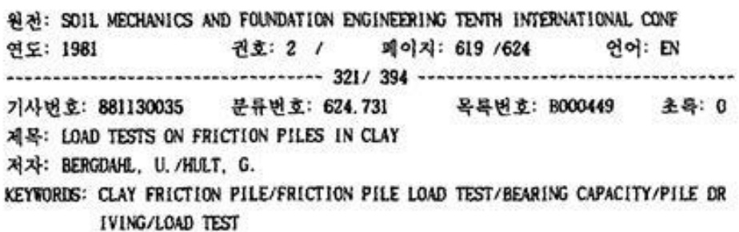  

THE BEARING CAPAC[TY DE FRICTICH PILES IS OFTEH DETESCMINED BY L0AD TESTS A NLMBE FTE5 PILES DIFFERET TEST FROCEDURES EVALLLAT ION HETHDIS ARE L5E THIS PAPER LESCRIBES THE AESULTS FR 25 L TESIS 25 HALF-SCALE FAICT!ON PILES LAY THREE DIFFERET TEST PROCELUFES HAVE DIFFEREYT EVALLSATION METHDLS HAVE BEEN! DISCISSED ]N ADD!TICN THE [NCREASE REARING CAPACITY HITH TIME THE EFFECT REFRIVING FRICTION PILES IH CLAYS ARE DISCUSSEL  

원전: SOIL MECAHICS AD FOLNLATION EGINEER!NG TEYT INTERNATIDEAL CINF  
연도: 1981 관호: 2 과이지: 525 1530 언어: E!322/ 394  
기사번호: A51130036 분류변호 524131 목독번호: BD0-4419 초륙0  
제목: EEARLNG CAPACIT? PILE PRELOADED EY DOTNLRAG  
저자: EOzozalk MCAPAC!TYIDOTN DRAG PRELDADYE IBAMENT T PEAK DOTNIRAG LOA  

KEYIDRIS! EEARING PILE DSTEEL-PIPE PILE  

# 초목:  

Ay I STRUHeTED STEEL-P[PE PILE 49 서 LDNG LRIVEN THROULEH HIGHRAY EBoENT T0 ADEEP DEFDSIT OuPREsSIBLE ARIE LAY ACUMLATED A PEAK DOTNDRAG LOAD ROF 152 M AFTER 10 YEARS AFTER THE PLLE EAS FLLLE 께 CUNCRETE A: COUPREHESI VE  

LOAD-TESTING PROGRLAH A5 CARRIED CUT OLER 4 PERIOD F 20 며YS 10[NTESTIGATE HE LOAD-CARRYING CAPABILITY 05 THE PILE HELOOXED- IN! DODREG LOAD BELHAVED AS STORED EERGY 1 THE PILETRASIENT SHORT-TERH LIVE LOAS CYCLIG LOALS 10STRESS LETELS OF 무I +- 33 1/3에 TERE EASILY SUPPDRTED PLLGINGFAILLFE CCOURRE AT AA APPLIED LOAD OF 2PL  

원전: SOIL HECHAVICS FOUNDATICN NG!NEERIATG TETH InteRNatIONal OOUF  
연도: 1981 권호: 2 페이지: 631 /636 언어:323/ 394 -  
기사번호: &8113003? 분류번호: 624131 목목빈호: B000449 초륙0  
제목: RESTONSE OF PILE FOINTS O ROX 10 TRASIET LOADING  
저자: Brede BER H /BAOS BB  
KEYTORDS: TRALS!ENT LOADING!DYNAHIC LOADINGISTATIC LOADIMGTHARD ROOK/BEARINTPILE DRIVEA!  

# 초탁:  

THE DYNAMIC AESPOISE OF PILE FOINTS 매 HARD RDOXK 10 TRAS!EHT LOADS HAS IHVESTIGATE ExPERIMEtally THEOETICAL RELATICH SHIP BETTEEN THE INITIAL AMD THE REFLECTED STRESS EAVES AA DYNAUIC 공국 RESISTANCE IS LSED TO CALCULATE 꺼E FORCE-PENETRATIO! RELATIDSHIP FOR THE PILE FOINt COMPLUTED HEASLRED VALLES HAVE Been compArEd THE STRESS-FULSE TAS PFODCED BY A STEEL HALHER SThIK!ATG A MODEL PILE DE TO THE VERY StDET RISE T[I5 OF THE STRESS AVE IT-EAS HELT FOSSIBLE TO LSE STAIRRD ACCELEHCME TERS INLLCTI VE GALGES CR SIMILAR EQUIPENT RESISISTIVE GAUCES FERE LSED INSTEAD THE DISPLACEHEYTS KERE CALOLATED BY INTEGRATING THE DIFFEREICE BETTE러 TE INITIAL A THE REFLECIED STRESS EAVES 꺼E ExpErIfENtLL TECSNIOUE ALD THE NMERICAL ALGoR!T 5E IN TIS INVESTIGAT ION ARE DESCRIBED A BILINEAR FORCE-DISPLACEME!T FLNCTIO! IS SUGGESTED TT INITIAL L0 RESISTANCE OF TE ROX  

C BE TAKE! 1국T0 ACMDLUNT   
원전: SOIL MECHAUICS AD FouhdAt It EGINEERING TE국 Interat IONal CONF   
연도: 1981 권호: 2 페이지: 637 /642 언어: __ 324/ 394   
기사번호: 881130038 분류번호: 624131 목묵번호 B0D0449 초탁: 0   
제목: ODYSOLI DATI ON DE 10 LATERAL LOAD!NG OF 4 PILE   
저자: CAFTER JP TBODKEr JR   
KEYHDRIS: P!LE LOADINGLOAD!HG COSOLI DAT IONVCYLINDRICAL COORDINATE SYSTEMYDA RCY'S LAWYHOOkE'S LaT/LATERAL LOADING  

# 초목:  

THE RESFOSE OFA SINGLE PILE EBEDDE 14A GAY SOIL SLEJECTED 10 A LATERAL LOAD MAY BE TIME DEPEDENT 꺼IS PHPER OUTLIHES A THOD OF ANALYS!S FOR THE TIHE DEPEHDENT RESPOSE 아 SU대 PIL5S LE 10 OCOHSOLIDAT ION OF HE SURROUDING ELASTIC Hed!Lh  

원전: SOIL MECHANICS FOLRDAT I0N EigIhEerING TENTH InterhatIONal CONF  
연도: 1981 군호: 2 페이지: 647 /650 언어:325/ 394  
기사번호: 881130039 분류번호: 624131 목족번호: B0D0449 초륙:0  
계목: PILE GHDLP SETTLEHET PREDICTI에 BY SIMPLE THEDRIES  
저자: CISANOVAS JS /ALOUS0 EE  

KEYYDRIS: PILE G품P SE HLEMENT/SECDNDARY COTSDLI DATI ON/PILE BU!LDINGISETILE! EDT BEHAVIOLR  

# 초묵:  

A CASE HISTORY INYOLVING THE SETTLEHET RECORD-EET ENDING OER A PERIOD OF SEVERAL YEAAS-OF PILE FOLNDE HLLUSI NG BUILDING I THE LLOBREGAT DELTA AREA [BARCELONA] 1s ANALYSED BY HEAS OF SIMPLE BLT UDTED READILY AVA!LABLE SEITLEMEHT COMPUTATI0N TEONIOLES SO!L-STRLCTURE InTeracT igN hAS a! IMFORTANT EFFELT 1 RELATION HIT THE LOALS ACTING UFON THE PILES THESE EFFECTS  

ARE EVALLATED SECOHDARY CO SOLI DEATION SETTLEHEITS ARE PRESEHT PLAY AN [FRTA7 ROLE T꺼E SETTLENENT PROGFESSION! OF THE BLILDING THE INFLLEHCE OF TE DIFFERENT RESTRICTIVE HYFUTHESIS MADE 1 E VARICAS THEORIES [5ED Is DISCLSSED A COPARISOA! IS HADE BETFEEN HEASSUFED FREDIIED SETTLEMENIS THE AGREEHENT [5 REASDHABLY COoD SECGEST IHG TRAT HE APROACH CL E CIS!DERED AS SATISFACTORY  

원전: SOIL MECHANICS 사 FOLNLCAT IONH LGIHEERING TETH INTERLATIONAL C현도: 1981 권호:고 ] 팩이지: 651 1658 언어:  

기사번호: B31130040 분류번호 624131 목륙변호: BD00449 초륙0제목 LIMLTED- TESIO! AVALISES OF SOLKETED PILES  

KEYTORIS: SDEETEd PILELIMITED-TESION ANALISISLOAD-DEFORHAT LON CURVE/SHEAR STRESSTTESILE STRESSFELASTD-PLASTIC AlALY5IS  

# 초묵:  

CONVENTICNAL ELASTIC ANALYSES OF SOOETED PILES PRDDLCEPLALSIELE LDAD-DEFORATIO! CURYES AND D1STRIBUTIOS OF SIDESEEAR STRESS EE! THODLLGH TESILE STRESSES HAY BE PHESET I THESLRROLFDING HED[LM AD AT PILE EACE 께IS PAPER PRESENTSFINITE LEEHT SOLLT1O5 FORA RAG도 PILE GEDHETRIESMATERIAL PRDPERTIES THEATIMG THE RLCXK SOIL AS A nD-TESIONDR LIMITED-TESION MaTERIAl AESLLIS ARE Give fF모 Uth ELASTICPLASTIC STRESS RANCES F꺼 ASSOCIATED AN HDN-ASSDCIATEDFLoy rules  

원전: SOIL MECHANICS FOLGHUT [0! HGHERIH TEITH INTERIEATIOHLL CF연도: 1981 권호:2 ] 페이지: 659 /652 언어:327/ 394기사변호: 88]13004! 분류번호: 624131 목탁번호: B000449 초곡: 0계목: HEAVE OF CUMPACTE EPAHDED BASE CONCRETE PIL5S  

저자: CAEK J I THArriS M C ITOOSEND DL   
KEYLORIS: COIVCRETE PILE/PILE FOUNDATIOHYFAK! PILE/FEARLNG CAPACITYVPILE DRIV ING/CUNCRETE PILE FOLNDATION!  

COMPACTED EXPAHEED BASE CONCRETE PILES 15 DRIGINALLY CEVELODPED BY FrAAK! HAVE EE러! 1IDELY L5E THEDUGHIOUT TORLD 5 APPLICAT[OLS HAVE BEE! SOIL PROFILES THERE TE PILES AR도 PredhlNatElY S신D OR GRAVE THERE HE SHAFT 15 DRIYE! THROLC! LACLSTRINE CYs SILTS 미5또 IN TESTER! CANADA 꺼IS PILE TTPE IS ALSO USED I COHESIVE SOILS 1S FORED IN DESE LAYEY TILL VERY HIG CAPACIT! PILES AFE A대HIEVED 11 THIS fHDFILE BUT DFTEA DETRIHENTAL PILE HEAVE OCOUFS THE HEAVE HAY DESTRDY 꺼도 INTELRITY OF 꺼E PAEVICUSLY RIKE! SHAFT IT MAY SEPARATE TE SELAFT FHOA THE BASE TS DESTROY ING THE NOFEALLY IG CAPACITT F THE PILES TTHREE CASE HISTORIES THERE DEIHIMENTAL PILE HEAYE ARAYG!HG 무1 800 M HAS OCCURRED ARE DESCRIBED A h도TOE OE ASSESSING PUITENTIAL FOE PILE HEAVE 15 PFESENTED ALOYG 부1께 TELANIOUES FORT REHABILITATING P!LES 때I대 HAVE SUFFERED DISTRESS 54 RESULT F HEAFING  

원전: SOIL MECHANICS FOLRDAT I0! ENGINEERING TENTH [LTEENAT IONAL COIF연도: 1981 권호: 2 페이지: 557 7672 언어:  

기사번호: 881130042 분유번호: 624131 목목번호: BD00449 초뚝: 0제목: LOEHDRAG 에 8T버러 COATED PILES 유AE! CLIMATE  
저자: CEENTE Fh Jr  
KEYEORIS: B[TUHEN MATED PLLE/UNDER COESOL[ DATED CLAYFUUNDATIO! EgIHEER'HAr  

LER BITLHENYCUATING PILE/BITUEN COATIHHG  

THE KEH! IHTERCHAHCE HDHCULU 휴ILL BE BUILT SLRST DING GROLND CIMPR!SE ERY DEEP SDOFT LHDERCO SOLI DATED CLay  

TE FOU DATI0N EGINEER HAD 10 DETERMINE THE HAGN!TULE OF TE LOIG TE에 DOTDRAG THAT 16 1/2 INCH [42 CH OCTAGONAL PRESTRESSED PILES FULD EPERLENCE AD DEVELOP PRCTICAL ECDNOHICAL HEAS 10 InHiBIt IT A FIELD TEST IHG PERDGRAH RA5 UhERTAKE 10 ExAiHE 꺼E APPLICATION BELAVIOR EFFECTI VENESS F BItUen GOATIMES FELICE DOTHDLEAG ULDER THE HarH-HUT HAAI!A! Ewthdyhent AlsD LOCAL CONTRACTOR HANDLING OPERATIOS FERE CESERVED AT THE PEDJECT SITE F[VE PILES FERE EPLOYED A CPARATIVE STuDY THREE OF PILES LERE COATE DIFFERENT GRADES D THIOHESSES OF BITLUME! 10 RETLUCE DOTHLRAG THILE THE OTHER T0 PILES ACTED A5 UNODATE REFEREICE PILES TO HEASURE THE FLLL DOnNDRAG 꺼E PRDCETLRE FOR APPLYING BITE INSTALLING THE PILES 15 PRESENTED FROH THE DATA DISTRIBLTI OF TE DOTNDRAG FORCES ACTING ALONIG THE PILES AS ESTABLISED MMERICALL RESILTS PRACTICAL EpERIENCES ARE REPORTED  

원전: SOIL HECANICS AHD FOLLHDAT IOH EGINEERINTG TEHTH INTERNLATICNAL COF   
면도: 1981 권호: 2 페이지: 673 /676 언어: 매 329/ 394   
기사번호: 881130044 분류번호: 624131 목묵번호: B000449 초목: 0   
제목: NOLLINEAR FINITE DEMET ANALYSIS PILES I COHES! ONESS SDILS   
저자: DALERCL G /DEL GRtSSD A   
KEYHORLS: ND IINEAR FINITE ELEENt ANAL ISIS/CDHESIONTESS SOIL PILE/P!LE-SO!L SYSTEMLLOAD TRASFER YECHANISH  

# 초묵:  

4 FINITE ELEMELT FEDCETLIFEE 1s PFESLHTED 10 SIMLLATE THE LOAD TRAUSFER HEOANIS! BETTE러! PILE A세 SOIL FOI COHESI CNLESS SOILs THE PLDCEDLRE 15 BASED 마머 ISOPARAMETRIC ELEMEYTS NON-RIGI DLY CONECTE 10 THEIR COLNER NODES IN ORDER TO MOLEL TE NOHLINEAR TRANSFER FLNCTION OF TE SOIL-PILE INIERFACE 4 ExpERIHENTALlY  

DEFINED TRASFER FLLCTION IS SHON TOGETHER I꺼 TEFOFHATI0N 아F HE SPECIAL EHET 써 THE SOLUTION Algor! thFINALLY 꺼E RESULTS OF A NlheRIchal APPLICATION ARE DISLLSSED  
원전: SOIL MECHANICS ALD FOLDAT!ON EGINEERING TETH INTERHAt IONAl COHF  
연도: 198! 권호: 2 페이지: 681 7584 언어:330/ 394  
기사변호: 881130045 문류번호: 624:131 목특번호: B000449 초목: 0  
제목: XIN FRICTION 에 UtE EslurrYy PILES  
저자: DY Pi TWATEs J A IkaiIgaHt K:  
KEYTORDS: LHtERSlLRry PILE 없대 FRICTIOHSX IN FRICTION/SHEAR STRENGTHYCOUNSOL!DATIONFFILTERCAKE/SATLRATED SOIL  

# 초륙:  

I! RECELT YEARS RESEARCH HAS BE CARRIED OUT AT THE INIVERS!TY 0F NATAL DURBAN SOUT AFRICA 1NT0 HE USE OF LHDERSLLRRY PILEs 꺼IS RESEARCH HAS ICLUDE A STUDY OF TE FROPERTIES 0F PURE BETONITE 국 TICONESS CMUFCS!TION SHEAR STR모 COSOLIDAT I0N CHARACTERISTICS OF TE FILTERCAKE THE MOYE-LENT OF GACND THE PILE HOLE 1 께S PAPER THE FACTORS AFFECITING THE TRASFER OF LOAD BETHEA! THE PILE Ad THE SFR고 SO!L ARE DISCLSSED RESEARH HAS SH거 ThaT the SHEAR STREUIH TE FILTERLCAKE 15 FrictIOHAL In NATLHE THEREFDAE 품 에 THE NOFSLAL SIREESS ACTIG ON IT THE FACTOPS AFFECTING THE LAGHITLLE OF THE HORMAL STRESS PTHE FILTERCAKE ARE EAMIHED In THE LIGHT OF THE BIOT COLESOL I DAT I ON THEORY AND ELASTIC ThedrY TE CHANGE I THIONESS OF HE FILTERCAE A TE TIME TAkEn fOR THE Cur'StRuCt I oN! 아 THE PILE ARE TAKEEN 1NT0 AcOdLAt FRIM THE RESEARCH IT hAY BE COHCLUDED THAT SIGNIFICAAT IN FRICTION CAH BE LEVIOPED BETWEE! THEE PILE And the soIl THIS IS BOENE OUT BY FULL SCALE PILE TEST RESLLTS LIM!1 DATa FECM ThE TESt LOADING F A PILE TO -11 500 N IS  

PRESEHTE 1께 THE PAPER   

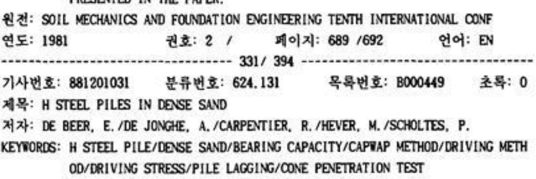  

TE RESLLIS F DYNAMIC STATIC TESTS PEAFOFHED OH STEEL P!LES 단T국 FITHAUT LAGGING A DRIVE! LDEISE SAND ATE DESCRI BED FrM THE ALALYSIS OF THE RESLLTS DTA CONCERHING SEVERAL FACTORS INFLUECING THE ULTIMATE BEARIHG CAPACITY ARE CETAINED BASED THESE FACTDRS 두H RESLLTS 아F CT TESTS HETHOD OF PREDICTION OF E LLTIMATE BEARIAG CAPACITY 1s PRESETED ANd THE RESLULTS ARE CMPARED HITH THOSE OHTAINED 꺼E DYNAMIC 'CASE" A 'CAPHAP" ME THOIS  

원전: SOIL YECAHICS AND FOUAT !ON NGINEERING TEHTH INTERATICNAL COUNF  
연도: 1981 권호: 2 페이지: 593 /598 언어: E서---_-부 332/ 394 A-ee----- 그  
기사번호: 821201032 분류번호: 624 131 목특번호: E200449 초략: 0  
제목: STRESSES 국 SETTLEMEITS DUE 10 PILE GRDLPS  
저자: Ellstein R A  
KEYHORIS: PILE GRCAUP STHESSTPILE GROUP SETTLEENT ISKIN FRICT ION/BEARIHG FRIGT  

ICNRSTALCTURE FolflAt I Oh  

초목:  

A HEOD 10 COPUTE VEETICAL STRESSES DE 10 PILE GROUFS Is PPESENTE THE ME THOD [5E5 GELDES'S INTEGRATION OF MINDLIN EOLAT ION APPLIES IT INA SYSTEATIC EaY 4 CMPARIS!! ITH  

APPROXIMATE HETTHDLS HAT IMPLY A SIMILAR AHOLNT OF MAABUAL TORK SHOIS TAT THESE 다시 GIVE HISLEADIHG RESULTS APPLICATION OF THE METHDD 10 ACTUAL CASE 1 MEXI0 CITY SH THAT GEDDES'S HYFOTHESES MAY EE ISED THAT C품FE RESULTS ARE I4 GooD AGREEMENT IT TE CESERVED FACTS  

원전: SOIL MECHANICS A FOLNTDATI ON EGINEERING TEH INTERNATICNAL COAF  
연도: 1981 권호: 2 | 페이지: 699 /702 언어:333/ 394  
기사번호: 881201033 분류번호: 624131 목특번호: B000449 초목: 0  
계목: SOIL MDDULLS FOR LATERALLY LOADED BORE PILES POZZDLANA  
저자: FEELl G B IGALATERI c  
KEYTORDS: POzzOLANALATERAL LOAD BORE PILE/DRILLED PILE/TERZAGHI/LATERAL LOADPILE  

THE RESLLTS FA ALMBER OF HDRI ONTAL LOAD TESTS OY PILES OF DIFFERENT DIALETER And HIT DIFFERET Bdlrdhry DDITIOS AT THE T0P ARE REPDR!ED All ThE TESTED PILES HAYE EH EORED THROLGH COHESIONLESS VOLCANIC SDILS I'POzzoLAna- IN THE NAPLES AREA: THE S0IL5 HAVE BE CHAAACTERIZED BY HEAS OF STATIC CUNE PEETRATION TESTS S SPT THE PILOGRAM I CLLDR L TESTS PA!RS F PILES 그께 EAD GOTATION! RESTRAINED BYA RIGID CAP A ON FOUR FREE-HEAD SINGLE PILES: THE D!AETER OF TE PILES IS OF O5 Oh O6 M IN SD도 CASES THE DISPLACELENT OF SHEFT HAS BE러게 HEASURED Br HEAS OF INCLINDMETERS 14 OTHER GLY DISPLACEMENT FUTATIGNT OF THE PILE HEAD BAcK-AnAlYSiS OF TE RESULTS OFTAINED FOR TE I NCLINDMETER INS!RUENIED PILES ALLOTS H DETERHINATION 우F SOIL MDULIs D!STRILUT I FI꺼 DEP국 STRESS LEVEL  

원전: SOIL HECHAHICS FCCRDHTIO! EGINEERIHG TE어 INTERNATICNAL CONF연도: 1981 권호: 2 폐이지: 703 /708 언어:  

334/ 394 -  
기사번호 881201034 분류번호: 624131 목록번호: B000449 초목: 0  
제목: LOAD TES!S ON LARGE PILES 14 S4세D  
저자: FelErup FE  
KEYYORIS: LARGE BOHED PILELOAD TEST/ULTIHATE LOADYCREEP DEFORHAT IOHYSHAFT FRICTION/LLTIMATE SEET FRICTIO!  

# 초북:  

SOHE RESLLTS FRM 꺼E TEsT LOADING OF $D=1.5W$ EORED PILES ISA AT BAIDGES ARE PRESEYTED TE EASIS OF STRAINMEASLRINTG IT AS PDSS! BLE T0 OBTAIN T또 SIZE RATE OF SHEFTFRICTION 금국 RESISTANCE MOBIL1ZAT ION FUR PILEs THEREULTIMATE LOAD DAS REACHED FOR CNE PILE TE TEST LOADIHG TASFEPEATED SEVERAL TIMES 1꺼 PLrPIHG FH DEEP TELLS 14 ORDER 10ISSE5S TE EFFECT 야F GRDLND EATER LEE A 아F PILE AGE 꺼EINFLLENCE EVALLATION! F ODSERVE CEP DEFORLATIOS EILCIs DISCSSE 45 FELL AS SOME COSTHLUCTIO! OESERVATIOS 때I대ARE ODNS! DERED MFRTA국t FOR THE PILE CAPACITT  

원전: SOIL YECHANICS A FOLDDATION! NGINEERING TEH INTERNAT IONAL CDNF연도: 1981 권호: 2 되이지: 713 /716 언어: 더  

기사번호: 881201035 분류변호: 624131 목목번호 B000449 초목0  
제목: FOINT PRESSLRE VERSLS LEGTh HD DIAHETER OF PILES  
저자: FRANKE E  

KEYHORDS: DIAHETER BOFED PILELLLTIMATE LOADYLLTIMATE BEARING CAPACITY/PILE L0 AD TEST/PILE FoLDATI0N  

# 초탁:  

PILES OF TOAE ThaAh! H DIAMETER HAVE BECOME INCREASINGLY ISED IT AS EXPERIECED That REGULATIOYS FOR CohWeit IoHAL SMALLER PILES RERE L5ELESS FOR THEH KE RLLES INTROCACED 꺼E GERL4N CODES OF PRACTICE ARE S0N BASED 매 4 CRITICAL APPRAISAL OF  

RECENT KNDTLEDGE AEDUT THEe DEPENDENHCE BEARING BEHAVIOLR 어DIAMETER LLGH And SEtTLE-ET  
원전: SOIL HECHAHICS FCLADHTION EGINEERING INTERHATIOHAL CF  
연도: 1981 권호: 2 페이지: 717 1722 언어:_ 336/ 394  
기사번호: 881201036 분류번호 624131 목묵번호: E000449 초목: 0  
제목: FRICTIC! EDRE PILES HIGHER BEARING CAPACITY  
저자: GRIGORYAN A A IFEddRoV B S ISORODIND! M Y I ROManV DA  
KEYHDRIS: FRICTIC! RORED PILE/HIGHER BEARI!G CAPACITYISUESD!L LAYERYROOTLIKEFOOT ING/BEARING CAPACITYVPILE BEHAVIOLR  

# 초뚝:  

BUILDIHIGS [HDLSTRIAL STRUCTURES 께I SLESDIL LAYeESQUARTELARY CLAYAL S01L5 ARE COHSTRLCTED [N TE 1558 FRICTICNBOhED PILEs TAT CF THHOUH SOFT SOILS ALL THE AY T0 THEHARLDER SLPPDRTING OES HE FRESENT PAFER GIVES SOME SPECIFICSOF BEHAVIOUR OF THESE PILES DISCLOSE BY STATICAL TESTSACCDPAH!E BY STRESS HEASUREENTS THAT DISPLAYED TE POOR HokDF THE PILES LONER TIPS SPECIAL DESIGH! EAS BE국 fOHKE C10INCREASE BEARING CAPAC!TY OF THESE PILE5 1 5DILS 꺼 LoT FATEROCONTENT SAID DESIG! ENVISAGING SOIL COHPACT IOH AT 꺼E HOLEBOTTU 8EFORE CUNGRET ING CAST PILE-SUPPORTS I LATER SATURATEDSOILS ARE ARRAIGED 꺼 때AY SLUARY ISED  

원전: SDIL HECHANICS FOUDAT!ON EGINEERING TETH InterNatIONAl CNF   
면도: 1981 권호:2/ 떼이지: 723 7726 연어: 3374 394 -- 그   
기사번호: 881201037 분류번호: 624131 목목변호: B000449 초탁: 0   
제목: INSTALLATION OF PILES FOR MARINE STRUCTLRES In tHe RED SEA   
저자: HAGENAAR J7WAN BERG EJ   
KEYHDRDS: RED SEAYMARINE STRUCTLREYP!LE IST ALLATIOH/GRAVITY STHLCTUHEIP C P! LE[PILE LOD TESTVTAVE EOUATION ANALYSIS/ULTIMATE BEARING CAPACIT  

TEADITIGALLY QUAY ALL5 1치 HALDDURS ALORG TE CDUAST OF SALDI ARABLA TERE 아T려 CDSTRLCTED A5 GREVITY STRLCTLTES IN HE FOF! OF PRECAST HOLLOR CNCRETE BLOO5 RECENTLY PLLE STRUCTURES HAVE REN DESIG 45 A4 AL TEFNATIVE 10 HE BLOdxealls 께IS PAPER DISCLSSES 꺼E GEOLOFICHL FACTOPS SOIL ParEters T0 E ATICIPATED FLRT THE GESIG! IMSTALLAT1O! OF PILES FOR OFFSHIDRE PROJECTS ALDYG RED SEA CEAST OF SALD! ArABIh GASE REODRD Is PRESEHTE FORA PADJECT HERE PRECAST FRESTHESSED CUNCRETE PILES HERE DRIVE! LOAD TESTED THE PILE LOAD T2515 CARRIED LT COIF TFEED THE ACDLIRACY 0문 THE REOUIRED DRIVING SEIS DETERM5NE! BY THE TAVE EDLATICA! AHALY5IS  

원전: SDIL MECHAL?ICS A FOLNDT I0%! ENGINEERIFHC TENTH I NTeRNat IONAL CF  
인도: 1981 권호12/ 매이지: 727 1730 언어:  
_브_로 ---_르르 333/ 394  
기사번호: 881201039 분류번호: 624131 목화번호: BDD0449 초확:  
재목: BEHAVIOUR OE 'FLEXIBLE PPLE Fdlrdat I gh!  
저자: HOOPER JA ILEvY JE  
KEYTDRIS: FLEXIBLE PILE FOLHLDAT10N BEHAVIOURYFLEXIBLE SUPERSTRLCTUFEILNLERPAS  

S RETAIHING FALLUSETTLSUETT  

DETAILED SETTLEMEUT REODRIS HAVE OBTAINED AN EIGHFYEAT PERIOD RELATIAG T04 EUILDING 1 CENTRAL LOIC! SLPFORTEDL DER-HEAMED PILES BLILDIG I5 OF PART ICLLARINTERES! EECALSE 에F 1T5 LARLE PLA! AL터A FLEXIBLESUPERST RLCTLRE 메어 TOGETHE? INWITE THEE PLSS!B!LIT! F LARGEDIFFERETIAL SETTLEMENTS IT IS DEDNSTRATED H럼 RELATIVELYSILFLE YEIHDLS OF LASTIC AALYSIS CAN EE SE 10 CALCLLATE THESETTLEMENT PACDFILES 05 LAFELE PILED FDLDATIOS SEVEEAL  

DIFFEREHT HE THKOLS ARE ExaH!HEd 꺼E RESULITS 아F E대 CHPARED 부께 MEASIRED VALLES THEE EFFELT OF DIffERENt!AL SETTLLEEHT COLUHA! LOALS IS ASSE5SED USING A GEERALISED WOMEAT DISTRIBLTICN HETHOD A품 INTERACTIVE BEHAV1OLA OF A LHEERPASS RETATHIFI FALL TRAVEFSING THE SITE 15 AL5 DISCLSSED  

원전: SOIL FECHAUICS FOLHIDATIO! EgIhearfnt 거 InterHat I CMAL CNF  
연도: 1981 권호: 2 페이지: 735 1740 언어: 태- 339/ 394  
기사번호 881201041 분류번호: 624131 목족번호: 8000449 초북:0  
지목: INTEGRLTY AL AS-BUILT CAPACITY OF EDRED PILE GREAP  
저자: KISSENPFENNIG J F TheinhDld HF  
KEYEORRS: FIEL TEST/RIGID SUPERSTHLCTURE/EORED PILE BEARLNG!HARD ROOKYSTATICAS-BUILT CAPACITYPILE G구 FOLNDATI에%  

ThIs PAPER SMALRL2ES FIELD TESTING ANALYTICAL HEOLS 5E 10 EVALLATE HE STATIC AS-BUILT CAPACITY OF A LARCE CROLP DF BORE PILES BEARING 매 HARD ROdx ANd INdERLYING PRACTICALLY RIGID SUPELSTRLCILRE  

원전: S1L MECHANICS ALD FELNDAT! O? EGINERING TET거 INTERNATIONAL COHF  
연도: 1981 관호2] 해이지: 747 1749 언어:- 340/ 394  
기사번호 881201042 분류번호 62413! 목화법호: B000449 초무:0  
재목: BEARING CAPACITY CALCULATIO! FOR PIPE PILES  
저자: Krs J/TeCMaNCAPACITY/OPEY-ELT PIPE PILEAFIEL  

KEYTCHIS: PIPE PILE BEARINT CAPAC!TY/BEARING  

0 T55T  

TE BASE OF THE PERFDEME EETESIVE MODE FIELD TE515 A CALCULATION HETHDD OF BEAR!NT CAPACIT? FOR OPEN-END PIPE PILES 15 PRESEHTE 꺼또 CALCLATION METHDD PRDFLSE INTHODUOES THE  

STATICAL FORHLLAE OF PILE BEARING CAPACITY SPECIAL CURRECT ICN CDEFFICLENTS FEPRESERTINT REAL RATI0 HE UWIT BASE A SHLAFT SDIL RESISTACES BETT고N 꺼E OPE- ALD CLOSED-EID PIPE PILES THE FORMLLAE PRESENTED HAS BE래 VERIFIED HE BASE 0F THE FIELD TESIS RESULTS  

원전: SOIL MECHANICS FOLATATIO EgINEERING TEITH INTERNATIONAL LF연도: 1981 권호: 2 폐이지: 751 /753 언어: 태기사번호: 881201043 분류번호 624 131 목화변호: B000449 초로:0제목: FILE INTEGRITY CAPACITY DETELOMI NED BY RELRIVIHG저자: LaGy Hs  

KEYTORIS: Pc PILE/EATER POLLUT IC MNTROL PLAYT/DRIVE TEST PILEYCHIVIHG RESI STANICEIPILE COOYCRETE TESILE STRESYREIRIVING  

PrdEIURE O REDRIVING O J SOUARE PRESTRESSE COUYCRETE PILES UP 10 82 LONG 부AS DEVELOPED THERE L0% RESISTANICE 10 DRIVING FHR SLBSTANT! AL DEPTHS FITHIN THE BEARING SThATLM AS Experieced ISTRLHTATION H LOA TESTS DeMdstraTEd THE STATIC CAPACITY OF PILES ECESS OF TTICE THE 889kN [100-TN LESIG LOAD DYNAMIC InstriMentatiON LRING DRIVING AS [5ED 10 LOCATE BROKEA! PILES ESTAELISH RERI VING REQUIREHENTS FOR DETERMINiN THE INTEGRITY AHD THE ADELUACY F HE PILES  

원전: SOIL HECHANICS FolndhtIoN EIGINEERIHG TEHIH Interhat Ional COUF  
연도: 1981 권호 2 - / 펴이지: 755 /758 언어:3려42/ 394 눈--  
기사번호: 881201044 분류번호 624131 목목번호 8000449 초[:0  
제목: EXFERIEHDS O5 TAPERE FRICTION PILES  
저자: LIMTOVIST L IPETAA: J  

KEYYORIS: TAPERED FRICTIO! PILE/FRICTIG! PILEVFD!NT BEARING PILE/BEARING CAPA  

CITYIPRECAST OANCRETE FRICTIG! PILELSTATIC LOAD TESTING  

FRICTION PILES OF STEEL O PRECAST COHCRETE 컴께 4 TAFERED LOLER POT LON HAVE 10 SODNE ExTENT H ISE SCCESEULLY 10 COMIPETE BOTH TECNICALLY ECDNDHICALLY 유꺼 TRAD!T IOHLAL FOINT BEARING PILES R STRAIGHT SIDED FRICTIOH PILES 14 THE ARTICLE VARIOUS EFFORTS 10 CIMFUTE THE BEARING CAPACITT! F FRICTION PILES 1s DISLLSSED HE Main OEJECT IVE HAS BEEN T0 GIUE A NLMBER OF CASE DESCRIPTION!S OF 꺼E ISE AND STATIC LOAD TESTING RESULTS OF PRELAST MNCRETE FRICTIG PILES 꺼 A TAPERED LOWER F T0 3 0 METERS 0F LENGT  

원전: SOIL HECHANICS FOLNLAT ION! EGINEERING TEY INTERNAT!CNAL CONF 현도: 198! 권호: 2 패이지: 759 1755 언어:  

기사번호: 881201045 분류번호: 624131 목묵번호 B000449 초목:0제목: DESIGN LOAD F PILE LATERALLY LOADED  

# 저자: ss  

KEYORIS: BORE PILE LTERALLY LOADED/DESIG! LOADYPILE'S HSIG LOAD/LATERAL LOADYLOADSTRESS CUIRVE  

FRH THE TESTIN DTA OF EOFED PILES CUL-PILED SEVERALCHARACTERISTIC CUEVES HAVE E려 LoITE STUDIED IT Is FLNDTAT TE LOAD-STRESS GRVE SERYES HELL FOR THE FURFLOSE 10ASDERTAIN VARIOLS STATES F FLExLRAL STRESSES In A PILE SECTION매 SU대 CIRVE TAT FOINT PRIOR 10 THE LOAD TAt ILL OALSE THEPILE RAPIDLY 10 FAIL 15 DEFINE A5 CRITICAL FoIn 메대 APPEAFS10 BE 4 STISFACTDRY CRITERIC FOR THE DETERM!NATION OF PILE'SDESIGH! LoaAd  

원전: SOIL HECHAHICS AD FOUHLAT ICN EGINEERING InteRNAT ICNAL CF연도: 1981 권호2 페이지: 767 /770 언어:  

기사번호: 81201047 분퓨번호: 624 1537155 목목번호: 006101 초륙0제목: HOR I ZCNTaL LOAD TES!S CH FILES DF LARGE DIAETER BORED PILES저자: SCMIDT HG  

KEYHOALS: HOR [ ZONTAL LOAD TESTYPILE LOADING TEST/HRIDGE PIER/BEARIHG CAPACITY 초륙:  

PierS FOR BRIDGES ARE OFTE! FOLNDED OH LARGE DIAHETER BORED PILES ARRAHLED INA SINCLE FILE GERMAN! MDES OF PRACTICE DIFFER AS 10 THE GROLP EFFICIENCY UDER LATERAL LOAD SOE LARGE-SCHLE HOR I 2OHTAL LOAD TES[S HTERE RLN EAH R THREE PILES SIMLTANEOLSLY SITUTE CE BEHIND THE OTHER THE LOADING DEVICE A5 YELl AS THE TEST PLGRAME ARE DESCRIBED A 부E L04 BEARING BEHAVIOLR OF THE TEST PILES 15 DISCLSSED ALDLTIONAL INVEST IGATICS AR도 SULEESTED  

원전: PROCEEDINGS OF HE ELEVENTH INTERENATIOUAL COAFERENKCE H SOIL MECHA  
연도: 1985 권호: 3 떡이지: 1569/1573 언어:345/ 394  
기사번호: 881201050 분류번호: 624 1314 목록번호: B00S!0! 초륙:0  
제목: SOILIST RLCTURE INTERACTION STUDY FOR A PILED ODNCRETE PLATFORH  
저자: HAASTEEN 'OE ICLALSEN CJ F IKEKSTAD  
KEYHORIS: CONCRETE PILE/SO!L STRLCTUREISDIL ALALYSIS/YAE TEST/COHE PENETRAT!  

어 TEST  

# 초륙:  

THE DEVELOFHENT OF THE LAFGE TROLL GAS FIELD 14 THE NORFEgIaN SECTOR THE NORTH SEA FILL AS RESLLT OF 부P LATER AND VERY SOFT SOILS REQUIRE FIXEd PLATFORH SOLITIC!S DIFFERENT FR에 THIESE 5SE PPEVICLSLY 1 THE NORTHER! HLHTH SEA THE PAPER DESCRIBES 도 OF TE CANDIDATE FIXED PLATFORSIS BEING COHSI DERED H CO DEEP T300 DETAILS ARE PRESETED RELATED 10 STATIC AHD DYNAMIC AMALYSIS OF SOILISTRLCTURE INTERACT ION  

원전: PRCCEEDINGS OF T또 ELEVEITH INTERNATIOUAL CODUEERENCE SOIL MECHA  

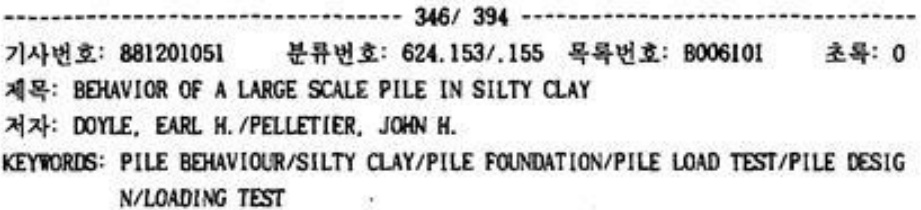  

# 초특:  

LARGE SEALE PILE TE5T AS PERFORHED 10 OBTAIN INFOrMaTI0N FOR THE DESIGN F A! OFFSHORE PLATFOFM 14 700 FEET 213 비 OF EATER HE PILE DAS TESTED LTDER'A VARIETY OF LOADING COHDIT105 꺼IS REPORT DISCLSSES THE RESULTS THE LDAD TEST PROgRAH A5 TEY RELATE TO PILE FCADAT I0 RESPOISE LDER VARIOLS LOAD RATES D CYCLIC LOAD COUD!TIO5  

원전: PROCEEDINHS OF THE ELEVEYTH INTERNHATIONAL COFEREYCE O SO!L ME대A연도: 1985 권호: 3 페이지: 1595/1598 언어: 태기사번호: 881201053 분류번호: 624 153/155 목묵번호: BOOS1O! 초류제목: FLLL SCALE LOAD TESTS FOR OFFSHORE PILES  

KEYHORDS: OFFSHIDRE PILELLOADING TESTIPILE SETTLEMEHTIPILE EEHAVIOLRSETTLEHE! T BELALICLR  

# 초목:  

RESLLTS OF CMPRESSI에 AJ TESI0N LOAD T5T5 OFFSHDRE PILES ARE PRESENTED THE PILES LERE DRIVEN! AEOUT 120 HETRES BEL에F THE SEA BE LEVE INT0 THE SODFT LIHESTOE FORHATION 꺼E LOAD SETTLEMENT BEHAYIOLR 주AS FRLND 10 BE ALMDST LIHEAR ELASTIC TE LLTIMATE LOAD CAPACITY PREDICTED FR어 STATIC FORHULAS I5 FEHD 10 CORRELATE TELL I꺼 THE LOAD TEST DYNAHIC FurmuLAs ARE FCLD 10 UNDERESt IHATE TE PILE CAPACITY 1 HE PRESEHT CASE  

원전: PROCEED! AICS OFTHE ELEVENT INTEENATIONAL CUUFEREICE 매 SOIL MECHA  
연도: 1985 권호:3 폐이지: 1603/1605 언어348/ 394  
기사번호 881201054 분류번호 624 153/155: 목목번호: B00510! 초탁:0  
제목: SIDE FRICT ION OF PILES 14 CALCAREOUS SAYDS  
저자: NOORANY [  

KEYHORDS: FRICTION PILEASTEE PILEIPILE DRIVEH/TR! AX I AL T55T  

초륙:  

STEEL PILES DRIVEN CALCAREOLS SAHLS DEVELOP ODUSILERABLY LESS SIDE RESISTANCE ThAN THDSE I SILICA SANIS ThIS PAPER DESCRI EES A서 INVESTIGAT!ON OF THE STREGTH BEHAVIOR SO!L-STEEL FRICTION! F HCYCEHEHTED CHLCAREOLRS SAS I꺼 PARTICULAR EMPHSIS TE EFFECTS F GRAIN CRLSHIHG THESE PRDPEXRTIES RESLLTS IHDICATE THAT CALCAREOUS SATS EAVE VERY HIGH FRICTION ACLES AVERAGE SOIL-STEEL FRICTION AVGLES GREAIN CRLSHING DES NOT APPEAR 10 REDUCE TESE PROPERT IES IT Is CUCLUDED Tat lot SIDE FRICT1O! STEEL PILES R!VE 1서 CALCARELS SAIS I5 CALSED BY L01 EFFELTIVE SOIL-PILE INTERFACE STRESSES RATHER Than SALl SOIL-PILE FRICTI에H ALGLES  

원전: PROCEDIHILS OF THE ELEVEITH IN ERNATIOHAL COTFERENCE 매 SOIL HECHA  
현도: 1985 권호: :3 괘이지: 1611/1614 언어:349/ 394  
기사번호: 831201059 분류번호: 524 1537155 목독번호: B005101 초목: 0  
계목: DY+IC HEASUREENTS A54 COLTROL FOR OFFSHORE PILING  
지자: DE MELLO JR INtyaha S/D4 SILVA A B /Rochh JL R IWaLVERDE S  
KETTORIS: OFFSHADRE PILEVPILE DRI VINGYBEARING CAPACLTYIPILE BEAR!NG CAPACITY  
초목:  

EXTESIVE DYNAMIC PILE DRIVING INSTRLHENTATIOH HAS [5E BY PEIROBAAS A5 A COTRDL FOR OFFSHORE PLaTfOrM PILIHG THE TOTAL Mmber OF STRUCTURES TESTE 10 DATE 15 15 THE ATER DEP께  

VARYING FRON 101 10 170 A TE PEETRATION OF THE PILE VARYING FRCM 204 T0 145! BELOE MLDLINE THE MAIN OIL PRODUCTIOH FTELIS HERE TE TESTINTG DAS PERFORMED ARE 1 E MDRTH-EAST A [시 THE SOUIH OF THE BRAZIL FRDM DYNAHIC HEASUREHEITS OF FORCE AD ACCELERLATI CN NEAR THE PILE T0P INFORMATION EAS OBTAIHED SU대 AS THE DIFFERENT HAL9ER PERFOFLLAICES TE BEARING CAPACITY ESTIMATES SOE ASPECITS OF HE CALCAREOLS SOIL TAT OCOCLF ALONG THE BrazILIAN CNTINETAL SHELF ARE DISCISSED SPECIALLY THEIR BELAVIOUT DURING TE DRIVIHIG AND SET-LP EACTOR 4 DIFFEREHT FiEIS:  

원전: PHDCEEDINGS OF HE ELEVENTH INTERNAT!CNAL CUHFERENCE C SOIL HEHA  
연도: 1985 권호:3 페이지: 1531/1534 언어:350 394  
기사변호: B81201062 분류번호 624 153/ 155 목북번호 BODO610! 초묵: 0  
제목: SOIL PAESSURES 어 LARGE DIAETER ODNLRETE PIPE  
저자: KNODEL PALL C  

KEYTDAIS: SDIL PRESSURE/PILE FDLDAT IONIPILE EICAVAT IONICUNCRETE PILE 초목:  

A FIELD STUDY DAS C마TUCTE OVER A PER1OD OF HEARLY 4-1/2 YEARS10 HEASURE SO!L PRESSRE DISTRIBLT!C! ARdLNd T{0 LARGE DIAMETER25 FEET O D RIGID CONICRETE SIPHDN PIPES CE PIPE AS OFCiRCUlar MONDLI THIC CAST-IN-PLACE COAHCRETE ONSTRUCTIOH THILETHE OTHER AS C!RCULAR PRECAST PRESTRESSEIL MOCRETE PIPE THREEPIPE SECTIOYS OF 터대 SIPHDN LEE ISTRLMENTED IT SOILPRESSURE CELLS AND NTLMEROLS SETS OF DS TERE OBTAINEDDURING SEIECLTED CONSTHUCT I ON EENTS DIFFERECES TERE NOTEDSOIL PRESSLRE DISTR!BUTIOH ALDUD THE TD PIPES  

기사번호: 881201064 분류번호: 6241315 목묵번호: B006101 초탁0 지목: DEVELOPHENTS SDFT GHouht EGIHEERING 1 SINGAPORE 저자: KalNARaTNE GP /Lo K I TYOUG Ky /UiOh VLEE Si KEYTORLS: SOFT GROUHD EIGINEERIHG/SOET CLAYTLEEP EXCAVATIOHISHEET PILE  

SOFT GROLND ELINEFR! 15 아도 DF 꺼E PrdInENt AREAS 우F COYSTRLCT ION ACTIVITIES 1N SLAFOAE CMOISEQUENTLY CUSIDERAELE [HTEREST 15 ATTACHED 10 TIS FIELD OF RESE품 15 HICHLIGHTE 1 FOLR DIFFERET PFDELTS DESCRI EED TIS PAPER  

원전: PROCEEDINES DF TE ELEVENTH INTELNATLONAL CONFERENCE CH SOIL MECHA  
연도: 1985 권호: { 페이지: 1681/1686 언어:352/ 394  
기사번호: 881201066 본류번호: 624 153/ 155 목목번호 B00510l 초륙0  
제목: A BRACED SHEETPILE ECAVATICN IN SOFT SINGAPORE KARIHE CLAY  
저자: TAA S B /TAH S L ICHIN YK  
KEYTORIS: SEET PILE/SHEEIPILE EXCAVATIONIMARINE CLAY/SOIL EXCAVATIOHYEEMVEAR  

꺼 PRESSURE  

# 초륙:  

SIGAPORE: THE GROHING D FO LAHLSPACE HAS I RECENT YEAESNECESSTTATED DEEPER 노R대부 BASEHEHT ECAVATIOYS IT 1s HOTLctstoh! THAT GROAD HOYEENTS STABILITY FFOBLSYS ASSOCLATED께 EXCAVAT ION I SOFT SOILS HAVE EDANGERED CALSED DAEAGE10 SLRRDLNDIHT PROPERTY 꺼15 PAPER PRESEHLS ISTHLHEHTAT I0RESLLTS OF HE 2LEEL BASEMENT EXCAHATIC! FOR THE MIHISTRY OF꺼도 EVIRDMENT BUILDING PROJECT GrOun HDVEHEHTS LRGER ThayEXPECTED YERE RECORDED IN THE AREAS THERE THE FACTOR 우F SAFETYAGA!LST BASE HEAVE AS LOi HIG STRUT LOALS TERE 5 MEASLREAT AFE STRLT LOCATIGHS GEHEAALLY THE HESURED STRLT LOAUSI께THE VALLES CALCULATED LSING PEEX'S 1959 EMPIRICALRELDP THE HESLLTS FFRCM THE FINITE LEENT AtALYSIS USIHG A4기사번호: B81201069 분류번호: 624 153/ 155 목목빈호: B00610! 초묵: 0재목: THE PERFOEMACE DF SAND COPACTICN PIL5S  

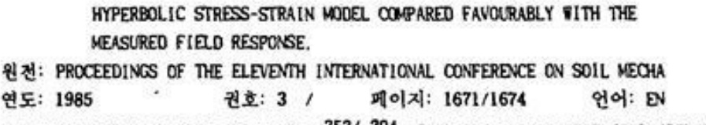  

KEYTORIS: S표 COPACTI0N PILEVPILE DESIGNIPILE SETTLEHENTVCUHPACT I DN! PILE 초목:  

THE DES!G! OF S4D COMPACTICN PILES IS USUALLY BSE CTi0 RELATIHELY SIMPLE PRINCIPLES IS THE STABILITY OF THE IND!VIDUAL SAN Clum CARRYING THE MAJOR PART F THE LOA IHCREASE AD SLPFORTED BY TEE SifrdUndifG COPRESSIBLE HATERIAL CARRYIHG A SMALI PERCENTAGE OF THE LOAD INLREASE TE OTHER PRINCIPLE IS THE ASSLHPTI에 TAT COLLMS AHd SOFTER MATER!AL FILL BE SLEJECT 10 EDLAL VERTICAL DFFOFLATION LEADING 14 STRESS CONCE TRATION ON THE SAI COLLGS AFTER IHSTALLING A NLUBER S산D C-hPACT ICN PILES FORA CRLDE OIL TAK 2N ROTTERDAH FURIS AREA PRESSLIRE GALGES ERE PLACED TOP OF THE PILES ADI서 BETTEEN TOGETHER Hith a nlwber 또 PIEZOMETERS 1N HE OUIPRESSTBLE STRATa 국 TE ATER TEST TE TAK TE II'strueNtatI0N DAS HHITORE TE RESLLTS ARE CAR FIT THE TECHNICAL DESIGN DRING THE INSTALLATION OF THE SAND COPACTION PILES 4 MARKE INCREASE IN FORE PRESSURE OOCCLRED THE LOAD COMCENTRATiUN FacTOR HAS nOT AS HiIGH AS ANTICIPATED THE SETTLEMENTS FOR TE CENTRE OF ThE taN TERE CLOSE T0 THE CHLCLATE VALLES  

원전: PROCEEDINGS O5 HE ELEVEHIH I NTERNATIGNAl CONFEREICE 에 SOIL HEHA현도: 1935 긴호 3 페이지: 1693/1685 언어: 태  

기사번호: B81202019 분류번호 624 131 목류번호: BD00-449 초탁0  
재목: VERTICAL LO TESIS 어 INSTRUEntaL ROUT-P!LES  
지자: HASSAD FNiyama S TROCHA R  
KEYTDRDS: ROOT-PILE/VERTICAL LOAD TESTICHHHEFORT'S LAE/SDIL-P!LE TOEARD DESIGNVFLOATING PILE  

# 초목:  

VEATICAL SLOW h TESTS 께 MAx I mM LOALS 735 H TERE CHARIED OUT 매 SHALL DIAHETER BORED IHUECTION PILES [RO0T-PIles INSTBLHENTED I께 ELECTRICAL STRAIN-GAGES THLOUGHT THEIR LENGTHS 꺼E RDOT-PILES HERE ISTALLE 1 THREE DIFFERET COHDITIDS Nahely FLOATIHG FOI국T BEARING 모0P BEDAOOK AM EMBELED Ih Roox TE SLRSO!L ODSISTE 우F A RESIDLAL SDIL 께 BOULDERS CH TOP OF BEDREX 510 15h IN DEFTH BESIDES E INTERPRETATIOH F THE DATA FE- THE LOAD TESTS THE PAPER Is COUCErNE IT께 THEORETICAL ANALISES BASE OA MODEL HIH ASSL5S The CaMbefORt'S LayS 10 DESCRIBE TE SOIL-PILE INTErAcTIch CE ACHLEVEME!T OF THE STUDY RAS THAT FOR THE SAFE LOAD OF 434kN FOR BEddX DISTAHT 12M0료 MORE FR에 HE SURFACE FLOATING PILES COUULD BE USED: IF 꺼IS DISTALICE [5 HOT MORE ThHAN 84 H PILES HL5T BE EHEELED IN THE EOOX: OTHERHISE FOINT BEARING PILES CTOP OF BEDROCX CLLD IHDICATED  

원전: SOIL MECHANICS FOLNDAT ION HINERI TEH INTERLDATIONAL연도: 1981 권호:21 페이지: 771 7775 언어:  

기사변효: 881202020 분류번호: 524 131 목특번호: 8000449 초탁: 0  
제목: PREDICTION DF FRICTICN PILE CAPACITY In A tILl  
거자: HEYERHOF GG 1BRON J D Holland GD  
KEYTOFIS: TILL FRICTION! PILE CaPAC!TY/LDRAINED SHEAR STREGTHIPILE DR!VEN/GLACLAL TILlfULTIMATE BEARING CAPACITYISETTLEMEHT PILE  

A CMPARISDN! IS MADE BETTEEN THE AESULTS 0F PRESSUREHETER TESTS SCRET PLATE TESTS LAEDRATORY TESTS FOR TE DETERHINATION OF THE L-dRa!NEd SEAR SR국모 A HOLLULLS OF DEFORHATIO! OF A GLACIAL TILL TE RESULTS ARE TSED 10 ESTIMATE THE BEARING CAPACITY AD SETTLEENT PILES FOR CMPARISDN 꺼 TE RESULTS OF LOAD TESTS STHE PILES DRIVEN INT0 THE TILL  

원전: SOIL ELHANI FOLNDAT I ON! EGINEERING TENTH InterhatIOhal CDHF  
연도: 1981 권호: 2 ] 페이지: 777 7780 언어: 머_ 355/ 394  
기사번호 881202021 분류번호: 524131 목특번호 EDD0449 초목: 0  
계목: FRICTION AEARING PIPE PILES AT CALABAR FORT  
저자: MDE D TAAVESEN H TOLM Os  
KEYTOAIS: FRICTLON BEARING PIPE PILEICALAEAR FORTYPILE DRIVINGFFAILURE LOADICLAYEY SLESDIL  

FOR THE CDSSTRUCTION F A QUay aT CALABAR NIGERIA 1699 CLOSED-EN STEEL PIPE PILES TERE 대RIVEN INT0 A STRATIF!ED SANDY CLAYEY SLRSDIL THE DIESEI HAMEES EMPLOY FOR PILE RIVING TERE ClIbrate AGAINST 4 SINGE ACTING STEAJ HaMER THE INITIAL PILE DRIVING INDICATED A POSST BLE IHCHEASE In BEARING CAPACITY WITh TIME DLE 10 OU SDLIDATION 메어 ZAS LATER CONFIFMED BY LOAD TESIS PILE DRIVINIG FDEMLLAE RE ILALEOUATE FOR PREDICTION OF THE LOG TEEM BEARING CAPACITY HILS! A PrIOR ESTIMATE OF PILE LEGIHS TE RASIS F EMPIRICAL FOFMLLAE TU물E LT 10 RE FAIRLY CORRECT INTERPRETATION OF LOAD TESTS 1s DISHASSED SPECIAL ATTELTION 15 PAID T0 CPARISON OF 꺼E MEASLFED R룸국 A THE THLEORETICAL ELLSTIC COHFFESSION 05 THE PIles  

원전: SO!L MECHANICS FOLDHTICN EAGINEERING TETH INTERNATIONAL CIEAF  

기사번호: 881202022 분류번호: 624131 목특번호 BDDD449 초륙:0  
제목: HEGAT!VE DRAG 어 IH'5TRLHETED PILEFA FIELD STUDY  
저자: MhaV D /BHadart RK ISharma D /SOHELA MR  
KEYYDAIS: NEGATIVE 없IN FR!CTIOHYPLLE FOLLATICDYFLELD HEASLREHEHTYLDCDHFINEDCOIFRESSIC! TE5T  

# 초옥:  

4 PaOgrAME OF FIELD HEASITEENTS CAST-If-SIT I5TRLMEIE CDICRETE PILE EAS LNDERTAKEA! IN THE MARLNE CLAY DEFLS[TS OF VISAXAPATNAM DDOxYARD THE PLLE EAS 430 DLAHETER A단서 LOC IT HAD STRAIN GALOGE TYPE LOAD CELLS AT THREE LEVELS AS THE SDEFT SATLRATED C때Y DEPOSIT ETEHE 10 A CON'SIDERABLE DEfT TE PILE TOP FAS HELD STATICHARY BY HAAGINIG IT FRDHA YCKE THE NEGATIVE CRAG A5 GEELATED BY LOAD!NG T도 GROU ArdUNd tHE PILE ITEAS LDH! TORED 丹Y ORSERVATIOES CUTE LOAD CELLS EHEEDREE In PILE PIEZDFTERS SEtLent GALGES HERE INSTALLED AHDLD THE PILE 10 ACCELELATE HE DEVELOFMENT OF NEGATIVE EAG ON TE PILE 도 AREA OF 이! ARDLLD THE PILES EAS PERKIDED I께 SA산I DRAINS OF 150N DIAMETEA THE EMRaENT LOADUMLOADING 7A5 DDNE IN THAEE STAGES F ITVSD M EAH ANd TE TEST OESERVATIONS FERE CONT INUTED DVER A FERIOD OF HDRE ThAM YEAR THE DTA IS AEALYSED BY EFFECTIVE SIRESS AL TUEAL STRESS APPROACH And cMparEt! WITH THE NEGHTIVE DREAG OESERVED OTHE PILE IT IS SHOR! THAT THE DISTRIBUTI0! OF DRAG ALOG THE PILE LENGTH K리S CRALGIN FITH TIME LOADIAt AY ISDVE ETT PiLe cay fURTHER MODLFY THIS DISTRIHUTION FOR DETEPHINING ULTIMATE SXIN FRICT ION THE PILE fas LOAD TESTEd THE PAPER CIMPARES PREDLCTIO! ACTLAL PEREORLANCE DF THE PILE  

원전: SOIL MEHAHICS FOLNTETICN EGINEERIH TENTH! ITTERNATIONAL CONF  

358/ 394 르_  
기사번호: 8B1202023 분류번호: 624131 목륙번호: B000449 초목0  
제목: DYNALIC POAE PRESSURE DURING PILE DRLVING IN FINE SAND  
거자: HDLLER BIBercdhl  
KEYTORIS: DYHAMIC PORE PRESSUREIPILE DR!VINGYPILE BOX/DYNAHIC BEATING CAPACIT  

# 초:  

PILLES IN SHEDE! ARE SLENDER ORIVEH ENd-EEARING COLLRETE TECDEN! PILES NORMALLY THESE PILES ARE HRIUE 106 CERTAIN REFSAL CCCRDIN 10A PILE DRIVING FoMull HOHEVER IN AEOUT 10PER CET OF ALL CISES IT15 N FUSSIBLE 10 REAHA RELIARLE REFLSAL 0210 REAH T꺼E ESTIM1ATED DEPTH FCR FRICTICN P!LES SA 꺼S 15 THE CASE SILTY A 5산마Y SO!LS BELOT THE GROLNLHATER TABLE 께S PAPER REVIEES IMVEST IGATION! PERFCAMED 14A 'PILE EEx" 1N 때I대시 20 ED!AETER HEL PILE DAIUE! INT0 A FINE SD HILE E STATIG DYNAMIC POAE PRESSUFE CHAGES HEASURED 꺼S INVEST IGATICH CUSIDERABLE DINAMIC FORE PRESSLRES TERE MEASLRED ALDT TE LEHITH OF THE PILE Ad AT THE PILE TIP TIs FORE FRESSLRE BAS FOSITIVE IN THE BEGINNINF 꺼도 SDIL STAHTED 1 DILATATE [}EE POPE PRESSLEE AECAHE NEGATIVE THESE NEGATIVE FDRE PRESSURES ILCREASELD HE EFFECTIVE STRESSES AROND TE PiLE And 꺼IS IS THE REASDH FOR THE DIEFERENCE BETFEEN TE STATIC AD DYNAHIC BEARIAG CAPACITT OF THE PILE  

원전: SOIL FECHANICS AD FOLMTLAAT I0+! EHGiNEERiM TETH INTERNATIONAL CILF연도 1981 권호: 2 ! 페이자: 791 /794 언어:____ 359/ 394  

기사번호: 88]202024 분류번호: 624131 목북번호 B000449 초륙0제목 A SIMPLIF!ED AAALYSIS OF PILES 꺼 LATERAL LOANS  

저자: OTEO ES INALERIO J  

KEYIORLS: LATERAL LOADPP!LE FOLNDHT IOYHORI ZOHT AL 5TATIT LOAD  

초박:  

A SIMPLIFIED ETH 10 RESULVE THE FRDHLEMS ORIGIHEATED BY FoRI ZOETAL STATIG DYHAHIC LCALS 에 PILES ARE EESCR I BED TE PLEFDOSE OF TIS 51H0D 15 ESTINATE THE HDRI2DNTAL DISPLACEEHT AT THE HEA T꺼도 MAX!}011 BELD1 HHEHT A SIUPLE PILE [N A PILE GROP BASICALLY THE ANALYTICAL HODE 5E I5A PAISMATIC HEAE FIXED AT로 KE DEPTH SEVERAL RLLES FHR DETELCHINE 께IS FOLNT ARE REd부E  

원전: SOIL MECHANICS FOLALDATION EIgINEERING TEITH [NTERNATIONAL 따  
연도: 1981 권호2 페이지: 7951798 언어: 태부 350/ 394 소  
기사번호: 881202025 분류번호: 624131 목퓨빈호: B200449 초휴: 0  
제목: STATISTICAL COSIDERAT IOS PILE TESTING  
저자: PREISS K ISHAFIRO J  
EYHORDS: PILE TEST INGISUNIC HETHDD/VI BRATION METHDDY DT APHRAG FALLIGAMLA RAYMETHGD! INTEGRITY TE5T  

HEA ESING INTEGRITY TESTS FER GLALITY CONTHOL OF PILE5 OR DA무H권 ALL SECT IO5 T꺼E RESFOS! BLE ELGIN보비 DECIDE Hu럼 MANY PILES OR ELEMEYTS 10 TEST THIS PAPER PROVI DES A STATISTICAL GUIDE FFOR THAT DECISION  

원전: SDIL YE대HICS 차 FCDATI0 ELGLHEERIFG TEYTH IATeRAtICHal 때느  
연도 1981 권호:2 테이지: 799 /802 언어:351/394 일-----  
기사번효: 351202026 푼류변호: 624131 혹복번호: B000449 초목:0  
제목: HORI2OTaL LOAD TESTS STEEL PILES LONDDn 때AY  
저자: PRICE GTARDLE IF  
KEYTORDS: H-SECTION STEEL PILE/HORIZONTAL LDAD TESTFL아D에H GLAYISTEEL PLLEFTU  

BLLAR P!LE/LGADING SYSTEMAP-Y ALALYSIS  

IS PAFR CMPARES 꺼E RESULTS OF STATIC CICLIC HORIZONT AL LOAD!NG TESTS ON FULL SCALE TUEULAA AND H-SECTION STEE1 PILES HAVIHG NOM! NALLY THE SAEE VERTICAL BEARENG CAPACITY HE PILES FERE DRIVE! 1N10 LOYDDN! GLAY PECENTLY DEELOPED IST RL ENTATION! SYSTES THAT CAUBE INSTALED AFTER DRIVIG ERE 5E 10 HEASLRE THE HDRI ZONTAL DEFLECT IOHS B10를 GRLALHID LEVEL HE RESLLTS SD듬E THAT THEE H-SECTION PILE MOVED Approx I ma telY 40PER CEET HORE ThAn E TUEULAR PILE FOR THE SAME APPLIED LOAD CIL MOT ITHSTAND CIIC L0AD5 45 EL AS THE TLBULAR PILE T꺼E DEFLECTED CHAPES THE PILES TERE C부ARE GRAPHICaLLY ANALYSED BY FINITE ELEME!T P-Y L DEFLECTION ANALYSIS TECHNIQLES THE RESLLTS SHOFED THAT DIFFERENT VALUES OF THE SO!IL PARAHETEES ERE YEEIED 10 THE BELAHIOLF THE TD PILES DEMDSTRATE HE DIFFICLLTIES DF DETERH!NING TESE PARAMETERS FRCM SITE IMVESTIGATIC! DATa  

원전: SOIt MECHAJICS FOLUDATIGN EG!NEERING JENT어 INTeENAt IONAL CDNF면도: 1981 권호:2 2 페이지: 803 /808 언어:  

그 352/ 394  

기사번호: 881202028 분류변호: 624131 목륙변호: E00449 초탁: 0  
제목: LARLE DLALETEL EORE PILES 14 BALICKGK EAY  
저자: PEDUEDON S TBREHER RP  
KEYHORIS: BANGKOK CLAY/LARGE DIAMETER BORED PILE/PILE CUISTRUCT IOH/LOAD TACONE HETHDD/LLTIMATE L04년 HYPEREDLIC HETHOD  

FER/DUTCH  

HE BEHAVIOLR SEVE! BEAED PILES IT DIAMETEFS FRM 075 T0 120 LEHTHS FRDH 21 10 2571 BAYGKDK LAY HAS E려 INVESTIGATED SAE DF TESE PILES TEFE INSTRLMEKTED THEIR LDAE DISHI BLTIOY 차 LOAD THANSFER CHARACEERISTICS  

AALYZED BY LSING THE TRASFER FUNCTION APPFOA어 TEYTAT!VE VALUES 05 THE ALHES!OH! FACTORS 1 SOFT ANd STIFF AY CoulD AlSO BE DERIVED 꺼E LOAD DISTRLBLTICH ALONG THE PILES INDICATED TT TE LOAIS ARE CARRIED MAI:LY BY SHAFT FRICTION E려 AT FAILLRE THE BASE RECEIVED ONLY DETTEEN 25A세 40% OF TE TOTAL LOAD TE LLTIMATE LOAD OF THE PILES MULD 프 BE PREDICTED 무I꺼AN ACCURACY OF+- 10% FRM 꺼E LOAD-SETTLEHENT TA BY ASSLLING THAT THE! TERE OEYING A HYPEREOLIC RELATIO SHIP FR THE FORK OF DTH CONTE PENETRCHETER SOLNDIhtS THE LATTER METHOD APPEARS TO BE PATTICULAALY SUITABLE FOR THE SOIL GOU미TIOS PREVALLING In The BAKcK AREA  

원전: SOIL MECHANICS FOLUDATIO! ERGINEERING TET INTERNAT IONUAL CHF연도: 1981 권호: 2 페이지: 815 7818 언어:353/ 394  

기사번호: 861202029 분류번호 624131 목독번효: B000449 초목: 0제목: LATERALLY LOADED PILES IN LAYERED S0ILS  

저자: REESE LC /ALLEN J D THAFRCIOVE Jo  

KEYSDRIS: LATERALLY LOALED PILE/LAYERED SO!LVBENDING WOHEHT YSTRERCTLRAL AHALYs IS METHOD  

A SERIES OF EFERIHENTS ERE PERFORMED TO INVEST IGATE THE BEHAVIOR OF PILES LIER LATERAL LOADING AYERED S0IIS TESTS TERE COUDUC!ED 4 25 써 DIAMETER PILE IN THE LABORATORY AL IT꺼 A 152 DIAMETER PILE IN TE FIED ExperIHEnthL RESLLTS FTERE CMPARED 10 RESLLTS From analySEs FAIR 10 GoD AGREEENT 5A5 OBTAIRED 꺼E ASSHPtIOh thAT ThE BeHAVIOR OF TE IHDIVI CUAL LAYERS RAS E SAME AS IF ALl OF THE SOIL HERE UNIFORH 1 CHARACTERISTICS  

원전: SOIL MECHANICS A세 FOLhDAT I아h EG!HEERIHG TEH INTERNATIONAL CF연도: 1981 권호: 2 떼이지: 819 /822 언어: 터  

354/ 394 그-   
기사번호: 831202030 분류변호: 524131 목독번호: B000449 초록: 0   
제목: EEHAVICUR OF SALL DIAMETER BORED PILES UNDER AxIAl LOAD   
저자: SABINI G ISAPIO G   
KEYLORIS: AXLAL LOADYDIAHETER RDRED PILE BEHAYI OURVBEARIAG CAPACITYYPILE BEHA VIOUR/TRIAXIAL TESTIPILE LOADING TEST  

TE RESULTS 054 FULL SCALE IMTESTIGATION ON TEO IHSTRLMENTEDSMALL D! AllEteR dORE PILES [PAL! RADICE ARE EF리ANALYSED DUTH PILES ARE DRILLED VOLCANIC SURSOIL TEFIEST OE FLOATING 'FOZZDLANA" ALD E SEOND End-bearinG To4 TUFF SLBSTRATLM: THEY HAYE EE! TESTED Inder AxI al LOADA MAx ImLy CF 700 ! FRP! THE TEST RESLLTS SDE INTEREST IGODSILERAT IONLS THE BEHAVIOLR OF T꺼E HICROPILES SO-ETHAtDIFFEREIT FRCH TAT F TE MEDIL5 R LAAGE DIAMETER PILES AREDratn PAFTICULARLY IT 15 FOINTED OUT TE OCOURRENCE OF A SIDERESISTANCE MLG HIGHIER ThA! ThAT T0 BE EXPECTED ACCDRDING 10THE CONVENT IOHAL BEARIHG CAPACITY THEOR!ES CTHE BASIS OF THESHEARING CHARACTERISTICS OF TE SORRDLNDING SOIL TO CLARIFYTIS PARTICILAR 음고 FURTHER THEORETICAL A EXPERIMENTALHHors SHOULD BE HECESSARY  

흰전: SOIL MECHANICS AND Folndat I0 ENGINEERING TENITH InTerNatIONAl CONF연도: 1981 린호:2 -그 페이지: 823 /228 언어: 터  

기사번호: 881202031 분류번호: 624:131 목록번호: B000449 초묵: 0  
제목: ELPERIEKCE IT DYNAHICALLY TESTED PILES  
저자: SANITYO E ICOBLE GG  
KEYEDRIS: DYNAMICALLY TESTED PILETFIELD CAPHAP ANALISIS/ULTIMATE LOAD STATICCARACIT!A사 EXPERLENKE DYNAMICALLY TESTED PILES IS PRESENTED CASEMETHOD RESLLTS Frdh FielD ELECTRONIC AAALY래R ALD CFLIAPAALYSIs Adcurtely PREDICIED TE LLTI!MATE LOA STATIC CAPACITL  
원전: SDI HECHANICS AND Fdudnat Id EngiNEsRI TEHTH INTERLATIOHAl 따뚜  
연도: 1981 권호:2 매이지: 829 7832 언어: 머385/ 394 --  
기사번호: 881202032 분류번호 624131 목목번호: B000449 초다: 0  
제목: GROUP ACTION OF LATERALLY LOAED BDFED PILES  
저자: SCHIDT HG  
KEYTOADS: LteraLL! LOALED BDRED PILE/PILE-SDIL [NTerACt IONYP!EAy ABUTHENTS/L0A BEARIHG BEHAVIOLR  

# 초탁:  

GEOUFS OF VERTICAL BORE PILES FOR PIERS 묘 ABLTMENTS ML5T E DES!GED 10 주ITSTAND LATERAL LOALS SILE RESULIS LATERAL LOAD TESTS RL매 LARGE DIAMETER EURE PILES AEE DESCRIBED THE PILE-SOIL TNTERACT IO 1s DISCLSSED A TESTIHG ERIFET FOR IHYESTIGATING 2-PILE GROLFS 15 PRESELTED  

원전: SOIL MEChAHICS D FOlrDAt I0H EIGIHEER!NG TEYTH INTERNATIONAL CONF  
연도: 1981 권호2 메이지: 833 1837 언어:357/ 394 --  
기사변호: 881202033 분류번호: 624131 목목번호: 6000449 초륙: D  
계목: PILE TESTING CENTRIFLCE  
저자: SOUFT RF  

KEYTORLS: CENTRIFLGE P!LE TESTING/LATERAL LOADYLATERAL LOAD PILE  

초무:  

CENTRIFLUGE TESTS OFFER ETHOD DF ESTIMTING ThE fuLl-ScALEPerFOfMaNCE OF VERY LARGE PILES THOSE D5SIGN 15 BASE 어EPERIELE I 4대 Salle PIles Tis may 퓨T APPFOPRIATET0 LARGE PILES MDLEL P!LE TESTS HAYE PRFOME 14 ACEYTRIFLGE 10 CECK THE MODEL BEHAVIOR AGAIST THAT OF 'NDEDUAL'[20 H LoG PRDTDTYPE PILLES LADER LATERAL LOAd S대도 Ax!al L0ATESTS HAVE BEE! CARRIED CLT 매 A LARGER HODEL PILE 1서 HECENTAIFUICEE 10 REPFESENT 꺼E RESPOSE OF 차 Go h long I3 nDIAMETER PAOTOTYPE SOIL IN ALL TESTS R5A DESE SATURATEFINE SAND  

원전: SDIL HECHANICS FOLNDT!ON EGIZEFRING TH께 [HTeEHAt IOHAL CUHF  
연도: 1981 권호2 그 폐이지: 839 /842 연어: 더------ 368/ 394  
기사번호: 881203001 분류번호: 624131 목타번호: EDO0449 초탁: 0  
제목: H도 PRESSLREETER A PILE FOLHDAT IOS  
저자: SELLGREN E  
KEYTORIS: PILE FOLNIDATIONYPRESSUREHETERYFRICT ICN P!LEYCDHESIOHLESS SOILVHEAR!CAPACITYISETILEHENT  

PAPER DESCRIHES TO CASES 14 SYEL려! THERE TE5T RESULTS FRL PRESSLFEMETER HAVE BEA L5ED 10 DETERMINE 께E BEARING CAPAC[TY SETTLEMET 65 FRICTION PIL5S [4 Ohes I OHLESS SOILS BEFORE TE PIL5s HERE RIVE! THE SO!L RAS ITTESTIGATED BY AHDNG OTHER THINS PresSlreMeter IN ONE CASE PHESSLREMETER TESITS FERE 45 PERFOFFD AFTER THE LR! VING OF THE HDLE PILE GROUP ODMPARISDH BETTEEN TE PRESSLREETER R5SLLTS BEFORE And after the PIl DRIVING GAVE INTEFEST ING RESULTS LOAD TESTS YERE PERFOFHED 때 FOLR TelL-IsTRLUMEnTED RIHEH OACRETE PILES CEF THE PILES TAS TESTE DT BEFORE AFTR THE THOLE GHDLUP AS ERIVEN DURING HE LOAD TESTS MEASLTEHEHTS OF THE LOAD BOI AT THE PILE HED AND PILE FHt LERE PERFORHED A5 EL AS HEASURE IENTS F 꺼도 DISPLACEMENITS ALOHG THE PHLES THE SHAFT RESISTANCE A ITS DISTRIELTICN ALOG HE PILE THE FO1NT RESISTAKCE THE HEARIHG CAPACITY TE CRITICAL LOAD EIC TERE ANALYSED THE 표GRE불국t BETHEA! H RESLIS FROM THE LOAD TESTS THE CALCULATIONS  

BASED CTHE PRESSLRE ETER RESULTS RAS VERY GODD인전: SOIL MECHANICS A FCNDT1ON EGINEERING TETH INTeRNAT1ONAL CONF면도: 1981 권호:2! 페이지: 843 /846 언어: 태기사번호: 881203002 분류번호: 624131 목륙번호: 8000449 초탁: 0제목: DETERHINAT ION PIL5S BEARING CHPACITY  

저자: SIMVLL1DL J A YBACHOLDIM BY IDROKOV J Y TBerMan VJ Tttuhexhodla E A N ISHAHIREV V B ISIVITSxY Y  

KEYHORLS: PILE BEARIHG CAPACITYI IHPACT LOADI GYHALAER 'S IMPACT  

초륙:  

꺼EE CLOLATED EXPRESSION FOR THE BEARIAIG CAPACITY PILES 6A5 DERIVED CN THE BASE OF THE SOLLT ICN! 꺼E EQuIL1BRILl EOJATION THE EXPEDED USEFLL PORER OF THE IMPACT THAT 15 AOSS! HLE 10 PLOTT TE D!AGRAM 0F THE FELAT IO LSHIP BETH원 H SETTLEHENTS OF 꺼E PILES AM LOAIS THE ExpErIMntal INVESTIGAT IOS RERE CARRIED LT T0 DEVELOP THE HETHDLS 꺼E ACCOLNT ING THE FORCES F THE HEGATIVE FRICTIO! FHILE DETERMIHING 꺼E BEARINTG CAPAC!TY OF THE PILES LDER THE FORCED COESOL I DDT I OV OF SOIL SURROLN DING ThEM IT HA5 PRDFOSED TO TAKE THE EXCEEDING OF TE RATE THE SOIL SETTLEHENT ABOVE HE RATE OF THE PILE SETTLEMEHT A5A CRITeRILM FF THE OR I RGINATICN OF THESE FORCES  

원전: SOIL HECHANICS AD FounDat IO! ERGIHEERING TEHIT INTEAHAT IONAL CUHF  
현도: 1981 권호: 2 페이지: 547 /850 언어:  
__ _- 370/ 394 -  
기사번호: 881203003 분류변호: 624131 목목번호: B000149 초특:0  
제목: RLOXLING OF PILES IHIT!AL CLRVATLRE  
저자: SOVIMC 1  

KEYTORIS: PILE BUCXLI NGIFOUN DAT I ON PILEIPILE DR I VEN/BUUKLING LOADYFINITE L레ET HETHODVMARINE STRLCTUREYDAHAGE PILE  

THE PAPER DEALS HITH THE PROELEM OF TE BLCXLING OF FONDATION PILEs IT INITIAL CRVaTLHE LLDER AXIAL LOAD A SOLLT IO! EAS OBTAINED FOR A PILE DRIVE! THROLH SOFT SOIL 14 HI대 THE COEFFICIE!T OF HORI2OHTAL SOIL REACTION INCREASES 태IT꺼 E!H: 10 BEARING STRATA THE CRITICAL BLCKLING LOAD AS CMMPUTED FLR THE CASE OF STEEL PIPE PILE FOR ELASTIC-PLASTIC STATE OF STRESS EY THE FINITE ELEMENT VETHOD THE MHERICAL ExauplEs Are CMPArE 1h THE RESULTS OBTAIHI B THE TEST LOADINHTG 유FA40 M LOIG PIPE PILE fITH INITIAL CIRHATLTE LALIMAL LATERAL DEFLECTION! OVER 50 THE INVESTIGATION TAS CARRIED CT FOR REMEDIAL HEASLRES FOR A PILED MARANE STHUCTURE 때I대 AD담면빈 SERIOLSLY DAMAGED LRING DREILGING OPERATIOYS 1N FRRYT HE THArF:  

원전: SOIL MECHANICS 잔D FOLNDATIO! FR국 TENTH! I NTERNAT!OHAL CEF  
현도: 1981 권호: 2 ! 페이지: 851 7855 언어: 버371/ 394  
기사번호: 881203004 분류번호: 624131 목화번호: B00D449 초록0  
제목: Istrlented DDEL PLLES JAXED 1NT0 CLAY  
저자: STENFLT J S TRANDOLPH M F YEruth CP  
KEYTORIS: INST RLENTED DEL PILE JACKEDVCLAY PILE JACKEDYTRIAXIAL TESTERLLALDRATORY PILE TESTIPILE JAKED  

I가AN ATJEMPT 10 ASSESS NEE EFFECTIVE STRESS HETFHDLS OF ESIG 0F AXIAL CAPACITY 아F DRIVE! PILES A SERIES OF ISTRLMETED LABORATORY MODDEL TESTS HAVE CARR!ED LT THE PURFLOSE OF THE TESTS AS 10 VALIDTE ASSTMPTIONS CRRETLY MADE [N HNDELLING 4 INSTALLATION OF THE PILE SLESEDLE!T RECODNSDL I DAT I ON 0F THE SLrRDUNDING SOIL C AXIAL LOADIG T꺼E PILE  

원전: SOIL MECHANICS FOLNDATIGN ENGINEERING TETH INTERHATIONAL CDF연도: 1981 권호:2 패이지: 857 /554 언어:  

기사번호: 881203005 분류번호: 624131 목류번호: B000449 초국:리 |  
계목: EARTHDUAKE DAMAGE AND DESIG! ETHDD OF PILES  
저자: SuGIHLRa Y  

KEYTORIS: PILE EARITHDLAKE DAMAGEIPILE FOUNDAT IONy DAMAGED PILE FOUHDAT I dN/gROUHD-PILE-BUILDEHG SYSTEMYVIBRATIOHAL TEST/TETATIVE DES!G!  

REEVALLUATICN! OF EAFTHOUAKE LOAD T0 PILE FolaDATioH aND IT'S DESIGN HETTDD 15 STHOHCY SLCCESTED Fedh THE EVIDEICE 아 DAMACE CHLSED 비Y OFF-HIYAG! PREFECTLUE EARTTHDUAKE 4 1978 SEYERAL ExAPLES OF THE DAMAGED PILES AHD RESPOISE AHALYSIS OF ExAMPLE 매GI PILE FOLHEDAT ION AEE INTRODUCED ThE! PAATICIPATIO! FACTOR OF HOR I 2ONTAL FORCE APPLIED TO PIL5S IS DISCL5SEI FOR THE PURPOSE OF RATIONAL SEISHIC DESIGN OF STRUCTURES SUPPORTED 에 PILE FOUDAT I DNS BASED 어 VIERATIOHAL TESTS FOR HODEL GrOlHD-PILE-BUiLDING SYSTE A FLNDAMENTAI IDEA OF DESIGN PILE FtandhtION 15 PRDOFOSED LAsiLY A5 APPHDPRIATE STATICAL HETHOD 내I대 SEISHIC EFFECTS ARE I NT RORXCED  

원전: SOIL MECHANICS FOLNDAT ION HGIHEERIG TEH INTERATIONAL  
연도: 1981 린호 2 ! 퍽이지: 865 1865 언어:373/ 394  
기사번호: 881203006 푼류번호 624:131 목록번호 B000449 초화: 0  
제목: PILE FOLDATIOS I SOET SOILS  
저자: TONG YX /HEN O H YCHEN XL  
KEYTORIS: PILE BEARING CAPACITYIPILE FdlaDhT IC! BELAVIOURYPILE FOLUDATICN/TE!  

TATIVE DESIGA! HETHOD 초류: TIS PAPER REFDHIS 머 EXPERIEKCE OF PILE FOLNDAT I CUS DESIG! COICEPIS IN SHAAMHA! [T1 VICINITY INCLUDIAYG: [1] EPIRICAl RLLES FOR ESTIHAT ING PILE BEARING VALLES BASED STATIC CONE  

PENETRATIOH AESISTAICE: [2 CASE HISTORY F 1STHLHENIED HEAVY PILE FOLNDATION! 표께 FLELD OESERVATIONS OF PORE LATER PRESSLRE SOIL DISPLACEMENT And [4] a tentaTIVE DES!G! HOD HICH maY AFFECT A SAYING 우F SIHE EIC: 3 LONG-TERL! PEAFCFMANCE RECDRIS F PILE-SUPPORTED STRLCTURES: 20X OR HORE OF  

꺼E PILES GRDLP BY ALLOT ING LARGER SEITLEHETS  
원전: SOIL HECHANICS FOLNATION ENGINEERING TENIH INtERNATICUAL C마F  
연도: 1981 권호2 패이지: 859 /872 언어: 머크__ 374/ 394  
기사번호: 681203007 분류번호: 624131 목특번호: B000449 초국: 0  
제목: STEE1 PIFE PLLES 14 SILTY CLAY SOILS AT BELafaY INDONES!A  
저자: TRENTER N A bLirt NJ  
KEYTORIS: BELATAN/ INDONES!AYSTEE! PIPE PILESILTY CLY SD!LYINDRAINED SHEARSTRENGTHYPILE LOADINTG TEST  

THE PAPER DESCRI BES THE DAIVING TEST LOADTAG OF STEEL PIPE PILES TIC FORHED PART F THE GEOTEONICAL ITVESTIGAT!ON FOR DESIG! OF A MAJOR FORT ETELSION AT bElaEan INDOHESIA FOLR PILES TERE TESTE T0 OISHDRE OFFSHORE 1NA SILTY CLAY SUCCESSION 때IC COHTAIHED A54 THICK LAYER OF VOLCANIC AS AND SHND AT THE OSHDRE LOCATION T5T AT DIFFERENT INTERVALS AFTER DRIVING TE OFFSHORE PILES SHdTE SESTNT IL GIN 때 LOAD CAERYING CAPACITTY FITh TIME 베I대 RAS REFLECI!ED INCREASE IN THE CALCULHTED PARAHETERS AlPHA BETA AD DELTA 또 CALCULATED PAFLAMETERS YERE AlS SIGNIFICANTLY HIGHER FOR TE OSHORE TESTS: PRDBABLY LE 10 THEE 꺼IC VOLCANIC ASH SD LAYER BAX AALYSIS THE DRIVIALG REOTRLS INDICATED ThET DESPITE PART!ALLY PLLGGE DYNAMIC BEHAVIOUR THE [INTERNAL SHAFT RESTSTANCE DURING DRIVING DAS GEERALLY O A LOi VALUE MICHT 또 ITCREASE IN THE PRESENCE OF GRANLLAR MATERIAL  

원전: SOIL HECHANICS A FOLLATIO! EG!TEERING TEITH INTERHATIONAL CHF   
연도: 1981 권호 2 } 패이지: 873 /890 언어: 375! 394   
기사번호: EB1203009 분류번호: 62413! 목북번호: B000449 초륙: 0   
계목: FRICTION PILES CLAY SOILS   
저자: KYALOV SS THARIUPOLSkY L G ISLEPACX M E I MATIASHEV! Th IA   
KEYTORLIS: CLAY SO!L FRICTIGN PILETFRICTION PILE/DAIVE PILE  

# 초목:  

THE RESLLTS OF THEORETICAL AN EfERIHENTAL INVESTIGATIOS OF FORK OF FRICTION PILES LAY SDILS ARE GIVEN THE REPORT THE INFLLECE F SECT ICNAL AREA ARHVEN PILES 에 SOIL RESISTANCE UDER THE TIP T도 LATERAL SLRFACE 05 PILE ARE THE RESULTS F CIHPARISON F THEORETICAL EPERIMETAI ATA ARE GIVEN  

원전: SOIL MECHANICS 물 FUUMIAT IOH! EHGINEERING InterNat ICHal CHF  
연도: 1981 권호: 2 페이지: 885 /826 언어:376/394 느-  
기사번호: 881203010 분류번호: 624131 목류변호: E000119 초륙0  
배목: PEEH!SS!BLE SHAFT LOAS COFICRETE DISPLLCEENT PLLES  
저자: AS FEELE A F /DE ER J  

KEYTORIS: PERMLSS!BLE SHAFT LAD/BRITTLE RUFTUREICUNCRETE DISPLACEHENT PILEIC OACRET PILEVPILE REINF OHCEMENT PRESCAST PILE  

초륙:  

A PILE FDLDAT1d? 15 꺼E LDR FOU dAtIoN! TEdNIOUE APPLIE 11 TEe HE THERLANDS DRI VEN CONCRETE PILES ARE MOSiLY USED NDFADAYS S대 COHLRETE PILES CE EE DIVIDED 1102 GLEDLFS: 4 RIVE! PAECAST PlLEs FACTORY HADE & DRIVEH UNCASED CAST-IN-SITU PILES TIS CoatrI but IoN INFORHATI0! IS GIUE! AEOUT TE DETERMINATION OF THE SThICtURal DES!GLOAD ALLOTARLE IN THE SHAFT OF SEH PILES  

원전: SOIl HECLANICS FOLMDATI EIGIHEERIEG INTERLATIOLAL CDF  
연도: 1981 권호:2 - : 페이지: 887 /831 언어: 더377/ 394  
기사번호: 881203011 분류번호: 524131 목목번호 B000449 초목:0  
제목: LATELAL RESISTANCE OF PIPE-PILE ELL FOLHDATI!  
저자: YAUASaK! T ATOMINAGA M /ykI Tomo H /ISHIDA  
KEYTORIS: PIPE-PILE 부크LL FOUF DAT I CHYFELL FOLNDATICN/LATERAL RESISTAICERSTEELPIPE PILE/ASEISMIC D5SIG  

초특!  

THERE 중 EXISIS An ESTAELISHID METHO OF CESIGHING A fELl FCleDdAT I0! CMFLSED! OF STE고 PIPE PILES HOTEVER THISTIPE OF FOLNDATIO! HAS H TIDE RAUGE 유F DIMES!CYS STRUCTURES THE EXISTING ETHOD 15 NOT GCOD EOLIG 10 COVEER? THE FIDE RANCE OF FOLIDATIOS In this papEr TE MECHANICAL BEHAVIOR OF THE ELL FOLnDAT Idh! LNDER STATIC LATERAL LOAD IS SILD!ED B THREE-DIME SIOHAL NET TORK AWAlYsIs 사 CHARACTERISTICS HI대 HAVE NOT LARLETED ARE DISCLESSED 4 CEPARIS! OF HE ERPERIMEYTAL RESULTS 께 THOSE OF 꺼도 THEDRETICAL AALYSIS Is PERFOREL IN ADDITIGN LOUBLE EALL TYPE ELL Foundat Ioh CO-FOSED OF INTEALOOXED PIPE PILES 문AS 155 AS THE Foundt I on FOR A BLST FUENACE SINCE THREE-DIMESIONAL HETHOFK ANALYSIS AS CSED T0 DESIGH! 꺼S FELL FOUTEATION TIS PAPER ALSD CUHPARES EARTFDUAKE ORSERVATIC! RESLLTS ITHTHSE OF 꺼E THECRETICAL AffrOACHEs  

원전: SOIL 또HANICS FOLNDAT ION EIGINEERING E InterhatIOnal CEF  
연도: 1981 권호 2 페이지: 893 1895 언어: E-- 378/ 394  
기사번호: 881205037 분류번호: 624131 목특번호: B000450 초록  
재목: UDEEPIINING 11 STEDE! RECENT DEVELOPLENTS  
저자: ER I KSSDN U ThuLTSJ0 S IlIDahl BADRD B  

KEYTORIS: ShEDEN/LCDERP INHINGDRILLE PILE/JAOKE-DON CUHLRETE PILE/SAVING [ [TIES!LLIGHT TUELLAR STEEL-PILETHEAV! STRLCTLHE  

A MMBER HETHDDS FOR Wderpt}eninG HEAVY STRUCTURES HAVE DEYELOPED ADAPTED T0 STEDI호 COHD!TIOS DURING TE LAST FE YEAES 께IS PAFEH PRESENTS THE FOLR LETHOLS HS! COHOHLY 5E0 IN SREDE! TORAY IT DESCRILES THE LINES 아F PEOGRESS I Therp IhinG TECHNIOUE AHD GIVES SEYERAL ExAPLES OF SITE APPLICATIONS [T AlS FRESENTS RESULTS FRCh! VARIOLS TESTS OF PILES CARRIED OUT AT THE DIfFERET SiES  

원컨: SDIL MECHANICS Ad FOIMdAt!O JET IHT2DAT 1OHAL연도: 1981 권호:3/ 페이지: 69 /5 언어:  

기사번호: 881205040 분류빈호 524131 목무번효: D0-50 초륙:0계목: SAYIAF DLD BUILDINES  

# 저자: HIUMER K  

KEYTORDS: SAVING L BUILDINGTHOODE! PILE FoleDAtICHYT I MBER-PILE FLLRDATICHY EP FOLRTATIDNLLULERP INN!HG/ULD BUILDIHG  

IH THE LAST YEaRS THE INSTITUTE FOUNDGT I N A SOIL MECHAN!CS OF LGA TAS CHA LARGER SCALE CD STLTED 1N THE FIELD OF SAVING OLD BU!LDIHCS THE MDRE S AS THE HET LAES 5 PRUTECT ION F MDLLMENTS REOIDF EFFELT!VE AD MaINy AS GENEEDIS SFUNSOR PLOGRALS OF TE GOVERLMEYT ARE FETMFORCED HE PROBLES F SAVENG OLD BULLD!NGS A문ES 때L TAT IS ONLY SLIEGESTIVE 1 BINT HUT DSOMF ELAMPLES BESIDES ESSPEC!ALL! 꺼E CMPLET IO! 10 꺼떤 CUNTRI BUT ICN PEx/HILLEIJNER 국도 SAVING 유F T00DE PILE FOLNDAT1OS SALL FE TRE표TFES재T ROH PAPERS A도 Cuhplementary FOLNDATIOS A S LDerPINNINGs HIT SALL DIAMET래R PILEs GroutIng EIc ALE  

F0INT CUT NTIS OCCASION AL5D TE DESIG! WILl E TREATED  
원전: SDIL MECHANICS FOLDAT I0N EGINEERING TETH INterNATICNAL CONF  
연도: 1981 관호: 3 페이지: 111 7116 언어:380/ 394  
기사변호: 881207037 분류번호: 624131 목화번호: B00450 초묵:  
제목: THE QUALITY F THE TC0D N TIMBER PILLES  
저자: Lintsthh RB  
KEYTORIS: TIMEER PILE FOL DATI ONYOLD TIMEER PLLETIMBER GRILLLE/OLD BILDIN/0 TIMBER PILE  

# 초특:  

DISUSS!05 ARE OFTEN 매 HE SLBJELT OF LS!NG OLD T1HER PIL5S 1 REOAUSTELCTED OT NET STRUCTURES HEPLACING 께E게 BY HE PILES TIS PAPER REFORTS FE THE TESTS THE DEALITY OF THE 00 IN OLD TIHBER PILES F FINE PIH5 SYLVESIRIS BELOT 꺼E ATER TABLE F포품 167거 차 HE 297거 CETLRY 꺼E 0D T1H GRILLAGES HAS 주S BEEN TESTED THE RESULTS FRD TE TIRER PILES AE도 Lnab!QUals HILE E TEST RESLLTS FRCH THE TIMBER GRI LLAGES ARE [rreflar  

원전: SOEL HHICS FOLDATI0 ENINEERING E I nternatI Chal COHF  
연도: 1981 권호:3 _- 매이지: 131 /232 언어: E  
-___ ---로 31/ 394  
기사번호: 881207043 분류번호: 824 131 목특번호: 2000450 초북0  
계목: CMPLICATED FOLADAT10'S I THE CENTRAL PART STOOHOLH  
저자: SLNEDUIST H THrdns BB  
KEYT DRLS: STOOKHDUHYCOHPLICATED FOLHDHT IOHOLD BUT LD!NG/UNDERP INNING SYSTi/SEGME!!ED COYCRET PILESTEEL CORE PILE/SLEDER PIFE PILEISAVIHG CITTES  

THE PAPER DESCRIBES SHORILY SOHE DF 꺼E MLJOR FOnDtIC+! PADBLES T꺼EE CEIFRAL PART OF STOCXHOLM A SHORT DEScRIfT IO!  

F 꺼E GEOLOGY 15 GIVE! TCGETHER IT DISO5SION 'OF DIFFEREHT CALSES 10 DALLAGE 10 EXISTIG BUILDINCS LHdERPIHNIH SISTES LSING INECTION 께 DATER GLASS SLEDER PIPE PILES SEGMENTED  

COICRETE PILES AND STEL COAE PILES ARE BRIELY DISDSSED  
원전: SO!L MECHANICS A FDlrDT IoN EigINEERING TETH INTERNATIONAL CONF  
연도: 1981 권호3 페이지: 157 /162 언어:  
__ 382/ 394  
기사번호: 881207046 분류번호: 624131 목북번호: B000450 초북: 0  
제목: RESTORAT10N 40L BU!LDING 1N SAN FRAMCISCO  
저자: YOAKLM D D  
KEYTORDS: S FRANCISODYOLD BUILDINGYREINFDRCED CONCRETE BUILDINGIP!LE LOAD TESTTTIMEER PILE  

# 호목:  

SEARH FOR A BUILDING TU HOUSE THE FAR FEST LABOrAtorY ELUCATIONAL FACILITIES FOLN AN OLD 6-STORY REINFORCED COUILAETE BULLDING AbDUT 2 KILOHETERS SOU OF E CITY OF SAN FRANCISCD CIVIC CENTER ORIGINAL PLANS OF THE BUILDING DISCLOSED ThAT it JAS SLPFORTE TIMBER PILES OF Lkdhn LEHS I GROLFS OF11 1014 LIDER 태대 Oollhn TE UdUlat Int FLOOHS INDICATED ThAT TE BUILDING D LNDER GOUE SIGHIFICAHT SETTLEET UFDATING THE BUILDING INDLUDING ALDITIOHAL SEISMIC RESISTANT REINFORCEMET THAT AVERAGE LOADING SLPPORTING PILES BOLLD INLREASE FFCM 13 500 KG T0 18 000 KG FER PILE SUESURFACE EPLORATIUN LADDRATOTY TESTING AND2 PILE LOAD TESTS FERE PERFOEMED EXCAVATIOHS FOR THEE PILE LOA T5STS DISCLOSE THAT THE PILES TERE BELOT THE FATER TAELE AND ExhIB!TEd HD SIGS OF DECAY SETTLEMENT AID PILE LOAD TEST STUD1ES DISCLOSED THAT THE BUILDING LOAD PLLS DOTTTDLAG FDFCES EXCEELED THE SUPPOFT ING CAPACITY OF THE PILES AND THAT THE BUILDING EAS SETTLING AT AR0LT THE RATe CONSOLIDTION THE IDERLYING RECET BAY  

MLD HOHEVER KELATIYE 10 DOTNDRAG FORCES 꺼E PROFLSE ADD!TIONAL BUILDING LOALS FERE DEEHE TOLERAELE fITh IHE PReDICTED FLTURE SETILEMEHTS EEIMG IN THE ORLDER OF 003 T0 0 00 OVER THE NEET 20 YEARS:  

원전: SOIL MECHANICS ALD FolnDat I dn EGINEERING TE INTERNATIONAL CONF  
연도: 1981 권호 3 패이지: 173 1178 언어:383/ 394  
기사번호: 881207047 분류변호: 624131 목특변호 B00D450 초륙: 0  
재목 DYNAMIG RESFOSE OF LNBalanCE MAHINE FOLEDHT!O PILES  
저자: BAGHI JK  

KEYDRIS: SOIL DYNAMIC/P!LE FDLNDATIONYSDIL-PILE STIFFNESS/UTNAMIC LOA초특:  

PRED!CTIO! DYNAMIC RESFONSE OFA HIGHLY LTBALANCED 3-CILINDER COMPRESSDR FOLDATION SUFFORTE 머 CAST-IN-SITU BORED PILES HAS BE러! CEALT THE SOIL-PILE STIFFNESS PARAMETER NEEDED FO? PREOICTION DYNAMIC RESPUUSE AS5 CALOCULATED THEORETICALLY FIRST L다 DESIG! FAS CHECXED SESEOLEHILY TH도 SOIL-PILE STIFFNESS PARAMETER EVALLATED FRH 4-S1T DYNAMIC TESTS 매 PILEs HE EVALUATED SOIL-PILE STIFFNESS EAS REFOHTED 54 FUNCTIO! OF AMPLITUDE 0F VIBRATICN ARD THE VALUE CRRESPOHD!G 10 THE PEFUISSIBLE AHPLITLDE 11BRATI0N AS TSED FOR PFICTI국G THE RESFOSE 꺼또 VIERATION HEASUREETS LERE MALE G THE FOLN LATION AFTER THE PLANT AS CMISSIOHED T0 EVALUATE 꺼E OBSERYED RESPOYSE A COHPARISDR! BETLEE! ORSERvE-A PREDICTE RESFDSE OF 꺼IS FOLDATICN HAS BEEN MADE ALD A RATIONAL APFHDAC T0 PREDICT THE DYNAHIC RESPDNSE OF PILE-SUPPORTED FOLrDAT ! DN! SLRJECT 10 DYNAHIC LOAIS 께 REASDNABLE ACCLFACY HAS SUCLESTED  

원전: SOIL HEOANIS FOLRHATION EIGINEERING TE대 InternatIoNal CUIF연도: 1981 권호: 3 매이지: 185 188 언어:  

기사번호: 281209030 분류번호: 624131 목목번호: BDd04S0 초목: 0  
제목: +ODE TESTS SCREENING SURFACE AVE5  
적자: Halt A  
KEYTDRIS: SUREACE SCREENING/SO!L UYUAUIC/VCRET CURE TALLYEDRE HLE/SHEET PILE TALL  

# 호북:  

TESTS IN HCEEL SCALE HAVE BE려게 PERFORUED 매 TE VIBEATION ISOLAT IO! EFFEL! F VARI여S YEASIRES IN TE DLH SOLID BARRIERS LIKE CNCRETE CORE FALLS A5 TELL A5 HrrS OF EORE HUIES RD 아P터 TRERHLS ARE OS! DEEd THE RESILTS ARE CMparED T0 THERSE OF ThEORETICAL INYESTIGATICYS EfHASIS Is EYE 여나 PRACTICAL PEOELES TEST PErFORMAMLE  

원전: SOIL HEGANHICS FOunDAtION EicIHEeRING TETH! INTERAATIONALL CONE  
연도: 192] 권호3 떼이지: 215 /222 언어: 마385/ 394  
기사변호: B9120803 분류번호: 624:131 목목번호: 5000450 초북: 0  
계목: WAVE PRDPAGATION! 때 FOEDUS MEDIA SHOK TUBE EXPERIHETS  
저자: WA! DER KOGEL HINAN LOON-ENGELS Ch I RuYGRLK PA  
KEYHORIS: FURLS 101A HAVE PFOPAGATI ONYHAVE PROPAGATICNYSHDC 부AVE PRDPAGAT!OH/SDIL DYNAMICYSAID FILE  

# 초목:  

FAVE PRDPAGAT I0! 1차 SATLRATED FORDLS MEDFA ATTRACTS E INTEREST OFA RESEAE대 TOEKERS In HsnY DISCIPLINES EG: GEOPHYSICISTS GIVIL EGLNEERS A다 CIVIL DEFESE LERS ESPECIALLY 꺼E ASPECT OF FORE PRESSLRE BECAME MORE EVIDETT FOR EARTHOLAFE EAST PRDBLES CRDER 1 GE! MDRE ISIGHT 국 THE PRDPAGAT ICN FF POAEE FHESSLRE LRIHG TRASIETT LOADING A LIHITED SHO T랍E STL마 HAS BEEA PErFOEMED PORE PRESSURE Ad TUTAL PRESSLRE RECDRDINAS LE 10 SHDOX LOADING OFA "S PILE" HAYE HEaN  

OETAIHED TIS TYPE F LOADING 1S ESPECIALLY SUITED FOR VERIFYING THEORETICAL HODDELS THREE CASES ARE CDESIDERED: THE DRY THE LSATRATEd 꺼토 'ALMOST" SHTURATED CASE AL THDLGH THE HEASLFEME!T OF 'FORE' PRESSLRES 퓨꺼N LRSATURATED PDEDLS SAIPLE RIG TRAS!ENT LOADIG I5 STILL AT ITS INFANCY E STRLCTLRE OF TE RECORDINUS 15 INTERESTIIG 꺼E EMERGING "TED-AVE" FOR!! AAD tTHE TRENLS TOHARDS THE SETLRATED CASE ARE 14 AGRGSINT RITHTHE ESTABLISHED THEORETICAL RESLLTS  

원전: SO1L MECHANICS A FOnEAT IN ENGIHTEERING TEYTH INTELATIONAL CIF  
연도: 1981 권호:3 페이지: 253 /258 언어:385/ 394 그-  
기사번호: 881209071 분류번호 6241315 목목변호: 2003795 초북:}  
계목: FLNDAMETALS DEFTUIEMATION HEASUREMEYTS GECMECHANICS  
거자:KOVARI K/AsTA 대STRLCTLREYBEARING CAPACITYIPILE  

KEYEDRIS: LOAD EEARING CAPACITYYGEDECHANICHL LOAD  

원전: FIELD HEASREMENTS I GEOHECHANICS V I: PROCEEDIAMGS 0F THE INTERHA  
연도: 1983 권호1 ! 페이지: 219 1239 언어:그- 387/ 394  
기사번호: 690307045 분류번호: 62782 목목번호: B012656 초특  
계목: 다공권지반위에 십벽을 넣은 토언제의 자유수면FFREE SLAFACE FLOR THRCLEEArtH D! HITH CRE FOLNDSD OD FORCLS HED!L  

# 지자: 변근주/주마서  

KEYAORIS: ERTH DAH/자유수면/DAH/SHEET PILE/다공질 지반/심력/토언제  
원전: 대한토목학회지 Y16-1? ND 1-4 68 69 12 6938912 703  
연도: 1959 권호: 17 11 페이지: 70 775 언어: Ko328/ 394  
기사번호: 890331019 분류번호 62404 목북번호: B012626 초탁X  
제목: 말뜩의 상관곡선의 수정에 관한 연구-STUDE O THE HDDIFICATION OF THEINTERACTIC! CURVES F PRESTRESS COUCRETE PILE  

저자: 이윤권 KEYTORIS: PC만뚝/극한셜계법/콘크리트/용터레석/아니대RETE PILE  

원전: 건축 V18 N 56-61 74 2468 10 12  
연도: 1974 권호18/56 매이지: 13 416 언어: Ko389/ 394  
기사번호: 890425032 분류번호: 6241315 목특번호: 011575 초륙0  
제목: 함타용력추정=PREDICT!이N O5 DRIVING STHESS5S In PILES  
저자: 진병의/황정규  
KEYTOAIS: 함타용력/P!LE/말특박기/DRIVIMG STRESS  

초묵:  

THE PREDICTION OF DRIVIAG STHESSES IN PIL5S 1s NELESSARY FOR OPTImU SELECTION OF DRIVING HAMES BETTER DESIG OF PRECAST PILES EACT ASSESSEE!T DF DR!VABLLITLES CIMPLETE DESCRIPTICN OF PILING SPECIFICATIOIS HOFEVER 꺼E EXISTING PILE-DRIVING FDRMULAS BSI 머 THE THEORY F NETTON1AN IMPACT HAVE SLE DEFECTS Ad SHOKTCUHIMS: TE MMERICAL METHOD BY H또 AYE EOUATIO AMALYSIS LSING ELECTHUNIC CMPLTEF ISLALLY INYDLVES VAR IOUS LNCERTAINT!ES AMD LIMI TAT1ONS 메I대 CAN YIELD ERRDNEOLS CUTOOMES BECALSE IT EPLOYS SOIL COSTAHTS F HI대 꺼E NATLRE 15 Uoon as ESSEITIAL PARAHETERS IGLDRES EFEELT F RES! DUAL STAESSES SET LP In HE PILE AFTER 터어 HAMER BLot: AD THE ELECTRONIG 또ASuriINg TECLIOUE NEEIS ETEA TIE AND EPESE 꺼E METHOD DEVELOPED HEREIN IS PRESEITED FOR THE PLHPOSE F GIVING FIELD LHEERS A RELIABLE 조념 CMVENLENT ANALYTICAL PROCELRE FOR THE PREDICT ION F DR[VIHG STRESSES AL E FLLL LE모 OF PILE LSING THE MOST EFFETIVE PARLETERS F1THDLT RESDRT 10 ELECTRONIC OuHPLTER THIS ETHOD 15 BLSED FLHDAMETal YECHANICS OF STRESS EAVES I ELASTIC ROIS TAKES 1T ACODLNT TE EFFELT OF RES!LUAL STRESSES IMDUCED BY REVERSH FRICTION In PIles  

원전: 대한토권공학회지 Y'3 N0 1-4:87 3 69 12  
면도:1987 권호341 - 쾌이지25 137 언어: Ko3907394 -__-- _-  
기사번호: 890515040 분류번호: 6913 목족번호: B012803 초득}  
지목: 원심력 콘크리트파일과 농업토목에 이용하는데 관한소고  
저자: 중앙산업주식회사시협실  
KEYHORIS: 원십력콘크리트파인/CDGRETE PILE/파일함타시공  
원전: 한국농공학회지제1킨호제10권2호51-58  
연도: 1953 귄호1 2 매이지: 16 7192 언어:ko391/394  
기사변호 890507002 분류변호: 624 1537 155 목류번호: B01260? 초록인  
계목: 정치식금포스트화에서 첨가문의 공극유측정에판한 인구-SOHE HEASUREMEKTSOF PORE SPACE FOR BULKING AGEHTS 5 I STATIC PILE COMPOSTI  
저자: 흉지형/송전종삼/지내의칙  
KEYYORIS: OHMPOST S+/ BULKING AGEIT/STATIC PILE COHFUST  
왼전: 한국농공학희지 제25권호제29권호 54-87  
연도: 194 권호2673 페이지: 100 /4107 언어: E!--- 392/ 394 _  
기사번호: 900328009 분뮤빈호: 6935 목록번호: 20!2694 초륙년  
제목: 머스컴에의한 토목선계:파인및부백식 옹벽설계  
저자: 이주용  
KEYTORILS: 파일설계PIE/부벽식 옹벼션계/퍼스컴이용 토목설계/부벽식용벽/토목설계전산화/CD  
원전: 농공기술정보 V2 no I-4 853 69 12  
현도: 1985 권호2/2 페이지:856782 언어:  
무- 393/394 -----  
기사변호: 9009!4010 분류번호624 151 목북번호: E016954 초화  
계목: H-PIL 및 PC PAEL은 이용한 SHORING  
저자:조갑진  
KEYTDRDS: PILE/FC PANEL/SHDRING/파일 함타/LENATERING  
원전: 건설공사시공사례집 1-22기사반  
연도: 1982 권호: 페이지: 441 7453 언어: 점_ 394/ 394 --  
기사번호: 930915009 분류번호: 624132 목화번호: 2027735 초묵X  
제목: 항타변위측정및제어기기개발 연구:파일함타 자동검측기  
저자: 윤명오  
KEYTORIS: 항타변위축정/져어기/기계식/레이저식/적외선/초음파/전기식/미/변위팬서/파인[PILE  

원전: 주택기술경보 N050-52 9279 11연도: 1992 린호: /50 페이지: 65 /70 언어: Ko  

# 참 고 문 헌  

사단법인 한국지반공학회 , 지반공학시리즈 4 1993.  

깊은기초  
포항종합제철주식회사 강재이용기술집( I ), 강관말뚝 설계와 시공 1994.이명환 , "항타콘크리트 말뚝의 설계와 시공개선방안" 한국지반공학회지 1994. 6파일테크 ,  , 기술자료집I, 동재하시험에 의한 말뚝지지력 산정 1994 7.  
H.G.Poules. E.h.Davis Pile Foundation Analysis and Design.  
M.J.Tomlinson. : Pile Design and construction Practice.  
NAVFAC Soil Mechanics, Foundation and Earth Structure DM-7. 1971Bolwes. Foundation Analysis and Design  

日本總合硏究所. ,  , 基礎工11(4) 1983.  

, SIP 基礎工法 (株)東一技術公社 , 1987.  

日本土質工學會 ,  , 地盤改良の調査 設計 から施工まで 1978  

日本土質工學會 , , 土と構造物の實際擧動 1987  
建設産業調査會 ,  , 最新軟弱地盤ハンドシク  1981  
포항중합제철(주) ,  , 광양제철소부지 지반개량공사 기본설계 보고서 1982  
포항종합제철(주) ,  , 광양제철소부지 지반개량공사 상세설계 보고서 1985  
포항종합제철(주) ,  , 광양제철소부지 지반개량공사 침하안정관리 종합보고서 1986. 1990  
復建調査設計(株) ,  , 聲田川流域 下水道 地盤改良 綜合 解析報告書 1983  
김상규 ,  , 광양제철소 제1 기설비 원료야드의 침하특성에 관하여 1990  
이장오 ,  , 산업설비기술세미나 보고서(제철소 연약지반개량의 설계와 시공) 1987  
松尾新一郎 ,  , 土質安定工法便覽  
總合土木硏究所 ,  , 最近の藥液注入工法  
ニツサンフリ-ズ株式會社 ,  , JSP 工法の原理  
日本土質工學會 ,  , 土と基礎  1981. 5  
日本土質工學會 , , 軟弱地盤におはる工事實施例その 2 , 지반고결제의 주입방법 _ 대한민국 특허  
제6988 호 , 지하연속벽 조성방법 : 대한민국 특허 제 8683 호  

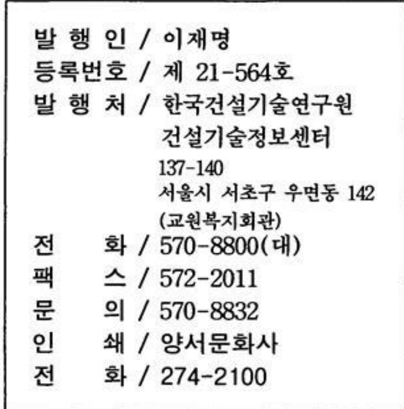  