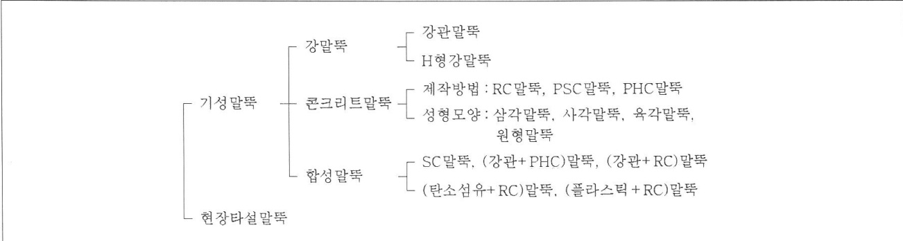
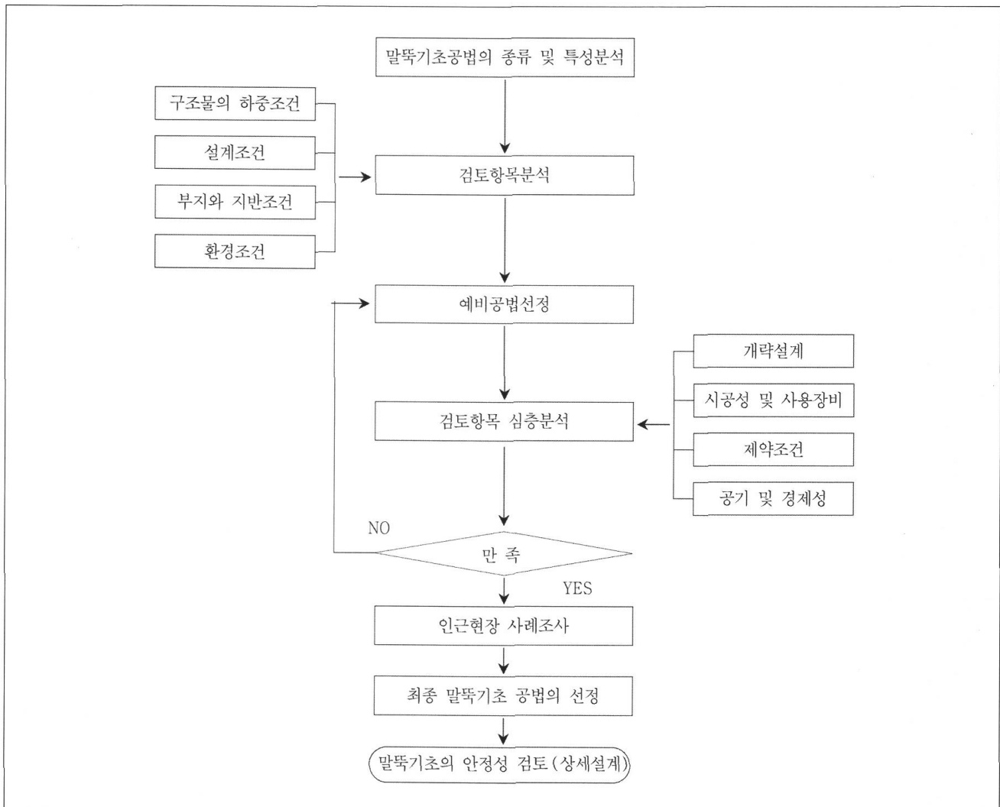
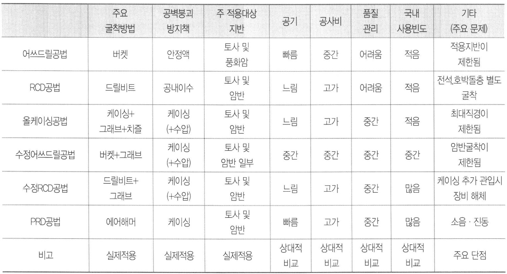

  

  

구조물이 대형화되고 건설환경이 더욱 강화됨에 따라 현장타설말뚝의 사용이늘어나고 있으며더욱이 설계기준에서 재료허용하중이 증가됨에 따라 현장타설말뚝의 경쟁력도 커져가고있습니다이에현장타설말뚝의 종류별특성 및 현장타설말뚝의 선정방법에 대해 알려주시기 바랍니다  

  

조전환토질및기초기술사삼성물산지반마스터  

# 1 말뚝기초공법의 분류와 선정  

말뚝 및 말뚝공법을 분류하는 방법에는재료 시공법지지형식에의한방법등 여러가지가있지만재료에따라말뚝을분류하면그림1과같다그림 1에서와 같이 재료에 따라말뚝을분류하면 크게기성말뚝과 현장타설말뚝으로 나눌수 있으며 기성말뚝은다시재질에따라강말뚝 콘크리트말뚝 합성말뚝으로나눌수 있다 강말뚝은 강관말뚝과 H형강말뚝으로 나눌수있는데국내에서 H형강말뚝은 지지말뚝으로는잘사용되지않는다 콘크리트말뚝에는 RC PSC PHC말뚝이 있으며국내에서 RC와 PSC말뚝은거의 사용되지 않고대부분PHC말뚝이 사용되고있다 콘크리트와강재의장점또는 신재료와 콘크리트의 장점을활용하기 위해 합성말뚝이 고안되었는데 아직 활발하게 이용되지 않지만향후그활용이기대되는부분이다  

  
그림1 재료에의한 말뚝의분류  

  
그림2 말뚝기초공법의 선정및설계흐름도  

현장타설말뚝은 구조물기초설계기준 해설2009에서 설계시 재료의 강도가증가하여 경제성이 더욱 향상되었다또한 현장타설말뚝은 본당 하중지지능력이 우수하여 대형구조물의기초에유리하며 저소음 저진동공법이라는특징을갖고있어이용이증대되고있다  

말뚝기초공법 선정은상부구조물의 종류 규모 용도및중요도등에의하여 결정되는 하중및 설계조건 부지와지반조건 그리고 주변 환경조건을 포함한 시공조건을고려하여 이루어진다 말뚝기초공법의 선정 및 설계에 대한흐름도를그림 $201\vert$ 나타내었다  

말뚝기초공법 선정시 고려해야할하중의종류 형태크기조합등은각구조물의특성에따라다르다 하중은평상시 지진시 폭풍우시 등의상태에 따라서 조합이다르지만 최종적으로는하나의 집중하중으로 대체하여 연직성분 수평성분그리고 모멘트의세 성분으로나누어검토하는것이 일반적이다  

설계조건은 구조물의 특성과용도그리고 발주자의 요구조건을 반영하여 결정되는데 허용침하량 허용수평변위량안전율재료의 허용응력 재료규격 설계정수등이이에해당된다  

부지와 지반에 관련된 사항은 부지조사와 지반조사를수행하여그결과로얻은지형과지반조건에대한정보와자료를 의미하며 이를이용하여 적절한기초형태와 시공법을 결정한다 부지조건과 지반조건은 시공법을 결정하는 주요인으로 여기에는 자연조건 작업조건 환경조건등도포함된다  

이상은주로 설계조건에 관련된 내용이며 이와아울러각기초재료의 종류와특징 장단점 제약조건 사용장비및기술수준등에대한충분한지식과최신정보를가지고적절한기초공법을 선정한다  

선정된 몇가지기초공법에 대한개략 설계를 시행하고그에 소요되는 공비와공기를 산출함으로써 공법의 경제성을비교하고 공기를 검토한다 공기와공비산출에는 준비공 가설공 뒷처리공도 포함되어야한다 이러한공비와공기의검토가끝나면각공법에대한종합적인평가를실시하여주어진조건에서 최적의공법을선정하게 된다최적의공법이선정되면해당공법에대한정밀안정성검토를실시한다  

# 2 현장타설말뚝공법의 종류와 특성  

# 가 어쓰드릴earth drill}공법  

어쓰드릴공법은 단부에칼형이붙은버켓bucket을 회전시켜지반을깎아버켓내로끌어들인다음 지상으로올려배토한다 굴착중공벽의붕괴방지는구멍내에채운안정액을 이용하고 있다그러나지표면근처의공벽은안정액을 이용하여도 붕괴가능성이 크고 붕괴하면 기계가전도되는등의위험한상태가될수있기때문에지표부에케이싱casing을 삽입하여 이용한다  

어쓰드릴공법의 시공순서는 다음과같다$\textcircled{1}$ 켈리버caliber를 중심위치에 맞춰기계를 수평으로고정시킨다  

$\textcircled{2}$ 버켓을장치한켈리버를회전해지반을굴착한다$\textcircled{3}$ 표층케이싱을 삽입하고굴착을 계속한다  

$\textcircled{4}$ 안정액을 보급하면서 소정의 깊이까지 지반을굴착한다  
$\textcircled{5}$ 공저의슬라임slime을처리한다 소정의장비CaliperLogging등를이용하여공벽형상을확인한다  
$\textcircled{6}$ 철근케이지와 트레미파이프tremie pipe를 삽입한다  

$\textcircled{7}$ 2차로 슬라임을 처리한다$\textcircled{8}$ 콘크리트를타설하면서트레미파이프를 인발한다$\circledcirc$ 표층케이싱을 인발하고마무리한다  

어쓰드릴공법에서 가장중요한 점은 콘크리트 타설전 까지공벽의붕괴를막는것이며이를위해안정액을사용 하고 있다 주로 사용하는 안정액에는 벤토나이트 bentonite 폴리머polymer 벤토나이트와 폴리머의 혼 합액 등이 있다 안정액으로 공벽의 붕괴를 막는원리는 토사층 공벽에 진흙막mud cake을 형성한 후 천공구멍 내에 보급된 안정액에 의해발생된 수압차로공벽을보호 하는것이다  

진흙막이 형성되는 원리는 지반주로 모래층에서 공벽 의붕괴가발생함의천공구멍내에비중이 큰 이수를채워 발생된수압차에의해이수가지반내로 유출되면서 이수 중의점토입자가 천공구멍 벽면에막을형성하는것이다 진흙막이 형성되면 천공구멍내의높은이수압이 진흙막 을눌러공벽의붕괴를방지하게되는것이다  

안정액은 단순히 공벽의 붕괴방지만이 아니라 이수중의 부유물의 침강속도를 조정 콘크리트 타설시 콘크리트와의치환역할도하기때문에이에대한기능도보유하는것이 필요하다 따라서 현장에서는 이수의비중 점성및를측정하여관리해야한다  

슬라임처리는 천공후부터철근삽입전에 실시하는1차처리콘크리트 타설직전에 실시하는2차처리가있다어쓰드릴공법에서 슬라임처리는 1차에서 클리닝 버켓Cleaning bucket및수중펌프사용 2차에서수중펌프또는 에어리프트air--lift방법이 주로이용된다 어쓰드릴공법은지지층이 토사층 위주인지역에서 많이활용된다 본공법은 원래 토사층에 적용하도록 개발되었다 근래에는장비의발달로어쓰드릴공법특유의시공성과경제성을향상시켜 암반층비교적 암반의강도가작고두께가얇은조건에서도 활용되고있는등그이용범위가 확대되고있다국내의경우전통의 어쓰드릴공법은 이수의 관리와처리문제로거의사용되지않으며다음항에서설명하는수정어쓰드릴공법이주로사용되고있다  

# 나 RCDReverse Circulation Dril}공법  

RCD공법은 비트6it를회전시켜지반을 굴착하고발생된토사는물과함께드릴파이프dril pipo를통해배토되는점이특징이다 따라서 RCD공법에서는드릴파이프를연결하는 것만으로 연속된 천공이 가능해지며 어쓰드릴공법에서처럼 시공중버켓을끌어올릴 필요가없다따라서천공심도가커지면다른공법보다능률이좋아진다  

굴착공벽의붕괴방지는 공내이수와이의수위유지방식으로 이루어진다 굴착공 내의 일정한수위를유지하기위해 스탠드파이프stand pipe를 사용하며 이 스탠드파이프는지표층 부근공벽의 붕괴를 방지하는 역할을하기도 한다 경우에따라서는굴착공벽의 붕괴를막기위해안정액을사용하기도 한다  

일반적인 굴착방법은 천공 롯드rod의 내부를 통해이수를보내고이수는롯드와공벽의사이를통해지표로유출됨으로써굴착된흙모래를배출하는 방식으로굴착을진행한다 RCD공법은 일반적인굴착방법과는달리굴착중송수및배출이 반대이고 따라서 물흐름의 방향도반대이므로역순환방식reverse circulation이라불려진다 이러한역순환방식은굴착공내의물흐름을 완만하게하고흐트러짐이 생기지 않도록하기 때문에공벽의붕괴가적어진다 또한드릴파이프안을흐르는이수의유속이커서굴착토사를용이하게끌어올리는이점이있다  

RCD공법의 시공순서는 다음과같다$\textcircled{1}$ S-르게 오실레이터또는 바이브로해머를 설치한다  

$\textcircled{2}$ 오실레이터oscillator 등을 이용해 스탠드파이프를삽입한 다음 해머그래브hammer grab를 이용해 스탠드파이프내의흙을파낸다  
$\textcircled{3}$ 스탠드파이프 위에 로타리 테이블을 설치하고 급수등준비를 실시한후 굴착을개시드릴파이프를순차적으로계속연결하여소정의깊이까지 천공한다  
$\ensuremath{\left(4\right)}$ 굴착을 완료한다  
$\textcircled{5}$ 1차로 슬라임을 처리한다 초음파방법 등에의한공벽상태를측정한다  
$\textcircled{6}$ [ $\cdot\textcircled{8}$ 철근케이지 삽입 2차 슬라임처리 콘크리트를타설한다  

$\textcircled{9}$ 필요시구멍을메우고스탠드파이프를 인발한다  

RCD공법에서 중요한 점은역시 콘크리트 타설 전까지공벽의붕괴를막는것이며이를위해공내수위지하수위보다2m 이상와공벽의수압2t/m2이상을유지한다 순환수에지반내의점토실트등이녹으면세립분이공벽에부착되어 진흙막을형성하게 되고이를통해수압이전달되며공벽붕괴를 막게된다  

RCD공법에서 슬라임처리는 1차로 RCD 장비의 공회전 실시2차로 석션펌프방법을주로이용한다  

일반적으로 RCD공법은 지지층이 견고하고 깊은경우 많이 이용된다 특히 암반층이 위주인 지지층에서 유리하 다 국내에서는 전통적인 RCD공법은 공벽의 유지가어려 워거의 이용되지 않고 대신RCD공법을 모체로 여러공 법을조합한 수정RCD공법마항에서 설명을 주로 사용하 고있다 국내 실무에서는 RCD공법이 현장타설말뚝공법 의 대표격으로 인식되어서인지 전통적인RCD공법과실제 사용하는 수정RCD공법을 혼돈하고 있는경우가종종있 다  

# 다 올케이싱all casing 공법  

올케이싱공법은전 길이에걸쳐삽입한케이싱으로공벽의붕괴를방지하면서 내부의토사를 해머그래브로 굴착하여배출하는공법이다 올케이싱공법에는 케이싱을회전하는방식에 따라2종류가있는데 여기에는 전회전식돗바늘공법이라고도 함과 요동식benoto공법이라고도 함이있다 굴착할 지반이 견고한경우에는 치즐chisel과 중량의 해머를 이용해지반을파쇄하면서 굴착을 진행하기도한다  

올케이싱공법의 시공순서는 다음과같다  

$\textcircled{1}$ 말뚝중심에케이싱을 설치한다   
$\textcircled{2}$ 케이싱의 선단에 부착된 컷팅 옛지cutting edge로 지반을 절삭하면서 케이싱을 압입한다 해머그래브로 케이싱내부를굴착한다   
$\textcircled{3}$ 케이싱을 연결하면서 $\textcircled{2}$ 의작업을반복한다   
$\circled{4}$ 지지층을 확인하고 소정의 심도까지 굴착하여 최종 굴착장을 확인한다   
$\textcircled{5}$ 1차로 슬라임을 처리한다   
$\circled{6}$ 철근케이지와트레미파이프를 삽입한다   
$\textcircled{7}$ 2차로슬라임을처리한다  

$(8){\sim}(9)$ 콘크리트를 타설하면서 1'" 케이싱을 인발한다 올케이싱공법의 슬라임처리는 1차로 해머그래브 및침 전버켓사용2차로석션펌프방법을주로사용한다  

올케이싱공법으로 천공가능한깊이는지반의강도와기 계의절삭능력에따라결정된다 케이싱은 길이는다양한 길이가있으며 긴것약6m과짧은것\~5m정도을 필 요에따라조합하여 사용한다  

올케이싱공법에서는 지하수의 용출유무에따라시공법과시공능률이크게달라진다즉용수가없는경우는케이싱내부가빈 상태에서 굴착할수있기때문에시공능률이높다 그러나 용수가 있는 경우는 보일링boiling을 방지하기위해케이싱내에물을채워굴착하기 때문에물의저항에 의해 해머그래브의 낙하속도가 떨어지고 지반내에관입량이 적어져 회당굴착토량이적어지므로 시공능률은현저히 떨어진다 시공능률을우선하여 천공구멍 내에물을넣지 않고시공하는예도있는데 이와같은 방법은보일링을 유발하여 주면 및 선단지층을교란시킴으로써각종심각한문제를초래하게되므로절대유의해야한다  

암반의강도가큰경우에는비트로선굴착하여자유면을만든다음특수 치즐과중량해머를이용해암반을부수고해머그래브로배출하면서천공을진행하기도한다  

토사층이 위주인 지반에서는 요동식이 유효하고 상부전석층이존재하고하부 암반근입부가있는경우는전회전식이효과적이다  

# 라 수정어쓰드릴공법  

안정액의 시공관리상의 번거로움안정액이 혼합된굴착토의처리곤란 도심지내 시공부지의 협소등을해소하기위해어쓰드릴공법 적용시 안정액을사용하지 않는경우가많다국내에서는 전통적인어쓰드릴공법을 안정액을사용하지않는방법으로 수정하여사용하고있다  

수정어쓰드릴공법은 단부의오거버켓을 회전시켜지반을깎고흙을버켓안에쌓아지상으로끌어올려 배토하는굴착방법은 전통적인어쓰드릴공법과 같다그러나이공법은공벽의붕괴및공저의보일링 방지를 위해안정액대신케이싱의 사용과케이싱 내부에 수위를 유지하는 방법을사용한다 이공법은수위를유지한상태에서케이싱을내리면서굴착을 진행하는데 케이싱의선단은 일반적으로풍화암 상단풍화암 Im 정도까지 내리고이하 암반층은지반조건에 맞는 버켓또는 core barrel으로 교체하면서굴착하여 마무리한다굴착할암반이 단단하면 치즐링으로마무리하기도 한다  

수정어쓰드릴공법의 시공순서는 다음과같다  

$\ensuremath{\ast}$ 말뚝중심의확인하고케이싱을 지표면에 설치한다   
$\textcircled{2}$ 켈리버에 장착된 버켓또는 해머그래브 이용을회전 해케이싱내부를굴착한다   
$\textcircled{3}$ 오실레이터를이용해케이싱을 압입하고새로운케이 싱을 연결한다   
$\ensuremath{\left(4\right)}$ 케이싱 내 청수의 높이를유지하면서 $\textcircled{2}$ ?} $\cdot{\bigcirc}.$ 의작업 을반복하여 케이싱을소정의 깊이보통 풍화암층Im 하부까지 굴착한다   
$\circled{5}$ 지반에맞는버켓을바꿔가면서 설계된 깊이까지 굴 착한다   
$\textcircled{6}$ 공저의 슬라임을 처리한다 초음파방법 등으로공벽 의수직도및상태를확인한다   
$\textcircled{7}$ 철근케이지와 트레미파이프를 삽입하고2차로슬라 임을처리한다   
$\textcircled{8}.$ [} $\cdot\textcircled{9}$ 콘크리트를 타설하면서 케이싱을 인발하고마무 리한다   
수정어쓰드릴공법에서 슬라임처리는 일반적으로1차에   
우리프바버 이에어제드바버으즈로 이l요하rl  

전술한바와같이 수정어쓰드릴공법에서는공벽의붕괴방지를위해케이싱을 사용하며 사층에서 굴착효율을높이기위해버켓대신 올케이싱공법에서 사용하는해머그래브를사용하기도한다또한케이싱내부를굴착한후케이싱을 압입하거나콘크리트 타설후케이싱을 인발할때오실레이터를 사용한다 이공법은주 장비로어쓰드릴장비를 사용하지만 시공조건에 따라여러공법에서의 장비를최적상태로조합하면서 사용한다  

수정어쓰드릴공법은 주로 국내에서 발전되어 사용되고있다 국내의 일반적인 지반조건상 현장타설말뚝의 설계는암반근입이 대부분 포함되므로 전통적인 어쓰드릴공법의사용은 적합하지않다그러나장비의 발달로 암반을굴착할수있는어쓰드릴 천공장비가 보완되면서 전통적인어쓰드릴공법의장점을바탕으로국내시공환경에 적응할수있는방식으로수정되어 사용되고있다  

수정어쓰드릴공법은 천공할지반이 토사층풍화암층 포함 위주로되어있고암반 근입부가 깊지 않은조건에서주로채택되고있다이와같은조건인 경우수정어쓰드릴공법은다른공법에비해공비와공기에서 대단히 유리하다  

# 마 수정RCD공법  

현장타설말뚝을 적용하는국내의 지반조건은주로경암반계통으로 이루어져 RCD공법이자주채택된다 국내의지반조건상 상부토사층은공벽 붕괴에 취약하여 전통적인ROD공법에서 채택하는 스탠드파이프의 사용과 공내이수유지만으로굴착공벽의붕괴를막는것은쉽지않다또한전술한바와같이근래국내에서는 건설환경 문제 부지협소문제 시공관리상의 번거로움을 해소하기 위해안정액을 사용하기도 용이하지않다 따라서 실무에서는전통적인 ROD공법을수정하여사용하는것이보편적이다  

수정RCD공법은 비트의 회전에 의해깎여진 흙을 물과 함께드릴파이프를통해배토하는 것은전통적인 방법과 같다그러나 수정RCD공법은 케이싱의 사용과케이싱 내 부수위를 유지하여공벽의붕괴및공저의 보일링을방지 한다이공법은케이싱내의수위를유지한채로케이싱을 연결하여 내리면서 굴착을 진행하는데 케이싱은 일반적으 로 풍화암 상단풍화암 Im 정도까지 내리고이하암반층 은 RCD장비를 설치하고비트를회전시켜 굴착하여 마무 리한다  

수정RCD공법의 시공순서는그림 7과같다  

$\textcircled{1}$ 말뚝중심의확인 오실레이터를 설치한다  
$\textcircled{2}$ 케이싱의 설치및지표면의압입 해머그래브를이용해케이싱 내부의굴착을 시작한다  
$\textcircled{3}$ 케이싱을 압입하고 새로운케이싱을 연결한후굴착을계속한다  
$\ensuremath{\left(4\right)}$ 케이싱내일정수위를유지한상태로 $\textcircled{2}{\sim}\textcircled{3}$ 의작업을반복하여 굴착하면서소정의깊이풍화암m정도까지케이싱을 설치한다  
$\textcircled{5}$ 케이싱 상부에 RCD장비를 설치하고 설계깊이까지굴착한다  
$\textcircled{6}$ 1차로 슬라임을 처리한후 RCD장비를 해체한다 초음파방법등을이용하여공벽의수직도 및상태를확인한다  
$\textcircled{7}$ 철근케이지cage를 삽입하고2차로슬라임을처리한다  
$\textcircled{8}\sim\textcircled{9}$ 콘크리트를 타설하며서케이싱을 인발하고마무리한다  

수정RCD공법에서 슬라임처리는1차로RCD장비의공회전방법2차로에어젯트방법을주로이용한다수정RCD공법에서는토사층의굴착효율을높이기위해올케이싱공법에서 사용하는 해머그래브를 사용한다 또한케이싱 내부를 굴착한후 케이싱을 압입하거나 콘크리트타설후케이싱을 인발할시 오실레이터도 사용한다 이와같이수정RCD공법은주 장비로RCD굴착장비를 사용하지만이외의장비는시공조건에따라필요한장비를조합하여사용한다  

국내에서 수정RCD공법은 단단한 암반층을비교적깊게굴착해야하는지반조건에서주로채택되고있으므로가장보편적으로 이용되는공법이라할수있다 수정RCD공법은육상에서도 사용되지만 해상시공에서특히효율이높아자주채택된다 또한해상또는 해안지역에서 시공되는현장타설말뚝기초는케이싱의 역할로 희생강관을 사용하게되므로수정RCD공법을많이사용하게된다 이경우케이싱의압입을위해해머바이브로해머 유압해머등를주로사용한다  

# 바 PRD현장타설말뚝공법  

PRD현장타설말뚝공법의 천공기로는 에어해머 등이사용되므로 천공효율이 좋아상대적으로 시공속도가 빠르며특히암반천공시 시공속도가대단이우수하다그러나천공시 소음 진동의문제가발생할 수 있는단점이있으며아직까지는 사용할수있는최대직경은10m 정도이다  

PRD현장타설말뚝공법의 시공순서는다음과같다   
$\textcircled{1}$ 말뚝중심의 확인 외부케이싱outer casing을 설치 한다   
$\textcircled{2}$ 항타기를 설치하고내부케이싱inner casing을정위 치시킨후내부케이싱과내부 천공기에어해머및롯 드를상호역회전 시켜가면서 굴착한다   
$\textcircled{3}$ 내부케이싱을 예정된 깊이에 위치풍화암 m정도 한다   
$\circled{4}$ 에어해머로 소정의 깊이까지 굴착한다  

$\textcircled{5}$ 천공기로 1차 슬라임을 처리한다 초음파방법 등을이용하여공벽의수직도및 상태를확인한다  

$\circled{6}$ 2차로슬라임을 처리하고 콘크리트를 타설한다또는슬라임 처리후철골및철근케이지를 삽입하고콘크리트를타설한다  

$\textcircled{7}$ 철골및철근케이지를 삽입한다$\textcircled{8}$ 콘크리트 타설을 완료하고 필요시 케이싱의 공삭공구간을매립한다  

PRD현장타설말뚝공법에서 슬라임처리는 일반적으로1차로 에어서징 또는 미케니컬펌프mechanical pump방법2차로 에어리프팅 방법을주로이용한다  

PRD현장타설말뚝공법은 비교적소구경1Om이하이고천공할지반이암반층위주인 지반조건이며 소음 진동의환경문제가 수용되는 지역에서 주로 채택되고있다 이와같이 PRD현장타설말뚝공법은 굴착할 암반의 강도가크고깊은지반조건인경우다른공법에 비해공비와공기에서매우 우수하다 국내의경우 PRD현장타설말뚝공법은 건축현장에서주로이용된다  

# 3 현장타설말뚝공법의 선정  

현장타설말뚝은 상부구조의용도와형상 작용하중의크기및침하조건 지반조건 환경조건등을고려하여 종류와제원을 결정하여야 한다 특히 현장타설말뚝기초의 설계와시공에큰영향을 미치는지반조건 및환경조건은사전에계획을 수립하여 상세하게 조사되어 반영되어야한다이는지지층의특성을충분히 파악함으로써 현장타설말뚝기초의 규격과길이를 결정할수있을 뿐만아니라 시공중에 겪게 될 어려움을 사전에 예측함으로써 기술적으로타당하고경제적인 시공방법을선정할수있기때문이다  

현장타설말뚝공법에는 어쓰드릴공법 RCD공법 올케이 싱공법 수정어쓰드릴공법 수정RCD공법 PRD공법 등이 있는데 이들은 각각특징과 장단점을 뚜렷하게갖고있으 므로 현장타설말뚝공법의 선정시에는각공법의특징과장 단점을이해한후현장의조건에맞는공법을선택하는것 이 중요하다 표1에는전술한현장타설말뚝공법을비교하 여나타내었다  

일반적으로 굴착할주지반이 암반인경우는RCD공법올케이싱공법 PRD공법을 주로 사용하는데 특히 암반층의 강도가 크고 두꺼우며 m 이하의 소구경 말뚝인경우PRD공법이 유리하다 굴착할주지반이 토사지반인경우에는어쓰드릴공법이 유리하다  

현장타설말뚝공법은 저소음저진동공법에 속하지만PRD공법의 시공시에는소음과진동이기준치를초과하는경우가 있으므로 이러한 경우는개량천공기 사용 이중굴착등을통해서해결하기도 한다  

현장타설말뚝공법들은 공벽유지 방법에 따라 안정액을사용하는방식과케이싱을 사용하는방식으로나눌수있다시공중안정액을관리하는것이품질관리의큰비중을차지하기 때문에 일반적으로 현장타설말뚝의 시공품질관리는 전자가상대적으로어렵고후자가 용이하다고할수있다  

현장타설말뚝공법의 공기와공사비의 비교는 대상조건에따라달라지므로 큰의미가없다 일반적으로굴착할지반이토사층풍화암포함이 위주인 조건에서 공기와공사비는어쓰드릴공법이 유리하고 암반이 위주인 조건에서는RCD공법또는PRD공법이 유리하다 그러나굴착할암반의 강도가작고 깊이가 얕은 경우는 수정어쓰드릴공법도공기와공사비측면에서 매우 유리하다 또한 PRD공법은아직까지는 실용적인 사용가능 직경이 $\mathrm{1.0m}$ 정도로제한되어있고전술한소음 진동의문제가있다  

표1 현장타설말뚝공법의비교  

  

국내에서 사용되는 현장타설말뚝공법의 사용빈도를 살펴보면 고유의 현장타설말뚝 시공법어쓰드릴공법 RCD공법 올케이싱공법을그대로 사용하는경우는드물고 현장조건에 따라각공법의 장비와 시공방식을 조합수정어쓰드릴공법 수정RCD공법 PRD공법하여 사용하는 경우가많다이와같이적절한장비와 시공방식의조합을통해현장타설말뚝기초공의공기와경제성을개선하는것이가능하다  

# [참고문헌]  

한국지반공학회2009 구조물기초설계기준해설2조천환2010 말뚝기초실무  