# 말뚝지지 전면기초 Piled Raft Foundations  

# 1서론  

2 말뚝지지 전면기초의 개념  

3국내외 기술개발 현황  

4현장계측사례  

5 모형실험결과  

6결론  

권오균  

Oh-Kyun Kwon계명대학교 토목공학과 부교수Associate Professor Dept of Civil Eng Keimyung Univ  

# 이涌활  

Whoal Lee 계명대학교 토목공학과 박사과정 Graduate Student Dept of Civil Eng Keimyung Univ  

# 말뚝지지 전면기초 Piled Raft Foundations  

권'오 균" Ohkyun Kwon 이 활 Whoal Lee  

1} 계명대학교 공학부 토목공학전공 부교수Associate Professor Dept of Civil Eng Keimyung Univ2 계명대학교 대학원 토목공학과 박사과정 수료Graduate Student Dept of Civil Eng Keimyung Univ  

# 개요[SYNOPsis  

The general design practice for piled footings is based on the assumption that the piles are free- standing and that all the external loads are carried by the piles with any contribution of the footing being ignored This approach is not reasonable because the footing itself is actually in direct contact with the soil and thus carries Significant fraction of the loads In the case of not considering the bearing capacity of footing the bearing capacity of group piles can be evaluated conservatively in the designing the group piles There are a number of reasons why the idea of piled raft design with considering the capacity of footing has not become widely used One of the reasons is the lack of reliable calculation methods for estimating the behavior of piled raft In this study the bearing capacity settlement load distribution etc of piled raft footing are studied  

Key Words piled raft footing group pile group efficiency load sharing ratio  

# 1서론  

구조물 기초에 대한 설계는 충분한 지지력 확보와 함께 구조물의 안전성과 사용성에 합당한 침하기준등을 충족시켜야 한다 현재까지 국내에서 말뚝지지 전면기초에 대한 설계는 주로 지지력에 대한 검토가 이루어져 왔으며 대부분의 설계과정에서도 지지력은 말뚝만으로 지지되는 것으로 계산되고 래프트raft의 지지력 분담효과 등은 무시되어 왔다 그러나 실제 무리말뚝에 대한 공사현장에서는 래프트가얕은 기초형식으로 공사가 이루어지고 있으므로 이를 무시한 설계는 경제적으로도 비합리적인 설계가될 수 있다 또한최근에 순수한 얕은 기초형식의 기초에서 지지력은 확보되나 침하기준 등을 충족시키지못할 경우에 침하감소를 목적으로 말뚝을 배치하는 새로운 개념의 설계방식도 외국의 경우에서실시되고 있다 따라서 래프트raft의 하중분담효과와 말뚝의 효율적 배치를 통한 지지력 향상과 기초의 침하감소 등을 목적으로 한 말뚝지지 전면기초에 대한 새로운 인식이 필요한시점이다  

그러나 현재 합리적인 말뚝지지 전면기초의 설계를 위한 연구는 미흡한 실정이며 이는 현장재하시험이나 계측결과를 통한 말뚝지지 전면기초의 실제 지지 거동에 대한 규명이 제대로 이루어지지 않고 있기 때문이다  

본 연구에서는 말뚝지지 전면기초의 지지력 침하 하중분포 등에 관한 내용을 파악하고 말뚝지지 전면기초에 대한 이해를 높이고자 한다  

# 2 말뚝지지 전면기초의 개념  

말뚝지지 전면기초는 크게 2종류의 개념으로 파악할 수 있다첫 번째는 그림 21과 같이 전면기초만으로도 충분한 지지력이 확보되어 지지력 측면에서는 문제점이 없으나 기초의 침하측면에서 허용침하량을 초과하게 되어 침하를 감소시킬 목적으로 말뚝을 보조적인 관점에서 사용하는 것이다두 번째의경우는 그림 22와 같이 무리말뚝이 주요 지지력 요소이지만 구조물 공사시에 함께 시공되는 래프트raft도 동시에 기초로 거동하므로'래프트의 지지력을 고려한다면 말뚝의 수량이나 길이 등을 감소시킬수 있어 좀더 경제적이고 효율적인 무리말뚝 설계방법강인규 2001에 대한 접근 방법을 제시할 수 있다말뚝지지 전면기초는 그림 22와 같이 말뚝과 래프트'기초지반과의 지지요소로 구성된 복합기초로서거동특성을 나타내며 상부구조물의 하중은 식 1]과 같이 말뚝과 래프트가 동시에 지반에 전달하는 기초형태로 되어 있다  

$$
R_{t o t}\;=\;R_{r a f t}\;+\;\sum\!R_{\rho}
$$  

여기서 $R_{t o t}$ 말뚝지지 전면기초에 가해지는 전체하중  

Rraft 말뚝지지 전면기초에서 래프트가 분담하는 하중$R_{\Dot{p}}$ 말뚝지지 전면기초에서 말뚝이 분담하는 하중  

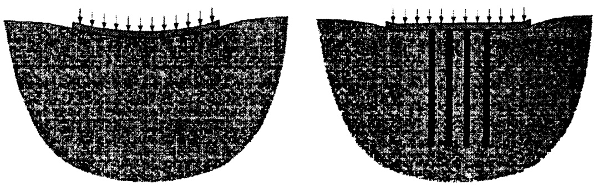  
그림 21 기초 침하 감소 목적의 말뚝지지 전면기초  

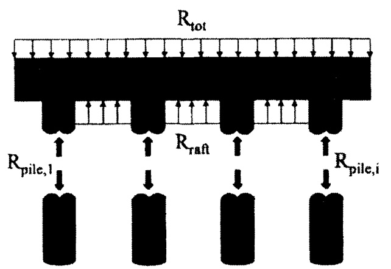  
그림 22 말뚝 중심의 말뚝지지 전면기초Katzenbach & Reul 1997  

말뚝지지 전면기초는 말뚝과 얕은 기초의 복합적인 거동특성을 나타내므로 이 기초의 장점은좀더효율적인 기초로서 거동을 한다는 것이며 다음과 같은 장점들을 나타낼 수 있다  

$\bigcirc$ 말뚝지지 전면기초는 순수한 무리말뚝기초와 비교하여 말뚝수와 길이를 감소시킬 수 있다  
$\bigcirc$ 얕은 기초의 침하와부둥침하'등을 감소시켜 기초의 효율성을 증대시킬 수있다  
0 얕은 기초 하부에 말뚝을 효율적으로 배치시킴으로써 얕은 기초내부의 응력과 모멘트 등을 감소시킬수있다  
$\bigcirc$ 말뚝과 얕은 기초가 지지하중을 공동부담함으로써 기초전체의 지지력을 증가시킬 수 있다  
0 기초의 굴착공정 전단계에서 미리 말뚝을 설치함으로써 굴착에 따른 지반의 이완현상과 heaving 현상등을 억제할수있다  
O 얕은 기초에서 편심하중이나 집중하중이 발생하는 지점에 말뚝을 설치함으로써 전체적인 하중의 중심을 기초의 중심부로 유도할 수있다  

말뚝지지 전면기초의 이러한 장점들은 기초지반의 강성이 깊이에 따라 증가할수록 더욱 양호해질수 있으며 래프트raft 하부지반이 연약할 경우에는 말뚝지지 전면기초의 장점이 약화될 수 있다  

# 3 국내외 기술개발 현황  

# 31 말뚝지지 전면기초의 말뚝하중분포  

일반적으로 말뚝지지 전면기초내에 존재하는 각각의 말뚝에 작용하는 하중의 분포는 말뚝의 위치에따라 다르게 나타나는 경향들이 많은 것으로 보고되고 있다 말뚝지지 전면기초의 현장계측 모형실험수치해석 등에 의한 기존의 연구들을 정리하면 다음의 표31과 같다 현재까지 보고된 여러 형태의 말뚝하중 분포사례를 분석해보면 서로 상반된 결과들을 나타내고 있는 것을 알수 있는데 일부는 래프트의 중앙부분에 위치하고 있는 말뚝의 하충분포가 크다고 하고 일부는 반대로 래프트의 외곽부분에 위치한 말뚝의 하중분포가 크다고 주장하고 있다 그러나 표31과 기타 다른 자료들을 비교해 보면'래프트의 외곽부분에 위치한 말뚝의 하중분포가 우세하다고 보고된 자료들은 대부분 수치해석결과이거나'점성토 지반에서의 모형실험이나 현장계측결과들이다 반면에 래프트의 중앙부분에 위치한 말뚝들의 하중이 우세하다고 보고된 자료들은 대체적으로 사질토지반에 대한 현장계측이거나 모형실험결과이므로 지반조건에 따라 말뚝의 하충분포가 다르게 나타날 수도 있는 것으로 판단된다 또한 래프트의 강성이나두께에 따라 말뚝들의 하중분포가 다르게 나타날 수 있는데Hain & Lee 1978 Franke 1991 강성기초에서의 하중분포는 균일하지 않게 나타나며 연성기초일수록 말뚝들의 하충분포는 균일하게 나타나는것으로 보고된 바 있다 Cooke 등1981은 말뚝지지 전면기초에서 말뚝들의 하중분포는 말뚝수 말뚝길이 말뚝간격 등에 따라서도 영향을 받을 수 있다고 보고한 바있다  

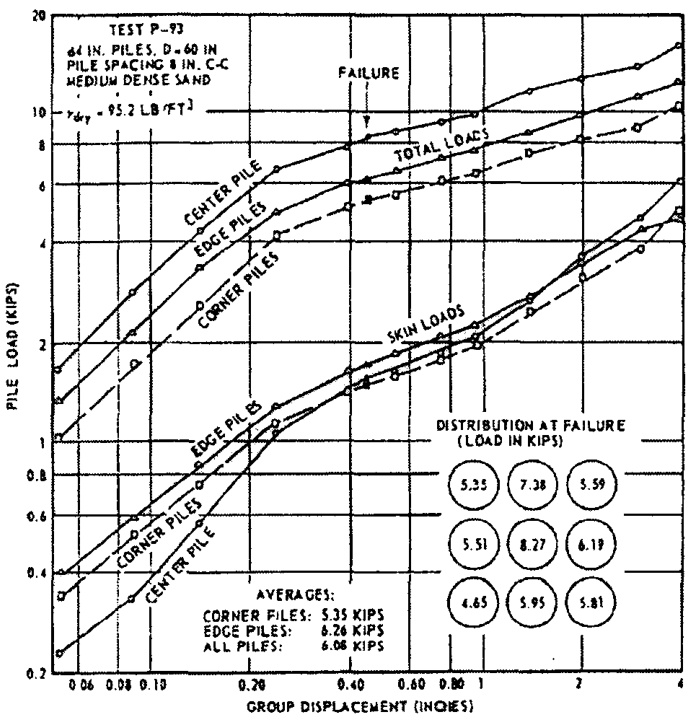  
그림 31 말뚝지지 전면기초에서의 말뚝하중분포 Vesic 1969  

표31 말뚝지지 전면기초의 말뚝하충분포  

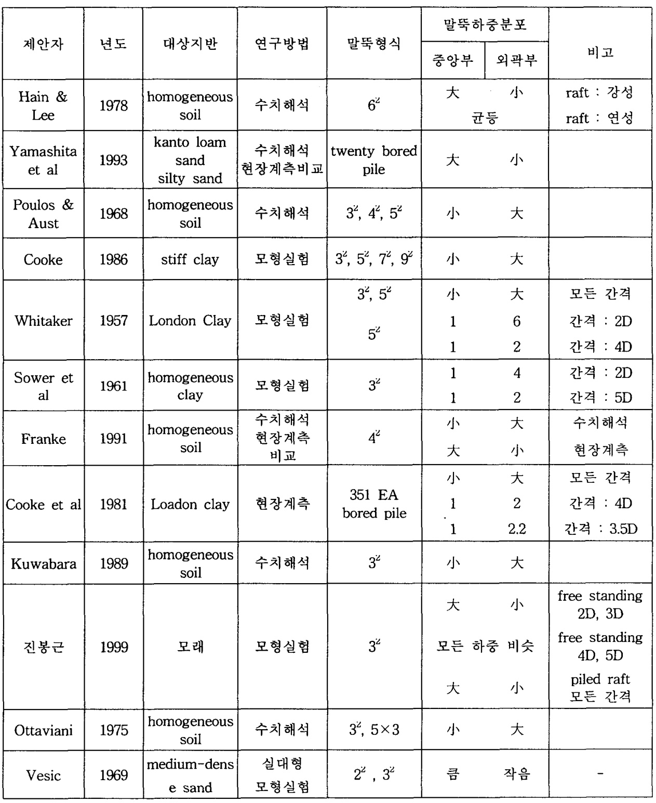  

# 32 말뚝지지 전면기초의 첨하  

말뚝지지 전면기초와 얕은 기초의 침하비교에서 동일한 하중에 대하여 얕은 기초에서의 침하가 크게발생한다는 연구결과Hain & Lee 1978 Garg 1979는 침하문제에 있어서 말뚝지지 전면기초가 래프트만의 얕은 기초에 비해 더 효율적인 것을 의미한다 이러한 경향은 말뚝지지 전면기초에 대한 모형실험에서 래프트만 있는 경우에 비하여 침하량이 $50\%\textmu$ 하로 감소하였다고 보고된 자료진봉근 1999를통해서도 파악할수있다 말뚝지지 전면기초의 침하에 영향을 미치는 요소로는 말뚝수 말뚝간격 말뚝길이'래프트의 강성'지지층과 말뚝선단과의 이격거리 등이 있으며Poulous 1968 Poulous & Davis1980 래프트의 폭도 침하에영향을 미칠수있다Cooke 1986고 보고된 바 있다 또한 Cooke은 동일한지반조건에서 순수 무리말뚝과 말뚝지지 전면기초와의 침하량 비교에서 말뚝간격이 25 $D$ 이내인 경우에 침하량은 큰 차이를 보이지 않지만 말뚝간격이 25 $D$ 이상이면 말뚝지지 전면기초의 침하량이 순수한 무리말뚝 상태보다 작게 발생한다고 주장하였다 Horikoshi & Randolph 1996는 동일한 크기의 래프트 기초에 대하여 말뚝수량을 9개421개 69개로 변화시켜 모형실험을 실시한 결과에서 9개의 말뚝을사용한 기초의 침하는 얕은 기초에 비하여 큰 차이를 나타내지 않았지만 69개의 말뚝을 사용한 기초는얕은 기초에 비해 침하량이 크게 감소된 것으로 보고하였다 이러한 결과는 말뚝지지 전면기초에 사용된 말뚝들의 지지력이 순수한 무리말뚝 상태의 말뚝보다 더 크며 말뚝지지 전면기초에서 래프트가 전체지지력 중에서 상당한 부분을 부담한 것으로 판단하여 말뚝지지 전면기초에서의 래프트의 역할을설명하기도 하였다  

# 33 말뚝지지 전면기초의 지지력  

말뚝지지 전면기초의 지지력은 말뚝과 래프트가 복합된 기초로서의 거동특성을 나타내므로 말뚝의 지지력만으로는 말뚝지지 전면기초의 지지력을 과소평가할 수 있다 그러나 말뚝의 지지력과 래프트 지지력의 산술적인 합Akinmusuru 1980으로 평가할 수도 없는데 이는 그림 $3.2\infty$ 나타난 바와 같이 복합기초로서의 말뚝지지 전면기초의 거동특성이 매우 복잡하고 그 거동특성 또한 명확히 규명되지 못했기때문이다 말뚝지지 전면기초의 지지력을 평가하는 방법은 크게 2가지로 나눌 수 있는데 첫번째는 정역학적 방법으로 캡cap과 말뚝의 지지면적을 고려하는 방법Kishida & Meyerhof 1965 ; Vesic 1969이고 두번째는 말뚝지지 전면기초의 지지력 계수들을 고려하는 방법Phung 1993 ; Liu & Yuan &Zhang 1985이다 정역학적 방법은 그림 33에서 보는 바와 같이 크게 무리말뚝군 외부의 래프트 면적에 의한 지지력과 무리말뚝블록block의 선단지지력의 합으로 말뚝지지 전면기초 지지력을 결정하는 유효캡 지지면적을 고려한 방법과 래프트 전체의 지지력과 각 말뚝들의 선단지지력의 합을 말뚝지지 전면기초의 지지력으로 결정하는 전체 캡지지면적을 고려한 방법으로 구분된다  

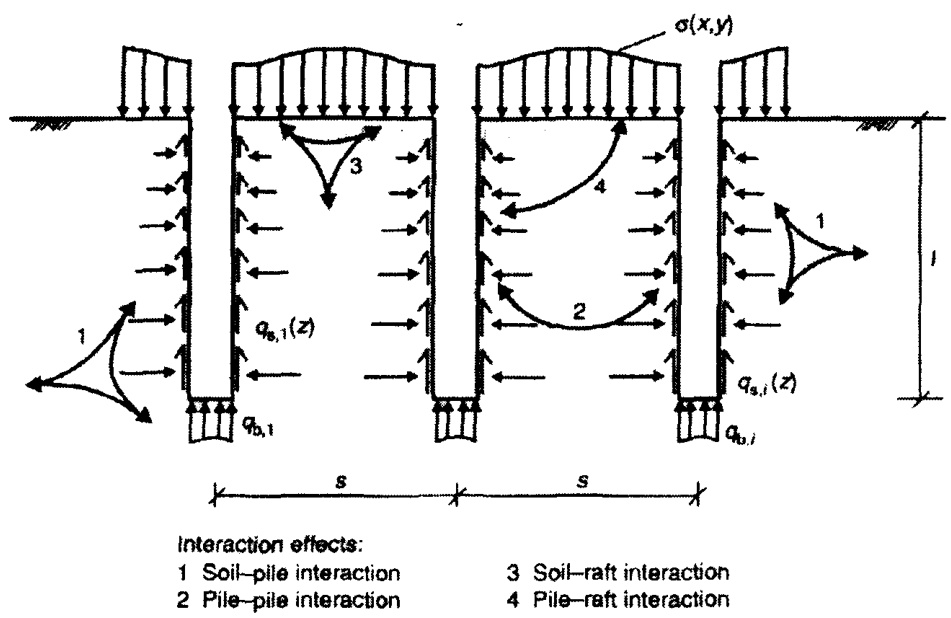  
그림 32 Piled Raft 기초에서의 상호간섭적 거동특성Katzenbach et al 2000  

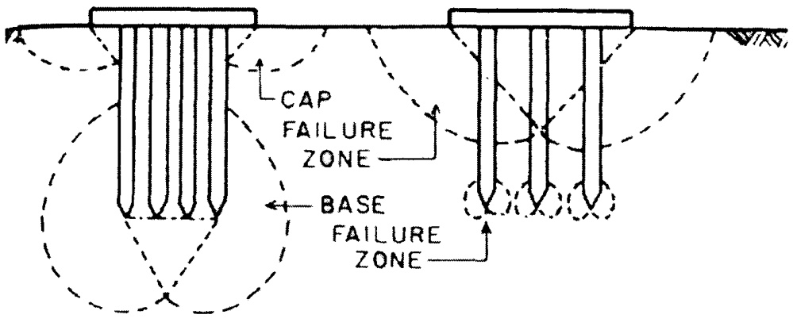  
a pier failure 6 individual failure그림 33 말뚝기초의 파괴영역 Kishida & Meyerhof1965  

말뚝지지 전면기초의 지지력 계수를'이용하여 지지력을 결정하는 방법은 대개의 경우 모형실험결과를이용하여 연구되었다먼저단말뚝에대한하중재하실험을실시하여 지지력을결정한후동일한지반조건에서순수무리말뚝조건과복합기초형태인 말뚝지지 전면기초조건에 대하여실험을실시하여 말뚝의선단효율과주면효율그리고말뚝지지 전면기초에서의 래프트 하중분담율등을분석하여 말뚝지지전면기초의지지력을결정하는방법으로서 선단효율보다는말뚝사이에 발생하는주면효율이더중요하다고 언급되고 있다영향계수를이용하는말뚝지지 전면기초의지지력을결정하는방법은그림34를통하여 설명될수있다이그림에서제시한바와같이 단말뚝과 순수 무리말뚝상태의'무리말뚝을'구성하는 한개의 말뚝'사이의 지지력비를영향계수 8를 사용하여 나타내고 순수한'무리말뚝을구성하는하나의 말뚝과 말뚝지지 전면기초를 구성하는 하나의 말뚝 사이의지지력비를영향계수 $\beta$ 를사용하여나타내었다 또한 단독 래프트와 말뚝지지 전면기초를 구성하는 래프트의 지지력 비를 영향계수 $\beta_{c}$ 로나타내었다 이러한 각각의 관계를 식 2와 같이 표현하여 말뚝지지 전면기초의 지지력을 계산한다  

$$
P_{f t}\!=\!n(\,\beta_{s}\delta_{s}P_{s s}\!+\beta_{b}\delta_{b}P_{s b})+\beta_{c}P_{c}
$$  

2  

여기서 $^{\,\varkappa}$ : 말뚝지지 전면기초를 구성하는 말뚝갯수$P_{s s}$ - $P_{s b}:\,7]$ 준 단말뚝의 주면지지력 및 선단지지력$P_{c}$ :래프트의 단독지지력$\delta_{s}$ - $\delta_{b}$ :말뚝주면지지력과 선단지지력에 영향을 미치는 말뚝-흙-말뚝 사이의 상호작용에의한영향계수 단말뚝 대 순수 무리말뚝$\beta_{s}$ - $\beta_{b}$ $\beta_{c}$ 말뚝 주면지지력과 선단지지력 그리고 래프트의 지지력에 영향을 미치는래프트-말뚝 사이의 상호작용에 의한 영향계수 래프트 대 순수 무리말뚝  

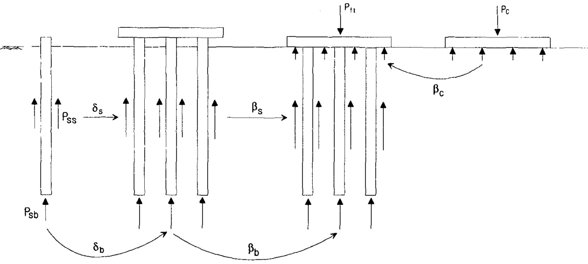  
그림 34 영향계수를 이용한 말뚝지지 전면기초 지지력 계산  

# + 현장계측사례  

4-1 화력발전소 건설공사 독일 남동부 지역 D Placzek E Jentzsch 1997  

# $\ensuremath{\Phi}$ 개요  

독일 남동부 지역에 800MW 용량의 화력발전소를 신설하였는데 좁은 발전소의 특성상 좁은 면적위에무거운 중량의 건물들이 위치하게 되었다 주요 발전소 건물의 면적은 대략 $100\mathrm{m}\!\times\!80\mathrm{m}$ 정도이며 총재하중량은 약 616OMN 정도로 계산되었다 해당지역의 지반특성은 지표면 아래 Im 깊이부터 다량의실트가 함유된 느슨한 모래층이 발달해 있으며 얇은 실트층과 유기질토가 모래층 사이에 수평방향으로비연속적으로 발달해 있는 상황이었다 최초 설계에서는 발전소 기초를 얕은 기초 형식으로 설계하였으나설계된 기초에 대하여 재검토하여 본 결과 얕은 기초의 측면부분에서 $10\!\sim\!15\mathrm{cm}$ 정도의 침하량을나타내며 발전실 기초부분에서도 허용부등침하량인 1: 3300 이상의 부등침하량 등을 나타내어 얕은기초형식은 발전소 기초로서 부적합한 것으로 판단되었다  

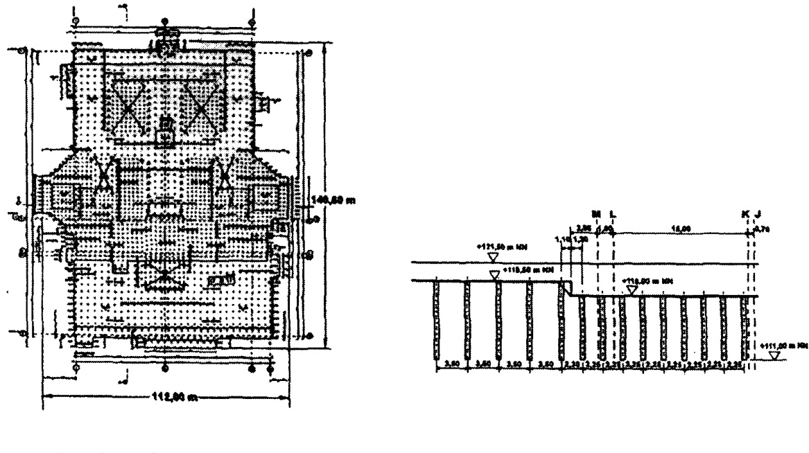  
말뚝배치 평면도 6 기초 단면도그림 41 말뚝지지 전면기초 단면도  

# $\circledcirc$ 적용방법  

발전소 건물에 대한 매우 제한적인 침하량 기준 등으로 인하여 침하량을 최소한으로 감소시킬 수있는 기초형식이 요구되었으며 이러한 요구조건을 충족시키기 위하여 말뚝지지 전면기초piled raftfooting 형식이 선정되었다 말뚝형식은 말뚝품질의 향상을 위하여 콘크리트 말뚝Concrete vibrationpiles을 적용하였으며 말뚝지름은 50cm 길이는 7m로 제작하였으며 말뚝간격은 래프트raft 무게가$15\mathrm{MN}/\mathrm{m}^{3}$ 인 곳은 $2.25\mathsf{m}$ 간격 $30\mathrm{MN/m^{3}}$ 인 곳은 $3.5\mathfrak{m}$ _ 간격으로 배치하였다  

# $\Supset$ 결과  

본 발전소 기초에 대한 말뚝지지 전면기초 형식을 적용하여 공사를 진행하는 과정에서 2개의 stairtower를 건설기간 동안에 15 -\~ 25mm의 침하가 발생하였으며 이러한 침하로 인하여 말뚝지지 전면기초에서 발생한 비틀림 현상 등은 극히 미약하게 나타났다  

# 42 Stonebridge Park Cooke R W Bryden-Smith D W Gooch M N and Sillett D F1981  

# $\ensuremath{\Phi}$ 개요  

London 북쪽에서 6년여에 걸쳐서 Stonebridge Park에 위치한 $16\frac{\pi}{\sigma}$ 건물에 대하여 계측을 실시하였으며 대상건물은 길이 $43.2\mathfrak{m}$ 폭은 $19.2\mathsf{m}\circ\}$ 며 London clay 지반 위에 건설되었다 말뚝지지 전면기초에사용된 말뚝은 $0.9\mathfrak{m}$ 두께의 래프트raft와 직경이 $0.45\mathsf{m}$ - 길이 $13\mathtt{m}$ 로 제작되었으며 말뚝수량은 351개로구성되었다 깊이 $3\mathsf{m}\circ\mathbb{I}\mathbb{1}$ 서의 London Clay의 비배수 전단강도는 $100\mathrm{kN/m}^{2}\infty]$ 며 $25\mathtt{m}$ 깊이에서는$260\mathrm{kN}/\mathrm{m}^{2}\circ\vert$ 었다 또한 말뚝 선단 부근에서의 비배수 전단강도는 $190\mathrm{kN/m^{2}}$ 정도로 나타났다 말뚝의 지지력은 전응력방법으로 계산되었으며 안전율에 있어서는 주면마찰력과 선단지지력에 대하여 부분안전율적용하여 말뚝 1본당 565kN을 지지하는 것으로 설계되었다  

# $\circledcirc$ 결과  

해당 건물에 대하여 수년간에 걸쳐 계측한 결과에서 말뚝의 위치에 따른 하중의 분포는 그림 $4.2\infty$나타난 바와 같이 래프트raft의 내부에 위치한 말뚝과 모서리부분에 위치한 말뚝의 하중분포에 차이가있는 것으로 나타났다 말뚝간격이 말뚝직경의 4배4D]인 경우에서는 모서리:면:중심부의 말뚝하중의 비율이 $2:1.4:1$ 로 나타났으며 말뚝간격이 $3.5\,D$ 인 경우에서는 _ $2.2:1.7:1$ 로 발생하였다 이결과로부터 말뚝간격이 감소함에 따라 위치별 말뚝의 하중차이는 증가하는 것으로 나타났다 또한말뚝을 지지하는 하중의 구성비율도 모서리 부분의 말뚝에서는 주면마찰력이 우세하고 래프트 내부에 위치할수록 선단지지력이 증가하는 경향을 나타내었다 해당건물의 침하는 총 4년에 걸쳐 발생한 침하량의$60\%$ 가 공사기간 중에 발생하였으며 공사종료후에는 압밀현상으로 인해 Imm/year의 크기로 침하가 발생하였다 또한 공사초기기간 중에는 $55\%$ 정도이던 말뚝의 하중분담율이 압밀현상이 진행됨에 따라 건물완성 이후에는 $75\%$ 로 증가하였다  

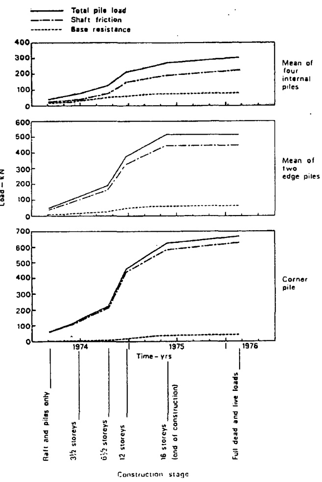  
그림 42 말뚝위치별 주면마찰력과 선단지지력 변화  

# 43 Urawa City Yamashita K Kakurai M Yamada T & Kuwabara F 1993  

# $\oslash$ 개요  

본 건물은 일본 Tokyo현 Urawa 시市에 위치한 5층의 콘크리트 건물로 $24\!\times\!23\mathrm{m}\mathcal{Q}$ 크기이며 인접건물과 15m 정도 떨어져 위치하고 있다 대상지반은 지표면으로부터 6m 깊이까지 $150\!\sim\!200\ \mathrm{kPa}$ 의 일축압축강도의 Kanto Loam으로 구성되어 있으며 $16\!\sim\!19\mathrm{m}$ 깊이까지는 보통\~조밀한 사질토 지반으로 구성되어 있다  

# $\circledcirc$ 적용방법  

초기의 설계에서 해당 건물의 기초에 대해서는 순수한 얕은 기초 형식으로 설계되었으며 설계하중은475 MN 평균접지압은 $84\,\mathrm{\kPa}$ 로 계산되었다 본 기초에서는 최대 접지압이 기초의 허용지지력보다 작게 나타나는 것으로 설계되었으나 기초의 부등침하는 1/300을 초과하는 것으로 나타나 부등침하에 대한대책방법이 요구되었다 이에 대한 대책방안으로 말뚝지지 전면기초 형식이 선정되었으며 말뚝형식은현장타설말뚝형식으로 공사를 진행하였다 말뚝의 직경은 $0.7\!\sim\!0.8\mathrm{m}$ 길이는 16m로 제작되었고 말뚝간격은 $6.3\!\sim\!8.6\,D$ 로 배치되었다  

# $\circled{3}$ 결과  

건물의 완성단계에서 발생한 침하량은 $1\!\sim\!2\mathsf{c m}$ 로써 얕은 기초 형식에서 예측된 침하량보다 작게 발생한 것으로 평가되었으며 기초의 부등침하량도 매우 미약하게 발생하여 말뚝지지 전면기초가 전체 침하나부등침하 감소에 매우 과적인 것으로 나타났다 또한 위치에 따른 말뚝의 하충분포는 래프트raft의모서리부분에 있는 말뚝의 하중이 래프트 중심부분에 있는 말뚝보다 큰 하중을 나타내는 것으로 관측되었다 공사초기에 말뚝의 분담하중은 매우 작은 것으로 나타났으나 시간이 경과함에 따라 말뚝의 분담하중이 증가하는 것으로 나타났으며 공사가 완료될 시점에서는 전체하중의 $49\%$ 를 말뚝이 부담하는 것으로 계측되었다  

# 4-4 Frankfurt 지역에서의 말뚝지지 전면기초의 적용  

# $\textcircled{1}$ 개요  

독일의 Frankfurt 지역의 지반상태는 층적형 사질토와 자갈성 빙적토가 약 10m 깊이까지 위치하고있으며 Frankfurt Clay라고 불리는 점성토가 10m 이상의 깊이부터 깊게 형성되어 있다 과거에는 이런지역에서 고층건물의 신축은 어려운 일로 간주되어 왔으나최근들어 말뚝지지 전면기초의 적용으로 고층건물들의 건설도 가능하게 되었다 이러한 지반조건에서의 고층건물들에 대한 말뚝지지 전면기초의용도는 크게 구조물의 침하와 기울기 감소와 말뚝기초로의 응력전달로 인한 래프트 내부의 응력증가 현상억제 등을'들 수 있다  

# $\circledcirc$ 적용'예  

$\textcircled{7}$ Torhaus Building Franke E El-Mossallamy & Wittmann P 2000  

$\circled{\mathsf{a}}$ 적용  

Torhaus Building은 1982 -- 1984년 사이에 독일에서 최초로 건설된 건설된 말뚝지지 전면기초 형식의구조물이다 건물전체는 문door 형태를 이루고 있으며 전체 무게는 400MN이며 130m 높이의 30층 건물이다 건물사이를 통로로 사용함으로써 래프트 기초는 좌 우의 2개로 나뉘어져 있는 형태이고 래프트 두께는 $2.5\mathfrak{m}$ 말뚝은 42개의 천공말뚝 bored pile으로 구성되어 있다 말뚝의 직경은 _ $0.9\mathsf{m}\circ\}$ 고 길이는 20m으로 제작되었으며 래프트의 크기는 좌우 각각 $24.5\!\times\!17.5\mathrm{m}$ 의 크기로 이루어져 있다  

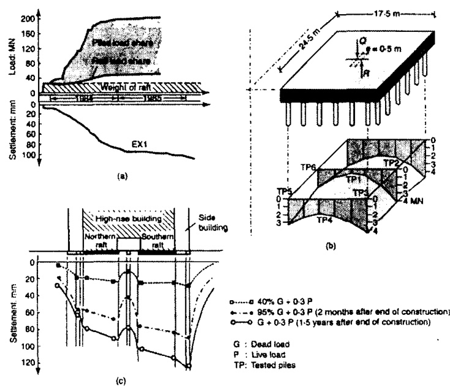  
a 시간경과에 따른'침하"및'래프트-말뚝의 하중분담 6 말뚝두부 하중C지반침하  

그림 43 Torhaus Building 말뚝지지 전면기초의 계측결과  

$\textcircled{\scriptsize{b}}$ 결과  

Torhaus Building의 최초설계인 얕은 기초만의 조건에서는 기초의 침하가 약 250mm로 나타나 이를보완하기 위하여 말뚝지지 전면기초로 변경하였다 말뚝지지 전면기초상태에서 나타난 침하량은 약$120\mathrm{mm}$ 이내로 제한되어 기초의 침하감소에 큰 효과를 나타내었다 그림 $4.3\infty\!\!\!\backslash$ 나타난 바와 같이본구조물에서는 말뚝이 구조물 하중의 많은 부분을 지지하는 것으로 나타났으며 말뚝의 하충분포는 그림$4.3(6)\circ1]$ 나타난 바와 같이 래프트 내부에서는 작게 나타나며 외부로 갈수록 크게 나타났다 이러한 결과는 말뚝지지 전면기초에 적용하는 말뚝의 지지력을 단말뚝의 지지력 특성으로 고려한다는 것은 무리가있을 수 있다는 것을 보여주고 있다  

# $\circleddash$ Messeturm/Fairtower Building Franke 1991  

# $\circled{{\mathbf a}}$ 적용  

Messeturm/Fairtower 건물은 60층 건물로 높이가 256m에 이르는 고층건물이다 건물기초는 $60\!\times\!60\mathrm{m}$의 크기이며 64개의 말뚝이 3겹의 층으로서 배열을 하였으며 주요 구조물의 하중이 집중되는 기초 하단부에 말뚝간격을 좁게 배치하였다 래프트의 두께는 중앙부분은 $6\mathsf{m}^{\circ}|$ 며 바깥부분은 3m로 구성되어있으며 말뚝의 경우는 지름이 $1.3\mathsf{m}^{\mathsf{o}}\mathsf{I}$ 며 길이는 래프트 중앙부분에 있는 말뚝은 $34.9\mathrm{m}$ 중간부분에 있는말뚝은 $30.9\mathrm{m}$ 래프트 모서리부분에 있는 말뚝은 $26.9\mathfrak{m}$ 로 말뚝의 위치에 따라 말뚝의 길이를 다르게 배치하였다 이러한 말뚝배치는 말뚝지지 전면기초는 말뚝의 위치에 따라 말뚝의 하중이 다르게나타나므로 말뚝의 길이를 변화시킴으로써 말뚝의 지지하중이 고르게 분포할 수 있게 고려한 것이다  

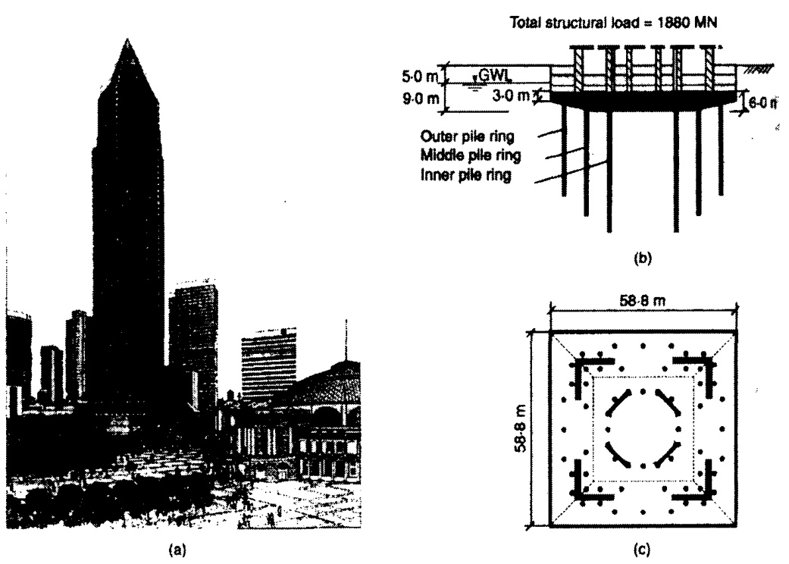  
그림 44 Messeturm/Fairtower 건물의 말뚝지지 전면기초 배치  

# $\circled{\ b}$ 결과  

Messeturm/Fairtower 건물기초는 최초 설계에서는 얕은 기초로 설계가 되었으나 침하량이 $400\mathrm{mm}$ 정도 발생하는 것으로 계산되었다 따라서 이러한 침하량을 감소시킬 목적과 지지력 향상을 도모할목적으로 말뚝지지 전면기초를 사용하여 침하량을 $50\%\infty]$ 상 감소시킬 수 있었다 또한말뚝과 래프트 사이의 하중분포비율은 말뚝이 전체하중의 $55\%$ 래프트가 $45\%$ 를 분담하는 것으로 나타났으며 래프트에서의 접지압 분포형태는 Boussinesq의 제안토압과 유사하게 래프트 두께가 두꺼운 부분에서는 크게 나타났으며 래프트의 두께가 얇아질수록 접지압은 감소하는 형태로 나타났다 반면에 말뚝의 하충분포는 중앙부분에 위치한 말뚝이 약간 크게 나타났지만 전체적으로 비슷한 유형의 하충분포를 나타내어 말뚝길이에 따른 영향이 나타났다  

# 5 모형실험  

# 5-1 개요  

권오균 등2002은 3종류의 모래지반조건에 대하여 순수무리말뚝과 말뚝지지 전면기초와 래프트 기초에 대하여 모형실험을 실시하였다 모래지반조건은 상대밀도가 $20.1\%$ $43.6\%$ $83.0\%$ 로 조성되었으며 말뚝지지 전면기초의 말뚝간격은 $3\!\sim\!6\,D$ 조건으로 실험을 실시하였다 모형말뚝은 직경 $40\mathrm{mm}$ 길이는1200mm로 제작되었다  

# 52 모형실험결과  

그림 51은 느슨한 지반조건에서 말뚝이 $3\!\times\!3$ 배열로 배치된 경우에서 말뚝간격증가에 따른 순수한무리말뚝과 말뚝지지 전면기초와 얕은기초인 래프트만의 하중-침하곡선을 나타낸 것이다 이 그림에 나타난 바와 같이 말뚝간격에 관계없이 순수 무리말뚝보다 말뚝지지 전면기초에서의 하중이 더 크게 발생하며 동일한 침하량에서는 말뚝지지 전면기초의 하중이 얕은 기초인 래프트 조건이나 순수무리말뚝조건에 비해 크게 나타나고 있는 것을알수있다 순수 무리말뚝에 비해 말뚝지지 전면기초에서 하중이더 크게 나타나는 것은 래프트로 인한 추가적인 하중지지와 래프트의 영향에 기인한 말뚝의 지지력 중가 현상이 복합적으로 발생하여 나타난 것으로 판단된다 또한말뚝간격이 증가함에 따라 말뚝지지 전면기초와 래프트 조건은 하중이 증가하고 있으나 순수 무리말뚝 조건은 하중증가경향이 크지 않은 것을알수있다  

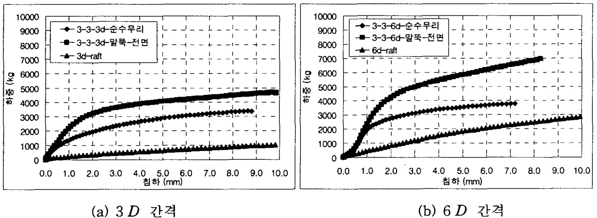  
그림 51 $3\!\times\!3$ 말뚝배열 조건 - $D_{r}:20.1\%)$  

그림 $5.2\div$ 지반조건에 따른 래프트 하중분담율을 나타낸 것이다 일부분의 조건에서 침하초기에 상대적으로큰 래프트 하중분담비율을 나타내는 구간도 있으나 대부분의 경우에서 침하가 진행되고 말뚝간격이 증가함에 따라 래프트 하중분담비율이 증가하는 모습을 나타내고 있다 대부분의 조건에서 항복하중은 $1.0\!\sim\!1.5\mathrm{mm}$ 침하에서 발생하였고 $\circ7$ 침하구간에서의 래프트 하충분담비율은 $D_{r}{=}20.1\%\infty\}$ 서 말뚝간격이 $D$ _ 에서 $6\,D$ _ 조건으로 변화함에 따라 $10\%\mathrm{{e}\mathrm{1}\mathrm{]}}$ 서 $27\%$ 로 증가하고 $D_{r}{\approx}83.0\%$ 인 경우는 $20\%($ 에서$22\%$ 로 나타났다 따라서 지반조건 $0]$ 느슨한 경우 $D_{r}{=}20.1\%$ 는 말뚝간격 증가에 따른 래프트 하충분담율이 크게 증가하며 조밀한 지반조건 $D_{r}{=}83.0\%)\circ11$ 서는 말뚝간격 증가에 따른 래프트 하중분담율의 증가현상이 미약하게 발생하는 것으로 나타났다 그러나 모든 지반조건과 말뚝간격조건의 말뚝지지 전면기초에서 래프트의 하중분담율이 일정한수준 $\circ7$ 상으로 나타나고 있으며 침하가 말뚝직경의 $10\%(4\mathrm{mm})$에 이르기까지도 지속적으로 증가하고 있어 말뚝지지 전면기초에서 래프트의 하중분담율을 고려해주는것이 타당하다고 판단된다  

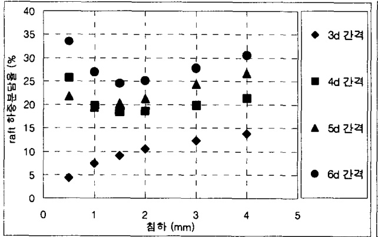  
a 느슨한 지반 \~ $D_{r}:\,20.1\%)$  

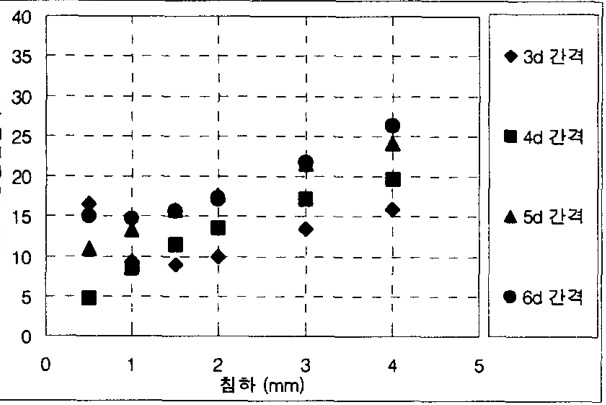  
<6 보통 지반 \~ $D_{r}:43.6\%)$  

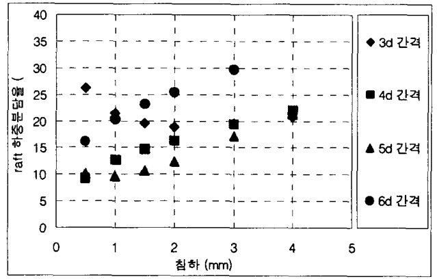  
그림 52 지반조건과 말뚝간격에 따른 래프트 하중분담율 $(3\!\times\!3$ 배열  
조밀한 지반 - $D_{r}:83.0\%)$  

# 6결론  

본 연구에서는 말뚝전면기초에 대한 이해를 돕기 위해 말뚝전면기초의 정의와 거동특성 등에 대한2기존의 연구결과와 실제 현장계측결과에 대한 비교 및 분석을 실시하였으며 이로부터 다음과 같은결론을도출하였다  

1 말뚝지지 전면기초는 얕은 기초와 순수 무리말뚝기초에 비하여 침하감소와 지지력증가에 있어 매우효율적인 기초이다  
2 말뚝지지 전면기초에 사용되는 말뚝들에 대한 지지력 평가시에는 래프트의 영향으로 말뚝들의 지지력이 증가하므로 단일말뚝에 지지력 평가결과의 합산만으로 계산하기에는 무리가 있을 수있다  
3 말뚝지지 전면기초에서 말뚝의 위치에 따라 말뚝하중이 다르게 나타나므로 말뚝길이를 래프트 내부의 말뚝위치에 따라 다르게 배치함으로써 전체적인 말뚝하중을 균등화시킬 수 있다  
4 말뚝지지 전면기초에서 래프트 하중분담율은 지반조건이 느슨할수록 말뚝간격이 증가할수록그리고침하가 진행될수록 증가하는 것으로 나타났다  

5 말뚝지지 전면기초에서 래프트 하중분담비율이 최대 $50\%{\circ}1]$ 이르는 경우도 있으며 말뚝중심의 말뚝지지 전면기초이더라도 항복하중 발생시에 $10\!\sim\!20\%$ 정도의 래프트 하중분담율을 나타냄에 따라 말뚝지지 전면기초에 대한 설계시에 래프트의 지지력을 고려해주는 것이 타당하다고 판단된다  

# 참고문헌  

1 Akinmusuru J 1980 " Interaction Of Piles And Cap In Piled Footingss" ASCE Vol 106 No GT 11 pp 1263--1268   
2 Cooke R W 1986 "Piled raft foundations on stiff clays -- A contribution to design philosophy" Geotechnique 36 No 2 pp 169-203   
3 Cooke R W Bryden-Smith D W Gooch M N and Sillett D F 1981 "Some observations of the foundation loading and settlement of a multi-storey building on piled raft foundation in London Clay" Proc Instn Civ Engrs Part 1 70 pp 433-460   
4 D Placzek E Jentzsch 1997 "Pile-raft--foundation under exceptional vertical loads-Bearing behaviour and settlements" 14th ICSMFE Vol 2 HAMBURG Pp 1115-1118   
5 Franke E El-Mossallamy and Wittmann P2000 "Calculation methods for raft foundation in Germany" Design applications of raft foundations Thomas Telford pp 283-322   
6 Franke E 1991 "Measurements beneath piled rafts" ENPC Conf On De Found Paris pp 599-625   
7 Garg K G 1979 "Bored pile groups under vertical load in sand" ASCE Vol 105 No GT8 AUG pp 939--955   
8 Hain S J and LEE I K 1978 "The analysis of flexible raft-piles systems" Geotechnique 28 No 1 pp 65-83   
9 Horikoshi K and Randolph M F 1996 "Centrifuge Modeling Of Piled Raft Foundations On Clay" Geotechnique 46 No 4 pp 741-752   
10 Kishida H and Meyerhof G G 1965 "Bearing Capacity Of Pile Groups Under Eccentric Loads In Sand" 6th ICSMFE Vo! 2 Montreal pp 270-274   
11 Liu Jin-Li Huang Qiang Li Hua Li Xiong and Hu Wen-Long 1994 "Experimental Research On Bearing Behaviour of Pile Groups in Soft Soil" X ICSMFE New Delhi India pp 535-538   
12 Liu J L Yuan Z L and Zhang K P 1985 "Cap-pile-soil interaction of bored pile groups" 13th ICSMFE Vol 3 San Francisco pp 1433-1436   
13 Phung Duc Long 1993 "Footings With Settlement--Reducing Piles In Non-Cohesive Soil" Depratment of Geotechnical Engineering Chalmers University Of Technology S-412-96 Goteborg Swedan   
14 Poulous H G 1968 "Analysis of the settlement of pile groups" Geotechnique 18 pp 449-471   
15 Poulous H G and Davis E H 1980 Pile foundation analysis and design New York JOHN WILEY & SONS   
16 Vesic A 1969 "Experiments With Instrumented Pile Groups In Sand" Performance of Deep Foundations ASTM STP 444 pp 177-222   
17 Yamashita K Kakurai M Yamada T and Kuwabara F 1993 "Settlement behavior of a five-stroy building on piled raft foundation" Proceeding 2nd International Geotechnical Seminar On Deep Foundations on Bored and Auger Piles Ghent AA Balkema Rotterdam pp 351-356   
18 강인규 2001 하이브리드 유전자 알고리즘을 이용한 Piled Raft 기초시스템의 최적설계 홍익대학 교 박사학위논문   
19 권오균 이승현 오세붕 임종석 이활 2002 "Piled Raft 거동특성에 관한 실험적 연구" 2002년 기 초 기술 학술발표회 사 한국지반공학회 기초 기술위원회 pp 79-89   
20 권오균 이활 김진복 이승현 오세붕 2002 "모형실험을 이용한 사질토 지반에서의 Piled raft 거동 특성에 대한 연구" 2002년 가을학술발표회 논문집 사 한국지반공학회 pp 358-365   
21 이수형 2000 사질토 지반에서 연직하중을 받는 무리말뚝의 지지 거동 모형'서울대학교 박사학위 논문   
22 이수형 정충기 2002 "연직하중을 받는 무리말뚝의 새로운 설계 방법" 2002년 기초 기술 학술발 표회 사 한국지반공학회 기초 기술위원회 pp 13-29  