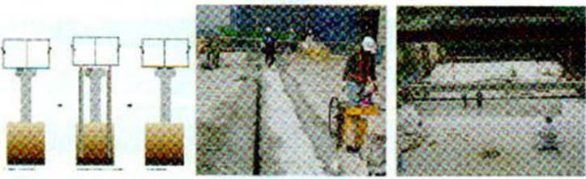
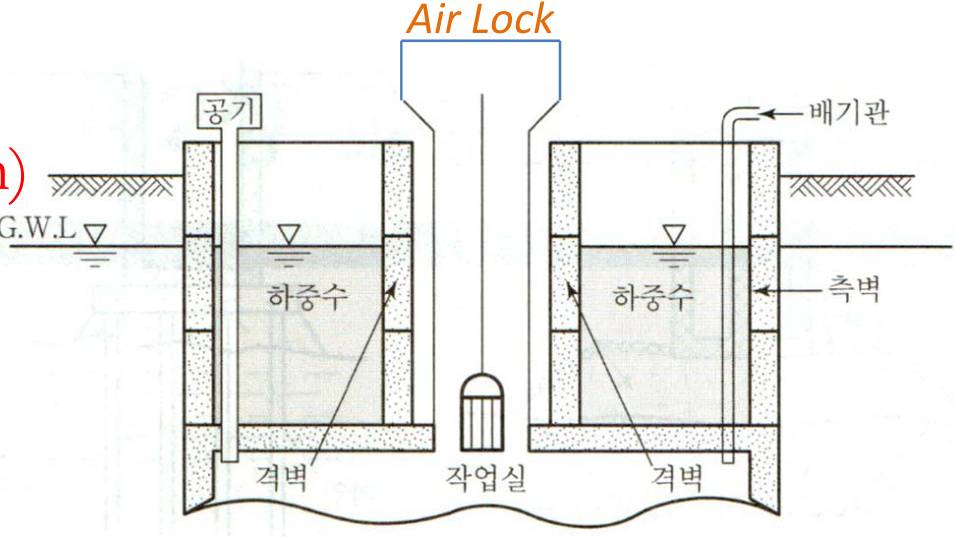

# Week 10 기초공  

457308 Construction Methods and Equipment  

Department Of Civil and Environmental Engineering Seoul National University  

# Field Survey and Testing  

기초 foundation: 상부구조에서 오는하중을 지반에 전달하는 부분얕은기초상부구조의 하중을기초 슬라브에서지반에직접 전달시키는 형태로구조물하중을접지압contact pressure으로 지지하는기초깊은기초:구조물 하중을 선단지지력과주변마찰력으로 지지하는 형태의기초  

  

Field Survey and Testing  

# 지반조사예비조사  

\*Sounding: 로드 끝에 설치한 저항체를 땅속에 관입하여 관입회전 인발 등의 저항으로 토층의 성질과 상태를 탐사하는 것  

#  

  

# Field Survey and Testing  

# 기초공법의 선정조건  

기초는 상부 하중에 대하여 충분한 지지력을가져야 한다  
기초는최소 근입 깊이를확보하여 지반의 습윤팽창 건조수축  
동결지하수 변동파이핑 인접공사 등의 영향을 받지 않아야  
한다  
기초의 변형침하 부등침하 회전이 허용한계 이내에 있어야  
하며 상부구조와 어울려야 한다  
기초는구조물과지반시스템의 안정기초 바닥면의 활용에대한  
안정전도에대한 안정지반의 전단파괴 즉지지력에 대한 안정을  
유지하여야 한다  
선정된 기초공법은 경제적이고 기술적으로 시공가능해야하며  
시공하는 동안 인접 구조물에 피해가없어야한다  

# Field Survey and Testing  

# 기초의 침하  

지반의 압축이나 압밀에 의하여 발생되는 연직 변위  
균등침하:구조물의 모든 부분이 같이 침하구조물에 균열은  
생기지 않고 연직 위치만 달라짐으로크게 문제가되지 않을수도  
있음  
부등침하:침하의 크기가 다른침하구조물의 수명에 관한 심각한  
문제로 발전될수 있음침하한기초의 양단을 연결한가상선을 기준으로측정된침하량이서로상이할경우의침하  

  

# Field Survey and Testing  

# 기초침하의 원인  

구조물 하중에 의한 지중응력의 증가지반의 탄소성 변형  
지하수위 강하에 따른 지반 내 유효응력증가  
점성토 지반의 건조수축  
함수비의 증가에 의한지반 지지력의 약화  
지반의 기초파괴  
지하공동이나지하매설관 등 지중 공간의 함몰  
동상 후의 지반 연화에 의한지반 지지력의 약화  

# Field Survey and Testing  

# 침하의 종류  

총침하량 $\mathrm{(S)=}$ 즉시침하량 $(\mathrm{S_{i}})+\mathrm{\Delta}\mathbf{Q}$ 밀침하량 $(\ensuremath{\mathrm{S}}_{\mathrm{c}})+2$ 차침하량 $(\mathrm{S}_{\mathrm{s}})$  

즉시침하량 기초에 하중이 가해질때의 때의지반압축  
압밀침하량: 시간이 지남에 따라 간국속의 물이 빠져 나가면서  
지반의 체적이 감소되어 일어나는 침하  
2차침하량: 유기질토나 점성토에서 Creep에 의한2차압밀에의해  
발생하는 압축침하  

Consolidation 압밀: Soil Compaction due to Void Water dry 간극수 배출  

Creep: Gradual downhill mOvement under the force of gravity after Consolidation  

Secondary consolidation Soil compaction due to Soil particle rearrangement Caused by soil Creep Icohesive soil 점성토 Organic Soil 유기질토  

  

# Field Survey and Testing  

# Settlement Calculation  

사질토 $S\!=\!\Sigma\!0.4\frac{P_{1}}{N}H\log\frac{P_{1}\!+\!\,d P}{P_{1}}$점성토 $S\!=\!\Sigma\frac{C_{c}}{1\!+\!e_{0}}\mathrm{~H~log~}\frac{P_{1}\!+\!\,d P}{P_{1}}$여기서 $s$ :압밀침하량$c_{c}$ :압축지수$e_{0}$ :초기 간극비$H$ :층의두께cm$P_{1}$ :유효상재하중 $\left(\log{\slash}\right)\mathrm{cm}^{2}$$\pmb{\mathscr{A}P}$ :하중에의한 연직응력의 증가분 $\left(\log\slash\right)\scriptstyle{\mathrm{cm}}^{2}$$N$ :표준관입시험치  

Calculate settlement of the clay soil when the field vOid ratio = 14 LL - $60\%$ the Soil depth = 3m and the effective loading changes from $10\mathrm{t}/\mathrm{m}^{2}$ to $15.2\mathrm{t}/\mathrm{m}^{2}$ |  

# Field Survey and Testing  

그렇다면 침하 기초를 어떻게 보강할 것인가  

# Jack Pile  

지반을 천공하거나 해머로 타격하지 않고 가압장치와 유압잭으로  
말뚝을 진동소음/분진 없이 계측 압입  
기존구조물의기초 하부지반 교란방지  
압입시유압게이지에 표시된 압력으로 말뚝 선단의 지층상태를  
압입과정에서자동적으로 확인  

# Field Survey and Testing  

1E등급 부등침하 건축물 A등급 복원인상  

1969년 준공 이후 침하지속 증가E등급 $\Rightarrow$ A등급복원  

  
그림1111 걸스카우트연맹빌딩 침하복원 2009  

# 3기존 구조물 기초보강  

B3\~10층 사용 중 16층 증축을 위한 압입파일 기초보강  

  
그림 1113증축 기초보강 2009  

2기존구조물 수직  

  
그림 1112 2호박돌기초 문화재 13m 승상 2008  

  
그림1112 6효곡교 135m승상 2012  

4 기존 구조물 지하증축압입파일보강뜬구조형성지하4층 하부굴착  

  
그림 1114 지하증축 2010  

5Top Down 동시시공  

도심지 소음 진동 대책으로 골조타설 후 기초보강  

  
그림1115 Top Down 동시시공 2010  

6인상 교체 치환  

슬래브 인상 침하균열발생 18m PC보 철거 교체시공  

  
그림 1116 교체  

# Field Survey and Testing  

# Boring 천공  

지반구성및지하수위파악불교란시료채취 및 표준관입시험SPT 실시등을 위하여   
지반에 구멍을뚫는 작업   
외관조사를 제외한모든지반조사에 반드시시행되는 작업   
Auger boring: 천공하는데시끄러운 소리가나지않으며천공방법에 따라자주식과   
인력식이 있음교란시료채취도로공사등 $5\!-\!10\mathrm{m}\ 0|\mathsf{L}\|\underline{{\circ}}|$ 천공에 적합   
Rotary boring: 보링파이프자체의 회전식균열상황의 관찰불교란시료채취   
암석코어채취N값측정등에사용   
Percussion boring:공기압력을 이용한 피스톤충격으로천공우물 및자원 조사   
코어채취 불가능작고깨끗한천공  

  

# Field Survey and Testing  

# Boring: In Site Sampling  

Disturbed sample 교란 흐트러진 시료: 코어채취과정에서 교란된 시료로입도분석액성한계시험소성한계시험흙비중시험등흙의조직에관계가 없는 물리적특성을파악하는데사용됨  

Undisturbed Sample 불교란시료: 절대적으로불교란시료란 얻기가불가능하겠으나가능한 자연상태의시료를 얻어 압밀시험 전단강도시험등과같은흙의조직에 의해서 지배되는 자연상태의 역학적특성을파악하는데 활용됨  

# Field Survey and Testing  

Standard Penetration Test SPT 표준관입시험  

N값:635kgf force의 해머로 76cm높이에서 낙하시켜 표준관입 시험용샘플러를 $30\mathrm{cm}$ 관입시킬때의 타격횟수  

$\mathrm{N}>30;$ : 말뚝지지층이 가능함$\mathrm{N}<10:$ : 푸팅기초가곤란함  

  

로드길이에 대한수정 및 토질에 의한 수정이 필요  

  

# Field Survey and Testing  

# Boring 심도  

  

  

# Field Survey and Testing  

# 보링주상도  

  

NX:7779mm 내경 8890mm외경 토사및 암반용 시료채취시험공구  

RQDRoCk Quality Designation 10cm 이상 코어 길이 총합/ 이론적 굴진 깊이  

TCR/Total Core Recovery: 회수된코어길이의 총합/ 이론적 굴진 깊이  

# Field Survey and Testing  

Plate Bearing Test PBT 평판재하시험  

어느지반에 실제구조물을 축조하였을 때 지지력이나 침하조건이  
만족되는지 여부를 판단하는시험  
현장에서 재하장비로는지지대를 설치하는 경우도있고 이동성을  
고려하여 덤프트럭페이로더 등이 이용됨  
K지지력계수 $\mathrm{kg}/\mathrm{cm}^{3})=\mathrm{q}$ 하중강도 $\mathrm{kg}/\mathrm{cm}^{2})$ /y침하량  

  

# Foundation Methods  

Foundation: Part of 2 Structural system that supports and anchors the Superstructure and transmits its loads to the earth  

  

# Foundation Methods  

# Generalized foundation design Steps  

Calculate loads from Structure surcharge active and passive pressure etc   
Characterize soil: Hire 2 firm to COnduct soil tests and produce 2 report   
that includes soil material properties   
Determine footing location and depth: Shallow footings are less   
expensive but the variability of the Soil from the geotechnical report will   
drive choices   
Determine footing Size: These calculations are based On working loads   
and the allowable Soil pressure   
Evaluate soil bearing capacity: The factor of Safety is considered here   
Calculate Contact pressure and check Stability   
Estimate Settlements   
Design the footing Structure  

# Foundation Methods  

# Shallow Foundation  

Soil ground has suitable bearing capacity for direct slab foundation Easier to be built than deep foundation  

# Type  

Spread footing: 2 single column bears On 2 square rectangular or circular pad to distribute the load Over 2 bigger area simple to build and economical Soil Should satisfy required bearing Capacity  

Continuous footing: 2 COntinuous Wall bears On 2 wide pad to distribute the loads  

Combined footing: multiple Columns typically two bear on 2 rectangular Or trapezoidal shaped footing  

  

# Foundation Methods  

# Type  

Mat foundation: 2 slab that supports multiple columns The mat can be   
Stiffened with a grid Or grade beams 기초면적이 시공면적의2/3이상되는기초지반조건이 좋지 않고 부등침하가 발생하기 쉬운지형구조물의 하부가지하수위 아래에 위치하고 있어 차수나 방수가중요시될 경우도심지 건축 및 지하철 구조물  

  
Combined Footing  

  
Mat Foundation  

$\ast_{\boldsymbol{q}_{u}-\boldsymbol{q}}$ ultimate bearing Capacity of soil only under the foundation Structure $\pmb q=\pmb{D}_{f}\pmb\mathscr{x}\,\pmb{r}$  

# Foundation Methods  

얕은기초의 지지력 'Terzaghi theory  

Foundation bed width ${\bf B}>$ Foundation depth $\mathbf{D_{f}}$ Ultimate bearing capacity Of normal Soil 극한지지력 $\mathrm{\Phi_{\mathrm{q}_{u}}})$  

$$
q_{u}=\alpha C N_{c}+\beta r_{1}B N_{r}+r_{2}D_{f}N_{q}
$$  

$\alpha,\beta$ :기초의 형상계수  
$N_{c,}$ $N_{r},$ $N_{q}$ :지지력계수  
$c$ :흙의 점착력  
$\boldsymbol{B}$ :기초의 폭  
A:기초 면적  
$D_{f}$ :기초의 근입깊이  
$\gamma_{1}$ :기초하중면 아래에 있는 지반의 단위 중량  
$\gamma_{2}$ :기초하중면 위쪽에 있는 지반의 단위 중량  

  

  
a  

$$
\begin{array}{r l}&{\left(a\right)r_{2}^{\prime}=r_{2}-\frac{D_{w}}{D_{f}}(r_{2}-r_{s u b})\left(\mathsf{i n s e r t\;r_{2}^{\prime}\;\mathsf{i n s t e a d\;o f\;r_{2}}}\right)}\\ &{\left(b\right)r_{1}=r_{s u b}+\frac{D_{w}}{B}(r_{2}-r_{s u b})\quad^{*}r_{s u b}=r_{s a t}-r_{w}(\mathbb{1}.O t/m^{3})}\end{array}
$$  

Allowable Bearing Capacity 허용지지력: $q_{a}=q_{u}/F_{s}$ Safety Factor Net Allowable Bearing Capacity 순허용지지력: $q_{a l l}=(\pmb{q}_{u}{-}\pmb{q})/F_{s}$  

  

# Foundation Methods  

지하수위보다기초의위치가 더 낮게되면저면에 양압력이 작용하게되고 이양압력보다저면에작용하는상부하중이 적으면 구조물이부상  

양압력:수위차및수면하수평유속때문에 양압력이 발생하기 때문에 부력에 추가해서수평유속이빠르면구조물이더 떠오르는 효과가발생 지하수위 심도구조물에작용하는 양압력의폭물의 단위중량 등을고려 물의무게자체를 모두 고려한 것이며 $\mathbf{r}_{\mathrm{sub}}$ 수중단위중량 $=$ $\mathbf{r}_{\mathrm{sat}}-\mathbf{r}_{\mathrm{w}}$  

지하주차장 등바닥면적 크기가거대화 됨에 따라지면에 접하게 되는 바닥층공사에서 발생할수있는부력방지대책이 매우중요  

문제점:구조물 균형상실부재균열누수 및파손등  
지반조사주상도및지하수위를파악하여 시공단계 및 완성구조물의부력사전검토  
호우시지표수의유입에 의해급격히지하수가 상승하지 않도록대책강구  
지표수 배수강화굴착구내로지하수 유입방지부력방지Anchor설치경우에따라  
지하수 상승시구조물내로지하수가유입하도록조치등  

# Foundation Methods  

For COntinuous foundation COnstruction calculate 1 ultimate bearing capacity and $(2)$ allowable bearing Capacity $(\mathrm{c}=1.6\mathrm{t}/\mathrm{m}^{2},$ 1= 18t/m3 | $\mathrm{r_{sat}}=2.0\mathrm{t/m^{3},}\,\mathrm{F_{s}}=3,\mathrm{N_{c}}=17.7,\mathrm{N_{r}}=5,\mathrm{l}$ N -74  

  

# Foundation Methods  

For square shape foundation COnstruction Calculate 1> ultimate bearing capacity and $(2)$ allowable bearing capacity and 3 net allowable bearing capacity $(\mathrm{F_{s}}=3,\mathrm{N_{c}}=17.7,\mathrm{N_{r}}=5,\mathrm{N_{q}}=7.4)$  

  

# Foundation Methods  

Shallow Foundation: Cutting Methods  

Open cut: for wide ground having good soil Conditions   
Island method: excavate the center of foundation Structure and build foundation like island Support retaining walls by the built center and excavate remaining Soils   
Trench method: Opposite to the island method Excavate and built foundation edges first use it as a retaining wall and move to the Center position  

  

# Foundation Methods  

# Heaving  

연약한점토질지반을굴착할 때토류공 배면의 흙의중량이 굴착면이하지반의 극한지지력보다크게 되어 배면 토사가 토류공의 내측을 향해서유동하기 시작하여 이것 때문에굴착저면이 팽창하는 현상  

Safety to heaving  

Driving moment Of heaving $(\mathrm{M}_{\mathrm{d}})$ $\begin{array}{c}{{M_{d}=W\times0.5R+q R\times0.5R}}\\ {{=r_{1}H\cdot R\times0.5R+0.5q R^{2}}}\\ {{=0.5R^{2}(r_{1}H+q)}}\end{array}$ Resistance moment to heaving $\mathrm{(M_{r})}$ $\begin{array}{l}{{M_{r}=\pi R C_{2}\times R+H C_{1}\times R}}\\ {{\ =\pi C_{2}R^{2}+H C_{1}R}}\end{array}$ Safety factor $\mathrm{(F_{s})=M_{r}/\ M_{d}}$ Need to $\mathrm{F_{s}}>1.2$ to be Safe  

  

# Foundation Methods  

Estimate Safety to heaving  

  

# Foundation Methods  

# How to prevent heaving  

Set up the retaining wall deeper Change cutting methods eg Open cut to the island method Increase Stability Of foundation ground by cement grouting Ginjection chemical injection underground Water drainage compression etc Technically increase Stability of the retaining wall eg bracing anchoring  

# Boiling  

모래지반에서 지하수위 이하를 굴착할 때토류벽의 기초 깊이에 비해서 배면의 수위가너무높으면 굴착저면의 모래 입자가지하수와더불어 분출하여 굴착 저면이 마치 물이 끓는상태와 같이 되는 현상  

  

# Deep Foundation  

  

# Pile Foundation  

Column driven into the Soil to Support 2 Structure by transferring loads to 2 deeper and Stronger layer of Soil Or rock  

Provide 2 COmmON Solution to all difficult foundation Site problems  

Can be used for any type Of Structure and in any type of Soil  

Situation for pile foundation Heavy and non-uniform loading from the Structure For saving time and money Soil is compressible and firm hard bearing strata 1s located at a large depth Structures are located On river-bed Or sea-shore having high likelihood to be Scoured due o action Of water Large fluctuations in sub-soil water level Canal Or deep drainage lines exist near the foundations  

# Pile Foundation  

Classification based On bearing Capacity 지지력에 의한분류  

End bearing pile선단지지말뚝: driven into the ground until a hard Stratum 1s reached Piles do not support the load rather acts as 2 medium to transmit the load from the foundation to the resisting sub-stratum  

Friction pile마찰말뚝: driven at a site where soil is not economical Or rather possible to rest the bottom end Of the pile on the hard Stratum Load 1s Carried by the friction developed between the sides of the pile and the surrounding ground  

to determine 2 depth > skin friction = load coming On the pile  

Bearing 0r supporting pile하부지반에의한지지말뚝: driven into the ground until 2 hard Stratum and passes 1t to get further friction  

# Pile Foundation  

How to increase the load carrying capacity of friction pile Increase diameter of the pile Drive the pile for larger depth Group several piles Make Surface of the pile rough  

  

  

  

  

# Pile Foundation  

Classification based On usage purposes 사용목적에 의한분류  

Compaction pile다짐말뚝: to improve compaction while piling good to   
be used for loose sandy soils   
Stabilizing pile억류말뚝: to Stabilize and protect slopes   
Batter pile사항경사말뚝: to compensate horizontal weakness of piles and   
resist large horizontal and inclined forces   
Lateral resistance pile수평저항말뚝: batter piles retaining piles fender   
piles protect dock walls decks etc that provide horizontal supports  

  

응력분포를알아야지반이그러한응력에저항할수있는지를확인할수있고 이에맞도록파일설계  

# Pile Foundation  

  

Classification based 01 functions 기능에 의한 분류  

Single pile단항: underground Stresses Of two Or more piles are independent piles are located far  

$$
_{D_{o}}>1.5\sqrt{r\cdot L}
$$  

$(\mathrm{D}_{\mathrm{o}}$ : distance between piles r: pile radius L: pile penetration depth  

Group pile군항: underground Stresses지중응력 of two Or more piles affect each Other piles are closely located reduce bearing capacity of piles  

$$
\begin{array}{r}{D_{o}\leq1.5\sqrt{r\cdot L}}\end{array}
$$  

When piling into Clay soils or clay soils exist under the pile end   
should Consider effects of group piles On bearing Capacity reduction   
and possible settlement   
Normally $70–80\%$ Of single pile's bearing capacity 응력분포가커져서   
bearing capacity는 작아짐  

# Pile Foundation  

Classification based On functions  

Efficiency Of bearing capacity Group piles 군항의 지지력효율  

$$
E=1-{\frac{\psi}{90}}\{{\frac{(n-1)m+(m-1)n}{m n}}\}\qquad\psi=\tan^{-1}{\frac{D}{S}}
$$  

n: number of rows of group piles m: number of piles in One rOW D: diameter ofa pile   
S: distance between pile Centers \*if different take Smaller S for calculation  

Allowable bearing capacity of group piles 군항의 허용지지력 Rag ENRa N: number of piles $R_{a^{\ast}}$ allowable bearing capacity as a single pile  

# Pile Foundation  

# Group piles  

Is following pile foundation 2 single pile Or group piles? L= 15m  

There is group piles consisting 20 piles If the allowable bearing capacity 2s 2 single pile is 20t calculate the allowable bearing capacity of the foundation  

  

# Pile Foundation  

Classification based On materials 재료에 의한분류 Timber piles  

Untreated Jast only couple Of years - only temporarily used  

Treated With 2 preservative salt Or Creosote  

Concrete piles  

Precast COncrete piles  

Cast-in-place COncrete piles  

Steel piles  

Steel H Sections Steel pipe piles  

Composite piles  

Concrete and Steel Plastic With Steel Pipe COre  

# Pile Foundation  

Timber piles  

# Advantages:  

More popular lengths and Sizes are   
available On short notice   
Economical in COst   
They are handled easily light With   
little danger Of breakage   
After driving they Can be easily Cut to   
any desired length   
Can be extracted easily in the event   
removal 1s necessary  

\*In these days Iess Used except for temporary Construction  

  

# Disadvantages  

May be difficult to obtain piles   
Sufficiently long and Straight   
Can be difficult 01 impossible to use   
1n hard formations   
Difficult to splice when increased 붙이다   
lengths are necessary   
Usually not Suitable to use as end  
bearing piles under heavy loads:   
better for friction bearing piles   
Usually require treatment With   
preservatives to maintain Structural   
Capacity OVer required duration:  

possible environmental impact  

# Pile Foundation  

# Concrete piles: Precast Concrete piles  

For projects with 2 large quantity of piles transportation COsts from existing manufacturing plants may be significant Thus it may be COsteffective to set up 2 casting facility On the job O1 in the general Vicinity Of the project The establishment Of such 2 facility requires 2 substantial investment in specific equipment and casting forms as well as 2 sufficient amount of space for the casting beds curing area and storage yard  

1 Prestressing strand will be as Iong as the casting bed 2 Bulkheads Will be placed in the forms as determined by the desired pile Iengths  

3 Utilizing stressing jacks each Strand will be pretensioned to between 20 and 35 kips prior to the Concrete placement 4 Immediately following the Concrete placement the piles are COvered with Curing blankets and steam is introduced 5 The Curing Continues and the prestressing forces Sre released when the Concrete has attained 9 minimum COmpressive Strength 0f 3500 psi  

  

# Pile Foundation  

Concrete piles: Precast Concrete piles  

# Advantages:  

High resistance to chemical and   
biological attacks   
High load-carrying Capacity   
Simple quality Control   
In the Case Of hollow cylinder piles 2   
Water Pipe Can be installed along the   
Center Of the pile to facilitate jetting  

# Disadvantages  

Difficult to reduce 01 increase the   
length: necessary for good site   
investigation during planning   
Large Sizes require heavy and   
expensive handling and driving   
equipment   
The inability to Quickly obtain piles by   
purchase may delay the Starting of 2   
project   
Possible breakage Of piles during   
handling 01 driving produces 2 delay   
hazard  

# Pile Foundation  

Concrete piles: Cast-in-place Concrete piles  

Cast in position inside the ground  

Driving 2 metallic shell and leaving it in the ground and then filling the shell with Concrete cased OR Driving a metallic shell and filling the resulting void with Concrete 2s the shell is pulled from the ground uncased  

Raymond Step-taper Concrete pile: installed by driving 2 spirally corrugated주름진 Steel shell After 2 shell 1s assembled to the desired length 2 step-tapered 점점 가늘어지는 rigidSteel core is inserted and the shell 1s driven to the desired penetration The COre 1s removed and the shell 1s filled with Concrete  

  

# Pile Foundation  

Concrete piles: Cast-in-place Concrete piles  

Augered cast-in-place pile: do not require 2 shell Or pipe  

1 A hollow shaft auger is rotated into the soil to 2 predetermined tip elevation   
2 As the auger 1s withdrawn from the hole grout is injected under pressure through the hollow shaft   
3 Concrete Can be placed to the ground elevation and then Cut off 그라우팅:   
지반의 지지력증가 투수성 감소 지반과구조물의 일체화등을 목적으로 기초지반이나구조물주변및구조물자체내부로 각종 시멘트 모르타르등의그라우트를주입하는것  

  

# Pile Foundation  

Concrete piles: Cast-in-place Concrete piles Franki driven Cast-in-situ pile  

1 The drive tube is driven to the desired depth 2 Concrete 1s dropped into the drive tube and compacted The drop hammer expels COncrete from the tube 4 Additional steps complete the footing  

  

  

# Pile Foundation  

Concrete piles: Cast-in-place Concrete piles  

# Advantages:  

The lightweight shells Can be handled   
and driven easily   
The length Of 2 shell Can be increased   
01 decreased easily   
The shells Can be shipped 1n Short   
lengths and assembled at the job site   
The danger Of breaking a pile while   
driving 1s eliminated   
Additional piles Can be provided   
quickly if they are needed   
No pile splicing  

# Disadvantages  

A slight MOvement Of the earth   
around an unreinforced pile may   
break it   
Require Careful placement Of the   
COncrete to Ensure 2 Structurally   
Sound shaft   
Installation Of reinforcing Steel Can be   
difficult   
The bottom Of a Franki pile may not   
be Symmetrical  

# Pile Foundation  

  

# Steel piles  

In constructing foundations that require piles driven to great depths with higher bearing capacity steel piles probably are more suitable than any Other type  

Easy to be welded: Because the steel piles can be driven in short lengths and additional lengths then welded On top of the previously driven section they can be utilized more readily in situations where there are height restrictions that limit the length of piles that can be driven in One piece  

Steel H section piles: the great strength of Steep combined with small displacement of soil permits 2 large portion Of the energy from 2 pile hammer to be transmitted to the bottom of a pile $20–30\%$ cheaper than pipe piles  

Steep-pipe piles: better engineering performance than H section piles  

# Pile Foundation  

# Composite piles  

Usually developed and Offered to meet the demands of special Situations  

Situations that cause problems are hard ground at the project site: cause problems with applying the energy necessary to drive the pile and at the Same time being careful not to destroy the pile Warm marine nvironments: subject the pile to marine borer attacks and Salt attacks On metal therefore special piling protective measures are usually specified \*Marine borer: 해양천공생물  

# Concrete and Steel composite piles  

When extremely hard soils Or soil layers are encountered Top portion Of the pile $\rightarrow$ prestressed concrete pile the tip > Steel H pile embedded into the end Of the Concrete pile  

# Pile Foundation  

  

Composite piles  

Plastic With steel-pipe Core piles  

Immune to marine borer attacks eliminating the need for Creosote treatments 0r special sheathings in marine environments  

Their abrasive resistance makes them excellent for fender system use  

Selection Of pile types  

Nature Of ground  

Nature Of the Structure and loading Conditions  

Elevation Of the ground Water level with respect to the pile cap  

Probable length Of pile required  

Availability Of materials and equipment  

Factors which may Cause deterioration Of pile  

Probable COst Of pile  

# Pile Foundation  

Pile Driving  

  
Diesel Hammer:  

Self-contained driving unit within cylinder  

  
Drop Hammer: Lifted by a hoist line  

  
Stream/Air Hammer: Ram lifted by steam 아r compressed air  

  

Vibratory Hammer: Reduce friction b/w soils and a pile with vibration for water-saturated/non-cohesive Soils  

# Pile Foundation  

# Pile-Supporting Strength  

Many pile-driving empirical equations  

Engineering News equation: most popular in the US  

Drop hammer $R=\frac{2W H}{S+1.0}$  

Single-acting Steam hammer $R=\frac{2W H}{S+0.1}$  

Double 'Differential-acting Steam hammer $R=\frac{2E}{S+0.1}$  

R: Safe load on a pile in pounds   
W: weight of a falling mass in pounds   
H: height of free fall for mass Win feet   
E: total energy of ram at bottom of its downward Stroke in foot-pounds   
S: average penetration per blow for last 5 to 10 blows in inches  

항타에 의한 동역학적 지지력 산정  

# Pile Foundation  

The falling ram Of 2 drop hammer used to drive 2 timber pile 1s 50001b The free-fall height during driving was 19 in and the average penetration for the last eight blows was 05 in per blow What 1s the safe rated loading using the Engineering News equation?  

# Pier Foundation  

A reinforced COncrete column D>750mm COnstructed below the ground surface to transfer the 1oad down to a stronger layer  

Characteristics  

Good resistance to horizontal moment due to the large dimension   
Can use One pier instead Of group piles   
Less noise and vibration: good for COnstruction in urban areas   
Machine excavation technique: applicable when piling 1s difficult   
Less opportunity Of heaving and Soil vibration  

  

# Pier Foundation  

# Risks during pier foundation  

Poor Concrete quality: tremie pipe quality control 타설 후 품질관리 곤란 Hollow wall collapse Drilling difficulties: Stabilizer liquid good casing ppropriate drilling plans Rebar dislocation: installation of grid ebar굵은철근또는 강재버팀재 at the bottom reinforce tying slow down Concrete placement speed  

Drilling plan changes  

  
그림 베노토공법의 시공순서  
그림 안정액을 사용한 Earth dril! 공법  

# Caissons Foundation  

Water light Structures made Up of wood Steel or reinforced   
COncrete COnstructed In Connection with excavatiOn for   
foundations of bridges piers abutments 1n river and lake dock   
Structure for shore protection   
The Caisson remains in its pose and ultimately becomes 2s   
integral parts Of the permanent Structure  

  
a Open Caisson   
6 pneumatic Caisson   
box Caisson  

# Caissons Foundation  

Open Caisson well foundation 철근콘크리트강재 등으로제작된 개방단면을가진 원형이나 상자형 구조물내부의 토사를굴착하면서우물통의자중 및재하하중에의하여침하시키는공법침하가 완료되면우물통내부를콘크리트모래등으로속채움하고서 상부구조물을구축  

Good for bridge piers columns used for Seohae bridge  

No limit t0 drilling depth   
Relatively economical and easily Operated   
Can disturb adjacent SOil Structure   
Can incline due to Settlement   
Difficult t0 Optimize Quality Of   
underground COncrete  

  

# Caissons Foundation  

# Pneumatic Caisson  

지상에서제작된케이슨을현장에운반하여 거치시킨후에케이슨하부에 설치된작업실에지하수압에 상응하는 압축공기를 송기하여 지하수나해수의침입을방지하면서 인력과 굴착장비로 지반을 굴착하여케이슨을 지중에침설시키는공법  

Bridges tunnels subways roadbed  

Good workability 1n dry working COnditions   
Good to check underground COnditions   
Stable With less MOvement and inclination   
Heaving/boiling protection   
Difficult working in 2 deep depth 35-40m   
Increase labor COst   
Cause Of Ca1ssOn disease  

  

# Caissons Foundation  

  
DCM  

  
SCP  

Box Caisson  

케이슨 바닥부가폐쇄되어 있는 상자형케이슨이며 일반적으로 육상제작장에서제작하여설치위치로이동시킨 후에 케이슨 내부에 모래자갈 물 또는 콘크리트를채워서 케이슨을 수직으로침강시킴  

Harbor dock breakwater방파제  

Made by reinforced-concrete Concrete iron  

Good lateral resistance  

Good for Quality COntrol during manufacturing  

Cheaper  

Horizontal leveling before Settlement Consider underground Scouring세굴  

DCMDeep Cement Mixing: 원지반과 시멘트를 섞어서고결하여   
말뚝을 만드는것   
SCPISand Compaction Pile: 모래다짐말뚝 원지반에모래를 압입하여   
다짐말뚝을조성  

  

# Caissons Foundation  

  
DCM  