# 연약지반의 이해 및 지반개량공법( 1  

나중요한구조물를설계하는경우 침하나지반의지지력 등이엄밀하게 제한되므로지반을 보강하는것이 필요하게 되므로이 지반은 연약하다고 판단되는것이다.  

현재 우리나라는 좁은국도와 급격한산업화및지가의 급상승등의 요인들로 인해 연약지반상에서의지하굴착 도로 교량및 대규모 구조물축조 등과같은 각종 건설공사가 행하여지고있으며계속증가하는추세이다. 이로인하여, 요즘건설기술자가 현장에서 흔히 접하는 단어가 연약지반’이며, 대형건설사고중많은부분이연약지반에서일어나고있는실정이다.  

그러므로 넓은의미의 연약지반이라 함은 설계하고자하는구조물에대하여침하나지지력의조건을만족하지못하는지반이라고말할수있다.  

그러므로, 건설기술자가진행중인 프로젝트를 성공적으로 수행하기 위해서는 연약지반의 특성, 예상되는문제점및대책방안에대한폭넓은이해가필수적이라고할수있다.  

한편 연약지반에 대한사전적 정의를 내려보면다음과같다. “지반에시공되는구조물의종류 규모중요성에 의해 상대적으로 달라지나 일반적으로니탄이나유기질토, 미고결의 점토, 실트등과같이 함수비가높고압축성이풍부한지반지지력이작은토층으로구성된지반을말한다.”  

따라서, 필자는 연약지반에서 건설공사시 발생하는문제점과현재우리나라에서많이쓰이고있는연약지반개량공법에대하여언급하고자한다.  

즉, 일반적으로성토등의 흙구조물을포함한구조물의 기초지반으로서 지지력이 있고 구조물의 안정이나침하 등의 문제가없는지반을 보통지반’이라하고, 그렇치 못한지반을 연약지반’이라고 말할수있는것이다.  

# 1. 연약지반의정의  

연약지반이라는 말은 토질공학적인 용어나학술적으로명확한정의가있는것은아니다. 엄밀히말하면연약지반이라는 종류의 지반은 존재하지 않는다고할수있다. 이는같은 지반에서도그 위에 건설하는구조물의종류나 설계조건에따라 안심할수있는견고한지반이될수도있고, 연약한지반이될수도있는것이다.  

따라서 연약지반인지 아닌지의정량적인 판단기준은생길문제와그크기에의한것으로일률적으로말할 수는 없지만 도로나 철도의 경우, 표준관입시험(SPT Test)의N치가2 이하의고유기질토층, 4 이하의점성토층및 $N=\left.10\right.\mathrm{~}$ 하로지진시에액상화할우려가있는 사질토층을 연약지반이라고 판단할수있겠다.  

예를들어, 어떤지반에소규모녹지를조성하는경우지반의 상태는 문제될것이없지만, 대형구조물이  

정량적인연약지반의판정기준은[표1.1], [표1 . 2 ],[표1 . 3 ]과같다.  

[표1.1] 사질토지반의연약지반판정  

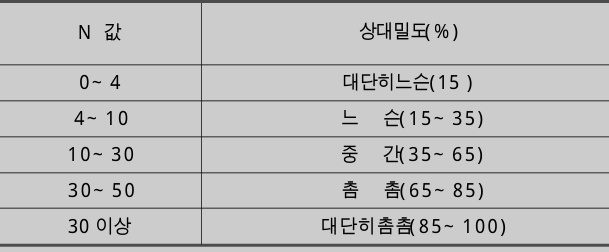  
이대동| 토목기술부대리| 0 2 ) 3 4 3 3 - 7 7 7 5| E-mail: ldd7775@ssyenc.co.kr  

[표1.2] 점성토지반의연약지반판정  

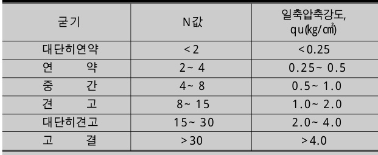  

[표1.3] 연약지반의판정기준(일본)  

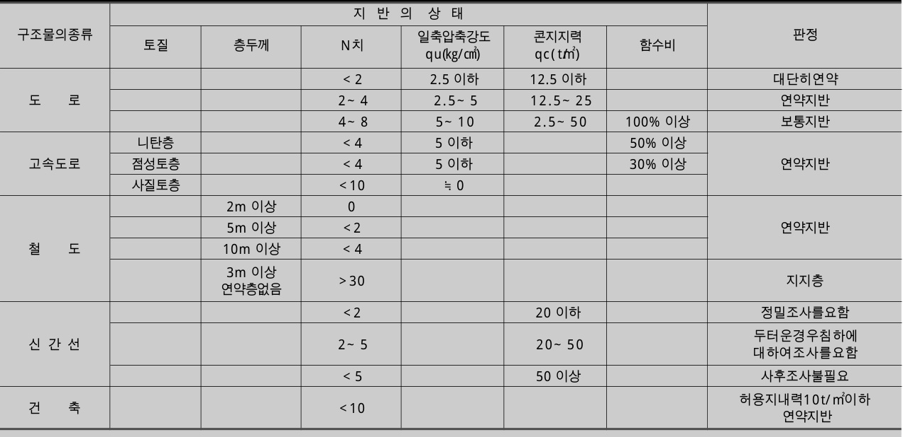  

# 2. 연약지반의구분  

식물의 분해과정에 있는 유체와 분해를 받은 무정형의 부식물을 함유한 흙으로 일반적으로이들 유기물이 $10\%$ 이상 함유된 흙을 말한다. 흙중의 유기물은흙의성질에 좋지않은영향을미치고, 유기물 함유량$0\,|\,2\sim4~\%$ 를넘으면영향이인정된다고본다.  

연약지반을구성하는연약토층의성층과토질은매우다양하기 때문에공사에있어서생기는지반의거동과여러가지문제를 바르게 예측하기위해서는이론해석이가능한이상지반으로바꿔놓는것이필요하다. ([그림2.1] 참조)  

해안사주나대하천의 자연제방을 끼는 지반은 대체로양호한지반이다. 그러나상부에느슨한모래층이 두껍게 퇴적하고, 지하수위가 높을 경우 지진에의한 모래의 액상화현상으로 많은재해를입을 수있다. ([표2 . 1 ]참조)  

[그림2 . 1 ]에서출구가막힌지곡이나소익곡의소택등으로형성된이탄지반은미분해의식물섬유룰함유한 피트나 무기질을 상당히 함유하고 식물섬유가분해되어 칠흙색을 보이는 흑니로 구성되어 있는것이 많다. 삼각주저지, 배후습지 또는소익곡등에서일반적으로 볼 수 있는 점토지반은 점성토, 실트및유기질토 등으로 되어있다. 여기서 유기질토는 동  

[표2 . 1 ]은복잡한지반구성을 단순화하기위해지 반을 고유기질토의 피트, 흑니와 세립토의 유기질토 로된이탄질지반, 세립토의화산회질점성토, 실트와 점토로구성된점성토지반및 사질토와모래로된사  

# [그림2.1] 연약지반이형성된대표적인장소와토층구  

# 질지반으로구분한일례를나타낸것이다.  

일반적으로 유기물 함유량이 $50\%$ 이상의 것을피트라 부르고 있지만, 여기서는 $40\%$ 이상으로 하고 유기물 함유량이 $20\sim40\,\%1$ 흙을 흑니로 표현했다.  

또한 하성퇴적과 같이 복잡한 연약지반에 대해서는[표2 . 1 ]의구분을기본으로하여적절한호층지반으로바꿔놓는것이 필요하며 층두께가탁월한토층으로지반을 대표시켜 가능한지반을 단순화한지반구분을채택하는것이바람직하다.  

[표2 . 1 ]에 나타낸연약토의자연함수비, 자연간극비, 일축압축강도 및 표준관입시험의N값등은실측치의대략적인범위를기입한것이다.  

# 3. 연약지반 공사의 종류 및 특징  

연약지반에서 시공되는 공사는[그림3 . 1 ]과같이매우다양하다. 이중에서주된것은성토나지상구조물과같이 연약지반에 재하된 구조물 공사와절토나지하구조물과같이 지반을 굴착하는것에 의해만들어지는구조물공사로분류할수있다.  

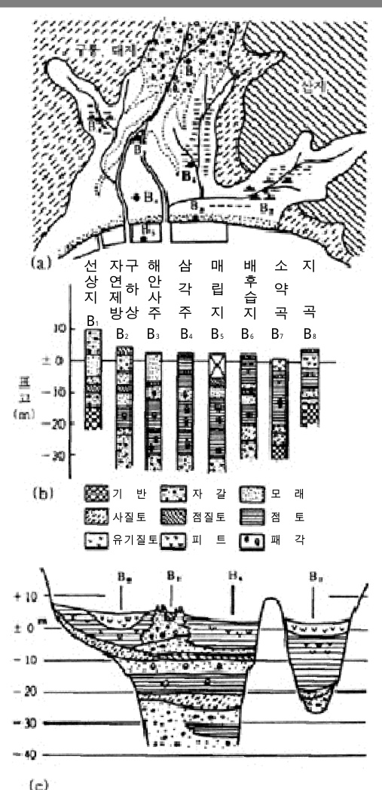  

그리고[표3 . 1 ]은연약지반상에있는구조물의종류, 주요역할, 평면적인 형상및 설계와 시공상의 주요한검토항목등의특징을정리한것이다.  

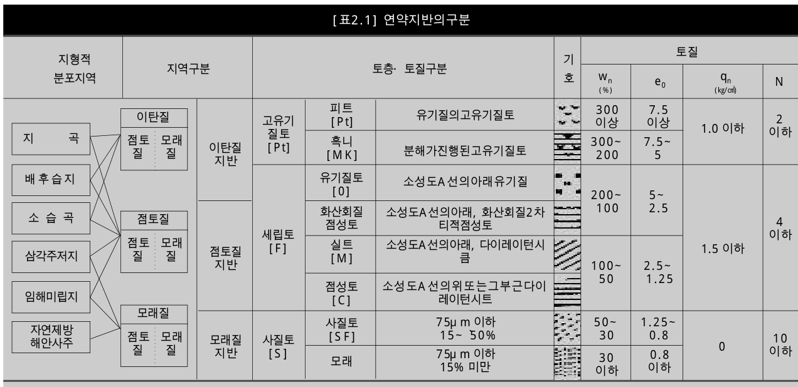  

하중을 지지하는 것이다. 또 성토, 매립 등에 의한조성지성토는그위에건설될건물이나모든시설의지지지반로서의역할을한다.  

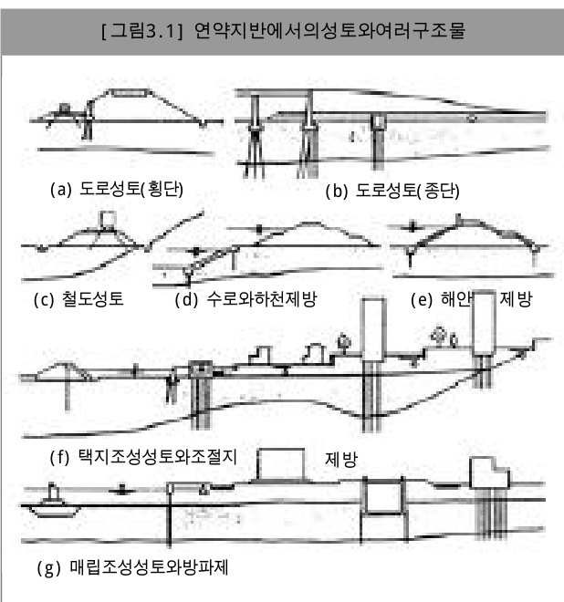  

따라 $\mathbb{A}\!\left0\right\vert$ 들 성토는충분한지지력을가져야하며,동시에성토면에과대한침하(특히부등침하)나경사면에변화또는파괴가생겨그기능이저하되거나상실하는것을피해야한다. 만약성토에의해상기사항을만족시키는것이공법상혹은공기상곤란할때는경제성을 비교하여 성토대신 고가구조물로 하는편이유리할경우도있다.  

하천제방 해안제방및조성지등에부대하는조절지제방등은지수또는수방이목적이고 필댐의 주요한역할은저수이다. 따라서 유수, 월수또는 침투수등에의한세굴, 퀵샌드(Quick Sand) 등이 발생하지않게하는것과이로인해경사면의붕괴나대규모의제방파괴를일으키지않도록하는것이중요하다.  

3.1 성토구조물  

도로, 철도등의 성토와하천, 해안등의 제방은지반의 연약층 두께에 비해 넓은폭을가진 대상하중(띠하중)이 되지만, 조성성토나필댐 등은 상대적으로매우넓은면상의하중을형성한다.  

도로성토나철도성토의주된역할은각각 포장또 는도상(道床)을개입시켜 자동차나열차등의교통  

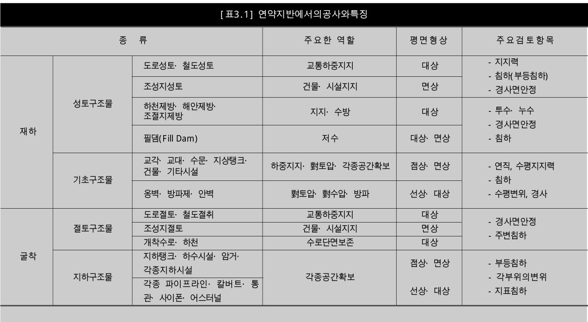  

3.2 기초구조물  

구조물의 기초지반은 구조물의 상재하중과자중및구조물에 작용하는 토압이나수압등에 의한연직, 수평하중및모멘트에의해파괴되거나부등침하, 수평변위등이발생하지않도록구조물을지지하여야한다  

# [그림3.2] 기초구조의종류  

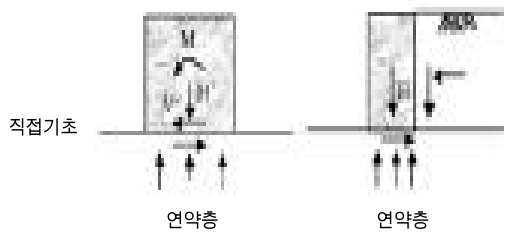  

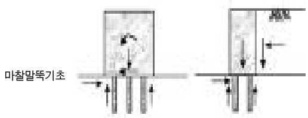  

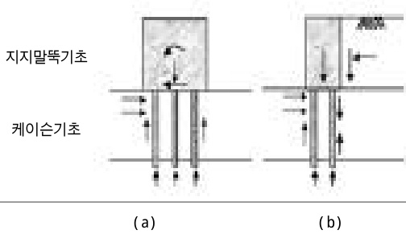  

연약지반에서는 구조물이 가벼워 다소의 변형에견딜수있는 구조를갖고, 연약지반의 층두께가 얇고, 특성도그다지나쁘지 않을때는직접기초를채택할수있다. 그러나대형구조물이나가해지는외력이큰구조물이고약간의침하밖에허용할수없는영구구조물일때는 마찰말뚝기초나견고한 지지층까지하중을 전달하는 지지말뚝이나 케이슨 기초형식을택해야한다.  

연약지반에서는 연직지지력이 작을뿐아니라수평지지력도 매우 작은것이 보통이다. 이때문에 그림( b )에서와 같이 토압을 받는 구조물은 경사, 측방변위등의치명적인피해를받는일이많으므로이에대한고려가있어야한다. 또한구조물의접지폭은연약지반의두께와비교하면대체로작은것이많기때문에 점상 좁은면상 선상 가는대상의 하중을 형성하므로넓은재하와다른특별한고려가필요하다.  

3.3 절토구조물및지하구조물  

도로 철도 등에는 연약지반을 절토한채로영구구조물로시공하는경우는 적고 있더라도 소규모 절토에한한다. 그러나새롭게 굴착하는하천이나수로에서는 상당한 연장에 걸친 연약지반내에 절토구조가형성되므로이경우에는세굴이나침투에대한경사면보호가필요하게된다.  

[그림3.3] 기조구조의종류  

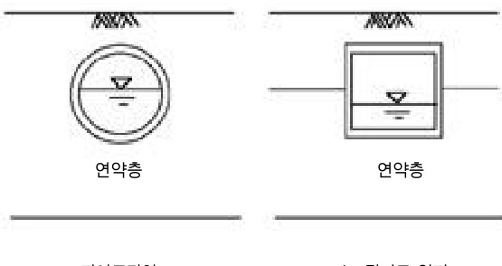  

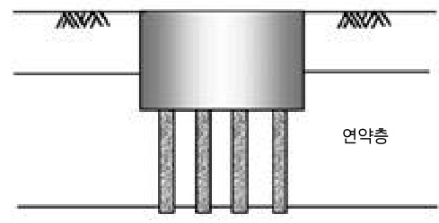  
(c) 지하탱크  

지하구조물로서는 지하탱크나 하수도시설각종파이프라인및칼버트등이있으며, 이와같은공사에서는 구조물의 부등침하나구조물 시공을위한가설적  

# [그림4.1] 연약지반에서공사시주요문제점  

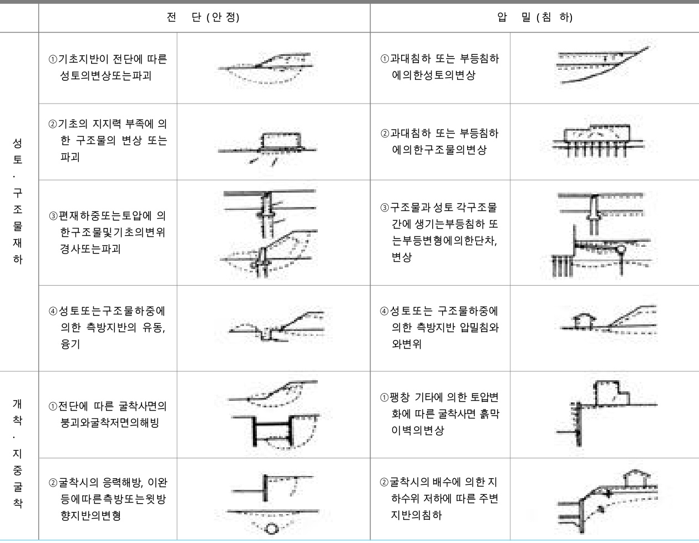  

인굴착공사가중요한검토대상이된다.  

4. 연약지반 공사에서 발생하는 문제점  

연약지반에있어서 공사중 발생되는토질공학상의  
문제는공사의종류, 시공되는성토나구조물등에따  
라여러가지로나타나지만크게연약지반위에구조물  
을재하할경우의문제와지반을굴착할경우의문제  
로나눠볼수있다.[그림4 . 1 ]은 연약지반에 있어서 공사의 주요문제  
점을정리하여나타낸것이다.또한연약지반에서는이상과같은분류에포함되지  
않은복잡한요인에의해 발생하는문제도많은데이  
중에서구조형식, 교통, 지진, 강우또는지하수등에  

# 관계하는문제를열거하면다음과같다.  

1. 구조물및기초에가해지는부마찰력에의한구조물의변위 침하  
2. 침식 세굴 침투수압및자중의증가등에따르는사면의변형과파괴  
3. 퀵샌드 파이핑등에의한사면및구조물의변화형태와파괴  
4. 지진에따르는지반의액상화, 강도저하에의한구조물의변화형태와파괴  
5. 광역지반침하의영향에의한구조물의부등침하와변화  
6. 교통하중 진동하중에의한지반의진동과주변의영향  
7. 지하수의수위 수량 수질의변화가주변환경에주는영향  

# 참고문헌  

1. 일본연약지반대책기술위원회,실용연약지반대책공법총기술상 하권 동화기술, 1995  
2. 천병식, 건설기술자를위한지반주입공법, 원기술, 1995  
3. 사단법인한국지반공학회, 지반공학시리즈6권, 연약지반,구미서관, 1997  
4. M. J. Tomlinson, Foundasion Design and Construction,새론, 1995  
5. 우기영역, 새로운연약지반처리공법 기술경영사, 1996  