# T e c h ni  c al  R e p ort  

# 연약지반의 이해 및 지반개량공법 (Ⅱ)  

이대동 토목기술부대리 02-3433-7775 ㅣE-mail ldd7775@mail.ssyenc.co.kr의공학적특성을적극적으로개선하려는것이라할수있다. 즉, 연약지반상에서는기초지반의공학적특성에의해 구조물의 규모등이 현저하게제약되는데, 지반개량공법은주어진자연지반의특성에적합한범위의구조물에 한정하지 않고 구조물에 적응할수 있도록무엇인가의방법으로지반의공학적성질을개선하여원하는구조물을구축하는것이라고할수있다.  

현재 우리나라는 좁은국도, 급격한산업화및지가의 급상승등의 요인들로 인해 연약지반상에서의지하굴착, 도로, 교량, 및대규모구조물축조등과같은각종건설공사가행하여지고 있으며, 이는계속증가하는 추세이다. 따라서, 요즘건설기술자가현장에서흔히접하는 단어가 “연약지반”이며, 대형 건설사고중 많은 부분이 연약지반에서 일어나고 있으므로건설기술자가진행중인 프로젝트를성공적으로수행하기위해서는연약지반의특성, 예상되는문제점및대책방안에 대한폭넓은이해가필수적이다. 금번에는연약지반의 특성및 문제점에 대하여 언급한전편에이어서, 현재 우리나라건설현장에서 많이 활용되고있는연약지반개량공법에대하여언급하고자한다.  

# 5.2 지반개량공법의원리  

지반개량공법의원리는기준에따라여러가지로분류될수있으나, 크게3가지로구분할수있다.즉, 연약지반을구성하는연약한흙을완전히제거하고 양질토를채워넣어 지반을 개량하는 치환공법, 연약토의함수비를 저하시키거나다짐등을 통해 견고한지반을 형성하는 밀도증대공법, 마지막으로 연약지반에화학적처리를통해연약토를단단하게고결시키므로서지반을개량하는고결공법으로분류될수있다.다음[표5.1], [표5.2], [표5 . 3 ]은 지반개량공법의원리및개요에대하여정리한것이다.  

1. 연약지반의정의  
2. 연약지반의구분  
3. 연약지반공사의종류및특징  
4. 연약지반공사에서발생하는문제점  
5. 연약지반개량공법5.1 개요5.2 지반개량공법의원리5.3 연약지반개량공법  
6. 맺음말  

# 5.3 연약지반개량공법  

# 5. 연약지반개량공법  

현재 수 많은 연약지반개량공법이 개발되어 있으나, 모든공법이현장에서활발하게사용되는것은아니다. 연약지반개량공법을 현장에 적용하기 위해서는 현장의 지반조건, 경제성, 작업성 및 공사기간등의 현장여건을 모두 만족시켜야하며, 이중한가지라도만족하지않는다면적용이어려운것이다. 따라서,  

5.1 개요연약지반개량공법은 한마디로기초지반이 되는흙  

[표5.1] 치환공법   

  

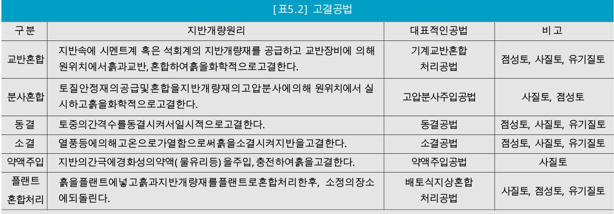  

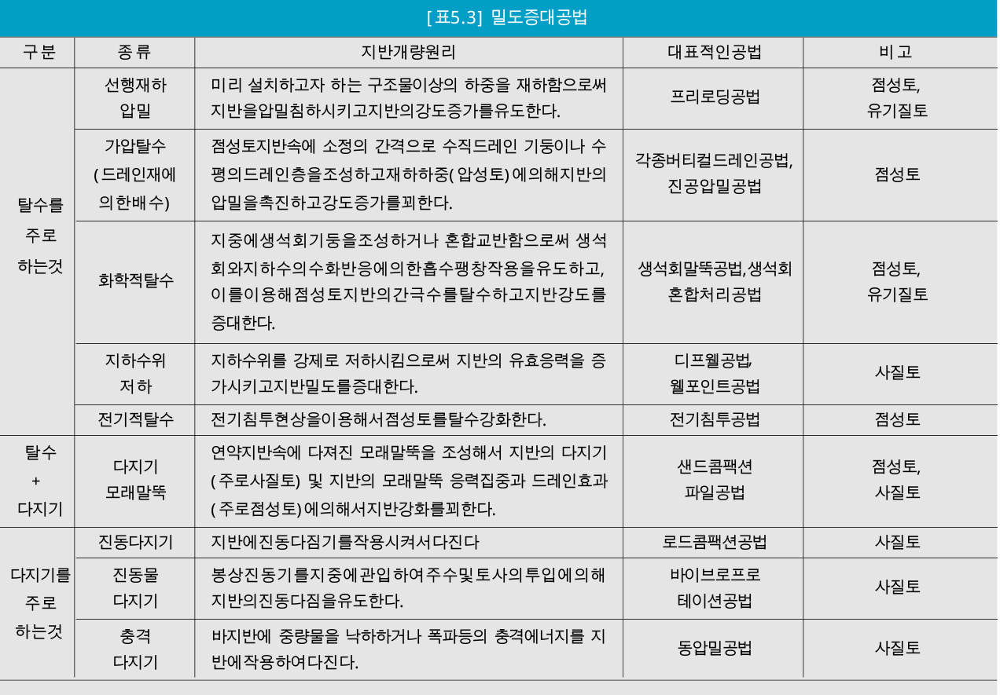  

# T e c h ni  c al  R e p ort  

개발된후거의사용되지않고사장되는공법도 있으며, 또한어떤 공법은 경제성 및 적용성이 뛰어나널리사용되는공법도있다.  

본절에서는상기공법들중에서현재우리나라에서시공실적이 많고 대표적인 몇가지 연약지반개량공법에대하여약술하고자한다.  

샌드드레인공법(SAND DRAIN)  

1. 공법개요및특징  

버티컬드레인의 일종으로 연약지반에 모래말뚝을조성함으로써 압밀배수를 촉진하여흙입자의 간격을좁히고 조기에 침하를 완성시켜 전단저항력을 증가시키는공법이다.  

버티컬드레인 공법 중 가장 널리 쓰이는 공법으로해상구조물, 항만구조물, 인공섬, 매립지, 택지조성성토, 도로, 간척지등의기초지반개량에쓰이고있다.  

# 2. 적용성  

압밀침하을 촉진하고 지반강도를 증대하여 연약지반을개량하는 공법으로 점성토지반에 적용한다. 통상 육상에서 G L - 4 5 m까지, 해상에서는 수면아래50m 정도까지시공이가능하다.  

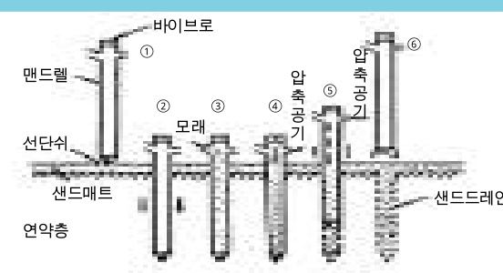  
[그림5.1] 샌드드레인시공순서  
(1) 바이브로식  

  
(2) 오거식  

현재 많이 적용되는 샌드드레인 시공법은 크게 바이브로식, 워터제트식, 오거식으로나눌수있으며, 그중바이브로식의시공순서는다음과같다.  

# 3. 시공순서  

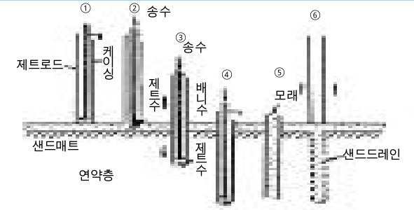  
(3) 워터제트식  

$\circled{2}$ 바이브로햄머를가동하여규정깊이까지케이싱파이프를관입  

$\circled{3}$ 스킵버킷으로속채움모래를파이프속으로투입$\circled{4}$ 모래면꼭대기까지무게추를내려모래의양을확인케이시파이프손으로암추곡기를보H면서바이브\* 샌드콤펙션 파일공법(Sand Compaction Pile)1. 공법개요  

샌드 콤펙션 파일공법은 1 9 5 0년대에 일본에서개발되어 드레인공법과 같이 많은 현장에서 적용되고있다. 이공법은모래또는점토로된연약지반에서지반에 강관을 관입시켜서 강관안에 모래를 투입하고진동 또는충격에 의해 다진 모래 말뚝을지반 속에조성하는 공법이다. 샌드콤펙션 파일공법은 사질지반과점성토지반에모두적용되는장점이있다.사질지반에서는 항타시 진동에 의하여 다짐효과를얻을수 있으며지지력증가, 압축침하저감, 액상화방지, 수평저항의 증가효과가있고, 점성토지반에서는지지말뚝으로서의 작용과 배수드레인 기능, 지지력증가, 압밀시간단축, 압밀침하량저감의효과가있다.  

2. 치환율과모래말뚝간격  

(1) 치환율(as)은원지반을1 . 0으로 할경우모래말뚝의 체적비율로 개량한 정도를 나타내는 지수로일반적인치환율은다음과같다.사질토나육상의점성토의개량: 0.4 이하, 해저의점성토: 0.15  
(2) 모래말뚝은정방형이나삼각형및구형으로치환율(as)은다음식에의해산정한다.$0\forall{\mathcal{I}}|{\mathcal{A}}|\,\mathsf{A}_{s}$ : 모래말뚝 단면적, A : 모래말뚝1개가분담하는면적, χ: 파일피치정방형, 구형배치: $a_{s}=\frac{A_{s}}{A}=\frac{A_{s}}{x^{2}}$ 또는 $\frac{A_{s}}{x_{1}\times x_{2}}$정삼각형배치: $a_{s}=\frac{A_{s}}{A}=\frac{2}{3}\times\frac{A_{s}}{x^{2}}$  

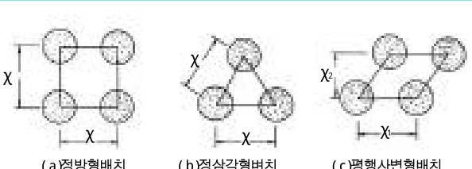  

(3) 모래말뚝의 단면적은 지반조건, 시공기계의 능력, 주변환경에 미치는 영향을 고려하여 결정되며일반적인값은다음과같다.육상공사의모래말뚝지름: 60cm - 80cm(표준7 0 c m )해상공사의 점성토개량: 100cm 200cm(표준1 6 0 c m또는2 0 0 c m )해상공사의사질지반개량: 80cm $\sim$ 120cm 가일반적이고, 최근육상공사에서시공시의진동,소음을저감하기위하여35 - 45cm로하는경우도있다.  

3. 시공방법및시공장비  

(1) 샌드콤펙션 파일공법의 시공방법은 되치기다지기방식, 선단확경다지기방식, 선단진동다지기 방식이있으며각방식의특징은다음표와같다.  

# [표5.4] Sand Compection Pile 의시공방식  

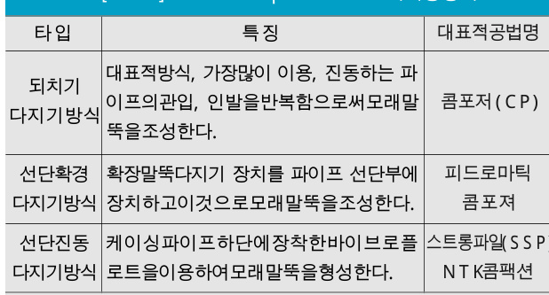  

(2) 육상공사에서는 Ø $400{\sim}~500~\mathrm{mm}$ 의 케이싱파이프를이용하여 $\varnothing\,700~\mathsf{m m}$ 정도의모래말뚝을해상공사에서는Ø 800\~ 1200 mm 의 케이싱파이프로 $\emptyset\,1000\sim2000\ \mathrm{mm}$ 의 모래말뚝을형성한다. 모래말뚝과 케이싱파이프 지름의 비는1 . 3 \~ 2 . 배0의범위로하는것이일반적이다.  

# [그림5.2] 각방식의시공순서  

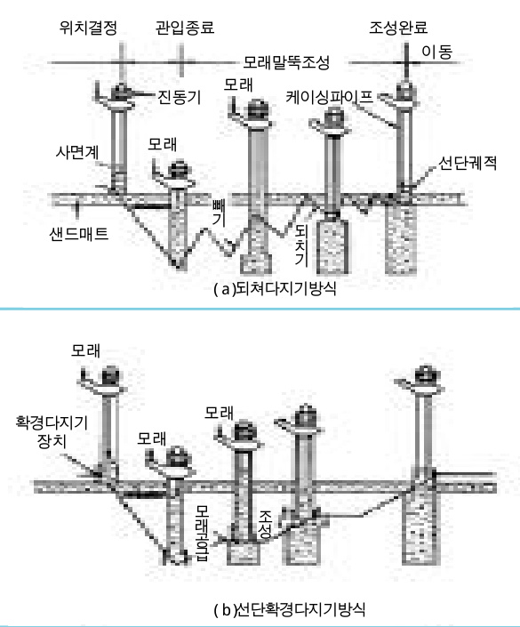  

# T e c h ni  c al  R e p ort  

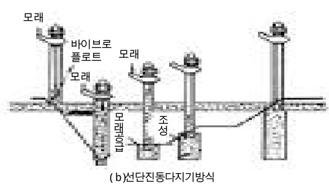  
[그림5.3] 해상작업선시공장비  

로시공되었는지확인이쉽고시공관리가용이함.(5) 소구경으로 타설하므로 모래의 사용이 격감되어경제적이다.  

(6) 시공장비가4공을한번에타설할수있으므로공기가단축된다.  

# 2. 적용성  

  

\* 팩드레인공법(PACK DRAIN)  

점성토지반, 실트, 유기질토지반에 적용하며, 통상${\sf G L-30}\;{\sf m77}|\overline{{x}}|$ 시공하고 최대G L - 4 0 m정도까지 시공이가능하다.  

1. 공법개요및특징  

# 3. 시공순서  

케이싱근입 $\rightarrow$ 케이싱에망태삽입 $\rightarrow$ 모래의충전(호퍼 속의모래를 바이브로 헤머의진동에 의하여 4개 동시에 모래를충전) $\rightarrow$ 케이싱뽑아내기 $\rightarrow$ 팩드레인형성완료  

# [그림5.4] 팩드레인시공순서  

팩드레인공법은샌드드레인공법의결함인가운데  
가 잘룩해지거나 절단되는 문제를 개선하기 위하여  
강인한 합성섬유 자루에 모래를 채워서 배수드레인  
을 형성하여 압밀침하를 촉진하고 지반강도를 개량  
하는공법이다.  
(1) 폴리에틸렌제의 망태에 모래를채우므로 모래기둥에충분한휨성이있다.  
(2) 모래기둥이 망태로 보호되므로 절단되는일이 없고연속된배수기둥을유지할수있다.  
(3) 직경은 1 2 c m로 소구경이지만 타설후 직경의감소도없고투수효과감소가적다.  
(4) 타설후드레인머리가지표에노출되므로설계대  

  

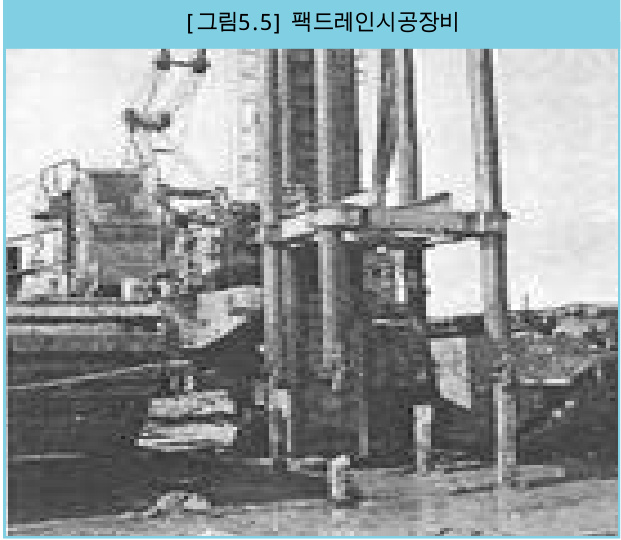  

  

| 페이퍼드레인 공법(PAPER DRAIN)  

1. 공법개요  

페이퍼드레인공법은샌드드레인공법과같은원리에의하여연약점성토지반의압밀침하를촉진하고지반의강도를증가시키는공법의일종이다. 단, 지반교란이큰모래기둥 대신 투수성이 큰 공장제작 드레인보드( P A P E R를 )지반에압입하여배수드레인을형성한다.  

# 2. 공법특징및적용성  

(1) 드레인보드를 지반에 직접 압입하므로 천공홀이필요없고시공속도가빠르며지반교랑이적다.  
(2) 시공장비및작업공정이단순하여시공성이우수하고공사비가가장저렴하다.  
(3) 드레인보드가 공장생산이므로 품질이 균질하고재료의신뢰성이높음  
(4) 타설후드레인 머리가지표에노출되므로설계대로시공되었는지확인및시공관리가용이함.  
(5) 드레인보드압입 Rod 인발시 드레인보드 공상의우려가있고, Clogging현상에 의해 시간이 경과할수록배수기능이저하  
(6) 초연약 점성토 지반에 적용하며 G L - 3 5 . 0 까m지시공이가능하다. 주로호안기초지반의강도증대나매립지반의압밀침하촉진에이용된다.  

# 3. 시공순서  

소정의 위치에 장비거치 $\rightarrow$ 드레인보드압입 $\rightarrow$ 드레인보드절단 $\rightarrow$ 압압Rod 인발 $\rightarrow$ 지중에페이퍼(배수)드레인형성  

# [그림5.6] 페이퍼드레인시공순서  

  

4. 드레인보드  

드레인보드는 주로 연약한 해성점성토층에 관입되므로 소정의 인장강도, 투수계수 $(\,1\,0^{-1}\,\sim\,\,\,1\,0^{-2}$cm/sec), 토중의굽힘, 측압, 변형과같은물리특성과내산, 내알카리성등과같은 화학적 특성을 만족하는재료를 선택하여야 한다. 일반적으로 사용되고있는드레인보드의예와규격은 $\neg\neg$ 림5 . 7 > <표5 . 5 >과같다.  

[그림5.7] 드레인보드의단면도  

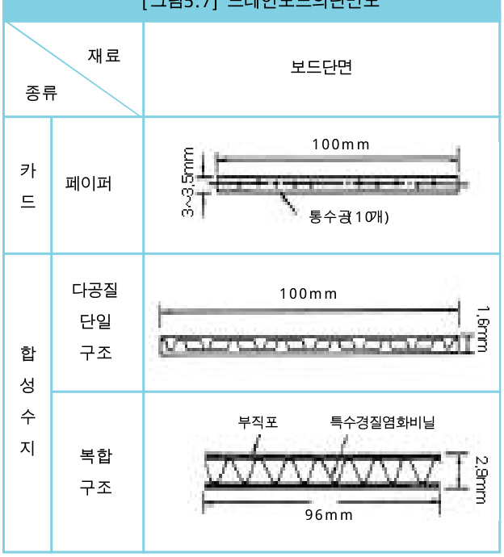  

# T e c h ni  c al  R e p ort  

# [표5.5] 카드보드규격예  

하여널리사용되고있다.  

# [그림5.12] 폭파치환공법  

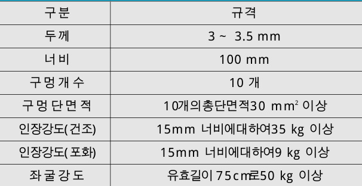  

| 동다짐공법(중추낙하공법)  

1. 공법개요  

강재혹은콘크리트중추(10\~ 50 ton)를크레인등에의해매달아 $\cdot9510\mathsf{m}\sim30\mathsf{m}$ 높이에서지표면으로반복낙하시켜그때에지표면에가해지는충격력과발생하는지반진동으로지반을심층부까지압축, 강화하는지반개량공법이다. 1960년대부터사질토, 자갈모래층, 전석혼합토, 도시폐기물층등넓은범위의지반에적용되고있다.  

# 2. 공법특징및용도  

깊이및직경의측정 $\rightarrow$ 타격공의되메우기및정지작 업 $\rightarrow$ 정지후의측량 $\rightarrow$ 지반개량완료  

(1) 지표면에 충격에너지를 주어 다짐하는 공법이므로 자갈혹은 전석혼합토, 폐기물등의 지반에 대하여도적용성이좋다.  
(1) 개량에 특별한 원료, 재료를 사용하지 않으므로대단히경제적이다.  
(3) 시공과동시에 개량효과를 얻을수 있고, 시공중에계측및 시험을실시하므로즉시개량효과확인이가능하다.  
(4) 탱크기초, 건물기초, 택지조성, 도로, 공항활주로및폐기물처리장등에주로이용된다.  

#  

# 3. 시공순서  

  

위치측량 $\rightarrow$ 던핑공(중추낙하 다짐) $\rightarrow$ 타격공의  

# $[\exists\Xi|5.8]$ 동다짐공시공순서  

  
본던빙의흐름  
[그림5.9] 프론트앵커방식에의한시공상황  

\* 치환공법  

1. 공법개요  

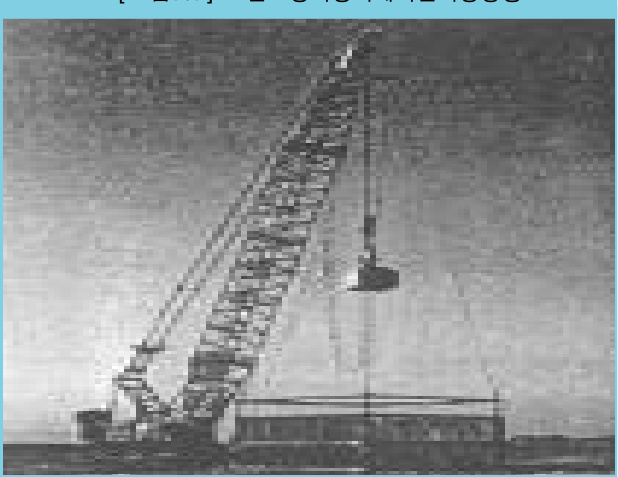  

치환공법은연약지반상에서구조물의침하및안정에문제가되는연약층을제거하고양질토(수침에의해서도지지력이 저하되지 않는 모래등의 조립토)와바꿔넣는 공법이다. 치환공법은 치환단면에 따라전층치환과 부분치환으로 시공방법에 따라, 굴착치환과강제치환으로나눌수있다.  

2. 공법특징및적용분야(1) 개량원리가명확하여비교적중요한구조물에대(2) 철도성토, 도로성토, 하천방파제나 항만공사에서안벽, 방파제, 호안등의공사에이용된다.  

3. 굴착치환공법  

굴착장비를 이용하여 연약토를 지반개량이 필요로하지않는 깊이까지 양질토로 메우는 공법이다. 연약층의두께가3 m이하는확실한효과를얻을수있다.  

# [그림5.10] 굴착치환공법시공도  

  

4. 강제치환공법  

본 공법은 연약토를굴착하지 않고제거 혹은배제하는공법으로성토자중강제치환, 폭파치환이있다.  

# [그림5.11] 성토자중강제치환공법  

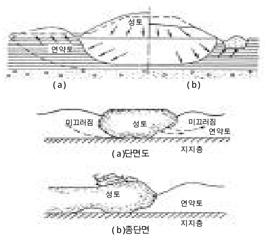  

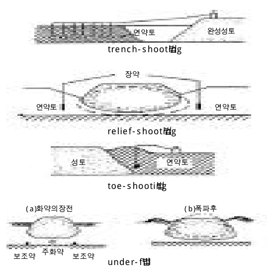  

# 6. 맺음말  

2회에 걸쳐 연약지반의 정의, 구분, 연약지반공사의특징과문제점및개량공법등연약지반전반에대하여언급하였는데, 상기내용이 연약지반상에서프로젝트를수행하고있는 현장기술자에게 미력하나마도움이될수있기를바란다.  

# 참고문헌  

일본연약지반대책기술위원회, “실용연약지반대책공법총기술상,  
하권”, 동화기술, 1995  
천병식, “건설기술자를위한지반주입공법”, 원기술, 1995  
⃞사단법인한국지반공학회, “지반공학시리즈6권, 연약지반”, 구미서  
관, 1997  
⃞M. J. Tomlinson, “Foundasion Design and Construction,”  
새론, 1995  
⃞우기영역, “새로운연약지반처리공법”, 기술경영사, 1996  