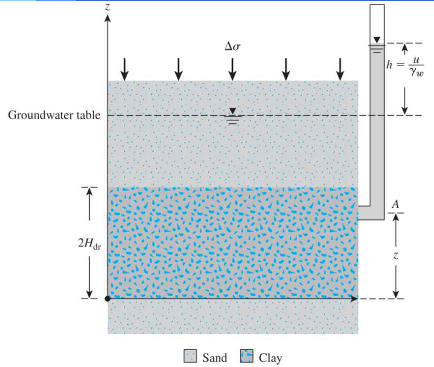

# Compressibility of Soil  

Chapter 11  

동신대학교 토목공학과 지반공학연구실  

# 1. Elastic Settlement  

탄성침하 또는 즉시침하 (Elastic or Immediate settlement)  

함수비에 변화없이 유발되는 탄성변형  

탄성론에서 유도된 방정식  

1차 압밀침하 (Primary Consolidation Settlement)  

포화된 점성토의 간극물의 배제에 따른 체적변화  

2차 압밀침하 (Secondary Consolidation Settlement)  

점착력이 있는 포화토에서 관찰흙입자배열의 소성변형유효응력하에서 일어나는 압축의 한형태  

# 1.1 Elastic Settlement (clay)  

# 접촉면적의 침하형상  

기초의 유연성  

기초를 받치는 재료  

점토층  

연성기초와 강성기초  

  

  

# 1.2 Elastic Settlement (sand)  

# 접촉면적의 침하형상  

기초의 유연성  

기초를 받치는 재료  

모래층  

연성기초와 강성기초  

  
a  

  

# 1.3 Elastic Settlement Calculation  

# 탄성침하량 계산  

탄성이론의 원리 (Schleicher, 1929)  

$$
{\mathrm{S}}_{\mathrm{e}}=\Delta\sigma{\mathrm{B}}\frac{1-\upmu_{s}^{2}}{{\mathrm{E}}_{s}}\,\mathrm{I}_{\rho}
$$  

$\mathsf{S}_{\mathsf{e}}=$ 즉시침하  

  

Ds = 순압력$\mathsf{B}=\mathsf{2}\,|$ 초의폭ms = 흙의 포아송비E $=$ 흙의 탄성계수Ir = 무차원 영향계수  

# Chapter 11  

# 2. Consolidation Settlement  

# 압밀의 근본원리  

사질토  

간극의 배수가 빠름  

탄성, 압밀침하 동시  

점토층  

하중에 의한 과잉간극수압  

탄성침하  

즉시 발생  

체적변화(압밀침하)  

오랜 시간에 걸쳐진행  

  

  

# 2.1 Clay layer drained at top and bottom  

  

  
6 At time $t=0$  

# 배수되는 점토층의 응력  

전응력, 간극수압, 유효응력 시간에 따른 응력변화들  

  
At time $0<t<\infty$  

  
d At time $t=\infty$  

# 2.2 Terzaghi 압밀 이론  

# 1차원 압밀시험을 위한 가정  

1) 흙은 균질하다.  

2) 흙은 완전포화이다.  

3) 토립자와 물은 비압축성이다.  

4) 압축과 물의 흐름은 1차원(수직)이다.  

5) 흙의 변형은 아주 작다.  

  
Porous stone Soil specimen Specimen ring  

6) 수리학적 경사는 Darcy’s law 를 따른다.  

7) 투수계수와 흙의 체적압축계수 압밀 동안 상수이다.  

8) 간극비와 유효응력의 관계는 시간흐름에 영향받지 $\frac{\Delta}{\Delta}\!\equiv\!\sum\Delta\!\!\!\!$ .  

# 2.3 1차원 압밀시험  

# Oedometer  

압밀시험기  

금속제 링(ring)  

2개의 다공질판  

마이크로 다이얼게이지  

레버 $\ Q$ (lever arm) 하중  

  

  

# 2.4 압밀곡선  

# 하중에 따른 압밀 3단계 (I, II, III)  

Loading, unloading, and reloading: 간극비(e) vs. 유효응력 $(\sigma^{\prime})$  

  

Stage I: Initial Compression $\sqsubset$ Stage II: Primary consolidation Stage II: Secondary Consolidation  

  

# 2.5 간극비-압밀압력 곡선  

# 실내시험에서 각 하중에 대한 시간-변형 곡선하중에 따른 간극비의 변화  

$^{1)}$ 시료에서 흙의 높이Hs 계산 $H_{s}={\frac{W_{s}}{A G_{s}r_{w}}}={\frac{M_{s}}{A G_{s}\rho_{w}}}$   
2) 간극의 초기높이 $\mathsf{H}_{\mathsf{v}}$ 계산 $H_{v}=H-H_{s}$   
3) 시료의 초기간극비 ${\bf e}_{0}$ 계산 $e_{0}=\frac{V_{v}}{V_{s}}=\frac{H_{v}}{H_{s}}\frac{A}{A}=\frac{H_{v}}{H_{s}}$ Specimen area $=A$ Void 표 Solid   
4) $\Delta H_{1}\underline{{\circ}}|$ 변형을 일으키는 초기 증가하중 $\pmb{\sigma_{1}0}\|$ 대한 간극 변화 $\Delta e_{1}$ 계산 $\Delta e_{1}=\frac{\Delta H_{1}}{H_{s}}$   
5) 하중 증가량에 의한 압밀 후 새로운 간극비 계산 $e_{1}=e_{0}-\Delta e_{1}$  

# 2.6 간극비-압밀압력 곡선  

\* 에 의해 추가 변형 ∆가 발생되며, 압밀 후 간극비 는 다음과같이 계산된다.  

  
Effective pressure $\sigma^{\prime}$ Jog scale  

  

# 3. 정규압밀점토와 과압밀점토  

정규압밀(normally consolidation) 상태  

현재 받고 있는 유효상재압력이 과거에 받았던 최대압력인경우  

과압밀(overconsolidation) 상태  

현재 받고 있는 유효상재압력이 과거에 받았던최대유효상재압력보다 작은 경우이다. 과거에 받았던최대유효압력을 선행압밀압력이라 한다.  

$$
O C R=\frac{\sigma_{c}^{\prime}}{\sigma^{\prime}}
$$  

× $\sigma_{c}^{\prime}=\lambda|$ 료의 선행압밀압력× $\sigma^{\prime}=$ 현재의 유효토층압력  

# 3.1 선행압밀압력결정  

# Casagrande(1936)의 실내 e-logs’ 곡선에서 $\pmb{\sigma}_{c}^{\prime}$ 결정 작도법  

육안관찰로 최소곡률반경을 갖는 elogs¢ 곡선상의 점 a를 결정한다  

2) 수평선 ab를 긋는다  
) 점 a에서 접선 ac를 긋는다각 bac의 이등분선 ad를 긋는다  
) e-logs¢ 곡선의 직선부 gh를 연장하여이등분선 ad와 만나는 점을 f라고 하면,점f의 횡좌표 값은 선행압밀압력 $\sigma_{c}^{\prime}0|$된다  

  
Pressure $\sigma^{\prime}$ Jog Scale  

# 3.2 간극비-압밀압력 관계에서 교란의 영향  

# 낮거나 보통정도의 예민비를 가진 정규압밀점토  

처녀압축곡선(virgin compression curve)  

곡선 $2\Xi$ 실내시험을 통해 얻은 e-logs¢곡선이다. 이 곡선에서 선행압밀압력$\sigma_{c}^{\prime}=\sigma_{0}^{\prime}$ (현재 유효상재압력)을 결정한다.$\sigma_{c}^{\prime}=\sigma_{0}^{\prime}\mathbf{\boldsymbol{Q}}|$ 점을 알고 연직선 ab 긋는다  

2) 현장에서의 간극비 $e_{0}$ 를 계산한다 수평선cd를 긋는다  
3) $0.4e_{0}$ 를 계산하고 선 ef를 긋는다  
$4)$ 점 $\mathsf{f}\mathsf{\Omega}_{2}|$ g를 연결하고, g는 선 ab와 선 cd의교점이다.  
5) 만일 흙이 완전히 재성형되었다면, e-logs¢곡선의 일반적인 위치는 곡선3과 같이나타날 수 있다.  

  
Pressure $\sigma^{\prime}$ Jog scale  

# 3.3 간극비-압밀압력 관계에서 교란의 영향  

# 낮거나 보통정도의 예민비를 가진 과압밀점토  

1) 곡선 2는 하중재하(loading)에 의한실내시험 e-logs¢ 곡선이고, 곡선 $3\Lleftarrow$하중제거(unloading)에 의한 실내시험곡선.곡선 2에서 선행압밀압력 $\sigma_{c}^{\prime}$ 를 결정하고연직선 ab를 긋는다.  

2) 현장의 유효상재압력 $\sigma_{0}^{\prime}$ 을 결정하고연직선 cd를 긋는다.  

3) 현장에서의 간극비 $e_{0}$ 를 구하고 수평선fg를 긋는다. 선 fg와 선 cd의 교점은 h이다  

$4)$ 실제적으로 직선인 곡선3과 평행한 선 hi를긋는다. 선 fg와 선 ab의 교점은 j이다.  

5) 점j와 점k를 연결하라. 점 k는 곡선 2상에 있고, 이것의 횡좌표는 $0.4e_{0}\ 0|\tau$ .  

  
Pressure $\sigma^{\prime}$ Jog scale  

# 3.4 1차원 1차 압밀침하량 계산(정규압밀)  

(compression index)는  − log ′곡선의 기울기이다.  

$V_{s}=\frac{V_{0}}{1+e_{0}}=\frac{A H}{1+e_{0}}\;,\;\;\;\;\;\;\Delta\mathrm{V}=S_{c}A=\Delta e\;V_{s}=\frac{A H}{1+e_{0}}\Delta\epsilon$  

  
Soil Void Solid  

$S_{c}=H\frac{\Delta e}{1+e_{0}}\;,\quad\Delta e=C_{c}[\log(\sigma_{0}^{\prime}+\Delta\sigma^{\prime})-b g\,\,\,\sigma_{0}^{\prime}]\;,\quad\;\Delta\,e=c_{c}[\log(\sigma_{0}^{\prime}+\Delta\sigma^{\prime})-b g\,\,\,\sigma_{0}^{\prime}]\;,\quad\;\,$ $C_{c}[\log(\sigma_{0}^{\prime}+\Delta\sigma^{\prime})-b g\sigma\ \sigma_{0}^{\prime}]\ ,\quad\therefore S_{c}{=}\,\frac{C_{c}H}{1+e_{0}}\log\left(\frac{\sigma_{0}^{\prime}+\Delta\sigma^{\prime}}{\sigma_{0}^{\prime}}\right)$  

# 3.5 압축지수() 와팽창지수()  

$\%$ 과압밀점토 $(\sigma_{0}^{\prime}+\Delta\sigma^{\prime}\le\sigma_{c}^{\prime})...\phantom{~}\quad\therefore S_{c}\!=\!\frac{C_{s}H}{1+e_{0}}\mathrm{log}\left(\frac{\sigma_{0}^{\prime}+\Delta\sigma^{\prime}}{\sigma_{0}^{\prime}}\right)$  

$$
(\sigma_{0}^{\prime}+\Delta\sigma^{\prime}>\sigma_{c}^{\prime})...\quad:S_{c}{=}\frac{C_{s}H}{1+e_{0}}\mathrm{log}\frac{\sigma_{c}^{\prime}}{\sigma_{0}^{\prime}}{+}\frac{C_{s}H}{1+e_{0}}\mathrm{log}
$$  

  

팽창지수는 $C_{s}$ (swell index)는 압축지수보다상당히 작고, 일반적으로 실내시험결과로부터 그 값을 얻을 수 있다.  

$$
C_{s}\approx\ \frac{1}{5}\;\sim\;\frac{1}{10}\,C_{c}
$$  

# 3.6 Example  

하중 $\Delta\sigma\supset\dagger$ 지표면에가해진다면 1차압밀로 인한 점토층의 침하량은 얼마인가?(점토는 정규압밀상태, $\begin{array}{r}{\sigma_{c}^{\prime}=190\mathsf{k N}/\mathsf{m}^{2},\,C_{s}\approx\frac{1}{6}C_{c})}\end{array}$  

2 선행압밀하중 $(\sigma_{c}^{\prime}){=}190\mathsf{k N}/\mathsf{m}^{2}\ \underbar{\Omega}{\in}\$ 침하량은? (Skempton(1944)의 불교란 점토의 압축지수 경험식; $C_{c}=0.009(L L-10)$ 사용하라)  

  
Ao = 100 kN/m?   
Sand Clay  

# 4. 2차 압밀침하량  

1차 압밀 종료시(즉, 과잉간극수압이 완전히 소산된 후) 약간의침하가 흙구조의 소성재배열 대문에 일어난다.  

$$
\therefore S_{s}{=}\,C_{\alpha}^{\prime}H\log\left(\frac{t_{2}}{t_{1}}\right)
$$  

$$
C_{\alpha}^{\prime}=\frac{C_{\alpha}}{1+e_{p}}
$$  

  

$C_{\alpha}=2$ 차 압축지수  

$\Delta e=$ 간극비의 변화  

$$
t_{1},t_{2}=\lambda|\,\mathcal{Z}^{\flat}
$$  

$H=$ 점토층의 두께  

$e_{p}{=}\;1$ 차압밀 종료시의  

# 4.1 압밀중 점토층에서 물의 흐름  

  

  

$$
\frac{\partial v_{z}}{\partial z}d x\ d y\ d z=\frac{\partial V}{\partial t}
$$  

Darcy의 법칙을 사용하면,  

$$
v_{z}=k i=-k\frac{\partial h}{\partial z}=-\frac{k}{\gamma_{w}}\frac{\partial V}{\partial t}
$$  

$$
\therefore-{\frac{k}{\gamma_{w}}}{\frac{\partial^{2}u}{\partial z^{2}}}={\frac{1}{d x~d y~d z}}{\frac{\partial V}{\partial t}}
$$  

$u=$ 응력증가로 인해 발생된 과잉간극수압 $e_{0}=$ 초기 간극비  

$$
\therefore-\frac{k}{\gamma_{w}}\frac{\partial^{2}u}{\partial z^{2}}=\frac{1}{1+e_{0}}\frac{\partial e}{\partial t}
$$  

# 4.2 압밀중점토층에서 물의 흐름  

  

$\partial e=a_{v}\partial(\Delta\sigma^{\prime})=-a_{v}\partial u$  
$-{\frac{k}{\gamma_{w}}}{\frac{\partial^{2}u}{\partial z^{2}}}=-{\frac{a_{v}}{1+e_{0}}}{\frac{\partial u}{\partial t}}=-m_{v}{\frac{\partial u}{\partial t}}$$c_{v}={\frac{k}{\gamma_{w}m_{v}}}={\frac{1}{\gamma_{w}\left({\frac{a_{v}}{1+e_{0}}}\right)}}$$\%$ $\begin{array}{r l}&{a_{v}=\cup\!\!\!\!\slash\!\!\!\!\leq\!\!\!\!\!\slash\!\!\!\!\!\leq\!\!\!\!\!\!\slash\!\!\!\!\!\!\slash\!\!\!\!\!\!\leq\!\!\!\!\!\!\!\slash\!\!\!\!\!\!\!\slash\!\!\!\!\!\!\!\leq\!\!\!\!\!\!\!\!\slash\!\!\!\!\!\!\!\!\slash\!\!\!\!\!\!\!\!\slash\!\!\!\!\!\!\!\!\slash\!\!\!\!\!\!\!\!\leq\!\!\!\!\!\!\!\!\slash\!\!\!\!\!\!\!\!\slash\!\!\!\!\!\!\!\!\leq\!\!\!\!\!\!\!\!\!\slash\!\!\!\!\!\!\!\!\!\slash\!\!\!\!\!\!\!\!\!\slash\!\!\!\!\!\!\!\!\!\leq\!\!\!\!\!\!\!\!\!\!\slash\!\!\!\!\!\!\!\!\!\leq\!\!\!\!\!\!\!\!\!\!\!\slash\!\!\!\!\!\!\!\!\!\leq\!\!\!\!\!\!\!\!\!\!\!\!\slash\!\!\!\!\!\!\!\!\!\leq\!\!\!\!\!\!\!\!\!\!\!\!\!\!\!\leq\!\!\!\!\!\!\!\!\!\!\!\!\!\!\!\!\!\!\!\!\!\!\!\!\!\!\!\!\!\!\!\!\!\!\!\!\!\!\!\!\!\!\!\!\!\!\!\!\!\!\!\!\!\!\!\!\!\!\!\!\!\!\!\!\!\!\!\!\!\!\!\!\!\!\!\!\!\!\!\!\!\!\!\!\!\!\!\!\!\!\!\!\!\!\!\!\!\!\!\!\!\!\!\!\!\!\!\!\!\!\!\!\!\!\!\!\!\!\!\!\!\!\!\!\!\!\!\!\!\!\!\!\!\!\!\!\!\!\!\!\!\!\!\!\!\!\!\!\!\!\!\!\!\!\!\!\!\!\!\!\!\!\!\!\!\!\!\!\!\!\!\!\!\!\!\!\!\!\!\!\!\!\!\!\!\!\!\!\!\!\!\!\!\!\!\!\!\!\!\!\!\!\!\!\!\!\!\!\!\!\!\!\!\!\!\!\!\!\!\!\!\!\!\!\!\!\!\!\!\!\!\!\!\!\!\!\!\!\!\!\! $$\%$  
$:u=\sum_{m=0}^{m=\infty}\left[{\frac{2u_{0}}{M}}\sin\left({\frac{M\,z}{H_{d r}}}\right)\right]e^{-M^{2}T_{v}}$∴ $T_{v}=\frac{c_{v}t}{H_{d r}^{2}}=\lambda]$ 간계수  

# 4.3 시간계수T에 대한 평균압밀도 U (%)  

  

  
$\begin{array}{r}{u_{0}=\frac{2|}{\mathbf{\sigma}\cdot\mathbf{\sigma}}0|\,0||}\end{array}$ 따라 일정하다  

Different types of of drainage With $u_{O}$ constant  

# 4.4 평균압밀도 U (%) & 시간계수T  

  

# 4.5 Example  

Oedometer 시험기로 점토층(양면배수)이 50% 압밀되는데 2분20초가 걸렸다.만약 암반층 위에3m의 점토층이 동일한 조건으로 있다면 50% 압밀이일어나는데 걸리는 시간은 얼마인가?  

2. 위 실내시험에서 현장에서 압밀도가 $30\%$ 되는데 걸리는 시간을 계산하라.  

# 5. 압밀계수  

 (coefficient of consolidation): 액성한계가 증가함에따라 감소한다.  

시료에 가해진 하중 증가에 따른 두 가지 도해법이 실내1차원 압밀시험에서 압밀계수를 구한다.  

log $\pmb{\ell}$ 법 (Casagrande and Fadum, 1940) $\sqrt{t}$ 법 (Taylor, 1942) 쌍곡선법 (Sridharan and Prakash, 1985) 초기단계 t법 (Robinson and Allam, 1996)  

# 5.1 log t 법 (압밀계수결정)  

# cv 결정을 위한 작도법  

1) 1차 압밀곡선과 2차 압밀곡선의 직선구간을 연장한 교점 A의 종좌표는 $\mathsf{d}_{100}=1$ 차압밀 $100\%$  

2) log t 에 대한 초기곡선구간 위에서$t_{2}{=}4t_{1}011$ 서 $\mathbf{t}_{2}$ 선택, 시간 $(t_{2}-t_{1})$ 동안의시료변형의 차이 $\pmb{\mathrm{x}}$  

3) 연직거리 BD가 $\times\textcircled{2}$ 같도록 수평선DE를 긋는다. 선DE에 상응하는 변형${\sf d}_{0}=\sf{Q}_{1}$ 밀변형 ${\mathfrak{0}}\%$  

$^{4)}$ 압밀곡선에서 F의 종좌표는 1차압밀의$50\%$ 변형이며, 횡좌표는 시간 $\mathbf{t}_{50}$  

$^{5)}$ 평균압밀도 $50\%$ 일때, $\mathbf{T}_{\mathbf{v}}{=}\mathbf{0}.197$  

  
Time log scale  

$$
T_{50}=\frac{c_{v}t_{50}}{H_{d r}^{2}}\qquad:c_{v}=\frac{0.197H_{d r}^{2}}{t_{50}}
$$  

$H_{d r}\!\stackrel{\textstyle\odot}{=}\,\stackrel{\textstyle\circ\!\vdash}{=}$ 동 $\mathsf{Q}\models\mathsf{Q}\parallel$ 최대평균배수길이  

# 5.2 법(압밀계수결정  

# cv 결정을 위한 작도법  

) 곡선의 초기구간을 통과하는 선AB를긋는다.  

2) $\overline{{\pmb{O}\pmb{C}}}=\bf1$ .  $\overline{{\mathbf{\nabla}\!\sigma B}}$ 가 되도록 선 AC를긋는다. 점 D의 횡좌표는 압밀곡선과AC선의 교점이고, $\pmb{90\%}$ 압밀에 대한 $\sqrt{t}$값  

$\pmb{90\%}$ 압밀일 때, $\begin{array}{r}{T_{90}=0.848\,\,\,0|\,\complement|.}\end{array}$ |  

$$
T_{90}\,=\,0.848=\frac{c_{v}t_{90}}{H_{d r}^{2}}\,\quad\,\therefore\,c_{v}=\frac{0.848H_{d r}^{2}}{t_{90}}
$$  

  

# 5.3 Example  

Q: 정방형 기초가 작용하고 있을때, 정규압밀점토층의 압밀침하량을 구하여라.  

(가중평균법을 사용하여 점토층 내의 유효응력 평균증가량을 계산하라)  

  

$$
\Delta\sigma_{a v}^{\prime}=\frac{\Delta\sigma_{t}^{\prime}+4\Delta\sigma_{m}^{\prime}+\Delta\sigma_{b}^{\prime}}{6}
$$  

$$
S_{c}=\frac{C_{c}H}{1+e_{0}}\mathrm{log}\left(\frac{\sigma_{0}^{\prime}+\Delta\sigma_{a v}^{\prime}}{\sigma_{0}^{\prime}}\right)
$$  

# 5.3 등분포하중을 받는 직사각형 면적중심아래의 연직응력  

$$
\Delta\sigma_{z}=q I_{4}
$$  

L>B  

$$
m_{1}=\frac{L}{B}\qquad n_{1}=\frac{z}{b}\qquad b=\frac{B}{2}
$$  

Table 109 Variation of $I_{4}$ with $m_{1}$ and $n_{1}$ [Eq 1035]  

  