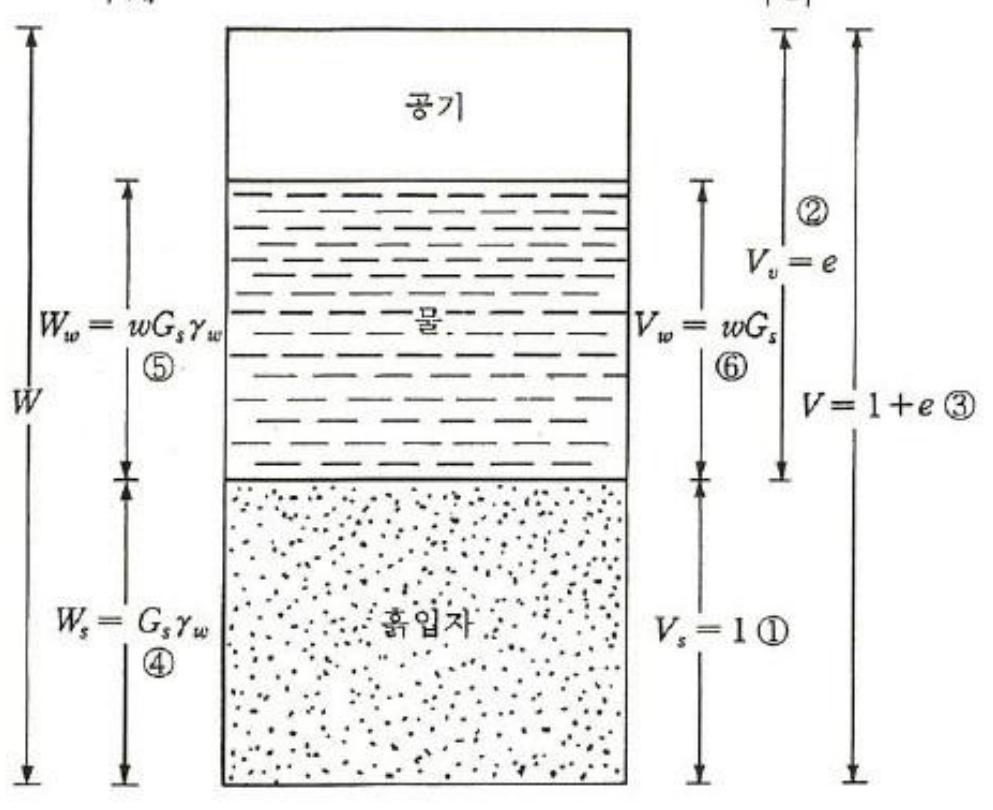
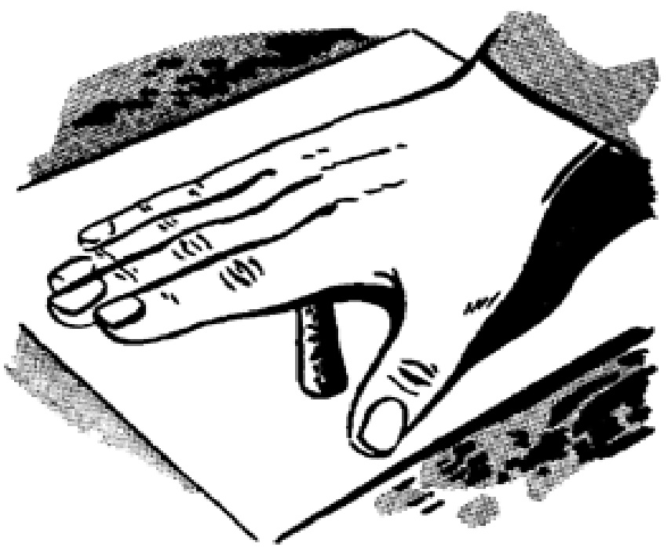
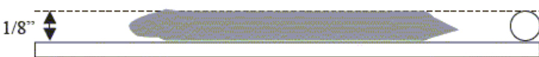

# 2. 흙의 기본적 성질  

  

# 화성암  

지하 깊은 곳에서 암석이 높은 열과압력을 받아 녹이 있는 것을 마그마.마그마가 지표로 흘러나와 식거나 지하 깊은 곳에서 식으면 단단한 암석이 되는데, 이처럼 마그마가 식어서 만들어진 암석을 화성암이라 함.  

  

# 1화산암  

마그마가지표부근에서 빨리 식어 굳어진 화성암결정이 자라는 시간이 짧아 암석을 이루는 결정의크기가 작다현무암 안산암 유문암  

# 심성암  

마그마가 지하깊은곳에서 천천히 식어 굳어진 화성암 결정이 자라는시간이 충분하여 암석을 이루는 결정의크기가 크다 반려암 섬록암 화강암  

# 화성암의 분류  

화성암은 암석의 색과 광물 결정의 크기에 따라 분류할 수 있음.  

암석의 색이 어두운 광물(휘석, 각섬석, 각람석)을 많이 포함할수록 어둡고, 밝은 색 광물(장석, 석영)을 많이 포함할 수록밝다. 광물 결정이작으면 화산암, 결정이 크면 심성암으로 분류.  

  

  

A: 결정의 크기가작고 어두운색을 띤다 $\longrightarrow$ 현무암 B: 결정의 크기가크고어두운색을 띤다 $\longrightarrow$ 반려암 [: 결정의 크기가작고 밝은 색을띤다 $\rightarrow$ 유문암 D: 결정의 크기가크고 밝은색을 띤다 $\longrightarrow$ 화강암  

#  

# 퇴적암  

지표에 있는 암석은 오랜 시간이 지나면서 잘게 부서짐. 부서진 암석은 강물이나 바람에 실려 운반되었다가 바다나 호수 바닥에 쌓여 퇴적물이 됨. 퇴적물은부서진 암석, 생물의 유해, 물에 녹아 있는 석회 물질 등 다양함. 이러한 퇴적물이오랜 시간 동안 다져지고 굳어져 만들어진 암석을 퇴적암이라 함.  

쌓임퇴적 굳어짐  

  
운반된퇴적물이쌓인다  

  
위에쌓인퇴적물의 무게때문에입자사이의간격이 좁아진다  

  

물속에녹아있던광물성분석회 물질등이퇴적물사이를채워퇴적물이굳는다  

퇴적암  

# 퇴적물의 특징  

층리: 종류와 색이 다른 퇴적물이 쌍이면서 평행하게 생긴 줄무늬를 층리라고 한다.  

  

화석: 과거에 살았던 생물의 유해나 흔적이 퇴적물과 함께 쌓여 암석 속에 남아 있는 것을 화석  

  

# 퇴적암의 분류  

퇴적암은 퇴적물의 크기에 따라 분류한다.  

  

퇴적암을 이루는 입자의 크기: 역암>사암>셰일  

퇴적물이 쌓이는 위치  

퇴적물의 입자의 크기가 작을수록 해안에서 멀리 운반되어 퇴적된다.  

->해안으로부터 거리(생성된 수심): 역암>사암>셰일  

  

암석이 높은 열과 압력을 받아 성질이 변하는 변성 작용으로 만들어진 암석. 변성 작용은 주로 마그마가 암석을 뚫고 지나갈 때, 지표의 암석이 지하 깊은 곳으로 들어갈 때 일어난다.  

# 변성암의 특징  

큰결정: 변성암은 원래의 암석보다암석을 이루는 광물 결정이 크다(규암, 대리암).엽리: 암석이 압력을크게 받을 때 압력의수직 방향으로 광물이배열되어 생기는줄무늬의 엽리가생긴다(편암, 편마암).  

  

# 변성암의 분류  

분류기준: 원래의 암석의 종류와 변성 정도에 따라 분류함.  

  

변성암의 종류  

$\textcircled{1}$ 편암: 세일이 열과 압력을 받아 만 들어진 변성암으로, 엽리가 나타 남.  

$\circled{2}$ 편마암: 화강암이나 편암이 높은 열과 압력을 받아 만들어진 변성 암으로, 결정의 크기가 크며 뚜렷 한 줄무늬인 엽리가 나타남.  

$\circled{3}$ 규암: 사암이 열과 압력을 받아 만 들어진 변성암으로, 사암에 비해 결정의 크기가 크고 치밀함.  

$\circled{4}$ 대리암: 석회암이 열과 압력을 받${}^{0}\mathrm{I}$ 만들어진 변성암으로, 석회암$011$ 비해 결정의 크기가 크고 단단함.  

# 2.1.1 풍화작용  

흙은 암반이 풍화되어 생성.  

풍화작용:  

$\circleddash$ 물리적 풍화작용(mechanical weathering)  

온도변화의 의하여 암반이 반복적으로 팽창 수축을 반복하여 쪼개져서 흙으로 변하는 과정  

$\textcircled{2}$ 화학적 풍화작용(chemical weathering)  

화학반응에 의하여 암반의 광물이 완전히 다른 광무로 바뀌면서 흙으로 풍화되는 것.  

# 2.1.2 잔적토  

암반이 풍화되어 그 자리에서 흙이 된 것 을 잔적토(residual soil).  

잔적토는 비록 풍화되어 흙이 되었지만 모암의 성분을 그대로 갖고 있 는 것이 일반적임.  

어느 경우에는 모암이 갖고 있던 전단대(shear zone)나 절리(joints) 부 근에서만 풍화가 되고 나머지 부분은 암괴로 남아 있는 경우가 많음.  

우리나라는 전국적으로 화강암(granite)과 편마암(gneiss) 특히 화강편마 암(granitic gneiss)이 편재해 있으며, 이 암이 풍화된 것이 화강풍화토임. 이 흙은 모래(sand)와 점토(clay)의 중간자적 성격을 띠며, 그 거동이 아 직도 완전히 규명되지 않은 상태임.  

# 2.1.3 퇴적토  

흙이 외부의 힘에 의하여 운반되어 다시 퇴적된 흙을 총칭하며 운반수 단에 따라 다음과 같이 분류된다.   
$\circleddash$ 충적토(alluvial soils): 강물의 의하여 운반되어 하상에 퇴적된 흙 $\textcircled{2}$ 풍화토(Aeolian soils): 바람에 의하여 운반된 흙  

$\circled{3}$ 빙적토, 빙하토(glacial soils): 빙하로 인하여 운반된 흙 빙쇄석(moraine): 빙하의 이동으로 직접 퇴적된 흙  

-호상점토(varved clay): 빙하의 녹은 물에 의하여 멀리 운반되어 퇴적된 흙으로, 여름에는 비교적 큰 흙이 퇴적되고, 겨울에는 작은 것이 퇴적되어, 몇 년을 두고 계속적인 교번퇴적으로 인하여 호상으로층을 이루고 퇴적된 흙.  

$\circled{4}$ 붕적토(colluvial soils): 흙 자체가 중력으로 움직여서 생성된 흙(예: 산 사태로 흙이 떠내려간 경우)  

$\mathsf{V}\mathrm{=}\mathsf{V}_{\mathrm{s}}\mathrm{+}\mathsf{V}_{\mathrm{v}}\mathrm{=}\mathsf{V}_{\mathrm{s}}\mathrm{+}\mathsf{V}_{\mathrm{w}}\mathrm{+}\mathsf{V}_{\mathrm{a}}$ $\mathsf{W}\!=\!\mathsf{W}_{\mathsf{s}}\!+\!\mathsf{W}_{\mathsf{w}}$$\mathsf{V}_{\mathsf{s}}{=}$ 흙 입자만의 부피 ${\mathsf{W}}_{\mathsf{s}}{=}$ 흙 입자만의 무게$\mathsf{V}_{\mathsf{W}}\mathsf{=}$ 물만의 부피 $\mathsf{W}_{\mathsf{W}}\mathsf{=}$ 물만의 무게  

$\mathsf{V}_{\mathsf{a}}\!=$ 공기만의 부피  

$\mathsf{V}_{\mathsf{v}}\mathsf{=}$ 간극의 부피로서 흙 입자를 제외한 부분의 체적  

  
자연상태의 흙  
6 이상화 시킨흙  

  
자연상태의 흙  

  
6 이상화 시킨흙  

# 2.2.1 부피에 관계되는 관계식  

간극비(void ratio): e  

$$
e={\frac{V_{v}}{V_{s}}}
$$  

$$
n={\frac{V_{v}}{V}}
$$  

간극률(porosity): n  

  

포화도(degree of saturation): S  

$$
S=\frac{V_{w}}{V_{v}}
$$  

  

자연상태의 흙  

6 이상화 시킨흙  

# 2.2.2 무게에 관계되는 관계식  

함수비(water content): w $w=\frac{W_{w}}{W_{s}}(\times100\%)$  

단위중량은 흙(soil matrix: 흙 입자 $^+$ 물+공기)비중: 흙 입자(soil soild)  

단위중량(unit weight):  

  

값  

# 2.2.3 Vs=1  

$$
\begin{array}{r l}&{\textcircled{1}\quad\times_{s}=1}\\ &{\textcircled{2}\quad\forall_{v}=\forall v_{s}=\in\textcircled{6}}\\ &{\textcircled{3}\quad\forall=\forall_{s}\div\nabla_{v}=1+\textcircled{6}}\\ &{\textcircled{4}\quad\forall s_{s}=\Gamma_{\Delta}\gamma_{S}=\ G_{S}\gamma_{w}}\\ &{\textcircled{5}\quad\mathsf{W}_{w}=\mathsf{W}_{\Delta}\gamma_{w}}\\ &{\textcircled{6}\quad V_{w}=\frac{W_{\Delta}}{\gamma_{w}}=\frac{W G_{S}\gamma_{w}}{\gamma_{w}}}\end{array}
$$  

  

𝑤𝐺𝑠  

# 단위중량  

# 건조단위중량  

# 포화도  

$\gamma=\cfrac{W}{V}=\cfrac{W_{s}+W_{w}}{V}$ 그림 22의 식 대입$=\frac{G_{s}\,\gamma_{w}+w\ G_{s}\,\gamma_{w}}{1+e}=\frac{\left(1+w\right)\,G_{s}\,\gamma_{w}}{1+e}$  

  

$S={\frac{V_{w}}{V_{v}}}={\frac{w\ G_{s}}{\cdot e}}$ 또는Se -- w G  

$$
\begin{array}{l}{\displaystyle\gamma=\frac{\left(1+w\right)\,G_{s}\,\,\gamma_{w}}{1+e}}\\ {\displaystyle=\frac{\left(G_{s}+w\,\,G_{s}\right)}{1+e}\,\gamma_{w}=\frac{\left(G_{s}+S e\right)}{1+e}\,\gamma_{w}}\end{array}
$$  

$\gamma_{t}=\frac{W}{V}\!=\!\frac{(1\!+\!w)G\gamma_{w}}{(1\!+\!e)}$   
d- - GYw 으- Giw - j [+e 1d   
$\gamma_{s a t}=\frac{G\gamma_{w}+e\gamma_{w}}{(1+e)}=\frac{(G+e)}{(1+e)}\gamma_{w}$ Saturated Unit weight   
$\gamma_{s u b}(o r\gamma^{'})=\gamma_{s a t}-\gamma_{w}=\frac{(G-1)}{(1+e)}\,\gamma_{w}\,;$ Submerged Unit Weight   
S-- 개를 Se - WG [f S-10 fully saturated eEwG]  

# 2.3 흙의 성질은 나타내는 요소  

사질토: 흙 입자의 크기, 즉 입도분포  

점성토: 광물조직  

  

2.3.1 상대밀도  

  

$D_{r}\,{=}$ 상대밀도100%  

$e=$ 주어진 흙의 간극비  
$e_{\mathrm{max}}=$ 주어진 흙이 가장 느슨한 상태일 때의 간극비  
$e_{\mathrm{min}}=$ 주어진 흙이 가장 조밀한 상태일 때의 간극비  
$\gamma_{d}=$ 주어진 흙의 건조단위중량  
$\gamma_{d(\mathrm{{max})}}=$ 주어진 흙의 가장 밀한 상태에서의 건조단위중량  
$\gamma_{d(\mathrm{min})}=$ 주어진 흙의 가장 느슨한 상태에서의 건조단위중량  

#  

gd(min): 다짐몰드(부피2830cm3=0.11ft3)에 사질토를 1”(2.54cm) 높이에서살살 떨어뜨렸을 때의 건조밀도  

gd(max): 다짐몰드에 사질토를 넣고 진동을 주어 아주 밀한 상태를 인위적으로 만들었을 때의 건조밀도  

<사질토의 상대밀도와 조밀도>  

  

# 2.3.2 연경도  

solid $\rightarrow$ semisolid $\rightarrow$ plastic $\rightarrow$ liquid  

# Atterberg limit  

Shrinkage limit: 고체상태에서 반고체상태로 넘어갈 때의 함수비Plastic limit: 반고체상태에서 소성상태로 넘어갈 때의 함수비Liquid limit: 소성상태에서 액체상태로 넘어갈 때의 함수비  

  

  

# Liquid limit, LL  

  

낙하횟수  

# Plastic limit, PL  

# 3.0mm의 직경.  

  

  

  

THREAD ABOVE THE PLASTIC LIMIT  

  

THREAD AT THE PLASTIC LIMIT  

  

$$
P I{=}\;L\,L{-}\,P L\,.
$$  

Non-plastic soils - NP; eg sand  

  

# Liquidity index, LI  

$$
L\,I{=}\;\frac{w-P L}{L\,L-P L}=\frac{w-P L}{P L}
$$  

› LI > 1: 현장 흙이 액체와 같은 상태› $0\,\leq\,\lfloor\!\rfloor\,\leq\,1;$ 현장 흙이 소성상태› $\sqcup<0;$ 현장 흙이 고체상태를 띠고 있는 상태  

The water content at which there is no further volume change.  

  

# Activity  

$$
A=\frac{I_{P}}{\stackrel{\circ}{\rho}_{0}<2\mu m}
$$  

The 'A' value is dependent Upon the type of clay minerals in each Soil  

eg kaolinite $\mathsf{A}=0.5$ illite $A=0.5-1.0$ Smectites $A=1-7.$ |  

  
%<2]  

흙이 소성상태를 띠는 것은 점토 입자에 붙어 있는 흡착수 때문.  

어는 점토의 광물성분이 일정하다면 소성지수는 점토의 함량에따라 비례적으로 증감함.  

montmorillonite $>$ illite $>$ kaolinite  

$\textcircled{1}$ A-line: 점토와 실트(또는 유기질 점토)의 경계선  

$\textcircled{2}$ U-line: upper bound로서 이 이상의 소성지수를 가진 점토는 지구상에없다.  

$\circled{3}$ 액성한계 $\mathrm{{LL}\mathrm{{>}}~50;}$ 큰 압축성 흙 $30<\,\mathsf{L L}\,\leq\,50;$ : 중간 압축성 흙 LL ≤ 작은 압축성 흙  

  
액성한계 $\%$  

  
액성한계1%  

# 2.4 흙의 구조  

흙의 구조란 흙 입자가 배열된 상태를 말하며 사질토인 경우는 흙입 자의 크기와 모양이 구조를 지배하나, 점성토는 이와 함께 구성광물, 흙을 둘러싸고 있는 물의 성질에 따라 흙의 구조가 달라짐.  

# 2.4.1 사질토의 입자구조  

사질토는 흙 입자 하나하나가 모여서 된 구조로 단일입지구조(single grained structure)가 주종.  

가끔은 사질토라도 물을 약간머금었을 때, 입자 사이의 수막에 작용하는 표면장력으로체적이 증가하고 느슨한 상태 곡벌집 같은 상태도 될 수도 있으며이를 벌집구조(honeycombed structure)라 함.  

벌집구조는 단일구조에 비하여 느슨하며, 간극도 크다.  

  

# 2.4.2 점토의 입자구조  

점토의 입자구조는 흙 입자의 크기나 모양보다는 점토광물 특성과점토 주위의 이중충수(double layer water)의 특성에 따라서좌우됨.  

반발력(repulsive force): 점토표면은 음이온을 띠고, 이중층수의 양이온으로 평형을 이룸. 만일 두 점토입자가 근접해 있다면 양이온인 이중층수로 인하여 반발력이 작용하며, 이중층의 두께가크면 클수록 반발력은 커질 것이다.  

인력(attractive force): 두 입자 사이에는 Van der Waals힘이 작용되며, 이는 인력으로 작용됨.  

이산구조(dispersive structure): 점토의 이중층수의 반발력이 우세하여 모든 입 자가 떨어져 있는 구조.  

면모구조(flocculant structure): 점토의 모서리와 면 사이의 강한 인력과 Vander Waals 인력에 의하여 입자들이 붙어서생성된 구조.  

염분의 영향: 해성점토에는 염분이 존재하며, 이 염분은 이중층수의 두께를 감소시키는 역할을 함.  

  

# ※ 점토광물과 물의 상호작용  

주로 동형치환 작용에 의하여 점토표면은 음(-)이온을 띠고 있음.  

점토가 물에 잠길 경우, 점토 주위에 편재해 있는 Ca+2, Mg+2, Na+, K+등의 양이온이점토표면에부착하며, 물의 양극과 음극의 dipole 현태로 있으므로 물의음이온이 위의 양이온에 붙게 됨.  

또는 dipole의 양이온이 점토표면으로 음이온에 직접 부착하게 됨.  

또는 물분자의 수소원자와 점토표면에 있는 산소가 수소결합(hydrogen bonding)으로 붙게 될 수 있음.  

따라서 점토표면의 근처에 존재하는 물은 자유로이 움직일 수 없게되며, 이로인하여 점토 주위에 있는 물을 이중층수(double-layer water0라고 하며 점토가까이에 완전히 점토와붙어있는 물을 흡착수(absorbed water)라고 함.  

  

  
물의 Dipole 현상  

  
이중층에서 물의 흡착  

  
점토로부터의 거리와 이온농도  