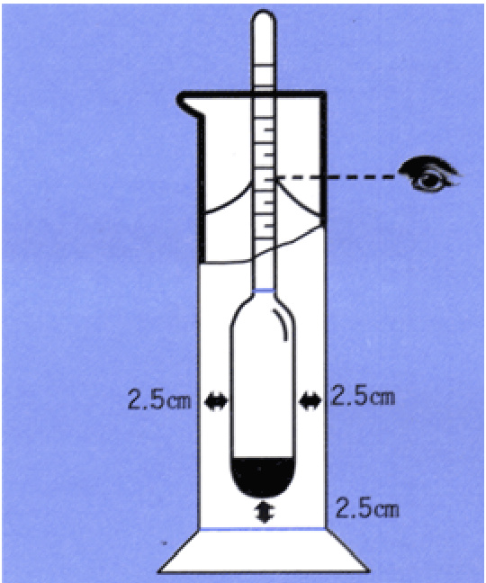

# 토질및기초공학  

Chapter 2. 흙의 기본적 특성  

박성직  

# 1. 입경  

# 크기(입경)에 따른 분류  

흙입자는 크기에 따라 자갈, 모래, 실트, 점토 등으로구분 흙입자가 비교적 굵은자갈, 모래를 조립토(coarse soil) 또는사질 토(granular soil)라고 하며, 흙입자가 비교적 가는 실트나점토를 세립토(fine soil)  

  

1 Unified Soil Classification System   
2 American Association of State Highway and Transportation Officials   
3 Massachusetts Institute of Technology   
4 American Society for Testing and Materials   
5 US Department of Agriculture USDA  

# 1. 입경  

# 입경의 결정  

체분석(sieve analysis) 0.075mm 이상의 입경을 결정 하는데사용. 굵은체와 가는체를 위에서부터 아래로 포개어놓고 흙을 넣어흔든다음, 각체를 통과한 흙의 무게를 계량하여 전체의 무게로나눈다. 이렇게 결정된 비율은임의 체에 남아있는 흙의입경보다 더 가는입경의 흙 전체에 대한 통과중량백분율  

비중계 분석(hydrometer analysis) 0.075mm(# 200체)이하의입경 결정에 사용. 구(sphere)를 물에 떨어뜨렸을 때의 침강속도(𝑣𝑣)는 그 구의 직경의 제곱에 비례한다는 Stokes의 원리를 이용  

$$
v=\frac{\rho_{s}-\rho_{w}}{18\eta}d^{2}
$$  

# 1. 입경  

# 체분석  

체분석에 주로 사용하는 표준체는 4, 10, 20, 40, 60, 100, 200번체이며, 체 번호는 1inch( ${\mathrm{=}}2$ .54cm) 안에 포함된 체눈의수  

  

  

  

체분석 결과예시  

체진동기  

체의 번호와 체눈의 크기  

# 1. 입경  

# 비중계분석  

진공 속에서 낙하하는 물체의 속도는시간에 따라증가하지만, 물속에서 침강하는 흙입자의 속도는 마찰저항 때문에점차일정흙입자의 침강속도는 흙입자의 크기, 무게 등에따라 다르며, 흙입자를 구라고 가정하면 흙입자의 침강속도는 Stokes의 법칙을 따름  

$$
v=\,\frac{\gamma_{s}-\gamma_{w}}{18\,\eta}D^{2}
$$  

여기서 $\gamma_{s}=$ 흙입자의 단위중량$\gamma_{w}=$ 물의 단위중량$\eta=$ 물의 점성계수${\cal D}\,=$ 흙입자의 직경입경  

  

# 1. 입경  

# 입도분포곡선  

체분석과 비중계분석의 결과들을 반대수용지(semi-log graph) 위에 점으로 표시하고 이 점들을 연결한 곡선  

  

  

# 1. 입경  

# 입도분포곡선  

  

곡선 Ⅰ 대부분의 흙입자들의크기가거의 비슷한흙으로서, 이런흙을입도불량한흙(poorly graded soil) 또는입도 균등한 흙  
곡선 Ⅱ: 흙입자들의크기가넓은범위에걸쳐있는흙으로서, 크고작은흙입자가골고루섞여있으므로입도양호한흙(well graded soil)  
곡선Ⅲ: 중간크기의흙입자가없어서중간부분이수평에 가까운 분포를나타내는흙으로서, 이런형태의입도분포를 계단식입도 또는 결손분포(gapgraded)  

# 1. 입경  

유효경(D10)  

유효경 또는 유효입경은 통과율 10%에해당하는 흙입자의 직경  

균등계수(uniformity coefficient)  

  

곡률계수(coefficient of curvature, gradation)  

  

# 2. 비중  

# 비중(specific gravity, G )  

어떤'물체의'중량 어떤'물체의 단위중량비중=같은 부피의물의중량 물의 단위중량  

흙입자의 비중 (Gs)  

어떤흙입자의 중량 흙입자의 단위중량% G-같은 부피의 물의 - 중량 물의 단위중량 Yw  

# 2. 비중  

  
비중 실험  

  

# 3. 흙의 각 성분 사이의 관계  

# 구성요소의 부피  

$V\!=\ V_{s}+V_{v}=\ V_{s}+V_{w}+V_{g}$  

  

  

# 3. 흙의 각 성분 사이의 관계  

간극비(void ratio)와 간극률(porosity)  

  

포화도(degree of saturation)  

$$
S=\frac{\frac{\sum_{\alpha}\phi\gimel\ g}{\sum_{\alpha}\phi\ g}\ g\ g\ g}{\frac{\sum_{\alpha}\phi\ g}{\sum_{\alpha}\phi\ g}\ g\ g\ g}\ g_{\alpha}
$$  

# 3. 흙의 각 성분 사이의 관계  

# 예제 2.3  

그림 2-66에서 흙입자의 부피가 10em' 물의 부피가4cm' 공기의 부피가 $\operatorname{lcm}^{3}{\bar{\mathbf{o}}}\,]$ 다 이 흙의 간극비 간극률 포화도를 구하라  

# 3. 흙의 각 성분 사이의 관계  

# 구성요소의 무게  

$$
{\cal W}=\mathrm{\it~W_{s}+\mathrm{\it~W_{w}}}
$$  

여기서 $W{=}$ 흙전체의 무게 $=$ 젖은 흙의 무게  

$W_{s}=$ 흙입자의 무게 $=$ 마른 흙의 무게  

$W_{w}=$ 물의 무게  

  

# 3. 흙의 각 성분 사이의 관계  

함수비(water content, moisture content)  

$$
w~=~\frac{\frac{\pi}{\Xi}\odot}{\frac{\bar{\Xi}}{\Xi}\odot}\sharp\stackrel{\leftrightarrow}{\longrightarrow}\sharp\mathcal{A}\subsetneq\mathcal{W}_{w}
$$  

함수율 w′흙전체 무게 W 에 대한 물 무게 WW의 비토질역학에서는 함수율을 거의 사용하지 않음  

물의 무게W 1'- 흙전체의 무게 |  

# 3. 흙의 각 성분 사이의 관계  

전체단위중량(total unit weight, γt)/습윤단위중량(moist unit weight, γwet)  

흙전체의 무게 W 4= 흙전체의 부피 [  

건조단위중량(dry unit weight, γd)  

흙입자의 무게 W = 흙전체의 부피 V  

- $\cfrac{W}{V}=\cfrac{W_{s}+W_{w}}{V}=\cfrac{W_{s}\left[1+\cfrac{W_{w}}{W_{s}}\right]}{V}=\cfrac{W_{s}\left(1+\cfrac{W_{w}}{V}\right)}{V}$Y--- -= 1+w  

  

# 3. 흙의 각 성분 사이의 관계  

# 예제 2.4  

예제23에서 흙입자의 무게가 $25\mathrm{g}^{5}\mathrm{\textcircled{=}}$ 때 이 흙의 함수비 전체단위중량 건조단위중량을구하라  

# 3. 흙의 각 성분 사이의 관계  

# 예제 2.5  

자연상태에서 흙전체의 부피가 $\mathrm{\bar{9}c m^{3}0^{4}}$ 며무게는 $18\mathrm{g}^{\mathrm{i}\mathrm{j}}|$ 고 이것을 건조시킨 무게는 $15\mathrm{g}0\mathrm{7}$ 다 흙입자의 비중 $G_{5}$ 가27일 때 이 흙의 함수비 전체단위중량 건조단위중량 간극비 간극률그리고 포화도를구하라  

# 3. 흙의 각 성분 사이의 관계  

# 포화도, 간극비, 함수비, 비중 사이의 관계  

간국의 부피 $V_{v}=V_{s}\,e=e$  
물의 부피 $V_{w}=V_{v}\;s=e\;S$  
흙전체의 부피 $V\!=\!\ V_{s}+V_{v}=1+e$  
흙입자의 무게 $W_{s}=\gamma_{s}\,V_{s}=\gamma_{w}G_{s}\,V_{s}=\gamma_{w}G_{s}$  
물의 무게 $W_{w}=\gamma_{w}\,V_{w}=\gamma_{w}\,V_{v}\,S\!=\gamma_{w}\,V_{s}\,e\,S\!=\gamma_{w}\,e\,S$  

여기서 $\gamma_{s}=$ 흙입자의 단위중량$\gamma_{w}=$ 물의 단위중량$G_{s}~=$ 흙입자의 비중  

  

# 3. 흙의 각 성분 사이의 관계  

포화도, 간극비, 함수비, 비중 사이의 관계  

$$
\frac{W_{w}}{W_{s}}\!=\!\frac{\gamma_{w}\;e\;S}{\gamma_{w}\;G_{s}}\!\!=\!\frac{e\;S}{G_{s}}\qquad S e=G
$$  

흙의 전체단위중량  

  

건조단위중량  

  

# 3. 흙의 각 성분 사이의 관계  

포화단위중량(saturated unit weight of soil, γsat)  

$$
\gamma_{s a t}=\frac{G_{s}+e}{1+e}\,\gamma_{w}
$$  

수중단위중량(submerged unit weight, γsub)  

= ${\mathrm{\Sigma}}_{a t}-{\mathrm{\Sigma}}_{\gamma}{\mathrm{=}}\ {\frac{G_{s}+e}{1+e}}\,\gamma_{w}-\gamma_{w}=\ {\frac{G_{s}-}{1+e}}$  

포화단위중량 > 전체단위중량 > 건조단위중량 > 수중단위중량의관계  

# 3. 흙의 각 성분 사이의 관계  

# 예제 2.6  

간극비 $\varepsilon=0.7$ : 함수비 $w=25\%$ 흙입자의 비중 $G_{\mathrm{r}}=2,65_{\mathrm{~l~}}$ 긴흙의 간극률 $\pi$ : 포화도 $S_{i}$ '전체단위중량 $\gamma$ : 건조단위중량 $\gamma_{\vec{\eta}}$ : 포화단위중량 $\gamma_{p,+}$ : 수중단위중량 $\gamma^{\prime}$ 을 구하라  

# 3. 흙의 각 성분 사이의 관계  

# 예제 2.7  

포화된 흙의 함수비가 $20\%07$ 고 이흙을 건조시켰을 때의 건조단위중량이 $1.65\mathrm{t/m^{3}0}$ 다 다음을 구하라  

1 흙입자의 비중 $G_{s}$ 2 간극비 E 3 포화단위중량 Isat  

# 3. 흙의 각 성분 사이의 관계  

# 상대밀도(relative density, Dr)  

$$
D_{r}=\frac{e_{m a x}-e}{e_{m a x}-e_{m i n}}\times\,100(\%)
$$  

여기서 $e=$ 현재 간극비 = 어느 흙의 자연상태에서의 간극비  

$e_{m a x}=$ 최대간극비 = 어느 흙의 가장 느슨한 상태에서의 간극비$e_{m i n}\;=$ 최소간극비 = 어느 흙의 가장 조밀한 상태에서의 간극비  

$$
D_{r}=\ \frac{\gamma_{d}-\gamma_{d\,m\,i n}}{\gamma_{d\,m\,a x}-\gamma_{d\,m\,i n}}\,\frac{\gamma_{d\,m\,a x}}{\gamma_{d}}\times\,100(\%)
$$  

여기서I -어느흙의 자연상태 $(e)$ 에서의 건조단위중량  

Idmin = 어느 흙의 가장 느슨한 상태 $(e_{m a x})$ 에서의 최소건조단위중량  

Idm ar - 어느 흙의 가장 조밀한 상태 $(e_{m i n})$ 에서의 최대건조단위중량한o네교 오 랫동 안 리 ㄴ 사 람 | 마 침내 : ? 닮아 '[ : 드레 말 로  

# 3. 흙의 각 성분 사이의 관계  

# 상대밀도(relative density, Dr)  

# 조립토를 가장 느슨한 상태  

모래의 가장 느슨한 상태를 만드는 방법은낙하높이 약25.4 mm(1 in)를 유지하면서모래를살며시자유낙하시켜부피2,830 cm3(0.1 ft3)의 몰드를 가득 채우  

$$
\gamma_{d m i n}=\frac{W_{s}}{V_{m}}
$$  

여기서 $\mathrm{W_{s}}=$ 몰드를 채우는 데 필요한 모래의 무게 $V_{m}=$ 몰드의 부피  

# 가장 조밀한 상태  

몰드를채운 모래의 윗면에 0.14 kg/cm2(2lb/in2)의 상재하중을 가하고, 주 파수3,600 cycles/min, 진폭0.635mm(0.025 in)인 진동대 위에 몰드를 놓고서8분간진동 상대밀도% 흙의 상태  

# 3. 흙의 각 성분 사이의 관계  

# 예제 2.8  

어느 모래의 현재 상태의 간극비가 06이다 이 모래를 가장조밀한 상태로 만들면 간극비가03이고 가장느슨한 상태로 만들면 간극비가08이다 이모래의 현재 상태에서의 상대밀도를구하라  

# 3. 흙의 각 성분 사이의 관계  

# 예제 2.9  

현장 흙의 단위중량을 구하기 위하여 부피 $500\mathrm{cm}^{3}\mathrm{\Omega}^{\mathrm{\Omega}}$ 구멍에서 파낸 젖은흙의 무게가 $900\,\mathrm{g}\,\mathrm{c}^{\circ}]$고 건조시킨 후의무게가 $800\mathrm{g}0\mathrm{1}$ 다 건조한 흙 400g을몰드에가장 느슨한 상태로 채운 부피가 $280\mathrm{cm}^{3}\mathrm{c}^{7}$ 고 진동을 가하여 조밀하게 다진 후의 부피는 $\mathrm{210cm^{3}\,\Omega}$ 다 흙입자의 비중 $G=$27이다 이 흙의 상대밀도를 구하라  

# 4. 아터버그한계  

# 흙의 연경도(consistency)  

점토는함수비가매우작은 상태에서는 마치 고체덩어리처럼 거동하며, 함수비가증가하면 소성이 커지고, 함수비가더욱증가하면흙탕물과같은 액체상태  

소성이란 흙이 하중을 받아 변형이 생긴 후, 하중을제거하여도 원래의 상태로 회복되지 않는성질  

  

# 4. 아터버그한계  

# 액성한계 시험  

1. 40번체(체눈크기0.42mm)를 통과한흙에물을 가하여 반죽하고, 황동제 접시에흙시료를 수평하게 채운다(그림2-9(b)).  

2. 표준 홈파기날을 이용하여 흙시료 중앙에홈을 판다(그림 2-9(c), (d)),  

3. 손잡이를 회전시켜 황동제접시를 10mm 높이에서 고무판에떨어지도록한다.이렇게여러번 낙하시킨 후홈 중앙의 밑부분이 13mm(0.5in) 정도 맞닿을 때의낙하횟수N과맞닿은 부분의흙시료의 함수비w를 측정한다(그림 2-9(d)).  

4. 같은흙에 대하여 함수비를 변화시켜 가면서 최소한네 번의 실험을 실시한다.  
이때낙하횟수N이 15\~35회 범위안에오도록한다.  

5. 흙의함수비w와그에해당하는 낙하횟수 N를 반대수용지(semi-log graph)위에점으로 표시한다(그림2-10). 이 점들을 연결하면 $\mathbf{W^{2}}\mathbf{I}$ logN사이의 관계는거의 직선으로 그려지며, 이 직선을 유동곡선(flow curve)이라고 한다.  

6. 유동곡선에서 낙하횟수 $N{=}25^{\circ}$ 해당하는 함수비가그흙의액성한계 LL이다.  

# 4. 아터버그한계  

# 액성한계 시험  

  

  
그림 2-10 유동곡선  

  

# 4. 아터버그한계  

# 액성한계 시험  

액성한계시험에서 여러 번의 낙하시험을 하는대신에 간편하게 낙하시험을 한 번만 실시하여 액성한계를 구하는방법을 일점법(onepoint method)이라고 하며, 다음과 같은식을이용. 이때낙하횟수N이 20\~30 범위에 있어야함.  

$$
L L=w_{N}\,(\frac{N}{25})^{\tan\beta}\ \stackrel{!}{=}\ w_{N}\,(\frac{N}{25})^{0.12}
$$  

여기서 $N\!=$ 흙시료의 홈 중앙의 밑부분이 $13\mathrm{mm}$ 맞닿을 때의 낙하횟수$w_{N}=$ 낙하횟수 $N\circ\parallel$ 해당하는 함수비$\tan\beta=0.12$  

액성한계가 큰 흙은 물을 많이 흡수할 수 있으므로 압축성이 큼점토함유량이 많을수록, 유기물함유량이증가할수록 액성한계 큼  

# 4. 아터버그한계  

# 소성한계 시험  

유리판에 잘 반죽된 흙을 놓고 손바닥으로 굴려함수비를 감소시키면서 흙실(국수가락 모양)을 만든다. 이 흙 실의 지름이 3mm가되어토막토막 부서지기시작할 때의 함수비를 측정하여 소성한계를 결정  

  

그림 2-12 소성한계 시험  

유기물함유량의 증가에 따라 커지며, 점토광물의 차이에 따른 소성한계의 변화폭은 액성한계의 변화폭에 비해 매우 작음  

# 4. 아터버그한계  

# 비소성(non plastic, NP)  

점토함유량이 적은 흙에서는 앞의 방법에 의해 액성한계나 소성한계  
를 구할 수 없는 경우  
또한 소성한계가 액성한계보다 큰 경우흙  

여러 및 점토광물의 액성한계와 소성한계  

  

# 4. 아터버그한계  

# 수축한계 시험  

수분이 어느정도 적어지면 수분이 더 감소하더라도 부피가더 이상줄어들지 않는평형상태에 도달할 때의 함수비를 수축한계  

시험 방법1. 직경44.4mm, 높이12.7mm인 유리그릇속에물로포화된흙을 가득채우고, 젖은흙의 무게W1와부피V1를측정하여함수비w를 구한다.2. 젖은흙을 노건조시킨 후마른흙의무게W2를측정한다.3. 유리그릇에수은을채워서마른흙의부피 $\mathsf{V}_{2}$ 를측정한다.4. 다음식으로 수축한계SL를구한다. $S L=w-\frac{V_{1}-V_{2}}{W_{2}}{\times}100\$  

  

  
6 말린후  

여기서 $w=$ 젖은 흙의 함수비 $(\%)$$V_{1}=$ 젖은 흙의 부피$V_{2}=$ 마른 흙의 부피$W_{2}=$ 마른 흙의 무게  

# 4. 아터버그한계  

# 예제 2.10  

점토에 대하여 수축한계 시험을 한 결과가 다음과 같을때'이 점토의 수축한계를 구하라   
젖은 흙의 무게 $W_{1}=33.8\mathrm{g}$ 젖은 흙의 부피 $V_{1}\,{=}\,23.1\mathrm{cm}^{3}$   
마른흙의 무게 $W_{2}=17.3\mathrm{g}$ 마른 흙의 부피 $V_{2}\,{=}\,13.5\mathrm{cm}^{3}$  

# 4. 아터버그한계  

소성지수(plasticity index, PI)액성한계와 소성한계의 차이흙의 소성지수가 클수록 소성이 크다 하며 압축성이 커짐$P I{=}\,L L{-}P L$  

수축지수(shrinkage index, SI)소성한계와 수축한계의 차이  

SI= PL-SL  

액성지수(liquidity index, LI)  

$L I\!=\!\frac{w-P L}{L L-P L}\!=\!\frac{w-P L}{P L}$ 여기서 $w=$ 자연상태 흙의 함수비  

# 4. 아터버그한계  

연경지수(consistency index, CI)  

$$
C I^{=}\frac{L L-w}{L L-P L}{=}\frac{L L-w}{P I}
$$  

유동지수(flow index, FI)  

$F I{=}\frac{w_{1}-w_{2}}{\log N_{2}-\log N_{1}}{=}\frac{w_{1}-w_{2}}{\log\frac{N_{2}}{N_{1}}}$ 여기서 $w_{1}=$ 낙하횟수 $N_{1}$ 에 해당하는 흙의 함수비 $(\%)$$w_{2}=$ 낙하횟수 $N_{2}$ 에 해당하는 흙의 함수비 $(\%)$  

강도지수(toughness index, TI) 소성지수를 유동지수로 나눈 값 $T I\!\!=\!\frac{P I}{F I}\!\!=\!\frac{L L-P L}{F I}$  

# 4. 아터버그한계  

# 예제 2.11  

어느 흙의 액성한계 LL이 $80\%$ 소성한계 PL이 $30\%$ : 수축한계 $S L$ 이10%일때 이 흙의 소성지수 PI 수축지수 SI를 구하라  

# 5. 흙의 기타 특성  

# 비표면적(specific surface)  

어떤 물체의 표면적을 질량으로 나눈 값  

  

# 5. 흙의 기타 특성  

# 활성도(activity)  

일반적으로 다른 물질을 흡착하거나 물리적, 화학적으로 결합하려는성질의 크기  

활성도가 크면 수분의 함량변화에 따른체적의 수축팽창이 크게 발생흙입자의 크기가 작을수록 비표면적이 커져 물을 많이 끌어 들이므로,흙의 활성은 점토에서 뚜렷  

소성지수점토의 활성도(𝐴𝐴) = 2𝜇𝜇𝑚𝑚보다 가는입자의 중량 백분율  

표 27 점토광물의 활성도  

  

# 5. 흙의 기타 특성  

# 비화작용(slaking)  

건조한 고체상태의 점토에갑자기물을 가하면, 점토입자 사이의 결합력이 약해져  
서 점토가 붕괴되는 현상  
소성상태의 점토에서는 비화현상이 일어나지 않음  
사질토층에서 다짐공사를 할 때 건조된 점토를 가해서 혼합한 후에물을 가하면서  
다짐을 하면점토가비화하여 흙입자를 서로 결합시켜 다짐이 단단하게 잘 됨  

팽창작용(bulking)  

흙의부피가팽창하는현상  
흙입자의 간극에물이들어가 표면장력이 발생해서 흙입자사이가벌어져서일시  
적으로 부피가증가  

# 5. 흙의 기타 특성  

# 함수당량  

흙속의 간극수는 흙입자가 작을수록 흡착수나 모관압력 때문에 자연증발이나 강제 탈수가어려워짐  

원심함수당량(centrifuge moisture equivalent, CME)은물로포화된흙에중 력의 1,000배와 같은 원심력을 1시간 동안 가한 후의흙의 함수비  

현장함수당량(field moisture equivalent, FME)은젖은흙의 매끄러운 표면에한 방울의 물을 떨어뜨렸을 때 30초 동안 흡수되지 않고퍼져나가는 경우, 이흙의함수비  